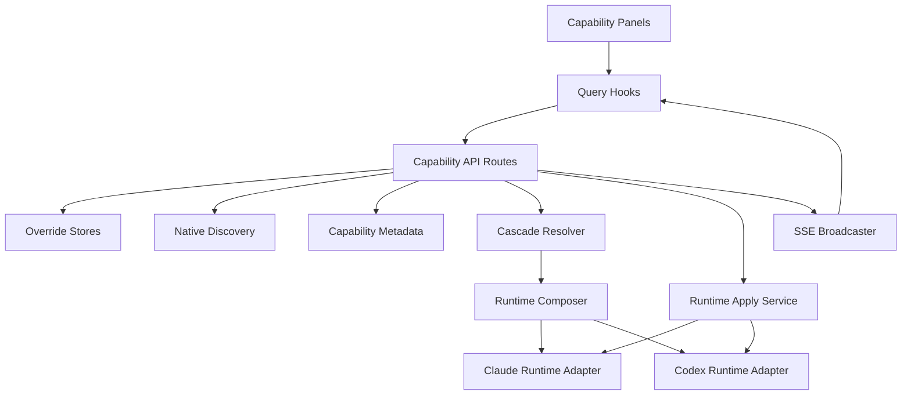
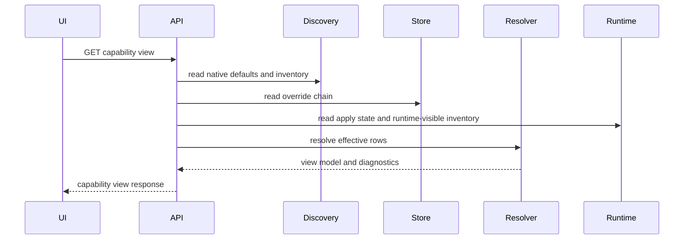
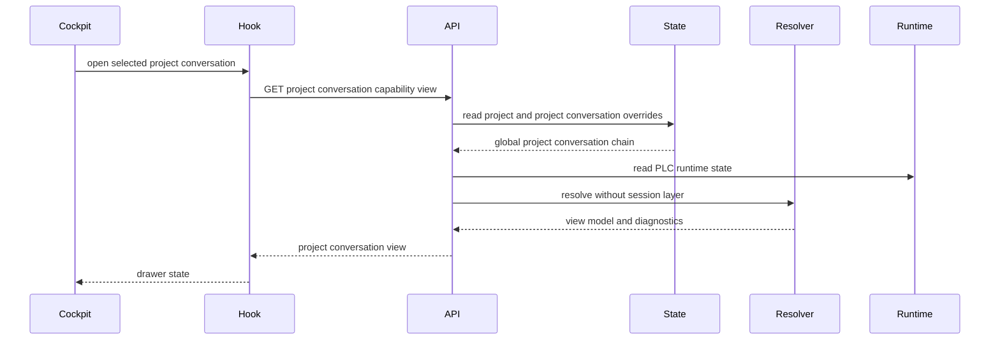
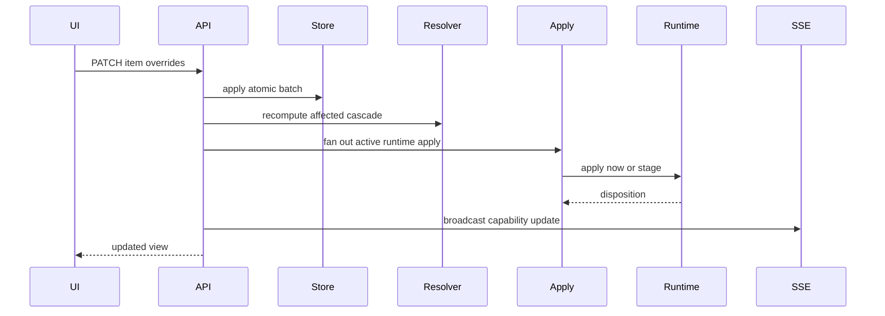
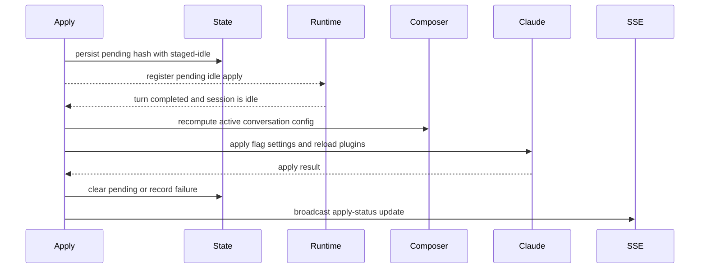
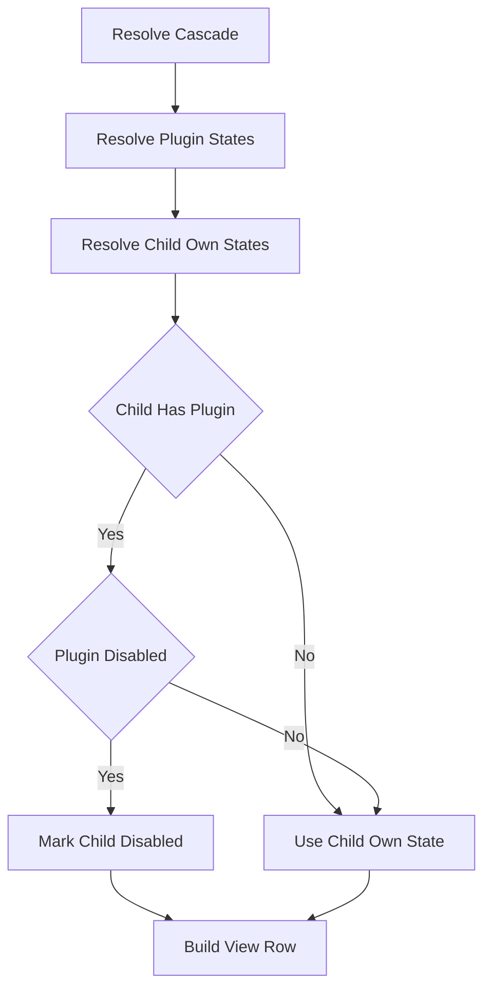
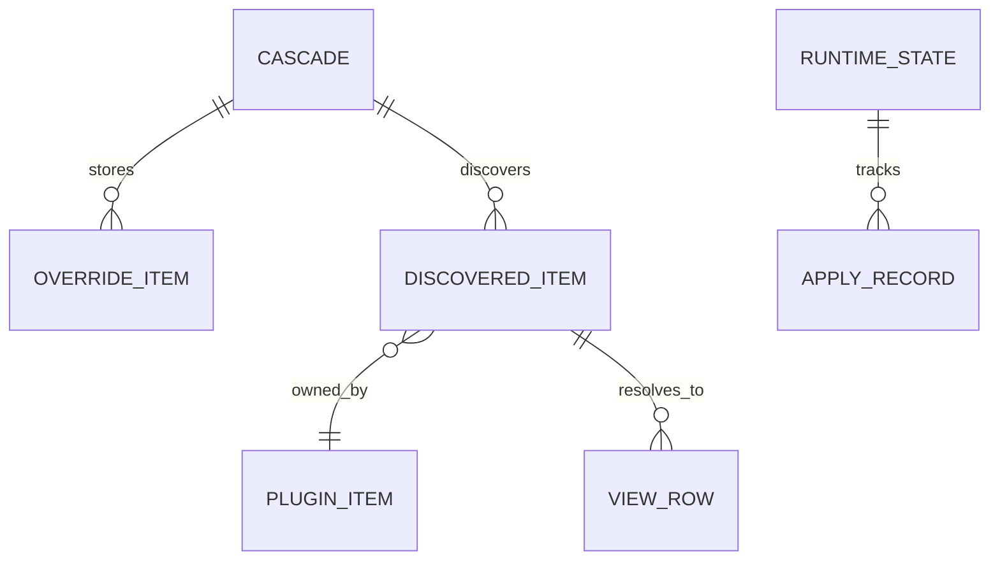
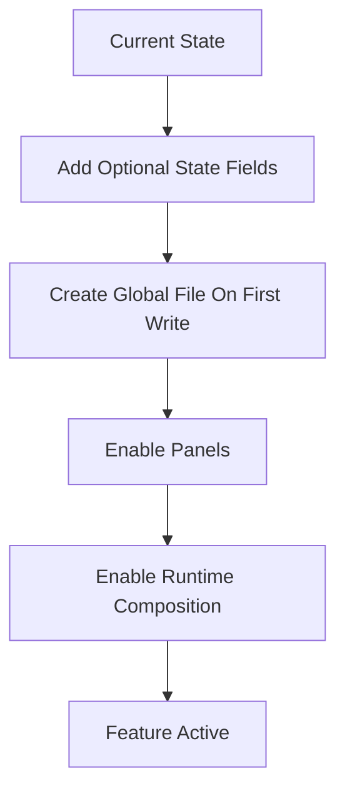

# Design: Agent Capabilities Configuration

## Approved managed-capabilities amendment — 22 September 2026

Alex's **“Approved. Implement the design.”** in conversation `3526f6a0-a0a8-4406-8539-e4275afdcd81` authorizes the [revised proposal](../../../docs/reports/2026-09-22-managed-capabilities-design-proposal.md). This section and the amended [requirements](requirements.md) govern the current delivery. Later sections preserve the earlier implementation baseline only where consistent with this amendment; this records no new Spec Studio gate and leaves historical approval records unchanged.

| Earlier design promise | Approved replacement |
|---|---|
| Claude Idle Drain Apply; `staged-idle`; idle transition callback | Save immediately and request supported updates at turn start. Remove idle-only scheduling after equivalent coverage. Explicit next-conversation exceptions remain. |
| Native discovery and provider metadata in the shared capability domain | One descriptor discovery facet exposes a small neutral catalog; adapters own native readers, defaults, identifiers, relationships, settings, delivery, and support. Shared code resolves scope and tracks acceptance. |
| Timing-based seed promotion / constructed settings imply applied | Successful runtime application or exact-configuration acceptance is the receipt. Keep per-kind applied/pending state and MCP acceptance separate; stale receipts cannot clear newer intent. |
| Every available item has an effective individual toggle | Unsupported individual controls are read-only, saved preferences remain resettable, and useful capability delivery remains available. |
| Five panels as an exhaustive backend list | Retain registered cascades, the existing drawer, backend and scope selectors, and Cursor's current delivery. Defer Codex agent controls. |

The descriptor catalog carries opaque source-specific identity, capability kind, display name, source, native default, optional owner, and semantic control support. It does not import capability API schemas. Move provider discovery beneath adapters and replace the shared dispatch table with descriptor lookup. Put Cursor delivered-selection snapshot access behind the same facade and expose whether its neutral selection is complete. Shared code never interprets provider formats or snapshot paths.

Inventory includes disabled items and disabled-plugin children. Child defaults are independent of parent suppression; re-enabling a plugin restores each child's own preference. Reuse the complete Codex native skill catalog, keeping disabled entries and merging explicit selector changes with unrelated native selectors. Stable source identities distinguish same-name sources across equivalent worktrees. Carry stored keys through an unambiguous one-time source mapping when possible; unmatched preferences stay visible as missing sources. Claude uses one effective plugin-settings reader/composer, including project/local settings and host-bundle suppression at every application point.

Turn-start scheduling changes when delivery is attempted, not how adapters apply it. Preserve active runtimes and background work. Cursor may accept MCP while keeping frozen capabilities; incomplete selection evidence cannot prove missing items off. Pending remains pending until actual acceptance. Partial support settles with a limitation; failure preserves requested preferences and previous accepted state. Reuse existing records and receipts rather than adding an aggregate launch digest or a new applied-state database.

For the first delivery, Claude plugin skills follow their parent and individual native-agent controls remain limited without verified useful exclusion. Codex native agents remain available without a new cascade, and its managed-skills bridge remains with visible delivery failures. Cursor retains current catalog, supported plugin extraction, custom agents, and next-conversation capability timing. The parser correction skips actual comment lines containing colons after consuming indented block content; full YAML and structured agent MCP declarations remain deferred.

Use typed control/timing metadata plus one subtle accessible info control for adapter-authored explanations. Supported delayed controls remain editable; unsupported individual controls are read-only with reset available. Ordinary success is quiet and actionable failures remain visible. Native/plugin MCP availability follows the bounded MCP amendment; generic importing, Codex agent controls, structured Cursor agent MCP, automatic inventories, and elaborate suppression/recovery are separate follow-ups.

Verification covers source/default preservation, independent child restoration, actual receipt ordering, frozen capability selections with newly accepted MCP, unknown delivered state, visible bridge failures, scoped inheritance, and keyboard/touch access to limitations. No new call-denial hook or automatic runtime recreation is required.

## Overview

This feature gives Command Center users explicit control over backend-native agent capabilities: Claude skills, Claude plugins, Claude sub-agents, Codex skills, and Codex plugins. Users can set broad defaults and narrow overrides at global, project, session, and conversation layers without editing backend-owned configuration files.

The design adds a dedicated `agent-capabilities` domain that mirrors the proven MCP cascade architecture while keeping capability semantics separate from MCP. Native backend discovery provides read-only defaults and ownership metadata; CC stores sparse overrides; a resolver composes effective state, applies plugin-forced disables, and feeds both the UI and runtime composers.

Claude applies supported idle changes through the SDK flag-settings and plugin reload controls. Codex follows the existing next-turn staging model through a capability translator isolated behind the Codex runtime adapter. Composition failures are diagnostic and scoped to the affected cascade kind so conversations continue with native defaults where necessary.

The PLC extension keeps the same five cascade kinds and extends the existing conversation layer to project-level conversations. A project conversation resolves from global -> project -> conversation, never through a synthetic session layer, while session conversations keep global -> project -> session -> conversation behavior. Public capability routes, React Query keys, UI labels, and diagnostics use project-conversation identity directly; the PLC sentinel is allowed only inside storage and runtime adapter calls that already require a session-keyed API.

### Goals
- Maintain five independent cascade stores for `claude-skills`, `claude-plugins`, `claude-agents`, `codex-skills`, and `codex-plugins`.
- Preserve native backend defaults unless a CC override exists.
- Support deterministic scope resolution with per-item set and clear operations.
- Enforce plugin parent-child disable semantics without mutating child override records.
- Apply or stage runtime changes according to backend metadata and expose accurate pending status.
- Provide five focused UI panels with layer switching, inherited state, stale rows, diagnostics, and cross-client synchronization.
- Support project-level conversations as conversation-layer scopes that inherit global and project capabilities without adding another cascade kind.

### Non-Goals
- Plugin, skill, or agent installation and uninstallation.
- Marketplace browsing.
- Graph-workflow transient capability overrides.
- Cross-backend mirroring or deduplication of skills, plugins, or agents.
- Promoting overrides between layers.
- Editing capability parameters beyond binary enable and disable.
- A project-conversation-specific cascade kind or any public use of the PLC sentinel as a session name.
- Cockpit command palette, conversation tab, composer, or active-conversation rail behavior beyond exposing a capability configuration entry for the selected PLC.

## Architecture

### Existing Architecture Analysis
- MCP configuration already implements the cascade storage, checked patch, resolver, runtime apply, SSE, and React Query patterns this feature should follow.
- `src/lib/commands.ts` discovers some Claude and Codex skill surfaces for autocomplete, but it does not model enablement, plugin ownership, native defaults, runtime-visible state, or stale overrides.
- `ConversationToolingOverrides` currently carries `portableMcp`; capability composition should extend this boundary rather than adding backend-specific runtime parameters.
- Claude's long-lived `QuerySession` can receive idle flag-settings updates and plugin reloads. Codex rebuilds its SDK options per turn, making next-turn staging the natural apply point.
- Project, session, and conversation state schemas already support optional domain-specific override fields such as `mcpOverrides`.
- The project-level-conversations foundation stores session-less conversations separately, runs them in the repo-root main worktree, fixes `agentBackend` once initialized, and uses `PROJECT_CONVERSATION_SESSION_SENTINEL` only as an internal bridge for session-keyed state and runtime APIs.

### Architecture Pattern & Boundary Map

**Architecture Integration**:
- Selected pattern: dedicated domain core with backend-native discovery and runtime adapter ports.
- Domain boundary: `src/lib/agent-capabilities/` owns capability schemas, metadata, discovery orchestration, patching, resolution, runtime composition, apply tracking, diagnostics, and route handler factories.
- Backend boundary: Claude and Codex runtime adapters own SDK-specific translation and application.
- UI boundary: five panel containers consume one capability view model and never inspect native files directly.
- Existing patterns preserved: schema-first Zod validation, atomic state mutation, dependency-injected route handlers, SSE invalidation, TanStack Query keys, and structured logging via `createLogger`.

### Boundary Commitments

**This Spec Owns**
- The five existing backend-native capability cascades, sparse override records, resolver, runtime composer, runtime apply service, capability route handlers, capability hooks, capability drawer behavior, and capability-specific SSE invalidation.
- PLC capability support only as a new conversation-scope identity that reuses the `conversation` layer for project conversations.
- Project-conversation capability API routes, storage adaptation, runtime fanout, and UI layer options needed to edit the selected active PLC.

**Out of Boundary**
- Plugin, skill, or sub-agent installation and uninstallation.
- Marketplace browsing.
- Graph-workflow transient overrides.
- Cross-backend mirroring.
- A separate project-conversation cascade kind.
- Changing the fixed backend of an initialized project conversation from capability configuration.
- Project cockpit command palette, conversation tabs, composer behavior, active-conversation rail presentation, and project-conversation lifecycle semantics.

**Allowed Dependencies**
- PLC foundation scope helpers, especially `PROJECT_CONVERSATION_SESSION_SENTINEL`, used only inside storage and runtime adapters.
- Project-conversation repository, prompt entry, route, query-key, and runtime registry APIs.
- Existing state manager mutation boundaries, including `mutateConversation()` sentinel routing to project-conversation persistence.
- Existing conversation runtime registry, backend adapters, SSE broadcaster, React Query, and project cockpit active-conversation state.

**Revalidation Triggers**
- PLC identity, route, repository, or sentinel semantics change.
- Project-conversation runtime registry entries stop sharing conversation ids with session conversations.
- State-manager sentinel routing, `ConversationState` capability fields, or project-conversation persistence shape changes.
- Capability runtime apply hooks, SSE event scope payloads, backend metadata, or backend translator contracts change.

### File Structure Plan

```text
.kiro/specs/agent-capabilities-configuration/
├── design.md
└── research.md
src/app/api/projects/[name]/conversations/[conversationId]/agent-capabilities/
├── route.ts
└── refresh/route.ts
src/lib/agent-capabilities/
├── schemas.ts
├── query-keys.ts
├── route-handlers.ts
├── route-defaults.ts
├── route-bindings.ts
├── scope-store.ts
├── default-deps.ts
├── runtime-composer.ts
├── mutation-service.ts
├── sse-invalidation.ts
└── apply/
    ├── helpers.ts
    ├── planning.ts
    ├── cascade.ts
    └── outcome.ts
src/hooks/use-agent-capabilities.ts
src/components/agent-capabilities/
├── ScopedAgentCapabilitiesConfig.tsx
├── AgentCapabilitiesConfigurator.tsx
├── AgentCapabilityPanel.tsx
└── AgentCapabilityPanelContainer.tsx
src/features/project-detail/
├── ProjectDetailView.tsx
└── cockpit/
    ├── ProjectCockpit.tsx
    └── ConversationPane.tsx
```

- `schemas.ts` extends capability scope, invalidation, and diagnostics with a project-conversation identity while retaining layer `conversation`.
- `query-keys.ts`, `use-agent-capabilities.ts`, and `sse-invalidation.ts` add project-conversation keys that never include the PLC sentinel.
- `route-handlers.ts`, `route-defaults.ts`, `route-bindings.ts`, and the new route files expose project-conversation GET, PATCH, and refresh endpoints under `/api/projects/[name]/conversations/[conversationId]/agent-capabilities`.
- `scope-store.ts` reads and writes `ConversationState.agentCapabilityOverrides` for PLCs through the project-conversation state boundary, using the sentinel only as an adapter to existing state-manager APIs.
- `default-deps.ts`, `runtime-composer.ts`, and `apply/*` support global -> project -> conversation chains, repo-root worktree paths, active PLC runtime enumeration, and PLC runtime state reads and writes.
- `ScopedAgentCapabilitiesConfig.tsx`, `AgentCapabilitiesConfigurator.tsx`, and panel components add project-conversation layer options and block conversation-layer writes when no PLC is selected.
- `ProjectDetailView.tsx`, `ProjectCockpit.tsx`, and `ConversationPane.tsx` may pass the active PLC id and open-state callbacks to the capability drawer, but cockpit tab, composer, and command behavior stay owned by the PLC feature.



### Technology Stack & Alignment

| Layer | Choice / Version | Role in Feature | Notes |
|-------|------------------|-----------------|-------|
| Frontend | React 19, Next.js 16, TanStack Query 5 | Five capability panels, mutations, cache invalidation | New components borrow MCP interaction patterns without reusing MCP server cards |
| Backend | Next.js route handlers, TypeScript strict mode | API routes, route handler factories, runtime orchestration | Keep route files thin and inject dependencies for tests |
| Validation | Zod v4 | Persisted state, API requests, API responses, SSE events | Schemas live in `src/lib/agent-capabilities/schemas.ts`; types derive from schemas |
| Data / Storage | Existing state store plus new global JSON file | Sparse override persistence and runtime apply state | Global uses atomic temp-rename; lower scopes use state mutators; PLC conversations use project-conversation persistence |
| Messaging / Events | Existing SSE broadcaster | Cross-client synchronization and pending-state refresh | Events carry ids and invalidation hints only |
| Runtime | `@anthropic-ai/claude-agent-sdk` `^0.2.111`, `@openai/codex-sdk` `^0.125.0` | Claude idle apply and Codex next-turn staging | Registry shows newer package versions; implementation stays compatible with installed APIs unless a separate upgrade is approved |

## System Flows

### Capability Read Flow



The read path is non-destructive. Missing, unreadable, or malformed native sources become diagnostics, while previously-known override ids remain visible as stale rows.

### Project Conversation Capability Flow



Project-conversation capability scope uses layer `conversation` with a project-conversation discriminator. The chain is global -> project -> conversation. The API route shape is `/api/projects/[name]/conversations/[conversationId]/agent-capabilities`; `/sessions/__project__/...` is not a public capability route.

### Patch and Apply Flow



Writes are all-or-nothing at the edited layer. Runtime apply failures do not roll back persisted overrides; they are surfaced as apply diagnostics and can be retried.

### Claude Idle Drain Apply



Claude changes made while a turn is in flight are not delayed until the next user turn. The runtime apply service records `staged-idle`, and the Claude conversation runtime calls the idle-drain entry point immediately after the active turn completes and before accepting the next turn.

### Plugin Disable Resolution



The child row keeps both `ownEffectiveState` and final `effectiveState`. Clearing or overriding the parent plugin restores the child to its own resolved state.

### Conversation Start Composition

```mermaid
sequenceDiagram
  participant Actor
  participant Composer
  participant Discovery
  participant Resolver
  participant Backend
  participant State

  Actor->>Composer: compose capabilities for backend
  Composer->>Discovery: read native defaults
  Composer->>Resolver: resolve backend cascades
  Resolver-->>Composer: effective capability config
  Composer-->>Actor: runtime capability config
  Actor->>Backend: create runtime with tooling
  Actor->>State: seed capability runtime hashes
```

If one cascade kind fails to compose, the composer records a diagnostic and omits only that kind from the emitted CC override config, allowing the backend to use its native defaults for that kind.

## Requirements Traceability

| Requirement | Summary | Components | Interfaces | Flows |
|-------------|---------|------------|------------|-------|
| 1.1 | Five cascade stores | Schemas, Override Stores | `AgentCapabilityCascadeKind` | Read, Patch |
| 1.2 | Key by cascade, layer, item | Schemas, API, Stores | Patch request | Patch |
| 1.3 | Backend reads only own cascades | Composer, Metadata | Runtime config | Conversation Start |
| 1.4 | No cross-backend dedupe | Resolver, Discovery | Item id model | Read |
| 2.1 | Four-layer resolution order | Resolver | Override chain | Read |
| 2.2 | Fall back to native default | Discovery, Resolver | Native default model | Read |
| 2.3 | Narrowest layer wins | Resolver | Layer origin | Read |
| 2.4 | Single effective record | Resolver, Composer | View response | Read, Conversation Start |
| 2.5 | Deterministic resolution | Resolver | Pure service | Read |
| 3.1 | Defaults match backend native state | Native Discovery | Native inventory | Read |
| 3.2 | Native files read-only | Discovery Adapters | Service contract | Read |
| 3.3 | Native read errors diagnostic | Discovery, API | Diagnostics | Read |
| 3.4 | External native changes converge | Discovery Cache | Refresh API | Read |
| 4.1 | Toggle writes one item | API, Stores | Patch operation | Patch |
| 4.2 | Clear falls through | Resolver, Stores | Reset operation | Patch, Read |
| 4.3 | Siblings unaffected | Patch Service | Pure patch result | Patch |
| 4.4 | Layer value vs inherited value | Resolver, UI | View row | Read |
| 5.1 | Disabled plugin disables children | Resolver | Forced disable reason | Plugin Disable |
| 5.2 | UI shows inherited-disable reason | Resolver, UI | View row | Read |
| 5.3 | Re-enabled plugin restores children | Resolver | Own state plus final state | Plugin Disable |
| 5.4 | Disable flows only to owned children | Discovery, Resolver | Ownership metadata | Plugin Disable |
| 6.1 | Set, clear, batch operations | API, Patch Service | Patch request | Patch |
| 6.2 | All-or-nothing writes | Stores, Mutation Service | State mutator | Patch |
| 6.3 | Clients observe changes | SSE, Query Hooks | SSE event | Patch |
| 6.4 | Structured validation errors | API, Schemas | Error response | Patch |
| 7.1 | Enumerate backend items | Discovery | Inventory response | Read |
| 7.2 | Discovery failures visible with stale edits | Discovery, Resolver | Diagnostics and stale rows | Read |
| 7.3 | Runtime-visible state distinguished | Runtime Adapters, Resolver | Runtime status fields | Read |
| 7.4 | Manual refresh | API, Discovery Cache | Refresh endpoint | Read |
| 8.1 | Claude start composition | Composer, Claude Adapter | Runtime config | Conversation Start |
| 8.2 | Codex start composition | Composer, Codex Adapter | Runtime config | Conversation Start |
| 8.3 | Per-kind fallback on compose failure | Composer, Diagnostics | Compose result | Conversation Start |
| 8.4 | Testable without real agent | Resolver, Translators | Pure services | All |
| 9.1 | Claude idle live apply | Apply Service, Claude Adapter | Apply result | Patch |
| 9.2 | Claude in-flight deferral | Apply Service | Pending state | Patch |
| 9.3 | Unsupported live apply labeled | Metadata, Apply Service | Apply point | Patch |
| 9.4 | UI shows applied, staged, deferred | Resolver, UI | Apply status | Read |
| 9.5 | Live apply failure visible and retryable | Apply Service, UI | Diagnostics | Patch |
| 10.1 | Codex changes staged next turn | Apply Service, Codex Adapter | Apply result | Patch |
| 10.2 | Codex in-flight waits | Apply Service | Pending state | Patch |
| 10.3 | UI shows staged/applied | Resolver, UI | Apply status | Read |
| 10.4 | No Codex live apply attempt | Metadata, Apply Service | Apply semantics | Patch |
| 11.1 | Five panels | UI Containers | Panel contract | Read |
| 11.2 | Item fields displayed | Resolver, UI | View row | Read |
| 11.3 | Search and filters | UI Containers | Client state | Read |
| 11.4 | Layer switcher | UI Containers | Scope props | Read |
| 12.1 | Backend capability metadata | Metadata Registry | Metadata records | All |
| 12.2 | Runtime checks metadata | Apply Service | Metadata lookup | Patch |
| 12.3 | UI checks metadata | Query Hooks, UI | Metadata in response | Read |
| 12.4 | Future backend via metadata | Metadata Registry | Registry API | All |
| 13.1 | Schema validation on write | API, Schemas | Patch schema | Patch |
| 13.2 | Unknown item accepted as stale | Patch Service, Resolver | Stale row | Patch, Read |
| 13.3 | Runtime errors visible, non-blocking | Composer, Apply Service | Diagnostics | Conversation Start |
| 14.1 | Invalid writes do not corrupt state | Stores, Schemas | Atomic write | Patch |
| 14.2 | Restart restores overrides | Stores | Persisted state | Read |
| 14.3 | Persistence failure surfaced | Stores, API | Error response | Patch |
| 15.1 | Prompt propagation to clients | SSE, Query Hooks | SSE event | Patch |
| 15.2 | Event includes invalidation hints | SSE Schema | Event payload | Patch |
| 15.3 | Concurrent clients converge | Mutation Service, Query Hooks | Effective hash | Patch |
| 16.1 | Lifecycle events logged | All backend services | Structured logs | All |
| 16.2 | User-visible errors | API, UI | Error and diagnostics models | All |
| 16.3 | Diagnostics include correlation context | Schemas, Logging | Diagnostic context | All |
| 17.1 | PLC inherits project capability policy | Resolver, Override Stores | Project conversation scope | Project Conversation |
| 17.2 | PLC conversation override is narrowest | Resolver, Patch Service | Conversation override chain | Project Conversation, Patch |
| 17.3 | PLC requires no session layer | Scope Adapter, Resolver | Conversation target union | Project Conversation |
| 17.4 | Session conversation cascade preserved | Resolver, Route Handlers | Session conversation scope | Read, Patch |
| 18.1 | Active PLC opens as edited conversation layer | Scoped UI, Cockpit Integration | Project conversation scope props | Project Conversation |
| 18.2 | PLC direct vs inherited values visible | Resolver, UI Panels | View row origin fields | Read |
| 18.3 | PLC patch persists only to selected conversation | API, Scope Store | Project conversation patch | Patch |
| 18.4 | Clearing PLC override falls back | Patch Service, Resolver | Reset operation | Patch, Read |
| 18.5 | No selected PLC prevents conversation edit | Scoped UI | Disabled scope guard | Project Conversation |
| 19.1 | Claude PLC start composition | Runtime Composer, Claude Adapter | Project conversation target | Conversation Start |
| 19.2 | Codex PLC start composition | Runtime Composer, Codex Adapter | Project conversation target | Conversation Start |
| 19.3 | Idle Claude PLC live apply semantics | Runtime Apply Service, Claude Adapter | PLC runtime apply input | Patch |
| 19.4 | Codex PLC next-turn staging | Runtime Apply Service, Codex Adapter | PLC runtime apply input | Patch |
| 19.5 | PLC compose failure is diagnostic and non-blocking | Runtime Composer, Diagnostics | Compose result | Conversation Start |
| 20.1 | No PLC cascade kind | Schemas, Metadata Registry | Cascade kind enum | All |
| 20.2 | No unrelated config surfaces | Boundary Commitments, UI | Component ownership | All |
| 20.3 | Capability config cannot change fixed PLC backend | Scoped UI, Runtime Composer | Read-only backend identity | Project Conversation |
| 20.4 | Capability system owns only override behavior in cockpit | Cockpit Integration, Scoped UI | Drawer trigger contract | Project Conversation |

## Components & Interface Contracts

| Component | Domain / Layer | Intent | Req Coverage | Key Dependencies | Contracts |
|-----------|----------------|--------|--------------|------------------|-----------|
| Capability Schemas | Shared schema | Define cascade kinds, scope identity, overrides, view models, runtime state, API, SSE | 1, 2, 6, 12, 13, 14, 15, 16, 17, 20 | Zod v4 | State, API, Event |
| Metadata Registry | Domain core | Declare supported cascades, discovery sources, and apply semantics | 1, 8, 9, 10, 12 | Backend adapters | Service |
| Native Discovery | Backend service | Read backend-native inventory and defaults without mutation | 3, 5, 7, 8, 16 | Filesystem, SDK runtime | Service |
| Override Stores | Backend service | Persist sparse overrides at global, project, session, session-conversation, and project-conversation layers | 1, 4, 6, 14, 17, 18 | State manager, atomic file writer, project-conversation store | Service, State |
| Project Conversation Scope Adapter | Backend service | Convert public PLC capability identity into project-conversation state and runtime targets | 17, 18, 19, 20 | PLC scope helpers, state manager, runtime registry | Service, State |
| Patch Service | Domain core | Apply set, reset, and batch operations immutably | 4, 6, 13, 14 | Schemas | Service |
| Cascade Resolver | Domain core | Compose defaults and overrides into final UI and runtime state, including PLC chains without sessions | 2, 4, 5, 7, 8, 9, 10, 11, 17, 18, 19 | Discovery, Metadata, Runtime state | Service |
| Runtime Composer | Backend service | Emit backend-specific capability config for session and project conversation creation | 3, 8, 12, 13, 19, 20 | Resolver, Translators | Service |
| Runtime Apply Service | Backend service | Apply or stage changed capability config for active session and project conversations | 9, 10, 14, 16, 19 | Runtime registry, state manager, project-conversation store | Service, State |
| Claude Adapter | Backend runtime | Translate and apply Claude skill/plugin/agent config | 3, 7, 8, 9, 12 | Claude SDK | Service |
| Codex Adapter | Backend runtime | Translate and stage Codex skill/plugin config | 3, 7, 8, 10, 12 | Codex SDK | Service |
| API Route Handlers | API | Expose reads, patches, and refreshes at all layers, including public PLC conversation routes | 6, 7, 13, 14, 15, 16, 18, 20 | Domain services, SSE | API |
| UI Query and Mutations | Frontend state | Fetch views, patch items, refresh discovery, invalidate on SSE for all scopes | 11, 15, 18 | TanStack Query | State |
| Capability Panels | Frontend UI | Render five independent panels and PLC layer options | 4, 5, 7, 9, 10, 11, 13, 16, 18, 20 | Query hooks, design system | UI |
| Cockpit Integration | Frontend UI | Open capability configuration for the selected active PLC without owning cockpit behavior | 18, 20 | Project cockpit state | UI |

### Domain Core

#### Capability Schemas

| Field | Detail |
|-------|--------|
| Intent | Provide the single source of truth for persisted, API, runtime, and SSE shapes |
| Requirements | 1.1, 1.2, 6.1, 6.4, 12.1, 13.1, 14.1, 15.2, 16.3, 17.3, 20.1 |

**Responsibilities & Constraints**
- Define `AgentCapabilityCascadeKind` as exactly `claude-skills`, `claude-plugins`, `claude-agents`, `codex-skills`, and `codex-plugins`.
- Define sparse override storage as cascade-local item records with required `enabled` when the item key exists; key absence means inherit from broader layers or native default.
- Define explicit native default, own effective state, final effective state, origin layer, stale state, runtime visibility, parent-disable reason, pending apply status, and diagnostics.
- Define conversation scope as a discriminated target: session conversations include `sessionName`, project conversations include `conversationScope: "project"` and omit `sessionName`.
- Keep all types derived from Zod schemas.
- Reject invalid cascade-kind and backend-kind combinations at schema or metadata boundaries.
- Reject any sixth cascade kind for project conversations; PLC identity is scope context, not cascade identity.

**Contracts**: State, API, Event

##### State Contract
```typescript
type AgentCapabilityCascadeKind =
  | "claude-skills"
  | "claude-plugins"
  | "claude-agents"
  | "codex-skills"
  | "codex-plugins";

interface AgentCapabilityOverrides {
  cascades: Partial<Record<AgentCapabilityCascadeKind, {
    items: Record<string, { enabled: boolean }>;
  }>>;
}

type AgentCapabilityConversationTarget =
  | {
      conversationScope: "session";
      projectName: string;
      projectPath: string;
      sessionName: string;
      conversationId: string;
    }
  | {
      conversationScope: "project";
      projectName: string;
      projectPath: string;
      conversationId: string;
    };
```

- Preconditions: Item ids are cascade-local opaque strings.
- Postconditions: Empty item records and empty cascade records are pruned before persistence.
- Invariants: A stored override never contains backend-native file contents or plugin payloads.

##### Event Contract
- Published events: `agent-capabilities-updated`, `agent-capabilities-discovery-updated`.
- Payload fields: `level`, `cascadeKind`, optional `projectName`, `sessionName`, `conversationId`, optional `conversationScope`, `changedItemIds`, `effectiveConfigHash`.
- Delivery guarantees: best-effort SSE; reconnect triggers full query invalidation.
- Invariant: `conversationScope: "project"` events never include the PLC sentinel as `sessionName`.

#### Metadata Registry

| Field | Detail |
|-------|--------|
| Intent | Make backend and cascade behavior data-driven |
| Requirements | 1.3, 10.4, 12.1, 12.2, 12.3, 12.4 |

**Responsibilities & Constraints**
- Declare each supported cascade's backend, capability kind, authoritative discovery sources, runtime visibility source, composition strategy, and apply semantics.
- Declare unsupported or deferred behavior explicitly, especially Claude direct sub-agent suppression and Codex translator gaps.
- Use `verification-gated` for cascades that are in scope but cannot expose editable runtime behavior until Task 0 proves both discovery and backend emission.
- Provide UI labels for apply semantics without UI-side backend conditionals.

**Contracts**: Service

##### Service Interface
```typescript
interface AgentCapabilityMetadataRegistry {
  get(cascadeKind: AgentCapabilityCascadeKind): AgentCapabilityMetadata;
  listForBackend(backend: AgentBackendId): readonly AgentCapabilityMetadata[];
}

interface AgentCapabilityMetadata {
  cascadeKind: AgentCapabilityCascadeKind;
  backend: AgentBackendId;
  capabilityKind: "skill" | "plugin" | "agent";
  applySemantics: "idle-live-apply" | "next-turn" | "next-conversation";
  discoverySupport: "available" | "unavailable-pending-verification";
  runtimeVisibility: "sdk-runtime" | "source-only" | "unsupported";
  compositionSupport: "native" | "translator" | "verification-gated" | "diagnostic-only";
}
```

- Preconditions: Every cascade kind has exactly one metadata record.
- Postconditions: Runtime and UI decisions use metadata instead of direct backend checks.
- Invariants: `codex-agents` is absent until Codex exposes an agent capability.

#### Patch Service

| Field | Detail |
|-------|--------|
| Intent | Apply item-level override operations immutably and deterministically |
| Requirements | 4.1, 4.2, 4.3, 6.1, 6.2, 13.1, 13.2, 14.1 |

**Responsibilities & Constraints**
- Support `set-item-enabled`, `reset-item`, and atomic batch operation lists.
- Track changed item ids in stable insertion order.
- Accept stale item ids because discovery may recover them later.
- Reject invalid payload structure before any persistence write.

**Contracts**: Service

##### Service Interface
```typescript
interface AgentCapabilityPatchService {
  applyOperations(input: {
    current: AgentCapabilityOverrides;
    cascadeKind: AgentCapabilityCascadeKind;
    operations: readonly AgentCapabilityOverrideOperation[];
  }): AgentCapabilityPatchResult;
}

type AgentCapabilityOverrideOperation =
  | { type: "set-item-enabled"; itemId: string; enabled: boolean }
  | { type: "reset-item"; itemId: string };
```

- Preconditions: Request schema has already validated operation shape.
- Postconditions: Returns a new override object and changed item ids; input is not mutated.
- Invariants: Reset removes only the current layer's item override.

#### Cascade Resolver

| Field | Detail |
|-------|--------|
| Intent | Resolve native defaults, four override layers, plugin forcing, runtime state, and diagnostics into one view |
| Requirements | 1.4, 2.1, 2.2, 2.3, 2.4, 2.5, 4.4, 5.1, 5.2, 5.3, 5.4, 7.2, 7.3, 9.4, 10.3, 17.1, 17.2, 17.3, 17.4, 18.2, 18.4 |

**Responsibilities & Constraints**
- Resolve layers in global, project, session, conversation order up to the requested view layer.
- Resolve project conversations in global, project, conversation order and omit the session layer entirely.
- Preserve session conversation resolution in global, project, session, conversation order.
- Preserve the origin layer for each item's current-layer and inherited state.
- Include discovered rows plus stale rows from overrides that no longer appear in discovery.
- Preserve a stale row's stored override value and origin layer, but mark it `runtimeVisibility: "stale"` and `runtimeEmittable: false`; runtime composition omits stale rows until discovery finds the item again.
- Resolve plugin cascades before child cascades when building a backend view.
- Overlay forced disable for owned children after child own state is resolved.
- Attach pending and error state from runtime apply records.

**Contracts**: Service

##### Service Interface
```typescript
interface AgentCapabilityResolver {
  resolveView(input: AgentCapabilityResolveInput): AgentCapabilityViewResponse;
  resolveRuntime(input: AgentCapabilityRuntimeResolveInput): AgentCapabilityRuntimeConfig;
}
```

- Preconditions: Discovery input contains native defaults or diagnostics for the requested cascade.
- Postconditions: Same inputs produce byte-stable effective hashes.
- Invariants: Child overrides are not rewritten when a parent plugin forces disabled state.

### Backend Services

#### Native Discovery

| Field | Detail |
|-------|--------|
| Intent | Produce normalized backend-native capability inventory and defaults |
| Requirements | 3.1, 3.2, 3.3, 3.4, 5.4, 7.1, 7.2, 7.3, 7.4, 16.1, 16.3 |

**Responsibilities & Constraints**
- Read backend-native sources without modifying them.
- Return plugin records and child contribution links in the same discovery result where possible.
- Distinguish `native`, `source-only`, `runtime-visible`, `unavailable`, and `stale` statuses.
- Cache by source signatures and invalidate on explicit refresh or source mtime changes.
- Surface all read, parse, and runtime errors as diagnostics with cascade kind, backend, layer context, and source reference.
- Discover Codex skills from the concrete sources already used by command discovery: project `.agents/skills`, project `.codex/skills`, user `~/.agents/skills`, user `~/.codex/skills`, and system `~/.codex/skills/.system`.
- Treat Codex plugin discovery as `unavailable-pending-verification` until Task 0 verifies an authoritative installed/enabled plugin source. The Codex Plugins panel remains present but must show an unavailable diagnostic and must not claim native defaults or runtime application before that verification lands.

**Dependencies**
- External: Claude SDK runtime methods `supportedCommands()`, `supportedAgents()`, and `reloadPlugins()` (P0 for runtime-visible Claude state).
- External: Backend-native config and capability directories (P0).
- Outbound: `createLogger("agent-capabilities.discovery")` (P0).

**Contracts**: Service

##### Service Interface
```typescript
interface AgentCapabilityDiscoveryService {
  discover(input: AgentCapabilityDiscoveryInput): Promise<AgentCapabilityInventory>;
  refresh(input: AgentCapabilityDiscoveryInput): Promise<AgentCapabilityInventory>;
}

interface AgentCapabilityInventory {
  cascadeKind: AgentCapabilityCascadeKind;
  items: readonly AgentCapabilityDiscoveredItem[];
  diagnostics: readonly AgentCapabilityDiagnostic[];
  sourceSignature: string;
  refreshedAt: string;
}
```

- Preconditions: Project/worktree context is supplied for project, session, and conversation layers.
- Postconditions: Native files remain unchanged.
- Invariants: Discovery failure for one cascade does not discard successful discovery for other cascades.

#### Override Stores

| Field | Detail |
|-------|--------|
| Intent | Persist CC-owned sparse overrides at global, project, session, and conversation layers |
| Requirements | 1.1, 1.2, 4.1, 4.2, 6.2, 14.1, 14.2, 14.3, 17.1, 17.2, 18.3, 18.4 |

**Responsibilities & Constraints**
- Store global overrides in `<config-dir>/agent-capabilities-global.json` with atomic temp-rename writes.
- Store project, session, and conversation overrides in optional `agentCapabilityOverrides` fields on existing state records.
- For project conversations, store overrides on the project-conversation `ConversationState.agentCapabilityOverrides` record and include only global, project, and conversation records in the read chain.
- Use the state manager's mutation queue for lower layers.
- Prune empty records.
- Never persist native default snapshots as authoritative state.
- Preserve session-conversation reads and writes exactly as global, project, session, conversation.

**Contracts**: Service, State

##### Service Interface
```typescript
interface AgentCapabilityOverrideStore {
  readChain(input: AgentCapabilityScopeInput): Promise<AgentCapabilityOverrideChain>;
  patch(input: AgentCapabilityPatchInput): Promise<AgentCapabilityPatchStoreResult>;
}
```

- Preconditions: Scope identifiers resolve to existing state for project, session, and conversation writes.
- Postconditions: Successful patch is durable before runtime apply fanout begins.
- Invariants: A failed write leaves the previous persisted state intact.
- Invariants: A project conversation read or write never observes `ProjectState.sessions[PROJECT_CONVERSATION_SESSION_SENTINEL]` as a real session layer.

#### Project Conversation Scope Adapter

| Field | Detail |
|-------|--------|
| Intent | Bridge public project-conversation capability identity to existing state and runtime APIs |
| Requirements | 17.1, 17.2, 17.3, 17.4, 18.3, 18.5, 19.1, 19.2, 19.3, 19.4, 20.3 |

**Responsibilities & Constraints**
- Convert `/api/projects/[name]/conversations/[conversationId]` capability routes into a project conversation target.
- Resolve project conversation state through the project-conversation repository or state-manager project-conversation branch.
- Use `PROJECT_CONVERSATION_SESSION_SENTINEL` only when calling existing APIs that require a `sessionName`.
- Supply repo-root `worktreePath`, fixed `agentBackend`, and `conversationId` to runtime composition and apply.
- Fail fast when a project conversation id is missing, closed, or not selected for a conversation-layer UI edit.
- Never create a synthetic session override record.

**Contracts**: Service, State

##### Service Interface
```typescript
interface ProjectConversationCapabilityScopeAdapter {
  resolveProjectConversationTarget(input: {
    projectName: string;
    projectPath: string;
    conversationId: string;
  }): Promise<AgentCapabilityConversationTarget>;
  toStateManagerConversationArgs(target: AgentCapabilityConversationTarget): {
    projectPath: string;
    sessionName: string;
    conversationId: string;
  };
}
```

- Preconditions: Project path resolution succeeded.
- Postconditions: Returned state-manager args may contain the PLC sentinel, but public route, hook, query-key, and diagnostic data do not.
- Invariants: `conversationScope: "project"` never includes a real `sessionName`.

#### Runtime Composer

| Field | Detail |
|-------|--------|
| Intent | Build the runtime capability config supplied when a conversation runtime is created |
| Requirements | 1.3, 3.1, 8.1, 8.2, 8.3, 8.4, 12.2, 13.3, 19.1, 19.2, 19.5, 20.3 |

**Responsibilities & Constraints**
- Resolve only the cascades owned by the conversation backend.
- Accept both session conversation and project conversation targets.
- For project conversations, resolve global, project, and conversation layers using the repo-root worktree path and the fixed conversation backend.
- Emit a runtime config object shaped for the backend adapter.
- On per-cascade composition failure, emit diagnostics and omit that cascade so the backend uses native defaults.
- Compute a stable hash for successfully emitted runtime capability config.
- Keep graph-workflow transient overrides out of scope.

**Contracts**: Service

##### Service Interface
```typescript
interface AgentCapabilityRuntimeComposer {
  composeForConversation(input: {
    backend: AgentBackendId;
    target: AgentCapabilityConversationTarget;
    worktreePath: string;
  }): Promise<AgentCapabilityRuntimeComposeResult>;
}
```

- Preconditions: Backend metadata exists.
- Postconditions: Result contains runtime config, hashes by cascade, and non-blocking diagnostics.
- Invariants: Claude sessions ignore Codex cascades and Codex sessions ignore Claude cascades.
- Invariants: Capability composition reads backend identity from the conversation context; it does not provide any API for changing an initialized PLC backend.

#### Runtime Apply Service

| Field | Detail |
|-------|--------|
| Intent | Apply or stage changed capability config for active conversations |
| Requirements | 6.3, 9.1, 9.2, 9.3, 9.5, 10.1, 10.2, 10.4, 14.3, 16.1, 19.3, 19.4, 19.5 |

**Responsibilities & Constraints**
- Fan out scope changes to active conversations affected by the edited layer.
- Include active project conversations affected by global, project, or project-conversation edits.
- Exclude unrelated sessions when a project-conversation override changes.
- Decide apply disposition from metadata and runtime state.
- Never interrupt an in-flight turn.
- Persist pending hashes and changed item ids before calling slow runtime APIs.
- When a Claude turn is in flight, record `staged-idle` and register the active conversation for idle drain.
- Drain pending Claude capability changes on the running to idle transition, immediately after turn completion and before the next user turn can start.
- Preserve previous applied hashes on failed apply.
- Log mutation, planned disposition, apply success, and apply failure with structured context.

**Contracts**: Service, State

##### Service Interface
```typescript
interface AgentCapabilityRuntimeApplyService {
  applyAfterOverrideChange(input: AgentCapabilityAfterChangeInput): Promise<AgentCapabilityApplyResult>;
  applyAtTurnStart(input: AgentCapabilityAtTurnStartInput): Promise<AgentCapabilityApplyResult>;
  applyWhenConversationBecomesIdle(input: AgentCapabilityIdleTransitionInput): Promise<AgentCapabilityApplyResult>;
}
```

- Preconditions: Persisted overrides already reflect the requested change.
- Postconditions: Runtime state records `applied`, `staged-idle`, `staged-next-turn`, `deferred-next-conversation`, `unsupported`, or `rejected`.
- Invariants: Codex changes are staged only; no live Codex apply is attempted.
- Invariants: A Claude `staged-idle` record is either drained by `applyWhenConversationBecomesIdle` or remains visible as a retryable failure; it is not silently converted into next-turn staging.
- Invariants: Project-conversation runtime state is read and written on the project-conversation `ConversationState`, not on a synthetic session record.

### Backend Runtime Adapters

#### Claude Capability Adapter

| Field | Detail |
|-------|--------|
| Intent | Translate effective Claude capability state into SDK options and idle update calls |
| Requirements | 3.1, 7.3, 8.1, 9.1, 9.2, 9.3, 9.5, 12.1, 12.2 |

**Responsibilities & Constraints**
- Extend `QuerySessionOptions` to accept initial capability flag settings and plugin path config.
- For skills, map CC enabled to `skillOverrides[name] = "on"` and disabled to `"off"` while preserving native default modes when no CC override exists.
- For plugins, compute a minimal flag-settings delta against the discovered native `enabledPlugins` value and call `reloadPlugins()` after idle updates.
- For plugin-contributed skills and agents, rely on plugin reload to add or remove contributed children.
- For direct sub-agent suppression, use metadata to mark the exact apply point; do not claim idle live-apply unless implementation verifies a supported SDK path.
- Runtime discovery uses `supportedCommands()`, `supportedAgents()`, and `reloadPlugins()` responses when available.

**Native Setting Preservation**
- Discovery records whether each native Claude plugin is enabled and whether its `enabledPlugins` entry is a boolean or extended object. The full native object is adapter-private and is not persisted in CC override state or returned in API responses.
- If the resolved CC state equals the native plugin state, the translator omits `enabledPlugins[id]` so native extended values, version constraints, and metadata remain authoritative.
- If the resolved CC state disables a natively enabled plugin, the translator emits `enabledPlugins[id] = false`.
- If the resolved CC state enables a natively disabled plugin, the translator emits `enabledPlugins[id] = true` unless a verified native payload can be reused for that plugin.
- Clearing every CC override for a plugin returns the emitted flag-settings delta to omission, restoring the backend-native `enabledPlugins` value exactly as discovered.

**Contracts**: Service

##### Service Interface
```typescript
interface ClaudeCapabilityRuntimePort {
  applyAgentCapabilities(config: ClaudeAgentCapabilityConfig): Promise<AgentCapabilityApplyResult>;
  listRuntimeCapabilities(): Promise<ClaudeRuntimeCapabilityInventory>;
}
```

- Preconditions: Calls occur only when metadata says the cascade is Claude-owned.
- Postconditions: Supported idle changes are reflected in the active SDK session or marked with the actual future apply point.
- Invariants: No native Claude settings file is written.

#### Codex Capability Adapter

| Field | Detail |
|-------|--------|
| Intent | Translate and stage effective Codex capability state for the next turn |
| Requirements | 3.1, 8.2, 10.1, 10.2, 10.3, 10.4, 12.1, 12.2 |

**Responsibilities & Constraints**
- Extend `ConversationToolingOverrides` and `CodexConversationRuntime` with staged capability config.
- Merge translated capability config into `CodexOptions.config` at turn start.
- Keep all SDK key assumptions inside `CodexCapabilityTranslator`.
- Verify concrete `CodexOptions.config` keys for skills and plugins in Task 0 before claiming runtime application support.
- Treat unresolved Codex plugin discovery or config emission as a blocking verification failure for that cascade, not as silent configuration-only behavior.
- Never attempt live updates during an active turn.

**Contracts**: Service

##### Service Interface
```typescript
interface CodexCapabilityTranslator {
  translate(input: AgentCapabilityRuntimeConfig): CodexCapabilityTranslationResult;
}
```

- Preconditions: Input contains only Codex-owned cascade kinds.
- Postconditions: Next turn receives translated config or diagnostics explain why native defaults are used.
- Invariants: Unsupported Codex emission does not block conversation start.
- Invariants: A Codex cascade is not marked feature-complete until its discovery source and config emission path are both verified.

### API and Frontend

#### API Route Handlers

| Field | Detail |
|-------|--------|
| Intent | Serve resolved views, apply patches, and refresh discovery for every scope |
| Requirements | 6.1, 6.3, 6.4, 7.4, 13.1, 13.2, 14.3, 15.1, 15.2, 16.2, 18.3, 18.4, 20.1, 20.2 |

**Responsibilities & Constraints**
- Provide global, project, session, and conversation route factories with injected dependencies.
- Provide project-conversation route factories under the project route shape without exposing `/sessions/__project__`.
- Validate request bodies with Zod `safeParse`.
- Return structured validation errors and conflict errors.
- Broadcast SSE after successful persistence.
- Trigger runtime apply fanout after persistence, with failures returned as diagnostics.

**Contracts**: API

##### API Contract
| Method | Endpoint | Request | Response | Errors |
|--------|----------|---------|----------|--------|
| GET | `/api/config/agent-capabilities` | `cascadeKind` query | `AgentCapabilityViewResponse` | 400, 500 |
| PATCH | `/api/config/agent-capabilities` | `AgentCapabilityPatchRequest` | `AgentCapabilityViewResponse` | 400, 409, 500 |
| POST | `/api/config/agent-capabilities/refresh` | `cascadeKind` | `AgentCapabilityInventory` | 400, 500 |
| GET | `/api/projects/[name]/agent-capabilities` | `cascadeKind` query | `AgentCapabilityViewResponse` | 400, 404, 500 |
| PATCH | `/api/projects/[name]/agent-capabilities` | `AgentCapabilityPatchRequest` | `AgentCapabilityViewResponse` | 400, 404, 409, 500 |
| POST | `/api/projects/[name]/agent-capabilities/refresh` | `cascadeKind` | `AgentCapabilityInventory` | 400, 404, 500 |
| GET | `/api/projects/[name]/sessions/[session]/agent-capabilities` | `cascadeKind` query | `AgentCapabilityViewResponse` | 400, 404, 500 |
| PATCH | `/api/projects/[name]/sessions/[session]/agent-capabilities` | `AgentCapabilityPatchRequest` | `AgentCapabilityViewResponse` | 400, 404, 409, 500 |
| POST | `/api/projects/[name]/sessions/[session]/agent-capabilities/refresh` | `cascadeKind` | `AgentCapabilityInventory` | 400, 404, 500 |
| GET | `/api/projects/[name]/sessions/[session]/conversations/[conversationId]/agent-capabilities` | `cascadeKind` query | `AgentCapabilityViewResponse` | 400, 404, 500 |
| PATCH | `/api/projects/[name]/sessions/[session]/conversations/[conversationId]/agent-capabilities` | `AgentCapabilityPatchRequest` | `AgentCapabilityViewResponse` | 400, 404, 409, 500 |
| POST | `/api/projects/[name]/sessions/[session]/conversations/[conversationId]/agent-capabilities/refresh` | `cascadeKind` | `AgentCapabilityInventory` | 400, 404, 500 |
| GET | `/api/projects/[name]/conversations/[conversationId]/agent-capabilities` | `cascadeKind` query | `AgentCapabilityViewResponse` | 400, 404, 500 |
| PATCH | `/api/projects/[name]/conversations/[conversationId]/agent-capabilities` | `AgentCapabilityPatchRequest` | `AgentCapabilityViewResponse` | 400, 404, 409, 500 |
| POST | `/api/projects/[name]/conversations/[conversationId]/agent-capabilities/refresh` | `cascadeKind` | `AgentCapabilityInventory` | 400, 404, 500 |

`AgentCapabilityPatchRequest` includes `expectedHash?: string`. When supplied, the mutation service compares it to the current effective hash for the affected scope and cascade kind; a mismatch returns `409 Conflict` with the latest `AgentCapabilityViewResponse` so the client can rebase.

Project-conversation endpoints resolve a `conversationScope: "project"` target. They persist conversation-layer overrides on the selected project conversation only, and they return 404 when the conversation id is not known for that project.

#### Capability Panels

| Field | Detail |
|-------|--------|
| Intent | Provide five independent configuration panels matching the cascade kinds |
| Requirements | 4.4, 5.2, 7.2, 7.3, 9.4, 10.3, 11.1, 11.2, 11.3, 11.4, 16.2, 18.1, 18.2, 18.5, 20.3, 20.4 |

**Responsibilities & Constraints**
- Render panels for Claude Skills, Claude Plugins, Claude Sub-Agents, Codex Skills, and Codex Plugins.
- Show name, source, backend, effective state, origin layer, inherited-disable reason, pending state, stale state, and diagnostics per item.
- Provide search, enabled/disabled/stale filters, manual refresh, and layer switcher.
- For an active PLC, show Global, Project, and Conversation layer options and label the conversation layer as the selected project conversation.
- When no PLC is selected, disable or omit the conversation-layer option rather than constructing an unspecified conversation scope.
- Use toggles for binary state and a reset action for clearing current-layer overrides.
- Render apply semantics and unsupported statuses from metadata.
- For cascades marked `unavailable-pending-verification`, render the panel with diagnostics and disabled item toggles until authoritative discovery and runtime emission are verified.
- Treat the active PLC backend as read-only. Capability configuration may filter or label backend-owned panels, but it cannot change `ConversationState.agentBackend`.

**Contracts**: UI, State

##### State Management
- Query keys: `agentCapabilityKeys.view(scope, cascadeKind)` and `agentCapabilityKeys.discovery(scope, cascadeKind)`.
- Project-conversation query keys include project name, cascade kind, `conversationScope: "project"`, and conversation id; they do not contain a sentinel session name.
- Mutations: `useToggleAgentCapabilityMutation`, `useResetAgentCapabilityMutation`, `useRefreshAgentCapabilityDiscoveryMutation`.
- Optimistic updates: mark item pending at the edited layer; rollback on error; invalidate on settle.

#### Cockpit Integration

| Field | Detail |
|-------|--------|
| Intent | Let users open capability configuration for the selected project conversation without transferring cockpit ownership to this feature |
| Requirements | 18.1, 18.5, 20.3, 20.4 |

**Responsibilities & Constraints**
- Receive active project conversation id and backend from cockpit state.
- Open `ScopedAgentCapabilitiesConfig` with a project-conversation scope when the active PLC exists.
- Disable the capability entry or open only project-level configuration when no PLC is selected.
- Leave command palette routing, tab reconciliation, transcript rendering, composer submission, and backend selection controls in the PLC cockpit components.
- Never expose a backend selector inside capability configuration for an initialized PLC.

**Contracts**: UI

## Data Models

### Domain Model



- Aggregate root: `AgentCapabilityCascade` scoped by `(cascadeKind, layer)`.
- Scope identity: `AgentCapabilityConversationTarget` distinguishes session conversations from project conversations while both resolve as layer `conversation`.
- Entity: `CapabilityItem` with cascade-local `itemId`, backend-native selector, display metadata, native default, and optional `owningPluginId`.
- Value object: `CapabilityOverride` with required `enabled` when present; absent item key means inherit.
- Value object: `CapabilityEffectiveState` with `enabled`, `origin`, `inherited`, and optional `forcedByPlugin`.
- Domain event: `agent-capabilities-updated` after a successful write.

### Logical Data Model

**Structure Definition**
- Global state file: versioned JSON object with `overrides`, `updatedAt`.
- Project/session/session-conversation state: optional `agentCapabilityOverrides`.
- Project-conversation state: optional `agentCapabilityOverrides` on the project-conversation `ConversationState`.
- Conversation runtime state: optional `agentCapabilitiesRuntime` with hashes and apply records by cascade kind on either a session conversation or project conversation.
- Discovery cache: in-memory or config-dir cache keyed by `cascadeKind`, scope context, and source signature.

**Consistency & Integrity**
- Writes are scoped to one cascade kind and one layer.
- Patch batches are atomic within a single layer.
- Effective hashes are computed from normalized runtime config, native source signature, and override chain.
- SSE invalidates clients by scope and cascade kind; clients refetch the canonical view.
- Project-conversation effective hashes omit session overrides because no session layer exists.

### Physical Data Model

Global file:

```json
{
  "version": 1,
  "overrides": {
    "cascades": {
      "claude-skills": {
        "items": {
          "skill:project:debug-logs": { "enabled": false }
        }
      }
    }
  },
  "updatedAt": "2026-05-17T22:51:08Z"
}
```

State additions:

```typescript
interface ProjectState {
  agentCapabilityOverrides?: AgentCapabilityOverrides;
}

interface SessionState {
  agentCapabilityOverrides?: AgentCapabilityOverrides;
}

interface ConversationState {
  agentCapabilityOverrides?: AgentCapabilityOverrides;
  agentCapabilitiesRuntime?: AgentCapabilityRuntimeApplicationState;
}
```

The same `ConversationState` capability fields are used for session conversations and project conversations. The owning aggregate differs: session conversations live under `ProjectState.sessions[sessionName].conversations`; project conversations live in the project-conversation repository and are addressed by `(projectPath, conversationId)`.

### Data Contracts & Integration

**View Row**
- `itemId`: cascade-local persistent id.
- `displayName`: human-readable name.
- `backend`: `claude` or `codex`.
- `capabilityKind`: `skill`, `plugin`, or `agent`.
- `source`: native source type and optional file/plugin reference.
- `nativeDefault`: backend-native enabled state and optional native mode.
- `ownEffectiveState`: state before plugin-forced disable.
- `effectiveState`: final state used by UI and runtime.
- `originLayer`: `global`, `project`, `session`, `conversation`, or `native`.
- `conversationScope`: `session` or `project` when the row is resolved for a conversation.
- `owningPluginId`: present for plugin-contributed children.
- `inheritedDisableReason`: plugin id and origin layer when forced disabled.
- `runtimeVisibility`: `runtime-visible`, `source-only`, `unavailable`, or `stale`.
- `runtimeEmittable`: false for stale or unavailable rows that must be omitted from runtime config.
- `applyStatus`: `applied`, `staged-idle`, `staged-next-turn`, `deferred-next-conversation`, `unsupported`, `rejected`, or `none`.
- `diagnostics`: user-visible issues for this item.

## Error Handling

### Error Strategy
- Validation errors return 400 with Zod issue paths and do not mutate state.
- Effective hash conflicts return 409 and include enough scope information for clients to refetch.
- Discovery errors return 200 views with diagnostics unless the request itself is invalid.
- Persistence errors return 500 and do not report success.
- Composition and apply errors are scoped to cascade kind, logged, and surfaced in the view without blocking conversation start.
- Project-conversation route errors return 404 when the selected PLC cannot be resolved and never fall back to a synthetic session.

### Error Categories and Responses
- User errors: invalid cascade kind, malformed patch body, unsupported operation.
- Business logic errors: hash conflict, scope not found, unsupported live apply.
- System errors: filesystem read/write failure, SDK apply failure, translator failure, malformed native source.
- PLC scope errors: no selected project conversation, unknown project conversation id, sentinel accidentally supplied as a public session parameter.

### Monitoring
- Log module names: `agent-capabilities.discovery`, `agent-capabilities.patch`, `agent-capabilities.resolver`, `agent-capabilities.routes`, `agent-capabilities.runtime-apply`, `claude:capabilities`, `codex:capabilities`.
- Key events: `discovery.failed`, `discovery.refreshed`, `patch.applied`, `patch.rejected`, `compose.failed`, `apply.planned`, `apply.succeeded`, `apply.failed`, `sse.broadcast`.
- Diagnostic context includes `cascadeKind`, `layer`, `itemId`, `backend`, `projectName`, `conversationScope`, `sessionName`, and `conversationId` when available.

## Testing Strategy

### Unit Tests
- Patch service: set, reset, batch atomic behavior, pruning, unchanged operations, stale ids.
- Resolver: four-layer precedence, PLC global -> project -> conversation precedence, native fallback, origin layer, stale rows, plugin-forced disable, narrower plugin re-enable.
- Metadata registry: exactly five supported cascades, backend ownership, Codex no live apply, discovery verification gates, unsupported paths labeled.
- Translators: Claude skill/plugin settings output, native plugin payload preservation by omission, Claude sub-agent unsupported/deferred labeling, Codex translator diagnostics.
- Native discovery: concrete Codex skill paths, source-signature invalidation, and Codex plugin unavailable diagnostics until a verified source exists.
- Scope adapter: project-conversation target resolution, sentinel-only state-manager bridge, no public sentinel in route or query-key output, and preservation of session-conversation behavior.

### Integration Tests
- Global, project, session, and conversation route handlers for GET, PATCH, refresh, validation errors, hash conflicts, SSE broadcasts.
- Project-conversation capability route handlers for GET, PATCH, refresh, unresolved conversation 404s, hash conflicts, and SSE invalidation hints.
- Persistence restore for global file and state-backed lower layers.
- Project-conversation override persistence and reset fallback to project/global values.
- Conversation start composer fallback when one cascade discovery or translation fails.
- Runtime apply fanout for active idle Claude, running Claude `staged-idle`, running to idle drain apply, Codex `staged-next-turn`, no active runtime, and active PLC runtimes affected by global, project, and PLC conversation edits.

### UI and Storybook Tests
- Storybook stories for all five panels with native, inherited, overridden, forced disabled, stale, pending, and error states.
- React Query mutation tests for optimistic toggle, reset, rollback, and SSE invalidation.
- Panel tests for search, enabled/disabled/stale filters, layer switching, manual refresh, item diagnostics, active PLC layer labeling, no-selected PLC guard, and fixed backend display.

### Performance and Reliability
- Discovery cache invalidation by source signature and explicit refresh.
- Resolver tests with large plugin inventories to keep view resolution deterministic.
- Runtime apply idempotency for repeated hashes.
- Log redaction tests for native source paths and settings values where sensitive fields can appear.

## Security Considerations

- Native backend files are read-only inputs; CC never writes Claude or Codex settings for this feature.
- API responses must not include full plugin payloads, prompt bodies, environment values, or arbitrary native config contents.
- File paths in diagnostics are allowed only as source references; secrets from parse errors or SDK errors must be redacted before logging and UI display.
- Backend translator output is not exposed directly to clients.

## Performance & Scalability

- Discovery is cached by cascade kind, scope, and source signature to avoid scanning native directories on every render.
- Runtime-visible probes are lazy and scoped to the active conversation.
- Resolver input is bounded by discovered inventory plus stale override ids; plugin child forcing uses maps keyed by `owningPluginId` to avoid nested scans.
- SSE invalidation pushes clients to refetch affected scope and cascade only.

## Migration Strategy

No existing capability override data exists. The rollout is additive:



- Existing state files remain valid because new fields are optional.
- The global capability file is created only on first successful global write.
- Project-conversation capability support is additive because project conversations already store `ConversationState` records; capability fields are optional and created on first PLC override or runtime apply state write.
- If runtime composition is disabled or fails during rollout, panels still manage persisted overrides and conversations use native defaults with diagnostics.

## Supporting References

### Initial Metadata Matrix

| Cascade Kind | Backend | Capability | Discovery | Apply Semantics | Composition Support |
|--------------|---------|------------|-----------|-----------------|---------------------|
| `claude-skills` | Claude | Skill | Native sources plus SDK runtime | Idle live apply | Native flag settings |
| `claude-plugins` | Claude | Plugin | Native settings, installed plugin cache, plugin manifests, SDK reload | Idle live apply | Native flag settings and reload |
| `claude-agents` | Claude | Agent | Native sources plus SDK runtime | Next conversation unless verified live path exists | Native or diagnostic |
| `codex-skills` | Codex | Skill | Project `.agents/skills`, project `.codex/skills`, user `~/.agents/skills`, user `~/.codex/skills`, system `~/.codex/skills/.system` | Next turn | Translator with verification-gated config emission |
| `codex-plugins` | Codex | Plugin | Unavailable until Task 0 verifies authoritative plugin sources | Next turn after verification | Verification-gated |

### Design Constraints From Discovery

- Claude SDK has typed `skillOverrides` and `enabledPlugins`, but no typed `agentOverrides` in the installed `Settings` interface.
- Codex SDK has a generic config pass-through and no typed skill/plugin API in the installed typings.
- Codex plugin support is blocked at implementation verification until authoritative discovery and config emission are proven; before that, the panel shows unavailable diagnostics rather than editable runtime claims.
- Both uncertainties are contained in metadata and backend translators so UI, storage, and resolver behavior remain stable.
- Project-conversation capability support depends on the PLC foundation's stable route shape, project-conversation repository, repo-root runtime target, fixed backend identity, and sentinel adapter rule.
- The PLC sentinel may appear only inside state-manager or runtime adapter calls that still require a `sessionName`; route params, query keys, API payloads, SSE payloads, diagnostics, and UI labels use project-conversation identity directly.
