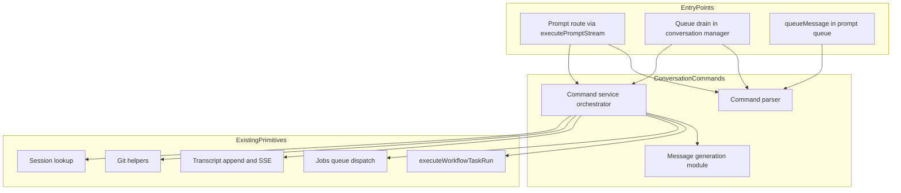
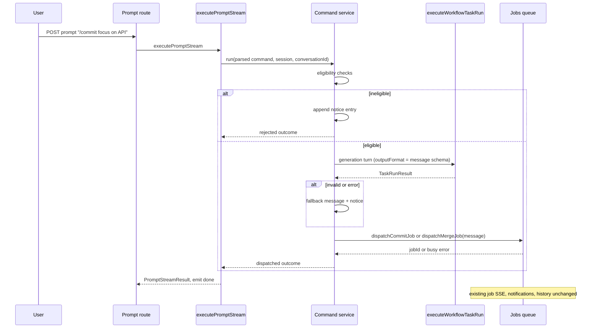

# Technical Design Document — agent-commit-messages

## Overview

**Purpose**: This feature moves Command Center's commit and smart-merge triggers into the conversation as `/commit` and `/merge` slash commands and replaces user-typed / hard-coded commit messages with messages written by the conversation's own agent — the agent that already holds the context of what was built and why.

**Users**: CC users working in session conversations trigger commits and merges inline; the agent composes the message, and CC's existing deterministic background flows do everything else.

**Impact**: Adds a new `conversation-commands` domain; extends the prompt interception point, the message queue, and the transcript with command awareness; removes the Git-panel Commit/Merge trigger buttons and both dialogs. The commit and merge state machines are untouched.

### Goals

- Intercept `/commit [hint…]` and `/merge [hint…]` in session conversations on both the direct-submit and queued-message paths, with identical semantics.
- Generate the commit/squash message via a structured-output agent turn in the same conversation, with deterministic pre-checks and a non-blocking fallback.
- Hand the message to the existing `dispatchCommitJob` / `dispatchMergeJob` flows unchanged.
- Make the commands discoverable in the editor autocomplete; remove the legacy UI triggers.

### Non-Goals

- Changing `commitMachine` / `mergeMachine` states, actors, guards, or job semantics.
- Agent-written messages for intermediate merge commits (WIP / conflict-resolution / validation-fix).
- Per-invocation merge options (auto-resolve is always on) or a generic CC-command registry/framework.
- Removing the `POST .../commit` and `POST .../merge` HTTP routes (UI triggers are removed; routes stay).
- Merges initiated by graph workflows; conflict-review / land / discard flows.

## Boundary Commitments

### This Spec Owns

- The `src/lib/conversation-commands/` domain: command parsing, eligibility policy, message-generation prompt + output schema, fallback policy, and dispatch orchestration.
- Command detection hooks at the two entry points (prompt interception in `sdk-driver.ts`, command-aware claiming/drain in the queue path).
- The system-notice transcript entry kind and its rendering.
- The `/commit` and `/merge` built-in autocomplete entries.
- Removal of the legacy trigger UI (buttons, `CommitDialog`, `SmartMergeDialog`, their mutations).

### Out of Boundary

- The commit and merge machines, job registry/persistence, SSE job broadcasting, and notifications (consumed as-is — owned by `smart-merge` and the jobs subsystem).
- Turn execution mechanics (`executeWorkflowTaskRun`, conversation machine, structured-output gate).
- Slash-command discovery/filtering UI (`command-autocomplete` spec) beyond the two constant entries.
- The `/collab` flow (pattern template only).

### Allowed Dependencies

- `src/lib/jobs/queue.ts` (`dispatchCommitJob`, `dispatchMergeJob`, active-job lookup) — outbound, P0.
- `src/lib/workflows/conversation/execute-workflow-task-run.ts` — outbound, P0.
- `src/lib/git/commits.ts` (`hasUncommittedChanges`; a change-summary collector is **added** there by this spec — no such helper exists today), `src/lib/git/` target-branch resolution — outbound, P0.
- `src/lib/prompt/transcript.ts` (notice append + broadcast) — outbound, P1.
- `src/lib/sessions/` session lookup (worktree path, branch, finished flag) — outbound, P0.
- Dependency direction: `conversation-commands` imports from jobs/git/sessions/workflows-primitives; `sdk-driver.ts` and the queue/drain modules import `conversation-commands`. Nothing in `conversation-commands` imports prompt routing or UI.

### Revalidation Triggers

- `DispatchCommitParams` / `DispatchMergeParams` shape changes or new dispatch error codes.
- `ExecuteWorkflowTaskRunInput` / `TaskRunResult` contract changes.
- Queue claim/drain contract changes (`claimNextTurnBatch`, drain event shape).
- Transcript entry schema changes affecting the notice kind.

## Architecture

### Existing Architecture Analysis

- Interception precedent: `/collab` is detected in `executePromptStream` (`sdk-driver.ts`) and dispatched out of the normal turn flow with an early return.
- The queued path does **not** pass through `executePromptStream`: `drainConversationQueue` (`manager.ts`) claims pending messages on machine idle entry, coalesces them, and sends `SUBMIT_PROMPT` directly to the actor. Any command interception must therefore live in a module shared by both paths.
- `executeWorkflowTaskRun` already provides transcript-visible, gate-validated, backend-agnostic structured-output turns inside a conversation (used by conflict-resolution and validation-fix).
- Both background machines take the message as plain input; the jobs queue exposes `Result`-typed dispatch with busy/active-job errors.

### Architecture Pattern & Boundary Map



**Architecture Integration**:

- Selected pattern: generate-then-dispatch through one shared orchestrator (collab-style early return at each entry point). Rationale and rejected alternatives: `research.md` (Architecture Pattern Evaluation).
- Existing patterns preserved: factory DI (`createX(deps)`, method-syntax deps), `Result`-typed dispatch, Zod schema-first domain (`schemas.ts` per domain), structured logging via `createLogger`.
- New components rationale: the parser/service/generation trio is the minimal seam that serves both entry points without touching machines.
- Steering compliance: composable primitives (no parallel orchestrator), agent-offloading (deterministic pre-checks and dispatch decisions in code; agent only writes prose), colocation (domain owns schemas + tests).

### Technology Stack

| Layer | Choice / Version | Role in Feature | Notes |
|-------|------------------|-----------------|-------|
| Backend / Services | Existing TypeScript + Zod v4 | New `conversation-commands` domain; hooks in prompt/queue modules | No new dependencies |
| Frontend | Existing React 19 components | Autocomplete entries, notice rendering, trigger removal | No new dependencies |

## File Structure Plan

### New Files

```
src/lib/conversation-commands/
├── schemas.ts            # ParsedConversationCommand union, generation output Zod schema +
│                         # JSON schema literal, notice/outcome types (z.infer exports)
├── parse.ts              # parseConversationCommand(text) — pure prefix parser
├── generation.ts         # buildGenerationPrompt, resolveGeneratedMessage, defaultMessage
├── service.ts            # createConversationCommandService(deps) — eligibility → generate →
│                         # fallback → dispatch → notices
├── parse.test.ts
├── generation.test.ts
└── service.test.ts
```

### Modified Files

- `src/lib/prompt/sdk-driver.ts` — detect commands in `executePromptStream` (beside the `/collab` check); delegate to the command service; early return.
- `src/lib/prompt/queue.ts` — `queueMessage` detects command messages and forces pending/next-turn handling (skips live in-turn delivery).
- `src/lib/conversations/message-queue-service.ts` — command-aware `claimNextTurnBatch` boundary logic (batch stops before a command; a command entry is claimed alone). `claimNextTurnBatch` lives here, not in `src/lib/prompt/queue.ts`.
- `src/lib/workflows/conversation/manager.ts` — `drainConversationQueue` routes a claimed command entry to the command service instead of building `SUBMIT_PROMPT`.
- `src/lib/git/commits.ts` — new change-summary collector (`git status --porcelain` + `diff --stat`) consumed by the command service.
- `src/lib/git/merge-target.ts` (new, extraction) — merge target resolution (`targetBranch`/`targetWorktreePath`) moved out of `mergeSession` in `route-handlers.ts`; both callers share it.
- `src/lib/git/route-handlers.ts` — `mergeSession` uses the extracted resolver (behavior unchanged).
- `src/lib/prompt/transcript.ts` (+ its schema location) — system-notice entry kind; broadcast includes notices.
- `src/features/session/conversation/…` message renderer — render notice entries distinctly (exact component identified at implementation; owned by the conversation feature).
- `src/features/session/prompt/PromptEditorSlashCommandPopup.tsx` — add `/commit` and `/merge` to `BUILT_IN_CLAUDE_COMMANDS` with `argumentHint`.
- `src/features/session/git/SessionGitPanel.tsx` — remove Commit/Merge buttons and related props.
- `src/lib/git/mutations.ts` — remove `useCommitMutation`, `useSmartMergeMutation`.

### Deleted Files

- `src/features/session/git/CommitDialog.tsx`
- `src/features/session/dialogs/SmartMergeDialog.tsx`
- Their colocated tests/styles and parent wiring (dialog state, `onCommit`/`onMerge` plumbing in the session feature).

## System Flows

### Direct path (conversation idle)



Key decisions: pre-checks run before any agent turn; dispatch `Result` errors after generation (race) surface as a notice; the generation turn is visible through normal transcript `message-appended` broadcasts.

### Queued path (conversation busy)

1. `/queue` endpoint → `queueMessage`: parser identifies a command message → forced pending (never live-delivered in-turn) — 8.2.
2. Machine idle entry → `drainConversationQueue` → `claimNextTurnBatch`: claims plain messages up to the first command as one coalesced `SUBMIT_PROMPT`; a command entry at the head is claimed alone — ordering preserved.
3. A claimed command entry is passed to the same command service (`run(...)`) — identical semantics to the direct path (8.3). Subsequent queued entries drain on later idle entries.

## Requirements Traceability

| Requirement | Summary | Components | Interfaces | Flows |
|-------------|---------|------------|------------|-------|
| 1.1 | Intercept `/commit`, don't forward to agent | Parser; sdk-driver hook | `parseConversationCommand` | Direct path |
| 1.2 | Trailing text = hint, not literal message | Parser; Generation | `ParsedConversationCommand.hint`; `buildGenerationPrompt` | Direct path |
| 1.3 | Commit via existing background flow | Command service | `deps.dispatchCommitJob` | Direct path |
| 1.4 | No changes → notice, no turn/job | Command service | `deps.hasUncommittedChanges`; notice append | Direct path (ineligible) |
| 1.5 | No session worktree → reject | Command service | `RunCommandInput.session` absent → rejection | Direct path (ineligible) |
| 1.6 | Finished session → reject | Command service | `session.finished` check | Direct path (ineligible) |
| 1.7 | Active job → reject | Command service | `deps.hasActiveJob` pre-check | Direct path (ineligible) |
| 2.1 | Intercept `/merge` | Parser; sdk-driver hook | `parseConversationCommand` | Direct path |
| 2.2 | Always auto-resolve | Command service | `dispatchMergeJob({ autoResolve: true })` | Direct path |
| 2.3 | Agent message as squash message | Command service; Generation | `DispatchMergeParams.message` | Direct path |
| 2.4 | `/merge` trailing text = hint | Parser; Generation | same as 1.2 | Direct path |
| 2.5 | Merge flow otherwise unchanged | Command service (no machine edits) | merge-target resolver reuse | — |
| 2.6 | Merge rejections | Command service | same checks as 1.5–1.7 | Direct path (ineligible) |
| 3.1 | Message via turn in same conversation, before git ops | Command service | `deps.executeWorkflowTaskRun` | Direct path |
| 3.2 | Turn visible like a normal turn | executeWorkflowTaskRun (adopted) | transcript `message-appended` broadcasts | Direct path |
| 3.3 | Agent role limited to the message | Generation | prompt instructions + `outputFormat` | Direct path |
| 3.4 | Current changes provided as input | Generation; git helpers | `deps.collectChangeSummary` | Direct path |
| 3.5 | Hint steering | Generation | `buildGenerationPrompt(hint)` | Direct path |
| 3.6 | Validate non-empty/well-formed | Generation | `resolveGeneratedMessage` (Zod) | Direct path |
| 3.7 | Backend-agnostic + fallback | executeWorkflowTaskRun gate (adopted); Generation | `TaskRunResult` discriminants | Direct path |
| 4.1 | Failure → default message, proceed | Command service; Generation | `defaultMessage(command, ctx)` | Direct path (fallback) |
| 4.2 | Merge default identifies branches | Generation | `Merge ${branch} into ${target}` | — |
| 4.3 | Commit default identifies session | Generation | `Changes from session ${sessionName}` | — |
| 4.4 | Log + user-visible notice on fallback | Command service | structured log + notice entry | Direct path (fallback) |
| 4.5 | Never abort on generation failure | Command service | fallback path always dispatches | Direct path (fallback) |
| 5.1 | Background flows unchanged | (constraint) | no machine/job edits; merge-target extraction behavior-preserving | — |
| 5.2 | Intermediate messages unchanged | (constraint) | machines untouched | — |
| 5.3 | Job status/notifications/history unchanged | Jobs subsystem (adopted) | existing `subscribe*Actor` plumbing | — |
| 6.1 | Autocomplete lists both commands | Built-ins constant | `BUILT_IN_CLAUDE_COMMANDS` entries | — |
| 6.2 | Selection inserts command ready for hint | Built-ins constant | `argumentHint` | — |
| 7.1 | Buttons + dialogs removed | UI removal | — | — |
| 7.2 | Slash commands only triggers | UI removal | mutations deleted | — |
| 7.3 | Conflict/land/discard flows intact | (constraint) | land/discard routes + UI untouched | — |
| 8.1 | Mid-turn command queues, runs after turn | Queue hook | forced pending in `queueMessage` | Queued path |
| 8.2 | Literal text never delivered to agent | Queue hook | live in-turn delivery skipped for commands | Queued path |
| 8.3 | Queued command = same semantics | Drain hook; Command service | drain routes to `service.run` | Queued path |

## Components and Interfaces

| Component | Domain/Layer | Intent | Req Coverage | Key Dependencies | Contracts |
|-----------|--------------|--------|--------------|------------------|-----------|
| Command parser | conversation-commands | Detect command + extract hint | 1.1, 1.2, 2.1, 2.4 | none (pure) | Service |
| Message generation | conversation-commands | Prompt, output schema, validation, defaults | 1.2, 2.4, 3.3–3.7, 4.1–4.3 | schemas (P0) | Service |
| Command service | conversation-commands | Eligibility → generation → fallback → dispatch → notices | 1.3–1.7, 2.2, 2.3, 2.6, 3.1, 4.4, 4.5 | jobs queue (P0), executeWorkflowTaskRun (P0), git helpers (P0), transcript (P1) | Service |
| Prompt interception hook | prompt | Detect + delegate on direct path | 1.1, 2.1 | parser, service (P0) | Service |
| Queue command handling | prompt / conversation manager | Force next-turn; command-aware claim; drain routing | 8.1–8.3 | parser (P0), service (P0) | Service |
| Merge target resolver | git | Shared target branch/worktree resolution | 2.5 | sessions (P0) | Service |
| System notice support | prompt (transcript) + conversation UI | Durable CC-authored notices in conversation | 1.4–1.7, 2.6, 4.4 | transcript schema (P0) | Event |
| Autocomplete built-ins | session feature UI | Discoverability | 6.1, 6.2 | none | — |
| Legacy trigger removal | session feature UI | Buttons/dialogs/mutations deleted | 7.1–7.3 | none | — |

### conversation-commands domain

#### Command parser (`parse.ts`)

| Field | Detail |
|-------|--------|
| Intent | Pure detection of `/commit` / `/merge` with hint extraction |
| Requirements | 1.1, 1.2, 2.1, 2.4 |

```typescript
type ParsedConversationCommand =
  | { command: "commit"; hint: string }
  | { command: "merge"; hint: string };

function parseConversationCommand(text: string): ParsedConversationCommand | null;
```

- Preconditions: none (any string). Matches `/commit` or `/merge` as the entire trimmed message or followed by whitespace + hint (mirrors `hasCollabPrefix` semantics).
- Postconditions: `hint` is trimmed, possibly empty. Non-command text → `null`.
- Invariants: no I/O; safe to call at queue, claim, and interception sites.

#### Message generation (`generation.ts`, `schemas.ts`)

| Field | Detail |
|-------|--------|
| Intent | Build the narrow generation prompt; validate/normalize agent output; provide defaults |
| Requirements | 3.3, 3.4, 3.5, 3.6, 4.1, 4.2, 4.3 |

```typescript
interface GenerationContext {
  command: "commit" | "merge";
  hint: string;
  sessionName: string;
  branchName: string;
  targetBranch: string | null;   // merge only
  changeSummary: string;         // git status --porcelain + diff --stat, collected deterministically
}

const commitMessageOutputSchema: z.ZodObject<{ message: z.ZodString }>;
const COMMIT_MESSAGE_JSON_SCHEMA: Record<string, unknown>; // outputFormat payload

function buildGenerationPrompt(ctx: GenerationContext): string;
function resolveGeneratedMessage(result: TaskRunResult):
  | { ok: true; message: string }
  | { ok: false; reason: string };
function defaultMessage(ctx: GenerationContext): string;
```

- Preconditions: `changeSummary` already collected; for merge, `targetBranch` resolved.
- Postconditions: `resolveGeneratedMessage` returns `ok` only for `kind: "structured"` results whose `message` parses via Zod to a non-empty trimmed string; everything else yields `ok: false` with a loggable reason (3.6, 3.7).
- Invariants: prompt instructs the agent its only task is the message (no tool work expected), embeds hint and change summary (3.3–3.5). `defaultMessage`: merge → `Merge ${branchName} into ${targetBranch}`; commit → `Changes from session ${sessionName}` (4.2, 4.3).

#### Command service (`service.ts`)

| Field | Detail |
|-------|--------|
| Intent | Orchestrate eligibility → generation → fallback → dispatch → notices for both entry paths |
| Requirements | 1.3–1.7, 2.2, 2.3, 2.5, 2.6, 3.1, 4.1, 4.4, 4.5 |

```typescript
interface ConversationCommandDeps {
  getSession(projectPath: string, sessionName: string): Promise<SessionState>;
  hasActiveJob(projectPath: string, sessionName: string): boolean;
  hasUncommittedChanges(worktreePath: string): Promise<boolean>;
  collectChangeSummary(worktreePath: string): Promise<string>;
  resolveMergeTarget(projectPath: string, session: SessionState): Promise<MergeTarget>;
  executeWorkflowTaskRun(input: ExecuteWorkflowTaskRunInput): Promise<TaskRunResult>;
  dispatchCommitJob(params: DispatchCommitParams): Result<{ jobId: string }, DispatchError>;
  dispatchMergeJob(params: DispatchMergeParams): Result<{ jobId: string }, DispatchError>;
  appendNotice(input: AppendNoticeInput): Promise<void>;
}

interface RunCommandInput {
  projectPath: string;
  projectName: string;
  sessionName: string | null;   // null → conversation has no session worktree (1.5)
  conversationId: string;
  parsed: ParsedConversationCommand;
}

type RunCommandOutcome =
  | { status: "dispatched"; jobId: string; usedFallback: boolean }
  | { status: "rejected"; reason: "no-session" | "session-finished" | "job-active" | "no-changes" | "dispatch-failed" };

function createConversationCommandService(deps: ConversationCommandDeps): {
  run(input: RunCommandInput): Promise<RunCommandOutcome>;
};
```

- Preconditions: caller provides parsed command and conversation identity; no lock held that would block a task-run turn in this conversation.
- Postconditions: every `rejected` outcome has appended exactly one notice entry (1.4–1.7, 2.6); `dispatched` with `usedFallback: true` has appended a fallback notice and logged the failure (4.4); a generation failure never yields `rejected` (4.5) — only dispatch failure can, after a notice.
- Invariants: eligibility order — session present → not finished → no active job → (commit only) has changes — all before `executeWorkflowTaskRun` (agent-offloading); merge always dispatches `autoResolve: true` (2.2); structured logging on every outcome (module per `.kiro/steering/logs.md`).
- Integration: deps use method syntax (bivariance); production default deps are wired inside `service.ts` (same pattern as `conflict-resolution.ts`); tests inject fakes plus the persistence fixture where session state round-trips matter.
- Risks: conversation-lock interplay on the direct path — verified by the earliest integration test (see Testing Strategy).

### Entry-point hooks

#### Prompt interception (`sdk-driver.ts` modification)

| Field | Detail |
|-------|--------|
| Intent | Direct-path detection and delegation, mirroring `/collab` |
| Requirements | 1.1, 2.1 |

- In `executePromptStream`, after trimming and before the collab branch: `parseConversationCommand(promptText)`; on match, append the user's command message to the transcript (as for normal prompts), call `service.run(...)`, emit `done`, and return a `PromptStreamResult` without entering the normal `SUBMIT_PROMPT` flow.
- The session-level and conversation-level prompt routes both flow through `executePromptStream`, so one hook covers both.

#### Queue command handling (`queue.ts` + `manager.ts` modifications)

| Field | Detail |
|-------|--------|
| Intent | Queued-path equivalence: never live-deliver commands; claim them alone; route to the service |
| Requirements | 8.1, 8.2, 8.3 |

- `queueMessage`: if `parseConversationCommand(content.text)` matches, skip live in-turn delivery regardless of backend `deliveryTiming`; the row stays pending (8.1, 8.2).
- `claimNextTurnBatch` (or a thin wrapper at its call site): the claimed batch is either (a) the maximal prefix of non-command messages — coalesced into `SUBMIT_PROMPT` exactly as today — or (b) a single command message at the head of the queue.
- `drainConversationQueue`: for case (b), resolve the command via the parser and invoke `service.run(...)` (awaited with error logging; queue row marked delivered on completion), instead of sending `SUBMIT_PROMPT` (8.3). Remaining entries drain on subsequent idle entries, preserving order.

#### Merge target resolver (`src/lib/git/merge-target.ts`, extraction)

| Field | Detail |
|-------|--------|
| Intent | One shared resolution of `targetBranch` / `targetWorktreePath` for `mergeSession` route and the command service |
| Requirements | 2.5 |

- Pure extraction of the existing logic in `mergeSession` (`route-handlers.ts:279-375`); route behavior unchanged (5.1). Signature: `resolveMergeTarget(projectPath: string, session: SessionState): Promise<MergeTarget>` where `MergeTarget = { targetBranch: string; targetWorktreePath: string | null }`.

### Transcript and UI

#### System notice support (`transcript.ts` + conversation message renderer)

| Field | Detail |
|-------|--------|
| Intent | Durable CC-authored informational entries visible in the conversation on both paths |
| Requirements | 1.4, 1.5, 1.6, 1.7, 2.6, 4.4 |

**Contracts**: Event [x]

- New transcript entry kind (CC-authored notice; exact field values follow the existing transcript Zod schema conventions — extend schema first, then grep consumers).
- Published events: `message-appended` SSE broadcast extended to include notice entries.
- Renderer: conversation message list renders notices as a distinct system-style row (not a user/agent bubble).
- Implementation Notes — Risks: any consumer assuming only `user`/`assistant` roles; mitigated by schema-first change and consumer sweep. Known role-gated sites that would otherwise **silently suppress or misattribute** notices — each must be updated:
  - `src/lib/prompt/transcript.ts` SSE broadcast gate in `appendTranscriptEntry` (broadcasts only `user`/`assistant` entries with content).
  - `src/lib/prompt/transcript.ts` visible-message filter (conversation read path).
  - `src/lib/prompt/transcript.ts` message-read loop (skips roles other than `user`/`assistant`).
  - `src/components/conversation/MessageRow.tsx` — binary `role === "user"` check labels any other role as the agent ("Claude"/"Codex"); needs an explicit notice branch.
- Validation: round-trip must go through the **visible-message/read-API path and the SSE broadcast gate** (not a raw JSONL append/read), per Integration Test 4.

#### Autocomplete built-ins + legacy trigger removal (summary-only)

- `BUILT_IN_CLAUDE_COMMANDS` gains `/commit` (`argumentHint`: optional message guidance) and `/merge` (`argumentHint`: optional message guidance) with descriptions (6.1, 6.2).
- Remove: Commit/Merge buttons and related props from `SessionGitPanel.tsx`; `CommitDialog.tsx`; `SmartMergeDialog.tsx`; `useCommitMutation` / `useSmartMergeMutation` (no other callers — verified); parent dialog wiring in the session feature (7.1, 7.2). Conflict-review, ready-to-land land/discard UI and routes untouched (7.3).

## Data Models

No persistent data model changes: no new tables/columns, no queue schema migration (commands detected from message text), no job record changes. New runtime types only (`ParsedConversationCommand`, `GenerationContext`, `RunCommandOutcome`, notice entry kind) — all defined as Zod schemas with `z.infer` exports in `src/lib/conversation-commands/schemas.ts` and the transcript schema module.

**Generation output contract** (agent ↔ CC): JSON schema `{ message: string }` passed as `outputFormat`; Zod-validated on return (`message` non-empty after trim). Serialization: JSON via the existing structured-output gate.

## Error Handling

### Error Strategy

All command failures resolve to one of two shapes: a **rejection notice** (no job started) or a **fallback dispatch** (job started with default message + notice). The deterministic flow is never blocked by agent failure (4.5).

### Error Categories and Responses

- **User/state errors** (rejections, no agent turn spent): no session worktree (1.5), finished session (1.6), active job (1.7), no changes for `/commit` (1.4) → notice entry naming the reason; outcome `rejected`.
- **Agent errors**: task-run `error` result, timeout, invalid/empty structured output → log with reason, `defaultMessage`, dispatch proceeds, fallback notice (4.1–4.4).
- **System errors**: dispatch `Result` error after generation (`SESSION_BUSY`/`JOB_ALREADY_RUNNING` race) → notice; outcome `rejected: dispatch-failed`. Queue-path service exceptions → caught and logged in drain; queue row not lost (marked delivered only after `run` resolves).

### Monitoring

Structured logging via `createLogger` for: command detected (entry path, command, hint length), each rejection reason, generation duration/result kind, fallback engagement, dispatch outcome with jobId. Conventions per `.kiro/steering/logs.md`.

## Testing Strategy

### Unit Tests

1. `parseConversationCommand`: exact command, command + hint, leading whitespace, non-commands (`/committed`, mid-text `/commit`), `/merge` variants.
2. `buildGenerationPrompt`: embeds hint, change summary, branch/target; instructs message-only role (3.3–3.5).
3. `resolveGeneratedMessage`: structured-valid, structured-empty-message, `text` kind, `error` kind → correct ok/fallback reasons (3.6, 3.7).
4. `defaultMessage`: merge identifies branches; commit identifies session (4.2, 4.3).
5. Command service eligibility matrix with injected fakes: no-session / finished / active-job / no-changes orderings — no `executeWorkflowTaskRun` call on rejection (1.4–1.7, 2.6); fallback path dispatches with default message and appends notice (4.1, 4.4, 4.5); merge dispatch carries `autoResolve: true` and resolved target (2.2, 2.5).

### Integration Tests

1. `executePromptStream` with `/commit` text: service invoked, normal `SUBMIT_PROMPT` flow not entered, `/collab` branch unaffected, `done` emitted (1.1, 2.1) — includes the conversation-lock interplay check (task-run turn completes while the route awaits).
2. Queue path: `queueMessage` with command text never live-delivers (8.2); claim returns text-prefix batch then lone command entry (ordering, 8.1); drain routes command to service with same outcome shape as direct path (8.3) — real-store persistence fixture for queue rows.
3. Merge target resolver extraction: `mergeSession` route responses unchanged for normal and child-branch sessions (2.5, 5.1).
4. Transcript notice: append → read back **through the visible-message/read-API path** (not raw JSONL) → SSE broadcast payload includes the notice (asserting the `appendTranscriptEntry` role gate passes it); renderer-facing schema parse (4.4).

### UI Tests

1. Autocomplete popup lists `/commit` and `/merge` with descriptions and argument hints (6.1, 6.2).
2. `SessionGitPanel` renders without Commit/Merge buttons; commit/merge dialogs absent from the session feature tree (7.1, 7.2); land/discard affordances still render for ready-to-land jobs (7.3).
3. Conversation message list renders a notice entry distinctly.

### E2E (live, post-implementation)

1. `/commit` in a real session conversation: visible generation turn, commit job completes, commit message on branch matches generated output (1.1, 1.3, 3.1, 3.2).
2. `/merge` end-to-end on a clean branch: squash commit on target carries agent message (2.1, 2.3).
3. Fallback drill: force generation failure (e.g., unreachable backend) → commit proceeds with default message + notice (4.1–4.5).
