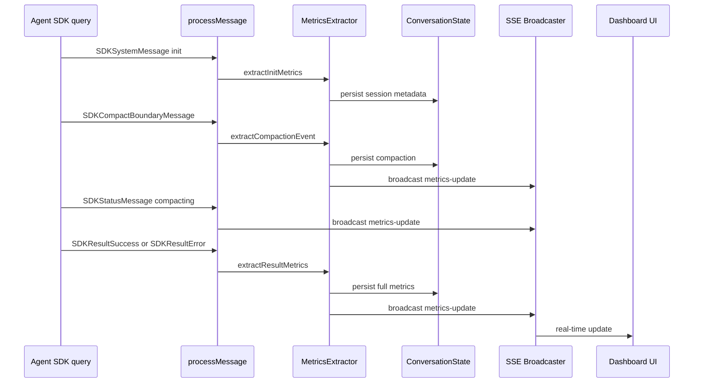
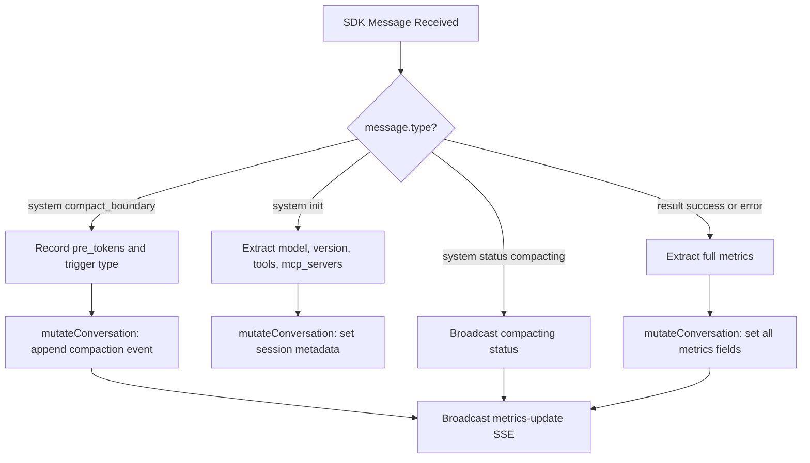
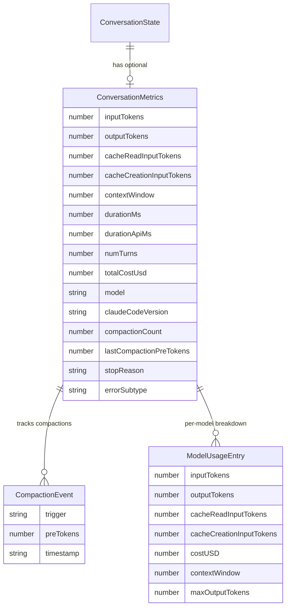

# Technical Design: Agent Context Metrics

## Overview

**Purpose**: This feature extracts, persists, and displays operational metrics from the Claude Agent SDK stream — primarily context window consumption, token usage, cost, timing, and session metadata — so CSM operators can monitor session health from the dashboard without reading raw transcripts.

**Users**: CSM operators monitoring one or more Claude Code sessions. They need at-a-glance visibility into cumulative token consumption, cost, compaction events, and why conversations ended.

**Impact**: Replaces legacy top-level metric fields (`totalCostUsd`, `totalDurationMs`, `totalTurns`) on `ConversationState` with a structured `metrics` sub-object. Extends it with all available SDK operational data. Adds a new SSE event type for real-time metric updates. Adds UI display in the session detail view.

### Goals
- Surface cumulative token counts (input, output, cache read, cache creation) and model context window size as raw numbers
- Provide per-model cost breakdown from `modelUsage`
- Display session metadata (model, Claude Code version, tools, MCP servers)
- Track context compaction events (count, pre_tokens, trigger type)
- Show stop reason, error subtype, and permission denials
- Deliver metrics updates via SSE for live monitoring
- Replace legacy top-level metric fields with the structured `metrics` sub-object

### Non-Goals
- Historical metrics aggregation across sessions or projects
- Per-turn token tracking (only aggregate per-conversation)
- Custom alerting or threshold-based notifications
- Metrics for sub-agent tasks (SDKTaskNotificationMessage) — logged in transcript but not surfaced in v1
- Modifying transcript JSONL format — raw data stays as-is

## Architecture

### Existing Architecture Analysis

CSM already processes the full SDK message stream in `processMessage()` (`src/lib/prompt.ts`). The current flow:

1. `query()` yields `SDKMessage` objects
2. `processMessage()` switches on `message.type` — extracts content for assistant/user messages, captures `session_id` from init, and pulls `total_cost_usd`/`duration_ms`/`num_turns` from result messages into legacy top-level fields
3. `mutateConversation()` persists updates to `ConversationState` in the JSON state file

**Legacy fields to remove**: `totalCostUsd`, `totalDurationMs`, `totalTurns` are currently accumulated as top-level fields on `ConversationState`. These are replaced by the structured `metrics` sub-object. The accumulation logic moves into `metrics.totalCostUsd`, `metrics.durationMs`, `metrics.numTurns`.

**Context window limitation**: The SDK's `usage.inputTokens` is cumulative across all API calls in a prompt execution (each turn re-sends conversation history), so it does not represent current context fill level. The only reliable context fill signal is `compact_boundary.pre_tokens`. The UI displays raw cumulative token counts, not a context-fill percentage.
4. `broadcast()` sends SSE events to connected UI clients

**Key constraint**: The result message fields (`usage`, `modelUsage`, `duration_api_ms`, `stop_reason`, `permission_denials`) and init message fields (`model`, `claude_code_version`, `tools`, `mcp_servers`) are already available at the extraction point — they're just not captured.

### Architecture Pattern & Boundary Map



**Architecture Integration**:
- Selected pattern: Extend existing message processing pipeline — no new modules, just extraction functions
- Domain boundaries: Metrics extraction is a pure function (SDK message → metrics fields); persistence reuses `mutateConversation()`
- Existing patterns preserved: Schema-first data modeling, SSE broadcast, `processMessage()` switch pattern
- New components: `conversationMetricsSchema` (Zod), metrics extraction helpers, UI metrics display
- Steering compliance: TypeScript strict mode, Zod schemas, colocated components

### Technology Stack

| Layer | Choice / Version | Role in Feature | Notes |
|-------|------------------|-----------------|-------|
| Data | Zod v4 schema | `conversationMetricsSchema` defining metrics structure | Extends existing schema-first pattern |
| Backend | `processMessage()` in prompt.ts | Metrics extraction from SDK stream | Existing function, extended with new cases |
| Events | SSE via `sse-broadcaster.ts` | Real-time metrics push to UI | New `metrics-update` event type in `SSEEvent` union |
| Frontend | React components (colocated) | Metrics display panel | New component in session detail view |

## System Flows

### Metrics Extraction Flow



Key decisions:
- Init metadata captured once per session (first init message); subsequent resumes do not overwrite
- Compaction events are additive — each new compaction increments the count and updates `lastPreTokens`
- Cost and duration accumulate across prompts (replacing the legacy top-level accumulation). Token counts and other result fields reflect the most recent prompt execution.
- Context window size (`contextWindow`) and cumulative token counts are stored as raw numbers — no percentage calculation (SDK tokens are cumulative across API calls, not current context fill)

## Requirements Traceability

| Requirement | Summary | Components | Interfaces | Flows |
|-------------|---------|------------|------------|-------|
| 1.1 | Extract contextWindow and cumulative token counts from modelUsage | MetricsExtractor, conversationMetricsSchema | extractResultMetrics | Result processing |
| 1.2 | Display cumulative token counts and context window size as raw numbers | MetricsPanel | MetricsPanelProps | — |
| 1.3 | Record compact_boundary pre_tokens | MetricsExtractor | extractCompactionEvent | Compact boundary processing |
| 1.4 | Show compaction count and last pre_tokens | MetricsPanel | MetricsPanelProps | — |
| 2.1 | Extract token counts by category | MetricsExtractor | extractResultMetrics | Result processing |
| 2.2 | Extract per-model costUSD | MetricsExtractor | extractResultMetrics | Result processing |
| 2.3 | Display token counts grouped by category | MetricsPanel | MetricsPanelProps | — |
| 2.4 | Display total cost | MetricsPanel | MetricsPanelProps | — |
| 2.5 | Per-model breakdown for multi-model conversations | MetricsPanel | MetricsPanelProps | — |
| 3.1 | Extract model, version, tools from init | MetricsExtractor | extractInitMetrics | Init processing |
| 3.2 | Display model name | MetricsPanel | MetricsPanelProps | — |
| 3.3 | Display MCP server names and status | MetricsPanel | MetricsPanelProps | — |
| 3.4 | Display Claude Code version | MetricsPanel | MetricsPanelProps | — |
| 4.1 | Extract duration_ms and duration_api_ms | MetricsExtractor | extractResultMetrics | Result processing |
| 4.2 | Display both durations | MetricsPanel | MetricsPanelProps | — |
| 4.3 | Display num_turns | MetricsPanel | MetricsPanelProps | — |
| 5.1 | Define metrics Zod schema | conversationMetricsSchema | — | — |
| 5.2 | Extend ConversationState with metrics field | conversationStateSchema | — | — |
| 5.3 | Remove legacy totalCostUsd, totalDurationMs, totalTurns fields | conversationStateSchema, prompt.ts | — | Migration |
| 5.4 | Populate metrics from result, accumulating cost/duration | MetricsExtractor | extractResultMetrics | Result processing |
| 5.5 | Populate session metadata from init | MetricsExtractor | extractInitMetrics | Init processing |
| 6.1 | Broadcast compacting status via SSE | processMessage, broadcast | MetricsUpdateEvent | Compacting SSE |
| 6.2 | Broadcast result metrics via SSE | processMessage, broadcast | MetricsUpdateEvent | Result SSE |
| 6.3 | Reactive UI updates from SSE | MetricsPanel, useSSE hook | — | — |
| 7.1 | Extract stop_reason | MetricsExtractor | extractResultMetrics | Result processing |
| 7.2 | Extract permission_denials | MetricsExtractor | extractResultMetrics | Result processing |
| 7.3 | Extract error subtype | MetricsExtractor | extractResultMetrics | Result processing |
| 7.4 | Display stop reason and error subtype | MetricsPanel | MetricsPanelProps | — |
| 7.5 | Display permission denial count and tool names | MetricsPanel | MetricsPanelProps | — |

## Components and Interfaces

| Component | Domain/Layer | Intent | Req Coverage | Key Dependencies | Contracts |
|-----------|--------------|--------|--------------|------------------|-----------|
| conversationMetricsSchema | Data / Schema | Zod schema for all metrics fields; replaces legacy top-level fields | 5.1, 5.2, 5.3 | Zod v4 (P0) | State |
| MetricsExtractor | Backend / Extraction | Pure functions extracting metrics from SDK messages | 1.1, 1.3, 2.1, 2.2, 3.1, 4.1, 5.4, 5.5, 7.1–7.3 | SDK types (P0) | Service |
| MetricsUpdateEvent | Events / SSE | New SSE event type for metrics broadcasts | 6.1, 6.2 | sse-broadcaster (P0) | Event |
| MetricsPanel | UI / Session Detail | Displays all metrics for active conversation | 1.2, 1.4, 2.3–2.5, 3.2–3.4, 4.2, 4.3, 7.4, 7.5 | ConversationState (P0) | State |

### Data / Schema

#### conversationMetricsSchema

| Field | Detail |
|-------|--------|
| Intent | Zod schema defining the shape of all metrics data attached to a conversation; replaces legacy top-level fields |
| Requirements | 5.1, 5.2, 5.3 |

**Responsibilities & Constraints**
- Single source of truth for metrics type definition — replaces `totalCostUsd`, `totalDurationMs`, `totalTurns` top-level fields
- Optional field on `ConversationState` — defaults to `null` for backward compatibility with state files created before this feature
- Handles both "never ran" (null) and "ran but no result yet" (partial data from init) states
- `totalCostUsd`, `durationMs`, and `numTurns` within metrics accumulate across prompts (same semantics as the removed legacy fields)

**Contracts**: State [x]

##### State Management

```typescript
// New Zod schemas in src/lib/schemas.ts

const compactionEventSchema = z.object({
  trigger: z.enum(["manual", "auto"]),
  preTokens: z.number(),
  timestamp: z.string(),
});

const modelUsageEntrySchema = z.object({
  inputTokens: z.number(),
  outputTokens: z.number(),
  cacheReadInputTokens: z.number(),
  cacheCreationInputTokens: z.number(),
  costUSD: z.number(),
  contextWindow: z.number(),
  maxOutputTokens: z.number(),
});

const conversationMetricsSchema = z.object({
  // Token usage (cumulative across all API calls in the prompt execution — NOT context fill level)
  inputTokens: z.number().nullable().default(null),
  outputTokens: z.number().nullable().default(null),
  cacheReadInputTokens: z.number().nullable().default(null),
  cacheCreationInputTokens: z.number().nullable().default(null),

  // Context window size (model's max, from modelUsage — NOT current fill level)
  contextWindow: z.number().nullable().default(null),

  // Per-model breakdown
  modelUsage: z.record(z.string(), modelUsageEntrySchema).nullable().default(null),

  // Timing (accumulated across prompts — replaces legacy totalDurationMs)
  durationMs: z.number().nullable().default(null),
  durationApiMs: z.number().nullable().default(null),
  // Turns (accumulated across prompts — replaces legacy totalTurns)
  numTurns: z.number().nullable().default(null),

  // Cost (accumulated across prompts — replaces legacy totalCostUsd)
  totalCostUsd: z.number().nullable().default(null),

  // Session metadata (from init)
  model: z.string().nullable().default(null),
  claudeCodeVersion: z.string().nullable().default(null),
  tools: z.array(z.string()).nullable().default(null),
  mcpServers: z.array(z.object({
    name: z.string(),
    status: z.string(),
  })).nullable().default(null),

  // Compaction tracking
  compactionCount: z.number().default(0),
  lastCompactionPreTokens: z.number().nullable().default(null),
  compactions: z.array(compactionEventSchema).default([]),

  // Stop/error info
  stopReason: z.string().nullable().default(null),
  errorSubtype: z.string().nullable().default(null),
  permissionDenials: z.array(z.string()).nullable().default(null),
});
```

- Persistence: Serialized within `ConversationState` in the JSON state file
- Concurrency: Protected by existing single-flight lock per session
- Extension: `conversationStateSchema` adds `metrics: conversationMetricsSchema.nullable().default(null)` and **removes** `totalCostUsd`, `totalDurationMs`, `totalTurns` top-level fields
- Migration: Existing code referencing `conversation.totalCostUsd` must change to `conversation.metrics?.totalCostUsd`. UI and API consumers must be updated accordingly.

**Implementation Notes**
- All fields default to `null` so partially-populated metrics (e.g., only init metadata before result arrives) serialize cleanly
- `compactions` array stores full history; `compactionCount` and `lastCompactionPreTokens` provide quick access without iterating
- `permissionDenials` stores tool names only (not full input), keeping state file size bounded

### Backend / Extraction

#### MetricsExtractor

| Field | Detail |
|-------|--------|
| Intent | Pure functions extracting structured metrics from SDK message types |
| Requirements | 1.1, 1.3, 2.1, 2.2, 3.1, 4.1, 5.4, 5.5, 7.1–7.3 |

**Responsibilities & Constraints**
- Stateless extraction: each function takes an SDK message and returns a partial metrics update
- No side effects — caller (`processMessage`) handles persistence and SSE

**Dependencies**
- Inbound: `processMessage()` — passes SDK messages for extraction (P0)
- External: `@anthropic-ai/claude-agent-sdk` types — `SDKResultSuccess`, `SDKResultError`, `SDKSystemMessage`, `SDKCompactBoundaryMessage` (P0)

**Contracts**: Service [x]

##### Service Interface

```typescript
import type { ConversationMetrics } from "@/types";
import type {
  SDKResultSuccess,
  SDKResultError,
  SDKSystemMessage,
  SDKCompactBoundaryMessage,
} from "@anthropic-ai/claude-agent-sdk";

/** Extract metrics from a result message (success or error).
 *  Accumulates totalCostUsd, durationMs, numTurns from existing metrics. */
function extractResultMetrics(
  result: SDKResultSuccess | SDKResultError,
  existing: ConversationMetrics | null,
): Partial<ConversationMetrics>;

/** Extract session metadata from init message */
function extractInitMetrics(
  init: SDKSystemMessage,
): Partial<ConversationMetrics>;

/** Extract compaction event data from compact_boundary message */
function extractCompactionEvent(
  compact: SDKCompactBoundaryMessage,
  existing: ConversationMetrics | null,
): Partial<ConversationMetrics>;
```

- Preconditions: Message type matches expected SDK type
- Postconditions: Returns partial metrics object with only populated fields
- Invariants: Never mutates input messages

**Implementation Notes**
- These functions live in `src/lib/prompt.ts` alongside `processMessage()` (no separate file — they're tightly coupled to the message processing loop)
- `extractResultMetrics` maps SDK field names to schema field names (e.g., `total_cost_usd` → `totalCostUsd`, `duration_api_ms` → `durationApiMs`) and receives existing metrics to accumulate `totalCostUsd`, `durationMs`, and `numTurns`
- `extractCompactionEvent` needs existing metrics to compute `compactionCount` and append to `compactions` array
- `extractInitMetrics` only populates `model`, `claudeCodeVersion`, `tools`, `mcpServers`
- The legacy accumulation logic in `mutateConversation()` (lines 342-350 of current prompt.ts) is replaced by the metrics extraction functions

### Events / SSE

#### MetricsUpdateEvent

| Field | Detail |
|-------|--------|
| Intent | SSE event type broadcasting metrics changes to connected UI clients |
| Requirements | 6.1, 6.2 |

**Contracts**: Event [x]

##### Event Contract

```typescript
// Addition to SSEEvent union in src/lib/schemas.ts

const metricsUpdateEventSchema = z.object({
  type: z.literal("metrics-update"),
  projectName: z.string(),
  sessionName: z.string(),
  conversationId: z.string(),
  metrics: conversationMetricsSchema.partial(),
});
type MetricsUpdateEvent = z.infer<typeof metricsUpdateEventSchema>;

// Updated SSE union
type SSEEvent = ConversationStatusEvent | AskQuestionEvent | MetricsUpdateEvent;
```

- Published events: `metrics-update` — emitted on compaction boundary, compacting status, and result receipt
- Ordering: No ordering guarantees (last-write-wins for UI display)
- Delivery: Best-effort (fire-and-forget pattern matches existing SSE usage)

**Implementation Notes**
- Broadcast at three points in `processMessage()`: compact_boundary receipt, compacting status, and result receipt
- The `metrics` payload is partial — only changed fields are sent, reducing payload size
- UI merges partial updates into local state

### UI / Session Detail

#### MetricsPanel

| Field | Detail |
|-------|--------|
| Intent | Collapsible panel displaying all conversation metrics in the session detail view |
| Requirements | 1.2, 1.4, 2.3–2.5, 3.2–3.4, 4.2, 4.3, 7.4, 7.5 |

**Responsibilities & Constraints**
- Read-only display component — no mutations
- Gracefully handles `null` metrics (pre-first-prompt state)
- Reactively updates when SSE `metrics-update` events arrive

**Dependencies**
- Inbound: `ConversationState.metrics` — data source (P0)
- Inbound: SSE `metrics-update` events — live updates (P1)

**Contracts**: State [x]

##### State Management

```typescript
interface MetricsPanelProps {
  metrics: ConversationMetrics | null;
}
```

Component renders:
1. **Token counts** — cumulative input tokens, output tokens, and model context window size displayed as raw formatted numbers (e.g., "Input: 85,200 | Output: 12,300 | Context: 200,000")
2. **Token breakdown** — labeled values for cache read and cache creation tokens
3. **Cost** — total USD (accumulated) and per-model breakdown (if multiple models)
4. **Timing** — wall-clock duration (accumulated), API duration, turn count (accumulated)
5. **Session info** — model name, Claude Code version, MCP servers
6. **Compaction** — count and last pre_tokens value (pre_tokens is the reliable context fill signal)
7. **Stop reason** — stop reason text, error subtype badge, permission denial count with tool names

**Implementation Notes**
- Component colocated at `src/app/projects/[name]/[session]/[conversationId]/MetricsPanel.tsx`
- Uses CSS classes following BEM-style kebab-case convention (e.g., `metrics-panel`, `metrics-panel-tokens`)
- Null metrics → render "No metrics yet" placeholder
- No percentage/progress bar for context usage — SDK cumulative tokens do not represent context fill level
- Token counts formatted with `Intl.NumberFormat` for thousands separators
- Duration formatted as human-readable (e.g., "2m 15s")

## Data Models

### Domain Model

**Aggregate**: `ConversationState` (existing) — extended with `metrics` field, legacy `totalCostUsd`/`totalDurationMs`/`totalTurns` removed
**Value Object**: `ConversationMetrics` — immutable snapshot of operational data from the SDK
**Value Object**: `CompactionEvent` — records a single context compaction occurrence
**Value Object**: `ModelUsageEntry` — per-model token and cost breakdown

### Logical Data Model



**Consistency & Integrity**:
- Transaction boundary: Single atomic JSON state file write (existing pattern)
- Metrics field is nullable — `null` means no prompt has been executed yet
- `compactions` array grows monotonically; entries are never removed

### Data Contracts & Integration

**SSE Event Schema**: See MetricsUpdateEvent component above.

**API Data Transfer**: No new API routes. Metrics flow through existing conversation state endpoints (`GET /api/projects/[name]/sessions/[session]`). The `ConversationState` objects returned already include all fields — adding `metrics` requires no API changes.

## Error Handling

### Error Strategy
Metrics extraction failures are non-blocking — a failed extraction logs a warning but does not interrupt prompt execution or state persistence.

### Error Categories and Responses
- **Missing SDK fields**: If a result message lacks expected fields (SDK version mismatch), extraction returns `null` for those fields. Logged as warning.
- **State write failure**: Existing `mutateConversation().catch()` pattern handles write failures — metrics loss is acceptable over prompt interruption.
- **SSE broadcast failure**: Existing fire-and-forget pattern — UI falls back to polling conversation state.

## Testing Strategy

### Unit Tests
- `extractResultMetrics()` — verify correct field mapping from `SDKResultSuccess` and `SDKResultError`
- `extractResultMetrics()` — verify accumulation of `totalCostUsd`, `durationMs`, `numTurns` when existing metrics are provided
- `extractInitMetrics()` — verify init message field extraction
- `extractCompactionEvent()` — verify compaction count increment and array append
- `conversationMetricsSchema` — verify parsing with full data, partial data, and null fields
- `metricsUpdateEventSchema` — verify SSE event serialization

### Integration Tests
- Full prompt execution flow: verify `ConversationState.metrics` is populated after `executePromptStream()` completes
- SSE metrics broadcast: verify `metrics-update` event is emitted during prompt execution
- Backward compatibility: verify existing state files without `metrics` field parse correctly (defaults to null)
- Legacy field removal: verify `totalCostUsd`, `totalDurationMs`, `totalTurns` no longer exist on `ConversationState` and all consumers use `metrics.*` instead

### UI Tests
- MetricsPanel displays cumulative token counts as formatted numbers
- MetricsPanel handles null metrics gracefully
- MetricsPanel displays all metric categories when data is present
