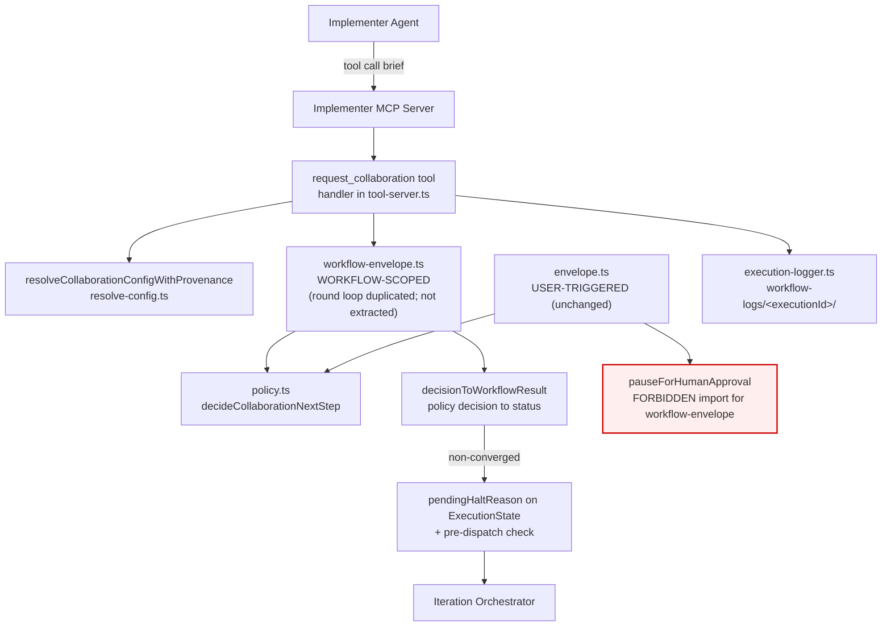
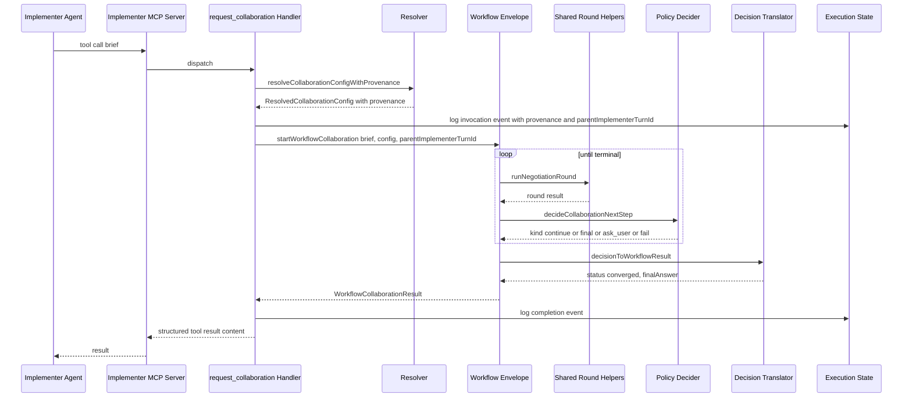
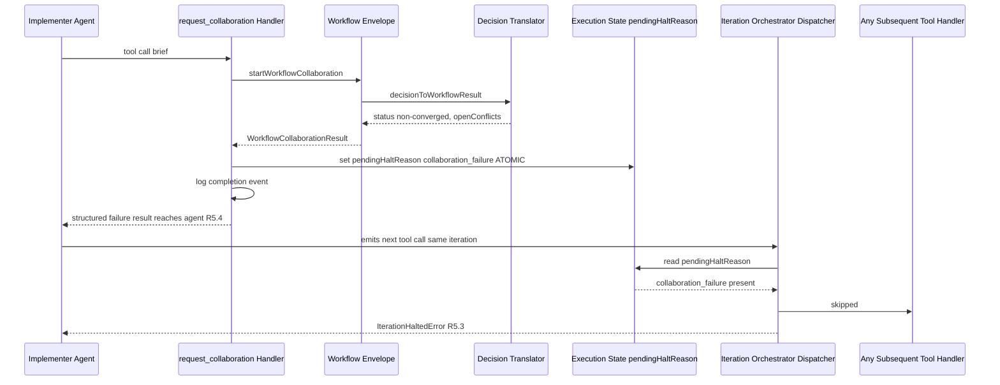

# Design Document — agent-invoked-collaboration

## Overview

**Purpose**: This feature delivers a structured escape hatch for hard judgment calls inside a graph workflow iteration: an implementer agent can invoke Collaboration Mode through a single MCP tool call (`request_collaboration`) and receive a structured outcome without leaving the iteration or pausing the run.

**Users**: Graph workflow implementer agents (the calling principal), and human operators who supervise unattended workflow runs (the observers). The feature does not address user-triggered `/collab` sessions, which remain unchanged.

**Impact**: Composes onto three existing primitives — the asymmetric collaboration slice (`src/lib/workflows/collaboration/`), the implementer MCP tool registry (`src/lib/workflow-graph/tool-server.ts`), and the per-context/workflow/global config cascade (`src/lib/workflow-graph/resolve-config.ts`) — without modifying their behavior in user-triggered flows. Adds one tool, one halt-reason branch, one config block, and a sibling envelope module.

### Goals

- Expose a single-argument MCP tool (`request_collaboration`) that runs collaboration mid-iteration and returns a structured outcome.
- Enforce the "no user pause" invariant by **construction**, not by runtime check: the workflow-scoped envelope must be physically unable to reach `pauseForHumanApproval()`.
- Trip a dedicated workflow-halting circuit breaker on any non-`converged` result, while still returning the structured failure to the calling agent.
- Preserve every existing `/collab` user-triggered behavior unchanged.

### Non-Goals

- Per-call agent override of `secondAgent`, `negotiationRounds`, or `autonomousResolutionThreshold` (agent supplies only `brief`).
- Tool availability to validators, regular sessions, or collaboration sub-agents.
- Provenance retrofit for other resolved config blocks (`implementer`, `contextValidator`, etc.) — provenance is added only to the new `collaboration` block.
- New second-agent backends or new collaboration policy categories.
- Cross-session/cross-project collaboration spawning.

## Boundary Commitments

### This Spec Owns

- The `request_collaboration` MCP tool registration, input schema, and handler.
- The workflow-scoped collaboration envelope module (`workflow-envelope.ts`) and the policy-decision-to-status translator (`decisionToWorkflowResult`).
- The `collaboration` block on `workflowDefaultsSchema` in `src/lib/config/schemas.ts` (global defaults), the matching block on `WorkflowConfigOverride` and `GraphWorkflowExecutionContextDefinition` in `src/lib/workflows/schemas.ts` (per-workflow / per-context overrides), the seeded default values in `src/lib/config/loader.ts`, and the provenance-aware resolver in `src/lib/workflow-graph/resolve-config.ts`.
- The new `type: "collaboration_failure"` branch of `graphWorkflowHaltReasonSchema` and the pre-dispatch pending-halt check that enforces "no further tool calls in the current iteration after a collaboration failure" — including the same-turn dispatch contract described in §System Flows.
- The new structured log events written to the canonical execution log (`workflow-logs/{executionId}/`) — see §Workflow Execution Logging — plus the lifecycle SSE events scoped to workflow-invoked collaboration runs.
- The `parentImplementerTurnId` and `origin: "workflow"` linkage fields on the **collaboration `featureSnapshot`** (not on the primitive `workflowEnvelopeSchema`).

### Out of Boundary

- The user-triggered `/collab` route, its envelope (`envelope.ts`), its pause-for-user-question flow, or its per-conversation setting drafts (R7). For the first cut this spec **does not extract shared helpers from `envelope.ts`** — see §Envelope Extraction Decision.
- The primitive `workflowEnvelopeSchema` in `src/lib/workflows/primitives/workflow-envelope-vocabulary.ts`. Its `featureSnapshot` field stays `z.unknown()`; collaboration-specific linkage is owned by the collaboration feature snapshot schema (see §Data Models).
- The existing `graphWorkflowCircuitBreakerConditionSchema` enum (intentionally NOT extended with `collaboration_failure`; the halt-reason branch is added at top level instead — see §10.2 of `research.md`).
- Provenance for existing config blocks (`implementer`, `contextValidator`, `scriptValidator`, `iterationPolicy`, `circuitBreaker`, `mutability`).
- Validator MCP tool surface — validators do not receive MCP tools at all (§10.3 of `research.md`).
- Modifying `pauseForHumanApproval()` or any shared collaboration primitive's signature.

### Allowed Dependencies

- `src/lib/workflows/collaboration/policy.ts` — pure decider (read-only consumer).
- `src/lib/workflows/collaboration/types.ts` — shared types (including the existing `CollaborationOpenConflict`, severity, and category schemas).
- The collaboration round/collaborator-invocation logic that already exists inside `envelope.ts`. For the first cut, `workflow-envelope.ts` **duplicates** the round loop locally rather than extracting it (see §Envelope Extraction Decision). `pauseForHumanApproval` remains a forbidden import.
- `src/lib/workflow-graph/iteration-orchestrator.ts` — depended on for `IterationHaltedError`, the pre-dispatch halt check, and the same-turn dispatch contract.
- `src/lib/config/schemas.ts` and `src/lib/config/loader.ts` — extended additively with the `collaboration` block on `workflowDefaultsSchema` (and its raw twin) plus seeded defaults.
- `src/lib/workflows/schemas.ts` — extended additively with the new halt-reason branch and with the `collaboration` block on `WorkflowConfigOverride` and per-context definition schemas.
- `src/lib/workflow-graph/resolve-config.ts` — extended with the provenance-aware resolver.
- `src/lib/workflow-graph/execution-logger.ts` — used (not modified) for canonical workflow-log entries; see §Workflow Execution Logging.
- `src/lib/logging` — structured logger (for general module logs, not the canonical workflow execution log).

### Revalidation Triggers

- **Halt-reason union shape** — any consumer of `haltReason.type` must handle the new `collaboration_failure` branch. TypeScript exhaustiveness will surface every site; revalidate UI/log surfaces in `src/features/` and any persisted-state migrations.
- **Tool-server context shape** — `GraphWorkflowToolServerContext` gains `allowAgentCollaboration`, `parentImplementerTurnId`, and `startWorkflowCollaboration(args)`. Existing call sites in `src/lib/mcp-gateway/workflow-execution-server.ts` must be revalidated.
- **Iteration orchestrator dispatch contract** — adds a pre-dispatch `pendingHaltReason` check and a same-turn dispatch contract (see §System Flows). Existing tools that throw `IterationHaltedError` still work; the new path adds a check before handler invocation and a serialization point at the top of the per-turn dispatch loop.
- **`workflowDefaultsSchema` in `src/lib/config/schemas.ts`** — gains a new `collaboration` block (and a matching optional twin in `rawWorkflowDefaultsSchema`). `src/lib/config/loader.ts` must seed the default. Persisted/loaded global config records must accept the new block.
- **`WorkflowConfigOverride` and per-context definition schemas in `src/lib/workflows/schemas.ts`** — each gains an optional `collaboration` override block. Persisted workflow definitions remain backward-compatible (block is optional).
- **Collaboration `featureSnapshot` schema** — gains discriminated `origin: "workflow"` variant carrying `parentImplementerTurnId`. Existing user-triggered envelopes are unaffected (they retain their current snapshot shape and treat the discriminator as absent).
- **Workflow execution log schema** — collaboration adds new event names on existing `decisions.jsonl` and per-context `tasks.jsonl` channels. Forensic consumers of these logs (operator UI, post-hoc agents) must accept the new event types.
- **Forbidden-import rule** — `workflow-envelope.ts` must NOT import `pauseForHumanApproval` or anything from `@/lib/workflows/primitives/human-approval-gate`. Enforce via ESLint `no-restricted-imports` rule (added in this spec) so the invariant is checked in CI.

## Architecture

### Existing Architecture Analysis

| Existing primitive | What it is today | Why it stays untouched here |
|---|---|---|
| `envelope.ts` (asymmetric collab slice) | HTTP-triggered slice; imports `pauseForHumanApproval` at line 36, calls it at line 855 | **Untouched in this spec.** R7 requires `/collab` UX unchanged; the workflow envelope duplicates the round/collaborator-invocation logic rather than extracting it (see §Envelope Extraction Decision). |
| `policy.ts` `decideCollaborationNextStep()` | Pure decider returning `kind: "final" \| "continue_negotiation" \| "ask_user" \| "fail"` | Reused verbatim. The new envelope translates its output to a status enum, but does not modify the decider. |
| `tool-server.ts` `registerGraphWorkflowExecutionTools()` | Registers `complete_task`, `upsert_shared_document`, conditionally `add_task` on implementer MCP server | Extended with a 4th conditional tool gated on `allowAgentCollaboration`. Pattern (Zod schema, `safeParse`, handler factory, structured return) reused. |
| `workflowDefaultsSchema` in `src/lib/config/schemas.ts` | Six-field defaults block (`implementer`, `contextValidator`, `scriptValidator`, `iterationPolicy`, `circuitBreaker`, `mutability`) | New seventh `collaboration` field added here (and its optional twin in `rawWorkflowDefaultsSchema`). Loader seeding in `src/lib/config/loader.ts`. |
| `resolve-config.ts` `resolveContext()` | `context.X ?? workflow.X ?? defaults.X` cascade | Extended additively with a `collaboration` block. A new sibling resolver `resolveCollaborationConfigWithProvenance()` is added for the provenance requirement (R2.5). |
| `graphWorkflowHaltReasonSchema` | ~12-branch discriminated union | New branch added at top level. Existing branches untouched. |
| Iteration orchestrator | `IterationHaltedError` short-circuits the current handler; `pendingHaltReason` field exists but is unused by dispatcher; tool calls within a single assistant turn dispatched via the MCP server one request at a time | New: same-turn dispatch contract documented (§System Flows) + pre-dispatch `pendingHaltReason` check raises `IterationHaltedError` BEFORE the next tool handler is called. |
| `execution-logger.ts` | Per-execution forensic log at `workflow-logs/{executionId}/` (lifecycle, decisions, per-context iterations/tasks/validation/prompts) | Used as-is. New event names (see §Workflow Execution Logging) written via existing `decision()` and `task()` channels. |
| Primitive `workflowEnvelopeSchema` | Generic lifecycle wrapper with opaque `featureSnapshot: z.unknown()` | Untouched. Collaboration-specific linkage (`parentImplementerTurnId`, `origin: "workflow"`) lives on the collaboration `featureSnapshot` schema, not the primitive. |

### Architecture Pattern & Boundary Map

**Selected pattern**: Sibling envelope + additive schema extension. The user-triggered envelope and the workflow envelope are two thin orchestrators that both compose the same set of pure helpers, differing only in their post-decision translator.



**Architecture Integration**:

- **Selected pattern**: Sibling envelope module (Option C / Hybrid from gap analysis §5). Variation is genuinely at the edges (post-decision handling), so a sibling file expresses the difference without forking the round loop. For the first cut we accept controlled duplication of the round/collaborator-invocation logic between `envelope.ts` and `workflow-envelope.ts` — see §Envelope Extraction Decision.
- **Domain boundaries**: Workflow envelope owns workflow-scoped invocation; user envelope owns user-triggered invocation. Each owns its own copy of the round loop for the first cut. Policy decider owns the pure decision function. No cross-talk between envelopes.
- **Existing patterns preserved**: Zod-first schemas, factory-pattern handler creation, `IterationHaltedError` for halt short-circuit, structured-log + SSE event emission, the per-execution forensic log under `workflow-logs/{executionId}/`.
- **New components rationale**: `workflow-envelope.ts` exists solely to make R4 verifiable by construction (no `pauseForHumanApproval` import). `decisionToWorkflowResult` exists as a pure translator so the mapping table is unit-testable in isolation. `resolveCollaborationConfigWithProvenance` exists because R2.5 demands per-field source-layer reporting that the current resolver discards.
- **Steering compliance** (engineering-principles): composes existing primitives (policy, tool-server, resolver, halt-reason union, execution logger); push variation to edges; agent-offloading principle (orchestrator owns iteration accounting, agent only emits brief).

### Technology Stack

| Layer | Choice / Version | Role in Feature | Notes |
|-------|------------------|-----------------|-------|
| Frontend / CLI | — | n/a | No UI work. Operator visibility flows through existing SSE/transcript surfaces. |
| Backend / Services | TypeScript + Next.js API routes | `tool-server.ts`, `workflow-envelope.ts`, orchestrator dispatcher | Strict TS, Zod-first per steering. |
| Data / Storage | Workflow envelope JSONL files (existing) + execution state JSON (existing) | Persisted collab envelope gains `parentImplementerTurnId`; halt-reason recorded on execution state. | No new storage technology. |
| Messaging / Events | SSE channels (existing) + structured logs | Reuse existing `graph-workflow-*` event channels for collaboration lifecycle visibility. | No new transports. |
| Infrastructure / Runtime | Bun (runtime), Vitest (tests) | Pre-dispatch halt check runs inside the existing iteration loop. | No new runtime requirements. |

## File Structure Plan

### Directory Structure

```
src/
├── lib/
│   ├── config/
│   │   ├── schemas.ts                         # MODIFY: add `collaboration` field to workflowDefaultsSchema + raw twin
│   │   └── loader.ts                          # MODIFY: seed default `collaboration` block when missing from global config
│   ├── workflow-graph/
│   │   ├── tool-server.ts                     # MODIFY: register `request_collaboration` conditionally
│   │   ├── iteration-orchestrator.ts          # MODIFY: pre-dispatch pendingHaltReason check + same-turn dispatch contract
│   │   ├── resolve-config.ts                  # MODIFY: add resolveCollaborationConfigWithProvenance
│   │   └── (execution-logger.ts)              # USE (no change): write new event names via existing decision()/task() channels
│   ├── workflows/
│   │   ├── collaboration/
│   │   │   ├── envelope.ts                    # UNTOUCHED: `/collab` UX preserved by design — no extraction in this spec
│   │   │   ├── feature-snapshot.ts            # NEW: discriminated `origin` snapshot schema (user | workflow); workflow variant carries parentImplementerTurnId
│   │   │   ├── workflow-envelope.ts           # NEW: workflow-scoped envelope; round loop is locally implemented (not extracted); forbidden from importing pauseForHumanApproval
│   │   │   ├── decision-to-workflow-result.ts # NEW: pure translator policy decision → status enum
│   │   │   ├── workflow-envelope.test.ts      # NEW: covers no-pause invariant + parity-vs-envelope.ts on shared round inputs
│   │   │   └── decision-to-workflow-result.test.ts # NEW: table-driven over all PolicyAskUserReason values
│   │   └── schemas.ts                         # MODIFY: collaboration_failure halt branch + `collaboration` block on WorkflowConfigOverride + per-context override + WorkflowCollaborationResult schema
│   ├── mcp-gateway/
│   │   └── workflow-execution-server.ts       # MODIFY: pass `allowAgentCollaboration`, `parentImplementerTurnId`, and `startWorkflowCollaboration` through DI
│   └── workflows/primitives/
│       └── workflow-envelope-vocabulary.ts    # UNTOUCHED: featureSnapshot stays `z.unknown()`
├── eslint.config.mjs (or equivalent)          # MODIFY: no-restricted-imports rule banning pauseForHumanApproval + human-approval-gate from workflow-envelope.ts and feature-snapshot.ts
└── (tests colocated next to each modified/new module per project convention)
```

### Modified Files

- `src/lib/config/schemas.ts` — Add `collaboration: workflowCollaborationConfigSchema` to `workflowDefaultsSchema` (and the optional twin on `rawWorkflowDefaultsSchema`). Import `workflowCollaborationConfigSchema` from `src/lib/workflows/schemas.ts`.
- `src/lib/config/loader.ts` — When a parsed `GlobalConfig` omits `workflowDefaults.collaboration`, inject the seeded default (`secondAgent: { agent: "codex" }`, `negotiationRounds: 2`, `autonomousResolutionThreshold: "minor"` — concrete values TBD per existing `/collab` defaults). Mirror the existing seeding pattern for the other six `workflowDefaults` fields.
- `src/lib/workflow-graph/tool-server.ts` — Add `request_collaboration` registration gated on `context.allowAgentCollaboration`. Add `requestCollaborationSchema` (`{ brief: string }` strict) + handler factory mirroring `createCompleteTaskHandler`.
- `src/lib/workflow-graph/iteration-orchestrator.ts` — (a) Document and enforce the same-turn dispatch contract: tool calls within a single assistant turn are dispatched **sequentially**, awaiting each handler's promise before invoking the next handler from the same turn (see §System Flows). (b) Add the pre-dispatch check: before invoking each tool handler, read `pendingHaltReason` from execution state; if non-null, throw `IterationHaltedError(pendingHaltReason)` instead of dispatching.
- `src/lib/workflow-graph/resolve-config.ts` — Add `resolveCollaborationConfigWithProvenance(globalDefaults, workflowConfig, contextConfig): ResolvedCollaborationConfig`. Existing resolvers untouched.
- `src/lib/workflows/schemas.ts` — Add `graphWorkflowHaltReasonSchema` branch `{ type: "collaboration_failure", status, brief, executionContextId, conversationId, summary }`. Add `workflowCollaborationConfigSchema` (exported so `src/lib/config/schemas.ts` can compose it). Add `collaboration` override block to `workflowConfigOverrideSchema` and `graphWorkflowExecutionContextDefinitionSchema.collaboration?`. Add `workflowCollaborationResultSchema` and `workflowCollaborationStatusSchema`.
- `src/lib/mcp-gateway/workflow-execution-server.ts` — Plumb `allowAgentCollaboration`, `parentImplementerTurnId`, and `startWorkflowCollaboration` into `GraphWorkflowToolServerContext` for implementer registrations. Validator path is untouched (no MCP context there).
- `.eslintrc` (or `eslint.config.mjs`) — Add `no-restricted-imports` rule scoped to `src/lib/workflows/collaboration/workflow-envelope.ts` and `src/lib/workflows/collaboration/feature-snapshot.ts` (and any module they import from), banning `pauseForHumanApproval`, `@/lib/workflows/primitives/human-approval-gate`, and the user-triggered `envelope.ts` module so transitive reachability to the pause primitive is impossible.

### New Files

- `src/lib/workflows/collaboration/feature-snapshot.ts` — Discriminated Zod schema for the collaboration `featureSnapshot` field. Two variants keyed by `origin`: `"user"` (existing user-triggered shape, captured as it is today so the schema is round-trip safe) and `"workflow"` (new, carries `parentImplementerTurnId`, `executionContextId`, `conversationId`, `resolvedConfig`). The collaboration manager and `workflow-envelope.ts` write through this schema; the primitive `workflowEnvelopeSchema.featureSnapshot` stays `z.unknown()`.
- `src/lib/workflows/collaboration/workflow-envelope.ts` — Workflow-scoped orchestrator. Implements its own round loop locally (controlled duplication of the round/collaborator-invocation logic from `envelope.ts`); composes `policy.ts` + `decision-to-workflow-result.ts`; writes collaboration snapshots through `feature-snapshot.ts` with `origin: "workflow"`. **Must NOT import `pauseForHumanApproval`, `@/lib/workflows/primitives/human-approval-gate`, or `envelope.ts`.**
- `src/lib/workflows/collaboration/decision-to-workflow-result.ts` — Pure function `decisionToWorkflowResult(decision: CollaborationPolicyDecision): WorkflowCollaborationResult`. Single source for the mapping table in §10.1 of `research.md`.
- Colocated `*.test.ts` files for each new module.

### Envelope Extraction Decision

This spec **does not extract** `runNegotiationRound` or collaborator-invocation helpers from `envelope.ts` into a shared module. `envelope.ts` is large, stateful, and load-bearing for the user-triggered `/collab` flow (R7). Extracting helpers without a precise boundary would put R7.1 / R7.2 at material risk for marginal short-term benefit.

Instead, `workflow-envelope.ts` duplicates the round/collaborator-invocation logic locally. To prevent drift between the two implementations:

- `workflow-envelope.test.ts` includes a parity test that feeds the same canned round inputs to both envelopes (via dependency injection of the policy decider and collaborator caller) and asserts agreement on round-level outcomes (not on terminal decisions — those legitimately differ once the post-decision handlers diverge).
- A follow-up spec (out of scope here) may extract the shared round mechanics once both envelopes are stable, both test suites are green on the parity test, and a precise extraction boundary can be documented.

Trade-off accepted: ~150–250 lines of duplication today, in exchange for a trivially-checkable R7 guarantee (the user-triggered envelope is literally not touched).

## System Flows

### Same-Turn Tool Dispatch Contract

The Claude Agent SDK can emit multiple `tool_use` blocks in a single assistant turn. R5.3 ("no further tool calls in the current iteration after a collaboration failure") and R5.4 ("structured result still returned to the calling agent") together require that, within a turn that includes a non-converged `request_collaboration`, **no sibling tool call in that same turn executes its handler**, but the `request_collaboration` tool_use still receives its structured tool_result.

The iteration orchestrator enforces this with a two-part contract:

1. **Sequential per-turn handler dispatch.** Tool handlers for the `tool_use` blocks of a single assistant turn are awaited one at a time. The orchestrator does not start handler N+1 until handler N's promise has resolved and its `tool_result` has been recorded. (No `Promise.all` over per-turn tool_use blocks; existing MCP transport already serializes individual requests, this is the contractual statement that we will not parallelize at the dispatch layer.)
2. **Pre-dispatch halt check.** Before invoking each tool handler in the per-turn loop, the orchestrator reads `pendingHaltReason` from execution state. If non-null, the orchestrator emits a synthetic `tool_result` with `isError: true` and message `"iteration halted: collaboration_failure"` for the remaining `tool_use` blocks of the same turn, then throws `IterationHaltedError(pendingHaltReason)` to short-circuit the iteration. The synthetic `tool_result` is necessary so the SDK can reconcile each `tool_use` with a matching result before the run terminates.

The `request_collaboration` handler writes `pendingHaltReason` **before** returning its own `WorkflowCollaborationResult`. Because dispatch is sequential and the check is read on each handler entry, any sibling tool_use that follows `request_collaboration` within the same turn is blocked from running its handler, and any sibling that preceded `request_collaboration` has already completed (which is acceptable — R5.3 only requires no *further* tool calls after the collaboration failure).

This contract is documented and enforced in the orchestrator dispatch loop and is covered by Integration Test "same-turn halt" below.

### Happy path — converged



### Failure path — non-converged + halt



**Flow-level decisions**:

- The tool handler writes `pendingHaltReason` **before** returning the result. The orchestrator's pre-dispatch check inspects the same field on every subsequent tool invocation in the same iteration. Combined with the same-turn dispatch contract above, this guarantees R5.3 (no further tool calls) without breaking R5.4 (result reaches agent).
- The pre-dispatch check is a single read on `executionState.pendingHaltReason`; existing tools without pending halts pay only one nullable check per dispatch.
- The translator function is the **only** code that maps `CollaborationPolicyDecision` to a workflow status. Every status decision flows through it, so the mapping table in §10.1 of `research.md` is single-sourced.

## Workflow Execution Logging

Forensic visibility for agent-invoked collaboration is delivered through the existing per-execution log surface at `workflow-logs/{executionId}/` implemented by `src/lib/workflow-graph/execution-logger.ts`. Module-level `createLogger(...)` calls remain for general dev/debug logs, but the **authoritative** records required by R2.5, R5.2, R6.1, and R6.4 are written here.

| Event | File | Channel | Payload |
|---|---|---|---|
| `collaboration.request_collaboration.invoked` | `contexts/{executionContextId}/tasks.jsonl` | `task(contextId, event, data)` | `{ parentImplementerTurnId, conversationId, brief, resolvedConfig: ResolvedCollaborationConfig }` (R2.5, R6.1) |
| `collaboration.request_collaboration.completed` | `contexts/{executionContextId}/tasks.jsonl` | `task(contextId, event, data)` | `{ parentImplementerTurnId, conversationId, status, roundsConsumed, openConflictsSummary, resolvedConfig }` (R6.4) |
| `collaboration.failure_halt` | `decisions.jsonl` | `decision(event, data)` | `{ executionContextId, conversationId, parentImplementerTurnId, status, brief, resolvedConfig, openConflicts }` (R5.2) |

Field requirements:
- `resolvedConfig` is the full `ResolvedCollaborationConfig` value object (each field carries `value` + `source`), satisfying R2.5's per-field source-layer reporting on every invocation log entry.
- `openConflictsSummary` is a structured array of `{ rejectingAgent, disputedPoint, severity, category }` — same shape as the `WorkflowCollaborationResult.openConflicts` payload returned to the agent.
- The `parentImplementerTurnId` is duplicated across all three event rows so any single log line is independently joinable to the implementer turn that issued the tool call (R6.1, R6.2).

The handler accesses the per-execution logger via `getExecutionLogger(executionId)`. If no logger is registered (only possible in tests that don't initialize the registry), the handler logs a warning via the module logger and continues — the canonical log is best-effort by design (`execution-logger.ts` silently drops on write failure), so production correctness does not depend on log durability.

R6.3 ("same real-time observability events used for any other workflow agent activity"): the SSE surface is unchanged. `WorkflowAgentCaller`-spawned sub-agents in the workflow envelope emit conversation activity through the same channel used by implementer/validator agents elsewhere in the graph workflow; the operator UI joins them to the parent implementer turn via the `parentImplementerTurnId` field present on every collaboration-scoped log row above. No new SSE event types are introduced.

## Requirements Traceability

| Requirement | Summary | Components | Interfaces | Flows |
|---|---|---|---|---|
| 1.1 | Tool starts collab on non-empty brief | `request_collaboration` handler, Workflow Envelope | `requestCollaborationSchema`, `startWorkflowCollaboration` | Happy path |
| 1.2 | Tool exposed only to implementer | tool-server.ts registration gate | `GraphWorkflowToolServerContext.allowAgentCollaboration` | — |
| 1.3 | Not listed for validators | tool-server.ts (no validator MCP path) | Construction property — validator has no MCP context | — |
| 1.4 | Not listed in regular sessions | tool-server.ts | Construction property — regular sessions never call `registerGraphWorkflowExecutionTools` | — |
| 1.5 | Not listed inside spawned collab | Workflow envelope spawns collaborators via `WorkflowAgentCaller` (no MCP) | Construction property — collab sub-agents have no MCP context | — |
| 1.6 | Reject empty/whitespace brief | `requestCollaborationSchema` Zod `.trim().min(1)` | `createValidationErrorResult` | — |
| 1.7 | Reject extra fields | `requestCollaborationSchema.strict()` | `createValidationErrorResult` | — |
| 2.1 | Cascade per-node → workflow → global | `resolveCollaborationConfigWithProvenance` | `ResolvedCollaborationConfig` | Happy path R step |
| 2.2 | Workflow value used when per-node omits | Same resolver | Same | — |
| 2.3 | Global default when both omit | Same resolver + `SEEDED_DEFAULTS.collaboration` | Same | — |
| 2.4 | Ignore agent-supplied settings | `requestCollaborationSchema.strict()` (no extra keys) | — | — |
| 2.5 | Record resolved settings + source layer | `resolveCollaborationConfigWithProvenance`, `collaboration.request_collaboration.invoked` entry in `contexts/<id>/tasks.jsonl` | `ResolvedCollaborationConfig.fieldName.source` | Happy path log step + §Workflow Execution Logging |
| 3.1 | Converged status + finalAnswer | `decisionToWorkflowResult` | `WorkflowCollaborationResult` | Happy path |
| 3.2 | Threshold none + remaining → requires_user_input | `decisionToWorkflowResult` | Same | Failure path |
| 3.3 | Persistent objective disagreement → objective_disagreement | `decisionToWorkflowResult` | Same | Failure path |
| 3.4 | Rounds exhausted → rounds_exhausted | `decisionToWorkflowResult` | Same | Failure path |
| 3.5 | Non-converged populates openConflicts | Workflow envelope tracks conflicts; translator copies them | `WorkflowCollaborationResult.openConflicts` | Failure path |
| 3.6 | Exactly one status per invocation | `WorkflowCollaborationResultSchema` Zod literal enum | — | — |
| 3.7 | Uniform shape across outcomes | `WorkflowCollaborationResultSchema` (optional finalAnswer, optional openConflicts) | — | — |
| 4.1 | No user-facing prompt | Workflow envelope module + ESLint `no-restricted-imports` rule | Construction property | — |
| 4.2 | Ask-user policy → return non-converged | `decisionToWorkflowResult` | `WorkflowCollaborationResult` | Failure path |
| 4.3 | No user-action SSE events | Workflow envelope emits `graph-workflow-collaboration-*` events only | Construction property | — |
| 4.4 | No resume flow required | Workflow envelope is synchronous over the run | — | Happy + failure paths |
| 5.1 | Non-converged trips dedicated breaker | `pendingHaltReason = { type: "collaboration_failure", ... }` | `graphWorkflowHaltReasonSchema` new branch | Failure path |
| 5.2 | Failure recorded with brief, settings, conflicts | `request_collaboration` handler writes `collaboration.failure_halt` entry to `decisions.jsonl` with full payload | `getExecutionLogger(executionId).decision(...)` | Failure path + §Workflow Execution Logging |
| 5.3 | No further tool calls or iterations | Pre-dispatch `pendingHaltReason` check + same-turn dispatch contract in orchestrator | `IterationHaltedError` + synthetic `tool_result` emission | Failure path + §Same-Turn Tool Dispatch Contract |
| 5.4 | Structured result still returned to agent | Handler writes halt **then** returns result | — | Failure path |
| 5.5 | Distinct halt reason in run status | `type: "collaboration_failure"` branch separate from `circuit_breaker` | `graphWorkflowHaltReasonSchema` | — |
| 6.1 | Invocation log event | `collaboration.request_collaboration.invoked` entry in `contexts/<executionContextId>/tasks.jsonl` | `getExecutionLogger(executionId).task(...)` payload `{ parentImplementerTurnId, conversationId, brief, resolvedConfig }` | Happy path log step + §Workflow Execution Logging |
| 6.2 | Transcript entries linked to implementer turn | `parentImplementerTurnId` on the collaboration `featureSnapshot` (workflow-origin variant), plus on every collaboration-scoped execution-log row | `collaborationFeatureSnapshotSchema` workflow variant | — |
| 6.3 | Real-time SSE events for visibility | Reuse `graph-workflow-*` SSE channel; `WorkflowAgentCaller`-spawned sub-agents emit conversation activity normally; operator UI joins via `parentImplementerTurnId` from execution-log rows | Existing SSE plumbing (no new event types) | §Workflow Execution Logging |
| 6.4 | Completion log event | `collaboration.request_collaboration.completed` entry in `contexts/<executionContextId>/tasks.jsonl` | `getExecutionLogger(executionId).task(...)` payload `{ status, roundsConsumed, openConflictsSummary, resolvedConfig }` | Happy + failure paths + §Workflow Execution Logging |
| 7.1 | `/collab` unchanged | `envelope.ts` behavior preserved; refactor is test-guarded | Existing user-triggered envelope contract | — |
| 7.2 | User-question resume flow preserved | `pauseForHumanApproval` still called from `envelope.ts` | — | — |
| 7.3 | Per-conversation drafts honored | `envelope.ts` continues to read drafts; workflow envelope ignores drafts | Construction property — separate modules | — |

## Components and Interfaces

| Component | Domain/Layer | Intent | Req Coverage | Key Dependencies | Contracts |
|---|---|---|---|---|---|
| `request_collaboration` Handler | MCP tool / workflow-graph | Validates input, resolves config, runs envelope, records halt on non-converged | 1.1, 1.6, 1.7, 2.5, 5.1, 5.2, 5.4, 6.1, 6.4 | resolver (P0), workflow envelope (P0), `IterationHaltedError` (P1) | Service, Event |
| Tool-Server Scope Gate | MCP tool registration | Conditionally registers tool based on `allowAgentCollaboration` | 1.2, 1.3, 1.4 | `GraphWorkflowToolServerContext` (P0) | Service |
| Workflow Collaboration Envelope | Workflows / collaboration | Workflow-scoped slice; never reaches `pauseForHumanApproval` | 1.1, 4.1, 4.2, 4.3, 4.4, 6.2 | shared-round helpers (P0), policy decider (P0), translator (P0) | Service, State |
| Decision-to-Workflow-Result Translator | Pure | Maps `CollaborationPolicyDecision` to `WorkflowCollaborationResult` | 3.1–3.7, 4.2 | policy types (P0) | Service |
| Collaboration Config Resolver (with provenance) | Workflows / config | Resolves cascade with per-field source-layer tracking | 2.1–2.3, 2.5 | `WorkflowDefaults` (P0), `WorkflowConfigOverride` (P0), per-context schema (P0) | Service |
| Halt-Reason Schema Extension | Workflows / schemas | Adds `collaboration_failure` branch to discriminated union | 5.1, 5.5 | Existing halt-reason consumers (P0) | State |
| Pre-Dispatch Halt Check | Workflow-graph / orchestrator | Reads `pendingHaltReason` before each tool dispatch; raises `IterationHaltedError` if set | 5.3 | Execution state (P0), `IterationHaltedError` (P0) | Service |
| Collaboration `featureSnapshot` Schema | Workflows / collaboration | Discriminated `origin` union; owns workflow-specific linkage fields written into the primitive envelope's opaque `featureSnapshot` | 6.2 | Workflow envelope persistence (P0), primitive `workflowEnvelopeSchema` (P0, untouched) | Data |
| Workflow Execution Log Writer | Workflows / collaboration + Workflow-graph / execution-logger | Writes canonical invocation/completion/failure entries to `workflow-logs/{executionId}/` | 2.5, 5.2, 6.1, 6.4 | `getExecutionLogger` (P0) | Event |
| Same-Turn Dispatch Contract | Workflow-graph / orchestrator | Sequential per-turn handler dispatch + synthetic tool_result emission for blocked sibling tool_use blocks | 5.3, 5.4 | Execution state (P0), `IterationHaltedError` (P0) | Service |
| ESLint Forbidden-Import Rule | Build / lint | Bans `pauseForHumanApproval`, `human-approval-gate`, and `envelope.ts` imports from `workflow-envelope.ts` + `feature-snapshot.ts` | 4.1 (construction guarantee) | ESLint config (P1) | — |

### Workflow Graph / MCP Tool

#### `request_collaboration` Handler

| Field | Detail |
|---|---|
| Intent | Validate `{brief}`, resolve config, run workflow envelope, return structured result, record halt on non-converged |
| Requirements | 1.1, 1.6, 1.7, 2.5, 5.1, 5.2, 5.4, 6.1, 6.4 |

**Responsibilities & Constraints**
- Owns: Zod validation, resolver invocation, halt recording ordering (`pendingHaltReason` BEFORE return), invocation/completion log events.
- Does not own: collaboration round mechanics (delegated to envelope), policy decision (delegated to decider), status translation (delegated to translator).
- Invariant: when status ≠ `converged`, `pendingHaltReason` is recorded atomically before the tool return value is constructed.

**Dependencies**
- Inbound: implementer MCP server dispatch (P0)
- Outbound: `resolveCollaborationConfigWithProvenance` (P0), `workflowEnvelope.start(...)` (P0), execution-events publisher (P0), execution-state writer (P0)
- External: none

**Contracts**: Service [x] / Event [x]

##### Service Interface

```typescript
type RequestCollaborationInput = {
  brief: string;
};

type RequestCollaborationToolContext = GraphWorkflowToolServerContext & {
  allowAgentCollaboration: true;
  parentImplementerTurnId: string;
  executionContextId: string;
  conversationId: string;
  startWorkflowCollaboration(args: {
    brief: string;
    resolvedConfig: ResolvedCollaborationConfig;
    parentImplementerTurnId: string;
    executionContextId: string;
    conversationId: string;
  }): Promise<WorkflowCollaborationResult>;
};

interface RequestCollaborationHandler {
  handle(input: RequestCollaborationInput): Promise<MCPToolResult>;
}
```

- Preconditions: caller is in implementer role; tool registered (R1.2); input passes `requestCollaborationSchema`.
- Postconditions: structured result returned; on non-converged, `pendingHaltReason` recorded on execution state before return.
- Invariants: handler never returns a `converged` status with a halt recorded; halt is recorded only on non-converged outcomes.

##### Event Contract

- Published events:
  - `graph-workflow.tool.request_collaboration.invoked` — payload: `{ runId, executionContextId, conversationId, parentImplementerTurnId, brief, resolvedConfig: ResolvedCollaborationConfig }`
  - `graph-workflow.tool.request_collaboration.completed` — payload: `{ runId, executionContextId, conversationId, parentImplementerTurnId, status, roundsConsumed, openConflictsSummary, resolvedConfig }`
- Ordering / delivery: emitted within the handler invocation; relayed via existing SSE channel (best-effort, at-least-once).

**Implementation Notes**
- Validation: mirrors `complete_task` (`safeParse` → `createValidationErrorResult` on failure).
- Halt ordering: see §10.5 of `research.md` — `pendingHaltReason` written before result construction.
- Risk: ensuring `parentImplementerTurnId` is always available in the tool context. Solved by deriving from current iteration/conversation in `workflow-execution-server.ts` plumbing.

### Workflows / Collaboration

#### Workflow Collaboration Envelope

| Field | Detail |
|---|---|
| Intent | Run the asymmetric collaboration loop in workflow context; never pause for user input |
| Requirements | 1.1, 4.1, 4.2, 4.3, 4.4, 6.2 |

**Responsibilities & Constraints**
- Composes shared round helpers (`runNegotiationRound`) and the policy decider; translates the terminal decision via `decisionToWorkflowResult`.
- Does not import `pauseForHumanApproval` (CI-enforced via ESLint).
- Persists the collab envelope with `parentImplementerTurnId` and links to existing event channels.

**Dependencies**
- Inbound: `request_collaboration` handler (P0)
- Outbound: shared-round helpers (P0), policy decider (P0), translator (P0), envelope persistence (P0)
- External: none

**Contracts**: Service [x] / State [x]

##### Service Interface

```typescript
interface WorkflowCollaborationEnvelope {
  start(args: {
    brief: string;
    resolvedConfig: ResolvedCollaborationConfig;
    parentImplementerTurnId: string;
    executionContextId: string;
    conversationId: string;
  }): Promise<WorkflowCollaborationResult>;
}
```

- Preconditions: `resolvedConfig` is the only authority for `secondAgent`, `negotiationRounds`, `autonomousResolutionThreshold` (R2.4).
- Postconditions: returns a `WorkflowCollaborationResult`; persists envelope record with `parentImplementerTurnId`.
- Invariants: no code path leads to `pauseForHumanApproval()`; SSE/log events do not include `user_action_required`-style payloads.

##### State Management

- State model: round-by-round transcript + policy decision history (workflow envelope owns its own copy of the round-loop state shape; not extracted from the user envelope).
- Persistence: same JSONL primitive envelope store used by the user-triggered envelope. The primitive envelope record itself is unchanged; the discriminated `collaborationFeatureSnapshotSchema` (with `origin: "workflow"`) is written into the existing opaque `featureSnapshot` field. `parentImplementerTurnId`, `executionContextId`, `conversationId`, and `resolvedConfig` live on the workflow-variant snapshot.
- Concurrency: a workflow envelope runs synchronously within the calling tool invocation; no concurrent rounds.

**Implementation Notes**
- Integration: instantiated by `request_collaboration` handler with resolved config and turn linkage. Writes execution-log events through `getExecutionLogger(executionId)` (see §Workflow Execution Logging).
- Validation: relies on translator for status-mapping correctness; covered by table-driven tests.
- Drift mitigation: because the round loop is duplicated rather than extracted (§Envelope Extraction Decision), a parity test in `workflow-envelope.test.ts` feeds canned round inputs through both envelopes (via DI of policy + collaborator caller) and asserts agreement on round-level outcomes. Terminal decisions legitimately diverge once the workflow envelope routes through the translator instead of the pause primitive.

#### Decision-to-Workflow-Result Translator

| Field | Detail |
|---|---|
| Intent | Pure function: map `CollaborationPolicyDecision` → `WorkflowCollaborationResult` |
| Requirements | 3.1–3.7, 4.2 |

**Responsibilities & Constraints**
- Only code allowed to construct a `WorkflowCollaborationResult.status` value.
- No side effects; no I/O; no environment.

##### Service Interface

```typescript
function decisionToWorkflowResult(args: {
  decision: CollaborationPolicyDecision;
  finalAnswer: string | null;
  openConflicts: ReadonlyArray<CollaborationOpenConflict>;
}): WorkflowCollaborationResult;
```

- Preconditions: `decision.kind !== "continue_negotiation"` (caller drives the loop until terminal).
- Postconditions: result conforms to `workflowCollaborationResultSchema`; `status` matches the mapping in §10.1 of `research.md`.
- Invariants: `status === "converged"` ⇒ `finalAnswer` is a non-empty string; `status !== "converged"` ⇒ `openConflicts.length >= 1`.

### Workflow Graph / Config

#### Collaboration Config Resolver (with provenance)

| Field | Detail |
|---|---|
| Intent | Resolve `secondAgent`, `negotiationRounds`, `autonomousResolutionThreshold` and report which layer supplied each |
| Requirements | 2.1, 2.2, 2.3, 2.5 |

##### Service Interface

```typescript
type CollaborationConfigSource = "per-node" | "workflow" | "global";

interface ProvenancedField<T> {
  value: T;
  source: CollaborationConfigSource;
}

interface ResolvedCollaborationConfig {
  secondAgent: ProvenancedField<GraphWorkflowAgentConfig>;
  negotiationRounds: ProvenancedField<number>;
  autonomousResolutionThreshold: ProvenancedField<CollaborationAutonomousResolutionThreshold>;
}

function resolveCollaborationConfigWithProvenance(
  globalDefaults: WorkflowDefaults,
  workflowConfig: WorkflowConfigOverride,
  contextConfig: GraphWorkflowExecutionContextDefinition,
): ResolvedCollaborationConfig;
```

- Preconditions: `globalDefaults.collaboration` is always defined (seeded).
- Postconditions: every field has `value` + `source`; `source` reflects the first layer in the cascade that supplied a non-null value.
- Invariants: no `??` over the three settings — each field is computed independently.

### Workflow Graph / Orchestrator

#### Pre-Dispatch Halt Check

| Field | Detail |
|---|---|
| Intent | Before invoking a tool handler, read `pendingHaltReason`; if non-null, raise `IterationHaltedError` |
| Requirements | 5.3 |

**Responsibilities & Constraints**
- Owns: the read of `pendingHaltReason` on each tool dispatch.
- Does not own: setting `pendingHaltReason` (set by the `request_collaboration` handler).
- Invariant: every tool dispatch in the iteration loop passes through this check.

**Implementation Notes**
- Integration: insert one read at the top of the existing tool-call dispatch routine in `iteration-orchestrator.ts`. If `pendingHaltReason` is non-null, throw `IterationHaltedError(pendingHaltReason)` immediately (no handler invocation).
- Validation: an orchestrator unit test verifying that after setting `pendingHaltReason`, the next tool dispatch raises `IterationHaltedError` before the handler runs.
- Risk: subtle bug if any existing dispatch path bypasses the check. Mitigation: the check is in a single function called by all dispatch paths; coverage test asserts no bypass.

## Data Models

### Domain Model

Three new concepts and three extended ones:

- **WorkflowCollaborationResult** (new value object): the structured outcome the tool returns. Mutually exclusive `status`; optional `finalAnswer`; optional `openConflicts`.
- **ResolvedCollaborationConfig** (new value object): per-field value + source layer.
- **CollaborationFeatureSnapshot** (new value object, owned by the collaboration feature, not the primitive layer): discriminated by `origin: "user" | "workflow"`. The `"workflow"` variant carries `parentImplementerTurnId`, `executionContextId`, `conversationId`, and `resolvedConfig`. This is what gets written into the primitive envelope's existing opaque `featureSnapshot` field.
- **WorkflowDefaults** (extended in `src/lib/config/schemas.ts`): adds a `collaboration` field.
- **WorkflowConfigOverride / Per-Context Definition** (extended in `src/lib/workflows/schemas.ts`): each gains an optional `collaboration` block.
- **GraphWorkflowHaltReason** (extended): adds `collaboration_failure` branch.

### Logical Data Model

**Structure Definition** (Zod, additive only):

```typescript
// 1) Tool input schema (strict)
const requestCollaborationSchema = z
  .object({
    brief: z
      .string()
      .trim()
      .min(1)
      .describe(
        "A self-contained description of the judgment call you need a second opinion on. Include all context the second agent needs — your conversation is not visible to it.",
      ),
  })
  .strict();

// 2) Collaboration config block.
//    - Exported from src/lib/workflows/schemas.ts.
//    - Composed into workflowDefaultsSchema in src/lib/config/schemas.ts.
//    - Composed (as optional) into workflowConfigOverrideSchema and the per-context
//      definition schema in src/lib/workflows/schemas.ts.
const workflowCollaborationConfigSchema = z.object({
  secondAgent: graphWorkflowAgentConfigSchema,
  negotiationRounds: z.number().int().positive(),
  autonomousResolutionThreshold: collaborationAutonomousResolutionThresholdSchema,
});

// 2b) Collaboration featureSnapshot (lives in src/lib/workflows/collaboration/feature-snapshot.ts).
//     The primitive workflowEnvelopeSchema.featureSnapshot stays z.unknown(); this schema
//     is the contract the collaboration feature reads/writes through.
const collaborationFeatureSnapshotUserSchema = z.object({
  origin: z.literal("user"),
  // ... existing fields the user-triggered envelope writes today; captured here so
  //     the schema is round-trip safe over the existing JSONL store.
});

const collaborationFeatureSnapshotWorkflowSchema = z.object({
  origin: z.literal("workflow"),
  parentImplementerTurnId: z.string().min(1),
  executionContextId: z.string().min(1),
  conversationId: z.string().min(1),
  resolvedConfig: resolvedCollaborationConfigSchema, // see Service Interface for resolver
});

const collaborationFeatureSnapshotSchema = z.discriminatedUnion("origin", [
  collaborationFeatureSnapshotUserSchema,
  collaborationFeatureSnapshotWorkflowSchema,
]);

// 3) Halt reason — new branch
const collaborationFailureHaltReasonSchema = z.object({
  type: z.literal("collaboration_failure"),
  status: workflowCollaborationStatusSchema, // see #5
  brief: z.string(),
  executionContextId: z.string(),
  conversationId: z.string(),
  summary: z.string(), // 1-line operator-facing reason
});

// 4) Workflow collaboration result schema
const workflowCollaborationStatusSchema = z.enum([
  "converged",
  "rounds_exhausted",
  "requires_user_input",
  "objective_disagreement",
]);

const workflowCollaborationResultSchema = z
  .object({
    status: workflowCollaborationStatusSchema,
    finalAnswer: z.string().min(1).nullable(),
    openConflicts: z
      .array(
        z.object({
          rejectingAgent: z.enum(["agent_one", "agent_two"]),
          disputedPoint: z.string().min(1),
          severity: collaborationDisagreementSeveritySchema,
          category: collaborationDisagreementCategorySchema,
        }),
      )
      .default([]),
  })
  .superRefine((result, ctx) => {
    if (result.status === "converged" && !result.finalAnswer) {
      ctx.addIssue({
        code: "custom",
        message: "converged result must include finalAnswer",
      });
    }
    if (result.status !== "converged" && result.openConflicts.length === 0) {
      ctx.addIssue({
        code: "custom",
        message: "non-converged result must populate at least one openConflict",
      });
    }
  });
```

**Consistency & Integrity**:
- The halt-reason union (`graphWorkflowHaltReasonSchema`) gains one branch; persisted execution state files written with the new branch require any consumer reading them to handle the new `type`. TypeScript exhaustiveness checks cover every consumer at compile time.
- `workflowDefaultsSchema.collaboration` in `src/lib/config/schemas.ts` is **required** (not optional) on the parsed `WorkflowDefaults` type so the resolver can always find a global layer. The raw twin (`rawWorkflowDefaultsSchema.collaboration`) is **optional** so existing persisted global config files remain valid; `src/lib/config/loader.ts` injects the seeded default at parse time.
- The collaboration `featureSnapshot` schema is a discriminated union on `origin`. Existing user-triggered records on disk do not carry an `origin` field today; the loader treats absent `origin` as `"user"` (handled inside the collaboration manager when it reads the snapshot), so no data migration is required.

### Physical Data Model

- Persisted execution state JSON gains a possible `pendingHaltReason.type === "collaboration_failure"` value. Backward-compatible (additive branch in discriminated union; existing files without it remain valid).
- The **primitive** workflow envelope JSONL records (`workflow-envelope-vocabulary.ts`) are unchanged. The opaque `featureSnapshot` field carries collaboration-specific data per the discriminated `collaborationFeatureSnapshotSchema`: for workflow-invoked collaborations, the snapshot has `origin: "workflow"` and includes `parentImplementerTurnId`, `executionContextId`, `conversationId`, and `resolvedConfig`. User-triggered envelopes carry the existing shape (with `origin: "user"` injected at write time, treated as the default when absent on read).
- Per-execution forensic log files under `workflow-logs/{executionId}/` gain three new event names (see §Workflow Execution Logging). The file layout itself is unchanged.

### Data Contracts & Integration

**Tool Data Transfer**
- Request: `{ brief: string }` (Zod-validated, strict).
- Response: MCP tool result with `content: [{ type: "text", text: JSON.stringify(workflowCollaborationResult) }]`. The text payload is the JSON-serialized `WorkflowCollaborationResult`. `isError` is unset for both converged and non-converged outcomes — the structured `status` is the source of truth (R5.4 wants the agent to receive the result, not an error envelope).
- Validation rules: `requestCollaborationSchema` rejects empty/whitespace `brief` and any extra fields.

**Event Schemas**
- `graph-workflow.tool.request_collaboration.invoked` and `.completed` follow existing structured-log conventions; consumed by existing run-log readers without schema changes (string-keyed JSON).

## Error Handling

### Error Strategy

| Error class | Where surfaced | Response shape |
|---|---|---|
| Tool input validation failure (R1.6, R1.7) | `request_collaboration` handler `safeParse` | `createValidationErrorResult(message)` — `isError: true` + text payload (mirrors `complete_task` pattern) |
| Non-converged collaboration outcome (R5.1, R5.4) | Workflow envelope returns non-converged result | Structured `WorkflowCollaborationResult` (text payload, NOT `isError`); halt recorded |
| Collaboration round-mechanic failure (e.g., second-agent backend error) | Shared round helpers throw | Bubbles out of the handler as a thrown error; caught by the iteration orchestrator's existing `agent_turn_failed` pathway. No new halt-reason variant is introduced. |
| Resolver invariant violation (missing global default) | `resolveCollaborationConfigWithProvenance` throws | Bubbles up as orchestrator-level error (should be impossible due to seeded defaults; would indicate a programming error) |
| Pre-dispatch halt firing on subsequent tool call (R5.3) | Iteration orchestrator dispatcher | Throws `IterationHaltedError(pendingHaltReason)`; orchestrator's existing handling completes the iteration with halt |

### Error Categories and Responses

- **User Errors (4xx-equivalent)** — Tool input validation; clear text message in `createValidationErrorResult`.
- **System Errors (5xx-equivalent)** — Second-agent infra failure; halts iteration via existing infra-error pathway.
- **Business Logic Errors (422-equivalent)** — Non-converged outcome; **not** an `isError` — structured result with `status` is the protocol. Halt is recorded regardless.

### Monitoring

- The canonical forensic log entries (`collaboration.request_collaboration.invoked`, `.completed`, and `.failure_halt`) are written to `workflow-logs/{executionId}/` per §Workflow Execution Logging. This is the surface operators and post-hoc agents consult for R2.5, R5.2, R6.1, and R6.4.
- SSE channels carry collaboration lifecycle events using the existing `graph-workflow-*` event types (no new SSE event type is introduced); the operator UI renders them under the implementer turn that invoked the tool, keyed off `parentImplementerTurnId` present in every collaboration-scoped log row.
- `pendingHaltReason.type === "collaboration_failure"` is rendered as a distinct halt category in the workflow run-status surface (R5.5).

## Testing Strategy

### Unit Tests

- `decisionToWorkflowResult` — table-driven over all 7 rows of the mapping table (§10.1 of `research.md`); asserts status mapping, that `converged` carries `finalAnswer`, and that non-converged carries `openConflicts`.
- `resolveCollaborationConfigWithProvenance` — per-field source assertions for each of the 27 cells of the 3-field × 3-layer × 3-source matrix (with simple subset covered explicitly).
- `requestCollaborationSchema` — accepts non-empty trimmed brief; rejects empty, whitespace-only, missing, non-string, extra fields.
- Pre-dispatch halt check — given a stubbed orchestrator state with `pendingHaltReason` set, the dispatcher throws `IterationHaltedError` and does not invoke the handler.
- `WorkflowCollaborationResultSchema.superRefine` — rejects `converged` without `finalAnswer`; rejects non-converged with empty `openConflicts`.

### Integration Tests

- `request_collaboration` happy path — handler validates input, calls resolver, invokes a mocked-via-DI workflow envelope returning `converged`, writes `collaboration.request_collaboration.invoked` and `.completed` entries to a captured execution logger, returns structured result, leaves `pendingHaltReason` null.
- `request_collaboration` non-converged path — same as above but envelope returns `objective_disagreement`; handler records `pendingHaltReason` BEFORE constructing return value (order is observable via DI-injected execution-state writer that records call order); structured failure result is returned; `collaboration.failure_halt` entry appears in the captured `decisions.jsonl` channel with full payload.
- **Same-turn halt** — orchestrator receives an assistant turn whose `tool_use` blocks are, in order: `request_collaboration` (envelope stubbed to return `objective_disagreement`) followed by `complete_task`. Assert: (a) the `request_collaboration` handler runs and returns the structured failure result; (b) the `complete_task` handler is never invoked; (c) a synthetic `tool_result` is emitted for the `complete_task` `tool_use` block; (d) the iteration concludes with `haltReason.type === "collaboration_failure"`. This is the load-bearing test for the same-turn dispatch contract.
- **Cross-turn halt** — orchestrator dispatches a turn containing only `request_collaboration` (non-converged), then the agent emits a new turn containing `complete_task`; the pre-dispatch check fires on the next-turn tool dispatch and raises `IterationHaltedError` before the `complete_task` handler runs.
- Scope gate — tool-server initialized with `allowAgentCollaboration: false` does not register `request_collaboration`; initialized with `allowAgentCollaboration: true` does.
- Workflow envelope no-pause invariant — ESLint config + an integration test that does `await import("@/lib/workflows/collaboration/workflow-envelope")` and asserts (via a static-analysis helper or transitive-import map) that `pauseForHumanApproval`, `@/lib/workflows/primitives/human-approval-gate`, and `./envelope` are not reachable from the workflow envelope's import closure.
- Envelope parity (drift mitigation) — feed canned round inputs through both `envelope.ts` (with the pause primitive stubbed) and `workflow-envelope.ts` (with the same policy decider and collaborator caller injected); assert agreement on round-level outcomes for the first N rounds where both envelopes' code paths overlap.
- Collaboration `featureSnapshot` round-trip — write a workflow-origin snapshot via `workflow-envelope.ts`, read it back via the primitive envelope store, assert the discriminated parser accepts it and recovers `parentImplementerTurnId`. Also assert that an existing user-origin snapshot (without `origin`) is still readable (loader defaults `origin` to `"user"`).

### E2E / Workflow Tests

- End-to-end converged collaboration — a workflow with one execution context, an implementer agent that calls `request_collaboration` with a brief, two stubbed collaborator agents that converge in 1 round; verify final answer reaches implementer, iteration completes normally, completion event is emitted with `resolvedConfig` + provenance, no halt.
- End-to-end non-converged + halt — same setup, collaborators escalate to `objective_disagreement`; verify implementer receives structured failure result, `complete_task` issued by implementer in same turn is rejected, run halts with `collaboration_failure` halt reason, all R5 logging fields populated.
- `/collab` regression — existing `/collab` user-triggered tests pass unchanged after the shared-helpers refactor.

### Performance / Load

- The workflow envelope inherits the existing collaboration round complexity; no new latency hot path introduced. No performance test required beyond the existing collaboration suite.

## Security Considerations

- The tool is implementer-scoped by construction; no auth uplift required.
- `brief` is treated as untrusted agent input — Zod schema strict-validates it; logging redaction policies (existing) apply.
- ESLint forbidden-import rule enforces the no-pause invariant at build time; the rule is the security boundary that makes R4 verifiable rather than aspirational.

## Migration Strategy

- No data migration required; all schema extensions are additive and backward-compatible with existing persisted state:
  - Halt-reason branch and per-context/workflow `collaboration` override blocks: additive discriminated/optional fields.
  - `workflowDefaultsSchema.collaboration`: required on the parsed type but optional on `rawWorkflowDefaultsSchema`; the loader (`src/lib/config/loader.ts`) injects the seeded default when absent, so existing global config files load without modification.
  - Collaboration `featureSnapshot`: a discriminated union on `origin`; existing user-triggered snapshots without `origin` are treated as `"user"` on read (defaulted in the collaboration manager when parsing) and written through with `origin: "user"` going forward.
- Rollback: removing the registration of `request_collaboration`, the same-turn dispatch contract documentation, and the pre-dispatch halt check restores prior behavior; persisted state files with the new halt-reason branch would need handling (acceptable since rollback is operator-driven).
