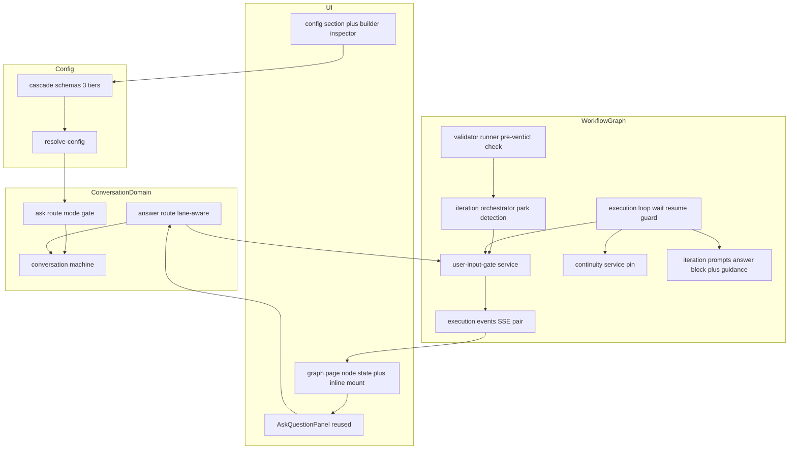

# Technical Design: ask-question-in-graph-workflows

## Overview

**Purpose**: This feature lets graph-workflow implementer and context-validator agents ask the CC operator multiple-choice questions mid-task instead of guessing at consequential forks. It delivers human-in-the-loop workflows without sacrificing the unattended-by-default execution model.

**Users**: The CC operator (Alex) enables the capability per tier and answers questions from the graph page or the lane conversation view. Workflow lane agents invoke the existing `cctl ask` tool under the existing asking discipline.

**Impact**: Adds an `askUserQuestions` block to the workflow config cascade, a new execution-context status (`awaiting_user_input`) with a `pendingUserInput` context-state record, a conditional lift of the server-side ask denial for lane conversations, park/resume orchestration in the execution loop mirroring the human approval gate, and graph-page inline answering that reuses `AskQuestionPanel`. No new endpoints, no wire-format changes, no changes to `cctl`.

### Goals

- Lane agents can ask when the resolved toggle allows it; the deny-by-default posture is preserved everywhere else.
- A parked context is free (no iterations, no failure count, no tokens), visible in real time, durable across pause/halt/restart, and blocks workflow completion.
- Answers resume the asking conversation with the standard `<cc-question-answers>` block; context-limit rotation degrades gracefully to a fresh conversation carrying Q+A.
- All four agreed design invariants (detection ordering, parked-wait cost, answer storage, resume pinning) hold and are test-pinned.

### Non-Goals

- Asking by collaboration second-agents or the reserved `__planner__` session (stays denied).
- Asking by Codex **validator** lanes: they dispatch against a synthetic conversation id (`__validator__:…`, validator-runner.ts) with no real CC conversation behind it — a pre-existing gap, so they cannot register questions today. Deny-by-default covers them, and the `workflowConversationId` keying below makes them covered automatically if they ever gain real conversations. Codex **implementer** lanes are in scope: they already hold a real CC conversation and receive the full `cctl` env contract.
- Timeouts, auto-skip, reminders, or per-role toggles.
- Changes to the generic conversation ask/answer flow, `AskQuestionPanel`, or the approval gate.
- A generic "human gate" abstraction unifying approval and user-input parking (two instances, deliberately parallel shapes; unify only if a third appears).
- Manual user prompting of lane conversations outside the answer flow (behavior unchanged).

## Boundary Commitments

### This Spec Owns

- The `askUserQuestions` config block: schema at all three cascade tiers, seeded default (`enabled: false`), and its resolution into `GraphWorkflowResolvedContext`.
- The conditional mode-gate decision in the ask route for lane conversations (resolution of a lane conversation to its execution context and resolved toggle).
- The `awaiting_user_input` context status, the `graphWorkflowPendingUserInput` record (its shape, writes, and lifecycle), and the park → wait → resume → withdraw orchestration in the execution loop, iteration orchestrator, and validator runner.
- Lane-aware routing inside the existing answer route (record-to-context instead of queue-and-drain).
- The resume-conversation pin and its precedence below `rotateBeforeNextTurn`.
- The `graph-workflow-user-input-pending` / `-resolved` SSE event pair.
- Graph UI additions: the `awaiting-user-input` wait-state kind, node styling, and the graph-page inline question mount; the config UI editors for the new block (global section + builder inspector).
- Lane prompt guidance: the enabled/disabled asking-instruction variants for implementer and validator prompts.

### Out of Boundary

- The ask/answer endpoints' non-lane behavior, `AskQuestionPanel`, question wire formats, notification dispatch (reused as-is; owned by `conversation-message-queue` / `unified-conversations-panel` lineage).
- The approval gate (`pendingApproval`, its endpoints, its UI) — template only, not modified. Its known abort-cleanup gap is recorded, not fixed here.
- Capability suppression mechanics (`agent-capabilities-configuration`), collaboration, planner provisioning, Smart Merge, lane/join scheduling.
- The conversation machine beyond one additive transition (`CLEAR_PENDING_QUESTION` handled in `waitingForInput`).

### Allowed Dependencies

- `@/lib/conversations` schemas (`askQuestionItemSchema`, answer types), `question-answers-block.ts` formatting, and conversation machine events — read/reuse only. If importing conversation schemas into `src/lib/workflows/schemas.ts` creates an import cycle, the question/answer primitives move to `src/lib/shared/schemas.ts` (sanctioned by structure.md); they must not be duplicated.
- `src/lib/workflow-graph/*` internals (orchestrator, loop, continuity service, prompts, events) and `resolve-config.ts`.
- State-store repos via existing `mutateActive` / read accessors; SSE bus via existing publishers.
- UI: `AskQuestionPanel`, existing answer mutation, `NotificationListener`, graph-page components.

### Revalidation Triggers

- Shape change of `graphWorkflowPendingUserInput` or the context status enum → graph UI, CLI consumers, contract tests.
- Answer endpoint request/response contract change → `AskQuestionPanel` mutation consumers.
- `laneStates` shape change (the `workflowConversationId` reverse-lookup seam) → ask-gate resolution.
- Asking-instruction contract change in `actor-implementations.ts` → cc-cli skill docs.

## Architecture

### Existing Architecture Analysis

The design composes three proven mechanisms, verified against current code:

1. **Async ask flow** — `cctl ask` → `POST .../conversations/[id]/ask` → `ASK_QUESTION` machine event → conversation `waiting_for_input` + `pendingQuestions`; turn ends; answers recorded via `POST .../answer`. The only workflow-relevant blocker is the mode gate (`ask-route-handlers.ts:93-111`).
2. **Approval gate** — park record on context state, decision recordable while `running | paused | halted` as a pure state mutation, 1s poll wait, immediate apply on loop re-entry (`execution-loop.ts:1825-1846`), completion guard (`:1869-1871`). This is mirrored one-for-one.
3. **Config cascade** — three-tier resolution at seed time (`resolve-config.ts`), snapshot into `execution.workingDefinition`.

Two constraints discovered in the current code shape the design: `PromptStreamResult` does not expose pending-question state (park detection reads conversation state post-turn), and the answer route's `ensureConversationActorAndDrain` has no role guard (lane answers must divert before the queue/drain step).

### Architecture Pattern & Boundary Map



**Architecture Integration**:
- Selected pattern: gate-service sibling of `approval-gate.ts` — new small modules exactly where the approval gate has parallel ones; extensions only at existing seams (Option C from research.md).
- Dependency direction (violations are errors): `schemas → resolve-config → user-input-gate → orchestrator/runners/loop/continuity/prompts → route handlers → SSE/UI`. UI never imports workflow-graph internals; it consumes the execution payload and SSE events.
- Existing patterns preserved: seed-time cascade snapshot; `mutateActive` serialized mutations; poll-wait + immediate re-entry apply; SSE publish-after-commit; DI via deps interfaces (method syntax); structured logging via `createLogger`.
- Steering compliance: composable primitives (a status value + a cascade block + one lifted gate), agent-offloading (all bookkeeping deterministic; the agent only asks and answers), additive forward-compatible persistence.

### Technology Stack

No new dependencies. Touched layers: Next.js route handlers (ask/answer/graph execution), Zod v4 schemas, better-sqlite3 state store (JSON blob fields — no DDL change), XState conversation machine (one transition), SSE bus, React 19 + TanStack Query UI, Tailwind v4 node styling.

## File Structure Plan

### New Files

```
src/lib/workflow-graph/
├── user-input-gate.ts             # Gate service: enter/recordAnswers/consume/withdraw + lane lookup helpers
├── user-input-gate.test.ts        # Unit tests incl. idempotency, upsert-before-park, withdraw
src/features/config/sections/workflow/
├── AskUserQuestionsFields.tsx     # Global-tier editor for the new block (pattern: MutabilityFields.tsx)
src/features/session/hooks/
├── use-user-input-gate.ts         # Standing derivation from execution.contextStates (pattern: use-approval-gate.ts)
```

### Modified Files

**Config cascade** (Req 1):
- `src/lib/config/schemas.ts` — `askUserQuestions: { enabled: boolean }` on `workflowDefaultsSchema`.
- `src/lib/workflows/schemas.ts` — optional block on `WorkflowConfigOverride` + per-context definition; `awaiting_user_input` in `graphWorkflowContextStatusSchema`; `graphWorkflowPendingUserInputSchema` + `pendingUserInput` field on `graphWorkflowExecutionContextStateSchema`.
- `src/lib/workflow-graph/resolve-config.ts` — `SEEDED_DEFAULTS`, `coerceGlobalDefaults`, `resolveWorkflowConfig`, `resolveContext`.

**Gating & answering** (Req 2, 4, 5.4):
- `src/lib/conversations/ask-route-handlers.ts` — mode gate consults `resolveLaneAskPermission` (from user-input-gate) for lane conversations.
- `src/lib/conversations/answer-route-handlers.ts` — lane conversations divert to `recordAnswers` (no `queueMessage`, no drain); non-lane path unchanged.
- `src/lib/workflows/conversation/machine.ts` — `waitingForInput` handles `CLEAR_PENDING_QUESTION` → `idle`.

**Orchestration** (Req 3, 5, 7):
- `src/lib/workflow-graph/iteration-orchestrator.ts` — post-turn pending-question check (before continue/validate evaluation); park via gate service; resume prompt includes answer block; consume-on-resume.
- `src/lib/workflow-graph/validator-runner.ts` — pre-verdict pending-question check returning an `asked_user` outcome (never a failure).
- `src/lib/workflow-graph/execution-loop.ts` — `runUserInputWait` (1s poll, mirror `runApprovalGateWait`); re-entry for `awaiting_user_input` contexts; completion-guard clause; withdraw-on-abort hookup.
- `src/lib/workflow-graph/workflow-continuity-service.ts` — `pinnedConversationId` input to `resolveImplementerCall`/`resolveValidatorCall`; pin loses to `rotateBeforeNextTurn`.
- `src/lib/workflow-graph/iteration-prompt.ts` — answer-block section (reuses `formatQuestionAnswersBlock`) + ask-protocol guidance section keyed on the resolved toggle.
- `src/lib/workflows/conversation/actor-implementations.ts` — asking-instruction variant selected by an `askUserQuestionsEnabled` option threaded from the runners (implementer-runner.ts, validator-runner.ts pass it from resolved config).

**Events & UI** (Req 6, 4.1):
- `src/lib/workflow-graph/execution-events.ts` — `GraphWorkflowUserInputPendingEvent` / `GraphWorkflowUserInputResolvedEvent` + publishers.
- `src/lib/api/sse-events.ts` — client event union.
- `src/components/NotificationListener.tsx` — handlers (invalidate execution/events/conversation queries; toast on pending).
- `src/components/workflow-graph/derive-wait-state.ts` — `{ kind: "awaiting-user-input" }`.
- `src/components/workflow-graph/ExecutionContextNode.tsx` — status styling + badge for the new kind.
- `src/features/session-workflow/components/ExecutionInspectorPanel.tsx` (and its container) — mount `AskQuestionPanel` for a selected context whose `pendingUserInput` has no answers; submit via existing answer mutation.
- `src/features/workflows-builder/components/WorkflowInspectorPanel.tsx` + `InspectorFieldEditors.tsx` — cascade block summary + boolean editor.
- `src/features/config/sections/WorkflowSection.tsx` — mount `AskUserQuestionsFields`.

**Tests & docs**:
- `src/lib/state-store/graph-workflow-executions-repo.*.contract.test.ts` — maximal fixture gains `awaiting_user_input` status + populated `pendingUserInput` (round-trip durability).
- `plugins/command-center/command-center/skills/cc-cli/SKILL.md` + `.kiro/steering/workflows.md` — document lane asking and the new block.

## System Flows

### Ask → Park → Answer → Resume (happy path + rotation fallback)

```mermaid
sequenceDiagram
    participant Agent as Lane Agent
    participant Ask as Ask Route
    participant Conv as Conversation Machine
    participant Orch as Orchestrator
    participant Gate as UserInputGate
    participant Loop as Execution Loop
    participant UI as Graph Page or Conv View
    Agent->>Ask: cctl ask
    Ask->>Gate: resolveLaneAskPermission
    Gate-->>Ask: enabled contextId lane
    Ask->>Conv: ASK_QUESTION
    Conv-->>Agent: registered end turn
    Orch->>Conv: post-turn read pendingQuestions
    Orch->>Gate: enterAwaitingUserInput snapshot questions
    Gate->>Loop: status awaiting_user_input plus SSE pending
    UI->>Gate: recordAnswers via answer route
    Gate->>Conv: CLEAR_PENDING_QUESTION
    Loop->>Gate: poll sees answers
    Loop->>Orch: resume iteration pinned conversation
    Orch->>Agent: follow-up prompt with answer block
    Orch->>Gate: consume clear pendingUserInput
```

Flow decisions: the park snapshot copies `questions` + `questionBatchId` from conversation state into `pendingUserInput` so the graph UI and the resume prompt are self-sufficient (conversation stays the source at ask time, context record becomes the source after park). If `rotateBeforeNextTurn` is set on the lane, the resume step creates a fresh conversation and the same answer block rides its first prompt — the pin never overrides rotation. If answers already exist at the post-turn check (fast answer, 5.4), the orchestrator skips parking and proceeds directly with the answer block. A validator park follows the same shape with `lane: "context_validator"` — resume re-invokes the validator with the answer block and its verdict is processed normally.

### Context status lifecycle (delta only)

`running → awaiting_user_input` (park) · `awaiting_user_input → running` (answers applied) · `awaiting_user_input` persists across `paused`/`halted`/restart and re-enters the wait on loop re-entry; recorded answers apply immediately on re-entry (no re-wait). Abort clears the record and withdraws the question.

## Requirements Traceability

| Requirement | Summary | Components | Flows |
|---|---|---|---|
| 1.1–1.5 | Cascading toggle, off by default, seed-time snapshot, one value both roles | Config schemas, `resolve-config.ts` | — |
| 2.1–2.2 | Conditional accept/deny of lane asks | `resolveLaneAskPermission` in user-input-gate, ask route mode gate | Ask step |
| 2.3 | Collab/planner always denied | Ask route (non-lane roles fall through to existing denial) | — |
| 2.4–2.5 | Notification + single-batch rule | Existing ask flow (reused, untouched) | — |
| 3.1–3.2 | Park on turn end; validator ask ≠ failure | Orchestrator post-turn check; validator-runner `asked_user` outcome | Park step |
| 3.3 | No iteration/failure cost while parked | Park path bypasses seed/failure branches (test-pinned) | — |
| 3.4–3.6 | Siblings run; completion guard; concurrent parks | Execution loop guard + scheduler untouched for other contexts; per-context records | — |
| 3.7 | No timeout | `runUserInputWait` (poll until answers/withdrawn) | — |
| 4.1 | Graph-page inline answering | `ExecutionInspectorPanel` mount + `AskQuestionPanel` + existing answer mutation | Answer step |
| 4.2 | Conversation-view answering | Existing `PromptInputSlot` panel (free — no role gating) | Answer step |
| 4.3–4.4 | Single answer set; skip semantics | `recordAnswers` idempotency (reject non-null answers); wire format reused | — |
| 5.1–5.2 | Resume same conversation w/ answer block; pin beats continuity-off | Continuity `pinnedConversationId`; iteration-prompt answer section | Resume step |
| 5.3 | Rotation outranks pin | Continuity precedence check; answer block in fresh follow-up | Rotation fallback |
| 5.4 | Fast answer skips park | `recordAnswers` upsert-before-park; orchestrator answers-present check | Flow decision note |
| 5.5 | Normal accounting on resume | Resume drives an ordinary seeded iteration | — |
| 6.1–6.2 | Distinct real-time node state | derive-wait-state kind, node styling, SSE pair, NotificationListener | — |
| 6.3 | Status readouts | Status enum value flows through lenient CLI schema; event log rows from SSE events | — |
| 7.1–7.3 | Pause/halt/restart durability; answers-while-paused apply on resume | Persisted `pendingUserInput`; loop re-entry (immediate apply mirrors approval) | Lifecycle |
| 7.4 | Withdraw on abort | `withdraw` in gate service, called from abort path; `CLEAR_PENDING_QUESTION`; resolved(withdrawn) SSE | Lifecycle |
| 8.1–8.4 | Prompt guidance enabled/disabled | Instruction variants in actor-implementations; protocol section in iteration-prompt; both runners thread the effective flag (toggle ∧ lane-can-ask) | — |

## Components and Interfaces

| Component | Domain/Layer | Intent | Req Coverage | Key Dependencies | Contracts |
|---|---|---|---|---|---|
| UserInputGate service | workflow-graph | Own `pendingUserInput` lifecycle + lane resolution | 2.1, 3.x, 4.3, 5.4, 7.x | executions repo (P0), conversation events (P0) | Service, State, Event |
| Ask-gate lift | conversations routes | Conditional mode-gate decision | 2.1–2.3 | UserInputGate (P0) | API (unchanged shape) |
| Lane answer routing | conversations routes | Divert lane answers to gate | 4.3, 5.4, 7.3 | UserInputGate (P0), machine (P1) | API (unchanged shape) |
| Park detection | workflow-graph orchestration | Ordering invariant #1 | 3.1–3.3 | conversation read accessor (P0) | Service |
| Resume + pin | workflow-graph continuity/prompts | Invariant #4, answer delivery | 5.1–5.3, 5.5 | lane state (P0) | Service |
| Wait/re-entry/guard/withdraw | execution loop | Invariants #2, lifecycle | 3.4–3.7, 7.1–7.4 | UserInputGate (P0) | Service |
| SSE pair | events | Real-time propagation | 6.1–6.3 | SSE bus (P0) | Event |
| Graph UI | features/session-workflow + components | Node state + inline answering | 4.1, 6.1–6.2 | execution query, AskQuestionPanel (P0) | State (client) |
| Config editors | features/config + workflows-builder | Toggle editing at global/workflow/context tiers | 1.1–1.2 | cascade schemas (P0) | State (client) |
| Prompt guidance | prompts/actor-implementations | Accurate agent instructions | 8.1–8.4 | resolved config (P0) | Service |

### workflow-graph / UserInputGate service (full detail — new boundary)

| Field | Detail |
|---|---|
| Intent | Single writer for `pendingUserInput`; resolves lane conversations; publishes state changes |
| Requirements | 2.1, 3.1–3.7, 4.3, 5.4, 7.1–7.4 |

**Responsibilities & Constraints**
- Sole mutator of `contextStates[id].pendingUserInput` and the `awaiting_user_input` status flips (all writes inside `mutateActive` — serialized, atomic per execution snapshot).
- Owns the conversationId → (contextId, lane) reverse lookup over `execution.laneStates[contextId][lane].workflowConversationId` — the engine-uniform field both Claude and Codex lane states carry (the same field `lane-tool-context-loader.ts` already resolves), never `sessionRef.conversationId`, which only the Claude variant has. Eligibility is therefore "lane holds a real CC conversation", not "lane runs Claude": Claude implementer/validator and Codex implementer lanes qualify; Codex validator lanes (synthetic dispatch id, field unset) never do.
- Never touches the conversation queue; conversation-side effects limited to dispatching `CLEAR_PENDING_QUESTION`.

**Service Interface**

```typescript
type LaneRole = "implementer" | "context_validator";

interface LaneAskPermission {
  allowed: boolean;
  executionId?: string;
  contextId?: string;
  lane?: LaneRole;
}

interface UserInputGateService {
  /** Ask-route helper: lane lookup + resolved toggle. Unresolvable → { allowed: false }. */
  resolveLaneAskPermission(projectPath: string, sessionName: string, conversationId: string): Promise<LaneAskPermission>;
  /** Park: snapshot questions from conversation state, flip status, publish pending. No-op if answers already recorded (returns "answers_ready"). */
  enterAwaitingUserInput(input: { projectPath: string; sessionName: string; contextId: string; lane: LaneRole; conversationId: string; questionBatchId: string; questions: AskQuestionItem[] }): Promise<"parked" | "answers_ready">;
  /** Record answers; creates the record if park has not landed yet (fast answer). Rejects duplicates. */
  recordAnswers(input: { projectPath: string; sessionName: string; conversationId: string; questionBatchId: string; answers: Record<string, AskQuestionAnswer> }): Promise<{ ok: true } | { ok: false; reason: "already_answered" | "not_found" }>;
  /** Resume bookkeeping: read answers for prompt building, then clear the record and flip status back to running. */
  consumeAnswers(input: { projectPath: string; sessionName: string; contextId: string }): Promise<{ answers: Record<string, AskQuestionAnswer>; questionBatchId: string; conversationId: string; lane: LaneRole } | null>;
  /** Abort path: clear records, dispatch CLEAR_PENDING_QUESTION per parked conversation, publish resolved(withdrawn). Idempotent. */
  withdrawAll(input: { projectPath: string; sessionName: string; executionId: string }): Promise<void>;
}
```

- Preconditions: `recordAnswers` requires a matching registered batch (from `pendingUserInput` or, pre-park, the conversation's pending batch).
- Postconditions: after `recordAnswers`, exactly one non-null `answers` exists per batch; after `consumeAnswers`/`withdrawAll`, `pendingUserInput` is null and status is not `awaiting_user_input`.
- Invariants: answers-on-execution-record is authoritative; a set conversation pending-marker with recorded answers is stale and gets cleared on the next loop touch (self-healing crash ordering: record answers → clear marker).

**Event Contract**
- Publishes `graph-workflow-user-input-pending` `{ projectName, sessionName, executionId, contextId, contextTitle, conversationId, questionBatchId, requestedAt }` after park commits; `graph-workflow-user-input-resolved` `{ …, resolution: "answered" | "withdrawn", resolvedAt }` after answers/withdraw commit. Delivery: existing SSE bus, at-least-once, UI treats as invalidation signals only.

**Implementation Notes**
- Integration: called from ask route (permission), answer route (record), orchestrator (enter/consume), loop (wait/re-entry/withdraw). Logging module `workflow-graph:user-input-gate` per logs.md.
- Validation: Zod-parse all records at the repo boundary as today (schema-first).
- Risks: reverse lookup depends on `laneStates[…].workflowConversationId` being current — the continuity service writes it at conversation creation for Claude lanes and Codex implementer lanes; Codex validator lanes never set it (synthetic dispatch id, no CC conversation) and resolve to `{ allowed: false }`. Deny-by-default covers all unresolvable cases.

### Orchestration deltas (summary blocks)

**Park detection (iteration-orchestrator)** — after `executePromptStream` settles and *before* `finalizeIterationResult` evaluates continue/validate: read the lane conversation; if `pendingQuestionId` set → `enterAwaitingUserInput` (or proceed if it returns `answers_ready`) and return a `parked` iteration outcome that skips validation, failure accounting, and continue-scheduling. **Validator**: validator-runner's return type gains a discriminated outcome; the same check runs on the lane conversation *before* verdict parsing (a pending question would otherwise surface as an unparseable verdict), yielding `asked_user`, which the orchestrator maps to the same park path — it must never reach the inline validation-failure accounting (the `consecutiveFailureCount` increments in iteration-orchestrator.ts; there is no named helper for it). **Validator resume**: `consumeAnswers` returns `lane: "context_validator"`, so the loop re-enters the validation step — `resolveValidatorCall` pinned to the asking conversation (rotation still outranks) — with the answer block in the validator prompt; the rendered verdict is then processed exactly as a normal validation result (pass/fail accounting applies to the resumed verdict, never to the asking turn).

**Wait / re-entry / guard / withdraw (execution-loop)** — `runUserInputWait` polls `pendingUserInput` at the approval gate's cadence: answers present → resume path; record gone (withdrawn) → context returns to `ready` handling per abort semantics. Re-entry block mirrors `execution-loop.ts:1825-1846` for `awaiting_user_input` (answers already recorded → apply immediately, no re-wait — same semantics the approval gate has for decisions recorded while paused, Req 7.3). Completion guard gains the second status clause. The abort path calls `withdrawAll` (note: this is deliberately better than the approval gate's abort behavior, which leaves `pendingApproval` uncleaned — recorded as an adjacent gap in research.md, not fixed here).

**Resume + pin (continuity service + iteration-prompt)** — `resolveImplementerCall`/`resolveValidatorCall` accept `pinnedConversationId`; when the lane's `workflowConversationId` matches and `rotateBeforeNextTurn` is false, reuse is forced regardless of `continuity.enabled` (engine-uniform — Codex implementer lanes pin the same way). When rotation is required, normal fresh-lane creation proceeds and `buildFollowUpPrompt`/seed prompt embeds the answer section. The answer section is `formatQuestionAnswersBlock(questionBatchId, answers)` output framed with one line of context ("the user answered your questions"); identical in the pinned and rotated variants (wire format embeds question text per 5.3).

**Prompt guidance (actor-implementations + iteration-prompt)** — runners thread `askUserQuestionsEnabled` computed as resolved toggle **AND** lane-can-ask (the lane holds a real CC conversation via `workflowConversationId` — true for Claude lanes and Codex implementer lanes, false for Codex validator lanes) into `executePromptStream` options. Enabled: the session instructions use a lane-ask variant (tool available; ask only at consequential/hard-to-reverse/ambiguous forks; batch; end turn after asking; answers arrive on resume; skipped = best judgment; the workflow **pauses this context** until answered — not free). Disabled (toggle off **or** lane cannot ask): current text (asking denied for autonomous turns) unchanged. The iteration prompt adds a short protocol reminder only when the same effective flag is set, so an enabled context never advertises the tool to a lane that cannot use it (8.1–8.4).

### Routes (summary blocks)

**Ask route** — mode gate becomes: `role === "planner"` or role otherwise non-lane → existing 403; lane conversation (`role === "iteration" | "validator"`) → `resolveLaneAskPermission`; `allowed` → fall through to the existing turn/single-batch/Zod gates; else existing 403 message. Response shapes unchanged (API contract identical to today: 200 `{ ok, questionBatchId }`, 403/409/410 semantics preserved).

**Answer route** — after loading the conversation: lane conversation → `recordAnswers` + dispatch `CLEAR_PENDING_QUESTION` (machine gains the `waitingForInput` → `idle` handling for it); skip `queueMessage` and `ensureConversationActorAndDrain` entirely. Non-lane path byte-identical to today. Duplicate lane answer → 410 (same status the non-lane path uses).

### UI (summary blocks)

**Graph page** — `deriveContextWaitState` gains `{ kind: "awaiting-user-input" }` derived from status + record; `ExecutionContextNode` gets a distinct styled state (design-system compliant; distinct from the amber approval state). `ExecutionInspectorPanel` renders `AskQuestionPanel` (`questions`, `questionId` from `pendingUserInput`, submit → existing `useAnswerQuestionMutation` with the record's conversationId) when the selected context is parked; submission follows the responsiveness contract (mutation pending state on the panel's existing submit spinner). `use-user-input-gate.ts` mirrors `deriveApprovalGateStanding` for standing derivation. **Conversation view** — no changes; the existing panel mount renders lane pending questions already.

**Config editors** — `AskUserQuestionsFields` (global section, boolean pill/toggle, pattern of `MutabilityFields`); builder inspector gains the new cascade block (summary line + boolean editor via `InspectorConfigBlock` wrapper). Both are presentational; no new state contracts.

## Data Models

### Domain Model

`GraphWorkflowExecution` aggregate remains the consistency boundary; all `pendingUserInput` mutations ride `mutateActive` (serialized write queue). New value object on context state:

```typescript
export const graphWorkflowUserInputAnswersSchema = z.object({
  byQuestionId: z.record(z.string(), askQuestionAnswerSchema), // reused, not duplicated
  answeredAt: z.string().trim().min(1),
});

export const graphWorkflowPendingUserInputSchema = z.object({
  conversationId: z.string().trim().min(1),
  lane: z.enum(["implementer", "context_validator"]),
  questionBatchId: z.string().trim().min(1),
  questions: z.array(askQuestionItemSchema),               // snapshot at park time
  requestedAt: z.string().trim().min(1),
  answers: graphWorkflowUserInputAnswersSchema.nullable().default(null),
});
// contextState: pendingUserInput: graphWorkflowPendingUserInputSchema.nullable().default(null)
// status enum: + "awaiting_user_input"
```

Invariants: at most one `pendingUserInput` per context; `questions` is a snapshot (conversation remains the ask-time source; the record is authoritative post-park); duplication with `conversation.pendingQuestions` is bounded by the single-writer rule and both being cleared through the same resume/withdraw paths.

Config block (all three tiers, mirroring `scriptValidator`):

```typescript
export const workflowAskUserQuestionsConfigSchema = z.object({ enabled: z.boolean() });
// workflowDefaults seeded: { enabled: false }
```

### Physical / Persistence

No DDL. `contextStates` persists inside the execution JSON blob (`graph_workflow_executions`), so the new field and status value are additive and forward-compatible; older builds fail Zod-parse only if they encounter the new status — acceptable under the shared-DB read-boundary quarantine, and consistent with how `awaiting_approval` was introduced. Contract test extension (maximal fixture + policy map) is mandatory, per persistence-test-fidelity.

## Error Handling

- **Ask route**: unresolvable lane (no active execution, conversation not in `laneStates`, toggle off) → existing 403 autonomous refusal (deny-by-default; one log line at `warn` with the resolution failure reason). Existing 409/410 gates unchanged.
- **Answer route (lane)**: unknown batch → 410 (matches non-lane already-answered semantics); duplicate → 410; execution not active → 410 with withdrawn semantics.
- **Crash ordering**: answers recorded but conversation marker still set → loop treats record as authoritative and clears the marker on next touch. Park committed but SSE lost → poll-based wait is unaffected; UI recovers on next query invalidation/refetch.
- **Abort/withdraw**: idempotent; withdrawing an already-answered-but-unconsumed record still clears it (abort wins).
- **Monitoring**: structured logs on park/record/consume/withdraw with executionId/contextId/questionBatchId; SSE events double as the observability trail in the workflow event log.

## Testing Strategy

- **Unit** — cascade resolution matrix for `askUserQuestions` incl. unset→disabled and per-context override (1.1–1.5); `resolveLaneAskPermission` matrix: enabled/disabled × implementer/validator/planner/non-lane/unknown conversation × engine — incl. Codex implementer allowed via `workflowConversationId` and Codex validator (field unset) denied (2.1–2.3); `recordAnswers` idempotency + pre-park upsert (4.3, 5.4); `shouldRotate`+pin precedence: continuity-off pin, `rotateBeforeNextTurn` wins (5.2–5.3); prompt builders: instruction variants + answer-block presence in pinned and rotated prompts (5.1, 5.3, 8.1–8.4).
- **Integration (DI'd orchestrator + `createPersistenceFixture`, real repos, reloaded-state assertions)** — full cycle: ask → park (status, record, no validation run) → answer → resume same conversation → consume (3.1, 5.1); validator ask parks without failure-count movement, and validator resume re-runs the validator whose verdict is processed normally (3.2–3.3, 5.1); iteration/failure counters across a park+resume cycle equal exactly two seeded turns (3.3, 5.5); completion guard refuses while parked (3.5); two contexts parked concurrently, answered independently (3.6); fast answer skips park (5.4); answers recorded while paused apply on resume without re-wait (7.1, 7.3); abort withdraws record and clears the conversation marker (7.4).
- **Contract** — `graph-workflow-executions-repo` round-trip durability for `pendingUserInput` (populated answers) and the new status value (7.2 restart durability rides persistence + re-entry).
- **E2E/UI (cc-live-feature-test before GO)** — enabled workflow: agent asks → graph node shows awaiting-user-input in real time → answer inline on graph page → workflow resumes and completes (4.1, 6.1–6.2); answer from lane conversation view (4.2); disabled workflow: agent ask is refused and workflow proceeds autonomously (2.2).

## Security Considerations

No new endpoints or token surfaces; the ask/answer routes keep their existing token gating. The gate lift is server-side authorization narrowing driven by operator-controlled config — client-supplied identity is never trusted (lane resolution is server-side via `laneStates`).
