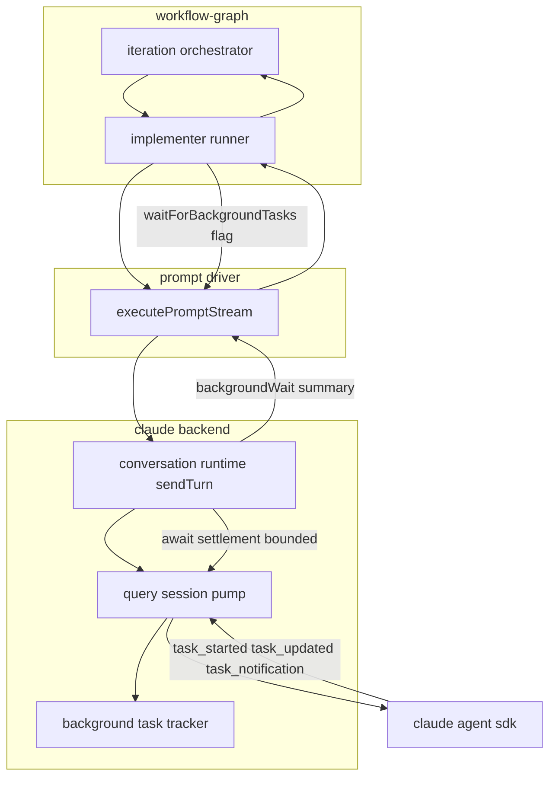
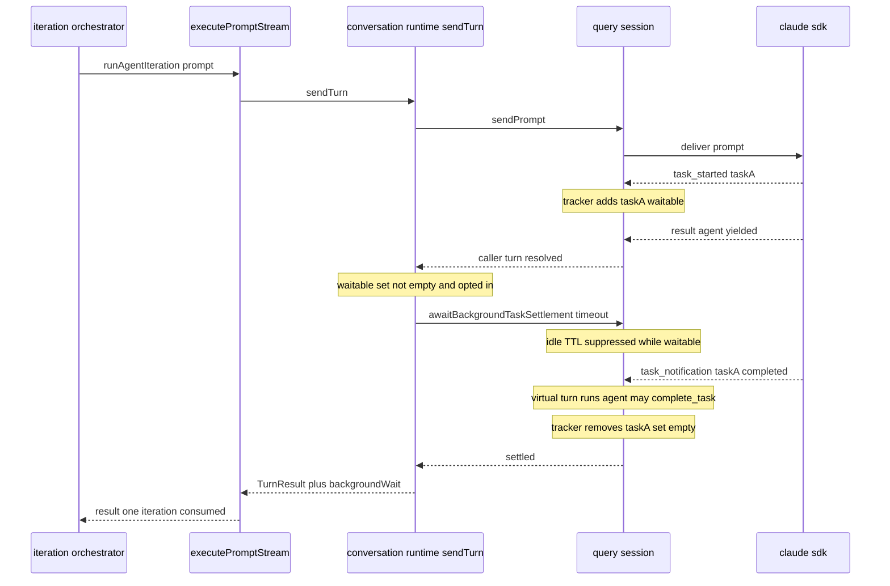

# Design Document

## Overview

**Purpose**: This feature stops the graph workflow from re-prompting an implementer agent that is waiting on a background task. Instead, the workflow recognizes in-flight background work from lifecycle signals the agent backend already emits, waits (with a hard bound) for that work to settle, and lets the agent's own auto-continuation act on the result — all within a single iteration and with no agent cooperation.

**Users**: Workflow operators running autonomous graph workflows benefit through fewer wasted iterations and no more "nag loops"; the implementer agent benefits by being allowed to finish what it started.

**Impact**: Today a single implementer turn (`executePromptStream`) resolves the moment the agent yields its `result` message, even if a backgrounded shell/test/subagent is still running. The orchestrator then re-prompts until the iteration cap or circuit breaker halts the run. This design redefines turn completion for the autonomous path to mean "the agent yielded **and** no waitable background task it started is still running," reusing the Claude Agent SDK's already-present virtual-turn auto-continuation to deliver the result.

### Goals
- Detect in-flight background tasks from SDK lifecycle messages (`task_started` / `task_updated` / `task_notification`) that are currently discarded.
- Wait, bounded, for waitable background tasks to settle before the iteration finalizes or re-prompts.
- Require zero agent action and zero prompt changes.
- Preserve iteration/failure accounting (one iteration spans the wait).
- Be a strict no-op when no waitable background tasks are present.

### Non-Goals
- No agent-facing "wait" MCP tool or prompt instruction.
- No UI surfacing of background-task state.
- No change to how the agent decides to background work.
- No change to interactive (non-autonomous) conversation turns.
- No Codex-backend tracking (Codex exposes no equivalent signal today); parity is deferred until/if it does.

## Boundary Commitments

### This Spec Owns
- Tracking background-task lifecycle within a Claude `QuerySession` from the SDK `task_*` system messages — classification into *waitable* vs *excluded watch* by originating tool name, and the live in-flight set.
- The bounded "wait for settlement" step inserted into the autonomous turn-execution path, between the caller turn resolving and the turn being reported complete.
- The opt-in flag (`waitForBackgroundTasks`) threaded from the graph-workflow implementer runner down to the turn, and the `backgroundWait` summary threaded back up for logging.
- Idle-TTL suppression while waitable tasks are in-flight.

### Out of Boundary
- The SDK's execution of background tasks and the emission of `task_*` messages (consumed, not owned).
- The conversation machine's virtual-turn state transitions (`externalExecuting`) — reused as-is; this spec does not modify the machine.
- The iteration orchestrator's re-prompt / validation / circuit-breaker logic — unchanged except for adding observability logs; correctness (no extra iteration consumed) falls out of keeping the wait inside one turn.
- The collaboration suspend/resume machinery (`pendingCollaborations`) — referenced as prior art only; not extended.

### Allowed Dependencies
- `@anthropic-ai/claude-agent-sdk` message types (`SDKTaskStartedMessage`, `SDKTaskUpdatedMessage`, `SDKTaskNotificationMessage`, `SDKMessage` union) and the per-turn tool_use→name map for origin classification.
- Existing query-session pump, virtual-turn handler, and idle-TTL machinery.
- `@/lib/logging` `createLogger`.

### Revalidation Triggers
- The SDK changes the shape/subtypes of `task_*` messages or the set of `task_type` values.
- The virtual-turn auto-continuation pathway (`externalTurnHandler`) changes semantics.
- `PromptStreamResult` / `TurnResult` consumers depend on the new `backgroundWait` field.
- The autonomous turn path stops setting `waitForBackgroundTasks`.

## Architecture

### Existing Architecture Analysis

The autonomous implementer turn flows:

```
iteration-orchestrator.runAgentIteration (dep)
  → implementer-runner.runIteration
    → sdk-driver.executePromptStream  → conversation actor (SUBMIT_PROMPT) → waitForTurnCompletion(actor)
        → actor-implementations.executing invoke → conversation-runtime.sendTurn → querySession.sendPrompt
            → SDK query() (continuous streaming-input; long-lived subprocess)
```

`querySession.sendPrompt` resolves on the SDK `result` message (`query-session.ts:898-947`); the actor returns to `idle`; `waitForTurnCompletion` resolves (`sdk-driver.ts:780-828`). Background-task completions arrive **after** the caller turn as **virtual turns**: when a message arrives with `pendingTurn === null`, the pump synthesizes a turn via `externalTurnHandler` (`query-session.ts:768-804`) which routes to the conversation machine (`machine.ts:299-330`). Today these virtual turns are disconnected from the awaited caller turn, and the `task_*` system messages are discarded (`query-session.ts:811-818` handles only `subtype === "init"`; `965-968` default drops the rest).

### Architecture Pattern & Boundary Map

Pattern: a **lifecycle observer + bounded barrier** placed at the lowest layer that sees the SDK messages and owns the subprocess.



**Architecture Integration**:
- Selected pattern: observer (pure reducer over `task_*` messages) feeding a bounded await barrier in `sendTurn`. Chosen because the live set and the subprocess both live in the backend layer, and keeping the barrier inside one `sendTurn` keeps the actor in `executing` for the whole span — so the driver and orchestrator need no behavioral change.
- Boundaries: the **tracker** is pure and owns classification + the live set; the **query session** owns message ingestion, the settlement-await primitive, and idle-TTL suppression; the **runtime** owns the decision to wait (gated by the opt-in flag); upper layers only carry a flag down and a summary up.
- Existing patterns preserved: virtual-turn auto-continuation, single-flight per-conversation turn, dependency injection at the runtime/driver seam.
- Steering compliance: pure function extraction for testability (no `vi.mock` of internal modules); dependency direction strictly downward (tracker → session → runtime → driver → workflow-graph).

### Technology Stack

| Layer | Choice / Version | Role in Feature | Notes |
|-------|------------------|-----------------|-------|
| Backend / Services | TypeScript (strict), `@anthropic-ai/claude-agent-sdk` 0.3.159 | Consume `task_*` messages; own subprocess | Message types already shipped in `sdk.d.ts` |
| Messaging / Events | SDK `SDKMessage` stream | Source of background-task lifecycle | `task_started`/`task_updated`/`task_notification`/`task_progress` |
| Validation | Zod v4 | Derive tracker state + `backgroundWait` types | `z.infer`; no hand-written duplicates |
| Infrastructure / Runtime | Node timers | Bounded wait + idle-TTL suppression | Wait timeout independent of 5-min idle TTL |

## File Structure Plan

### Directory Structure
```
src/lib/agent-backends/claude/
├── background-task-tracker.ts       # NEW: pure reducer — ingest task_* (+ origin tool name) → live set + classification
├── background-task-tracker.test.ts  # NEW: unit tests for the reducer
├── query-session.ts                 # MOD: ingest task_* in processMessage; backgroundTaskState accessor;
│                                     #      awaitBackgroundTaskSettlement(timeout); idle-TTL suppression
└── conversation-runtime.ts          # MOD: sendTurn awaits settlement (when opted in); folds backgroundWait into TurnResult
```

### Modified Files
- `src/lib/agent-backends/claude/query-session.ts` — Update `processMessage` to feed the tracker on `task_*` subtypes **before** the idle-discard branch; add `backgroundTaskState` (readonly) and `awaitBackgroundTaskSettlement(timeoutMs)` to the `QuerySession` interface; do not arm the idle-TTL timer while the waitable set is non-empty.
- `src/lib/agent-backends/claude/conversation-runtime.ts` — In `sendTurn`, after `sendPrompt` resolves, if the turn opted into `waitForBackgroundTasks` and the waitable set is non-empty, `await querySession.awaitBackgroundTaskSettlement(timeoutMs)`; attach a `backgroundWait` summary to the returned `TurnResult`.
- `src/lib/prompt/sdk-driver.ts` — Add optional `backgroundWait` to `PromptStreamResult`; thread the `waitForBackgroundTasks` option from `PromptStreamOptions` into `TurnOptions`; surface the summary from the actor result.
- `src/lib/workflow-graph/implementer-runner.ts` — Set `waitForBackgroundTasks: true` in `promptOptions`; include the `backgroundWait` summary in the runner's return.
- `src/lib/workflow-graph/iteration-orchestrator.ts` — Emit `execLogger`/`logger` entries for begin-wait, resume, and timeout from the threaded summary (Requirement 7). No control-flow change.
- `TurnResult` / `executeAgentCall` types (in the conversation actor implementations) — add the optional `backgroundWait` summary passthrough.

## System Flows

Wait barrier inside one autonomous turn (happy path + timeout):



If the timeout fires before settlement, `awaitBackgroundTaskSettlement` resolves with `timedOut: true`; `sendTurn` returns normally and the orchestrator proceeds exactly as it does today (follow-up / next iteration) — the degraded path is identical to current behavior.

## Requirements Traceability

| Requirement | Summary | Components | Interfaces | Flows |
|-------------|---------|------------|------------|-------|
| 1.1, 1.2, 1.3 | Track in-flight tasks from lifecycle signals | BackgroundTaskTracker, QuerySession | `applyTaskMessage`, `backgroundTaskState` | Wait barrier |
| 1.4 | No agent action required | QuerySession (passive ingestion) | — | — |
| 2.1, 2.2, 2.3 | Classify waitable vs watch; unknown→waitable | BackgroundTaskTracker | `classifyTask` | — |
| 3.1, 3.2, 3.3, 3.4 | Wait instead of re-prompt; resume; deliver result | conversation-runtime sendTurn, virtual-turn pathway | `awaitBackgroundTaskSettlement` | Wait barrier |
| 4.1, 4.2, 4.3, 4.4 | Bounded wait; degrade; failed/stopped settle | QuerySession await primitive | `awaitBackgroundTaskSettlement` | Timeout branch |
| 5.1, 5.2, 5.3 | Preserve accounting across wait | iteration-orchestrator (wait inside one turn) | unchanged runIteration | Wait barrier |
| 6.1, 6.2, 6.3 | No-op when no waitable tasks; no prompt change | conversation-runtime, BackgroundTaskTracker | gate on non-empty waitable set | — |
| 7.1, 7.2, 7.3 | Structured logs for wait lifecycle | iteration-orchestrator, QuerySession | `backgroundWait` summary | Wait barrier |

## Components and Interfaces

| Component | Layer | Intent | Req Coverage | Key Dependencies | Contracts |
|-----------|-------|--------|--------------|------------------|-----------|
| BackgroundTaskTracker | claude backend (pure) | Reduce `task_*` (+ origin tool name) into live set + classification | 1, 2 | SDK message types (P0) | State |
| QuerySession (extension) | claude backend | Ingest messages; expose state; bounded await; suppress idle-TTL | 1, 3, 4 | tracker (P0), SDK pump (P0) | Service, State |
| sendTurn (extension) | claude backend | Insert bounded wait barrier when opted in | 3, 6 | QuerySession (P0) | Service |
| Driver/runner threading | prompt driver, workflow-graph | Carry flag down, summary up | 5, 7 | sendTurn (P0) | Service |
| Iteration logging | workflow-graph | Log wait lifecycle | 7 | execLogger (P1) | — |

### Claude Backend

#### BackgroundTaskTracker

| Field | Detail |
|-------|--------|
| Intent | Pure reducer: SDK background-task lifecycle messages → live in-flight set with per-task classification |
| Requirements | 1.1, 1.2, 1.3, 2.1, 2.2, 2.3 |

**Responsibilities & Constraints**
- Consume `task_started` (add), `task_updated` (status patch), `task_notification` (settle/remove).
- Classify each task as `waitable` or `excluded` (long-lived watch) **by the originating tool name**, resolved from `task_started.tool_use_id` against the per-turn tool-name map the caller supplies. Tasks started by the `Monitor` tool (`WATCH_TOOL_NAMES`) → `excluded` (it is fire-and-forget streaming — observed, never awaited); backgrounded `Bash` and subagent `Task`/`Agent` → `waitable`. Unknown/missing tool name → `waitable` (2.3). _(Implementation note: `task_type` was verified NOT to be a reliable discriminator, and the SDK tool_result payload lives inside `content` so tool-output classification was abandoned — see tasks.md Implementation Notes, task 6.1.)_
- Treat `task_notification` status `completed | failed | stopped` and terminal `task_updated.patch.status` (`completed | failed | killed`) as settled (4.3).
- Pure and synchronous; no I/O, no timers. All time/timeout logic lives in the QuerySession await primitive.

**Dependencies**
- Inbound: QuerySession.processMessage — feeds messages + the per-turn `toolNamesById` map (P0).
- External: `@anthropic-ai/claude-agent-sdk` message types (P0).

**Contracts**: State [x]

##### State Management
```typescript
type BackgroundTaskClassification = "waitable" | "excluded";

interface BackgroundTaskRecord {
  taskId: string;
  toolUseId: string | null;
  classification: BackgroundTaskClassification;
  status: "running" | "completed" | "failed" | "stopped" | "killed";
  description: string | null;
}

interface BackgroundTaskState {
  tasks: ReadonlyMap<string, BackgroundTaskRecord>;
}

const WATCH_TOOL_NAMES: ReadonlySet<string>; // { "Monitor" }

// Pure transitions (no mutation of input)
function emptyBackgroundTaskState(): BackgroundTaskState;
function applyTaskMessage(
  state: BackgroundTaskState,
  message: SDKMessage,
  opts?: { toolNamesById?: ReadonlyMap<string, string> },
): BackgroundTaskState;
function getWaitableInFlightTaskIds(state: BackgroundTaskState): string[];
```
- Preconditions: messages arrive in pump order; for a `task_started` the originating tool_use block (hence its `toolNamesById` entry) has already been processed earlier in the same turn.
- Postconditions: `getWaitableInFlightTaskIds` returns task ids whose `classification === "waitable"` and `status === "running"`.
- Invariants: a settled task never returns to `running`; classification is fixed at add time from the originating tool name.

**Implementation Notes**
- Integration: called from `processMessage` **before** the idle-discard branch so lifecycle is tracked even between turns; the caller passes `{ toolNamesById: pendingTurn?.toolNamesById }` so `task_started` classification can resolve the originating tool name.
- Risks: `task_type` is not a reliable discriminator (resolved — classify by tool name instead). Residual: a never-ending backgrounded `Bash` (e.g. a dev server) stays `waitable`, bounded by the wait timeout.

#### QuerySession (extension)

| Field | Detail |
|-------|--------|
| Intent | Own message ingestion into the tracker, expose state, provide the bounded settlement await, suppress idle-TTL during waits |
| Requirements | 1.1, 1.2, 3.3, 4.1, 4.2, 4.4 |

**Contracts**: Service [x] / State [x]

##### Service Interface
```typescript
interface BackgroundWaitOutcome {
  waitedTaskIds: string[];
  settledTaskIds: string[];
  timedOut: boolean;
  durationMs: number;
}

interface QuerySession {
  // ...existing members...
  readonly backgroundTaskState: BackgroundTaskState;
  awaitBackgroundTaskSettlement(timeoutMs: number): Promise<BackgroundWaitOutcome>;
}
```
- Preconditions: called after the caller turn's `sendPrompt` resolves.
- Postconditions: resolves when `getWaitableInFlightTaskIds` is empty **and** no turn is active, or when `timeoutMs` elapses (`timedOut: true`). Never rejects on timeout (4.4).
- Invariants: while `getWaitableInFlightTaskIds().length > 0`, the idle-TTL close timer is not armed (so virtual turns can still arrive past the 5-min default).

**Implementation Notes**
- Integration: `awaitBackgroundTaskSettlement` resolves via the same pump that drives virtual turns — each `task_notification` shrinks the set; settlement is observed through an internal notifier, not busy-polling.
- Validation: timeout is a hard wall-clock bound; failed/stopped tasks settle the set (4.3).
- Risks: holding the turn open also holds the per-conversation single-flight lock for the wait duration — acceptable and bounded; equivalent to the agent having blocked in-turn.

#### sendTurn (extension, conversation-runtime)

**Responsibilities & Constraints**
- After `sendPrompt` resolves, when the turn opted into `waitForBackgroundTasks` and `backgroundTaskState` has waitable in-flight tasks, await `awaitBackgroundTaskSettlement(timeoutMs)` before returning; otherwise return immediately (6.1, 6.2).
- Fold the `BackgroundWaitOutcome` into the returned `TurnResult` as an optional `backgroundWait` summary.

**Contracts**: Service [x]

**Implementation Notes**
- Integration: keeps the actor in `executing` for the whole span → driver/orchestrator see one long turn (5.1, 5.2). DI-friendly: tests inject a fake `QuerySession`.
- Validation: gate strictly on the opt-in flag so interactive turns are unchanged (6.3 spirit).
- Risks: none beyond the lock-hold noted above.

### Workflow-Graph

#### Iteration logging (extension, iteration-orchestrator)

**Responsibilities & Constraints**
- When the threaded `backgroundWait` summary is present, emit structured logs: begin-wait (task ids), resume (settled outcome), and timeout (still-in-flight ids) per 7.1–7.3, via `execLogger`/`createLogger`.
- No control-flow change: the wait already happened inside the single `runAgentIteration`, so `iterationCount` / `consecutiveFailureCount` are untouched (5.1–5.3).

**Contracts**: Service [ ] (logging only)

## Data Models

### `PromptStreamResult` / `TurnResult` extension
```typescript
interface BackgroundWaitSummary {
  waitedTaskIds: string[];
  settledTaskIds: string[];
  timedOut: boolean;
  durationMs: number;
}

interface PromptStreamResult {
  // ...existing fields...
  backgroundWait?: BackgroundWaitSummary; // present only when a wait occurred
}
```
- Optional and additive; absent for every turn that did not wait (6.1). All types Zod-derived where they cross a validation boundary.

### Turn option (opt-in)
- `TurnOptions.waitForBackgroundTasks?: boolean` and the matching `PromptStreamOptions` field, set only by the implementer runner. Default `false` everywhere else.

## Error Handling

### Error Strategy
- **Timeout (System):** `awaitBackgroundTaskSettlement` resolves with `timedOut: true` rather than throwing; the caller degrades to current behavior (4.2). The orchestrator logs the timeout (7.3).
- **Task failure (Business):** `failed`/`stopped`/`killed` settle the task and end the wait (4.3); the agent's virtual turn observes the failure notification and proceeds.
- **Malformed tool output (User/Infra):** Zod `safeParse` failure → leave classification as default (`waitable`); never throw out of the tracker.
- **Session death mid-wait:** if the subprocess dies, `awaitBackgroundTaskSettlement` resolves (`timedOut: false`, empty `settledTaskIds`) so the turn unwinds via existing error paths; no new hang is introduced (4.4).

### Monitoring
- Structured `createLogger("graph-workflow-iteration")` events for wait begin/resume/timeout; backend-level debug log when the tracker adds/settles a task and when the idle-TTL is suppressed.

## Testing Strategy

### Unit Tests (BackgroundTaskTracker — pure, no mocks)
- `task_started` for a backgrounded shell adds a `waitable` running record (1.1).
- `task_notification` `completed` removes it from the waitable set (1.2, 4.3); `failed`/`stopped` likewise settle (4.3).
- A `task_started` whose originating tool name (via `toolNamesById`) is `Monitor` classifies its task `excluded` (2.2); a `Bash`/`Task` origin → `waitable` (2.1); unknown/missing tool name → `waitable` (2.3).
- `getWaitableInFlightTaskIds` reflects only running waitable tasks across an interleaved message sequence (1.3).

### Integration Tests (DI — inject a fake QuerySession; no `vi.mock` of internal modules)
- `sendTurn` with one waitable in-flight task awaits settlement before returning; resolves when the fake emits the notification (3.1, 3.3).
- `sendTurn` returns immediately when the waitable set is empty (6.1) and when only `excluded` tasks remain (6.2).
- `awaitBackgroundTaskSettlement` resolves `timedOut: true` at the bound when no notification arrives (4.1, 4.2, 4.4).
- `query-session.processMessage`: a `task_started` without a matching `task_notification` leaves `backgroundTaskState` waitable-non-empty and the idle-TTL timer un-armed.

### Integration Tests (orchestrator/runner)
- A waiting turn spans exactly one `runAgentIteration` → `iterationCount` increments once and no follow-up nag is sent during the wait (5.1).
- The threaded `backgroundWait` summary produces begin/resume/timeout log entries (7.1–7.3).

## Open Questions / Risks
- **~~`task_type` enumeration~~ — RESOLVED (task 6.1):** `task_type` proved unreliable (only `local_workflow` documented; compiled SDK exposes no usable enum), and the SDK tool_result payload lives inside `content` so tool-output classification was abandoned. Classification is now by originating **tool name** (`Monitor` → excluded). Residual: a never-ending backgrounded `Bash` (dev server) can't be distinguished a priori from a settle-able one and stays `waitable`, bounded by the wait timeout.
- **Wait timeout default:** pick a default (proposed ~10 min, configurable constant) decoupled from the 5-min idle TTL since idle-TTL is suppressed during the wait. Must be a hard ceiling.
- **Lock-hold duration:** the per-conversation single-flight lock is held for the wait; acceptable because it is bounded and semantically equal to the agent blocking in-turn.
- **Scope gate:** wait is opt-in via `waitForBackgroundTasks` (set by the implementer runner) so interactive turns are unaffected; revisit if interactive turns later want the same behavior.
