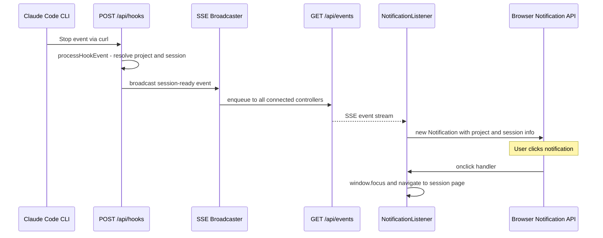
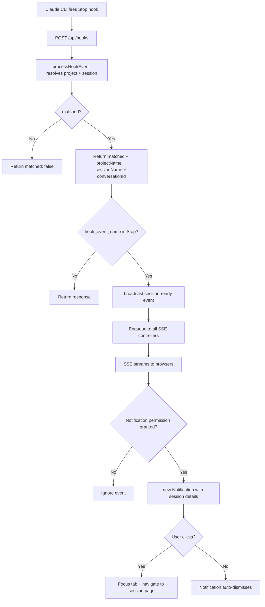
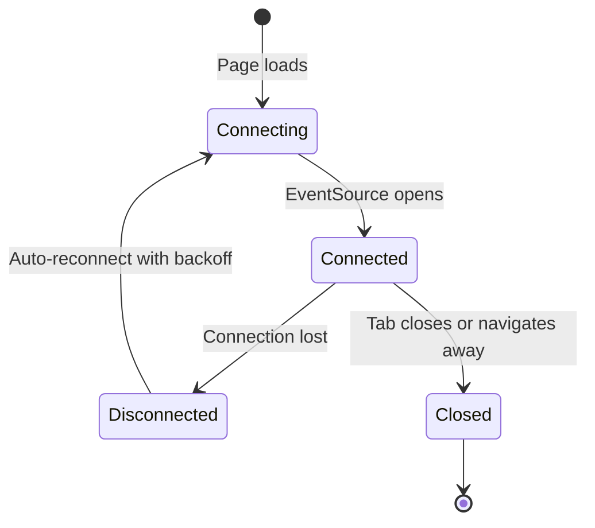

# Design Document: Browser Notifications

## Overview

**Purpose**: This feature delivers real-time OS-level browser notifications to CSM users when any Claude Code session finishes work and is ready for the next prompt.

**Users**: Developers managing parallel Claude Code sessions will receive notifications even when they have switched away from the CSM tab, eliminating the need to manually check each session's status.

**Impact**: Extends the existing hook event pipeline with a server-side broadcaster and adds a global SSE client to the root layout. No changes to the existing data model or session lifecycle.

### Goals
- Deliver OS-level notifications via the Browser Notification API when any session transitions to "ready"
- Provide a global SSE transport so notifications work from any CSM page
- Enable click-to-navigate from notification to the relevant session page

### Non-Goals
- In-app toast notifications (OS-level only)
- Push notifications via service workers (requires push service infrastructure)
- Notification preferences/settings UI (future consideration)
- Notification history or persistence

## Architecture

### Existing Architecture Analysis

The hook pipeline currently flows: Claude CLI `Stop` event → `POST /api/hooks` → `processHookEvent()` → state file write. This is fire-and-forget with no browser push. The existing SSE pattern (prompt streaming) is per-request and short-lived. The root layout has no client-side wrappers.

Key constraints:
- CSM is a single Node.js process with no database or message broker
- In-memory state patterns exist (e.g., `promptLocks` map in `prompt.ts`)
- All schemas are Zod-first in `src/lib/schemas.ts`

### Architecture Pattern & Boundary Map



**Architecture Integration**:
- Selected pattern: Event-driven broadcasting via in-memory registry (matches existing single-process model)
- Domain boundaries: Server-side broadcaster is a standalone module; client-side listener is a standalone component. Neither modifies existing session logic.
- Existing patterns preserved: SSE framing format, Zod schema-first modeling, hook event processing pipeline
- New components rationale: Broadcaster needed because no pub/sub exists; SSE endpoint needed for persistent client connection; NotificationListener needed as the global client
- Steering compliance: No external dependencies added; filesystem-backed state unchanged; TypeScript strict mode maintained

### Technology Stack

| Layer | Choice / Version | Role in Feature | Notes |
|-------|------------------|-----------------|-------|
| Frontend | Browser Notification API | OS-level notification display | Standard web platform, no library needed |
| Frontend | EventSource API | SSE client connection | Standard web platform, built-in reconnect |
| Backend | ReadableStream | SSE endpoint implementation | Matches existing prompt SSE pattern |
| Messaging | In-memory Set of controllers | Event broadcasting | Follows existing in-memory patterns |

No new dependencies introduced.

## System Flows

### Hook-to-Notification Flow



### SSE Connection Lifecycle



## Requirements Traceability

| Requirement | Summary | Components | Interfaces | Flows |
|-------------|---------|------------|------------|-------|
| 1.1 | Prompt permission on first load | NotificationListener | Notification API | - |
| 1.2 | Persist granted state | NotificationListener | Notification API (browser-managed) | - |
| 1.3 | No retry after denial | NotificationListener | Notification API | - |
| 1.4 | Graceful degradation if unsupported | NotificationListener | - | - |
| 2.1 | Establish SSE on app load | NotificationListener | EventSource API | SSE Connection Lifecycle |
| 2.2 | Keep alive across navigations | NotificationListener | EventSource API | SSE Connection Lifecycle |
| 2.3 | Auto-reconnect on drop | NotificationListener | EventSource API | SSE Connection Lifecycle |
| 2.4 | Stream session status events | SSE Events Route | SSE Broadcaster | Hook-to-Notification |
| 3.1 | Broadcast on Stop hook | Hook Route, SSE Broadcaster | broadcast() | Hook-to-Notification |
| 3.2 | Include project, session, conversation in event | processHookEvent, SSE Broadcaster | SessionReadyEvent | Hook-to-Notification |
| 3.3 | Discard events when no clients | SSE Broadcaster | broadcast() | - |
| 4.1 | Display OS notification on session-ready | NotificationListener | Notification API | Hook-to-Notification |
| 4.2 | Include project + session name | NotificationListener | Notification constructor | - |
| 4.3 | Click navigates to session page | NotificationListener | notification.onclick | Hook-to-Notification |
| 4.4 | Notify even when on foreground | NotificationListener | - | - |
| 5.1 | One SSE connection per tab | NotificationListener | EventSource API | SSE Connection Lifecycle |
| 5.2 | Clean close on tab close | NotificationListener | EventSource.close() | SSE Connection Lifecycle |
| 5.3 | Remove client on disconnect | SSE Events Route | SSE Broadcaster | SSE Connection Lifecycle |

## Components and Interfaces

| Component | Domain/Layer | Intent | Req Coverage | Key Dependencies | Contracts |
|-----------|-------------|--------|--------------|-----------------|-----------|
| SSE Broadcaster | Server / Messaging | In-memory registry for broadcasting events to SSE clients | 3.1, 3.2, 3.3, 5.3 | None (P0) | Service |
| SSE Events Route | Server / API | Long-lived SSE endpoint for browser connections | 2.4, 5.3 | SSE Broadcaster (P0) | API |
| Hook Route Extension | Server / API | Triggers broadcast after Stop events | 3.1, 3.2 | SSE Broadcaster (P0), processHookEvent (P0) | API |
| processHookEvent Enhancement | Server / Lib | Enriches return type with project/session context | 3.2 | State (P0) | Service |
| NotificationListener | Client / UI | Global SSE client and notification dispatcher | 1.1–1.4, 2.1–2.3, 4.1–4.4, 5.1, 5.2 | EventSource (P0), Notification API (P0) | Event, State |

### Server / Messaging

#### SSE Broadcaster

| Field | Detail |
|-------|--------|
| Intent | In-memory registry that broadcasts events to all connected SSE clients |
| Requirements | 3.1, 3.2, 3.3, 5.3 |

**Responsibilities & Constraints**
- Maintains a `Set` of active `ReadableStreamDefaultController` instances
- Broadcasts events by iterating the set and enqueueing SSE-formatted data
- Discards events silently when no clients are connected (3.3)
- Removes controllers immediately on disconnect (5.3)

**Dependencies**
- None — standalone module

**Contracts**: Service [x]

##### Service Interface

```typescript
interface SessionReadyEvent {
  type: "session-ready";
  projectName: string;
  sessionName: string;
  conversationId: string;
}

type SSEClient = ReadableStreamDefaultController;

interface SSEBroadcasterService {
  addClient(controller: SSEClient): void;
  removeClient(controller: SSEClient): void;
  broadcast(event: SessionReadyEvent): void;
  getClientCount(): number;
}
```

- Preconditions: `addClient` called with a valid, open controller
- Postconditions: `broadcast` enqueues to all registered controllers; failed enqueues remove the controller
- Invariants: Set never contains closed/errored controllers

**Implementation Notes**
- Module-level singleton (`const clients = new Set<SSEClient>()`)
- `broadcast` wraps payload as `event: session-ready\ndata: <json>\n\n`
- If `controller.enqueue` throws (client disconnected), catch and call `removeClient`

### Server / API

#### SSE Events Route

| Field | Detail |
|-------|--------|
| Intent | Long-lived GET endpoint that streams SSE events to the browser |
| Requirements | 2.4, 5.3 |

**Responsibilities & Constraints**
- Creates a `ReadableStream` that stays open indefinitely
- Registers the controller with the broadcaster on `start`
- Removes the controller on stream `cancel` (client disconnect)
- Sends an initial `event: connected\ndata: {}\n\n` heartbeat on connect

**Dependencies**
- Inbound: Browser EventSource — SSE client (P0)
- Outbound: SSE Broadcaster — event delivery (P0)

**Contracts**: API [x]

##### API Contract

| Method | Endpoint | Request | Response | Errors |
|--------|----------|---------|----------|--------|
| GET | /api/events | None | `text/event-stream` | - |

SSE event format:
```
event: session-ready
data: {"projectName":"myproject","sessionName":"feature-x","conversationId":"uuid"}
```

#### Hook Route Extension

| Field | Detail |
|-------|--------|
| Intent | Extends existing `POST /api/hooks` to trigger broadcast on Stop events |
| Requirements | 3.1, 3.2 |

**Responsibilities & Constraints**
- After `processHookEvent` returns, checks if `matched === true` and `hook_event_name === "Stop"`
- Calls `broadcast()` with extracted project/session/conversation data
- Does not change the HTTP response format (still returns `{ matched }`)

**Dependencies**
- Inbound: Claude CLI hook — POST request (P0)
- Outbound: SSE Broadcaster — event delivery (P0)
- Outbound: processHookEvent — session resolution (P0)

**Contracts**: API [x]

##### API Contract

No change to the existing API contract. The `POST /api/hooks` response remains `{ matched: boolean }`.

### Server / Lib

#### processHookEvent Enhancement

| Field | Detail |
|-------|--------|
| Intent | Enriches return type to expose project and session context for broadcasting |
| Requirements | 3.2 |

**Responsibilities & Constraints**
- Returns `HookEventResult` instead of `boolean`
- Tracks which project entry the session belongs to during `findSessionByCwd` traversal
- Identifies the relevant conversation (most recent active or the one matching `session_id`)

**Dependencies**
- Inbound: Hook Route — event data (P0)
- Outbound: State module — readState/writeState (P0)

**Contracts**: Service [x]

##### Service Interface

```typescript
interface HookEventResult {
  matched: boolean;
  projectName?: string;
  sessionName?: string;
  conversationId?: string;
}

function processHookEvent(data: HookEventData): Promise<HookEventResult>;
```

- Preconditions: `data` passes `hookEventDataSchema` validation
- Postconditions: If matched, all optional fields are populated
- Invariants: State file is always written before returning (existing behavior)

### Client / UI

#### NotificationListener

| Field | Detail |
|-------|--------|
| Intent | Global client component that manages SSE connection and dispatches OS notifications |
| Requirements | 1.1–1.4, 2.1–2.3, 4.1–4.4, 5.1, 5.2 |

**Responsibilities & Constraints**
- `"use client"` component rendered in root layout
- Requests notification permission on mount (1.1)
- Checks `"Notification" in window` before any API calls (1.4)
- Creates a single `EventSource` connection to `/api/events` (2.1, 5.1)
- Handles `session-ready` events to dispatch `new Notification(...)` (4.1)
- Uses `Notification.tag` with `session-ready-{conversationId}` to deduplicate (prevents multiple tabs showing duplicates)
- Handles `notification.onclick` for navigation (4.3)
- Closes `EventSource` on unmount (5.2)
- `EventSource` has built-in auto-reconnect (2.3); no custom reconnect logic needed for the standard case

**Dependencies**
- External: Browser Notification API — notification display (P0)
- External: Browser EventSource API — SSE client (P0)
- Outbound: SSE Events Route — event source (P0)

**Contracts**: Event [x] / State [x]

##### Event Contract
- Subscribed events: `session-ready` from `/api/events` SSE endpoint
- Ordering: Events are processed in arrival order; no ordering guarantees needed
- Delivery: At-most-once per client connection (SSE semantics)

##### State Management
- State model: Notification permission status (read from `Notification.permission`)
- Persistence: Managed by the browser per-origin, not by CSM
- Concurrency: Single EventSource per component instance; React strict mode double-mount handled by cleanup

**Implementation Notes**
- Renders `null` — no visual output
- Notification title: `"CSM: {sessionName}"`, body: `"Session ready in {projectName}"`
- Click handler: `window.focus(); window.location.href = /projects/{projectName}/{sessionName}/{conversationId}`
- Graceful degradation: If `Notification` is undefined, component is a no-op

## Data Models

### Domain Model

No new aggregates or entities. The feature introduces one event type that flows through the system but is not persisted.

### Data Contracts & Integration

**SSE Event Schema**

```typescript
// src/lib/schemas.ts
const sessionReadyEventSchema = z.object({
  type: z.literal("session-ready"),
  projectName: z.string(),
  sessionName: z.string(),
  conversationId: z.string(),
});

type SessionReadyEvent = z.infer<typeof sessionReadyEventSchema>;
```

**Hook Event Result Schema**

```typescript
// src/lib/schemas.ts
const hookEventResultSchema = z.object({
  matched: z.boolean(),
  projectName: z.string().optional(),
  sessionName: z.string().optional(),
  conversationId: z.string().optional(),
});

type HookEventResult = z.infer<typeof hookEventResultSchema>;
```

## Error Handling

### Error Strategy

Graceful degradation at every level. Notification failures must never disrupt the core hook processing or session management.

### Error Categories and Responses

**Client Errors**:
- Notification API unsupported → silent no-op, no user-facing message
- Permission denied → stop requesting, no notifications shown
- EventSource connection failure → auto-reconnect (built-in browser behavior)

**Server Errors**:
- SSE controller enqueue failure (client disconnected mid-write) → catch error, remove client from registry
- processHookEvent failure → existing error handling unchanged; broadcast is skipped

**Resilience**: The `broadcast()` call in the hook route is fire-and-forget. If it fails, the hook response is unaffected.

## Testing Strategy

### Unit Tests
- `sse-broadcaster.ts`: addClient/removeClient/broadcast/getClientCount, broadcast with no clients is no-op, failed enqueue removes client
- `hooks.ts`: processHookEvent returns enriched result with project/session/conversation context
- `hookEventResultSchema` and `sessionReadyEventSchema` validation

### Integration Tests
- Hook route → broadcaster: POST a Stop event, verify broadcast is called with correct payload
- SSE events route: Verify connection returns `text/event-stream` headers and initial heartbeat

### E2E Tests (manual verification)
- Load CSM → notification permission prompt appears
- Grant permission → trigger Stop hook → OS notification appears with correct project/session
- Click notification → browser focuses and navigates to session page
- Close tab → SSE connection cleaned up (verify via server client count)
