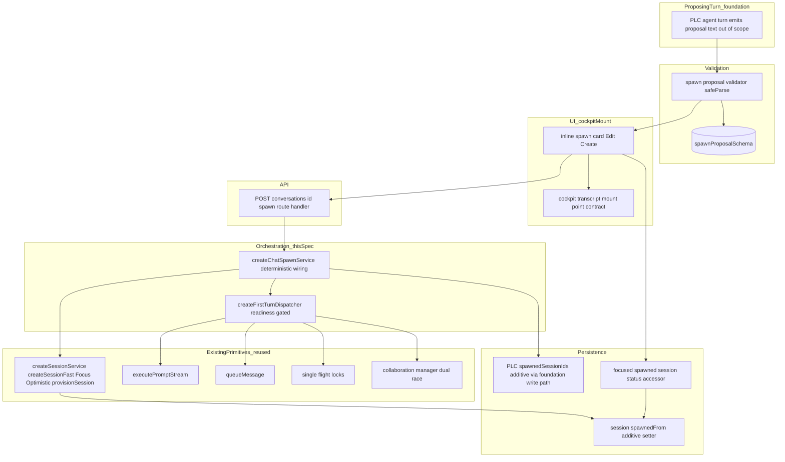
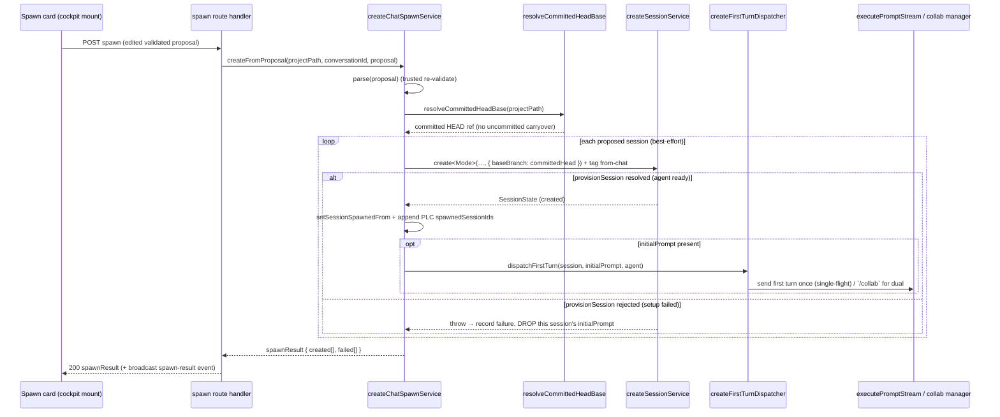
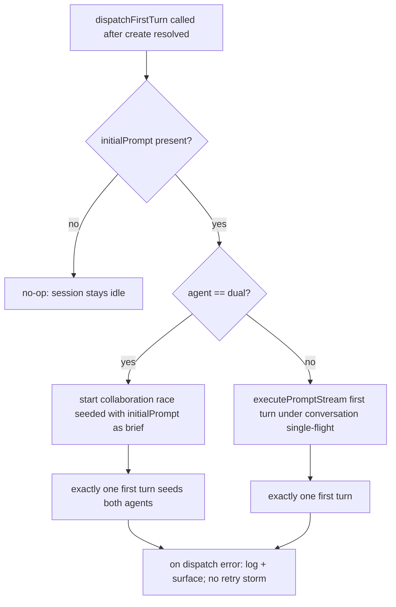

# Design Document — chat-session-spawning

## Overview

**Purpose**: This feature lets an agent turn in a **project conversation (PLC)** propose **spawning one or more sessions** — each with name/branch/target/agent/mode and an optional `initialPrompt` — as a **structured, machine-validated** proposal rendered inline in the transcript as a **spawn card** with **Edit** and **Create**. On Create, Command Center **deterministically** creates the sessions with full New-Session parity, tags them `from chat`, links them back to the spawning PLC, and **auto-dispatches** each session's `initialPrompt` as its **first user turn once the agent is ready**. The PLC then **passively tracks** spawned-session status.

**Users**: Developers using the project-page cockpit. The proposing agent produces a proposal; the developer reviews/edits/creates; Command Center owns creation and the first-turn dispatch.

**Impact**: Adds a new `chat-spawning` domain (proposal schema + validator + creation wiring), a new shared **readiness-gated auto-dispatch primitive** on `src/lib/prompt/`, an inline spawn-card component mounted into the cockpit transcript, and an additive `spawnedFrom` tag + `spawnedSessionIds` back-link on the session/PLC records. It **composes** existing session-creation, single-flight, message-queue, and dual Claude+Codex collaboration primitives — it does not fork them. The proposing agent never creates sessions (agent-offloading): it emits data, Command Center validates with Zod and acts.

### Goals

- A machine-validated spawn proposal (1+ sessions; each name/branch/target/agent/mode + optional `initialPrompt`) the agent emits and Command Center validates with Zod before offering Create (1.x, 2.x).
- An inline spawn card (Edit/Create, multi-session batch) rendered into the cockpit transcript mount (2.x).
- Deterministic creation reusing the existing session primitives, from the main worktree's **committed HEAD**, with `from chat` tag + back-link (3.x, 4.x).
- A NEW shared **readiness-gated "auto-dispatch first user turn when ready"** primitive: exactly one first turn, drop on setup failure, mode-independent, dual-race seeds both agents, best-effort batch, riding the existing queue + single-flight (5.x, 6.x, 7.x).
- Passive spawned-session status tracking that does not drive the sessions (8.x).

### Non-Goals

- The PLC data model, persistence, lifecycle, and main-worktree execution path that runs the proposing turn (→ project-level-conversations foundation).
- The cockpit page shell, composer, tabs, and the transcript host that mounts the card (→ project-conversation-cockpit); this spec consumes its mount point as a contract.
- The New Session modal UI and the sessions-table row presentation (reused, not rebuilt).
- The global rail's surfacing/grouping/routing of spawned sessions (→ unified-conversations-panel / foundation active-conversations data).
- Autonomous orchestration of spawned sessions beyond the single first turn (driving subsequent turns, merging, workflow launches).
- Teaching the proposing agent *how/when* to emit a proposal (prompt engineering of the PLC system prompt is the foundation's concern; this spec defines the wire shape it must conform to and validates it).

## Boundary Commitments

### This Spec Owns

- The **spawn-proposal schema** (`spawnProposalSchema`: 1+ `proposedSessionSchema`, each `name` / `branch` / `target` / `agent` (`claude` | `codex` | `dual`) / `mode` (`fast` | `focus` | `optimistic`) + optional `initialPrompt`) and its derived `z.infer` types.
- The **proposal validator** — a pure function that extracts a candidate proposal from agent turn output and `safeParse`s it, returning a discriminated `valid | invalid` result (agent-offloading boundary: agent output → validated data).
- The **inline spawn-card component** (render rows, Edit form, Create / Create-N) and its Storybook story, rendered into the cockpit transcript mount point (the mount point itself is the cockpit's contract).
- The **deterministic creation wiring** (`createChatSpawnService`) that maps a validated proposal to calls on the existing `src/lib/sessions/` service + route-handlers, forces the **committed-HEAD spawn base**, writes the `from chat` tag + the PLC back-link, and dispatches the optional `initialPrompt` via the auto-dispatch primitive with **best-effort batch** semantics.
- The NEW shared **readiness-gated auto-dispatch primitive** (`createFirstTurnDispatcher` on `src/lib/prompt/first-turn-dispatch.ts`): given a created session + its `initialPrompt`, send exactly one first user turn once the agent is ready, drop on setup failure, mode-independent, dual-race seeds both agents — riding the existing message-queue + single-flight lock rather than a parallel path.
- The additive **`spawnedFrom`** field on `sessionStateSchema` (`{ source: "chat"; projectName; conversationId } | null`) and the additive **`spawnedSessionIds`** list on the PLC conversation record (the link the conversation persists to the sessions it spawned).
- The **API surface** to submit a (possibly edited) validated proposal for creation (`POST .../conversations/[conversationId]/spawn`) and its route-handler factory.
- The **passive status read** the card uses to surface spawned-session status (a focused accessor over the existing session status, keyed by `spawnedFrom`/`spawnedSessionIds`).

### Out of Boundary

- The PLC conversation data model, persistence path, lifecycle, repo-root execution, and the SSE/active-conversations *shape* — owned by the foundation. This spec **adds one additive field** (`spawnedSessionIds`) to the PLC record through the foundation's existing project-conversation write path; it does not alter the foundation's execution or event schemas.
- The cockpit page shell, unified composer, conversation tabs, transcript virtualization, and the transcript **mount point** — owned by `project-conversation-cockpit`. This spec renders *into* that mount point.
- The New Session modal, the sessions table, and session row sub-components — reused via existing components/primitives, never forked.
- The dual Claude+Codex collaboration/race mechanics — owned by `src/lib/workflows/collaboration/`. This spec **invokes** it (seeding the first turn); it does not modify negotiation logic.
- The global rail presentation and cross-page routing of spawned sessions — owned by `unified-conversations-panel`.

### Allowed Dependencies

- **Upstream/shared** (may depend on): `@/lib/sessions/service` (`createSessionService`: `createSessionFast/Focus/Optimistic`, `provisionSession`), `@/lib/sessions/route-handlers` + `@/lib/sessions/schemas` (`createSessionRequestSchema`, `sessionStateSchema`), `@/lib/sessions/repo` (name/branch validation), `@/lib/prompt/sdk-driver` (`executePromptStream`), `@/lib/prompt/queue` (`queueMessage`), `@/lib/prompt/single-flight` (conversation/session locks), `@/lib/workflows/collaboration/manager` (dual race start) **or** the `/collab` first-turn convention exposed by `executePromptStream` (see Build-vs-Adopt), `@/lib/conversations/schemas` (`agentBackendSchema`), `@/lib/project-conversations/*` (foundation: the project-conversation record + its write path for the back-link, sentinel), `@/lib/state-store/*` (focused accessors/setters for the session tag + PLC back-link + status read), `@/lib/projects/resolver`, `@/lib/events/broadcaster`, `@/lib/config/loader`, `@/lib/logging`, `@/lib/shared/errors`. UI: the cockpit transcript mount contract, `@/lib/cc-design-system` tokens, existing session row sub-components.
- **Constraints that must not be violated**: do not modify the conversation machine, the session-creation primitives' internals, or the collaboration negotiation logic; do not call `readState()` on a hot path (status read uses a focused accessor); the `from chat` tag + back-link are **one-time writes folded into creation** (no per-keystroke setter); new persisted fields are **additive with safe defaults** (no backward-compat shim for persisted data without approval); deps interfaces use **method syntax**; **no `vi.mock` of internal modules** — the validator, creation wiring, and auto-dispatch primitive are unit-testable as pure functions / via DI; agent output is **`safeParse`d** (untrusted), internal data `parse`d (trusted).

### Revalidation Triggers

- Any change to the **`spawnProposalSchema`** wire shape → re-check the foundation's PLC system prompt (which instructs the agent to emit it) and the cockpit card consumer.
- Any change to the **spawn-card mount contract** (props the cockpit transcript passes / expects) → re-check `project-conversation-cockpit`.
- Any change to **`executePromptStream` / `queueMessage` / single-flight** signatures or the `/collab` first-turn convention → re-check the auto-dispatch primitive (and the foundation, which also consumes the prompt stream).
- Adding/removing **`spawnedFrom`** (session) or **`spawnedSessionIds`** (PLC) persisted fields → re-check the foundation (PLC record), the sessions list/active-conversations consumers, and `unified-conversations-panel`.
- Any change to the existing **session-creation request/lifecycle** (modes, branch base options) → re-check the creation wiring's parity assumptions.

## Architecture

### Existing Architecture Analysis

- **Session creation is already a clean primitive**: `createSessionService(deps)` exposes `createSessionFast/Focus/Optimistic`, all funneling through `provisionSession(projectPath, sessionName, opts)` which provisions the worktree (`git worktree add -b <branch> <path> <baseBranch>`), runs the init script, and persists the session. `opts.baseBranch` already exists and **defaults to `"main"`** — committing the spawn base to the main worktree's committed HEAD is a matter of passing the right base ref, not new git plumbing.
- **The optimistic flow is the loose template for "auto-execute the first turn"**: `createSessionOptimistic` provisions, then fires `executeOptimisticWorkflow` (fire-and-forget) which calls `executePromptStream`. But it is a **one-shot tied to a follow-up merge** — not a reusable, readiness-gated, exactly-once, drop-on-failure, mode-independent, dual-race-aware first-turn dispatcher. That primitive does not exist yet; this spec builds it and optimistic-mode could later adopt it.
- **"Agent ready" is observable as: `provisionSession` resolved**. `provisionSession` only returns after `git worktree add` + the init script succeed (it rolls back and throws on failure). After it resolves, `executePromptStream` ensures the conversation actor + backend runtime (backend "live") under the per-conversation single-flight lock. So **readiness = provisionSession fulfilled; setup failure = provisionSession rejected.** No new readiness subsystem is required.
- **Exactly-once first turn is enforced by riding the existing locks**: the first user turn for a freshly-created session's first conversation goes through `executePromptStream` (which acquires the conversation lock) or, for an already-running actor, `queueMessage`. There is exactly one initial conversation per created session (`provisionSession` seeds `conversations[0]`), so the first turn targets a single, known conversation id.
- **Dual Claude+Codex race is the collaboration primitive**: a "dual" first turn is the existing collaboration/race seeded from one brief — reachable either via the collaboration manager's `start` or via the `/collab <brief>` convention that `executePromptStream` already understands. Seeding "both agents with the same prompt" = starting the race with the `initialPrompt` as its brief.
- **Sessions carry no origin tag today**: `sessionStateSchema` has `parentSessionName` (for branch parenting) and `source` (`cc | imported`) but no "spawned from chat / which conversation" concept. This is an additive field.
- **The PLC record persists "links to sessions it spawned"** per the foundation (PLC-3). This spec writes that link (`spawnedSessionIds`) through the foundation's project-conversation write path.

### Architecture Pattern & Boundary Map

Selected pattern: **agent-offloading pipeline** — *agent emits structured proposal → Zod validation gate → user review/edit (card) → deterministic orchestrator → existing creation primitives + a new readiness-gated first-turn dispatcher → passive status read.* Variation is pushed to the edges (a proposal schema, one validator, one orchestrator that composes existing services, one new prompt-layer primitive); the session-creation core, the collaboration race, and the conversation machine stay untouched.



**Architecture Integration**:
- Selected pattern: agent-offloading pipeline (validate-then-act) + a thin orchestrator composing existing creation/dispatch primitives.
- Domain/feature boundaries: this spec owns the proposal schema, the validator, the card, the orchestrator (`createChatSpawnService`), the first-turn dispatcher, the additive tag/back-link, the spawn route, and the status read. Session creation, the prompt stream, the message queue, single-flight, and the collaboration race are **reused unchanged**.
- Existing patterns preserved: factory + DI (`createX(deps)` with method-syntax deps), per-conversation single-flight (exactly-once), parsed-row cache + focused accessors (PERFORMANCE.md), schema-first Zod + `z.infer`, `safeParse` for untrusted agent output.
- New components rationale: a proposal needs a wire schema + a validation gate (new schema + validator); a multi-row reviewable proposal needs UI (new card); mapping a validated proposal to creation + dispatch needs an orchestrator (new service); reliable exactly-once first-turn-when-ready is a genuinely new, reusable concern (new prompt-layer primitive); origin tracing needs two additive fields.
- Steering compliance: composable primitives (no fork of creation/race/machine); agent-offloading (Zod-validate then act deterministically); no `any`/unsafe `as`; method-syntax deps; additive-only persisted fields with defaults; red-green TDD; UI follows the design system + Storybook-first.

### Dependency Direction

`spawnProposalSchema → proposal validator → spawn card (UI) ──┐`
`spawnProposalSchema → createChatSpawnService → { createSessionService, createFirstTurnDispatcher, additive tag/back-link setters } → spawn route handler → (cockpit mount)`

`createFirstTurnDispatcher → { executePromptStream | collaboration manager, queueMessage, single-flight }` (leftward only).
The orchestrator depends on the session-creation service and the dispatcher; neither depends back on the orchestrator. The card depends on the schema + the spawn route; nothing in the backend depends on the card.

### Technology Stack

| Layer | Choice / Version | Role in Feature | Notes |
|-------|------------------|-----------------|-------|
| Frontend / UI | React 19, Next.js 16 App Router, CC design system, Storybook (`@storybook/nextjs-vite`) | Inline spawn card (rows + Edit form + Create/Create-N), Storybook story | Mounts into the cockpit transcript contract; DS tokens only |
| Backend / Services | TypeScript 5 (strict), Next.js route handlers | Proposal validator, `createChatSpawnService`, first-turn dispatcher, spawn route | Factory + DI; composes existing session/prompt primitives |
| Data / Storage | Zod v4, better-sqlite3 (WAL) via state-store | `spawnProposalSchema`; additive `spawnedFrom` (session) + `spawnedSessionIds` (PLC); focused status accessor | `z.infer` types; `z.record(z.string(), v)` for v4; additive DDL/columns only |
| Messaging / Events | Existing SSE broadcaster | Reuse session-status / conversation events for passive tracking; broadcast spawn-result | No new event channel for status; one additive spawn-result event |
| Infrastructure / Runtime | Existing single-flight lock, message queue, conversation actor, collaboration race | Exactly-once first turn, dual-race seeding | Reused; the dispatcher is the only new runtime piece |

## File Structure Plan

### Directory Structure

```
src/lib/chat-spawning/                         # NEW DOMAIN (proposal schema + validator + creation wiring + spawn route)
├── schemas.ts                                 # NEW: spawnProposalSchema, proposedSessionSchema, spawnAgentSchema (claude|codex|dual),
│                                              #      spawnResultSchema; z.infer types
├── proposal-validator.ts                      # NEW: pure extractProposal(turnOutput) + validateProposal(candidate) → {valid,proposal} | {invalid,issues}
├── spawn-service.ts                           # NEW: createChatSpawnService(deps) — validated proposal → deterministic creation (committed-HEAD base),
│                                              #      from-chat tag + PLC back-link, per-session initialPrompt dispatch, best-effort batch, spawn-result
├── route-handlers.ts                          # NEW: createSpawnRouteHandlers(deps) — POST .../conversations/[id]/spawn (validate + create + dispatch)
└── spawn-base.ts                              # NEW: resolveCommittedHeadBase(projectPath) — committed HEAD ref of the main worktree (no uncommitted carryover)

src/lib/prompt/
└── first-turn-dispatch.ts                     # NEW (shared primitive): createFirstTurnDispatcher(deps) — readiness-gated exactly-once first-turn send,
                                               #      drop-on-setup-failure, mode-independent, dual-race seeds both via collab/`/collab`; rides queue + single-flight

src/features/_root/spawn-card/                 # NEW shared UI (consumed by the cockpit transcript; lives in _root per structure rules for cross-feature transcript chrome)
├── SpawnCard.tsx                              # NEW: card shell — header "Proposed sessions · N", rows, Edit/Create controls
├── SpawnCardRow.tsx                           # NEW: one proposed-session row (name, branch → target, agent badge, mode)
├── SpawnCardEditForm.tsx                      # NEW: Edit mode — editable name/branch/target/agent/mode/initialPrompt per session
├── useSpawnCard.ts                            # NEW: card hook — local edit state + submit via spawn mutation; pure mode-router helpers extracted
├── spawn-card.css                             # NEW: BEM styles using DS tokens (folds any prototype .pc-spawn-* names into production naming)
├── SpawnCard.stories.tsx                      # NEW: Storybook story (single + multi-row + edit + invalid states)
└── SpawnCard.test.tsx                         # NEW: render/edit/submit tests

src/lib/chat-spawning/{schemas,proposal-validator,spawn-service,spawn-base}.test.ts   # NEW: colocated unit tests
src/lib/prompt/first-turn-dispatch.test.ts     # NEW: colocated unit tests
```

### Modified Files

- `src/lib/sessions/schemas.ts` — add additive `spawnedFrom: z.object({ source: z.literal("chat"), projectName: z.string(), conversationId: z.string() }).nullable().default(null)` to `sessionStateSchema`; surface `spawnedFrom` on `sessionListItemSchema` (so the sessions list / status read can show the `from chat` tag without a whole-state read). No existing field changes.
- `src/lib/project-conversations/schemas.ts` (foundation) — add additive `spawnedSessionIds: z.array(z.string()).default([])` to the project-conversation record (the PLC's persisted link to sessions it spawned). _Boundary note:_ this is the **one** additive field this spec adds to a foundation-owned schema; it is written through the foundation's existing project-conversation write path and changes no execution/event behavior. Flagged as a foundation revalidation touchpoint.
- `src/lib/state-store/setters.ts` — add a one-time `setSessionSpawnedFrom(projectPath, sessionName, spawnedFrom)` focused setter (called once at creation; not a hot path) and `addPlcSpawnedSessionIds(projectPath, conversationId, ids)` to append the back-link to the PLC record. Both additive.
- `src/lib/state-store/accessors.ts` — add `getSpawnedSessionStatuses(projectPath, conversationId)` focused accessor that returns the slim status of the sessions linked from a PLC (`spawnedSessionIds` ∩ sessions list items), for passive tracking without `readState()`.
- `src/app/api/projects/[name]/conversations/[conversationId]/spawn/route.ts` — NEW thin App-Router re-export of `createSpawnRouteHandlers().POST`.

> Each file has one responsibility. `chat-spawning/` owns the proposal→creation pipeline; `prompt/first-turn-dispatch.ts` owns the reusable first-turn primitive; `_root/spawn-card/` owns the card UI; the modified state-store/schemas files carry only additive tag/back-link/accessor changes.

## System Flows

### Validated proposal → Create batch → readiness-gated first turn



Key decisions: creation reuses the existing `create<Mode>` calls; the **only** new git concern is the base ref (`committed HEAD` of main). Best-effort batch: a per-session try/catch keeps successes, records failures, and **drops only the failed session's** `initialPrompt`. Exactly-once first turn: the dispatcher targets the created session's single initial conversation under single-flight; a dual agent routes through the collaboration race seeded with the same prompt.

### Readiness gating inside the dispatcher



Readiness is structural: the dispatcher is **only invoked after `provisionSession` resolved** (worktree + init script done) and `executePromptStream` internally waits for the backend runtime to be live before the turn streams. Setup failure short-circuits before the dispatcher is ever called for that session, satisfying drop-on-failure.

## Requirements Traceability

| Requirement | Summary | Components | Interfaces | Flows |
|-------------|---------|------------|------------|-------|
| 1.1, 1.4 | Structured proposal, 1+ sessions, required fields | spawnProposalSchema; proposedSessionSchema | `spawnProposalSchema` | — |
| 1.2, 1.3 | Validate before Create; invalid surfaced/ignored | proposal-validator (`safeParse`) | `validateProposal` | — |
| 1.5 | Optional initial prompt field | proposedSessionSchema (`initialPrompt?`) | schema | — |
| 1.6 | Deterministic creation, not by agent | createChatSpawnService | `createFromProposal` | create flow |
| 2.1, 2.2 | Inline card, rows, Edit/Create | SpawnCard, SpawnCardRow | card props | — |
| 2.3 | Edit all fields incl. initialPrompt | SpawnCardEditForm; useSpawnCard | edit state | — |
| 2.4 | Create-all on multi-row | SpawnCard (Create-N); spawn-service batch | `createFromProposal` | create flow |
| 2.5 | Reviewed == submitted | useSpawnCard (edit state → submit) | spawn mutation | create flow |
| 2.6 | DS tokens, no hard-coded values | spawn-card.css; SpawnCard | DS tokens | — |
| 3.1, 3.2 | New-Session parity, reuse primitives | createChatSpawnService → createSessionService | `create<Mode>` | create flow |
| 3.3, 3.4 | Committed-HEAD base, no uncommitted carryover | resolveCommittedHeadBase; spawn-service (`baseBranch`) | `resolveCommittedHeadBase` | create flow |
| 3.5 | Same validations; reject invalid/dup | createChatSpawnService (reuses name/branch validation) | reused validators | create flow |
| 4.1, 4.3 | `from chat` tag persisted | sessionStateSchema (`spawnedFrom`); setSessionSpawnedFrom | setter | create flow |
| 4.2, 4.4 | Back-link to spawning PLC | PLC `spawnedSessionIds`; addPlcSpawnedSessionIds | setter | create flow |
| 5.1 | Optional, editable initialPrompt | proposedSessionSchema; SpawnCardEditForm | schema; edit | — |
| 5.2, 5.6 | Auto-dispatch when ready; mode-independent | createFirstTurnDispatcher | `dispatchFirstTurn` | dispatch flow |
| 5.3, 5.7 | Exactly one first turn via queue + single-flight | createFirstTurnDispatcher (reuses locks/queue) | reused locks | dispatch flow |
| 5.4 | No initialPrompt ⇒ idle | createFirstTurnDispatcher (no-op) | `dispatchFirstTurn` | dispatch flow |
| 5.5 | Drop on setup failure | createChatSpawnService (dispatcher not invoked on failure) | create flow | create/dispatch |
| 6.1, 6.2 | Best-effort batch; keep successes, drop failed prompt | createChatSpawnService (per-session try/catch) | `createFromProposal` | create flow |
| 6.3 | Report created/failed | spawnResultSchema; spawn route | `spawnResult` | create flow |
| 7.1, 7.2 | Dual race seeds both agents; same guarantees | createFirstTurnDispatcher (dual branch → collab) | `dispatchFirstTurn` | dispatch flow |
| 8.1, 8.2, 8.4 | Passive status surface, near-real-time, reuse signals | getSpawnedSessionStatuses; SpawnCard | accessor; reused SSE | — |
| 8.3 | No autonomous driving beyond first turn | createChatSpawnService/dispatcher (single turn only) | — | dispatch flow |
| 9.1, 9.3 | Consume foundation contracts; schema/dispatcher usable w/o cockpit | spawnProposalSchema; createFirstTurnDispatcher | contracts | — |
| 9.2 | Render into cockpit mount contract | SpawnCard | mount props | — |
| 9.4 | Reuse, don't fork primitives | createChatSpawnService; createFirstTurnDispatcher | reused services | create/dispatch |

## Components and Interfaces

| Component | Domain/Layer | Intent | Req Coverage | Key Dependencies (P0/P1) | Contracts |
|-----------|--------------|--------|--------------|--------------------------|-----------|
| spawnProposalSchema | Types | Wire shape of a validated proposal | 1.1, 1.4, 1.5 | conversations/schemas `agentBackendSchema` (P0) | State |
| Proposal validator | Service | Extract + `safeParse` agent output | 1.2, 1.3 | spawnProposalSchema (P0) | Service |
| createChatSpawnService | Service | Validated proposal → deterministic creation + dispatch, best-effort | 1.6, 2.4, 3.x, 4.x, 5.5, 6.x | sessions/service, first-turn-dispatch, spawn-base, state-store setters (P0) | Service, Event |
| resolveCommittedHeadBase | Service | Committed HEAD ref of main worktree | 3.3, 3.4 | git client / projects resolver (P0) | Service |
| createFirstTurnDispatcher | Service (prompt) | Readiness-gated exactly-once first turn | 5.2–5.7, 7.x, 8.3 | executePromptStream, queueMessage, single-flight, collab manager (P0) | Service |
| Spawn route handler | API | Submit validated proposal for creation | 1.6, 6.3, 9.2 | createChatSpawnService, projects resolver (P0) | API, Event |
| SpawnCard (+ row/edit/hook) | UI | Inline card render + Edit + Create-N | 2.x, 9.2 | spawnProposalSchema, DS tokens, cockpit mount (P0) | State |
| Session spawned-from tag | Data | Persist `from chat` origin | 4.1, 4.3 | sessions/schemas, state-store setter (P0) | State |
| PLC spawned-session back-link | Data | Persist PLC→sessions link | 4.2, 4.4 | project-conversations schema, state-store setter (P0) | State |
| Spawned-session status read | Data | Passive status accessor | 8.1, 8.2, 8.4 | state-store accessor, sessions list (P0) | Service |

### Types / Schemas

#### Spawn-proposal schema (new `src/lib/chat-spawning/schemas.ts`)

**Responsibilities & Constraints**: Define the machine-validated wire shape the agent emits and Command Center validates. 1+ proposed sessions; each carries name/branch/target/agent/mode + optional `initialPrompt`. Agent is `claude | codex | dual` (dual = the Claude+Codex race); mode is `fast | focus | optimistic` (reusing the session creation modes). Strict Zod v4; `z.infer` types; no hand-written duplicates.

**Contracts**: State [x]

```typescript
export const spawnAgentSchema = z.enum(["claude", "codex", "dual"]);
export type SpawnAgent = z.infer<typeof spawnAgentSchema>;

// Reuses the session creation modes; kept as a local enum to avoid importing
// the discriminated request schema. Must stay in sync with sessionCreationModeSchema
// (`src/lib/sessions/schemas.ts`). A unit test MUST assert these members exactly match
// sessionCreationModeSchema's mode literals so the deliberate duplication fails CI on divergence.
export const spawnModeSchema = z.enum(["fast", "focus", "optimistic"]);

export const proposedSessionSchema = z.object({
  name: z.string().trim().min(1).max(200),
  branch: z.string().trim().min(1).max(200),
  target: z.string().trim().min(1).max(200).default("main"),
  agent: spawnAgentSchema,
  mode: spawnModeSchema,
  initialPrompt: z.string().trim().min(1).optional(),
});
export type ProposedSession = z.infer<typeof proposedSessionSchema>;

export const spawnProposalSchema = z.object({
  sessions: z.array(proposedSessionSchema).min(1).max(20),
});
export type SpawnProposal = z.infer<typeof spawnProposalSchema>;

export const spawnResultSchema = z.object({
  created: z.array(z.object({
    name: z.string(),
    sessionName: z.string(),
    branchName: z.string(),
    initialPromptDispatched: z.boolean(),
  })),
  failed: z.array(z.object({
    name: z.string(),
    error: z.string(),
  })),
});
export type SpawnResult = z.infer<typeof spawnResultSchema>;
```

- Preconditions: `sessions` non-empty (1.4); each field non-empty after trim.
- Postconditions: a parsed `SpawnProposal` is safe to drive creation; `target` defaults to `"main"` when omitted.
- Invariants: the agent never sees a `created` session — it only authors `SpawnProposal`; `SpawnResult` is produced by Command Center.

#### Proposal validator (new `src/lib/chat-spawning/proposal-validator.ts`)

**Responsibilities & Constraints**: Pure functions, no I/O. `extractProposal(turnOutput)` pulls a candidate proposal object out of the agent's structured turn output (the foundation defines *how* the agent marks it; this validator accepts the candidate object/JSON). `validateProposal(candidate)` runs `spawnProposalSchema.safeParse` (untrusted input ⇒ `safeParse`) and returns a discriminated result. No mocks needed — tested directly.

**Contracts**: Service [x]

```typescript
export type ProposalValidation =
  | { kind: "valid"; proposal: SpawnProposal }
  | { kind: "invalid"; issues: string[] };

export function validateProposal(candidate: unknown): ProposalValidation;
export function extractProposal(turnOutput: unknown): unknown | null; // candidate or null when none present
```

- Preconditions: none (accepts arbitrary untrusted input).
- Postconditions: `kind:"valid"` ⇒ `proposal` conforms to the schema; `kind:"invalid"` ⇒ human-readable `issues` for surfacing (1.3); `extractProposal` returns `null` when the turn contains no proposal (card not rendered).
- Invariants: never throws on bad input; never mutates the input.

### Service Layer

#### createChatSpawnService (new `src/lib/chat-spawning/spawn-service.ts`)

| Field | Detail |
|-------|--------|
| Intent | Map a validated (possibly edited) proposal to deterministic creation + first-turn dispatch, best-effort |
| Requirements | 1.6, 2.4, 3.1–3.5, 4.x, 5.5, 6.x, 8.3 |

**Responsibilities & Constraints**: Re-validate the incoming proposal with `parse` (trusted server boundary), resolve the committed-HEAD base once, then for **each** proposed session: call the matching existing `create<Mode>` on `createSessionService` with `baseBranch = committedHead` and the proposal's `target`/`name`/`branch`; on success, write the `from chat` tag (`setSessionSpawnedFrom`) and append the session to the PLC's `spawnedSessionIds`; if the session carries an `initialPrompt`, invoke the first-turn dispatcher. Wrap each session in try/catch — **best-effort batch**: keep successes, record failures, and **drop the failed session's `initialPrompt`** (the dispatcher is simply never called for it). Never drive a session beyond the single first turn (8.3). Emit a `spawn-result` event + return `SpawnResult`.

**Dependencies**: Outbound — `createSessionService` (`createSessionFast/Focus/Optimistic`) (P0); `createFirstTurnDispatcher` (P0); `resolveCommittedHeadBase` (P0); state-store `setSessionSpawnedFrom` + `addPlcSpawnedSessionIds` (P0); `broadcast` (P1); `logging` (P1). Deps use **method syntax**.

**Contracts**: Service [x] / Event [x]

```typescript
export interface ChatSpawnDeps {
  createSession(input: {
    projectPath: string;
    proposed: ProposedSession;
    baseBranch: string;          // committed HEAD of main
  }): Promise<SessionState>;     // dispatches to create<Mode>, maps agent/mode/branch/target
  resolveCommittedHeadBase(projectPath: string): Promise<string>;
  setSessionSpawnedFrom(projectPath: string, sessionName: string, spawnedFrom: SpawnedFrom): Promise<void>;
  addPlcSpawnedSessionIds(projectPath: string, conversationId: string, sessionNames: string[]): Promise<void>;
  dispatchFirstTurn(input: DispatchFirstTurnInput): Promise<{ dispatched: boolean }>;
  broadcast(event: unknown): void;
}

export function createChatSpawnService(deps: ChatSpawnDeps): {
  createFromProposal(input: {
    projectPath: string;
    projectName: string;
    conversationId: string;      // the spawning PLC
    proposal: SpawnProposal;     // already validated; re-parsed at the boundary
  }): Promise<SpawnResult>;
};
```

- Preconditions: `conversationId` is an existing PLC in `projectPath`; `proposal` parses.
- Postconditions: every successfully-created session is tagged `from chat`, linked into the PLC, and (iff it had an `initialPrompt`) had **exactly one** first turn dispatched; failures appear in `SpawnResult.failed` and do not abort the batch (6.1) and dropped their own prompt (6.2, 5.5).
- Invariants: the **agent** never reaches this code path with creation authority — only a validated proposal does (1.6); the service composes `createSessionService` and never reimplements provisioning (3.2, 9.4).

**Implementation Notes**
- Integration: the `createSession` dep maps `ProposedSession` → the existing `create<Mode>` call. For `agent:"dual"`, the session is created on its chosen mode (default `fast` if a dual proposal omits a meaningful mode) and the **dual seeding happens in the dispatcher** (the race is a first-turn concern, not a creation concern).
- Validation: name/branch/target validation is delegated to the existing creation primitives (3.5) — duplicate/invalid names surface as that session's `failed` entry.
- Risks: ordering — create sequentially (not `Promise.all`) because concurrent `git worktree add` against the same parent repo races on `.git/config.lock` (the existing `bulkDeleteSessions` comment documents this exact hazard). The PLC back-link append is a single batched setter call after the loop.

#### resolveCommittedHeadBase (new `src/lib/chat-spawning/spawn-base.ts`)

| Field | Detail |
|-------|--------|
| Intent | Produce the committed-HEAD base ref of the main worktree so spawned branches carry no uncommitted edits |
| Requirements | 3.3, 3.4 |

**Responsibilities & Constraints**: Return a ref the existing `git worktree add -b <branch> <path> <baseRef>` can start from that is the **committed HEAD** of the project's main worktree — never the working tree. Because `git worktree add` branches from a commit-ish and **does not** copy uncommitted changes, passing the resolved committed HEAD (e.g. the current branch name or its resolved SHA) inherently excludes uncommitted edits. Pure resolution via an injected git client.

**Contracts**: Service [x]

```typescript
export interface SpawnBaseDeps {
  getHeadRef(repoRootPath: string): Promise<string>; // committed HEAD: branch name or `git rev-parse HEAD`
}
export function createSpawnBaseResolver(deps: SpawnBaseDeps): {
  resolveCommittedHeadBase(projectPath: string): Promise<string>;
};
```

- Preconditions: `projectPath` is the repo root.
- Postconditions: returns a commit-ish for `worktree add`; the spawned worktree contains only committed content (3.4).
- Invariants: never returns a stash/working-tree reference; never mutates the repo.

#### createFirstTurnDispatcher (new shared primitive `src/lib/prompt/first-turn-dispatch.ts`)

| Field | Detail |
|-------|--------|
| Intent | Reusable readiness-gated "auto-dispatch the first user turn once the agent is ready, exactly once" |
| Requirements | 5.2, 5.3, 5.4, 5.6, 5.7, 7.1, 7.2, 8.3 |

**Responsibilities & Constraints**: Given a **created** session (so worktree/init are already done — readiness is satisfied by the caller having awaited `provisionSession`) and an optional `initialPrompt` + agent selection, deliver **exactly one** first user turn. No `initialPrompt` ⇒ no-op (session stays idle, 5.4). Single agent ⇒ `executePromptStream` on the session's single initial conversation under the existing **conversation single-flight** (exactly-once, 5.3, 5.7) — mode-independent (5.6). Dual ⇒ start the **collaboration race** seeded with `initialPrompt` as the brief so both Claude and Codex are seeded with the same prompt (7.1), under the same exactly-once guard (7.2). It **only** sends the first turn; it never drives subsequent turns (8.3). Errors are logged and surfaced, with **no retry storm** (a failed dispatch does not loop). Factory + DI; method-syntax deps; reuses the message-queue/single-flight rather than a parallel path.

**Dependencies**: Outbound — `executePromptStream` (P0); `queueMessage` (P1, for the already-running-actor edge); single-flight `isConversationBusy`/`acquireConversationLock` (P0, exactly-once); collaboration manager `start` **or** the `/collab` convention via `executePromptStream` (P0, dual); `readConfig` for default backend/effort (P1); `logging` (P1).

**Contracts**: Service [x]

```typescript
export interface DispatchFirstTurnInput {
  projectPath: string;
  projectName: string;
  session: SessionState;          // freshly created; conversations[0] is the target
  initialPrompt: string | null;   // null ⇒ no-op
  agent: SpawnAgent;              // claude | codex | dual
}

export interface FirstTurnDispatcherDeps {
  executePromptStream: typeof executePromptStream;
  startDualRace(input: {          // wraps collaboration manager start / `/collab` seeding
    projectPath: string;
    session: SessionState;
    conversationId: string;
    brief: string;
  }): Promise<void>;
  isConversationBusy(projectPath: string, sessionName: string, conversationId: string): boolean;
  readConfig: typeof readConfig;
}

export function createFirstTurnDispatcher(deps: FirstTurnDispatcherDeps): {
  dispatchFirstTurn(input: DispatchFirstTurnInput): Promise<{ dispatched: boolean }>;
};
```

- Preconditions: `session` is created (caller awaited `provisionSession`); `session.conversations[0]` exists (provisioning seeds it).
- Postconditions: at most one first turn is sent for the session; `initialPrompt === null` ⇒ `{ dispatched: false }` and no turn; `agent:"dual"` ⇒ both agents seeded from the same brief (7.1); a dispatch failure resolves `{ dispatched: false }` after logging (no throw that would roll back the whole batch).
- Invariants: never sends more than one turn (single-flight + single target conversation, 5.3); mode-independent — the dispatch path does not branch on `creationMode` (5.6); never drives a second turn (8.3); always rides the existing prompt/queue/lock path (5.7).

**Implementation Notes**
- Integration: the dispatcher is invoked **only after** a successful create, so readiness ("worktree setup, init script, backend live") is guaranteed: worktree+init by `provisionSession`, backend-live by `executePromptStream` awaiting the runtime before streaming. This makes "readiness-gated" structural rather than a polling loop (agent-offloading: no agent/loop bookkeeping).
- Validation: the exactly-once guarantee is asserted by a test that calls `dispatchFirstTurn` twice concurrently for the same session and observes a single `executePromptStream` invocation (the second is rejected by single-flight).
- Risks: for `dual`, the seeding must reach the collaboration race with the prompt as its brief; the dispatcher adapts `initialPrompt` into the `startDualRace` brief so callers don't construct `/collab` strings. This is the only nontrivial branch and is unit-tested with an injected `startDualRace`.
- Reuse note: this primitive is intentionally session-agnostic so **optimistic-mode could later adopt it** (the brief flags optimistic-mode as a future consumer); this spec only wires the spawn path.

### API Layer

#### Spawn route handler (new `src/lib/chat-spawning/route-handlers.ts`)

**Contracts**: API [x] / Event [x]

##### API Contract

| Method | Endpoint | Request | Response | Errors |
|--------|----------|---------|----------|--------|
| POST | /api/projects/[name]/conversations/[conversationId]/spawn | `spawnProposalSchema` (the edited, validated proposal) | `spawnResultSchema` (200) | 400 (invalid proposal), 404 (project/PLC not found), 500 (creation failure surfaced as `failed[]` where possible) |

- The route `safeParse`s the body against `spawnProposalSchema` (defense-in-depth: the body is whatever the card submitted; treat as untrusted) → 400 on failure with `issues`.
- Resolves the project + asserts the PLC exists (404 otherwise), then delegates to `createChatSpawnService.createFromProposal` and returns the `SpawnResult`.
- Best-effort: individual session failures are reported in `failed[]` with HTTP 200; only a whole-request failure (bad body / unknown project/PLC) is a non-2xx.
- The App-Router shell at `src/app/api/projects/[name]/conversations/[conversationId]/spawn/route.ts` is a thin re-export per the structure rules.

##### Event Contract

- Published: a `spawn-result` event (scoped to the project + `conversationId`) carrying the created/failed summary so the cockpit can update the card without refetch. Reuses the existing broadcaster channel; client routes off `conversationId`.
- Spawned-session **status** updates are **not** a new event — they flow through the existing session-status / conversation events (8.2, 8.4); the card subscribes to those for the linked sessions.

### UI Layer

#### Inline spawn card (new `src/features/_root/spawn-card/`)

| Field | Detail |
|-------|--------|
| Intent | Render a validated proposal inline (rows + Edit + Create/Create-N) and surface spawned-session status |
| Requirements | 2.1–2.6, 5.1, 8.1, 8.2, 9.2 |

**Responsibilities & Constraints**: Render `SpawnProposal` as a card (`Proposed sessions · N`) with one `SpawnCardRow` per session (name, `branch → target`, agent badge, mode). `Edit` opens `SpawnCardEditForm` (editable name/branch/target/agent/mode/`initialPrompt`); `Create` (or `Create N sessions`) submits the **current edited values** to the spawn route via a React-Query mutation — what the user reviews is what is created (2.5). After creation, the card surfaces each linked session's status from `getSpawnedSessionStatuses` (passive, near-real-time via existing SSE; 8.1, 8.2). Lives under `src/features/_root/` because it is transcript chrome consumed by the cockpit transcript host (cross-feature), per the structure rules; it mounts into the cockpit's transcript mount point (the mount contract — props in / events out — is owned by the cockpit spec, 9.2). DS tokens only; mode-router/edit logic extracted as pure helpers in `useSpawnCard.ts` for unit testing (no `vi.mock`).

**Contracts**: State [x]

**Implementation Notes**
- Integration: the cockpit transcript passes the validated `SpawnProposal` (from `validateProposal`) + the owning `conversationId` as props; the card owns its local edit state and the spawn mutation. Storybook (`SpawnCard.stories.tsx`) covers single-row, multi-row, edit, and invalid-proposal states for review before wiring (per the `/ui-design` + Storybook-first rule).
- Validation: invalid proposals are not rendered as actionable cards — the validator returns `invalid` and the card shows a non-actionable "invalid proposal" state (1.3) with no Create.
- Risks: keep the card a controlled consumer of the validated proposal; it must not re-derive validation differently from the server (the server re-`parse`s, so drift fails safe as a `failed[]`/400).

### Data Layer

#### Session `from chat` tag + PLC back-link (modify `sessions/schemas.ts`, `project-conversations/schemas.ts`, state-store)

**Responsibilities & Constraints**: Persist the origin durably and bidirectionally with additive fields and safe defaults (no shim). Written **once at creation** (not a hot path), so a focused setter suffices without `mutate*` churn; the back-link is a single batched append after the create loop.

**Contracts**: State [x]

```typescript
// sessions/schemas.ts (additive)
export const spawnedFromSchema = z.object({
  source: z.literal("chat"),
  projectName: z.string(),
  conversationId: z.string(),
}).nullable().default(null);
export type SpawnedFrom = z.infer<typeof spawnedFromSchema>;
// sessionStateSchema gains: spawnedFrom: spawnedFromSchema
// sessionListItemSchema gains: spawnedFrom: spawnedFromSchema  (so the list/status read shows the tag)

// project-conversations/schemas.ts (foundation, additive — flagged revalidation touchpoint)
// project-conversation record gains: spawnedSessionIds: z.array(z.string()).default([])
```

- Preconditions: the session and PLC exist when the setters run (immediately post-create).
- Postconditions: a chat-spawned session decodes with `spawnedFrom.source === "chat"` and a `conversationId`; the PLC decodes with the created session names in `spawnedSessionIds`; legacy rows decode with `spawnedFrom: null` / `spawnedSessionIds: []` (4.3, 12-style additive safety).
- Invariants: `spawnedFrom` is only ever set for chat-spawned sessions; the back-link list contains only sessions actually created from that PLC.

##### State Management (passive status read)

- **State model**: derived, read-only — `getSpawnedSessionStatuses(projectPath, conversationId)` reads the PLC's `spawnedSessionIds`, intersects with the project's slim `sessionListItems` (which now carry `spawnedFrom` + `derivedStatus`), and returns `{ sessionName, derivedStatus, ... }[]`.
- **Persistence & consistency**: read via focused accessors only — **never `readState()`** on this path (PERFORMANCE.md Pattern 1); the underlying status comes from the existing parsed-row caches.
- **Concurrency strategy**: none new — status freshness rides the existing session-status SSE (8.2); the accessor is a pure read.

## Data Models

### Logical Data Model

- **Session (`sessions` table, existing)** — gains an additive JSON column `spawned_from` (nullable; `{ source:"chat", projectName, conversationId }`). No FK change; the link is by `conversationId` value (the PLC is a separate, FK-isolated record per the foundation). Encoded/validated via `spawnedFromSchema` in the sessions repo codec (mirrors existing JSON-column handling).
- **Project conversation (`project_conversations` table, foundation)** — gains an additive JSON column `spawned_session_ids` (default `[]`). Written via the foundation's project-conversation write path; this spec only adds the field + the append setter.
- **Migration**: additive only — new columns added through the existing `ensureAdditiveColumns` mechanism; old builds ignore them (forward-compatible per the shared-DB landmine). No data backfill.

**Consistency & Integrity**: the session→PLC link is a soft value link (`conversationId`), tolerant of an archived/closed PLC; the PLC→session link is a name list, tolerant of a later-deleted session (the status read intersects with live sessions, so a stale name simply drops out). No cross-table transaction is required — the tag and the back-link are independent additive writes performed best-effort right after a successful create.

### Data Contracts & Integration

- **`SpawnProposal`** (agent → CC, untrusted): `safeParse` at the validator and again (`safeParse`) at the route; `parse` inside the service (trusted-by-then). Defaults: `target → "main"`.
- **`SpawnResult`** (CC → card): `created[]` (name, sessionName, branchName, `initialPromptDispatched`) + `failed[]` (name, error). Drives the post-Create card state and the `spawn-result` event.
- **Status** (existing session events → card): consumed, not defined here (8.4).

## Error Handling

### Error Strategy

- **Invalid proposal** (1.3): the validator returns `{ kind:"invalid", issues }`; the card renders a non-actionable invalid state; the route returns 400 with `issues` if a bad body is POSTed. No creation occurs.
- **Per-session creation failure** (3.5, 6.1, 6.2): caught per session; recorded in `SpawnResult.failed`; the session's `initialPrompt` is dropped (dispatcher never called); the batch continues. Reuses the creation primitives' own validation errors (duplicate/invalid name/branch).
- **Setup failure** (5.5): identical to creation failure — `provisionSession` rejects, the session is not created, its prompt is dropped.
- **First-turn dispatch failure** (5.x): the dispatcher logs + resolves `{ dispatched:false }` (no throw, no retry storm); the session still exists (created idle), reported with `initialPromptDispatched:false`.
- **Whole-request failure**: unknown project/PLC → 404; malformed body → 400.

### Error Categories and Responses

- **User errors (4xx)**: malformed/invalid proposal (400), unknown project/conversation (404).
- **System errors (5xx)**: only when the orchestrator itself cannot run (e.g., state-store unavailable); individual session failures are **not** 5xx — they are `failed[]` with 200 (6.1).
- **Business-logic**: duplicate/invalid session name or branch rejected per the New Session flow (3.5), surfaced per session.

### Monitoring

- Structured logging via `createLogger` in each new module (`chat-spawning.*`, `prompt.first-turn-dispatch`). Log: proposal validation outcome (valid/invalid + issue count), per-session create outcome, dispatch outcome (dispatched/skipped/failed + agent), batch summary (created/failed counts). No new log schema; mirrors existing session/prompt timing events.

## Testing Strategy

### Unit Tests
- `proposal-validator`: a conforming candidate → `valid`; missing `sessions` / empty array / bad agent / bad mode → `invalid` with issues; arbitrary non-proposal input → `extractProposal` returns `null`; never throws (1.2, 1.3, 1.4) — pure, no mocks.
- `spawnProposalSchema`: `target` defaults to `"main"`; `initialPrompt` optional; `agent` rejects values outside `claude|codex|dual` (1.1, 1.5, 5.1).
- `spawnModeSchema` sync guard: assert its members exactly equal `sessionCreationModeSchema.options` (`src/lib/sessions/schemas.ts`) so the deliberate enum duplication fails CI on divergence (1.1).
- `resolveCommittedHeadBase`: returns the committed HEAD ref (branch/SHA), never a working-tree ref (3.3, 3.4) — via injected `getHeadRef`.
- `createFirstTurnDispatcher`: `initialPrompt:null` → no-op `{dispatched:false}` (5.4); single-agent → one `executePromptStream` call, mode-independent across fast/focus/optimistic inputs (5.2, 5.6, 5.7); two concurrent `dispatchFirstTurn` for the same session → a single turn (single-flight, 5.3); `agent:"dual"` → `startDualRace` called once with the `initialPrompt` brief (7.1, 7.2); a dispatch error → logged, `{dispatched:false}`, no throw (8.3) — all via DI, no `vi.mock`.

### Integration Tests
- `createChatSpawnService` (injected `createSession`/`resolveCommittedHeadBase`/setters/`dispatchFirstTurn`): a 2-session proposal where session A succeeds and session B's create throws → `created` contains A (tagged + linked + dispatched), `failed` contains B, A's prompt dispatched, B's prompt dropped, batch not rolled back (6.1, 6.2, 5.5); committed-HEAD base passed as `baseBranch` to creation (3.3); `from chat` tag + PLC `spawnedSessionIds` written for successes (4.x); `agent:"dual"` routes dual seeding through the dispatcher (7.1).
- Spawn route handler (DI'd service): valid body → 200 `SpawnResult`; malformed body → 400 with issues; unknown project/PLC → 404; emits `spawn-result` (1.6, 6.3, 9.2).
- Parity: the service drives the **existing** `create<Mode>` calls (not a forked path) and applies the same name/branch validation (3.1, 3.2, 3.5, 9.4) — via an injected `createSession` that asserts the mapped mode/agent/branch/target/base.
- Passive status read: `getSpawnedSessionStatuses` returns the linked sessions' slim status, excludes a since-deleted session name, and performs no whole-state read (8.1, 8.4) — DI'd state reads + the focused-read regression spy.

### UI Tests
- `SpawnCard`: renders one row per proposed session with name/`branch → target`/agent (2.1); shows Edit + Create (2.2); multi-row shows `Create N sessions` and submits all (2.4); Edit mutates a field (incl. `initialPrompt`) and the submitted payload reflects the edit (2.3, 2.5); an `invalid` proposal renders a non-actionable state with no Create (1.3); DS-token compliance check (2.6). Storybook story covers single/multi/edit/invalid for pre-wire review.

### Performance / Regression
- Extend `createStateStore-focused-read.test.ts`: `getSpawnedSessionStatuses` and the spawned-from tag accessor do not trip the aggregate spy (PERFORMANCE.md Pattern 1).
- Assert the `from chat` tag + back-link are written via focused setters (one-time at creation), not a per-keystroke `mutate*` (Pattern 2 spirit).
- Session-creation regression: existing `sessions/service` and `prompt` tests stay green; the additive `spawnedFrom`/`spawnedSessionIds` defaults do not change existing creation/listing behavior.

## Integration & Migration Notes

- **Readiness is structural, not polled**: the first-turn dispatcher is invoked only after `provisionSession` resolves and `executePromptStream` awaits the live backend before streaming — so "auto-send once the agent is ready" needs no readiness poller or agent bookkeeping (agent-offloading). Setup failure short-circuits creation, so the prompt is dropped before any dispatch (5.5).
- **Dual seeding seam**: the dispatcher adapts `initialPrompt` into the collaboration race's brief (via the manager's `start` or the `/collab` convention `executePromptStream` already understands). The race mechanics are untouched; only the seeding entry is reused (7.1, 9.4).
- **Committed-HEAD base via the existing `baseBranch` option**: `provisionSession` already takes `opts.baseBranch` and `git worktree add` branches from a commit-ish without copying uncommitted edits — so 3.3/3.4 are satisfied by passing the resolved committed HEAD, with **no** new git carryover logic.
- **One additive field on a foundation schema**: `spawnedSessionIds` is the single field this spec adds to the foundation's project-conversation record; it is written through the foundation's existing write path and is flagged as a foundation revalidation touchpoint. If the foundation prefers to own that field itself, the seam is a one-line move — but PLC-3 already lists "links to sessions it spawned" as a PLC-persisted field, so adding it here is consistent with the foundation's intent.
- **Mount contract with the cockpit**: the card consumes `{ proposal: SpawnProposal, projectName, projectPath, conversationId }` props and emits the spawn mutation; the cockpit owns where/when it mounts in the transcript. Any change to these props is a cockpit revalidation trigger.

## Open Questions / Risks

- **Where the agent marks a proposal in its turn output**: `extractProposal` accepts a candidate object; the exact marker (structured output block vs. tagged JSON) is the foundation's system-prompt concern. Resolved for this spec by accepting the candidate and `safeParse`ing it — the validator is agnostic to the marker mechanism. If the foundation changes the emission shape, only `extractProposal` adjusts.
- **`dual` + `mode`**: a dual-race proposal still needs a creation mode for the session shell; default to `fast` when a dual proposal's mode is not meaningful, since the dual seeding (race) is a first-turn concern. Documented; revisit if a dual proposal should constrain mode.
- **Best-effort ordering**: sessions are created sequentially to avoid `.git/config.lock` races (mirrors `bulkDeleteSessions`). For large batches this is slower but correct; parallelizing creation is explicitly out of scope.
