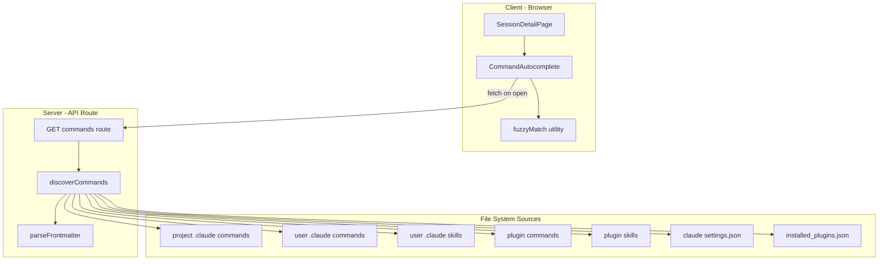
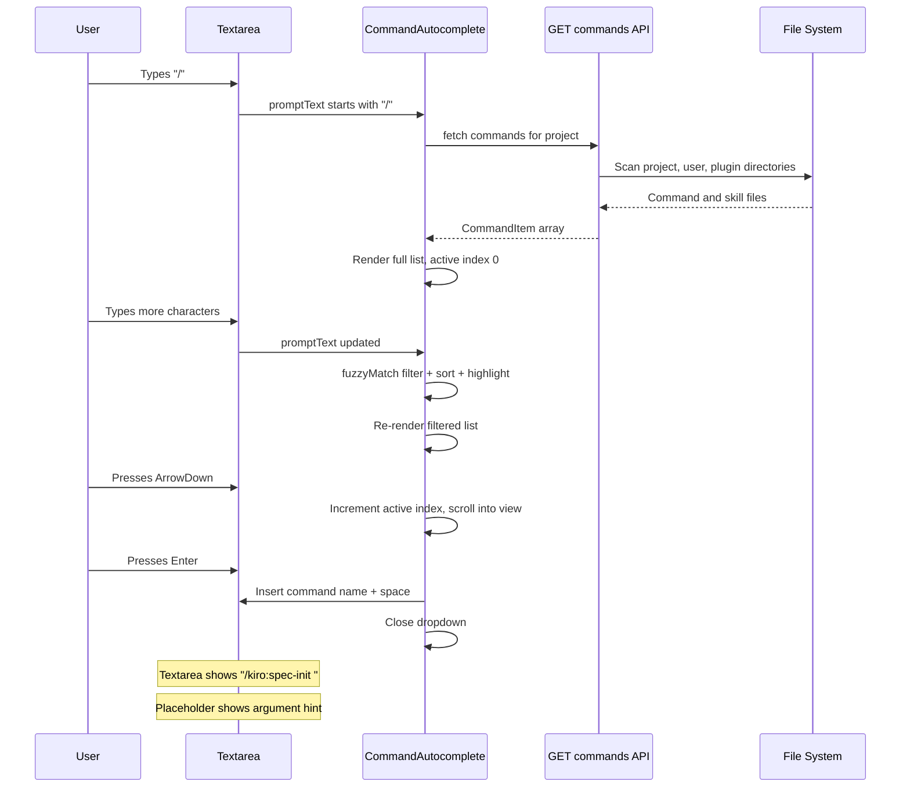

# Design Document — Command Autocomplete

## Overview

**Purpose**: The Command Autocomplete feature provides a discoverable, keyboard-driven interface for invoking custom Claude Code commands and skills from CC's prompt input. It surfaces all available custom slash commands (project-level, user-level, plugin-sourced) and skills in a filterable dropdown overlay, eliminating the need to memorize command names. Built-in CLI commands (e.g., `/help`, `/clear`, `/fast`) are excluded.

**Users**: CC users interacting with the session detail prompt input will use this to discover and select commands before sending them to Claude Code.

**Impact**: Adds a new API route for command discovery, a new React component for the autocomplete overlay, a fuzzy filtering utility, and a command file parser. Modifies `SessionDetailPage.tsx` to integrate the autocomplete with the existing prompt textarea.

### Goals

- Surface all available commands and skills in a single, filterable dropdown
- Provide instant fuzzy filtering with match highlighting
- Support full keyboard navigation (no mouse required)
- Integrate seamlessly with the existing prompt submission flow
- Follow the established design system and code patterns

### Non-Goals

- Command execution logic (CC already sends prompts to Claude CLI verbatim)
- Real-time command file watching or hot-reload
- Custom command creation UI
- Autocomplete for non-slash content (arguments, file paths, etc.)

## Architecture

### Existing Architecture Analysis

The feature extends the session detail page by adding:
- A server-side API route that scans the filesystem for command/skill definitions
- A client-side React component that renders the autocomplete overlay and handles user interaction

Existing patterns preserved:
- API route pattern: `withTracing` wrapper, async params, `resolveProjectPath`, Zod validation, typed error responses
- Component pattern: `"use client"` directive, prop-driven state, colocation with shared components
- Schema pattern: Zod schema → `z.infer` type; types are inferred from the domain's `src/lib/commands/schemas.ts` (schemas are per-domain)
- File reading pattern: `node:fs/promises` with `existsSync` guard, matching `hooks.ts` and `discovery.ts`

### Architecture Pattern & Boundary Map



**Architecture Integration**:
- Selected pattern: Server-side discovery with client-side filtering. The API route fetches all commands once; the client filters and scores them per keystroke.
- Domain boundaries: Command discovery is a new domain module (`src/lib/commands/`); fuzzy filtering is a standalone utility (`src/lib/shared/fuzzy.ts`); the autocomplete UI is a shared component (`src/components/CommandAutocomplete.tsx`).
- Existing patterns preserved: API route structure, Zod schemas, `withTracing`, `resolveProjectPath`, `os.homedir()` for Claude paths.
- New components rationale: Each addresses a distinct concern — filesystem scanning, text matching, and UI rendering.
- Steering compliance: No new external dependencies; TypeScript strict mode; Zod for data validation; minimal library footprint.

### Technology Stack

| Layer | Choice / Version | Role in Feature | Notes |
|-------|------------------|-----------------|-------|
| Frontend | React 19, Next.js 16 | Autocomplete component, client-side filtering | Existing |
| Backend | Next.js API Route | Command discovery endpoint | Follows existing `route.ts` pattern |
| Data | Filesystem (`.claude/` directories) | Command/skill source of truth | Read-only; no persistence needed |
| Validation | Zod v4 | Request/response schemas for API | Existing |
| Styling | CSS custom properties in `globals.css` | Autocomplete visual styling | Follows design system tokens |

## System Flows



## Requirements Traceability

| Requirement | Summary | Components | Interfaces | Flows |
|-------------|---------|------------|------------|-------|
| 1.1 | Show dropdown on "/" at start | CommandAutocomplete | — | Open flow |
| 1.2, 1.3 | Close on non-"/" state | CommandAutocomplete | — | Close flow |
| 1.4 | Disable when busy/finished | CommandAutocomplete | Props: disabled | — |
| 1.5 | First item active on open | CommandAutocomplete | State: activeIndex | — |
| 2.1–2.5 | Discover commands from all sources | discoverCommands | CommandItem type | Discovery flow |
| 2.6 | Exclude built-in commands | discoverCommands | — | — |
| 2.7 | Extract metadata per item | parseFrontmatter | FrontmatterResult type | — |
| 2.8 | Fallback description | parseFrontmatter | — | — |
| 2.9 | API route | CommandsRoute | API contract | API flow |
| 3.1–3.4 | Fuzzy match tiers | fuzzyMatch | FuzzyResult type | — |
| 3.5 | Description matching at 3+ chars | fuzzyMatch | — | — |
| 3.6 | Score-based sorting | CommandAutocomplete | — | Filter flow |
| 3.7 | Highlight matched chars | CommandAutocomplete | FuzzyResult.indices | — |
| 3.8 | Empty state | CommandAutocomplete | — | — |
| 4.1–4.11 | Visual display rules | CommandAutocomplete, CSS | — | — |
| 5.1–5.7 | Keyboard navigation | CommandAutocomplete | handleKeyDown | Nav flow |
| 6.1–6.5 | Selection behavior | CommandAutocomplete | onSelect callback | Select flow |
| 7.1–7.4 | Responsive behavior | CSS (globals.css) | — | — |

## Components and Interfaces

| Component | Domain | Intent | Req Coverage | Key Dependencies | Contracts |
|-----------|--------|--------|--------------|------------------|-----------|
| CommandAutocomplete | UI | Render autocomplete overlay with filtering, navigation, selection | 1, 3, 4, 5, 6, 7 | fuzzyMatch (P0), API route (P0) | State |
| discoverCommands | Server / Lib | Scan filesystem for all command and skill definitions | 2.1–2.8 | parseFrontmatter (P0), node:fs (P0) | Service |
| parseFrontmatter | Server / Lib | Extract YAML frontmatter fields from markdown files | 2.7, 2.8 | — | Service |
| fuzzyMatch | Shared / Lib | Score and rank query against target strings | 3.1–3.6 | — | Service |
| CommandsRoute | Server / API | HTTP endpoint exposing discovered commands for a project | 2.9 | discoverCommands (P0), resolveProjectPath (P0) | API |
| CommandAutocomplete CSS | UI / Style | Visual styles for the autocomplete overlay | 4.1–4.11, 7.1–7.4 | Design system tokens (P0) | — |

### Server / Lib

#### parseFrontmatter

| Field | Detail |
|-------|--------|
| Intent | Extract YAML frontmatter key-value pairs from a markdown string |
| Requirements | 2.7, 2.8 |

**Responsibilities & Constraints**
- Parse content between `---` delimiters at the start of a markdown file
- Extract simple `key: value` pairs (flat strings only; no nested YAML)
- Return the frontmatter fields and the remaining markdown body
- Handle files with no frontmatter gracefully (return empty fields + full body)

**Dependencies**
- None — pure function, no external libraries

**Contracts**: Service [x]

##### Service Interface

```typescript
interface FrontmatterResult {
  fields: Record<string, string>;
  body: string;
}

function parseFrontmatter(content: string): FrontmatterResult;
```

- Preconditions: `content` is a non-empty string
- Postconditions: `fields` contains all key-value pairs from frontmatter; `body` contains everything after the closing `---`
- Invariants: If no frontmatter block exists, `fields` is empty and `body` equals `content`

**Implementation Notes**
- Regex-based: split on `/^---\s*$/m`, parse lines as `key: value`
- Trim values; strip surrounding quotes if present
- Located at `src/lib/commands/` (co-located with discovery logic, not a separate file)

#### discoverCommands

| Field | Detail |
|-------|--------|
| Intent | Scan all command and skill sources and return a unified list of CommandItem objects (excluding built-in CLI commands) |
| Requirements | 2.1, 2.2, 2.3, 2.4, 2.5, 2.6, 2.7, 2.8 |

**Responsibilities & Constraints**
- Scan project-level `.claude/commands/` (including subdirectories for namespacing)
- Scan user-level `~/.claude/commands/`
- Scan user-level `~/.claude/skills/` subdirectories
- Read `~/.claude/settings.json` for `enabledPlugins` list
- Read `~/.claude/plugins/installed_plugins.json` for version/marketplace resolution
- Scan each enabled plugin's `commands/` and `skills/` directories
- Gracefully skip missing directories (log warning, continue)
- Return deduplicated results (name collisions: project > user > plugin)

**Dependencies**
- Inbound: CommandsRoute — calls this function (P0)
- Internal: parseFrontmatter — extracts metadata from `.md` files (P0)
- External: `node:fs/promises`, `node:path`, `node:os` — filesystem access (P0)

**Contracts**: Service [x]

##### Service Interface

```typescript
interface CommandItem {
  name: string;           // e.g., "/kiro:spec-init"
  description: string;    // From frontmatter or first body line
  argumentHint?: string;  // From frontmatter "argument-hint" field
  type: "command" | "skill";
  source: string;         // "project", "user", or plugin name
}

function discoverCommands(worktreePath: string): Promise<CommandItem[]>;
```

- Preconditions: `worktreePath` is a valid directory path (the session's worktree)
- Postconditions: Returns an array of `CommandItem` objects from all accessible sources; never throws — returns partial results on filesystem errors
- Invariants: Only custom commands and skills are returned; built-in CLI commands are excluded

**Implementation Notes**
- Namespace derivation: subdirectory name becomes prefix with `:` separator (e.g., `kiro/spec-init.md` → `/kiro:spec-init`)
- Skill name derivation: directory name under `skills/` is the skill name; prefixed with `/` (e.g., `skills/commit/SKILL.md` → `/commit`)
- For skills, the `description` field from `SKILL.md` frontmatter is used; the `name` frontmatter field is not used for display
- Plugin path resolution: `~/.claude/plugins/cache/<marketplace>/<pluginName>/<version>/`
- Located at `src/lib/commands/`

### Server / API

#### CommandsRoute

| Field | Detail |
|-------|--------|
| Intent | HTTP endpoint that returns all discoverable commands for a project context |
| Requirements | 2.9 |

**Responsibilities & Constraints**
- Accepts project name as a URL parameter to resolve the project's worktree path
- Accepts an optional session name to resolve the specific worktree path
- Delegates to `discoverCommands` for filesystem scanning
- Returns a JSON array of `CommandItem` objects
- Follows existing API route patterns (`withTracing`, `resolveProjectPath`, `dynamic = "force-dynamic"`)

**Dependencies**
- Inbound: CommandAutocomplete — fetches this endpoint (P0)
- Internal: discoverCommands (P0), resolveProjectPath (P0), withTracing (P0)

**Contracts**: API [x]

##### API Contract

| Method | Endpoint | Request | Response | Errors |
|--------|----------|---------|----------|--------|
| GET | `/api/projects/[name]/sessions/[session]/commands` | — | `{ items: CommandItem[] }` | 404 (project not found), 500 (discovery error) |

**Implementation Notes**
- Route file: `src/app/api/projects/[name]/sessions/[session]/commands/route.ts`
- Uses the session's `worktreePath` from state to resolve project-level commands (session context is needed because each session has its own worktree with potentially different `.claude/commands/`)
- Response is not cached (commands may change between activations)

### Shared / Lib

#### fuzzyMatch

| Field | Detail |
|-------|--------|
| Intent | Score a query string against a target string using a 3-tier fuzzy matching algorithm |
| Requirements | 3.1, 3.2, 3.3, 3.4 |

**Responsibilities & Constraints**
- Implement three matching tiers with distinct scoring: prefix (100), substring (80), ordered characters (60 minus spread)
- Return match status, score, and matched character indices for highlighting
- Case-insensitive matching
- Pure function with no side effects or external dependencies

**Dependencies**
- None

**Contracts**: Service [x]

##### Service Interface

```typescript
interface FuzzyResult {
  match: boolean;
  score: number;       // 0–100
  indices: number[];   // Positions of matched characters in the target
}

function fuzzyMatch(query: string, target: string): FuzzyResult;
```

- Preconditions: `query` and `target` are strings; empty `query` matches everything with score 100
- Postconditions: `indices` contains valid positions within `target`; `score` reflects the match tier
- Invariants: If `match` is false, `score` is 0 and `indices` is empty

**Implementation Notes**
- Located at `src/lib/shared/fuzzy.ts`
- Exported for use by both `CommandAutocomplete` and unit tests
- Score tiers: prefix match (score 100, indices 0..n), substring match (score 80, indices at offset), ordered character match (score = max(10, 60 - spread))
- The component handles description matching logic (calls fuzzyMatch against description when query length >= 3, assigns score 40 for description-only matches)

### UI

#### CommandAutocomplete

| Field | Detail |
|-------|--------|
| Intent | Render the autocomplete dropdown overlay with filtering, keyboard navigation, and selection behavior |
| Requirements | 1.1–1.5, 3.1, 3.5–3.8, 4.1–4.11, 5.1–5.7, 6.1–6.5 |

**Responsibilities & Constraints**
- Detect trigger condition: `promptText` starts with `/`
- Fetch command list from API on first activation per session
- Apply fuzzy filtering on every keystroke
- Manage active selection index with keyboard navigation
- Render items with match highlighting, type badges, and source labels
- Handle selection: insert command name, update placeholder, close dropdown
- Intercept keyboard events (ArrowUp/Down, Enter, Tab, Escape) when visible

**Dependencies**
- Inbound: SessionDetailPage — parent component, provides props (P0)
- Internal: fuzzyMatch — scoring and highlighting (P0)
- Internal: CommandsRoute — data source via fetch (P0)

**Contracts**: State [x]

##### State Management

```typescript
interface CommandAutocompleteProps {
  promptText: string;
  onPromptChange: (text: string) => void;
  onPlaceholderChange: (placeholder: string) => void;
  projectName: string;
  sessionName: string;
  disabled: boolean;
}

// Internal state:
// - items: CommandItem[]        (fetched from API, cached)
// - filtered: ScoredItem[]     (fuzzy-filtered subset)
// - activeIndex: number         (keyboard selection)
// - visible: boolean            (dropdown open/closed)
// - loading: boolean            (initial fetch in progress)
```

- State model: `visible` derived from `promptText.startsWith("/")`; `filtered` recomputed on every `promptText` change; `activeIndex` reset to 0 on filter change
- Persistence: None — state is ephemeral per component lifecycle
- Concurrency: Single fetch guarded by `loading` flag; no concurrent requests

**Implementation Notes**
- `"use client"` directive required (interactive component)
- Keyboard intercept: the component exposes a `handleKeyDown(e: React.KeyboardEvent): boolean` method; `SessionDetailPage` calls this before its own Enter-to-send handler; if it returns `true`, the parent skips its handler
- Located at `src/components/CommandAutocomplete.tsx`
- Follows `VoiceRecordButton.tsx` pattern: named export, prop-driven, no internal API calls to parent

#### CommandAutocomplete CSS

| Field | Detail |
|-------|--------|
| Intent | Define visual styles for the autocomplete dropdown following the design system |
| Requirements | 4.1–4.11, 7.1–7.4 |

**Implementation Notes**
- All styles added to `src/app/globals.css` in a new `/* Command Autocomplete */` section
- Uses existing design tokens exclusively: `--bg-base`, `--bg-surface`, `--bg-raised`, `--bg-hover`, `--border-subtle`, `--border-default`, `--cyan`, `--cyan-glow`, `--green`, `--text-primary`, `--text-secondary`, `--text-tertiary`, `--font-mono`, `--radius-sm`, `--radius-md`, `--radius-lg`, `--space-xs` through `--space-md`
- Frosted glass: `backdrop-filter: blur(20px) saturate(150%)` with semi-transparent bg
- Active item: `border-left: 2px solid var(--cyan)` with `::after` gradient glow pseudo-element
- Animation: `@keyframes cmdReveal` (slide-up 0.18s)
- Responsive: Mobile (`@media max-width: 768px`) override for 44px min-height on `.cmd-item`

## Data Models

### Domain Model

```typescript
// Zod schema — src/lib/commands/schemas.ts
const commandItemSchema = z.object({
  name: z.string(),
  description: z.string(),
  argumentHint: z.string().optional(),
  type: z.enum(["command", "skill"]),
  source: z.string(),
});

type CommandItem = z.infer<typeof commandItemSchema>;

const commandsResponseSchema = z.object({
  items: z.array(commandItemSchema),
});

type CommandsResponse = z.infer<typeof commandsResponseSchema>;
```

### Data Contracts

**API Response** (`GET /api/projects/[name]/sessions/[session]/commands`):

```json
{
  "items": [
    {
      "name": "/kiro:spec-init",
      "description": "Initialize a new specification",
      "argumentHint": "<project-description>",
      "type": "command",
      "source": "project"
    },
    {
      "name": "/commit",
      "description": "Commit staged changes to git",
      "type": "skill",
      "source": "ai-resources"
    }
  ]
}
```

## Error Handling

### Error Strategy

Errors are handled at two levels: the API route (filesystem errors) and the client component (network/render errors).

### Error Categories and Responses

**Filesystem errors** (server): Missing directories, permission errors, malformed frontmatter → Gracefully skip the failing source, include what was found, log a warning. Never fail the entire response for a single source failure.

**Network errors** (client): API fetch failure → Show inline error message in the dropdown ("Failed to load commands. Press / to retry."). Do not block the textarea.

**Malformed data** (server): Invalid YAML frontmatter, missing description → Use fallback description (first body line or filename). Never omit an item due to missing optional fields.

## Testing Strategy

### Unit Tests
- `fuzzyMatch`: Prefix match, substring match, ordered-char match, no match, empty query, case insensitivity, score ordering
- `parseFrontmatter`: Valid frontmatter, no frontmatter, empty file, malformed delimiters, fields with quotes
- `discoverCommands`: Mock filesystem with project/user/plugin commands; namespace derivation; missing directory handling; deduplication priority; built-in commands excluded

### Integration Tests
- API route: Returns correct shape for a project with known commands; handles missing project (404); handles empty `.claude/commands/` directory
- Full flow: Type `/` → fetch → render list → filter → select → textarea updated

### E2E Tests
- Open session detail → type `/` → verify dropdown appears with items
- Type `/kiro:` → verify filtered to kiro-namespaced commands
- Arrow down → Enter → verify command inserted in textarea
- Escape → verify dropdown closes
- Type `/xyz` (no match) → verify empty state shown
