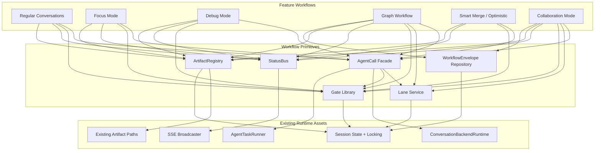
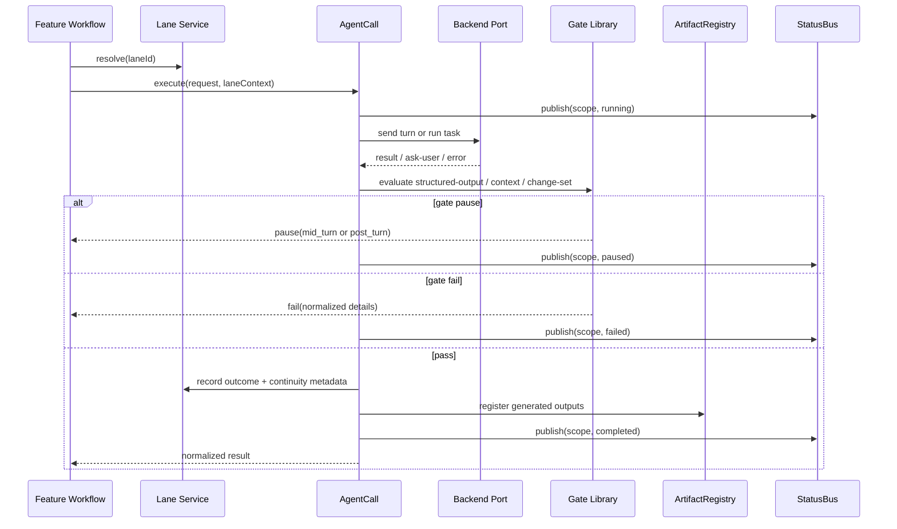
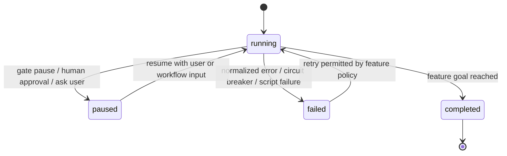
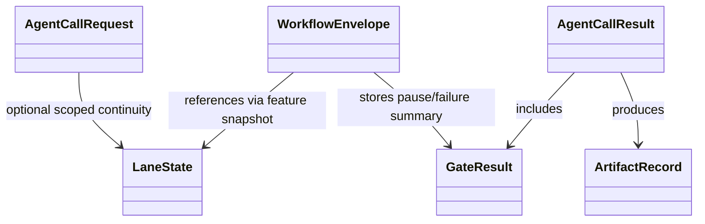

# Technical Design: Composable Workflow Primitives

## Overview

**Purpose**: This feature delivers a small, reusable primitive layer that
centralizes agent execution, continuity, gates, status publishing, artifact
registration, and minimal workflow lifecycle metadata without replacing
feature-owned orchestration.

**Users**: Command Center maintainers and workflow authors use this design when
building or migrating regular conversations, focus mode, debug mode, graph
workflow, smart merge, optimistic mode, and future Collaboration Mode flows.

**Impact**: Changes the current system by extracting repeated orchestration
machinery into a dedicated primitive domain while preserving the existing
backend ports, XState-oriented feature orchestration, worktree safety rules,
and established artifact paths.

### Goals

- Eliminate duplicated workflow plumbing above the existing backend ports.
- Preserve backend capability differences while giving features one semantic
  execution surface.
- Provide reusable continuity, gate, status, artifact, and lifecycle building
  blocks that can be adopted incrementally.
- Keep feature workflows explicit and readable instead of introducing a generic
  workflow engine or DSL.
- Make Collaboration Mode the first major feature designed directly against the
  new primitive layer.

### Non-Goals

- Replacing `ConversationBackendRuntime` or `AgentTaskRunner`.
- Replacing XState as the workflow modeling tool.
- Building a generic graph executor, Temporal-style runtime, or replay-safe
  activity system.
- Forcing all artifacts into one directory layout.
- Migrating active graph executions to a new persistence schema in the first
  pass.
- Rewriting feature-specific workflow logic such as graph scheduling, merge
  policy, or debug investigation phases.

## Architecture

### Existing Architecture Analysis

The codebase already contains the correct low-level ingredients, but they are
owned by feature stacks rather than a shared primitive domain:

- `src/lib/agent-backends/conversation.ts` and
  `src/lib/agent-backends/task.ts` already model the two execution shapes that
  must remain distinct.
- `src/lib/workflows/graph-workflow/workflow-continuity-service.ts` already
  proves the viability of lane continuity, rotation, and stale-session
  recovery.
- `src/lib/workflow-graph/validator-runner.ts`,
  `src/lib/workflow-graph/script-validator-runner.ts`, and conversation
  ask-user flows already demonstrate several gate shapes.
- `src/lib/sse-broadcaster.ts` already provides the shared wire for live status
  delivery.
- `src/lib/state.ts`, `src/lib/reference-document-tools.ts`,
  `src/lib/codex-tool.ts`, and
  `src/lib/workflow-graph/shared-documents.ts` already cover the artifact paths
  that must be preserved.
- `graphWorkflowExecution` inside session state is the working precedent for a
  minimal durable workflow envelope.

The design therefore follows hybrid extraction with adapters. Primitive APIs
become the new cross-feature vocabulary, but existing feature entry points
continue to work while migration proceeds.

### Architecture Pattern & Boundary Map



**Architecture Integration**:

- Selected pattern: hybrid extraction with compatibility adapters.
- Domain boundaries: feature workflows keep orchestration decisions; primitives
  own shared execution mechanics and metadata.
- Existing patterns preserved: backend registry, XState machines, atomic
  session-state writes, session locks, SSE broadcast, reference-document tools.
- New components rationale: each primitive captures an existing drift point
  that is currently duplicated across multiple features.
- Steering compliance: preserves worktree isolation, conservative concurrency,
  explicit control flow, and the existing logging/state architecture.

### Technology Stack

| Layer | Choice / Version | Role in Feature | Notes |
|-------|------------------|-----------------|-------|
| Frontend / CLI | Next.js 16 UI + Claude/Codex prompt surfaces | Existing workflow UIs consume shared status and artifacts | No new UI framework |
| Backend / Services | TypeScript service layer under `src/lib/` | Hosts primitive services and adapters | Follows existing DI and factory patterns |
| Data / Storage | Session JSON state guarded by `withStateLock` | Stores lanes, envelopes, and registrations | No new DB required in first pass |
| Messaging / Events | SSE via `src/lib/sse-broadcaster.ts` | Carries scoped live status | `StatusBus` wraps, does not replace, the wire |
| Infrastructure / Runtime | Existing backend registry + worktree/session locks | Executes agent calls safely | Preserves separate conversation and task ports |

## System Flows

### AgentCall With Lane, Gate, and Artifact Registration



Flow decisions:

- AgentCall chooses the backend port from the execution shape, not from
  feature-specific branching.
- Lane continuity is injected before execution and updated after execution.
- Structured-output, ask-user, context-limit, and change-set decisions surface
  through the shared gate vocabulary.
- Artifact registration happens after execution, but path ownership stays with
  the artifact kind.

### Durable Workflow Envelope Lifecycle



Flow decisions:

- The envelope tracks only shared lifecycle fields plus a feature-owned
  snapshot; detailed domain state stays with the feature.
- Pause states remain explicit and recoverable without building an event store.
- Recovery logic discovers envelopes from session state after restart and lets
  the owning feature decide whether and how to resume.

## Requirements Traceability

| Requirement | Summary | Components | Interfaces | Flows |
|-------------|---------|------------|------------|-------|
| 1.1, 1.2 | Route conversation-style vs task-style execution to the correct backend port | AgentCall | `AgentCallRequest`, `AgentCallResult` | AgentCall With Lane, Gate, and Artifact Registration |
| 1.3, 1.4 | Apply MCP/tooling config and validate structured output before success | AgentCall, Gate Library | `AgentCallRequest.tooling`, `StructuredOutputGate` | AgentCall With Lane, Gate, and Artifact Registration |
| 1.5, 1.6 | Normalize backend failures and return references, usage, and artifacts | AgentCall, ArtifactRegistry | `NormalizedAgentCallError`, `ArtifactRef` | AgentCall With Lane, Gate, and Artifact Registration |
| 2.1, 2.2 | Represent long-lived agent continuity as a named lane and record metadata after each turn | Lane Service | `LaneState`, `LaneOutcome`, `LanePolicy` | AgentCall With Lane, Gate, and Artifact Registration |
| 2.3, 2.4 | Inject continuity automatically and record rotation/reset decisions | Lane Service | `LaneContext`, `ContextLimitDecision` | AgentCall With Lane, Gate, and Artifact Registration |
| 2.5, 2.6 | Preserve backend-specific continuity support and stale-session recovery metadata | Lane Service, Graph Adapters | `LaneBackendState` | AgentCall With Lane, Gate, and Artifact Registration |
| 2.7 | Scope lane state by owning workflow so repeated lane names cannot collide | Lane Service | `LaneRef` | AgentCall With Lane, Gate, and Artifact Registration |
| 3.1, 3.2 | Shared gates return pass/fail/pause and carry validation details | Gate Library | `GateResult`, `StructuredOutputGateResult` | AgentCall With Lane, Gate, and Artifact Registration |
| 3.3, 3.4 | Distinguish mid-turn ask-user pause from post-turn human approval pause | Gate Library, AgentCall | `PauseGateResult.pauseKind` | AgentCall With Lane, Gate, and Artifact Registration |
| 3.5, 3.6 | Represent script-validation and change-set outcomes consistently | Gate Library | `ScriptValidationGateResult`, `ChangeSetGateResult` | AgentCall With Lane, Gate, and Artifact Registration |
| 3.7, 3.8, 3.9 | Model context-limit, convergence, and circuit-breaker decisions as reusable gates | Gate Library | `ContextLimitGateResult`, `ConvergenceGateResult`, `CircuitBreakerGateResult` | AgentCall With Lane, Gate, and Artifact Registration |
| 3.10 | Include unambiguous resume identity on pause gate results | Gate Library, WorkflowEnvelope Repository | `PauseGateResult.resumeToken` | Both flows |
| 4.1, 4.2 | Publish live status by scope without forcing a global payload schema | StatusBus | `StatusScope`, `StatusEventEnvelope<TPayload>` | AgentCall With Lane, Gate, and Artifact Registration |
| 4.3, 4.4, 4.5 | Deliver running/paused/completed/failed updates for all supported workflow scopes without becoming durable state | StatusBus | `publish()`, `subscribe()` | AgentCall With Lane, Gate, and Artifact Registration |
| 4.6 | Preserve feature-specific event detail within scoped status delivery | StatusBus, Feature Adapters | `StatusEventEnvelope<TPayload>` | AgentCall With Lane, Gate, and Artifact Registration |
| 5.1, 5.2 | Write artifacts to established paths and register discoverable metadata | ArtifactRegistry | `ArtifactWriteRequest`, `ArtifactRecord` | AgentCall With Lane, Gate, and Artifact Registration |
| 5.3, 5.4 | Preserve special-case paths such as `memory-bank/focus.md` and capture source metadata | ArtifactRegistry | `ArtifactKind`, `ArtifactSourceMetadata` | AgentCall With Lane, Gate, and Artifact Registration |
| 5.5, 5.6 | Distinguish user-facing artifacts from internal logs and let new kinds reuse shared bookkeeping | ArtifactRegistry | `ArtifactAudience`, kind adapters | AgentCall With Lane, Gate, and Artifact Registration |
| 5.7 | Reject artifact paths that escape the session worktree | ArtifactRegistry | path resolver validation | AgentCall With Lane, Gate, and Artifact Registration |
| 6.1, 6.2 | Create a minimal durable workflow envelope with shared lifecycle fields | WorkflowEnvelope Repository | `WorkflowEnvelope` | Durable Workflow Envelope Lifecycle |
| 6.3, 6.4 | Support parent-child workflow linking and active-workflow discovery | WorkflowEnvelope Repository | `WorkflowEnvelope.parentWorkflowId` | Durable Workflow Envelope Lifecycle |
| 6.5, 6.6, 6.7 | Provide restart discovery without forcing all child objects into one schema; preserve feature snapshot ownership | WorkflowEnvelope Repository | `WorkflowEnvelope.featureSnapshot` | Durable Workflow Envelope Lifecycle |
| 7.1, 7.2 | Support regular conversations and focus mode with shared execution, pauses, status, and artifacts | AgentCall, Gate Library, StatusBus, ArtifactRegistry | conversation/focus adapters | AgentCall With Lane, Gate, and Artifact Registration |
| 7.3, 7.4 | Support debug and graph workflows while preserving feature-owned orchestration | AgentCall, Lane Service, Gate Library, StatusBus, ArtifactRegistry | debug/graph adapters | AgentCall With Lane, Gate, and Artifact Registration |
| 7.5, 7.6, 7.7 | Support merge/optimistic and multi-lane collaboration workflows while allowing XState machines, explicit orchestrators, route handlers, or jobs | All primitives | collaboration and merge adapters | Both flows |
| 7.8 | Preserve existing observable behavior and user-facing contracts during adapter migration | Feature Adapters | compatibility adapters | Both flows |
| 8.1, 8.2, 8.3 | Preserve continuity and structured-output capability differences between backends | AgentCall, Lane Service | `BackendCapabilityView`, `StructuredOutputSource` | AgentCall With Lane, Gate, and Artifact Registration |
| 8.4, 8.5, 8.6 | Preserve MCP boundaries, context metrics availability, and native mid-turn ask-user support | AgentCall, Lane Service | `BackendCapabilityView` | AgentCall With Lane, Gate, and Artifact Registration |
| 9.1, 9.2, 9.3 | Serialize write-capable lane execution and allow parallel read-only execution only when provable | Lane Service, AgentCall | `LaneWriteCapability` | AgentCall With Lane, Gate, and Artifact Registration |
| 9.4, 9.5, 9.6 | Preserve the two pause shapes and existing worktree isolation rules | Gate Library, WorkflowEnvelope Repository | `PauseGateResult`, `WorkflowPauseState` | Both flows |
| 10.1 | Emit structured logs for primitive stateful operations | All primitives | logger fields | Both flows |
| 10.2 | Treat status delivery failures as delivery degradation, not workflow failure | StatusBus | delivery error handling | AgentCall With Lane, Gate, and Artifact Registration |
| 10.3, 10.4 | Surface required artifact failures and allow optional artifact degradation | ArtifactRegistry | artifact failure policy | AgentCall With Lane, Gate, and Artifact Registration |
| 10.5 | Allow large generated lifecycle content to be stored as artifact references | WorkflowEnvelope Repository, ArtifactRegistry | `WorkflowEnvelope.featureSnapshot`, `ArtifactRecord` | Durable Workflow Envelope Lifecycle |

## Components and Interfaces

| Component | Domain/Layer | Intent | Req Coverage | Key Dependencies (P0/P1) | Contracts |
|-----------|--------------|--------|--------------|--------------------------|-----------|
| AgentCall Facade | Primitive / execution | Single semantic entry point over the two backend ports | 1, 7, 8, 9, 10 | Conversation runtime (P0), task runner (P0), Lane (P0), Gate (P0), StatusBus (P1), ArtifactRegistry (P1) | Service, State |
| Lane Service | Primitive / continuity | Store and resolve named continuity state across backends | 2, 8, 9, 10 | Session state (P0), graph continuity adapter (P1) | Service, State |
| Gate Library | Primitive / checkpoints | Standardize pass/fail/pause workflow decisions | 3, 9, 10 | Validator runner (P1), script validator runner (P1), diff/git helpers (P1) | Service, State |
| StatusBus | Primitive / live status | Publish scoped status events over existing SSE infrastructure | 4, 7, 10 | SSE broadcaster (P0), feature event publishers (P1) | Event |
| ArtifactRegistry | Primitive / artifact bookkeeping | Write/register artifacts while preserving existing path rules | 5, 7, 10 | Session reference docs (P0), graph shared docs (P1), Codex outputs (P1) | Service, State |
| WorkflowEnvelope Repository | Primitive / lifecycle persistence | Persist minimal workflow lifecycle metadata and recovery handles | 6, 7, 9, 10 | Session state + lock (P0) | Service, State |
| Feature Adapters | Feature / integration | Bridge existing feature-specific schemas and behavior to the primitive APIs | 2, 4, 5, 6, 7, 10 | Graph workflow, conversation machine, merge jobs (P0) | Service |

### Primitive Execution Layer

#### AgentCall Facade

| Field | Detail |
|-------|--------|
| Intent | Dispatch one semantic execution request to the correct backend path and normalize the result |
| Requirements | 1.1, 1.2, 1.3, 1.4, 1.5, 1.6, 7.1, 7.3, 7.4, 7.5, 7.6, 8.1, 8.2, 8.3, 8.4, 8.5, 8.6, 9.1, 9.2, 9.3, 10.1 |

**Responsibilities & Constraints**

- Own backend-path selection based on execution shape.
- Inject lane continuity context when a request is lane-backed.
- Run shared structured-output validation and normalize failures.
- Emit lifecycle status and forward generated artifact refs.
- Preserve real backend capability differences instead of flattening them away.

**Dependencies**

- Inbound: feature workflows and adapters — request execution (Critical).
- Outbound: `ConversationBackendRuntime` / `AgentTaskRunner` — perform actual work (Critical).
- Outbound: `LaneService`, `GateLibrary`, `StatusBus`, `ArtifactRegistry` — shared mechanics (Critical).

**Contracts**: Service [x] / API [ ] / Event [ ] / Batch [ ] / State [x]

##### Service Interface
```typescript
type AgentCallRequest =
  | {
      kind: "conversation_turn";
      laneRef?: LaneRef;
      backend?: AgentBackendId;
      prompt: string;
      tooling?: PortableMcpConfig;
      outputSchema?: Record<string, unknown>;
      writeCapability?: LaneWriteCapability;
    }
  | {
      kind: "task_run";
      laneRef?: LaneRef;
      backend: AgentBackendId;
      prompt: string;
      systemInstructions?: string;
      tooling?: PortableMcpConfig;
      outputSchema?: Record<string, unknown>;
      writeCapability?: LaneWriteCapability;
    };

interface AgentCallService {
  execute(request: AgentCallRequest): Promise<AgentCallResult>;
}
```
- Preconditions: request kind is valid; backend is compatible with the shape when explicitly set.
- Postconditions: result includes backend identity, normalized references, gate outcomes, usage, and artifact refs.
- Invariants: conversation-style requests only use conversation runtimes; task-style requests only use task runners; lane-backed requests always resolve continuity by workflow scope plus lane id.

##### State Management
- State model: ephemeral execution context plus optional lane-backed continuity state.
- Persistence & consistency: continuity and artifacts are persisted through dependent primitives, not inside AgentCall.
- Concurrency strategy: defaults to session-lock acquisition for `write_capable` requests; skips the session lock only for proven `read_only` requests.

**Implementation Notes**
- Integration: expose thin named helpers (`runConversationTurn`, `runStructuredTask`) that forward to the discriminated request union.
- Validation: structured output uses a shared gate path even when the backend offers native enforcement.
- Risks: overloading the request union with feature-specific flags; adapters must keep the surface minimal.

### Primitive Continuity Layer

#### Lane Service

| Field | Detail |
|-------|--------|
| Intent | Persist reusable named continuity state independent of any one feature's schema |
| Requirements | 2.1, 2.2, 2.3, 2.4, 2.5, 2.6, 2.7, 8.1, 8.4, 8.5, 9.1, 9.2, 9.3, 10.1 |

**Responsibilities & Constraints**

- Store lane identity, backend, continuity policy, write capability, and backend-specific refs.
- Record rotation flags and stale-session recovery metadata after each turn.
- Provide a feature-neutral continuity view even when the underlying backend differs.
- Avoid forcing graph workflow to migrate its schema in the first pass.

**Dependencies**

- Inbound: AgentCall and feature adapters — continuity lookup and update (Critical).
- Outbound: session state storage and lock helpers — persistence (Critical).
- External: graph workflow continuity adapter — migration bridge (Important).

**Contracts**: Service [x] / API [ ] / Event [ ] / Batch [ ] / State [x]

##### Service Interface
```typescript
type LaneWriteCapability = "read_only" | "write_capable";

interface LaneRef {
  workflowId: string;
  laneId: string;
}

interface LaneState {
  workflowId: string;
  laneId: string;
  backend: AgentBackendId;
  writeCapability: LaneWriteCapability;
  policy: {
    continuityEnabled: boolean;
    contextLimitTokens?: number;
  };
  backendState:
    | { backend: "claude"; conversationId?: string; staleSession?: boolean }
    | { backend: "codex"; threadId?: string; staleSession?: boolean };
  metrics: {
    contextTokens?: number;
    contextWindowMax?: number;
    rotateBeforeNextTurn: boolean;
  };
}

interface LaneService {
  resolve(ref: LaneRef): Promise<LaneState | null>;
  recordOutcome(ref: LaneRef, outcome: LaneOutcome): Promise<LaneState>;
}
```
- Preconditions: `LaneRef.workflowId` identifies the owning workflow scope and `laneId` is unique within that scope.
- Postconditions: stored continuity matches the most recent successful or failed execution metadata supported by the backend.
- Invariants: unsupported backend capabilities stay absent instead of being emulated; lane state for one workflow never collides with another workflow that reuses the same lane name.

##### State Management
- State model: per-lane durable record plus adapter-owned feature projections.
- Persistence & consistency: atomic write through `withStateLock`.
- Concurrency strategy: lane records are updated serially with the surrounding session-state mutation.

**Implementation Notes**
- Integration: graph workflow keeps `graphWorkflowLaneStateSchema`; adapters convert between graph state and `LaneState`.
- Validation: enforce conservative defaults by treating unspecified write capability as `write_capable`.
- Risks: schema drift during migration; keep adapter coverage exhaustive.

### Primitive Gate Layer

#### Gate Library

| Field | Detail |
|-------|--------|
| Intent | Provide one reusable vocabulary for workflow checkpoints and pause semantics |
| Requirements | 3.1, 3.2, 3.3, 3.4, 3.5, 3.6, 3.7, 3.8, 3.9, 3.10, 9.4, 9.5, 10.1 |

**Responsibilities & Constraints**

- Normalize all gate outcomes as pass, fail, or pause.
- Preserve mid-turn ask-user pauses separately from post-turn workflow pauses.
- Reuse current validator, script, diff, and circuit-breaker logic through thin wrappers.
- Avoid feature-specific scheduling or retry policy decisions.

**Dependencies**

- Inbound: AgentCall and feature workflows — gate evaluation requests (Critical).
- Outbound: validator runner, script validator runner, diff/git helpers (Important).
- External: user-input and approval UIs consume pause details (Important).

**Contracts**: Service [x] / API [ ] / Event [ ] / Batch [ ] / State [x]

##### Service Interface
```typescript
type GateResult =
  | { status: "pass"; kind: GateKind; details?: Record<string, unknown> }
  | { status: "fail"; kind: GateKind; reason: string; details?: Record<string, unknown> }
  | {
      status: "pause";
      kind: GateKind;
      pauseKind: "mid_turn" | "post_turn";
      resumeToken: string;
      details?: Record<string, unknown>;
    };

type GateKind =
  | "structured_output"
  | "ask_user"
  | "human_approval"
  | "script_validation"
  | "change_set"
  | "convergence"
  | "context_limit"
  | "circuit_breaker";
```
- Preconditions: each gate receives only the inputs required for its kind.
- Postconditions: every gate returns a single normalized envelope.
- Invariants: `ask_user` pause is always `mid_turn`; `human_approval` pause is always `post_turn`.

##### State Management
- State model: gate results are persisted only when the owning workflow needs recovery.
- Persistence & consistency: pause/fail envelopes are attached to workflow state or envelopes by the caller.
- Concurrency strategy: gates are pure except for script validation and user input interactions.

**Implementation Notes**
- Integration: human approval and convergence start as new gates, while structured output, script validation, change-set, and context limit wrap existing code.
- Validation: gate payload schemas stay per-kind; the shared result envelope is the stable seam.
- Risks: overfitting gate payloads to one feature; keep details minimal and feature-neutral.

### Primitive Delivery and Persistence Layer

#### StatusBus

| Field | Detail |
|-------|--------|
| Intent | Publish scoped live status over the existing SSE transport without redefining feature payloads |
| Requirements | 4.1, 4.2, 4.3, 4.4, 4.5, 4.6, 10.1, 10.2 |

**Responsibilities & Constraints**

- Publish by scope and scope identifier.
- Carry feature payloads without forcing one global schema.
- Wrap, but never replace, `sse-broadcaster`.
- Remain delivery-only; no durable state ownership.

**Dependencies**

- Inbound: AgentCall and feature publishers (Critical).
- Outbound: `sse-broadcaster.broadcast` (Critical).

**Contracts**: Service [ ] / API [ ] / Event [x] / Batch [ ] / State [ ]

##### Event Contract
- Published events:
  - The bus publishes a shared outer envelope with `scope`, `scopeId`,
    `status`, `timestamp`, and a feature-owned payload.
  - Feature adapters preserve existing event names and payload detail inside
    that scoped delivery path rather than collapsing them into one coarse event
    per scope.
  - Graph workflow therefore keeps its current fine-grained live events such as
    workflow status, context status, task status, validation result, retry,
    circuit-breaker, and shared-document updates while still using the shared
    transport.
  - Conversation, merge, collaboration, and debug features keep equivalent
    scope-specific event detail behind the same delivery abstraction.
- Ordering / delivery guarantees:
  - Best-effort in-process broadcast.
  - Ordered within one process by caller execution order.
  - No persistence or replay guarantee.

**Implementation Notes**
- Integration: graph, conversation, and background-job publishers migrate to the bus behind unchanged UI consumers.
- Validation: scope string and scope id are required on every event envelope.
- Risks: accidental payload standardization pressure; explicitly keep payload generic.

#### ArtifactRegistry

| Field | Detail |
|-------|--------|
| Intent | Coordinate artifact writes and registration while preserving established paths and metadata systems |
| Requirements | 5.1, 5.2, 5.3, 5.4, 5.5, 5.6, 5.7, 10.1, 10.3, 10.4 |

**Responsibilities & Constraints**

- Resolve artifact paths by artifact kind.
- Register discoverable artifacts in the correct metadata system.
- Add shared source metadata such as workflow id, lane id, and creation time.
- Preserve `memory-bank/focus.md`, `memory-bank/codex/...`, session reference documents, validator logs, and `.cc/graph-workflow-docs/`.

**Dependencies**

- Inbound: AgentCall and feature workflows (Critical).
- Outbound: session reference-document state, graph shared-doc registry, filesystem writers (Critical).

**Contracts**: Service [x] / API [ ] / Event [ ] / Batch [ ] / State [x]

##### Service Interface
```typescript
type ArtifactKind =
  | "reference_document"
  | "focus_memory"
  | "codex_output"
  | "graph_shared_document"
  | "validation_log"
  | "workflow_report";

interface ArtifactRecord {
  artifactId: string;
  kind: ArtifactKind;
  relativePath: string;
  audience: "user_facing" | "internal_log";
  source: {
    workflowId?: string;
    laneId?: string;
    round?: number;
    createdAt: string;
  };
}
```
- Preconditions: kind-specific path and registration inputs are valid.
- Postconditions: returned record identifies the canonical relative path and discoverability metadata.
- Invariants: kind-specific path resolvers remain the single source of truth for storage layout.

##### State Management
- State model: artifact metadata records plus kind-specific registration records.
- Persistence & consistency: write file first, then register metadata in the owning store within a locked mutation when required.
- Concurrency strategy: same-session writes obey the session lock unless the workflow is explicitly read-only.

**Implementation Notes**
- Integration: new artifact kinds register a resolver rather than bypassing the registry.
- Validation: path resolver must guarantee worktree-relative paths only.
- Risks: hidden coupling to feature-specific metadata fields; shared metadata stays shallow.

#### WorkflowEnvelope Repository

| Field | Detail |
|-------|--------|
| Intent | Persist shared lifecycle metadata for workflows that require discovery and restart recovery |
| Requirements | 6.1, 6.2, 6.3, 6.4, 6.5, 6.6, 6.7, 9.6, 10.1, 10.5 |

**Responsibilities & Constraints**

- Create and update minimal workflow envelopes.
- Support workflow discovery by status and parent relationship.
- Store a feature-owned snapshot without forcing one generic child-object schema.
- Preserve feature ownership over domain-specific recovery behavior.

**Dependencies**

- Inbound: collaboration, graph workflow, and future long-running features (Critical).
- Outbound: session state + locking (Critical).

**Contracts**: Service [x] / API [ ] / Event [ ] / Batch [ ] / State [x]

##### Service Interface
```typescript
interface WorkflowEnvelope {
  workflowId: string;
  workflowType: string;
  status: "running" | "paused" | "completed" | "failed";
  phase: string;
  createdAt: string;
  updatedAt: string;
  completedAt?: string;
  errorSummary?: string;
  parentWorkflowId?: string;
  featureSnapshot: unknown;
}

interface WorkflowEnvelopeRepository {
  create(envelope: WorkflowEnvelope): Promise<void>;
  update(workflowId: string, patch: Partial<WorkflowEnvelope>): Promise<void>;
  listActive(): Promise<WorkflowEnvelope[]>;
}
```
- Preconditions: workflow id is unique within the owning session or scope.
- Postconditions: stored envelopes are discoverable after restart.
- Invariants: envelope never becomes the canonical store for lanes, gates, or artifacts.

##### State Management
- State model: minimal envelope collection inside session state.
- Persistence & consistency: atomic session-state mutation guarded by `withStateLock`.
- Concurrency strategy: envelope updates are serialized with other session-state writes.

**Implementation Notes**
- Integration: graph workflow may continue to own `graphWorkflowExecution` while also projecting the minimal envelope fields.
- Validation: keep `featureSnapshot` opaque at the primitive layer.
- Risks: session-state growth; large snapshots should become artifact references instead of inline objects.

### Feature Adapter Layer

#### Feature Adapters

| Field | Detail |
|-------|--------|
| Intent | Preserve existing feature behavior while bridging feature-local schemas and workflows to primitive APIs |
| Requirements | 2.5, 4.4, 4.6, 5.2, 6.7, 7.1, 7.2, 7.3, 7.4, 7.5, 7.6, 7.7, 7.8 |

**Responsibilities & Constraints**

- Translate graph lane state to `LaneState` and back.
- Map existing conversation, graph, merge, and future collaboration status payloads onto `StatusBus`.
- Route existing artifact outputs through `ArtifactRegistry`.
- Keep feature orchestration explicit and feature-owned.

**Dependencies**

- Inbound: existing feature code (Critical).
- Outbound: all primitive services (Critical).

**Contracts**: Service [x] / API [ ] / Event [x] / Batch [ ] / State [x]

**Implementation Notes**
- Integration: Collaboration Mode is the first feature designed directly around primitives; legacy features migrate through adapters.
- Validation: every adapter must have compatibility tests against existing observable behavior.
- Risks: adapter sprawl; enforce one adapter module per feature boundary.

## Data Models

### Domain Model

- **AgentCall**: normalized execution request/response boundary above the two
  backend ports.
- **Lane**: named continuity stream owned by a workflow scope.
- **GateResult**: reusable checkpoint outcome with explicit pause semantics.
- **Status Event Envelope**: scoped live-status publication wrapper.
- **ArtifactRecord**: shared metadata record for a durable output.
- **WorkflowEnvelope**: minimal durable lifecycle snapshot for restart and
  inspection.



### Logical Data Model

**Structure Definition**:

- `LaneState` is keyed by lane id inside the owning workflow scope.
- `LaneRef` carries `(workflowId, laneId)` so continuity remains unambiguous
  even when multiple workflows in one session reuse common lane names.
- `WorkflowEnvelope` is keyed by workflow id inside session state.
- `ArtifactRecord` stores a canonical worktree-relative path plus source
  metadata.
- `StatusBus` envelopes are transient and keyed by
  `(scope, scopeId, featureEventType)` when a feature exposes multiple live
  event shapes inside one scope.

**Consistency & Integrity**:

- Lane and envelope writes share the existing session-state lock.
- Artifact writes must never escape the session worktree.
- Gate pause tokens must uniquely identify a resumable state within the owning
  workflow.

### Physical Data Model

**Session State Additions**:

- Add a `workflowEnvelopes` collection to session state when the first consumer
  needs it.
- Add lane state storage keyed by workflow id plus lane id so feature-neutral
  continuity records cannot collide inside one session; graph workflow may
  project into it through adapters rather than replacing its current schema.

**Filesystem**:

- No new universal artifact root.
- Existing paths remain canonical:
  - `memory-bank/focus.md`
  - `memory-bank/codex/...`
  - `.cc/graph-workflow-docs/...`
  - feature-defined validation logs

### Data Contracts & Integration

**API Data Transfer**

- No new external HTTP contract is required for the first extraction.
- Feature UIs consume status and artifacts through existing session/project APIs
  plus the new StatusBus publishing path.

**Event Schemas**

- StatusBus wraps existing feature payloads in a shared outer envelope:
  `scope`, `scopeId`, `status`, `timestamp`, `payload`.
- Feature adapters may continue to emit multiple event names within one scope
  when the UI already depends on that granularity; the shared abstraction is
  the scoped transport contract, not a single event type per feature.

**Cross-Service Data Management**

- No distributed transaction pattern is introduced.
- Primitive persistence remains in-process and session-scoped.
- Recovery reads envelopes and feature snapshots from session state after
  restart.

## Error Handling

### Error Strategy

- AgentCall returns normalized backend errors with backend identity preserved.
- Gate failures remain regular workflow outcomes, not exceptions, unless the
  owning workflow chooses to raise them.
- Script validation infra failures are modeled separately from ordinary script
  failures.
- Status publication failures must not fail the workflow; they log and degrade
  delivery only.
- Artifact registration failures surface as explicit workflow failures when the
  artifact is required for correctness; optional artifacts may degrade with a
  warning.

### Error Categories and Responses

- **User Errors**: invalid post-turn approval input or malformed resume data
  return a post-turn pause that remains unresolved until corrected.
- **System Errors**: backend timeouts, stale conversation/thread refs, and
  session-lock contention normalize into retryable or terminal AgentCall
  failures.
- **Business Logic Errors**: convergence not reached, circuit breaker tripped,
  or change set absent are gate outcomes that the workflow handles explicitly.

### Monitoring

- Use the existing `createLogger`-based module logging for every primitive.
- StatusBus publishers log scope, status, and payload shape, not entire payload
  bodies by default.
- AgentCall logs request kind, backend, lane id, and normalized outcome class.
- ArtifactRegistry logs artifact kind, path, workflow id, and registration
  target.

## Testing Strategy

### Unit Tests

- AgentCall dispatches conversation vs task requests to the correct backend
  port and normalizes result shapes.
- Lane adapters round-trip graph workflow continuity state into the new
  primitive schema without loss of supported metadata.
- GateResult factories preserve `mid_turn` vs `post_turn` semantics across
  structured-output, approval, and ask-user cases.
- ArtifactRegistry resolves paths by artifact kind and preserves existing
  canonical locations.
- WorkflowEnvelope repository updates lifecycle fields atomically and leaves
  feature snapshots opaque.

### Integration Tests

- Conversation-style execution reuses a lane, emits status, pauses for
  ask-user, resumes, and registers artifacts through the shared primitives.
- Graph workflow adapter preserves current continuity and script-validation
  behavior while routing through AgentCall and GateLibrary.
- Collaboration Mode initial prototype uses multiple lanes, convergence gates,
  artifact registration, and a workflow envelope without bypassing primitives.
- StatusBus-backed publishers still deliver the payloads expected by existing
  conversation, workflow, and job consumers.

### E2E / UI Tests

- Existing session/workflow UIs continue to show running, paused, completed,
  and failed states for migrated features.
- User approval and ask-user pauses remain visually distinct and resume the
  correct workflow.
- Registered artifacts remain discoverable through current UI and reference-doc
  entry points.

### Performance / Load

- Verify write-capable lane execution remains serialized in one session
  worktree.
- Verify read-only lane execution can run in parallel when explicitly marked
  safe.
- Verify session-state growth from envelopes and lane records remains bounded
  under long-running workflow histories.

## Optional Sections

### Migration Strategy

1. Introduce the primitive domain with no behavior change for existing
   features.
2. Extract AgentCall above the two backend ports and migrate one feature-local
   call path at a time.
3. Extract Lane behind a graph-workflow adapter and validate parity with
   current continuity behavior.
4. Wrap existing structured-output and script-validation logic in GateLibrary.
5. Add StatusBus over `sse-broadcaster` and migrate publishers without changing
   UI payload contracts.
6. Route artifact-producing features through ArtifactRegistry while preserving
   current paths.
7. Introduce WorkflowEnvelope for Collaboration Mode first; graph workflow
   projects envelope fields opportunistically rather than migrating its full
   execution schema.

### Security Considerations

- Primitive services must never weaken worktree isolation or session-lock
  safety.
- ArtifactRegistry must validate relative paths and reject traversal.
- WorkflowEnvelope feature snapshots must avoid embedding sensitive payloads
  that are already represented in durable artifacts.
