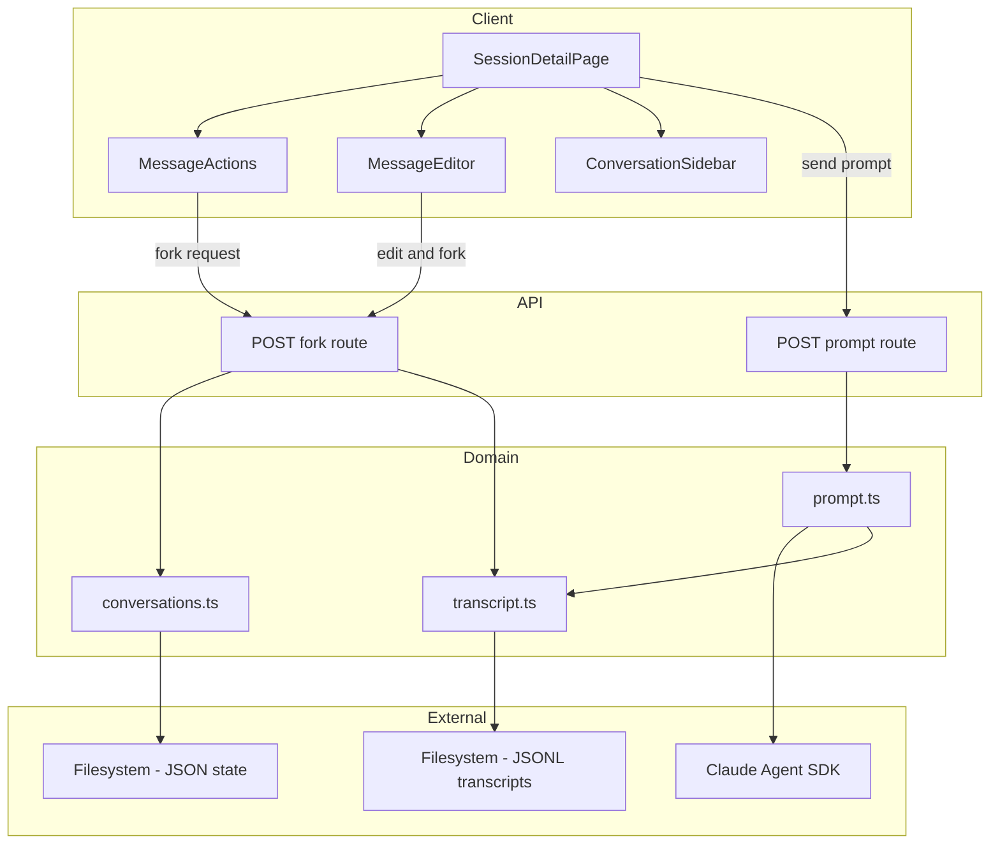
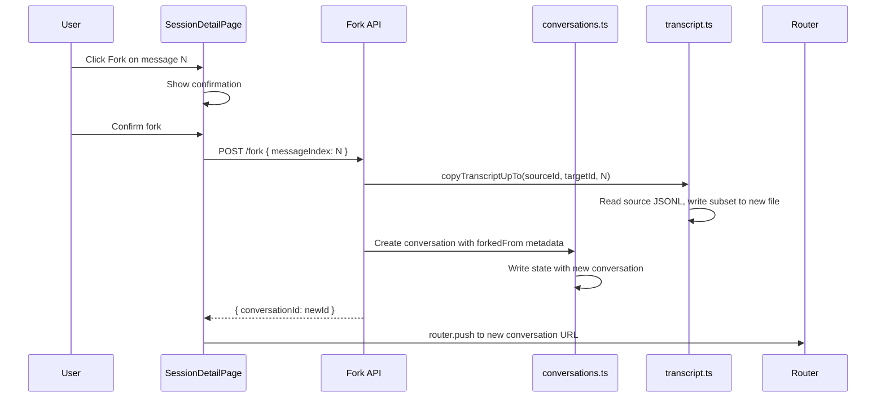
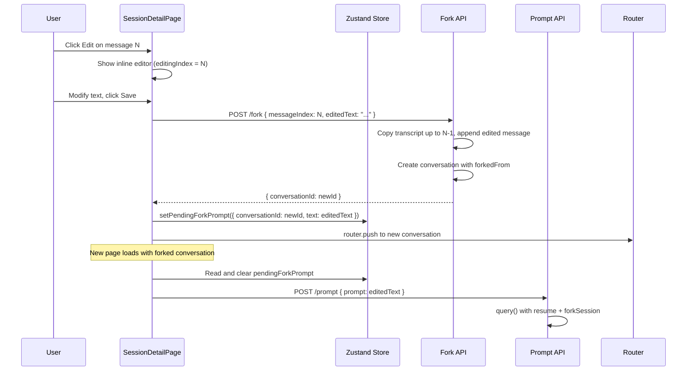
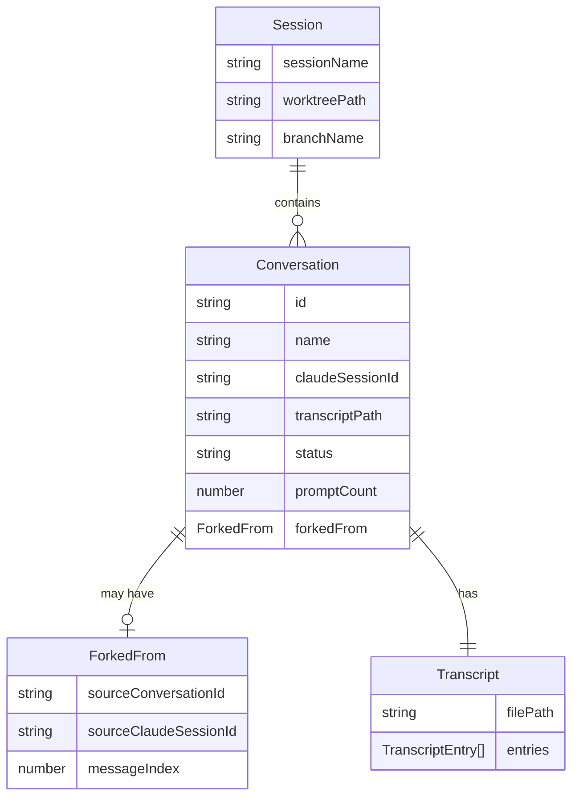

# Design Document — Conversation Forking

## Overview

**Purpose**: Conversation forking enables developers to branch from any previous user message in a conversation, creating a new conversation that inherits the history up to that point. Edit-and-fork extends this by allowing the user to modify the message before branching.

**Users**: Developers using CC to manage Claude Code sessions. They use this when a conversation took a wrong turn and they want to retry from an earlier point, or when they want to explore multiple approaches from the same starting context.

**Impact**: Extends the existing conversation system with fork provenance tracking (`forkedFrom` field on `ConversationState`), a new fork API endpoint, transcript copying logic, and SDK fork parameter injection. All changes are additive — existing conversations are unaffected.

### Goals
- Fork from any user message with full conversation history preserved for Claude
- Edit-and-fork as a single user flow (edit → save → navigate → auto-prompt)
- Leverage SDK-native `forkSession` for conversation context rather than manual history replay
- Zero impact on existing conversations and prompting flows

### Non-Goals
- Tree visualization of fork relationships (future enhancement)
- Forking from assistant messages
- `resumeSessionAt` optimization (requires storing SDK message UUIDs — deferred)
- Merging forked conversations back together

## Architecture

### Existing Architecture Analysis

The conversation system follows a layered pattern:
- **Schema layer** (`schemas.ts`): Zod schemas define `ConversationState` with fields for ID, status, transcript path, `claudeSessionId`
- **State layer** (`conversations.ts`): CRUD operations on conversations within session state (filesystem-backed JSON)
- **Transcript layer** (`transcript.ts`): JSONL append-only files, one per conversation
- **Prompt layer** (`prompt.ts`): SDK `query()` execution with SSE streaming; uses `resume: claudeSessionId` for session continuity
- **API layer**: REST routes at `/api/projects/[name]/sessions/[session]/conversations/[conversationId]/...`
- **UI layer**: `SessionDetailPage` with virtualized message list, `ConversationSidebar` for navigation

Forking integrates at every layer but introduces no new patterns — it extends existing ones.

### Architecture Pattern & Boundary Map



**Architecture Integration**:
- **Selected pattern**: Extension of existing layered architecture
- **Domain boundaries**: Fork logic lives in `conversations.ts` (state creation) and `transcript.ts` (file copying). No new domain modules.
- **Existing patterns preserved**: State mutation via `mutateConversation()`, JSONL append-only transcripts, SSE streaming for prompts
- **New components**: One API route (`fork/route.ts`), schema extension, two UI components (already created)
- **Steering compliance**: Filesystem-backed state, no new dependencies, REST API mirrors resource hierarchy

### Technology Stack

| Layer | Choice / Version | Role in Feature | Notes |
|-------|------------------|-----------------|-------|
| Frontend | React 19, TanStack Virtual, Zustand | Message rendering with fork/edit actions, edit state management | Existing |
| Backend | Next.js 15 API Routes | Fork API endpoint, prompt execution | Existing |
| SDK | `@anthropic-ai/claude-agent-sdk` | `resume` + `forkSession: true` for forked conversation context | Existing, new options used |
| Storage | Filesystem JSON + JSONL | Session state with `forkedFrom` field, copied transcript files | Existing, schema extended |

## System Flows

### Direct Fork Flow



### Edit-and-Fork Flow



**Auto-Prompt Delivery Mechanism**: The edited text is passed to the new conversation page via a Zustand store field (`pendingForkPrompt`). The source page sets it before navigation; the target page reads and clears it on mount. This avoids URL length limits and is consistent with the existing store-based state management pattern. See SessionDetailStore extension below for the field definition.

## Requirements Traceability

| Requirement | Summary | Components | Interfaces | Flows |
|-------------|---------|------------|------------|-------|
| 1.1 | Fork creates conversation with messages up to fork point | ForkConversation, TranscriptCopy | Fork API | Direct Fork |
| 1.2 | New ID, null claudeSessionId, new JSONL | ForkConversation, TranscriptCopy | Fork API | Direct Fork |
| 1.3 | Navigate to new conversation | SessionDetailPage | Fork API response | Direct Fork |
| 1.4 | Disable while running | MessageActions | disabled prop | — |
| 1.5 | Only on user messages | MessageActions | — | — |
| 2.1 | Inline editor display | MessageEditor, SessionDetailStore | editingIndex state | Edit-and-Fork |
| 2.2 | Edit creates fork with modified message | ForkConversation, TranscriptCopy | Fork API editedText param | Edit-and-Fork |
| 2.3 | Auto-send edited prompt | SessionDetailPage, SessionDetailStore (pendingForkPrompt) | Prompt API | Edit-and-Fork |
| 2.4 | Cancel restores display | MessageEditor, SessionDetailStore | editingIndex reset | — |
| 2.5 | Unchanged save = direct fork | SessionDetailPage | Fork API | Edit-and-Fork |
| 3.1 | forkedFrom field | ConversationStateSchema | — | — |
| 3.2 | Independent JSONL transcript | TranscriptCopy | — | Both flows |
| 3.3 | promptCount starts at 0 | ForkConversation | — | — |
| 3.4 | Delete doesn't affect original | Existing delete logic | — | — |
| 3.5 | Default fork name | ForkConversation | — | — |
| 4.1 | Pass history on first prompt | PromptExecution | SDK resume + forkSession | Both flows |
| 4.2 | Subsequent prompts use claudeSessionId | Existing prompt flow | — | — |
| 4.3 | History from own transcript | Existing readConversationMessages | — | — |
| 5.1 | Hover action bar on desktop | MessageActions, CSS | — | — |
| 5.2 | Hide on mouse leave | MessageActions, CSS | — | — |
| 5.3 | Mobile: below content, 44px targets | MessageActions, CSS | — | — |
| 5.4 | Hide actions during edit | CSS `.editing` class | — | — |
| 5.5 | Fork confirmation step | MessageActions | confirmFork state | — |
| 6.1 | Fork indicator in sidebar | ConversationSidebar | forkedFrom field | — |
| 6.2 | Fork tooltip | ConversationSidebar | forkedFrom field | — |
| 6.3 | Same list, sorted by time | Existing sidebar logic | — | — |

## Components and Interfaces

| Component | Domain | Intent | Req Coverage | Key Dependencies | Contracts |
|-----------|--------|--------|--------------|------------------|-----------|
| ConversationStateSchema | Schema | Extended schema with forkedFrom field | 3.1 | Zod (P0) | State |
| ForkConversation | Domain | Create forked conversation in session state | 1.1, 1.2, 3.1-3.5 | ConversationStateSchema (P0), TranscriptCopy (P0) | Service |
| TranscriptCopy | Domain | Copy JSONL transcript up to fork point | 1.1, 3.2 | transcript.ts (P0), filesystem (P0) | Service |
| ForkAPIRoute | API | REST endpoint for fork creation | 1.1-1.3, 2.2 | ForkConversation (P0), TranscriptCopy (P0) | API |
| PromptExecution | Domain | SDK fork parameter injection on first prompt | 4.1 | prompt.ts (P0), Claude Agent SDK (P0) | Service |
| SessionDetailStore | UI State | Add editingIndex and pendingForkPrompt state | 2.1, 2.3, 2.4 | Zustand (P0) | State |
| MessageActions | UI | Hover action bar with Fork/Edit buttons | 5.1-5.5 | — | — |
| MessageEditor | UI | Inline message editor | 2.1, 2.4 | — | — |
| SessionDetailPage | UI | Wire components into message render loop | 1.3, 2.3, 2.5 | All UI components (P0) | — |
| ConversationSidebar | UI | Fork indicator and tooltip | 6.1-6.3 | ConversationStateSchema (P0) | — |

### Schema Layer

#### ConversationStateSchema

| Field | Detail |
|-------|--------|
| Intent | Extend ConversationState with fork provenance tracking |
| Requirements | 3.1 |

**Responsibilities & Constraints**
- Add optional `forkedFrom` field to `conversationStateSchema`
- Must be backward-compatible (existing conversations without the field parse cleanly via `.default(null)`)
- Store source conversation ID, message index, and source `claudeSessionId` for SDK resume

**Contracts**: State [x]

##### State Management

```typescript
// Addition to conversationStateSchema
const forkedFromSchema = z.object({
  sourceConversationId: z.string(),
  sourceClaudeSessionId: z.string(),
  messageIndex: z.number(),
}).nullable().default(null);

// Extended field on conversationStateSchema:
// forkedFrom: forkedFromSchema
```

**Implementation Notes**
- `sourceClaudeSessionId` is captured at fork time from the source conversation, resolved as `source.claudeSessionId ?? source.forkedFrom?.sourceClaudeSessionId` — this supports both forking from original conversations and fork-from-fork scenarios, and decouples the fork from the source conversation's continued existence
- `messageIndex` refers to the 0-based index within the filtered message list (user + assistant messages only, matching UI indices)

### Domain Layer

#### ForkConversation

| Field | Detail |
|-------|--------|
| Intent | Create a new conversation that inherits history from an existing one up to a specified message |
| Requirements | 1.1, 1.2, 3.1, 3.2, 3.3, 3.5 |

**Responsibilities & Constraints**
- Create new `ConversationState` with `forkedFrom` metadata
- Coordinate transcript copying via TranscriptCopy
- Generate fork-descriptive default name
- Persist to session state atomically

**Dependencies**
- Inbound: ForkAPIRoute — triggers fork creation (P0)
- Outbound: TranscriptCopy — copies JSONL lines (P0)
- Outbound: State persistence — `readState`/`writeState` (P0)

**Contracts**: Service [x]

##### Service Interface

```typescript
interface ForkConversationInput {
  projectPath: string;
  sessionName: string;
  sourceConversationId: string;
  messageIndex: number;
  editedText?: string;
}

interface ForkConversationResult {
  conversationId: string;
  name: string;
}

// forkConversation(input: ForkConversationInput): Promise<ForkConversationResult>
```

- Preconditions: Source conversation exists, has a resolvable Claude session ID (see below), `messageIndex` is within range of source messages
- Postconditions: New conversation persisted in state, transcript file created
- Invariants: Source conversation unchanged

**Implementation Notes**
- Validation: source must have a resolvable Claude session ID — either its own `claudeSessionId` or `forkedFrom.sourceClaudeSessionId` (for fork-from-fork where the source fork hasn't been prompted yet). This allows forking from a fork that has transcript history but no own session. A conversation with neither is unforkable (never prompted, no inherited context).
- For edit-and-fork: copy messages up to `messageIndex - 1`, then append edited text as user message
- For direct fork: copy messages up to `messageIndex` and the subsequent assistant response (if present)
- Name format: `"Fork of {sourceName} @ turn {turnNumber}"` where turnNumber is computed from user message indices

#### TranscriptCopy

| Field | Detail |
|-------|--------|
| Intent | Copy JSONL transcript entries from source to target up to a specified message index |
| Requirements | 3.2 |

**Responsibilities & Constraints**
- Read source JSONL file line by line
- Filter to user/assistant messages to count to the fork point
- Copy all raw JSONL lines (including system/tool_result entries between messages) up to and including the fork point
- Write to target conversation's transcript file
- Optionally append an edited user message as the final entry

**Dependencies**
- Inbound: ForkConversation — triggers copy (P0)
- Outbound: Filesystem — read source, write target (P0)

**Contracts**: Service [x]

##### Service Interface

```typescript
interface CopyTranscriptInput {
  sourceConversationId: string;
  targetConversationId: string;
  upToMessageIndex: number;
  appendEditedMessage?: {
    text: string;
    timestamp: string;
  };
}

// copyTranscriptUpTo(input: CopyTranscriptInput): Promise<void>
```

- Preconditions: Source transcript file exists
- Postconditions: Target transcript file created with copied entries
- Invariants: Source file unchanged

**Implementation Notes**
- Read full source file, split by newlines, parse each to count visible messages (those with `role` = user/assistant and non-empty `content`)
- Track the raw line index of the target message index
- Write all raw lines up to (and including) that raw line index to the target file
- For edit-and-fork: write lines up to `messageIndex - 1`, then append a new JSONL entry with the edited text

#### PromptExecution (Extension)

| Field | Detail |
|-------|--------|
| Intent | Inject SDK `forkSession` + `resume` parameters when executing the first prompt in a forked conversation |
| Requirements | 4.1, 4.2 |

**Responsibilities & Constraints**
- Detect when a conversation has `forkedFrom` metadata and no `claudeSessionId` (first prompt)
- Pass `resume: forkedFrom.sourceClaudeSessionId` and `forkSession: true` to SDK `query()` options
- After first prompt completes, `claudeSessionId` is set from SDK response — subsequent prompts resume normally

**Dependencies**
- Inbound: Prompt API route — triggers execution (P0)
- Outbound: Claude Agent SDK — `query()` with fork options (P0)

**Contracts**: Service [x]

##### Service Interface

Extension to existing `executePromptStream()` — no new function. The change is in the `query()` options construction:

```typescript
// Current (line 172 of prompt.ts):
resume: conversation.claudeSessionId ?? undefined,

// Extended:
resume: conversation.claudeSessionId
  ?? conversation.forkedFrom?.sourceClaudeSessionId
  ?? undefined,
forkSession: conversation.forkedFrom != null
  && conversation.claudeSessionId == null
  ? true
  : undefined,
```

**Implementation Notes**
- `forkSession: true` only on the first prompt (when `claudeSessionId` is still null)
- After the first prompt, `claudeSessionId` is set from the SDK's response and `resume` uses it directly — standard flow
- No changes to SSE streaming, transcript writing, or status broadcasting

### API Layer

#### ForkAPIRoute

| Field | Detail |
|-------|--------|
| Intent | REST endpoint for creating a conversation fork |
| Requirements | 1.1, 1.2, 2.2 |

**Responsibilities & Constraints**
- Validate request body (messageIndex required, editedText optional)
- Resolve project and session
- Call ForkConversation service
- Return new conversation ID and name

**Dependencies**
- Inbound: Client fetch — POST request (P0)
- Outbound: ForkConversation — creates the fork (P0)

**Contracts**: API [x]

##### API Contract

| Method | Endpoint | Request | Response | Errors |
|--------|----------|---------|----------|--------|
| POST | `/api/projects/[name]/sessions/[session]/conversations/[conversationId]/fork` | `ForkRequest` | `ForkResponse` | 400, 404, 409, 500 |

```typescript
// Request
interface ForkRequest {
  messageIndex: number;
  editedText?: string;
}

// Response (200)
interface ForkResponse {
  conversationId: string;
  name: string;
}
```

**Error Responses**:
- `400`: Invalid messageIndex or empty editedText
- `404`: Project, session, or conversation not found
- `409`: Conversation is currently running (cannot fork while busy)
- `500`: Filesystem or SDK error

### UI State Layer

#### SessionDetailStore (Extension)

| Field | Detail |
|-------|--------|
| Intent | Add editing state and auto-prompt delivery for fork flows |
| Requirements | 2.1, 2.3, 2.4 |

**Contracts**: State [x]

##### State Management

```typescript
// New state fields
editingIndex: number | null;  // Which message is being edited (null = none)
pendingForkPrompt: { conversationId: string; text: string } | null;  // Auto-prompt for edit-and-fork

// New actions
startEditing: (messageIndex: number) => void;
cancelEditing: () => void;
setPendingForkPrompt: (pending: { conversationId: string; text: string }) => void;
consumePendingForkPrompt: () => { conversationId: string; text: string } | null;  // Read and clear atomically
```

**Implementation Notes**
- `startEditing(idx)` sets `editingIndex = idx`
- `cancelEditing()` sets `editingIndex = null`
- On conversation change (`clearConversationMessages`), also reset `editingIndex` to null
- `setPendingForkPrompt(pending)` stores the edited text and target conversation ID before navigation
- `consumePendingForkPrompt()` returns the pending prompt and clears it atomically — called once on `SessionDetailPage` mount when the current conversation ID matches `pendingForkPrompt.conversationId`
- If the page loads and `pendingForkPrompt.conversationId` doesn't match the current conversation, the pending prompt is silently discarded (stale navigation)

### UI Layer

#### MessageActions

| Field | Detail |
|-------|--------|
| Intent | Hover action bar with Fork and Edit buttons on user messages |
| Requirements | 5.1, 5.2, 5.3, 5.4, 5.5 |

**Implementation Notes**
- Already created at `src/components/MessageActions.tsx` with CSS in `globals.css`
- Props: `messageIndex`, `onFork`, `onEdit`, `disabled`
- Fork has built-in two-click confirmation
- CSS: absolute positioning on desktop (hover reveal), static positioning on mobile (always visible, 44px targets)

#### MessageEditor

| Field | Detail |
|-------|--------|
| Intent | Inline textarea editor replacing message content during edit mode |
| Requirements | 2.1, 2.4 |

**Implementation Notes**
- Already created at `src/components/MessageEditor.tsx`
- Props: `originalText`, `messageIndex`, `onSave`, `onCancel`, `saving`
- Auto-focus, auto-resize, keyboard shortcuts (Escape, Ctrl+Enter)
- Save button shows "Fork" / "Save & Fork" / "Forking..." based on state

#### SessionDetailPage (Extension)

| Field | Detail |
|-------|--------|
| Intent | Wire MessageActions and MessageEditor into the virtualized message render loop |
| Requirements | 1.3, 1.4, 2.3, 2.5, 5.4 |

**Implementation Notes**
- In the virtualizer `.map()`: for user messages, render `<MessageActions>` inside the `.message.user` div
- When `editingIndex === virtualRow.index`, render `<MessageEditor>` instead of `<MessageContent>`, add `.editing` CSS class
- `handleFork(messageIndex)`: call fork API → `router.push()` to new conversation
- `handleEditSave(messageIndex, newText)`: call fork API with `editedText` → `setPendingForkPrompt({ conversationId: newId, text: newText })` → `router.push()` to new conversation
- On mount: call `consumePendingForkPrompt()` — if it returns a prompt matching the current conversation ID, auto-send it via the existing `sendPrompt()` hook
- Extract text from `MessageContentBlock[]` by finding the first `type: "text"` block

#### ConversationSidebar (Extension)

| Field | Detail |
|-------|--------|
| Intent | Display fork indicator icon and tooltip on forked conversations |
| Requirements | 6.1, 6.2, 6.3 |

**Implementation Notes**
- In the conversation list item rendering: check `convo.forkedFrom != null`
- If forked, render a small fork icon (same SVG as MessageActions) next to the conversation name
- Add `title` attribute or `data-tooltip` with "Forked from {sourceName} at turn {N}" (source name resolved from conversations list)
- No changes to sort order — existing `createdAt` sort handles fork ordering naturally

## Data Models

### Domain Model



**Invariants**:
- `forkedFrom.sourceClaudeSessionId` is immutable once set (captured at fork creation time)
- A conversation with `forkedFrom != null` is a fork; `forkedFrom == null` is an original
- Deleting a source conversation does not cascade to forks (forks are self-contained)

### Data Contracts & Integration

**Fork API Request/Response** (defined in API Contract above)

**Zod Schema Extension**:

```typescript
const forkedFromSchema = z.object({
  sourceConversationId: z.string(),
  sourceClaudeSessionId: z.string(),
  messageIndex: z.number().int().nonneg(),
}).nullable().default(null);

// Add to conversationStateSchema:
// forkedFrom: forkedFromSchema
```

**Fork Request Schema**:

```typescript
const forkRequestSchema = z.object({
  messageIndex: z.number().int().nonneg(),
  editedText: z.string().trim().min(1).optional(),
});
```

## Error Handling

### Error Categories and Responses

**User Errors (4xx)**:
- Invalid messageIndex (out of range) → `400` with descriptive message
- Empty editedText → `400` with validation error
- Source conversation has no resolvable Claude session ID (no `claudeSessionId` and no `forkedFrom.sourceClaudeSessionId`) → `400` with "Cannot fork: conversation has no history with Claude"
- Fork while running → `409` with "Cannot fork while conversation is running"

**System Errors (5xx)**:
- Transcript file read/write failure → `500` with generic error, logged server-side
- State persistence failure → `500`, existing atomic write pattern handles crash safety

**Business Logic**:
- Source conversation not found → `404`
- Conversation has no messages up to messageIndex → `400`

## Testing Strategy

### Unit Tests
- `forkConversation()` — creates conversation with correct `forkedFrom` metadata, name, promptCount
- `copyTranscriptUpTo()` — copies correct JSONL lines, handles edit append, preserves system entries
- Fork request schema validation — valid/invalid messageIndex, optional editedText
- SDK fork parameter injection — `forkSession: true` on first prompt, absent on subsequent

### Integration Tests
- Full fork flow: create conversation → send prompt → fork → verify new conversation state and transcript
- Edit-and-fork flow: fork with editedText → verify transcript contains edited message
- Fork then prompt: verify SDK receives `resume` + `forkSession: true` → new `claudeSessionId` established

### E2E/UI Tests
- Hover over user message → action bar appears with Fork/Edit buttons
- Click Fork → confirmation → navigation to new conversation
- Click Edit → inline editor appears → modify text → Save → navigation
- Cancel edit → editor dismissed, original content restored
- Fork disabled while session is running
- Fork indicator visible in sidebar for forked conversations
