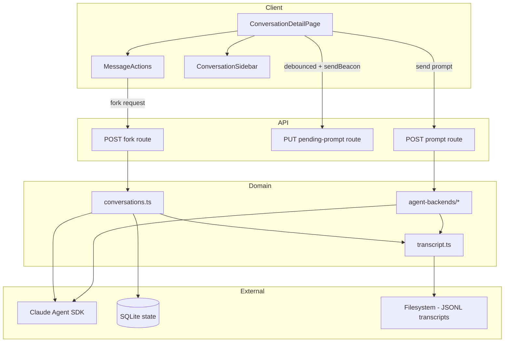
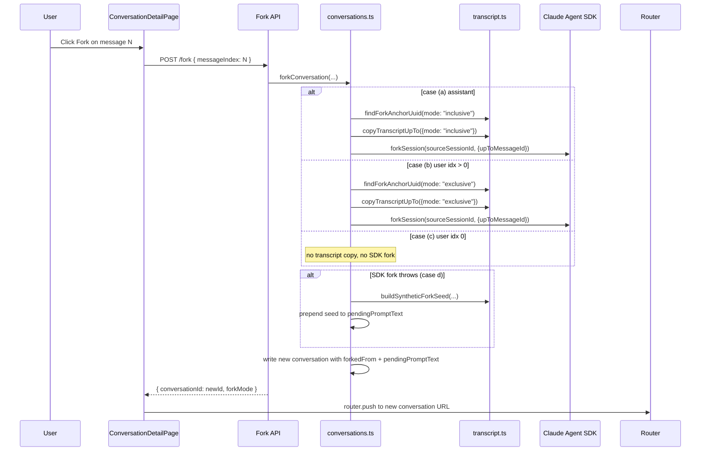
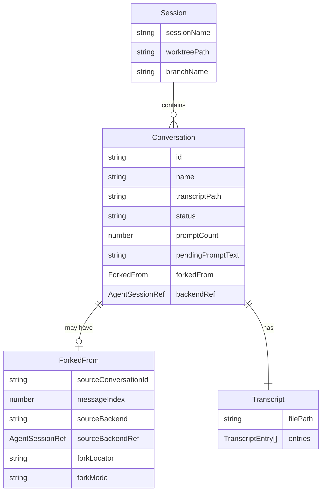

# Design Document — Conversation Forking

## Overview

**Purpose**: Conversation forking enables developers to branch from any previous message in a conversation, creating a new conversation that inherits the relevant history for re-prompting. Branching can happen from either an assistant message (keep the assistant's response, continue from there) or a user message (drop the user's text into the new conversation's prompt input so the developer can revise and re-send).

**Users**: Developers using CC to manage Claude Code sessions. They use this when a conversation took a wrong turn and they want to retry from an earlier point, or when they want to explore multiple approaches from the same starting context.

**Impact**: Extends the existing conversation system with fork provenance tracking (`forkedFrom` field on `ConversationState`), a new fork API endpoint, transcript copying logic, an eager Claude SDK fork at fork-creation time, a synthetic fallback for compaction resilience, and server-persisted pending prompt text on each conversation.

### Goals
- Fork from any user or assistant message
- Re-prompt a user message by prepopulating the new conversation's prompt input with the user's original text — the developer revises the prompt and sends from the new conversation
- Eagerly create the new conversation's Claude SDK session at fork time so the fork is decoupled from later mutations of the source (auto-compaction, deletion)
- Survive compaction or missing SDK session files via a synthetic fork seed built from the local CC transcript
- Persist the user's in-progress prompt text on the conversation itself so it survives navigation and reloads

### Non-Goals
- Inline message editing within the source conversation (forking is the only branch primitive)
- Tree visualization of fork relationships
- Merging forked conversations back together
- `resumeSessionAt` optimization on every prompt (fork uses the SDK's native `forkSession()` helper once, then the new conversation owns its own session)

## Architecture

### Existing Architecture Analysis

The conversation system follows a layered pattern:
- **Schema layer** (`schemas.ts`): Zod schemas define `ConversationState` including `forkedFrom`, `pendingPromptText`, and `backendRef`
- **State layer** (`conversations.ts`): CRUD operations on conversations within session state (SQLite-backed via `state-store`)
- **Transcript layer** (`transcript.ts`): JSONL append-only files, one per conversation; helpers for copying and anchor lookup
- **Prompt layer** (`prompt.ts`) + **agent-backend layer** (`agent-backends/`): SDK `query()` execution with SSE streaming
- **API layer**: REST routes at `/api/projects/[name]/sessions/[session]/conversations/[conversationId]/...`
- **UI layer**: `ConversationDetailPage` with virtualized message list, persistent prompt input, fork action per message

Forking integrates at every layer but introduces no new patterns — it extends existing ones.

### Architecture Pattern & Boundary Map



**Architecture Integration**:
- **Selected pattern**: Extension of existing layered architecture
- **Domain boundaries**: Fork logic lives in `conversations.ts` (state creation + eager SDK fork) and `transcript.ts` (file copying, anchor lookup). No new domain modules.
- **Existing patterns preserved**: State mutation via `mutateSession()`, JSONL append-only transcripts, SSE streaming for prompts
- **New components**: Fork API route, pending-prompt API route, schema extensions, MessageActions wired into the message render loop, persistent prompt input wiring in `ConversationDetailPage`
- **Steering compliance**: Schema-first, REST API mirrors resource hierarchy, agent-backend abstraction reused for both Claude and Codex

### Technology Stack

| Layer | Choice / Version | Role in Feature | Notes |
|-------|------------------|-----------------|-------|
| Frontend | React 19, TanStack Virtual, Zustand | Message rendering with fork action, persistent prompt input | Existing |
| Backend | Next.js 16 API Routes | Fork API, pending-prompt API, prompt execution | Existing |
| SDK | `@anthropic-ai/claude-agent-sdk` | `forkSession()` helper invoked eagerly at fork time | Existing, new helper used |
| Storage | SQLite (WAL) + JSONL | Session state with `forkedFrom` and `pendingPromptText`; copied transcript files | Existing, schema extended |

## System Flows

### Fork Cases

Forking dispatches on the target message's role and index:

| Case | Trigger | Transcript copy | Pending prompt | Backend session |
|------|---------|-----------------|----------------|-----------------|
| (a) Assistant message | Click Fork on an assistant turn | Inclusive — through the assistant turn | None | Eager SDK fork via `forkSession()` |
| (b) User message, index > 0 | Click Fork on a non-first user turn | Exclusive — up to but not including the user turn | The user's text | Eager SDK fork via `forkSession()` |
| (c) User message, index 0 | Click Fork on the first user turn | None | The user's text | None (brand-new session on first prompt) |
| (d) Synthetic fallback | `forkSession()` throws on case (a) or (b) (e.g., the anchor UUID has been compacted away) | As cases (a) or (b) | Source contents serialized as a `<<<SYNTHETIC_FORK_SEED ...>>>` block, optionally followed by the user's text | None — created on next prompt, primed by the synthetic seed |

### Fork Flow



**Pending prompt restoration**: When `ConversationDetailPage` mounts for the forked conversation, the prompt input is initialized from `conversation.pendingPromptText` (server-persisted). The developer revises and sends from the new conversation — no auto-send.

### Persistent Prompt Input Flow

The prompt input on any conversation is server-persisted to its `pendingPromptText` field:
- Typing into the input debounces (~500ms) a PUT to `/pending-prompt` that updates the field.
- On unload (`beforeunload`), a synchronous `navigator.sendBeacon` flush captures any unflushed edit.
- On mount, the input is hydrated from `conversation.pendingPromptText`.
- On successful prompt submit, the input is cleared client-side and server-side (`pendingPromptText = null`).
- Manually clearing the input persists `null`.

This is feature-uniform: every conversation persists its prompt input the same way. Forks land into this same mechanism — the fork code just pre-seeds `pendingPromptText` for cases (b), (c), and (d).

## Requirements Traceability

| Requirement | Summary | Components | Interfaces | Flows |
|-------------|---------|------------|------------|-------|
| 1.1 | Fork creates conversation with messages up to fork point | ForkConversation, TranscriptCopy | Fork API | Fork |
| 1.2 | New ID, own SDK session (cases a/b) or none (case c/d), new JSONL | ForkConversation, TranscriptCopy | Fork API | Fork |
| 1.3 | Navigate to new conversation | ConversationDetailPage | Fork API response | Fork |
| 1.4 | Disable while running | MessageActions | `disabled` prop | — |
| 1.5 | Fork available on user and assistant messages | MessageActions | — | — |
| 3.1 | `forkedFrom` field | ConversationStateSchema | — | — |
| 3.2 | Independent JSONL transcript per fork | TranscriptCopy | — | Fork |
| 3.3 | promptCount starts at 0 | ForkConversation | — | — |
| 3.4 | Delete doesn't affect original | Existing delete logic | — | — |
| 3.5 | Default fork name | ForkConversation | — | — |
| 4.1 | Eager SDK fork at fork time (cases a/b) | ForkConversation | SDK `forkSession()` | Fork |
| 4.2 | Subsequent prompts use the forked session's own id | Existing prompt flow | — | — |
| 4.3 | History from own transcript | Existing readConversationMessages | — | — |
| 4.4 | Compaction-resilient synthetic fallback | ForkConversation, SyntheticForkSeed | — | Fork (case d) |
| 5.1 | Persistent prompt input across navigation | ConversationDetailPage, PendingPromptRoute | Pending-prompt API | Persistent prompt input |
| 5.2 | Persistent prompt input across reload | Same as 5.1 | — | Persistent prompt input |
| 5.3 | Submit clears pending prompt | Existing prompt flow | — | — |
| 6.1 | Fork indicator in sidebar | ConversationSidebar | `forkedFrom` field | — |
| 6.2 | Fork tooltip | ConversationSidebar | `forkedFrom` field | — |
| 6.3 | Synthetic-fallback indicator on the conversation header | ConversationDetailPage | `forkedFrom.forkMode` | — |

## Components and Interfaces

| Component | Domain | Intent | Req Coverage | Key Dependencies | Contracts |
|-----------|--------|--------|--------------|------------------|-----------|
| ConversationStateSchema | Schema | Extended schema with `forkedFrom` and `pendingPromptText` | 3.1, 5.1 | Zod (P0) | State |
| ForkConversation | Domain | Create forked conversation with eager SDK fork or synthetic fallback | 1.1, 1.2, 3.1-3.5, 4.1, 4.4 | ConversationStateSchema (P0), TranscriptCopy (P0), Claude SDK (P0) | Service |
| TranscriptCopy | Domain | Copy JSONL transcript up to fork point with mode-driven boundary | 1.1, 3.2 | transcript.ts (P0), filesystem (P0) | Service |
| SyntheticForkSeed | Domain | Serialize local transcript into a single-shot prompt seed when SDK fork is unavailable | 4.4 | transcript.ts (P0) | Service |
| ForkAPIRoute | API | REST endpoint for fork creation | 1.1-1.3 | ForkConversation (P0) | API |
| PendingPromptRoute | API | REST endpoint to persist `pendingPromptText` | 5.1, 5.2 | Conv (P0) | API |
| MessageActions | UI | Action buttons (Copy, Fork) per message | 1.4, 1.5 | — | — |
| ConversationDetailPage | UI | Wire MessageActions, persistent prompt input | 1.3, 5.1, 5.2 | All UI components (P0) | — |
| ConversationSidebar | UI | Fork indicator and tooltip | 6.1-6.3 | ConversationStateSchema (P0) | — |

### Schema Layer

#### ConversationStateSchema

| Field | Detail |
|-------|--------|
| Intent | Extend ConversationState with fork provenance and persistent prompt text |
| Requirements | 3.1, 5.1 |

**Responsibilities & Constraints**
- Add nullable `forkedFrom` object capturing source conversation id, message index, fork mode, fork locator, source backend, and source backend ref
- Add nullable `pendingPromptText` string field, defaulting to null
- Must be backward-compatible — existing rows without the new fields parse cleanly via `.default(null)` / `.nullable()`

**Contracts**: State [x]

##### State Management

```typescript
// forkedFrom — present on every fork, but several inner fields are nullable for case (c) and (d):
const forkedFromSchema = z
  .object({
    sourceConversationId: z.string(),
    messageIndex: z.number().int().min(0),
    sourceBackend: agentBackendSchema.nullable().optional(),
    // Null when the fork is not derived from the source SDK session
    // (e.g., user fork at index 0 — "edit and start over").
    sourceBackendRef: agentSessionRefSchema.nullable().optional(),
    forkLocator: z.string().nullable().optional(),
    forkMode: z.enum(["native", "synthetic"]).nullable().default(null),
  })
  .nullable()
  .default(null);

// pendingPromptText — extended field on conversationStateSchema:
// pendingPromptText: z.string().nullable().default(null)
```

**Implementation Notes**
- `sourceBackendRef` is captured at fork time from the source conversation's `backendRef`. It is null for case (c) (brand-new fork) and is preserved for the audit trail in case (d) as well.
- `forkLocator` is the UUID of the SDK message used as the fork anchor (returned by `findForkAnchorUuid`). Null for case (c) and case (d).
- `forkMode` is `"native"` when SDK `forkSession()` succeeded, `"synthetic"` when the fallback path ran, `null` for case (c).

### Domain Layer

#### ForkConversation

| Field | Detail |
|-------|--------|
| Intent | Create a new conversation that inherits history from an existing one up to a specified message, with an eager Claude SDK session created where applicable |
| Requirements | 1.1, 1.2, 3.1-3.5, 4.1, 4.4 |

**Responsibilities & Constraints**
- Decide the fork case (a/b/c) from the target message's role and index
- Coordinate transcript copying via `copyTranscriptUpTo({mode})`
- For cases (a) and (b), call `forkSession()` eagerly; on failure, fall back to a synthetic seed
- Persist the new `ConversationState` to session state atomically with `forkedFrom`, `pendingPromptText`, `backendRef`, and the chosen `forkMode`

**Dependencies**
- Inbound: ForkAPIRoute — triggers fork creation (P0)
- Outbound: TranscriptCopy — copies JSONL lines (P0)
- Outbound: Claude Agent SDK — `forkSession()` (P0)
- Outbound: SyntheticForkSeed — fallback prompt seed (P0)
- Outbound: State persistence — `mutateSession()` (P0)

**Contracts**: Service [x]

##### Service Interface

```typescript
interface ForkConversationInput {
  projectPath: string;
  sessionName: string;
  sourceConversationId: string;
  messageIndex: number;
}

interface ForkConversationResult {
  conversationId: string;
  name: string;
  forkMode: "native" | "synthetic" | null;
}
```

- Preconditions: Source conversation exists; `messageIndex` is within range of source messages.
- Postconditions: New conversation persisted in state, transcript file created (cases a/b/d), `pendingPromptText` populated for cases (b)/(c)/(d).
- Invariants: Source conversation unchanged.

**Implementation Notes**
- Fork-from-fork is handled transparently: `sourceBackendRef` is read from the source row's `backendRef`, which is the source's own SDK session (whether the source itself was forked or original).
- A conversation with no `backendRef` (never prompted) can still be the source of a case-(c) fork because no SDK fork is attempted. Cases (a)/(b) from such a source fall through to the synthetic fallback.

#### TranscriptCopy

| Field | Detail |
|-------|--------|
| Intent | Copy JSONL transcript entries from source to target up to a specified message index, with mode-driven inclusion of the boundary message |
| Requirements | 3.2 |

**Responsibilities & Constraints**
- Read source JSONL file
- Locate the message at `upToMessageIndex`
- Copy up to and including that message when `mode = "inclusive"`, or up to but not including it when `mode = "exclusive"`
- Preserve all interleaved non-message lines (system entries, tool_result entries, etc.)
- Write the copied lines to the target conversation's transcript file

**Dependencies**
- Inbound: ForkConversation — triggers copy (P0)
- Outbound: Filesystem — read source, write target (P0)

**Contracts**: Service [x]

##### Service Interface

```typescript
type CopyTranscriptMode = "inclusive" | "exclusive";

interface CopyTranscriptInput {
  sourceTranscriptPath: string;
  targetConversationId: string;
  upToMessageIndex: number;
  mode: CopyTranscriptMode;
  configDir?: string;
}

// copyTranscriptUpTo(input: CopyTranscriptInput): Promise<void>
```

- Preconditions: Source transcript file exists.
- Postconditions: Target transcript file created with copied entries.
- Invariants: Source file unchanged.

#### SyntheticForkSeed

| Field | Detail |
|-------|--------|
| Intent | Build a single-shot prompt-prefix string that recreates the relevant prior context from the local CC transcript when the SDK session cannot be forked |
| Requirements | 4.4 |

**Responsibilities & Constraints**
- Read the local CC transcript up to the fork point
- Serialize messages into a fenced `<<<SYNTHETIC_FORK_SEED ...>>>` block
- Return null if the transcript cannot be read or is empty (caller then throws a typed `ForkCreationError`)

**Implementation Notes**
- The returned seed is prepended to `pendingPromptText`; the next prompt sent from the forked conversation primes the new SDK session with the seed.
- Both the Claude and Codex agent-backends consume this seed via the `syntheticForkSeed` field on `ConversationBackendTurnInput` when the turn's runtime context indicates a fork-bootstrap turn.

### API Layer

#### ForkAPIRoute

| Field | Detail |
|-------|--------|
| Intent | REST endpoint for creating a conversation fork |
| Requirements | 1.1-1.3 |

**API Contract**

| Method | Endpoint | Request | Response | Errors |
|--------|----------|---------|----------|--------|
| POST | `/api/projects/[name]/sessions/[session]/conversations/[conversationId]/fork` | `ForkRequest` | `ForkResponse` | 400, 404, 409, 500 |

```typescript
// Request
interface ForkRequest {
  messageIndex: number;
}

// Response (200)
interface ForkResponse {
  conversationId: string;
  name: string;
  forkMode: "native" | "synthetic" | null;
}
```

**Error Responses**:
- `400`: Invalid messageIndex.
- `404`: Project, session, or conversation not found.
- `409`: Source conversation is currently running (cannot fork while busy).
- `500`: Filesystem, SDK, or synthetic-seed failure (`ForkCreationError`).

#### PendingPromptRoute

| Field | Detail |
|-------|--------|
| Intent | REST endpoint to persist a conversation's `pendingPromptText` |
| Requirements | 5.1, 5.2 |

**API Contract**

| Method | Endpoint | Request | Response | Errors |
|--------|----------|---------|----------|--------|
| PUT | `/api/projects/[name]/sessions/[session]/conversations/[conversationId]/pending-prompt` | `{ text: string | null }` | `204` | 400, 404 |

The client debounces writes (~500ms) and uses `navigator.sendBeacon` on unload for a best-effort flush.

### UI Layer

#### MessageActions

| Field | Detail |
|-------|--------|
| Intent | Per-message action bar with Copy and Fork buttons |
| Requirements | 1.4, 1.5 |

**Implementation Notes**
- Rendered for every message (user or assistant).
- `disabled` when the session is busy (running) or the conversation is read-only.

#### ConversationDetailPage

| Field | Detail |
|-------|--------|
| Intent | Wire fork, persistent prompt input, and synthetic-fallback indicators |
| Requirements | 1.3, 5.1, 5.2, 6.3 |

**Implementation Notes**
- Initialize the prompt input from `conversation.pendingPromptText` on mount.
- Debounce changes (~500ms) into a PUT against the pending-prompt route; flush via `navigator.sendBeacon` on `beforeunload`.
- On submit, clear the input client-side and let the prompt handler clear the server field.
- Show a small synthetic-fallback indicator on the conversation header when `forkedFrom?.forkMode === "synthetic"`.
- `handleFork(messageIndex)`: POST `/fork`, then `router.push()` to the returned conversation.

#### ConversationSidebar (Extension)

- For conversations with `forkedFrom != null`, render a small fork icon next to the conversation name.
- Tooltip: `"Forked from {sourceName} at turn {N}"` resolved from the conversations list.
- No changes to sort order.

## Data Models

### Domain Model



**Invariants**:
- `forkedFrom` is immutable once set (captured at fork creation time).
- `forkMode` is one of `"native" | "synthetic" | null`; `null` is used for case (c).
- Deleting a source conversation does not cascade to forks (forks are self-contained — they have their own SDK session and transcript).

### Data Contracts & Integration

**Fork Request Schema**:

```typescript
const forkRequestSchema = z.object({
  messageIndex: z.number().int().nonneg(),
});
```

## Error Handling

### Error Categories and Responses

**User Errors (4xx)**:
- Invalid `messageIndex` (out of range) → `400`.
- Fork while running → `409` with "Cannot fork while conversation is running".

**System Errors (5xx)**:
- `ForkCreationError("fork_failed", …)` — SDK fork threw and the synthetic seed could not be built → `500`.
- Transcript file read/write failure → `500`, logged server-side.
- State persistence failure → `500`, existing atomic write pattern handles crash safety.

**Business Logic**:
- Source conversation not found → `404`.
- Source has no messages up to `messageIndex` → `400`.

## Testing Strategy

### Unit Tests
- `forkConversation()` — exercises all four cases (a/b/c/d) with mocked SDK; verifies `forkedFrom`, `pendingPromptText`, `backendRef`, `forkMode`.
- `copyTranscriptUpTo()` — copies correct JSONL subsets for `mode: "inclusive"` and `mode: "exclusive"`; preserves interleaved system entries.
- `findForkAnchorUuid()` — returns the right UUID for each mode at boundary indices.
- `buildSyntheticForkSeed()` — serialization round-trips; returns null on empty transcripts.
- Fork request schema validation — valid/invalid `messageIndex`.

### Integration Tests
- Full fork flow per case: create conversation → send prompt → fork → verify new conversation state and transcript.
- Synthetic fallback path: corrupt the SDK session file, fork, verify `forkMode === "synthetic"` and the seed is in `pendingPromptText`.
- Pending-prompt round trip: PUT, reload, GET, verify value persists.

### E2E/UI Tests
- Fork action visible per message; disabled while busy.
- Fork from assistant message → new conversation includes that turn.
- Fork from user message > 0 → new conversation's input prepopulated with the user's text.
- Fork from user message at index 0 → new conversation has no transcript; input prepopulated; sending starts a brand-new SDK session.
- Persistent prompt input survives navigation and reload; clears on submit.
- Synthetic-fallback indicator visible in the header when `forkMode === "synthetic"`.
