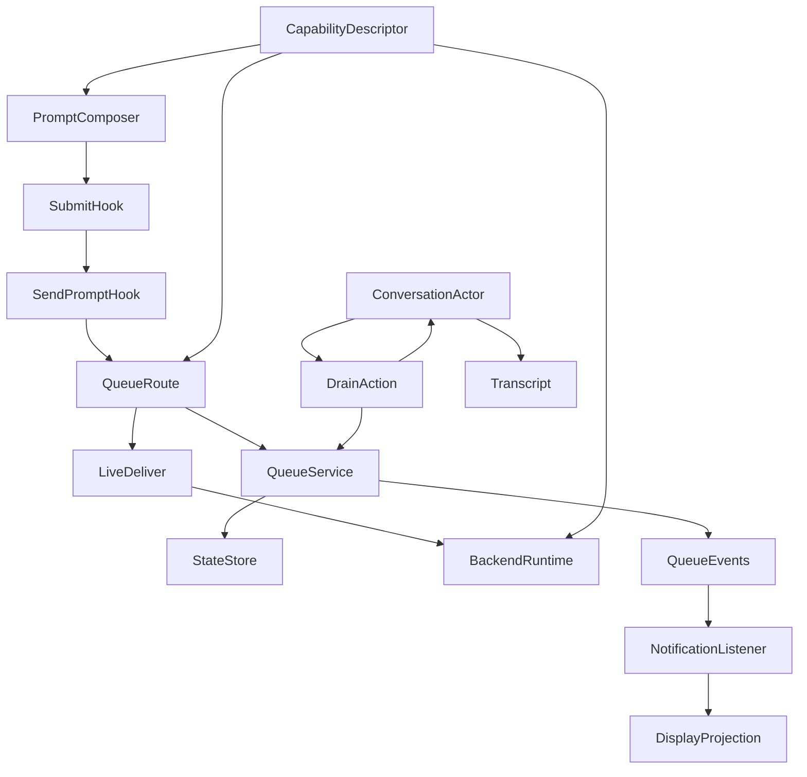
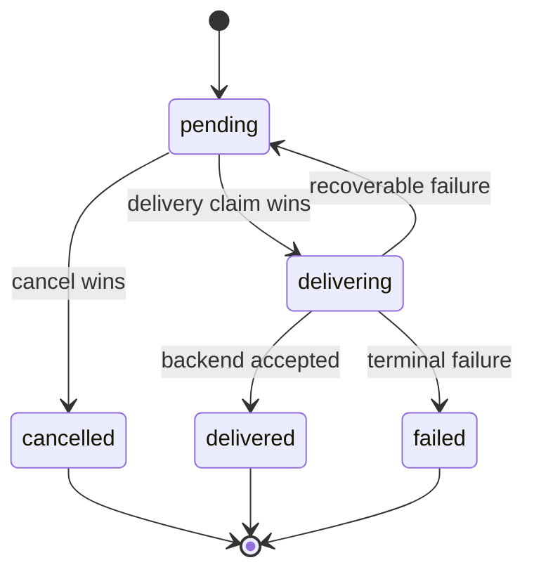
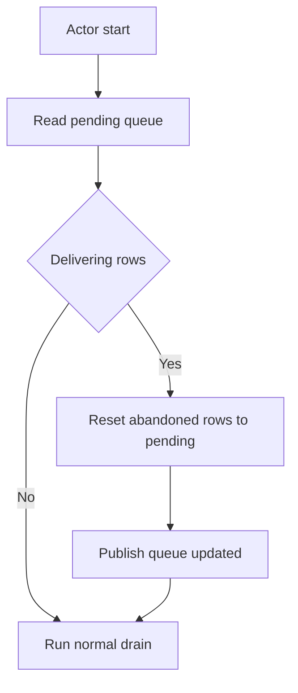

# Design Document

## Overview

**Purpose**: This feature makes follow-up messages sent during a running conversation reliable across backends. Command Center accepts the message into a durable per-conversation queue, shows it as pending until the agent can receive it, delivers it in-turn for backends that support that behavior, and otherwise drains it automatically as the next turn.

**Users**: Users interacting with active conversations can add context without waiting for the current turn to finish. The behavior is capability-aware so Claude can still receive live input while Codex receives the message as the next turn.

**Impact**: The current runtime-only queue path is replaced by a durable queue, explicit delivery lifecycle, pending-message display projection, and cancellation API. JSONL transcripts remain the delivered conversation history; pending queue entries are rendered in the conversation view until delivery is confirmed or cancelled.

### Goals
- Accepted queued messages are durable until delivery is confirmed or they reach a visible terminal state (1.2, 4.1, 4.2).
- Backend delivery timing is deterministic: live in-turn when supported, automatic next-turn drain otherwise (2.1, 2.2, 2.3).
- Pending, cancelled, failed, and delivered queued-message states are visible and never duplicate transcript rows (1.3, 4.4, 7.1, 7.2, 7.3, 9.2).
- Multiple pending next-turn messages are coalesced in enqueue order into one drained turn (3.1, 3.2).
- Image content is preserved in the queue and delivered through the existing image handling path (8.1, 8.2, 8.3).

### Non-Goals
- Editing queued messages after acceptance.
- A rich queued-message management UI beyond the cancellation affordance needed for 9.1 and 9.2.
- Queuing into managed workflow conversations or graph-workflow turn orchestration (10.1, 10.2).
- Replacing transcript persistence or broad transcript rendering. This spec only adds the pending queue projection and avoids duplicate delivered transcript entries.
- Reworking the background-task auto-continuation engine beyond the minimal `EXTERNAL_TURN_STARTED` transition widening needed for live Claude delivery.

## Boundary Commitments

### This Spec Owns
- The durable `ConversationState.pendingQueue` schema, status lifecycle, recovery semantics, and queue service operations.
- Queue API contracts for enqueue and cancellation, including typed errors and SSE events.
- Pending-message display semantics: queued entries are visible from durable state before transcript delivery and are removed or updated by queue status.
- Delivery ownership for queued messages:
  - The queue service owns pending and terminal queue state.
  - The conversation actor owns turning a claimed queue batch into a `SUBMIT_PROMPT`.
  - The transcript module remains the only writer of delivered JSONL transcript entries.
- Transcript de-duplication for queued messages: enqueue never writes a JSONL user transcript entry; delivered queued turns write exactly one user transcript entry.
- Capability descriptor shape and backend values for queue behavior.

### Out of Boundary
- Storage internals for already-delivered transcript entries.
- Image capture UI and image-file storage internals. Queued images reuse the existing `ImagePayload` and turn-start image persistence path.
- Collaboration, graph workflow, planner, validator, and iteration conversations.
- A general retry scheduler that runs without a conversation actor. Queued messages recover when the conversation actor is started or when the queue API touches a conversation with no live actor.
- Backward compatibility adapters for old queue APIs. Existing clients in this repo are updated directly.

### Allowed Dependencies
- `src/lib/state-store` serialized writes through conversation-scoped mutations or focused setters.
- `src/lib/conversations/service` for conversation reads and existing conversation mutation helpers.
- `src/lib/prompt/transcript.ts` for JSONL append and `message-appended` broadcasts.
- `src/lib/workflows/conversation` machine, manager, runtime-state, and actor implementation injection patterns.
- `src/lib/agent-backends/conversation.ts` runtime contracts and existing backend runtime implementations.
- Existing SSE broadcaster and `NotificationListener` cache update patterns.
- Existing image request schemas and turn-start image persistence.

Dependency direction is:

`schemas -> state-store/conversation service -> queue service -> backend runtimes -> conversation machine/manager -> route handlers -> client hooks/store/components`

No lower layer imports route handlers, React hooks, or UI components.

### Revalidation Triggers
- Any change to pending queue schema, status values, recovery rules, or queue event payloads.
- Any change to the definition of delivery confirmation.
- Any change to `SUBMIT_PROMPT` queued-delivery metadata or backend acceptance events.
- Any change to transcript ownership rules for queued messages.
- Any change to cancellation semantics or API status codes.
- Any change that makes queued user messages rely on SDK auto-continuation instead of explicit queue delivery.

## Architecture

### Existing Architecture Analysis
- `use-prompt-submission.ts` currently routes sends during `sending` into `use-send-prompt.ts:queue()`, which posts text only and clears `sending` on queue failure through `failPrompt`.
- `prompt/queue.ts` currently appends a JSONL user transcript entry before delivery, then calls `runtime.queueUserInput()`. That produces orphan or duplicate transcript rows when delivery fails or when a deferred turn later uses normal prompt execution.
- `queue-route-handlers.ts` only accepts text, only gates on `conversation.status === "running"`, and has no cancellation endpoint.
- The conversation machine accepts `SUBMIT_PROMPT` in `idle` and debug substates, and `EXTERNAL_TURN_STARTED` only from `idle`.
- `executePromptForMachine()` appends the normal user transcript entry before backend runtime dispatch. Queued turns need explicit metadata so this path can append exactly once at the queued-delivery confirmation point.
- `NotificationListener` already applies `message-appended` and `message-updated` events to the message query cache. Queue events will follow the same SSE validation and cache invalidation style.

### Architecture Pattern & Boundary Map



**Architecture Integration**
- **Selected pattern**: Durable command queue with actor-driven drain. The queue is the source of truth before delivery; transcript JSONL is the delivered history after confirmation.
- **Domain boundaries**: Enqueue/cancel are route + queue service concerns. Delivery is conversation actor + backend runtime concern. Rendering is a projection of transcript messages plus durable pending queue entries.
- **Existing patterns preserved**: Zod schemas, state-store serialized writes, XState `.provide()` actions, setter/factory dependency injection, and SSE broadcaster events.
- **New components rationale**: A queue service is required for state lifecycle and recovery. A queue event contract is required because pending queue entries are not JSONL transcript entries. A queued-delivery metadata contract is required to prevent duplicate transcript writes.
- **Steering compliance**: No parallel orchestrator is introduced; the conversation actor remains the single turn orchestrator.

### Technology Stack

| Layer | Choice / Version | Role in Feature | Notes |
|-------|------------------|-----------------|-------|
| Frontend | React 19, Zustand/Immer, TanStack Query | Queue affordance, pending projection, cancellation action | Reuses session store and NotificationListener |
| Backend | Next.js 16 route handlers, TypeScript strict | Enqueue/cancel APIs and typed errors | Route shells remain thin |
| Data | SQLite via `command-center.db`, state-store write queue | Durable pending queue on `ConversationState` | No new database dependency |
| Messaging | Existing SSE broadcaster | Queue created/updated events plus transcript events | Queue events are distinct from `message-appended` |
| Runtime | XState v5 conversation machine, backend runtime abstraction | Actor-driven drain and in-turn delivery | Uses `.provide()` actions and actor `self` dispatch |

## File Structure Plan

### Directory Structure

```
src/lib/conversations/
├── message-queue-schemas.ts
├── message-queue-service.ts
├── message-queue-service.test.ts
└── schemas.ts

src/lib/agent-backends/
├── capabilities-descriptor.ts
└── capabilities-descriptor.test.ts

src/lib/prompt/
├── queue.ts
├── queue.test.ts
├── queue-route-handlers.ts
├── queue-route.test.ts
└── schemas.ts

src/lib/workflows/conversation/
├── machine.ts
├── machine.test.ts
├── manager.ts
├── manager.test.ts
├── types.ts
├── actor-implementations.ts
└── actor-implementations.test.ts

src/components/
└── NotificationListener.tsx

src/hooks/
└── use-send-prompt.ts

src/features/session/
├── hooks/use-prompt-submission.ts
├── hooks/use-display-messages.ts
└── prompt/PromptComposer.tsx

src/stores/
└── session-detail.store.ts
```

### Modified Files
- `src/lib/conversations/schemas.ts` - add `pendingQueue` to `conversationStateSchema`; add `messageQueueUpdatedEventSchema`; expand `messageQueuedEventSchema` to carry a queued message view.
- `src/lib/conversations/message-queue-schemas.ts` - new Zod schemas and derived types for queue entries, queue views, queue status, queue errors, and delivery attempt metadata.
- `src/lib/conversations/message-queue-service.ts` - new durable queue service: enqueue, list active entries, claim delivery batches, confirm delivery, mark failed, cancel, recover abandoned deliveries, coalesce content.
- `src/lib/agent-backends/capabilities-descriptor.ts` - new static backend capability map for client/server queue behavior.
- `src/lib/agent-backends/types.ts` - extend `ConversationBackendCapabilities` only if the descriptor needs separate `queueDelivery` detail beyond existing `queueWhileRunning`.
- `src/lib/agent-backends/conversation.ts` - add backend acceptance event support for queued delivery confirmation.
- `src/lib/agent-backends/claude/conversation-runtime.ts` - source capabilities from descriptor; guard live `queueUserInput`; emit or resolve acceptance before queue rows are marked delivered.
- `src/lib/agent-backends/codex/conversation-runtime.ts` - source capabilities from descriptor; no `queueUserInput`; emit backend acceptance for normal `sendTurn` dispatch.
- `src/lib/prompt/schemas.ts` - add queue request and cancellation request schemas with optional images and empty-content validation.
- `src/lib/prompt/queue.ts` - replace transcript-first behavior with durable enqueue, optional live delivery, and queue events.
- `src/lib/prompt/queue-route-handlers.ts` - add POST enqueue and DELETE cancel handlers; interactive-only gating; typed status codes.
- `src/app/api/projects/[name]/sessions/[session]/conversations/[conversationId]/queue/[messageId]/route.ts` - thin route shell exporting DELETE handler.
- `src/lib/api/sse-events.ts` - include queue-created and queue-updated events in the SSE union.
- `src/lib/workflows/primitives/session-status-bus.ts` - classify queue-created and queue-updated events under conversation scope.
- `src/lib/workflows/conversation/types.ts` - add queued delivery metadata to `SUBMIT_PROMPT`, `ConversationTurnActive`, and `ExecutePromptInput`.
- `src/lib/workflows/conversation/machine.ts` - add a provided `drainPendingQueue` action in settled user-submit states; accept `EXTERNAL_TURN_STARTED` in `finalizingTurn`.
- `src/lib/workflows/conversation/manager.ts` - provide the drain action using actor `self`; recover abandoned deliveries before starting an actor from persisted state; expose or reuse actor-presence checks for route recovery.
- `src/lib/workflows/conversation/actor-implementations.ts` - support queued delivery confirmation and transcript append policy for queued turns.
- `src/hooks/use-send-prompt.ts` - forward images to queue; track accepted queue id; rollback only the failed queued item and preserve `sending`.
- `src/features/session/hooks/use-prompt-submission.ts` - pass serialized images to queue and use backend capability to decide unavailable vs in-turn vs next-turn behavior.
- `src/features/session/hooks/use-display-messages.ts` - merge transcript messages, active pending queue entries, and current optimistic queue state into one display projection.
- `src/features/session/prompt/PromptComposer.tsx` - show capability-aware action label and cancellation affordance for pending queued entries.
- `src/stores/session-detail.store.ts` - add queue-specific optimistic, accepted, failed, cancelled, and rollback actions that do not mutate `sending`.
- `src/components/NotificationListener.tsx` - handle `message-queued` and `message-queue-updated` events by updating/invalidation of conversation/session caches.

## System Flows

### Enqueue, Pending Display, and Delivery

```mermaid
sequenceDiagram
    participant User
    participant Client
    participant Route
    participant Queue
    participant Actor
    participant Runtime
    participant Transcript
    User->>Client: Submit while running
    Client->>Route: POST queue text images
    Route->>Queue: enqueue pending
    Queue-->>Client: queued id status
    Queue-->>Client: message queued event
    alt backend supports in turn
        Route->>Runtime: queueUserInput
        Runtime-->>Route: accepted
        Route->>Transcript: append delivered user entry
        Route->>Queue: mark delivered
    else next turn
        Actor->>Queue: claim pending batch
        Queue-->>Actor: delivery attempt batch
        Actor->>Actor: send SUBMIT_PROMPT queuedDelivery
        Actor->>Runtime: sendTurn
        Runtime-->>Actor: input accepted
        Actor->>Transcript: append one coalesced user entry
        Actor->>Queue: mark delivered
    end
```

Key decisions:
- Enqueue never writes JSONL transcript.
- Pending queue entries are displayed from durable queue state and queue SSE events.
- A queued entry is marked `delivered` only after the backend confirms the input was accepted.
- If acceptance does not happen, no delivered transcript entry is written for that queue entry.

### Cancellation Race



The state-store write queue serializes cancellation and delivery claims. If cancellation commits first, the entry is excluded from future drains. If delivery claim commits first, cancellation returns a conflict because delivery may already be visible to the agent.

### Abandoned Delivery Recovery



Recovery runs before a conversation actor starts from persisted state. In-process delivery failures are handled by the active drain path; abandoned `delivering` rows are those left behind when no live actor can still own the attempt.

## Requirements Traceability

| Requirement | Summary | Components | Interfaces | Flows |
|-------------|---------|------------|------------|-------|
| 1.1 | Accept queue while running | queue route, queue service, client hook | POST queue | Enqueue |
| 1.2 | Durable queue survives delay, failure, restart | queue schema, queue service, recovery | State | Recovery |
| 1.3 | Pending display | pending queue projection, queue events, store | Event, State | Enqueue |
| 1.4 | Idle conversation uses normal prompt | queue route, use-prompt-submission | API error 409 | Enqueue |
| 2.1 | In-turn delivery where supported | capabilities descriptor, Claude runtime, prompt queue | Backend service | Enqueue |
| 2.2 | Next-turn delivery where needed | drain action, queue service, conversation actor | Event, State | Delivery |
| 2.3 | Auto-start next turn | drain action, actor self dispatch | Event | Delivery |
| 2.4 | Agent response persisted/displayed | actor implementations, transcript, NotificationListener | Event | Delivery |
| 3.1 | Preserve order while coalescing | queue service | Service | Delivery |
| 3.2 | Deliver coalesced entries as one turn | drain action, queuedDelivery metadata | Event | Delivery |
| 4.1 | Queue is source of truth until confirmed | queue service, backend acceptance event | State, Event | Delivery |
| 4.2 | Failed delivery retained or failed visibly | queue service, route/client error handling | State, Event | Recovery |
| 4.3 | Queue/turn-end race safe | state-store serialized writes, drain claim | State | Delivery |
| 4.4 | Not shown answered until delivered | pending projection, queue statuses | State | Enqueue |
| 5.1 | Queue errors surfaced | route handlers, client store | API | Enqueue |
| 5.2 | Running state preserved on queue failure | client store queue failure action | State | Enqueue |
| 5.3 | Failed queue not left accepted | client rollback and queue events | State, Event | Enqueue |
| 5.4 | Unsupported backend reason | descriptor, route typed errors, composer | API | Enqueue |
| 6.1 | Composer indicates timing | descriptor, PromptComposer | State | Enqueue |
| 6.2 | Unavailable queue is not offered silently | descriptor, PromptComposer, route | API, State | Enqueue |
| 6.3 | Behavior based on active backend | descriptor, active conversation | State | Enqueue |
| 7.1 | Queued message appears in processing order | display projection, coalesce order | State | Enqueue |
| 7.2 | Undelivered message not left as awaiting response | transcript ownership, queue failure/cancel status | State, Event | Delivery |
| 7.3 | Display exactly once | no enqueue transcript append, display projection de-dup | State, Event | Delivery |
| 8.1 | Queue images with text | queue request schema, queue service | API, State | Enqueue |
| 8.2 | Deliver images with text | queuedDelivery metadata, existing image handling | Event | Delivery |
| 8.3 | Image queue failure visible | route schema, client rollback | API | Enqueue |
| 9.1 | Cancel undelivered | DELETE queue item, queue service | API, State | Cancellation |
| 9.2 | Cancel removes pending display and prevents delivery | queue service, queue updated event, display projection | Event, State | Cancellation |
| 9.3 | Delivered cannot be cancelled | queue service transition guard, route 409 | API, State | Cancellation |
| 10.1 | Reject managed workflow queue attempts | queue route role gate | API | Enqueue |
| 10.2 | Queue applies only to user-interactive conversations | route gate, client affordance | API, State | Enqueue |

## Components and Interfaces

| Component | Domain/Layer | Intent | Req Coverage | Key Dependencies | Contracts |
|-----------|--------------|--------|--------------|------------------|-----------|
| queue schemas | conversations | Define durable queue and event types | 1.2, 1.3, 4.1, 7.3, 9.2 | Zod P0 | State, Event |
| queue service | conversations | Own queue lifecycle, recovery, coalescing | 1.2, 3.1, 3.2, 4.1, 4.2, 4.3, 9.1, 9.2, 9.3 | state-store P0 | Service, State |
| capability descriptor | agent-backends | Static queue capability source | 2.1, 2.2, 5.4, 6.1, 6.2, 6.3 | shared schemas P0 | Service |
| prompt queue service | prompt | Enqueue and optional live delivery | 1.1, 2.1, 4.1, 5.1, 8.1 | queue service P0, runtime P1 | Service |
| queue route handlers | prompt route | POST enqueue and DELETE cancel APIs | 1.1, 1.4, 5.1, 5.4, 8.3, 9.1, 10.1 | queue service P0 | API |
| drain action | conversation runtime | Claim pending entries and start queued turns | 2.2, 2.3, 3.2, 4.3 | queue service P0, actor self P0 | Event, State |
| queued delivery actor support | conversation runtime | Confirm delivery and append transcript exactly once | 2.4, 4.1, 7.2, 7.3, 8.2 | backend runtime P0, transcript P0 | Event, State |
| queue display projection | UI | Merge transcript, pending queue, optimistic queue entries | 1.3, 4.4, 7.1, 7.3, 9.2 | session store P0 | State |
| NotificationListener queue handling | UI infrastructure | Apply queue SSE events to caches | 1.3, 5.3, 9.2 | TanStack Query P0 | Event |

### Domain and Service

#### queue schemas

| Field | Detail |
|-------|--------|
| Intent | Define the queue state, view, and event contracts |
| Requirements | 1.2, 1.3, 4.1, 7.3, 9.2 |

**Responsibilities and Constraints**
- `PendingQueuedMessage` is persisted in `ConversationState.pendingQueue`.
- `QueuedMessageView` is the client-safe projection for pending display and events.
- Schemas are Zod-first; TypeScript types are derived through `z.infer`.
- Image blocks may include base64 data while pending. This is bounded by the queue request image limit and terminal pruning.

**Contracts**: State [x] / Event [x]

##### State Management
```typescript
type PendingQueuedMessageStatus =
  | "pending"
  | "delivering"
  | "delivered"
  | "failed"
  | "cancelled";

interface PendingQueuedMessage {
  id: string;
  content: MessageContentBlock[];
  status: PendingQueuedMessageStatus;
  enqueuedAt: string;
  updatedAt: string;
  deliveryStartedAt: string | null;
  deliveredAt: string | null;
  cancelledAt: string | null;
  failedAt: string | null;
  deliveryAttemptId: string | null;
  attemptCount: number;
  error: string | null;
}
```

##### Event Contract
- `message-queued`: published after durable enqueue. Carries `QueuedMessageView`.
- `message-queue-updated`: published on `delivering`, `delivered`, `failed`, `cancelled`, and recovery to `pending`.
- Queue events do not imply JSONL transcript append.

#### queue service

| Field | Detail |
|-------|--------|
| Intent | Own durable queue lifecycle, atomic delivery claims, recovery, and coalescing |
| Requirements | 1.2, 3.1, 3.2, 4.1, 4.2, 4.3, 9.1, 9.2, 9.3 |

**Responsibilities and Constraints**
- All status transitions are serialized through state-store writes.
- `claimNextTurnBatch` atomically selects all `pending` rows in enqueue order, marks them `delivering`, assigns one `deliveryAttemptId`, and returns the claimed batch.
- `recoverAbandonedDeliveries` resets `delivering` rows to `pending` only during actor startup, process recovery, or a route request that has verified no live actor owns the conversation.
- `cancel` succeeds only for `pending`; it fails for `delivering`, `delivered`, `failed`, or `cancelled`.
- `coalesceContent` is pure and order-preserving.

**Contracts**: Service [x] / State [x] / Event [x]

##### Service Interface
```typescript
interface ConversationKey {
  projectPath: string;
  sessionName: string;
  conversationId: string;
}

interface EnqueueQueuedMessageInput extends ConversationKey {
  content: MessageContentBlock[];
}

interface ClaimedQueuedBatch {
  deliveryAttemptId: string;
  messageIds: string[];
  content: MessageContentBlock[];
}

interface MessageQueueService {
  enqueue(input: EnqueueQueuedMessageInput): Promise<PendingQueuedMessage>;
  listActive(input: ConversationKey): Promise<PendingQueuedMessage[]>;
  claimLiveDelivery(input: ConversationKey & { id: string }): Promise<PendingQueuedMessage | null>;
  claimNextTurnBatch(input: ConversationKey): Promise<ClaimedQueuedBatch | null>;
  markDelivered(input: ConversationKey & { ids: string[]; deliveryAttemptId: string }): Promise<void>;
  markPending(input: ConversationKey & { ids: string[]; deliveryAttemptId: string; error: string }): Promise<void>;
  markFailed(input: ConversationKey & { ids: string[]; deliveryAttemptId: string; error: string }): Promise<void>;
  cancel(input: ConversationKey & { id: string }): Promise<"cancelled" | "not_found" | "not_cancellable">;
  recoverAbandonedDeliveries(input: ConversationKey): Promise<number>;
  coalesceContent(entries: readonly PendingQueuedMessage[]): MessageContentBlock[];
}
```

- Preconditions: conversation exists and is user-interactive when called from route or actor.
- Postconditions: every successful mutation persists before the method resolves and publishes the matching queue SSE event.
- Invariants: terminal statuses are not claimable; only `pending` entries are cancellable; `deliveryAttemptId` must match when marking delivery result.

#### capability descriptor

| Field | Detail |
|-------|--------|
| Intent | Provide a client-safe static source of queue behavior per backend |
| Requirements | 2.1, 2.2, 5.4, 6.1, 6.2, 6.3 |

**Contracts**: Service [x]

```typescript
interface QueueCapability {
  acceptsWhileRunning: boolean;
  deliveryTiming: "in_turn" | "next_turn";
}

function queueCapabilityForBackend(backend: AgentBackendId): QueueCapability;
function backendCapabilities(backend: AgentBackendId): ConversationBackendCapabilities;
```

Claude returns `acceptsWhileRunning: true` and `deliveryTiming: "in_turn"`. Codex returns `acceptsWhileRunning: true` from the product perspective because Command Center can accept and defer the message, with `deliveryTiming: "next_turn"`. A future backend may return unavailable and the route maps that to `UNSUPPORTED_BACKEND`.

### Runtime

#### drain action

| Field | Detail |
|-------|--------|
| Intent | Dispatch queued next-turn work from the conversation actor at settled points |
| Requirements | 2.2, 2.3, 3.2, 4.3 |

**Responsibilities and Constraints**
- The machine declares a `drainPendingQueue` action stub. `manager.ts` provides it.
- The provided action starts async work and uses actor `self` to send one `SUBMIT_PROMPT` with `queuedDelivery` metadata after `claimNextTurnBatch`.
- No async guard is used. Guards remain pure and synchronous.
- If the actor is no longer in a state that can accept `SUBMIT_PROMPT`, the action returns the claimed rows to `pending`.
- The action no-ops for workflow roles and for empty queues.

**Contracts**: Event [x] / State [x]

##### Event Contract
```typescript
interface QueuedDeliveryMetadata {
  messageIds: string[];
  deliveryAttemptId: string;
}
```

`SUBMIT_PROMPT` gains optional `queuedDelivery?: QueuedDeliveryMetadata`. The generated `streamId` for auto-drained turns is internal because no HTTP prompt stream is attached; transcript and queue SSE events keep the UI updated.

#### queued delivery actor support

| Field | Detail |
|-------|--------|
| Intent | Confirm queued delivery, append transcript once, and update queue status |
| Requirements | 2.4, 4.1, 4.2, 7.2, 7.3, 8.2 |

**Responsibilities and Constraints**
- Normal user prompts keep the current transcript append behavior.
- Queued turns use a queued transcript policy:
  - Build the same user transcript blocks, including image refs, but do not append during enqueue.
  - Append exactly one coalesced user transcript entry when backend acceptance is confirmed.
  - Mark the claimed queue ids `delivered` only after that append succeeds.
  - If backend acceptance fails, mark claimed rows back to `pending` for recoverable failures or `failed` for terminal failures.
- `ConversationBackendEvent` gains an acceptance event emitted before any assistant content for queued turns.
- `finalizingTurn` accepts `EXTERNAL_TURN_STARTED` and routes to `externalExecuting` to preserve Claude live-delivery continuations.

**Contracts**: Event [x] / State [x]

##### Event Contract
```typescript
type ConversationBackendEvent =
  | ExistingConversationBackendEvent
  | { type: "input_accepted" };
```

Backends emit `input_accepted` after the prompt has been handed to the provider process or live session and before visible assistant content is processed. `queueUserInput` resolves only after live input acceptance.

### Route and Client

#### queue route handlers

| Field | Detail |
|-------|--------|
| Intent | Validate queue requests, enforce boundaries, and expose cancellation |
| Requirements | 1.1, 1.4, 5.1, 5.4, 8.1, 8.3, 9.1, 9.3, 10.1, 10.2 |

**Contracts**: API [x]

##### API Contract
| Method | Endpoint | Request | Response | Errors |
|--------|----------|---------|----------|--------|
| POST | `/api/projects/[name]/sessions/[session]/conversations/[conversationId]/queue` | `{ text?: string; images?: ImagePayload[] }` | `{ queued: true; message: QueuedMessageView; deliveryTiming: "in_turn" | "next_turn" }` | 400, 403, 409, 422, 500 |
| DELETE | `/api/projects/[name]/sessions/[session]/conversations/[conversationId]/queue/[messageId]` | none | `{ cancelled: true; id: string }` | 403, 404, 409, 500 |

Error codes:
- `EMPTY_MESSAGE` for no text and no images.
- `NOT_RUNNING` when the conversation is not running.
- `NON_INTERACTIVE_CONVERSATION` for workflow roles.
- `UNSUPPORTED_BACKEND` when the backend cannot accept or defer queued messages.
- `NOT_CANCELLABLE` when the item is already delivering, delivered, failed, or cancelled.

Before DELETE evaluates queue state, the handler checks for a live conversation actor. If none exists, it invokes `recoverAbandonedDeliveries` so a post-restart stale `delivering` row can become cancellable again.

#### queue display projection

| Field | Detail |
|-------|--------|
| Intent | Display pending queue entries exactly once with transcript messages |
| Requirements | 1.3, 4.4, 7.1, 7.2, 7.3, 9.2 |

**Contracts**: State [x] / Event [x]

**Responsibilities and Constraints**
- `use-display-messages.ts` receives transcript messages and active conversation state.
- It appends active queue views after the current in-flight assistant message and before any later delivered transcript entries according to enqueue order.
- It removes queue views with `delivered` or `cancelled` status once the corresponding event or conversation state update is observed.
- It never duplicates a queued entry that has a delivered JSONL transcript message.
- Queue failure rollback removes only the queued optimistic entry and does not clear `sending`.

#### NotificationListener queue handling

| Field | Detail |
|-------|--------|
| Intent | Keep client state current for pending queue events |
| Requirements | 1.3, 5.3, 9.2 |

**Contracts**: Event [x]

Queue events update or invalidate:
- `sessionKeys.detail(projectName, sessionName)` so `ConversationState.pendingQueue` refreshes.
- `conversationKeys.active()` for cross-session running views.
- `conversationKeys.messages(...)` only when delivery generates `message-appended`; queue pending events do not fabricate transcript cache rows.

## Data Models

### Domain Model
- Aggregate root: `ConversationState`.
- Entity: `PendingQueuedMessage`.
- Value object: `QueuedDeliveryMetadata`.
- Domain events: `message-queued`, `message-queue-updated`, `message-appended`.
- Business rules:
  - The queue is authoritative until delivery confirmation.
  - JSONL transcript is authoritative after delivery confirmation.
  - Cancellation is serialized against delivery claim.
  - Coalescing preserves enqueue order and emits one queued turn.

### Logical Data Model
- `ConversationState.pendingQueue` is an array of `PendingQueuedMessage`, default `[]`.
- Active rows are `pending` and `delivering`.
- Terminal rows are `delivered`, `cancelled`, and `failed`.
- Terminal rows may be pruned after they have been observed by clients and are no longer needed for reconciliation.
- `enqueuedAt` plus array order defines processing order. Array order wins if timestamps tie.
- `deliveryAttemptId` prevents stale failure handlers from mutating a newer attempt.

### Data Contracts and Integration
- Queue API request bodies use JSON and Zod validation.
- Queue events are SSE payloads validated client-side.
- Pending display data comes from `ConversationState.pendingQueue` plus queue SSE events, not transcript JSONL.

## Error Handling

### Error Strategy
- **Validation errors**: route returns 400 with typed code and does not mutate queue state.
- **Boundary errors**: non-running or non-interactive conversations return 409 or 403 before enqueue.
- **Unsupported backend**: route returns 422 with `UNSUPPORTED_BACKEND`.
- **Live delivery failure**: row remains `pending`; client still sees queued next-turn behavior.
- **Drain dispatch failure before backend acceptance**: row returns to `pending` with error metadata.
- **Terminal delivery failure**: row becomes `failed`, emits `message-queue-updated`, and remains visible as failed until user action or pruning policy removes it.
- **Cancellation race**: serialized write winner decides result; conflict is visible and does not silently drop the message.

### Monitoring
- `createLogger("message-queue")` records `queue.enqueue`, `queue.live_delivery`, `queue.claim`, `queue.accepted`, `queue.failed`, `queue.cancelled`, `queue.recovered`, and `queue.pruned`.
- Log fields include `projectName`, `sessionName`, `conversationId`, `messageIds`, `deliveryAttemptId`, `status`, `attemptCount`, and `error` where applicable.
- Drain timing should use existing `timed()` conventions when queue operations cross the configured timing threshold.

## Testing Strategy

### Unit Tests
- `message-queue-service.test.ts`: enqueue persists `pending` rows and validates status transition invariants (1.2, 4.1).
- `message-queue-service.test.ts`: `claimNextTurnBatch` coalesces all pending entries in array order and excludes cancelled/failed/delivered rows (3.1, 3.2, 9.2).
- `message-queue-service.test.ts`: cancellation succeeds for `pending` and fails for `delivering`/`delivered` (9.1, 9.3).
- `message-queue-service.test.ts`: `recoverAbandonedDeliveries` resets `delivering` rows to `pending` and emits update views (1.2, 4.2).
- `capabilities-descriptor.test.ts`: Claude maps to in-turn delivery and Codex maps to next-turn delivery (2.1, 2.2, 6.1).

### Integration Tests
- `queue-route.test.ts`: POST accepts text-only, image-only, and text+image messages; rejects empty payloads (8.1, 8.3).
- `queue-route.test.ts`: POST rejects managed workflow conversations and not-running conversations with typed errors (1.4, 10.1).
- `queue-route.test.ts`: DELETE cancels pending rows and returns conflict for non-cancellable rows (9.1, 9.3).
- `actor-implementations.test.ts`: queued delivery appends exactly one user transcript entry after backend acceptance and marks queue rows delivered (4.1, 7.3).
- `actor-implementations.test.ts`: backend acceptance failure before transcript append returns rows to `pending` and does not append a user transcript entry (4.2, 7.2).
- `machine.test.ts`: settled drain dispatches one `SUBMIT_PROMPT` with queuedDelivery metadata and accepts `EXTERNAL_TURN_STARTED` in `finalizingTurn` (2.3, 4.3).

### E2E and UI Tests
- Codex running turn: user queues two messages, both appear pending in order, current turn finishes, one next turn starts, one coalesced user transcript entry appears, and pending entries disappear (1.3, 2.3, 3.2, 7.3).
- Claude running turn: queue is accepted, live delivery confirms, pending entry transitions to delivered, and the agent response appears in the current turn (2.1, 2.4).
- Queue failure: optimistic queued item is removed, error is surfaced, and the running indicator remains running (5.1, 5.2, 5.3).
- Cancel pending queued message: pending row disappears and is not included in the next drained turn (9.1, 9.2).
- Queue image message: pending display shows the queued message, delivery sends images through existing image handling, and failure surfaces instead of dropping images (8.1, 8.2, 8.3).

## Performance and Scalability
- Queue state is embedded in each conversation row and bounded by terminal pruning.
- Image payloads may live briefly in SQLite while pending; the existing image limit bounds this risk.
- Queue writes use the serialized write queue and conversation-scoped mutations.
- Drain runs only at actor settled points and atomically claims work, so duplicate drains are prevented by status transitions.

## Migration Strategy
- `conversationStateSchema.pendingQueue.default([])` migrates existing conversations without a data backfill.
- Existing JSONL transcript files are not rewritten.
- Existing `message-queued` SSE consumers are updated in this repo to the expanded schema; no backward compatibility shim is added.
- Existing generated tasks must be regenerated after this design because queue ownership, cancellation, and transcript timing changed.
