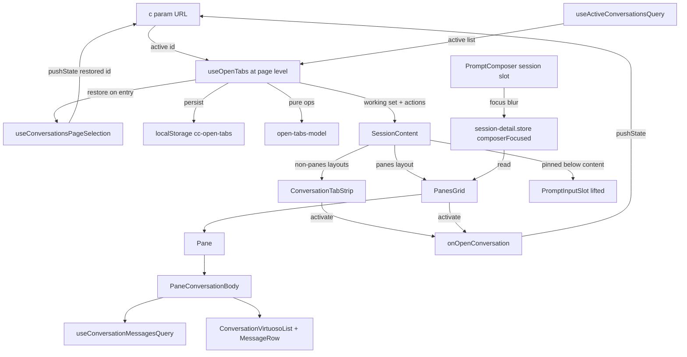
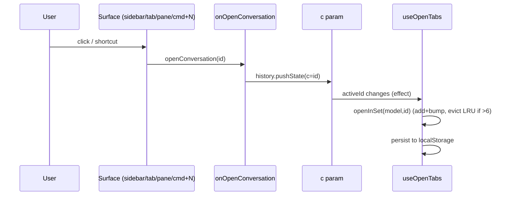
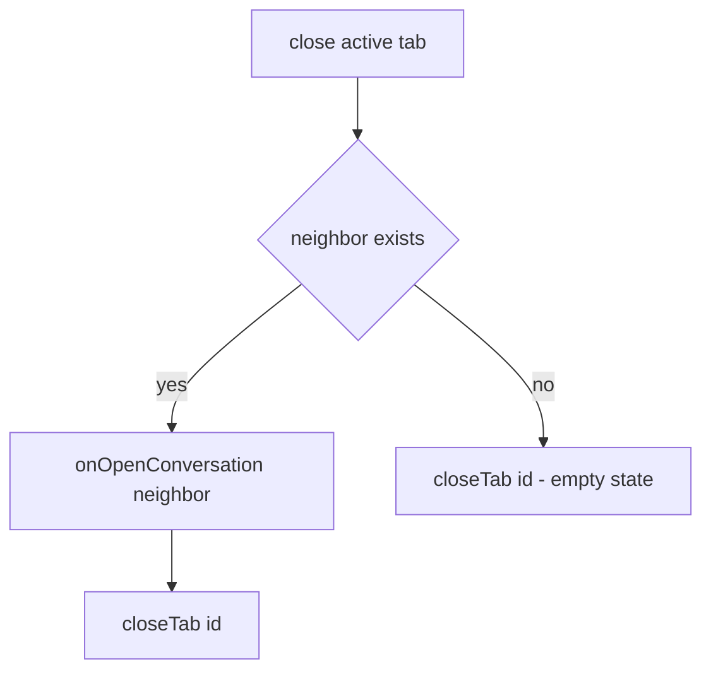

# Design Document

## Overview

**Purpose**: Add two multi-conversation surfaces to the `/conversations` page — a browser-style **tab strip** and a **panes (split-screen) layout** — so operators can juggle and watch several active conversations without leaving the page.

**Users**: Command Center operators running multiple agents across projects/sessions, for whom the cost of switching and watching conversations is the bottleneck.

**Impact**: Today the page shows exactly one conversation, selected via the `?c=` URL param. This feature introduces a persisted **working set** of open conversations that backs both new surfaces, and **relocates the single prompt composer** to a shared pinned slot so it serves every layout (including panes). It is additive UI over existing state and data; no server or agent-execution changes.

### Goals
- One shared working set (`openTabs`, max 6) that drives both the tab strip and the panes grid; they never diverge.
- Open-on-navigate semantics with LRU eviction at the cap; persistence across reloads (per browser).
- A panes layout that renders 2–6 interactive conversation panes, each showing its full scrollable transcript.
- A single composer, shared across all layouts, that always targets the active conversation, with an unmistakable active-destination indication in panes.

### Non-Goals
- The project-cockpit tab surface (`src/features/project-detail/cockpit/`) — untouched, not reused.
- The enriched sidebar, peek popover, row context menu, status enum, and composer control toolbar — consumed read-only.
- Sparklines, fleet ticker, sticky peek, bulk actions, saved views, per-pane composers, the prototype's 4-variant pane separator (ship only "shadow"), and any agent-execution/merge change.

## Boundary Commitments

### This Spec Owns
- The `openTabs` working-set model and its persistence: ordering, the cap of 6, LRU eviction, reconcile-against-live, and the localStorage round-trip.
- The tab strip and its components/interactions; the panes layout (grid, per-pane full transcript, panes toolbar); the active-pane indicator and composer-focus emphasis.
- The relocation of the existing composer to a shared pinned slot, and the `composerFocused` UI signal.
- The `"panes"` value added to `LayoutMode` and the panes entry in the layout switcher.
- The `⌘1–9` and panes-`Esc` keyboard handling for these surfaces.

### Out of Boundary
- Conversation status/data schemas, the messages query, the layout-switch/persist mechanism, and the composer's internal controls — used as-is, not modified beyond the explicit edits listed in the File Structure Plan.
- The sidebar, peek, context menu, and the cockpit surface.

### Allowed Dependencies
- Read: `useActiveConversationsQuery` — the **same active list the sidebar already consumes** (`.data.conversations: ActiveConversation[]`, rich: `pendingQuestion`, `lastActivitySummary`, status, scope); `useConversationMessagesQuery` (per-pane **full transcripts**, keyed by a `SessionActiveConversation`'s project + session); the shared transcript renderers `ConversationVirtuosoList` + `MessageRow` and the `buildConversationRows` / `useDisplayMessages` builders (the **same message presentation the single-conversation panel uses**); `ActiveConversation`/`SessionActiveConversation`/`TranscriptMessage` schemas; `session-detail.store` layout state. (NOT `useAllConversationsQuery`, whose `{ items: ConversationListItem[] }` shape is too thin for panes.)
- Invoke: `onOpenConversation({conversationId})` (the page's URL mutator) for all activation.
- Extend (minimal, listed): `LayoutMode` union, `validLayouts`, `LayoutSwitcher` list, `HOTKEY_REGISTRY` (`hotkeys.ts`: `activateOpenTab` + `exitPanes`), `session-detail.store` (`composerFocused` + page-level layout key), the page-level layout hydration (`use-session-lifecycle`/`ConversationsPage`), `SessionContent`/`ConversationPanelContainer` for the composer lift, and `PromptComposer` for the focus signal (the shared `PromptEditor` is **not** touched).
- Dependency direction (left → right, imports never go right→left): `schemas → open-tabs-model (pure) → use-open-tabs / store → presentational components → SessionContent (composition)`.

### Revalidation Triggers
- `ActiveConversation` field renames/removals (tab + pane view-models read them).
- `onOpenConversation` signature or the `?c=` selection contract changing.
- `useConversationMessagesQuery` signature/return changing.
- `LayoutMode` / `validLayouts` / layout-persistence contract changing.
- The composer's mount contract (`promptInputSlot`) moving again.

## Architecture

### Existing Architecture Analysis
- **Active selection is URL-only**: `?c=` → `parseConversationsPageParams` → `conversationId`; `ConversationWorkspace` is keyed on it; `useConversationsPageSelection.openConversation` is the sole mutator (`history.pushState`). `ConversationWorkspaceProps` already accepts `onOpenConversation?`.
- **Layout is CSS-grid-driven, but persisted *per active session***: `SessionContent` renders `<div className="session-content-area" data-layout={layout}>`; `session.css` sets `grid-template-columns` per layout. `switchLayout(mode, storageKey)`/`hydrateLayout` persist to `localStorage[cc-layout-${project}-${session}]`, validated by `validLayouts`. Critically, `useSessionLifecycle.ts:68` re-runs `hydrateLayout(storageKey)` whenever `storageKey` changes, and `storageKey` is built from the **active conversation's** project/session (`ConversationWorkspace.tsx:71`). Panes is a *cross-session* view, so activating a pane from another session would change `storageKey`, re-hydrate that session's saved layout, and silently drop out of panes — breaking the panes contract. → `/conversations` layout must become **page-level**, not re-hydrated on active-conversation change.
- **Composer is panel-internal**: `SessionContent` passes `promptInputSlot` into `ConversationPanelContainer` (`:155`) → `ConversationPanel`. It is keyed to the active conversation via `PromptComposer.conversationId`.
- **`PromptEditor` is shared**: reused by `PeekPopover` and the cockpit `UnifiedComposer` (not just the session composer), so a composer-focus signal must be set at the session `PromptComposer` boundary, never inside `PromptEditor`.
- **Overlays use a scope stack**: `useOverlayScope` (`src/hooks/useOverlayScope.ts`) + `useAppHotkey` (`src/hooks/useAppHotkey.ts`) are the app-wide hotkey/Escape convention (sidebar, peek, context menu register through them). New shortcuts must use this system, not a bespoke window listener.
- **Selection/auto-open is page-level**: `useConversationsPageSelection` + `conversations-page-state.ts` own `?c=` and the auto-open fallback and mount even in the empty state (when no `?c=` is present); `ConversationWorkspace` does not.

### Architecture Pattern & Boundary Map



**Key decisions**: Activation everywhere routes through `onOpenConversation` (URL mutation); the working set reacts to the URL — one unidirectional cycle. The composer is lifted to a single shared mount so panes and all other layouts share it.

### Technology Stack

| Layer | Choice / Version | Role in Feature | Notes |
|-------|------------------|-----------------|-------|
| Frontend | React 19 + TypeScript (strict) | All new components/hooks | Existing stack |
| State | Zustand (`session-detail.store`) | `composerFocused` flag; `validLayouts` | Focused selectors per PERFORMANCE.md |
| Persistence | `@react-hookz/web` `useLocalStorageValue` | `openTabs` working set | Same lib as sidebar filters (which uses the sessionStorage variant) |
| Server state | `@tanstack/react-query` | active list (`useActiveConversationsQuery`) + per-pane tails (`useConversationMessagesQuery`) | Existing queries reused (sidebar's data source) |
| Styling | CSS (DS tokens in `tokens.css`) | tab + panes CSS | `[data-status]` dots; Anybody/Manrope/Geist Mono |

## File Structure Plan

### Directory Structure (new)
```
src/features/session/
├── tabs/
│   ├── open-tabs-model.ts           # Pure working-set reducer (tabs + lru), MAX_OPEN_TABS
│   ├── open-tabs-model.test.ts      # Unit: add/bump/evict/close/reconcile
│   ├── use-open-tabs.ts             # Hook: persist + react to active id + resolve working set
│   ├── use-open-tabs.test.ts        # Persistence round-trip + reactions
│   ├── use-tab-pane-keyboard.ts     # cmd+1..9 + Esc via useAppHotkey (registry ids); overlay suppression is automatic
│   ├── ConversationTabStrip.tsx     # role=tablist; maps working set → tabs + add control
│   ├── ConversationTab.tsx          # one tab: status dot, title, hotkey hint, close
│   └── AddConversationMenu.tsx      # shared add-picker (active convos not in set) — tab "+" and panes "Add pane"
├── panes/
│   ├── grid-shape.ts                # Pure: gridShape(n)
│   ├── grid-shape.test.ts           # Unit: shapes 1..6 incl asymmetric 5
│   ├── PanesGrid.tsx                 # outer flex: toolbar row + .panes-grid (shape vars, data-composer-focused)
│   ├── PanesToolbar.tsx             # N/6 count, focus hint, Add pane, Exit
│   ├── Pane.tsx                     # pane shell: head, meta, banner/status, transcript body
│   ├── PaneConversationBody.tsx     # full scrollable transcript via the shared ConversationVirtuosoList + MessageRow (read-only)
│   └── pane-view-model.ts          # Pure: ActiveConversation → pane fields (title/status/meta)
└── (existing files modified — see below)

src/features/_root/styles/
├── conversation-tabs.css           # tab strip styles (DS tokens)
└── conversation-panes.css          # panes + pane + separator(shadow) + active ring + fade
```

### Modified Files
- `src/lib/sessions/schemas.ts` — add `"panes"` to the `LayoutMode` union.
- `src/lib/shared/hotkeys.ts` — add two `HotkeyId`s + `HOTKEY_REGISTRY` entries (`HotkeyId` is a closed union, so this is required to compile): `activateOpenTab` (`keys: "mod+1,mod+2,…,mod+9"`, `category: "navigation"`) and `exitPanes` (`keys: "Escape"`).
- `src/stores/session-detail.store.ts` — add `"panes"` to `validLayouts`; add `composerFocused: boolean` + `setComposerFocused`; export `useComposerFocused` / `useSetComposerFocused` selectors. **Layout becomes page-level for `/conversations`**: `switchLayout`/`hydrateLayout` use a single page-level key `cc-conversations-layout` (not `cc-layout-${project}-${session}`), and hydration runs once at the page, not per active-conversation. (Trade-off, confirmed with Alex: `/conversations` no longer remembers a distinct layout per conversation/session — a deliberate simplification a cross-conversation page wants.)
- `src/features/session/hooks/use-session-lifecycle.ts` / `ConversationWorkspace.tsx` — stop driving layout hydration from the per-conversation workspace (it re-hydrates on `storageKey` change → cross-session pane click drops out of panes). Hydrate once at the page level instead.
- `src/features/session/conversation/LayoutSwitcher.tsx` — add the 5th `panes` entry (2×2 inline SVG) after `split`, before `diff`.
- `src/features/session/conversation/SessionContent.tsx` — (1) render `ConversationTabStrip` above `.session-content-area` when `layout !== "panes"` and the set is non-empty; (2) when `layout === "panes"`, render `PanesGrid` full-width in place of `ConversationPanelContainer` + `RightPane`; (3) render `promptInputSlot` as a pinned sibling below `.session-content-area` (all layouts); (4) thread working-set props.
- `src/features/session/conversation/ConversationPanelContainer.tsx` — stop rendering `promptInputSlot` internally (lifted out).
- `src/features/session/prompt/use-composer-focus.ts` (new) — owns `composerFocused` per the focus model (editor focus OR active composer control; `focusout` cleared only when `relatedTarget` leaves the composer region + its overlays). Covered by `use-composer-focus.test.tsx` (one case per control path).
- `src/features/session/prompt/PromptComposer.tsx` — mount `use-composer-focus` at the **session composer boundary** (the single lifted-slot instance); do **not** modify the shared `PromptEditor` (reused by peek/cockpit). Audit the toolbar controls (`PromptDesktopToolbar` + `MobilePromptToolbar`) so in-flow triggers use `onMouseDown`→`preventDefault` and overlay/drawer controls report active-state to the focus hook (5.6).
- `src/features/session/conversations-page-state.ts` — add the pure `selectInitialConversation` precedence function (see Data Models) beside the existing `selectAutoOpenCandidate`; covered by `conversations-page-state.test.ts`.
- `src/features/session/hooks/use-conversations-page-selection.ts` + `src/features/session/ConversationsPage.tsx` — host `useOpenTabs` at the **page level** (mounted even in the empty state); pass the working set + actions down into `ConversationWorkspace`. Replace the inline auto-open branch with `selectInitialConversation(...)`, applying its `{ auto, id }` result via `history.replaceState` (never `pushState`).
- `src/features/session/ConversationWorkspace.tsx` + `useSessionPageViewProps` — thread the working-set props + `composerFocused` from the page into `SessionContent`; mount `use-tab-pane-keyboard`.
- `src/features/_root/styles/session.css` — add `.session-content-area[data-layout="panes"]` (full-width) and a pinned composer row in `.session-detail-layout`.
- `src/features/_root/styles/index.css` — import the two new CSS files.

## System Flows

**Open / activate (unidirectional):**


**Close active tab:**


## Requirements Traceability

| Requirement | Summary | Components |
|---|---|---|
| 1.1–1.2 | shared set; active = URL; restore on entry | `use-open-tabs` (page-level), `selectInitialConversation`, `useConversationsPageSelection`, `open-tabs-model` |
| 1.3–1.4 | open-on-navigate adds | `use-open-tabs` (active-id effect) |
| 1.5–1.6 | cap 6 + LRU evict | `open-tabs-model.openInSet`, `MAX_OPEN_TABS` |
| 1.7 | reconcile stale | `open-tabs-model.reconcile` (vs `useActiveConversationsQuery`) |
| 1.8–1.9 | persist per-browser; restore last-active; no cross-device | `use-open-tabs` (`useLocalStorageValue`), `selectInitialConversation` (restore precedence) |
| 2.1–2.6 | tab strip render/activate/active-mark/hover-close | `ConversationTabStrip`, `ConversationTab`, `conversation-tabs.css` |
| 2.7–2.8 | close w/o stop; close-active→neighbor | `use-open-tabs.closeTab`, `open-tabs-model` |
| 2.9–2.10, 6.2–6.3 | add control; disabled at cap | `AddConversationMenu`, `ConversationTabStrip`, `PanesToolbar` |
| 3.1 | panes in switcher (keep split) | `LayoutSwitcher`, `LayoutMode`, `validLayouts` |
| 3.2–3.4 | grid replaces split view; shapes; scroll-within-pane | `SessionContent`, `PanesGrid`, `grid-shape`, `conversation-panes.css` |
| 3.5–3.6 | exit→default; layout persists (page-level, survives cross-session activation) | `use-tab-pane-keyboard`, `PanesToolbar`, page-level layout (`cc-conversations-layout`) |
| 4.1–4.6 | pane head/meta/banner/status/full transcript | `Pane`, `PaneConversationBody` (calls `useConversationMessagesQuery` + the shared `ConversationVirtuosoList`/`MessageRow`), `pane-view-model` |
| 4.7–4.9 | open-full; close; no per-pane composer | `Pane`, `PanesGrid` |
| 5.1–5.2 | active-pane mark; click activate (stays in panes across sessions) | `Pane`, `conversation-panes.css`, page-level layout |
| 5.3–5.5 | composer-focus fade (panes only) | `use-composer-focus` (in `PromptComposer`), `session-detail.store`, `PanesGrid` (`data-composer-focused`) |
| 5.6 | sticky focus on control adjust (incl. dropdowns, drawer, mobile sheet) | `use-composer-focus`, `PromptDesktopToolbar`/`MobilePromptToolbar` (`onMouseDown` preventDefault + active-state) |
| 6.1, 6.4 | toolbar count; exit | `PanesToolbar` |
| 7.1–7.5 | single shared composer; targets active; no regression | `SessionContent` (lift), `ConversationPanelContainer`, `PromptInputSlot` (reused) |
| 8.1 | cmd+1..9 activate | `use-tab-pane-keyboard`, `HOTKEY_REGISTRY.activateOpenTab` |
| 8.2–8.3 | Esc exit panes; overlay-first | `use-tab-pane-keyboard`, `HOTKEY_REGISTRY.exitPanes`, `useAppHotkey` overlay suppression (`overlay-scope.store`) |

## Components and Interfaces

| Component | Layer | Intent | Req | Key Deps | Contracts |
|---|---|---|---|---|---|
| `open-tabs-model` | pure | working-set reducer | 1.5–1.7,2.7–2.8 | — | State |
| `use-open-tabs` | hook | persist + resolve set | 1.x,2.x | model, query, onOpen | State |
| `use-tab-pane-keyboard` | hook | shortcuts | 8.x | onOpen, setLayout | — |
| `ConversationTabStrip`/`ConversationTab` | UI | tab strip | 2.x | working set | — |
| `AddConversationMenu` | UI | add-picker | 2.9,6.2 | addable list | — |
| `PanesGrid`/`Pane`/`PaneConversationBody`/`PanesToolbar` | UI | panes | 3–6 | working set, messages, shared transcript renderers | — |
| `pane-view-model`/`grid-shape` | pure | derive + shape | 3.3,4.1–4.4 | — | — |
| `session-detail.store` (+composerFocused) | state | focus signal + layout | 5.3,3.1 | — | State |

### Core logic

#### open-tabs-model (pure)
```typescript
export const MAX_OPEN_TABS = 6;
export interface OpenTabsModel {
  readonly tabs: string[]; // stable display order
  readonly lru: string[];  // least → most recently active
}
export function emptyModel(): OpenTabsModel;
// add id (or bump if present); on growth past MAX, evict lru[0] (never the just-activated id)
export function openInSet(model: OpenTabsModel, id: string): OpenTabsModel;
export function closeTab(model: OpenTabsModel, id: string): OpenTabsModel;
export function reconcile(model: OpenTabsModel, liveIds: ReadonlySet<string>): OpenTabsModel;
```
- Invariants: `lru` and `tabs` hold the same id set; `tabs.length <= MAX_OPEN_TABS`; ordering of `tabs` is insertion-stable.
- Pure and sequence-driven (no `Date`/random) for deterministic unit tests.

#### use-open-tabs (hook)
```typescript
export interface OpenTabsApi {
  workingSet: SessionActiveConversation[];        // resolved + display-ordered
  addableConversations: SessionActiveConversation[]; // session-scoped active list minus working set
  activeId: string;
  isAtCap: boolean;
  activate(id: string): void;              // → onOpenConversation
  closeTab(id: string): void;              // remove; if active, navigate neighbor first
  addTab(id: string): void;                // explicit add (gated by isAtCap)
}
export function useOpenTabs(input: {
  activeConversationId: string;
  // session-scoped active conversations (sidebar's source); project-scoped
  // entries are excluded — they are not workspace-openable.
  activeConversations: SessionActiveConversation[];
  onOpenConversation: (t: { conversationId: string }) => void;
}): OpenTabsApi;
```
- **Lives at the page level** (`useConversationsPageSelection`/`ConversationsPage`), so it runs in the empty state and can drive restore-on-entry. `workingSet` is resolved against `useActiveConversationsQuery().data?.conversations` filtered to `scope === "session"`.
- Persists the `OpenTabsModel` via `useLocalStorageValue<OpenTabsModel>("cc-open-tabs", …)`.
- Effects: (a) when `activeConversationId` changes and is non-empty → `openInSet`; (b) when `activeConversations` changes → `reconcile` to the live id set; (c) restore-on-entry — only when `activeConversationId` is empty **and** no session-filter entry params are present, target the live `lru` tail via `replaceState` (precedence + history semantics handled in the selection hook, above) (1.2, 1.8).
- `closeTab(activeId)` computes the neighbor from `tabs`, calls `onOpenConversation(neighbor)`, then removes; closing a non-active id just removes.

#### pane-view-model + grid-shape (pure)
```typescript
export interface GridShape { cols: number; rows: number; shape: string }
export function gridShape(n: number): GridShape; // 1/2/3→row; 4→2x2; 5→6-col asym; 6→3x2

export interface PaneViewModel {
  id: string; title: string; status: ActiveConversation["status"];
  projectName: string; sessionName: string | null;
  pendingQuestion: string | null; statusLine: string | null; relativeTime: string;
}
export function toPaneViewModel(c: SessionActiveConversation): PaneViewModel;
```
The pane's transcript body itself is not a pure helper: `PaneConversationBody` fetches the conversation's messages (`useConversationMessagesQuery`), builds rows with the shared `useDisplayMessages` + `buildConversationRows`, and renders them read-only through `ConversationVirtuosoList` + `MessageRow` — no pane-specific message slicing, summarization, or truncation.

### UI (summary-only; presentational)

- **ConversationTabStrip** (`role="tablist"`): maps `workingSet` → `ConversationTab` (active = `id === activeId`), then `AddConversationMenu` trigger disabled when `isAtCap` (tooltip "Tab limit reached (6) — close a tab first"). Hidden when `layout === "panes"` or set empty. _Implementation note_: status dot via `[data-status]`; `⌘{i+1}` hint for `i < 9`; close button `stopPropagation`.
- **AddConversationMenu**: dropdown of `addableConversations` (status dot, title, project); selecting calls `onAdd`. Shared by the tab "+" and the panes toolbar.
- **PanesGrid**: an outer `.panes` flex column whose first child is `PanesToolbar` (a fixed row — **not** a grid cell) and whose second child is the `.panes-grid` element that carries `gridShape`'s `--cols`/`--rows` + `data-shape` and holds one `Pane` per conversation; `data-composer-focused={useComposerFocused()}` sits on the outer `.panes`. The shadow separator and active ring are CSS-only.
- **Pane**: head (status dot, title, open-full `↗`, close `×`), meta (status label · project / session · relative time), then the amber pending-question banner _or_ the status line, then `PaneConversationBody` — the conversation's **full** transcript (`useConversationMessagesQuery` enabled only in panes mode), rendered read-only through the shared `ConversationVirtuosoList` + `MessageRow` (no `onFork`, no trailing debug card) and scrollable within the pane. `onClick` activates when not active; close/open-full `stopPropagation`.
- **PanesToolbar**: `N / 6 panes`, focus hint, `AddConversationMenu` (disabled at cap), Exit control → `onExit` (sets layout to `default`).

### State additions
```typescript
// session-detail.store.ts
interface SessionDetailState { /* … */ composerFocused: boolean }
// actions: setComposerFocused(focused: boolean): void
export const useComposerFocused: () => boolean;
export const useSetComposerFocused: () => (focused: boolean) => void;
// validLayouts gains "panes"
```
`composerFocused` is owned by a dedicated `use-composer-focus.ts` hook mounted in the session `PromptComposer` (the single lifted-slot instance). The shared `PromptEditor` (peek, cockpit) is never wired to it, so non-session editors cannot trigger the pane fade (5.3–5.5). Because `PanesGrid` mounts only in panes mode, the flag is inert in other layouts.

#### Composer focus model (5.6 — survive control interactions)
A naive editor `onBlur` would clear `composerFocused` the moment the user clicks a model/effort dropdown or opens the capabilities/mobile sheet, flickering the pane fade. The model is therefore:

`composerFocused = editorHasFocus OR aComposerControlIsActive`

- **In-flow toolbar controls** (`BackendToggle`, `ModelSelector`, `ReasoningLevelSelector`, `DebugModeToggle`, attach, MCP, `VoiceRecordButton`): each trigger uses `onMouseDown → preventDefault` — the established repo idiom (`ImageMarkerChip.tsx:66`, `SlashCommandChip.tsx:72`) — so clicking them never blurs the editor; `editorHasFocus` stays true.
- **Overlay/focus-taking controls** (capabilities drawer `ConversationAgentCapabilitiesConfig`, `MobilePromptToolbar` sheet, or any control that genuinely moves focus): while such a control is open they contribute `aComposerControlIsActive = true`, so `composerFocused` holds even if focus leaves the editor. The hook clears the flag only on a `focusout` whose `relatedTarget` is **neither** inside the composer region **nor** inside a composer-owned overlay.
- Each control path (editor focus, each dropdown, debug toggle, voice, capabilities drawer, mobile sheet) gets a unit test asserting `composerFocused` stays true (5.6).

### Keyboard (R8) — via the existing hotkey registry
`use-tab-pane-keyboard` uses `useAppHotkey`, which only accepts registered `HotkeyId`s, so the two new ids (`activateOpenTab`, `exitPanes`) are added to `HOTKEY_REGISTRY` (see Modified Files). `activateOpenTab` binds the comma-list `mod+1…mod+9`; the callback reads `event.key` and calls `activate(workingSet[n-1])` when present. `exitPanes` binds `Escape`, is `enabled` only while `layout === "panes"`, and is **not** `enableOnFormTags`, so Escape inside the composer still falls to the existing `clearInput` hotkey and panes-exit only fires when focus is outside form fields.

Overlay gating is automatic: `useAppHotkey` disables page hotkeys whenever `useIsOverlayOpen()` (`@/stores/overlay-scope.store`) is true (unless `keepActiveInOverlay`). So while a peek popover or context menu is open, both `activateOpenTab` and `exitPanes` are suppressed — Escape closes the overlay first (R8.3) with no bespoke `defaultPrevented` logic.

## Data Models

The working set persists as `OpenTabsModel` (`{ tabs, lru }`, both `string[]` of conversation ids) under localStorage key `cc-open-tabs`. It is reconciled against the live session-scoped `SessionActiveConversation[]` (from `useActiveConversationsQuery`) on every list change; ids absent from the live list are dropped. Only session-scoped conversations enter the set, guaranteeing each tab/pane has the `projectName`+`sessionName` required by `useConversationMessagesQuery`. No server/DB schema changes. Pane content is derived (read-only) from `SessionActiveConversation` + `TranscriptMessage[]`.

**Initial-selection precedence (1.2, 1.8)** is a single pure function in `conversations-page-state.ts`, composing with the existing `selectAutoOpenCandidate`, so there is exactly one unambiguous, unit-tested ordering:

```typescript
export type InitialSelection =
  | { kind: "url" }              // ?c= present — leave the URL as-is
  | { kind: "auto"; id: string } // non-user-initiated → caller uses history.replaceState
  | { kind: "none" };            // empty state
export function selectInitialConversation(input: {
  urlConversationId: string | null;
  sessionFilter: SessionFilter | null;
  persistedLruLive: string[];          // working-set lru ∩ live session-scoped ids, least→most recent
  conversations: ActiveConversation[];
}): InitialSelection;
// Precedence (first match wins):
//  1. urlConversationId !== null                        → { url }
//  2. sessionFilter !== null                            → selectAutoOpenCandidate(conversations, sessionFilter) → auto | none
//  3. persistedLruLive.length > 0                       → { auto, id: persistedLruLive[last] }   // restore last-active (1.8)
//  4. else (first visit / empty set)                    → selectAutoOpenCandidate(conversations, null) → auto | none
```

LRU restore (step 3) deliberately beats the generic most-recent auto-open (step 4), but never overrides an explicit `?c=` or a session-filter entry. The `auto` kind signals the caller to use `replaceState`, so restore never pollutes history. The `lru` tail *is* the persisted last-active id, so no separate `activeId` field is needed.

**Layout is page-level for `/conversations`.** The selected layout (incl. `"panes"`) persists under a single key `cc-conversations-layout`, hydrated once at the page — *not* per active conversation. This keeps panes stable when activating a pane from a different session (3.5, 5.2) and is the only durable layout state for the page; per-conversation/per-session layout memory is intentionally dropped here.

## Error Handling
- **localStorage unavailable / malformed** → fall back to `emptyModel()` (try/catch around parse), mirroring `switchLayout`'s guarded write. A malformed persisted value is discarded, not thrown.
- **Active id not in live list** (deep link to archived/finished) → `reconcile` keeps it out of the set; the page's existing not-found/empty handling covers the workspace.
- **Project-scoped active conversation** (no session) → excluded from the working set and the add-picker, since it is not workspace-openable and has no session for the transcript fetch.
- **Per-pane message fetch error** → the pane shows an inline empty/error state; other panes are unaffected (independent queries).

## Testing Strategy

### Unit (pure, red-green first)
- `open-tabs-model`: add-new; add-existing bumps recency without reordering `tabs`; evict least-recently-active inactive at cap (1.6); `reconcile` drops missing (1.7); `closeTab` removes from both arrays (2.7).
- `selectInitialConversation`: each precedence branch — `?c=` wins; session-filter entry → session-scoped candidate; LRU restore beats generic auto-open; first-visit/empty falls back to most-recent; `none` when no conversations (1.2, 1.8).
- `use-composer-focus`: `composerFocused` stays true across each control path (editor focus, model/effort dropdown, debug toggle, voice, capabilities drawer, mobile sheet); clears only when focus leaves the composer region + overlays (5.6).
- `grid-shape`: shapes for n=1..6 incl. the asymmetric 5 (3.3).
- `pane-view-model`: field mapping (4.1–4.4).
- `Pane`: renders the full-transcript body (`PaneConversationBody` mounts, no compact-tail placeholder) and an empty state when the conversation has no messages (4.5).

### Integration
- `use-open-tabs`: localStorage round-trip + restore (1.8); active-id change adds/bumps (1.3); cap eviction end-to-end (1.6); close-active navigates to neighbor (2.8).

### E2E / live (Playwright + real LLM, per `cc-live-feature-test`)
- Open from sidebar → tab appears + active (1.3, 2.x); `⌘2` switches (8.1); switch to panes shows grid of the same set (3.x); click inactive pane → active ring + URL change (5.1–5.2); focus composer → inactive panes fade (5.3); close pane → removed, agent keeps running (4.8); add control disabled at 6 (2.10/6.3); Esc with peek open closes peek not panes (8.3).
- **Composer-lift regression (7.5)**: default/split/diff/conversation each render correctly with the composer pinned below content.

### Performance (per `PERFORMANCE.md`)
- react-scan a 6-pane view: confirm panes don't re-render on unrelated store/query churn (focused selectors); confirm `useConversationMessagesQuery` instances unmount (queries disabled) on exit from panes; verify no event-loop stalls from 6 concurrent fetches.

## Performance & Scalability
Panes mount up to 6 `useConversationMessagesQuery` instances, each fetching and rendering a full transcript. Mitigations: queries `enabled` only while in panes mode; React Query dedup + `staleTime` (the active pane shares the messages cache key with the single-conversation view, so activating a pane never refetches); and the shared `ConversationVirtuosoList` **virtualizes** each pane's transcript, so only the rows in a pane's viewport render regardless of transcript length. A server-side tail/limit endpoint is a deferred optimization, not in scope.
