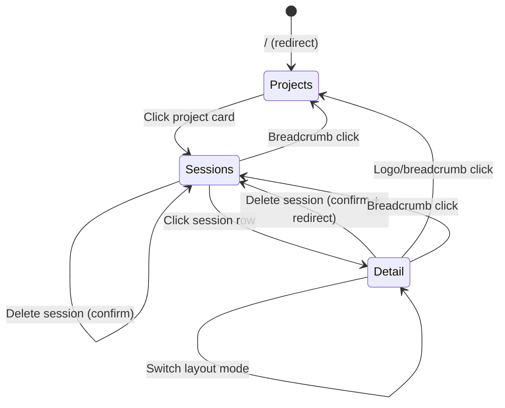
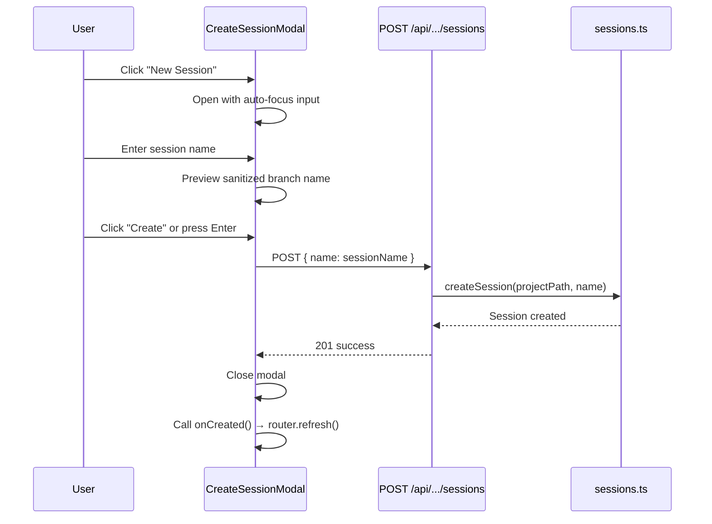
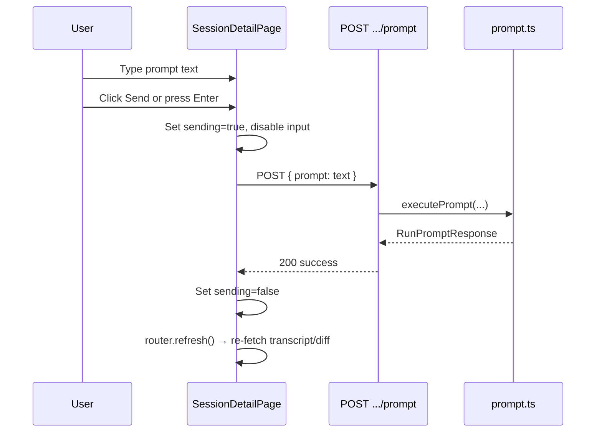
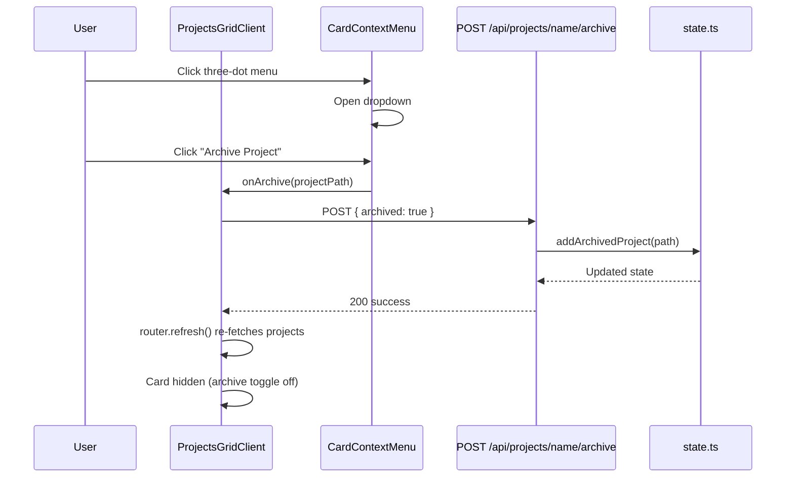

# Technical Design: Dashboard UI

## Overview

**Purpose**: The Dashboard UI provides the complete user interface for the Claude Session Manager, enabling developers to discover projects, manage sessions, send prompts, and view transcripts and diffs through a three-level navigation hierarchy.

**Users**: Developers using CSM to manage remote Claude Code coding sessions across multiple git repositories.

**Impact**: This is the primary user-facing feature. All other features (session lifecycle, prompt execution, transcript viewer, diff viewer, hook integration) surface their functionality through the dashboard.

### Goals

- Provide intuitive three-level navigation: Projects → Sessions → Session Detail
- Enable session CRUD operations with confirmation for destructive actions
- Display conversation transcripts and git diffs with flexible layout modes
- Support responsive design across desktop, tablet, and mobile viewports
- Show hook installation status with actionable warnings
- Enable fast project discovery via search and status filtering
- Allow archiving projects to reduce dashboard clutter
- Provide extensible context menu for project-level actions

### Non-Goals

- Real-time session status updates (manual refresh required)
- Light theme or theme switching
- Drag-and-drop panel resizing
- Progressive Web App (PWA) support
- Full-text search across session transcripts (search is name-only)
- Server-side filter persistence (search/filter state is ephemeral)

## Architecture

### Existing Architecture Analysis

The dashboard is fully implemented with a clear Server/Client component split:

**Server Components** (data fetching):

- `src/app/page.tsx` — Root redirect to `/projects`
- `src/app/projects/page.tsx` — Project list with discovery
- `src/app/projects/[name]/page.tsx` — Sessions list
- `src/app/projects/[name]/[session]/page.tsx` — Session detail data loading

**Client Components** (interactivity):

- `src/app/projects/ProjectCard.tsx` — Project card with navigation and context menu
- `src/app/projects/ProjectsGridClient.tsx` — **NEW** Client wrapper managing search, filters, archive toggle
- `src/app/projects/[name]/SessionsList.tsx` — Sessions table with CRUD
- `src/app/projects/[name]/CreateSessionModal.tsx` — Session creation form
- `src/app/projects/[name]/[session]/SessionDetailPage.tsx` — Main session orchestrator
- `src/app/projects/[name]/[session]/DiffPanel.tsx` — Interactive diff viewer
- `src/app/projects/[name]/[session]/LayoutSwitcher.tsx` — Layout mode selector

**Shared Components**:

- `src/components/Topbar.tsx` — Navigation with breadcrumbs
- `src/components/ConfirmDialog.tsx` — Destructive action confirmation
- `src/components/CardContextMenu.tsx` — **NEW** Reusable dropdown context menu

Key patterns preserved:

- Server Components for data fetching, Client Components for interactivity
- Feature-colocated components in page directories
- Shared components in `src/components/`
- CSS custom properties design system (no component library)
- No global state management — props and localStorage only

### Architecture Pattern & Boundary Map

```mermaid
graph TB
    subgraph Pages [Server Components]
        Home[/ - Redirect]
        Projects[/projects]
        Sessions[/projects/name]
        Detail[/projects/name/session]
    end

    subgraph ClientComponents [Client Components]
        GridClient[ProjectsGridClient]
        ProjectCard[ProjectCard]
        SessionsList[SessionsList]
        CreateModal[CreateSessionModal]
        DetailPage[SessionDetailPage]
        DiffPanel[DiffPanel]
        LayoutSwitcher[LayoutSwitcher]
    end

    subgraph Shared [Shared Components]
        Topbar[Topbar]
        ConfirmDialog[ConfirmDialog]
        ContextMenu[CardContextMenu]
    end

    subgraph API [API Routes]
        ProjectsAPI[GET /api/projects]
        ArchiveAPI[POST/DELETE .../archive]
        SessionsAPI[CRUD /api/projects/name/sessions]
        PromptAPI[POST .../prompt]
        HooksAPI[GET /api/hooks/status]
    end

    subgraph Domain [Domain Layer]
        Discovery[discovery.ts]
        State[state.ts]
        Sessions[sessions.ts]
        Prompt[prompt.ts]
        Hooks[hooks.ts]
        Diff[diff.ts]
        Transcript[transcript.ts]
    end

    Home --> Projects
    Projects --> GridClient
    GridClient --> ProjectCard
    ProjectCard --> ContextMenu
    Sessions --> SessionsList
    SessionsList --> CreateModal
    Detail --> DetailPage
    DetailPage --> DiffPanel
    DetailPage --> LayoutSwitcher

    Projects --> Topbar
    Sessions --> Topbar
    DetailPage --> Topbar
    SessionsList --> ConfirmDialog
    DetailPage --> ConfirmDialog

    GridClient --> ArchiveAPI
    SessionsList --> SessionsAPI
    CreateModal --> SessionsAPI
    DetailPage --> PromptAPI

    Projects --> Discovery
    Projects --> State
    Projects --> Hooks
    Sessions --> State
    Sessions --> Hooks
    Detail --> State
    Detail --> Diff
    Detail --> Transcript
```

### Technology Stack

| Layer     | Choice / Version             | Role in Feature                          | Notes                      |
| --------- | ---------------------------- | ---------------------------------------- | -------------------------- |
| Framework | Next.js 15 App Router        | Page routing, SSR, API routes            | Server + Client Components |
| UI        | React 19                     | Client-side interactivity                | `use client` directive     |
| Styling   | CSS Custom Properties        | Design system tokens, responsive layouts | No component library       |
| Fonts     | Anybody, Manrope, Geist Mono | Display, body, monospace typography      | Loaded via `next/font`     |
| State     | localStorage                 | Layout mode persistence per session      | `csm-layout-*` keys        |
| Types     | TypeScript 5.7 strict        | Component props, domain types            | `noUncheckedIndexedAccess` |

## System Flows

### Navigation Flow



### Session Creation Flow



### Prompt Submission Flow



### Project Archive Flow



## Requirements Traceability

| Requirement | Summary                               | Components         | Interfaces     | Flows      |
| ----------- | ------------------------------------- | ------------------ | -------------- | ---------- |
| 1.1         | Project cards grid                    | ProjectsPage       | React          | Navigation |
| 1.2         | Card displays name/path/count         | ProjectCard        | React          | Navigation |
| 1.3         | Active/idle status badge              | ProjectCard        | React          | Navigation |
| 1.4         | Card click navigates                  | ProjectCard        | Next.js Link   | Navigation |
| 1.5         | Empty state                           | ProjectsPage       | React          | Navigation |
| 1.6         | Project count subtitle                | ProjectsPage       | React          | Navigation |
| 2.1         | Sessions table                        | SessionsList       | React          | Navigation |
| 2.2         | New Session button                    | SessionsList       | React          | Creation   |
| 2.3         | Create modal with validation          | CreateSessionModal | React          | Creation   |
| 2.4         | Delete with confirmation              | SessionsList       | React          | Deletion   |
| 2.5         | Refresh after creation                | SessionsList       | Next.js Router | Creation   |
| 2.6         | Refresh after deletion                | SessionsList       | Next.js Router | Deletion   |
| 2.7         | Row click navigates                   | SessionsList       | Next.js Link   | Navigation |
| 2.8         | Status badge                          | SessionsList       | React          | Navigation |
| 2.9         | Empty state                           | SessionsList       | React          | Navigation |
| 3.1         | Session info strip                    | SessionDetailPage  | React          | Detail     |
| 3.2         | Conversation message list             | SessionDetailPage  | React          | Detail     |
| 3.3         | DiffPanel alongside conversation      | SessionDetailPage  | React          | Detail     |
| 3.4         | Prompt input area                     | SessionDetailPage  | React          | Prompt     |
| 3.5         | Running indicator, disable input      | SessionDetailPage  | React          | Prompt     |
| 3.6         | Delete with redirect                  | SessionDetailPage  | React          | Deletion   |
| 4.1         | Four layout modes                     | LayoutSwitcher     | React/CSS      | Layout     |
| 4.2         | Persist to localStorage               | SessionDetailPage  | localStorage   | Layout     |
| 4.3         | Restore persisted mode                | SessionDetailPage  | localStorage   | Layout     |
| 4.4         | Visual layout icons                   | LayoutSwitcher     | SVG            | Layout     |
| 5.1         | CSM logo link                         | Topbar             | Next.js Link   | Navigation |
| 5.2         | Breadcrumb segments                   | Topbar             | React          | Navigation |
| 5.3         | Clickable breadcrumb links            | Topbar             | Next.js Link   | Navigation |
| 5.4         | Session-specific controls             | Topbar             | React          | Detail     |
| 5.5         | Global status display                 | Topbar             | React          | Navigation |
| 6.1         | Mobile breadcrumbs (last segment)     | Topbar             | CSS            | Responsive |
| 6.2         | Mobile bottom bar for panel switching | SessionDetailPage  | React/CSS      | Responsive |
| 6.3         | Collapsible info strip                | SessionDetailPage  | React/CSS      | Responsive |
| 6.4         | Bottom sheet modals                   | CreateSessionModal | CSS            | Responsive |
| 6.5         | Hide table columns on mobile          | SessionsList       | CSS            | Responsive |
| 6.6         | 44px touch targets                    | All components     | CSS            | Responsive |
| 6.7         | Single column grid on tablet          | ProjectsPage       | CSS            | Responsive |
| 7.1         | Confirm dialog modal                  | ConfirmDialog      | React          | Deletion   |
| 7.2         | Danger styling variant                | ConfirmDialog      | React/CSS      | Deletion   |
| 7.3         | Escape key to close                   | ConfirmDialog      | React          | Deletion   |
| 7.4         | Overlay click to close                | ConfirmDialog      | React          | Deletion   |
| 8.1         | Projects page hook warning            | ProjectsPage       | React          | Hooks      |
| 8.2         | Sessions page hook warning            | SessionsPage       | React          | Hooks      |
| 8.3         | Hook status indicator in Topbar       | Topbar             | React          | Hooks      |
| 9.1         | Search input above grid               | ProjectsGridClient | React          | Filter     |
| 9.2         | Filter by name (case-insensitive)     | ProjectsGridClient | React          | Filter     |
| 9.3         | Real-time filtering on input          | ProjectsGridClient | React          | Filter     |
| 9.4         | Clear button resets search            | ProjectsGridClient | React          | Filter     |
| 9.5         | No-results empty state                | ProjectsGridClient | React          | Filter     |
| 9.6         | Combined filter logic                 | ProjectsGridClient | React          | Filter     |
| 10.1        | Status filter controls                | ProjectsGridClient | React          | Filter     |
| 10.2        | All / Active / Idle options           | ProjectsGridClient | React          | Filter     |
| 10.3        | Filter by selected status             | ProjectsGridClient | React          | Filter     |
| 10.4        | Filter counts per option              | ProjectsGridClient | React          | Filter     |
| 10.5        | Update counts on archive change       | ProjectsGridClient | React          | Filter     |
| 10.6        | "All" selected by default             | ProjectsGridClient | React          | Filter     |
| 10.7        | Combined filter logic                 | ProjectsGridClient | React          | Filter     |
| 11.1        | Archive action in context menu        | ProjectCard, CardContextMenu | React | Archive |
| 11.2        | Hide archived from default view       | ProjectsGridClient | React          | Archive    |
| 11.3        | Persist archive state (server)        | ArchiveAPI, state.ts | API          | Archive    |
| 11.4        | Archived toggle with count            | ProjectsGridClient | React          | Archive    |
| 11.5        | Show archived when toggle enabled     | ProjectsGridClient | React          | Archive    |
| 11.6        | Archived cards visually distinct      | ProjectCard        | CSS            | Archive    |
| 11.7        | Unarchive action in context menu      | ProjectCard, CardContextMenu | React | Archive |
| 11.8        | Restore unarchived to default view    | ProjectsGridClient | React          | Archive    |
| 11.9        | Archive does not affect data          | state.ts           | —              | Archive    |
| 12.1        | Three-dot menu trigger                | ProjectCard, CardContextMenu | React | Menu    |
| 12.2        | Visible on hover and when open        | CardContextMenu    | CSS            | Menu       |
| 12.3        | Dropdown with available actions       | CardContextMenu    | React          | Menu       |
| 12.4        | Close on outside click / Escape       | CardContextMenu    | React          | Menu       |
| 12.5        | Single menu open at a time            | ProjectsGridClient | React          | Menu       |
| 12.6        | Execute action and close              | CardContextMenu    | React          | Menu       |

## Components and Interfaces

| Component          | Domain/Layer    | Intent                                  | Req Coverage                       | Key Dependencies                 | Contracts |
| ------------------ | --------------- | --------------------------------------- | ---------------------------------- | -------------------------------- | --------- |
| ProjectsPage       | SSR / page      | Discover and list projects              | 1.1–1.6, 8.1                       | discovery.ts, hooks.ts, state.ts | —         |
| ProjectsGridClient | UI / client     | Search, filter, archive toggle for grid | 9.1–9.6, 10.1–10.7, 11.2–11.5, 12.5 | ProjectCard, ArchiveAPI       | State     |
| ProjectCard        | UI / client     | Render project with context menu        | 1.2–1.4, 11.1, 11.6–11.7, 12.1    | CardContextMenu                  | —         |
| CardContextMenu    | Shared / client | Reusable dropdown context menu          | 12.1–12.4, 12.6                    | None (props-driven)              | —         |
| SessionsPage       | SSR / page      | Load and list sessions                  | 2.1, 8.2                           | state.ts, hooks.ts               | —         |
| SessionsList       | UI / client     | Sessions table with CRUD                | 2.1–2.9                            | API routes                       | —         |
| CreateSessionModal | UI / client     | Session creation form                   | 2.2–2.3, 2.5                       | API routes                       | —         |
| SessionPage        | SSR / page      | Load session data for detail view       | 3.1–3.3                            | state.ts, diff.ts, transcript.ts | —         |
| SessionDetailPage  | UI / client     | Orchestrate session detail panels       | 3.1–3.6, 4.2–4.3, 6.2–6.3          | DiffPanel, LayoutSwitcher        | —         |
| DiffPanel          | UI / client     | Render interactive git diff             | 3.3                                | None (props-driven)              | —         |
| LayoutSwitcher     | UI / client     | Layout mode selection                   | 4.1, 4.4                           | None (props-driven)              | —         |
| Topbar             | Shared / client | Navigation breadcrumbs and controls     | 5.1–5.5, 6.1                       | None (props-driven)              | —         |
| ConfirmDialog      | Shared / client | Destructive action confirmation         | 7.1–7.4                            | None (props-driven)              | —         |

### Component Interfaces

#### ProjectsGridClient

| Field | Detail |
|-------|--------|
| Intent | Manage search, status filtering, archive visibility, and render filtered project cards |
| Requirements | 9.1–9.6, 10.1–10.7, 11.2–11.5, 12.5 |

**Responsibilities & Constraints**
- Receives full project list (including archived flag) from server via props
- Manages search query, active status filter, and archive toggle as local React state
- Computes filtered project list by combining all three filter dimensions
- Computes per-filter counts from the unfiltered project list (excluding archived from counts)
- Enforces single-menu-open-at-a-time constraint (12.5) via `openMenuId` state
- Calls archive API on archive/unarchive actions, then triggers `router.refresh()`

**Dependencies**
- Inbound: ProjectsPage — provides `projects` and `archivedPaths` props (P0)
- Outbound: ProjectCard — renders each filtered project (P0)
- Outbound: Archive API — POST/DELETE for archive mutations (P1)

**Contracts**: State [x]

##### State Management
- `searchQuery: string` — current search input value
- `statusFilter: "all" | "active" | "idle"` — selected filter pill
- `showArchived: boolean` — archive toggle state
- `openMenuId: string | null` — project path of the currently open context menu

```typescript
interface ProjectsGridClientProps {
  projects: DiscoveredProject[];
  archivedPaths: Set<string>;
}
```

**Implementation Notes**
- Filter logic: `project.name.toLowerCase().includes(query)` AND status match AND archive visibility
- Counts exclude archived projects: `countActive` = non-archived with `hasRunningSession`, `countIdle` = non-archived without
- `router.refresh()` after archive API call re-fetches server data with updated archive state

#### ProjectCard

```typescript
interface ProjectCardProps {
  project: DiscoveredProject;
  archived: boolean;
  menuOpen: boolean;
  onMenuToggle: () => void;
  onArchive: (projectPath: string) => void;
}
```

**Implementation Notes**
- When `archived` is true: render with reduced opacity, dashed border, "archived" badge
- Context menu trigger uses `event.stopPropagation()` to prevent `<Link>` navigation
- Menu items array is built dynamically: "Archive Project" or "Unarchive Project" based on `archived` prop

#### SessionsList

```typescript
interface SessionsListProps {
  projectName: string;
  initialSessions: SessionState[];
}
```

#### CreateSessionModal

```typescript
interface CreateSessionModalProps {
  projectName: string;
  open: boolean;
  onClose: () => void;
  onCreated: () => void;
}
```

#### SessionDetailPage

```typescript
interface Props {
  projectName: string;
  session: SessionState;
  messages: TranscriptMessage[];
  diff: SessionDiff;
}
```

#### LayoutSwitcher

```typescript
interface LayoutSwitcherProps {
  activeLayout: LayoutMode;
  onLayoutChange: (mode: LayoutMode) => void;
}
```

#### Topbar

```typescript
interface TopbarProps {
  breadcrumbs: BreadcrumbSegment[];
  page: "projects" | "sessions" | "detail";
  sessionControls?: React.ReactNode;
  globalStatus?: React.ReactNode;
}
```

#### ConfirmDialog

```typescript
interface ConfirmDialogProps {
  open: boolean;
  title: string;
  message: string;
  confirmLabel?: string;
  cancelLabel?: string;
  danger?: boolean;
  onConfirm: () => void;
  onCancel: () => void;
}
```

#### CardContextMenu

| Field | Detail |
|-------|--------|
| Intent | Reusable three-dot dropdown menu for card-level actions |
| Requirements | 12.1–12.4, 12.6 |

**Responsibilities & Constraints**
- Renders a three-dot trigger button and a positioned dropdown
- Dropdown opens/closes based on `open` prop (controlled component)
- Closes on click-outside and Escape key via `useEffect` event listeners
- All click handlers call `event.stopPropagation()` to prevent parent Link navigation

**Dependencies**
- Inbound: ProjectCard (or any card component) — passes `items` and `open`/`onToggle` (P0)
- External: None

**Contracts**: Service [x]

##### Service Interface

```typescript
interface ContextMenuItem {
  label: string;
  icon?: string;
  danger?: boolean;
  onAction: () => void;
}

interface CardContextMenuProps {
  items: ContextMenuItem[];
  open: boolean;
  onToggle: () => void;
}
```

- Preconditions: `items` array has at least one entry
- Postconditions: `onToggle` called when trigger clicked; `onAction` called when item clicked, menu closes
- Invariants: Only renders dropdown when `open` is true

**Implementation Notes**
- Trigger: vertical ellipsis character (`⋮`) in a 24x24px button
- Dropdown: positioned `absolute`, anchored to top-right of trigger, min-width 180px
- CSS animation: fade + slight scale on open (0.12s ease)
- Escape key listener attached only while `open` is true

## Data Models

Existing types consumed by the dashboard (defined in `src/types/index.ts` and `src/lib/schemas.ts`):

- `DiscoveredProject` — project list items (name, path, activeSessions, hasRunningSession)
- `SessionState` — session metadata and status
- `TranscriptMessage` — parsed conversation messages
- `SessionDiff` — structured git diff data
- `LayoutMode` — `"conversation" | "default" | "split" | "diff"`
- `RunPromptResponse` — prompt execution result

### New Data Model Changes (Req 11)

**ManagerState extension** — Add `archivedProjects` field:

```typescript
// In src/lib/schemas.ts — extend managerStateSchema
const managerStateSchema = z.object({
  projects: z.record(z.string(), projectStateSchema),
  archivedProjects: z.array(z.string()).default([]),  // NEW: absolute paths
});
```

**Domain module extension** — Add archive helpers in `src/lib/state.ts`:

```typescript
function getArchivedProjects(): Promise<Set<string>>;
function setProjectArchived(projectPath: string, archived: boolean): Promise<void>;
```

- `getArchivedProjects` reads `state.archivedProjects` and returns as `Set<string>`
- `setProjectArchived` adds/removes the path from the array and writes state atomically

### API Contract (Req 11.3)

| Method | Endpoint                           | Request                    | Response         | Errors   |
|--------|------------------------------------|----------------------------|------------------|----------|
| POST   | `/api/projects/[name]/archive`     | `{ archived: boolean }`    | `{ ok: true }`   | 404, 500 |

- POST with `archived: true` archives the project; `archived: false` unarchives
- Resolves project name to absolute path via `discoverProjects()` lookup
- Returns 404 if project name does not match any discovered project

## Error Handling

### Error Strategy

- **API errors**: Client components handle fetch errors with inline error messages (e.g., CreateSessionModal shows validation errors)
- **Archive API errors**: If archive POST fails, `ProjectsGridClient` displays a transient inline error. The UI state does not change on failure (optimistic updates are not used).
- **No error boundaries**: No `error.tsx` files exist. Next.js default error handling is used. Acceptable for a local developer tool.
- **No loading states**: No `loading.tsx` files exist. Server Components render synchronously.
- **Confirmation dialogs**: Prevent accidental destructive actions (session deletion)
- **Stale archive paths**: If an archived project path no longer matches a discovered project, the path is silently ignored during filtering. No cleanup is performed automatically.

## Testing Strategy

### Coverage Assessment

No UI-level tests exist currently. The dashboard is the largest untested surface area in the project. Given the component architecture:

- **Client components** are testable in isolation with props-based rendering
- **Server components** are harder to test directly (require mocking domain modules)
- **Shared components** (Topbar, ConfirmDialog, CardContextMenu) have the highest reuse and are good candidates for unit tests
- **User interaction flows** (create session, delete session, send prompt) are candidates for integration tests

### New Feature Testing Focus

- **Unit Tests**:
  - `state.ts`: `getArchivedProjects`, `setProjectArchived` — verify add/remove/persist behavior
  - Filter logic in `ProjectsGridClient`: combined search + status + archive filtering
  - `CardContextMenu`: open/close, Escape key, click-outside dismissal

- **Integration Tests**:
  - Archive API route: POST with `archived: true/false`, 404 for unknown project
  - `ProjectsPage` → `ProjectsGridClient` → `ProjectCard` data flow with archived projects
