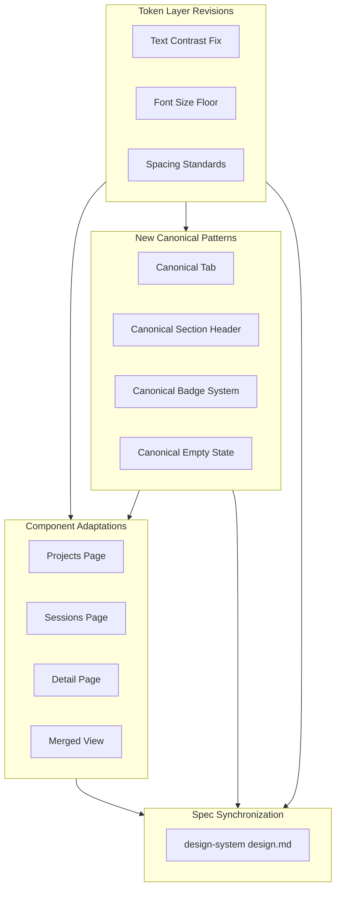

# Design Document — Design System Revamp

## Overview

**Purpose**: This feature revamps the CC design system to fix critical accessibility failures, canonicalize inconsistent UI patterns, improve visual differentiation, and polish page compositions — while preserving the "Ground Control" visual identity.

**Users**: All CC users benefit from improved readability (WCAG AA compliance), faster scanning (card differentiation, canonical patterns), and a more polished, unified experience. Developers implementing new UI features reference updated canonical patterns for consistency.

**Impact**: Modifies design token values in `globals.css` `:root`, updates ~150+ font-size declarations, standardizes ~9 tab implementations into 1, standardizes ~4 badge implementations into 1, and adjusts component layouts across 10+ React files. The design system spec (`.kiro/specs/ui-design-system/design.md`) is updated to reflect all changes.

### Goals

- Achieve WCAG AA compliance for all text/background combinations
- Establish and enforce minimum sizing floors (font: 0.7rem, icon: 20px desktop)
- Reduce 9 tab patterns, 3 section header patterns, and 4 badge patterns to 1 canonical pattern each
- Create clear visual hierarchy for project cards (active > has-sessions > idle)
- Eliminate dead space and visual inconsistencies across all views

### Non-Goals

- Changing the "Ground Control" visual identity (dark theme, cyan accents, atmospheric effects)
- Migrating from plain CSS to CSS Modules, Tailwind, or styled-components
- Splitting `globals.css` into multiple files
- Adding new accent colors or font families
- Redesigning page layouts or information architecture
- Adding new features or functionality

## Architecture

### Existing Architecture Analysis

The design system is fully implemented in a single CSS file (`globals.css`, ~10K lines) with section-header organization. All tokens are CSS custom properties on `:root`. Components use plain CSS classes in kebab-case BEM-style. Font loading happens in `layout.tsx` via `next/font/google`.

Key patterns to preserve:
- Single CSS file with layered organization (tokens → base → components → responsive)
- CSS custom properties for all visual values
- Two-tier font variables (raw → semantic aliases)
- Data attribute selectors for state-driven styling
- No external CSS dependencies

Key patterns to fix:
- 9 distinct tab CSS families → 1 canonical family
- 3 distinct section header CSS families → 1 canonical family
- 4 distinct badge CSS families → 1 canonical family
- Inconsistent font-size values (0.48rem–0.68rem) → 5-tier system with 0.7rem floor
- Low-contrast text token → WCAG AA compliant value

### Architecture Pattern & Boundary Map



**Architecture Integration**:
- **Selected pattern**: In-place CSS revision with additive canonical patterns
- **Domain boundaries**: Token layer changes are global; canonical patterns are additive CSS classes; component adaptations are per-page React changes
- **Existing patterns preserved**: Single CSS file, custom properties, BEM naming, data-attribute state switching
- **New components rationale**: No new React components needed — canonical patterns are CSS-only with existing React components adopting new class names
- **Steering compliance**: No new dependencies, no framework changes, preserves all existing conventions

### Technology Stack

| Layer | Choice / Version | Role in Feature | Notes |
|-------|------------------|-----------------|-------|
| Styling | Plain CSS custom properties | Token changes, canonical patterns, component style updates | Single file: `globals.css` |
| Frontend | React 19 / Next.js 16 | Component class name updates, TDD toggle relocation | Existing components modified |
| Types | TypeScript (strict) | No new type definitions needed | Existing types unchanged |

## Requirements Traceability

| Requirement | Summary | Component | Files |
|-------------|---------|-----------|-------|
| 1.1–1.6 | Text contrast WCAG AA | TokenRevisions | `globals.css` `:root` |
| 2.1–2.5 | Font size 0.7rem floor | FontSizePass | `globals.css` (152+ rules) |
| 3.1–3.6 | Icon/button 20px+ minimum | IconSizePass | `globals.css` (30+ rules) |
| 4.1–4.7 | Canonical tab pattern | CanonicalTabs | `globals.css`, `ProjectsGrid.tsx`, `ConversationSidebar.tsx`, `SessionGitPanel.tsx`, `DiffPanel.tsx`, `RightPane.tsx`, `SpecBrowser.tsx` |
| 5.1–5.8 | Canonical section header | CanonicalSectionHeader | `globals.css`, `ProjectsGrid.tsx`, `RoadmapItemsPanel.tsx`, `ConversationSidebar.tsx`, `SessionGitPanel.tsx` |
| 6.1–6.8 | Canonical badge system | CanonicalBadges | `globals.css`, `ProjectCard.tsx`, `SessionsTable.tsx`, `RoadmapItemsPanel.tsx` |
| 7.1–7.5 | Empty state and null values | EmptyStateNullValues | `globals.css`, `ProjectCard.tsx`, `SessionsTable.tsx` |
| 8.1–8.6 | Card visual differentiation | CardDifferentiation | `globals.css`, `ProjectCard.tsx` |
| 9.1–9.5 | Page composition, dead space | PageComposition | `globals.css`, `SessionDetailPage.tsx` |
| 10.1–10.5 | Control placement, visual weight | ControlPlacement | `globals.css`, `SessionDetailPage.tsx`, `RoadmapItemsPanel.tsx`, `SessionsTable.tsx` |
| 11.1–11.4 | Spacing consistency | SpacingConsistency | `globals.css` |
| 12.1–12.5 | Design spec sync | SpecSync | `.kiro/specs/ui-design-system/design.md` |

## Components and Interfaces

| Component | Domain | Intent | Req Coverage | Key Dependencies | Contracts |
|-----------|--------|--------|--------------|------------------|-----------|
| TokenRevisions | Token Layer | Update color and sizing tokens in `:root` | 1, 2, 3 | None | State |
| CanonicalTabs | Pattern Layer | Define single tab/filter CSS pattern | 4 | TokenRevisions (P0) | State |
| CanonicalSectionHeader | Pattern Layer | Define single section header CSS pattern | 5 | TokenRevisions (P0) | State |
| CanonicalBadges | Pattern Layer | Define 3-tier badge CSS pattern | 6 | TokenRevisions (P0) | State |
| EmptyStateNullValues | Pattern Layer | Standardize empty states and null value display | 7 | TokenRevisions (P0) | — |
| CardDifferentiation | Component Layer | Add at-rest visual hierarchy to project cards | 8 | TokenRevisions (P0) | State |
| PageComposition | Structural Layer | Fix dead space and layout issues | 9 | TokenRevisions (P0) | — |
| ControlPlacement | Structural Layer | Relocate TDD toggle, adjust button weights | 10 | TokenRevisions (P0) | — |
| SpacingConsistency | Token Layer | Define standard spacing patterns | 11 | TokenRevisions (P0) | State |
| SpecSync | Documentation | Update design system spec with all changes | 12 | All components (P0) | — |

### Token Layer

#### TokenRevisions

| Field | Detail |
|-------|--------|
| Intent | Update CSS custom property values to fix contrast, establish sizing floors |
| Requirements | 1.1, 1.2, 1.3, 1.4, 1.5 (--red-text token), 1.6, 2.1, 3.1, 3.5 |

**Responsibilities & Constraints**

- Modify `--text-tertiary` value from `#4d5a72` to `#738699` to achieve WCAG AA compliance
- Confirm `--text-secondary` (`#7b899f`) already passes (5.6:1 vs void, 5.1:1 vs surface)
- Add new sizing tokens: `--font-size-floor: 0.7rem`, `--icon-size-min: 20px`, `--icon-btn-min: 24px`
- No changes to background, border, accent, or font family tokens

**Dependencies**

- Outbound: All component styles consume revised tokens

**Contracts**: State [x]

##### State Management

Updated token values in `:root`:

```
:root {
  /* CHANGED */
  --text-tertiary: #738699;       /* was #4d5a72 — now 4.8:1 vs surface, 5.3:1 vs void */

  /* NEW — sizing floors */
  --font-size-floor: 0.7rem;      /* absolute minimum font-size */
  --icon-size-min: 20px;          /* minimum meaningful icon size */
  --icon-btn-min: 24px;           /* minimum icon button size (desktop) */
  --touch-target-min: 44px;       /* minimum touch target (mobile) */

  /* NEW — spacing standards */
  --space-section: var(--space-xl);    /* between major sections (32px) */
  --space-header-content: var(--space-sm); /* section header to content (8px) */

  /* NEW — accent text tokens */
  --red-text: #e04060;            /* WCAG AA safe for text (~4.6:1 vs surface, ~5.1:1 vs void) */

  /* UNCHANGED */
  --text-primary: #dce2f0;        /* 13.2:1 vs void ✓ */
  --text-secondary: #7b899f;      /* 5.6:1 vs void, 5.1:1 vs surface ✓ */
}
```

**Implementation Notes**

- The --text-tertiary change propagates automatically to all 149 usages — no per-rule edits needed
- Sizing floor tokens are reference values for human enforcement; CSS does not have a mechanism to clamp all font-sizes automatically
- Accent dim colors (--cyan-dim, --amber-dim, --green-dim) already pass WCAG AA when used as text on dark backgrounds
- --red-dim (#cc3148) achieves only 3.53:1 against bg-surface, which fails WCAG AA for normal text. It IS used as text color in `.context-fill--danger .context-fill__pct` (globals.css:3318). Fix: add `--red-text: #e04060` (~4.6:1 vs bg-surface) and use it for that rule. The `--red-dim` token itself remains unchanged for its border/background usages which don't require 4.5:1.

#### FontSizePass

| Field | Detail |
|-------|--------|
| Intent | Raise all font-size declarations below 0.7rem to the floor or appropriate tier |
| Requirements | 2.1, 2.2, 2.3, 2.4, 2.5 |

**Font Size Tier System**

All font-size values are organized into 5 tiers. No value below tier 1 is permitted.

| Tier | Value | Use Cases | Previous Range |
|------|-------|-----------|----------------|
| 1 (floor) | 0.7rem | Smallest metadata, counts, timestamps, chevrons, tooltip text | was 0.48–0.65rem |
| 2 (small) | 0.72rem | Section labels, table headers, small buttons, badge text, panel labels | was 0.66–0.68rem |
| 3 (base) | 0.78rem | Buttons, inputs, data values, session names, branch chips | unchanged |
| 4 (body) | 0.82rem | Inline code, expanded content, item titles | unchanged |
| 5 (prose) | 0.9rem | Conversation message body text | unchanged |

**Mechanical Mapping Rule**

To eliminate per-selector judgment calls, apply this deterministic rule to every `font-size` declaration below 0.72rem:

| Current Value | Target Tier | Target Value |
|---------------|-------------|--------------|
| ≤ 0.65rem | Tier 1 (floor) | 0.7rem |
| 0.66–0.69rem | Tier 2 (small) | 0.72rem |
| ≥ 0.70rem | Unchanged | Keep as-is |

**Exceptions** (manual review required): If two sibling elements currently use different sub-0.7rem values to establish a visual hierarchy (e.g., a label at 0.65rem vs its sublabel at 0.55rem), both map to tier 1 per the rule. If the hierarchy loss is visually significant, upgrade the larger element to tier 2 (0.72rem) instead. These exceptions should be rare — flag and document each one.

**Implementation Notes**

- 8 critically small values (0.48–0.55rem) → tier 1 (0.7rem)
- 14 values at 0.56–0.59rem → tier 1 (0.7rem)
- ~70 values at 0.60–0.65rem → tier 1 (0.7rem)
- ~60 values at 0.66–0.69rem → tier 2 (0.72rem)
- Relative hierarchy preserved via the exception rule above — elements that were smaller than peers can be kept at tier 1 while their peers upgrade to tier 2
- Each change verified to not break flex/grid layouts (most containers are flexible)

#### IconSizePass

| Field | Detail |
|-------|--------|
| Intent | Increase icon and icon-button sizes to meet minimum thresholds |
| Requirements | 3.1, 3.2, 3.3, 3.4, 3.5, 3.6 |

**Size Categories and Actions**

| Category | Current | Target | Action |
|----------|---------|--------|--------|
| SVG inside icon buttons | 10–14px | 16px | Increase width/height |
| Icon buttons (desktop) | 18–22px | 24px | Increase width/height/min-width |
| Icon buttons (mobile) | varies | 44px | Add min-width/min-height or padding |
| Status dots | 6–9px | unchanged | Excluded — decorative indicators |
| Separators | 1px | unchanged | Excluded — purely decorative |
| Scrollbar | 6px | unchanged | Excluded — browser chrome |
| Toggle tracks/knobs | 8–16px | proportional | Scale proportionally with minimum 20px track |

**Implementation Notes**

- ~30 meaningful icon/button sizes need increasing
- Icon buttons use `display: inline-flex; align-items: center; justify-content: center` so increasing dimensions absorbs naturally
- Mobile touch targets achieved via min-width/min-height rather than increasing visual size
- Toggle track minimum: 28px wide, 16px tall; knob minimum: 12px

### Pattern Layer

#### CanonicalTabs

| Field | Detail |
|-------|--------|
| Intent | Define a single canonical tab/filter CSS pattern used everywhere |
| Requirements | 4.1, 4.2, 4.3, 4.4, 4.5, 4.6, 4.7 |

**Responsibilities & Constraints**

- Replace 5 distinct CSS tab families with one canonical set of classes
- The canonical pattern is pill-style (matching the most widely used `.filter-pills` pattern)
- Each page's tab state management remains in its own React component — only CSS classes change
- Count badges within tabs use a consistent sub-pattern

**Contracts**: State [x]

##### State Management

Canonical CSS class structure:

```
.cc-tabs          — Container (flex, gap: 2px, padding: 3px, border, radius)
.cc-tab           — Individual tab (mono font, 0.72rem, 500 weight, rounded, transition)
.cc-tab.active    — Active state (cyan bg, inverse text)
.cc-tab:hover     — Hover state (bg-hover, text-primary)
.cc-tab-count     — Count badge (0.7rem, pill shape, inline, opacity 0.85)
.cc-tab.active .cc-tab-count  — Count badge in active tab (higher opacity)
```

**State definitions**:

| State | Background | Text | Border |
|-------|------------|------|--------|
| Inactive | transparent | --text-secondary | none |
| Hover | --bg-hover | --text-primary | none |
| Active | --cyan | --text-inverse | none |
| Active + count | --cyan | --text-inverse, count: rgba(255,255,255,0.85) | none |

**Adoption mapping** — existing patterns to replace:

| Current Pattern | Location | Migration |
|----------------|----------|-----------|
| `.filter-pills` / `.filter-pill` | ProjectsGrid, DiffPanel, RightPane, SessionDiffViewer | Rename classes; "Archived" button uses same pattern as other pills |
| `.convo-sidebar-tabs` / `.convo-sidebar-tab` | ConversationSidebar | Convert to `.cc-tabs` / `.cc-tab` |
| `.git-panel-tabs` / `.git-panel-tab` | SessionGitPanel | Convert from underline to pill style |
| `.spec-browser-tabs` / `.spec-browser-tab` | SpecBrowser | Convert from underline to pill style |
| `.mobile-panel-tabs` / `.mobile-tab` | SessionDetailPage | Convert to `.cc-tabs` / `.cc-tab` with flex:1 modifier |
| `.spec-browser-pills` / `.spec-browser-pill` | SpecBrowser file selector | Convert to `.cc-tabs` / `.cc-tab` |

**Implementation Notes**

- Old CSS classes are replaced directly — both the CSS definitions and all React component references are updated atomically within the same task. No alias/forwarding phase; since this is a coordinated revamp (not a rolling migration), stale class names cannot accumulate
- The "Archived (N)" button on the projects page adopts the same `.cc-tab` treatment as other filter pills — no separate button style
- Mobile tabs add `flex: 1` to `.cc-tab` for full-width distribution
- Minimum tab height: 28px desktop, 36px mobile

#### CanonicalSectionHeader

| Field | Detail |
|-------|--------|
| Intent | Define a single canonical section header CSS pattern used everywhere |
| Requirements | 5.1, 5.2, 5.3, 5.4, 5.5, 5.6, 5.7, 5.8 |

**Contracts**: State [x]

##### State Management

Canonical CSS class structure:

```
.cc-section-header       — Container (flex, align-items: center, gap: var(--space-sm))
.cc-section-chevron      — Collapse toggle (16px, rotate animation 0.15s ease)
.cc-section-label        — Label text (mono, 0.72rem, 600 weight, uppercase, 0.08em tracking, --text-secondary)
.cc-section-count        — Count badge (mono, 0.7rem, 400 weight, --text-tertiary, parenthesized)
.cc-section-actions      — Trailing actions container (margin-left: auto, flex, gap)
```

**Feature matrix for each instance**:

| Instance | Collapse | Label | Count | Trailing Actions |
|----------|----------|-------|-------|-----------------|
| PINNED (projects) | No | "Pinned" | pinned count | None |
| ROADMAP (sessions) | Yes | "Roadmap" | active count | Archive toggle, Add button |
| CONVERSATIONS (sidebar) | Yes | "Conversations" | None | Collapse button |
| GIT (session detail) | Yes | "Git" | commit/file count | View Diff, actions |

**Implementation Notes**

- The pinned section star icon (★) is removed — the label "Pinned" is sufficient with the section's amber-tinted card borders providing the visual cue
- Collapse chevrons use a minimum 16px size and rotate -90deg when collapsed
- The label color is upgraded from --text-tertiary to --text-secondary for better contrast

#### CanonicalBadges

| Field | Detail |
|-------|--------|
| Intent | Define a 3-tier badge system with consistent sizing and semantic color usage |
| Requirements | 6.1, 6.2, 6.3, 6.4, 6.5, 6.6, 6.7, 6.8 |

**Contracts**: State [x]

##### State Management

Canonical CSS class structure:

```
.cc-badge                — Base (inline-flex, mono, 0.7rem, 600 weight, pill shape, 2px 8px padding)
.cc-badge--status        — Status tier (semantic color bg + text)
.cc-badge--type          — Type tier (semantic color bg + text)
.cc-badge--count         — Count tier (neutral bg, secondary text)
.cc-badge--subtle        — Subdued variant (for repetitive contexts like table rows)
```

**Status badge color mapping**:

| Status | Background | Text | Glow |
|--------|------------|------|------|
| Running/Active | --cyan-glow | --cyan | cyan box-shadow |
| Merged/Ready | --green-glow | --green | none |
| Awaiting | --amber-glow | --amber | none |
| Idle | --bg-raised | --text-secondary | none |

**Type badge color mapping**:

| Type | Background | Text |
|------|------------|------|
| Feature | --cyan-glow | --cyan |
| Bug | --red-glow | --red |
| Idea | --amber-glow | --amber |

**Count badge**:

| Variant | Background | Text |
|---------|------------|------|
| Default | --bg-raised | --text-secondary |
| Active (has running) | --cyan-glow | --cyan |

**Subtle variant** (`.cc-badge--subtle`): 50% opacity on background, no border — used when badge content is redundant with context (e.g., all rows in an "Archived" view showing "MERGED").

**Adoption mapping**:

| Current | Location | Migration |
|---------|----------|-----------|
| `.project-badge` | ProjectCard.tsx | → `.cc-badge .cc-badge--status` |
| `.session-badge` | SessionsTable.tsx | → `.cc-badge .cc-badge--status .cc-badge--subtle` |
| `.roadmap-type` | RoadmapItemsPanel.tsx | → `.cc-badge .cc-badge--type` |
| `.session-status` | SessionsTable.tsx | Keeps dot indicator, label uses `.cc-badge--subtle` when redundant |

### Component Layer

#### EmptyStateNullValues

| Field | Detail |
|-------|--------|
| Intent | Standardize empty states and replace "—" dash placeholders with intentional design |
| Requirements | 7.1, 7.2, 7.3, 7.4, 7.5 |

**Empty state pattern** (existing `.empty-state` class, already defined):

- Centered flex column, `--space-3xl --space-xl` padding
- Icon: minimum 2rem, 40% opacity
- Title: display font (--font-display), 700 weight, 1.1rem
- Description: mono font, --text-secondary, 320px max-width

No CSS changes needed — the existing `.empty-state` is already canonical. Ensure all empty views use it.

**Null value replacement rules**:

| Field Type | Old | New | CSS |
|-----------|-----|-----|-----|
| Count (Sessions, Prompts) | "—" | "0" | Same `.stat-value` styling |
| Temporal (Last Active) | "—" | "—" (keep, but style as `--text-tertiary`) | `.stat-value--empty` class with explicit tertiary color |
| Status | "—" | contextual text | Use status-appropriate badge |

**Implementation Notes**

- `ProjectCard.tsx` line 87, 91: Replace `&mdash;` with `"0"` for count fields, keep `&mdash;` for temporal fields with new `.stat-value--empty` class
- All temporal "—" values receive `font-style: normal` (not italic) and `--text-tertiary` color, making them clearly intentional

#### CardDifferentiation

| Field | Detail |
|-------|--------|
| Intent | Add at-rest visual hierarchy to project cards based on activity state |
| Requirements | 8.1, 8.2, 8.3, 8.4, 8.5, 8.6 |

**Contracts**: State [x]

##### State Management

Card states are driven by existing CSS classes on `.project-card`:

| Class | At-rest Treatment | Hover Enhancement |
|-------|-------------------|-------------------|
| `.project-card.active` (running sessions) | 3px left border `--cyan`, subtle cyan glow (`box-shadow: -2px 0 8px var(--cyan-glow)`) | Glow intensifies to `--cyan-glow-strong` |
| `.project-card.has-sessions` (not running) | Standard border, full opacity | Normal hover (border-strong, bg-raised) |
| `.project-card.idle` (no sessions) | `opacity: 0.65`, border-color dimmed | Opacity lifts to 0.85 on hover |
| `.project-card.pinned` (orthogonal) | Amber border tint (existing, enhanced to be more visible) | Amber glow on hover (existing) |

**Visual hierarchy at rest** (most to least prominent):
1. Active + Pinned — cyan left border + amber tint
2. Active — cyan left border + glow
3. Has-sessions + Pinned — amber tint, full opacity
4. Has-sessions — standard, full opacity
5. Idle + Pinned — amber tint, dimmed
6. Idle — dimmed opacity

**Implementation Notes**

- The `.active` class may already exist on project cards in some form — verify in `ProjectCard.tsx` and add if missing
- The `opacity: 0.65` for idle cards is more aggressive than the current `archived` treatment (0.55) — idle is "alive but empty" so slightly less dim than archived
- Left border accent chosen over full-border glow because it's scannable in a dense grid without being overwhelming
- Pinned state stacks with activity state — amber + cyan for active pinned cards

#### PageComposition

| Field | Detail |
|-------|--------|
| Intent | Fix dead space and improve layout flow on sparse pages |
| Requirements | 9.1, 9.2, 9.3, 9.4, 9.5 |

**Merged session view** (Screenshot 3):

- Add `max-width: 800px` to the content container in merged view to prevent content from stretching across full viewport
- Reduce spacing between metadata strip, merge banner, git section, and conversation cards
- Content anchored to top of area (already uses flex-start, just needs tighter spacing)

**Conversation sidebar width** (Screenshot 2):

- Increase minimum sidebar width from current value to `220px`
- Ensure session names show at least 30 characters before truncation
- On desktop, sidebar default width: `240px` (was not explicitly constrained before)

**Roadmap + Sessions table integration** (Screenshot 4):

- Both sections use consistent container treatment: the roadmap panel already has `.roadmap-panel` with `bg-surface` and border; the sessions table section adopts the same container treatment
- Consistent `var(--space-section)` gap between the two

**Implementation Notes**

- Merged view max-width applies only when `data-page="detail"` and session status is merged — this avoids constraining the active session view which needs full width for side-by-side panels
- Sidebar width change requires updating the `.session-detail-layout` grid template columns

#### ControlPlacement

| Field | Detail |
|-------|--------|
| Intent | Relocate TDD toggle from info strip, reduce roadmap button weight |
| Requirements | 10.1, 10.2, 10.3, 10.4, 10.5 |

**TDD toggle relocation**:

- Remove `<TddToggle>` from the session info strip in `SessionDetailPage.tsx` (line 1129)
- Add `<TddToggle>` to the topbar right side area (`.topbar-status-session`), positioned before the layout switcher
- The compact variant (`.tdd-toggle--compact`) is used in the topbar to maintain the compact topbar aesthetic
- In the sessions table, the TDD toggle per-row remains in place (it's a per-session control, appropriately placed)

**Roadmap action button weight**:

- Change `.roadmap-btn-focus` from filled cyan (`background: var(--cyan-glow); border: 1px solid var(--cyan-dim)`) to ghost style (`background: transparent; border: 1px solid var(--border-default)`)
- On hover, ghost buttons show subtle background (`--bg-hover`) and text brightens to `--text-primary`
- The "Start" (play) button is still distinguishable as an action but doesn't dominate the row

**Button weight hierarchy** (defined across the app):

| Tier | Treatment | Use Cases |
|------|-----------|-----------|
| Primary | Cyan bg, inverse text | Merge, New Session, New Conversation, Send |
| Secondary | Outline (border-default, text-secondary) | Commit, Unarchive, Archived toggle |
| Tertiary | Ghost (transparent bg, text-tertiary, border on hover) | Roadmap item actions, utility buttons |
| Danger | Red outline (red border, red text) | Delete |

**Repetitive badge reduction in session table**:

- When the current filter/view context makes a badge redundant (e.g., viewing archived sessions where all are MERGED), apply `.cc-badge--subtle` to reduce visual weight
- The session creation mode badge (FAST/FOCUS) remains at normal weight as it varies between rows

#### SpacingConsistency

| Field | Detail |
|-------|--------|
| Intent | Define and apply standard spacing values between sections, headers, and items |
| Requirements | 11.1, 11.2, 11.3, 11.4 |

**Contracts**: State [x]

##### State Management

New spacing semantic tokens:

| Token | Value | Use Case |
|-------|-------|----------|
| `--space-section` | `var(--space-xl)` (32px) | Between major page sections (roadmap → table, info strip → content) |
| `--space-header-content` | `var(--space-sm)` (8px) | Section header → first item |
| `--space-item` | `var(--space-xs)` (4px) | Between items within a section (roadmap items, table rows via border) |

**Application across views**:

| View | Between | Token |
|------|---------|-------|
| Projects page | PINNED section → unpinned section | --space-section |
| Sessions page | Roadmap → Filter/table area | --space-section |
| Sessions page | Table header → first row | --space-header-content |
| Session detail | Info strip → content area | --space-section |
| Session detail | Section header → panel content | --space-header-content |
| Merged view | Metadata → banner → git → conversations | --space-section (reduced from current arbitrary values) |

### Documentation Layer

#### SpecSync

| Field | Detail |
|-------|--------|
| Intent | Update `.kiro/specs/ui-design-system/design.md` to reflect all revamp changes |
| Requirements | 12.1, 12.2, 12.3, 12.4, 12.5 |

**Sections to update**:

1. **Token values**: Update `--text-tertiary` hex value in all token tables
2. **New section "Accessibility Minimums"**: Document WCAG AA contrast requirements, 0.7rem font floor, 20px icon minimum, 44px touch target
3. **New section "Canonical Patterns"**: Document each canonical pattern (tabs, section headers, badges, empty states) with CSS class reference, state table, and usage locations
4. **Typography Patterns Quick Reference**: Update font-size values to reflect 5-tier system
5. **Implementation Rules**: Add rules for minimum sizing enforcement
6. **New section "Spacing Patterns"**: Document the 3 standard spacing values and where they apply
7. **Button weight hierarchy**: Add to Implementation Rules or as a new subsection

## Testing Strategy

### Visual Regression Tests

- **Token contrast**: Compute WCAG contrast ratios for new `--text-tertiary` against all 5 background levels; all must pass 3:1 minimum, bg-void and bg-surface must pass 4.5:1
- **Font size floor**: Grep `globals.css` for all `font-size` declarations and verify none are below 0.7rem
- **Icon size floor**: Grep for icon/button `width`/`height` declarations and verify interactive elements meet 24px minimum (excluding decorative elements)

### Component Tests

- **Canonical tabs**: Render each tab instance in Storybook; verify active/hover/inactive states match spec; verify count badges display consistently
- **Canonical badges**: Render status, type, and count badges in Storybook; verify sizing, color, and subtle variant
- **Card differentiation**: Render project cards with active/has-sessions/idle/pinned states; verify visual hierarchy at rest (no hover)
- **Empty states**: Verify "0" replaces "—" for count fields; verify temporal fields show styled "—"

### Page Composition Tests

- **Merged view**: Load merged session page; verify content anchored top, no excessive dead space, max-width applied
- **Session detail sidebar**: Verify sidebar minimum width 220px; verify session names show ≥30 characters
- **TDD toggle**: Verify toggle appears in topbar controls (not info strip) on session detail page

### Responsive Tests

- **Mobile touch targets**: Verify all interactive elements ≥44px on ≤768px viewport
- **Mobile tabs**: Verify canonical tabs work with flex:1 distribution on mobile
- **Font sizes on mobile**: Verify 0.7rem floor maintained in responsive overrides
