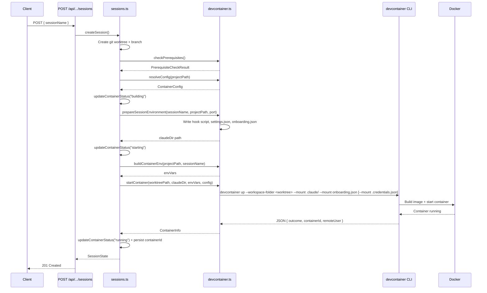
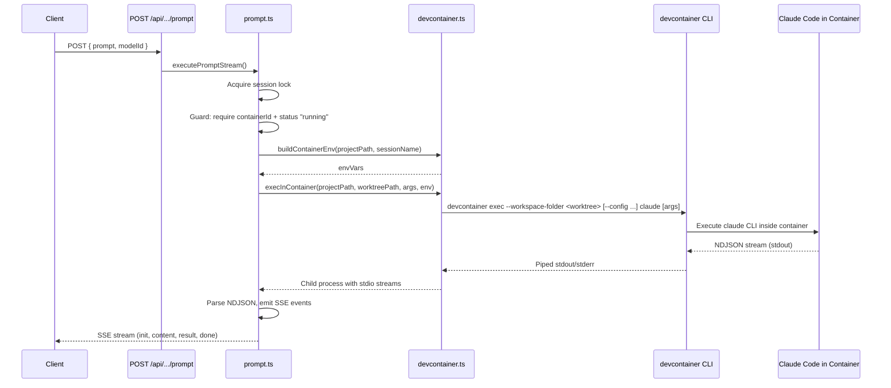
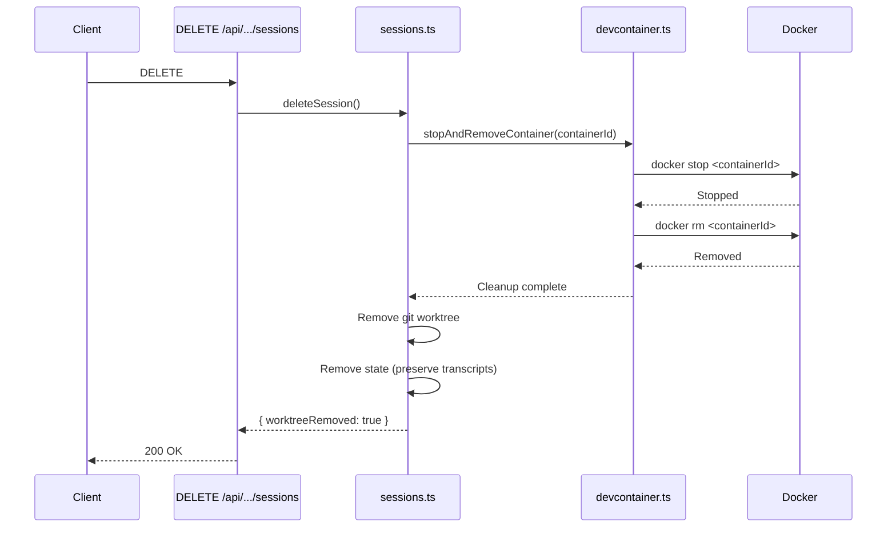
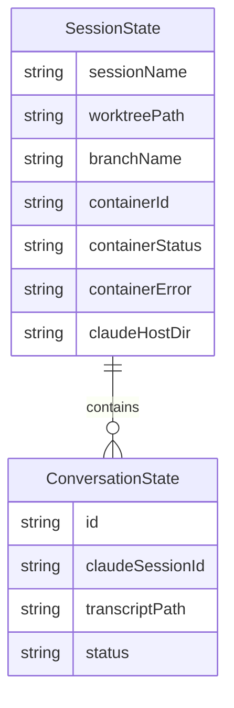

# Design Document: Dev Containers

## Overview

**Purpose**: This feature replaces CSM's direct host-based Claude Code execution with mandatory dev container isolation. Every session runs Claude Code inside its own Docker container with filesystem and network sandboxing, enabling safe `--dangerously-skip-permissions` operation.

**Users**: CSM operators and developers use this feature transparently — session creation, prompt execution, and observability workflows remain identical from the user's perspective, but all Claude Code processes execute within isolated containers.

**Impact**: Replaces the current `spawn("claude", ...)` execution model in `prompt.ts` with container-based execution via `devcontainer exec`. Extends session lifecycle in `sessions.ts` to manage container creation/destruction. Adds new `devcontainer.ts` module and default container configuration files.

### Goals
- Every Claude Code session runs inside a dedicated Docker container with network-level firewall rules
- Projects can provide their own `.devcontainer/devcontainer.json` for project-specific tooling
- Existing observability features (transcripts, hooks, diffs) continue working identically
- Container lifecycle is fully automatic — tied to session create/delete

### Non-Goals
- Custom firewall domain configuration per project (uses fixed allowlist from Anthropic reference)
- GPU passthrough or hardware device access
- Container orchestration (Kubernetes, Swarm) — single-host Docker only
- Running CSM itself inside a container (only Claude Code sessions are containerized)
- Multi-architecture image builds (host architecture only)

## Architecture

### Existing Architecture Analysis

CSM follows a subprocess-based architecture: Claude Code is invoked via `spawn()` as a child process on the host, with the session's worktree as the working directory. Key patterns to preserve:

- **Subprocess model**: External tools (Claude CLI, git) are invoked via `spawn`/`execFile`. Container management follows this pattern.
- **Schema-first state**: All data entities defined as Zod schemas. Container metadata extends `SessionState`.
- **Atomic state writes**: Write-to-temp + rename pattern for crash safety.
- **Single-flight locking**: In-memory promise map prevents concurrent prompts per session.
- **Hook-based event ingestion**: Claude Code hooks POST to CSM's `/api/hooks` endpoint for real-time status tracking.

### Architecture Pattern & Boundary Map

```mermaid
graph TB
    subgraph CSM Host
        API[API Routes]
        Sessions[sessions.ts]
        Prompt[prompt.ts]
        DC[devcontainer.ts]
        Hooks[hooks.ts]
        State[state.ts]
        Config[config.ts]

        API --> Sessions
        API --> Prompt
        Sessions --> DC
        Prompt --> DC
        DC --> DevCLI[devcontainer CLI]
        DC --> DockerCLI[docker CLI]
        Sessions --> State
        Prompt --> State
        Hooks --> State
    end

    subgraph Docker Container per Session
        Claude[Claude Code CLI]
        Firewall[iptables Firewall]
        HookScript[Hook Script]
        ClaudeDir[.claude directory]
    end

    DevCLI -->|devcontainer up/exec| Claude
    DockerCLI -->|docker stop/rm| Claude
    HookScript -->|POST host.docker.internal:3000| Hooks
    ClaudeDir -.->|bind-mount| HostClaudeDir[Host .claude dir]
    Worktree[Host Worktree] -.->|bind-mount| Workspace[/workspace]
```

**Architecture Integration**:
- **Selected pattern**: Layered subprocess delegation — new `devcontainer.ts` module wraps CLI tools, called by existing `sessions.ts` and `prompt.ts`
- **Domain boundaries**: Container management is encapsulated in `devcontainer.ts`. `sessions.ts` and `prompt.ts` call it without knowing Docker internals.
- **Existing patterns preserved**: Subprocess invocation via `spawn`/`execFile`, Zod schema-first data modeling, atomic state writes, single-flight locking
- **New components**: `devcontainer.ts` (container lifecycle), default container config files (Dockerfile, devcontainer.json, init-firewall.sh)
- **Steering compliance**: TypeScript strict mode, no `any` types, Zod schemas for new fields, kebab-case lib module naming

### Technology Stack

| Layer | Choice / Version | Role in Feature | Notes |
|-------|------------------|-----------------|-------|
| Container Runtime | Docker 20.10+ | Runs isolated Claude Code containers | Required for `host-gateway` support |
| Container Spec | devcontainer CLI (latest) | Builds and manages containers from devcontainer.json | Runtime prerequisite, not npm dependency |
| Container Cleanup | Docker CLI | Stops and removes containers | Fallback for in-development `devcontainer down` |
| Network Security | iptables + ipset | Firewall rules inside containers | Requires `NET_ADMIN` + `NET_RAW` capabilities |
| State Extension | Zod v4 | Schema for container metadata on SessionState | Extends existing `sessionStateSchema` |

## System Flows

### Session Creation with Container



### Prompt Execution Inside Container



### Session Deletion with Container Cleanup



## Requirements Traceability

| Requirement | Summary | Components | Interfaces | Flows |
|-------------|---------|------------|------------|-------|
| 1.1 | Build and start container on session create | devcontainer.ts, sessions.ts | DevcontainerService.startContainer | Session Creation |
| 1.2 | Stop and remove container on session delete | devcontainer.ts, sessions.ts | DevcontainerService.stopAndRemoveContainer | Session Deletion |
| 1.3 | Report container status during build/start | devcontainer.ts, schemas.ts | ContainerStatus enum on SessionState | Session Creation |
| 1.4 | Report errors with logs on container failure | devcontainer.ts | DevcontainerService.getContainerLogs | Session Creation |
| 1.5 | Reconcile stale containers on startup | devcontainer.ts | DevcontainerService.reconcileContainers | N/A (startup) |
| 1.6 | Independent container lifecycle per session | devcontainer.ts | Container naming by session | All flows |
| 2.1 | Default devcontainer config based on Anthropic ref | Default config files | N/A (static files) | Session Creation |
| 2.2 | Firewall with domain allowlist | init-firewall.sh | N/A (shell script) | Container startup |
| 2.3 | NET_ADMIN + NET_RAW capabilities | Default devcontainer.json | N/A (config) | Session Creation |
| 2.4 | Non-root user | Dockerfile | N/A (image config) | All flows |
| 2.5 | Claude Code pre-installed | Dockerfile | N/A (image config) | Prompt Execution |
| 2.6 | Default-deny firewall with verification | init-firewall.sh | N/A (shell script) | Container startup |
| 3.1 | Use project devcontainer.json if present | devcontainer.ts | DevcontainerService.resolveConfig | Session Creation |
| 3.2 | Fall back to CSM default | devcontainer.ts | DevcontainerService.resolveConfig | Session Creation |
| 3.3 | Support standard devcontainer features | devcontainer CLI | N/A (handled by CLI) | Session Creation |
| 3.4 | Report build errors without silent fallback | devcontainer.ts | DevcontainerService.startContainer | Session Creation |
| 3.5 | Rebuild on config change | devcontainer.ts | Config hash comparison | Session Creation |
| 4.1 | Execute Claude inside container | prompt.ts, devcontainer.ts | DevcontainerService.execInContainer | Prompt Execution |
| 4.2 | Stream NDJSON output from container | prompt.ts | Unchanged SSE streaming | Prompt Execution |
| 4.3 | Pass CLI flags to containerized Claude | prompt.ts | Unchanged arg construction | Prompt Execution |
| 4.4 | Support session resumption inside container | devcontainer.ts, sessions.ts | .claude/ bind-mount persistence | Prompt Execution |
| 4.5 | Single-flight locking | lock.ts | Unchanged | Prompt Execution |
| 4.6 | Timeout and process termination | prompt.ts, devcontainer.ts | Process kill via child.kill | Prompt Execution |
| 5.1 | Bind-mount worktree as workspace | devcontainer.ts | workspaceMount in config | Session Creation |
| 5.2 | Immediate file change reflection | Bind-mount | N/A (OS-level) | Prompt Execution |
| 5.3 | Read-write workspace access | devcontainer.json | N/A (mount config) | Prompt Execution |
| 5.4 | Git operations on host | sessions.ts | Unchanged git operations | All flows |
| 6.1 | Three auth methods (API key, OAuth token, .credentials.json) | devcontainer.ts | buildContainerEnv, startContainer mounts | Session Creation |
| 6.2 | Whitelist-only env var approach | devcontainer.ts | buildContainerEnv | Session Creation |
| 6.3 | Error when no auth method available | devcontainer.ts | buildContainerEnv validation | Session Creation |
| 6.4 | Onboarding bypass for OAuth | devcontainer.ts | prepareSessionEnvironment + startContainer mount | Session Creation |
| 7.1 | Host-accessible transcripts | devcontainer.ts | .claude/ bind-mount | Session Creation |
| 7.2 | Persist .claude/ across restarts | devcontainer.ts | Bind-mount to host dir | Session Creation |
| 7.3 | Retain transcripts on session delete | sessions.ts | Skip .claude/ cleanup | Session Deletion |
| 7.4 | Unchanged transcript parsing | conversations.ts | Updated path resolution | All flows |
| 8.1 | Configure hooks inside container | devcontainer.ts | Pre-written hook config | Session Creation |
| 8.2 | Allow container-to-host connectivity | devcontainer.json, init-firewall.sh | host.docker.internal in runArgs | Session Creation |
| 8.3 | Match hook events to sessions | hooks.ts, schemas.ts | Session identity matching via csm_project_path + csm_session_name | Hook processing |
| 8.4 | Non-blocking hook delivery | Hook script | Async curl with background | Hook processing |
| 9.1 | Verify Docker on startup | devcontainer.ts | DevcontainerService.checkPrerequisites | Startup |
| 9.2 | Error message for missing Docker | devcontainer.ts | DevcontainerService.checkPrerequisites | Startup |
| 9.3 | Error for permission issues | devcontainer.ts | DevcontainerService.checkPrerequisites | Startup |
| 9.4 | Container logs in error responses | devcontainer.ts | DevcontainerService.getContainerLogs | Error handling |
| 10.1 | Container status in API and UI | schemas.ts, session API | containerStatus field | All flows |
| 10.2 | Status transition notifications | sessions.ts, SSE broadcaster | Broadcast on status change | All flows |
| 10.3 | Container log retrieval API | Container logs API route | GET /api/.../sessions/.../container-logs | Debugging |

## Components and Interfaces

| Component | Domain/Layer | Intent | Req Coverage | Key Dependencies | Contracts |
|-----------|------------|--------|--------------|-----------------|-----------|
| devcontainer.ts | Lib / Infrastructure | Container lifecycle management | 1, 2, 3, 5, 6, 9 | devcontainer CLI (P0), Docker CLI (P0) | Service, State |
| Default container config | Static / Infrastructure | Secure default devcontainer setup | 2 | None | N/A |
| prompt.ts (modified) | Lib / Execution | Execute Claude inside container | 4 | devcontainer.ts (P0) | Service |
| sessions.ts (modified) | Lib / Lifecycle | Orchestrate container with session lifecycle | 1, 7 | devcontainer.ts (P0) | Service |
| schemas.ts (extended) | Lib / Data | Container metadata on SessionState | 10 | None | State |
| hooks integration (modified) | Lib / Events | Hook config and event matching | 8 | devcontainer.ts (P1) | Service |
| conversations.ts (modified) | Lib / Observability | Transcript path resolution for containers | 7 | devcontainer.ts (P1) | Service |
| Container logs API | API / Observability | Expose container logs for debugging | 9.4, 10.3 | devcontainer.ts (P0) | API |

### Lib / Infrastructure

#### devcontainer.ts

| Field | Detail |
|-------|--------|
| Intent | Encapsulates all container lifecycle operations: build, start, exec, stop, remove, status, and prerequisite checks |
| Requirements | 1.1–1.6, 2.1–2.6, 3.1–3.5, 5.1–5.3, 6.1–6.3, 9.1–9.4 |

**Responsibilities & Constraints**
- Wraps `devcontainer` CLI and `docker` CLI as subprocesses
- Resolves devcontainer.json: project `.devcontainer/devcontainer.json` → CSM default
- Manages per-session `.claude/` host directories for bind-mount
- Writes hook configuration (settings.json + hook script) before container start
- Captures `containerId` from `devcontainer up` JSON output
- Uses Docker CLI for container stop/remove (more reliable than in-development `devcontainer down`)

**Dependencies**
- External: `devcontainer` CLI — container build/start/exec (P0)
- External: `docker` CLI — container stop/remove/inspect/logs (P0)
- Inbound: `sessions.ts` — calls lifecycle methods (P0)
- Inbound: `prompt.ts` — calls exec method (P0)
- Outbound: `config.ts` — reads CSM config for data directory (P1)

**Contracts**: Service [x] / State [x]

##### Service Interface
```typescript
interface ContainerInfo {
  containerId: string;
  remoteUser: string;
  remoteWorkspaceFolder: string;
}

interface ContainerConfig {
  /** Path to devcontainer.json being used (project or default) */
  configPath: string;
  /** Whether this is the CSM default config */
  isDefault: boolean;
}

interface PrerequisiteCheckResult {
  dockerAvailable: boolean;
  dockerPermissions: boolean;
  devcontainerCliAvailable: boolean;
  errors: string[];
}

// Exported functions (not a class — module-level functions):

/** Verify Docker and devcontainer CLI are available */
function checkPrerequisites(): Promise<PrerequisiteCheckResult>;

/** Resolve which devcontainer.json to use for a project (synchronous) */
function resolveConfig(projectPath: string): ContainerConfig;

/** Generate a container name from session name: csm-<sanitized>-<hash> */
function containerName(sessionName: string): string;

/** Prepare hook config, settings.json, onboarding.json, and .claude/ directory */
function prepareSessionEnvironment(
  sessionName: string,
  projectPath: string,  // Note: projectPath, not worktreePath
  csmPort: number,
): Promise<string>; // Returns host .claude/ dir path

/** Build env vars for container. Supports API key, OAuth token, and .credentials.json. Throws if no auth. */
function buildContainerEnv(
  projectPath: string,
  sessionName: string,
): Record<string, string>;

/** Build and start a container via devcontainer up with --mount flags */
function startContainer(
  worktreePath: string,
  claudeDir: string,
  envVars: Record<string, string>,
  config: ContainerConfig,  // Required: determines --config flag usage
): Promise<ContainerInfo>;

/** Execute a command inside a running container via devcontainer exec */
function execInContainer(
  projectPath: string,  // Required: used to resolveConfig for --config flag
  worktreePath: string,
  command: string[],
  env: Record<string, string>,
): ChildProcess;

/** Stop and remove a container by ID using Docker CLI */
function stopAndRemoveContainer(containerId: string): Promise<void>;

/** Get recent logs from a container */
function getContainerLogs(containerId: string, tail?: number): Promise<string>;

/** Check if a container is currently running */
function isContainerRunning(containerId: string): Promise<boolean>;

/** Reconcile sessions with stale/missing containers */
function reconcileContainers(
  sessions: Array<{ containerId: string | null; sessionName: string }>,
): Promise<Array<{ sessionName: string; action: "restarted" | "marked-unhealthy" }>>;
```
- Preconditions: Docker daemon running, devcontainer CLI installed, valid worktree path
- Postconditions: Container running with workspace mounted, hooks configured, .claude/ persisted
- Invariants: One container per session, container ID persisted in session state

##### State Management
- Container ID and status stored on `SessionState` (see Data Models)
- Host `.claude/` directory path derived from session: `<csm-data-dir>/containers/<sanitized-name>-<sha256-hash>/`
- Container status transitions: `none` → `building` → `starting` → `running` → `stopped` | `error`
- Container names follow pattern: `csm-<sanitized-session>-<sha256-8chars>` (deterministic per session)

**Implementation Notes**
- `devcontainer up` is invoked with `--workspace-folder` pointing to the host worktree. For project-provided configs, the CLI reads from `.devcontainer/` within the workspace. For CSM defaults, the `--config <path>` flag points to CSM's bundled `devcontainer.json`.
- `startContainer()` adds three `--mount` bind-mounts via CLI flags (not in devcontainer.json):
  1. `.claude/` host directory → `/home/node/.claude` (hook config, settings, transcripts)
  2. `onboarding.json` → `/home/node/.claude.json` (skips interactive onboarding for OAuth)
  3. `~/.claude/.credentials.json` → `/home/node/.claude/.credentials.json` (read-only, for Claude Max/Pro OAuth — only if host file exists)
- `devcontainer exec` streams stdio, compatible with existing readline-based NDJSON parsing. `execInContainer` internally calls `resolveConfig()` to pass `--config` for CSM defaults.
- Each container receives `CSM_PROJECT_PATH` and `CSM_SESSION_NAME` environment variables via `--remote-env` for hook event identification.
- `buildContainerEnv()` supports three auth methods (checked in order): `ANTHROPIC_API_KEY` env var, `CLAUDE_CODE_OAUTH_TOKEN` env var, `~/.claude/.credentials.json` file. Throws if none available.

### Static / Infrastructure

#### Default Container Configuration

| Field | Detail |
|-------|--------|
| Intent | Ship a secure default devcontainer setup based on Anthropic's reference implementation |
| Requirements | 2.1–2.6 |

**Files** (shipped with CSM, e.g., `src/lib/devcontainer-defaults/`):

- **`devcontainer.json`**: Minimal config with CSM-specific additions:
  - `build.dockerfile`: Points to local `Dockerfile`
  - `runArgs`: includes `--add-host=host.docker.internal:host-gateway` for hook connectivity
  - `containerEnv`: `DEVCONTAINER=true` only (API key and other env vars passed via `--remote-env` CLI flags at runtime, not in config)
  - `postStartCommand`: Firewall initialization via `sudo /usr/local/bin/init-firewall.sh`
  - `capAdd`: `["NET_ADMIN", "NET_RAW"]` for iptables
  - `remoteUser`: `node`
  - Note: Bind-mounts for `.claude/`, `onboarding.json`, and `.credentials.json` are passed via `--mount` CLI flags in `startContainer()`, not in devcontainer.json

- **`Dockerfile`**: Based on Anthropic reference:
  - Node.js 20 base image
  - Claude Code CLI pre-installed globally
  - iptables, ipset, iproute2, dnsutils, aggregate for firewall
  - git, curl for basic operations
  - Non-root `node` user with sudo for firewall script only

- **`init-firewall.sh`**: Adapted from Anthropic reference:
  - Allowlisted domains: Anthropic API, npm, GitHub, Sentry, Statsig
  - DNS (UDP 53) and SSH (TCP 22) allowed
  - Host network access allowed (for hook delivery)
  - Default-deny policy with REJECT for immediate feedback
  - Verification: confirms blocked domain unreachable, allowed domain reachable

**Implementation Notes**
- These files are bundled with CSM (e.g., `src/lib/devcontainer-defaults/`). When a project has no `.devcontainer/devcontainer.json`, CSM uses the `--config` flag to point to the default config: `devcontainer up --workspace-folder <worktree> --config <csm-defaults-dir>/devcontainer.json`. This avoids copying files into the project worktree.
- Project-provided `.devcontainer/` configs are used directly by the devcontainer CLI without CSM modification or the `--config` flag. Projects that need hook connectivity to CSM should include `--add-host=host.docker.internal:host-gateway` in their own `runArgs`.

### Lib / Execution

#### prompt.ts (modified)

| Field | Detail |
|-------|--------|
| Intent | Execute Claude Code inside the session's container instead of directly on host |
| Requirements | 4.1–4.6 |

**Changes from current implementation**:
- Replace `spawn("claude", args, { cwd: session.worktreePath })` with `execInContainer(projectPath, session.worktreePath, ["claude", ...args], env)`
- **Container guard**: Before spawning, verify `session.containerId` is set and `session.containerStatus === "running"`. Throw descriptive error if container is missing or not running — never execute `--dangerously-skip-permissions` outside a sandbox.
- Build environment variables via `buildContainerEnv(projectPath, sessionName)` which uses whitelist-only approach (API key, OAuth token, CSM identity, DEVCONTAINER flag)
- The returned `ChildProcess` has the same stdio interface — readline-based NDJSON parsing and SSE emission remain unchanged
- Timeout handling remains in `prompt.ts` via `child.kill("SIGTERM")`
- Single-flight locking via `lock.ts` is unchanged
- Transcript path resolution uses `/workspace` as the project directory when `claudeHostDir` is set (container sees `/workspace`, not host path)

**Implementation Notes**
- The `execInContainer` function returns a `ChildProcess` with piped stdio, maintaining full compatibility with existing stream parsing.
- `execInContainer` internally calls `resolveConfig(projectPath)` to determine whether to pass `--config` flag for CSM default configs.
- `devcontainer exec` applies `remoteUser` and `remoteEnv` from the devcontainer.json config automatically.

### Lib / Lifecycle

#### sessions.ts (modified)

| Field | Detail |
|-------|--------|
| Intent | Orchestrate container lifecycle alongside session lifecycle |
| Requirements | 1.1, 1.2, 7.3 |

**Changes from current implementation**:
- `createSession()`: After worktree creation, calls `checkPrerequisites()`, `resolveConfig()`, `prepareSessionEnvironment()`, `buildContainerEnv()`, and `startContainer()`. Uses `updateContainerStatus()` helper to atomically persist status + broadcast SSE on each transition (`none` → `building` → `starting` → `running`). On container failure: sets status to `"error"`, cleans up container, worktree, and branch, then removes session from state entirely.
- `deleteSession()`: Before worktree removal, calls `stopAndRemoveContainer(session.containerId)`. Container cleanup failure logs a warning but does not block session deletion. Preserves `.claude/` host directory for transcript retention (AC 7.3).
- `updateContainerStatus()`: Private helper that updates `containerStatus` (and optional `containerId`, `containerError`, `claudeHostDir` fields) on the session, persists via `updateSession()`, and broadcasts SSE `container-status` event — all in one atomic operation.

### Lib / Data

#### schemas.ts (extended)

| Field | Detail |
|-------|--------|
| Intent | Add container metadata fields to SessionState schema |
| Requirements | 10.1 |

**New schema additions**:

```typescript
const containerStatusSchema = z.enum([
  "none",
  "building",
  "starting",
  "running",
  "stopped",
  "error",
]);
type ContainerStatus = z.infer<typeof containerStatusSchema>;

// Extended sessionStateSchema fields:
// containerId: z.string().nullable().default(null)
// containerStatus: containerStatusSchema.default("none")
// containerError: z.string().nullable().default(null)
// claudeHostDir: z.string().nullable().default(null)
```

**Implementation Notes**
- `containerId`: Docker container hash captured from `devcontainer up` JSON output
- `containerStatus`: Current lifecycle state, updated on transitions
- `containerError`: Last error message if container failed to start/run
- `claudeHostDir`: Host path where `.claude/` is bind-mounted for this session

### Lib / Events

#### hooks integration (modified)

| Field | Detail |
|-------|--------|
| Intent | Configure hooks inside containers and handle container-originated hook events |
| Requirements | 8.1–8.4 |

**Changes**:
- **Session-identifying env vars**: Each container receives `CSM_PROJECT_PATH` and `CSM_SESSION_NAME` environment variables via `--remote-env` CLI flags. These uniquely identify the session.
- **Hook script generation** (`devcontainer.ts`): Generates a modified hook script that uses `host.docker.internal` instead of `localhost` and injects session identity into the POST body:
  ```
  jq --arg project "$CSM_PROJECT_PATH" --arg session "$CSM_SESSION_NAME" \
    '. + {csm_project_path: $project, csm_session_name: $session}' \
    | curl -s -X POST http://host.docker.internal:3000/api/hooks \
    -H "Content-Type: application/json" -d @- > /dev/null 2>&1 &
  ```
- **settings.json**: Written to the session's `.claude/` host directory before container start, with hooks configured for `UserPromptSubmit` and `Stop` events.
- **hookEventDataSchema extension**: Add optional `csm_project_path: z.string().optional()` and `csm_session_name: z.string().optional()` fields to the hook event schema.
- **hooks.ts** (`processHookEvent`): When `csm_project_path` and `csm_session_name` are present in the hook event, match directly by project path + session name (bypassing `findSessionByCwd`). Falls back to `cwd`-based matching for non-containerized sessions (imported/external).

**Implementation Notes**
- Hook events from containers include `csm_project_path` and `csm_session_name` fields, enabling direct session matching without relying on `cwd`. This avoids the ambiguity where all containerized sessions report `cwd` as `/workspace`.
- The existing `findSessionByCwd` function remains unchanged as a fallback for non-containerized hook events (e.g., imported sessions from direct Claude Code CLI usage).
- `jq` is included in the default Dockerfile (already present in Anthropic reference). The hook script uses it to merge session identity into the JSON payload piped from Claude Code.

### Lib / Observability

#### conversations.ts (modified)

| Field | Detail |
|-------|--------|
| Intent | Read transcripts from session's bind-mounted .claude/ directory |
| Requirements | 7.1, 7.4 |

**Changes**:
- `getClaudeProjectDir()`: When a session has `claudeHostDir` set, read transcripts from `<claudeHostDir>/projects/<encoded-path>/` where the encoded path is based on the container-internal workspace path (e.g., `/workspace` → `-workspace`).
- Auto-import logic (`discoverAndImportConversations`): Extended to look in the session's `claudeHostDir` in addition to the host's global `~/.claude/` directory.
- `encodeProjectPath` continues to encode the path as Claude sees it — which inside a container is `/workspace`.

### API / Observability

#### Container Logs API

| Field | Detail |
|-------|--------|
| Intent | Expose container logs for debugging |
| Requirements | 9.4, 10.3 |

**Contracts**: API [x]

##### API Contract

| Method | Endpoint | Request | Response | Errors |
|--------|----------|---------|----------|--------|
| GET | `/api/projects/[name]/sessions/[session]/container-logs` | `?tail=100` (query param) | `{ logs: string }` | 404 (no container), 500 |

**Implementation Notes**
- Delegates to `devcontainerService.getContainerLogs(containerId, tail)`
- Uses `docker logs --tail <n> <containerId>` internally
- Returns raw log output as a string

## Data Models

### Domain Model

Container metadata is an extension of the existing `SessionState` aggregate. No new aggregates are introduced.



**Invariants**:
- A session with `containerStatus = "running"` must have a non-null `containerId`
- A session with `containerStatus = "none"` has `containerId = null`
- `claudeHostDir` is set during session creation and persists across session lifecycle

### Logical Data Model

**SessionState extensions** (added to existing schema):

| Field | Type | Default | Description |
|-------|------|---------|-------------|
| `containerId` | `string \| null` | `null` | Docker container hash |
| `containerStatus` | `ContainerStatus` | `"none"` | Current container lifecycle state |
| `containerError` | `string \| null` | `null` | Last error message |
| `claudeHostDir` | `string \| null` | `null` | Host path for .claude/ bind-mount |

**Consistency**: Container status is updated atomically with session state via existing `writeState()` + atomic rename.

### Data Contracts

**`devcontainer up` output** (parsed from JSON):
```typescript
interface DevcontainerUpOutput {
  outcome: "success" | "error";
  containerId: string;
  remoteUser: string;
  remoteWorkspaceFolder: string;
}
```

**Container status SSE event** (broadcast on status transitions):
```typescript
interface ContainerStatusEvent {
  type: "container-status";
  projectName: string;
  sessionName: string;
  containerStatus: ContainerStatus;
  containerId: string | null;
  error: string | null;
}
```

## Error Handling

### Error Categories and Responses

**Prerequisite Errors (startup)**:
- Docker not installed → Log error, display guidance in CSM UI, block session creation
- Docker daemon not running → Same as above
- Docker permission denied → Report specific permission error with `usermod -aG docker` guidance
- devcontainer CLI not installed → Log error, display install guidance

**Container Build Errors (4xx/5xx)**:
- Dockerfile syntax error → Return build logs in 500 response, set `containerStatus = "error"`
- Network error during build → Include error in logs, suggest retry
- Project devcontainer.json invalid → Return validation error, do not fall back to default

**Container Runtime Errors**:
- Container exits unexpectedly → Set `containerStatus = "stopped"`, block prompts
- `devcontainer exec` fails → Return error with container logs, emit SSE error event
- Timeout during prompt → Kill process via `child.kill("SIGTERM")`, same as current behavior

**Hook Delivery Errors**:
- Container cannot reach host → Hook delivery fails silently (background curl), Claude Code unaffected
- CSM not running → Same as above — fire-and-forget pattern preserved

### Monitoring
- Container status transitions logged via existing `createLogger()` pattern
- Container build/start times logged for performance tracking
- Hook delivery failures visible in container logs (curl stderr)

## Testing Strategy

### Unit Tests
- `devcontainer.ts`: `resolveConfig()` — project config vs default fallback detection
- `devcontainer.ts`: `prepareSessionEnvironment()` — hook script, settings.json, and onboarding.json generation
- `devcontainer.ts`: `buildContainerEnv()` — API key, OAuth token, .credentials.json fallback, whitelist enforcement
- `devcontainer.ts`: `containerName()` — deterministic naming, sanitization, uniqueness
- `devcontainer.ts`: `stopAndRemoveContainer()` — graceful handling of already-stopped/removed containers
- `devcontainer.ts`: `isContainerRunning()` — Docker inspect parsing
- `devcontainer.ts`: `getContainerLogs()` — log retrieval and error handling
- `devcontainer.ts`: `reconcileContainers()` — stale container detection
- `schemas.ts`: Container status schema validation and defaults
- `hooks.ts`: Container identity matching (`csm_project_path` + `csm_session_name`) and cwd fallback

### Integration Tests
- Session creation: Verify worktree + container created, container ID persisted
- Session deletion: Verify container stopped/removed, worktree removed, transcripts retained
- Prompt execution: Verify Claude CLI executed inside container with correct args
- Hook delivery: Verify hook events from container matched to session
- Transcript reading: Verify transcripts readable from bind-mounted .claude/ directory

### E2E Tests
- Full flow: Create session → submit prompt → receive SSE response → view transcript → delete session
- Project with custom `.devcontainer/devcontainer.json` → verify custom config used
- Missing Docker → verify error message displayed

## Security Considerations

- **Network isolation**: iptables firewall with default-deny policy, only whitelisted domains accessible
- **Filesystem isolation**: Container can only access bind-mounted worktree and .claude/ directory
- **Credential handling**: Three auth methods supported — API key and OAuth token passed via `--remote-env` (not written to filesystem), `.credentials.json` bind-mounted read-only from host. Whitelist-only env var approach prevents leaking host environment.
- **Non-root execution**: Claude Code runs as `node` user, only firewall script has sudo access
- **Warning**: As noted in Anthropic's docs, devcontainers do not prevent exfiltration from within the container itself. Only use with trusted repositories.

## Performance & Scalability

- **First-time build**: Container image build takes 1–3 minutes. Subsequent sessions reuse cached images.
- **Container startup**: ~5–10 seconds after image is built (container creation + firewall init)
- **Prompt execution overhead**: `devcontainer exec` adds ~1 second overhead vs direct `spawn` (process creation inside container)
- **Resource usage**: Each container consumes ~100–200MB RAM baseline (Node.js + Claude CLI). Multiple concurrent sessions require proportional resources.
- **Image caching**: `devcontainer up` uses Docker layer caching. Sessions in the same project with the same config share the cached image.
