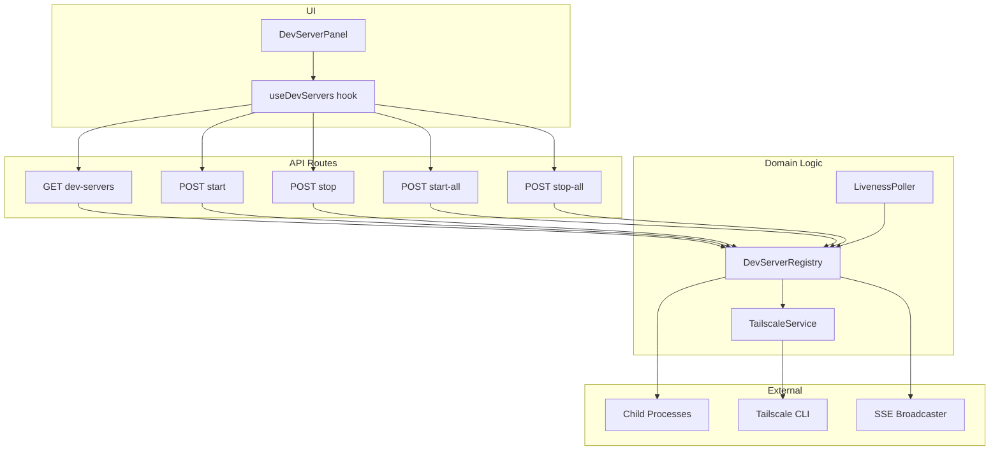
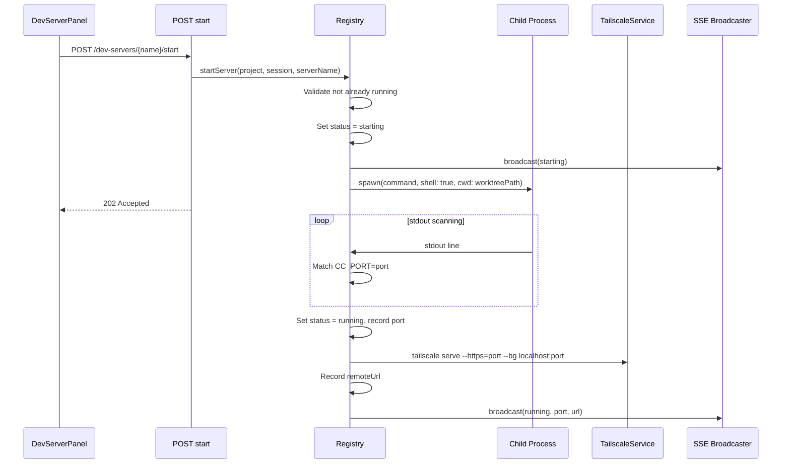
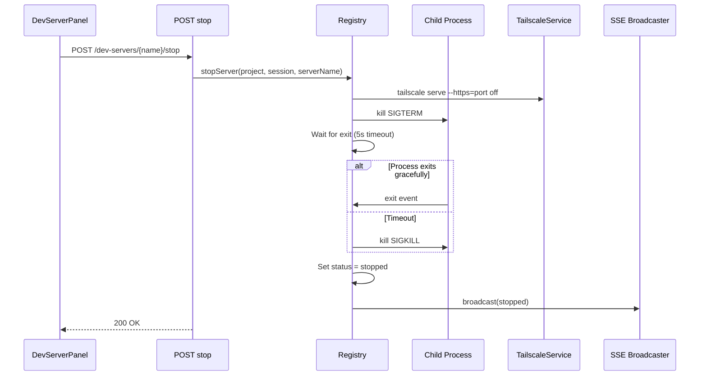
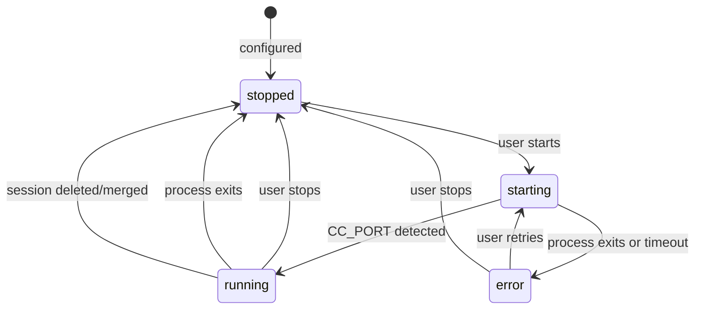
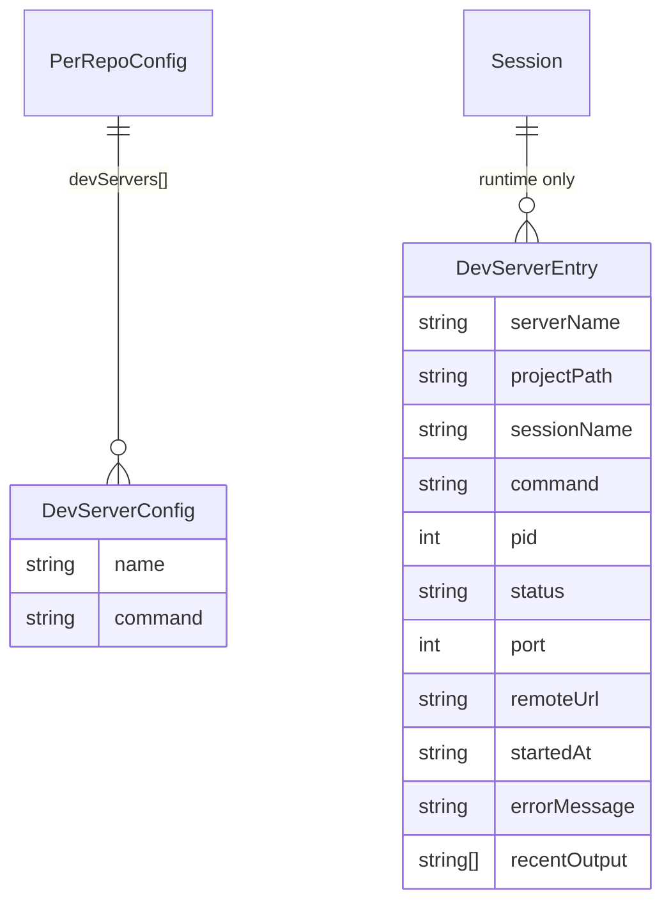
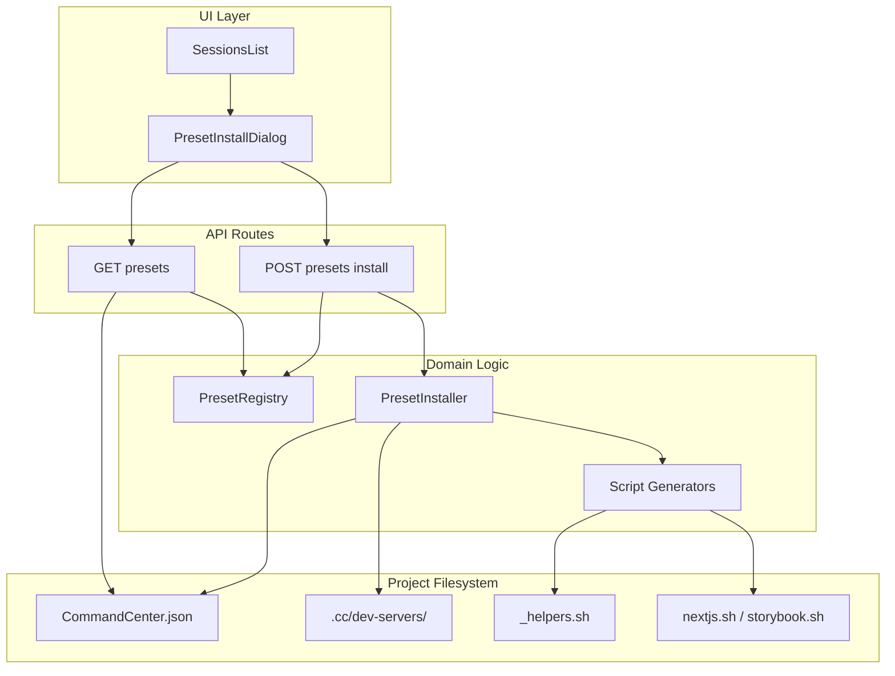
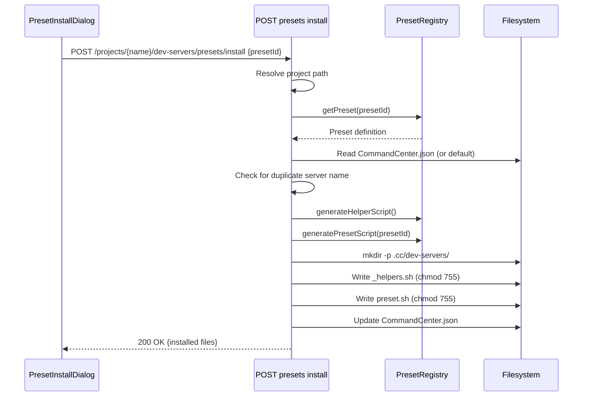
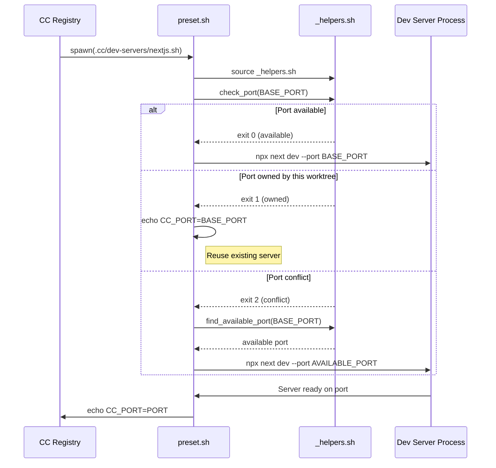

# Design Document: Dev Server Automation

## Overview

**Purpose**: This feature delivers automated dev server lifecycle management within CC sessions, enabling users to launch, monitor, and stop project-defined dev servers directly from the session overview page without manual terminal setup.

**Users**: CC users managing coding sessions across projects will use this to spin up dev servers (e.g., Next.js, Storybook) in a session's worktree and access them over the Tailscale network from any device.

**Impact**: Introduces a new in-memory process management subsystem, new API routes, new SSE event types, Tailscale Serve integration, and a UI control panel on the session overview page. No changes to the existing `state.json` persistence model.

### Goals
- Enable per-project, multi-server dev server configuration via `CommandCenter.json`
- Provide start/stop/status lifecycle management with real-time SSE-driven UI updates
- Expose dev servers over the tailnet via Tailscale Serve with zero manual setup
- Auto-cleanup dev servers on session delete, merge, or CC shutdown
- Maintain port isolation across worktrees without CC-managed port allocation

### Non-Goals
- CC-managed port allocation (dev servers choose their own ports; CC discovers them via `CC_PORT=` protocol)
- Persistent dev server state across CC restarts (in-memory only, per requirement 5.3)
- Auto-start dev servers on session creation (user-initiated only)
- Support for dev server log streaming to the UI beyond recent diagnostic output
- Dev server process restart/retry logic (manual restart via UI)

## Architecture

### Existing Architecture Analysis

CC is a server-rendered Next.js application with API routes as the backend. Key patterns relevant to this feature:

- **In-memory singletons**: 7 modules use `globalThis`-backed singletons with `__cc_*` keys for HMR-safe state (SSE clients, abort controllers, background jobs, locks, query registry, state mutex, merge detection)
- **SSE broadcasting**: `sse-broadcaster.ts` broadcasts typed events to all connected clients; the `SSEEvent` union in `schemas.ts` defines allowed event types
- **Session lifecycle**: `sessions.ts` handles create/delete; `background-jobs.ts` handles merge via `setSessionFinished`; no existing shutdown hook
- **Process execution**: All subprocess calls use `execFile` (promisified) for short-lived commands; no long-lived `spawn` usage exists
- **Per-repo config**: `CommandCenter.json` parsed via `perRepoConfigSchema` in `schemas.ts`, read by `readRepoConfig()` in `repo-config.ts`

### Architecture Pattern & Boundary Map



**Architecture Integration**:
- **Selected pattern**: In-memory registry with globalThis singleton — consistent with all existing CC runtime state management
- **Domain boundaries**: `dev-server-registry.ts` owns all process state and lifecycle; `tailscale.ts` encapsulates CLI interactions; API routes are thin orchestration
- **Existing patterns preserved**: `withTracing` route wrappers, `broadcast()` for SSE, Zod schema-first types, `readRepoConfig()` for project config
- **New components rationale**: Registry (process lifecycle), TailscaleService (CLI abstraction), LivenessPoller (health monitoring), DevServerPanel (UI)
- **Steering compliance**: TypeScript strict mode, Zod schemas, colocated components, lib module per domain concept

### Technology Stack

| Layer | Choice / Version | Role in Feature | Notes |
|-------|------------------|-----------------|-------|
| Frontend | React 19, TanStack Query | DevServerPanel component, useDevServers hook | Consistent with existing session UI |
| Backend | Next.js 15 API Routes | REST endpoints for start/stop/status | `withTracing` wrapper, `force-dynamic` |
| Process Mgmt | Node.js `child_process.spawn` with `shell: true` | Long-lived dev server process management | First `spawn` usage in codebase; `shell: true` gives Node.js direct handle for clean termination |
| Networking | Tailscale CLI (`tailscale serve`, `tailscale status`) | HTTPS exposure over tailnet | Requires `--operator` pre-configured |
| Events | SSE via `sse-broadcaster.ts` | Real-time status updates to UI | New `dev-server-status` event type |
| State | `globalThis` Map singleton | In-memory process registry, HMR-safe | Matches 7 existing `__cc_*` singletons |
| Validation | Zod v4 | Schema-first types for config, API, events | `devServerConfigSchema`, `devServerStatusEventSchema` |

## System Flows

### Dev Server Start Flow



Key decisions:
- API returns 202 immediately; the `starting` → `running` transition is async and communicated via SSE
- Tailscale registration happens after port discovery, not before
- If Tailscale registration fails, the server continues running (req 4.4); the URL is omitted from the SSE event

### Dev Server Stop Flow



### Dev Server Lifecycle State Machine



## Requirements Traceability

| Requirement | Summary | Components | Interfaces | Flows |
|-------------|---------|------------|------------|-------|
| 1.1 | devServers array in CommandCenter.json | perRepoConfigSchema, readRepoConfig | Config schema | — |
| 1.2 | Missing config = zero servers | readRepoConfig, DevServerPanel | Config schema | — |
| 1.3 | Validate name + command non-empty | devServerConfigSchema | Config schema | — |
| 1.4 | Multiple servers per project | devServers array, Registry keying | Config schema, Registry | — |
| 2.1 | Spawn in worktree cwd | DevServerRegistry.startServer | Service interface | Start flow |
| 2.2 | CC_PORT stdout parsing | DevServerRegistry (stdout scanner) | — | Start flow |
| 2.3 | starting → running transition | DevServerRegistry, SSE | Event contract | Start flow |
| 2.4 | Exit before CC_PORT → error | DevServerRegistry | Event contract | Start flow |
| 2.5 | No duplicate start | DevServerRegistry.startServer guard | Service interface | Start flow |
| 2.6 | Capture recent output | DevServerRegistry (output buffer) | Service interface | — |
| 3.1 | Stop = terminate + status change | DevServerRegistry.stopServer | Service interface | Stop flow |
| 3.2 | Remove Tailscale on stop | TailscaleService.unregister | Service interface | Stop flow |
| 3.3 | Stop All | DevServerRegistry.stopAllForSession | Service interface | — |
| 4.1 | Register with Tailscale Serve | TailscaleService.register | Service interface | Start flow |
| 4.2 | Unregister on stop/exit | TailscaleService.unregister | Service interface | Stop flow |
| 4.3 | Resolve hostname for URL | TailscaleService.getHostname | Service interface | Start flow |
| 4.4 | Tailscale failure = non-blocking | TailscaleService (try/catch + log) | — | Start flow |
| 4.5 | No root access required | TailscaleService (--operator prereq) | — | — |
| 5.1 | globalThis-backed Map registry | DevServerRegistry | State management | — |
| 5.2 | No persistence to state.json | DevServerRegistry (in-memory only) | — | — |
| 5.3 | Clean slate on restart | DevServerRegistry (globalThis init) | — | — |
| 5.4 | Per-server runtime state fields | DevServerEntry type | State management | — |
| 6.1 | Periodic liveness checks | LivenessPoller | — | — |
| 6.2 | Dead process → stopped + cleanup | LivenessPoller, TailscaleService, SSE | Event contract | — |
| 6.3 | 5-10s polling interval | LivenessPoller (configurable) | — | — |
| 7.1 | SSE dev-server-status event | devServerStatusEventSchema, SSE | Event contract | All flows |
| 7.2 | Broadcast on all transitions | DevServerRegistry → broadcast() | Event contract | All flows |
| 8.1 | GET status endpoint | GET /dev-servers route | API contract | — |
| 8.2 | POST start endpoint | POST /dev-servers/[serverName]/start | API contract | Start flow |
| 8.3 | POST stop endpoint | POST /dev-servers/[serverName]/stop | API contract | Stop flow |
| 8.4 | Error for missing config | GET/POST routes (404 check) | API contract | — |
| 9.1 | Control panel when configured | DevServerPanel | — | — |
| 9.2 | Status indicators | DevServerPanel | — | — |
| 9.3 | Clickable remote URL | DevServerPanel | — | — |
| 9.4 | Per-server start/stop buttons | DevServerPanel | — | — |
| 9.5 | Start All / Stop All buttons | DevServerPanel | — | — |
| 9.6 | Real-time SSE updates | useDevServers hook | Event contract | — |
| 9.7 | Hidden when no config | DevServerPanel | — | — |
| 10.1 | Stop on session delete | deleteSession hook | Service interface | — |
| 10.2 | Stop on session merge | setSessionFinished hook | Service interface | — |
| 10.3 | Stop on CC exit | process SIGTERM handler | Service interface | — |

## Components and Interfaces

| Component | Domain/Layer | Intent | Req Coverage | Key Dependencies | Contracts |
|-----------|-------------|--------|--------------|------------------|-----------|
| DevServerRegistry | Core/Process Mgmt | Manage dev server process lifecycle | 2.1–2.6, 3.1, 3.3, 5.1–5.4, 7.2, 10.1–10.3 | TailscaleService (P0), SSE Broadcaster (P0) | Service, State |
| TailscaleService | Core/Networking | Encapsulate Tailscale CLI interactions | 4.1–4.5 | Tailscale CLI (P0, External) | Service |
| LivenessPoller | Core/Monitoring | Detect dead dev server processes | 6.1–6.3 | DevServerRegistry (P0) | Service |
| Dev Server API Routes | API Layer | REST endpoints for start/stop/status | 8.1–8.4 | DevServerRegistry (P0), readRepoConfig (P1) | API |
| DevServerPanel | UI/Session Page | Control panel for managing dev servers | 9.1–9.7 | useDevServers hook (P0) | — |
| useDevServers | UI/Hook | Data fetching + SSE subscription for dev server state | 9.6 | API Routes (P0), SSE (P0) | — |

### Core / Process Management

#### DevServerRegistry

| Field | Detail |
|-------|--------|
| Intent | Manage dev server process spawning, stdout parsing, graceful shutdown, and in-memory state tracking |
| Requirements | 2.1, 2.2, 2.3, 2.4, 2.5, 2.6, 3.1, 3.3, 5.1, 5.2, 5.3, 5.4, 7.2, 10.1, 10.2, 10.3 |

**Responsibilities & Constraints**
- Owns all dev server child process references and runtime state
- Enforces single-instance-per-server (no duplicate starts for the same server name in a session)
- Broadcasts SSE events on every status transition
- Captures last N lines of stdout/stderr per server in a circular buffer
- Registers a `process.on('SIGTERM')` handler at module init for CC shutdown cleanup

**Dependencies**
- Outbound: TailscaleService — register/unregister on port discovery/stop (P0)
- Outbound: `broadcast()` from `sse-broadcaster.ts` — SSE events (P0)
- Outbound: `readRepoConfig()` from `repo-config.ts` — validate server config (P1)
- Outbound: `createLogger()` from `logging/` — structured logging (P2)

**Contracts**: Service [x] / State [x]

##### Service Interface
```typescript
interface DevServerRegistryService {
  /** Start a dev server for a session. Returns immediately; status updates via SSE. */
  startServer(params: {
    projectPath: string;
    sessionName: string;
    serverName: string;
    command: string;
    worktreePath: string;
  }): Promise<void>;

  /** Stop a specific dev server. Removes Tailscale registration. */
  stopServer(params: {
    projectPath: string;
    sessionName: string;
    serverName: string;
  }): Promise<void>;

  /** Stop all dev servers for a session. */
  stopAllForSession(params: {
    projectPath: string;
    sessionName: string;
  }): Promise<void>;

  /** Stop all dev servers across all sessions (CC shutdown). */
  stopAll(): Promise<void>;

  /** Get runtime state for all dev servers in a session. */
  getSessionServers(params: {
    projectPath: string;
    sessionName: string;
  }): DevServerEntry[];

  /** Get runtime state for a specific dev server. */
  getServer(params: {
    projectPath: string;
    sessionName: string;
    serverName: string;
  }): DevServerEntry | undefined;
}
```
- Preconditions: `startServer` — server must not be in `starting` or `running` status; `command` and `worktreePath` must be non-empty
- Postconditions: `startServer` — entry created in registry with status `starting`; SSE event broadcast. `stopServer` — entry removed or set to `stopped`; Tailscale unregistered; SSE event broadcast
- Invariants: At most one running/starting process per `(projectPath, sessionName, serverName)` tuple

##### State Management

```typescript
/** In-memory state for a single dev server */
interface DevServerEntry {
  serverName: string;
  projectPath: string;
  sessionName: string;
  command: string;
  pid: number;
  status: "starting" | "running" | "stopped" | "error";
  port: number | null;
  remoteUrl: string | null;
  startedAt: string;
  errorMessage: string | null;
  recentOutput: string[];
}
```

- **State model**: `Map<string, DevServerEntry>` keyed by `${projectPath}::${sessionName}::${serverName}`
- **Persistence**: None — in-memory only via `globalThis.__cc_dev_servers`
- **Concurrency**: Single-threaded Node.js; no mutex needed for the registry Map itself; async operations (Tailscale CLI) are fire-and-forget with error logging

**Implementation Notes**
- Use `spawn(command, { shell: true, cwd: worktreePath, stdio: 'pipe' })` for arbitrary shell commands — `shell: true` lets Node.js manage shell invocation and provides a direct `ChildProcess` handle where `child.kill()` targets the shell process directly, avoiding the signal-forwarding problem of explicit `spawn('sh', ['-c', ...])` where SIGTERM may not reach the actual dev server
- Stdout scanning: line-buffer stdout, match `^CC_PORT=(\d+)$`, transition to `running`
- Startup timeout: 60s default; if `CC_PORT` not detected, transition to `error` with captured output
- Graceful kill: `child.kill('SIGTERM')` → 5s wait → `child.kill('SIGKILL')`
- Output buffer: Circular buffer of last 50 lines (combined stdout + stderr)
- Shutdown handler: `process.on('SIGTERM', () => registry.stopAll())` registered once at module init

---

### Core / Networking

#### TailscaleService

| Field | Detail |
|-------|--------|
| Intent | Encapsulate all Tailscale CLI interactions for dev server exposure |
| Requirements | 4.1, 4.2, 4.3, 4.4, 4.5 |

**Responsibilities & Constraints**
- Owns Tailscale Serve registration and unregistration
- Caches the Tailscale hostname for the process lifetime
- All failures are logged but never propagated (non-blocking per req 4.4)

**Dependencies**
- External: Tailscale CLI (`tailscale`) — must be on PATH (P0)
- Outbound: `createLogger()` — structured logging (P2)

**Contracts**: Service [x]

##### Service Interface
```typescript
interface TailscaleService {
  /** Register a local port with Tailscale Serve. Returns the remote URL or null on failure. */
  register(port: number): Promise<string | null>;

  /** Unregister a Tailscale Serve entry for the given port. */
  unregister(port: number): Promise<void>;

  /** Get the Tailscale hostname (cached). Returns null if Tailscale is unavailable. */
  getHostname(): Promise<string | null>;
}
```
- Preconditions: `register` — port must be a positive integer; Tailscale daemon must be running with `--operator` configured
- Postconditions: `register` — `tailscale serve --https=<port> --bg localhost:<port>` executed; returns `https://<hostname>:<port>` or null. `unregister` — `tailscale serve --https=<port> off` executed
- Invariants: Hostname is resolved once and cached; all errors caught and logged

**Implementation Notes**
- Use `execFile('tailscale', [...args])` (not `spawn`) since these are short-lived commands
- Hostname resolution: `execFile('tailscale', ['status', '--json'])` → parse `Self.DNSName` → strip trailing dot → cache
- If Tailscale CLI is not found or returns an error, log and return null (graceful degradation)

---

### Core / Monitoring

#### LivenessPoller

| Field | Detail |
|-------|--------|
| Intent | Periodically verify dev server processes are still alive |
| Requirements | 6.1, 6.2, 6.3 |

**Responsibilities & Constraints**
- Runs a `setInterval` loop checking all registered dev servers
- Detects exited processes via `process.kill(pid, 0)` (signal 0 = existence check)
- On dead process detection: transitions status to `stopped`, triggers Tailscale unregistration, broadcasts SSE event

**Dependencies**
- Inbound: DevServerRegistry — reads process entries (P0)
- Outbound: TailscaleService — cleanup dead server registrations (P1)
- Outbound: `broadcast()` — notify UI of status changes (P0)

**Contracts**: Service [x]

##### Service Interface
```typescript
interface LivenessPoller {
  /** Start the polling loop. Idempotent — calling when already running is a no-op. */
  start(): void;

  /** Stop the polling loop. */
  stop(): void;
}
```
- Preconditions: None
- Postconditions: `start` — interval timer active at 5s cadence. `stop` — interval cleared
- Invariants: Exactly one interval timer active at a time (guarded by globalThis key)

**Implementation Notes**
- Use `globalThis.__cc_dev_server_liveness` to store the interval ID (HMR-safe)
- Auto-start when the first dev server is registered; auto-stop when the registry empties
- `process.kill(pid, 0)` throws if the process does not exist — catch `ESRCH` to detect dead processes
- Polling interval: 5 seconds

---

### API Layer

#### Dev Server API Routes

| Field | Detail |
|-------|--------|
| Intent | REST endpoints for dev server start, stop, and status queries |
| Requirements | 8.1, 8.2, 8.3, 8.4 |

**Responsibilities & Constraints**
- Thin orchestration: validate input, delegate to DevServerRegistry, return response
- Follow existing API route patterns: `withTracing`, `export const dynamic = "force-dynamic"`, decoded params

**Dependencies**
- Inbound: DevServerPanel (via fetch) (P0)
- Outbound: DevServerRegistry — all lifecycle operations (P0)
- Outbound: `readRepoConfig()` — validate project has dev server config (P1)
- Outbound: `resolveProjectPath()` — resolve project name to path (P0)

**Contracts**: API [x]

##### API Contract

| Method | Endpoint | Request | Response | Errors |
|--------|----------|---------|----------|--------|
| GET | `/api/projects/[name]/sessions/[session]/dev-servers` | — | `DevServersStatusResponse` | 404 (project/session not found) |
| POST | `/api/projects/[name]/sessions/[session]/dev-servers/[serverName]/start` | — | `{ status: "accepted" }` | 404, 409 (already running), 400 (no config) |
| POST | `/api/projects/[name]/sessions/[session]/dev-servers/[serverName]/stop` | — | `{ status: "ok" }` | 404 (not running) |
| POST | `/api/projects/[name]/sessions/[session]/dev-servers/start-all` | — | `{ status: "accepted" }` | 404, 400 (no config) |
| POST | `/api/projects/[name]/sessions/[session]/dev-servers/stop-all` | — | `{ status: "ok" }` | 404 |

**Implementation Notes**
- GET response merges configured servers (from `CommandCenter.json`) with runtime state (from registry) — a configured-but-not-started server appears with status `stopped`
- POST start returns 202 (async operation); POST stop returns 200 (synchronous)
- All routes resolve project path via `resolveProjectPath(name)` and session via `getSession(projectPath, sessionName)`

---

### UI / Session Page

#### DevServerPanel

| Field | Detail |
|-------|--------|
| Intent | Control panel UI for launching, stopping, and monitoring dev servers within a session |
| Requirements | 9.1, 9.2, 9.3, 9.4, 9.5, 9.6, 9.7 |

**Responsibilities & Constraints**
- Renders only when the project has `devServers` configured (req 9.7)
- Displays per-server status indicators, start/stop buttons, and Tailscale remote URLs
- Updates in real-time via SSE events

**Dependencies**
- Inbound: SessionDetailPage — renders panel when config available (P0)
- Outbound: useDevServers hook — data and mutation functions (P0)

**Implementation Notes**
- Colocated with session page components: `src/app/projects/[name]/[session]/DevServerPanel.tsx`
- Status indicators: colored dot (gray=stopped, yellow=starting, green=running, red=error)
- Remote URL: clickable link with `target="_blank"` and `rel="noopener noreferrer"` (req 9.3)
- Start All / Stop All buttons enabled based on aggregate state
- Error state shows truncated recent output for diagnostics
- Summary-only component — no new boundaries introduced beyond what `useDevServers` provides

#### useDevServers Hook

| Field | Detail |
|-------|--------|
| Intent | Data fetching and SSE subscription for dev server state |
| Requirements | 9.6 |

**Implementation Notes**
- TanStack Query for initial data fetch (`GET /dev-servers`) with SSE event listener for real-time cache invalidation
- Exposes: `servers` (array), `startServer(name)`, `stopServer(name)`, `startAll()`, `stopAll()`, `isLoading`
- SSE subscription filters for `dev-server-status` events matching current project + session
- Mutation functions call the corresponding POST endpoints and optimistically update status

## Data Models

### Domain Model

The dev server domain introduces one new aggregate (`DevServerEntry`) and extends one existing entity (`PerRepoConfig`):



- **PerRepoConfig** (persisted in `CommandCenter.json`): Extended with optional `devServers` array
- **DevServerEntry** (in-memory only): Runtime process state, not persisted

### Logical Data Model

**Configuration (persisted)**:

```typescript
/** Extension to perRepoConfigSchema */
const devServerConfigSchema = z.object({
  name: z.string().min(1),
  command: z.string().min(1),
});
type DevServerConfig = z.infer<typeof devServerConfigSchema>;

/** Updated perRepoConfigSchema */
const perRepoConfigSchema = z.object({
  initScriptPath: z.string().nullable(),
  preMergeCommand: z.string().nullable().optional(),
  devServers: z.array(devServerConfigSchema).optional(),
});
```

**Runtime state (in-memory)**:

```typescript
const devServerStatusSchema = z.enum(["starting", "running", "stopped", "error"]);
type DevServerStatus = z.infer<typeof devServerStatusSchema>;
```

Registry key: `${projectPath}::${sessionName}::${serverName}` — guarantees uniqueness across worktrees.

### Data Contracts & Integration

**SSE Event Schema**:

```typescript
const devServerStatusEventSchema = z.object({
  type: z.literal("dev-server-status"),
  projectName: z.string(),
  sessionName: z.string(),
  serverName: z.string(),
  status: devServerStatusSchema,
  port: z.number().nullable(),
  remoteUrl: z.string().nullable(),
  errorMessage: z.string().nullable(),
});
type DevServerStatusEvent = z.infer<typeof devServerStatusEventSchema>;
```

Added to the `SSEEvent` union in `schemas.ts`.

**API Response Schema**:

```typescript
const devServerRuntimeStateSchema = z.object({
  serverName: z.string(),
  command: z.string(),
  status: devServerStatusSchema,
  pid: z.number().nullable(),
  port: z.number().nullable(),
  remoteUrl: z.string().nullable(),
  startedAt: z.string().nullable(),
  errorMessage: z.string().nullable(),
  recentOutput: z.array(z.string()),
});

const devServersStatusResponseSchema = z.object({
  servers: z.array(devServerRuntimeStateSchema),
});
type DevServersStatusResponse = z.infer<typeof devServersStatusResponseSchema>;
```

## Error Handling

### Error Strategy

Errors are categorized by their source and handled with appropriate recovery:

- **Process spawn failure** (command not found, permission denied): Transition to `error` status immediately with the error message; broadcast SSE event
- **CC_PORT timeout**: After 60s without a `CC_PORT=` line, transition to `error` with captured stdout/stderr for diagnostics
- **Process unexpected exit**: Liveness poller detects; transitions to `stopped`; cleans up Tailscale registration
- **Tailscale CLI failure**: Logged and swallowed; dev server continues running locally; `remoteUrl` set to null in SSE event and API response
- **Tailscale unavailable**: `getHostname()` returns null; all `register`/`unregister` calls become no-ops with warning logs

### Error Categories and Responses

**User Errors (4xx)**:
- 404: Project or session not found → standard `ApiError` response
- 400: No `devServers` configured for project → `{ error: "No dev servers configured for this project" }`
- 409: Server already running/starting → `{ error: "Server is already running" }`

**System Errors (5xx)**:
- Process spawn failure → 500 with error message (unlikely if config is valid)

**Process Errors (runtime, not HTTP)**:
- Unexpected exit → `stopped` status via SSE
- CC_PORT timeout → `error` status via SSE with diagnostic output

### Monitoring

All operations log structured events via `createLogger("dev-server")`:

| Event | Level | Fields |
|-------|-------|--------|
| `dev-server.start` | info | serverName, command, worktreePath, pid |
| `dev-server.port_discovered` | info | serverName, port |
| `dev-server.running` | info | serverName, port, remoteUrl |
| `dev-server.stop` | info | serverName, pid |
| `dev-server.exit` | info | serverName, pid, code, signal |
| `dev-server.error` | error | serverName, error, recentOutput |
| `dev-server.tailscale_failure` | warn | serverName, port, error |
| `dev-server.liveness_dead` | warn | serverName, pid |
| `dev-server.startup_timeout` | warn | serverName, timeoutMs |

## Testing Strategy

### Unit Tests
- **DevServerRegistry**: Test state transitions (starting → running → stopped), duplicate start prevention, `CC_PORT` parsing, startup timeout, output buffer
- **TailscaleService**: Test hostname caching, CLI command construction, graceful degradation on Tailscale unavailability
- **LivenessPoller**: Test dead process detection, auto-start/auto-stop behavior
- **Schema validation**: Test `devServerConfigSchema` with valid/invalid inputs

### Integration Tests
- **Start → port discovery → Tailscale register → SSE broadcast**: End-to-end flow using a mock dev server script that emits `CC_PORT=<port>`
- **Stop → Tailscale unregister → process kill → SSE broadcast**: Verify cleanup order
- **Session delete cleanup**: Verify `stopAllForSession` is called before worktree removal
- **API route validation**: Test GET/POST routes with mock registry

### E2E / UI Tests
- **DevServerPanel renders when config exists**: Verify panel visibility with/without `devServers` config
- **Start/stop button interactions**: Verify correct API calls and optimistic updates
- **SSE-driven real-time updates**: Verify status indicators update without page refresh
- **Remote URL opens in new tab**: Verify link target and href

## Security Considerations

- **Command injection**: Dev server commands come from the project's `CommandCenter.json`, which is under the repository maintainer's control. CC passes the command string to `spawn` with `shell: true` without modification. This is acceptable because CC already runs arbitrary code (Claude Agent SDK with `bypassPermissions` mode). No user-supplied input reaches the command string.
- **Tailscale --operator**: CC relies on the system's Tailscale `--operator` configuration for rootless operation. CC does not attempt to elevate privileges.
- **Port exposure**: Tailscale Serve exposes ports only to the tailnet (not the public internet), matching the existing security boundary for CC.

---

# Phase 2: Preset Configuration Support

## Overview

**Purpose**: This extension delivers a preset installation system that automates dev server configuration for common frameworks (Next.js, Storybook), eliminating the need for manual `CommandCenter.json` editing and shell script authorship.

**Users**: CC users setting up new projects will select a preset from the sessions list page to install port-aware startup scripts and configuration into their project.

**Impact**: Adds a preset registry module, port detection helper scripts, a project-level installation API, and wires the existing `PresetInstallDialog` UI component to the backend.

### Goals
- One-click dev server setup for Next.js and Storybook projects
- Reusable, committed-to-repo helper scripts that handle port detection and worktree-aware port allocation
- Extend the existing `CommandCenter.json` config without breaking existing setups

### Non-Goals
- Auto-detecting frameworks on project scan (manual preset selection only)
- Supporting Windows or macOS-specific port detection (Linux only)
- Custom preset authoring UI (new presets require code changes)
- Managing package manager detection (scripts use `npx` for framework commands)

## Architecture

### Architecture Pattern & Boundary Map



**Architecture Integration**:
- **Selected pattern**: TypeScript preset registry with script generation via template literals
- **Domain boundaries**: `dev-server-presets.ts` owns preset definitions and script generation; API routes handle HTTP orchestration; filesystem writes are atomic
- **Existing patterns preserved**: Zod schema-first types, `withTracing` route wrappers, `readRepoConfig()`/`writeRepoConfig()` for config I/O, `mutationFetch` for client-side API calls
- **New components rationale**: PresetRegistry (preset metadata and validation), script generators (produce shell script content), installation API (filesystem orchestration)
- **Steering compliance**: TypeScript strict mode, Zod schemas, lib module per domain concept, kebab-case BEM CSS

### Technology Stack

| Layer | Choice / Version | Role in Feature | Notes |
|-------|------------------|-----------------|-------|
| Frontend | React 19, TanStack Query | PresetInstallDialog, usePresetInstall mutation | Existing component + new mutation |
| Backend | Next.js 16 API Routes | GET presets, POST install | `withTracing` wrapper |
| Filesystem | Node.js `fs/promises` | Write scripts, update config | `mkdir`, `writeFile`, `chmod` |
| Validation | Zod v4 | Request/response schemas | Extends existing schemas |
| Scripts | POSIX shell (bash-compatible) | Port detection, dev server startup | Installed into project `.cc/dev-servers/` |

## System Flows

### Preset Installation Flow



### Dev Server Startup with Preset Script



## Requirements Traceability — Phase 2

| Requirement | Summary | Components | Interfaces | Flows |
|-------------|---------|------------|------------|-------|
| 11.1 | Port detection helper script | _helpers.sh | Shell functions | Startup flow |
| 11.2 | Determine PID on port | _helpers.sh (get_pid_on_port) | Shell functions | Startup flow |
| 11.3 | Resolve process cwd for ownership | _helpers.sh (check_port_owner) | Shell functions | Startup flow |
| 11.4 | Report "owned" status | _helpers.sh exit code 1 | Shell exit codes | Startup flow |
| 11.5 | Report "in use" status | _helpers.sh exit code 2 | Shell exit codes | Startup flow |
| 11.6 | Report "available" status | _helpers.sh exit code 0 | Shell exit codes | Startup flow |
| 11.7 | POSIX-compatible, Linux | _helpers.sh | — | — |
| 12.1 | Next.js preset definition | PresetRegistry | Preset interface | Install flow |
| 12.2 | Storybook preset definition | PresetRegistry | Preset interface | Install flow |
| 12.3 | Files list + config entry per preset | PresetRegistry | Preset interface | Install flow |
| 12.4 | Preset scripts use port helpers | Generated preset scripts | — | Startup flow |
| 12.5 | Reuse owned server without respawn | Generated preset scripts | — | Startup flow |
| 13.1 | POST install endpoint | Preset API Routes | API contract | Install flow |
| 13.2 | Create .cc/dev-servers/ if missing | PresetInstaller | — | Install flow |
| 13.3 | Create CommandCenter.json if missing | PresetInstaller | — | Install flow |
| 13.4 | Append to existing devServers | PresetInstaller | — | Install flow |
| 13.5 | Reject duplicate preset | PresetInstaller | API contract | Install flow |
| 13.6 | GET available presets endpoint | Preset API Routes | API contract | — |
| 13.7 | chmod 755 on scripts | PresetInstaller | — | Install flow |
| 14.1 | Install Preset button | SessionsList | — | — |
| 14.2 | Modal with preset cards | PresetInstallDialog | — | — |
| 14.3 | Card shows name, description, files | PresetInstallDialog | — | — |
| 14.4 | Installed indicator | PresetInstallDialog | — | — |
| 14.5 | Install triggers API call | PresetInstallDialog + mutation | API contract | Install flow |
| 14.6 | Close on success | PresetInstallDialog | — | — |
| 14.7 | Show error on failure | PresetInstallDialog | — | — |

## Components and Interfaces — Phase 2

| Component | Domain/Layer | Intent | Req Coverage | Key Dependencies | Contracts |
|-----------|-------------|--------|--------------|------------------|-----------|
| PresetRegistry | Core/Config | Define available presets and generate script content | 12.1–12.5 | — | Service |
| PresetInstaller | Core/Config | Write scripts and update config file | 13.1–13.5, 13.7 | PresetRegistry (P0), readRepoConfig (P0) | Service |
| Preset API Routes | API Layer | REST endpoints for preset listing and installation | 13.1, 13.6 | PresetInstaller (P0), PresetRegistry (P0) | API |
| _helpers.sh | Scripts/Installed | Port detection and worktree ownership functions | 11.1–11.7 | Linux /proc filesystem | — |
| Preset startup scripts | Scripts/Installed | Framework-specific dev server startup | 12.1–12.5 | _helpers.sh | — |
| PresetInstallDialog | UI/Sessions Page | Modal for selecting and installing presets | 14.1–14.7 | usePresetInstall mutation (P0) | — |

### Core / Config

#### PresetRegistry

| Field | Detail |
|-------|--------|
| Intent | Define available presets with metadata, script templates, and config entries |
| Requirements | 12.1, 12.2, 12.3, 12.4, 12.5 |

**Responsibilities & Constraints**
- Single source of truth for all available presets
- Generates shell script content via template literals
- Defines the `devServers` config entry each preset produces
- Stateless — pure functions, no side effects

**Dependencies**
- None (self-contained preset definitions)

**Contracts**: Service [x]

##### Service Interface

```typescript
interface DevServerPresetDefinition {
  id: string;                    // "nextjs" | "storybook"
  name: string;                  // Display name
  description: string;           // Brief description
  badge: string;                 // Single-char icon for UI
  basePort: number;              // Default port (3000, 6006)
  serverName: string;            // Name used in devServers config
  command: string;               // Command for devServers config entry
  scriptFileName: string;        // e.g., "nextjs.sh"
}

interface PresetRegistryService {
  /** Get all available presets. */
  getPresets(): DevServerPresetDefinition[];

  /** Get a specific preset by ID. Returns undefined if not found. */
  getPreset(id: string): DevServerPresetDefinition | undefined;

  /** Generate the shared port detection helper script content. */
  generateHelperScript(): string;

  /** Generate a preset-specific startup script content. */
  generatePresetScript(presetId: string): string;
}
```

- Preconditions: `generatePresetScript` — preset ID must exist in the registry
- Postconditions: Returns syntactically valid POSIX shell script content
- Invariants: Preset IDs are unique; script content is deterministic for a given preset

**Implementation Notes**
- Located at `src/lib/dev-server-presets.ts`
- Preset scripts source `_helpers.sh` relative to their own directory (`$(dirname "$0")/_helpers.sh`)
- Each preset script follows the pattern: check port → start or reuse → emit `CC_PORT`

---

#### PresetInstaller

| Field | Detail |
|-------|--------|
| Intent | Orchestrate filesystem writes for preset installation into a project |
| Requirements | 13.1, 13.2, 13.3, 13.4, 13.5, 13.7 |

**Responsibilities & Constraints**
- Creates `.cc/dev-servers/` directory if missing
- Writes helper and preset scripts with executable permissions
- Reads, merges, and writes `CommandCenter.json` atomically
- Validates no duplicate server name exists before installation

**Dependencies**
- Inbound: Preset API Routes — called from POST handler (P0)
- Outbound: PresetRegistry — get preset definition and script content (P0)
- Outbound: `readRepoConfig()` — read existing config (P0)
- External: `fs/promises` — filesystem operations (P0)

**Contracts**: Service [x]

##### Service Interface

```typescript
interface InstallPresetResult {
  installedFiles: string[];      // Relative paths of files written
  configUpdated: boolean;        // Whether CommandCenter.json was modified
}

interface PresetInstallerService {
  /** Install a preset into a project. Writes scripts and updates config. */
  installPreset(params: {
    projectPath: string;
    presetId: string;
  }): Promise<InstallPresetResult>;

  /** Check which presets are already installed for a project. */
  getInstalledPresets(projectPath: string): Promise<string[]>;
}
```

- Preconditions: `installPreset` — `projectPath` must be a valid directory; preset must not already be installed (matching server name in `devServers`)
- Postconditions: `.cc/dev-servers/` exists with helper + preset scripts (mode 0755); `CommandCenter.json` contains the preset's `devServers` entry
- Invariants: Existing `devServers` entries are never removed or modified

**Implementation Notes**
- Located at `src/lib/dev-server-presets.ts` (alongside the registry)
- `getInstalledPresets` reads `CommandCenter.json` and matches server names against known preset server names
- Write order: scripts first, then config (if script write fails, config is untouched)
- Uses `writeFile` with mode `0o755` for scripts; standard JSON write for config

---

### API Layer

#### Preset API Routes

| Field | Detail |
|-------|--------|
| Intent | REST endpoints for listing presets and installing them into projects |
| Requirements | 13.1, 13.6 |

**Responsibilities & Constraints**
- Thin orchestration: validate input, delegate to PresetInstaller, return response
- Project-level routes (not session-level) since installation targets the project root

**Dependencies**
- Outbound: PresetInstaller — installation logic (P0)
- Outbound: PresetRegistry — preset listing (P0)
- Outbound: `resolveProjectPath()` — resolve project name to path (P0)

**Contracts**: API [x]

##### API Contract

| Method | Endpoint | Request | Response | Errors |
|--------|----------|---------|----------|--------|
| GET | `/api/projects/[name]/dev-servers/presets` | — | `{ presets: PresetInfo[] }` | 404 (project not found) |
| POST | `/api/projects/[name]/dev-servers/presets/install` | `{ presetId: string }` | `{ installedFiles: string[], configUpdated: boolean }` | 404, 400 (invalid preset), 409 (already installed) |

**Response types**:

```typescript
const presetInfoSchema = z.object({
  id: z.string(),
  name: z.string(),
  description: z.string(),
  badge: z.string(),
  files: z.array(z.string()),
  installed: z.boolean(),
});

const presetsResponseSchema = z.object({
  presets: z.array(presetInfoSchema),
});

const installPresetRequestSchema = z.object({
  presetId: z.string().min(1),
});

const installPresetResponseSchema = z.object({
  installedFiles: z.array(z.string()),
  configUpdated: z.boolean(),
});
```

**Implementation Notes**
- Route location: `src/app/api/projects/[name]/dev-servers/presets/route.ts` (GET) and `src/app/api/projects/[name]/dev-servers/presets/install/route.ts` (POST)
- GET merges preset registry with installed-status check from `getInstalledPresets()`
- POST validates body with `installPresetRequestSchema`, delegates to `installPreset()`

---

### Scripts / Installed

#### _helpers.sh

| Field | Detail |
|-------|--------|
| Intent | Shared POSIX shell functions for port detection and worktree ownership verification |
| Requirements | 11.1, 11.2, 11.3, 11.4, 11.5, 11.6, 11.7 |

**Shell Functions**:

```bash
# Check if a port is available, owned by this worktree, or in conflict.
# Args: $1 = port, $2 = expected worktree path
# Exit codes: 0 = available, 1 = owned (same worktree), 2 = conflict
check_port() { ... }

# Find the PID listening on a TCP port. Prints PID or empty string.
# Args: $1 = port
get_pid_on_port() { ... }

# Resolve the working directory of a process.
# Args: $1 = pid
get_process_cwd() { ... }

# Scan from a base port upward to find the first available port.
# Args: $1 = base port, $2 = expected worktree path
# Prints the available port number.
find_available_port() { ... }
```

**Implementation Notes**
- Uses `ss -tlnp sport = :<port>` to find listeners; falls back to `lsof` if `ss` unavailable
- Uses `readlink /proc/<pid>/cwd` for process cwd resolution
- `find_available_port` scans from base port upward in increments of 1 (max 100 attempts)
- All output is to stdout; diagnostic messages to stderr

#### Preset Startup Scripts (nextjs.sh, storybook.sh)

| Field | Detail |
|-------|--------|
| Intent | Framework-specific dev server startup with port detection integration |
| Requirements | 12.1, 12.2, 12.4, 12.5 |

**Script Structure** (common pattern for all presets):

```bash
#!/bin/sh
SCRIPT_DIR="$(cd "$(dirname "$0")" && pwd)"
. "$SCRIPT_DIR/_helpers.sh"

BASE_PORT=<preset-default-port>
WORKTREE_DIR="$(pwd)"

check_port "$BASE_PORT" "$WORKTREE_DIR"
case $? in
  0) PORT="$BASE_PORT" ;;                           # Available
  1) echo "CC_PORT=$BASE_PORT"; exit 0 ;;          # Already running for this worktree
  2) PORT=$(find_available_port "$BASE_PORT" "$WORKTREE_DIR") ;;  # Conflict, find another
esac

echo "CC_PORT=$PORT"
exec npx <framework-command> --port "$PORT"
```

**Implementation Notes**
- Next.js: `BASE_PORT=3000`, command `npx next dev --port "$PORT"`
- Storybook: `BASE_PORT=6006`, command `npx storybook dev --port "$PORT"`
- `CC_PORT` is emitted before `exec` so CC detects the port immediately
- `exec` replaces the shell process with the dev server (clean signal handling)

---

### UI / Sessions Page

#### PresetInstallDialog (existing)

| Field | Detail |
|-------|--------|
| Intent | Modal for selecting and installing dev server presets |
| Requirements | 14.1, 14.2, 14.3, 14.4, 14.5, 14.6, 14.7 |

**Implementation Notes**
- Component already exists at `src/app/projects/[name]/PresetInstallDialog.tsx` with Storybook story
- Wiring needed: replace `console.log` stub in `SessionsList.tsx` with a TanStack Query mutation
- New mutation `useInstallPresetMutation(projectName)` in `src/lib/mutations.ts`
- New query `usePresetsQuery(projectName)` in `src/lib/queries.ts` for fetching available/installed presets
- On success: close dialog and invalidate preset query cache
- On error: display error message in dialog (set via `PresetInstallDialog` error state)

## Data Models — Phase 2

### Logical Data Model

**Preset Definition (code-level, not persisted)**:

```typescript
const devServerPresetDefinitionSchema = z.object({
  id: z.string().min(1),
  name: z.string().min(1),
  description: z.string(),
  badge: z.string().length(1),
  basePort: z.number().int().positive(),
  serverName: z.string().min(1),
  command: z.string().min(1),
  scriptFileName: z.string().min(1),
});
type DevServerPresetDefinition = z.infer<typeof devServerPresetDefinitionSchema>;
```

**Installation modifies existing data models**:
- `CommandCenter.json` — appends to `devServers` array (existing `perRepoConfigSchema`)
- `.cc/dev-servers/` — new directory with shell scripts (not schema-managed)

### Data Contracts & Integration

**API Request/Response schemas** defined in the API contract section above.

**Query Keys**:

```typescript
export const presetKeys = {
  all: ["presets"] as const,
  list: (projectName: string) =>
    [...presetKeys.all, "list", projectName] as const,
};
```

## Error Handling — Phase 2

### Error Categories and Responses

**User Errors (4xx)**:
- 404: Project not found → standard `ApiError` response
- 400: Invalid preset ID → `{ error: "Unknown preset: <id>" }`
- 409: Preset already installed → `{ error: "Preset '<name>' is already installed (server name '<serverName>' exists in devServers)" }`

**System Errors (5xx)**:
- Filesystem write failure → 500 with error message
- JSON parse failure on existing config → 500 with diagnostic message

**Script Errors (runtime, not HTTP)**:
- `ss` / `lsof` not available → helper script falls back or prints diagnostic to stderr
- Port scan exhausted → script exits with error; CC detects exit before `CC_PORT` and transitions to error status

## Testing Strategy — Phase 2

### Unit Tests
- **PresetRegistry**: Test `getPresets()`, `getPreset()`, `generateHelperScript()`, `generatePresetScript()` — verify script content includes expected functions, port values, and framework commands
- **PresetInstaller**: Test `installPreset()` with mock filesystem — verify directory creation, file writes, config merging, duplicate detection, executable permissions
- **Schema validation**: Test `installPresetRequestSchema` and `presetInfoSchema` with valid/invalid inputs

### Integration Tests
- **Install preset end-to-end**: POST to install endpoint with a real temp directory; verify files written, config updated, response structure
- **Install duplicate rejection**: POST twice with same preset; verify 409 on second attempt
- **GET presets with installed status**: Install one preset, then GET; verify installed flags

### Script Tests
- **_helpers.sh functions**: Test `check_port` / `find_available_port` in a controlled environment with known port states
- **Preset scripts**: Verify generated scripts are syntactically valid (`bash -n <script>`) and contain expected patterns
