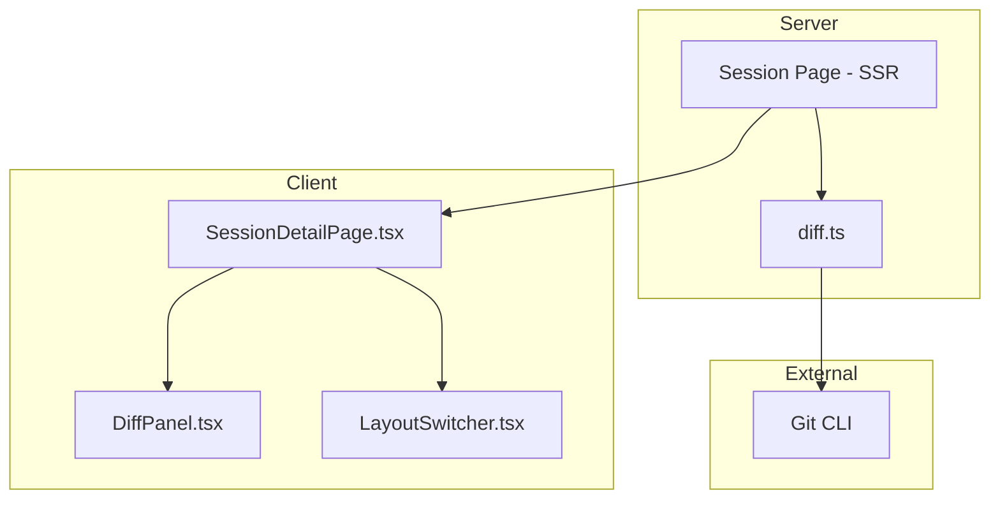
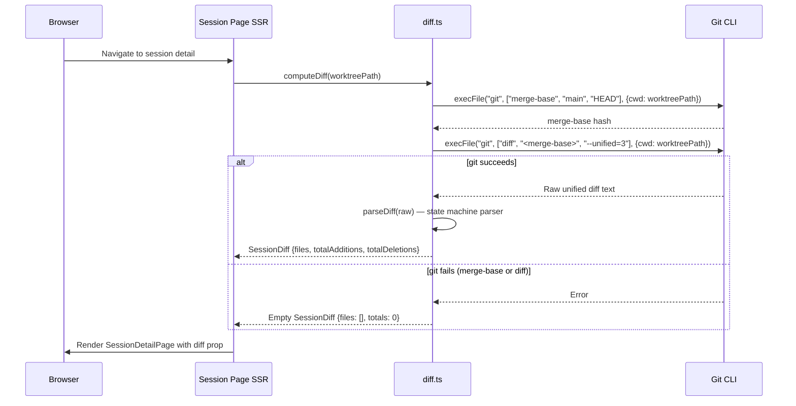
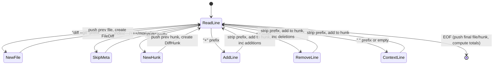

# Technical Design: Diff Viewer

## Overview

**Purpose**: The Diff Viewer feature computes git diffs for session worktrees and renders them as an interactive panel with collapsible file sections, line-level styling, and navigation controls.

**Users**: Developers monitoring Claude Code sessions will use this to review what code changes Claude has made within a session.

**Impact**: This is a read-only observability feature that depends on session lifecycle (for worktree paths) and is rendered within the session detail page alongside the transcript viewer.

### Goals

- Compute diffs against the merge-base (where the branch diverged from `main`)
- Parse unified diff format into structured file/hunk/line data
- Render interactive diff panel with collapsible sections and navigation
- Support multiple layout modes for flexible viewing
- Handle edge cases (empty diffs, missing branches, new files) gracefully

### Non-Goals

- Real-time diff streaming (page refresh required)
- Inline editing or code review annotations
- Diff between arbitrary commits or branches
- Syntax highlighting within diff lines

## Architecture

### Existing Architecture Analysis

The diff viewer is fully implemented across three layers:

- **`src/lib/diff.ts`** — Contains `computeDiff()` for git subprocess execution and `parseDiff()` for unified diff parsing
- **`src/app/projects/[name]/[session]/page.tsx`** — Server Component that computes diff and passes as props
- **`src/app/projects/[name]/[session]/DiffPanel.tsx`** — Client Component rendering interactive diff panel
- **`src/app/projects/[name]/[session]/LayoutSwitcher.tsx`** — Client Component for layout mode selection

Key patterns preserved:

- Server-side data loading in page components (SSR)
- `execFile` for safe subprocess spawning (no shell injection)
- Flat `src/lib/` module structure
- Feature-colocated UI components
- Plain TypeScript interfaces for internally-generated data (no Zod needed)

### Architecture Pattern & Boundary Map



### Technology Stack

| Layer      | Choice / Version            | Role in Feature                                   | Notes                              |
| ---------- | --------------------------- | ------------------------------------------------- | ---------------------------------- |
| Backend    | Next.js 15 Server Component | Computes diff during SSR                          | `force-dynamic`                    |
| Subprocess | Node.js `execFile`          | Executes `git diff` safely (no shell)             | 10MB max buffer                    |
| Frontend   | React 19 Client Component   | Interactive diff panel with navigation            | `useRef`, `useState` for collapse  |
| Types      | TypeScript interfaces       | `FileDiff`, `DiffHunk`, `DiffLine`, `SessionDiff` | No Zod — internal data only        |
| Storage    | localStorage                | Layout mode persistence per session               | `cc-layout-${project}-${session}` |

## System Flows

### Diff Computation Flow



### Diff Parsing State Machine



## Requirements Traceability

| Requirement | Summary                              | Components        | Interfaces   | Flows     |
| ----------- | ------------------------------------ | ----------------- | ------------ | --------- |
| 1.1         | Compute merge-base then diff         | computeDiff       | Git CLI      | Compute   |
| 1.2         | Only branch changes shown            | computeDiff       | Git CLI      | Compute   |
| 1.3         | Use execFile for safety              | computeDiff       | Node.js      | Compute   |
| 1.4         | 10 MB max buffer                     | computeDiff       | Node.js      | Compute   |
| 1.5         | Empty diff on git failure            | computeDiff       | —            | Compute   |
| 1.6         | Empty diff on empty output           | computeDiff       | —            | Compute   |
| 2.1         | Extract file paths from headers      | parseDiff         | —            | Parsing   |
| 2.2         | Identify hunk boundaries             | parseDiff         | —            | Parsing   |
| 2.3         | Classify additions, strip prefix     | parseDiff         | —            | Parsing   |
| 2.4         | Classify deletions, strip prefix     | parseDiff         | —            | Parsing   |
| 2.5         | Classify context lines               | parseDiff         | —            | Parsing   |
| 2.6         | Skip metadata lines                  | parseDiff         | —            | Parsing   |
| 2.7         | Count additions/deletions per file   | parseDiff         | —            | Parsing   |
| 3.1         | Multi-file support                   | parseDiff         | —            | Parsing   |
| 3.2         | Multi-hunk support                   | parseDiff         | —            | Parsing   |
| 3.3         | New file mode support                | parseDiff         | —            | Parsing   |
| 3.4         | File order preservation              | parseDiff         | —            | Parsing   |
| 4.1         | Collapsible file sections            | DiffPanel         | React        | Rendering |
| 4.2         | Green addition styling               | DiffPanel         | CSS          | Rendering |
| 4.3         | Red deletion styling                 | DiffPanel         | CSS          | Rendering |
| 4.4         | Context line styling                 | DiffPanel         | CSS          | Rendering |
| 4.5         | Hunk header styling                  | DiffPanel         | CSS          | Rendering |
| 4.6         | Empty diff display                   | DiffPanel         | React        | Rendering |
| 5.1         | Collapse/expand all                  | DiffPanel         | React        | Rendering |
| 5.2         | File navigation with scroll          | DiffPanel         | React        | Rendering |
| 5.3         | Auto-expand on navigation            | DiffPanel         | React        | Rendering |
| 5.4         | Hunk navigation with scroll          | DiffPanel         | React        | Rendering |
| 5.5         | Smooth scrolling                     | DiffPanel         | React        | Rendering |
| 6.1         | Four layout modes                    | LayoutSwitcher    | React/CSS    | Layout    |
| 6.2         | Layout persistence in localStorage   | LayoutSwitcher    | localStorage | Layout    |
| 6.3         | Mobile responsive with tab switching | SessionDetailPage | CSS          | Layout    |

## Components and Interfaces

| Component         | Domain/Layer          | Intent                                | Req Coverage | Key Dependencies            | Contracts |
| ----------------- | --------------------- | ------------------------------------- | ------------ | --------------------------- | --------- |
| computeDiff       | Domain / diff.ts      | Compute merge-base and diff in worktree | 1.1–1.6    | Git CLI (P0)                | Service   |
| parseDiff         | Domain / diff.ts      | Parse unified diff into structures    | 2.1–3.4      | None                        | Service   |
| Session Page      | SSR / page.tsx        | Load diff data for rendering          | 1.1          | diff.ts (P0), state.ts (P0) | —         |
| DiffPanel         | UI / client component | Render interactive diff panel         | 4.1–5.5      | None (props-driven)         | —         |
| LayoutSwitcher    | UI / client component | Layout mode selection and persistence | 6.1–6.2      | localStorage                | —         |
| SessionDetailPage | UI / client component | Orchestrate layout and panels         | 6.1, 6.3     | DiffPanel, LayoutSwitcher   | —         |

### Domain Layer

#### computeDiff

| Field        | Detail                                                   |
| ------------ | -------------------------------------------------------- |
| Intent       | Compute merge-base, execute `git diff <merge-base>` in worktree, and parse the result |
| Requirements | 1.1, 1.2, 1.3, 1.4, 1.5, 1.6                              |

##### Service Interface

```typescript
function computeDiff(worktreePath: string): Promise<SessionDiff>;
```

- Preconditions: `worktreePath` must be a valid git worktree directory
- Postconditions: Returns `SessionDiff` with parsed files; empty diff on any error
- Error handling: Git failures caught and return empty diff (never throws)

#### parseDiff

| Field        | Detail                                                |
| ------------ | ----------------------------------------------------- |
| Intent       | Parse raw unified diff text into structured diff data |
| Requirements | 2.1, 2.2, 2.3, 2.4, 2.5, 2.6, 2.7, 3.1, 3.2, 3.3, 3.4 |

##### Service Interface

```typescript
function parseDiff(raw: string): SessionDiff;
```

- Preconditions: None (handles empty string)
- Postconditions: Returns structured diff with files in original order
- Invariants: Pure function, no side effects

## Data Models

### Domain Model

**SessionDiff** (output):

```typescript
interface SessionDiff {
  files: FileDiff[];
  totalAdditions: number;
  totalDeletions: number;
}
```

**FileDiff** (per-file data):

```typescript
interface FileDiff {
  filePath: string;
  additions: number;
  deletions: number;
  hunks: DiffHunk[];
}
```

**DiffHunk** (per-hunk data):

```typescript
interface DiffHunk {
  header: string;
  lines: DiffLine[];
}
```

**DiffLine** (per-line data):

```typescript
interface DiffLine {
  type: "context" | "add" | "remove" | "hunk-header";
  content: string;
}
```

## Error Handling

### Error Strategy

- **Git failure resilience**: `computeDiff` catches all errors from `execFile` (including merge-base failures) and returns empty diff
- **No main branch**: If worktree has no `main` reference, merge-base or diff fails gracefully
- **Empty output**: Empty string from git diff produces empty diff structure
- **No runtime validation**: Data is generated internally from trusted git output, not from external sources

## Testing Strategy

### Unit Tests (existing — `diff.test.ts`)

- Empty diff returns empty structure
- Single file with one hunk parses correctly
- Deletion lines are classified and counted
- Multiple files are separated correctly
- Multiple hunks within one file are separated correctly
- New file mode diffs are handled

### Coverage Assessment

Tests cover all 6 major scenarios for `parseDiff`. UI rendering tests (Requirements 4–6) and `computeDiff` integration tests are not present but are lower priority given the colocated component pattern and the SSR data-loading model.
