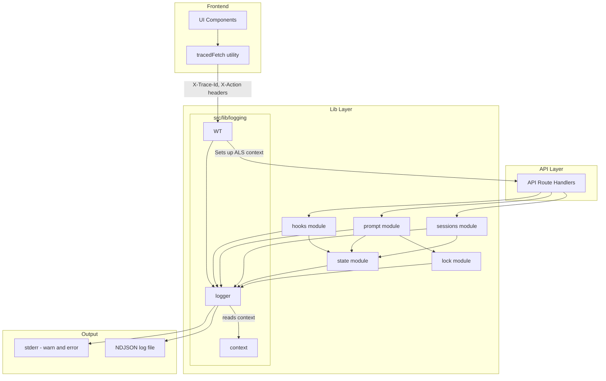
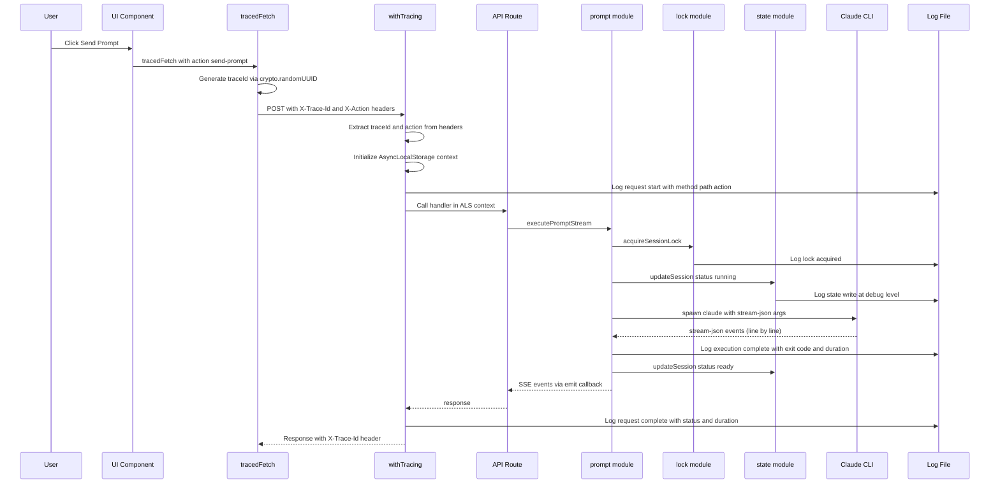
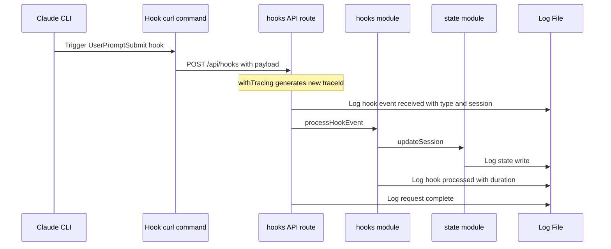

# Design Document: E2E Debugging Instrumentation

> **UPDATED (2026-02-22) — SDK Migration:** The `hooks module (instrumented)` component and Requirement 4 (Hook Event Debugging) sections are obsolete — the hook system was removed. The "Hook Event Correlation Flow" sequence diagram no longer applies. The architecture diagram's `Hooks[hooks module]` node should be disregarded. All other components (Logger, withTracing, tracedFetch, sessions/prompt/state/lock instrumentation) remain valid, though prompt module instrumentation should reference SDK `query()` instead of Claude CLI subprocess.

## Overview

**Purpose**: This feature adds structured, end-to-end logging instrumentation to CSM so that Claude Code agents can read a single NDJSON log file and trace any user interaction from the UI through API routes to Claude CLI execution, diagnosing failures without needing to reproduce them.

**Users**: Developers using Claude Code agents to debug CSM issues — the AI agent reads the log file, greps for trace IDs or session names, and reconstructs what happened.

**Impact**: Adds a logging layer across all existing modules (API routes, sessions, state, hooks, prompt execution) with no changes to existing behavior or data models.

### Goals
- Enable end-to-end traceability: UI action → API request → lib operation → CLI execution → hook callback
- Produce machine-readable NDJSON logs optimized for AI agent consumption
- Zero new external dependencies — use only Node.js built-ins

### Non-Goals
- Log viewing in the CSM dashboard UI
- Log aggregation, rotation, or shipping to external services
- Distributed tracing across multiple CSM instances
- Performance profiling or metrics collection

## Architecture

### Existing Architecture Analysis

CSM has a clean layered architecture with no existing logging:

- **API routes** (`src/app/api/`) delegate to **lib modules** (`src/lib/`)
- **Lib modules** are single-domain: `sessions.ts`, `state.ts`, `hooks.ts`, `prompt.ts`, `lock.ts`, `config.ts`; nested directories used when a domain has multiple related files
- **Frontend components** make inline `fetch()` calls with no shared wrapper
- **Error handling** is per-route try-catch with typed `ApiError` responses
- **No logging exists**: zero `console.log` calls in the entire codebase

Lib modules can use nested directories when a domain has multiple related files.

### Architecture Pattern & Boundary Map



**Architecture Integration**:
- **Selected pattern**: Aspect-oriented instrumentation via AsyncLocalStorage + higher-order wrapper — non-invasive, zero signature changes to existing lib functions
- **Domain boundaries preserved**: Each lib module instruments itself by importing the logger; no cross-module logging concerns
- **Existing patterns preserved**: API route delegation to lib functions, typed error responses
- **New components rationale**: `src/lib/logging/` directory containing logger, tracing context, and withTracing wrapper; `src/lib/traced-fetch.ts` (frontend utility) — each has a single responsibility
- **Steering compliance**: Nested directory for logging domain (multiple related files), TypeScript strict mode, no external dependencies

### Technology Stack

| Layer | Choice / Version | Role in Feature | Notes |
|-------|------------------|-----------------|-------|
| Frontend | `crypto.randomUUID()` | Trace ID generation | Built into all modern browsers |
| Backend | `node:async_hooks` AsyncLocalStorage | Request-scoped context propagation | Stable since Node.js 16 |
| Backend | `node:fs` appendFileSync | NDJSON log file writes | Sync for simplicity at CSM scale |
| Data | NDJSON flat file | Structured log storage | Grep-friendly, one JSON object per line |

No new dependencies. All implementations use Node.js built-in modules.

## System Flows

### UI Action to CLI Execution Trace Flow



The traceId generated in the browser flows through every log entry, enabling a single `grep traceId csm-debug.log` to reconstruct the full chain.

### Hook Event Correlation Flow



Hook events get their own traceId (since they originate from Claude CLI, not the UI). Correlation to the originating prompt is via `sessionName` + timestamp proximity in the log.

## Requirements Traceability

| Requirement | Summary | Components | Interfaces | Flows |
|-------------|---------|------------|------------|-------|
| 1.1 | NDJSON log format | Logger | LogEntry type | — |
| 1.2 | Configurable log level | Logger | CSM_LOG_LEVEL env var | — |
| 1.3 | Session context in log entries | Logger, ALS context | LogEntry.projectName, sessionName | — |
| 1.4 | Log file output | Logger | CSM_LOG_FILE env var | — |
| 1.5 | Invalid log level fallback | Logger | — | — |
| 1.6 | Stderr for warn/error | Logger | — | — |
| 2.1 | Frontend trace ID generation | tracedFetch | X-Trace-Id header | UI Action to CLI |
| 2.2 | X-Action header | tracedFetch | X-Action header | UI Action to CLI |
| 2.3 | Backend trace ID extraction | withTracing | ALS TraceContext | UI Action to CLI |
| 2.4 | Trace ID in response header | withTracing | X-Trace-Id response header | UI Action to CLI |
| 2.5 | Request logging | withTracing | LogEntry | UI Action to CLI |
| 3.1 | Session creation logging | sessions module | — | — |
| 3.2 | Prompt submission logging | prompt module | — | UI Action to CLI |
| 3.3 | Prompt completion logging | prompt module | — | UI Action to CLI |
| 3.4 | Prompt failure logging | prompt module | — | UI Action to CLI |
| 3.5 | Session deletion logging | sessions module | — | — |
| 3.6 | Concurrent execution rejection logging | lock module | — | — |
| 4.1 | Hook event logging | hooks module | — | Hook Event Correlation |
| 4.2 | Hook validation failure logging | hooks API route | — | Hook Event Correlation |
| 4.3 | Unknown session hook logging | hooks module | — | Hook Event Correlation |
| 4.4 | Hook trace ID correlation | withTracing, hooks module | X-Trace-Id header | Hook Event Correlation |
| 5.1 | State write logging | state module | — | — |
| 5.2 | State read failure logging | state module | — | — |
| 5.3 | Atomic write path logging | state module | — | — |
| 5.4 | Atomic rename failure logging | state module | — | — |
| 6.1 | API error context logging | withTracing | LogEntry | — |
| 6.2 | Prompt execution error context | prompt module | LogEntry | — |
| 6.3 | Full stack trace preservation | Logger | LogEntry.stack | — |
| 6.4 | Worktree error logging | sessions module | LogEntry | — |

## Components and Interfaces

| Component | Domain/Layer | Intent | Req Coverage | Key Dependencies | Contracts |
|-----------|--------------|--------|--------------|------------------|-----------|
| Logger | Lib | Emit structured NDJSON log entries with ALS context | 1.1–1.6, 6.3 | ALS context (P0), fs (P0) | Service |
| TraceContext (ALS) | Lib | Store and propagate request-scoped trace context | 2.3, all traceId refs | AsyncLocalStorage (P0) | State |
| withTracing | Lib | Wrap API route handlers with trace setup and request logging | 2.3–2.5, 6.1 | Logger (P0), ALS (P0) | Service |
| tracedFetch | Frontend | Generate trace IDs and add trace headers to API calls | 2.1, 2.2 | crypto.randomUUID (P0) | Service |
| sessions (instrumented) | Lib | Add logging to existing session create/delete operations | 3.1, 3.5, 6.4 | Logger (P1) | — |
| prompt (instrumented) | Lib | Add logging to prompt execution lifecycle | 3.2–3.4, 6.2 | Logger (P1) | — |
| hooks (instrumented) | Lib | Add logging to hook event processing | 4.1–4.3 | Logger (P1) | — |
| state (instrumented) | Lib | Add logging to state file read/write operations | 5.1–5.4 | Logger (P1) | — |
| lock (instrumented) | Lib | Add logging to lock acquisition/rejection | 3.6 | Logger (P1) | — |

### Lib Layer

#### Logger

| Field | Detail |
|-------|--------|
| Intent | Central logging facility — emits NDJSON entries to file and stderr, auto-enriching with ALS trace context |
| Requirements | 1.1, 1.2, 1.3, 1.4, 1.5, 1.6, 6.3 |

**Responsibilities & Constraints**
- Emit structured JSON log entries to a file (append-only NDJSON)
- Read trace context (traceId, action, projectName, sessionName) from AsyncLocalStorage automatically
- Filter entries by configured log level
- Write warn/error entries to stderr in addition to file
- Must not throw — logging failures are silently ignored to avoid disrupting application flow

**Dependencies**
- Inbound: All lib modules and withTracing — call logger methods (P0)
- External: `node:fs` appendFileSync — file writes (P0)
- External: `node:async_hooks` AsyncLocalStorage — context reads (P0)

**Contracts**: Service [x] / State [x]

##### Service Interface
```typescript
type LogLevel = "debug" | "info" | "warn" | "error";

interface LogEntry {
  timestamp: string;      // ISO 8601
  level: LogLevel;
  module: string;
  message: string;
  traceId?: string;       // from ALS context
  action?: string;        // from ALS context
  projectName?: string;   // from ALS context or explicit
  sessionName?: string;   // from ALS context or explicit
  durationMs?: number;
  error?: string;
  stack?: string;
  [key: string]: unknown; // additional structured fields
}

interface Logger {
  debug(message: string, fields?: Record<string, unknown>): void;
  info(message: string, fields?: Record<string, unknown>): void;
  warn(message: string, fields?: Record<string, unknown>): void;
  error(message: string, fields?: Record<string, unknown>): void;
}

/** Factory: creates a logger scoped to a module name */
function createLogger(module: string): Logger;
```
- Preconditions: None — log file path is lazily resolved from config on first log call (using `readConfig().stateFilePath` to derive the config directory, then appending `csM_LOG_FILE` override or default `csm-debug.log`)
- Postconditions: Each call appends exactly one NDJSON line to the log file (if level passes filter)
- Invariants: Logger never throws; failed writes are silently dropped

##### State Management
- **State model**: `AsyncLocalStorage<TraceContext>` holds per-request context
- **Persistence**: None — context exists only for request duration
- **Concurrency strategy**: AsyncLocalStorage provides natural isolation per async context

```typescript
interface TraceContext {
  traceId: string;
  action?: string;
  projectName?: string;
  sessionName?: string;
}

/** Run a callback within a trace context */
function runWithTrace<T>(context: TraceContext, fn: () => T): T;

/** Read current trace context (returns undefined if outside a traced context) */
function getTraceContext(): TraceContext | undefined;
```

**Implementation Notes**
- Integration: New `src/lib/logging/` directory containing `logger.ts`, `context.ts` (ALS TraceContext), and `tracing.ts` (withTracing wrapper) — no changes to existing module signatures
- Initialization: Log file path and log level are lazily resolved on first log call using a `once` guard — no explicit init step required, compatible with Next.js lazy route loading
- Validation: Log level validated on first use; invalid values fall back to `info`
- Risks: AsyncLocalStorage context loss in untracked async (mitigated: CSM lib code is fully promise-based, no timers)

---

#### withTracing

| Field | Detail |
|-------|--------|
| Intent | Higher-order function wrapping API route handlers — sets up ALS context, logs request lifecycle |
| Requirements | 2.3, 2.4, 2.5, 6.1 |

**Responsibilities & Constraints**
- Extract `X-Trace-Id` from request headers (or generate new UUID if absent)
- Extract `X-Action` from request headers
- Initialize AsyncLocalStorage with trace context for the handler's duration
- Log request start and completion (method, path, action, status, duration)
- Add `X-Trace-Id` to response headers
- Catch and log unhandled errors with full context before re-throwing

**Dependencies**
- Inbound: All API route handlers — wrap their exports (P0)
- Outbound: Logger — emit request lifecycle entries (P0)
- Outbound: ALS context — initialize per request (P0)

**Contracts**: Service [x]

##### Service Interface
```typescript
type RouteHandler = (
  request: Request,
  context: { params: Promise<Record<string, string>> }
) => Promise<Response>;

/** Wraps a Next.js API route handler with tracing instrumentation */
function withTracing(handler: RouteHandler): RouteHandler;
```
- Preconditions: Handler is a valid Next.js App Router route handler
- Postconditions: Response includes `X-Trace-Id` header; request lifecycle logged at `info` level
- Invariants: Original handler behavior is preserved; errors are re-thrown after logging

**Implementation Notes**
- Integration: Each API route file wraps its exports: `export const POST = withTracing(async (req, ctx) => { ... })`
- Enrichment: For session-scoped routes, `withTracing` can extract `projectName` and `sessionName` from URL params and add them to the ALS context
- Risks: None — wrapper is transparent to existing handler logic

---

### Frontend Layer

#### tracedFetch

| Field | Detail |
|-------|--------|
| Intent | Drop-in `fetch` wrapper that generates trace IDs and adds trace headers to every API call |
| Requirements | 2.1, 2.2 |

**Responsibilities & Constraints**
- Generate a unique traceId via `crypto.randomUUID()` for each call
- Add `X-Trace-Id` and `X-Action` headers to the request
- Pass through all other fetch options unchanged
- Return the standard `fetch` Response

**Dependencies**
- Inbound: UI components (SessionsList, CreateSessionModal, SessionDetailPage) — replace `fetch()` calls (P0)
- External: `crypto.randomUUID()` — browser built-in (P0)

**Contracts**: Service [x]

##### Service Interface
```typescript
/** Traced fetch — adds X-Trace-Id and X-Action headers */
function tracedFetch(
  url: string,
  action: string,
  options?: RequestInit
): Promise<Response>;
```
- Preconditions: `action` is a non-empty string describing the user action
- Postconditions: Request is sent with `X-Trace-Id` (UUID v4) and `X-Action` headers added to any existing headers
- Invariants: Does not modify other headers or request options

**Implementation Notes**
- Integration: New file `src/lib/traced-fetch.ts` (client-side utility); components replace `fetch(url, opts)` with `tracedFetch(url, "action-name", opts)`
- Validation: No validation needed — `crypto.randomUUID()` always produces valid UUIDs

---

### Instrumented Existing Modules

These are not new components — they are modifications to existing modules. Each adds targeted `logger.info/warn/error` calls at key operation boundaries.

#### sessions module (instrumented)

| Field | Detail |
|-------|--------|
| Intent | Add logging to `createSession` and `deleteSession` for lifecycle tracing |
| Requirements | 3.1, 3.5, 6.4 |

**Instrumentation Points**:
- `createSession`: Log session name, worktree path, branch name on success (3.1); log git command details on worktree/branch failure (6.4)
- `deleteSession`: Log session identifier and cleanup results (3.5)

---

#### prompt module (instrumented)

| Field | Detail |
|-------|--------|
| Intent | Add logging to prompt execution lifecycle for CLI tracing |
| Requirements | 3.2, 3.3, 3.4, 6.2 |

**Instrumentation Points**:
- Pre-execution: Log prompt length, session identifier, CLI command args excluding prompt content (3.2)
- Post-execution success: Log exit code, duration, stdout/stderr sizes (3.3)
- Post-execution failure: Log error details, stderr output, CLI args, working directory (3.4, 6.2)

---

#### hooks module (instrumented)

| Field | Detail |
|-------|--------|
| Intent | Add logging to hook event processing for integration debugging |
| Requirements | 4.1, 4.2, 4.3 |

**Instrumentation Points**:
- Event receipt: Log event type, session identifier (4.1)
- Validation failure: Log raw payload and validation errors (4.2, covered in hooks API route with withTracing)
- Unknown session: Log unknown session identifier and event type (4.3)

---

#### state module (instrumented)

| Field | Detail |
|-------|--------|
| Intent | Add logging to state file read/write for corruption diagnostics |
| Requirements | 5.1, 5.2, 5.3, 5.4 |

**Instrumentation Points**:
- `writeState`: Log project count, session count, file size at debug level (5.1); log temp and final paths at debug level (5.3); log rename failure at error level (5.4)
- `readState`: Log parse/read failures at error level (5.2)

---

#### lock module (instrumented)

| Field | Detail |
|-------|--------|
| Intent | Add logging to lock acquisition and rejection for concurrency debugging |
| Requirements | 3.6 |

**Instrumentation Points**:
- `acquireSessionLock`: Log when lock is acquired; log rejection of concurrent attempts at warn level with traceId of rejected request (3.6)

## Data Models

### Domain Model

No new data entities are introduced. The feature adds a single new data shape for log output:

```typescript
/** NDJSON log entry — one per line in the log file */
interface LogEntry {
  timestamp: string;        // ISO 8601
  level: LogLevel;          // "debug" | "info" | "warn" | "error"
  module: string;           // e.g., "sessions", "prompt", "state", "hooks", "tracing"
  message: string;          // human-readable description
  traceId?: string;         // UUID linking UI action to backend operations
  action?: string;          // UI action name, e.g., "send-prompt"
  projectName?: string;     // project context
  sessionName?: string;     // session context
  durationMs?: number;      // operation duration
  error?: string;           // error message
  stack?: string;           // full stack trace
  [key: string]: unknown;   // additional fields per log site
}
```

### Data Contracts & Integration

**Request Headers** (Frontend → Backend):
| Header | Value | Required |
|--------|-------|----------|
| `X-Trace-Id` | UUID v4 | Generated by tracedFetch; withTracing generates one if missing |
| `X-Action` | Action name string | Generated by tracedFetch; optional for non-UI callers |

**Response Headers** (Backend → Frontend):
| Header | Value | Required |
|--------|-------|----------|
| `X-Trace-Id` | Same UUID from request | Always present on traced responses |

**Log File Format**: NDJSON (newline-delimited JSON), one `LogEntry` per line, append-only.

## Error Handling

### Error Strategy
The logging layer itself must never disrupt application behavior. All logging operations are wrapped in try-catch internally — a failed log write is silently dropped rather than propagating an error to the caller.

### Error Categories and Responses
**Log File Write Failures**: Silent drop — CSM continues operating without logs. This is acceptable because logging is a diagnostic tool, not a critical path.

**Invalid Log Level Config**: Fall back to `info` level, emit warning to stderr on startup.

**AsyncLocalStorage Context Missing**: Logger produces entries without trace context fields — fields are simply omitted from the JSON output. This handles cases where lib functions are called outside a traced request (e.g., background cleanup).

## Testing Strategy

### Unit Tests
- **Logger**: Verify NDJSON output format, level filtering, file append, stderr output for warn/error, context enrichment from ALS
- **withTracing**: Verify trace ID extraction from headers, generation when absent, response header inclusion, request lifecycle logging, error context capture
- **tracedFetch**: Verify header generation (X-Trace-Id, X-Action), passthrough of other options

### Integration Tests
- **End-to-end trace flow**: Simulate API request with trace headers → verify all log entries share the same traceId
- **Session lifecycle**: Create session → execute prompt → delete session → verify log entries cover full lifecycle with correct context
- **Hook correlation**: Simulate hook event with trace header → verify log entry includes traceId
- **Error scenarios**: Trigger prompt failure → verify error log entry contains CLI args, stderr, working directory, and traceId

### Existing Test Compatibility
- All existing tests must pass without modification — the logging layer is additive and non-breaking
- Logger can be initialized with a test log file path or `/dev/null` to prevent test log noise
