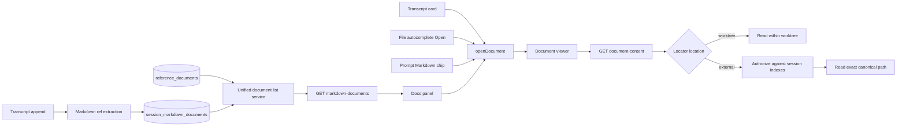

# Design Document: Enhanced Markdown File Viewer Access

## Overview

The feature extends the existing document viewer rather than creating another preview surface. A new SQLite-backed session Markdown index records document activity at the transcript append boundary. The Docs panel consumes a unified read model that merges this index with registered reference documents. Autocomplete and prompt chips construct the same `DocumentRef` used by transcript cards and the Docs panel.

Outside-worktree support uses explicit capability by discovery: the server reads an external Markdown locator only when the same canonical locator exists in the owning session's document index or registered reference documents. External documents use the normal viewer shell in read-only mode, preserving tabs and navigation without broadening the worktree-scoped review-comment model.

## Architecture



### Selected boundaries

- `src/lib/documents/markdown-file-refs.ts`: pure tool-block detection shared by transcript cards and server indexing.
- `src/lib/documents/path.ts`: browser-safe canonical locator normalization; no filesystem I/O.
- `src/lib/documents/session-index.ts`: orchestration for indexing transcript content and producing the unified list.
- `src/lib/state-store/session-markdown-documents-repo.ts`: SQLite row mapping and idempotent upsert/read operations.
- `src/lib/documents/route-handlers.ts`: list and content authorization/read contracts, using dependency injection.
- `src/features/session/conversation/MarkdownDocumentList.tsx`: presentational Docs browse list, colocated with the session feature and independently storyable.
- Existing `DocsPanel`, `DocumentViewer`, `FileAutocompleteList`, `PromptEditorFileMentionPopup`, and `FileMentionChip` are extended in place.

## Data Model

### Persistent row

`session_markdown_documents` is additive floor DDL in `state-db.ts`:

| Column | Type | Contract |
|---|---|---|
| `project_path` | TEXT | Owning project root; FK component |
| `session_name` | TEXT | Owning session; FK component |
| `doc_path` | TEXT | Canonical worktree-relative path or canonical external absolute locator |
| `origin` | TEXT | `read`, `write`, `edit`, or `registered` |
| `first_seen_at` | TEXT | ISO timestamp retained across upserts |
| `last_seen_at` | TEXT | ISO timestamp updated on every detection |

Primary key: `(project_path, session_name, doc_path)`. Foreign key: `(project_path, session_name)` references `sessions` with `ON DELETE CASCADE`. Index ordering uses `last_seen_at DESC, doc_path ASC`.

The table is separate from `reference_documents`. Discovered files therefore do not become agent-visible reference documents and do not alter system prompts.

### Schemas

`src/lib/documents/schemas.ts` owns:

- `markdownDocumentOriginSchema`: `z.enum(["read", "write", "edit", "registered"])`.
- `sessionMarkdownDocumentSchema`: persisted row domain shape (`docPath`, `origin`, `firstSeenAt`, `lastSeenAt`).
- `markdownDocumentListItemSchema`: API/UI shape (`docPath`, `title`, `origin`, timestamps, `location`, `registered`, nullable `description`).
- `markdownDocumentsResponseSchema`: array of list items.
- Existing content request/response schemas remain, with `docPath` documented as a canonical locator rather than exclusively worktree-relative.

All TypeScript types are derived with `z.infer`.

## Path and Authorization Model

`normalizeMarkdownLocator(input, worktreeRoot)` replaces worktree-only assumptions at viewer entry points and returns:

- `{ ok: true, docPath, location: "worktree" }` for a Markdown path inside the worktree, with `docPath` relative to the worktree.
- `{ ok: true, docPath, location: "external" }` for an absolute path outside the worktree or a relative path that resolves outside it, with `docPath` as a canonical absolute POSIX path.
- `{ ok: false, reason: "non-markdown" | "invalid" }` for empty, non-Markdown, or malformed input.

The helper remains pure and browser-safe by resolving POSIX segments explicitly. `resolveDocumentReadTarget` in the server route uses `node:path` as the final filesystem resolution guard.

Content authorization rules:

1. Worktree locators resolve under the session worktree and remain readable without indexing, preserving autocomplete and Specs behavior.
2. External locators must match exactly after canonicalization against either `session_markdown_documents.doc_path` or a canonicalized `reference_documents.file_path` in the same session.
3. Authorization uses the canonical absolute path, never basename or prefix matching.
4. Non-Markdown and unauthorized external locators return 400 and 404 respectively before `readFile` is invoked.
5. Logs contain path and error metadata but never document content.

## Indexing Flow

`appendTranscriptEntry` already owns the durable-write-before-SSE ordering. Its dependency-injection interface gains `indexMarkdownDocuments(meta, entry)` with a production implementation from `session-index.ts`.

After `appendFile` succeeds and before `message-appended` broadcasts:

1. Skip when metadata is absent, the scope is the project sentinel, or the entry is not visible.
2. Extract Markdown refs from `entry.content`.
3. Resolve project name to project path and load the session worktree.
4. Canonicalize each ref and upsert the deduplicated set in one serialized state-store write using the entry timestamp as `seenAt`.
5. Catch and structured-log indexing failures, then continue to broadcast the transcript entry.

This ordering lets the existing `message-appended` SSE event drive query invalidation without a second event: the client inspects the appended blocks with the same pure extractor and invalidates the session Markdown list only when references exist. The refetch observes the already-committed index.

Registered reference documents are merged at list-read time. Existing registered rows therefore appear without duplication or a data migration.

## API Contracts

### `GET /api/projects/[name]/sessions/[session]/markdown-documents`

Resolution: project → session ownership. The handler calls the unified list service, validates the response schema, and returns most-recent-first items. Errors: project/session 404, unexpected persistence failure 500 with structured log.

### `GET /api/projects/[name]/sessions/[session]/document-content?path=<locator>`

The existing endpoint keeps its URL. It canonicalizes the locator, authorizes external paths as described above, reads UTF-8 content, and echoes canonical `docPath`. Responses remain 400 invalid, 404 unavailable/missing/unauthorized, and 500 unexpected read failure.

No browser-facing mutation endpoint is added; indexing is authoritative at transcript persistence, not component render time.

## UI Design

### Docs panel

`DocsPanel` switches from `useReferenceDocumentsQuery` to `useMarkdownDocumentsQuery`. It retains the existing browse/viewer state and back affordance.

`MarkdownDocumentList` renders one button row per item:

```text
DOCS
▸ docs/plan.md                          EDITED
  /shared/runbook.md          EXTERNAL · READ
  memory-bank/focus.md              REGISTERED
    Current work-in-progress and remaining tasks
```

- Path: mono primary/secondary text with truncation and full-path title.
- Origin/location: uppercase mono tertiary metadata; external uses amber text as a caution/location signal, not a disabled state.
- Active row: cyan left border plus elevated surface, never full cyan fill.
- Hover: one elevation step.
- Empty state: `No Markdown documents` / `Read, edit, or register a Markdown file to add it here.`
- Loading and error states use `EmptyState`; no new CSS.
- Mobile rows have 44px minimum height and retain path and metadata.

### File autocomplete

`FileAutocompleteListItem` gains `openable?: boolean`; `FileAutocompleteList` gains optional `onOpen`. A trailing `IconButton` with a hand-drawn file/open SVG appears only for openable Markdown items. Its pointer handlers prevent editor blur and row selection. The popup host closes after `onOpen` calls `openDocument`.

The combobox retains managed focus in the editor. `Alt+Enter` opens the active Markdown result; the footer adds an `Alt+Enter open` hint while Open actions are present. Enter/Tab remain insertion. The Open control is always visible, uses an accessible label and tooltip, and is 44px on mobile.

### Prompt file-mention chip

The chip wrapper contains sibling controls rather than nesting buttons:

- Markdown: a body button opens the document; the existing remove button remains separate.
- Non-Markdown: the body remains inert text; remove behavior is unchanged.
- The body button owns Enter/Space semantics natively, a cyan focus ring, and an `Open @<path> in Markdown viewer` accessible label.

Opening constructs a canonical worktree `DocumentRef`, routes the existing store to Docs, and leaves the Tiptap document unchanged.

### Transcript cards and external viewer mode

`MarkdownFileCard` uses `normalizeMarkdownLocator`; external is a normal actionable card with `external` metadata rather than `unavailable`.

`DocumentViewer` derives location from the canonical locator. Worktree documents render `DocumentSurface` unchanged. External documents render a read-only `MarkdownViewer` composition with the same loading/error states, header, tabs, and activation flash; it does not mount comment queries, comment mutations, annotation selection, or pending-feedback controls. The header shows `READ ONLY` and `EXTERNAL` metadata for external documents.

## State and Identity

`DocumentRef.docPath` becomes a canonical document locator: worktree-relative inside the session, absolute outside it. Store deduplication, active selection, tabs, and React Query keys continue to use exact `docPath`. `projectName` and `sessionName` remain part of server routing and comment identity.

No persisted Zustand state is added. The durable browse set lives in SQLite; open tabs remain an in-memory working set as today.

## Logging

- `documents-index.indexed`: debug/info metadata with project/session, ref count, and duration; no content.
- `documents-index.index_failed`: warn with project/session and error; transcript delivery continues.
- `documents-content.read.failed`: existing error event extended with `location` and canonical locator.
- State-store repo operations use the existing timed logging pattern and session-scoped identifiers.

## Testing Strategy

All behavioral implementation follows red-green TDD.

- Pure unit tests: Read detection; canonical internal/external locator normalization; merge/dedup/order logic; external authorization.
- Repository contract tests: schema round-trip, conflict update preserving `firstSeenAt`, ordering, session cascade delete, session isolation.
- Transcript tests: successful indexing before broadcast, deduped refs, project-sentinel skip, indexing failure does not fail append/broadcast.
- Route tests with injected dependencies: merged list, registered-only external doc, authorized external read, unauthorized external rejection before `readFile`, internal autocomplete path read, missing/error mapping.
- Component tests: Docs states and opening; autocomplete Open pointer/keyboard behavior and insertion regression; Markdown chip open/remove separation; transcript external card opening; read-only external viewer skips comment surfaces.
- Storybook: Docs list variants, mixed autocomplete list, Markdown mention chip.
- Verification: focused Vitest suites, typecheck, lint, Storybook smoke, then live app verification through `cctl dev ensure` and browser/Next.js tooling.

## Risks and Mitigations

- **Filesystem disclosure:** external reads require exact session index/registry membership; arbitrary client paths cannot grant access.
- **Prompt leakage:** the new table is separate from reference documents and never enters system prompts.
- **Transcript availability:** index failures are non-fatal and logged; the canonical transcript remains intact.
- **Stale external files:** missing files return a visible unavailable state while their durable list entry remains for audit/discovery.
- **Autocomplete regression:** insertion and Open use separate callbacks and explicit event propagation tests.
- **Comment boundary expansion:** external documents are read-only, avoiding changes to persisted worktree-relative comment identity.
