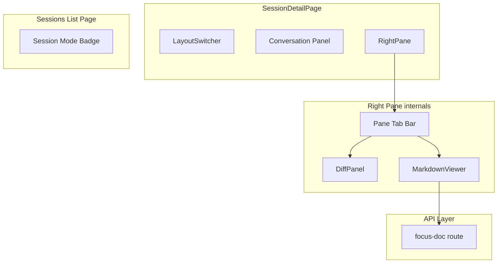
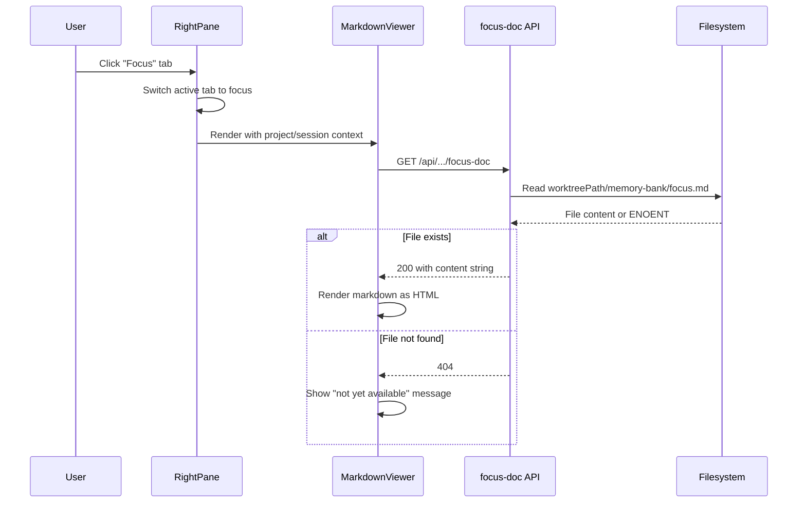

# Design Document — Focus Mode Viewer

## Overview

**Purpose**: This feature delivers in-app viewing of the `focus.md` document and session mode visibility to CC users managing focus mode coding sessions.

**Users**: Developers monitoring focus mode sessions use the markdown viewer to read the agent's captured objective alongside the conversation, and the mode indicator to quickly identify session types in the session list.

**Impact**: Changes the session detail right pane from a single DiffPanel to a switchable container (diff or markdown), adds a new API endpoint for reading `focus.md` from worktrees, and adds a mode badge to the session list table.

### Goals
- Generic markdown viewer component reusable for future markdown file viewing needs
- Seamless panel switching between diff and markdown views with no layout regressions
- Clear visual distinction between focus and fast mode sessions

### Non-Goals
- Live-reloading/watching `focus.md` for changes (manual refresh is sufficient)
- Editing markdown files from the CC UI
- Viewing markdown files other than `focus.md` (component is generic, but UI integration is scoped to `focus.md` only)
- Changing the layout switcher modes or adding new page-level layout arrangements

## Architecture

### Existing Architecture Analysis

The session detail view has a two-column layout controlled by `data-layout` on `.session-content-area`:
- Left: conversation panel (`.prompt-panel`)
- Right: `DiffPanel` component (`.sidebar-diff-panel`)

Key patterns to preserve:
- Layout modes (`LayoutMode`) control column arrangement via CSS `data-layout` — this remains unchanged
- `DiffPanel` is conditionally rendered when `layout !== "conversation"`
- Mobile panel switching via `MobilePanel` in the bottom bar
- Session state includes `creationMode: "fast" | "focus"` already (see `research.md` for details)

### Architecture Pattern & Boundary Map



**Architecture Integration**:
- **Selected pattern**: Wrapper component for right pane with internal tab switching (see `research.md` for alternatives evaluated)
- **Domain boundaries**: `RightPane` owns tab state and rendering; `MarkdownViewer` is a pure presentational component; `FocusDocRoute` is a simple file-read endpoint
- **Existing patterns preserved**: Layout modes, mobile panel switching, DiffPanel internal tabs all unchanged
- **Steering compliance**: Minimal dependencies (only `react-markdown` + `remark-gfm` added), filesystem-backed data access, REST API pattern

### Technology Stack

| Layer | Choice / Version | Role in Feature | Notes |
|-------|------------------|-----------------|-------|
| Frontend | React 19, Next.js 15 | Component rendering and routing | Existing |
| Markdown | `react-markdown` ^9 + `remark-gfm` ^4 | Client-side markdown to React rendering | New dependency |
| State | Zustand (existing store) | Right-pane tab state | Extension of `session-detail.store.ts` |
| Backend | Next.js API Route | Serve `focus.md` content from worktree | New route |
| Data | Filesystem (`node:fs/promises`) | Read markdown file from session worktree path | Existing pattern |

## System Flows



## Requirements Traceability

| Requirement | Summary | Components | Interfaces | Flows |
|-------------|---------|------------|------------|-------|
| 1.1 | Render markdown with formatting | MarkdownViewer | — | — |
| 1.2 | Accept markdown string input | MarkdownViewer | MarkdownViewerProps | — |
| 1.3 | Display in right pane area | RightPane | — | — |
| 1.4 | Scrollable content | MarkdownViewer | — | — |
| 1.5 | Consistent design system styling | MarkdownViewer | — | — |
| 2.1 | Tab control for panel switching | RightPane | RightPaneProps | — |
| 2.2 | Show markdown viewer on tab select | RightPane | — | Tab switch flow |
| 2.3 | Show diff panel on tab select | RightPane | — | Tab switch flow |
| 2.4 | Same layout flexibility as diff | RightPane | — | — |
| 2.5 | Preserve scroll position per panel | RightPane | — | — |
| 2.6 | Default to diff panel | RightPane, Store | — | — |
| 3.1 | Option to view focus.md | RightPane | — | Focus doc flow |
| 3.2 | API endpoint for focus.md | FocusDocRoute | GET API | Focus doc flow |
| 3.3 | Informational message when missing | MarkdownViewer | — | Focus doc flow |
| 3.4 | Loading state | MarkdownViewer | — | Focus doc flow |
| 4.1 | Show tabs for focus mode sessions | RightPane | RightPaneProps | — |
| 4.2 | Hide tabs for fast mode sessions | RightPane | RightPaneProps | — |
| 4.3 | Session mode field | — (already exists) | — | — |
| 5.1 | Mode badge in session list | SessionModeBadge | — | — |
| 5.2 | Distinct styling per mode | SessionModeBadge | — | — |
| 5.3 | Visible without opening session | SessionModeBadge | — | — |
| 5.4 | No badge for legacy sessions | SessionModeBadge | — | — |

## Components and Interfaces

| Component | Domain | Intent | Req Coverage | Key Dependencies | Contracts |
|-----------|--------|--------|--------------|------------------|-----------|
| MarkdownViewer | UI / Shared | Render markdown content string as formatted HTML | 1.1–1.5, 3.3, 3.4 | react-markdown (P0) | — |
| RightPane | UI / Session Detail | Wrap DiffPanel and MarkdownViewer with tab switching | 2.1–2.6, 3.1, 4.1, 4.2 | DiffPanel (P0), MarkdownViewer (P0), Store (P1) | State |
| FocusDocRoute | API | Serve focus.md content from session worktree | 3.2 | state.ts (P0), fs (P0) | API |
| SessionModeBadge | UI / Session List | Display focus/fast mode indicator | 5.1–5.4 | — | — |
| Store extension | State | Track active right-pane tab | 2.5, 2.6 | session-detail.store.ts (P0) | State |

### UI / Shared

#### MarkdownViewer

| Field | Detail |
|-------|--------|
| Intent | Render a markdown content string as formatted, scrollable HTML |
| Requirements | 1.1, 1.2, 1.3, 1.4, 1.5, 3.3, 3.4 |

**Responsibilities & Constraints**
- Accept raw markdown string and render it using `react-markdown` with `remark-gfm`
- Apply CSS classes consistent with the CC design system (mono font for code, proper heading hierarchy)
- Handle three states: loading (spinner), content (rendered markdown), empty (informational message)
- Scrollable via CSS `overflow-y: auto` on the content container
- Generic — no knowledge of `focus.md` or any specific file; receives content as a prop

**Dependencies**
- External: `react-markdown` ^9 — markdown to React rendering (P0)
- External: `remark-gfm` ^4 — GitHub Flavored Markdown support (P0)

**Contracts**: None — pure presentational component

```typescript
interface MarkdownViewerProps {
  /** Raw markdown content to render, or null if not yet loaded */
  content: string | null;
  /** Whether content is currently being fetched */
  isLoading: boolean;
  /** Optional message to show when content is null and not loading */
  emptyMessage?: string;
  /** Optional CSS class for the container */
  className?: string;
}
```

**Implementation Notes**
- Located at `src/components/MarkdownViewer.tsx` (shared component — will be reused for future markdown viewers)
- CSS class: `markdown-viewer` for the scrollable container, `markdown-content` for the rendered area
- Styling targets `react-markdown` output elements (h1–h6, p, ul, ol, code, pre, a, blockquote) within `.markdown-content`
- Code blocks use `--bg-base` background, `--font-mono`, and `--border-subtle` border per the design system
- Storybook story at `src/components/MarkdownViewer.stories.tsx`

### UI / Session Detail

#### RightPane

| Field | Detail |
|-------|--------|
| Intent | Wrap DiffPanel and MarkdownViewer with conditional tab switching for focus mode sessions |
| Requirements | 2.1, 2.2, 2.3, 2.4, 2.5, 2.6, 3.1, 4.1, 4.2 |

**Responsibilities & Constraints**
- When `creationMode === "focus"`: render a tab bar with "Diff" and "Focus" tabs, switching between DiffPanel and MarkdownViewer
- When `creationMode === "fast"` or undefined: render DiffPanel directly with no tab bar (transparent wrapper)
- Preserve scroll position of each panel independently using refs (panels are conditionally rendered with `display: none` rather than unmounting)
- Default to the "Diff" tab on initial load (Req 2.6)

**Dependencies**
- Inbound: SessionDetailPage — renders RightPane in place of DiffPanel (P0)
- Outbound: DiffPanel — renders unchanged when diff tab is active (P0)
- Outbound: MarkdownViewer — renders focus.md content when focus tab is active (P0)
- Outbound: session-detail.store — reads/writes `rightPaneTab` state (P1)

**Contracts**: State [x]

##### State Management

New field in `session-detail.store.ts`:

```typescript
type RightPaneTab = "diff" | "focus";

// Added to SessionDetailState:
rightPaneTab: RightPaneTab;  // default: "diff"

// Added to SessionDetailActions:
switchRightPaneTab: (tab: RightPaneTab) => void;
```

```typescript
interface RightPaneProps {
  /** Session creation mode — determines whether tabs are shown */
  creationMode: "fast" | "focus";
  /** All props needed by DiffPanel */
  diff: SessionDiff;
  commits: CommitLogEntry[];
  projectName: string;
  sessionName: string;
}
```

**Implementation Notes**
- Located at `src/app/projects/[name]/[session]/RightPane.tsx` (colocated with SessionDetailPage)
- Replaces the direct `<DiffPanel>` render in `SessionDetailPage.tsx:1199-1206`
- Both panels are mounted but only one is visible (CSS `display: none` on inactive) to preserve scroll position (Req 2.5)
- Tab bar uses the existing `filter-pills` CSS pattern (same as DiffPanel's Uncommitted/Commits tabs)
- The `useFocusDocQuery` hook fetches `focus.md` content only when the focus tab is active or the session is focus mode
- Mobile: extends `MobilePanel` type to include `"focus"` alongside `"chat"` and `"diff"`, adding a third tab to the mobile bottom bar when in focus mode

### API Layer

#### FocusDocRoute

| Field | Detail |
|-------|--------|
| Intent | Serve the content of `memory-bank/focus.md` from a session's worktree |
| Requirements | 3.2 |

**Responsibilities & Constraints**
- Read the file at `{worktreePath}/memory-bank/focus.md`
- Return `{ content: string }` on success
- Return 404 with `{ error: string }` if file does not exist
- Validate that the session exists in state before attempting file read

**Dependencies**
- Inbound: MarkdownViewer via TanStack Query — fetches content (P0)
- External: `node:fs/promises` — file reading (P0)
- External: `state.ts` — session lookup (P0)

**Contracts**: API [x]

##### API Contract

| Method | Endpoint | Request | Response | Errors |
|--------|----------|---------|----------|--------|
| GET | `/api/projects/[name]/sessions/[session]/focus-doc` | — | `{ content: string }` | 404 (file not found), 404 (session not found) |

**Implementation Notes**
- Located at `src/app/api/projects/[name]/sessions/[session]/focus-doc/route.ts`
- Follows existing route patterns: dynamic params from URL, `readState` for session lookup
- A corresponding TanStack Query hook `useFocusDocQuery` in `src/lib/queries.ts` with `enabled` flag tied to focus mode + tab visibility
- Query key: `sessionKeys.focusDoc(projectName, sessionName)`

### UI / Session List

#### SessionModeBadge

| Field | Detail |
|-------|--------|
| Intent | Display a small visual indicator of session creation mode (focus or fast) in the session list |
| Requirements | 5.1, 5.2, 5.3, 5.4 |

**Responsibilities & Constraints**
- Render a small badge/label next to the session name in the sessions table
- Use distinct styling: "focus" badge uses cyan accent color; "fast" badge uses neutral/dim styling
- Do not render any badge when `creationMode` is undefined/not set (legacy sessions)

**Contracts**: None — pure presentational component

```typescript
interface SessionModeBadgeProps {
  mode: "fast" | "focus" | undefined;
}
```

**Implementation Notes**
- Inline in `SessionsList.tsx` alongside the existing `session-badge merged` pattern
- CSS class: `session-badge focus` (cyan bg tint) and `session-badge fast` (neutral)
- When `mode` is undefined, the component renders nothing (Req 5.4)
- No separate component file needed — simple enough to inline as a conditional render

## Data Models

### Domain Model

No new entities. The existing `SessionState` already includes `creationMode: "fast" | "focus"` (defaults to `"fast"`). The `focus.md` file is an external filesystem artifact — not persisted in CC state.

### Data Contracts & Integration

**API Data Transfer**

Focus doc response:

```typescript
interface FocusDocResponse {
  content: string;
}
```

Focus doc error (reuses existing `ApiError` pattern):

```typescript
interface ApiError {
  error: string;
}
```

No new schemas needed in `src/lib/schemas.ts` — the response is a simple `{ content: string }` object.

## Error Handling

### Error Categories and Responses

**User Errors (4xx)**:
- `focus.md` not found → MarkdownViewer displays "Focus document not yet available. It will appear once the agent has analyzed the session objective." (Req 3.3)
- Session not found → Standard 404 error

**System Errors (5xx)**:
- File read failure (permissions) → 500 with generic error message; MarkdownViewer shows error state

### Monitoring
- No additional monitoring needed — follows existing API error logging patterns

## Testing Strategy

### Unit Tests
- `MarkdownViewer`: renders loading state, renders markdown content, renders empty message when null content
- `SessionModeBadge`: renders focus badge, renders fast badge, renders nothing for undefined
- `FocusDocRoute`: returns content for existing file, returns 404 for missing file, returns 404 for missing session

### Integration Tests
- `RightPane`: renders DiffPanel only for fast mode, renders tabs for focus mode, tab switching toggles visibility
- `useFocusDocQuery`: fetches and caches focus doc content, handles 404 gracefully

### E2E Tests
- Focus mode session: verify tab bar appears, click focus tab shows markdown content, click diff tab returns to diff view
- Fast mode session: verify no tab bar, only diff panel visible
- Session list: verify focus badge and fast badge display correctly
