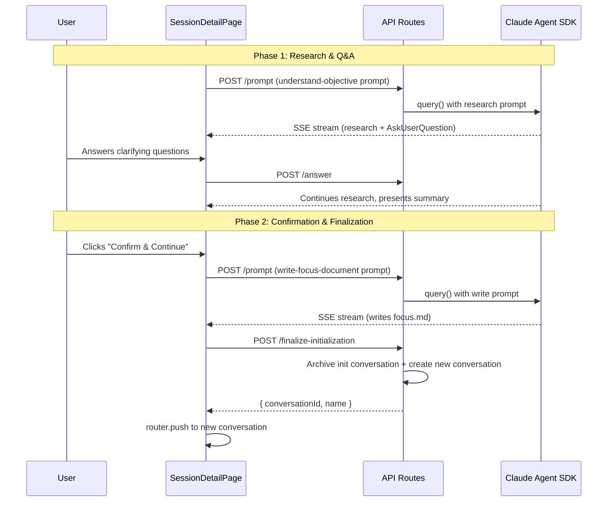

# Design Document

## Overview

**Purpose**: This feature transforms focus mode session creation from a single monolithic prompt into a structured two-phase initialization flow with explicit user confirmation. It gives users control over when the focus document is written, and cleanly transitions them from the initialization phase to regular conversation.

**Users**: Developers using CSM's focus mode sessions will experience a guided initialization flow — research and Q&A first, then explicit confirmation before the focus document is written and a fresh conversation is created.

**Impact**: Changes the focus session initialization from a one-shot prompt that combines research + document writing into a two-step flow with a confirmation gate between them. Adds a new `role` field to conversations and a new API endpoint for finalization.

### Goals
- Split monolithic focus initialization into research/Q&A phase + document-writing phase
- Give users explicit control over when to proceed via a confirmation button
- Cleanly archive the initialization conversation and navigate to a fresh regular conversation
- Maintain backward compatibility with existing conversation data

### Non-Goals
- Changing the fast-mode session creation flow
- Modifying the prompt execution or SDK streaming infrastructure
- Adding persistent initialization state beyond the `role` field
- Supporting multiple initialization conversations per session

## Architecture

### Existing Architecture Analysis
- CSM uses a Next.js App Router with API routes as the backend, filesystem-backed JSON state
- Sessions contain an ordered array of `ConversationState` objects
- Prompt execution uses `@anthropic-ai/claude-agent-sdk` `query()` API with SSE streaming
- UI state is managed via TanStack Query (server state) and Zustand (UI state)
- The `AskUserQuestion` tool flow already demonstrates blocking prompts that wait for user input

### Architecture Pattern & Boundary Map

**Architecture Integration**:
- Selected pattern: Incremental extension of existing conversation model with a `role` discriminator
- Domain boundaries: Data model change in schemas → domain logic in `conversations.ts` → API route → UI integration in `SessionDetailPage`
- Existing patterns preserved: Zod schema-first modeling, `mutationFetch` pattern for API calls, TanStack Query invalidation, component colocation
- New components: `FocusConfirmationBar` (shared component), `finalize-initialization` API route
- Steering compliance: Follows schema-first, colocation, and REST resource hierarchy patterns

### Technology Stack

| Layer | Choice / Version | Role in Feature | Notes |
|-------|------------------|-----------------|-------|
| Frontend | React 19 + Next.js 15 | SessionDetailPage renders FocusConfirmationBar conditionally | Uses existing TanStack Query + Zustand patterns |
| Backend | Next.js API Routes | `finalize-initialization` endpoint | Follows existing route conventions |
| Data / Storage | Filesystem JSON state | `role` field on ConversationState | Backward-compatible via Zod `.default(null)` |
| Shared Components | `src/components/` | FocusConfirmationBar | Cross-page capable, currently used in SessionDetailPage |

## System Flows



Key decisions:
- The "write focus document" prompt is sent as a regular prompt to the existing conversation, reusing the full SDK context
- Finalization is atomic: archive + create happen in a single API call to prevent partial states
- Navigation to the new conversation uses client-side routing after finalization succeeds

## Requirements Traceability

| Requirement | Summary | Components | Interfaces | Flows |
|-------------|---------|------------|------------|-------|
| 1 | Role identification | `conversationRoleSchema`, `sessions.ts` | ConversationState schema | Session provisioning |
| 2 | Two-phase prompt execution | `prompt-templates.ts` | getUnderstandObjectivePrompt, getWriteFocusDocumentPrompt | Phase 1, Phase 2 |
| 3 | Confirmation bar | `FocusConfirmationBar.tsx`, `SessionDetailPage.tsx` | FocusConfirmationBarProps | Phase 2 trigger |
| 4 | Focus document writing | `SessionDetailPage.tsx`, `prompt-templates.ts` | sendPrompt | Phase 2 execution |
| 5 | Init conversation archival | `conversations.ts`, finalize-initialization route | finalizeInitialization | Phase 2 finalization |
| 6 | Navigation to new conversation | `SessionDetailPage.tsx`, `mutations.ts` | useFinalizeInitializationMutation | Phase 2 completion |
| 7 | Finalize API endpoint | finalize-initialization route, `conversations.ts` | POST endpoint | Phase 2 finalization |

## Components and Interfaces

| Component | Domain/Layer | Intent | Req Coverage | Key Dependencies | Contracts |
|-----------|--------------|--------|--------------|-----------------|-----------|
| conversationRoleSchema | Data Model | Discriminate conversation purpose | 1 | Zod v4 | State |
| getUnderstandObjectivePrompt | Prompt Templates | Research-only prompt | 2 | None | — |
| getWriteFocusDocumentPrompt | Prompt Templates | Document-writing prompt | 2, 4 | None | — |
| FocusConfirmationBar | UI / Shared | Confirmation button bar | 3 | None | — |
| SessionDetailPage (integration) | UI / Page | Orchestrates confirmation flow | 3, 4, 6 | FocusConfirmationBar, mutations | — |
| finalizeInitialization | Domain Logic | Archive init + create new convo | 5, 6 | state.ts | Service |
| finalize-initialization route | API | HTTP endpoint for finalization | 7 | conversations.ts | API |
| useFinalizeInitializationMutation | Client Hooks | React Query mutation | 6, 7 | mutations.ts | — |

### Data Model

#### conversationRoleSchema

| Field | Detail |
|-------|--------|
| Intent | Distinguish initialization conversations from regular ones |
| Requirements | 1 |

```typescript
export const conversationRoleSchema = z
  .enum(["initialization"])
  .nullable()
  .default(null);
```

Added to `conversationStateSchema` as `role: conversationRoleSchema`. Default `null` ensures backward compatibility with existing conversation data.

### Prompt Templates

#### getUnderstandObjectivePrompt(objective: string)

| Field | Detail |
|-------|--------|
| Intent | Generate the research/Q&A prompt for Phase 1 |
| Requirements | 2 |

Produces a prompt that instructs Claude to research the codebase, ask clarifying questions via AskUserQuestion, and present a summary. Explicitly instructs "Do NOT write focus.md".

#### getWriteFocusDocumentPrompt()

| Field | Detail |
|-------|--------|
| Intent | Generate the document-writing prompt for Phase 2 |
| Requirements | 2, 4 |

Produces a prompt that instructs Claude to write `memory-bank/focus.md` based on the conversation context. Sent only after user confirmation.

### UI Layer

#### FocusConfirmationBar

| Field | Detail |
|-------|--------|
| Intent | Display confirmation bar with "Confirm & Continue" button |
| Requirements | 3 |

**Props**:
```typescript
interface FocusConfirmationBarProps {
  onConfirm: () => void;
  disabled?: boolean;  // true when session is finished
  loading?: boolean;   // true during focus document writing
}
```

**Visibility conditions** (in SessionDetailPage):
- `isInitConversation === true` (active conversation has `role === "initialization"`)
- `!pendingQuestions` (no AskUserQuestion blocking)
- `!isBusy` (not sending/running)
- `promptCount > 0` (at least one prompt has been executed)

**Loading state**: Shows "Writing focus document..." text with spinner; button disabled.

### Domain Logic

#### finalizeInitialization

| Field | Detail |
|-------|--------|
| Intent | Atomically archive init conversation and create a new regular one |
| Requirements | 5, 6 |

```typescript
export async function finalizeInitialization(
  projectPath: string,
  sessionName: string,
): Promise<FinalizeInitializationResult>
```

- Preconditions: Session exists, has a conversation with `role === "initialization"`
- Postconditions: Init conversation archived, new conversation created with `role: null`
- Invariants: State file written atomically

### API Layer

#### POST /api/projects/[name]/sessions/[session]/finalize-initialization

| Method | Endpoint | Request | Response | Errors |
|--------|----------|---------|----------|--------|
| POST | `/api/projects/[name]/sessions/[session]/finalize-initialization` | (empty body) | `{ conversationId: string, name: string }` | 400 (not focus), 404 (not found), 500 (internal) |

Validates session is focus mode, delegates to `finalizeInitialization()`, returns new conversation details.

### Client Hooks

#### useFinalizeInitializationMutation

| Field | Detail |
|-------|--------|
| Intent | TanStack Query mutation for finalization endpoint |
| Requirements | 6, 7 |

On success, invalidates conversation list and session detail queries to refresh UI state.

## Data Models

### Domain Model

The only data model change is adding `role` to `ConversationState`:

```typescript
// In conversationStateSchema
role: conversationRoleSchema,  // "initialization" | null, default null
```

This is a nullable enum field. Focus sessions set `role: "initialization"` on their first conversation during provisioning. All other conversations (including the new one created after finalization) have `role: null`.

**Backward compatibility**: The `.default(null)` in the Zod schema means existing conversation data without a `role` field will be parsed as `null`.

## Error Handling

### Error Categories and Responses

**User Errors (4xx)**:
- Session not found (404): Standard error response, no special handling needed
- Not a focus session (400): Returned by finalize endpoint if called on a fast-mode session

**System Errors (5xx)**:
- State file write failure: Caught by `finalizeInitialization`, surfaced as 500 with error message
- Prompt execution failure: Caught by `handleConfirmFocus`, displayed via `failPrompt` in the UI error banner

**Client-side error handling**:
- `handleConfirmFocus` wraps the entire flow in try/catch
- On failure, calls `failPrompt("Failed to finalize initialization")` to show error in the prompt error banner
- Loading state is always cleared in `finally` block

## Testing Strategy

### Unit Tests
- `conversations.test.ts`: Test `finalizeInitialization` — archives init conversation, creates new one, throws on missing init conversation
- `conversations.test.ts`: Test `createConversation` with `role` option
- `prompt.test.ts`: Verify prompt templates produce expected content (understand vs write)
- `schemas.ts`: Verify `conversationRoleSchema` parses "initialization", null, and defaults

### Integration Tests
- `finalize-initialization` route: Test POST returns new conversation, rejects non-focus sessions, handles missing sessions

### UI Tests
- `FocusConfirmationBar.stories.tsx`: Storybook stories for Default, Disabled, Loading states
- `SessionDetailPage.test.tsx`: Verify confirmation bar visibility conditions
