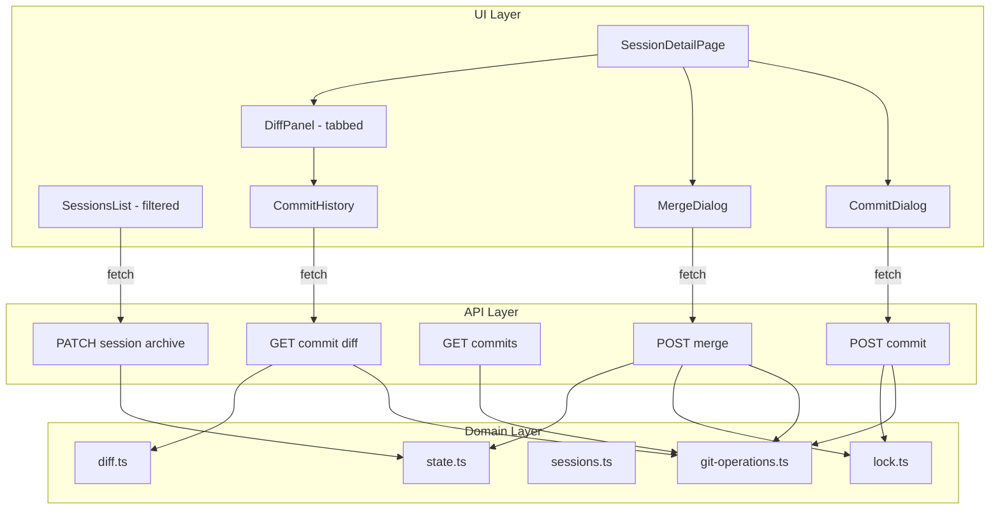
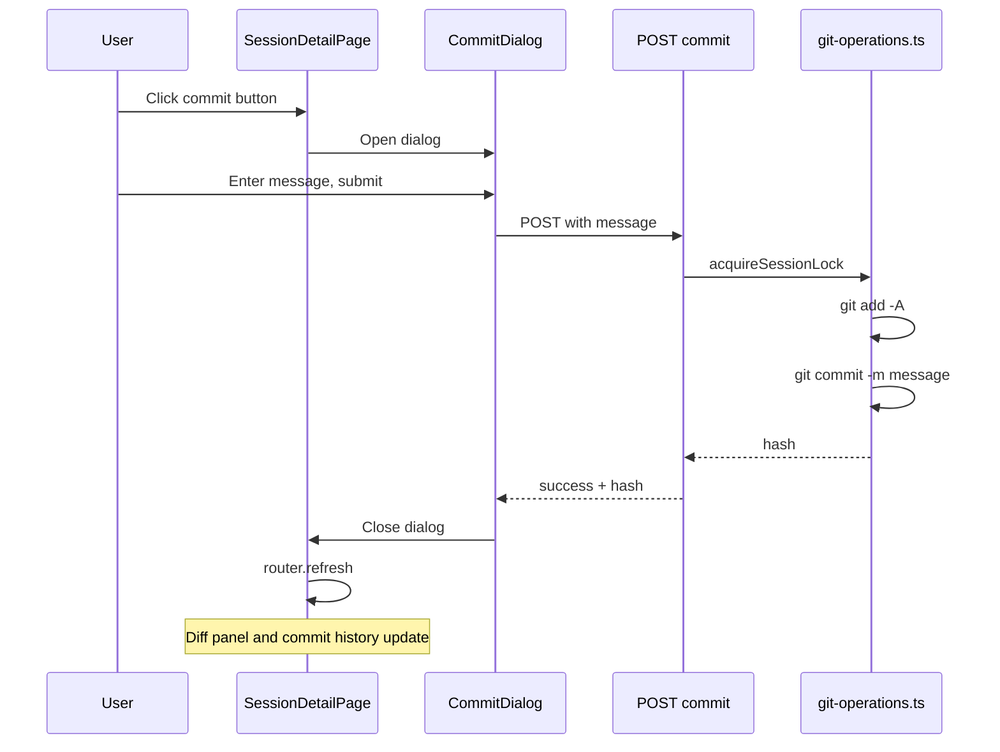
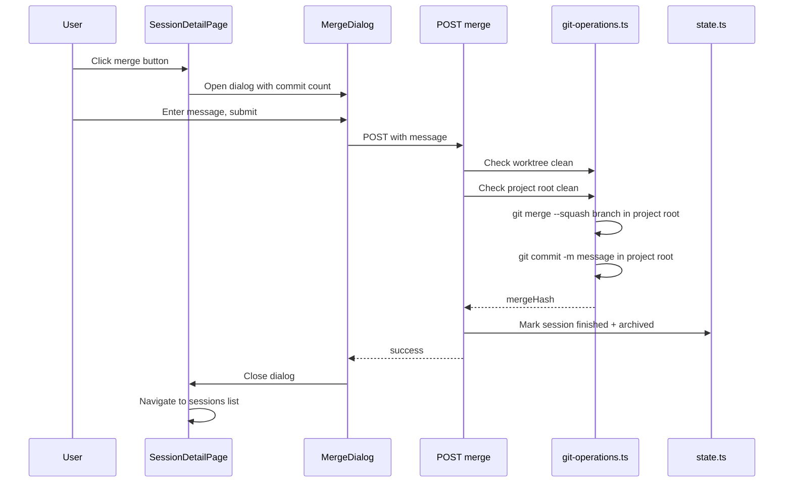
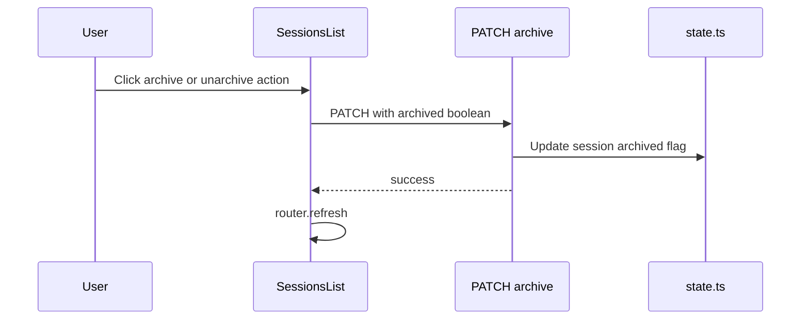

# Design Document — Git Operations

## Overview

**Purpose**: This feature adds git commit, squash merge, commit history, session archiving, and a finished (merged) lifecycle state to the session detail and sessions list pages. It enables developers to manage the full lifecycle of a coding session's changes from within the CC dashboard.

**Users**: Developers managing Claude Code sessions use these operations to checkpoint work (commit), integrate completed work into `main` (merge), review session progress (commit history), organize sessions (archive/unarchive), and identify completed work (finished state).

**Impact**: Extends the session detail page with action buttons and commit history; adds archive filtering to the sessions list; introduces a `finished` field to `SessionState`; adds new API endpoints for commit, merge, commits, and session archiving.

### Goals
- Enable committing all worktree changes with a user-provided message
- Enable squash-merging session branches into `main` with automatic finish + archive
- Display commit history since branch divergence with expandable per-commit diffs
- Enable session archiving/unarchiving with filtered sessions list
- Distinguish finished (merged, read-only) sessions from active and archived sessions

### Non-Goals
- Selective file staging (all changes committed together)
- Interactive rebase or commit amendment
- Merge conflict resolution UI (errors surface as messages)
- Cherry-pick or partial merge
- Keeping sessions active after merge (merged sessions always become finished + archived)

## Architecture

### Existing Architecture Analysis

The session detail page follows a server-component-fetches, client-component-renders pattern:

- `page.tsx` (server) resolves project path, fetches session state, computes diff, passes props
- `SessionDetailPage.tsx` (client) renders conversation, diff panel, prompt input, and handles all interactions via `fetch()` → `router.refresh()`
- `DiffPanel.tsx` renders the diff view with file collapse/expand and navigation
- API routes at `/api/projects/[name]/sessions/` handle session operations
- `src/lib/sessions.ts` contains session lifecycle logic; `src/lib/diff.ts` handles diff computation
- `SessionsList.tsx` renders the sessions table with create/delete actions
- `SessionState` already has an `archived: boolean` field but no UI or API to use it

### Architecture Pattern & Boundary Map



**Architecture Integration**:
- **Selected pattern**: Extension of existing server-fetch/client-render pattern
- **Domain boundary**: New `git-operations.ts` module owns all git commands (commit, merge, log); `sessions.ts` untouched; `state.ts` gains session archive/finish helpers
- **Existing patterns preserved**: `tracedFetch` for client API calls, `withTracing` for API routes, `ConfirmDialog` pattern for modals, `router.refresh()` for data sync, archived project visual treatment reused for archived sessions
- **New components rationale**: Each dialog handles a distinct interaction flow; `CommitHistory` encapsulates commit list + expand logic; sessions list gains archive filter following the projects dashboard pattern

### Technology Stack

| Layer | Choice / Version | Role in Feature | Notes |
|-------|------------------|-----------------|-------|
| Frontend | React 19 (client components) | Dialogs, commit history, tabbed diff panel, filtered sessions list | Follows existing client component patterns |
| Backend | Next.js API routes | Commit, merge, commits, archive endpoints | Same `withTracing` wrapper |
| Data | Git CLI via `execFile` | All git operations | Same pattern as `sessions.ts` and `diff.ts` |
| State | JSON state file (`state.ts`) | Session archived/finished persistence | Extends existing atomic write pattern |
| Locking | In-memory lock (`lock.ts`) | Prevent concurrent commit/merge during prompt execution | Reuses existing per-session mechanism |

## System Flows

### Commit Flow



### Merge Flow



### Session Archive Flow



## Requirements Traceability

| Requirement | Summary | Components | Interfaces | Flows |
|-------------|---------|------------|------------|-------|
| 1.1 | Commit dialog on action | CommitDialog | — | Commit Flow |
| 1.2 | Stage all + commit | git-operations.ts | commitChanges | Commit Flow |
| 1.3 | Dismiss + refresh on success | SessionDetailPage | — | Commit Flow |
| 1.4 | Disable when no uncommitted changes | SessionDetailPage | — | — |
| 1.5 | Error display in dialog | CommitDialog | — | Commit Flow |
| 1.6 | Disable during prompt execution | SessionDetailPage | — | — |
| 1.7 | Disable when finished | SessionDetailPage | — | — |
| 2.1 | Merge dialog with branch/count/message | MergeDialog | getCommitLog | Merge Flow |
| 2.2 | Squash merge execution | git-operations.ts | squashMerge | Merge Flow |
| 2.3 | Auto-finish + archive + navigate on success | state.ts, SessionDetailPage | setSessionFinished | Merge Flow |
| 2.4 | Block merge when uncommitted changes | MergeDialog, git-operations.ts | — | Merge Flow |
| 2.5 | Error display in merge dialog | MergeDialog | — | Merge Flow |
| 2.6 | Disable during prompt execution | SessionDetailPage | — | — |
| 2.7 | Disable when no commits to merge | SessionDetailPage | — | — |
| 2.8 | Disable when finished | SessionDetailPage | — | — |
| 3.1 | Commit history list | CommitHistory, DiffPanel | getCommitLog | — |
| 3.2 | Entry: hash, message, date, files | CommitHistory | CommitLogEntry | — |
| 3.3 | Expand to show per-commit diff | CommitHistory | getCommitDiff | — |
| 3.4 | First commit diffs against merge-base | git-operations.ts | getCommitDiff | — |
| 3.5 | Subsequent commits diff against parent | git-operations.ts | getCommitDiff | — |
| 3.6 | Collapse on re-click | CommitHistory | — | — |
| 3.7 | Empty state for no commits | CommitHistory | — | — |
| 3.8 | Update after new commit | SessionDetailPage | router.refresh | Commit Flow |
| 4.1 | Archive/unarchive action in sessions list | SessionsList | — | Archive Flow |
| 4.2 | Archived sessions hidden by default | SessionsList | — | — |
| 4.3 | Unarchive restores to default view | SessionsList | — | Archive Flow |
| 4.4 | Toggle to show/hide archived sessions | SessionsList | — | — |
| 4.5 | Archived sessions visually distinct | SessionsList | — | — |
| 4.6 | Archived sessions remain editable if not finished | SessionDetailPage | — | — |
| 5.1 | Finished state persisted on merge | state.ts | setSessionFinished | Merge Flow |
| 5.2 | Disable prompt, commit, merge when finished | SessionDetailPage | — | — |
| 5.3 | Finished indicator on detail page | SessionDetailPage | — | — |
| 5.4 | Merged badge in sessions list | SessionsList | — | — |
| 5.5 | Finished sessions viewable in read-only mode | SessionDetailPage | — | — |

## Components and Interfaces

| Component | Domain/Layer | Intent | Req Coverage | Key Dependencies | Contracts |
|-----------|-------------|--------|--------------|------------------|-----------|
| git-operations.ts | Domain | Git commit, merge, and log operations | 1.2, 2.2, 2.4, 3.1, 3.3–3.5 | diff.ts (P1) | Service |
| state.ts (extended) | Domain | Session archive + finished state persistence | 2.3, 4.1–4.3, 5.1 | — | Service |
| POST commit route | API | Commit all changes in session worktree | 1.2, 1.5, 1.7 | git-operations (P0), lock (P0) | API |
| POST merge route | API | Squash merge session branch into main | 2.2–2.5, 2.8 | git-operations (P0), lock (P0), state (P0) | API |
| GET commits route | API | Return commit log for session | 3.1, 3.2 | git-operations (P0) | API |
| GET commit diff route | API | Return diff for a single commit | 3.3 | git-operations (P0), diff (P1) | API |
| PATCH session archive route | API | Archive/unarchive a session | 4.1–4.3 | state (P0) | API |
| CommitDialog | UI | Modal for entering commit message | 1.1, 1.3, 1.5 | — | — |
| MergeDialog | UI | Modal for entering merge message | 2.1, 2.5 | — | — |
| CommitHistory | UI | Expandable commit list with diffs | 3.1–3.7 | — | — |
| DiffPanel (modified) | UI | Tabbed panel: Uncommitted + Commits | 3.1, 3.8 | CommitHistory (P1) | — |
| SessionDetailPage (modified) | UI | Orchestrates commit/merge flows, finished state | 1.3–1.4, 1.6–1.7, 2.3, 2.6–2.8, 3.8, 4.6, 5.2–5.3, 5.5 | All dialogs (P0) | — |
| SessionsList (modified) | UI | Archive filter + finished badges | 4.1–4.5, 5.4 | — | — |

### Domain Layer

#### git-operations.ts

| Field | Detail |
|-------|--------|
| Intent | Execute git commit, squash merge, and log commands for session worktrees |
| Requirements | 1.2, 2.2, 2.4, 3.1, 3.3–3.5 |

**Responsibilities & Constraints**
- Owns all git command execution for session-level operations (commit, merge, log)
- Does NOT manage session state or worktree lifecycle (that remains in `sessions.ts` / `state.ts`)
- All functions receive paths as parameters; no state file access

**Dependencies**
- Outbound: `diff.ts` — `parseDiff()` for per-commit diff parsing (P1)
- External: Git CLI via `execFile` (P0)

**Contracts**: Service [x]

##### Service Interface

```typescript
interface CommitLogEntry {
  hash: string;         // abbreviated (7 char)
  fullHash: string;     // full SHA
  message: string;      // first line of commit message
  date: string;         // ISO 8601 timestamp
  filesChanged: number;
}

interface CommitResult {
  hash: string;
}

interface MergeResult {
  mergeHash: string;
}

/** Stage all changes and commit in the worktree */
function commitChanges(
  worktreePath: string,
  message: string,
): Promise<CommitResult>;

/** Check if worktree has uncommitted changes */
function hasUncommittedChanges(worktreePath: string): Promise<boolean>;

/** Get commit log since divergence from main */
function getCommitLog(worktreePath: string): Promise<CommitLogEntry[]>;

/** Get parsed diff for a single commit */
function getCommitDiff(
  worktreePath: string,
  commitHash: string,
): Promise<SessionDiff>;

/** Squash merge session branch into main */
function squashMerge(
  projectPath: string,
  branchName: string,
  message: string,
): Promise<MergeResult>;
```

- Preconditions for `commitChanges`: worktree has uncommitted changes; message is non-empty
- Preconditions for `squashMerge`: worktree has no uncommitted changes; branch has commits beyond main; project root is clean
- Postconditions for `squashMerge`: `main` branch at project root has a new squash commit
- Invariants: never modifies session state; all operations are git-only

**Implementation Notes**
- `commitChanges`: `git add -A && git commit -m <message>` in worktree
- `getCommitLog`: `git log main..HEAD --format=<format>` in worktree, parse output
- `squashMerge`: `git merge --squash <branch> && git commit -m <message>` in project root
- `getCommitDiff`: `git diff <hash>~1..<hash>` piped through existing `parseDiff()`; for first commit after divergence use `git diff $(git merge-base main <hash>)..<hash>` to compare against the branch's divergence point rather than the current tip of `main`

#### state.ts (extended)

| Field | Detail |
|-------|--------|
| Intent | Add session-level archive and finished state helpers |
| Requirements | 2.3, 4.1–4.3, 5.1 |

**New Functions**:

```typescript
/** Set session archived flag */
function setSessionArchived(
  projectPath: string,
  sessionName: string,
  archived: boolean,
): Promise<void>;

/** Mark session as finished (merged) and archived */
function setSessionFinished(
  projectPath: string,
  sessionName: string,
): Promise<void>;
```

- `setSessionArchived`: Reads state, sets `session.archived = archived`, writes state. Follows existing `setProjectArchived` pattern.
- `setSessionFinished`: Reads state, sets `session.finished = true` and `session.archived = true`, writes state. Called by the merge route after successful squash merge.

### API Layer

#### POST /api/projects/[name]/sessions/[session]/commit

| Field | Detail |
|-------|--------|
| Intent | Commit all uncommitted changes in session worktree |
| Requirements | 1.2, 1.5, 1.7 |

**Contracts**: API [x]

##### API Contract

| Method | Endpoint | Request | Response | Errors |
|--------|----------|---------|----------|--------|
| POST | /api/projects/[name]/sessions/[session]/commit | `{ message: string }` | `{ success: true, hash: string }` | 400 (bad input), 404 (not found), 409 (busy/no changes/finished), 500 (git error) |

- Acquires session lock via `lock.ts` to prevent concurrent operations
- Returns 409 if session is busy, has no uncommitted changes, or is finished

#### POST /api/projects/[name]/sessions/[session]/merge

| Field | Detail |
|-------|--------|
| Intent | Squash merge session branch into main, mark session finished + archived |
| Requirements | 2.2–2.5, 2.8 |

**Contracts**: API [x]

##### API Contract

| Method | Endpoint | Request | Response | Errors |
|--------|----------|---------|----------|--------|
| POST | /api/projects/[name]/sessions/[session]/merge | `{ message: string }` | `{ success: true, mergeHash: string }` | 400 (bad input), 404 (not found), 409 (busy/uncommitted/no commits/finished/main dirty), 500 (merge failed) |

- Acquires session lock
- Pre-checks: session not finished, no uncommitted changes in worktree, commits exist to merge, project root clean
- On success: calls `setSessionFinished()` to mark finished + archived before returning

#### GET /api/projects/[name]/sessions/[session]/commits

| Field | Detail |
|-------|--------|
| Intent | Return commit log since branch diverged from main |
| Requirements | 3.1, 3.2 |

**Contracts**: API [x]

##### API Contract

| Method | Endpoint | Request | Response | Errors |
|--------|----------|---------|----------|--------|
| GET | /api/projects/[name]/sessions/[session]/commits | — | `{ commits: CommitLogEntry[] }` | 404 (not found), 500 (git error) |

#### GET /api/projects/[name]/sessions/[session]/commits/[hash]/diff

| Field | Detail |
|-------|--------|
| Intent | Return parsed diff for a single commit |
| Requirements | 3.3 |

**Contracts**: API [x]

##### API Contract

| Method | Endpoint | Request | Response | Errors |
|--------|----------|---------|----------|--------|
| GET | /api/projects/[name]/sessions/[session]/commits/[hash]/diff | — | `SessionDiff` | 404 (not found), 500 (git error) |

#### PATCH /api/projects/[name]/sessions/[session]/archive

| Field | Detail |
|-------|--------|
| Intent | Archive or unarchive a session |
| Requirements | 4.1–4.3 |

**Contracts**: API [x]

##### API Contract

| Method | Endpoint | Request | Response | Errors |
|--------|----------|---------|----------|--------|
| PATCH | /api/projects/[name]/sessions/[session]/archive | `{ archived: boolean }` | `{ ok: true }` | 400 (bad input), 404 (not found), 500 (state error) |

### UI Layer

#### CommitDialog

| Field | Detail |
|-------|--------|
| Intent | Modal dialog for entering a commit message and triggering commit |
| Requirements | 1.1, 1.3, 1.5 |

Summary-only component. Follows existing `ConfirmDialog` and `CreateSessionModal` patterns.

**Props**: Extends modal pattern with `open`, `onClose`, `projectName`, `sessionName`. Contains textarea for commit message, error display area, Cancel/Commit buttons. On success calls `onClose` with success signal; parent calls `router.refresh()`.

#### MergeDialog

| Field | Detail |
|-------|--------|
| Intent | Modal dialog for entering merge message and initiating squash merge |
| Requirements | 2.1, 2.5 |

Summary-only component. Displays branch name and commit count as read-only context. Textarea for merge commit message (pre-filled with session name). Error display for merge failures. On success, parent navigates to sessions list.

**Props**: `open`, `onClose`, `onSuccess`, `projectName`, `sessionName`, `branchName`, `commitCount`.

#### CommitHistory

| Field | Detail |
|-------|--------|
| Intent | Scrollable list of commits with expand-to-diff capability |
| Requirements | 3.1–3.7 |

**Responsibilities & Constraints**
- Renders list of `CommitLogEntry` items passed as props
- Manages expand/collapse state locally
- Fetches per-commit diff on expand via client-side `fetch()`
- Displays empty state when no commits

**Props**: `commits: CommitLogEntry[]`, `projectName: string`, `sessionName: string`.

**Implementation Notes**
- Each commit row: abbreviated hash (mono, cyan), message, relative date, files changed badge
- Expand click fetches `GET /api/.../commits/[hash]/diff` and renders inline using existing diff line styles
- Collapse clears the cached diff to free memory

#### DiffPanel (modified)

| Field | Detail |
|-------|--------|
| Intent | Adds tab bar to switch between "Uncommitted" and "Commits" views |
| Requirements | 3.1, 3.6 |

**Implementation Notes**
- Tab bar added below the existing panel header, using `.filter-pills` styling pattern
- "Uncommitted" tab shows existing diff content (unchanged)
- "Commits" tab renders `CommitHistory` component
- Default tab: "Uncommitted" if there are uncommitted changes, otherwise "Commits"
- New props: `commits: CommitLogEntry[]`, `projectName: string`, `sessionName: string`

#### SessionDetailPage (modified)

| Field | Detail |
|-------|--------|
| Intent | Adds commit/merge buttons, finished state, orchestrates dialog flows |
| Requirements | 1.3–1.4, 1.6–1.7, 2.3, 2.6–2.8, 3.6, 4.6, 5.2–5.3, 5.5 |

**Implementation Notes**
- New state: `showCommitDialog`, `showMergeDialog`
- Commit button: disabled when `diff.files.length === 0` or `session.status === "running"` or `sending` or `session.finished`
- Merge button: disabled when `commits.length === 0` or `diff.files.length > 0` or `session.status === "running"` or `sending` or `session.finished`
- New prop from server: `commits: CommitLogEntry[]`
- After successful commit: close dialog → `router.refresh()` (updates diff + commits)
- After successful merge: close merge dialog → navigate to sessions list (`router.push`)
- Finished state indicator: banner at top of content area indicating "This session has been merged into main and is read-only"
- When finished: prompt textarea disabled, send button disabled, commit/merge buttons hidden or disabled

#### SessionsList (modified)

| Field | Detail |
|-------|--------|
| Intent | Adds archive filter, archive/unarchive actions, finished badges |
| Requirements | 4.1–4.5, 5.4 |

**Implementation Notes**
- Add archive toggle button following the `.archive-toggle` pattern from `ProjectsGridClient`
- Default view: hide archived sessions (`session.archived === true`)
- When archive toggle active: show all sessions, archived ones with `.archived` visual treatment (dashed border, reduced opacity)
- Archive/unarchive action: button in each session row, calls `PATCH /api/.../archive`
- Finished badge: new `.session-badge.merged` badge with distinct styling (e.g., cyan background like `.project-badge.active`) showing "merged" text
- Status column: finished sessions show "merged" status instead of idle/ready/running

## Data Models

### Domain Model

One new field added to `SessionState`:

- **`finished: boolean`** — Set to `true` when a session is successfully merged into `main`. Once true, the session becomes read-only (no prompts, commits, or merges). Defaults to `false`.

The existing `archived: boolean` field (already in the schema) is now actively used for session archiving.

### Data Contracts & Integration

**Schema Changes** (in `src/lib/schemas.ts`):

```typescript
// SessionState schema — add finished field
export const sessionStateSchema = z.object({
  // ... existing fields ...
  archived: z.boolean(),
  finished: z.boolean().default(false),  // NEW
  // ...
});

// New request schemas
const commitRequestSchema = z.object({
  message: z.string().trim().min(1),
});

const mergeRequestSchema = z.object({
  message: z.string().trim().min(1),
});

const sessionArchiveRequestSchema = z.object({
  archived: z.boolean(),
});

const commitLogEntrySchema = z.object({
  hash: z.string(),
  fullHash: z.string(),
  message: z.string(),
  date: z.string(),
  filesChanged: z.number(),
});
```

**Type exports** (in `src/types/index.ts`):
- `CommitLogEntry`, `CommitRequest`, `MergeRequest`, `SessionArchiveRequest` re-exported from schemas

## Error Handling

### Error Categories and Responses

**User Errors (400)**:
- Empty commit message → `{ error: "Commit message is required" }`
- Empty merge message → `{ error: "Merge message is required" }`
- Invalid archive request → `{ error: "archived (boolean) is required" }`

**Conflict Errors (409)**:
- Session busy → `{ error: "Session is busy", code: "SESSION_BUSY" }`
- No uncommitted changes (commit) → `{ error: "No uncommitted changes to commit", code: "NO_CHANGES" }`
- Uncommitted changes exist (merge) → `{ error: "Uncommitted changes must be committed before merging", code: "UNCOMMITTED_CHANGES" }`
- No commits to merge → `{ error: "No commits to merge", code: "NO_COMMITS" }`
- Project root dirty (merge) → `{ error: "Main branch has uncommitted changes", code: "MAIN_DIRTY" }`
- Session finished → `{ error: "Session is finished and read-only", code: "SESSION_FINISHED" }`

**System Errors (500)**:
- Git command failure → `{ error: <stderr from git> }` — surfaces actual git error for debugging

All errors follow existing `ApiError` type (`{ error: string, code?: string }`).

### Monitoring

All API routes use existing `withTracing` wrapper. Git operations use `createLogger("git-operations")` following the pattern in `sessions.ts`.

## Testing Strategy

### Unit Tests
- `git-operations.test.ts`: Test `commitChanges`, `getCommitLog`, `squashMerge`, `hasUncommittedChanges`, `getCommitDiff` with mocked `execFile`
- Parse git log output formatting edge cases (multiline messages, special characters)
- Pre-condition validation (empty message, no changes, finished session, etc.)
- `state.ts` extensions: Test `setSessionArchived` and `setSessionFinished`

### Integration Tests
- `commit-route.test.ts`: Test commit API (success, no changes, busy, finished, invalid input)
- `merge-route.test.ts`: Test merge API (success with auto-finish, uncommitted changes, no commits, conflicts, busy, finished)
- `commits-route.test.ts`: Test commits list and per-commit diff endpoints
- `session-archive-route.test.ts`: Test archive/unarchive API (success, not found, invalid input)

### E2E/UI Tests
- Commit flow: open dialog → enter message → submit → dialog closes → diff updates
- Merge flow: open dialog → submit → session marked finished → navigates to sessions list
- Commit history: tab switch → commit list renders → expand commit → diff shows
- Finished state: verify prompt input, commit, merge all disabled with banner
- Archive flow: archive session → disappears from default view → toggle shows it → unarchive restores
- Sessions list: verify merged badge, archived visual treatment, filter toggle
