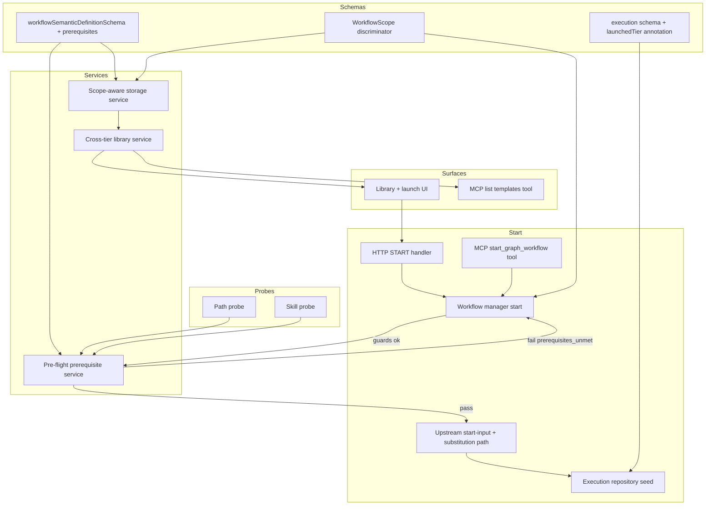

# Design Document: global-workflow-templates

## Overview

**Purpose**: Add a global/cross-project template tier alongside the existing per-project workflow definitions, a unified library that browses both tiers and instantiates any template into the current project, and a deterministic start-time pre-flight prerequisite check that halts a launch with a precise diagnostic when a template's declared prerequisites are missing — before any agent tokens are spent.

**Users**: Workflow authors store a methodology-level template once in the global tier; people browse both tiers in the library and launch a template into their project; orchestrating agents discover and launch templates with the same prerequisite gating; operators/reviewers see which tier a run came from and why a launch was halted.

**Impact**: This feature is strictly additive over the existing graph engine and the already-completed `workflow-parameterization` spec. It (1) extends the per-project storage layer (`src/lib/workflow-graph/storage.ts`) with a sibling global scope rather than forking it, (2) inserts one more deterministic gate into the upstream **shared start path** (the chain `workflowManager.start` runs, into which `workflow-parameterization` consolidated the active-execution + uncommitted-changes guards), after the uncommitted-changes guard and before the upstream seed-time substitution, so both the HTTP and MCP start surfaces traverse it, and (3) adds a generic `prerequisites` block to the semantic definition and a single additive `launchedTier` execution-audit annotation. It introduces no new runtime, no template/instance entity, no migration, and no change to the upstream parameter-declaration, substitution, re-validation, start-input, or audit contracts.

### Goals

- Persist global templates in a reserved sibling scope under the resolved Command Center config directory, with full CRUD reusing the existing storage code and accept-time validation.
- List the global tier and the current project's tier together, each item annotated with its tier/origin and carrying enough metadata to launch it.
- Launch any template (global or project-local) through the unchanged upstream start path, recording the launched tier additively in the execution audit.
- Declare prerequisites generically (required path / skill) on any definition, defaulting to none.
- Run a deterministic, agent-free pre-flight prerequisite check in the target session worktree before the upstream seed, halting with an itemized diagnostic on any miss and reporting (never remediating).
- Expose library browse + prerequisite-gated launch to both the human launch surface (capabilities/data only) and the MCP tools, with identical gating and failure attribution.

### Non-Goals

- The parameterization engine itself (parameter declaration, substitution, substituted-definition re-validation, start-input validation, audit field) — owned by `workflow-parameterization`, consumed unchanged.
- Promote-to-global / fork-into-project transfer flows.
- Auto-installing, inferring, or remediating missing prerequisites.
- A PATH-executable prerequisite kind and a backend-child-process command probe (no motivating evidence; the two kinds are `path` and `skill`).
- Secrets anywhere.
- Runtime graph dynamism, conditional edges, expansion nodes, mid-run prerequisite re-checking.
- Concrete visual/layout/component design of the library and launch surfaces (owned downstream by Claude Design).

## Boundary Commitments

### This Spec Owns

- The `WorkflowScope` discriminator (`project` vs `global`) and the reserved global-scope directory key; the storage-service surface change that resolves a scope to a directory while reusing all existing CRUD/validation/atomic-write code in `src/lib/workflow-graph/storage.ts`.
- The generic `prerequisites` block on `workflowSemanticDefinitionSchema` (kind-discriminated `path` | `skill`, with an optional `backend` scope on `skill`) and its accept-time shape validation (kind present, identifier present, exact normalized skill-reference matching semantics, worktree-relative path policy, `.strict()` unknown-field rejection, and a prerequisite-literal `{{...}}`-rejection lint reusing the upstream `{{...}}` detection); the single additive `launchedTier` execution-audit annotation.
- The deterministic pre-flight prerequisite service (path/skill probes) and its itemized diagnostic result type, including the used-backend-set computation (from the config cascade) and the reuse of the runtime skill-discovery service for skill probes.
- The unified cross-tier template library service and the start-time tier resolution (load a template from the indicated tier; reject not-found by tier).
- The prerequisite-gate insertion and ordering in the upstream shared start path (`workflowManager.start`, called by both HTTP `START` and the MCP start tool): existing guards → tier resolve → prerequisite check → upstream start-input/substitution path; the distinct `prerequisites_unmet` failure attribution.
- The cross-tier listing HTTP handler and MCP list tool; the launch-request `tier` discriminator added to the start request.
- Library-browse and launch-surface behavior/data contracts (states, validation/error conditions), not visual design.

### Out of Boundary

- `workflow-parameterization`'s parameter-declaration schema, substitution, substituted-definition re-validation, start-input service, and the `boundInputs` audit field — reused unchanged; this spec must not redefine, fork, or alter them. The only execution-audit change here is the additive `launchedTier` annotation.
- The config cascade/resolver, scheduler, validator runners, approval gate, charter authority/hash, lane/merge machinery — reused unchanged.
- Concrete visual/layout/component design of the library and launch surfaces (downstream Claude Design).
- Project enumeration internals (`src/lib/projects/discovery.ts`) — not modified; launch targets the current session's project via the existing start path.

### Allowed Dependencies

- `src/lib/workflow-graph/storage.ts` — extend with `WorkflowScope`; reuse CRUD/validation/atomic-write.
- `src/lib/config/loader.ts` (`getConfigDirPath`) — resolve the config directory for the global scope.
- `src/lib/workflows/schemas.ts` — add `prerequisites` to `workflowSemanticDefinitionSchema`; add `launchedTier` to the execution schema (the upstream audit field `boundInputs` stays as defined by `workflow-parameterization`).
- `src/lib/workflow-graph/validation.ts` / `storage.ts` accept-time choke point (`validateWorkflowDefinition` via `assertValidDefinition`) — extend with prerequisite shape checks; the upstream parameter checks/lint already attach here.
- `src/lib/workflow-graph/parameter-validation.ts` (upstream-owned) — the prerequisite-literal `{{...}}`-rejection lint **reuses the upstream `{{...}}` detector** from this module so the two lints stay consistent (R4.10). This is a deliberate upstream import (a pure detector), not a fork.
- `src/lib/workflow-graph/execution-route-handlers.ts` (`START`, `startExecutionSchema`) — add the `tier` discriminator; the prerequisite gate itself is inserted into the shared start path (`workflowManager.start`), not the handler.
- `src/lib/workflow-graph/workflow-manager.ts` (`start`, `loadDefinition`) — the upstream **shared start path**; thread the scope/tier so the manager loads from the indicated tier, insert the prerequisite gate into its ordered chain (after the uncommitted-changes guard, before the upstream start-input/substitution path), and record `launchedTier`.
- `src/lib/workflows/definition-route-handlers.ts` — pattern source for the cross-tier listing handler.
- `src/lib/mcp-gateway/session-server.ts` + `src/lib/workflow-graph/planner-tools.ts` — register the cross-tier list tool; the upstream `start_graph_workflow` tool gains the `tier` discriminator and the prerequisite gate.
- `src/lib/git/worktree.ts` (`readWorktreeDirtyPaths`) — pattern source for a worktree-scoped deterministic probe; new fs/skill probes follow the `liveness.ts` DI-setter probe pattern.
- `src/lib/commands/service.ts` (`discoverCommands(worktreePath, backend)`, backed by `discoverClaudeItems` / `discoverCodexItems`) — **reused** (not re-enumerated) for the skill probe: a skill reference is "present" only when a discovered item has the same normalized reference as the declared prerequisite, so the pre-flight roots mirror the run exactly — including the Codex built-in/system root `~/.codex/skills/.system` (`service.ts` ~line 384), which a hand-listed root set would omit and false-fail (R5.4/R5.4a). This discovery returns both skills (`type: "skill"`) and slash-commands (`type: "command"`), so the `skill` prerequisite covers both. Read-only.
- `src/lib/workflow-graph/resolve-config.ts` (`resolveContext` / `resolveWorkflowDefinition`) — **reused** to compute the used-backend set: the distinct backends across all per-context implementers + all context-validators across all contexts, via the config cascade (per-context → workflow → global). Backends are not parameterizable, so the set is resolvable pre-substitution (R5.2a). Read-only.
- `src/lib/shared/schemas.ts` (`AgentBackendId`) — the per-prerequisite/used-backend type threaded into the skill probe and the pre-flight service (R4.2a, R5.2a, R5.4/R5.4a/R5.4b); read-only.
- `node:fs` (`realpath`) — resolve a declared worktree-relative path and assert worktree containment for the path probe (R5.3); read-only.
- `@/lib/logging` (`createLogger`, `timed`), Zod v4, `src/lib/shared/testing/round-trip-durability.ts` + persistence fixture, `src/lib/workflow-graph/storage.contract.test.ts` (definition coverage), `src/lib/state-store/sessions-repo.contract.test.ts` (execution coverage — round-trips `graphWorkflowExecution`).
- **Dependency direction (enforced)**: Schemas → Prerequisite probes (deterministic) → Pre-flight service → Template library service + scope-aware storage → Start service (gate) → Repository seed (audit annotation) → Route handlers / MCP tools → UI. Each layer imports only leftward. (`prerequisite-validation.ts` additionally imports the upstream `{{...}}` detector from `parameter-validation.ts` — a sideways reuse of a pure function, not a layering break.)

### Revalidation Triggers

- Any change to the `WorkflowScope` discriminator or the reserved global-scope key (consumers and storage callers depend on it).
- Any change to the `prerequisites` block shape, the prerequisite-kind set, the optional per-prerequisite `backend` scope (R4.2a), the normalized skill-reference matching rule (R4.2b/R4.2c), the `.strict()` unknown-field policy (R4.9), the prerequisite-literal `{{...}}`-rejection lint (R4.10), or the worktree-relative path-declaration policy (R4.8).
- Any change to the used-backend-set computation (R5.2a), the skill-prerequisite backend-scoping + runtime-discovery reuse rule and exact normalized-name matching (R5.4/5.4a/5.4b), or the realpath path-containment rule (R5.3).
- Any change to the upstream `{{...}}` detection the prerequisite-literal lint reuses (consistency with `workflow-parameterization` R2), the upstream runtime skill-discovery (`commands/service.ts`), or the config-cascade backend resolution (`resolve-config.ts`) — each is consumed/mirrored, not reimplemented.
- Any change to the start-request `tier` discriminator or the `prerequisites_unmet` failure shape (consumed by the UI and MCP callers).
- Any change to the gate ordering relative to the upstream start-input/substitution path.
- Any attempt to alter an upstream-owned contract (parameter block, substitution, re-validation, start-input, `boundInputs`) — that belongs to `workflow-parameterization` and must trigger re-validation there.

## Architecture

### Existing Architecture Analysis

- **Storage is path-plus-fs over a shared record**: `createWorkflowStorageService` resolves every op through `getProjectStorageDir(configDir, projectPath)` = `<configDir>/workflows/<base64url(projectPath)>` (`storage.ts:49`) and reads/writes a `WorkflowDefinitionRecord` (`src/lib/workflows/schemas.ts`). Accept-time validation runs through `assertValidDefinition` → `validateWorkflowDefinition`. A global tier is the same record in a different scope — so the change is to make scope a first-class input, not to fork storage.
- **The start path is an ordered chain of deterministic gates, consolidated upstream into a shared path**: `workflow-parameterization` moves the active-execution guard → uncommitted-changes guard (`readSessionWorktreeDirtyPaths`, returns 409 with `code: "uncommitted_changes"` + structured `details`, seeds nothing) → start-input validation into `workflowManager.start`, which both the HTTP `START` handler and the MCP `start_graph_workflow` tool call (so the guards apply to both surfaces, `workflow-parameterization` R9.7). The prerequisite check is one more gate inserted into this shared chain — after the uncommitted-changes guard, before the upstream start-input/substitution path — modeled on the dirty-path guard's return shape.
- **Substitution/audit are upstream and downstream of the gate**: `workflow-parameterization` runs start-input validation in the start service and substitution + re-validation inside `createExecutionFromSeed`, persisting `boundInputs`. The prerequisite gate runs *before* that path, so a prerequisite failure never reaches substitution (R5.9) and the upstream contracts are untouched.
- **Probes are deterministic and DI-injected**: `dev-server/liveness.ts` (setter DI, `classifyPortOwnership`) and `git/worktree.ts` (`readWorktreeDirtyPaths`) are the canonical "deterministic worktree/system probe, never an agent" pattern the prerequisite probes follow.
- **Patterns preserved**: Zod-first schemas with `z.infer`; deps-injected services (factory + setter); structured logging via `createLogger`/`timed`; schema-driven round-trip durability contracts.

### Architecture Pattern & Boundary Map



**Architecture Integration**:
- Selected pattern: sibling-scope storage + an additional deterministic start gate (one pure-ish service + injected probes + two additive schema fields). Rationale in `research.md`.
- Domain/feature boundaries: probes are dependency-free deterministic functions; the pre-flight service composes probes; scope-aware storage owns the tier resolution; the start gate owns ordering and failure attribution; the repository seed owns only the additive `launchedTier` write.
- Existing patterns preserved: storage CRUD/validation choke point, start-path gate chain, upstream substitution/audit, durability contracts, DI-over-`vi.mock`.
- New components rationale: each new module exists because a stated requirement needs a single-responsibility home (declared below).
- Steering compliance: composable primitives (extends storage/start path/manager, no fork); general primitive (no Kiro/workflow special-casing, R9.1); deterministic gate before agent turn; Zod-first; comprehensive logging; DI over `vi.mock`.

### Technology Stack

| Layer | Choice / Version | Role in Feature | Notes |
|-------|------------------|-----------------|-------|
| Frontend | React 19 + Next.js 16 | Library browse + launch surface (behavior/data only; visual design downstream) | Consumes cross-tier listing + prerequisite metadata; renders `prerequisites_unmet` itemization |
| Backend / Services | TypeScript (strict), Zod v4 | Scope-aware storage, prerequisite schema + shape checks, deterministic probes, pre-flight service, library service, start-gate wiring | `z.infer` types; `safeParse` external, `parse` internal; no `any` |
| Data / Storage | JSON file store via `storage.ts` (definitions), session repo / SQLite (execution audit) | Persist global templates + `prerequisites`; persist additive `launchedTier` | Round-trip durability contracts extended |
| Infrastructure / Runtime | Node.js (`node:fs`, skill-discovery reuse) | Deterministic path/skill probes in the target worktree + skill-resolution scope | No agent/LLM step; DI-injected for tests |

## File Structure Plan

### Directory Structure

```
src/lib/workflows/
└── schemas.ts                          # MODIFY: add prerequisiteSchema (kind-discriminated path|skill),
                                        #   add `prerequisites: z.array(...).default([])` to workflowSemanticDefinitionSchema,
                                        #   add `launchedTier` annotation to the graph workflow execution schema.

src/lib/workflow-graph/
├── workflow-scope.ts                   # NEW: WorkflowScope type + reserved global key (contains a non-base64url char) + scope→dir resolver.
├── prerequisite-probes.ts             # NEW: deterministic path/skill probes (DI-injectable, no agent);
│                                       #   skill probe REUSES commands/service.ts discoverCommands(worktree,backend).
├── preflight-prerequisites.ts         # NEW: evaluatePrerequisites(definition, { worktreePath, usedBackends }) -> { ok } | { missing: [...] };
│                                       #   used-backend set computed from resolve-config.ts; per-prereq backend honored.
├── template-library.ts                # NEW: cross-tier listTemplates(projectPath) -> tagged items; resolveTemplate(tier,id).
├── prerequisite-validation.ts         # NEW: pure prerequisite-shape checks (kind/identifier present, worktree-relative path,
│                                       #   optional backend on skill, reject {{...}} in any field reusing the upstream detector) -> graph-validation errors.
├── storage.ts                          # MODIFY: accept WorkflowScope (project|global); resolve dir per scope; reuse all CRUD/validation.
├── validation.ts                       # MODIFY: invoke prerequisite-shape checks from the accept-time path.
├── workflow-manager.ts                 # MODIFY: the upstream shared start path — GraphWorkflowStartInput carries scope/tier;
│                                        #   loadDefinition resolves by scope; INSERT the prerequisite gate into the ordered chain
│                                        #   (active-execution → uncommitted-changes → tier resolve → PREREQUISITE → upstream
│                                        #   start-input/substitution); record launchedTier.
├── execution-route-handlers.ts        # MODIFY: startExecutionSchema gains `tier`; thin handler delegates to the shared start path;
│                                        #   map prerequisites_unmet (the gate itself lives in workflow-manager.start, not here).
├── execution-repository.ts            # MODIFY: persist additive launchedTier on the seeded execution (no change to upstream audit field).
├── template-library-route-handlers.ts # NEW: HTTP cross-tier LIST handler + global-tier CRUD handlers (mirrors definition-route-handlers).
└── start-graph-workflow-tool.ts       # MODIFY (upstream-created; depends on workflow-parameterization shipping it):
                                        #   thin tool gains the additive `tier` discriminator and calls the shared start path,
                                        #   inheriting the prerequisite gate + guards (no per-tool gate duplication).

src/lib/mcp-gateway/
└── session-server.ts                   # MODIFY: register the cross-tier list-templates tool alongside planner/start tools.

src/lib/workflow-graph/storage.contract.test.ts   # MODIFY: maximal fixture declares prerequisites of every kind + a global-scope record.
src/lib/state-store/sessions-repo.contract.test.ts # MODIFY: execution fixture carries launchedTier (this contract round-trips graphWorkflowExecution).

src/features/<workflow-library>/        # MODIFY/NEW: library browse + launch surface (capabilities/data per R7; visual design downstream).
```

### Modified Files

- `src/lib/workflows/schemas.ts` — add `prerequisiteSchema` + `prerequisites` block; add `launchedTier` execution annotation.
- `src/lib/workflow-graph/storage.ts` — make scope a first-class input; resolve project vs global directory; CRUD/validation reused. This changes the storage method signatures, so migrate every call site to pass a scope. Grep-verified production call sites (2026-06-18): `execution-route-handlers.ts` (`loadDefinition` dep → `storage.get`), `runtime-edit-route-handlers.ts` (`loadDefinition` dep → `storage.get`), `mcp-gateway/workflow-execution-server.ts` (two `storage.get` sites), `planner.ts` (`loadSeedDefinition` → `storage.get`), `definition-route-handlers.ts` (all five methods: `list`/`get`/`create`/`update`/`delete`), and **`mcp-gateway/session-server.ts`** (`registerPlannerTools` aliases all five methods as `listWorkflows`/`getWorkflow`/`createWorkflow`/`updateWorkflow`/`deleteWorkflow` deps — easy to miss because it is not a direct `.get(...)` call). `workflow-manager.ts` does **not** call storage directly: it consumes an injected `loadDefinition` dep (`workflow-manager.ts:94`/`:359`, bound by the route handlers above) whose signature gains the scope.
- `src/lib/workflow-graph/validation.ts` — call prerequisite-shape checks from accept-time validation (used for both tiers and both author paths).
- `src/lib/workflow-graph/workflow-manager.ts` — the upstream shared start path; thread scope/tier through `start`; load from the indicated tier; insert the prerequisite gate into the ordered chain (after the uncommitted-changes guard, before the upstream start-input/substitution path); record `launchedTier`.
- `src/lib/workflow-graph/execution-route-handlers.ts` — extend the start request with `tier`; thin handler delegating to the shared start path; map a prerequisite failure to a distinct response (the gate lives in `workflow-manager.start`).
- `src/lib/workflow-graph/execution-repository.ts` — persist the additive `launchedTier` in the same seed mutation as the working definition.
- `src/lib/mcp-gateway/session-server.ts` — register the cross-tier list tool.
- `src/lib/workflow-graph/start-graph-workflow-tool.ts` (upstream-owned) — add the `tier` discriminator; it inherits the prerequisite gate + guards via the shared start path; **shared seam with `workflow-parameterization`, see Boundary Partition below.**
- `src/lib/workflow-graph/storage.contract.test.ts` — extend the maximal fixture with prerequisites of every kind and a global-scope record.
- `src/lib/state-store/sessions-repo.contract.test.ts` — extend the maximal execution fixture with a `launchedTier` value (this contract round-trips `graphWorkflowExecution`).

> **Implementation order (upstream dependency)**: This spec must be implemented **after** `workflow-parameterization`. It consumes that spec's parameter schema, seed-time substitution + re-validation path, start request shape (`{ definitionId, parameters? }`), start-input validation, and audit field (`boundInputs`) as already-shipped, and it **extends** the upstream-created `start-graph-workflow-tool.ts` and `startExecutionSchema` rather than creating them. The additive `tier` discriminator this spec adds to `startExecutionSchema` is the sanctioned downstream extension point on that shared schema; the top-level start request schema is not `.strict()`, so adding `tier` is purely additive. The task that extends the upstream start tool therefore requires `workflow-parameterization` to have already shipped `start-graph-workflow-tool.ts` and the `startExecutionSchema` `parameters` extension, and this design should be re-checked against what actually shipped before implementation begins.
>
> **Concrete precondition (current-state, grep-verified 2026-06-18)**: in `main` today the uncommitted-changes guard is inline in the HTTP `START` handler (`execution-route-handlers.ts`, ~lines 790–828, returning 409 `code: "uncommitted_changes"`) and `workflowManager.start` runs only the active-execution check (`workflow-manager.ts` ~lines 346–415); there is **no** MCP start tool. This spec's gate ordering (R6.1) and HTTP/MCP parity (R6.4, R8.2) assume `workflow-parameterization` has **relocated** the active-execution + uncommitted-changes guards into the shared `workflowManager.start` path and **created** `start-graph-workflow-tool.ts`. The FIRST implementation task of this spec MUST verify that relocation actually shipped — both guards live in `workflowManager.start`, and both the HTTP handler and the MCP start tool call that one path — before inserting the prerequisite gate. If parameterization shipped the guards differently (e.g. left in the handler, or duplicated per surface), stop and re-validate this design rather than threading the gate into a chain that does not exist as assumed.

> **Boundary partition vs `workflow-parameterization`**: That spec owns `parameter-substitution.ts`, `parameter-validation.ts`, `start-input-service.ts`, the upstream additive fields on `schemas.ts` (`parameters`, `boundInputs`), and creates `start-graph-workflow-tool.ts` and `startExecutionSchema`. This spec owns `workflow-scope.ts`, `prerequisite-probes.ts`, `preflight-prerequisites.ts`, `template-library.ts`, `prerequisite-validation.ts`, and `template-library-route-handlers.ts`. The files both specs touch are: `schemas.ts` (upstream adds parameters/`boundInputs`, this spec adds `prerequisites`/`launchedTier` — disjoint fields), `validation.ts` (upstream attaches parameter lint, this spec attaches prerequisite-shape checks — disjoint checks at the same choke point; this spec also imports the upstream `{{...}}` detector from `parameter-validation.ts`), `execution-route-handlers.ts` (upstream creates `startExecutionSchema` + the thin handler that calls the shared start path, this spec adds the `tier` discriminator), `workflow-manager.ts`/`execution-repository.ts` (upstream makes `workflowManager.start` the shared start path with the guards + input validation and threads `boundInputs`; this spec threads scope/tier, inserts the prerequisite gate into that shared chain, and writes `launchedTier`), and `start-graph-workflow-tool.ts` (created upstream as a thin tool over the shared start path, extended here with the `tier` discriminator — it inherits the prerequisite gate + guards via the shared path). Each shared file is extended additively with disjoint concerns; no file's behavior is owned jointly.

> Dependency direction: `workflow-scope.ts`, `prerequisite-probes.ts` import only schemas/node built-ins/the reused discovery service; `prerequisite-validation.ts` imports schemas + the upstream `{{...}}` detector; `preflight-prerequisites.ts` imports probes + schemas; `template-library.ts` imports scope-aware storage; route handlers / MCP tools import the library + pre-flight + manager; UI imports schema-derived types only.

## System Flows

### Launch → gates → seed (sequence)

```mermaid
sequenceDiagram
  participant Caller as Launcher (UI or Agent)
  participant Start as START handler / MCP start tool (thin)
  participant Mgr as Shared start path (workflowManager.start)
  participant Lib as Template library (scope resolve)
  participant Pre as Pre-flight prerequisite service
  participant Up as Upstream start-input + substitution
  participant Repo as Execution repository seed

  Caller->>Start: { definitionId, tier, parameters? }
  Start->>Mgr: start(definitionId, tier, parameters?)
  Mgr->>Mgr: active-execution guard, uncommitted-changes guard
  Mgr->>Lib: resolveTemplate(tier, definitionId)
  Lib-->>Mgr: definition OR not-found (by tier)
  Mgr->>Pre: evaluatePrerequisites(definition, worktree + used backends)
  Pre-->>Mgr: ok OR prerequisites_unmet [itemized missing, with reason]
  Mgr->>Up: (only if ok) validate inputs, substitute, re-validate
  Up->>Repo: seed; persist boundInputs (upstream) + launchedTier (this spec)
  Repo-->>Caller: execution started
  Mgr-->>Caller: (on miss) prerequisites_unmet diagnostic; nothing seeded
```

Key decisions: all gates live in the upstream shared start path that both HTTP and MCP call, so the guards, tier resolution, and prerequisite check apply identically to both surfaces (R6.4, R8.2); the prerequisite check runs after the existing guards and template resolution but before the upstream start-input/substitution path (R5.9, R6.1); on any miss it returns a distinct `prerequisites_unmet` result (each item carrying a `reason` of `absent` or `probe_error`) and seeds nothing (R5.5, R5.10, R6.2, R6.3); probes are deterministic and never call an agent (R5.2).

### Accept-time validation (process)

```mermaid
graph TD
  Save[Save definition human or planner, project or global] --> Pshape[Prerequisite shape checks]
  Pshape -->|missing kind/identifier, bad path, or {{...}} in a field| Reject0[Reject]
  Pshape --> ParamShape[Upstream parameter shape checks + reference lint]
  ParamShape -->|invalid| Reject1[Reject]
  ParamShape --> Graph[Existing graph validation]
  Graph -->|invalid| Reject2[Reject]
  Graph --> Accept[Persist in resolved scope]
```

The same accept-time choke point validates both tiers and both author paths (R1.3, R4.4, R4.6). Prerequisite-shape checks compose alongside the upstream parameter checks; neither owns the other.

## Requirements Traceability

| Requirement | Summary | Components | Interfaces | Flows |
|-------------|---------|------------|------------|-------|
| 1.1–1.6 | Global storage tier (sibling scope, non-base64url sentinel) | Scope-aware Storage, WorkflowScope | `WorkflowScope`, scope→dir resolver, CRUD | Accept-time validation |
| 2.1–2.5 | Unified cross-tier library | Template Library Service | `listTemplates(projectPath)` tagged items | — |
| 3.1–3.6 | Instantiate template into project | Template Library Service, Start Service, Repository Seed | `resolveTemplate(tier,id)`, start request `tier`, `launchedTier` | Launch sequence |
| 4.1–4.2, 4.2a–4.2c, 4.3–4.10 | Declarative prerequisite block (`path`/`skill`, optional per-`skill` `backend` R4.2a, exact normalized skill-reference matching R4.2b/R4.2c, strict schemas R4.9, prerequisite-literal `{{...}}` rejection R4.10, worktree-relative path accept-time check R4.8, secrets policy-prohibited/non-sensitive R4.7) | Definition Schema, Prerequisite Validation | `prerequisiteSchema` (`.strict()` variants, optional `backend` on `skill`), shape + path-containment + `{{...}}`-rejection checks | Accept-time validation |
| 5.1–5.2, 5.2a, 5.3–5.4, 5.4a, 5.4b, 5.5–5.9 | Deterministic pre-flight check (used-backend-set computation R5.2a, backend-scoped skill discovery via reused runtime service with exact normalized-name matching R5.4/5.4a/5.4b, realpath path containment R5.3) | Prerequisite Probes, Pre-flight Service | `evaluatePrerequisites` (used-backend-set + per-prereq backend) | Launch sequence |
| 6.1–6.4 | Gate ordering + failure attribution | Start Service | gate chain, `prerequisites_unmet` | Launch sequence |
| 7.1–7.7 | Library + launch UI capabilities | Library UI | tagged listing + prerequisite metadata + start errors | Launch sequence |
| 8.1–8.5 | Agent list + gated launch | MCP List Tool, MCP Start Tool, Pre-flight Service | list tool, start tool `tier` | Launch sequence |
| 9.1–9.5 | General primitive + additive | All; Schema defaults | empty-default `prerequisites`; unchanged upstream contracts | All |

## Components and Interfaces

| Component | Domain/Layer | Intent | Req Coverage | Key Dependencies (P0/P1) | Contracts |
|-----------|--------------|--------|--------------|--------------------------|-----------|
| Definition/Execution Schema | Schemas | `prerequisites` block + `launchedTier` annotation | 1, 4, 3, 9 | upstream schema (P0) | State |
| WorkflowScope + Scope-aware Storage | Persistence | Resolve project/global scope; reuse CRUD/validation | 1 | config loader (P0), validation (P0) | State |
| Prerequisite Validation | Pure logic | Accept-time shape checks | 4 | Definition Schema (P0), upstream `{{...}}` detector (P0) | Service |
| Prerequisite Probes | Pure/deterministic | Path/skill existence probes | 5 | node fs (P0), reused skill discovery (P0) | Service |
| Pre-flight Service | Service | Evaluate prerequisites; itemize misses | 5, 6, 8 | Probes (P0), Definition Schema (P0) | Service |
| Template Library Service | Service | Cross-tier listing + tier resolve | 2, 3 | Scope-aware Storage (P0) | Service |
| Start Service (gate) | API/Orchestration | Insert prerequisite gate; order gates; attribute failure | 3, 5, 6 | Pre-flight Service (P0), Library Service (P0), Workflow Manager (P0) | API |
| Execution Repository Seed | Persistence | Persist additive `launchedTier` | 3 | Execution Schema (P0) | State |
| Library/Listing API | API | HTTP cross-tier list + global CRUD | 2 | Library Service (P0) | API |
| MCP List Tool | API | Agent cross-tier list | 8 | Library Service (P0) | API |
| MCP Start Tool (upstream) | API | Agent gated launch | 8 | Pre-flight Service (P0), Start path (P0) | API |
| Library UI | UI | Browse + launch + surface prerequisite results | 7 | Library Service types (P1), start errors (P1) | — |

### Schemas

#### Definition / Execution Schema (prerequisites + tier annotation)

| Field | Detail |
|-------|--------|
| Intent | Add a generic `prerequisites` block to the semantic definition and one additive `launchedTier` annotation to the execution. |
| Requirements | 4.1, 4.2, 4.2a, 4.2b, 4.2c, 4.3, 4.5, 4.8, 4.9, 3.3, 9.3 |

**Responsibilities & Constraints**
- `prerequisiteSchema` is a `kind`-discriminated union: `path` (carries `path: string`, non-empty) and `skill` (carries `skill: string`, non-empty after normalization). The `skill` variant additionally carries an optional `backend: z.enum(["claude","codex"]).optional()` scoping the prerequisite to a single backend (R4.2a); the `path` variant has no `backend` field (filesystem presence is backend-independent). Each variant carries an optional `label`/`rationale` (non-empty when present). No secret/credential field exists on any variant — but note (R4.7) that the modeled string fields are arbitrary non-sensitive strings persisted and surfaced unredacted; secrets are policy-prohibited and out of scope, not structurally prevented from being typed into a modeled string.
- The `skill` kind covers both agent skills and slash-commands: the runtime discovery service (`discoverCommands`) returns both `type: "skill"` and `type: "command"` items, and the pre-flight probe matches a skill prerequisite by normalized reference across both (R4.1). The shared helper `normalizeSkillReference(value)` trims ASCII whitespace and removes at most one leading invocation sigil (`/` or `$`) from both the declared prerequisite and each discovered `CommandItem.name`; it performs no case folding, suffix matching, namespace stripping, colon-to-hyphen translation, or basename fallback (R4.2b/R4.2c). Namespace separators such as `:` remain significant: `kiro:spec-init` matches `/kiro:spec-init`, while `kiro-spec-init` matches `$kiro-spec-init` or `/kiro-spec-init` and does not match `kiro:spec-init`. The sigil is only an invocation alias; backend selection comes solely from the prerequisite's optional `backend` field and the used-backend set.
- Every variant object is declared `.strict()` (Zod `.strict()`, mirroring the established `.strict()` payload-isolation pattern in `src/lib/agent-capabilities/schemas.ts`) so that any unmodeled field is rejected at definition-accept time (R4.9). This rejects unmodeled *fields*; it is a true-but-lesser point, NOT a secrets guarantee — a modeled string field can still contain a secret. Secrets in prerequisite declarations are policy-prohibited / out of scope and the declared strings are treated as non-sensitive and surfaced unredacted (R4.7), consistent with the upstream `workflow-parameterization` secrets framing.
- The `path` variant's `path` is constrained at accept time to be worktree-relative with no `..` (parent-directory) segment and not absolute; a violating declaration is rejected at definition-accept time with a precise per-prerequisite error (R4.8). This is a declaration-shape guarantee; the start-time realpath containment check (R5.3) is the second, runtime line of defence against symlink escape.
- `workflowSemanticDefinitionSchema.prerequisites` is `z.array(prerequisiteSchema).default([])` so existing definitions parse as zero-prerequisite with no migration (R4.3, R1.5, R9.3). This addition is disjoint from the upstream `parameters` block on the same schema.
- The graph workflow execution schema gains `launchedTier: z.enum(["project", "global"]).default("project")` (additive; does not touch the upstream `boundInputs`).
- Types derived via `z.infer`; no hand-written duplicates.

**Contracts**: State [x]

##### State Management
- State model: prerequisites live on the persisted definition (either tier); `launchedTier` lives on the persisted execution.
- Persistence & consistency: definition via JSON store (`storage.ts`); execution via session repo (SQLite). Definition coverage in `storage.contract.test.ts`; `launchedTier` coverage in `sessions-repo.contract.test.ts` (round-trips `graphWorkflowExecution`).
- Concurrency strategy: unchanged from existing definition/execution persistence.

#### WorkflowScope + Scope-aware Storage

| Field | Detail |
|-------|--------|
| Intent | Make scope a first-class storage input; resolve project vs global directory; reuse all CRUD/validation. |
| Requirements | 1.1, 1.2, 1.3, 1.4, 1.5, 1.6 |

**Contracts**: State [x], Service [x]

##### Service Interface
```typescript
type WorkflowScope =
  | { kind: "project"; projectPath: string }
  | { kind: "global" };

interface WorkflowStorageService {
  list(scope: WorkflowScope): Promise<WorkflowDefinitionSummary[]>;
  get(scope: WorkflowScope, workflowId: string): Promise<WorkflowDefinitionRecord | null>;
  create(scope: WorkflowScope, draft: WorkflowDefinitionDraft): Promise<WorkflowDefinitionRecord>;
  update(scope: WorkflowScope, workflowId: string, draft: WorkflowDefinitionDraft): Promise<WorkflowDefinitionRecord>;
  delete(scope: WorkflowScope, workflowId: string): Promise<boolean>;
}
```
- Preconditions: a `project` scope carries a non-empty `projectPath`; the `global` scope carries no project binding.
- Postconditions: a `project` scope resolves to `<configDir>/workflows/<base64url(projectPath)>` (unchanged); a `global` scope resolves to `<configDir>/workflows/<reserved-global-key>`. The reserved key contains at least one character outside the base64url alphabet (`A–Za–z0–9-_`) — e.g. a key with a `.` segment — so it is **structurally** unequal to `base64url(projectPath)` for any path, no runtime guard required (R1.1).
- Invariants: accept-time validation (`assertValidDefinition` → `validateWorkflowDefinition`) runs for both scopes (R1.3); the record shape is identical across tiers (R1.2); per-project behavior is byte-for-byte unchanged when callers pass a `project` scope (R1.4, R1.5).

**Implementation Notes**
- Integration: making scope first-class changes the `WorkflowStorageService` method signatures (`projectPath` → `WorkflowScope`) — a breaking interface change (mechanical, TypeScript-checked; per-project *behavior* is unchanged). Every existing storage call site must pass `{ kind: "project", projectPath }`: `execution-route-handlers.ts`, `runtime-edit-route-handlers.ts`, `mcp-gateway/workflow-execution-server.ts` (two `get` sites), `planner.ts` (`loadSeedDefinition`), the per-project definition CRUD handlers (`definition-route-handlers.ts`), and `mcp-gateway/session-server.ts` (the `registerPlannerTools` deps that alias all five storage methods). `workflow-manager.ts` does not call storage directly — its injected `loadDefinition` dep (bound by the route handlers above) gains the scope. The global tier passes `{ kind: "global" }`. (Alternative considered: keep the `projectPath` overload and add a scope-aware entry point — rejected to keep one resolver as the single source of directory truth.)
- Validation: the reserved key's non-base64url character makes collision impossible by construction; a unit test still asserts the key is not equal to `base64url(...)` for representative paths as a regression guard.
- Risks: keep the scope→dir resolver the single source of directory truth so no caller recomputes a project key.

#### Prerequisite Validation (pure)

| Field | Detail |
|-------|--------|
| Intent | Accept-time shape checks on declared prerequisites. |
| Requirements | 4.2, 4.2a, 4.4, 4.6, 4.7, 4.8, 4.9, 4.10 |

**Contracts**: Service [x]

##### Service Interface
```typescript
interface PrerequisiteValidation {
  // Accept-time structural checks: each prerequisite has a known kind (path|skill)
  // and a non-empty identifier for that kind; a skill prerequisite's normalized
  // reference is non-empty and uses exact normalized matching (trim ASCII
  // whitespace, strip one leading "/" or "$", no fuzzy transforms); a `path`
  // prerequisite's path is
  // worktree-relative with no ".." segment and not absolute (R4.8); any
  // prerequisite field (path / skill reference / label) containing a `{{...}}` occurrence is
  // rejected, because prerequisites are literal/environment-level and are never a
  // substitution target (R4.10) — this reuses the SAME `{{...}}` detection the
  // upstream placeholder lint uses (`workflow-parameterization` R2 /
  // `lintParameterReferences`, imported from parameter-validation.ts) so the two
  // lints stay consistent. The upstream lint scans only content + charter fields
  // and never scans prerequisite fields, so without this check a `{{...}}` in a
  // prerequisite would survive accept-time and be checked literally by the
  // pre-flight gate. Strictness (unknown-field rejection, R4.9) and the
  // skill-only `backend` field (R4.2a) are enforced by the prerequisiteSchema
  // `.strict()` variants at parse time, before this runs. Returns
  // graph-validation-shaped errors so it composes with validateWorkflowDefinition.
  validatePrerequisites(
    prerequisites: WorkflowPrerequisite[],
  ): WorkflowGraphValidationError[];
}
```
- Preconditions: `prerequisites` already parse against the `.strict()` `prerequisiteSchema` (so unmodeled fields and a `backend` on a `path` variant are already rejected at parse time, R4.9/R4.2a; this is a field-shape guarantee, not a secrets guarantee — secrets are policy-prohibited per R4.7).
- Postconditions: errors carry a prerequisite locator (kind + index); a `path` prerequisite that is absolute or contains a `..` segment is rejected with that locator (R4.8); any prerequisite field containing a `{{...}}` occurrence is rejected with that locator (R4.10); applied identically to global and project definitions (R4.6).
- Invariants: `normalizeSkillReference` is the only skill-reference normalization helper and is shared by accept-time validation, the skill probe, and tests. A declaration whose normalized skill reference is empty is invalid. A backend-unscoped prerequisite only succeeds when the same normalized reference is present on every used backend; if Claude and Codex expose a conceptual capability under different normalized references, the author must declare backend-scoped prerequisites for each reference. This validation composes with — never replaces — the upstream parameter checks at the same choke point.

#### Prerequisite Probes + Pre-flight Service

| Field | Detail |
|-------|--------|
| Intent | Deterministically evaluate path/skill prerequisites in the target worktree, mirroring the actual runtime skill-discovery of the backend(s) the resolved workflow uses; itemize misses. |
| Requirements | 5.1, 5.2, 5.2a, 5.3, 5.4, 5.4a, 5.4b, 5.5, 5.6, 5.7, 5.8, 5.9, 6.2, 8.3 |

**Contracts**: Service [x]

##### Service Interface
```typescript
type ProbeOutcome =
  | { satisfied: true }
  // "absent" = definitively not present (the normal missing case, incl. realpath
  // not-found and a symlink that escapes the worktree); "probe_error" = the probe
  // could not evaluate (e.g. a non-ENOENT fs error or a skill-discovery failure).
  // A probe is NEVER reported satisfied on error — both unsatisfied arms fail
  // closed (R5.10).
  | { satisfied: false; reason: "absent" | "probe_error"; detail?: string };

interface PrerequisiteProbes {
  // Resolves the worktree-relative path via realpath and confirms the real path
  // is contained within worktreePath. Not-found and a worktree-escaping symlink →
  // { satisfied:false, reason:"absent" }; any other fs error →
  // { satisfied:false, reason:"probe_error" } (R5.3, R5.10). Inputs reaching here
  // are already accept-time-validated worktree-relative with no ".." segment (R4.8).
  probePath(input: { worktreePath: string; path: string }): Promise<ProbeOutcome>;
  // Discoverable = a skill (or slash-command) whose normalized CommandItem.name
  // exactly equals the normalized declared skill reference is discoverable for
  // `backend` by REUSING the runtime skill-discovery service (commands/service.ts
  // `discoverCommands(worktreePath, backend)`), NOT a re-enumerated root list —
  // so the roots mirror the run exactly, including the Codex `.system` root
  // (R5.4/R5.4a). discoverCommands returns both `type: "skill"` and
  // `type: "command"` items, so a skill prerequisite matches either by normalized
  // reference. Independent of dynamic enabled/disabled runtime state. A discovery failure →
  // { satisfied:false, reason:"probe_error" }, never satisfied (R5.10).
  probeSkill(input: {
    worktreePath: string;
    skill: string;
    backend: AgentBackendId;
  }): Promise<ProbeOutcome>;
}

interface PreflightPrerequisiteService {
  evaluate(input: {
    definition: WorkflowSemanticDefinition;
    worktreePath: string;
    // The SET of backends the resolved workflow actually uses — distinct
    // backends across all per-context implementers + all context-validators
    // across all contexts, from the config cascade (R5.2a). Backends are not
    // parameterizable, so this is resolvable pre-substitution.
    usedBackends: ReadonlySet<AgentBackendId>;
  }): Promise<
    | { status: "ok" }
    | { status: "prerequisites_unmet"; missing: MissingPrerequisite[] }
  >;
}

type MissingPrerequisite =
  // reason carries the probe outcome: "absent" (definitively missing) vs
  // "probe_error" (could not be evaluated — still fails closed, R5.10).
  | { kind: "path"; path: string; label: string | null; reason: "absent" | "probe_error" }
  // backend is null for a backend-unscoped skill prerequisite that was unmet on
  // at least one used backend; non-null names the scoped backend.
  | { kind: "skill"; skill: string; backend: AgentBackendId | null; label: string | null; reason: "absent" | "probe_error" };
```
- Preconditions: the definition is resolved from its tier; `worktreePath` is the target session worktree; `usedBackends` is the config-cascade-resolved set of backends the workflow runs on (R5.2a); declared path prerequisites are already accept-time-validated as worktree-relative with no `..` segment (R4.8).
- Postconditions: a `path` prerequisite is satisfied only when the declared worktree-relative path resolves via realpath to a real path that exists **and** stays contained within the target worktree; a symlink escape outside the worktree is treated as unmet/invalid, never satisfied (R5.3). A `skill` prerequisite with a declared `backend` is evaluated only against that backend; a backend-unscoped `skill` is satisfied only when the same normalized skill reference discovers on **every** backend in `usedBackends` (R4.2a, R4.2b, R5.2a, R5.4a). A `skill` is **discoverable** only via the reused runtime discovery for that backend and exact normalized-name equality — independent of dynamic enabled/disabled state and including the Codex `.system` built-in root (R5.4). On any miss, `status: "prerequisites_unmet"` with every missing item itemized by kind and a `reason` distinguishing `absent` from `probe_error` — a probe error fails closed (itemized, never satisfied), R5.5, R5.10; when all satisfied, `status: "ok"` (R5.6); empty prerequisites → `ok` with no probing (R5.7).
- Invariants: no agent/LLM step (R5.2); never installs/creates/infers/remediates (R5.8); deterministic; resolves backend-dependent (skill) prerequisites only against the backend(s) that actually run the launch — a per-prereq `backend` or the `usedBackends` set, never an arbitrary single backend nor a union the workflow does not use (R5.2a, R5.4a, R5.4b).

**Implementation Notes**
- Integration: called by the start gate (HTTP + MCP) before the upstream start-input/substitution path (R5.9). Probes are DI-injected (factory/setter, mirroring `liveness.ts`) so tests run real evaluation over fixture trees — never `vi.mock` of internal modules.
- Used-backend set (R5.2a): the gate computes `usedBackends` deterministically from the resolved config cascade (`resolve-config.ts` `resolveContext`/`resolveWorkflowDefinition`) — the distinct backends of every per-context implementer and every context-validator across all contexts (per-context override → workflow override → global default), the same resolution the run uses. Because backends are not a parameterizable field, the set is fixed before substitution. A single-backend probe is rejected: a validator/implementer on a different backend than a hypothetical "launch backend" could lack a skill and false-pass.
- Skill discovery reuse (R5.4, R5.4a): the skill probe REUSES `discoverCommands(worktreePath, backend)` (`commands/service.ts`) rather than re-enumerating roots, so "present" means "discoverable via the same scan the run uses" — including the Codex built-in/system root `~/.codex/skills/.system` (`service.ts` ~line 384) that a hand-listed enumeration would omit and thus false-fail on built-in skills. The scan returns both skills and slash-commands, so a `skill` prerequisite matches either when `normalizeSkillReference(item.name) === normalizeSkillReference(prerequisite.skill)`. Discovery is exact normalized-name presence, never a read of runtime enabled/disabled state (which lives in `src/lib/agent-capabilities/`). A Kiro template needing kiro skills is only an example; the probe is a general normalized-reference discoverability check.
- Path containment (R5.3): `realpath` the declared worktree-relative path joined under `worktreePath`, then assert the resolved path is a descendant of the (realpath'd) worktree root before treating it as satisfied; otherwise unmet/invalid. Report-only — never creates or repairs anything.
- Validation: each probe returns a `ProbeOutcome` — satisfied, or `{ satisfied:false, reason }` where `reason` is `absent` (definitively missing; realpath not-found is `absent`, the normal case) or `probe_error` (a non-ENOENT fs error or a discovery failure). Both unsatisfied outcomes fail closed and are itemized in `prerequisites_unmet` with their `reason`; a probe error is logged and never silently passes (R5.5, R5.10).
- Risks: the used-backend set and per-prereq `backend` must be settled before probing so the correct backend roots are mirrored.

#### Template Library Service

| Field | Detail |
|-------|--------|
| Intent | Combine the global and project tiers into one tagged listing; resolve a template by tier for launch. |
| Requirements | 2.1, 2.2, 2.3, 2.4, 2.5, 3.1, 3.4 |

**Contracts**: Service [x]

##### Service Interface
```typescript
type TemplateTier = "project" | "global";

interface TemplateLibraryItem {
  tier: TemplateTier;
  id: string;
  name: string;
  description: string | null;
  revision: number;
  parameters: ParameterDeclaration[]; // upstream type, surfaced for launch
  prerequisites: WorkflowPrerequisite[];
}

interface TemplateLibraryService {
  list(projectPath: string): Promise<TemplateLibraryItem[]>;
  resolve(input: {
    projectPath: string;
    tier: TemplateTier;
    id: string;
  }): Promise<WorkflowDefinitionRecord | null>;
}
```
- Preconditions: `projectPath` is the current project; `resolve` is given the tier explicitly.
- Postconditions: `list` returns global + project items, each tagged with `tier` (R2.1, R2.2); items with the same name across tiers are listed distinctly, never merged/deduped (R2.3); an empty tier still returns the other (R2.4); each item carries id, tier, parameters, and prerequisites for launch (R2.5). `resolve` loads from the indicated tier, returning `null` for not-found-in-that-tier (R3.4).
- Invariants: `resolve` never copies/moves/modifies the stored template (R3.5) — it only reads.

**Implementation Notes**
- Integration: `list` calls scope-aware storage twice (`{kind:"global"}` and `{kind:"project",projectPath}`) and tags. HTTP listing handler and MCP list tool both delegate here.
- Risks: surface the `parameters`/`prerequisites` from the underlying definition (read-only) so the UI/agent can build a launch without a second fetch.

#### Start Service (gate) + Repository Seed

| Field | Detail |
|-------|--------|
| Intent | Insert the prerequisite gate into the ordered start chain; resolve the tier; attribute failure distinctly; persist `launchedTier`. |
| Requirements | 3.1, 3.2, 3.3, 3.6, 5.1, 5.9, 6.1, 6.2, 6.3, 6.4 |

**Contracts**: API [x], State [x]

##### API Contract
| Method | Endpoint / Tool | Request | Response | Errors |
|--------|-----------------|---------|----------|--------|
| POST | workflow start route | `{ definitionId, tier, parameters? }` | started execution | 400 invalid/missing input, 404 not-found-by-tier, 409 active/uncommitted, 409 `prerequisites_unmet` (itemized) |
| MCP | `start_graph_workflow` (upstream) | `{ definitionId, tier, parameters? }` | start outcome / structured error | invalid/missing input, not-found-by-tier, active-execution / uncommitted-changes, `prerequisites_unmet` (all via the shared start path, same as HTTP) |
| MCP | `list_templates` (new) | `{}` (project from session context) | tagged cross-tier items | — |

- Ordering (in the upstream shared start path `workflowManager.start`): active-execution guard → uncommitted-changes guard → tier resolve (404 by tier on miss, R3.4) → prerequisite check → upstream start-input validation + substitution + re-validation → seed (R6.1, R5.9). A `prerequisites_unmet` outcome is distinguishable from missing-input/invalid-input/not-found/active-execution/uncommitted-changes (R6.2) and leaves nothing seeded, no conversation, no agent turn (R6.3, R5.5). The same gates and attribution apply to HTTP and MCP because both call this one shared path — not because the chain is duplicated per surface (R6.4, R8.2). (Note: the prerequisite gate sits after the dirty-worktree guard to mirror the existing chain; a dirty worktree is therefore reported before a missing prerequisite — an accepted ordering trade-off, both are deterministic pre-token gates.)
- The seed persists the additive `launchedTier` in the same mutation as the working definition (R3.3); the upstream `boundInputs` is written by the upstream path unchanged. The stored template is never copied/moved/modified (R3.5).

**Implementation Notes**
- Integration: extend the upstream-created `startExecutionSchema` with the additive `tier` discriminator (default `"project"` to preserve current callers; the top-level start schema is not `.strict()`, so this is purely additive); insert the gate into the upstream shared start path (`workflowManager.start`) right after the uncommitted-changes guard and before the start-input/substitution path, modeled on the dirty-path guard (`code: "prerequisites_unmet"`, structured `details.missing`), so both HTTP and MCP traverse it. Thread `scope`/`tier` through `workflowManager.start` and `loadDefinition`. Before invoking the pre-flight service the gate computes the **used-backend set** deterministically from the resolved config cascade (`resolve-config.ts`) — the distinct backends of every per-context implementer + every context-validator across all contexts — and passes it (plus each prerequisite's optional `backend`) to `evaluate`, so backend-dependent (skill) prerequisites are checked against the backend(s) that actually run the launch (R5.2a, R5.4a, R5.4b), never a single assumed launch backend.
- Validation: `safeParse` external payloads; map the pre-flight `prerequisites_unmet` to a 409 (HTTP) / structured tool error (MCP).
- Risks: the active-execution + uncommitted-changes guards now live in the upstream shared start path; keep them intact and ahead of the prerequisite gate there (R6.1), and rely on that single shared path (not per-surface duplication) for HTTP/MCP parity (R6.4, R8.2).

### UI Components (capabilities/data only — visual design downstream)

#### Library UI

| Field | Detail |
|-------|--------|
| Intent | Browse global + project templates, surface declared prerequisites, launch with tier + parameters, and surface gate outcomes. |
| Requirements | 7.1, 7.2, 7.3, 7.4, 7.5, 7.6, 7.7 |

**Implementation Note**: Consumes the cross-tier `TemplateLibraryItem[]` (schema-derived types) to present both tiers in one listing with each item's tier/origin indicated (R7.1); makes a template's declared prerequisites visible before launch (R7.2); on launch sends `{ definitionId, tier, parameters? }` to the start interface (R7.3); on a `prerequisites_unmet` rejection surfaces the itemized missing prerequisites by kind and reflects that the run did not start (R7.4); surfaces a distinct non-prerequisite rejection (missing/invalid input, not-found, active execution, uncommitted changes) and reflects no-start (R7.5); reflects a successful start (R7.6). The parameter-input affordances themselves are the upstream `workflow-parameterization` launch-surface capability (this spec adds the tier dimension + prerequisite results). No concrete layout/component/styling/copy decisions are made here — those are produced by Claude Design and supplied to implementers downstream; the required states/data/validation conditions above are the binding contract (R7.7).

## Data Models

### Logical Data Model
- **WorkflowPrerequisite** (value object on the definition): discriminated by `kind` (`path`|`skill`); the identifier field is the natural payload per kind; `skill` carries an optional `backend` scope (R4.2a) and is matched by exact normalized skill reference (trim ASCII whitespace, strip one leading `/` or `$`, preserve namespaces and case; no fuzzy matching, R4.2b/R4.2c); optional `label`. All string fields are literal (no `{{...}}`, R4.10) and non-sensitive (R4.7). Ordered array preserves authoring/display order.
- **WorkflowScope** (storage addressing value): `project` (carries `projectPath`) or `global` (no binding); resolves to a directory under `<configDir>/workflows/`. The global key contains a non-base64url character (R1.1).
- **launchedTier** (on the execution): `"project" | "global"`, additive audit annotation.
- **TemplateLibraryItem** (read projection): a definition summary tagged with `tier` plus `parameters`/`prerequisites` for launch.

### Consistency & Integrity
- Definition save is atomic (existing `writeJsonAtomically`) and gated by accept-time validation for both scopes.
- The global scope is a single shared store; a launch reads it and never mutates it (R3.5).
- `launchedTier` is written in the same seed mutation as the working definition (no partial audit state).

## Error Handling

### Error Strategy
Fail-closed at the earliest deterministic gate (steering: deterministic checks before agent turns). The prerequisite gate sits with the other start guards, ahead of any token spend.

### Error Categories and Responses
- **Accept-time (definition save, either tier)**: missing prerequisite kind/identifier, an empty normalized skill reference, any unmodeled field on a `.strict()` prerequisite variant (including a `backend` on a `path` variant), a `path` prerequisite that is absolute or contains a `..` segment, or a `{{...}}` occurrence in any prerequisite field (path/skill reference/label — prerequisites are literal, never substituted, R4.10) → reject save with a graph-validation-shaped error carrying the prerequisite locator (R4.4, R4.8, R4.9, R4.10); composes with the upstream parameter checks at the same choke point and reuses the same `{{...}}` detection as the upstream placeholder lint.
- **Start-time tier resolution**: template not found in the indicated tier → 404 / not-found identifying tier + id; nothing seeded (R3.4, R8.4).
- **Start-time prerequisite gate**: any declared prerequisite unmet → distinct `prerequisites_unmet` (409 HTTP / structured tool error) with `details.missing` itemized by kind and a `reason` (`absent` vs `probe_error`); a probe that errors fails closed as an itemized `probe_error` miss, never as satisfied (R5.10); nothing seeded, no conversation, no agent turn (R5.5, R6.2, R6.3, R8.3).
- **Existing guards preserved**: active-execution (409) and uncommitted-changes (409 `uncommitted_changes`) run ahead of the prerequisite gate in the upstream shared start path, so both HTTP and MCP enforce them and the prerequisite gate (R6.1, R6.4, R3.6).

### Monitoring
Structured logging via `createLogger`/`timed` at: scope resolution (tier), cross-tier list (counts per tier), used-backend-set computation (the resolved backend set, R5.2a), prerequisite-check outcome (definition id, tier, missing-count, missing kinds, the `reason` per missing item (`absent`/`probe_error`), and the scoped backend per missing skill), and launch gate decision. Prerequisite-declared strings are non-sensitive and logged/surfaced unredacted as declared (R4.7); no probe reads or logs file contents.

## Testing Strategy

### Unit Tests
- `validatePrerequisites` + `prerequisiteSchema`: a prerequisite missing its kind or identifier rejected with a locator; an unknown/extra field on any `.strict()` variant rejected at parse time (R4.9); a `backend` on a `path` variant rejected (R4.2a); an empty normalized skill reference (for example `/` or `$`) rejected with a locator (R4.2b); `normalizeSkillReference` strips one leading `/` or `$`, preserves case and `:` namespaces, and performs no suffix/fuzzy/colon-to-hyphen matching (R4.2b/R4.2c); a `path` prerequisite that is absolute or contains a `..` segment rejected with a locator (R4.8); a `{{...}}` occurrence in any prerequisite field (path/skill reference/label) rejected with a locator using the same `{{...}}` detection as the upstream lint (R4.10); a valid optional `backend` on a `skill` accepted; valid worktree-relative path / skill prerequisites accepted; applied identically to a definition regardless of tier (R4.2, R4.4, R4.6, R4.7).
- Scope resolver: a `project` scope resolves to the existing `base64url(projectPath)` directory; a `global` scope resolves to the reserved key; the reserved key contains a non-base64url character and is therefore not `base64url(projectPath)` for any path (R1.1, R1.4).
- Used-backend-set computation: a definition whose contexts resolve (via the config cascade) to mixed implementer/validator backends yields the correct distinct backend set; a single-backend workflow yields a singleton set; backends come from the resolved config (per-context → workflow → global), not a hardcoded launch backend (R5.2a).
- Prerequisite probes + pre-flight service: a missing path/skill each yields a `prerequisites_unmet` itemizing that kind; all-satisfied yields `ok`; empty prerequisites yields `ok` with no probing; a probe never invokes an agent and never remediates (R5.2, R5.5, R5.6, R5.7, R5.8). Path probe specifically: a path present inside the worktree is satisfied, but a path whose realpath escapes the worktree (e.g. via a symlink to an outside directory) is unsatisfied/invalid (R5.3). Skill probe specifically (R5.4, R5.4a): discoverability is via the reused runtime discovery for the given backend and exact normalized-name equality, so `kiro-spec-design`, `/kiro-spec-design`, and `$kiro-spec-design` match the same discovered reference, `kiro:spec-init` matches `/kiro:spec-init` but not `kiro-spec-init`, a Codex built-in skill under `~/.codex/skills/.system` is discoverable (no false-fail), a slash-command (`type: "command"`) of the normalized skill reference is discoverable, and a skill present only on a different backend's roots is NOT discoverable for that backend; discoverability is independent of enabled/disabled state. Backend scoping (R4.2a, R5.2a, R5.4a): a backend-scoped skill is checked only on its backend; a backend-unscoped skill present on one used backend but missing on another in `usedBackends` is reported unmet (the multi-backend false-pass the single-backend probe would have missed). Probe-error handling (R5.10): a path probe that hits a non-ENOENT filesystem error and a skill probe whose discovery call fails are each reported unmet with `reason: "probe_error"` (fail closed), distinct from a `reason: "absent"` miss, and are never reported satisfied.
- Template library `list`: global + project items returned, each tier-tagged; same-name items across tiers listed distinctly; an empty tier still returns the other; items carry parameters + prerequisites (R2.1–R2.5).

### Integration Tests
- Scope-aware storage CRUD: create/list/get/update/delete a global template; per-project CRUD behaves byte-for-byte as before; a legacy per-project record loads without migration (R1.2, R1.4, R1.5); accept-time validation runs for both scopes (R1.3).
- Start gate ordering: a launch with an unmet prerequisite is rejected with `prerequisites_unmet` and seeds nothing, never reaching substitution; the rejection is distinct from missing-input/invalid-input/not-found/active-execution/uncommitted-changes; active-execution and uncommitted-changes still fire ahead of the prerequisite gate (R5.9, R6.1, R6.2, R6.3).
- Tier launch: a global template launched into a project runs through the unchanged upstream substitution/re-validation path; `launchedTier` is persisted; the stored global template is unchanged after launch; a not-found tier+id is rejected (R3.1, R3.2, R3.3, R3.4, R3.5).
- Start parity: HTTP and MCP `start_graph_workflow` traverse the same upstream shared start path, so they apply the identical guards (active-execution + uncommitted-changes) and the identical prerequisite gate and attribution; an agent launch on an active execution or dirty worktree is rejected exactly like HTTP; the MCP list tool returns tier-tagged cross-tier items; no post-start prerequisite bypass exists (R6.4, R8.1, R8.2, R8.3, R8.5).

### Durability (round-trip contracts)
- Extend the definition storage contract maximal fixture (`storage.contract.test.ts`) with prerequisites of every kind and a global-scope record; assert prerequisites and the global record survive save/load (R1.6, R4.5).
- Add `launchedTier` to the execution durability coverage in `sessions-repo.contract.test.ts` (which round-trips `graphWorkflowExecution`); declare its default (`"project"`) in the policy map so a pre-feature execution loads with `launchedTier = "project"` (R3.3).

### E2E / Live
- Browse the library across both tiers, launch a global template whose prerequisites are unmet (e.g. the Kiro example: a missing `.kiro/` path + a missing skill/slash-command) and confirm the run is halted with the itemized missing prerequisites and no tokens are spent; then satisfy the prerequisites and confirm the same template launches and runs through the unchanged engine with `launchedTier=global` in the audit. Kiro is only an example fixture; the same path/skill checks behave identically for a non-Kiro template (R5.5, R7.4, R9.1, R9.3).

## Security Considerations
- **Secrets policy-prohibited / out of scope (not structurally prevented)**: prerequisite declarations carry only declarative strings (path/skill references, optional label) and the optional `backend` scope. Each variant is `.strict()`, which rejects unmodeled *fields* at accept time (R4.9) — but this is a true-but-lesser point, not a secrets guarantee: a modeled string field can still *contain* a secret, and the service applies no redaction or secret-content inspection. Secrets in prerequisite declarations are policy-prohibited and out of scope (R4.7); the declared strings are treated as **non-sensitive** and are persisted, logged, and surfaced **unredacted** as declared, so a secret placed in a prerequisite would be retained and shown in the clear. This mirrors the upstream `workflow-parameterization` secrets framing (non-sensitive, policy-prohibited, no redaction in v1).
- **Path containment (two layers)**: a `path` prerequisite is rejected at accept time unless it is worktree-relative with no `..` segment and not absolute (R4.8); at check time it is resolved via realpath and is satisfied only if the resolved real path stays contained within the target worktree, so a symlink that escapes the worktree is treated as unmet/invalid rather than satisfied (R5.3). The path probe never reads file contents.
- **Backend-scoped skill discovery (reused runtime service)**: the skill probe reuses the runtime skill-discovery service (`commands/service.ts`) for each relevant backend and tests discoverability by exact normalized-reference equality (name present on the same roots the run uses, including the Codex `.system` root, across both skills and slash-commands), never dynamic enabled/disabled runtime state (R5.4, R5.4a), so the gate cannot be spoofed by toggling a skill on/off at runtime and built-in skills do not false-fail. Backend-dependent prerequisites are checked against the per-prereq `backend` or the resolved used-backend set, never an assumed single launch backend (R5.2a) — closing the false-pass where a validator/implementer on a different backend lacks the skill.
- **Probe confinement**: probes only test existence/discoverability and never read or exfiltrate file contents.
- **Report-only**: the pre-flight check never installs, creates, or modifies anything in the target project (R5.8); it is a read-only gate.
- **Tier isolation on launch**: launching a global template is read-only against the global store (R3.5), so a per-project run cannot mutate the shared template other projects depend on.
- **Contract isolation**: this spec adds disjoint fields/checks and never alters the upstream parameterization/substitution/audit contracts, so it cannot weaken the upstream fail-closed input validation.
