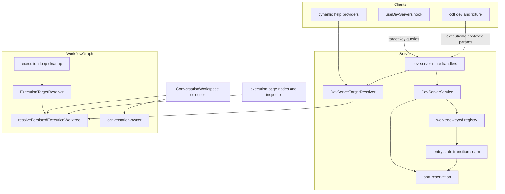
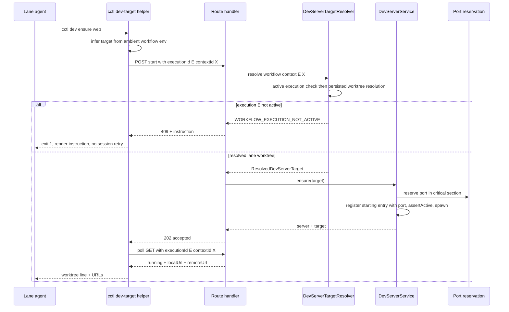
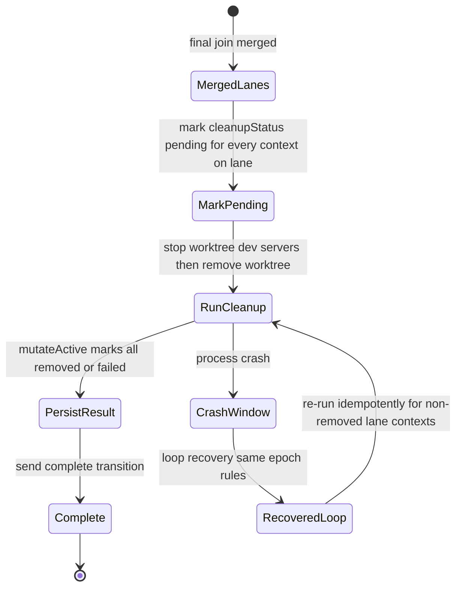

# Design Document: graph-workflow-lane-worktree-support

## Overview

**Purpose**: This feature makes a graph workflow lane worktree a first-class review and dev-server target. It delivers correct-worktree review at approval gates and lane-scoped dev-server operation to CC users and lane agents (implementers and validators).

**Users**: CC users reviewing workflow-managed conversations see and copy the worktree the conversation actually executes in, and the dev-server panel operates on that worktree. Lane agents run `cctl dev`/fixture commands that automatically target their execution context. Users monitoring the graph execution page see every context's resolved worktree.

**Impact**: Extends the existing dev-server subsystem (service, registry, routes, SSE, hook) with server-authoritative target resolution, atomic port reservation, and target-scoped isolation. Refactors `ExecutionTargetResolver` around a new client-safe discriminated resolver. Adds validator env parity and durable shared-lane cleanup recording. No second process manager, no persisted dev-server runtime state, no schema migration.

### Goals
- A workflow-managed conversation shows, copies, and serves its actual execution-context worktree on every info surface and in the dev-server panel (Requirements 1, 5).
- Every dev-server operation resolves a server-owned target from durable workflow IDs; no client-supplied paths (Requirements 2, 3).
- Session and parallel lanes run same-named dev servers concurrently on independently reserved ports (Requirement 4).
- `cctl dev`, fixture discovery, and dynamic help operate on the ambient workflow context for implementer and validator agents (Requirements 7, 8).
- The graph execution page renders the resolved worktree per context; removed lanes are reported removed everywhere (Requirements 6, 9).

### Non-Goals
- Persisting or adopting dev servers across CC restarts (registry and reservations stay process-local).
- Accepting arbitrary worktree paths from UI or CLI.
- Auto-starting dev servers on lane provisioning or gate opening.
- Diff summaries/review reports on the approval panel; lane-aware conversation diff pane.
- Dev-server controls on graph nodes.
- Operating on archived or removed execution worktrees.
- Changing `CommandCenter.json` dev-server declaration syntax.

## Boundary Commitments

### This Spec Owns
- The `DevServerTargetRef`/`ResolvedDevServerTarget` contracts and the server-side dev-server target resolver (`src/lib/dev-server/target-resolver.ts`).
- The pure persisted-worktree resolver (`src/lib/workflow-graph/execution-worktree-target.ts`) and reverse conversation-ownership module (`src/lib/workflow-graph/conversation-owner.ts`), including the deliberate behavior change that unscheduled contexts no longer resolve to the session worktree.
- Dev-server port reservation (`port-reservation.ts`) and the entry-state transition seam (`entry-state.ts`).
- Target threading through the dev-server service, routes, SSE identity, React Query keys, and the `useDevServers` hook.
- Conversation worktree selection and its display on info surfaces; execution-page worktree rows; `CopyableId` keyboard/touch hardening.
- The shared CLI dev-target helper, `cctl dev`/fixture target propagation, dev/fixture help providers, and related agent-facing documentation.
- `ExecuteWorkflowTaskRunInput.workflowContext` and validator env parity.
- Shared-lane cleanup reordering and durable recording via existing `cleanupStatus`.
- The `ownedByThisSession` → `ownedByTargetWorktree` rename (atomic, no alias).
- The additive `apiFetch` error-envelope parity extension (`status`/`code`/`output`/`details`/`issues`) in the shared `src/lib/api/fetcher.ts` — this is the one cross-domain shared-plumbing edit this spec claims.

### Out of Boundary
- Dev-server process mechanics: spawning, readiness probing, liveness polling cadence, Tailscale Serve, log capture, unmanaged-listener kill flow (owned by `dev-server-automation`; this spec re-routes their inputs and centralizes their status transitions without changing their semantics).
- Lane worktree provisioning, merging, and the decision of *when* cleanup happens in the lifecycle other than the completion-ordering change in Requirement 9.
- The approval gate protocol itself (`human-review-gate`); this spec only changes what worktree the gate's conversation displays/serves.
- The session diff endpoint and conversation diff pane.
- Codex validator persisted CC conversations (synthetic dispatch IDs remain synthetic).

### Allowed Dependencies
- `src/lib/dev-server/*` may depend on `src/lib/workflow-graph/execution-worktree-target.ts` and focused session/execution reads — never the reverse.
- `src/lib/workflow-graph/execution-worktree-target.ts` and `conversation-owner.ts` are client-safe: JSON-pure inputs, no `node:` builtins, no server-only imports (pattern: `lifecycle-classifier.ts`).
- UI consumes targets through `useDevServers` and the session-page queries; it never imports server modules.
- CLI depends on HTTP routes and ambient env only; it never resolves paths itself.
- The dependency direction within the feature is: schemas → pure resolvers (workflow-graph) → dev-server target resolver → service → route handlers → (UI hook | CLI). Imports flow left only.

### Revalidation Triggers
- Changing `DevServerTargetRef`/`ResolvedDevServerTarget` shapes, the HTTP target query encoding, or the typed error codes → revalidate `cctl` (dev, fixture, help), the UI hook, and skills docs.
- Changing the SSE `DevServerStatusEvent` fields or scope-ID format → revalidate `NotificationListener` and `session-status-bus` consumers.
- Changing `laneStates`/`taskStates` binding shapes → revalidate `conversation-owner.ts`, `lane-join.ts` forward lookup, and active-cancellation collection (both consume the same bindings).
- Changing `cleanupStatus` semantics or the cleanup/complete ordering → revalidate the resolver's availability classification and recovery re-run logic.
- Renaming/removing `ExecutionTargetResolver.resolve()` behavior again → revalidate `execution-loop.ts`, `lane-tool-context-loader.ts`, `execution-route-handlers.ts`.

## Architecture

### Existing Architecture Analysis
- The dev-server service already accepts a raw `worktreePath` override (`service.ts:54,64,72`) that no HTTP caller uses; the registry is already keyed by `(projectPath, sessionName, worktreePath, serverName)` (`registry.ts:190-197`); `stopAllForWorktree` already exists and is used by lane teardown (`parallel-worktrees.ts:502-540`). The gap is at the adapter boundary: routes are session-shaped, STOP/STOP_ALL hard-code session behavior (`route-handlers.ts:282-338`), and no reservation protects port selection.
- `ExecutionTargetResolver` (`execution-target-resolver.ts:29-119`) implements lane → legacy → session resolution with an unconditional session fallback; three call sites resolve already-scheduled contexts.
- `ConversationRuntimeState.workflowContext` and the `CC_WORKFLOW_*` env contract exist (`session-env.ts:77-80`); implementers use them, validators don't.
- `maybeFetchHelpContext` already forwards ambient workflow IDs; providers ignore them.
- Patterns preserved: `globalThis`-backed process-local state, Zod-first schemas with `z.infer`, DI via method-syntax deps interfaces, config cascade untouched, SSE as notification with GET authoritative.

### Architecture Pattern & Boundary Map



**Architecture Integration**:
- Selected pattern: server-authoritative target resolution over durable IDs (see `research.md` Architecture Pattern Evaluation for rejected alternatives).
- Key seams: `target.kind` describes how the caller addressed the server; `isolation` describes where the context executes — a `workflow-context` target may legitimately resolve to the session worktree. Runtime process identity remains `(projectPath, sessionName, normalizedWorktreePath, serverName)`; context IDs are request metadata, never process identity (sequential contexts reuse one lane).
- Only the **active** execution is eligible for dev-server operations; archived executions are audit data.
- `cleanupStatus` is authoritative for client-visible removing/removed state; filesystem existence is the server-side backstop.
- Server reuse across implementer, validator, and sequential contexts on one lane (3.7) falls out of worktree-keyed process identity: registry lookup is by worktree, never by role or context ID.

### Technology Stack

| Layer | Choice / Version | Role in Feature | Notes |
|-------|------------------|-----------------|-------|
| Frontend | React 19, TanStack Query, Tailwind v4 utilities + `ui/` primitives | Target-keyed dev-server data, info surfaces, graph rows | No new tokens/primitives/stylesheets |
| CLI | `cctl` (src/cli) | Ambient-env target inference, typed error rendering | Plugin version bump per CLI contract change policy |
| Backend | Next.js route handlers + `src/lib/dev-server` service | Target resolution, port reservation, target-scoped ops | No new endpoints; existing route paths gain query params |
| Data | SQLite via existing workflow execution persistence | `cleanupStatus` recording only | No migration, no new fields |
| Events | Existing SSE broadcaster | `DevServerStatusEvent` gains required `worktreePath`, public `projectName`, renamed ownership flag | Scope ID gains worktree segment |

No new external dependencies.

## File Structure Plan

### New Files
```
src/lib/workflow-graph/
├── execution-worktree-target.ts        # Pure client-safe resolver: (execution, contextId, session) → discriminated worktree state
├── execution-worktree-target.test.ts
├── conversation-owner.ts               # Reverse lookup: conversationId → workflow context/lane identity
└── conversation-owner.test.ts

src/lib/dev-server/
├── target-resolver.ts                  # createDevServerTargetResolver(deps): TargetRef → ResolvedDevServerTarget | typed errors
├── target-resolver.test.ts
├── port-reservation.ts                 # globalThis-backed reservation map + serialized allocation critical section
├── port-reservation.test.ts
├── entry-state.ts                      # Single entry status-transition seam: mutation + terminal reservation release + event broadcast
└── entry-state.test.ts

src/cli/commands/
└── dev-target.ts                       # Shared target inference + URL builder for dev.ts, fixture.ts, help inference
```

### Modified Files
- `src/lib/dev-server/schemas.ts` — Add `devServerTargetRefSchema`, `resolvedDevServerTargetSchema`, response schemas with `target`; add `localUrl` to runtime state; rename `ownedByThisSession` → `ownedByTargetWorktree`; make new-event `worktreePath` required; add `projectPath` alongside public `projectName` on entries/events.
- `src/lib/dev-server/service.ts` — Every public method takes `{ projectName, projectPath, sessionName, target }`; remove raw `worktreePath` override from the public surface; add `stopAll(target)`; rename `reconcileSessionDevServers` → `reconcileTargetDevServers`; read `CommandCenter.json` from `target.worktreePath`; in-flight start coalescing map.
- `src/lib/dev-server/route-handlers.ts` — Zod-parse the target query once per request; route STOP/STOP_ALL through the service; include `target` in all responses; map typed resolver errors (400/404/409) with `instruction` on both 409s.
- `src/lib/dev-server/registry.ts` — Normalize key paths with `path.resolve`; store `projectName` + `projectPath`; route status transitions through `entry-state.ts`; register `starting` entry (with assigned port) before `timedSpawn`.
- `src/lib/dev-server/port-selection.ts` — Skip ports reserved by other CC starts during scan.
- `src/lib/dev-server/reconciliation.ts`, `liveness.ts` — Transitions via `entry-state.ts`; normalized worktree comparisons; enriched events.
- `src/lib/dev-server/query-keys.ts` — `all → session(projectName, sessionName) → list(projectName, sessionName, targetKey)`.
- `src/lib/workflow-graph/execution-target-resolver.ts` — Delegate to `execution-worktree-target.ts`; unwrap available variant; throw typed invariant error for unavailable states (behavior change for unscheduled contexts).
- `src/lib/workflow-graph/user-input-gate.ts` — Import `findLaneConversationOwner` from `conversation-owner.ts` (lookup moves out unchanged).
- `src/lib/workflow-graph/execution-loop.ts` — Move `cleanupMergedLanes` before the terminal `complete` send; persist `pending → removed/failed` per lane context via `mutateActive`; idempotent re-run on recovery for non-`removed` lane contexts.
- `src/lib/workflows/primitives/session-status-bus.ts` — Dev-server scope ID becomes project/session/worktree/server.
- `src/lib/workflows/conversation/execute-workflow-task-run.ts` — Optional `workflowContext` input; set `ConversationRuntimeState.workflowContext` after `ensureConversationActor`, before `SUBMIT_TASK_RUN`.
- `src/lib/workflow-graph/validator-runner.ts` — Pass `workflowContext` on Claude and Codex dispatches; composes with (never reorders) pre-dispatch `workflowConversationId` persistence.
- `src/lib/agent-gateway/session-env.ts`, `src/lib/agent-backends/conversation.ts` — Comment updates only (implementer-and-validator lanes).
- `src/lib/prompt/sdk-driver.ts` (+ test) — `CC_CONTEXT` dev-server text updated to lane-aware wording; exact-text assertion added.
- `src/lib/api/fetcher.ts` — `apiFetch` preserves `status`/`code`/`output`/`details`/`issues` (parity with `mutationFetch`).
- `src/hooks/use-dev-servers.ts` — Target-aware URLs/keys, schema-validated fetchers, typed no-retry, target-switch cleanup, `localUrl` consumption, `enabled` gating on target readiness.
- `src/components/NotificationListener.tsx` — Parse `dev-server-status`; invalidate affected session prefix only.
- `src/features/session/ConversationWorkspace.tsx` — Compute `ConversationWorktreeSelection`; thread through `use-session-page-view-props.tsx`, `SessionContent.tsx`.
- `src/features/session/conversation/SessionInfoStrip.tsx`, `InfoDetailsPopover.tsx`, `src/features/session/mobile/MobileInfoPanel.tsx` — Display/copy the selected worktree; unavailable states non-copyable.
- `src/features/session/conversation/DevServersButton.tsx`, `src/components/DevServerDrawer.tsx` (+ stories) — Target row in panel header; `remoteUrl → localUrl` link fallback; target-aware props.
- `src/components/CopyableId.tsx` (+ test) — Enter/Space activation, visible cyan focus outline, 44px touch target variant for graph/mobile placements.
- `src/components/workflow-graph/derive-graph.ts`, `ExecutionContextNode.tsx` — `ExecutionContextNodeData` carries resolved worktree result; worktree row (available/not-provisioned/removing/removed) with `nodrag`/`nopan` copy.
- `src/features/session-workflow/components/ConnectedGraphWorkflowPanel.tsx`, `GraphWorkflowPanel`, `ExecutionInspectorPanel.tsx` (+ stories) — Session detail fetched and threaded; inspector worktree row below setup strip.
- `src/cli/commands/dev.ts`, `fixture.ts`, `dev.help.ts` — Consume `dev-target.ts`; `worktree:` output line; JSON `target`/`localUrl` passthrough; typed error rendering.
- `src/lib/agent-help/providers.ts`, `provider-deps.ts` — Dev/fixture providers accept both-or-neither workflow IDs, pass `DevServerTargetRef` to the service.
- Docs: `.kiro/steering/project-configuration.md`, `.kiro/steering/product.md`, `docs/project-configuration.md`, `plugins/command-center/command-center/skills/cc-cli/SKILL.md`, agent-context + dev-server-setup skills, `.agents`/`.claude` Next.js/live-feature guidance — lane-targeting behavior documented; session-only claims removed.

## System Flows

### Lane agent `cctl dev ensure` (happy path + stale execution)



Flow decisions: polling retains the target pair (7.5); the CLI never rewrites a rejected target (7.6); reservation is held from selection until a terminal transition releases it via the entry-state seam (4.5).

### Shared-lane cleanup ordering at completion



Flow decisions: cleanup failure records `failed` and completion proceeds (9.3); cleanup runs inside the fenced loop generation so a superseded loop cannot race the window; the resolver reports `pending`/`removed` contexts unavailable during the crash window (9.4).

## Requirements Traceability

| Requirement | Summary | Components | Interfaces | Flows |
|-------------|---------|------------|------------|-------|
| 1.1–1.6 | Conversation surfaces show/copy resolved worktree, explicit loading/unavailable states | ConversationWorktreeSelection, execution-worktree-target, conversation-owner, SessionInfoStrip/InfoDetailsPopover/MobileInfoPanel | `resolveConversationWorkflowContext`, `resolvePersistedExecutionWorktree` | — |
| 1.7–1.9 | Copy control keyboard/focus/touch | CopyableId | component props | — |
| 2.1–2.3 | Two target forms; no paths; both-or-neither IDs | schemas, target-resolver, route-handlers | `devServerTargetRefSchema`, target query contract | ensure flow |
| 2.4–2.7 | Typed not-found/not-active/unavailable errors, no session fallback | target-resolver, route-handlers | Target Resolution Errors table | ensure flow (alt) |
| 2.8–2.10 | Lane/legacy/session-isolated resolution; unscheduled = not provisioned; shared-lane agreement | execution-worktree-target, ExecutionTargetResolver delegation | `resolvePersistedExecutionWorktree` | — |
| 2.11 | Responses carry resolved target | route-handlers, schemas | `DevServersStatusResponse` | — |
| 3.1–3.7 | All six ops target-scoped; lane config; reuse; target stop-all isolation | service, route-handlers, registry | `DevServerService` interface | ensure flow |
| 3.8–3.10 | Lifecycle aggregate vs target stop-all; teardown stop-before-remove; approval keeps servers | service (`stopAllForSession` retained), parallel-worktrees (unchanged seam), gate (no change) | — | cleanup flow |
| 3.11 | Unmanaged listeners reported, not adopted | port-selection, service (unchanged semantics) | existing unmanaged result | — |
| 4.1–4.7 | Atomic reservation, coalesced starts, port visible while starting, release on terminal transitions, teardown cancellation | port-reservation, entry-state, registry, service | `PortReservationService` | ensure flow |
| 5.1–5.5 | Target-keyed isolation, scoped invalidation, switch cleanup, typed no-retry, no session substitution | use-dev-servers, query-keys, fetcher, NotificationListener | `devServerKeys`, `apiFetch` envelope | — |
| 5.6–5.8 | Panel target row, remote→local link, optimistic/pending states | DevServerDrawer/DevServersButton | component props | — |
| 6.1–6.5 | Execution page worktree rows/inspector, no node controls | derive-graph, ExecutionContextNode, ExecutionInspectorPanel, ConnectedGraphWorkflowPanel | `ExecutionContextNodeData.worktree` | — |
| 7.1–7.8 | Ambient inference, explicit override, partial env exit 2, output/JSON contract, poll retention, typed errors + instruction, help parity | dev-target helper, dev.ts, fixture.ts, dev.help.ts, providers | CLI target inference contract | ensure flow |
| 7.9 | Agent-facing docs | skills/help docs | — | — |
| 8.1–8.4 | Validator env parity, unchanged cwd/provenance/binding, no vars for non-lane runs | execute-workflow-task-run, validator-runner, runtime-state | `ExecuteWorkflowTaskRunInput.workflowContext` | — |
| 8.5 | Runtime prompt guidance | sdk-driver CC_CONTEXT + test | — | — |
| 9.1–9.6 | Durable cleanup recording, removing state, failure non-fatal, crash recovery, sibling agreement, authority rule | execution-loop, execution-worktree-target (aggregation) | `cleanupStatus` semantics | cleanup flow |
| 10.1–10.2 | Process-local runtime state, no new persistence/env | port-reservation, registry (unchanged pattern) | — | — |
| 10.3 | Structured logging | target-resolver, port-reservation, service | logging events table | — |

## Components and Interfaces

| Component | Domain/Layer | Intent | Req Coverage | Key Dependencies | Contracts |
|-----------|--------------|--------|--------------|------------------|-----------|
| execution-worktree-target | workflow-graph (pure) | Discriminated persisted-worktree resolution | 2.8–2.10, 6.x, 9.5–9.6 | workflows schemas (P0) | Service |
| conversation-owner | workflow-graph (pure) | conversationId → context/lane identity | 1.1, 1.4 | workflows schemas (P0), lane-join parity (P1) | Service |
| ExecutionTargetResolver (refactor) | workflow-graph | Orchestration unwrap of the pure resolver | 2.9 | execution-worktree-target (P0) | Service |
| DevServerTargetResolver | dev-server | TargetRef → resolved worktree or typed error | 2.1–2.11 | execution-worktree-target (P0), session/execution reads (P0), fs existence (P0) | Service |
| DevServerService (refactor) | dev-server | Target-scoped operations | 3.x | target-resolver (P0), registry (P0), port-reservation (P0) | Service |
| port-reservation | dev-server | Atomic port allocation + reservation lifetime | 4.x, 10.1 | ownership classifier (P0) | Service, State |
| entry-state | dev-server | Single status-transition seam | 4.5, 10.3 | port-reservation (P0), SSE broadcast (P0) | Service, Event |
| Route handlers (refactor) | dev-server HTTP | Query parsing, error mapping, target echo | 2.x, 3.1, 7.6 | service (P0) | API |
| useDevServers (refactor) | UI data | Target-keyed queries/mutations | 5.x | apiFetch/mutationFetch (P0), query-keys (P0) | State |
| ConversationWorktreeSelection | UI | Conversation → target + display state | 1.1–1.6, 5.5 | conversation-owner (P0), execution-worktree-target (P0) | State |
| CopyableId (hardening) | UI primitive | Keyboard/focus/touch copy | 1.7–1.9 | — | — |
| Execution-page worktree rows | UI | Node + inspector worktree display | 6.x | execution-worktree-target (P0) | — |
| dev-target CLI helper | CLI | Target inference + URL building | 7.1–7.5, 7.8 | resolveSessionContext (P0) | Service |
| Validator parity plumbing | workflows | workflowContext on task runs | 8.1–8.4 | runtime-state (P0), session-env (P0) | Service |
| Cleanup reordering | workflows | Durable `pending → removed/failed` before complete | 9.1–9.4 | mutateActive (P0), parallel-worktrees (P0) | State |

### Workflow-Graph Domain

#### execution-worktree-target

| Field | Detail |
|-------|--------|
| Intent | One pure, client-safe algorithm resolving a context's persisted worktree with first-class unavailable states |
| Requirements | 2.8, 2.9, 2.10, 6.1–6.4, 9.5, 9.6 |

**Responsibilities & Constraints**
- Resolution order: execution lane → legacy per-context worktree → session worktree, the latter only for a context whose status proves it was scheduled (`running`, `awaiting_approval`, `awaiting_user_input`, `completed`, `halted`).
- Shared-lane cleanup aggregation across every context with the same `laneId`: `removed` wins, then `pending` (→ `removing`), so partial/legacy records cannot make siblings disagree. Legacy worktrees use their own context's cleanup state.
- `pending`/`ready` without a provisioned lane/path → `not-provisioned`.
- Client-safe: session input is `Pick<SessionState, "worktreePath" | "branchName">`; no `node:` imports (only `bun run build` catches a leak — verification requirement).

##### Service Interface
```typescript
type ResolvedExecutionWorktree =
  | { state: "available"; target: ExecutionTarget }   // existing shape { worktreePath, branchName, isolation, laneId }
  | { state: "not-provisioned" }
  | { state: "removing" }
  | { state: "removed" };

function resolvePersistedExecutionWorktree(
  execution: GraphWorkflowExecution,
  contextId: string,
  session: Pick<SessionState, "worktreePath" | "branchName">,
): ResolvedExecutionWorktree;
```
- Preconditions: `contextId` exists in `execution.contextStates` (caller-validated; unknown context is the caller's typed error).
- Postconditions: `available` never returned for a context whose aggregated cleanup state is `pending`/`removed`; unscheduled contexts never yield the session path.
- Invariants: pure, deterministic, JSON-in/JSON-out.

**Implementation Notes**
- Integration: `ExecutionTargetResolver.resolve()` delegates here, unwraps `available`, and throws its existing invariant error otherwise — a deliberate behavior change for unscheduled contexts. Each current `resolve()` call site (`execution-loop.ts:1273`, `lane-tool-context-loader.ts:205`, `execution-route-handlers.ts` resolver at `:356`) gets a test pinning the context status it resolves at; any caller that legitimately resolves pre-scheduling switches to the discriminated resolver explicitly.
- Validation: focused tests prove shared-lane contexts report identical target + cleanup state.
- Risks: silent behavior break at an unaudited call site — mitigated by the pinned-status tests landing in the same slice as the change.

#### conversation-owner

| Field | Detail |
|-------|--------|
| Intent | Reverse lookup from a conversation ID to workflow execution/context/lane identity |
| Requirements | 1.1, 1.4, 1.6 |

**Responsibilities & Constraints**
- `findLaneConversationOwner(execution, conversationId)`: the `laneStates[*][*].workflowConversationId` scan moved out of `user-input-gate.ts` (gate imports it unchanged). Multiple bound entries per conversation are the norm (validator bindings persist pre-dispatch, including synthetic Codex IDs and rotated turns): rank awaiting/running contexts before ready/completed/halted/pending, then definition order, then implementer before validator — normal-path, tested behavior.
- `resolveConversationWorkflowContext(execution, conversationId)`: pending approval/user-input ownership first, then lane lookup, then `taskStates.lastConversationId` fallback (running first, then most recent `completedAt ?? startedAt`, then task order, then definition order).
- Returns identity only ({ contextId, laneId, role }); composes with `resolvePersistedExecutionWorktree` — no second path-resolution algorithm.
- This module is the reverse complement of `resolveLaneConversationId` (`lane-join.ts:396`). Divergent tie-breaking between the two is a defect (a merge sub-turn could execute in one worktree while the UI attributes the conversation to another): traversal helpers are shared or colocated, and a round-trip consistency test pins them (for every lane with a recorded conversation, reverse resolution lands on a context of the same lane).
- `laneStates` bindings are load-bearing for active cancellation too; tests pin the shared shape so neither consumer silently breaks the other.

### Dev-Server Domain

#### DevServerTargetResolver

| Field | Detail |
|-------|--------|
| Intent | Sole authority turning a client target ref into a resolved worktree, with typed rejections |
| Requirements | 2.1–2.11, 10.3 |

**Responsibilities & Constraints**
- `createDevServerTargetResolver(deps)` + production singleton. Deps (method syntax): focused session read, active-execution read, filesystem existence check. Path normalization (`path.resolve`) and `resolvePersistedExecutionWorktree` are direct domain dependencies, not injectable behavior.
- Session target: resolve `session.worktreePath`/`branchName`. Workflow target: require the exact active execution, locate the context, call the pure resolver; map `not-provisioned`/`removing`/`removed` to the typed unavailable error. Verify the resolved directory exists (server-side backstop). Never normalize a client-supplied path — none is accepted.

##### Service Interface
```typescript
type DevServerTargetRef =
  | { kind: "session" }
  | { kind: "workflow-context"; executionId: string; contextId: string };

type ResolvedDevServerTarget = {
  kind: DevServerTargetRef["kind"];
  worktreePath: string;       // normalized
  branchName: string;
  isolation: "session" | "worktree";
  executionId: string | null;
  contextId: string | null;
  laneId: string | null;
};

interface DevServerTargetResolver {
  resolve(input: {
    projectName: string;
    projectPath: string;
    sessionName: string;
    target: DevServerTargetRef;
  }): Promise<ResolvedDevServerTarget>; // throws DevServerTargetError (typed)
}
```
- Error taxonomy (thrown as a discriminated `DevServerTargetError` mapped by routes): see Error Handling.
- Logging: `dev-server.target.resolved` (debug: IDs + worktree), `dev-server.target.rejected` (warn: code, no bodies/secrets).

#### DevServerService (refactor)

| Field | Detail |
|-------|--------|
| Intent | Target-scoped list/ensure/stop/stop-all/stop-unmanaged with internal resolution |
| Requirements | 3.1–3.9, 3.11, 4.3 |

**Responsibilities & Constraints**
- Every public method requires `{ projectName, projectPath, sessionName, target: DevServerTargetRef }`; the raw optional `worktreePath` surface is removed. The service resolves the target internally and returns it alongside results.
- `reconcileSessionDevServers` → `reconcileTargetDevServers` (still keyed by normalized worktree). `CommandCenter.json` read from `target.worktreePath` (lane-local config + relative `cwd` preserved).
- New `stopAll(target)` implemented with registry `stopAllForWorktree`; the route-level user action never calls `stopAllForSession`. STOP routes through `service.stop`. `stopAllForSession` is retained exclusively for session deletion/archive, merge completion, and CC lifecycle cleanup (3.8).
- In-flight start map keyed by the reservation owner key: concurrent ensures for one target/server share the start promise (4.3); callers apply their own wait/timeout.

##### Service Interface
```typescript
interface DevServerService {
  list(input: DevServerOpInput): Promise<{ target: ResolvedDevServerTarget; servers: DevServerRuntimeState[] }>;
  ensure(input: DevServerOpInput & { serverName: string; wait?: WaitOptions }): Promise<{ target: ResolvedDevServerTarget; server: DevServerRuntimeState }>;
  startAll(input: DevServerOpInput): Promise<{ target: ResolvedDevServerTarget }>;
  stop(input: DevServerOpInput & { serverName: string }): Promise<{ target: ResolvedDevServerTarget; server: DevServerRuntimeState | null }>;
  stopAll(input: DevServerOpInput): Promise<{ target: ResolvedDevServerTarget }>;
  stopUnmanaged(input: DevServerOpInput & { serverName: string }): Promise<{ target: ResolvedDevServerTarget; result: StopUnmanagedResult }>;
}
type DevServerOpInput = { projectName: string; projectPath: string; sessionName: string; target: DevServerTargetRef };
```

#### port-reservation + entry-state

| Field | Detail |
|-------|--------|
| Intent | Race-free port allocation with reservation lifetime bound to entry status; one transition seam guaranteeing release |
| Requirements | 4.1–4.7, 10.1, 10.3 |

**Responsibilities & Constraints**
- `globalThis`-backed map + serialized allocation critical section. Owner key = registry's normalized `(projectPath, sessionName, worktreePath, serverName)` key. Allocation scans the configured range with the existing ownership classifier, skipping ports reserved by other CC starts, and reserves before leaving the critical section. The mutex is not held during readiness polling.
- The ownership classification path consults the reservation map (and the pre-registered `starting` entry): a port held by a CC-reserved start is classified managed and is never surfaced as an unmanaged-listener conflict (4.7), even mid-spawn before the child binds.
- Reservation lives for the full `starting` + `running` lifetime; released on stopped/error transition, synchronous spawn failure, readiness timeout, explicit stop, unexpected exit, and shutdown. Assigned port stored on the entry immediately at `starting` (4.4). Entry registered before `timedSpawn`; child handle attached synchronously; `assertActive` immediately before spawn so a teardown that won the race cannot spawn into a removed worktree (4.6).
- `entry-state.ts` owns status mutation, terminal reservation release, ownership resets, and event construction/broadcast; injected into registry, reconciliation, and liveness (their direct `entry.status = ...` writes are removed). Initialization is the only direct status assignment outside the seam.

##### Service Interface
```typescript
interface PortReservationService {
  reserve(ownerKey: string, port: number): void;             // inside allocation critical section
  assertActive(ownerKey: string): void;                       // throws if cancelled
  release(ownerKey: string, reason: ReservationReleaseReason): void;
  cancelForWorktree(worktreePath: string): void;
  cancelForSession(projectPath: string, sessionName: string): void;
  cancelAll(): void;
}
```

#### Route handlers (refactor)

| Field | Detail |
|-------|--------|
| Intent | HTTP adapter: parse target once, echo resolved target, map typed errors |
| Requirements | 2.1–2.7, 2.11, 3.1, 7.6 |

##### API Contract

Existing route paths unchanged. Every handler accepts no target params (session) or the required pair `?executionId=<active-execution-id>&contextId=<execution-context-id>`. `worktreePath` never accepted anywhere.

| Method | Endpoint (under `/api/projects/[name]/sessions/[session]/dev-servers`) | Response |
|--------|------|----------|
| GET | `/` | `{ target, servers }` |
| POST | `/[serverName]/start` | 202 `{ status: "accepted", target, server }` |
| POST | `/start-all` | 202 `{ status: "accepted", target }` |
| POST | `/[serverName]/stop` | `{ status: "ok", target, server }` |
| POST | `/stop-all` | `{ status: "ok", target }` (stops only `target.worktreePath`) |
| POST | `/[serverName]/stop-unmanaged` | existing killed/skipped result + `target` |

### UI Domain

#### ConversationWorktreeSelection + surface threading

| Field | Detail |
|-------|--------|
| Intent | Compute one selection (target ref + display state) per conversation; thread to all surfaces |
| Requirements | 1.1–1.6, 5.5, 5.6 |

**Responsibilities & Constraints**
- Computed in `ConversationWorkspace.tsx` once session, active conversation, and graph execution are available. Ordinary conversations → `{ kind: "session" }` + session path. Roles `iteration`/`validator` → `resolveConversationWorkflowContext` + `resolvePersistedExecutionWorktree` against the active execution.
- Loading → target loading; no session dev-server fetch as fallback (1.5, 5.5). Unavailable → explicit state, dev-server controls hidden/disabled (1.6).
- `SessionState.worktreePath` is never mutated; an explicit conversation-worktree prop is threaded through `use-session-page-view-props.tsx` → `SessionContent.tsx` → `SessionInfoStrip`/`InfoDetailsPopover`/`MobileInfoPanel`/`DevServersButton`/`DevServerPanel`. The diff pane is untouched.

##### State Management
```typescript
type ConversationWorktreeSelection =
  | { state: "session"; target: { kind: "session" }; worktreePath: string }
  | { state: "loading" }
  | { state: "workflow"; target: { kind: "workflow-context"; executionId: string; contextId: string }; worktreePath: string }
  | { state: "unavailable"; reason: "not-provisioned" | "removing" | "removed" | "stale" };
```

#### useDevServers (refactor)

| Field | Detail |
|-------|--------|
| Intent | Target-keyed, schema-validated dev-server data + mutations |
| Requirements | 5.1–5.5, 5.7, 5.8 |

**Responsibilities & Constraints**
- Signature `useDevServers(projectName, sessionName, target, options)`. Local unsafe fetchers replaced with shared `apiFetch`/`mutationFetch`; `apiFetch` first extended to preserve the envelope's `status`, `code`, `output`, `details`, `issues` (parity with `mutationFetch`). Zod response schemas for every GET/action response — no `res.json()` casts.
- One target-aware URL helper builds every GET/POST URL (suffix before query params so ensure polling and mutations retain the target). Query key: `devServerKeys.list(projectName, sessionName, targetKey)`; `targetKey` = `"session" | "workflow:<executionId>:<contextId>"` — never a raw path. Query disabled while the conversation target is loading/unavailable.
- Typed no-retry: `INVALID_DEV_SERVER_TARGET`, `WORKFLOW_EXECUTION_NOT_ACTIVE`, `WORKFLOW_CONTEXT_NOT_FOUND`, `WORKFLOW_WORKTREE_UNAVAILABLE` are terminal; bounded retry stays for network/5xx. On stale/unavailable: invalidate the graph execution + target query once, remain unavailable, never re-issue as session (5.4).
- Unmanaged-conflict + stop-pending state keyed by `targetKey`; cleared on target switch; stale mutation callbacks from an old target ignored (5.3). Optimistic `starting` + visible stop-pending preserved (5.8). Consumes `response.target` and server `localUrl` (5.7).
- `NotificationListener` parses `dev-server-status` and invalidates `devServerKeys.session(projectName, sessionName)` only (5.2). SSE stays a notification; GET remains authoritative.

### CLI / Agent Domain

#### dev-target helper + command/help integration

| Field | Detail |
|-------|--------|
| Intent | One target-inference + URL-building contract for `dev.ts`, `fixture.ts`, and dynamic help |
| Requirements | 7.1–7.8 |

**Responsibilities & Constraints**
- Resolve ordinary session identity with `resolveSessionContext`. Neither `--project` nor `--session` explicit and both `CC_WORKFLOW_EXECUTION_ID`/`CC_WORKFLOW_CONTEXT_ID` present → workflow-context target. Exactly one present → `EXIT_USAGE` (2) naming the missing variable, no request. Explicit flag → session target, ambient IDs ignored (regression test: `cctl --session other dev list` inside a lane reads the selected session).
- One exported URL builder shared by list/start/poll/stop/fixture discovery. A pure inference helper is reused by `maybeFetchHelpContext` so help omits ambient IDs under explicit flags and yields static-only help on partial env (7.8); the help-context request already forwards the IDs — `agent-help/providers.ts`/`provider-deps.ts` change to require both-or-neither and pass a `DevServerTargetRef` to the service.
- Output: text gains one `worktree: <path>` line before server blocks; JSON includes server-returned `target` and `localUrl` (no CLI derivation). Typed target errors exit `EXIT_OPERATION_FAILED` (1) rendering the server `instruction` verbatim; the CLI never retries against the session target (7.6).
- `dev.help.ts`, the help registry, and the cc-cli skill document lane auto-targeting, explicit-flag behavior, independent lane ports, and report-don't-adopt (7.9).

#### Validator parity plumbing

| Field | Detail |
|-------|--------|
| Intent | Workflow identity env for validator task runs, both backends |
| Requirements | 8.1–8.5 |

**Responsibilities & Constraints**
- `ExecuteWorkflowTaskRunInput` gains optional `workflowContext: { executionId: string; contextId: string }`. A manager/runtime helper sets `ConversationRuntimeState.workflowContext` immediately after `ensureConversationActor` and before `SUBMIT_TASK_RUN`; the existing backend runtime construction then emits both env vars through the shared session-env contract for Claude and Codex (8.1, 8.2).
- `validator-runner.ts` passes it for both Claude and Codex dispatches, including synthetic Codex conversation IDs. Composes with — never reorders or bypasses — the pre-dispatch `workflowConversationId` lane-binding persistence (cancellation + reverse lookup depend on it). Orthogonal to the `worktreePath` actor pin (`executionTarget` rebind): the pin controls where the actor executes; `workflowContext` controls child env identity; both may be present on one dispatch (8.3).
- Provenance (`origin.workflow`) stays separate from identity. Non-lane runs get no vars (8.4). Comment updates in `session-env.ts`, `agent-backends/conversation.ts`, runtime state (implementer-and-validator wording). `sdk-driver.ts` `CC_CONTEXT` updated to lane-aware wording with an exact-text test assertion (8.5).

### Workflow Lifecycle Domain

#### Cleanup reordering + durable recording

| Field | Detail |
|-------|--------|
| Intent | Persist shared-lane cleanup results before the terminal `complete` transition |
| Requirements | 9.1–9.4 |

**Responsibilities & Constraints**
- `cleanupMergedLanes` moves before the terminal `complete` send so results persist through `mutateActive`: mark every context whose `laneId` matches the lane `pending`, run cleanup (stop-before-remove unchanged), then atomically mark all `removed` or `failed`. Cleanup failure remains non-fatal to completion (9.3).
- Crash-window semantics: a crash between cleanup and `complete` leaves an active execution whose lane contexts read `pending`/`removed` with directories possibly gone — the resolver reports them unavailable (no session fallback), and the recovering loop re-runs cleanup idempotently for non-`removed` lane contexts before completing (9.4). Cleanup runs inside the fenced loop generation (`loopEpoch`), so a superseded loop cannot race the window. Completion latency now includes worktree removal (accepted trade-off).

## Data Models

### Domain Model
- **DevServerTargetRef** (client-supplied addressing) and **ResolvedDevServerTarget** (server-resolved identity) are new value objects in `src/lib/dev-server/schemas.ts`, Zod-first with `z.infer` types. `safeParse` at the HTTP boundary (untrusted); persisted session/execution paths are trusted but still normalized + existence-checked.
- **ResolvedExecutionWorktree** is a workflow-graph value object; its `available` variant embeds the existing `ExecutionTarget`.
- No aggregate ownership changes: execution state (contexts, lanes, `laneStates`, `taskStates`, `cleanupStatus`) remains owned by the workflow domain; dev-server runtime entries remain process-local.

### Data Contracts & Integration
- `DevServerRuntimeState` gains `localUrl: string | null` (server-derived; routes forward the service's existing derived value). Configured-but-stopped rows carry the resolved target's `worktreePath` instead of `null`.
- `ownedByThisSession` → `ownedByTargetWorktree` across registry, service, SSE schema, API schema, UI/CLI fixtures, and tests — atomic, no alias.
- `DevServerStatusEvent`: `projectName` carries the public project name (entries store `projectName` and `projectPath` separately); `worktreePath` required for new events (stable process discriminator when contexts share a lane).
- Dev-server scope ID in `session-status-bus.ts` becomes project/session/worktree/server.
- Shared-lane cleanup uses the existing `cleanupStatus` context field (`pending → removed | failed`); no new persisted field, no migration (10.2).

## Error Handling

### Error Strategy
The target resolver throws a discriminated `DevServerTargetError`; routes map it to the table below; clients (hook + CLI) treat these codes as terminal (no retry, no session fallback). Existing dev-server configuration/ambiguity/ownership/start-failure/timeout errors are unchanged.

### Error Categories and Responses

| HTTP | Code | Condition | Client behavior |
|------|------|-----------|-----------------|
| 400 | `INVALID_DEV_SERVER_TARGET` | One workflow param present, or either blank | No retry; CLI exits 1 |
| 404 | `SESSION_NOT_FOUND` | Parent session does not exist | No retry |
| 409 | `WORKFLOW_EXECUTION_NOT_ACTIVE` | No active execution or ID mismatch | Refetch workflow state once; remain unavailable; CLI renders `instruction` |
| 404 | `WORKFLOW_CONTEXT_NOT_FOUND` | Active execution has no matching context | Same as above |
| 409 | `WORKFLOW_WORKTREE_UNAVAILABLE` | Not provisioned / removing / removed / directory missing | Same as above |

- Both 409 bodies carry a server-authored `instruction` per the three-tier CLI output contract (`.kiro/steering/cli.md`); the CLI renders it verbatim and never authors recovery text. `WORKFLOW_EXECUTION_NOT_ACTIVE`'s instruction directs: run `cctl workflow status` to read the live execution; if superseded, stop dev-server work and surface to the orchestrator/user. `WORKFLOW_WORKTREE_UNAVAILABLE`'s instruction states the lane worktree is gone/being removed and dev-server work must not continue there.
- UI: a 409 triggers narrow invalidation (graph execution + target query) and the panel stays unavailable until fresh state resolves (5.4).
- Partial CLI env never reaches the server: `EXIT_USAGE` (2) client-side (7.3).

### Monitoring

| Event | Level | Required fields |
|-------|-------|-----------------|
| `dev-server.target.resolved` | debug | projectName, sessionName, targetKind, executionId, contextId, laneId, isolation, worktreePath |
| `dev-server.target.rejected` | warn | projectName, sessionName, targetKind, executionId, contextId, code |
| `dev-server.port.reserved` | info | ownerKey, serverName, worktreePath, port |
| `dev-server.port.released` | info | ownerKey, serverName, worktreePath, port, reason |
| `dev-server.ensure.coalesced` | info | serverName, worktreePath, waiterCount |

Existing service/route logs gain `targetKind`, `executionId`, `contextId`, normalized `worktreePath`. Never log API tokens, child env values, or full request bodies. All logging via `createLogger` per `.kiro/steering/logs.md`.

## Testing Strategy

Red-green per project methodology: each slice writes the named failing test first, records the expected failure, implements minimally, then runs the slice's regression set.

### Unit Tests
- `execution-worktree-target.test.ts`: shared lane, legacy worktree, proven session isolation, pending/ready → not-provisioned, cleanup pending/removed/failed aggregation, sibling agreement; `ExecutionTargetResolver` delegation + throw-on-unavailable; pinned-status tests for all three `resolve()` call sites (2.8–2.10, 9.5).
- `conversation-owner.test.ts`: pending approval/user input, implementer/validator bindings (including a context carrying both — the post-fencing norm), task fallback ordering, deterministic priority; forward/reverse round-trip consistency vs `resolveLaneConversationId`; `user-input-gate.test.ts` proves the shared lookup without widening ask permission (1.1, 1.4).
- `target-resolver.test.ts`: session, active lane, shared lane, session-isolated, partial/stale IDs, pending, removed, missing directory (2.1–2.10).
- `port-reservation.test.ts`: distinct cross-target reservations, release reasons, exhaustion, managed-port skipping, cancellation before spawn (4.x).
- `dev-target` CLI tests: ordinary session, implementer/validator env, partial env exit 2, explicit override, ensure polling target retention, JSON output, stale-env 409 rendering with no session request (7.1–7.7).
- `CopyableId.test.tsx`: Enter/Space copy parity, focus visibility (1.7, 1.8).

### Integration Tests
- `service.test.ts` + `route-handlers.test.ts`: all six operations echo target metadata; stopped-row worktree + localUrl; public project name; lane STOP_ALL leaves session + sibling lanes running (3.x).
- Registry/reconciliation/liveness through `entry-state.ts`: every direct terminal transition releases the reservation; simultaneous same-target ensures spawn once; simultaneous lane-A/lane-B ensures reserve different ports before readiness; reset/shutdown cancellation with a reservation but no registry entry (4.x).
- `execute-workflow-task-run.test.ts` + `validator-runner.test.ts` (post-fencing baseline): workflow context installed before backend runtime creation; Claude + Codex cases keep workflow context, lane cwd, and provenance distinct; session-env/backend tests prove both vars reach validator child env and stay absent for non-lane runs (8.x).
- `execution-loop-parallel.integration.test.ts`: shared-lane cleanup persists `pending → removed/failed` for every lane context before completion; `dev-server-lane-cleanup.test.ts` + `parallel-worktrees.test.ts` extended for reserved-port release and target isolation (9.x).
- `use-dev-servers.test.tsx` + fetcher tests: GET errors preserve status/code/details/issues; target URLs/keys; every mutation; target-switch cleanup; stale-callback rejection; typed no-retry; scoped invalidation (5.x).

### E2E/UI Tests
- `ConversationWorkspace.test.tsx` + surface tests (`SessionInfoStrip`, `InfoDetailsPopover`, `MobileInfoPanel`): session, approval-lane, validator-lane, loading, unavailable selections (1.x, 5.5).
- `derive-graph.test.ts`, `ExecutionContextNode.test.tsx`, `ExecutionInspectorPanel.test.tsx`, `GraphWorkflowPanel.test.tsx`: resolved session/lane/not-provisioned/removing/removed node data, copy/display, session-path propagation, accessible names + keyboard-focusable copy (6.x).
- Storybook target-state matrix before integration: `DevServerDrawer` (session target, lane target, two parallel lane ports, starting, unmanaged conflict, mobile sheet); `ExecutionContextNode` (session/active-lane/shared-lane/not-provisioned/removing/removed/awaiting-approval/selected/mobile); `ExecutionInspectorPanel` (same states, both widths); info-strip composition (ordinary, approval-lane, loading, unavailable).
- Manual/live verification per plan: two concurrent lanes + approval gate; `cctl dev ensure` per lane reports distinct ports; gated conversation surfaces show the lane path; lane-A stop-all leaves lane B + session running; Claude and Codex validators report the context worktree; teardown stops only affected lane servers. Full checklist in the implementation plan (`memory-bank/graph-workflow-lane-worktree-dev-server-support-implementation-plan.md`).

### Performance/Build Gates
- `bun run build` in the resolver slice (client-bundle `node:` leak detection) and at feature end; `bun run test`, `bun run typecheck`, `bun run lint` at feature end.
- Allocation critical section is serialized but never held during readiness polling (no event-loop starvation; PERFORMANCE.md patterns respected).

## Security Considerations
- No route or CLI flag accepts a filesystem path; the resolved worktree's `CommandCenter.json` contains executable commands, so raw-path targeting would grant command-execution authority (2.2). Target IDs from HTTP are `safeParse`d (untrusted); persisted paths are trusted but normalized + existence-checked.
- The active-execution requirement structurally prevents operating on archived executions' worktrees.
- Unmanaged-listener behavior stays deny-by-default; no adoption (3.11, 4.7).
- Logs exclude tokens, child env values, and request bodies (10.3).

## UI Design (approved proposal)
The selected UI proposal (conversation strip/popover/mobile replacement-in-place, dev-panel target row, execution node/inspector worktree rows, `CopyableId` hardening, mobile parity) is specified in the implementation plan's "Selected UI Proposal" section and was approved with the plan; Storybook stories cover the full target-state matrix before integration. Visual/interaction contract highlights binding this design:
- Reuse `CopyableId` + `shortenWorktreePath` everywhere; visible value compact, tooltip/accessible name/clipboard full.
- Worktree identity is neutral metadata — never cyan/amber/green status chrome; hover moves only the copy target to `bg-bg-hover`.
- The dev-panel gains one compact target row (existing mono typography, tertiary label/primary value, existing border separator); no new token, primitive, icon, or stylesheet.
- Graph-node copy uses `nodrag`/`nopan` and stops click propagation so activating the copy control neither selects nor moves the node (6.2); nodes grow one metadata row and auto-layout refits; inspector worktree row sits between setup strip and tabs.
- At `max-768`: strip hidden, mobile Info panel carries the value, dev panel stays a bottom sheet, copy rows ≥44px touch targets.
