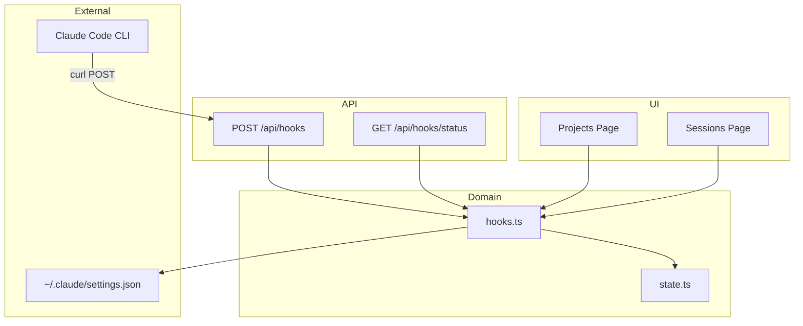
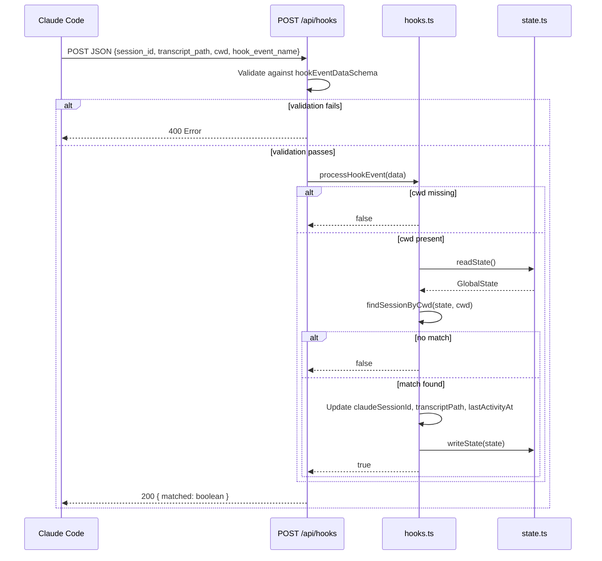
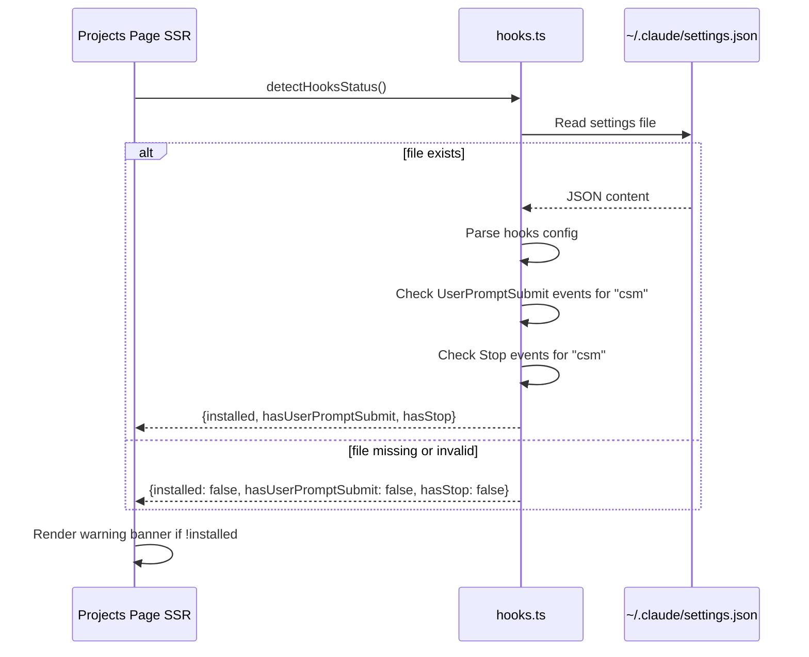

# Technical Design: Hook Integration

## Overview

**Purpose**: The Hook Integration feature connects CSM to Claude Code's lifecycle event system, receiving events via HTTP to update session metadata (Claude session ID and transcript path) and providing hook installation detection for the UI.

**Users**: Developers using CSM to manage Claude Code sessions. Hook events fire automatically during Claude Code operation; the UI displays hook installation status.

**Impact**: Hooks provide supplementary session metadata. Conversation messages are now stored directly in session state by the prompt execution feature (see `prompt-execution` spec, Requirement 8), so hooks are no longer the sole mechanism for conversation display. However, hooks remain valuable for capturing the `transcriptPath` (useful for advanced debugging with the JSONL transcript parser) and `claudeSessionId` (as a secondary source, since prompt execution also sets this from CLI JSON output).

### Goals

- Receive and process Claude Code hook events via HTTP API
- Match events to managed sessions by working directory
- Update supplementary session metadata (claudeSessionId, transcriptPath, lastActivityAt)
- Detect hook installation status from Claude Code settings
- Display hook warnings in the UI when not configured

### Non-Goals

- Configuring hooks automatically (manual setup required)
- Receiving events from non-Claude Code sources
- Modifying Claude Code behavior through hooks
- Streaming events via WebSocket or SSE

## Architecture

### Existing Architecture Analysis

The hook integration is fully implemented across three layers:

- **`src/lib/hooks.ts`** — Contains `processHookEvent()` for event processing, `detectHooksStatus()` for installation detection, and `findSessionByCwd()` for session matching
- **`src/app/api/hooks/route.ts`** — POST endpoint receiving hook events from Claude Code
- **`src/app/api/hooks/status/route.ts`** — GET endpoint for hook installation status
- **`src/app/projects/page.tsx`** and **`src/app/projects/[name]/page.tsx`** — UI pages displaying hook status warnings

Key patterns preserved:

- Event-driven architecture (hooks push data to CSM)
- Zod validation for external API input
- Atomic state persistence via state.ts
- Server-side status detection in page components

### Architecture Pattern & Boundary Map



### Technology Stack

| Layer      | Choice / Version          | Role in Feature                       | Notes                     |
| ---------- | ------------------------- | ------------------------------------- | ------------------------- |
| API        | Next.js 15 Route Handlers | HTTP endpoints for events and status  | POST + GET routes         |
| Validation | Zod v4                    | `hookEventDataSchema` for event data  | All fields optional       |
| Domain     | TypeScript module         | Event processing and status detection | `hooks.ts`                |
| State      | Filesystem JSON           | Session metadata persistence          | Atomic write via state.ts |
| Detection  | Filesystem                | Read `~/.claude/settings.json`        | Permissive parsing        |

## System Flows

### Hook Event Processing Flow



### Hook Detection Flow



## Requirements Traceability

| Requirement | Summary                              | Components        | Interfaces | Flows      |
| ----------- | ------------------------------------ | ----------------- | ---------- | ---------- |
| 1.1         | POST /api/hooks endpoint             | HookRoute         | HTTP       | Processing |
| 1.2         | Validate against hookEventDataSchema | HookRoute         | Zod        | Processing |
| 1.3         | Return matched boolean               | HookRoute         | HTTP       | Processing |
| 1.4         | 400 on validation failure            | HookRoute         | HTTP       | Processing |
| 2.1         | Match cwd to worktreePath            | processHookEvent  | —          | Processing |
| 2.2         | Return false if cwd missing          | processHookEvent  | —          | Processing |
| 2.3         | Return false if no session matches   | processHookEvent  | —          | Processing |
| 2.4         | Search across all projects           | findSessionByCwd  | —          | Processing |
| 3.1         | Update claudeSessionId               | processHookEvent  | —          | Processing |
| 3.2         | Update transcriptPath                | processHookEvent  | —          | Processing |
| 3.3         | Update lastActivityAt                | processHookEvent  | —          | Processing |
| 3.4         | Partial field updates                | processHookEvent  | —          | Processing |
| 3.5         | Atomic state persistence             | processHookEvent  | state.ts   | Processing |
| 4.1         | Read settings.json                   | detectHooksStatus | Filesystem | Detection  |
| 4.2         | Check both event types               | detectHooksStatus | —          | Detection  |
| 4.3         | Verify csm in command string         | detectHooksStatus | —          | Detection  |
| 4.4         | Return structured status             | detectHooksStatus | —          | Detection  |
| 4.5         | Graceful handling of missing file    | detectHooksStatus | —          | Detection  |
| 5.1         | GET /api/hooks/status endpoint       | StatusRoute       | HTTP       | Detection  |
| 5.2         | Return detection result as JSON      | StatusRoute       | HTTP       | Detection  |
| 6.1         | Warning banner on Projects page      | ProjectsPage      | React      | UI         |
| 6.2         | Warning banner on Sessions page      | SessionsPage      | React      | UI         |
| 6.3         | Active/missing status indicator      | ProjectsPage      | React      | UI         |

## Components and Interfaces

| Component             | Domain/Layer      | Intent                             | Req Coverage | Key Dependencies            | Contracts |
| --------------------- | ----------------- | ---------------------------------- | ------------ | --------------------------- | --------- |
| processHookEvent      | Domain / hooks.ts | Process hook event, update session | 2.1–3.5      | state.ts (P0)               | Service   |
| findSessionByCwd      | Domain / hooks.ts | Match cwd to session worktree path | 2.1, 2.4     | None                        | Helper    |
| detectHooksStatus     | Domain / hooks.ts | Detect hook installation status    | 4.1–4.5      | Filesystem (P0)             | Service   |
| POST /api/hooks       | API / route.ts    | Receive hook events via HTTP       | 1.1–1.4      | hooks.ts (P0), schemas (P1) | —         |
| GET /api/hooks/status | API / route.ts    | Query hook installation status     | 5.1–5.2      | hooks.ts (P0)               | —         |
| Projects Page         | UI / page.tsx     | Display hook warnings              | 6.1, 6.3     | hooks.ts (P0)               | —         |
| Sessions Page         | UI / page.tsx     | Display hook warnings              | 6.2          | hooks.ts (P0)               | —         |

### Domain Layer

#### processHookEvent

| Field        | Detail                                                  |
| ------------ | ------------------------------------------------------- |
| Intent       | Process incoming hook event and update matching session |
| Requirements | 2.1, 2.2, 2.3, 2.4, 3.1, 3.2, 3.3, 3.4, 3.5             |

##### Service Interface

```typescript
function processHookEvent(data: HookEventData): Promise<boolean>;
```

- Preconditions: `data` must conform to `HookEventData` type
- Postconditions: Returns true if session matched and updated, false otherwise
- Error handling: Returns false for missing cwd or unmatched sessions

#### detectHooksStatus

| Field        | Detail                                                  |
| ------------ | ------------------------------------------------------- |
| Intent       | Detect whether Claude Code hooks are configured for CSM |
| Requirements | 4.1, 4.2, 4.3, 4.4, 4.5                                 |

##### Service Interface

```typescript
function detectHooksStatus(): Promise<{
  installed: boolean;
  hasUserPromptSubmit: boolean;
  hasStop: boolean;
}>;
```

- Preconditions: None (handles missing settings file)
- Postconditions: Returns structured status; `installed` is true only if both events configured
- Error handling: Returns all-false on file read or parse failure

## Data Models

### Input Schema

**HookEventData** (validated input):

```typescript
const hookEventDataSchema = z.object({
  session_id: z.string().optional(),
  transcript_path: z.string().optional(),
  cwd: z.string().optional(),
  hook_event_name: z.string().optional(),
});
```

### Detection Result

```typescript
interface HookStatus {
  installed: boolean;
  hasUserPromptSubmit: boolean;
  hasStop: boolean;
}
```

## Error Handling

### Error Strategy

- **Validation boundary**: Zod `safeParse` at API route ensures only valid data reaches domain logic
- **Graceful non-matching**: Events from non-managed sessions return false, not errors
- **Settings file resilience**: Missing or unparsable `settings.json` returns all-false status
- **Atomic persistence**: State updates use write-to-temp-then-rename pattern

## Testing Strategy

### Unit Tests (existing — `hooks.test.ts`)

- Missing cwd returns false
- No matching session returns false
- Successful match updates claudeSessionId, transcriptPath, and lastActivityAt
- Partial updates (only some metadata fields provided)

### Coverage Assessment

Tests cover the core `processHookEvent` logic. `detectHooksStatus` is harder to unit test (depends on filesystem path). API route tests and UI rendering tests are lower priority given the existing patterns.
