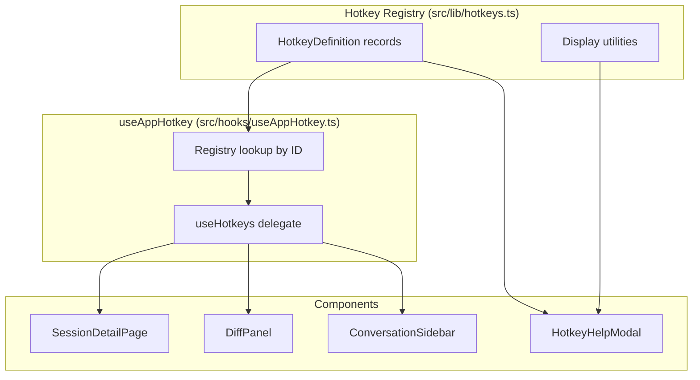
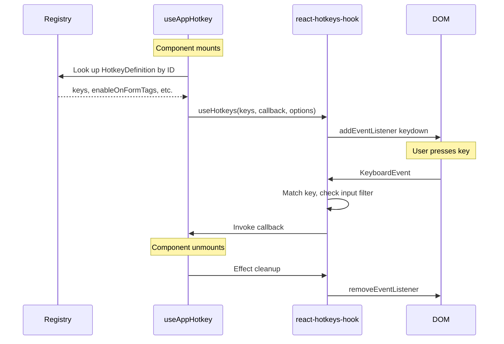
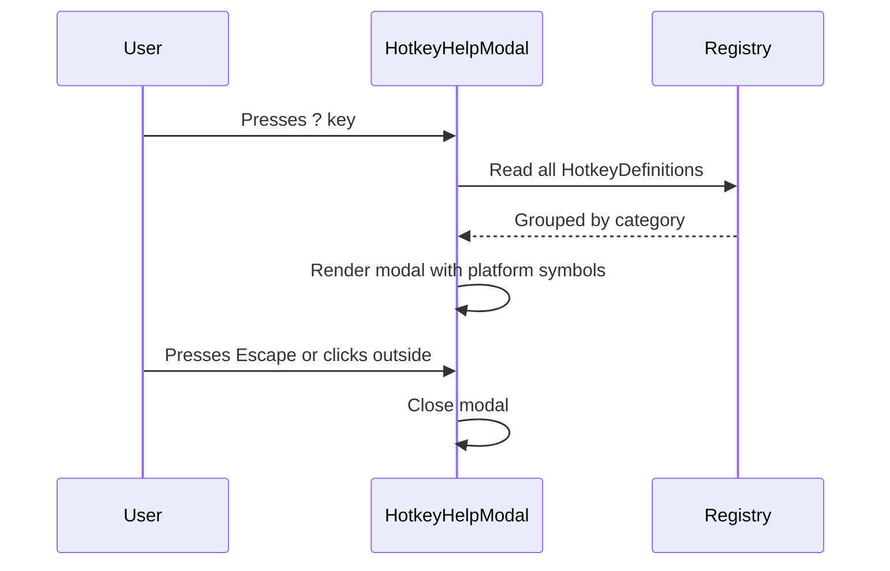

# Design Document: Hotkey Support

## Overview

**Purpose**: This feature delivers a centralized keyboard shortcut system to CSM users, enabling efficient navigation and action execution without mouse interaction.

**Users**: Developers using CSM to manage Claude Code sessions will use hotkeys for voice recording, conversation navigation, sidebar management, and diff review workflows.

**Impact**: Adds a new cross-cutting infrastructure layer (`src/lib/hotkeys.ts`, `src/hooks/useAppHotkey.ts`) and a help modal component. Modifies existing session detail, diff panel, and sidebar components to register hotkey bindings.

### Goals
- Establish a centralized, declarative hotkey registry as the single source of truth for all shortcuts
- Provide cross-platform key bindings (macOS + Linux) with platform-correct display symbols
- Wire initial hotkeys for voice toggle, message navigation, sidebar toggle, and diff navigation
- Build a discoverable help modal driven entirely by the registry

### Non-Goals
- User-configurable key bindings (future consideration — registry architecture supports it)
- Windows-specific testing or support
- Key sequences / vim-style chords (library supports them; not needed yet)
- Hotkey scope management via `HotkeysProvider` (simple `enabled` conditions suffice for initial scope)

## Architecture

### Existing Architecture Analysis

The CSM app is a Next.js App Router application. Keyboard handling is currently ad-hoc:
- `ConfirmDialog.tsx` — global `keydown` listener for Escape
- `CommandAutocomplete.tsx` — forwarded ref with `handleKeyDown` method for arrow/Enter/Tab/Escape
- `SessionDetailPage.tsx` — textarea `onKeyDown` for Enter/Escape
- `CommitDialog.tsx` — global `keydown` for Escape, textarea `onKeyDown` for Meta+Enter

No shared keyboard infrastructure exists. Each component manages its own listeners via `useEffect` + `addEventListener` or React `onKeyDown` props.

### Architecture Pattern & Boundary Map



**Architecture Integration**:
- **Selected pattern**: Centralized registry + per-component hook binding. The registry is a passive data structure; components consume it via a thin `useAppHotkey` hook.
- **Domain boundaries**: Registry owns key definitions and metadata. Components own action handlers. The hook bridges them.
- **Existing patterns preserved**: React hooks for side effects, `useCallback` for stable handlers, existing modal overlay pattern for help UI.
- **New components rationale**: Registry module (single source of truth), custom hook (consistent binding), help modal (discoverability).
- **Steering compliance**: TypeScript strict mode, Zod not needed (static config), kebab-case CSS, component colocation.

### Technology Stack

| Layer | Choice / Version | Role in Feature | Notes |
|-------|------------------|-----------------|-------|
| Frontend | react-hotkeys-hook ^5.2.4 | Key binding engine | `mod` for cross-platform, `enableOnFormTags` for input filtering |
| Frontend | React 19.2.4 (existing) | Component lifecycle, hooks | `useCallback`, `useEffect` |
| Frontend | Next.js 16.1.6 (existing) | App Router, layout wrapping | No server components involved — all hotkey code is client-only |

## System Flows

### Hotkey Binding Lifecycle



### Help Modal Flow



## Requirements Traceability

| Requirement | Summary | Components | Interfaces | Flows |
|-------------|---------|------------|------------|-------|
| 1.1 | Single declarative registry | HotkeyRegistry | `HOTKEY_REGISTRY` record | — |
| 1.2 | Entry fields: id, label, description, keys, category | HotkeyRegistry | `HotkeyDefinition` type | — |
| 1.3 | Auto-available at runtime and UI | useAppHotkey, HotkeyHelpModal | `useAppHotkey` hook | Binding lifecycle |
| 2.1 | Platform-adaptive modifier | HotkeyRegistry | `mod` key in definitions | — |
| 2.2 | No browser/OS conflicts | HotkeyRegistry | Key binding choices | — |
| 2.3 | Platform-correct display symbols | formatHotkeyDisplay | `formatHotkeyDisplay()` | Help modal |
| 3.1 | Suppress non-modifier in inputs | useAppHotkey | `enableOnFormTags` option | — |
| 3.2 | Allow modifier shortcuts in inputs | useAppHotkey | Per-entry `enableOnFormTags` | — |
| 3.3 | Normal processing outside inputs | useAppHotkey | Default react-hotkeys-hook behavior | — |
| 4.1 | Voice toggle hotkey | SessionDetailPage | `useAppHotkey("voiceToggle", ...)` | — |
| 4.2 | Ignore when unavailable | SessionDetailPage | `enabled` guard on `isAvailable` | — |
| 4.3 | Ignore when processing | SessionDetailPage | `enabled` guard on `isProcessing` | — |
| 5.1 | Next message | SessionDetailPage | `useAppHotkey("nextMessage", ...)` | — |
| 5.2 | Previous message | SessionDetailPage | `useAppHotkey("prevMessage", ...)` | — |
| 5.3 | First message | SessionDetailPage | `useAppHotkey("firstMessage", ...)` | — |
| 5.4 | Last message | SessionDetailPage | `useAppHotkey("lastMessage", ...)` | — |
| 5.5 | Boundary: no prev at first | SessionDetailPage | `enabled` guard on `currentMsgIndex > 0` | — |
| 5.6 | Boundary: no next at last | SessionDetailPage | `enabled` guard on index | — |
| 6.1 | Sidebar collapse | ConversationSidebar | `useAppHotkey("toggleSidebar", ...)` | — |
| 6.2 | Sidebar expand | ConversationSidebar | Same binding, toggle logic | — |
| 6.3 | Persist to localStorage | ConversationSidebar | Existing `toggleCollapsed` already persists | — |
| 7.1 | Next file in diff | DiffPanel | `useAppHotkey("nextFile", ...)` | — |
| 7.2 | Previous file in diff | DiffPanel | `useAppHotkey("prevFile", ...)` | — |
| 7.3 | Auto-expand collapsed file | DiffPanel | Existing `navigateFile` already handles | — |
| 8.1 | Next change | DiffPanel | `useAppHotkey("nextChange", ...)` | — |
| 8.2 | Previous change | DiffPanel | `useAppHotkey("prevChange", ...)` | — |
| 9.1 | Help modal on ? key | HotkeyHelpModal | `useAppHotkey("helpModal", ...)` | Help modal flow |
| 9.2 | Display label, keys, description | HotkeyHelpModal | `formatHotkeyDisplay()`, registry data | — |
| 9.3 | Close on Escape / click outside | HotkeyHelpModal | `onClose` handler, overlay click | — |
| 9.4 | Derive from registry | HotkeyHelpModal | Reads `HOTKEY_REGISTRY` directly | — |

## Components and Interfaces

| Component | Domain/Layer | Intent | Req Coverage | Key Dependencies | Contracts |
|-----------|-------------|--------|-------------|-----------------|-----------|
| HotkeyRegistry | Lib / Config | Single source of truth for all hotkey definitions | 1.1, 1.2, 1.3, 2.1, 2.2 | None | State |
| useAppHotkey | Hook / Infrastructure | Bind a registry-defined hotkey to a callback | 1.3, 3.1, 3.2, 3.3 | HotkeyRegistry (P0), react-hotkeys-hook (P0) | Service |
| formatHotkeyDisplay | Lib / Utility | Render key combo with platform-correct symbols | 2.3, 9.2 | None | Service |
| HotkeyHelpModal | UI / Shared Component | Display all hotkeys grouped by category | 9.1, 9.2, 9.3, 9.4 | HotkeyRegistry (P0), formatHotkeyDisplay (P0) | State |
| SessionDetailPage | UI / Page (modify) | Wire message nav + voice toggle hotkeys | 4.1–4.3, 5.1–5.6 | useAppHotkey (P0) | — |
| DiffPanel | UI / Feature Component (modify) | Wire diff file + change navigation hotkeys | 7.1–7.3, 8.1–8.2 | useAppHotkey (P0) | — |
| ConversationSidebar | UI / Feature Component (modify) | Wire sidebar toggle hotkey | 6.1–6.3 | useAppHotkey (P0) | — |

### Lib / Config

#### HotkeyRegistry

| Field | Detail |
|-------|--------|
| Intent | Centralized declarative registry of all hotkey definitions |
| Requirements | 1.1, 1.2, 1.3, 2.1, 2.2 |

**Responsibilities & Constraints**
- Owns all hotkey metadata: id, keys, label, description, category, input behavior
- Purely static data — no runtime state, no side effects
- Key strings use `mod` for cross-platform modifier (Req 2.1)
- Key choices avoid all known browser/OS conflicts (Req 2.2)

**Dependencies**
- None (zero dependencies — pure TypeScript module)

**Contracts**: State [x]

##### State Management

```typescript
type HotkeyCategory = "general" | "navigation" | "diff";

interface HotkeyDefinition {
  readonly id: string;
  readonly keys: string;
  readonly label: string;
  readonly description: string;
  readonly category: HotkeyCategory;
  readonly enableOnFormTags?: boolean;
}

type HotkeyId =
  | "helpModal"
  | "voiceToggle"
  | "nextMessage"
  | "prevMessage"
  | "firstMessage"
  | "lastMessage"
  | "toggleSidebar"
  | "nextFile"
  | "prevFile"
  | "nextChange"
  | "prevChange";

type HotkeyRegistry = Record<HotkeyId, HotkeyDefinition>;
```

**Default Key Bindings**:

| ID | Keys | Label | Category | enableOnFormTags |
|----|------|-------|----------|-----------------|
| `helpModal` | `shift+/` | Show keyboard shortcuts | general | false |
| `voiceToggle` | `alt+v` | Toggle voice recording | general | true |
| `toggleSidebar` | `b` | Toggle sidebar | general | false |
| `nextMessage` | `j` | Next message | navigation | false |
| `prevMessage` | `k` | Previous message | navigation | false |
| `firstMessage` | `Home` | First message | navigation | false |
| `lastMessage` | `End` | Last message | navigation | false |
| `nextFile` | `]` | Next file | diff | false |
| `prevFile` | `[` | Previous file | diff | false |
| `nextChange` | `n` | Next change | diff | false |
| `prevChange` | `shift+n` | Previous change | diff | false |

**Implementation Notes**
- `shift+/` produces `?` on US keyboards — the conventional help trigger
- `j`/`k` follows GitHub's navigation convention
- `b` follows GitHub's sidebar toggle convention
- `[`/`]` follows GitHub's file navigation convention
- `n`/`shift+n` follows vim's next/prev search result convention
- `alt+v` is a modifier shortcut that doesn't conflict with any known browser/OS binding
- `Home`/`End` are suppressed in inputs by default, so they won't interfere with text cursor movement

### Hook / Infrastructure

#### useAppHotkey

| Field | Detail |
|-------|--------|
| Intent | Thin wrapper binding a registry-defined hotkey to a callback via react-hotkeys-hook |
| Requirements | 1.3, 3.1, 3.2, 3.3 |

**Responsibilities & Constraints**
- Looks up `HotkeyDefinition` from registry by `HotkeyId`
- Delegates to `useHotkeys` from react-hotkeys-hook
- Applies `enableOnFormTags` from registry entry (Req 3.1, 3.2)
- Applies `preventDefault: true` by default
- Accepts optional `enabled` condition for conditional activation
- Future customization point for user-configurable keys

**Dependencies**
- Inbound: All components registering hotkeys (P0)
- External: react-hotkeys-hook `useHotkeys` (P0)
- Outbound: HotkeyRegistry (P0)

**Contracts**: Service [x]

##### Service Interface

```typescript
function useAppHotkey(
  id: HotkeyId,
  callback: (event: KeyboardEvent) => void,
  options?: {
    enabled?: boolean;
  }
): void;
```

- **Preconditions**: `id` exists in `HOTKEY_REGISTRY`
- **Postconditions**: Keyboard listener registered on document for the associated key combination; cleaned up on unmount
- **Invariants**: If `enabled` is false, the callback never fires. If the registry entry has `enableOnFormTags: true`, the hotkey fires inside form fields; otherwise it is suppressed.

### Lib / Utility

#### formatHotkeyDisplay

| Field | Detail |
|-------|--------|
| Intent | Convert a key combination string into a platform-correct display string |
| Requirements | 2.3, 9.2 |

**Responsibilities & Constraints**
- Detects macOS vs Linux/Windows via `navigator.platform` or `navigator.userAgentData`
- Maps `mod` → `⌘` on macOS, `Ctrl` on Linux
- Maps `alt` → `⌥` on macOS, `Alt` on Linux
- Maps `shift` → `⇧` on macOS, `Shift` on Linux
- Capitalizes key names for display (e.g., `j` → `J`, `Home` → `Home`)
- Client-side only (no SSR — called in components marked `"use client"`)

**Dependencies**
- None

**Contracts**: Service [x]

##### Service Interface

```typescript
function formatHotkeyDisplay(keys: string): string;

function isMacOS(): boolean;
```

- **Preconditions**: `keys` is a valid react-hotkeys-hook key combination string
- **Postconditions**: Returns human-readable string with platform-correct modifier symbols
- **Examples**:
  - `formatHotkeyDisplay("mod+s")` → `"⌘ S"` (macOS) or `"Ctrl S"` (Linux)
  - `formatHotkeyDisplay("alt+v")` → `"⌥ V"` (macOS) or `"Alt V"` (Linux)
  - `formatHotkeyDisplay("shift+/")` → `"?"` (special case for the help key)
  - `formatHotkeyDisplay("j")` → `"J"`
  - `formatHotkeyDisplay("shift+n")` → `"⇧ N"` (macOS) or `"Shift N"` (Linux)

### UI / Shared Component

#### HotkeyHelpModal

| Field | Detail |
|-------|--------|
| Intent | Modal displaying all registered hotkeys grouped by category |
| Requirements | 9.1, 9.2, 9.3, 9.4 |

**Responsibilities & Constraints**
- Reads all entries from `HOTKEY_REGISTRY` — no separate data source (Req 9.4)
- Groups entries by `category` with human-readable category headings
- Renders each entry with label, formatted key display (`formatHotkeyDisplay`), and description
- Closes on Escape keypress or click on overlay background (Req 9.3)
- Uses existing `modal-overlay` / `modal` CSS patterns from ConfirmDialog

**Dependencies**
- Inbound: SessionDetailPage or layout component renders it (P0)
- Outbound: HotkeyRegistry `HOTKEY_REGISTRY` (P0), `formatHotkeyDisplay` (P0)

**Contracts**: State [x]

##### State Management

```typescript
interface HotkeyHelpModalProps {
  open: boolean;
  onClose: () => void;
}
```

- **State model**: Stateless component — `open` and `onClose` controlled by parent
- **Persistence**: None
- **Rendering**: Groups `HOTKEY_REGISTRY` entries by `category`, renders as `<dl>` or table within modal

**Implementation Notes**
- Reuses `modal-overlay` and `modal` CSS classes from `ConfirmDialog`
- Category headings map: `general` → "General", `navigation` → "Navigation", `diff` → "Diff Review"
- Key display uses `<kbd>` elements with existing `.cmd-footer kbd` styling (extended to a shared `.kbd` class)
- The help modal's own open/close is managed by `useAppHotkey("helpModal", ...)` in the parent component

### UI / Feature Components (Modifications)

#### SessionDetailPage (modify)

| Field | Detail |
|-------|--------|
| Intent | Wire message navigation + voice toggle hotkeys |
| Requirements | 4.1–4.3, 5.1–5.6 |

**Implementation Notes**
- Add `useAppHotkey("nextMessage", handleNextMessage)`
- Add `useAppHotkey("prevMessage", handlePrevMessage)`
- Add `useAppHotkey("firstMessage", () => scrollToMessage(0))`
- Add `useAppHotkey("lastMessage", () => scrollToMessage(displayMessages.length - 1))`
- Voice toggle: The `useVoiceRecorder` hook is currently called inside `VoiceRecordButton`. To bind a hotkey, `toggleRecording` must be accessible from `SessionDetailPage`. Two approaches:
  1. **Lift the hook**: Call `useVoiceRecorder` in `SessionDetailPage`, pass its return values to `VoiceRecordButton` as props
  2. **Expose via ref**: Add `useImperativeHandle` to `VoiceRecordButton` to expose `toggleRecording`
  - **Selected**: Lift the hook — simpler, avoids ref indirection, keeps voice state accessible for the `enabled` guard
- Add `useAppHotkey("voiceToggle", toggleRecording, { enabled: isAvailable && !isProcessing })`
- Add `useAppHotkey("helpModal", () => setHelpOpen(true))` + render `<HotkeyHelpModal>`
- Note: `toggleSidebar` hotkey is registered in `ConversationSidebar` (which owns the collapsed state), not here

#### DiffPanel (modify)

| Field | Detail |
|-------|--------|
| Intent | Wire diff file and change navigation hotkeys |
| Requirements | 7.1–7.3, 8.1–8.2 |

**Implementation Notes**
- Add `useAppHotkey("nextFile", () => navigateFile(1))`
- Add `useAppHotkey("prevFile", () => navigateFile(-1))`
- Add `useAppHotkey("nextChange", () => navigateHunk(1))`
- Add `useAppHotkey("prevChange", () => navigateHunk(-1))`
- All four hotkeys use default input filtering (suppressed in form fields)
- No `enabled` guard needed — `navigateFile`/`navigateHunk` already handle empty state gracefully

#### ConversationSidebar (modify)

| Field | Detail |
|-------|--------|
| Intent | Wire sidebar toggle hotkey |
| Requirements | 6.1–6.3 |

**Implementation Notes**
- Add `useAppHotkey("toggleSidebar", toggleCollapsed)`
- `toggleCollapsed` already persists to localStorage (Req 6.3) — no additional work needed
- Default input filtering applies (suppressed when typing)

## Data Models

### Domain Model

No persistent data changes. The hotkey registry is a compile-time constant. The help modal `open` state is ephemeral component state.

### Key Type Definitions

All types defined in `src/lib/hotkeys.ts`:
- `HotkeyCategory` — string literal union
- `HotkeyDefinition` — readonly record shape
- `HotkeyId` — string literal union of all hotkey identifiers
- `HotkeyRegistry` — `Record<HotkeyId, HotkeyDefinition>`

No Zod schemas needed — this is static configuration, not external/untrusted input.

## Error Handling

### Error Strategy
Hotkey handling is best-effort — failures should never disrupt the application.

### Error Categories and Responses
- **Invalid hotkey ID**: TypeScript compile-time error via `HotkeyId` union type — cannot pass an unregistered ID to `useAppHotkey`
- **Browser blocks shortcut**: Some modifier combinations (e.g., `Ctrl+W`) cannot be intercepted — mitigated by choosing non-conflicting bindings
- **Voice unavailable**: `enabled` guard on `isAvailable` prevents callback invocation (Req 4.2)
- **Voice processing**: `enabled` guard on `isProcessing` prevents callback invocation (Req 4.3)
- **Component unmounted during keypress**: react-hotkeys-hook cleans up listeners via React effect lifecycle — no stale callback risk

### Monitoring
No monitoring infrastructure needed. Console warnings for development debugging only.

## Testing Strategy

### Unit Tests
1. `formatHotkeyDisplay` — verify platform-specific symbol mapping for all modifier combinations
2. `isMacOS` — verify detection logic
3. `HOTKEY_REGISTRY` — verify all entries have required fields, unique IDs, and valid key strings
4. Registry completeness — verify every `HotkeyId` has a corresponding registry entry

### Integration Tests
1. `useAppHotkey` — verify it calls `useHotkeys` with correct keys and options from registry
2. `useAppHotkey` with `enabled: false` — verify callback does not fire
3. `useAppHotkey` with `enableOnFormTags: true` — verify callback fires inside textarea
4. `HotkeyHelpModal` — verify it renders all registry entries grouped by category with correct display formatting

### E2E Tests
1. Press `j`/`k` on session detail page — verify message scroll position changes
2. Press `[`/`]` on diff panel — verify file scroll position changes
3. Press `shift+/` (`?`) — verify help modal opens; press Escape — verify it closes
4. Focus prompt textarea, press `j` — verify no navigation occurs (input filtering)
5. Focus prompt textarea, press `Alt+V` — verify voice recording toggles (enableOnFormTags)
