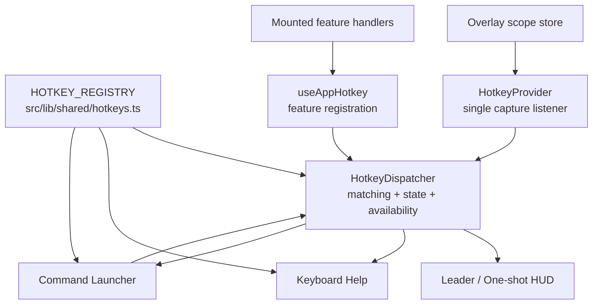

# Design Document: Hotkey Support

## Overview

The hotkey system is a centralized command-dispatch layer shared by every CC
route. A declarative catalog describes commands and keys; mounted features
register callbacks and contextual availability; one root provider interprets
document key events; and the same runtime state powers keyboard help and the
command launcher.

This design supersedes the initial per-component `react-hotkeys-hook` design.
The custom dispatcher is necessary for exact leader behavior, prompt-focused
one-shot activation, overlay precedence, contextual command reuse, and
fail-closed duplicate handling.

### Goals

- Make common CC workflows operable without reaching for the mouse.
- Keep one source of truth for IDs, keys, labels, descriptions, and categories.
- Use ergonomic single keys and mnemonic `G`, `C`, and `V` sequences.
- Preserve prompt editing while allowing one app command to be invoked from the
  focused prompt.
- Make contextual availability and launcher-only commands discoverable.
- Avoid browser, OS, and AeroSpace conflicts except for the explicitly retained
  readline bindings.
- Close session and project conversation tabs safely with `X`.

### Non-Goals

- User-configurable key remapping.
- An arbitrary-length or user-extensible chord grammar.
- App-level replacements for browser tab, window, address-bar, or page commands.
- New `Alt`-modified app commands.
- Changing the established readline prompt-editing shortcuts.

## Architecture



### Boundary Responsibilities

| Boundary | Responsibility |
|---|---|
| `src/lib/shared/hotkeys.ts` | Static command definitions, sequence parsing, category labels, platform display formatting, and prompt-editing reference entries |
| `src/lib/hotkeys/dispatcher.ts` | Runtime registration, availability resolution, direct/leader/one-shot matching, duplicate rejection, command invocation, and structured event logging |
| `src/components/hotkeys/HotkeyProvider.tsx` | One capture-phase keyboard listener, editable/prompt/overlay context derivation, lifecycle cancellation, and dispatcher React context |
| `src/hooks/useAppHotkey.ts` | Thin callback registration hook with current callback and availability |
| Feature components/hooks | Own action semantics and declare when each action is available |
| `GlobalHotkeyHelp`, `HotkeyHelpModal`, `CommandLauncher`, `HotkeyAwaitingHUD` | Discovery, keyboard command execution, and visible pending-state feedback |

The catalog intentionally does not contain callbacks. A catalog entry becomes
available only when exactly one mounted feature registers an eligible handler.
This keeps domain behavior with its owning feature while the dispatcher owns
all keyboard semantics.

## Command Model

```typescript
interface HotkeyDefinition {
  readonly id: HotkeyId;
  readonly keys: string | null;
  readonly label: string;
  readonly description: string;
  readonly category: HotkeyCategory;
  readonly allowInEditable?: boolean;
}
```

- A comma separates alternative bindings.
- `>` separates ordered strokes, for example `g>h`.
- `+` joins simultaneous modifiers and keys, for example `ctrl+shift+.`.
- `null` means launcher-only.
- `mod` is display/platform adaptive. Literal `ctrl` remains Control on macOS.
- Command availability is computed from mounted registrations, their `enabled`
  flag, their `isAvailable` predicate, and overlay state. A registration may
  explicitly remain active for its focused owning overlay, as the voice command
  does for prompt surfaces rendered inside dialogs.

## Authoritative Default Catalog

This table mirrors `HOTKEY_REGISTRY`. The TypeScript registry remains the
runtime authority if the catalog changes.

| ID | Binding | Command | Context |
|---|---|---|---|
| `helpModal` | `?` | Keyboard shortcuts | Global |
| `commandLauncher` | `.` | Command launcher | Global |
| `voiceToggle` | `Ctrl+Shift+.` | Toggle voice recording | Composer with available voice input; allowed in editables |
| `stopTurn` | `Ctrl+.` | Stop active turn | Active running turn; allowed in editables |
| `clearInput` | Launcher only | Clear prompt | Focused prompt |
| `toggleSidebar` | `B` | Toggle sidebar | Conversation sidebar |
| `toggleDevTools` | Launcher only | Toggle developer tools | Development environment |
| `focusContextSearch` | `/` | Search here | View with contextual search/filter |
| `focusComposer` | `I` | Focus prompt | Active conversation |
| `nextMessage` | `J` | Next message | Active transcript |
| `prevMessage` | `K` | Previous message | Active transcript |
| `firstMessage` | `G G` | First message | Active transcript |
| `lastMessage` | `Shift+G` | Last message | Active transcript |
| `nextFile` | `]` | Next changed file | Active diff |
| `prevFile` | `[` | Previous changed file | Active diff |
| `nextChange` | `N` | Next change | Active diff |
| `prevChange` | `Shift+N` | Previous change | Active diff |
| `newSession` | `C S` | New session | Current project |
| `newConversation` | `C C` | New conversation | Current session or project |
| `newWorkflow` | `C W` | New workflow | Workflow-capable context |
| `activateOpenTab` | `G 1` … `G 9` | Open conversation by position | Session or project working set |
| `closeConversationTab` | `X` | Close conversation tab | Active session or project conversation |
| `exitPanes` | Launcher only | Exit panes | Session panes layout |
| `expandThinkingBlocks` | `Shift+E` | Expand thinking blocks | Active transcript |
| `collapseThinkingBlocks` | `Shift+C` | Collapse thinking blocks | Active transcript |
| `goProjects` | `G H` | Go to projects | Global |
| `switchProject` | `G P` | Switch project | Global |
| `switchSession` | `G S` | Switch session | Project/session context |
| `goConversations` | `G C` | Go to conversations | Project/session context |
| `goTickets` | `G T` | Go to tickets | Project context |
| `goSpecs` | `G R` | Go to specs and review | Project context |
| `openNeedsYou` | `G A` | Open Needs You | Global |
| `nextConversation` | `G J` | Next conversation | Working set with a next tab |
| `prevConversation` | `G K` | Previous conversation | Working set with a previous tab |
| `quickTicket` | `C T` | Quick ticket | Ticket-capable context |
| `viewPrevious` | `V V` | Previous view | Session view history |
| `viewConversation` | `V C` | Conversation view | Session or project workspace |
| `viewDiff` | `V D` | Diff view | Session workspace |
| `viewDocuments` | `V O` | Documents view | Session workspace |
| `viewAlignment` | `V A` | Alignment view | Session workspace |
| `viewSpecs` | `V S` | Specs view | Session workspace |
| `viewArtifact` | `V R` | Artifact view | Session workspace |
| `viewPanes` | `V P` | Panes view | Session with at least two open conversations |
| `viewSessions` | `V S` | Sessions view | Project workspace |
| `viewBoard` | `V B` | Board view | Ticket workspace |
| `viewList` | `V L` | List view | Ticket workspace |

`V S` is intentionally contextual. Session and project registrations must
never both be eligible; if they are, duplicate resolution fails closed.

### Prompt-Native Reference

These bindings are preserved by the prompt editor and shown in the “All
commands” help view. They are not dispatcher registrations.

| Binding | Behavior |
|---|---|
| `Ctrl+;` | Arm one app shortcut while the prompt remains focused |
| `Mod+Enter` | Submit prompt |
| `Ctrl+A` / `Ctrl+E` | Move to line start / end |
| `Ctrl+U` / `Ctrl+K` | Delete to line start / end |
| `Ctrl+W` | Delete previous word |
| `Alt+B` / `Alt+F` | Move one word backward / forward |
| `Alt+D` | Delete next word |

## Dispatcher State Machine

```mermaid
stateDiagram-v2
    [*] --> Idle
    Idle --> Leader: available G/C/V prefix
    Leader --> Idle: exact command
    Leader --> Idle: invalid key / Escape / timeout
    Idle --> OneShotReleaseGuard: Ctrl+; in identified prompt
    OneShotReleaseGuard --> OneShot: Control and semicolon released
    OneShot --> OneShot: valid incomplete leader prefix
    OneShot --> Idle: exact command
    OneShot --> Idle: invalid key / Escape / repeated Ctrl+;
    Leader --> Idle: pointer / focus / overlay / route / blur / composition
    OneShotReleaseGuard --> Idle: pointer / focus / overlay / route / blur / composition
    OneShot --> Idle: pointer / focus / overlay / route / blur / composition
```



### Ordinary Dispatch

1. The provider derives `{ editable, overlayOpen, promptId }` from the event
   target and overlay store.
2. The dispatcher normalizes the physical event into a stroke and rejects
   repeats, composition/IME events, and AltGraph.
3. Overlay state suppresses background registrations before matching; only a
   registration explicitly owned by the focused overlay remains eligible.
4. In an editable, only definitions with `allowInEditable` participate.
5. Exactly one direct match executes immediately.
6. An available sequence prefix enters leader mode and is consumed.
7. Leader mode resets its 1-second timer after a valid incomplete prefix.
8. An invalid continuation cancels without consuming that continuation.
9. Multiple eligible registrations or multiple exact matches log ambiguity and
   execute nothing.

### Prompt One-Shot Dispatch

`Ctrl+;` is recognized only in an editable inside an element carrying
`data-cc-prompt-id`. Arming stores that prompt ID, consumes only the activation,
and displays the prompt-local HUD.

The release guard tracks Control and semicolon independently. Until both are
released, unrelated keydown events are ignored and left untouched. After
release, the dispatcher accepts one full direct or leader command with no
timeout. A valid prefix stays pending; an exact match executes and returns to
idle; an invalid key cancels and falls through to the editor. Repeating
`Ctrl+;` or pressing `Escape` consumes the cancellation stroke and returns to
idle.

The provider also cancels pending state on pointer down, focus moving away from
the originating prompt, composition start, window blur, overlay opening, route
change, or provider unmount. The editor is never blurred or rewritten by
activation, so its document, image attachments, caret, and selection remain
owned by the prompt.

## Discovery Surfaces

### Keyboard Help

`?` opens a Radix-backed dialog with two scopes:

- **Available here** lists commands with exactly one eligible registration.
- **All commands** lists the full registry, marks unavailable entries, includes
  launcher-only entries, and appends the prompt-native reference.

Entries render label, description, category, and structured keycaps generated
from the same sequence parser used by the catalog.

### Command Launcher

`.` opens a searchable combobox/listbox dialog. Only currently available
commands appear, excluding the launcher itself. Arrow keys move the active
option; `Enter` or pointer activation calls `dispatcher.invoke(id)`. Invocation
uses the last captured context and the same availability and duplicate checks
as keyboard execution.

Keyless commands are intentionally launcher-only:

- Clear prompt
- Toggle developer tools
- Exit panes

This removes low-frequency direct bindings while retaining keyboard access.

## Safe Close Design

### Shared Selection Rule

`closeTabSelection(orderedIds, closingId)` chooses the previous neighbor, then
the next neighbor, then `null`. Session and project implementations use this
rule so `X` and close buttons have consistent focus behavior.

### Session Workspace

`useTabPaneKeyboard` enables `X` only for an active working-set tab. It closes
that tab and exits panes when the last pane is removed. Closing the last tab
renders an explicit empty workspace rather than retaining a stale active ID.

### Project Workspace

Project drafts are stored by conversation ID, with a separate first-run draft
key. `X` and tab close controls share `requestClose`:

1. A non-empty text or image draft opens a discard confirmation.
2. A confirmed or clean close records the exact open-tab and active-tab
   snapshot, then updates the local store optimistically.
3. Success removes the closed conversation's draft.
4. Persistence failure restores the exact snapshot, retains the draft, shows a
   toast, and writes structured failure details.

Closing a tab does not stop work already running in that conversation.

## Conflict and Ergonomics Decisions

- `G`, `C`, and `V` group related operations and avoid dense modifier chords.
- `X` closes a CC conversation tab without intercepting browser `Mod+W`.
- Numbered tabs use `G 1` … `G 9`, avoiding browser `Mod+1` … `Mod+9`.
- Existing `Shift+E` and `Shift+C` thinking controls remain unchanged.
- Voice moved from `Alt+V` to `Ctrl+Shift+.`; stop uses `Ctrl+.`.
- Home/End message navigation was replaced by `G G`/`Shift+G`, preserving
  native caret and page movement.
- Clear prompt, developer tools, and exit panes no longer consume direct keys.
- No app command adds an `Alt` binding.
- Prompt-focused readline editing is the explicit conflict-policy exception:
  literal `Ctrl+A/E/U/K/W` and `Alt+B/F/D` remain cross-platform even where
  Windows/Linux browsers assign actions such as close tab, address/search,
  view source, or browser menu. Those browser actions are shadowed only while
  the prompt editor handles the applicable key.
- `/` intentionally shadows Firefox Quick Find outside editables and overlays;
  browser-native `Mod+F` remains unclaimed.
- AeroSpace was reviewed. Its `Alt+F` overlap is accepted because the user
  chose to preserve the prompt-native readline bindings and adjust AeroSpace.

## Structured Logging

The dispatcher logs state transitions and invocations through the client
logging system:

- successful command invocation and source (`keyboard` or `launcher`);
- command execution failure;
- leader timeout;
- pending-state cancellation reason;
- ambiguous command registrations.

Domain features add structured logs where the shortcut triggers material
state, notably project conversation close start, success, and rollback.
Conversation content and draft text are never logged.

## Testing Strategy

- **Catalog tests:** required fields, complete ID coverage, parsing, display
  formatting, no unintended `Alt` app bindings, and prompt-native reference.
- **Dispatcher tests:** direct commands, leaders, timeout, editable filtering,
  one-shot release guard and cancellation, fallthrough, overlays, contextual
  availability, duplicate failure, IME/AltGraph, and launcher invocation.
- **Hook/provider/editor tests:** registration lifecycle, prompt identity,
  focus/draft preservation, and HUD behavior.
- **Feature tests:** navigation, contextual creation/views, thinking expansion,
  diff review, stop/voice, and session/project close behavior.
- **Project close tests:** conversation-scoped drafts, confirmation, neighbor
  choice, last-tab state, success cleanup, and exact rollback on failure.
- **UI tests/stories:** help scopes, prompt reference, launcher keyboard/pointer
  operation, empty results, and both HUD variants.

## Requirements Traceability

| Requirement | Primary implementation |
|---|---|
| 1 | `shared/hotkeys.ts`, help modal, keycap renderer |
| 2 | dispatcher, provider, `useAppHotkey` |
| 3 | dispatcher, provider, prompt editor, awaiting HUD |
| 4 | prompt terminal extension, voice/stop registrations |
| 5 | global help, help modal, command launcher |
| 6 | topbar, transcript navigation, ordered-tab navigation, diff viewers, thinking hook |
| 7 | project/session/ticket/workflow feature registrations |
| 8 | shared close selection, session tab hook, project cockpit draft/store flow |
| 9 | catalog policy and conflict tests |
