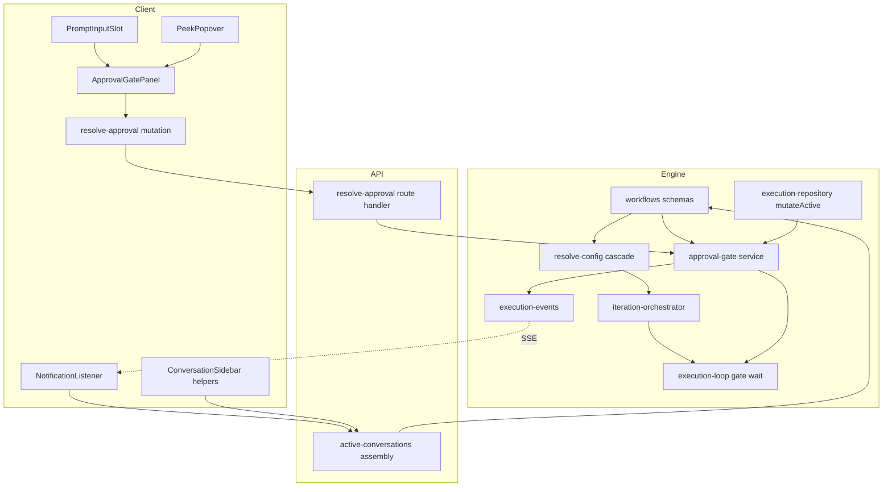
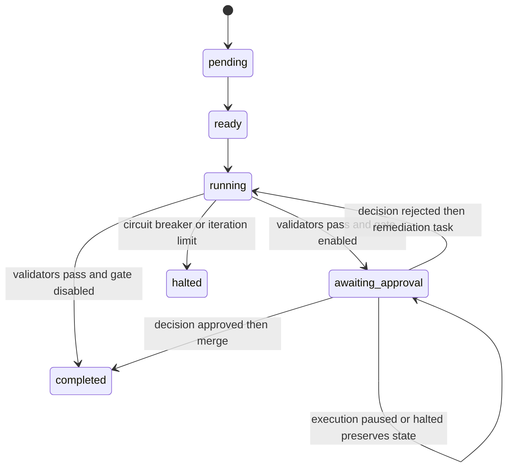

# Technical Design — human-review-gate

## Overview

**Purpose**: This feature delivers a per-context human checkpoint in graph workflow executions. A gated execution context, after its script and agent validators pass, parks in an `awaiting_approval` state until the operator approves (the context completes and dependents unblock) or rejects with a mandatory message (the implementer re-attempts through the standard validation loop).

**Users**: Workflow operators reviewing autonomous work before it propagates downstream. Pending reviews surface at the top of the sidebar's Needs Input section with a dedicated Approve/Reject panel in the conversation view and peek popover.

**Impact**: Extends the existing graph workflow engine — config cascade, context lifecycle, execution loop, SSE events, active-conversations API, and sidebar — without forking any orchestration primitive. Adds one context status value, one persisted record, one HTTP endpoint, two SSE event types, one push-notification trigger, and one shared UI panel.

### Goals
- Gate a context on human approval only after all enabled automated validators pass.
- Keep independent parallel contexts executing while a gate is pending; block only dependents.
- Route rejection feedback into the existing iteration loop with correct accounting (consumes an iteration; never trips the circuit breaker).
- Surface pending gates prominently (Needs Input, sorted first) with live updates and standard notifications.
- Survive server restarts with no loss of gate state.

### Non-Goals
- Approval delegation, multi-approver flows, reviewer roles.
- Approval timeouts or auto-approve deadlines.
- Task-level gates (context level only).
- Generated review artifacts (diff summaries/reports) beyond what existing views show.
- Changes to collaboration-execution machinery (it is a pattern source only).

## Boundary Commitments

### This Spec Owns
- The `humanApprovalGate` config schema and its resolution in the workflow config cascade.
- The `awaiting_approval` context status value, the persisted `pendingApproval` record on context state, and all transitions into/out of them.
- The gate-wait stage in the execution loop and decision application (approve → merge/complete; reject → remediation task + re-iterate).
- The `resolve-approval` HTTP contract and its guard semantics (first decision wins, 409 on stale).
- The `graph-workflow-approval-pending` / `graph-workflow-approval-resolved` SSE event contracts and the approval-pending push-notification dispatch (`GraphWorkflowPushInfo` variant).
- The `pendingApproval` field on active-conversation payloads, its derivation, and the gated-row inclusion override in the active-conversations assembly (a conversation with an undecided pending gate is included even though its role is `iteration` and regardless of `ACTIVE_STATUSES` membership).
- The decision-application quiescence rule: the loop applies a decision only while holding the conversation's single-flight lock, so merge and remediation seeding never overlap an in-flight chat turn.
- Suspended-execution decision semantics: decisions are recordable while the execution is `running`, `paused`, or `halted`; application always happens in the loop — immediately when running, on the first wait refresh after resume otherwise.
- The approval-merges-as-is stance: chat turns while the gate is pending may modify the worktree, and approving merges the worktree's current state without re-running validators. Reviewing post-chat state before approving is the operator's responsibility; the validator re-run guarantee (5.3) applies only to the rejection path.
- The `ApprovalGatePanel` UI component, the Needs-Input `approvals` bucket and its top-sort, and the gated exception to the workflow-managed read-only conversation rule (open only while `pendingApproval.decision === null`).

### Out of Boundary
- Validator execution itself (script/agent validators run unchanged before the gate).
- Merge/commit mechanics (`runLaneCommit`/`runFanInMerge` are invoked, not modified).
- Iteration prompt construction beyond what the remediation task already carries.
- The AskUserQuestion answer path and `pendingQuestions` plumbing (deliberately not reused).
- Conversation status semantics (`conversation.status` is never written by gate code).
- Execution resume semantics: resuming stays an explicit operator action; the gate never auto-resumes a paused or halted execution. Restart durability is met by recording decisions while suspended (`paused`/`halted`), not by changing the restart lifecycle.

### Allowed Dependencies
- `src/lib/workflows/schemas.ts` (schema home), `src/lib/config/schemas.ts` (defaults).
- `src/lib/workflow-graph/*`: resolve-config, iteration-orchestrator, execution-loop, execution-events, execution-repository (`mutateActive`), execution-route-handlers.
- State store write queue via `mutateActive` only; no direct repo access from routes.
- `src/lib/prompt/single-flight.ts`: `isConversationBusy` / `acquireConversationLock`, injected into the gate-wait deps for decision application.
- Existing client plumbing: `conversationKeys`/`sessionKeys`, SSE listener in `NotificationListener`, fetch mutation pattern from `src/lib/conversations/mutations.ts`.
- `src/lib/push-notification/dispatcher.ts`: `GraphWorkflowPushInfo` / `pushForGraphWorkflowEvent`, reached through the `dispatchPush` dep already injected into `execution-events`.
- Dependency direction: **schemas → config/resolve-config → engine services (approval-gate) → execution loop / route handlers → client queries+mutations → UI components**. No upward imports.

### Revalidation Triggers
- Changing the `pendingApproval` record shape or `awaiting_approval` semantics (downstream: UI, contract tests, main-branch read boundary).
- Changing the resolve-approval request/response contract.
- Changing eligibility (`getEligibleContextIds`) or landed/completion checks that the gate relies on to block dependents.
- Any new consumer assuming Needs-Input membership implies `status === "waiting_for_input"`.
- Changing the active-conversations role filter, `ACTIVE_STATUSES`, or the gated-row inclusion override (downstream: Requirement 3 surfacing).
- Changing single-flight lock semantics (`acquireConversationLock`/`isConversationBusy`) that decision application relies on.

## Architecture

### Existing Architecture Analysis
- Contexts run as independent async tasks; the outer loop schedules eligible contexts each time any in-flight promise settles (`execution-loop.ts:1222-1344`).
- A context parks today only for collaborations: a persisted record + injected poll-wait + state refresh (`execution-loop.ts:182-269`). The gate replicates this shape.
- Validation orchestration completes a context by setting `status = "completed"` in `finalizeIterationResult` (`iteration-orchestrator.ts:1227`); merge happens after the inner loop breaks (`execution-loop.ts:793-815`). The gate inserts between these two points.
- Config resolution cascades per-context → workflow → global (`resolve-config.ts`); `scriptValidator` (`{ enabled }`) is the shape template.
- Active-conversations assembly excludes `role === "iteration" || role === "validator"` rows (`active-conversations/route-handlers.ts:390-391`, `451-452`) and admits only `ACTIVE_STATUSES` (`new`/`running`/`awaiting`/`waiting_for_input`, `route-handlers.ts:181-186`). Implementer conversations are created with `role: "iteration"` (`iteration-orchestrator.ts:154`), so gated rows need an explicit inclusion override. `ACTIVE_STATUSES` currently spans every `ConversationStatus` value and a parked conversation idles at `awaiting`, but the override must not depend on that coincidence.
- `normalizeExecutionAfterRestart` (`workflow-manager.ts:615-722`) parks executions at `paused` after a restart; the loop re-enters only via the explicit resume route. Restart durability (7.1) therefore requires decisions to be recordable while paused.
- User chat and iteration turns share the per-conversation single-flight lock (`single-flight.ts`: `acquireConversationLock` throws when busy, `isConversationBusy` probes). Decision application must serialize against in-flight turns through the same primitive.
- Constraint preserved: route handlers stay thin and DI-driven (`GraphWorkflowExecutionRouteDeps`); all state mutation goes through the serialized write queue.

### Architecture Pattern & Boundary Map



**Architecture Integration**:
- Selected pattern: sibling gate config + dedicated waiting state + decision-record handoff (endpoint records, loop applies). Rationale and rejected alternatives in `research.md`.
- Existing patterns preserved: config cascade, collaboration-style park/wait, inline remediation task, write-queue atomicity, thin DI route handlers, SSE → query invalidation.
- New components rationale: `approval-gate.ts` isolates gate state transitions so the loop and route handler share one tested implementation; `ApprovalGatePanel` is shared by two render sites (precedent: `AskQuestionPanel`).
- Steering compliance: composable primitives (no parallel orchestrator), agent-offloading (orchestrator owns transitions), Zod-first schemas, DI for testability.

### Technology Stack

| Layer | Choice / Version | Role in Feature | Notes |
|-------|------------------|-----------------|-------|
| Backend | Next.js 16 route handlers + existing workflow-graph engine | Gate state machine, resolve-approval endpoint | No new dependencies |
| Data | SQLite via state-store write queue | `pendingApproval` persisted inside `session.graphWorkflowExecution` | Additive fields, `.nullable().default(null)` |
| Messaging | Existing SSE broadcast (`/api/events`) | Two new `graph-workflow-approval-*` event types | Same publisher/history mechanism |
| Frontend | React 19 + TanStack Query | ApprovalGatePanel, sidebar bucket, mutation + invalidation | Follows `useAnswerQuestionMutation` pattern |

## File Structure Plan

### New Files
```
src/lib/workflow-graph/approval-gate.ts            # Gate service: draft-level transition helpers (enterAwaitingApproval, applyDecision, buildRejectionRemediationTask), recordDecision (atomic guards), waitForApprovalResolution
src/lib/workflow-graph/approval-gate.test.ts       # Unit tests: transitions, first-decision-wins, remediation task build, accounting invariants
src/app/api/projects/[name]/sessions/[session]/graph-workflow/resolve-approval/route.ts  # Thin re-export of POST handler
src/components/ApprovalGatePanel.tsx               # Shared Approve/Reject panel (reject expands required textarea)
src/components/ApprovalGatePanel.test.tsx          # Panel behavior: reject disabled until message, busy states
src/features/_root/styles/approval-gate.css        # Panel styles (chained via styles/index.css; consumed by prompt slot + peek)
```

### Modified Files
- `src/lib/workflows/schemas.ts` — add `awaiting_approval` to context status enum; `graphWorkflowHumanApprovalGateConfigSchema`; `graphWorkflowPendingApprovalSchema` (+ decision union) on context state; two SSE event schemas added to the event union; context definition + workflow override gain `humanApprovalGate`.
- `src/lib/config/schemas.ts` — `workflowDefaultsSchema` gains `humanApprovalGate`.
- `src/lib/workflow-graph/resolve-config.ts` — seeded default `{ enabled: false }`; cascade `context ?? workflow ?? defaults`.
- `src/lib/workflow-graph/planner-tools.ts` — expose per-context `humanApprovalGate` in create/replace input schemas.
- `src/lib/workflow-graph/iteration-orchestrator.ts` — `finalizeIterationResult` routes to `awaiting_approval` + pending record (draft-level `enterAwaitingApproval` inside its existing mutation) when gate enabled and validators passed; publishes approval-pending after the mutation commits.
- `src/lib/workflow-graph/execution-loop.ts` — inner-loop exit condition extended so a context finalized to `awaiting_approval` breaks the iteration loop the same way `completed` does (no extra iteration is seeded on park); gate-wait stage between inner-loop break and merge phase; rejected decision re-enters the inner loop; resume path re-enters `awaiting_approval` contexts directly into the wait (applying a decision recorded while paused); the outer loop's scheduling and completion checks treat `awaiting_approval` contexts as incomplete-and-schedulable, so an execution whose only remaining context is parked stays in-flight instead of completing or exiting; wait exits without resolving on paused/halted/aborted; decision application poll-acquires the conversation single-flight lock and holds it across merge or remediation seeding.
- `src/lib/workflow-graph/execution-events.ts` — `publishApprovalPending` / `publishApprovalResolved` publisher methods (history + broadcast); the push-mapping step (`dispatchPushNotifications`) emits an approval-pending `GraphWorkflowPushInfo` through the existing injected `dispatchPush` dep so a phone push fires alongside the SSE broadcast (3.3 channel parity).
- `src/lib/push-notification/dispatcher.ts` — `GraphWorkflowPushInfo` gains an `approval-pending` variant; `pushForGraphWorkflowEvent` sends it with the `waiting-for-input` trigger (same channel as `waiting_for_input` conversation pushes); the switch's `assertNever` exhaustiveness forces the new case.
- `src/lib/workflow-graph/execution-route-handlers.ts` — `resolveApproval` handler + `GraphWorkflowExecutionRouteDeps` extension.
- `src/lib/workflow-graph/mutations.ts` (or the existing client mutations module for pause/resume — match its location) — `useResolveApprovalMutation`.
- `src/lib/active-conversations/schemas.ts` — `pendingApproval` field on active conversation schema.
- `src/lib/active-conversations/route-handlers.ts` — build a per-session pending-approval candidate map from `session.graphWorkflowExecution` before row filtering; conversations with an undecided candidate entry bypass the `iteration`/`validator` role filter and the `ACTIVE_STATUSES` filter; derive `pendingApproval` on the included rows.
- `src/features/session/sidebar/ConversationSidebar.helpers.ts` — `splitNeedsYou` gains `approvals` bucket; `pinnedSections` renders approval tone first; rows with `pendingApproval` expose no archive/dismiss affordance while the gate is pending.
- `src/features/session/prompt/PromptInputSlot.tsx` — render `ApprovalGatePanel` above the composer when gated; bypass `IterationReadonlyBanner` while the gate is pending and undecided (chat allowed); panel actions disabled while the conversation has a turn in flight.
- `src/features/session/sidebar/PeekPopover.tsx` — render `ApprovalGatePanel` above the peek reply composer when gated.
- `src/components/NotificationListener.tsx` — listeners for both approval events: toast + browser notification on pending; query invalidation (`conversationKeys.active()`, session detail) on both.
- `src/features/session-workflow/components/ExecutionStatusBar.tsx`, `ExecutionInspectorPanel.tsx` — status label/badge entries for `awaiting_approval`.
- `src/lib/state-store/sessions-repo.contract.test.ts` — maximal fixture gains an `awaiting_approval` context with `pendingApproval` record (durability backstop).
- Conversation view container that builds `PromptInputSlot` props (e.g. `ConversationPanel` and its props hook) — derive gate standing from session detail (`graphWorkflowExecution`) and thread `pendingApprovalGate`, `conversationBusy` (conversation status `running`), `executionSuspended` (execution `paused` or `halted`), and mutation callbacks.
- Server prompt guard for workflow-managed conversations (located in the prompt route path) — except contexts in `awaiting_approval` with `pendingApproval.decision === null` so chat is accepted (6.1); once a decision is recorded the conversation is read-only again.

## System Flows

### Context lifecycle with gate



### Approve / Reject sequence

```mermaid
sequenceDiagram
    participant Loop as ExecutionLoop
    participant Store as ExecutionRepository
    participant API as ResolveApprovalRoute
    participant UI as ApprovalGatePanel
    Loop->>Store: set status awaiting_approval plus pendingApproval record
    Loop->>UI: SSE approval-pending then sidebar and panel render
    Loop->>Loop: waitForApprovalResolution poll
    UI->>API: POST resolve-approval decision
    API->>Store: mutateActive guard and record decision
    API-->>UI: 200 or 409
    Loop->>Store: observe decision
    Loop->>Loop: poll-acquire conversation lock (worktree quiescent)
    alt approved
        Loop->>Store: clear record set completed
        Loop->>Loop: run lane commit or fan-in merge
    else rejected
        Loop->>Store: clear record append remediation task set running
        Loop->>Loop: seed next iteration with feedback task
    end
    Loop->>Loop: release conversation lock
    Loop->>UI: SSE approval-resolved then panel dismissed
```

Flow decisions: the wait poll reuses the collaboration-wait interval (injected, ~1s default); guard checks and decision recording happen inside one `mutateActive` mutation (atomic via write queue); the loop — never the route — performs merge, task append, and status transitions. Decisions are recordable while the execution is `running`, `paused` (the post-restart state), or `halted`; application happens in the loop immediately when running, or on the wait's first refresh after resume otherwise. Before applying, the loop poll-acquires the conversation's single-flight lock so merge and remediation seeding run against a quiescent worktree — chat attempts during application get the prompt path's standard busy rejection, and the prompt-guard exception closes the moment a decision is recorded, so no new chat turn can start once the operator has decided. Approval merges the worktree as-is: chat turns completed before the decision may have modified it, and no validator re-runs on the approval path — reviewing post-chat state is the operator's responsibility.

## Requirements Traceability

| Requirement | Summary | Components | Interfaces / Flows |
|-------------|---------|------------|--------------------|
| 1.1 | Per-context gate enable/disable | Schemas, PlannerTools | `humanApprovalGate` on context definition |
| 1.2 | Workflow-level default | Schemas, ResolveConfig | `workflowConfigOverrideSchema.humanApprovalGate` |
| 1.3 | Disabled by default | ResolveConfig | Seeded default `{ enabled: false }` |
| 1.4 | Settings persist with definition | Schemas, workflow storage (existing) | Definition schema round-trip |
| 1.5 | Disabled gate → no pause | IterationFinalization | Status routes to `completed` |
| 2.1 | Park after validators pass | IterationFinalization, ApprovalGateService | `enterAwaitingApproval` |
| 2.2 | Validator failure → standard flow | IterationFinalization | Gate evaluated only on pass |
| 2.3 | Dependents blocked | Existing eligibility (unchanged) | `awaiting_approval` ≠ `completed` |
| 2.4 | Independent contexts continue | ExecutionLoop | Promise-per-context; wait inside runner |
| 2.5 | Execution not completed while pending | ExecutionLoop | Runner stays in-flight; completion check counts `awaiting_approval` as incomplete |
| 2.6 | Gate-pending event recorded | EventPublisher | `publishApprovalPending` (history + SSE) |
| 3.1 | Conversation in Needs Input | ActiveConversationsAssembly | Candidate map + role/status inclusion override + `pendingApproval` derivation |
| 3.2 | Sorted above other entries | SidebarSectioning | `approvals` bucket pinned first |
| 3.3 | Standard notification channels | NotificationListener, EventPublisher + push dispatcher | Toast + browser notification (client); phone push via `pushForGraphWorkflowEvent` `approval-pending` with `waiting-for-input` trigger (server) |
| 3.4 | Live list updates | NotificationListener | SSE → `conversationKeys.active()` invalidation |
| 3.5 | Panel in conversation + peek | ApprovalGatePanel, PromptInputSlot, PeekPopover | Shared component |
| 4.1 | Approve → complete incl. merge | ApprovalGateService, ExecutionLoop | Approved decision → lock-held merge phase |
| 4.2 | Dependents eligible after approval | Existing eligibility (unchanged) | `completed` status |
| 4.3 | Panel dismissed on approval | NotificationListener, ActiveConversationsAssembly | Derived field clears on recording (`decision !== null`); approval-resolved → invalidation |
| 4.4 | Approval recorded | EventPublisher | `publishApprovalResolved` |
| 5.1 | Non-empty message required | ApprovalGatePanel (client), ResolveApprovalRoute (Zod) | `message: min(1)` on reject variant |
| 5.2 | Rejection returns context to implementation with feedback | ApprovalGateService | Remediation task carries message |
| 5.3 | Validators re-run before gate re-triggers | Existing validation orchestration (unchanged) | Completion re-validates |
| 5.4 | Rejection consumes an iteration | Existing iteration seeding (unchanged) | `iterationCount += 1` on next iteration |
| 5.5 | No circuit-breaker count | ApprovalGateService | Rejection path never touches `consecutiveFailureCount` |
| 5.6 | Iteration limit still halts | Existing iteration policy (unchanged) | — |
| 5.7 | Rejection + message recorded | EventPublisher | `publishApprovalResolved` with message |
| 6.1 | Chat allowed while gated | PromptInputSlot, server prompt guard exception | Readonly-banner bypass while undecided; guard exception requires `decision === null` |
| 6.2 | Chat doesn't resolve gate | ApprovalGateService | Gate state independent of conversation activity |
| 6.3 | Standing survives chat | ActiveConversationsAssembly | Derived from execution state, not `conversation.status` |
| 7.1 | Restart durability | Schemas (persisted record), ApprovalGateService, ExecutionLoop re-entry | Persisted record + suspended-state (`paused`/`halted`) recording; resume re-enters wait and applies recorded decision |
| 7.2 | Stale submission rejected | ResolveApprovalRoute | 409 with explanation; UI refreshes on error |
| 7.3 | First decision wins | ApprovalGateService | Atomic check-and-set in `mutateActive` |
| 7.4 | Abort dismisses gate | ExecutionLoop | Wait observes aborted; derived standing disappears with inactive execution |
| 7.5 | Pause/halt preserves gate | ExecutionLoop | Wait exits unresolved; state persists; resume re-enters |

## Components and Interfaces

| Component | Domain/Layer | Intent | Req Coverage | Key Dependencies | Contracts |
|-----------|--------------|--------|--------------|------------------|-----------|
| GateConfig schemas | Schemas | Config + state + event shapes | 1.1-1.4, 7.1 | — | State |
| ResolveConfig cascade | Config | Resolve effective gate setting | 1.2, 1.3, 1.5 | Schemas (P0) | Service |
| ApprovalGateService | Engine | Gate transitions + decision guards | 2.1, 4.1, 5.2, 5.5, 6.2, 7.1, 7.3 | ExecutionRepository (P0) | Service, State |
| IterationFinalization change | Engine | Route pass+gate → awaiting_approval | 1.5, 2.1, 2.2 | ResolveConfig (P0), ApprovalGateService (P0), EventPublisher (P0) | Service |
| ExecutionLoop gate wait | Engine | Park, poll, apply decision under conversation lock, re-enter on resume | 2.4, 2.5, 4.1, 6.1, 7.1, 7.4, 7.5 | ApprovalGateService (P0), single-flight lock (P0) | Service |
| EventPublisher additions | Engine | approval-pending / approval-resolved; push dispatch on pending | 2.6, 4.4, 5.7, 3.3, 3.4 | execution-events (P0), push dispatcher (P0) | Event |
| ResolveApprovalRoute | API | Validate + record decision | 5.1, 7.2, 7.3 | ApprovalGateService (P0) | API |
| ActiveConversationsAssembly | API | Include gated rows past role/status filters; derive `pendingApproval` | 3.1, 4.3, 6.3 | Schemas (P0) | API |
| useResolveApprovalMutation | Client lib | POST + invalidations | 3.4, 4.3 | fetcher, query-keys (P0) | Service |
| SidebarSectioning | UI | `approvals` bucket pinned first | 3.2 | ActiveConversationsAssembly (P0) | — |
| ApprovalGatePanel | UI | Approve / reject-with-message panel | 3.5, 5.1 | useResolveApprovalMutation (P0) | — |
| PromptInputSlot / PeekPopover changes | UI | Render panel alongside composer; allow chat | 3.5, 6.1 | ApprovalGatePanel (P0) | — |
| NotificationListener additions | UI | Toasts, notifications, invalidation | 3.3, 3.4 | SSE schemas (P0) | Event |
| Workflow status UI labels | UI | `awaiting_approval` badge/labels | 2.6 (visibility) | Schemas (P2) | — |

### Engine

#### ApprovalGateService (`src/lib/workflow-graph/approval-gate.ts`)

| Field | Detail |
|-------|--------|
| Intent | Single tested implementation of all gate state transitions, shared by the loop and the route handler |
| Requirements | 2.1, 4.1, 5.2, 5.5, 6.2, 7.1, 7.3 |

**Responsibilities & Constraints**
- Owns transitions into/out of `awaiting_approval` and the `pendingApproval` record lifecycle.
- All mutations go through `mutateActive` (write-queue atomicity); never mutates conversations.
- Factory pattern `createApprovalGateService(deps)` per DI steering; deps interface uses method syntax.

##### Service Interface
```typescript
interface ApprovalGateServiceDeps {
  mutateActive(
    projectPath: string,
    sessionName: string,
    label: string,
    mutate: (execution: GraphWorkflowExecution) => void,
  ): Promise<GraphWorkflowExecution>;
  now(): string; // ISO timestamp
}

interface ApprovalGateService {
  // Draft-level: mutates the execution inside the caller's active mutateActive
  // callback so status + record land in the same mutation as the caller's other
  // writes. The caller publishes approval-pending after its mutation commits.
  enterAwaitingApproval(
    execution: GraphWorkflowExecution,
    input: { contextId: string; conversationId: string },
  ): void;

  recordDecision(input: {
    projectPath: string; sessionName: string; contextId: string;
    decision: { type: "approved" } | { type: "rejected"; message: string };
  }): Promise<
    | { ok: true; execution: GraphWorkflowExecution }
    | { ok: false; reason: "no_active_execution" | "not_awaiting_approval" | "already_decided" | "execution_not_running" }
  >;

  applyApprovedDecision(execution: GraphWorkflowExecution, contextId: string): void;   // clear record (status completed set by loop finalization path)
  applyRejectedDecision(execution: GraphWorkflowExecution, contextId: string): void;   // clear record, append remediation task, status running
  buildRejectionRemediationTask(contextId: string, message: string, existingTaskIds: string[]): GraphWorkflowTaskDefinition;
}
```
- Preconditions: `recordDecision` requires an active execution with `status === "running"`, `"paused"`, or `"halted"` and target context `awaiting_approval` with `decision === null`; all checked inside one mutation. `execution_not_running` is returned only for execution statuses outside `{running, paused, halted}` (e.g. aborted). Recording while `paused` or `halted` is the deferred path (7.1, 7.5): the decision persists and the wait applies it after resume.
- Mutation discipline: `enterAwaitingApproval`, `applyApprovedDecision`, `applyRejectedDecision`, and `buildRejectionRemediationTask` are draft-level — they mutate the execution passed in and run inside the caller's `mutateActive` callback. Only `recordDecision` wraps its own mutation (atomic check-and-set invoked from the route).
- Postconditions: `enterAwaitingApproval` leaves context status `awaiting_approval` and record `{ conversationId, requestedAt, decision: null }`; the caller publishes approval-pending after its mutation commits. `applyRejectedDecision` never modifies `consecutiveFailureCount` (5.5) and updates `totalTaskCount` for the appended task. Recording a decision immediately ends the conversation's Needs-Input standing and re-closes the chat exception (both are derived from `decision === null`).
- Invariants: at most one `pendingApproval` record per context; record exists iff status is `awaiting_approval`; `decision` non-null persists from endpoint recording until loop application, including across pause, halt, and restart.

**Implementation Notes**
- Integration: when the resolved gate config is enabled and validation passed, `finalizeIterationResult` calls draft-level `enterAwaitingApproval` inside its existing `mutateActive` callback (status + record land in the same mutation as the task-count updates — never a nested or split mutation) and publishes approval-pending via the orchestrator's `eventPublisher` after the mutation commits; the loop's wait stage calls `applyApproved/RejectedDecision` when it observes a recorded decision and publishes approval-resolved after application.
- Validation: unit tests for every guard reason; accounting invariant test (no `consecutiveFailureCount` change on rejection).
- Risks: remediation task ID uniqueness across repeated rejections — derive from contextId + rejection ordinal.

#### ExecutionLoop gate wait (`src/lib/workflow-graph/execution-loop.ts`)

| Field | Detail |
|-------|--------|
| Intent | Park the context runner between the iteration loop and the merge phase until a decision, or exit on execution-state change |
| Requirements | 2.4, 2.5, 4.1, 6.1, 7.1, 7.4, 7.5 |

**Responsibilities & Constraints**
- Inner-loop exit: the iteration loop's break condition treats `awaiting_approval` exactly like `completed` — when finalization parks the context, the runner breaks out of the iteration loop into the gate wait instead of seeding another iteration.
- Wait helper mirrors `waitForPendingCollaborationProgress`: injected `waitForApprovalProgress` dep (default ~1s poll) + execution refresh.
- Exit conditions: decision recorded (apply it), or execution `paused`/`halted`/`aborted` (exit without resolving; state persists — including any already-recorded decision).
- Decision application acquires the conversation's single-flight lock first: probe `isConversationBusy` on the wait interval and `acquireConversationLock` once free (both injected via the deps interface, method syntax). The lock is held across the approved merge or the rejected remediation seeding and released afterwards, before the next iteration's own prompt turn re-acquires it. Combined with the guard exception closing on recording, this guarantees merge never overlaps a chat turn (4.1, 6.1).
- Rejected decision re-enters the inner iteration loop (next iteration seeds with the remediation task and increments `iterationCount` — 5.4); approved decision falls through to the existing `runLaneCommit`/`runFanInMerge` path (4.1).
- Resume/restart: when scheduling re-entry, a context whose status is `awaiting_approval` skips iteration seeding and enters the gate wait directly (7.1, 7.5); if a decision was recorded while the execution was paused, the wait observes it on its first refresh and applies it. `normalizeExecutionAfterRestart` must leave `awaiting_approval` contexts untouched. The outer loop's completion determination counts `awaiting_approval` as incomplete: an execution whose only remaining context is parked stays in-flight in the wait (2.5) — it must neither report completion nor exit the loop with the context unresolved.

**Implementation Notes**
- Integration: gate stage inserted after the inner-loop break, before merge (execution-loop.ts:784-815 region).
- Validation: loop test — context A gated while context B (independent) completes and context C (dependent on A) never starts; abort/pause during wait tests.
- Risks: double-application if both loop and route applied effects — prevented because the route only records; the loop is the sole applier.

### API

#### ResolveApprovalRoute (`src/lib/workflow-graph/execution-route-handlers.ts` + thin `route.ts`)

| Field | Detail |
|-------|--------|
| Intent | Validate the decision request and record it atomically |
| Requirements | 5.1, 7.2, 7.3 |

##### API Contract
| Method | Endpoint | Request | Response | Errors |
|--------|----------|---------|----------|--------|
| POST | `/api/projects/[name]/sessions/[session]/graph-workflow/resolve-approval` | `{ contextId, decision: "approve" } \| { contextId, decision: "reject", message }` (discriminated union; `message` trimmed min 1) | `200 { execution: GraphWorkflowExecutionStatusPayload }` | 400 invalid body; 404 unknown project/session or no active execution; 409 `not_awaiting_approval` / `already_decided` / `execution_not_running` with explanatory `error` |

- Idempotency: second submission returns 409 `already_decided` (7.3); clients treat 409 as "refresh state" (7.2).
- `execution_not_running` fires only when the execution status is outside `{running, paused, halted}` (e.g. aborted); recording while `paused` or `halted` succeeds and application defers to resume (7.1, 7.5).
- Follows `resolveSession()` param resolution and the existing error envelope of sibling routes.

#### ActiveConversationsAssembly (`src/lib/active-conversations/{schemas,route-handlers}.ts`)

| Field | Detail |
|-------|--------|
| Intent | Expose gate standing on conversation payloads without touching `conversation.status` |
| Requirements | 3.1, 4.3, 6.3 |

##### State / Payload Contract
```typescript
// activeConversationSchema addition (both scopes; null for project scope)
pendingApproval: z.object({
  contextId: z.string(),
  contextTitle: z.string().nullable(),
  requestedAt: z.string(),
}).nullable().default(null)
```
- Assembly order: before any row filtering, build a per-session candidate map `conversationId → { contextId, contextTitle, requestedAt }` from the persisted `graphWorkflowExecution`. An entry exists when the execution status is `running`, `paused`, or `halted` and a context has `status === "awaiting_approval"` with `pendingApproval.decision === null` (title from the working definition). Standing therefore disappears the moment a decision is recorded (4.3), on abort or execution archival (7.4), and survives pause/halt/restart (7.1, 7.5).
- Inclusion override: a session conversation with a candidate entry is included even though its role is `iteration` (role filter, route-handlers.ts:390-391/451-452) and regardless of `ACTIVE_STATUSES` membership (route-handlers.ts:181-186). `conversation.archived` and session/project archival remain authoritative exclusions. Non-gated `iteration`/`validator` rows stay excluded.
- Transcript preview / last-activity: gated rows reuse the existing non-running behavior — `lastAssistantBlocks` is fetched only for `running` conversations, so a parked row (typically `awaiting`) renders summary and last-activity like any other idle row; no special casing.

### Client / UI

#### ApprovalGatePanel (`src/components/ApprovalGatePanel.tsx`)

| Field | Detail |
|-------|--------|
| Intent | Approve button + Reject flow with required message textarea; shared by prompt slot and peek |
| Requirements | 3.5, 5.1 |

```typescript
interface ApprovalGatePanelProps {
  contextTitle: string | null;
  workflowName: string | null;
  isSubmitting: boolean;
  conversationBusy: boolean;
  executionSuspended: boolean; // execution paused or halted
  onApprove(): void;
  onReject(message: string): void;
}
```
- Reject submit disabled until trimmed message is non-empty (5.1); both actions disabled while submitting or while `conversationBusy` (a chat turn is in flight — `conversation.status === "running"`), with a short hint explaining why; when `executionSuspended` (execution `paused` or `halted`), actions stay enabled and a hint notes the decision will apply when the workflow resumes. Renders as a banner-style panel above the composer (precedent: `FocusConfirmationBar` placement, `AskQuestionPanel` sharing model). Styling per cc-design-system tokens in `approval-gate.css`.

#### Summary-only UI changes
- **SidebarSectioning** (`ConversationSidebar.helpers.ts`): `splitNeedsYou` returns `{ approvals, questions, finished, others }` with `pendingApproval !== null` checked first; `pinnedSections` emits the approval section before question/finished tones (3.2). Within the bucket, existing `lastActivityAt` ordering applies. Rows in the `approvals` bucket expose no archive/dismiss affordance while the gate is pending.
- **PromptInputSlot**: when the active conversation has `pendingApproval` (derived via session detail in the conversation container — present only while `decision === null`), render `ApprovalGatePanel` above the slot content and render the normal `PromptComposer` (not `IterationReadonlyBanner`) so chat stays available (6.1); once a decision is recorded the derived field clears and the workflow-managed read-only treatment returns. `AskQuestionPanel` precedence is unchanged — if real pending questions exist, they render below the gate panel.
- **PeekPopover**: same panel above the peek reply composer.
- **NotificationListener**: `graph-workflow-approval-pending` → toast + browser notification (the client-side channels of 3.3; the phone push fires server-side from the event publisher) + invalidate `conversationKeys.active()` and session detail; `graph-workflow-approval-resolved` → invalidations only (3.4, 4.3).
- **useResolveApprovalMutation** (workflow-graph client mutations module): POST to resolve-approval; on success/409 invalidate `conversationKeys.active()` + `sessionKeys.detail()` (7.2 refresh behavior).
- **Workflow status UI**: add `awaiting_approval` label/badge class in `ExecutionStatusBar` / `ExecutionInspectorPanel` context status rendering.

## Data Models

### Domain Model additions (all inside `GraphWorkflowExecution`, persisted on the session row)
```typescript
// Context status enum gains one value
type GraphWorkflowContextStatus =
  | "pending" | "ready" | "running" | "completed" | "halted"
  | "awaiting_approval";

// Gate config — cascade sibling of scriptValidator
const graphWorkflowHumanApprovalGateConfigSchema = z.object({
  enabled: z.boolean().default(false),
});

// Persisted pending record on context state
const graphWorkflowApprovalDecisionSchema = z.discriminatedUnion("type", [
  z.object({ type: z.literal("approved"), decidedAt: z.string() }),
  z.object({ type: z.literal("rejected"), message: z.string().trim().min(1), decidedAt: z.string() }),
]);
const graphWorkflowPendingApprovalSchema = z.object({
  conversationId: z.string().trim().min(1),
  requestedAt: z.string().trim().min(1),
  decision: graphWorkflowApprovalDecisionSchema.nullable().default(null),
});
// contextState: pendingApproval: graphWorkflowPendingApprovalSchema.nullable().default(null)
```
- Invariants: `pendingApproval !== null` ⇔ `status === "awaiting_approval"`; `decision` non-null from endpoint recording until loop application — it may persist across pause, halt, and restart, and the wait applies it after resume. Needs-Input standing and the chat-guard exception are both derived only while `decision === null`.
- Consistency: all writes via the serialized write queue; no migration (additive defaults). Cross-branch note: rows containing the new enum value are quarantined (not crashed) by main's read boundary during parallel development.

### Event Schemas
```typescript
const graphWorkflowApprovalPendingEventSchema = z.object({
  type: z.literal("graph-workflow-approval-pending"),
  projectName: z.string(), sessionName: z.string(),
  executionId: z.string(), contextId: z.string(),
  contextTitle: z.string().nullable(),
  conversationId: z.string(), requestedAt: z.string(),
});
const graphWorkflowApprovalResolvedEventSchema = z.object({
  type: z.literal("graph-workflow-approval-resolved"),
  projectName: z.string(), sessionName: z.string(),
  executionId: z.string(), contextId: z.string(),
  conversationId: z.string(),
  decision: z.enum(["approved", "rejected"]),
  message: z.string().nullable(), decidedAt: z.string(),
});
```
Both join the `GraphWorkflowSSEEvent` union, are appended to execution history by the publisher (2.6, 4.4, 5.7), and are broadcast over the existing `/api/events` channel. Delivery is at-most-once per connection; clients reconcile via query invalidation, so missed events self-heal on refetch.

## Error Handling

- **User errors (4xx)**: invalid body → 400 with Zod issues; unknown project/session/execution → 404; gate-state conflicts (`not_awaiting_approval`, `already_decided`, `execution_not_running` — the latter only when execution status is outside `{running, paused, halted}`) → 409 with reason string. UI surfaces the message and refetches active conversations + session detail.
- **Concurrency**: chat prompts attempted while the loop holds the conversation lock for decision application get the prompt path's standard busy rejection; after a decision is recorded, new chat attempts get the managed-conversation 403 (guard exception closed). Both are transient, self-explanatory states.
- **Engine errors**: merge/commit failures after approval follow the existing lane-merge error handling (`lastMergeError`, halt paths) — the gate adds no new merge failure modes. A crash between decision recording and application is recovered by the persisted `decision` field: the wait re-applies on resume.
- **Monitoring**: structured logging via `createLogger("workflow-graph.approval-gate")` per `.kiro/steering/logs.md` — `gate.pending`, `gate.decision_recorded` (with reason on rejection), `gate.applied`, `gate.wait_exit` (with cause), plus existing execution lifecycle logs.

## Testing Strategy

### Unit Tests
1. `resolve-config`: cascade resolution for `humanApprovalGate` (context > workflow > default; default disabled) — 1.1, 1.2, 1.3.
2. `approval-gate`: `recordDecision` guard matrix (no execution / not awaiting / already decided / aborted → `execution_not_running` / happy paths while `running`, `paused`, and `halted`) and first-decision-wins — 7.1, 7.2, 7.3.
3. `approval-gate`: `applyRejectedDecision` appends remediation task with message, sets `running`, leaves `consecutiveFailureCount` untouched, updates task counts — 5.2, 5.5.
4. `ConversationSidebar.helpers`: `splitNeedsYou`/`pinnedSections` place pendingApproval rows first, above question/finished — 3.2.
5. `ApprovalGatePanel`: reject submit disabled until non-empty message; submitting and `conversationBusy` disabling with hints; `executionSuspended` hint (actions stay enabled) — 5.1.
6. `push-notification/dispatcher`: `pushForGraphWorkflowEvent` approval-pending variant sends a push with the `waiting-for-input` trigger — 3.3.

### Integration Tests
1. Iteration finalization (DI-provided deps): validators pass + gate enabled → `awaiting_approval` + record + pending event; gate disabled → `completed`; validator failure → standard reopen, no gate — 1.5, 2.1, 2.2, 2.6.
2. Execution loop (injected wait + injected lock fns): gated context parks while an independent context completes and a dependent never starts (parking breaks the inner iteration loop — no extra iteration is seeded); approve → merge path runs under the conversation lock and dependent becomes eligible; reject → next iteration seeds with remediation task and `iterationCount` increments; a decision observed while the conversation is busy defers application until the lock frees — 2.1, 2.3, 2.4, 4.1, 4.2, 5.4, 6.1.
3. Resolve-approval route (persistence fixture from `createPersistenceFixture()`): 200 on approve/reject, 409 on second decision, 404 without execution; reloaded state asserts the recorded decision — 5.1 (server), 7.2, 7.3.
4. Restart durability: `sessions-repo.contract.test.ts` maximal fixture round-trips `awaiting_approval` + `pendingApproval` (including a recorded decision); loop re-entry test resumes a persisted `awaiting_approval` context directly into the wait; a decision recorded while the execution was paused is applied on the first wait refresh after resume; resuming when the parked context is the only incomplete context re-enters the wait without reporting completion or exiting the loop — 2.5, 7.1, 7.5.
5. Active-conversations assembly: a gated `iteration`-role conversation is included despite the role and `ACTIVE_STATUSES` filters while a non-gated `iteration` conversation stays hidden; the row carries `pendingApproval`, drops out the moment a decision is recorded, and disappears on abort — all independent of `conversation.status` changes from a chat turn; archived conversations stay excluded — 3.1, 4.3, 6.2, 6.3, 7.4.

### E2E (cc-live-feature-test, post-implementation)
1. Live workflow with gate enabled: validators pass → conversation appears top of Needs Input with panel; approve → workflow proceeds to dependent context — 2.1, 3.1, 3.2, 4.1, 4.2.
2. Reject with message → implementer receives feedback task and gate re-triggers after validators pass — 5.2, 5.3.
3. Server restart while pending → execution normalizes to paused; approving succeeds while paused; resume applies the decision and the workflow proceeds — 7.1.
