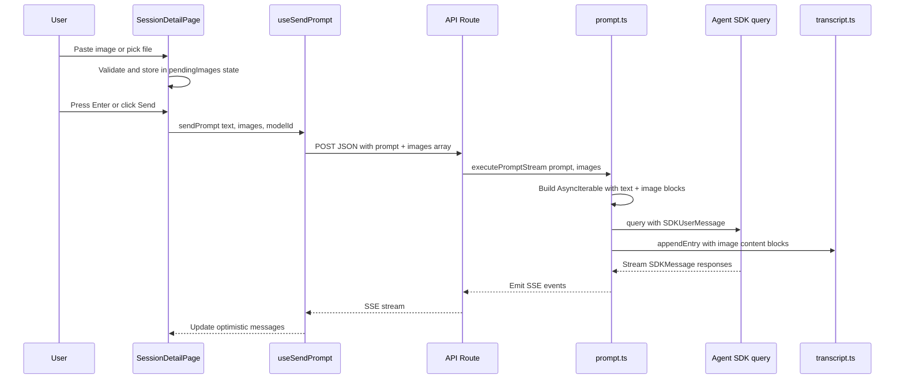
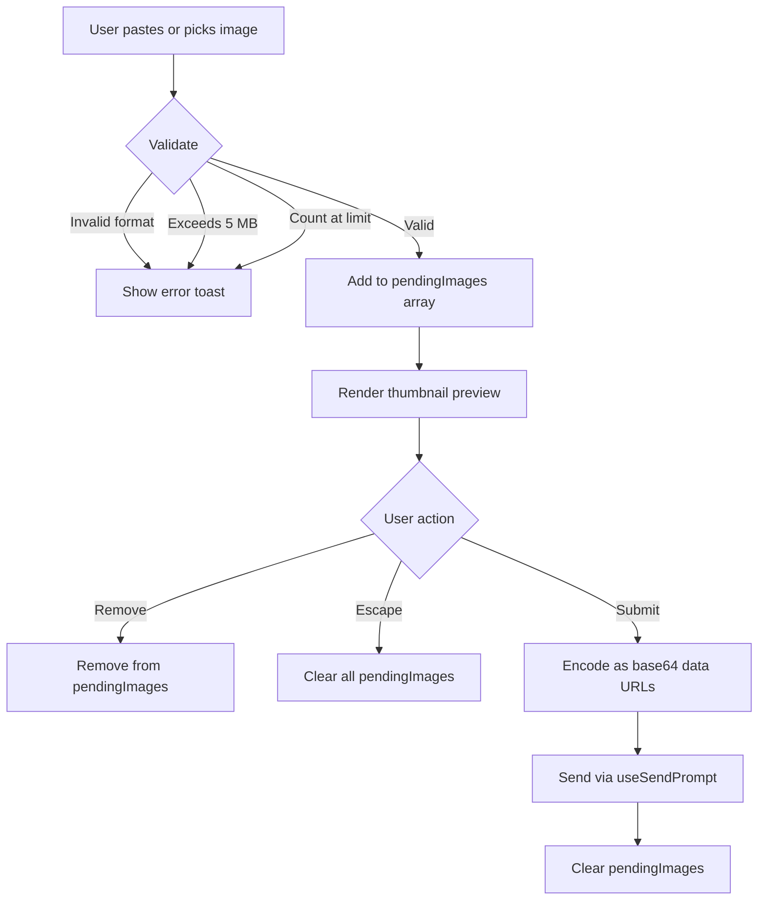
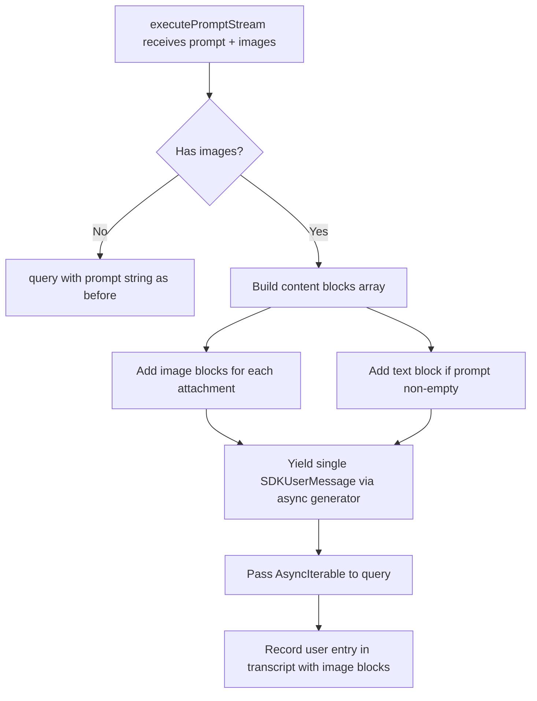

# Design Document: Image Attachments

## Overview

**Purpose**: This feature adds image attachment support to CSM prompts, enabling developers to share screenshots, diagrams, and visual context with Claude Code sessions.

**Users**: Developers using CSM's session detail page will attach images via clipboard paste (Ctrl+V) or a file picker button. Images are sent alongside text prompts to the Claude Agent SDK and displayed in conversation history.

**Impact**: Extends the existing text-only prompt flow (schema → API → SDK → transcript → rendering) with multi-modal content support. No new services or infrastructure; all changes extend existing components.

### Goals
- Enable clipboard paste (Ctrl+V) and file picker image attachment on the prompt input
- Transmit images as base64 content blocks to the Claude Agent SDK
- Display attached images in conversation history (live and persisted)
- Enforce validation constraints (format, size, count) at attachment time

### Non-Goals
- Drag-and-drop image upload (future enhancement)
- Image compression or resizing before sending
- Server-side image storage on disk (full base64 stored in JSONL transcripts)
- Support for non-image file types (PDF, video, etc.)

## Architecture

### Existing Architecture Analysis

The current prompt flow is a linear pipeline:

1. **UI** (`SessionDetailPage.tsx`) — textarea captures text, `handleSendPrompt()` triggers submission
2. **Hook** (`use-send-prompt.ts`) — serializes `{ prompt, modelId }` as JSON, POSTs to API route, reads SSE stream
3. **API Route** (`route.ts`) — validates with `runPromptRequestSchema`, calls `executePromptStream()`
4. **SDK Integration** (`prompt.ts`) — calls `query({ prompt: string })`, iterates async generator, appends to transcript
5. **Transcript** (`transcript.ts`) — JSONL entries with `MessageContentBlock[]` content arrays
6. **Rendering** (`MessageContent.tsx`) — renders text, tool_use, command blocks; ignores tool_result

All layers assume text-only prompts. The extension adds an `image` content block type that flows through the same pipeline with type-level changes at each layer.

### Architecture Pattern & Boundary Map



**Architecture Integration**:
- Selected pattern: Extend existing linear pipeline — widen types at each layer
- Domain boundaries: Client owns attachment management and validation; server owns SDK format conversion
- Existing patterns preserved: Schema-first types, JSON transport, SSE streaming, JSONL transcripts
- New components: `useImageAttachments` hook (client-side attachment state management), `ImageAttachmentPreview` component (thumbnail strip)
- Steering compliance: Schema-first, colocated components, lib modules for domain logic

### Technology Stack

| Layer | Choice / Version | Role in Feature | Notes |
|-------|------------------|-----------------|-------|
| Frontend | React 19, Zustand | Attachment state, paste/file handlers, preview UI | Extends existing SessionDetailPage |
| Transport | Fetch API, JSON, SSE | Carries base64 images in request body | No config change needed — App Router uses Web Request API |
| Backend | Node.js, Next.js 15 App Router | Receives images, passes to SDK | Extends existing API routes |
| SDK | `@anthropic-ai/claude-agent-sdk` | Accepts `AsyncIterable<SDKUserMessage>` with image content blocks | Uses native SDK multi-modal support |
| Storage | JSONL filesystem | Stores image content blocks in transcript entries | Full base64 stored inline |

## System Flows

### Image Attachment Flow (Client-Side)



### Server-Side Prompt Construction



## Requirements Traceability

| Requirement | Summary | Components | Interfaces | Flows |
|-------------|---------|------------|------------|-------|
| 1.1 | Clipboard paste extracts image | SessionDetailPage (paste handler) | useImageAttachments.addImage | Image Attachment Flow |
| 1.2 | Thumbnail preview after paste | ImageAttachmentPreview | ImageAttachment type | Image Attachment Flow |
| 1.3 | Text paste passes through | SessionDetailPage (paste handler) | — | Image Attachment Flow |
| 1.4 | Multiple images accumulate | useImageAttachments hook | addImage, pendingImages | Image Attachment Flow |
| 2.1 | File picker button | SessionDetailPage (file input) | — | Image Attachment Flow |
| 2.2 | File selection attaches images | useImageAttachments hook | addImage | Image Attachment Flow |
| 2.3 | Filter to image formats | SessionDetailPage (file input accept attr) | — | — |
| 2.4 | Reject invalid files | useImageAttachments.addImage | validateImage | Image Attachment Flow |
| 3.1 | Preview area with thumbnails | ImageAttachmentPreview | ImageAttachment[] | Image Attachment Flow |
| 3.2 | Remove individual image | ImageAttachmentPreview | useImageAttachments.removeImage | Image Attachment Flow |
| 3.3 | Clear on submit | SessionDetailPage (handleSendPrompt) | useImageAttachments.clearImages | Image Attachment Flow |
| 3.4 | Clear on Escape | SessionDetailPage (onKeyDown) | useImageAttachments.clearImages | Image Attachment Flow |
| 4.1 | Base64 encoding in payload | useSendPrompt | RunPromptRequest.images | Transport |
| 4.2 | SDK format conversion | prompt.ts (executePromptStream) | AsyncIterable SDKUserMessage | Server-Side Flow |
| 4.3 | Images-only prompt (no text) | useSendPrompt, prompt.ts | RunPromptRequest | Transport |
| 4.4 | Encoding error handling | useImageAttachments.addImage | — | Image Attachment Flow |
| 5.1 | Transcript stores image data | prompt.ts, transcript.ts | TranscriptEntry.content | Server-Side Flow |
| 5.2 | Render images in messages | MessageContent.tsx | MessageContentBlock image variant | — |
| 5.3 | History replay with images | MessageContent.tsx, transcript.ts | — | — |
| 6.1 | Format whitelist | useImageAttachments (validateImage) | ACCEPTED_MIME_TYPES | Image Attachment Flow |
| 6.2 | 5 MB size limit | useImageAttachments (validateImage) | MAX_IMAGE_SIZE_BYTES | Image Attachment Flow |
| 6.3 | 5 images per prompt | useImageAttachments (addImage) | MAX_IMAGES_PER_PROMPT | Image Attachment Flow |
| 6.4 | Decode error handling | useImageAttachments (addImage) | — | Image Attachment Flow |

## Components and Interfaces

| Component | Domain/Layer | Intent | Req Coverage | Key Dependencies | Contracts |
|-----------|-------------|--------|--------------|------------------|-----------|
| useImageAttachments | UI Hook | Manage pending image attachments with validation | 1.1–1.4, 2.2, 2.4, 3.1–3.4, 6.1–6.4 | — | State |
| ImageAttachmentPreview | UI Component | Render thumbnail strip with remove controls | 1.2, 3.1, 3.2 | useImageAttachments (P0) | — |
| SessionDetailPage | UI Page | Integrate paste handler, file picker, and submission | 1.1–1.3, 2.1, 2.3, 3.3, 3.4 | useImageAttachments (P0), useSendPrompt (P0) | — |
| useSendPrompt | UI Hook | Transmit images in request body | 4.1, 4.3 | API Route (P0) | API |
| runPromptRequestSchema | Schema | Validate request with optional images | 4.1 | — | API |
| messageContentBlockSchema | Schema | Add image content block variant | 5.1, 5.2 | — | State |
| executePromptStream | Server Lib | Convert images to SDK format, record in transcript | 4.2, 5.1 | Agent SDK (P0) | Service |
| API Routes (prompt) | API | Parse and forward images | 4.2 | executePromptStream (P0) | API |
| MessageContent | UI Component | Render image blocks inline | 5.2, 5.3 | — | — |
| session-detail.store | UI Store | Include images in optimistic user messages | 5.2 | — | State |

### UI Layer

#### useImageAttachments Hook

| Field | Detail |
|-------|--------|
| Intent | Manage pending image attachments: add, remove, clear, validate |
| Requirements | 1.1, 1.4, 2.2, 2.4, 3.1–3.4, 6.1–6.4 |

**Responsibilities & Constraints**
- Owns the `pendingImages` state array
- Validates each image on add (format, size, count limit)
- Converts Blob/File to base64 data URL asynchronously
- Surfaces validation errors via the existing `promptError` store field for consistent error display

**Dependencies**
- Outbound: `session-detail.store` `useFailPrompt` — displays validation errors using the existing error mechanism (P1)

**Contracts**: State [x]

##### State Management

```typescript
/** A validated, ready-to-send image attachment */
interface ImageAttachment {
  /** Unique client-side ID for React key and removal */
  id: string;
  /** Original filename or "clipboard-image" */
  fileName: string;
  /** MIME type: image/jpeg | image/png | image/gif | image/webp */
  mediaType: string;
  /** Base64-encoded image data (without data URL prefix) */
  base64Data: string;
  /** Object URL for local thumbnail preview */
  previewUrl: string;
  /** File size in bytes (original, before encoding) */
  sizeBytes: number;
}

interface UseImageAttachmentsReturn {
  /** Current pending image attachments */
  pendingImages: ImageAttachment[];
  /** Add an image from a Blob/File. Returns error string on validation failure, null on success. */
  addImage: (file: File | Blob, fileName?: string) => Promise<string | null>;
  /** Remove a specific image by ID */
  removeImage: (id: string) => void;
  /** Clear all pending images */
  clearImages: () => void;
  /** Whether the maximum image count has been reached */
  isAtLimit: boolean;
}
```

- Validation constants:
  - `ACCEPTED_MIME_TYPES`: `["image/jpeg", "image/png", "image/gif", "image/webp"]`
  - `MAX_IMAGE_SIZE_BYTES`: `5 * 1024 * 1024` (5 MB)
  - `MAX_IMAGES_PER_PROMPT`: `5`
- `previewUrl` is created via `URL.createObjectURL()` and revoked on removal or unmount
- `base64Data` is the raw base64 string (no `data:...;base64,` prefix) for direct use in the API payload

**Implementation Notes**
- Use `useRef` for the unique ID counter to avoid re-renders
- Cleanup: revoke all object URLs on component unmount via `useEffect` return

#### ImageAttachmentPreview Component

| Field | Detail |
|-------|--------|
| Intent | Render horizontal thumbnail strip with remove buttons |
| Requirements | 1.2, 3.1, 3.2 |

Summary-only component. Receives `pendingImages` and `onRemove` callback as props. Each thumbnail renders a small `` with the `previewUrl` and a dismiss button (x). Conditionally rendered only when `pendingImages.length > 0`.

```typescript
interface ImageAttachmentPreviewProps {
  images: ImageAttachment[];
  onRemove: (id: string) => void;
}
```

**Implementation Notes**
- Positioned between the textarea and the prompt actions bar within `.prompt-input-area`
- Thumbnails are fixed-size (48x48px), object-fit cover, with a small absolute-positioned remove button
- CSS class: `.attachment-preview-strip`

#### SessionDetailPage Integration

| Field | Detail |
|-------|--------|
| Intent | Wire paste handler, file picker, and image state into the existing prompt input area |
| Requirements | 1.1–1.3, 2.1, 2.3, 3.3, 3.4 |

**Responsibilities & Constraints**
- Add `onPaste` handler to the textarea: check `clipboardData.items` for image items, call `addImage()` for each, `preventDefault()` only when an image is found
- Add a hidden `<input type="file" accept="image/jpeg,image/png,image/gif,image/webp" multiple>` and a visible button that triggers it
- On submit (`handleSendPrompt`): pass `pendingImages` to `sendPrompt()`, then call `clearImages()`
- On Escape: call `clearImages()` alongside the existing `setPromptText("")`
- Adjust the send button disabled condition: allow sending when there are images even if text is empty

**Implementation Notes**
- File picker button placed in `.prompt-input-actions` alongside ModelSelector and VoiceRecordButton
- `handleSendPrompt` signature changes: reads `pendingImages` from the hook and passes to `sendPrompt`

### Transport Layer

#### useSendPrompt Hook Extension

| Field | Detail |
|-------|--------|
| Intent | Include image data in the prompt request payload |
| Requirements | 4.1, 4.3 |

**Responsibilities & Constraints**
- Accept an optional `images` parameter (array of `{ mediaType, base64Data }`)
- Include images in the JSON body sent to the API route
- Allow submission with images but no text (bypass the `!trimmed` early return when images are present)

**Contracts**: API [x]

##### API Contract

The hook's return signature changes from:

```typescript
(text: string, currentMessageCount: number, modelId?: ClaudeModel) => Promise<void>
```

to:

```typescript
(text: string, currentMessageCount: number, modelId?: ClaudeModel, images?: ImagePayload[]) => Promise<void>
```

Where:

```typescript
interface ImagePayload {
  mediaType: string;
  base64Data: string;
}
```

The fetch body changes from `{ prompt, modelId }` to `{ prompt, modelId, images }`.

#### Optimistic Messages (session-detail.store)

Both `submitPrompt` and `receiveStreamContent` must carry the full user content (text + images) so images remain visible in the optimistic user message throughout the streaming lifecycle.

Change both actions to accept `userContent: MessageContentBlock[]` instead of a text string:

```typescript
submitPrompt: (userContent: MessageContentBlock[], currentMessageCount: number) => void;

receiveStreamContent: (userContent: MessageContentBlock[], allBlocks: MessageContentBlock[]) => void;
```

The caller (SessionDetailPage via `handleSendPrompt`) constructs the full content array:

```typescript
const userContent: MessageContentBlock[] = [
  ...(trimmed ? [{ type: "text" as const, text: trimmed }] : []),
  ...pendingImages.map((img) => ({
    type: "image" as const,
    mediaType: img.mediaType,
    base64Data: img.base64Data,
  })),
];
```

Both actions use `userContent` directly as the optimistic user message content:

```typescript
// submitPrompt
state.optimisticMessages = [
  { role: "user", content: userContent, timestamp: new Date().toISOString() },
];

// receiveStreamContent
state.optimisticMessages = [
  { role: "user", content: userContent, timestamp: new Date().toISOString() },
  { role: "assistant", content: [...allBlocks], timestamp: new Date().toISOString() },
];
```

The corresponding selector hooks (`useSubmitPrompt`, `useReceiveStreamContent`) and `useSendPrompt` hook must also adopt the new signatures. `useSendPrompt` passes `userContent` through to the store actions instead of the raw text string.

### Schema Layer

#### runPromptRequestSchema Extension

| Field | Detail |
|-------|--------|
| Intent | Accept optional image attachments in prompt API requests |
| Requirements | 4.1 |

**Contracts**: API [x]

```typescript
const imagePayloadSchema = z.object({
  mediaType: z.enum(["image/jpeg", "image/png", "image/gif", "image/webp"]),
  base64Data: z.string().min(1),
});

const runPromptRequestSchema = z
  .object({
    prompt: z.string().trim(),
    modelId: claudeModelSchema.optional(),
    images: z.array(imagePayloadSchema).max(5).optional(),
  })
  .refine((data) => data.prompt.length > 0 || (data.images && data.images.length > 0), {
    message: "Either prompt text or at least one image is required",
  });
```

#### messageContentBlockSchema Extension

| Field | Detail |
|-------|--------|
| Intent | Add image variant to the content block discriminated union |
| Requirements | 5.1, 5.2 |

**Contracts**: State [x]

Add to the existing discriminated union:

```typescript
z.object({
  type: z.literal("image"),
  mediaType: z.string(),
  base64Data: z.string(),
})
```

This makes `MessageContentBlock` a union of text, tool_use, tool_result, command, and image.

### Server Layer

#### executePromptStream Extension

| Field | Detail |
|-------|--------|
| Intent | Convert image payloads to SDK content blocks and construct async iterable prompt |
| Requirements | 4.2, 5.1 |

**Responsibilities & Constraints**
- Accept an optional `images` parameter alongside `promptText`
- When images are present, construct an `AsyncIterable<SDKUserMessage>` that yields a single user message with content blocks (text + image)
- When no images, continue using the string `prompt` form as before
- Record image content blocks in the transcript entry

**Dependencies**
- Outbound: `@anthropic-ai/claude-agent-sdk` `query()` — constructs SDK-compatible message (P0)

**Contracts**: Service [x]

##### Service Interface

```typescript
function executePromptStream(
  projectPath: string,
  session: SessionState,
  promptText: string,
  emit: (event: string, data: unknown) => void,
  conversationId?: string,
  modelId?: ClaudeModel,
  images?: ImagePayload[],
): Promise<{ conversationId: string }>;
```

The SDK prompt construction when images are present:

```typescript
async function* buildMultiModalPrompt(
  promptText: string,
  images: ImagePayload[],
): AsyncGenerator<SDKUserMessage> {
  const content = [
    ...images.map((img) => ({
      type: "image" as const,
      source: {
        type: "base64" as const,
        media_type: img.mediaType,
        data: img.base64Data,
      },
    })),
    ...(promptText ? [{ type: "text" as const, text: promptText }] : []),
  ];

  yield {
    type: "user",
    session_id: "",
    message: { role: "user", content },
    parent_tool_use_id: null,
  };
}
```

The transcript entry for user messages with images includes both text and image content blocks:

```typescript
content: [
  ...(promptText ? [{ type: "text", text: promptText }] : []),
  ...images.map((img) => ({
    type: "image",
    mediaType: img.mediaType,
    base64Data: img.base64Data,
  })),
]
```

#### API Routes Extension

| Field | Detail |
|-------|--------|
| Intent | Parse images from request body and forward to executePromptStream |
| Requirements | 4.2 |

Both prompt API routes (`/api/projects/[name]/sessions/[session]/prompt` and `.../conversations/[conversationId]/prompt`) change identically:

- Parse `body.images` from the validated request
- Pass `body.images` as the new parameter to `executePromptStream()`

**Implementation Notes**
- The `runPromptRequestSchema` refinement handles the "at least one of prompt or images" validation, replacing the previous `z.string().trim().min(1)` constraint on prompt

### Rendering Layer

#### MessageContent Extension

| Field | Detail |
|-------|--------|
| Intent | Render image content blocks inline in message bubbles |
| Requirements | 5.2, 5.3 |

Add a handler for `block.type === "image"` in the content block rendering loop:

```typescript
if (block.type === "image") {
  return (
    
  );
}
```

**Implementation Notes**
- CSS class `.message-inline-image`: `max-width: 100%`, `max-height: 400px`, `border-radius: var(--radius-sm)`, `margin: var(--space-sm) 0`
- Images render before text blocks in the message (matching the content block order from the transcript)

## Data Models

### Domain Model

**ImageAttachment** (client-side value object):
- `id`: Unique client ID (crypto.randomUUID)
- `fileName`: Original name or "clipboard-image"
- `mediaType`: One of four accepted MIME types
- `base64Data`: Raw base64 string (no data URL prefix)
- `previewUrl`: Object URL for thumbnail display
- `sizeBytes`: Original file size in bytes

**ImagePayload** (transport value object):
- `mediaType`: MIME type string
- `base64Data`: Raw base64 string

**MessageContentBlock** (extended union):
- Existing: text, tool_use, tool_result, command
- New: `{ type: "image", mediaType: string, base64Data: string }`

### Data Contracts & Integration

**API Request Schema** (extended):

```typescript
{
  prompt: string;      // May be empty when images are present
  modelId?: ClaudeModel;
  images?: Array<{
    mediaType: "image/jpeg" | "image/png" | "image/gif" | "image/webp";
    base64Data: string;
  }>;
}
```

**Transcript Entry** (image content block):

```json
{
  "timestamp": "2026-02-23T12:00:00.000Z",
  "type": "user",
  "role": "user",
  "content": [
    { "type": "text", "text": "What does this screenshot show?" },
    { "type": "image", "mediaType": "image/png", "base64Data": "iVBOR..." }
  ]
}
```

## Error Handling

### Error Categories and Responses

**User Errors (client-side validation)**:
- Invalid format → "Only JPEG, PNG, GIF, and WebP images are supported"
- File too large → "Image exceeds the 5 MB size limit"
- Too many images → "Maximum of 5 images per prompt reached"
- Read/decode failure → "Failed to read image file"

All validation errors are returned from `addImage()` as a string. The caller (SessionDetailPage) displays them via the existing `promptError` mechanism in the Zustand store — call `failPrompt(errorMessage)` which sets `promptError` and is rendered by the existing error display component. The error auto-dismisses when the user interacts with the prompt area (existing `dismissError` behavior).

**Transport Errors**:
- If `request.json()` fails to parse the body (e.g., malformed base64), the API route returns 400 with `"prompt is required and must be a non-empty string"` (existing error path covers this since the schema `refine` fails)

**SDK Errors**:
- If the SDK rejects the image format or content, the error propagates through the existing `prompt.sdk_error` → `emit("error", ...)` path. No new error handling needed.

## Testing Strategy

### Unit Tests
- `useImageAttachments` hook: validate format rejection, size rejection, count limit, successful add, remove, clear, unmount cleanup
- `runPromptRequestSchema`: parse with images, parse without images, parse with empty prompt + images, reject over-limit

### Integration Tests
- `executePromptStream` with images parameter: verify async iterable is constructed correctly, transcript entry includes image blocks
- API route with image payload: verify end-to-end flow from request body to SDK call

### E2E/UI Tests (Storybook)
- `ImageAttachmentPreview` stories: empty state, single image, multiple images, remove interaction
- `MessageContent` stories: message with text only, message with images only, message with mixed text + images
