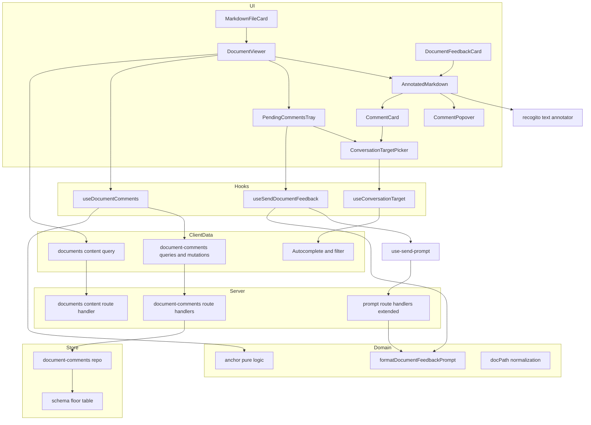
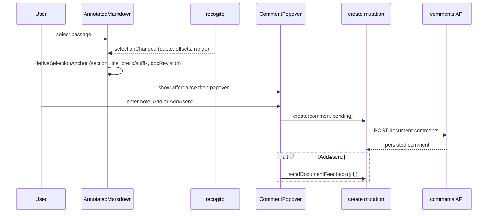
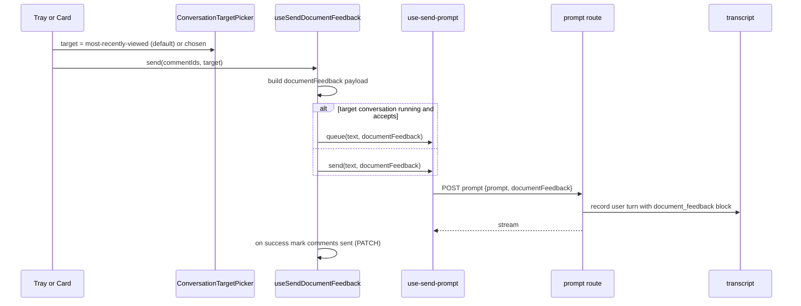
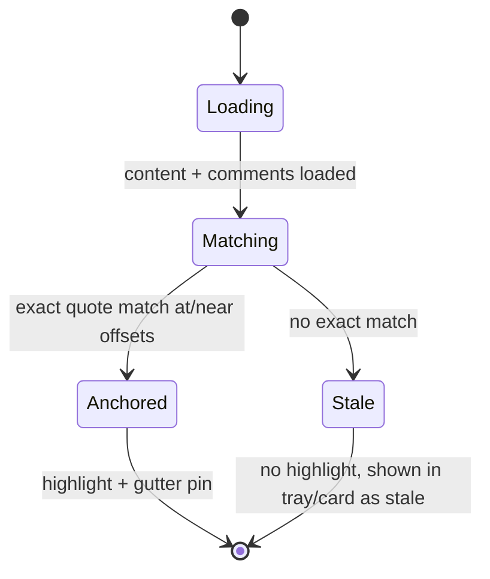

# Design Document — markdown-doc-feedback

## Overview

**Purpose**: Re-implement Command Center's in-app markdown viewer to match the Claude Design prototype and add a document review loop — select a passage, attach a comment, and route comments to an agent (immediately or queued and bulk-sent) with a precise source reference.

**Users**: CC users reviewing agent-produced markdown (reference-registry documents and Kiro specs) inside a session.

**Impact**: Replaces the single-document right-pane Docs experience with a multi-document, comment-enabled viewer; adds a document-scoped comment store; extends the conversation transcript with a feedback card and the prompt pipeline with an optional structured feedback payload; and turns markdown files surfaced in a conversation into clickable cards.

### Goals
- One comment-enabled markdown viewer shared by reference docs and Kiro specs.
- Prototype-matching viewer styling (typography, spacing, decorative cyan list markers, cyan selection tint).
- Document-scoped, durably persisted comments with precise source references and an exact-match re-anchoring model.
- Send comments to any conversation (default: most-recently-viewed), rendered as a feedback card in that conversation.
- Clickable markdown file cards in transcripts that open the viewer.

### Non-Goals
- Restyling markdown rendered inside conversation messages (`MarkdownContent` is unchanged).
- Editing document text in the viewer (read-only w.r.t. content).
- Fuzzy/semantic re-anchoring (v1 is exact-match; mismatches are marked stale; prefix/suffix is stored only).
- Syntax highlighting in viewer code blocks (plain monospace, matching the prototype).
- Commenting on non-markdown files or arbitrary message text.

## Boundary Commitments

### This Spec Owns
- The re-implemented multi-document viewer and its shared comment-enabled markdown renderer (Docs tab re-implementation + the renderer used by the Specs content view).
- The `document-comments` domain: schema, persistence (`document_comments` table + repo), CRUD route handlers, queries/mutations, and pure anchoring logic.
- The generic `documents` content-by-path read endpoint and `docPath` normalization used by the viewer.
- The `document_feedback` transcript content block and its renderer; the `MarkdownFileCard` render-time enhancement in `MessageContent`.
- The optional `documentFeedback` extension to the prompt request + the user-turn recording of a `document_feedback` block.
- The conversation target picker (built on existing autocomplete primitives) and feedback send orchestration.
- Viewer-only styling to match the prototype.

### Out of Boundary
- How documents are produced, registered (`register_document` MCP tool), or stored on disk.
- Agent execution / conversation turn behavior beyond submitting the feedback prompt.
- The existing per-id reference-document content endpoint and the kiro content endpoint (left intact for their current consumers).
- `MarkdownContent` (conversation-message markdown) appearance.
- Fuzzy re-anchoring, multi-user/real-time annotation.
- **Cross-block / multi-block selections.** v1 anchors a comment to a contiguous selection **within a single rendered block**; a selection that spans more than one block is rejected (the comment affordance is not offered) rather than represented. Multi-block anchors are deferred.

### Allowed Dependencies
- State-store patterns (`state-db.ts` floor, repo factory, `index.ts` re-exports, durability contracts).
- Reference-document registry listing (`useReferenceDocumentsQuery`) and Kiro spec tree (`useKiroDocTreeQuery`) for enumerating documents.
- Prompt/queue pipeline (`use-send-prompt`, `src/lib/prompt/*`) for delivery.
- Conversation list + recency: `useAllConversationsQuery`, `filterAndScoreConversations`, `ui/Autocomplete`, `cc-open-tabs` LRU (`use-open-tabs`).
- Design-system tokens via Tailwind utilities (`cc-design-system`, `docs/tailwind-conventions.md`).
- `@recogito/text-annotator` + `@recogito/react-text-annotator` + `openseadragon` (client-only). `openseadragon` is an inherited peer: the React wrapper imports `@annotorious/react`, whose index eagerly references OpenSeadragon modules — so it must be installed explicitly (verified by a build spike in task 1.1) even though the text path does not use image/PDF viewing.

### Revalidation Triggers
- `messageContentBlockSchema` change (new `document_feedback` variant) → transcript/message consumers.
- `runPromptRequestSchema` / `queueEnqueueRequestSchema` / `SUBMIT_PROMPT` event / `ExecutePromptInput` / pending-queue entry change (`documentFeedback`) → prompt clients, conversation actor + turn input, user-turn block construction, queue drain conversion, and the `conversations` durability contract.
- New `document_comments` table / repo contract → state-store durability contracts.
- `DocumentRef`/`docPath` identity or normalization change (incl. absolute-path policy) → comment keys + content fetching.
- `DocumentFeedbackTarget` shape change → target picker + send orchestration routing.

## Architecture

### Existing Architecture Analysis
- **Render seam**: `src/components/MarkdownViewer.tsx` (react-markdown + `remark-gfm`, custom `a`/`code` components) is shared by `DocsPanel` and `SpecBrowser` → single place to add the `li` renderer, styling, and the annotation overlay.
- **Right pane**: `RightPane.tsx` hosts Diff/Docs/Specs tabs (all `forceMount`ed); `session-detail.store.ts` holds `rightPaneTab`, `selectedDocId`, and the `openDocById` deep-link.
- **Persistence**: serialized SQLite store; repos are factory functions over a `Db`, wired in the floor (`state-db.ts`) + re-exported from `state-store/index.ts`; durability backstopped by `*.contract.test.ts`.
- **Transcript**: `messageContentBlockSchema` discriminated union; `MessageContent.tsx` dispatches by block type; `format-tool-use.ts` parses `tool_use` file ops.
- **Send**: `use-send-prompt` exposes `send`/`queue`/`abortClient`; `runPromptRequestSchema` defines the body; the conversation actor drains the durable queue when running.

### Architecture Pattern & Boundary Map



**Architecture Integration**
- **Pattern**: layered feature on existing primitives — Types/Schemas → Domain (pure) → Repository → Route handlers → Client queries/hooks → UI. Recogito enters only at the UI leaf.
- **Boundaries**: the comment-enabled renderer (`AnnotatedMarkdown`) is the shared seam; `DocsPanel` and the Specs content view both render through it. Document identity is a single `docPath`.
- **Preserved patterns**: repo factory + floor + durability contracts; React Query per-domain factories; discriminated-union content blocks; `use-send-prompt` for delivery.
- **Steering compliance**: no `any`; Zod-first; DI for testability; focused store accessors; structured logging; Tailwind utilities only.

### Technology Stack

| Layer | Choice / Version | Role in Feature | Notes |
|-------|------------------|-----------------|-------|
| Frontend | `@recogito/text-annotator` + `@recogito/react-text-annotator` 4.2.5 + `openseadragon` (peer) | Selection→highlight overlay over rendered markdown | New deps; client-only (dynamic import); BSD-3; React 19 peer OK; `openseadragon` inherited via `@annotorious/react` — install explicitly, confirm by build spike (1.1) |
| Frontend | React 19.2.4 / Next 16.1.6, Tailwind v4 | Viewer UI, design-system styling | Reuse `ui/Autocomplete`, `cn()` |
| Backend | Next route handlers (`withTracing`) | comments CRUD + content-by-path + prompt extension | Mirrors reference-documents handlers |
| Data | better-sqlite3 12.6.2 (`command-center.db`) | `document_comments` table (schema floor) | Additive; no Umzug migration, no version bump |
| Validation | Zod 4.3.6 | comment + feedback + content-block schemas | `z.infer` types; `safeParse` at boundaries |

## File Structure Plan

### New files
```
src/lib/document-comments/
├── schemas.ts            # Zod: documentComment, commentAnchor, status, documentFeedbackItem/payload, DocumentRef
├── anchor.ts             # PURE: computeDocRevision, deriveSelectionAnchor, tryReanchorExact
├── format-feedback.ts    # PURE: formatDocumentFeedbackPrompt(items) -> agent text
├── route-handlers.ts     # GET/POST/PATCH/DELETE document-comments (withTracing)
├── queries.ts            # useDocumentCommentsQuery(projectName, sessionName, docPath)
├── mutations.ts          # create/update/delete comment mutations (optimistic)
├── query-keys.ts         # documentCommentKeys factory
└── *.test.ts             # unit tests colocated (anchor, format-feedback, detection)

src/lib/documents/
├── path.ts               # PURE: normalizeDocPath (absolute-inside→relative, absolute-outside→unavailable), isMarkdownPath, resolveWithinWorktree (traversal guard)
├── route-handlers.ts     # getDocumentContent (GET ?path=, .md-only, worktree-scoped)
├── queries.ts            # useDocumentContentQuery(projectName, sessionName, docPath)
├── query-keys.ts         # documentContentKeys
└── markdown-file-refs.ts # PURE: extractMarkdownFileRefs(blocks) from tool_use (Write/Edit/register_document)

src/lib/state-store/
└── document-comments-repo.ts        # createDocumentCommentsRepo(db): DocumentCommentsRepo
src/lib/state-store/document-comments-repo.contract.test.ts  # round-trip durability

src/features/session/document-viewer/
├── DocumentViewer.tsx          # multi-doc shell: header, tabs, badge, path, body, tray
├── AnnotatedMarkdown.tsx       # MarkdownViewer + recogito overlay + selection→comment (client-only)
├── DocumentTabs.tsx            # open-document tab strip
├── CommentPopover.tsx          # create comment (preview + note + Add / Add&send)
├── CommentCard.tsx             # view/edit/remove/send-now an existing comment
├── CommentGutterPin.tsx        # left-gutter marker(s) per block
├── PendingCommentsTray.tsx     # count, list, jump, Clear, Send N
├── ConversationTargetPicker.tsx# Autocomplete-based target selector
├── markdown-components.tsx     # custom react-markdown components (li chevron, etc.) + viewer styling
├── use-document-comments.ts    # load + reanchor + group-by-block; expose viewer comment state
├── use-send-document-feedback.ts # build payload, pick send vs queue, mark sent
├── use-conversation-target.ts  # default-to-recent + selection state
├── use-text-selection-comment.ts # selection lifecycle bridging recogito events ↔ popover
└── recogito/use-text-annotator.ts # client-only annotator mount + style sync

src/components/conversation/
├── MarkdownFileCard.tsx        # clickable file card rendered from tool_use refs
└── DocumentFeedbackCard.tsx    # transcript renderer for document_feedback block

src/app/api/projects/[name]/sessions/[session]/document-comments/route.ts         # GET list, POST create
src/app/api/projects/[name]/sessions/[session]/document-comments/[id]/route.ts    # PATCH, DELETE
src/app/api/projects/[name]/sessions/[session]/document-content/route.ts          # GET ?path=
```

### Modified files
- `src/components/MarkdownViewer.tsx` — accept an optional render-extension (custom `components` incl. `li` chevron + class hooks) and an annotation container ref so `AnnotatedMarkdown` can mount the overlay; apply prototype styling. Existing call sites keep working (new props optional).
- `src/features/session/conversation/DocsPanel.tsx` — re-implement to host `DocumentViewer` (list → open by `docPath`; multi-doc).
- `src/features/session/conversation/SpecBrowser.tsx` — keep nav; render the selected file through `AnnotatedMarkdown` so specs get commenting.
- `src/stores/session-detail.store.ts` — add `openDocuments: DocumentRef[]`, `activeDocPath`, `pendingTrayExpanded`, `feedbackTarget: DocumentFeedbackTarget | null`; actions + focused selectors; extend `openDocById`/add `openDocument(ref)`.
- `src/lib/prompt/queue.ts`, `src/lib/prompt/queue-route-handlers.ts`, `src/lib/conversations/message-queue-schemas.ts`, `src/lib/state-store/conversation-row-codec.ts` — thread optional `documentFeedback` through the enqueue schema, durable pending-queue entry, and live/next-turn delivery so queued feedback records a `document_feedback` block.
- `src/lib/workflows/conversation/types.ts`, `actor-implementations.ts`, `build-user-transcript-blocks.ts`, `manager.ts` — add `documentFeedback` to the `SUBMIT_PROMPT` event + `ExecutePromptInput`, emit a `document_feedback` user-turn block, and stop `queuedBatchToSubmitPrompt` from dropping that block on drain.
- `src/lib/conversations/message-content-schemas.ts` — add `document_feedback` block variant.
- `src/components/MessageContent.tsx` — render `document_feedback` → `DocumentFeedbackCard`; render `MarkdownFileCard` for `.md` tool_use refs.
- `src/lib/prompt/schemas.ts` — add optional `documentFeedback` to `runPromptRequestSchema` (+ queue enqueue schema).
- `src/lib/prompt/route-handlers.ts` (+ the user-turn transcript-append seam) — when `documentFeedback` present, record a `document_feedback` block and derive agent text via `formatDocumentFeedbackPrompt`.
- `src/hooks/use-send-prompt.ts` — **unchanged** (intentionally not reused for feedback; it is coupled to the mounted conversation's optimistic store + `sending` gate). `useSendDocumentFeedback` instead issues target-aware POSTs directly to the conversation prompt/queue endpoints; a small shared SSE/response helper may be extracted, but without the mounted-view optimistic coupling.
- `src/lib/state-store/state-db.ts` — add `document_comments` floor DDL.
- `src/lib/state-store/store.ts` + `index.ts` — wire + re-export the new repo functions.
- `package.json` — add the two recogito deps.

## System Flows

### Create a comment from a selection


### Send feedback to a conversation


### Load & re-anchor on document open


## Requirements Traceability

| Requirement | Summary | Components | Interfaces | Flows |
|-------------|---------|------------|------------|-------|
| 1.1–1.3 | Multi-doc viewer: render, tabs, switch, preserve state | DocumentViewer, DocumentTabs, session-detail.store | DocumentRef, openDocument | open |
| 1.4 | Comment-count badge | DocumentViewer, useDocumentComments | useDocumentCommentsQuery | load |
| 1.5 | Doc-flash + scroll on activate | DocumentViewer, markdown-components | store activeDocPath | open |
| 1.6 | Empty/error state | AnnotatedMarkdown, MarkdownViewer, useDocumentContentQuery | getDocumentContent | load |
| 2.1–2.3 | Same commenting on Docs + Specs | AnnotatedMarkdown, DocsPanel, SpecBrowser | shared renderer | create |
| 3.1–3.4 | Prototype styling + decorative bullets + selection tint | markdown-components, MarkdownViewer | components map, theme tokens | — |
| 3.5 | Message markdown unchanged | (no change to MarkdownContent) | — | — |
| 4.1–4.2 | File card from Write/Edit + registered docs | MarkdownFileCard, MessageContent | extractMarkdownFileRefs | — |
| 4.3 | Click opens viewer | MarkdownFileCard, DocumentViewer | openDocument | open |
| 4.4 | Unreadable file indicated | MarkdownFileCard, useDocumentContentQuery | getDocumentContent | load |
| 4.5 | Card preserves other content | MessageContent | dispatch | — |
| 5.1–5.2 | Affordance + popover w/ preview | AnnotatedMarkdown, CommentPopover, use-text-selection-comment | recogito events | create |
| 5.3–5.4 | Queue vs immediate | CommentPopover, mutations, use-send-document-feedback | create / sendDocumentFeedback | create, send |
| 5.5 | Empty note disables actions | CommentPopover | — | create |
| 5.6 | Dismiss without creating | use-text-selection-comment | — | create |
| 5.7 | Record quote + path/§/line | anchor.ts, schemas, mutations | deriveSelectionAnchor | create |
| 6.1 | Highlight + gutter pin when anchored | AnnotatedMarkdown, CommentGutterPin, recogito | tryReanchorExact | load |
| 6.2 | Distinguish pending vs sent | markdown-components, CommentGutterPin | status styles | — |
| 6.3 | Comment card on click | CommentCard | openCard | — |
| 6.4–6.5 | Edit note; sent→pending on change | CommentCard, mutations, repo | updateComment | — |
| 6.6 | Remove comment | CommentCard, mutations, repo | deleteComment | — |
| 6.7 | Send-now single | CommentCard, use-send-document-feedback | sendDocumentFeedback | send |
| 7.1–7.3 | Tray display + list + jump | PendingCommentsTray, DocumentViewer | useDocumentComments | — |
| 7.4 | Send all as one submission | PendingCommentsTray, use-send-document-feedback | sendDocumentFeedback | send |
| 7.5 | Clear removes pending only | PendingCommentsTray, mutations | deleteComment | — |
| 7.6 | Hide tray when none pending | DocumentViewer | selector | — |
| 8.1 | Payload = quote+path+§+line+note | format-feedback.ts, schemas | formatDocumentFeedbackPrompt | send |
| 8.2 | Feedback card in transcript | document_feedback block, DocumentFeedbackCard, prompt route | messageContentBlockSchema | send |
| 8.3 | pending→sent on success | use-send-document-feedback, mutations, repo | updateComment | send |
| 8.4 | Queue while running | use-send-document-feedback, use-send-prompt | queue | send |
| 8.5 | Keep pending + surface failure | use-send-document-feedback | error envelope | send |
| 9.1 | List all conversations | ConversationTargetPicker | useAllConversationsQuery | send |
| 9.2 | Default most-recently-viewed | use-conversation-target | cc-open-tabs LRU | send |
| 9.3 | Search/select another | ConversationTargetPicker | filterAndScoreConversations | send |
| 9.4 | Selected target reused | use-conversation-target, store | feedbackTarget (DocumentFeedbackTarget) | send |
| 9.5 | New conversation if none | use-send-document-feedback | new-conversation send | send |
| 10.1–10.2 | Document-scoped, stored separately | document-comments-repo, schemas, path.ts | docPath key | — |
| 10.3 | Survive reload/restart | document-comments-repo, floor | findByDocument | load |
| 10.4 | One shared set per file | path.ts, repo | normalizeDocPath | load |
| 10.5 | Durable on every change | repo, mutations | upsert/delete | — |
| 11.1 | Store full anchor | schemas, anchor.ts, repo | CommentAnchor | create |
| 11.2 | Re-anchor exact matches | anchor.ts, useDocumentComments | tryReanchorExact | load |
| 11.3–11.4 | Mark stale; never relocate | anchor.ts, CommentCard, tray | tryReanchorExact | load |
| 11.5 | Stale still actionable | CommentCard, mutations | update/delete/send | — |

## Components and Interfaces

| Component | Domain/Layer | Intent | Req Coverage | Key Dependencies (P0/P1) | Contracts |
|-----------|--------------|--------|--------------|--------------------------|-----------|
| document-comments-repo | Store | Persist comments | 10, 11.1 | Db (P0) | State |
| document-comments route handlers | Server | CRUD over comments | 5,6,7,8,10 | repo (P0) | API |
| documents content handler | Server | Read any .md by path | 1.6,4.3,4.4 | path.ts (P0) | API |
| anchor.ts | Domain | Pure anchoring | 5.7,11 | — | Service |
| format-feedback.ts | Domain | Serialize feedback text | 8.1 | — | Service |
| markdown-file-refs.ts | Domain | Detect md file refs | 4.1,4.2 | message schemas (P1) | Service |
| useDocumentComments | Hook | Load+reanchor+group | 1.4,6,7,11.2 | queries (P0), anchor (P0) | State |
| useSendDocumentFeedback | Hook | Build payload + route to target | 7.4,8,9.5 | use-send-prompt (P0), format (P0), DocumentFeedbackTarget (P0) | Service |
| useConversationTarget | Hook | Default+select target | 9 | useAllConversationsQuery (P0), cc-open-tabs (P1) | State |
| AnnotatedMarkdown | UI | Comment-enabled renderer | 2,3,5,6.1 | recogito (P0), MarkdownViewer (P0) | — |
| DocumentViewer | UI | Multi-doc shell + tray | 1,7 | store (P0), useDocumentComments (P0) | — |
| ConversationTargetPicker | UI | Pick target | 9 | Autocomplete (P0) | — |
| MarkdownFileCard / DocumentFeedbackCard | UI | Transcript cards | 4,8.2 | MessageContent (P0) | — |

### Domain (pure)

#### anchor.ts

| Field | Detail |
|-------|--------|
| Intent | Compute and resolve comment anchors deterministically |
| Requirements | 5.7, 11.1, 11.2, 11.3, 11.4 |

**Responsibilities & Constraints**: No DOM, no I/O — pure functions over strings/offsets so they are unit-testable (TDD core). Owns the anchor value object and the exact-match algorithm. Never relocates on mismatch (11.4). **Anchor scope is a single rendered block** (one `sectionId` + one `line` + offsets within that block's text): a `CommentAnchor` represents a contiguous selection inside one block. Cross-block selections are rejected upstream (see `AnnotatedMarkdown`/selection handling) and never reach this layer, so the model intentionally carries no end-block identity (deferred — Out of Boundary).

**Contracts**: Service [x]

```typescript
type CommentAnchor = {
  sectionId: string;        // nearest-heading slug/index of the block
  headingLabel: string;     // e.g. "1. Overview" or "2 › 2.1"
  line: number;             // 1-based source line of the block
  charStart: number;        // offset within the single block's text
  charEnd: number;          // offset within the same block (charStart..charEnd are same-block)
  quote: string;            // exact selected text (normalized whitespace for display, raw kept for match)
  prefix: string;           // up to N chars before (stored; unused in v1 matching)
  suffix: string;           // up to N chars after (stored; unused in v1 matching)
  docRevision: string;      // content hash at creation
};

type ReanchorResult =
  | { status: "anchored"; charStart: number; charEnd: number }
  | { status: "stale" };

function computeDocRevision(content: string): string;
function deriveSelectionAnchor(input: {
  blockText: string; blockLine: number; sectionId: string; headingLabel: string;
  charStart: number; charEnd: number; content: string;
}): CommentAnchor;
function tryReanchorExact(blockText: string | null, anchor: CommentAnchor): ReanchorResult;
```
- Preconditions: offsets within `[0, blockText.length]`.
- Postconditions: `anchored` only when `blockText.slice(charStart,charEnd) === anchor.quote` (with a bounded nearby search); else `stale`.
- Invariants: identical input → identical `docRevision`.

#### format-feedback.ts

| Field | Detail |
|-------|--------|
| Intent | Serialize feedback items into the agent-facing prompt text |
| Requirements | 8.1 |

**Contracts**: Service [x]
```typescript
function formatDocumentFeedbackPrompt(items: DocumentFeedbackItem[]): string;
// Each item rendered as: "<path> — § <headingLabel> · L<line>\n  \"<quote>\"\n  → <note>"
```

#### markdown-file-refs.ts

| Field | Detail |
|-------|--------|
| Intent | Derive markdown file cards from message tool_use blocks |
| Requirements | 4.1, 4.2 |

**Contracts**: Service [x]
```typescript
type MarkdownFileRef = { docPath: string; fileName: string; origin: "write" | "edit" | "registered" };
function extractMarkdownFileRefs(blocks: MessageContentBlock[]): MarkdownFileRef[];
// Native edits: tool_use name in {Write, Edit, MultiEdit} with a .md path (MultiEdit counts as an edit).
// Registered docs come from TWO mechanisms, both detected from the blocks (names normalized — the transcript
// stores the FULL MCP name, e.g. "mcp__cc-session-tools__register_document"; a helper strips the
// `mcp__<server>__` prefix and matches the bare tool name, also accepting the bare form):
//   (a) register_document tool_use → read input.file_path (.md).
//   (b) run_codex: its PAIRED tool_result (correlated by tool_use_id) carries content = JSON
//       `{ summary, referenceDocuments: [{ filePath, description }] }`; safeParse it and emit a ref for
//       each `.md` filePath. (Codex auto-registers these without a register_document call.)
// All registered-doc refs use origin "registered". De-dupes by docPath within a message.
// Unit-tested against bare + mcp-suffixed names and a run_codex result payload.
```

### Store (persistence)

#### document-comments-repo

| Field | Detail |
|-------|--------|
| Intent | Durable, document-scoped comment persistence |
| Requirements | 10.1, 10.3, 10.4, 10.5, 11.1 |

**Responsibilities & Constraints**: Owns the `document_comments` table. Keyed by `(project_path, session_name, doc_path)`. Stores comments separately from markdown (never writes `.md`). FK cascade on session delete.

**Dependencies**: Inbound: route handlers (P0). Outbound: `Db` (P0).

**Contracts**: State [x]

```typescript
interface DocumentCommentsRepo {
  findByDocument(projectPath: string, sessionName: string, docPath: string): DocumentComment[];
  findBySession(projectPath: string, sessionName: string): DocumentComment[];
  // Scoped lookup: returns the comment ONLY if it belongs to (projectPath, sessionName);
  // used by PATCH/DELETE handlers so a known id cannot mutate a comment in another scope.
  findByIdInScope(projectPath: string, sessionName: string, id: string): DocumentComment | null;
  upsert(comment: DocumentComment): void;
  delete(id: string): void;
}
function createDocumentCommentsRepo(db: Db): DocumentCommentsRepo;
```

**State Management**
- State model: one row per comment; anchor stored as columns (`section_id`, `heading_label`, `line`, `char_start`, `char_end`, `quote`, `prefix`, `suffix`, `doc_revision`) plus `note`, `status` (`pending`|`sent`), `created_at`, `updated_at`, `sent_at` (nullable).
- Persistence & consistency: schema floor `CREATE TABLE IF NOT EXISTS document_comments` (additive; no Umzug migration, no `KNOWN_SCHEMA_VERSION` bump); index on `(project_path, session_name, doc_path)`; FK to `sessions` `ON DELETE CASCADE`.
- Concurrency: through the existing serialized write queue.

**Implementation Notes**
- Integration: wire in `store.ts`; re-export `getDocumentComments`/`upsertDocumentComment`/`deleteDocumentComment` from `state-store/index.ts`.
- Validation: row schema via Zod (`safeParse`) mirroring `reference-documents-repo`.
- Risks: serialization drops → covered by `assertRoundTripDurability` contract with a maximal fixture (`staleness` is derived-on-read, declared non-persisted in the policy map).

### Server (route handlers)

#### document-comments route handlers

**Contracts**: API [x]

| Method | Endpoint | Request | Response | Errors |
|--------|----------|---------|----------|--------|
| GET | `/api/projects/[name]/sessions/[session]/document-comments?docPath=` | — (query) | `DocumentComment[]` | 400, 404, 500 |
| POST | `/api/projects/[name]/sessions/[session]/document-comments` | `CreateDocumentCommentRequest` | `DocumentComment` | 400, 404, 500 |
| PATCH | `/api/projects/[name]/sessions/[session]/document-comments/[id]` | `UpdateDocumentCommentRequest` (`note?`, `status?`) | `DocumentComment` | 400, 404, 500 |
| DELETE | `/api/projects/[name]/sessions/[session]/document-comments/[id]` | — | `{ ok: true }` | 404, 500 |

- Idempotency: PATCH/DELETE idempotent by id; POST creates a new id.
- `docPath` validated as worktree-relative `.md` (shared `path.ts` guard).
- **Ownership scoping (PATCH/DELETE)**: handlers resolve project→session (per the existing `reference-documents` ownership-chain precedent), then load the comment via `findByIdInScope(projectPath, sessionName, id)`; a known id that does not belong to the route's project/session returns **404** (never mutates/deletes out-of-scope). POST persists with the route's `(projectPath, sessionName)`, not values from the body.

#### documents content handler

**Contracts**: API [x]

| Method | Endpoint | Request | Response | Errors |
|--------|----------|---------|----------|--------|
| GET | `/api/projects/[name]/sessions/[session]/document-content?path=` | query `path` | `{ content: string; docPath: string }` | 400 (bad/non-md/traversal), 404 (missing/out-of-worktree), 500 |

- Reads the file within the session worktree only; `.md`-only; path-traversal guarded. Used by the viewer for any markdown file (registered, spec, or unregistered).
- Response is `{ content, docPath }` — a **new** schema, distinct from the existing shared `contentResponseSchema` (`{ content }`); define it explicitly rather than reusing the existing one.
- **Absolute reference-document path policy** (resolves the registry's pre-existing absolute-path support): `normalizeDocPath` (in `path.ts`) accepts an absolute path and, if it is **inside** the session worktree, normalizes it to the worktree-relative `docPath`; if it is **outside** the worktree, the document is treated as **unavailable** — the endpoint returns 404 and the viewer/file-card shows an explicit "outside this worktree — unavailable" state rather than reading an arbitrary path. This intentionally narrows the existing registry behavior to the worktree boundary; the legacy per-id reference-document content endpoint is left intact (out of boundary) for any other consumer. Both branches (inside-normalizes, outside-unavailable) are unit-tested.

### Prompt pipeline extension (modified)

**Contracts**: API [x] / State [x]

`documentFeedback` must be threaded through the **full conversation-actor send funnel**, not just the route handlers — today every send is reduced to `promptText` + `images`, and the user-turn transcript blocks are built from only `text`/`image_ref`/`image_marker`, so a `document_feedback` block would otherwise never reach the transcript (8.2) and the queue drain would silently drop it (8.4). The contract therefore spans:

1. **Request boundary** — `runPromptRequestSchema` and `queueEnqueueRequestSchema` gain optional `documentFeedback?: DocumentFeedbackPayload`; route handlers (`executePrompt`/`executeConversationPrompt`, queue enqueue) pass it inward.
2. **Actor event + turn input** (`src/lib/workflows/conversation/types.ts`) — add `documentFeedback?: DocumentFeedbackPayload` to the `SUBMIT_PROMPT` `ConversationEvent` variant and to the active-turn `ExecutePromptInput`.
3. **User-turn block construction** (`actor-implementations.ts` ~L1262 + `build-user-transcript-blocks.ts`) — when `input.documentFeedback` is present, append a `document_feedback` content block to the user turn's `content` (alongside/instead of the text block), and derive the agent-facing `promptText` via `formatDocumentFeedbackPrompt` when no explicit text was supplied.
4. **Durable queue** — the enqueued message content (a `MessageContentBlock[]` persisted via `conversation-row-codec.ts` / the `pending_queue` column) carries a `document_feedback` block; `queuedBatchToSubmitPrompt` (`manager.ts` ~L169) is extended so it does **not** drop that block — it surfaces `documentFeedback` on its result so the drained `SUBMIT_PROMPT` re-emits the block (rather than reducing to text+images only).
5. **Durability + tests** — extend the `conversations` round-trip contract to cover the queued `document_feedback` block, and add actor/drain tests asserting the block survives both an immediate turn and a next-turn drain.
- **Backward compatible**: omitted `documentFeedback` ⇒ event, turn input, block construction, and drain all behave exactly as before (text/image only).

```typescript
type DocumentFeedbackItem = {
  docPath: string; path: string; headingLabel: string; line: number; quote: string; note: string;
};
type DocumentFeedbackPayload = { items: DocumentFeedbackItem[] };
```

### UI

#### AnnotatedMarkdown (full block — new boundary: renderer + annotation seam)

| Field | Detail |
|-------|--------|
| Intent | Shared comment-enabled markdown renderer for Docs + Specs |
| Requirements | 2.1–2.3, 3.1–3.4, 5.1–5.2, 6.1 |

**Responsibilities & Constraints**: Wrap `MarkdownViewer` with prototype styling and the custom `li` chevron; mount the recogito annotator (client-only, dynamic import) over the rendered container; surface selection events to the comment popover; paint highlights styled by comment status; render gutter pins; re-sync on `docPath`/content change. Read-only w.r.t. content. Owns no persistence.

**Dependencies**: External: `@recogito/react-text-annotator` (P0). Inbound: DocumentViewer, SpecBrowser (P0). Outbound: useDocumentComments (P0), use-text-selection-comment (P0).

**Contracts**: — (presentational + integration; no service/API)

```typescript
interface AnnotatedMarkdownProps {
  docRef: DocumentRef;
  content: string | null;
  isLoading: boolean;
  comments: ResolvedComment[];        // includes ReanchorResult status
  onCreateSelection(anchorDraft: AnchorDraft): void;
  onOpenComment(commentId: string): void;
}
```

**Implementation Notes**
- Integration: dynamic `import("@recogito/react-text-annotator")` inside a `"use client"` boundary; feature-detect highlight renderer. The existing `MarkdownViewer` Mermaid code-block handling must survive the plain-code-block restyle (Mermaid still renders; only non-Mermaid code styling changes).
- Validation: stamp `data-cc-line`/`data-cc-section` via a rehype step in `markdown-components` to resolve heading/line for a selection. A selection whose start and end resolve to **different blocks** is rejected — the comment affordance is not shown (single-block scope, per Boundary).
- Risks: geometry re-measure on tab switch/scroll; key the container per `docRef.docPath`.

#### Summary-only UI components
- **DocumentViewer** (1,7): header (icon, title, count badge, path), `DocumentTabs`, body = `AnnotatedMarkdown`, `PendingCommentsTray`. Reads/writes `openDocuments`/`activeDocPath` in the store; doc-flash on activate (1.5).
- **CommentPopover** (5): preview + note textarea; Add/Add&send disabled while note empty (5.5); cancel/dismiss (5.6).
- **CommentCard** (6,11.5): status chip, location, quote, note; Edit (sent→pending on change, 6.5), Remove, Send-now; works for stale comments.
- **CommentGutterPin** (6.1,6.2): per-block marker; pending vs sent styling.
- **PendingCommentsTray** (7): count, expand, per-row jump/edit/remove, Clear (pending-only), Send N via target picker; hidden when none (7.6).
- **ConversationTargetPicker** (9): `Autocomplete` + `filterAndScoreConversations` over `useAllConversationsQuery`; default from `useConversationTarget`. Emits a full `DocumentFeedbackTarget` (from the selected `ConversationListItem`), not a bare id.

**Feedback send routing** (`useSendDocumentFeedback`): must use **target-aware, low-level endpoint calls** — it does **not** reuse `useSendPrompt`, which mutates the *mounted* conversation's optimistic Zustand state and gates `queue()` on the mounted view's `sending` flag (reusing it for a different target would misroute UI state or skip queueing). Instead it POSTs directly, keyed by the chosen `DocumentFeedbackTarget`, to:
- immediate: `POST /api/projects/{target.projectName}/sessions/{target.sessionName}/conversations/{target.conversationId}/prompt`
- queue: `POST /api/projects/{target.projectName}/sessions/{target.sessionName}/conversations/{target.conversationId}/queue`
- new conversation (9.5, no target available): `POST /api/projects/{docRef.projectName}/sessions/{docRef.sessionName}/prompt` (document's own session), then use the created conversation as the target.

It carries the `documentFeedback` payload in the body and does **not** touch the mounted view's optimistic store; the target view reconciles via its own SSE/query invalidation. Queue vs immediate is chosen from `target.status` + backend capability (8.4), with a **race fallback**: if the target turned running between picker render and submit and the immediate endpoint reports it cannot accept mid-turn, fall back to the queue endpoint rather than failing the send.
- **MarkdownFileCard** (4): renders from `extractMarkdownFileRefs`; click → `openDocument`; unreadable/out-of-worktree → disabled/indicated (4.4). Cards must remain visible when consecutive tool-use blocks are collapsed into a grouped/`ToolUseGroup` rendering (the card is surfaced from the group's refs, not hidden inside the collapsed group).
- **DocumentFeedbackCard** (8.2): renders `document_feedback` block items (path · § · L · quote · note).

#### Shared types
```typescript
type DocumentRef = { projectName: string; sessionName: string; docPath: string; title: string };
type CommentStatus = "pending" | "sent";
type DocumentComment = {
  id: string; projectPath: string; sessionName: string; docPath: string;
  anchor: CommentAnchor; note: string; status: CommentStatus;
  createdAt: string; updatedAt: string; sentAt: string | null;
};
type ResolvedComment = DocumentComment & { reanchor: ReanchorResult; stale: boolean };

// A feedback target must carry the FULL routing identity, because the picker lists
// conversations cross-project while prompt/queue routes are project/session-scoped.
// Derived from the ConversationListItem the picker already has in hand.
type DocumentFeedbackTarget = {
  projectName: string; projectPath: string; sessionName: string;
  conversationId: string; backend: AgentBackendId; status: ConversationStatus;
};
```

## Data Models

### Logical Data Model
- **Entity**: `document_comments`, aggregate root = a single comment. Natural scope key `(project_path, session_name, doc_path)`; PK `id`.
- **Referential integrity**: FK `(project_path, session_name)` → `sessions` `ON DELETE CASCADE`.
- **Temporal**: `created_at`/`updated_at`/`sent_at`; `doc_revision` content hash for change detection.
- **Derived (not persisted)**: `stale`/`reanchor` computed on read from current content.

### Physical Data Model (schema floor DDL)
```sql
CREATE TABLE IF NOT EXISTS document_comments (
  id            TEXT PRIMARY KEY,
  project_path  TEXT NOT NULL,
  session_name  TEXT NOT NULL,
  doc_path      TEXT NOT NULL,
  section_id    TEXT NOT NULL,
  heading_label TEXT NOT NULL,
  line          INTEGER NOT NULL,
  char_start    INTEGER NOT NULL,
  char_end      INTEGER NOT NULL,
  quote         TEXT NOT NULL,
  prefix        TEXT NOT NULL,
  suffix        TEXT NOT NULL,
  doc_revision  TEXT NOT NULL,
  note          TEXT NOT NULL,
  status        TEXT NOT NULL,
  created_at    TEXT NOT NULL,
  updated_at    TEXT NOT NULL,
  sent_at       TEXT,
  FOREIGN KEY (project_path, session_name)
    REFERENCES sessions(project_path, session_name) ON DELETE CASCADE
);
CREATE INDEX IF NOT EXISTS idx_document_comments_doc
  ON document_comments (project_path, session_name, doc_path);
```

### Data Contracts & Integration
- `CreateDocumentCommentRequest`: `{ docPath, anchor: CommentAnchor, note }`. `UpdateDocumentCommentRequest`: `{ note?, status? }`. All Zod-validated (`safeParse`) at the route boundary.
- `document_feedback` block + `DocumentFeedbackPayload` are the cross-boundary contracts into the transcript/prompt domains. The optional `documentFeedback` field is added to `runPromptRequestSchema`, `queueEnqueueRequestSchema`, and the **durable pending-queue entry**, so the existing `conversations` round-trip durability contract must be extended to cover it (a queued feedback item must survive serialization and still emit a `document_feedback` block on drain).

## Error Handling

### Error Strategy
- **User errors (4xx)**: empty note → actions disabled client-side (5.5); bad/non-md/traversal `path` or `docPath` → 400; missing comment id → 404; a registered doc whose absolute path is **outside** the worktree → 404 surfaced as an explicit "outside this worktree — unavailable" state in the viewer and file card (not an arbitrary read).
- **System errors (5xx)**: content read failure → 500 surfaced as the viewer empty/error state (1.6) and a disabled file card (4.4); DB failure → 500, mutation rolls back optimistic state.
- **Business/state**: send failure → comments remain `pending`, error surfaced to the user (8.5); editing a sent comment whose text changed transitions it back to `pending` (6.5); a quote that no longer matches → `stale`, never relocated (11.3, 11.4).

### Monitoring
- Structured logging via `createLogger` in repo, route handlers, and the send orchestration (module-named per `logs.md`): comment create/update/delete/send, re-anchor outcomes (anchored vs stale counts), feedback delivery (send vs queue), and content-read failures.

## Testing Strategy

### Unit Tests (pure, TDD core)
- `tryReanchorExact`: exact match → `anchored`; changed quote → `stale`; never relocates to a different match (11.2–11.4).
- `computeDocRevision`: deterministic + change-sensitive (11.1).
- `formatDocumentFeedbackPrompt`: output includes path, `§` heading, `L<line>`, quote, note for each item (8.1).
- `extractMarkdownFileRefs`: matches Write/Edit/MultiEdit `.md`, MCP-namespaced `register_document` `.md`, and `run_codex` paired-result `referenceDocuments` `.md`; ignores non-md and other tools; de-dupes by path (4.1, 4.2).
- `normalizeDocPath`: absolute-inside→worktree-relative, absolute-outside→unavailable, `.kiro/...` specs, traversal rejected (10.1, 10.4).
- `useConversationTarget` default selection = most-recently-viewed (LRU tail), activity fallback (9.2).

### Integration Tests
- `document-comments-repo.contract.test.ts`: round-trip durability of a maximal comment via `assertRoundTripDurability` over a real `:memory:` DB; `findByDocument` returns the shared set for one `docPath` (10.3–10.5, 11.1).
- Comment lifecycle via real-store fixture: create→update (sent→pending on text change, 6.5)→delete; bulk send marks all `sent` (7.4, 8.3); Clear removes only pending (7.5).
- Prompt extension: a request with `documentFeedback` records a `document_feedback` block and derives agent text via `formatDocumentFeedbackPrompt` (8.1, 8.2); omitted payload unchanged (regression).
- Ownership scoping: PATCH/DELETE with an id from a different `(projectPath, sessionName)` returns 404 and does not mutate/delete it (10.1, 10.5).
- Cross-target send: `useSendDocumentFeedback` POSTs to the target's own conversation prompt/queue endpoints without mutating the mounted view's optimistic store; running target → queue, with immediate→queue race fallback (8.2, 8.4, 9.4).

### E2E / UI Tests (live, `cc-live-feature-test`)
- Select passage → Add → tray shows pending → Send N → feedback card appears in the chosen conversation; comments flip to sent (5,7,8,9).
- Click a `.md` file card in a transcript → viewer opens that document active (4.3).
- Pending vs sent highlight + gutter pin; open comment card; edit/remove (6).
- After the document changes on disk and is reopened, the affected comment shows as stale (no highlight) yet remains actionable (11.3, 11.5).

## Security Considerations
- Path-traversal and `.md`-only validation on `document-content` and on `docPath` for comment writes (shared `path.ts`); reads confined to the session worktree.
- **Comment ownership scoping**: PATCH/DELETE (and the content reads) verify the comment/document belongs to the route's `(projectPath, sessionName)` via the project→session→resource ownership chain and `findByIdInScope`; an id valid elsewhere returns 404, so a known id cannot mutate or delete a comment outside the requested scope (10.1, 10.5).
- No new auth surface; comments inherit session/project scoping and FK-cascade cleanup.

## Performance & Scalability
- Per-document comment lists are small; load via one query keyed by `docPath`; re-anchor in pure code on load (no per-keystroke work).
- Recogito mounts once per active `docPath`; re-measure only on tab switch/content change (avoid layout thrash). Follow `PERFORMANCE.md`: focused store accessors/setters for the new viewer state; no broad `readState`/`mutate*`.
