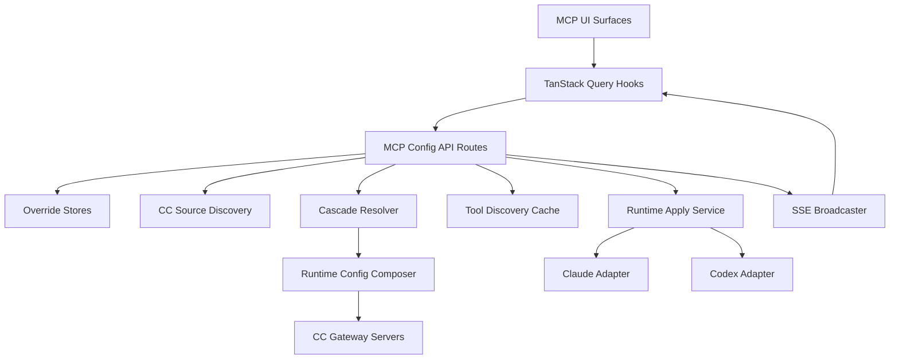
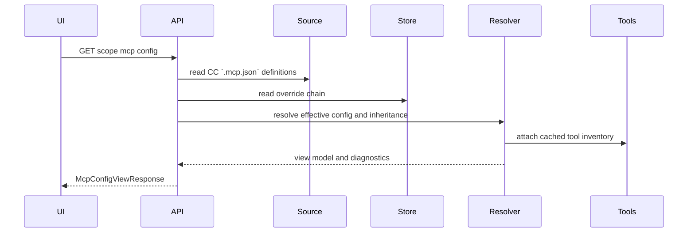
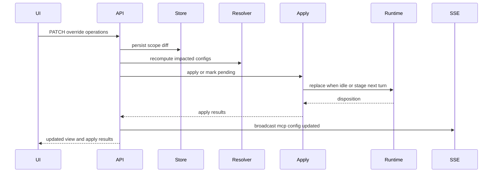
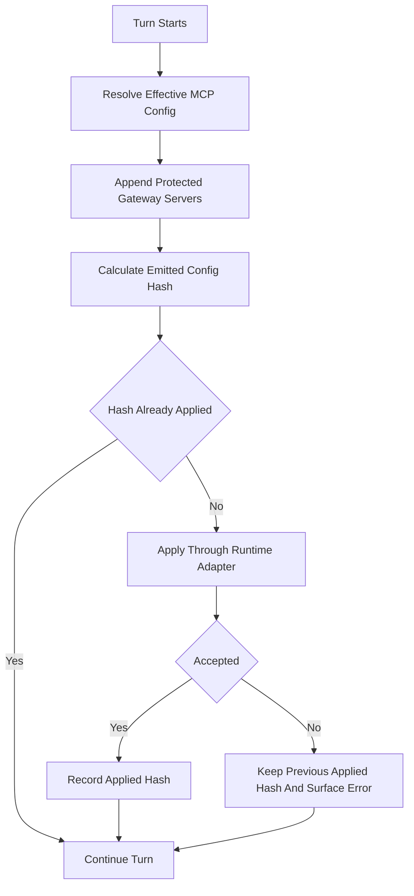
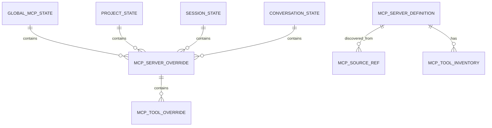
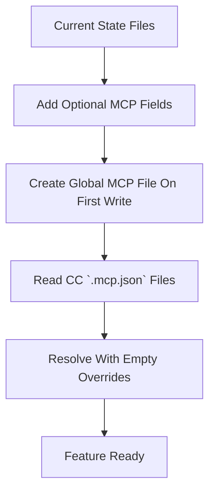

# Design: MCP Configuration

## Approved managed-capabilities amendment — 22 September 2026

Alex's **“Approved. Implement the design.”** in conversation `3526f6a0-a0a8-4406-8539-e4275afdcd81` authorizes the [revised proposal](../../../docs/reports/2026-09-22-managed-capabilities-design-proposal.md). This section and the amended [requirements](requirements.md) govern the current delivery. The remaining sections record the earlier implementation baseline and apply only where consistent with this amendment; historical gate records are unchanged.

| Earlier design promise | Approved replacement |
|---|---|
| Identical per-tool control and Claude permission-layer fallback | Prefer verified native omission. Unsupported controls preserve availability and report their actual effect; no new denial hook solely for context control. |
| Claude idle application and `live-when-idle` scheduling | Save immediately, re-read at turn start, and use the adapter's supported native update. Retire idle-only scheduling once equivalent behavior is covered. Creation-only exclusions keep next-conversation timing. |
| Staging or constructing options means applied | Only successful runtime application or an exact-hash input-acceptance receipt advances applied state. Older receipts cannot clear newer preferences. |
| Strict CC authority as a permanent target | Keep managed `.mcp.json` definitions, but make native/plugin availability a bounded follow-up after known-disable, precedence, and duplicate-delivery verification. Temporary suppression is disclosed. |
| Shared registry owns provider MCP facts | Backend descriptors own support, native policy, and timing; the MCP domain keeps a neutral compatibility projection. |
| Session-shaped conversation MCP scope | Carry `ConversationTarget` through routes, queries, SSE, persistence, runtime lookup, and fanout. Project conversations use global → project → conversation and their own existing state. |

Reuse the existing portable composer, state-store records, conversation lifecycle, and application-result contract. Keep requested, accepted, and observed state distinct. `deferred_to_next_turn` remains pending; a mixed MCP update that contains creation-only exclusions waits in full for that later boundary. Unsupported portions settle as identified limitations. Unexpected failure preserves the previous accepted state and the requested preference. Capability-kind receipts remain separate because a runtime may accept new MCP while retaining frozen skills.

Claude uses supported `setMcpServers` replacement at turn start without closing its process or losing background work. Native `disallowedTools` omission is advertised only after exact-name verification under the real launch mode. Translate supported timeouts; unsupported optional tuning may be omitted with a diagnostic while retaining a valid server. Codex uses its existing native per-turn options and filtering. Cursor retains its bridge and existing next-turn MCP timing. No global runtime-recreation policy or new recovery loop is introduced.

The existing drawer uses typed control support and timing, with one subtle info control for adapter-authored limitations (hover, focus, click, tap). Unsupported individual controls are read-only and resettable; delayed controls stay editable. Failures needing action remain visible; ordinary success and permanent limitations add no status noise. Missing delivery evidence is unknown, not off.

The first delivery covers scope isolation, truthful receipts, ownership consolidation, turn-start scheduling, affected discovery/translation correctness, and limitation UI. Native/plugin MCP is a follow-up with one delivery owner per native identity and existing CC/project precedence. Generic plugin importing, automatic synchronization, Codex legacy SSE bridging, plugin emulation, and elaborate suppression/recovery remain deferred. Verification covers durable sibling isolation, both conversation kinds in fanout, A/B receipt ordering, failed/deferred/partial acceptance, and live checks only for control effects actually advertised.

## Overview

This feature delivers first-class MCP server and tool configuration to Command Center users who run Claude and Codex conversations. Users can discover configured MCP servers, override server and tool availability at global, project, session, and conversation scopes, and have those changes apply to the agent's next turn through Command Center's own unified MCP configuration files.

The implementation adds a backend-neutral MCP domain layer that reads two CC-owned `.mcp.json` files — global (`<CC_CONFIG_DIR>/.mcp.json`) and project (the active worktree's `.mcp.json`) — stores Command Center overrides, resolves inherited state, and emits a portable MCP runtime config through existing Claude and Codex backend adapters. The UI uses one resolved view model across global, project, session, and conversation surfaces so backend differences remain at the adapter boundary.

### Goals
- Provide hierarchical MCP server and tool toggles for Claude and Codex.
- Apply mid-conversation changes safely on the next turn, with clear pending state.
- Treat CC-owned `.mcp.json` files as the single source of truth for server definitions at each scope.
- Keep storage, APIs, and UI backend-neutral.
- Protect Command Center injected MCP gateway servers from accidental disablement or ID collision.

### Non-Goals
- Reading, migrating, or falling back to backend-native MCP source files (e.g. `.claude/settings.json`, `.claude/settings.local.json`, `.codex/config.toml`).
- Proxying every MCP tool call through a new Command Center gateway.
- Changing one-shot task runner defaults beyond preserving existing caller-supplied portable MCP tooling.
- Supporting remote shared configuration across multiple Command Center installations.

## Architecture

### Existing Architecture Analysis
- Agent backends already share `ConversationBackendRuntime.applyPortableMcpConfig` and `ConversationToolingOverrides`.
- Claude currently translates portable MCP config and can call `query.setMcpServers`.
- Codex currently stages translated MCP config and applies it when creating the next turn.
- `src/lib/mcp-gateway/portable-config.ts` owns CC-injected session, graph workflow, and workflow draft server definitions.
- `src/lib/state-store/` is the persistence boundary for project, session, and conversation state.
- `src/lib/mcp/schemas.ts` is the domain schema boundary for MCP-specific persistent state and SSE events (schemas are per-domain).
- `/api/projects/[name]/sessions/[session]/mcp` is already the streamable HTTP MCP protocol endpoint and must remain unchanged.

### Architecture Pattern & Boundary Map

**Architecture Integration**:
- Selected pattern: backend-neutral domain core with source, storage, and backend adapter ports.
- Domain boundary: `src/lib/mcp/` owns discovery, override resolution, tool inventory, emitted config composition, route handler logic, and runtime application policy.
- Backend boundary: Claude and Codex translators remain the only places that know backend-specific SDK config shapes.
- UI boundary: React components and hooks consume `McpConfigViewResponse` only.
- Steering compliance: state schemas stay in the relevant domain's `src/lib/<domain>/schemas.ts` (schemas are per-domain), route handlers remain thin, and new code uses structured logging via `createLogger`.



### Technology Stack

| Layer | Choice / Version | Role in Feature | Notes |
|-------|------------------|-----------------|-------|
| Frontend | React 19, Next.js 16, TanStack Query | Scope-aware MCP views, mutations, SSE invalidation | Reuse `src/components/mcp/` primitives |
| Backend | Next.js route handlers, TypeScript strict mode, Zod v4 | API routes, schemas, validation, state mutation | Route handlers use injected dependencies for tests |
| Data / Storage | Existing state JSON plus new global MCP override JSON | Persist override diffs and runtime apply state | CC-owned `.mcp.json` files are the only discovery sources |
| Messaging / Events | Existing SSE broadcaster | Cross-client invalidation and pending-state updates | Add `mcp-config-updated` and `mcp-tools-updated` |
| Runtime | Claude Agent SDK, Codex SDK, MCP SDK | Backend emission and tool discovery | Tool discovery uses runtime status or direct MCP probe |
| Config Parsing | JSON | Parse `<CC_CONFIG_DIR>/.mcp.json` and each worktree's `.mcp.json` | No backend-native source files are parsed |

## System Flows

### Configuration Read Flow



The read path is side-effect free except for optional tool-cache refreshes triggered by explicit tool discovery calls. Missing or malformed source files become diagnostics and do not prevent valid sources from rendering.

### Mid-Conversation Update Flow



Changes persist immediately. If the target conversation is running, the active turn is not interrupted; the conversation state records a pending config hash and the next turn applies the latest resolved config.

### Concurrency & Ordering

The override store serializes writes per scope through existing state mutators. To prevent races between concurrent PATCHes and mid-turn applies:

- **Hash computed under lock.** `effectiveConfigHash` is computed inside the state mutator's critical section from the post-write override chain plus current source discovery. Concurrent PATCHes at different levels (e.g., project and conversation) affecting the same conversation therefore produce strictly ordered hashes.
- **409 precisely defined.** The API returns 409 when the client-supplied `expectedEffectiveConfigHash` (carried on PATCH requests) does not match the hash computed immediately before the write, or when a scope in the parent chain has changed `effectiveConfigHash` since the client's last read at the target scope.
- **Pending-clear is hash-matched.** `applyAtTurnStart` clears `pendingConfigHash` only when the hash it successfully applies equals the current `pendingConfigHash`. If a later PATCH arrives between resolution and apply, the new `pendingConfigHash` survives and the subsequent turn re-applies.
- **Single writer of `lastAppliedConfigHash`.** Only `applyAtTurnStart` mutates `lastAppliedConfigHash`. `applyAfterOverrideChange` writes only `pendingConfigHash` and `pendingServerKeys`, never `lastAppliedConfigHash`.

### Turn Start Apply Flow



The emitted config hash includes user-resolved MCP definitions plus protected injected gateway servers. Hash values are used for change detection only and are not displayed.

## Requirements Traceability

| Requirement | Summary | Components | Interfaces | Flows |
|-------------|---------|------------|------------|-------|
| 1.1 | Four configuration levels exist | Override Store, Resolver, API | `McpConfigLevel`, `McpOverrides` | Read Flow |
| 1.2 | Cascade global to conversation | Resolver | `ResolvedMcpConfig` | Read Flow |
| 1.3 | Lower disable overrides parent | Resolver, Runtime Composer | `McpServerOverride.enabled` | Turn Start Flow |
| 1.4 | Same representation for Claude and Codex | Domain Model, Translators | `McpCanonicalServerConfig` | Turn Start Flow |
| 1.5 | Persist diffs only | Override Store | `McpOverrides` | Update Flow |
| 1.6 | Show inheritance status | Resolver, UI Hooks | `McpInheritanceStatus` | Read Flow |
| 2.1 | Discover available servers | Source Discovery | `McpServerDefinition` | Read Flow |
| 2.2 | Disable server at scope | API, Override Store | `set-server-enabled` | Update Flow |
| 2.3 | Disabled server unavailable next turn | Composer, Translators | `enabled: false` emission policy | Turn Start Flow |
| 2.4 | Re-enable restores definition | Resolver, Override Store | `McpServerOverride.enabled` | Update Flow |
| 2.5 | Disabled server remains visible | Resolver, UI | `McpServerView.enabled` | Read Flow |
| 3.1 | Toggling inherited promotes override | API Operations | `set-server-enabled` | Update Flow |
| 3.2 | Reset returns inherited state | API Operations | `reset-server` | Update Flow |
| 3.3 | Parent changes propagate | Resolver | Scope cascade | Read Flow |
| 3.4 | Source scope visible | Resolver, UI | `McpSourceRef` | Read Flow |
| 4.1 | View server tools | Tool Discovery, UI | `McpToolView` | Read Flow |
| 4.2 | Disable individual tool | API, Override Store | `set-tool-enabled` | Update Flow |
| 4.3 | Disabled tool unavailable next turn | Composer, Translators, Permission Fallback | `ResolvedToolFilter` | Turn Start Flow |
| 4.4 | Disabled tools remain visible | Resolver, UI | `McpToolView.enabled` | Read Flow |
| 4.5 | Re-enable tool | API, Resolver | `McpToolOverride.enabled` | Update Flow |
| 4.6 | Use native tool controls when available | Capability Registry, Translators | `McpBackendCapabilities` | Turn Start Flow |
| 4.7 | Permission fallback denies without ending turn | Claude Tool Filter Fallback | `McpFilterLookup`, `canUseTool` deny disposition | Turn Start Flow |
| 4.8 | Show orphaned tool overrides | Resolver, UI | `McpToolView.orphaned` | Read Flow |
| 5.1 | Discover tools dynamically | Tool Discovery | `McpToolDiscoveryService` | Read Flow |
| 5.2 | Cache stable signatures | Tool Discovery Cache | `configSignature` | Read Flow |
| 5.3 | Refresh when config changes | Source Discovery, Tool Discovery | Signature keys | Read Flow |
| 5.4 | Force refresh | API | tool refresh endpoint | Read Flow |
| 5.5 | Per-server loading state | Tool Discovery, UI | `ToolDiscoveryState` | Read Flow |
| 5.6 | Per-server errors do not block others | Tool Discovery, Resolver | `McpDiagnostic` | Read Flow |
| 6.1 | Persist while running | API, Override Store | PATCH operations | Update Flow |
| 6.2 | Do not interrupt active turn | Runtime Apply Service | Apply disposition | Update Flow |
| 6.3 | Latest config next turn | Runtime Apply Service | `McpRuntimeApplicationState` | Turn Start Flow |
| 6.4 | Pending indicator | Runtime Apply Service, UI | `pendingConfigHash` | Update Flow |
| 6.5 | Live replace when safe | Claude Adapter | `setMcpServers` | Update Flow |
| 6.6 | Reconstruct for backends without live replace | Codex Adapter | staged config | Turn Start Flow |
| 6.7 | Preserve previous applied config on failure | Runtime Apply Service | `lastAppliedConfigHash` | Turn Start Flow |
| 7.1 | Read global `.mcp.json` from `<CC_CONFIG_DIR>` | Source Discovery | CC global source | Read Flow |
| 7.2 | Read project `.mcp.json` from worktree root | Source Discovery | CC project source | Read Flow |
| 7.3 | Project overrides global on same `serverKey` | Source Discovery, Resolver | scope precedence | Read Flow |
| 7.4 | Tag resolved rows with source scope (global or project) | Source Discovery, UI | `McpSourceRef.scope` | Read Flow |
| 7.5 | Surface malformed or missing files per scope | Source Discovery | `McpDiagnostic` | Read Flow |
| 7.6 | Omit orphaned server overrides from emission | Resolver, Composer | `orphaned` diagnostics | Turn Start Flow |
| 7.7 | Never read or fall back to backend-native source files | Source Discovery | unified CC `.mcp.json` only | Read Flow |
| 8.1 | Generic interface | Domain Model | `McpBackendId`, canonical config | All |
| 8.2 | Capability registry | Capability Registry | `McpBackendCapabilities` | Turn Start Flow |
| 8.3 | Translators at emission boundary | Backend Translators | translator contracts | Turn Start Flow |
| 8.4 | Storage and UI canonical | Store, UI Hooks | `McpConfigViewResponse` | Read Flow |
| 8.5 | Future backend extension points | Source, Capabilities, Translators | adapter interfaces | All |
| 9.1 | Injected gateway servers available | Runtime Composer | protected configs | Turn Start Flow |
| 9.2 | Injected servers not togglable | Resolver, UI | `reserved: true` | Read Flow |
| 9.3 | Preserve injected on ID collision | Runtime Composer | collision diagnostics | Turn Start Flow |
| 10.1 | Global config page surface | UI Wiring | global hook | Read Flow |
| 10.2 | Project modal surface | UI Wiring | project hook | Read Flow |
| 10.3 | Session info strip surface | UI Wiring | session hook | Read Flow |
| 10.4 | Details popover surface | UI Wiring | session hook | Read Flow |
| 10.5 | Conversation prompt toolbar surface | UI Wiring | conversation hook | Read Flow |
| 10.6 | Consistent components | UI Components | shared props | Read Flow |
| 10.7 | Compatibility shown without branching | Resolver, UI | capability diagnostics | Read Flow |
| 11.1 | Broadcast updates | SSE Broadcaster | `mcp-config-updated` | Update Flow |
| 11.2 | Other clients update | Notification Listener | query invalidation | Update Flow |
| 11.3 | Reconnect refreshes full state | Notification Listener | reconnect invalidation | Read Flow |

## Components and Interfaces

| Component | Domain / Layer | Intent | Req Coverage | Key Dependencies | Contracts |
|-----------|----------------|--------|--------------|------------------|-----------|
| MCP Source Discovery | Backend services | Read CC-owned `.mcp.json` files (global + project) into canonical server definitions | 2, 7, 8 | File system, JSON | Service |
| MCP Override Store | Backend services | Persist global, project, session, and conversation override diffs | 1, 3, 6, 8 | `src/lib/state-store/`, config dir | Service, State |
| MCP Cascade Resolver | Domain core | Merge sources and overrides into effective config and view model | 1, 2, 3, 4, 7, 8, 9, 10 | Source Discovery, Override Store, Tool Discovery | Service |
| MCP Tool Discovery | Backend services | Discover and cache tool inventories per server | 4, 5, 7 | MCP SDK, Claude runtime status | Service, State |
| MCP Capability Registry | Backend services | Describe backend MCP support and limitations | 4, 6, 8, 10 | Claude adapter, Codex adapter | Service |
| MCP Runtime Composer | Domain core | Build emitted config including protected gateway servers | 2, 4, 6, 8, 9 | Resolver, Gateway builders | Service |
| Claude Tool Filter Fallback | Backend services | Enforce per-tool allow/deny on Claude servers without native policy via `canUseTool` | 4 | Resolver, Claude runtime, `createLogger` | Service |
| MCP Runtime Apply Service | Backend services | Apply resolved config to active or next-turn conversation runtime | 6, 8, 11 | Conversation runtimes, state mutators | Service, State |
| MCP API Route Handlers | API | Expose scope reads, mutations, and tool refresh | 1 through 11 | Domain services, SSE | API |
| MCP UI Data Hooks | Frontend | Fetch views, perform mutations, invalidate on SSE | 1 through 11 | TanStack Query, NotificationListener | State |
| MCP UI Surface Wiring | Frontend | Insert shared MCP controls into required locations | 10 | Existing MCP components | UI |

### Backend Services

#### MCP Source Discovery

| Field | Detail |
|-------|--------|
| Intent | Read the two CC-owned `.mcp.json` files (global and project) into canonical server definitions |
| Requirements | 2.1, 7.1, 7.2, 7.3, 7.4, 7.5, 7.6, 7.7, 8.5 |

**Responsibilities & Constraints**
- Read the global `.mcp.json` at `<CC_CONFIG_DIR>/.mcp.json`.
- Read the project `.mcp.json` at the active worktree's repository root when a worktree is available.
- When a `serverKey` is present in both scopes, treat the project entry as an override of the global entry.
- Parse valid definitions into canonical server definitions and tag each row with its originating scope (`global` or `project`).
- Return diagnostics for missing, malformed, or unreadable files per scope without discarding the other scope.
- Redact environment values, bearer tokens, and headers in all API views and logs.
- Do not read, migrate, or fall back to backend-native MCP source files (Claude `.mcp.json`, `.claude/settings.json`, `.claude/settings.local.json`, Codex `.codex/config.toml`).

**Dependencies**
- Inbound: MCP API Route Handlers - request source definitions for a scope (P0)
- Outbound: File system - read the two CC-owned `.mcp.json` files (P0)
- Outbound: `createLogger` - structured diagnostics without secret values (P0)

**Contracts**: Service [x] / API [ ] / Event [ ] / Batch [ ] / State [ ]

##### Service Interface
```typescript
interface McpSourceDiscoveryService {
  discoverSources(input: McpSourceDiscoveryInput): Promise<McpSourceDiscoveryResult>;
}

interface McpSourceDiscoveryInput {
  globalConfigPath: string;
  worktreePath?: string;
}

interface McpSourceDiscoveryResult {
  servers: readonly McpServerDefinition[];
  diagnostics: readonly McpDiagnostic[];
  sourceFiles: readonly McpSourceFileStatus[];
}
```

- Preconditions: `worktreePath` must stay inside the active session worktree when supplied.
- Postconditions: returned server definitions contain no unredacted secret values in display fields.
- Invariants: a malformed file produces diagnostics but does not discard valid files.

#### MCP Override Store

| Field | Detail |
|-------|--------|
| Intent | Persist only user-specified overrides at each configuration level |
| Requirements | 1.1, 1.2, 1.5, 3.1, 3.2, 6.1, 8.4 |

**Responsibilities & Constraints**
- Store global overrides in an atomic `mcp-global.json` file under the Command Center config directory.
- Store project, session, and conversation overrides in existing state records.
- Persist only explicit differences: server enabled overrides and per-tool enabled overrides.
- Remove empty override records after reset operations.
- Use existing state mutation helpers for lower scopes.

**Dependencies**
- Inbound: MCP API Route Handlers - read and patch overrides (P0)
- Outbound: `src/lib/state-store/` - project, session, and conversation mutation (P0)
- Outbound: config directory helpers - global MCP override file location (P0)

**Contracts**: Service [x] / API [ ] / Event [ ] / Batch [ ] / State [x]

##### Service Interface
```typescript
interface McpOverrideStore {
  readOverrides(input: McpOverrideReadInput): Promise<McpOverrideChain>;
  patchOverrides(input: McpOverridePatchInput): Promise<McpOverridePatchResult>;
}

interface McpOverrideReadInput {
  level: McpConfigLevel;
  projectName?: string;
  sessionName?: string;
  conversationId?: string;
}

interface McpOverridePatchInput extends McpOverrideReadInput {
  operations: readonly McpOverrideOperation[];
}

interface McpOverridePatchResult {
  chain: McpOverrideChain;
  changedServerKeys: readonly string[];
}
```

##### State Management
- State model: `mcpOverrides?: McpOverrides` on project, session, and conversation records; `mcp-global.json` for global records.
- Persistence & consistency: one patch request mutates one target scope atomically.
- Concurrency strategy: state mutators remain the write serialization boundary.

#### MCP Cascade Resolver

| Field | Detail |
|-------|--------|
| Intent | Combine CC-owned `.mcp.json` definitions with the scope override chain into effective server and tool state |
| Requirements | 1.2, 1.3, 1.6, 2.5, 3.3, 3.4, 4.4, 4.8, 7.5, 8.1, 8.4, 9.2, 10.7 |

**Responsibilities & Constraints**
- Apply override cascade in order: global, project, session, conversation.
- Distinguish the stable `serverKey` from each backend's runtime server identifier produced by the translators.
- Treat the project `.mcp.json` entry as an override of the global entry when both scopes declare the same `serverKey`.
- Keep disabled and orphaned rows visible in the view model.
- Exclude orphaned server overrides from emitted runtime config.
- Mark CC-injected gateway servers as reserved and non-togglable if they are shown.

**Dependencies**
- Inbound: API Route Handlers, Runtime Composer - resolve views and emitted config (P0)
- Outbound: Source Discovery - CC-owned `.mcp.json` server definitions (P0)
- Outbound: Override Store - scope chain (P0)
- Outbound: Tool Discovery - cached tool inventory (P1 for server toggles, P0 for tool UI) 

**Contracts**: Service [x] / API [ ] / Event [ ] / Batch [ ] / State [ ]

##### Service Interface
```typescript
interface McpCascadeResolver {
  resolveView(input: McpResolveViewInput): Promise<McpConfigViewResponse>;
  resolveRuntimeConfig(input: McpResolveRuntimeInput): Promise<McpResolvedRuntimeConfig>;
}

interface McpResolveViewInput {
  level: McpConfigLevel;
  projectName?: string;
  sessionName?: string;
  conversationId?: string;
}

interface McpResolveRuntimeInput {
  projectName: string;
  sessionName: string;
  conversationId: string;
  backend: McpBackendId;
  transientTooling?: ConversationToolingOverrides;
}
```

- Preconditions: the requested scope identifiers must match the requested level.
- Postconditions: output includes inheritance status for every displayed server and tool.
- Invariants: source definitions are never modified by resolver operations.

##### Orphan Detection & Filter Emission

- The composer emits `enabledTools`/`disabledTools` **verbatim** from the override chain, regardless of tool-discovery state. The backend is the source of truth for tool existence; emitting filter names for tools the backend does not recognize is safe (Codex tolerates unknown names; Claude's `canUseTool` fallback only denies tools that are actually invoked).
- The resolver marks a tool override as `orphaned` **only when** the server's tool-discovery state is `ready` or `stale` **and** the named tool is absent from the discovered inventory. When discovery state is `not-loaded`, `loading`, or `error`, tool overrides render without the orphaned flag.
- A server override is marked `orphaned` when source discovery returns no definition for its `serverKey` at resolve time (no dependency on tool discovery).
- Completion of tool discovery for a server invalidates scope queries for every level that contains overrides referencing that server — both the tool-inventory cache and the resolved view must refresh so orphan flags appear.

#### MCP Tool Discovery

| Field | Detail |
|-------|--------|
| Intent | Discover server tools lazily and cache results by server and config signature |
| Requirements | 4.1, 5.1, 5.2, 5.3, 5.4, 5.5, 5.6 |

**Responsibilities & Constraints**
- Prefer Claude runtime `mcpServerStatus()` for active Claude conversation scope when available.
- Use MCP SDK direct probes for Codex, inactive runtimes, and manual refresh.
- Cache results by `serverKey` and `configSignature`.
- Provide per-server loading, success, stale, and error state.
- Sanitize process stderr and exception messages before exposing diagnostics.

**Dependencies**
- Inbound: Resolver, Tool API Routes - attach inventory and refresh tools (P0)
- Outbound: MCP SDK `Client` - list tools through direct transports (P0)
- Outbound: Claude runtime registry - runtime status discovery (P1)
- Outbound: `createLogger` - structured discovery events (P0)

**Contracts**: Service [x] / API [ ] / Event [ ] / Batch [ ] / State [x]

##### Service Interface
```typescript
interface McpToolDiscoveryService {
  getCachedTools(input: McpToolInventoryInput): Promise<McpToolInventoryResult>;
  refreshTools(input: McpToolInventoryInput): Promise<McpToolInventoryResult>;
}

interface McpToolInventoryInput {
  level: McpConfigLevel;
  serverKey: string;
  backend: McpBackendId;
  server: McpCanonicalServerConfig;
  configSignature: string;
  conversationId?: string;
}

interface McpToolInventoryResult {
  state: ToolDiscoveryState;
  tools: readonly McpDiscoveredTool[];
  diagnostics: readonly McpDiagnostic[];
  refreshedAt?: string;
}
```

#### MCP Capability Registry

| Field | Detail |
|-------|--------|
| Intent | Centralize backend support declarations for server disable, dynamic apply, tool filtering, and discovery |
| Requirements | 4.6, 4.7, 6.5, 6.6, 8.2, 8.5, 10.7 |

**Responsibilities & Constraints**
- Publish typed capability metadata for Claude and Codex.
- Keep runtime emission decisions and authoritative-runtime checks driven by the same registry.
- Avoid backend conditionals in storage and public UI contracts.

**Contracts**: Service [x] / API [ ] / Event [ ] / Batch [ ] / State [ ]

##### Service Interface
```typescript
interface McpCapabilityRegistry {
  getCapabilities(backend: McpBackendId): McpBackendCapabilities;
}

interface McpBackendCapabilities {
  backend: McpBackendId;
  strictAuthoritativeConfig: boolean;
  serverDisable: "native" | "omit" | "unsupported";
  betweenTurnApply: "live-when-idle" | "next-turn" | "unsupported";
  toolFiltering: McpToolFilteringCapability;
  toolDiscovery: McpToolDiscoveryCapability;
}
```

#### MCP Runtime Composer

| Field | Detail |
|-------|--------|
| Intent | Produce the final backend-neutral MCP server list for an agent turn |
| Requirements | 2.3, 4.3, 6.3, 7.5, 8.3, 9.1, 9.3 |

**Responsibilities & Constraints**
- Start with resolved user-configured MCP servers for the active backend.
- Omit orphaned server overrides from the emitted set.
- Preserve disabled Codex servers as `enabled: false` so Codex does not fall back to native TOML.
- Append CC-injected gateway servers after user config and protect their IDs.
- Return diagnostics for collisions or unsupported backend features.

**Dependencies**
- Inbound: Runtime Apply Service, conversation actor implementations (P0)
- Outbound: Resolver - user-resolved runtime config (P0)
- Outbound: Gateway builders - protected CC-injected servers (P0)
- Outbound: Backend translators - final SDK config (P0)

**Contracts**: Service [x] / API [ ] / Event [ ] / Batch [ ] / State [ ]

#### Claude Tool Filter Fallback

| Field | Detail |
|-------|--------|
| Intent | Enforce per-tool allow/deny on Claude servers without native tool policy (primarily stdio) |
| Requirements | 4.5, 4.6, 4.7 |

**Responsibilities & Constraints**
- Runs as the **first** check inside Claude's `canUseTool`, **before** any existing Command Center tool handler (including the `AskUserQuestion` policy in `src/lib/agent-backends/claude/native-tooling.ts`). The MCP filter decision is stable and independent of which downstream handler is registered.
- Consults the resolver via an injected `McpFilterLookup` dep. Tests supply deterministic lookups; the handler does not import resolver state directly.
- Matches the invoked tool name to its `serverKey` and compares against the resolver's effective `enabledTools`/`disabledTools` for that conversation. Tools whose `serverKey` cannot be resolved (e.g., non-MCP tools) pass through unchanged.
- On denial, returns the SDK's `deny` disposition with `interrupt: false` and message `"Tool disabled by MCP configuration"`. The turn is not terminated and the agent receives the denial as a normal tool result (Req 4.7).
- Logs every denial through `createLogger("mcp.tool-denial")` with `serverKey`, `toolName`, and resolver scope. Never logs tool input payload.

**Dependencies**
- Inbound: Claude `canUseTool` hook (P0)
- Outbound: Resolver via `McpFilterLookup` — effective filter per conversation (P0)
- Outbound: `createLogger` — denial events (P0)

**Contracts**: Service [x] / API [ ] / Event [ ] / Batch [ ] / State [ ]

##### Service Interface
```typescript
interface McpFilterLookup {
  isToolAllowed(input: {
    conversationId: string;
    serverKey: string;
    toolName: string;
  }): { allowed: true } | { allowed: false; reason: "server-disabled" | "tool-disabled" | "tool-not-in-allowlist" };
}
```

- Preconditions: caller supplies a `conversationId` that matches the active Claude runtime; non-MCP tool names (no resolvable `serverKey`) bypass the filter.
- Postconditions: a `deny` response carries `interrupt: false` and a sanitized reason; no secret or payload data appears in logs or denial messages.
- Invariants: this filter runs before any other `canUseTool` branch and never mutates its input.

#### MCP Runtime Apply Service

| Field | Detail |
|-------|--------|
| Intent | Apply or defer resolved MCP runtime config without interrupting active turns |
| Requirements | 6.1, 6.2, 6.3, 6.4, 6.5, 6.6, 6.7, 11.1 |

**Responsibilities & Constraints**
- Compute emitted config hash for each impacted conversation.
- If no active runtime exists, record pending state and rely on next turn creation.
- If runtime is active but currently running a turn, record pending state.
- If Claude runtime is idle, call `applyPortableMcpConfig` and record the result.
- If Codex runtime is idle or running, stage config for the next turn.
- Preserve `lastAppliedConfigHash` when apply fails and surface diagnostics.

**Dependencies**
- Inbound: API Route Handlers, conversation actor implementations (P0)
- Outbound: Runtime registry - active backend runtime lookup (P0)
- Outbound: State mutators - pending and applied hash updates (P0)
- Outbound: `createLogger` - apply decisions and failures (P0)

**Contracts**: Service [x] / API [ ] / Event [ ] / Batch [ ] / State [x]

##### Service Interface
```typescript
interface McpRuntimeApplyService {
  applyAfterOverrideChange(input: McpApplyAfterOverrideChangeInput): Promise<McpApplyBatchResult>;
  applyAtTurnStart(input: McpApplyAtTurnStartInput): Promise<McpApplyResult>;
}

interface McpApplyAfterOverrideChangeInput {
  level: McpConfigLevel;
  projectName?: string;
  sessionName?: string;
  conversationId?: string;
  changedServerKeys: readonly string[];
}

interface McpApplyAtTurnStartInput {
  projectName: string;
  sessionName: string;
  conversationId: string;
  backend: McpBackendId;
  transientTooling?: ConversationToolingOverrides;
}
```

### API Layer

#### MCP API Route Handlers

| Field | Detail |
|-------|--------|
| Intent | Provide scope-aware MCP config read, patch, and tool refresh endpoints |
| Requirements | 1 through 11 |

**Responsibilities & Constraints**
- Validate request bodies with Zod schemas in `src/lib/mcp/schemas.ts`.
- Keep route files thin and delegate to factory-created handlers.
- Broadcast SSE events after successful mutations and tool refreshes.
- Use `/mcp-config` route names for scoped resources to avoid the existing MCP gateway route.

**Contracts**: Service [ ] / API [x] / Event [x] / Batch [ ] / State [ ]

##### API Contract
| Method | Endpoint | Request | Response | Errors |
|--------|----------|---------|----------|--------|
| GET | `/api/config/mcp` | none | `McpConfigViewResponse` | 400, 500 |
| PATCH | `/api/config/mcp` | `McpConfigPatchRequest` | `McpConfigPatchResponse` | 400, 409, 422, 500 |
| GET | `/api/projects/[name]/mcp-config` | none | `McpConfigViewResponse` | 400, 404, 500 |
| PATCH | `/api/projects/[name]/mcp-config` | `McpConfigPatchRequest` | `McpConfigPatchResponse` | 400, 404, 409, 422, 500 |
| GET | `/api/projects/[name]/sessions/[session]/mcp-config` | none | `McpConfigViewResponse` | 400, 404, 500 |
| PATCH | `/api/projects/[name]/sessions/[session]/mcp-config` | `McpConfigPatchRequest` | `McpConfigPatchResponse` | 400, 404, 409, 422, 500 |
| GET | `/api/projects/[name]/sessions/[session]/conversations/[conversationId]/mcp-config` | none | `McpConfigViewResponse` | 400, 404, 500 |
| PATCH | `/api/projects/[name]/sessions/[session]/conversations/[conversationId]/mcp-config` | `McpConfigPatchRequest` | `McpConfigPatchResponse` | 400, 404, 409, 422, 500 |
| GET | scoped `/mcp-config/tools/[serverKey]` | none | `McpToolInventoryResult` | 400, 404, 422, 500 |
| POST | scoped `/mcp-config/tools/[serverKey]` | `McpToolRefreshRequest` | `McpToolInventoryResult` | 400, 404, 422, 500 |

##### Event Contract
- Published events:
  - `mcp-config-updated`
  - `mcp-tools-updated`
- Ordering / delivery guarantees: events are best effort and follow the existing SSE delivery model. Clients refresh full scope state after reconnect.

### Frontend

#### MCP UI Data Hooks

| Field | Detail |
|-------|--------|
| Intent | Provide reusable query and mutation hooks for all MCP configuration surfaces |
| Requirements | 1 through 11 |

**Responsibilities & Constraints**
- Build query keys by scope.
- Fetch `McpConfigViewResponse` from the matching endpoint.
- Apply optimistic disabled and pending UI only when the mutation response confirms persistence.
- Invalidate exact scope queries on `mcp-config-updated` and both tool inventory queries and MCP config queries on `mcp-tools-updated`.
- On SSE reconnect, invalidate all MCP query keys.

**Contracts**: Service [ ] / API [ ] / Event [x] / Batch [ ] / State [x]

#### MCP UI Surface Wiring

| Field | Detail |
|-------|--------|
| Intent | Place MCP controls in all required first-class UI surfaces using shared primitives |
| Requirements | 10.1, 10.2, 10.3, 10.4, 10.5, 10.6, 10.7 |

**Implementation Notes**
- Global: add `McpGlobalSection` to `src/app/config/ConfigEditor.tsx`.
- Project: add an MCP button to `src/app/projects/[name]/ProjectActionsBar.tsx` that opens `McpServersModal`.
- Session info strip: add `McpInfoChip` in `src/app/projects/[name]/[session]/SessionDetailPage.tsx`.
- Details popover: extend `InfoDetailsPopover` with an MCP row and open handler.
- Conversation prompt toolbar: add `McpConfigPopover` near backend/model controls.
- Shared UI must render server status, inheritance source, pending application, and diagnostics from the view model.

## Data Models

### Domain Model

```typescript
type McpConfigLevel = "global" | "project" | "session" | "conversation";
type McpBackendId = "claude" | "codex";
type McpDefinitionScope = "global" | "project";
type McpTransport = "stdio" | "streamable-http" | "sse";
type McpInheritanceStatus = "explicit" | "inherited" | "overridden" | "disabled";
type ToolDiscoveryState = "not-loaded" | "loading" | "ready" | "stale" | "error";

interface McpOverrides {
  servers: Record<string, McpServerOverride>;
}

interface McpServerOverride {
  enabled?: boolean;
  tools?: Record<string, McpToolOverride>;
}

interface McpToolOverride {
  enabled?: boolean;
}

interface McpSourceRef {
  scope: McpDefinitionScope;
  filePath: string;
}

interface McpServerDefinition {
  serverKey: string;
  nativeId: string;
  config: McpCanonicalServerConfig;
  sourceRefs: readonly McpSourceRef[];
  configSignature: string;
  reserved: boolean;
  diagnostics: readonly McpDiagnostic[];
}

type McpCanonicalServerConfig =
  | McpCanonicalStdioServerConfig
  | McpCanonicalHttpServerConfig
  | McpCanonicalSseServerConfig;

interface McpCanonicalStdioServerConfig {
  transport: "stdio";
  command: string;
  args?: readonly string[];
  cwd?: string;
  env?: Record<string, string>;
  startupTimeoutSec?: number;
  toolTimeoutSec?: number;
}

interface McpCanonicalHttpServerConfig {
  transport: "streamable-http";
  url: string;
  headers?: Record<string, string>;
  bearerTokenEnvVar?: string;
  startupTimeoutSec?: number;
  toolTimeoutSec?: number;
}

interface McpCanonicalSseServerConfig {
  transport: "sse";
  url: string;
  headers?: Record<string, string>;
}

interface McpDiagnostic {
  severity: "info" | "warning" | "error";
  code: string;
  message: string;
  serverKey?: string;
  sourceRef?: McpSourceRef;
}
```

### Logical Data Model



**Consistency & Integrity**
- Natural key: `serverKey` is the stable Command Center identifier; `nativeId` is the backend emission identifier.
- Source precedence is project over global when the same `serverKey` is defined in both CC-owned `.mcp.json` files. Command Center override precedence is global, project, session, conversation.
- Secret values may participate in internal config signatures but must never be returned through API responses, logs, or public SSE payloads.
- Orphaned server overrides remain visible as diagnostics and are not emitted to runtimes.

### Physical Data Model

Global MCP state is a new JSON file in the Command Center config directory:

```typescript
interface McpGlobalStateFile {
  version: 1;
  overrides: McpOverrides;
  updatedAt: string;
}
```

Existing state schemas gain optional MCP fields:

```typescript
interface ProjectStateMcpFields {
  mcpOverrides?: McpOverrides;
}

interface SessionStateMcpFields {
  mcpOverrides?: McpOverrides;
}

interface ConversationStateMcpFields {
  mcpOverrides?: McpOverrides;
  mcpRuntime?: McpRuntimeApplicationState;
}

interface McpRuntimeApplicationState {
  lastAppliedConfigHash?: string;
  pendingConfigHash?: string;
  pendingServerKeys?: readonly string[];
  lastApplyDisposition?: McpApplyDisposition;
  lastApplyError?: string;
}

type McpApplyDisposition =
  | "applied_now"
  | "deferred_to_next_turn"
  | "no_active_runtime"
  | "unsupported"
  | "rejected";
```

### Data Contracts & Integration

```typescript
interface McpConfigViewResponse {
  level: McpConfigLevel;
  projectName?: string;
  sessionName?: string;
  conversationId?: string;
  servers: readonly McpServerView[];
  diagnostics: readonly McpDiagnostic[];
  pendingServerKeys: readonly string[];
  effectiveConfigHash?: string;
}

interface McpServerView {
  serverKey: string;
  displayName: string;
  nativeId: string;
  transport: McpTransport;
  enabled: boolean;
  inheritanceStatus: McpInheritanceStatus;
  sourceRefs: readonly McpSourceRef[];
  reserved: boolean;
  orphaned: boolean;
  pending: boolean;
  tools: McpToolListView;
  diagnostics: readonly McpDiagnostic[];
}

interface McpToolView {
  name: string;
  enabled: boolean;
  inherited: boolean;
  inheritanceStatus: McpInheritanceStatus;
  orphaned: boolean;
  pending: boolean;
  description?: string;
  inputSchema?: unknown;
}

interface McpConfigPatchRequest {
  operations: readonly McpOverrideOperation[];
  expectedEffectiveConfigHash?: string;
}

type McpOverrideOperation =
  | { type: "set-server-enabled"; serverKey: string; enabled: boolean }
  | { type: "reset-server"; serverKey: string }
  | { type: "set-tool-enabled"; serverKey: string; toolName: string; enabled: boolean }
  | { type: "reset-tool"; serverKey: string; toolName: string };
```

## Error Handling

### Error Strategy
- Validation errors return 400 with field-specific details.
- Scope lookup failures return 404.
- Unsupported backend or capability conflicts return 422 with a diagnostic that can be rendered in the MCP UI.
- Concurrent or stale patch conflicts return 409 when the client-supplied `expectedEffectiveConfigHash` does not match the hash computed immediately before the write, or when a parent-scope hash has changed since the client's last read at the target scope (see "Concurrency & Ordering").
- Tool discovery timeouts return a per-server error state and do not fail the full config view.
- Runtime apply failures keep the previous applied hash, store a sanitized error, and mark the config pending or rejected according to adapter result.

### Error Categories and Responses
- User errors: invalid server key, invalid scope, unknown backend, or reset of a non-existent override returns actionable diagnostics.
- System errors: file read failures, TOML parse failures, MCP probe timeouts, and SDK apply failures are logged with `createLogger` and returned in sanitized form.
- Business logic errors: attempts to disable reserved gateway servers or emit unsupported transports return 422 diagnostics.

### Monitoring
- Log source discovery start, success, and diagnostics by module `mcp.source-discovery`.
- Log override patch operations by scope and changed server keys in `mcp.override-store`.
- Log tool discovery cache hits, refreshes, timeouts, and sanitized errors in `mcp.tool-discovery`.
- Log runtime apply dispositions and failures in `mcp.runtime-apply`.
- Never log environment values, headers, bearer tokens, raw request bodies with secrets, or full config objects.

## Testing Strategy

All implementation tasks should follow red-green TDD: write the failing test, run it, implement the minimum production code, then rerun the focused test before broader checks.

### Unit Tests
- Resolver cascade: global, project, session, and conversation precedence for server enabled state.
- Resolver inheritance: inherited toggle promotion, reset to inherited, and parent propagation.
- Tool overrides: disabled, re-enabled, orphaned, and undiscovered tool behavior.
- Source discovery: valid JSON, malformed source diagnostics, missing files, redaction, and project-over-global precedence.
- Runtime composer: disabled Codex server emission, orphan omission, gateway append, and reserved ID collision.

### Integration Tests
- API GET returns resolved view for each scope.
- API PATCH persists only target-scope diffs and broadcasts `mcp-config-updated`.
- Tool refresh endpoint updates one server inventory and broadcasts `mcp-tools-updated`.
- Claude translator emits strict authoritative config and native tool policies where supported.
- Codex translator emits `enabled`, `enabled_tools`, and `disabled_tools` fields through config object shape.

### E2E / UI Tests
- Global config page shows discovered servers and toggles a server.
- Project and session modals show inheritance source and reset behavior.
- Conversation toolbar shows pending state after a running conversation config change.
- Disabled tools remain visible and can be re-enabled.
- SSE update in one browser tab invalidates and refreshes the matching view in another tab.

### Runtime Verification
- Claude: verify `strictMcpConfig: true`, idle `setMcpServers`, and stdio permission fallback behavior.
- Codex: verify disabled server is not spawned and tool filters are passed to the next turn.
- Tool discovery: verify direct MCP SDK probe against the existing `next-devtools` and `chrome-devtools` server definitions.

## Security Considerations

- CC-owned `.mcp.json` files may include secrets in headers or environment variables. API responses, UI, diagnostics, and logs must redact values while preserving enough metadata to identify the source.
- Direct MCP probes launch configured commands. They must only run for servers discovered in the active CC global or project `.mcp.json` and must use strict timeouts and cleanup.
- The UI must not expose controls that disable CC-injected gateway servers required for Command Center operation.
- No backend-native MCP config file is read or written by this feature.

## Performance & Scalability

- Server source discovery is file-based and cheap; cache only if profiling shows repeated parsing cost.
- Tool discovery is potentially expensive and must be lazy. Do not list tools for every server on initial page load unless cached.
- Tool inventory cache key is `serverKey` and `configSignature`.
- Force refresh bypasses cache for one server only.
- SSE invalidation should target the narrowest query scope possible and fall back to invalidating all MCP queries on reconnect.

## Migration Strategy



No existing MCP override records need migration. Existing project, session, and conversation state remains valid because MCP fields are absent until the user changes MCP configuration.

## Supporting References

- `research.md` - Discovery details and vendor capability notes.
- `gap-analysis.md` - Requirement-to-codebase gap analysis and route collision findings.
- `src/lib/agent-backends/portable-mcp.ts` - Existing portable MCP types.
- `src/lib/agent-backends/mcp-translation.ts` - Backend translator boundary.
- `src/lib/mcp-gateway/portable-config.ts` - Protected CC gateway MCP builders.
- `src/components/mcp/` - Presentational UI component set to wire into data.
