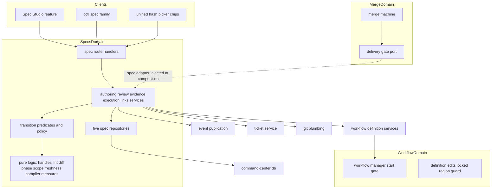
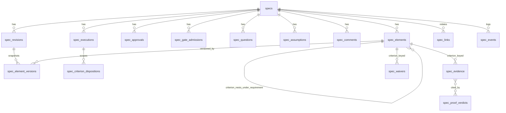
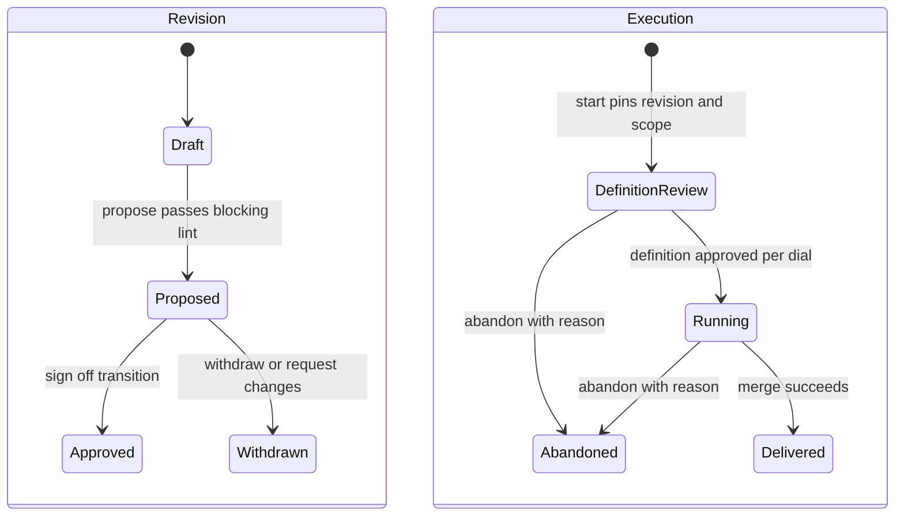
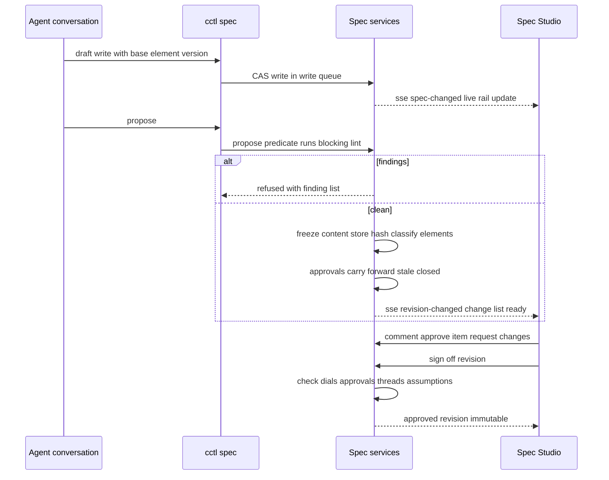
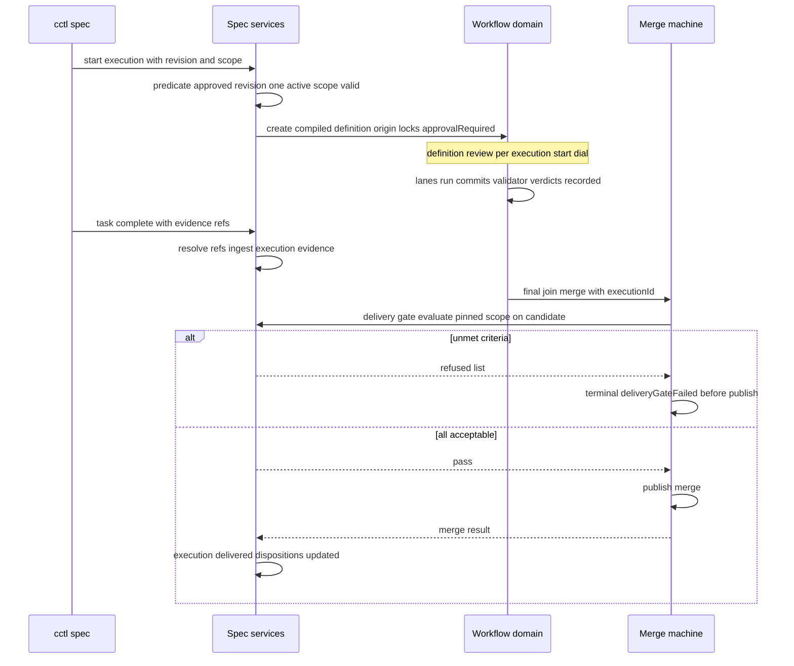

# Technical Design — native-sdd

## Overview

**Purpose**: Native SDD makes spec-driven development a first-class Command Center domain: specs become durable product objects with stable identity, immutable approved revisions, granular human approvals, server-enforced gates, criterion-level evidence with proof verdicts, execution compilation to graph workflows, and scoped delivery gates. This design translates the 21 approved requirements into architecture; product semantics come from `docs/design/native-sdd/01-product-design.md` rev 5 and are not re-decided here.

**Users**: Alex (single operator) reviews and approves in Spec Studio; agents author and operate exclusively through `cctl spec`. Every other CC subsystem (references, tickets, workflows, merge, attention) composes spec state through typed seams.

**Impact**: Adds a new `src/lib/specs/` domain (19 new SQLite tables, 5 repositories), a `cctl spec` command family, top-level `/specs` routes, a registry-based unification of the `#` reference picker, three general graph-workflow capabilities (approvable definitions, origin links, provenance-locked regions), and a delivery-gate port in the merge machine. The existing Kiro skills and `.kiro/specs/` files are untouched.

### Goals

- Ship the full B1–B11 lifecycle spine in V1, satisfying the six affirmed invariants as behavior, not aspiration.
- Make every gate a server-refused transition with a machine-readable refusal (`code` + unmet conditions + next-step instruction) shared verbatim by API, CLI, and UI.
- Key all proof at the acceptance-criterion level; make "what proves this?" answerable from durable state without transcripts.
- Capture §6.1 success-test instrumentation from day one in an append-only event log.

### Non-Goals

- Importing, migrating, or modifying Kiro skills or `.kiro/specs/` content.
- Deferred features: approved-with-conditions, specialist agent advisory reviews, semantic lint, spec-event-driven ticket lifecycle actions, direct human editing of spec content, concurrent disjoint-scope executions, cross-spec links, dependency-propagated approval invalidation, drift detection, living-memory features, multi-agent authoring choreography.
- Any SDD special-casing inside graph-workflow machinery (the three new capabilities are general).

## Operational Envelope

1. **Deployment model**: one operator, one local machine, one Next.js server process over one shared SQLite database (`command-center.db`, WAL) that other branch builds also open; `next build` spawns ~15 workers that all open the DB. Agents run in session worktrees and reach the server via `cctl` over HTTP.
2. **Trust boundary**: the operator's browser is the trusted human surface; `cctl` callers are authenticated agents — trusted as transport, **untrusted for approval semantics** (the server enforces that approval grants, waiver grants, and policy changes are always human acts regardless of caller claims; revision sign-off is a human act exactly when a propose-time dial is Gate — under an all-Notify/Off propose-time policy the propose transaction records the policy-admitted sign-off per 3.4/10.3). Tamper evidence targets accidental/out-of-band modification (other-branch builds, manual DB edits, buggy code), not a cryptographic adversary with DB write access.
3. **Failure model**: durable = committed SQLite transactions survive server restart and crash. Every gate decision, approval, admission, and evidence record must be committed before its effect is observable. An in-flight agent turn or un-submitted UI form may be lost. Concurrent multi-worker DB opens must not corrupt (idempotent floor DDL, additive-only shapes). "Immutable" and "tamper-evident" are interpreted relative to this envelope.

## Boundary Commitments

### This Spec Owns

- The `src/lib/specs/` domain: all spec state, transitions, gate policy, lint, revision diffing, evidence/proof/waivers/dispositions, execution pinning and compilation, export/verify, measures.
- The 19 `spec_*` tables and their five state-store repositories.
- The `cctl spec` command family and its help/contract entries.
- Spec Studio (`src/features/spec-studio/`, routes `/specs` and `/specs/[projectName]/[slug]`) and the spec-comments model.
- The reference-type registry, the unified `#` picker with drill-in, and the four spec reference tag kinds (including migrating conversation/ticket mentions onto the registry at parity).
- The three general workflow-definition capabilities (approval-required, origin, locked regions) — implemented inside the workflow domain, delivered by this spec, with no spec imports.
- The `DeliveryGateEvaluator` port in the merge domain, its spec-side adapter, and `MergeInput.executionId` plumbing.
- Spec SSE event catalog, Active Work / Needs You adapters, spec notification types, and §6.1 instrumentation.

### Out of Boundary

- Kiro skills and `.kiro/specs/` files (no reads as authority, no writes, no import).
- Ticket lifecycle machinery: this spec adds link records, read-through display components, and graduation/materialization actions that call the existing ticket service — it never writes spec-derived values into ticket-owned fields.
- Graph-workflow execution machinery beyond the three general capabilities; merge machinery beyond the gate port and input plumbing.
- Conversation/session/transcript subsystems (consumed as link targets and provenance sources only).
- All deferred features listed in Non-Goals.

### Allowed Dependencies

- `specs` domain → state-store repos + write queue, `events/publication.ts`, git plumbing (`src/lib/git/`), workflow-graph public services (definition create/validate/read), tickets service (graduate/materialize), content-store (source snapshots), notifications service.
- Merge domain defines the `DeliveryGateEvaluator` **port**; the spec adapter is injected at composition (`graph-merge-runner` wiring). Merge code never imports `specs`.
- Workflow domain gains schema fields + guards only; `origin`/`sourceLink` values are opaque strings. Workflow code never imports `specs`.
- Prompt-editor registry entries for spec types may import spec client queries (client-side only).
- UI uses `src/components/ui/` primitives, theme tokens, and the annotation stack; the Claude Design bundle governs interaction semantics, the design system wins visuals.

### Revalidation Triggers

- Workflow definition schema shape changes (`origin`, `lockedRegions`, `approvalRequired`) or definition-edit operation semantics.
- Merge machine phase order, `MergeInput` shape, or halt-reason taxonomy changes.
- `sse-events.ts` union/envelope authoring rules, or the strict-schema envelope behavior.
- Ticket attachment/link schemas or ticket route adapters.
- Reference tag grammar (`ref-parser.ts` / `ref-segments.ts`) or serializer contract.
- `state-db.ts` floor/migration discipline or write-queue semantics.
- Handle grammar changes (breaks chips, CLI, deep links, export format together).

## Architecture

### Existing Architecture Analysis

The integration surfaces are mature and documented in `research.md` (Parts I–II): tickets are the durable-object exemplar (repo recipe, counters, SSE reducer/pending overlay, CLI family); alignment versions are the immutable-content-hash precedent; `graph_workflow_events` is the append-only log precedent; the merge machine is a linear XState pipeline with an injectable-deps pattern; the prompt editor has five hardcoded touchpoints per reference type and two parallel mention extensions; optimistic concurrency has **no precedent** and is new ground. Constraints preserved: single state manager, write-queue serialization, publication-only events, seam ratchet, additive shared-DB discipline, workflow generality.

### Architecture Pattern & Boundary Map



**Key decisions** (full records in `research.md` Part III, D1–D18):

- **D1 Storage**: DB-first structured element spine. `spec_elements` owns stable identity; `spec_element_versions` holds per-revision content as full row-set snapshots (copy-on-write per revision); prose-bearing elements store markdown bodies. Document-primary storage rejected (violates 2.15, 7.1–7.4). This settles the charter's open storage item.
- **D2 Tamper evidence**: SHA-256 over canonical (`stableStringify`) ordered row-set, stored on the revision at propose; verify recomputes and surfaces mismatches.
- **D3 Concurrency**: per-(revision, element) integer versions; CAS inside the write-queue transaction; typed `stale_element` conflict carrying current content.
- **D4 Projections**: phase, requirement status, task work status are pure derivations; only abandonment is stored terminal state.
- **D5 Policy**: preset + sparse per-gate overrides as data on the spec; the floor is encoded in transition predicates, unreachable by any policy value; loosening is a human-only Studio action with hard confirm.
- **D6 Enforcement spine**: one `transitions.ts` predicate module shared by routes, CLI, and the merge-gate adapter; refusals are one shape everywhere.
- **D7 Evidence**: append-only criterion-keyed records with server-resolvability checks; proof verdicts distinct from evidence; pull-based idempotent ingestion from `graph_workflow_events`; freshness via evaluated-state tree hashes + commit ancestry.
- **D10/D11 Compilation & workflow capabilities**: pure compiler onto the existing definition schema; `approvalRequired`, `origin`, `lockedRegions` land as general workflow features enforced at three seams (definition edits, runtime edits, replace).
- **D12 Delivery gate**: merge-machine gate behind an injected port, evaluated on **every entry into publishing** against the candidate being published (`preparedSha`); `executionId?` persisted on the merge job record so land re-entry of a parked candidate stays gated; no-ops without a linked execution.
- **D13 References**: registry-first refactor; unified `#`; `!` ticket shortcut retained; hover/peek via Radix HoverCard.
- **D14 Studio**: top-level routes on the tickets URL precedent; new project-scoped threaded `spec_comments` model; pure re-anchoring with explicit stale/orphaned presentation.
- **D15 Events**: durable `spec_events` appended in the same transaction as each mutation + typed SSE publication after commit; measures computed from the log.
- **D16 Naming**: "spec", "Spec Studio", `cctl spec` adopted as final V1 names.

### Invariants → Mechanisms

| Invariant (charter §3) | Mechanism |
|---|---|
| 1. Stable, worktree-neutral spec/revision identity | UUID identities + per-project slug + `spec_aliases`; all state in the shared DB, none in worktrees |
| 2. Immutable, tamper-evident approved revisions | Repo-level write refusal on non-draft revisions + `content_hash` at propose + verify recompute (D2) |
| 3. Every execution pins revision + scope | `spec_executions.revision_id + scope_json` written at start, immutable thereafter; predicate-enforced (16.8) |
| 4. Worktree-neutral approval/review/evidence/run state | Same shared-DB property; no session-scoped spec state anywhere |
| 5. One authoritative representation per concern | Derived projections (D4), read-through ticket display (15.5), no sync jobs |
| 6. Portable, reviewable, recoverable representation | `cctl spec export` canonical markdown + manifest; `cctl spec verify` (D9) |

### Technology Stack

| Layer | Choice / Version | Role in Feature | Notes |
|-------|------------------|-----------------|-------|
| Data | better-sqlite3 (existing) via state-store | 19 new tables, floor DDL, write queue, multi-table transactions | No `KNOWN_SCHEMA_VERSION` bump (all-additive) |
| Backend | Next.js 16 route handlers + Zod v4 | spec routes, typed refusals | Domain schemas in `src/lib/specs/schemas.ts` |
| Events | `publication.ts` + SSE union | 6 new strict event schemas | Plus durable `spec_events` table |
| CLI | existing cctl contract | `spec` verb family | Help-registry SSOT + contract tests |
| Frontend | React 19, React Query, Zustand, Tailwind v4, radix-ui ^1.6.2, xyflow, recogito stack | Spec Studio, unified picker, chips, traceability graph | HoverCard from existing `radix-ui` package |
| **New dependencies** | **none** | — | Everything composes existing stack |

### Dependency Direction

`schemas.ts` → repos (state-store) → pure logic (`handles`, `lint`, `revision-diff`, `phase`, `policy`, `scope-validation`, `freshness`, `compiler`, `measures`) → `transitions.ts` → services → route handlers / CLI → UI. Imports flow left only. Cross-domain: specs may import workflow/ticket/git **services**; workflow and merge domains never import specs (ports + opaque strings). Violations are review errors and `bun run seams:check` subjects.

## Data Models

### Domain Model

Aggregates and transaction boundaries:

- **Spec** (root): revisions, elements, counters, aliases, policy, questions, assumptions, comments, links. A revision snapshot (create draft, propose, sign-off) is one transaction.
- **Execution**: pinned (revision, scope), dispositions, linked workflow definition/execution. Start is a definition-first two-step protocol — definition written via workflow services, then one SQLite transaction as the authoritative commit point (spec state is SQLite, workflow definitions are JSON files; no transaction spans both — see ExecutionService).
- **Evidence/Proof** (append-only): evidence records, proof verdicts, waivers, task claims.
- **Events** (append-only): every mutation appends typed rows in the same transaction it commits.



### Physical Data Model

All tables are additive floor DDL (`CREATE TABLE IF NOT EXISTS` in `state-db.ts`). JSON columns serialize via `stableStringify`; reads validate with Zod (quarantine unparseable rows per house pattern). Key columns only; timestamps (`created_at` etc.) and indexes implied.

| Table | Key columns | Notes |
|---|---|---|
| `specs` | `id` PK, `project_path`, `slug`, `name`, `gate_policy_json`, `abandoned_at`, `abandoned_reason` | UNIQUE(project_path, slug). Policy = `{preset, overrides?}` |
| `spec_aliases` | PK(`project_path`, `slug`) → `spec_id` | Written on rename; resolution checks specs then aliases (1.6) |
| `spec_counters` | PK(`spec_id`, `scope_key`) → `last_number` | scope_key ∈ `R,D,T,Q,A` or `C:<requirementElementId>` — sections carry no handle (R1.2 defines no section grammar; ordering via `position`); atomic upsert-returning (ticket precedent) |
| `spec_elements` | `id` PK, `spec_id`, `kind` (section, requirement, criterion, decision, task), `number`, `parent_element_id` | Identity registry; stable across revisions (2.6); criterion parent = requirement (2.8) |
| `spec_revisions` | `id` PK, `spec_id`, `number`, `state` (draft, proposed, approved, withdrawn), `authoring_stage` (requirements, design, plan), `based_on_revision_id`, `content_hash`, `proposed_at`, `approved_at` | UNIQUE(spec_id, number); hash set at propose (freeze) and covers `authoring_stage` (stage gates authorization — R2.5 tamper evidence, in export/`verify`); stage is a mandatory parameter on the repo creation APIs — the column default `'plan'` backfills pre-migration rows only (22.9) |
| `spec_element_versions` | PK(`revision_id`, `element_id`), `position`, `payload_json`, `payload_hash`, `element_version` | Full row-set per revision; CAS on `element_version` for draft rows only; removal = row absent in draft |
| `spec_approvals` | `id` PK, `spec_id`, `subject_kind` (requirement, decision, revision, plan), `element_id?`, `revision_id`, `approver`, `granted_at`, `validity` (valid, stale, closed) | Human-only rows (10.1, 10.2) |
| `spec_gate_admissions` | `id` PK, `spec_id`, `gate` (requirements, design, plan, execution_start, delivery), `basis` (human_approval, notify_policy, off_policy), `approval_id?`, `revision_id?`, `execution_id?`, `actor_json` | Every admitted gated transition (10.2) |
| `spec_questions` | `id` PK, `spec_id`, `number`, `element_id?`, `text`, `provenance_json`, `status` (open, answered), `answer`, `answered_at` | Handle `Q<n>` (12.1) |
| `spec_assumptions` | `id` PK, `spec_id`, `number`, `element_id?`, `text`, `proposed_by_json`, `disposition` (proposed, confirmed, rejected, deferred), `disposed_at` | Handle `A<n>` (12.2) |
| `spec_comments` | `id` PK, `spec_id`, `thread_id`, `parent_comment_id?`, `element_id`, `anchor_json`, `revision_id`, `body`, `author_json`, `blocking`, `resolution` (open, resolved, dismissed) | Anchor = sectionId/line/charStart/charEnd/quote/prefix/suffix; original revision preserved (8.6) |
| `spec_evidence` | `id` PK, `spec_id`, `criterion_element_id`, `revision_id`, `kind` (commit, test_run, validator_verdict — narrowed by migration 0009; fresh-DB CHECK matches), `ref_json`, `evaluated_state_json`, `producer_json`, `execution_id?`, `source_event_id?` | Append-only (13.1); `evaluated_state = {commitSha?, relevantPaths[], relevantTreeHash?, surfaceId?}` (13.3; `surfaceId` is retained-historical — no surviving kind reads it); `source_event_id` = ingest idempotency key |
| `spec_proof_verdicts` | `id` PK, `spec_id`, `criterion_element_id`, `revision_id`, `execution_id?`, `verdict_kind` (deterministic_validator, agent_validator, human), `evidence_ids_json`, `verdict_at`, `stale_at?`, `stale_reason?` | Distinct from evidence (13.4); `human` is retained historical value space — no surface records one (13.4) |
| `spec_waivers` | `id` PK, `spec_id`, `criterion_element_id`, `revision_id`, `reason`, `waived_at`, `stale` | Human-only, reason required, per (criterion, revision) (14.2) |
| `spec_criterion_dispositions` | PK(`execution_id`, `criterion_element_id`), `disposition` (in_scope, deferred, waived, delivered_elsewhere), `waiver_id?`, `delivered_by_execution_id?` | Per-scope (14.1); delivered_elsewhere requires a merged execution (14.6) |
| `spec_task_claims` | `id` PK, `spec_id`, `task_element_id`, `execution_id?`, `actor_json`, `evidence_ids_json`, `claimed_at`, `status` (accepted, reopened) | Rejected claims are refused, never stored; reopen feeds rework measure (2.12, 20.1) |
| `spec_executions` | `id` PK, `spec_id`, `revision_id`, `scope_json`, `state` (definition_review, running, delivered, abandoned), `workflow_definition_id`, `workflow_execution_id?`, `session_name?`, `delivered_at?`, `abandoned_reason?` | Pin immutable after start (16.1, 16.8); at most one active per spec enforced in-transaction (16.2) |
| `spec_links` | `id` PK, `spec_id`, `object_kind` (ticket, conversation, session, workflow_execution, merge_job), `object_ref_json`, `direction`, `category` (graduated_from, materialized_from, reference, source), `snapshot_json?`, `element_ids_json?`, `actor_json` | Provenance-bearing (2.16); `snapshot_json` = exact source versions for promotion/graduation (4.5) |
| `spec_events` | `id` AUTOINCREMENT PK, `spec_id`, `occurred_at`, `event_type`, `actor_json`, `payload_json` | Append-only instrumentation log; written in-transaction with each mutation (19.1, 20.1) |

**Element payload schemas** (kind-discriminated union in `schemas.ts`):

- `section`: `{role: intent_problem | intent_outcomes | intent_non_goals | intent_success_measures | intent_constraints | design_narrative | context, title, body}` (markdown body) — 2.3.
- `requirement`: `{statement, priority: must | should | could, risk: high | medium | low}` — criteria are child elements — 2.7.
- `criterion`: `{text, validationStrategy: {kinds: EvidenceKind[], note?}}` — strategy approved with the requirement; `kinds` must include at least one machine-validation kind (`test_run` | `validator_verdict`), refused at write time otherwise — 2.9.
- `decision`: `{title, chosenApproach, rejectedAlternatives: {label, reason}[], reason}` — 2.10.
- `task`: `{title, instructions, tracedRequirementElementIds[], coveredCriterionElementIds[], dependsOnTaskElementIds[], laneGroup?, touchedPaths?[]}` — 2.11, 23.1. `touchedPaths` are normalized repo-relative POSIX prefixes (absolute, `..`, and trailing separators rejected at write; overlap compares whole path segments); `laneGroup` keys are opaque, compared exactly.

### State Machines



Transitions are validated exclusively by `transitions.ts` predicates (3.3, 3.5); every transition appends `spec_events` rows and publishes SSE. Proposing freezes content (hash stored); sign-off is the only entry to Approved (3.4); **request-changes ends the review attempt by marking the proposed revision `withdrawn`** — content and hash preserved immutably — **and opening a new draft revision `based_on` it** (3.3, 8.5): the reviewed snapshot survives for comment-thread anchors (8.6), the 10.5 side-by-side re-approval diff, and the 20.1 re-approval-loop measure, and RevisionDiff shows exactly what changed since the last review attempt. Delivered is entered only from the merge success callback (18.6); Abandoned records a reason and is terminal (3.10). Draft revisions carry an **authoring stage** — requirements → design → plan (R22): draft-write admissibility is stage-only (later-stage element kinds refuse with `stage_blocked`; dials never gate writes, only phrase the instruction), and the stage advances through a recorded transition — sign-off of a stage's revision under a Gate dial, or an explicit revision-scoped `advance` under Notify/Off recorded as a gate admission. Open-draft stage rule: no base → requirements (plan when all three authoring dials resolve combined); based_on approved → next stage capped at plan; based_on withdrawn (request-changes) → the withdrawn revision's stage.

### Transition Ownership

Every transition names its initiator, authorization, predicate, transaction, and idempotency — lifecycle correctness never depends on implementer inference (3.3–3.5, 10.2–10.4, 16.1–16.9, 18.6).

| Transition | Initiator (surface) | Authorization | Predicate | Transaction / records | Idempotency |
|---|---|---|---|---|---|
| Open draft revision (create / amendment) | agent — `cctl spec create --file <first-element>`; links-service promotion/graduation routes through the same stage owner | agent (actor recorded) | editable-phase check + R22 stage rule (stage mandatory at the repo API) | spec + draft revision (authoring stage stamped) + first element in one transaction (amendments copy base + carry the element) + events | slug unique per project; a slug with an editable draft refuses with `slug_taken` (continue via `cctl spec draft`) |
| Draft element write | agent — `cctl spec draft` | agent | stage admissibility (`admitDraftWrite`, 22.2–22.4 — refuses later-stage kinds with `stage_blocked`) + element CAS (7.1) | CAS row update + events (stage refusals record interventions; a refused first element on create returns without an intervention row — no spec exists yet) | retry with refreshed base version (7.3) |
| Advance stage | agent — `cctl spec advance <slug> --from <stage>` | agent; refused where the concluding dial is Gate (propose and obtain sign-off instead) | draft exists; next stage exists; dial Notify/Off; conditional update on (current draft revision id, `--from` stage) | in-place stage bump + gate admission (basis `notify_policy`/`off_policy`) + events, one transaction | identified revision at/past target ⇒ no-op success; any other mismatch ⇒ typed stale-stage conflict carrying current revision and stage |
| Propose | agent — `cctl spec propose` | agent | `propose` (9.2–9.6, 9.3/9.11–9.12 stage-keyed) + 10.4/10.10–10.11 stage-scoped preconditions when absorbing sign-off | freeze + hash + classification + approval-validity updates + propose-time gate admissions; **when every stage-scoped dial (the revision's stage plus modified earlier stages, 10.11) is Notify/Off, the same transaction records the policy-admitted sign-off** — sign-off admission, zero approval rows; a 10.4 precondition failure leaves the revision Proposed with the refusal surfaced | proposing a non-draft refused |
| Approve element | human — Studio | **human-only, always** | `approveElement` | approval row + events | same-subject re-approval refreshes the record |
| Sign off revision | human — Studio, required whenever any **stage-scoped** dial is Gate (all-Notify/Off case is absorbed into propose) | human when Gate; policy admission otherwise | `signOffRevision` (10.4, 10.10–10.11: plan approval iff plan-stage; dials stage-scoped) | revision → approved + sign-off approval/admission for the revision's stage (re-recorded for modified earlier-stage gates) + events | already-approved ⇒ no-op |
| Request changes | human — Studio | human review action | revision Proposed | proposed → withdrawn (content + hash intact) + new draft `based_on` + events | already-withdrawn refused |
| Withdraw | human — Studio | human review action | revision Proposed | withdrawn + events | already-withdrawn refused |
| Execution start | agent — `cctl spec start <slug> --file <scope>` — or human — Studio execution panel | either (actor recorded); the execution-start dial governs **definition approval**, not who initiates (17.3) | `startExecution` (16.2–16.7, 22.8 plan-stage pin, 23.9 dependency embedding) | two-step: definition write (origin idempotency key) → SQLite commit of execution + dispositions + links + events | orphan definition found and reused/replaced by origin key |
| Definition approval | human — workflow surface when dial is Gate; policy admission when Notify/Off | human when Gate | workflow-side approval state (17.3) | admission row + events (spec side) | first-decision-wins (approval-gate precedent) |
| definition_review → running | composition-injected `markRunning(workflowExecutionId)` after workflow start | system (recorded) | execution in definition_review | state advance + events | idempotent; read-path reconciliation covers callback loss |
| Delivered | composition-injected `markDelivered(specExecutionId, mergeHash)` on publish success | system (recorded) | execution running + gate-passed merge | state + proven-and-merged disposition updates + events | idempotent by (specExecutionId, mergeHash); read-path reconciliation covers publish-then-crash |
| Abandon (execution or spec) | agent — `cctl spec abandon <slug or execution> --reason` — or human — Studio | either; reason required (3.10) | target active / non-terminal | terminal state + reason + events | already-terminal refused |
| Waiver grant | human — Studio | **human-only, always** | `grantWaiver` (14.2) | waiver + disposition update + events | duplicate (criterion, revision) refused |
| Policy change | human — Studio hard-confirm | **human-only, always** (11.10) | `changePolicy` | policy update + events, prospective-only | — |

### Derived Projections (`phase.ts`)

| Projection | Formula |
|---|---|
| Spec phase — primary (3.1, 3.2) | Explicit precedence, first match wins: `Abandoned` (stored) → `Executing` (an execution in definition_review/running — 16.2's "active") → `In review` (a proposed revision exists) → `Draft` (an editable draft revision exists) → `Delivered` (every non-removed criterion of the current approved revision proven-and-merged or waived, no delivery pending — 3.7) → `Approved`. Authoring states outrank Delivered/Approved — proposing changes against an approved or delivered spec returns the primary to Draft/In review (3.9), symmetric across both cases |
| Composite return shape (3.6) | The projection returns `{primary, authoringFacet?}`; `authoringFacet` carries the concurrent authoring state whenever it differs from the primary (e.g. Executing with a revision in review) and is **mandated wherever phase renders** — Studio detail header, list badges (8.1), chip hover peek (5.6). A pending review or active run is never hidden; delivery standing under an authoring primary stays visible via the 3.8/3.11 badge |
| Delivery display (3.8, 3.11) | All-waived delivery flagged explicitly; partial progress = `provenCount/totalInScope` roll-up badge, never stored |
| Authoring stage (3.12, 22.1) | `authoringStage?` — a separate optional projection field (not an overload of the `draft \| in_review` facet, which cannot express "Approved · requirements stage"): populated until a plan-stage revision is approved, from the current draft/proposed revision's stage, else the latest approved revision's stage; rendered beside the phase everywhere phase renders |
| Requirement status (2.13) | Projection of (approval validity, criteria coverage, criteria proof states) — computed per render/read |
| Task work status (2.12) | Projection of (execution task events for the pinned run, latest claim + its evidence) — never derived from criterion dispositions |

## System Flows

### Authoring → Review → Sign-off



Gating conditions: propose refusals return the same finding list the lint panel shows (9.10); sign-off requires resolved blocking threads, no rejected-cited assumptions, and dial-configured approvals (10.4) — with the plan approval demanded only for plan-stage revisions and dials consulted stage-scoped (10.10–10.11, R22); fast-path records the combined approval atomically (11.5); Notify/Off admissions write `spec_gate_admissions`, never approvals (10.2).

### Execution → Evidence → Delivery



Gate semantics: the evaluator reads pinned (revision, scope) dispositions/verdicts from spec state — never the definition (18.1, 18.2); acceptable states are valid proof, valid human waiver, or delivered-by-earlier-merged-execution (18.3); deferred criteria are listed, non-blocking (18.5); the gate runs on every entry into publishing against the current prepared candidate (CAS re-prepares are re-gated; persisted-job land re-entry is gated identically); refusal happens before the publish CAS so the parked candidate ref is preserved for repair.

## Components and Interfaces

| Component | Domain/Layer | Intent | Req Coverage | Key Dependencies | Contracts |
|-----------|--------------|--------|--------------|------------------|-----------|
| SpecsRepo | state-store | specs/aliases/counters/elements/revisions/element-versions + CAS | 1, 2, 7 | state-db, write queue (P0) | State |
| SpecReviewRepo | state-store | approvals, admissions, comments, questions, assumptions | 8, 10, 12 | state-db (P0) | State |
| SpecDeliveryRepo | state-store | evidence, verdicts, waivers, dispositions, claims, executions | 13, 14, 16 | state-db (P0) | State |
| SpecLinksRepo | state-store | provenance links | 2.16, 4, 15 | state-db (P0) | State |
| SpecEventsRepo | state-store | append-only event log | 19, 20 | state-db (P0) | State |
| HandleGrammar | pure | parse/format handles + deep-link ids | 1 | — | Service |
| PolicyEngine | pure | preset + override dial resolution | 11 | — | Service |
| LintEngine | pure | R9 findings catalog | 9 | — | Service |
| RevisionDiff | pure | element classification + change list | 8.4, 10.5–10.7 | — | Service |
| PhaseProjection | pure | phase/status projections | 2.12, 2.13, 3 | — | Service |
| ScopeValidation | pure | execution scope predicate | 16.4–16.7 | — | Service |
| FreshnessRules | pure | per-kind proof validity | 13.8–13.11, 13.13 | git plumbing (P1) | Service |
| TransitionPredicates | logic | all gated transitions, one refusal shape | 6.5, 9, 10, 11, 16, 18 | PolicyEngine, LintEngine, RevisionDiff, ScopeValidation (P0) | Service |
| AuthoringService | service | create, draft CAS writes, propose | 4, 7 | SpecsRepo, TransitionPredicates, events (P0) | Service/API |
| ReviewService | service | review actions, sign-off, questions/assumptions, policy confirm | 8.5, 10, 11.10, 12 | SpecReviewRepo, TransitionPredicates (P0) | Service/API |
| EvidenceService + EvidenceIngest | service | evidence records, resolvability, verdicts, claims, waivers, ingestion | 6.6, 13, 14 | SpecDeliveryRepo, workflow events repo, git (P0) | Service/API |
| ExecutionService + Compiler | service | start/pin/compile, abandon, delivered callback | 16, 17.1–17.3 | workflow services, SpecDeliveryRepo (P0) | Service/API |
| DeliveryGateAdapter | service | merge-port implementation | 18 | TransitionPredicates, FreshnessRules (P0) | Service |
| LinksService | service | promote, graduate, materialize, read-through queries | 4.3–4.5, 15 | tickets service, SpecLinksRepo (P0) | Service/API |
| ExportVerify | service | canonical bundle + integrity check | 2.5, 6.8 | SpecsRepo (P0) | Service |
| MeasuresEngine | pure | §6.1 measures over spec_events | 20 | SpecEventsRepo (P0) | Service |
| SpecEventsPublisher | service | SSE catalog + adapters + notifications | 10.9, 19 | publication, notifications (P0) | Event |
| SpecRouteHandlers | api | HTTP surface, RouteResolution adapters | 6, 8 | services (P0) | API |
| CctlSpecFamily | cli | agent surface | 6 | routes via HTTP (P0) | API |
| WorkflowCapabilities | workflow domain | approvalRequired, origin, lockedRegions | 17.3–17.5 | definition schemas/edits/manager (P0) | Service |
| MergeGatePort | merge domain | port + machine phase + input plumbing | 18 | merge machine (P0) | Service |
| ReferenceRegistry + UnifiedPicker | prompt-editor | registry, `#` picker, drill-in, 4 tags, chips, hover | 5 | spec queries (P0), radix HoverCard (P1) | State |
| SpecStudio feature | UI | list/detail/review/evidence/traceability/lint surfaces | 1.5, 8 | queries, annotation stack, xyflow (P0) | State |
| TicketReadThrough | UI | spec chip + progress on ticket detail | 15.1, 15.4, 15.5 | LinksService queries (P0) | State |

Detailed blocks for boundary-bearing components follow. Presentational components rely on the summary row.

### Core Enforcement

#### TransitionPredicates

| Field | Detail |
|-------|--------|
| Intent | Single validity authority for every gated spec transition |
| Requirements | 3.3, 3.4, 3.5, 6.5, 9.2–9.8, 9.11–9.12, 10.3, 10.4, 10.10–10.11, 11.2–11.9, 14.3, 16.2–16.7, 18.3, 18.4, 22.2–22.8 |

**Responsibilities & Constraints**

- Pure decision functions over loaded state; no I/O. Services load state, call the predicate, and commit effect + events in one transaction.
- Encodes the floor directly: exploratory preset refuses claims/merges outright (11.4); delivery dial cannot resolve to Off (11.9); waiver grants require a human actor (14.3); every execution pins (revision, scope) (11.6, 16.1); every in-scope criterion needs proof/waiver at merge (11.7).
- Staged authoring (R22, folded 2026-07-22): `admitDraftWrite` is stage-only admissibility — dials phrase the refusal instruction, never gate writes; `advanceStage` requires Notify/Off on the concluding dial plus a (revision id, expected stage) match; propose/sign-off consult stage-scoped dials (the revision's stage plus modified earlier stages, 10.11) and demand the plan approval only for plan-stage revisions (10.10); `startExecution` refuses a non-plan-stage pin (22.8) and validates dependency embedding of the edited definition (23.9).

##### Service Interface

```typescript
type Refusal = {
  code: SpecRefusalCode;            // e.g. "gate_blocked", "lint_blocked", "invalid_scope"
  unmetConditions: string[];        // human-readable specifics
  findings?: LintFinding[];         // when lint-driven, same list the panel shows
  instruction: string;              // legitimate next step
};
type TransitionDecision = { ok: true } | { ok: false; refusal: Refusal };

interface TransitionPredicates {
  admitDraftWrite(input: DraftWriteContext): TransitionDecision;
  advanceStage(input: AdvanceStageContext): TransitionDecision;
  propose(input: ProposeContext): TransitionDecision;
  approveElement(input: ElementApprovalContext): TransitionDecision;
  signOffRevision(input: SignOffContext): TransitionDecision;
  startExecution(input: StartExecutionContext): TransitionDecision;
  claimTaskComplete(input: TaskClaimContext): TransitionDecision;
  grantWaiver(input: WaiverContext): TransitionDecision;
  changePolicy(input: PolicyChangeContext): TransitionDecision;
  evaluateDeliveryGate(input: DeliveryGateContext): DeliveryGateResult;
}
```

- Preconditions: contexts are fully loaded snapshots (revision rows, approvals, policy, dispositions, verdicts) assembled by services inside the write-queue critical section.
- Postconditions: decisions are deterministic and side-effect free; the same context yields the same decision for UI preview and server enforcement.
- Invariants: no predicate consults the workflow definition for delivery decisions (18.1).

#### PolicyEngine

| Field | Detail |
|-------|--------|
| Intent | Resolve five gate dials from preset + sparse overrides |
| Requirements | 11.1, 11.2, 11.3, 11.4, 11.5 |

- `resolveDial(policy, gate): "gate" | "notify" | "off"` implementing the preset matrix; fast-path returns a combined-approval marker for the propose-time gates; overrides change one dial without leaving the preset (11.1).
- Policy mutations flow only through ReviewService's human-confirmed path (11.10) — prospective-only; no retroactive approvals. `cctl spec` has no policy verbs. The elicitation layer (11.11) is conversation-side behavior of the `/spec` command (question batches via existing ask machinery, skippable/prunable); the server never blocks on elicitation.

#### LintEngine

| Field | Detail |
|-------|--------|
| Intent | Deterministic findings catalog — the authoritative R9 set |
| Requirements | 9.1–9.13 |

- Pure function `lint(draft: RevisionSnapshot, records: SpecRecords): LintFinding[]`; finding = `{ruleId, severity: blocks_propose | blocks_claim | blocks_signoff | advisory, elementHandle, message}`.
- Blocking sets consumed by predicates: propose (9.2 empty-spec, 9.3 uncovered criterion or task without a covered criterion — **plan-stage revisions only**, which also blocks the zero-task plan since every criterion is then uncovered, 9.4 untraced task, 9.5 dependency cycle/removed-task, 9.6 dangling handle, 9.11 lane-group contraction cycle), claim (9.7 criterion without evidence), sign-off (9.8 rejected-cited assumption). Advisories (9.9): approval freshness, dependency change, open questions at propose, materialized-task removed/re-scoped. Graph-shape advisories (9.12, evaluated on the lane-group-contracted graph via the shared contraction primitive the compiler also uses): serialized plan (≥ 3 tasks contracting to a single chain, including one all-task group), overloaded task (covers more than half the draft's criteria, plans ≥ 3 tasks), conflicting parallel surfaces (independent contexts with segment-overlapping `touchedPaths`). A design-stage revision with neither a decision nor a `design_narrative` section gets one spec-anchored advisory (9.13), including after approval when status reads the revision. Panel query and refusals share the same output (9.10).

### Authoring & Review

#### SpecsRepo (core persistence + CAS)

| Field | Detail |
|-------|--------|
| Intent | Durable identity, revisions, element snapshots; the only writer of spec content |
| Requirements | 1.1, 1.2, 1.6, 2.1, 2.2, 2.4, 2.6, 7.1–7.4 |

**Responsibilities & Constraints**

- Counter allocation via atomic upsert-returning per scope key (ticket precedent); numbers never reused.
- Draft CAS: `UPDATE spec_element_versions SET payload_json=?, payload_hash=?, element_version=element_version+1 WHERE revision_id=? AND element_id=? AND element_version=?` — zero changed rows ⇒ typed `stale_element` conflict carrying current row (7.3). All writes inside `withWriteQueue` transactions; multi-row snapshot operations (create draft from base, propose freeze) are single transactions.
- Immutability guard: content writes against non-draft revisions throw at the repo layer (2.4); tamper evidence is the hash layer above (2.5).
- Rename writes the old slug to `spec_aliases`; lookups resolve specs then aliases (1.6).

##### State Management

- State model: full row-set snapshot per revision (D1); element identity separate from content.
- Persistence & consistency: better-sqlite3 transactions; Zod-validated reads; contract tests via `assertRoundTripDurability` for every table.
- Concurrency strategy: write-queue serialization + per-element CAS (first optimistic-concurrency implementation in the codebase — contract-tested under interleaving).

#### AuthoringService

| Field | Detail |
|-------|--------|
| Intent | Entry paths, draft mutation API, stage ownership, propose |
| Requirements | 4.1–4.7, 7.1–7.4, 3.9, 22.1–22.7 |

- `/spec` (composer + CLI slash command, native SDK path) instructs the agent; one `cctl spec create --file <first-element>` call IS the first draft save — no durable spec exists before it, and the spec, draft revision, and first element are created in one transaction, visible in Spec Studio from that moment while incomplete (4.1, 4.2). Promotion/graduation create the spec + a `source` link whose `snapshot_json` captures exact message ids/content hashes and attachment versions via content-store (4.3, 4.5); exactly one spec object regardless of path (4.6); conversations author, Studio reviews (4.7).
- Draft writes are element-granular upserts/removes/reorders with base versions; changes stream to viewers via SSE (7.2). Amendment against approved/delivered specs = new draft revision copied from the approved snapshot (3.9).
- Stage ownership (R22): AuthoringService is the single stage owner — every ingress (create, amendment first-write, server-opened request-changes, and links-service promotion/graduation, which must route through it rather than calling the repo directly) obtains the stage from the one open-draft rule; the repo creation APIs take the stage as a mandatory parameter. Draft writes pass `admitDraftWrite` before CAS, refusing later-stage element kinds with `stage_blocked` and recording interventions (a refused first element on create returns without an intervention row — no spec exists yet). Stage stamp/advance, its gate-admission row, and durable events commit in one transaction; SSE publishes after commit.
- Propose: runs blocking lint, freezes content (hash), classifies elements via RevisionDiff, updates approval validity (carry-forward/stale/closed), and records propose-time gate admissions — and when **every stage-scoped** governing dial (the revision's stage plus modified earlier stages, 10.11) resolves Notify/Off, the same transaction atomically performs the policy-admitted revision sign-off (sign-off admission recorded, zero approval rows, 10.4 preconditions still checked; a precondition failure leaves the revision Proposed with the refusal surfaced). Any Gate dial ⇒ sign-off remains the human Studio action; there is no cctl sign-off verb either way. One transaction (3.4, 9.2–9.6, 10.3, 10.5).

#### ReviewService

| Field | Detail |
|-------|--------|
| Intent | The four review actions, sign-off, bulk approval, questions/assumptions, policy confirm |
| Requirements | 8.5, 8.7, 10.1–10.4, 10.8, 10.9, 11.10, 12.1–12.3 |

- Review actions: Comment (never unfreezes, 8.5), Request changes (marks the proposed revision `withdrawn` with content + hash preserved immutably, opens a new draft revision `based_on` it — the reviewed snapshot survives for threads, diffs, and re-approval metrics), Approve item (durable per-element record), Sign off (predicate-gated; the human path whenever any propose-time dial is Gate — the all-Notify/Off case is absorbed into propose, see Transition Ownership). Bulk approval writes identical per-element rows (8.7). Approval invalidation is direct-change-only; citation changes surface as the advisory finding (10.8).
- Fast-path combined approval: all element approvals + sign-off + admission in one transaction — all or none (11.5).
- Assumptions: disposition change on an assumption cited by approved content refuses without an amendment (12.3). Approval requests surface through Needs You with deep links + notifications; granting is observed by the agent's next status read or a queued-turn nudge (10.9).

### Evidence & Delivery

#### EvidenceService + EvidenceIngest + FreshnessRules

| Field | Detail |
|-------|--------|
| Intent | Criterion-keyed evidence, proof verdicts, claims, waivers, dispositions; automatic execution flow-back |
| Requirements | 6.6, 13.1–13.11, 13.13, 14.1–14.6 (13.12 is owned by the state-store migration — see the F14–F26 amendment) |

**Responsibilities & Constraints**

- Resolvability at record time (13.2): `commit` → git object exists in the session worktree/repo; `validator_verdict`/`test_run` → a `graph_workflow_events` row with matching contextId **or a merge job's persisted candidate-validation fact** (gate-side issuance). Unresolvable ⇒ refusal, same shape as gate violations.
- Claims (6.6): refuse when no evidence cited, a cited record doesn't resolve, or it targets a criterion the task doesn't cover at the pinned revision; also refuse under the exploratory preset (11.4) and the 9.7 lint rule.
- Ingestion (13.7): idempotent fold over `graph_workflow_events` for the linked workflow execution (validation results and lane commit snapshots carry contextId; test results arrive inside validator verdicts) routed to criteria via the compiled origin map; keyed by `source_event_id`. Each validation result is stamped with the validated SHA by **forward correlation** over the ordered event stream: the next same-context event decides — a lane commit seals this validation's tree and stamps its sha (adopted self-committed HEADs included); a later validation supersedes it (materialized unstamped, honestly stale); no subsequent event yet defers the candidate to a later ingest run, materializing unstamped only once the spec execution is terminal (the append-once ingest key means a row frozen early could never gain its stamp). Invoked on evidence reads (**best-effort** — a GET never blocks on the write queue; the read serves current state when ingestion is contended), and authoritatively on claims, execution completion, and the delivery gate. No workflow-domain callbacks.
- Proof verdicts (13.4, 13.5) — the strategy-satisfaction contract: a verdict must cite at least one resolvable, **fresh** evidence record per evidence kind the criterion's approved validation strategy requires — predicate-checked at verdict time, freshness-rechecked at the delivery gate. Verdict origins are fixed: verdicts originate only from execution ingestion and gate-side issuance — no surface (UI or CLI) records a human verdict; the human remedy for an unprovable criterion is a Controls-view waiver (13.4, 14.2). The strategy's `note` is the approved prose description of the checks — compiled into validator briefs and bounding validator judgment: a validator never demands beyond the strategy; strategy-inadequacy becomes a finding/open question routed to the human, and changing a strategy is an amendment (13.6).
- Freshness (13.8–13.13): fixed per-kind rules — commit evidence, and ingested machine evidence stamped with a lane commit but no validated tree, counts toward delivery only as an ancestor of the merge candidate (13.11); evidence carrying a validated tree keeps the strong tree-identity check; pure-rebase identical relevant tree keeps proof valid (13.9); deterministic validators rerun against the pre-merge candidate via the existing validation phase, credited to criteria through the merge job's persisted candidate-validation fact (gate-side verdict issuance idempotent by `validationRef` — see DeliveryGateAdapter) (13.10); retired-kind evidence is migrated out, never silently kept — strategies normalize with a traced note, citing verdicts stale, citing accepted claims reopen (13.12); abandoned-run evidence stays immutable and only counts when a later verdict establishes applicability to the new candidate (13.13).
- Waivers/dispositions (14.1–14.6): human-only grant with reason on (criterion, revision), terminal per revision; agents/policy may request/route only (14.3); "not in this delivery" = deferred (14.4); later change stales the waiver (14.5); delivered_elsewhere only via a merged execution (14.6).

##### Service Interface

```typescript
interface EvidenceService {
  // attachEvidence and recordProofVerdict are internal seams — called by ingest
  // and gate-side issuance only; no route action or CLI verb exposes either.
  attachEvidence(input: AttachEvidenceInput): Result<EvidenceRecord, Refusal>;
  recordProofVerdict(input: ProofVerdictInput): Result<ProofVerdict, Refusal>;
  claimTaskComplete(input: TaskClaimInput): Result<TaskClaim, Refusal>;
  grantWaiver(input: WaiverInput): Result<Waiver, Refusal>;         // human actor enforced
  setDisposition(input: DispositionInput): Result<CriterionDisposition, Refusal>;
  ingestExecutionEvidence(executionId: string): Promise<IngestSummary>; // idempotent
}
```

#### ExecutionService + Compiler

| Field | Detail |
|-------|--------|
| Intent | Pin, validate scope, compile, lifecycle |
| Requirements | 16.1–16.9, 17.1–17.3 |

- Start (definition-first, idempotent): predicate checks — revision Approved (16.3), no active execution where definition_review counts as active (16.2), scope dependency-closed (16.4), every selected criterion covered by selected tasks (16.5), every excluded criterion explicitly dispositioned (16.6); a partial selection failing these is exactly the "not a valid smaller unit" rejection (16.7 — the validity predicate *is* the plan's definition of valid units, via task dependencies + coverage). Then a two-step protocol across the two stores (spec state is SQLite; workflow definitions are JSON files — no transaction spans both): **step 1** compiles and writes the definition through the general workflow services (approvalRequired per dial, origin links, locked regions), carrying an idempotency key in `origin.sourceUri` (specId + revisionId + scope hash); **step 2** commits one SQLite transaction — execution + dispositions + links + events, referencing the definition id — as the **authoritative commit point**. A crash between steps leaves an inert, never-started orphan definition; a retried start finds it by origin key and reuses or replaces it. The one-active check (16.2) is enforced inside the step-2 transaction. Owned by ExecutionService composing general workflow services — workflow storage stays spec-free.
- Compiler (17.1, R23): pure transform through the shared group-contraction primitive (also used by lint 9.11–9.12) — plan-declared lane groups → contexts (1:1 default for ungrouped tasks; intra-group dependencies → intra-context topological order, ties by handle; inter-group dependencies → deduplicated edges), context titles/descriptions from task content, context acceptance criteria derived from the union of member tasks' locked criterion briefs, traced-decision content embedded in task instructions (23.8), `touchedPaths` in task metadata (23.7), and the charter assembled deterministically from approved intent sections — constraints as active invariants keyed by section element id (23.3); contract-derived content marked as locked regions with `sourceLink` handles; execution-only choices left editable **pre-start** (17.4, 23.4). Definition reviewed/edited/validated in the existing workflow surface (17.2, 17.3); definition editing re-derives affected contexts' criteria from member briefs (23.9).
- Runtime guards (R23, via registered composition seams — the delivery-gate-port precedent; unregistered ⇒ non-spec workflows byte-for-byte unchanged): spec-origin executions refuse mid-run `move-task` live edits (23.11 — the static compiled origin map makes a mid-run move mis-attribute evidence in the false-proof direction); `complete_task` refuses while a declared intra-context predecessor is incomplete (23.12); definition approval and execution start validate that placement and intra-context order embed every locked task precedence (23.9).
- Pin immutability (16.8): no mutation path exists post-start; discovered work → amendment draft on the spec, queued for a future execution; blocking discovery → abandon-and-restart (16.9). Start is initiated by an agent (`cctl spec start`) or the human (Studio execution panel); the execution-start dial governs definition approval, not who initiates (17.3).
- Lifecycle callbacks (named owners; id domains explicit): workflow/merge infrastructure passes `workflowExecutionId`; the spec side resolves `specExecutionId` via `spec_executions.workflow_execution_id` and no-ops when unlinked. Composition injects idempotent `markRunning(workflowExecutionId)` after workflow start (definition_review → running) and idempotent `markDelivered(specExecutionId, mergeHash)` on publish success (18.6) — both replay-safe, with **read-path reconciliation** (status reads compare spec execution state against the linked workflow execution and merge job, advancing a stale definition_review/Running) covering callback loss such as publish-then-crash. Abandon records its reason.

#### DeliveryGateAdapter + MergeGatePort

| Field | Detail |
|-------|--------|
| Intent | Enforce scoped delivery at merge, from spec state only |
| Requirements | 18.1–18.7, 13.9–13.11 |

**Responsibilities & Constraints**

- Merge domain declares the port and invokes it on **every path into `publishing`**, keyed to the candidate being published: the evaluator consumes `preparedSha`, which the **preparing** actor produces, so the gate sits between preparing and the publish CAS — and a CAS-retry re-prepare (the bounded publishing → preparing loop) produces a new candidate that is **re-gated**. Refusal → typed terminal `deliveryGateFailed` + halt-reason event listing unmet criteria, pre-CAS with the parked candidate ref preserved for repair. `executionId?` (the **workflowExecutionId** — the spec adapter resolves `specExecutionId` through `spec_executions.workflow_execution_id`) enters `MergeInput` from `join-runner` at dispatch **and is persisted on the merge job record**, so a ready-to-land parked candidate landed later from the session merge UI (`entryMode: land` — dispatch rebuilt from persisted job fields) is gated identically. Absent executionId ⇒ gate passes through (non-spec merges unchanged).
- **Candidate-proof bridge (13.10)**: the merge validating phase persists a **spec-agnostic** candidate-validation fact on the merge job (beside `executionId`) — `{validationRef, validatedSha, validatedTreeHash, commandIdentity, outcome}` — and land re-entry rebuilds it into the gate input. Per criterion the adapter applies FreshnessRules: identical relevant tree ⇒ existing proof stays valid (13.9), no duplicate evidence; changed relevant tree with an applicable passing fact ⇒ the adapter appends `test_run`/`validator_verdict` evidence whose ref resolves to the job's fact (13.2-compliant) and issues fresh deterministic verdicts citing it through EvidenceService — **idempotent by `validationRef`**; strategy applicability is computed spec-side, the merge domain stays spec-free. The gate admits only verdicts valid for the candidate being published: a CAS re-prepare with a changed relevant tree refuses — its fact covers the old tree — until a fresh dispatch re-validates (**no mid-machine validation loop**; the refusal instruction names re-dispatch as the next step).
- The adapter loads the execution's pinned (revision, scope), dispositions, verdicts, and evidence; applies FreshnessRules against the prepared candidate (`preparedSha`, ancestry, relevant-tree comparison); accepts only proven / validly-waived / delivered-by-earlier-merged-execution (18.3); refuses otherwise (18.4); reports deferred criteria as visible non-blocking (18.5). Inputs never include the workflow definition (18.1, 18.2).

##### Service Interface (merge domain — port)

```typescript
interface CandidateValidationFact {
  validationRef: string;      // idempotency key for gate-side verdict issuance
  validatedSha: string;
  validatedTreeHash: string;
  commandIdentity: string;    // which validation command produced the outcome
  outcome: "pass" | "fail";
}

interface DeliveryGateEvaluator {
  evaluate(input: {
    workflowExecutionId: string; // spec adapter resolves specExecutionId via spec_executions.workflow_execution_id; unlinked ⇒ pass-through
    preparedSha: string;
    expectedTargetSha: string;
    projectPath: string;
    candidateValidation?: CandidateValidationFact; // persisted on the merge job by the validating phase
  }): Promise<
    | { status: "pass"; satisfied: CriterionOutcome[]; deferred: string[] }
    | { status: "refused"; unmet: CriterionOutcome[]; instruction: string }
  >;
}
```

#### WorkflowCapabilities (general — workflow domain)

| Field | Detail |
|-------|--------|
| Intent | Approvable definitions, origin links, provenance-locked regions — general features |
| Requirements | 17.3, 17.4, 17.5 |

- `approvalRequired: boolean` on definitions + approval state on the pending execution; enforced in `workflow-manager.start()` before machine init (refusal `definition_approval_required`); approval recording mirrors the context approval-gate mechanics (atomic first-decision-wins; waiting loop resumes). Governed for specs by the execution-start dial (17.3).
- `origin?: {sourceUri, label?}` on definitions and contexts — opaque strings (spec handles fit; nothing workflow-side parses them).
- `lockedRegions?: {paths: string[], sourceUri, reason}[]` enforced at three seams: `definition-edits.applyOperation` (op touching a locked path ⇒ atomic batch refusal `region_locked` with amend-at-source instruction), `runtime-edits` pre-mutation guard, and definition replace (refuse when locked content changes while executions seed from the definition). No spec imports; capabilities usable by any definition author (17.5).

### Surfaces

#### CctlSpecFamily

| Field | Detail |
|-------|--------|
| Intent | The only agent read/write path to spec state |
| Requirements | 6.1–6.8, 1.3, 1.4 |

Verb map (all follow the established contract: progressive-disclosure help registry, `--json` envelope, hint/reminder/instruction tiers, typed exit codes, deterministic local validation before network — 6.2):

| Verb | Kind | Notes |
|---|---|---|
| `list`, `show <slug>`, `status <slug>` | read | inventory; bounded current-revision outline by default; counts-only `show --summary`; file-backed canonical Markdown through `show --rendered`; file-backed raw detail through `show --full`; phase + authoring stage and its concluding gate + gate states + pending approvals + open questions + coverage; task graph facts (dependencies, lane group, touched surfaces, criterion coverage) in show/get (6.3, 23.10, 24.14–24.18) |
| `get <slug>/R3`, `search <slug> <query>` | read | element with approval + evidence state; text search over requirements/decisions; bare handles accepted where a slug is already present (1.3) |
| `export <slug> [--out]`, `verify <slug> [--against]` | read | canonical markdown + manifest bundle; integrity recompute (6.8, 2.5) |
| `create`, `draft …` | write | create-on-first-save; element upserts carrying `--base-version` (4.1, 7.1) |
| `propose <slug>` | write | proposes the current authoring stage for review; refusal returns the lint finding list (9.10) |
| `advance <slug> --from <stage>` | write | stage advance where the concluding dial is Notify/Off; revision-scoped conditional update; records a gate admission, never an approval (22.5) |
| `answer`, `assume` | write | question/assumption records (6.4, 12.1, 12.2) |
| `task complete <slug>/T7 --evidence …` | write | evidence-backed claims only (6.4, 6.6) |
| `request-approval <slug> …` | write | routes gates to the human; agents request, never approve (6.4, 10.9) |
| `start <slug> --file <scope.json>` | write | pins (revision, scope) from a schema-backed scope document — task/criterion selection plus the 16.6 exclusion dispositions — with deterministic local validation before network (6.1, 16.1) |
| `abandon <slug or execution> --reason` | write | abandons the active execution, or the spec, with a required reason (3.10, 16.9) |

- Gate refusals: exit 1 + `code` + `issues` (unmet conditions) + `instruction` (6.5); local validation failures exit 2. Actor provenance from the established env injection: agent + originating conversation on cctl mutations; human acts arrive via UI routes and record a human actor without fabricated agent/conversation (6.7). One handle vocabulary shared with UI/chips/briefs/evidence via `handles.ts` (1.4). No policy-changing verbs (D5), no evidence-attach verb, and no proof-verdict verb — verdicts originate only from execution ingestion and gate-side issuance; no surface records a human verdict (13.4, 13.5).
- Query output is text by default, and `--json` changes serialization only. The existing `workflow status --json` and `spec status --json` projections remain explicitly recorded migration debt because their structured views still widen beyond bounded text; no new or changed query may copy those exceptions. `show` calls the server-owned bounded outline projection unless the caller explicitly selects summary, rendered, or full. Every show success discriminates `storage`. Summary and outline normally return flattened inline envelopes: `spec` is identity, while their view payload fields are siblings. The CLI measures both text and JSON renderings against a hard 60 KiB stdout budget; if either would reach the limit, it writes the exact inline JSON envelope under `.cc/temp/` and returns `{command, view, storage: "artifact", reason: "stdout_budget_exceeded", artifact:{path, format: "json", bytes, sha256}}`. Rendered/full content is always written under `.cc/temp/` or the caller's `--out` path and returns `{command, view, storage: "artifact", revision, artifact:{path, format, bytes, sha256}}`, with no unbounded spec identity in the receipt. The outline carries exact per-collection `{total, returned, truncated}` disclosure and the next zoom command. `cctl spec schema read-envelopes` is the offline owner of named payload fields and revision-role semantics (24.14–24.17).
- Snapshot storage keeps one global `(position, elementId)` order, while the one canonical Markdown renderer traverses each root and then its children. Export, pinned lane documents, and `show --rendered` all call that renderer; bundle format version 3 records the resulting byte-level contract (24.12, 24.18).

#### ReferenceRegistry + UnifiedPicker

| Field | Detail |
|-------|--------|
| Intent | One `#` picker across conversations/specs/tickets with element drill-in; four spec tag kinds; live chips |
| Requirements | 5.1–5.10 |

- Registry entry: `{type, nodeName, xmlTag, attrsSchema, buildXml, parseAttrs, EditorChip, TranscriptChip, pickerSource}` — collapses today's five hardcoded touchpoints; conversation/ticket/message types migrate at parity (serializer/parser round-trip pinned by tests); `!` remains a ticket-only shortcut.
- Unified `#` extension: one Suggestion instance; `items()` parses the query — no `/` ⇒ grouped, type-filterable results (specs match slug+name, current project first — 5.1, 5.2); `slug/…` ⇒ the matched spec's requirements/decisions/tasks by handle + statement text (5.4). Selection inserts the typed chip; serialization emits `<spec-ref/>`, `<requirement-ref/>`, `<decision-ref/>`, `<task-ref/>` with slug/handle/name, `revision` observed at insert (5.9), and an embedded `cctl spec` read command — an address, not a content dump (5.3, 5.5, 5.10).
- Transcript chips resolve live summary state via spec queries: spec chips show name + phase with click-through and a HoverCard peek (phase, requirement counts, approval state — 5.6); element chips show slug-qualified handle + statement, deep-linking to the element (5.7); the changed/stale indicator renders iff the element's **content** changed since the observed revision — compare the element's `payload_hash` at the observed revision against its hash in the **latest revision containing the element, drafts included** — so a new spec revision that leaves the element untouched keeps the chip fresh, and a draft edit that restores the observed content returns the chip to fresh (5.9's unqualified "has since changed") . Studio copy-reference buttons emit the tag text; paste-to-chip recognizes it through the registry segmenter (5.8).

#### SpecStudio feature

| Field | Detail |
|-------|--------|
| Intent | Review, approval, and browsing surface |
| Requirements | 1.5, 8.1–8.10, 3.6, 3.8, 3.11, 9.10 |

- Routes: `/specs` (list: phase chips via StatusChip, pending-approval badges, linked-work roll-ups, project filter — navigation peer of `/tickets` and `/conversations`) and `/specs/[projectName]/[slug]` (detail) with `?el=R3.2` deep-link + scroll and alias-aware slug resolution (1.5, 8.1).
- Detail: prose sections rendered per-element with the existing annotation stack (AnnotatedMarkdown + gutter/cards); structured rail (requirements/decisions/tasks with status + approval state); live updates via the sse-reducer + pending-overlay pattern (8.2). V1 annotate/approve only — no content editing (8.3).
- Review mode: semantic change list from RevisionDiff (kind-aware summaries, per-change deep links, inline approve/comment); raw diff secondary (8.4); the four actions (8.5); comment threads across revisions with original anchor preserved; `reanchor.ts` relocates only on unambiguous quote match within the same element body, else stale/orphaned (8.6).
- Evidence view: per-criterion "what proves this?" — evidence + verdicts against the approved strategy, or nothing-yet; never per task (8.8). Traceability view: xyflow graph requirement → decision → task → execution → evidence with lint findings in place (8.9, 9.10 panel). Composite phase display per 3.6/3.8/3.11.

#### SpecEventsPublisher + Attention + MeasuresEngine

| Field | Detail |
|-------|--------|
| Intent | Liveness, attention routing, §6.1 instrumentation |
| Requirements | 10.9, 19.1–19.3, 20.1–20.4 |

##### Event Contract

- Published SSE events (strict schemas, stable names, registered in the union): `spec-changed` (content/phase/lint deltas), `spec-revision-changed` (propose/sign-off/withdraw/classification), `spec-approval-changed` (approvals, admissions, requests), `spec-execution-changed` (pin/definition-review/running/delivered/abandoned), `spec-evidence-changed` (evidence/verdicts/claims/waivers/dispositions), `spec-attention-changed` (Needs You entries). Client reactions update caches without polling; no stale approval banners (19.2 — invalidation + reducer on every event).
- Durable log: every mutation appends `spec_events` rows in its transaction (event types mirror the SSE catalog plus review-action granularity); ordering by AUTOINCREMENT id (19.1, 20.1).
- Attention: executions in definition_review/running → Active Work items; pending gate requests → Needs You with deep links + notification rows; new notification types gated by user settings triggers (10.9, 19.3).
- Measures (20.1–20.3): pure computations over `spec_events` (+ linked workflow events): requirement-caused rework (reopened claims + post-approval revisions classified against changed intent elements), approval friction (review-action timestamps: active spans, intervention counts, stale→re-approve loops; idle excluded), traceability completeness (delivered criteria with complete requirement→revision→task→commit→verdict→merge chains — the 20.2 navigation), automatic evidence capture (ingested vs manually attached share). Definitions live in `measures.ts` with a version string surfaced via `cctl spec measures`; pilot freeze = recording that version in `spec_events` (20.4).

#### LinksService + TicketReadThrough

| Field | Detail |
|-------|--------|
| Intent | Ticket↔spec linking, graduation, materialization, read-through display |
| Requirements | 15.1–15.6, 4.3–4.5 |

- Links: any ticket ↔ spec (optionally element-scoped via `element_ids_json`); both directions citable as chips (15.1). Graduate: seed intent sections from ticket description/attachments (snapshot provenance), link `graduated_from`, ticket stays a ticket (15.2). Materialize approved tasks → tickets via the ticket service + `materialized_from` links (15.3).
- Read-through: ticket detail renders spec phase chip, criteria progress, and linked task status by querying spec state through the link at render time; spec-derived state never writes ticket fields; no sync step (15.5). Amendment removing/re-scoping a materialized task ⇒ ticket shows source-task-removed/changed state (computed) + the 9.9 advisory finding (15.4). Ticket lifecycle stays ticket-owned; V1 is display-only (15.6).

## File Structure Plan

### Directory Structure (new)

```
src/lib/specs/
├── schemas.ts                  # Domain + element payload + SSE event schemas (z.infer types)
├── handles.ts                  # Handle grammar: parse/format/deep-link ids (1.4 single vocabulary)
├── phase.ts                    # Phase + requirement-status + task-work-status projections
├── policy.ts                   # Preset/override dial resolution (11.2 matrix)
├── lint.ts                     # R9 findings catalog (pure)
├── revision-diff.ts            # Element classification + semantic change list (pure)
├── scope-validation.ts         # Execution scope predicate (pure)
├── freshness.ts                # Per-kind proof validity rules (pure core; git probes injected)
├── transitions.ts              # All gated-transition predicates + Refusal type
├── authoring-service.ts        # create/draft CAS/propose/amendment drafts
├── review-service.ts           # review actions, sign-off, bulk, questions/assumptions, policy confirm
├── evidence-service.ts         # evidence/verdicts/claims/waivers/dispositions
├── evidence-ingest.ts          # idempotent pull materializer over graph_workflow_events
├── execution-service.ts        # start/pin/abandon/delivered; one-active enforcement
├── compiler.ts                 # spec plan → workflow definition (pure)
├── delivery-gate.ts            # DeliveryGateEvaluator adapter (merge port impl)
├── links-service.ts            # promote/graduate/materialize + read-through queries
├── export.ts                   # canonical bundle render + verify recompute
├── measures.ts                 # §6.1 measure definitions + computation + version string
├── events.ts                   # publish helpers (durable append + SSE publish pairing)
├── sse-reactions.ts            # client listener registrations
├── sse-reducer.ts              # pure cache reducers (tickets pattern)
├── pending-overlay.ts          # optimistic overlay reconciliation
├── route-handlers.ts           # HTTP surface (RouteResolution adapters; may split by area)
├── queries.ts / mutations.ts / query-keys.ts
src/lib/state-store/
├── specs-repo.ts               # specs/aliases/counters/elements/revisions/element_versions + CAS
├── spec-review-repo.ts         # approvals/admissions/comments/questions/assumptions
├── spec-delivery-repo.ts       # evidence/verdicts/waivers/dispositions/claims/executions
├── spec-links-repo.ts          # provenance links
├── spec-events-repo.ts         # append-only event log
├── *.contract.test.ts          # one maximal round-trip backstop per repo
src/lib/prompt-editor/
├── reference-registry.ts       # registry entries incl. migrated conversation/ticket/message types
├── unified-mention-extension.ts# single # Suggestion extension with drill-in
├── spec-mention-nodes.ts       # four spec node types
src/components/session/prompt/
├── UnifiedMentionPopup.tsx     # grouped, type-filterable picker + drill-in stage
src/components/references/
├── SpecRefChips.tsx            # editor + transcript chips + HoverCard peek (four kinds)
src/cli/commands/spec/
├── index.ts + <verb>.ts + *.help.ts   # family via dispatchGroup + help-registry entries
src/features/spec-studio/
├── SpecsPage.tsx               # list (phase chips, badges, roll-ups, project filter)
├── SpecDetailPage.tsx          # detail shell: sections + rail + tabs + facet header
├── components/                 # StructuredRail, ChangeList, ReviewActions, EvidencePanel,
│                               # TraceabilityGraph (xyflow), LintPanel, CommentThreads,
│                               # PolicyDialog (hard-confirm), ExecutionPanel, HistoryPanel
├── reanchor.ts                 # pure comment re-anchoring
src/app/specs/page.tsx                          # re-export SpecsPage
src/app/specs/[projectName]/[slug]/page.tsx     # re-export SpecDetailPage
src/app/api/specs/**/route.ts                   # thin re-exports of route-handlers
```

### Modified Files

- `src/lib/state-store/state-db.ts` — 19 additive `CREATE TABLE IF NOT EXISTS` floor entries + indexes.
- `src/lib/api/sse-events.ts` — six spec event types join the union.
- `src/components/NotificationListener.tsx` — register spec sse-reactions.
- `src/components/session/sidebar/active-work-adapters.ts` — spec execution + gate adapters.
- `src/lib/notifications/schemas.ts` + `service.ts` — spec notification types + settings triggers.
- `src/lib/workflow-graph/definition-schemas.ts` — `approvalRequired`, `origin`, `lockedRegions` (optional fields).
- `src/lib/workflow-graph/definition-edits.ts`, `runtime-edits.ts`, `storage.ts` — locked-region guards (three seams).
- `src/lib/workflow-graph/workflow-manager.ts` — definition-approval gate before start.
- `src/lib/workflows/merge/types.ts`, `machine.ts`, `actors.ts` — `executionId?` input, delivery-gate invocation on every entry into publishing (initial prepare + CAS re-prepare), `deliveryGateFailed` terminal + halt reason.
- `src/lib/jobs/schemas.ts`, `src/lib/jobs/repo.ts` — persist `executionId?` and the candidate-validation fact `{validationRef, validatedSha, validatedTreeHash, commandIdentity, outcome}` on the merge job record.
- `src/lib/workflows/merge/validation-fix/` — the validating phase emits the candidate-validation fact for persistence (its output is currently void).
- `src/lib/git/route-handlers.ts` — land re-entry (`entryMode: land`) rebuilds `executionId` and the candidate-validation fact from the persisted job into the dispatch.
- `src/cli/shared.ts` — additive failure-envelope extension: server `instruction` + code-discriminated `details`; the 409-refusal exit-1 path contract-tested.
- `src/lib/workflow-graph/graph-merge-runner.ts`, `join-runner.ts` — plumb executionId + inject the adapter at composition.
- `src/lib/prompt-editor/serializer.ts`, `src/lib/conversations/ref-parser.ts`, `ref-segments.ts`, `ref-paste-extension.ts` — registry-driven dispatch + four new tags.
- `src/components/session/prompt/PromptEditor*` — unified extension wiring (replaces the two `#`-adjacent mention wirings; `!` retained).
- `src/features/tickets/TicketDetailPage.tsx` + components — spec chip, criteria progress, source-task-removed state, graduate action.
- `src/cli/help-registry.ts` (+ SKILL regeneration per cli.md) — spec family registration.
- `src/features/_root` navigation — Specs as a peer entry.

## Requirements Traceability

| Requirement | Summary | Components (design sections) |
|-------------|---------|------------------------------|
| 1.1, 1.2 | Per-project slug; slug-qualified element handles with per-spec counters | SpecsRepo (`spec_counters`, `spec_elements`), HandleGrammar |
| 1.3 | Bare handles in unambiguous contexts | HandleGrammar + D17 contexts (Studio surface, slug-present CLI args, picker drill-in) |
| 1.4 | One handle vocabulary everywhere | `handles.ts` consumed by UI, chips, CLI, compiler briefs, evidence records |
| 1.5 | Deep links open Studio scrolled to element | `/specs/[projectName]/[slug]?el=…` + scroll; chips/attention deep links |
| 1.6 | Renames keep references resolving | `spec_aliases` + alias-aware resolution in routes and chips |
| 2.1, 2.2 | Durable project-owned objects; revisions, only drafts editable | `specs`, `spec_revisions`, repo guards |
| 2.3 | Prose-first markdown sections | `section` element payloads, annotated rendering |
| 2.4, 2.5 | Approved immutability; tamper evidence | Repo write refusal; D2 hash at propose + ExportVerify + Studio banner |
| 2.6 | Stable element identity across revisions | `spec_elements` identity separate from `spec_element_versions` content |
| 2.7, 2.8, 2.9 | Requirement shape; nested criteria with identity; declared validation strategy | Element payload schemas (requirement/criterion), LintEngine 9.2 |
| 2.10, 2.11 | Decision fields; task tracing + many-to-many coverage | Element payload schemas (decision/task) |
| 2.12, 2.13 | Task status from claims+events; requirement status derived | PhaseProjection formulas |
| 2.14 | Worktree-neutral state | Shared-DB persistence only (Operational Envelope) |
| 2.15 | One authoritative representation | Derived projections, read-through display, export-as-projection |
| 2.16 | Provenance-bearing links | `spec_links` (direction + category), LinksService |
| 3.1, 3.2 | Derived phase, never settable | PhaseProjection table |
| 3.3, 3.4 | Revision machine; Approved only via sign-off | State machines + TransitionPredicates.signOffRevision |
| 3.5 | Execution machine retains workflow lifecycle | State machines; Running delegates to graph-workflow lifecycle |
| 3.6 | Executing primary + secondary facet | PhaseProjection precedence; SpecDetailPage facet header |
| 3.7, 3.8 | Delivered evaluation; all-waived display | PhaseProjection delivery formula + display flag |
| 3.9 | Amendment drafts; pins keep pointing | AuthoringService amendment; immutable execution pins |
| 3.10 | Abandoned terminal with reason | `specs.abandoned_*`, ExecutionService/ReviewService abandon |
| 3.11 | Partial delivery as roll-up | PhaseProjection badge |
| 4.1, 4.2 | `/spec` create-on-first-save; incomplete drafts legal | AuthoringService entry paths |
| 4.3, 4.4, 4.5 | Promotion; graduation; exact source snapshots | LinksService + `spec_links.snapshot_json` |
| 4.6, 4.7 | One authoritative object; conversations author, Studio reviews | AuthoringService; Studio 8.3 constraint |
| 5.1, 5.2 | Unified grouped picker; spec matching | UnifiedPicker items provider |
| 5.3, 5.4, 5.5 | Spec chip + tag; drill-in; element chips + tags | Registry entries, unified extension, serializer additions |
| 5.6, 5.7 | Live transcript chips + hover peek; element chips deep-link | SpecRefChips + HoverCard + spec summary queries |
| 5.8 | Copy-reference ↔ paste-to-chip | Studio copy buttons + registry segmenter |
| 5.9 | Revision-observed + stale indicator | `revision` attr + live comparison in chips |
| 5.10 | Reference as address | Embedded `cctl spec` read commands; no content inlining |
| 6.1, 6.2 | CLI-only agent path; CC CLI contract | CctlSpecFamily; route-level actor rules |
| 6.3, 6.4 | Read and write verb sets | Verb map table |
| 6.5 | Machine-readable gate refusals | Refusal shape (exit 1 + code + issues + instruction) |
| 6.6 | Claim evidence validation | EvidenceService claim rules + TransitionPredicates |
| 6.7 | Actor provenance | D18 actor recording on every mutation |
| 6.8 | Export + verify | ExportVerify + verb map |
| 7.1, 7.2, 7.3, 7.4 | Element-granular CAS; live visibility; typed conflict; no LWW/locks | SpecsRepo CAS + SSE + `stale_element` payload |
| 8.1 | Project-scoped navigation peer | `/specs` routes + nav entry |
| 8.2 | Annotated prose + structured rail, live | SpecDetailPage + annotation stack + sse-reducer |
| 8.3 | Review-not-edit in V1 | Studio has no content mutations; agent-only drafts |
| 8.4 | Semantic change list + raw diff secondary | RevisionDiff + ChangeList component |
| 8.5 | Exactly four review actions | ReviewService + ReviewActions component |
| 8.6 | Threads persist; safe re-anchor else stale/orphaned | `spec_comments` + `reanchor.ts` |
| 8.7 | Bulk approval = per-element records | ReviewService bulk path |
| 8.8 | Per-criterion evidence view | EvidencePanel + criterion-keyed queries |
| 8.9 | Traceability graph with lint in place | TraceabilityGraph (xyflow) + LintPanel |
| 8.10 | Merge-gate reachability + server-computed delivery state | SpecStudio Controls primary view; required `deliveryProjection` per execution on the detail view; `?el=delivery` → merge-gate focus (F14–F26 amendment) |
| 9.1 | Deterministic lint only | LintEngine pure catalog |
| 9.2, 9.3, 9.4, 9.5, 9.6 | Propose blockers | LintEngine rules + propose predicate |
| 9.7 | Claim blocker | LintEngine + claim predicate |
| 9.8 | Rejected-cited assumption blocks sign-off | LintEngine + sign-off predicate |
| 9.9 | Advisory findings | LintEngine advisories (freshness, dependency change, open questions, materialized-task) |
| 9.10 | Panel + identical refusal list | LintPanel query = predicate output |
| 9.13 | Empty design-stage advisory | LintEngine advisory shared by lint and status |
| 10.1, 10.2 | Approval records; admissions never approvals | `spec_approvals` + `spec_gate_admissions` |
| 10.3, 10.4 | Sign-off transition + preconditions | signOffRevision predicate |
| 10.5, 10.6, 10.7 | Classification; requirement-modified rule; plan staleness | RevisionDiff + propose-time validity updates |
| 10.8 | Direct-change-only invalidation | RevisionDiff scope + 9.9 advisory |
| 10.9 | Needs You + notifications + unblock | SpecEventsPublisher attention + queued-turn nudge |
| 11.1 | Spec-level preset + sparse overrides, no project layer | `gate_policy_json` + PolicyEngine |
| 11.2, 11.3, 11.4, 11.5 | Five gates × three dials; preset semantics | PolicyEngine matrix; exploratory refusals; fast-path atomic transaction |
| 11.6, 11.7, 11.8, 11.9 | Floor under every policy | TransitionPredicates (pin, proof-or-waiver, waiver rules, delivery ≥ Notify) |
| 11.10 | Hard human confirmation, prospective-only | ReviewService policy confirm; no CLI verb |
| 11.11 | Skippable elicitation | `/spec` conversation-side behavior (PolicyEngine block note) |
| 12.1, 12.2 | Question and assumption records | `spec_questions`, `spec_assumptions` + verbs |
| 12.3 | Disposition change on cited assumption ⇒ amendment | ReviewService rule |
| 13.1, 13.2, 13.3 | Append-only typed criterion evidence; resolvability; record fields | `spec_evidence` + EvidenceService resolution |
| 13.4, 13.5, 13.6 | Proof distinct; strategy-bounded validators; inadequacy routes to human | `spec_proof_verdicts` + EvidenceService rules |
| 13.7 | Automatic flow-back | EvidenceIngest |
| 13.8, 13.9, 13.10, 13.11, 13.13 | Fixed freshness rules | FreshnessRules + DeliveryGateAdapter application |
| 13.12 | Traced vocabulary-narrowing migration | Migration `0009-narrow-evidence-kinds` (strategy normalization + hash recompute + verdict staling + claim reopening + trace event) + narrowed `spec_evidence` CHECK + strategy machine-kind refine |
| 14.1, 14.2, 14.3, 14.4, 14.5, 14.6 | Dispositions; human-only waivers; request-not-grant; deferred; staleness; delivered-elsewhere | `spec_criterion_dispositions`, `spec_waivers`, EvidenceService + predicates |
| 15.1, 15.2, 15.3 | Link; graduate; materialize | LinksService + ticket service composition |
| 15.4, 15.5, 15.6 | Source-task-removed display; read-through; ticket-owned lifecycle | TicketReadThrough (computed display only) |
| 16.1, 16.2, 16.3 | Pin; one active; approved-revision-only | ExecutionService start transaction + predicates |
| 16.4, 16.5, 16.6, 16.7 | Scope validity | ScopeValidation predicate |
| 16.8, 16.9 | Immutable pins; amendment capture | No mutation path; AuthoringService amendment + abandon-and-restart |
| 17.1, 17.2 | Compile to standard definitions; existing surface | Compiler + workflow services |
| 17.3, 17.4, 17.5 | Definition approval + origin; locked vs editable; general capabilities | WorkflowCapabilities |
| 18.1, 18.2, 18.3, 18.4, 18.5, 18.6 | Spec-read gate; scope-only; acceptable states; refusal; deferred visible; Delivered after merge | DeliveryGateAdapter + MergeGatePort + ExecutionService callback |
| 18.7 | Auto-filed delivery approval request; approval-wait halt distinct from criteria failure | Delivery gate `requestDeliveryApproval` dep → ReviewService.requestApproval (idempotent per run, pinned-revision identity); halt `refusalCode`/`spec` presentation + `?el=delivery` deep link (F14–F26 amendment) |
| 19.1, 19.2, 19.3 | Typed events day one; live surfaces; attention | SpecEventsPublisher + sse-reactions + adapters |
| 20.1, 20.2, 20.3, 20.4 | Measure capture; reviewer navigation; computable; frozen definitions | `spec_events` + MeasuresEngine + `cctl spec measures` |
| 21.1, 21.2, 21.3, 21.4 | Release acceptance + refusal demos | Testing Strategy (release-acceptance procedure); enforcement points 16.3, 6.6, 18.4 |
| 22.1, 22.9 | Persisted authoring stage; legacy = plan | SpecsRepo (`spec_revisions.authoring_stage`, mandatory at creation, in content hash), PhaseProjection `authoringStage?` |
| 22.2, 22.3, 22.4 | Stage-only admissibility; `stage_blocked` refusals; backward edits free | TransitionPredicates.admitDraftWrite + AuthoringService draft-write guard |
| 22.5, 22.6, 22.7 | Dial-governed advance (revision-scoped); combined-dial precedence; open-draft stage rule | TransitionPredicates.advanceStage + AuthoringService stage ownership + CctlSpecFamily `advance` |
| 22.8 | Execution pins plan-stage revisions only | TransitionPredicates.startExecution |
| 23.1 | Task lane group + touched surfaces as plan content | Element payload schema (task), lint normalization rules |
| 23.2, 23.3, 23.4, 23.7, 23.8 | Grouped compilation, derived context criteria, charter from intent sections, metadata, decision packs | Compiler (group-contraction primitive, charter assembly) |
| 23.5 | Graph-shape lint at plan review | LintEngine 9.11–9.12 on the contracted graph |
| 23.6 | Execution-graph planning guidance | `/spec` skill plan-stage section + `spec.help.ts` |
| 23.9, 23.11, 23.12 | Dependency embedding; mid-run placement freeze; predecessor-ordered completion | Compiler validation at approval/start + runtime guards via registered composition seams |
| 23.10 | Graph facts in plan review surfaces | SpecStudio review mode + CctlSpecFamily reads |
| 24.1 | Four-field self-description on every mutating response | Result envelopes + view schemas + CLI renderers (SD1) |
| 24.2 | Handles in mutation responses and read projections; explicit no-handle case | `review-state.ts` derived-handle model reused in result envelopes and a snapshot view wrapper (SD1, SD2) |
| 24.3 | Invalid-handle refusal states the grammar and detects element ids | `handles.ts` explanation shared by both CLI sites and the element read route (SD3) |
| 24.4 | Input schemas printable from the CLI | `cctl spec schema [kind]` generated from the Zod sources (SD4) |
| 24.5, 24.6 | Truthful execution handoff; phase qualified with execution state | CctlSpecFamily `start`/`status` output; definition-review park reported, never crossed (SD5) |
| 24.7, 24.8, 24.9 | Draft-opening refusal instruction; first-class amendment command; capture-vs-amend help | `stale_stage` branch keyed on `currentRevision === null`; `cctl spec amend` over the open-amendment action; help entries naming each other (SD6, SD7) |
| 24.10 | Policy authority stated in help | `spec` family help note — policy is human-only Studio data, no CLI verb (SD8, D5) |
| 24.11 | Search-scope truth with guidance parity | `/spec` expansion + repository guidance from one structured source, parity-checked (SD9) |
| 24.12 | Documented `position` ordering contract | One global order per revision with element-id tiebreak + deterministic append; nesting from `parentElementId` (SD10) |
| 24.13 | Gate history as provenance, never asserted satisfaction | `gateStatuses` keeps current-revision `state`; separate spec-wide admission history field (SD-note, PC-lineage) |
| 24.14 | Text default; JSON preserves disclosure | CctlSpecFamily renderers + help registry contract tests |
| 24.15, 24.16 | Bounded nested show outline; storage-discriminated file spillover; hard stdout budget; exact omission receipts | `SpecShowOutlineView` route projection + CctlSpecFamily show renderer |
| 24.17 | Offline envelope and revision-role semantics | `cctl spec schema read-envelopes` generated reference |
| 24.18 | Parent-then-children canonical rendering | Export renderer shared by export, pinned lane documents, and `show --rendered`; bundle format 3 |
| 25.1, 25.2 | Draft stage pinned; new dials prospective | ReviewService `changePolicy` + stage-scoped dial resolution at transition time (PC1, PC2) |
| 25.3, 25.4 | No retroactive synthesis; no restaging of proposed/approved/withdrawn | PolicyEngine prospective-only rule; revision-state guard (PC3) |
| 25.5, 25.10 | Remaining stage sequence reported; enriched policy record | `change-policy` response + status projection + policy event payload (PC4) |
| 25.6 | Decision-incomplete shapes refuse while a wider draft is open | `changePolicy` predicate fallback (PC4) |
| 25.7, 25.8 | Human-only whole-spec abandon; agent-reachable execution abandon | `HUMAN_ONLY_ACTIONS` route gate + Studio control; `abandon-execution` unchanged (PC5) |
| 25.9 | Confirmation shown by the server's own rule | Studio policy control: backend-equivalent predicate gates the modal; `hardConfirmed` only from its accept action (PC6) |

## Error Handling

### Error Strategy

One refusal taxonomy across API, CLI, and UI: services return typed result unions; route handlers map to HTTP; cctl maps to exit codes + envelope; Studio renders the same `unmetConditions`/`findings`.

Every server-refused transition rides HTTP **409** so the shared CLI classifier's existing mapping holds (400/422 → exit 2 = caller input error; 409 → exit 1 = legitimate operational refusal). The shared failure envelope (`src/cli/shared.ts`) is extended **additively** — a shared-classifier completion usable by every cctl family, not a spec-only adapter: `classifyErrorBody` carries the server `instruction` and a code-discriminated `details` payload (lint finding lists for `lint_blocked`; current content + version for `stale_element`), and `unmetConditions` map onto the existing `issues` tier. The full status/code/exit/issues/instruction matrix is contract-tested (6.2, 6.5).

| Code | Trigger | HTTP | CLI |
|---|---|---|---|
| `gate_blocked` | dial requires human approval not yet granted | 409 | exit 1 + instruction (e.g. `request-approval`) |
| `lint_blocked` | propose/claim/sign-off blocking findings | 409 | exit 1 + finding list (9.10) |
| `stale_element` | CAS mismatch | 409 | exit 1 + current content + version (7.3) |
| `unresolvable_evidence` | evidence ref fails server resolution | 409 | exit 1 (13.2, 6.6) |
| `invalid_scope` | dependency closure / coverage / disposition failures | 409 | exit 1 + named defects (16.4–16.7) |
| `revision_not_approved` | execution start against non-approved revision | 409 | exit 1 (16.3) |
| `execution_active` | second active execution | 409 | exit 1 (16.2) |
| `human_act_required` | agent attempts approval/waiver/policy change | 403 | exit 1 (10.2, 14.3, 11.10) |
| `amendment_required` | mutation of approved content / cited-assumption disposition / strategy change | 409 | exit 1 (2.4, 12.3, 13.6) |
| `integrity_mismatch` | verify hash mismatch | 200 with failed report / banner | exit 1 (2.5) |
| `region_locked` (workflow) | definition edit touches locked region | 409 | amend-at-source instruction (17.4) |
| `delivery_gate_failed` (merge) | unmet in-scope criteria at merge | terminal machine state + event | surfaced via workflow halt UX (18.4) |
| `not_found` / validation | unknown spec/element/revision; bad input | 404 / 400 | exit 2 local, exit 1 server |

### Monitoring

Structured logging per `logs.md` (`createLogger`, stable event names — e.g. `specs.transition_refused`, `specs.cas_conflict`, `specs.integrity_mismatch`, `specs.evidence_ingest`); never log prompt contents or spec prose bodies. Every refusal also lands in `spec_events` (instrumentation counts interventions and integrity violations for 21.4).

## Testing Strategy

Red-green TDD per repo contract; Storybook-free unit tests; no `vi.mock` of internal modules (DI per house rules).

### Unit Tests (pure modules)

- LintEngine: every R9 rule (9.2–9.9, 9.11–9.13) with fixture graphs; refusal list = panel list (9.10).
- PolicyEngine + TransitionPredicates: full preset×dial matrix (11.2–11.5), floor unreachability (11.6–11.9), exploratory claim/merge refusal (11.4), fast-path atomic marker.
- RevisionDiff: added/unchanged/modified/removed classification, nested-criterion → requirement-modified (10.6), plan staleness (10.7).
- PhaseProjection: precedence cases (3.1–3.11) incl. Executing-with-review facet and all-waived display.
- ScopeValidation (16.4–16.7), FreshnessRules per evidence kind (13.8–13.11, 13.13), HandleGrammar round-trips (1.2, 1.3), Compiler output shape + locked regions (17.1, 17.4), MeasuresEngine over seeded event logs (20.3).
- Chip staleness basis: new revision with the element untouched ⇒ fresh; element content changed since the observed revision ⇒ stale; a draft edit restoring the observed hash ⇒ fresh again (5.9).

### Contract Tests (persistence)

- Five `*.contract.test.ts` maximal round-trips via `assertRoundTripDurability` (every persisted field, derived-field policies declared).
- CAS under interleaved writers via `createPersistenceFixture()`: independent-element writes both land (7.2); same-element stale write refused with current content (7.3); no LWW (7.4). Counter allocation uniqueness. Approved-revision write refusal + hash verification (2.4, 2.5).

### Integration Tests (service + route + CLI)

- Propose refusal returns identical findings via route and `cctl spec propose` (6.5, 9.10).
- Sign-off preconditions: blocking thread, rejected-cited assumption, missing configured approvals (10.4); carry-forward/stale/closed at propose (10.5); admissions vs approvals recording under Notify/Off (10.2).
- Execution start refusals: unapproved revision (16.3), second active (16.2), invalid scope (16.4–16.7); pin immutability (16.8).
- Execution start crash points: crash between the definition write and the SQLite commit leaves an inert orphan definition; a retried start finds it by origin idempotency key and reuses/replaces it; one-active enforced inside the commit transaction (16.1, 16.2).
- Request changes: proposed revision becomes withdrawn with content + hash intact; a new draft opens `based_on` it; comment threads keep their original revision anchors (8.5, 8.6).
- Transition ownership: propose under all-Notify/Off records propose-time admissions + the sign-off admission atomically with zero approval rows (10.4 precondition failure leaves the revision Proposed); any Gate dial leaves sign-off to the Studio human path (3.4, 10.2, 10.3).
- Candidate-proof closure: validate candidate A → CAS re-prepare to B with a changed relevant tree → gate refuses (A's fact does not cover B) until a fresh dispatch validates B and gate-side verdict issuance (idempotent by `validationRef`) produces criterion proof → publish → exactly-once Delivered despite `markDelivered` callback retry (13.9–13.11, 18.6).
- CLI refusal matrix: full status/code/exit/issues/instruction mapping across `gate_blocked`, `lint_blocked`, `stale_element`, `unresolvable_evidence`, `invalid_scope` — 409 → exit 1 with instruction + code-discriminated details; 400/422 → exit 2 (6.2, 6.5, 7.3, 21.3).
- Claim refusals: no evidence, unresolvable ref, uncovered criterion (6.6); evidence ingest idempotency (13.7).
- Workflow capabilities: start blocked until definition approved; locked-region edit refused at all three seams (17.3, 17.4).
- Merge machine gate matrix: initial-prepare gate; CAS re-prepare re-gates the new candidate; land re-entry with persisted executionId gates; land re-entry without executionId no-ops (non-spec merges unchanged); refusal preserves the parked ref (18.4 + regression guard).
- Registry migration parity: serializer/parser round-trips for existing conversation/ticket/message refs unchanged.

### E2E/UI Tests (critical paths from acceptance criteria)

- Golden path: `/spec` → draft visible in Studio → propose → change list → approve + sign off → start execution → definition review → evidence flow-back → delivery gate → Delivered with per-criterion proof navigable (21.1-shaped rehearsal).
- The three refusal demonstrations as live tests (21.3): unapproved-revision start, evidence-less claim, unmet-criterion merge — server refuses, UI/CLI surface the refusal.
- Studio live updates without refresh (19.2), deep link scroll (1.5), unified picker drill-in + paste-to-chip (5.4, 5.8), stale chip indicator (5.9), ticket read-through display (15.5).
- Release acceptance itself (21.1, 21.2, 21.4) is a procedure, not a CI test: run one real feature through the spine, produce the reviewer navigation from captured state (20.2), and record zero out-of-band repairs — instrumented by `spec_events`.

## Security Considerations

- **Human-act enforcement is server-side, per value**: approval grants, waiver grants, and policy changes are always human acts — cctl-originated calls are refused `human_act_required` regardless of payload claims (10.2, 14.2, 11.10). Revision sign-off is human-only exactly when a propose-time dial is Gate; under an all-Notify/Off propose-time policy the sign-off is policy-admitted inside the propose transaction (3.4, 10.3). Criterion dispositions carry **per-value authority** (14.1–14.6): `in_scope` derives from the selected scope; `deferred` is the authenticated agent's explicit start-scope intent; `waived` only by reference to a waiver granted through the human surface; `delivered_elsewhere` only when the server verifies an earlier successfully merged execution delivered it. The discriminator is transport identity: requests carrying cctl's bearer token + injected env identity are agent acts; requests from the operator's browser session on UI routes are human acts — sufficient under the single-operator envelope (no per-user auth exists or is needed).
- Actor provenance on every mutation and event (6.7, D18); no fabricated identities.
- Evidence resolvability prevents citation of nonexistent objects as proof (13.2); export bundles contain spec content — they are written where the operator directs, never published externally.
- Existing cctl bearer-token auth is reused; no new authentication surface. No secrets/prompt contents in events or logs.

## Migration Strategy

- **Schema**: 19 new tables + indexes via floor DDL only; no additive columns on existing tables; no `KNOWN_SCHEMA_VERSION` bump for this initial landing (older branch builds ignore unknown tables) — the F14–F26 amendment later bumped 1 → 2 for the evidence-kind narrowing (see the amendment section). Workflow capability fields live inside definition JSON blobs (schema-optional — old records parse). `bun run build` smoke for multi-worker open races.
- **Rollout sequencing constraints** (for the tasks phase): (1) reference-registry migration and the three workflow capabilities are independently shippable and de-risk integrations; (2) spec core (repos + transitions + CLI reads/writes) precedes Studio review surfaces; (3) evidence/execution/delivery-gate land before instrumentation-dependent release acceptance; (4) the merge-machine change ships dark (no executionId callers) before the execution path activates it.
- **Rollback**: new tables are inert if the feature is disabled; the merge gate no-ops without executionId; registry migration is the one non-additive change — guarded by parity tests before spec types are added.

## Amendment — agent-surface self-description and policy-change authority (R24, R25)

Approved 2026-07-25 (ticket command-center#24). Decision records: `design-agent-surface-self-description.md` (SD1–SD10) and `design-policy-change-staging-and-authority.md` (PC1–PC6). This section is **additive**: every decision, row, and rule above stands except where a delta below names it. No new table, column, migration, refusal code, or dependency; the seam ratchet is unaffected (no raw `404` literal is added or removed in `route-handlers.ts`).

### Self-description contract (R24)

The four contract fields — resulting state, assigned addressing tokens, blocked-by (agent or human), exact next command — live in **result envelopes and view schemas**, never in durable row shapes. `specElementSchema` and `specRevisionSnapshotSchema` are DB row shapes pinned by round-trip contracts and do not gain `handle` (SD1).

| Surface | Delta |
|---|---|
| `AuthoringService` create/draft results | The assigned handle rides the result envelope, computed inside the writing transaction through the single `review-state.ts` derivation; `null` for sections and number-less elements, whose element id is labelled as an id (SD1, SD2) |
| Spec detail read projection | A view-only snapshot wrapper carries a nullable `handle` per element, built from the existing `handlesByElementId` reuse; the private duplicate derivation in the route module collapses onto it. Both strict copies of the detail view schema (CLI and Spec Studio) change in one step (SD1, SD2) |
| Handle grammar | One domain-owned explanation of the handle format with per-kind examples, reused by both CLI refusal sites and by the element read route, naming the real handle when the supplied value is a known element id (SD3) |
| `CctlSpecFamily` verb map | `schema [kind]` (read) — input schemas, enums, constraints, worked examples generated from the Zod sources (SD4). `amend <slug>` (write) — opens or returns the open draft of an approved spec over the existing open-amendment action; strict empty body, idempotent, bare revision response (SD6) |
| `spec start` output | Execution id, definition id, `workflow launched: no`, the launching command, and the acting party per the execution-start dial. The `definition_review` park is **reported, never crossed**: no auto-launch, no agent definition-approval route (SD5) |
| `spec status` output | Phase qualified with execution state and the definition-review wait; gate lines keep their current-revision `state` and gain a **separate** history line carrying prior admissions (revision number, basis, actor) with no satisfaction claim (SD5, R24.13) |
| Help + guidance | Policy-authority note (per-spec, mutable, human-only, Spec Studio, no CLI verb); `capture` and `amend` naming each other; search described as spec-scoped in both the runtime `/spec` expansion and the repository guidance, pinned by a parity check (SD7–SD9) |
| Element ordering | `position` is one global order per revision with an element-id tiebreak; nesting derives from `parentElementId`. Writes omitting `position` receive a deterministic append (SD10) |

Gate history is sourced from a new spec-wide admission read on the review repository; the existing `(spec_id, gate, created_at DESC)` index covers it, so no migration is required.

### Transition Ownership deltas (R25)

These rows **amend** the Transition Ownership table above; where they conflict with an earlier row, these govern.

| Transition | Initiator (surface) | Authorization | Predicate | Transaction / records | Idempotency |
|---|---|---|---|---|---|
| Abandon spec (whole spec) — amends the spec half of "Abandon (execution or spec)" | human — Spec Studio | **human-only** (route gate, same set and mechanism as `rename`); agents raise an open question instead | spec non-terminal; reason required (3.10) | terminal state + reason + events | already-terminal refused |
| Abandon execution — unchanged | agent — `cctl spec abandon <slug> --execution <id> --reason` — or human | either (actor recorded) | execution active | terminal state + reason + events | already-terminal refused |
| Policy change — amends the "Policy change" row | human — Studio hard-confirm, shown by the server's own rule (PC6) | **human-only, always** (11.10); the confirmation is obtained, never asserted | `changePolicy`, plus the PC4 fallback refusal when a wider-stage draft is open and the shape is not decision-complete | policy update + event carrying actor, previous policy, resulting policy, and the open draft's pinned stage; prospective-only | — |

Policy-change semantics on an open draft (PC1–PC3): the draft's `authoring_stage` is **pinned** — never moved backward (stage-only write admissibility would strand its later-stage elements) and never advanced (an advance is a recorded transition with a gate admission, which a policy edit must not manufacture). The new dials govern the draft's remaining transitions at resolution time under the existing stage-scoped rule (10.11). `openDraftAuthoringStage` keeps its single job — stage assignment at draft open — so a widened policy is expressed by the *next* draft, not by rewriting this one. Proposed, approved, and withdrawn revisions are never restaged.

### Deferred design targets recorded with evidence

Designed later, not improvised inside these fixes; each names its evidence in the decision records.

| Target | Why it is not done here |
|---|---|
| Gate satisfaction/supersession lineage | Admission rows record `(gate, basis, approval_id, revision_id, execution_id, actor)` and nothing about admitted content, so no data proves an earlier admission still holds. Designed together with restaging — both answer "did the admitted content change?". Until then, history is provenance only (R24.13) |
| Approval-request validation | `requestApproval` validates only spec+revision existence and mints a fresh attention id per call, so stale and duplicate Needs You entries are reachable; the target is applicability + pending-state validation with a logical idempotency key returning the existing active request |
| Edit-context read | Every single-element write first reads the full spec detail, making an authoring session quadratic in transferred content; the target is a lightweight current-revision/stage/element-version read, independent of and earlier than batching |
| Atomic batch element write | Constrained by contract: per-element `baseElementVersion` CAS in one all-or-nothing transaction with **indexed per-element refusals**; a revision-level CAS would replace element-granular optimistic concurrency (7.1–7.4) with document locking. Atomic create-with-first-element (4.1) must survive |
| Read-projection DTO normalization | Raw persistence rows for executions and gate admissions are today the only way to diagnose a parked execution; normalization must retain execution state and workflow linkage, and therefore sequences after the handoff output above |
| Project-wide spec search | Search is spec-scoped today; guidance tells that truth now (R24.11) and is restored to describing cross-spec discovery when the read exists |

### Testing additions

- CLI-over-real-route contract coverage that handles appear in create/draft results and in detail/element projections, including the explicit no-handle case for sections.
- Handle-grammar unit coverage for the refusal explanation, including the element-id detection path.
- Read-route coverage that gate history renders on its own line with basis and actor and that gate `state` stays current-revision-scoped.
- Write-route coverage for `abandon-spec` (agent transport refused `human_act_required` with the service uncalled; human transport succeeds) with `abandon-execution` still agent-reachable — the existing human-only action pattern.
- Studio coverage of the confirmation matrix: every preset direction pair and both override directions show the modal when the server requires confirmation, and `hardConfirmed` is emitted only from its accept action.
- Guidance parity check between the runtime `/spec` expansion and the repository guidance document.

## Amendment — evidence-kind narrowing and delivery-approval reachability (ticket command-center#24, F14–F26)

Amended 2026-07-26 under the ticket's authoritative scope decisions (F25 — engine plans `final_publish` while a ready lane never started — is excluded and tracked as ticket command-center#28). Unlike the R24/R25 amendment, this change **narrows** normative content, so the affected statements above were corrected in place (13.2 resolvability, the `spec_evidence`/`spec_proof_verdicts` rows, the criterion payload invariant, ingestion stamping, freshness rules, the verb-map verdict note, allowed dependencies, and Requirements 2.9/8.10/13/18.7); this section records the change set and its rationale.

| Surface | Delta |
|---|---|
| Evidence vocabulary | Narrowed to `commit \| test_run \| validator_verdict` — the kinds the system can actually produce. `diff`, `screenshot`, and `human_signoff` had no producer, no ingestion path, and no UI; keeping them made unprovable obligations authorable. `validationStrategySchema` gains the ≥1-machine-kind refine (typed issue naming the rule), enforced at `spec propose`/`spec amend`/draft-upsert route writes. No mechanism is added for attaching the removed kinds (waiver-request CLI verb explicitly deferred) |
| Removed route actions | `attach-evidence` and `record-verdict` deleted outright (zero production callers); a POST to either falls to the documented bare 404 `Spec action not found`, pinned by test. `EvidenceService.attachEvidence`/`recordProofVerdict` survive as internal seams for ingestion and gate-side issuance. `verdict_kind = 'human'` stays in the row schema and DDL CHECK as historical value space |
| Copy | Every refusal/help/guidance string that promised a nonexistent attach-evidence or human-verdict surface now points at remedies that exist: ingested evidence citation for claims, and Spec Studio → Controls → Merge gate → Waive… as the human remedy for an unprovable criterion; the agent guidance and generated command doc state the gate-records/waiver-remedy model |
| Migration | `0009-narrow-evidence-kinds` (one immediate transaction): strips retired kinds from persisted strategies; where no machine kind remains, appends `validator_verdict` with a trace note in the strategy itself; recomputes payload/content hashes; deletes retired-kind evidence; stales citing verdicts (reason names migration 0009) and reopens citing accepted claims; writes one frozen raw-SQL `spec_events` trace row per touched spec. 0008 is frozen against its historical six-kind vocabulary. **`KNOWN_SCHEMA_VERSION` 1 → 2** with the 0005 barrier pattern — this amends the Migration Strategy section's original "no bump" rule: an older build's wide enum + permissive CHECK would re-insert retired kinds after the one-shot repair. The `spec_evidence` CHECK is narrowed in the floor DDL for fresh databases |
| Exported bundles | Pre-narrowing bundles fail `spec verify --against` with the existing mismatch message for affected specs (content genuinely changed under an approved migration; remedy is re-export); plain integrity `verify` passes post-migration. Canonical Markdown uses parent-then-children traversal and bundle format version 3 records that byte-level rendering contract. |
| Ingest stamping (13.7, 13.11 — F24) | Validation-result evidence is stamped at ingest with the lane-commit sha that sealed its tree, by forward correlation over the execution's ordered event stream (see the amended Ingestion bullet). Freshness dispatch: machine evidence with a validated tree keeps tree-identity; with only a commit stamp it evaluates through candidate ancestry (the same standard commit evidence meets); with neither it is stale `missing_commit_state`. The gate's auto-verdict path still demands candidate-citing `merge_validation` evidence — ancestry freshness removes the structural "permanently stale" property, it does not loosen the gate |
| Delivery approval server path (18.7 — F17/F19) | The delivery gate's approval-missing refusal carries a typed `reason: "approval_required"` discriminator set only by that branch; on it the gate auto-files the durable approval request through ReviewService (best-effort, never blocks the refusal), idempotently per run — execution-scoped request identity canonicalizes to the run's pinned revision — with a retry-safe Needs You notification (rebuilt from the existing attention id on every repeat; the notifier dedupes on it). Delivery-gate semantics and preset dials are unchanged: every preset keeps `delivery: "gate"`; this is reachability, not loosening |
| Halt presentation | Halt reason `delivery_gate_failed` is retained and extended with optional `refusalCode?: "approval_required"` and `spec?: {specSlug, specName, projectName}` across the merge types, the jobs Zod schema, and the halt-equality projection; the halt card and details dialog render the approval wait as attention (amber) with an `Open the merge gate →` link to `/specs/<project>/<slug>?el=delivery`; status bar and event log stay headline-only |
| Studio reachability (8.10 — F14/F15/F16/F18/F26) | Controls joins the primary tabbed views; the pending-approvals banner and the executing-phase CTA link to the approving control; `?el=delivery` resolves to the focused merge-gate panel (retrying deep-link contract, cold-load safe); each execution view carries a **required** server-computed `deliveryProjection` (per-criterion `proven_merged \| waived \| delivered_elsewhere \| proof_recorded \| awaiting_proof`, precedence and validity mirroring the gate, waivers loaded for every execution-pinned revision) that the client renders verbatim with the split proof counter |
