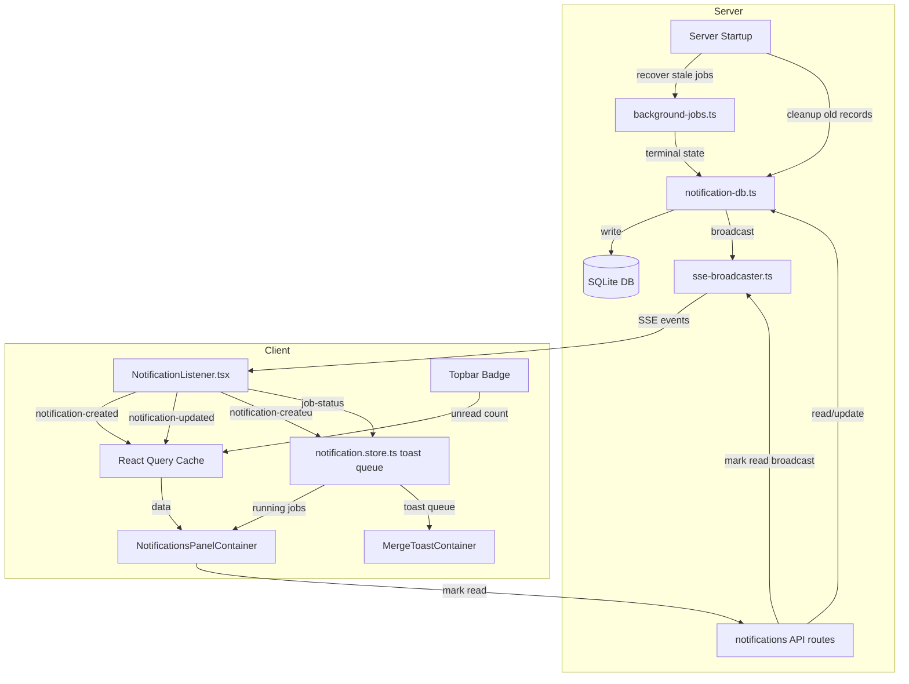
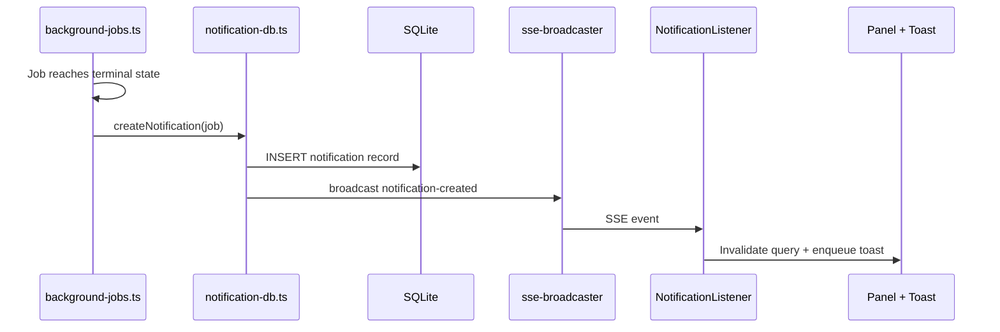
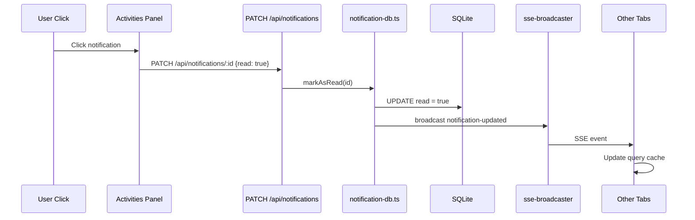

# Design Document: Notifications Persistence

## Overview

**Purpose**: This feature replaces CC's ephemeral notification system with a SQLite-backed persistence layer, adding read/unread tracking and reliable cross-tab/cross-device delivery.

**Users**: Developers using the CC dashboard to monitor background jobs (merge, commit, resolve-conflicts) across sessions and devices.

**Impact**: Replaces in-memory `globalThis` job registries and client-only Zustand toast state with a server-authoritative SQLite database, while preserving the existing SSE broadcast and fire-and-forget dispatch patterns.

### Goals
- Persist all notification records in SQLite so they survive server restarts and browser refreshes
- Track read/unread state per notification with server-side authority
- Deliver notifications in real-time across all connected tabs and devices via SSE
- Fix existing bugs: missing resolve-conflicts display, unreliable toast delivery

### Non-Goals
- Push notifications (browser Notification API, mobile push) — future consideration
- Notification preferences or per-user filtering — CC is single-user
- Full-text search over notification history
- Replacing the existing fire-and-forget job dispatch pattern (running jobs remain in-memory)

## Architecture

### Existing Architecture Analysis

The current system has three layers:

1. **Server dispatch** (`background-jobs.ts`): Registers jobs in `globalThis` Maps, executes async phases, broadcasts `JobStatusEvent` via SSE at each status transition
2. **SSE transport** (`sse-broadcaster.ts` → `api/events/route.ts`): In-memory client registry, broadcasts frames to all connected `ReadableStreamDefaultController` instances
3. **Client consumption** (`NotificationListener.tsx` → `notification.store.ts`): Parses SSE events, updates Zustand store, enqueues terminal `job-status` events for toast display

**Critical gaps**: All state is ephemeral. Server restart clears jobs. Browser refresh clears toast queue and accumulated job history. No read/unread tracking exists. Resolve-conflicts jobs are not mapped for panel display.

### Architecture Pattern & Boundary Map



**Architecture Integration**:
- **Selected pattern**: Server-authoritative with SSE push — SQLite DB is the single source of truth for notification records; SSE pushes changes; client fetches on panel open and SSE reconnection
- **Domain boundaries**: `notification-db.ts` owns all DB access; `background-jobs.ts` owns job execution; API routes handle client requests; SSE handles real-time delivery
- **Existing patterns preserved**: Zod schema-first types, globalThis HMR-safe singletons, fire-and-forget dispatch, SSE broadcasting
- **New components rationale**: `notification-db.ts` encapsulates all SQLite operations; new API routes expose CRUD; new SSE event types for notification lifecycle

### Technology Stack

| Layer | Choice / Version | Role in Feature | Notes |
|-------|------------------|-----------------|-------|
| Backend | Next.js App Router | API routes for notification CRUD | Existing |
| Data | `better-sqlite3` | Notification persistence | Synchronous API, Node.js-compatible; widely used in Electron/CLI tools; works under the project's Node.js runtime |
| Messaging | SSE via `sse-broadcaster.ts` | Real-time notification delivery | Extended with `notification-created` and `notification-updated` events |
| Validation | Zod v4 | Schema definitions for notifications, API requests/responses | Existing pattern |
| Client State | Zustand + React Query | Running jobs (store) + notification data (query cache) | Shift notification data from store-only to API-backed |

## System Flows

### Job Completion to Notification Flow



### Mark Notification as Read Flow



### SSE Reconnection Recovery


## Requirements Traceability

| Requirement | Summary | Components | Interfaces | Flows |
|-------------|---------|------------|------------|-------|
| 1.1 | SQLite DB in config dir | notification-db.ts | — | — |
| 1.2 | Insert job record on dispatch | notification-db.ts, background-jobs.ts | createJobRecord() | — |
| 1.3 | Update on terminal state | notification-db.ts, background-jobs.ts | updateJobRecord() | Job Completion |
| 1.4 | Recover stale jobs on startup | notification-db.ts, background-jobs.ts | recoverStaleJobs() | — |
| 1.5 | Notification record fields | notification-db.ts | notificationSchema | — |
| 1.6 | Query API with filter/pagination | GET /api/notifications | NotificationsResponse | — |
| 2.1–2.3 | Jobs visible immediately | notification.store.ts, NotificationsPanelContainer | — | Job Completion |
| 2.4 | Running job animated indicator | NotificationsPanel | — | — |
| 2.5 | Panel sourced from DB via API | NotificationsPanelContainer | GET /api/notifications | — |
| 2.6 | Fetch on panel open | NotificationsPanelContainer | useNotificationsQuery | — |
| 3.1–3.5 | Terminal jobs create notifications + toast | notification-db.ts, background-jobs.ts | createNotification() | Job Completion |
| 3.6 | Toast 8s with action button | MergeToastContainer | — | — |
| 4.1 | Read flag default false | notification-db.ts | notificationSchema | — |
| 4.2 | Visual read/unread distinction | NotificationsPanel | — | — |
| 4.3 | Click marks as read | NotificationsPanelContainer | PATCH /api/notifications/:id | Mark Read |
| 4.4 | Mark one/many as read API | PATCH /api/notifications/:id | MarkReadRequest | Mark Read |
| 4.5 | Mark all as read API | POST /api/notifications/mark-all-read | — | — |
| 4.6 | Badge shows unread count | Topbar | useUnreadCount | — |
| 5.1 | SSE to all tabs | sse-broadcaster.ts | notification-created event | Job Completion |
| 5.2 | Read state broadcast | sse-broadcaster.ts | notification-updated event | Mark Read |
| 5.3 | Toasts per-tab independent | MergeToastContainer | — | — |
| 5.4 | Panel consistent across tabs | NotificationsPanelContainer | React Query invalidation | — |
| 6.1–6.3 | Cross-device via server state | notification-db.ts, API routes | — | — |
| 7.1 | Configurable retention | notification-db.ts | cleanupOldNotifications() | — |
| 7.2 | Cleanup on startup | notification-db.ts | — | — |
| 7.3 | Panel excludes old | GET /api/notifications | — | — |
| 7.4 | Dismiss API | DELETE /api/notifications/:id | — | — |
| 8.1 | notification-created event | sse-broadcaster.ts | NotificationCreatedEvent | Job Completion |
| 8.2 | notification-updated event | sse-broadcaster.ts | NotificationUpdatedEvent | Mark Read |
| 8.3 | Client listens for new events | NotificationListener.tsx | — | — |
| 8.4 | Fetch on SSE reconnect | NotificationListener.tsx | — | SSE Reconnection |

## Components and Interfaces

| Component | Domain | Intent | Req Coverage | Key Dependencies | Contracts |
|-----------|--------|--------|--------------|-----------------|-----------|
| notification-db.ts | Data | SQLite persistence for notifications | 1.1–1.6, 7.1–7.3 | better-sqlite3, config.ts (P0) | Service, State |
| background-jobs.ts (modified) | Server | Create notifications on job terminal states | 1.2–1.4, 3.1–3.5 | notification-db.ts (P0) | Service |
| GET /api/notifications | API | Query notifications with filter/pagination | 1.6, 2.5, 6.1–6.2 | notification-db.ts (P0) | API |
| PATCH /api/notifications/:id | API | Mark notification as read | 4.3–4.4, 5.2 | notification-db.ts (P0), sse-broadcaster (P0) | API, Event |
| POST /api/notifications/mark-all-read | API | Mark all as read | 4.5 | notification-db.ts (P0), sse-broadcaster (P0) | API, Event |
| DELETE /api/notifications/:id | API | Dismiss notification | 7.4 | notification-db.ts (P0) | API |
| schemas.ts (extended) | Shared | Notification schemas and SSE event types | 1.5, 8.1–8.2 | Zod (P0) | — |
| sse-broadcaster.ts (extended) | Server | New notification event types | 8.1–8.2 | — | Event |
| NotificationListener.tsx (modified) | Client | Handle new SSE event types + reconnection | 8.3–8.4 | React Query (P0) | — |
| notification.store.ts (simplified) | Client | Running jobs only; toast queue (fed by notification-created) | 2.1–2.4, 3.6, 5.3 | — | State |
| NotificationsPanelContainer (modified) | Client | Fetch from API; merge with running jobs | 2.5–2.6, 4.2–4.3, 5.4 | React Query (P0), notification.store (P1) | — |
| Topbar (modified) | Client | Unread count from API | 4.6 | React Query (P0) | — |

### Data Layer

#### notification-db.ts

| Field | Detail |
|-------|--------|
| Intent | Encapsulates all SQLite operations for notification persistence |
| Requirements | 1.1–1.6, 3.1–3.5, 4.1, 4.4–4.5, 7.1–7.4 |

**Responsibilities & Constraints**
- Owns the SQLite database connection (singleton via globalThis)
- Provides CRUD operations for notification records
- Handles schema initialization (CREATE TABLE IF NOT EXISTS)
- Manages stale job recovery and retention cleanup on startup
- All operations are synchronous (better-sqlite3 API)

**Dependencies**
- Outbound: `better-sqlite3` — database driver (P0)
- Outbound: `config.ts` — getConfigDir() for DB file path (P0)
- Outbound: `sse-broadcaster.ts` — broadcast notification events (P0)
- Outbound: `schemas.ts` — notification schemas (P0)

**Contracts**: Service [x] / State [x]

##### Service Interface

```typescript
interface NotificationDBService {
  /** Initialize DB schema and run startup tasks (recovery, cleanup) */
  initialize(): void;

  /** Insert a new notification record. Returns the created notification. */
  createNotification(input: CreateNotificationInput): Notification;

  /** Get notifications with optional filters and pagination */
  getNotifications(options?: GetNotificationsOptions): PaginatedNotifications;

  /** Get count of unread notifications */
  getUnreadCount(): number;

  /** Mark a single notification as read */
  markAsRead(id: string): void;

  /** Mark all notifications as read */
  markAllAsRead(): void;

  /** Delete a notification by id */
  deleteNotification(id: string): boolean;

  /** Insert a job record when dispatch starts */
  createJobRecord(job: BackgroundJob): void;

  /** Update job record on terminal state */
  updateJobRecord(jobId: string, update: JobRecordUpdate): void;

  /** Mark stale running jobs as failed, create failure notifications */
  recoverStaleJobs(): number;

  /** Delete notifications older than retention period */
  cleanupOldNotifications(retentionDays?: number): number;
}
```

- Preconditions: `initialize()` called before any other method
- Postconditions: All write operations are atomic (single SQL statement or transaction)
- Invariants: Database file exists at `{configDir}/notifications.db`; WAL mode enabled

##### State Management

```typescript
import Database from "better-sqlite3";

// Database singleton via globalThis (HMR-safe)
declare global {
  // eslint-disable-next-line no-var
  var __cc_notification_db: InstanceType<typeof Database> | undefined;
}

// DB file location
// Linux: ~/.config/cc/notifications.db
// macOS: ~/Library/Application Support/cc/notifications.db
```

- Persistence: SQLite file in platform config directory
- Consistency: WAL mode for concurrent read safety across API routes
- Concurrency: Single `better-sqlite3` Database instance shared across all API route handlers

### Server Layer

#### background-jobs.ts (modified)

| Field | Detail |
|-------|--------|
| Intent | Integrate notification persistence into job lifecycle |
| Requirements | 1.2–1.4, 3.1–3.5 |

**Responsibilities & Constraints**
- On dispatch: call `createJobRecord()` to persist running job state
- On terminal state: call `updateJobRecord()` then `createNotification()` to persist notification and broadcast
- On startup recovery: delegate to `notification-db.ts` recoverStaleJobs()
- Preserve existing fire-and-forget pattern and session/project locking

**Dependencies**
- Outbound: `notification-db.ts` — persistence (P0)
- Existing: `sse-broadcaster.ts` — job-status broadcast (P0, unchanged)

**Contracts**: Service [x]

**Implementation Notes**
- Existing `broadcastJobStatus()` calls remain unchanged (job-status events for running state)
- New: after terminal state, call `createNotification()` which handles both DB insert and notification-created broadcast
- **Toast responsibility boundary**: The `notification-created` SSE event is the sole trigger for client-side toast display. The existing `job-status` terminal events continue to fire but are used only to update the running-job Map in the Zustand store (clear the job on terminal state). The `addOrUpdateJob()` store action must no longer push terminal events to `toastQueue` — that responsibility moves entirely to the `notification-created` handler in `NotificationListener.tsx`.
- `recoverStaleJobs()` integrated into existing `recoverStaleConversations()` startup path

### API Layer

#### GET /api/notifications

| Field | Detail |
|-------|--------|
| Intent | Query persisted notifications with filter and pagination |
| Requirements | 1.6, 2.5, 6.1–6.2, 7.3 |

**Contracts**: API [x]

##### API Contract

| Method | Endpoint | Request | Response | Errors |
|--------|----------|---------|----------|--------|
| GET | /api/notifications | Query params: `?unread=true&limit=50&offset=0` | `{ notifications: Notification[], total: number, unreadCount: number }` | 400 (invalid params) |

#### PATCH /api/notifications/:id

| Field | Detail |
|-------|--------|
| Intent | Mark a notification as read and broadcast update |
| Requirements | 4.3–4.4, 5.2 |

**Contracts**: API [x] / Event [x]

##### API Contract

| Method | Endpoint | Request | Response | Errors |
|--------|----------|---------|----------|--------|
| PATCH | /api/notifications/[id] | `{ read: true }` | `{ success: true }` | 404 (not found) |

##### Event Contract
- Published: `notification-updated` SSE event with `{ id, read: true }` after successful update
- Delivery: best-effort via SSE broadcaster to all connected clients

#### POST /api/notifications/mark-all-read

| Field | Detail |
|-------|--------|
| Intent | Mark all notifications as read |
| Requirements | 4.5 |

**Contracts**: API [x] / Event [x]

##### API Contract

| Method | Endpoint | Request | Response | Errors |
|--------|----------|---------|----------|--------|
| POST | /api/notifications/mark-all-read | — | `{ success: true, count: number }` | — |

##### Event Contract
- Published: `notification-updated` SSE event with `{ id: "all", read: true }` to trigger full refetch

#### DELETE /api/notifications/:id

| Field | Detail |
|-------|--------|
| Intent | Dismiss (delete) a single notification |
| Requirements | 7.4 |

**Contracts**: API [x]

##### API Contract

| Method | Endpoint | Request | Response | Errors |
|--------|----------|---------|----------|--------|
| DELETE | /api/notifications/[id] | — | `{ success: true }` | 404 (not found) |

### Shared Layer

#### schemas.ts (extended)

| Field | Detail |
|-------|--------|
| Intent | Define notification schemas and new SSE event types |
| Requirements | 1.5, 8.1–8.2 |

**New schemas to add:**

```typescript
// Notification type enum
const notificationTypeSchema = z.enum([
  "merge-completed",
  "merge-failed",
  "merge-conflicts",
  "commit-completed",
  "commit-failed",
  "resolve-completed",
  "resolve-failed",
]);

// Notification record schema
const notificationSchema = z.object({
  id: z.string(),                    // UUID
  type: notificationTypeSchema,
  title: z.string(),
  message: z.string(),
  read: z.boolean(),
  projectName: z.string(),
  sessionName: z.string(),
  branchName: z.string(),
  jobId: z.string(),
  jobType: jobTypeSchema,
  // Optional result metadata
  mergeHash: z.string().optional(),
  commitHash: z.string().optional(),
  conflictCount: z.number().optional(),
  conflictFiles: z.array(z.string()).optional(),
  errorMessage: z.string().optional(),
  createdAt: z.string(),             // ISO 8601
});

// SSE event: notification created
const notificationCreatedEventSchema = z.object({
  type: z.literal("notification-created"),
  notification: notificationSchema,
});

// SSE event: notification updated
const notificationUpdatedEventSchema = z.object({
  type: z.literal("notification-updated"),
  id: z.string(),
  read: z.boolean(),
});

// API request: get notifications query params
const getNotificationsQuerySchema = z.object({
  unread: z.coerce.boolean().optional(),
  limit: z.coerce.number().int().min(1).max(100).default(50),
  offset: z.coerce.number().int().min(0).default(0),
});

// API response: notifications list
const notificationsResponseSchema = z.object({
  notifications: z.array(notificationSchema),
  total: z.number(),
  unreadCount: z.number(),
});

// API request: mark as read
const markReadRequestSchema = z.object({
  read: z.literal(true),
});
```

**SSEEvent union extension:**
```typescript
type SSEEvent =
  | ConversationStatusEvent
  | AskQuestionEvent
  | JobStatusEvent
  | SessionFinishedEvent
  | NotificationCreatedEvent    // NEW
  | NotificationUpdatedEvent;   // NEW
```

#### sse-broadcaster.ts (extended)

| Field | Detail |
|-------|--------|
| Intent | Support new notification event types in SSE broadcast |
| Requirements | 8.1–8.2 |

**Implementation Notes**
- No code changes needed to `broadcast()` — it already accepts the `SSEEvent` union type
- Only the `SSEEvent` type definition in `schemas.ts` needs extending
- The existing broadcast mechanism handles any event with a `type` field

### Client Layer

#### NotificationListener.tsx (modified)

| Field | Detail |
|-------|--------|
| Intent | Listen for notification-created and notification-updated SSE events; handle reconnection recovery |
| Requirements | 8.3–8.4, 5.1–5.2 |

**Responsibilities & Constraints**
- Add event listeners for `notification-created` and `notification-updated`
- On `notification-created`: invalidate notifications query cache, enqueue toast via `notification.store.ts` (this is the **sole toast trigger** — `job-status` terminal events no longer produce toasts)
- On `notification-updated`: invalidate notifications query cache
- On SSE reconnection (EventSource `open` event after error): invalidate notifications query to refetch

**Dependencies**
- Outbound: React Query — invalidateQueries for notification keys (P0)
- Outbound: notification.store.ts — enqueueToast() for `notification-created` events (P0)

#### notification.store.ts (simplified)

| Field | Detail |
|-------|--------|
| Intent | Track running jobs and manage toast queue (client-side only) |
| Requirements | 2.1–2.4, 3.6, 5.3 |

**Responsibilities & Constraints**
- Continue tracking running jobs from `job-status` SSE events (unchanged for running state)
- **Changed**: `addOrUpdateJob()` no longer pushes terminal events to `toastQueue`. On terminal `job-status` events, it only removes the job from the `jobs` Map. Toast enqueueing is now handled exclusively by `NotificationListener.tsx` on `notification-created` events.
- Expose `enqueueToast()` action for `NotificationListener` to push `notification-created` payloads
- Remove responsibility for notification history (moved to API/DB)
- Toast queue remains per-tab (intentional per requirement 5.3)

**State Management**
- `jobs: Map<string, BackgroundJob>` — running jobs only, removed on terminal state
- `toastQueue: NotificationCreatedEvent[]` — FIFO queue fed exclusively by `notification-created` SSE events via `enqueueToast()`

#### NotificationsPanelContainer (modified)

| Field | Detail |
|-------|--------|
| Intent | Fetch notifications from API and merge with running jobs from store |
| Requirements | 2.5–2.6, 4.2–4.3, 5.4 |

**Responsibilities & Constraints**
- Replace direct Zustand store reads with React Query fetch from `GET /api/notifications`
- Merge server notifications with running jobs from Zustand store (running jobs not yet in DB)
- On notification click: call `PATCH /api/notifications/:id` to mark as read
- Add resolve-conflicts job type mapping (bug fix)
- Fetch on panel open via React Query `enabled` flag tied to panel visibility

**Dependencies**
- Outbound: `GET /api/notifications` — fetch persisted notifications (P0)
- Outbound: `PATCH /api/notifications/:id` — mark as read (P0)
- Outbound: notification.store.ts — running jobs (P1)

#### Topbar (modified)

| Field | Detail |
|-------|--------|
| Intent | Display unread notification count in badge |
| Requirements | 4.6 |

**Implementation Notes**
- Replace current badge logic (active conversations + active jobs count) with unread count from notifications query
- Can derive unread count from the same React Query cache used by panel, or use a lightweight `GET /api/notifications?limit=0` that returns only `unreadCount`

## Data Models

### Domain Model

A **Notification** represents a completed background operation (merge, commit, resolve-conflicts) that the user should be informed about. Each notification has a read/unread state and is associated with a project, session, and branch.

A **JobRecord** tracks a background job from dispatch to completion. Running jobs are ephemeral (in-memory); terminal jobs produce a Notification.

### Physical Data Model

#### `notifications` table

```sql
CREATE TABLE IF NOT EXISTS notifications (
  id            TEXT PRIMARY KEY,
  type          TEXT NOT NULL,          -- notification type enum
  title         TEXT NOT NULL,
  message       TEXT NOT NULL,
  read          INTEGER NOT NULL DEFAULT 0,  -- boolean: 0=unread, 1=read
  project_name  TEXT NOT NULL,
  session_name  TEXT NOT NULL,
  branch_name   TEXT NOT NULL,
  job_id        TEXT NOT NULL,
  job_type      TEXT NOT NULL,          -- commit | merge | resolve-conflicts
  -- Optional result metadata
  merge_hash    TEXT,
  commit_hash   TEXT,
  conflict_count INTEGER,
  conflict_files TEXT,                  -- JSON array serialized as TEXT
  error_message TEXT,
  created_at    TEXT NOT NULL DEFAULT (datetime('now'))
);

-- Index for unread queries and badge count
CREATE INDEX IF NOT EXISTS idx_notifications_read ON notifications(read);

-- Index for cleanup by age
CREATE INDEX IF NOT EXISTS idx_notifications_created_at ON notifications(created_at);

-- Index for filtering by project/session
CREATE INDEX IF NOT EXISTS idx_notifications_project_session ON notifications(project_name, session_name);
```

#### `job_records` table

```sql
CREATE TABLE IF NOT EXISTS job_records (
  job_id        TEXT PRIMARY KEY,
  job_type      TEXT NOT NULL,
  status        TEXT NOT NULL,          -- running | completed | failed | conflicts
  project_name  TEXT NOT NULL,
  session_name  TEXT NOT NULL,
  branch_name   TEXT NOT NULL,
  started_at    TEXT NOT NULL,
  completed_at  TEXT,
  -- Result metadata
  merge_hash    TEXT,
  commit_hash   TEXT,
  conflict_count INTEGER,
  conflict_files TEXT,                  -- JSON array as TEXT
  error_message TEXT
);

-- Index for stale job recovery
CREATE INDEX IF NOT EXISTS idx_job_records_status ON job_records(status);
```

### Data Contracts & Integration

**API Data Transfer**: All request/response schemas defined in `schemas.ts` section above. JSON serialization. Zod `safeParse` for query parameter validation at API boundary.

**Event Schemas**: `notification-created` carries full `Notification` object. `notification-updated` carries `{ id, read }` delta. Both added to existing `SSEEvent` union.

**`conflict_files` serialization**: Stored as `JSON.stringify(string[])` in TEXT column. Parsed with `JSON.parse()` on read. Validated with Zod on API boundary.

## Error Handling

### Error Strategy

All errors follow existing CC patterns: structured logging via `createLogger()`, HTTP error responses with appropriate status codes, and graceful degradation.

### Error Categories and Responses

**Database errors**: If SQLite is unavailable or corrupt, log error and fall back to in-memory-only behavior (notifications degrade to ephemeral). Server continues to function.

**API errors**:
- Invalid query params → 400 with validation error details
- Notification not found → 404
- DB write failure → 500 with logged error

**SSE delivery failures**: Existing pattern handles broken clients by removing them from the client set. No change needed.

**Stale job recovery**: On startup, running jobs older than 10 minutes marked as failed. A notification is created with error message "Job interrupted by server restart".

## Testing Strategy

### Unit Tests
- `notification-db.test.ts`: CRUD operations, schema initialization, stale recovery, retention cleanup, unread count
- Schema validation: notification schemas, SSE event schemas, API request/response schemas
- Toast queue behavior in notification.store (simplified store)

### Integration Tests
- Job dispatch → DB record creation → notification creation → SSE broadcast chain
- API routes: GET with filters, PATCH mark read, POST mark all read, DELETE dismiss
- SSE event delivery for notification-created and notification-updated

### E2E Tests (manual verification)
- Start merge job → see running in panel → completes → toast appears → notification in panel
- Mark notification as read in one tab → verify read state in second tab
- Server restart → notifications persist → stale jobs recovered

## Migration Strategy

Since this is a new SQLite database (no existing DB to migrate from), migration is about transitioning from the ephemeral system:

1. **Phase 1**: Add `notification-db.ts` with schema initialization. DB created on first server start.
2. **Phase 2**: Integrate into `background-jobs.ts` — write to DB alongside existing globalThis registries.
3. **Phase 3**: Add API routes and update client components to fetch from API.
4. **Phase 4**: Remove deprecated ephemeral-only paths from notification store.

No data migration needed — the globalThis registries are ephemeral by nature. The SQLite DB starts empty and accumulates from first use.
