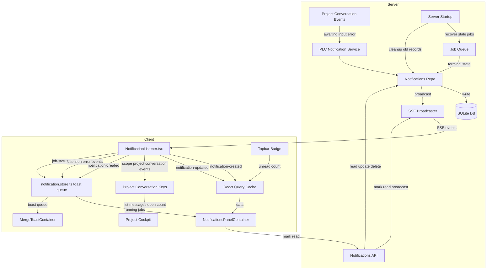
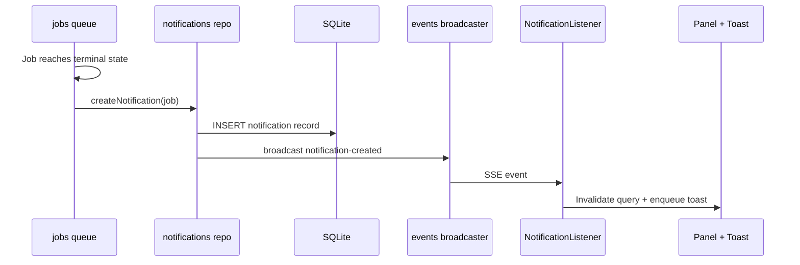
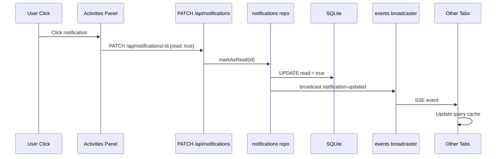
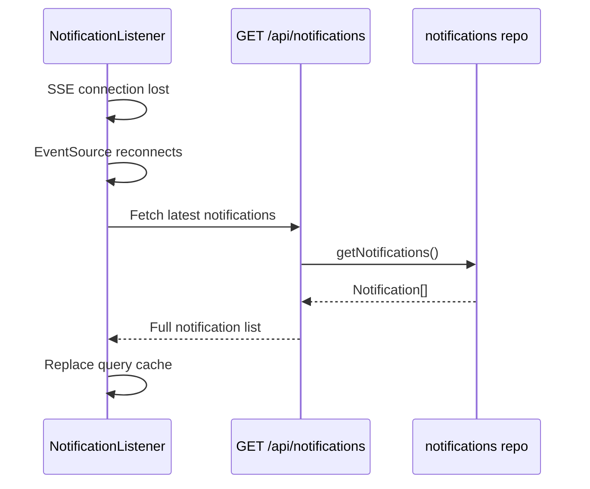
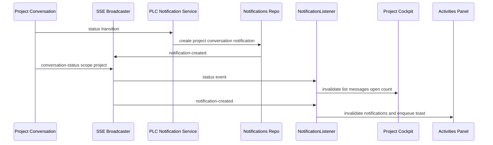
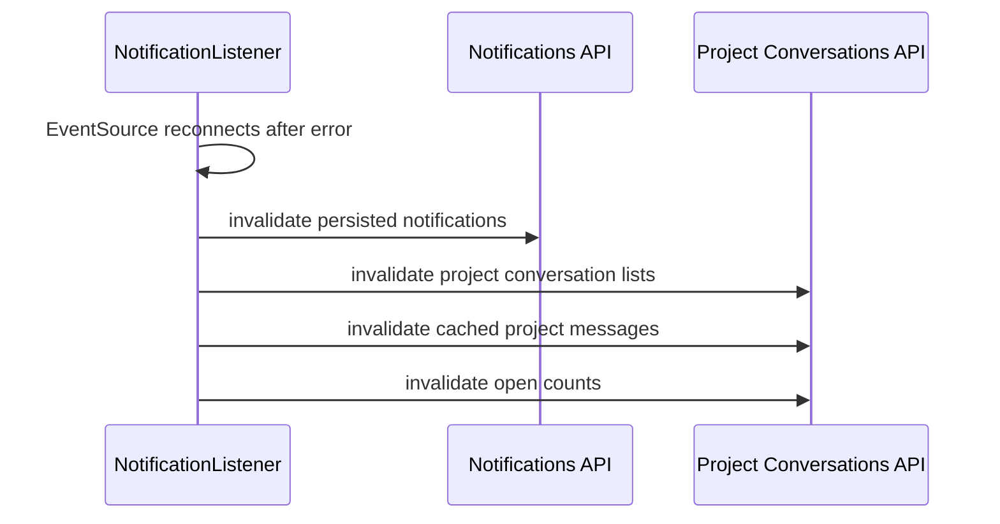

# Design Document: Notifications Persistence

## Overview

**Purpose**: This feature provides a server-authoritative notification system for CC. It persists background-job notifications, tracks read/unread state, delivers notification changes across tabs/devices, and now extends that same attention-handling model to project-level conversations.

**Users**: Developers using the CC dashboard to monitor background jobs and project/session conversations across sessions, project cockpits, tabs, and devices.

**Impact**: Keeps the existing job-notification persistence and SSE broadcast pattern, generalizes notification records so project-conversation notifications do not require a session, and makes the global `NotificationListener` consume `scope:"project"` conversation events for cockpit refresh and project-conversation toasts.

### Goals
- Persist all notification records in SQLite so they survive server restarts and browser refreshes
- Track read/unread state per notification with server-side authority
- Deliver notifications in real-time across all connected tabs and devices via SSE
- Fix existing bugs: missing resolve-conflicts display, unreliable toast delivery
- Deliver project-conversation readiness, user-attention, and failure notifications without routing through a session
- Keep project-conversation cockpit list/message/open-count views current from the existing global SSE listener

### Non-Goals
- Notification preferences or per-user filtering — CC is single-user
- Full-text search over notification history
- Replacing the existing fire-and-forget job dispatch pattern (running jobs remain in-memory)
- Designing the project cockpit tab UI, rail grouping/presentation, or spawn-card UI
- Adding new notification channels beyond the existing in-app, Browser Notification API, and configured push-notification paths

## Boundary Commitments

### This Spec Owns
- The notification record shape for persisted background-job notifications and persisted project-conversation notifications.
- The server-side creation path for project-conversation notifications when a project conversation reaches `awaiting`, `waiting_for_input`, or an error state.
- The global SSE client registration that reacts to `scope:"project"` conversation events by invalidating project-conversation list, message, open-count, active-conversation, and notification caches.
- The Activities/toast action routing for project-conversation notification records, including focus URLs that target the project cockpit instead of a session route.
- Browser/OS notification parity for project-conversation readiness using the same permission and degradation behavior as session-conversation readiness.

### Out of Boundary
- Project cockpit layout, tab rendering, first-run/cockpit composition, and focus-state presentation beyond the notification action URL.
- Unified rail grouping, labels, and row rendering beyond consuming the existing active-conversations source.
- Project-conversation persistence, execution, lifecycle, and `scope:"project"` SSE production, which are owned by the `project-level-conversations` foundation.
- Per-conversation capability override semantics.

### Allowed Dependencies
- `project-level-conversations` foundation: `scope:"project"` conversation events, project-conversation list/message/open routes, and `projectConversationKeys`.
- `project-conversation-cockpit`: focus query parameter contract and reopen-on-focus behavior for closed but unarchived project conversations.
- Existing notification persistence, `notification-created`/`notification-updated` SSE events, React Query, Zustand toast queues, Browser Notification API, and push dispatcher.

### Revalidation Triggers
- Any change to the notification record discriminator, project-conversation context fields, or `notification-created` payload shape requires rechecking Activities panel, toasts, and notification API tests.
- Any change to `scope:"project"` conversation event names or payloads requires rechecking the global `NotificationListener` invalidation logic and cockpit live refresh.
- Any change to the project cockpit focus URL or closed-conversation reopen semantics requires rechecking project-conversation notification actions.

## Architecture

### Existing Architecture Analysis

The implemented notification system has four layers:

1. **Server dispatch** (`src/lib/jobs/queue.ts`, `src/lib/jobs/repo.ts`): registers running jobs in memory, records job lifecycle in SQLite, and creates persisted job notifications on terminal states.
2. **Notification persistence** (`src/lib/notifications/repo.ts`): stores notification records in the shared SQLite state DB, validates row/domain shape through Zod, broadcasts `notification-created`/`notification-updated`, and dispatches configured push notifications.
3. **SSE transport** (`src/lib/events/broadcaster.ts` → `/api/events`): broadcasts typed event frames to all connected clients and keeps a replay buffer for reconnect recovery.
4. **Client consumption** (`NotificationListener.tsx`, `notification.store.ts`, React Query): listens globally, updates running-job state, invalidates notification/query caches, and enqueues toasts from `notification-created` plus attention/error conversation events.

The project-level-conversations foundation already generalizes conversation events with `scope:"session" | "project"` and emits project variants without `sessionName`. The remaining gaps for this spec are that notification records still assume session/job context, the global listener ignores project-scoped conversation events, and project-conversation readiness/error actions need cockpit-focused routing.

### Architecture Pattern & Boundary Map



**Architecture Integration**:
- **Selected pattern**: Server-authoritative notification records with SSE push and scoped conversation-event consumption. SQLite remains the source of truth for persisted notifications; project-conversation live refresh uses existing conversation SSE events and React Query invalidation.
- **Domain boundaries**: notification persistence owns notification rows and lifecycle events; project-conversation foundation owns conversation records/events; the global listener bridges those events into client cache invalidation and toasts.
- **Existing patterns preserved**: Zod schema-first types, shared SQLite state DB, fire-and-forget dispatch, SSE broadcasting, React Query invalidation, and per-tab toast queues.
- **New components rationale**: the PLC notification service is a narrow adapter from project-conversation status/error events into persisted notification records and push/browser notification parity.

### Technology Stack

| Layer | Choice / Version | Role in Feature | Notes |
|-------|------------------|-----------------|-------|
| Backend | Next.js App Router | API routes for notification CRUD | Existing |
| Data | `better-sqlite3` | Notification persistence | Synchronous API, Node.js-compatible; widely used in Electron/CLI tools; works under the project's Node.js runtime |
| Messaging | SSE via `src/lib/events/broadcaster.ts` | Real-time notification delivery | Supports `notification-created`, `notification-updated`, and scoped conversation events |
| Validation | Zod v4 | Schema definitions for notifications, API requests/responses | Existing pattern |
| Client State | Zustand + React Query | Running jobs (store) + notification data (query cache) | Shift notification data from store-only to API-backed |
| Browser APIs | Notification API | OS-level readiness notification parity | Reuses permission/degradation behavior from browser-notifications |

## File Structure Plan

### Modified Files
- `src/lib/notifications/schemas.ts` — add the project-conversation notification variant and keep job notifications as a narrowed variant.
- `src/lib/notifications/repo.ts` — persist, read, and validate both notification variants; add idempotent project-conversation notification creation.
- `src/lib/jobs/repo.ts` and `src/lib/jobs/queue.ts` — keep existing job notification behavior aligned with the job variant after schema generalization.
- `src/lib/project-conversations/route-handlers.ts` or adjacent server orchestration — call the PLC Notification Service when project conversations reach readiness, waiting-for-input, or error states.
- `src/lib/push-notification/dispatcher.ts` and `src/lib/notifications/push.ts` — accept project-conversation context without requiring `sessionName` and format readiness/input/error messages accordingly.
- `src/components/NotificationListener.tsx` — handle project-scoped conversation events, invalidate `projectConversationKeys`, and preserve existing session branches.
- `src/stores/notification.store.ts` — accept project-scoped input/error toast items and persisted project-conversation notifications.
- `src/components/NotificationsPanelContainer.tsx`, `src/components/NotificationsPanel.tsx`, and toast containers — map project-conversation persisted notifications and actions to cockpit focus URLs.
- `src/lib/events/sse-reconnect.ts` — invalidate mounted project-conversation caches during reconnect reconciliation.
- Tests beside each modified module — pin schema parsing, repository persistence, service idempotency, listener invalidations, action routing, and browser/push parity.

### New Files
- `src/lib/notifications/project-conversation-service.ts` — narrow server adapter that turns project-conversation transitions into persisted notification records.
- `src/lib/notifications/project-conversation-service.test.ts` — unit tests for transition mapping, idempotency, and no-session context.

## System Flows

### Job Completion to Notification Flow



### Mark Notification as Read Flow



### SSE Reconnection Recovery



### Project Conversation Notification Flow



Project conversation notification creation is server-side and idempotent per status transition. The global listener does not create persisted records; it only updates client caches, toasts, and Browser Notification API delivery for received events.

### Project Conversation Reconnect Recovery



Reconnect recovery uses the existing `reconnectReconcile` path plus project-conversation key invalidation. Session message catch-up remains targeted by `conversationKeys.messages`; project messages use invalidation/refetch because the project route owns message reads.

## Requirements Traceability

| Requirement | Summary | Components | Interfaces | Flows |
|-------------|---------|------------|------------|-------|
| 1.1 | SQLite DB in config dir | notifications repo | — | — |
| 1.2 | Insert job record on dispatch | jobs repo, jobs queue | createJobRecord() | — |
| 1.3 | Update on terminal state | jobs repo, jobs queue | updateJobRecord() | Job Completion |
| 1.4 | Recover stale jobs on startup | jobs repo, notifications repo | recoverStaleJobs() | — |
| 1.5 | Notification record fields | notifications repo | notificationSchema | — |
| 1.6 | Query API with filter/pagination | GET /api/notifications | NotificationsResponse | — |
| 2.1–2.3 | Jobs visible immediately | notification.store.ts, NotificationsPanelContainer | — | Job Completion |
| 2.4 | Running job animated indicator | NotificationsPanel | — | — |
| 2.5 | Panel sourced from DB via API | NotificationsPanelContainer | GET /api/notifications | — |
| 2.6 | Fetch on panel open | NotificationsPanelContainer | useNotificationsQuery | — |
| 3.1–3.5 | Terminal jobs create notifications + toast | notifications repo, jobs queue | createNotification() | Job Completion |
| 3.6 | Toast 8s with action button | MergeToastContainer | — | — |
| 4.1 | Read flag default false | notifications repo | notificationSchema | — |
| 4.2 | Visual read/unread distinction | NotificationsPanel | — | — |
| 4.3 | Click marks as read | NotificationsPanelContainer | PATCH /api/notifications/:id | Mark Read |
| 4.4 | Mark one/many as read API | PATCH /api/notifications/:id | MarkReadRequest | Mark Read |
| 4.5 | Mark all as read API | POST /api/notifications/mark-all-read | — | — |
| 4.6 | Badge shows unread count | Topbar | useUnreadCount | — |
| 5.1 | SSE to all tabs | events broadcaster | notification-created event | Job Completion |
| 5.2 | Read state broadcast | events broadcaster | notification-updated event | Mark Read |
| 5.3 | Toasts per-tab independent | MergeToastContainer | — | — |
| 5.4 | Panel consistent across tabs | NotificationsPanelContainer | React Query invalidation | — |
| 6.1–6.3 | Cross-device via server state | notifications repo, API routes | — | — |
| 7.1 | Configurable retention | notifications repo | cleanupOldNotifications() | — |
| 7.2 | Cleanup on startup | notifications repo | — | — |
| 7.3 | Panel excludes old | GET /api/notifications | — | — |
| 7.4 | Dismiss API | DELETE /api/notifications/:id | — | — |
| 8.1 | notification-created event | events broadcaster | NotificationCreatedEvent | Job Completion |
| 8.2 | notification-updated event | events broadcaster | NotificationUpdatedEvent | Mark Read |
| 8.3 | Client listens for new events | NotificationListener.tsx | — | — |
| 8.4 | Fetch on SSE reconnect | NotificationListener.tsx | — | SSE Reconnection |
| 9.1 | PLC awaiting creates readiness notification | PLC Notification Service, notifications repo | createProjectConversationNotification | Project Conversation Notification |
| 9.2 | PLC waiting-for-input creates attention notification | PLC Notification Service, notification.store.ts | conversation-status scope project | Project Conversation Notification |
| 9.3 | PLC turn error creates failure notification | PLC Notification Service, notification.store.ts | notification-created, conversation-status error | Project Conversation Notification |
| 9.4 | PLC notification context has no session requirement | notification schemas, notifications table | ProjectConversationNotification variant | — |
| 9.5 | Existing session/job behavior unchanged | jobs queue, NotificationListener session branches | existing job/session events | Job Completion |
| 10.1 | PLC notification action focuses cockpit conversation | NotificationsPanelContainer, row helpers | cockpit focus URL | Project Conversation Notification |
| 10.2 | Closed PLC reopens before focus | notification action routing, cockpit mutation contract | project cockpit focus contract | Project Conversation Notification |
| 10.3 | Missing PLC shows unavailable state | notification action routing, cockpit focus contract | focus URL error handling | Project Conversation Notification |
| 10.4 | Toast includes project and conversation context | notification.store.ts, toast containers | Notification payload | Project Conversation Notification |
| 11.1 | PLC notifications persist with notification lifecycle | notifications repo, notifications API | Notification CRUD | Mark Read |
| 11.2 | PLC read/dismiss state syncs across tabs/devices | notifications API, SSE broadcaster | notification-updated | Mark Read |
| 11.3 | Browser notification parity for PLC readiness | NotificationListener.tsx | Browser Notification API | Project Conversation Notification |
| 11.4 | Browser notification degradation matches sessions | NotificationListener.tsx | permission handling | Project Conversation Notification |
| 12.1 | PLC list views refresh on events | NotificationListener.tsx | projectConversationKeys.list | Project Conversation Notification |
| 12.2 | PLC transcript views refresh on message events | NotificationListener.tsx | projectConversationKeys.messages | Project Conversation Notification |
| 12.3 | PLC open-count/list views refresh on lifecycle events | NotificationListener.tsx | conversation-open, projectConversationKeys.list | Project Conversation Notification |
| 12.4 | Reconnect reconciles PLC notification/conversation state | reconnectReconcile, NotificationListener.tsx | notificationKeys, projectConversationKeys | Project Conversation Reconnect Recovery |
| 12.5 | Presentation remains in downstream specs | NotificationListener.tsx, NotificationsPanelContainer | data/cache invalidation only | — |

## Components and Interfaces

| Component | Domain | Intent | Req Coverage | Key Dependencies | Contracts |
|-----------|--------|--------|--------------|-----------------|-----------|
| notifications repo | Data | SQLite persistence for notifications | 1.1–1.6, 7.1–7.3 | better-sqlite3, state-store DB (P0) | Service, State |
| jobs queue/repo | Server | Create notifications on job terminal states | 1.2–1.4, 3.1–3.5 | notifications repo (P0) | Service |
| GET /api/notifications | API | Query notifications with filter/pagination | 1.6, 2.5, 6.1–6.2 | notifications repo (P0) | API |
| PATCH /api/notifications/:id | API | Mark notification as read | 4.3–4.4, 5.2 | notifications repo (P0), events broadcaster (P0) | API, Event |
| POST /api/notifications/mark-all-read | API | Mark all as read | 4.5 | notifications repo (P0), events broadcaster (P0) | API, Event |
| DELETE /api/notifications/:id | API | Dismiss notification | 7.4 | notifications repo (P0) | API |
| schemas.ts (extended) | Shared | Notification schemas and SSE event types | 1.5, 8.1–8.2 | Zod (P0) | — |
| events broadcaster (extended) | Server | Notification event types over the shared SSE bus | 8.1–8.2 | — | Event |
| NotificationListener.tsx (modified) | Client | Handle new SSE event types + reconnection | 8.3–8.4 | React Query (P0) | — |
| notification.store.ts (simplified) | Client | Running jobs only; toast queue (fed by notification-created) | 2.1–2.4, 3.6, 5.3 | — | State |
| NotificationsPanelContainer (modified) | Client | Fetch from API; merge with running jobs | 2.5–2.6, 4.2–4.3, 5.4 | React Query (P0), notification.store (P1) | — |
| Topbar (modified) | Client | Unread count from API | 4.6 | React Query (P0) | — |
| notification schemas (PLC extension) | Shared | Add project-conversation notification variant without session/job fields | 9.4, 11.1 | project-level-conversations schemas (P0), Zod (P0) | State, Event |
| PLC Notification Service | Server | Create persisted project-conversation notifications from project status/error transitions | 9.1–9.5, 11.1 | project-conversations events (P0), notifications repo (P0), push dispatcher (P1) | Service, Event |
| NotificationListener project scope branch | Client | Invalidate project-conversation caches and deliver project attention/browser notifications | 9.2–9.3, 11.3–11.4, 12.1–12.4 | projectConversationKeys (P0), notification store (P0), Browser Notification API (P1) | Event, State |
| Project notification action mapper | Client | Route project-conversation notification clicks to cockpit focus URLs | 10.1–10.4 | active-conversation row helpers (P0), project cockpit focus contract (P0) | State |

### Data Layer

#### notifications repo

| Field | Detail |
|-------|--------|
| Intent | Encapsulates all SQLite operations for notification persistence |
| Requirements | 1.1–1.6, 3.1–3.5, 4.1, 4.4–4.5, 7.1–7.4 |

**Responsibilities & Constraints**
- Owns the SQLite database connection (singleton via globalThis)
- Provides CRUD operations for notification records
- Handles schema initialization (CREATE TABLE IF NOT EXISTS)
- Manages stale job recovery and retention cleanup on startup
- All operations are synchronous (better-sqlite3 API)

**Dependencies**
- Outbound: `better-sqlite3` — database driver (P0)
- Outbound: shared state DB — SQLite connection and schema lifecycle (P0)
- Outbound: events broadcaster — broadcast notification events (P0)
- Outbound: `schemas.ts` — notification schemas (P0)

**Contracts**: Service [x] / State [x]

##### Service Interface

```typescript
interface NotificationRepositoryService {
  /** Initialize DB schema and run startup tasks (recovery, cleanup) */
  initialize(): void;

  /** Insert a new job notification record. Returns the created notification. */
  createNotification(input: CreateJobNotificationInput): Notification;

  /** Insert a new project-conversation notification record. Returns the created notification or existing duplicate. */
  createProjectConversationNotification(input: CreateProjectConversationNotificationInput): Notification;

  /** Get notifications with optional filters and pagination */
  getNotifications(options?: GetNotificationsOptions): PaginatedNotifications;

  /** Get count of unread notifications */
  getUnreadCount(): number;

  /** Mark a single notification as read */
  markAsRead(id: string): void;

  /** Mark all notifications as read */
  markAllAsRead(): void;

  /** Delete a notification by id */
  deleteNotification(id: string): boolean;

  /** Insert a job record when dispatch starts */
  createJobRecord(job: BackgroundJob): void;

  /** Update job record on terminal state */
  updateJobRecord(jobId: string, update: JobRecordUpdate): void;

  /** Mark stale running jobs as failed, create failure notifications */
  recoverStaleJobs(): number;

  /** Delete notifications older than retention period */
  cleanupOldNotifications(retentionDays?: number): number;
}
```

- Preconditions: `initialize()` called before any other method
- Postconditions: All write operations are atomic (single SQL statement or transaction)
- Invariants: Notification rows parse as either a job variant or a project-conversation variant; project-conversation rows never require session/job fields; WAL mode enabled

##### State Management

```typescript
import Database from "better-sqlite3";

// Database singleton via globalThis (HMR-safe)
declare global {
  // eslint-disable-next-line no-var
  var __cc_notification_db: InstanceType<typeof Database> | undefined;
}

// DB file location
// Shared CC state DB in the platform config directory.
```

- Persistence: SQLite file in platform config directory
- Consistency: WAL mode for concurrent read safety across API routes
- Concurrency: Single `better-sqlite3` Database instance shared across all API route handlers

### Server Layer

#### jobs queue/repo (modified)

| Field | Detail |
|-------|--------|
| Intent | Integrate notification persistence into job lifecycle |
| Requirements | 1.2–1.4, 3.1–3.5 |

**Responsibilities & Constraints**
- On dispatch: call `createJobRecord()` to persist running job state
- On terminal state: call `updateJobRecord()` then `createNotification()` to persist notification and broadcast
- On startup recovery: delegate to jobs repo stale recovery and notification creation
- Preserve existing fire-and-forget pattern and session/project locking

**Dependencies**
- Outbound: notifications repo — persistence (P0)
- Existing: events broadcaster — job-status broadcast (P0, unchanged)

**Contracts**: Service [x]

**Implementation Notes**
- Existing `broadcastJobStatus()` calls remain unchanged (job-status events for running state)
- New: after terminal state, call `createNotification()` which handles both DB insert and notification-created broadcast
- **Toast responsibility boundary**: The `notification-created` SSE event is the sole trigger for client-side toast display. The existing `job-status` terminal events continue to fire but are used only to update the running-job Map in the Zustand store (clear the job on terminal state). The `addOrUpdateJob()` store action must no longer push terminal events to `toastQueue` — that responsibility moves entirely to the `notification-created` handler in `NotificationListener.tsx`.
- `recoverStaleJobs()` integrated into existing `recoverStaleConversations()` startup path

#### PLC Notification Service

| Field | Detail |
|-------|--------|
| Intent | Convert project-conversation status/error transitions into persisted notification records and delivery events |
| Requirements | 9.1–9.5, 11.1 |

**Responsibilities & Constraints**
- Subscribe at the server-side project-conversation event boundary, not in the browser, so persisted notification creation does not depend on a connected tab.
- Create a project-conversation notification when a project conversation reaches `awaiting`, reaches `waiting_for_input`, or emits a turn error.
- Use a deterministic idempotency key per project/conversation/status transition so duplicate SSE broadcasts or retries do not create duplicate unread records for the same transition.
- Persist project name, project path or route name, conversation id, conversation display name when available, status, message, and action target. Do not require `sessionName`, `branchName`, `jobId`, or `jobType`.
- Preserve session-conversation status behavior and background-job notification behavior; this service only handles `scope:"project"` context.

**Dependencies**
- Inbound: project-conversation foundation — emits status/error lifecycle for project conversations (P0)
- Outbound: notifications repo — persists rows and broadcasts `notification-created` (P0)
- Outbound: push dispatcher — dispatches configured readiness/input/failure push notifications with project-conversation context (P1)

**Contracts**: Service [x] / Event [x]

##### Service Interface

```typescript
interface ProjectConversationNotificationService {
  handleProjectConversationStatus(input: {
    projectName: string;
    conversationId: string;
    conversationName: string | null;
    status: "awaiting" | "waiting_for_input";
  }): Promise<Notification | null>;

  handleProjectConversationError(input: {
    projectName: string;
    conversationId: string;
    conversationName: string | null;
    errorMessage: string;
  }): Promise<Notification | null>;
}
```

- Preconditions: the input is already known to be `scope:"project"` and the conversation still exists when the handler reads context.
- Postconditions: a persisted notification is created at most once for the transition and is broadcast as `notification-created`.
- Invariants: project-conversation notifications never carry a session route; their action target resolves through the project cockpit focus contract.

##### Event Contract
- Subscribed events: project-scoped `conversation-status` with `status:"awaiting" | "waiting_for_input"` and project-scoped status/error outcomes from the prompt stream.
- Published events: `notification-created` with a `ProjectConversationNotification` payload.
- Delivery: persistence is authoritative; SSE delivery remains best-effort and reconnect recovery invalidates notification/project-conversation caches.

**Implementation Notes**
- The handler may live beside notification persistence or project-conversation route orchestration, but ownership remains with notifications because it defines notification rows, action routing, and push/browser parity.
- If the project conversation is deleted or archived before the action is used, the action URL still targets the cockpit and the cockpit presents its unavailable state.

### API Layer

#### GET /api/notifications

| Field | Detail |
|-------|--------|
| Intent | Query persisted notifications with filter and pagination |
| Requirements | 1.6, 2.5, 6.1–6.2, 7.3 |

**Contracts**: API [x]

##### API Contract

| Method | Endpoint | Request | Response | Errors |
|--------|----------|---------|----------|--------|
| GET | /api/notifications | Query params: `?unread=true&limit=50&offset=0` | `{ notifications: Notification[], total: number, unreadCount: number }` | 400 (invalid params) |

#### PATCH /api/notifications/:id

| Field | Detail |
|-------|--------|
| Intent | Mark a notification as read and broadcast update |
| Requirements | 4.3–4.4, 5.2 |

**Contracts**: API [x] / Event [x]

##### API Contract

| Method | Endpoint | Request | Response | Errors |
|--------|----------|---------|----------|--------|
| PATCH | /api/notifications/[id] | `{ read: true }` | `{ success: true }` | 404 (not found) |

##### Event Contract
- Published: `notification-updated` SSE event with `{ id, read: true }` after successful update
- Delivery: best-effort via SSE broadcaster to all connected clients

#### POST /api/notifications/mark-all-read

| Field | Detail |
|-------|--------|
| Intent | Mark all notifications as read |
| Requirements | 4.5 |

**Contracts**: API [x] / Event [x]

##### API Contract

| Method | Endpoint | Request | Response | Errors |
|--------|----------|---------|----------|--------|
| POST | /api/notifications/mark-all-read | — | `{ success: true, count: number }` | — |

##### Event Contract
- Published: `notification-updated` SSE event with `{ id: "all", read: true }` to trigger full refetch

#### DELETE /api/notifications/:id

| Field | Detail |
|-------|--------|
| Intent | Dismiss (delete) a single notification |
| Requirements | 7.4 |

**Contracts**: API [x]

##### API Contract

| Method | Endpoint | Request | Response | Errors |
|--------|----------|---------|----------|--------|
| DELETE | /api/notifications/[id] | — | `{ success: true }` | 404 (not found) |

### Shared Layer

#### schemas.ts (extended)

| Field | Detail |
|-------|--------|
| Intent | Define notification schemas and new SSE event types |
| Requirements | 1.5, 8.1–8.2 |

**Schemas to maintain and extend:**

```typescript
const jobNotificationTypeSchema = z.enum([
  "merge-completed",
  "merge-failed",
  "merge-conflicts",
  "merge-ready-to-land",
  "merge-discarded",
  "commit-completed",
  "commit-failed",
  "resolve-completed",
  "resolve-failed",
]);

const projectConversationNotificationTypeSchema = z.enum([
  "project-conversation-ready",
  "project-conversation-input-needed",
  "project-conversation-failed",
]);

const notificationBaseSchema = z.object({
  id: z.string(),
  title: z.string(),
  message: z.string(),
  read: z.boolean(),
  projectName: z.string(),
  createdAt: z.string(),
});

const jobNotificationSchema = notificationBaseSchema.extend({
  source: z.literal("job"),
  type: jobNotificationTypeSchema,
  sessionName: z.string(),
  branchName: z.string(),
  jobId: z.string(),
  jobType: jobTypeSchema,
  mergeHash: z.string().optional(),
  commitHash: z.string().optional(),
  conflictCount: z.number().optional(),
  conflictFiles: z.array(z.string()).optional(),
  targetBranch: z.string().optional(),
  errorMessage: z.string().optional(),
});

const projectConversationNotificationSchema = notificationBaseSchema.extend({
  source: z.literal("project-conversation"),
  type: projectConversationNotificationTypeSchema,
  conversationId: z.string(),
  conversationName: z.string().nullable(),
  status: z.enum(["awaiting", "waiting_for_input", "failed"]),
  errorMessage: z.string().optional(),
});

const notificationSchema = z.discriminatedUnion("source", [
  jobNotificationSchema,
  projectConversationNotificationSchema,
]);

// SSE event: notification created
const notificationCreatedEventSchema = z.object({
  type: z.literal("notification-created"),
  notification: notificationSchema,
});

// SSE event: notification updated
const notificationUpdatedEventSchema = z.object({
  type: z.literal("notification-updated"),
  id: z.string(),
  read: z.boolean(),
});

// API request: get notifications query params
const getNotificationsQuerySchema = z.object({
  unread: z.coerce.boolean().optional(),
  limit: z.coerce.number().int().min(1).max(100).default(50),
  offset: z.coerce.number().int().min(0).default(0),
});

// API response: notifications list
const notificationsResponseSchema = z.object({
  notifications: z.array(notificationSchema),
  total: z.number(),
  unreadCount: z.number(),
});

// API request: mark as read
const markReadRequestSchema = z.object({
  read: z.literal(true),
});
```

**SSEEvent union extension:**
```typescript
type SSEEvent =
  | ConversationStatusEvent
  | MessageAppendedEvent
  | MessageUpdatedEvent
  | AskQuestionEvent
  | JobStatusEvent
  | NotificationCreatedEvent
  | NotificationUpdatedEvent
  | ConversationOpenEvent;
```

**Project-conversation contract details**
- `ProjectConversationNotification` omits `sessionName`, `branchName`, `jobId`, and `jobType`. Consumers must narrow on `source` before reading job-only fields.
- Existing job notification rows remain the `source:"job"` variant and continue to drive merge/commit/resolve-conflicts Activities rows and toasts.
- Project-conversation notifications use `conversationId` plus `projectName` to resolve `/projects/{projectName}?focus={conversationId}`. The cockpit owns reopening a closed but unarchived conversation and showing the unavailable state if the record cannot be focused.
- API responses continue returning `{ notifications, total, unreadCount }`; the `notifications` array now contains both variants.

#### events broadcaster (extended)

| Field | Detail |
|-------|--------|
| Intent | Support new notification event types in SSE broadcast |
| Requirements | 8.1–8.2 |

**Implementation Notes**
- No code changes needed to `broadcast()` — it already accepts the `SSEEvent` union type
- Only the `SSEEvent` type definition in `schemas.ts` needs extending
- The existing broadcast mechanism handles any event with a `type` field

### Client Layer

#### NotificationListener.tsx (modified)

| Field | Detail |
|-------|--------|
| Intent | Listen for notification-created and notification-updated SSE events; handle reconnection recovery |
| Requirements | 8.3–8.4, 5.1–5.2 |

**Responsibilities & Constraints**
- Add event listeners for `notification-created` and `notification-updated`
- On `notification-created`: invalidate notifications query cache, enqueue toast via `notification.store.ts` (this is the **sole toast trigger** — `job-status` terminal events no longer produce toasts)
- On `notification-updated`: invalidate notifications query cache
- On SSE reconnection (EventSource `open` event after error): invalidate notifications query to refetch
- For `scope:"session"` conversation events, preserve the existing session query invalidation, waiting-for-input toast, prompt-error toast, and Browser Notification API behavior.
- For `scope:"project"` conversation events, invalidate `projectConversationKeys.list(projectName)` and `projectConversationKeys.openCount(projectName)` on lifecycle/status events; update or invalidate `projectConversationKeys.messages(projectName, conversationId)` on message events; invalidate `conversationKeys.active()` so the Activities panel source refreshes.
- On project `waiting_for_input` and error events, enqueue equivalent attention/error toasts with project-conversation context. These toasts route to the cockpit focus URL, not a session URL.
- On project `awaiting` events, deliver OS-level Browser Notification API parity when permission and visibility rules match the session readiness path.

**Dependencies**
- Outbound: React Query — invalidateQueries for notification keys (P0)
- Outbound: notification.store.ts — enqueueToast() for `notification-created` events (P0)
- Outbound: `projectConversationKeys` — project cockpit list/messages/open-count invalidation (P0)
- External: Browser Notification API — readiness/user-attention delivery (P1)

##### Event Contract
- Subscribed session events: existing `conversation-status`, `message-appended`, `message-updated`, `conversation-created`, `conversation-renamed`, `conversation-archived`, `ask-question`.
- Subscribed project events: `conversation-status`, `message-appended`, `message-updated`, `conversation-created`, `conversation-renamed`, `conversation-archived`, `conversation-open`, `conversation-unread`, `ask-question`.
- Subscribed notification events: `notification-created`, `notification-updated`.
- Delivery guarantees: best-effort SSE; on reconnect, invalidate notifications plus all mounted project-conversation list/message/open-count caches.

#### notification.store.ts (simplified)

| Field | Detail |
|-------|--------|
| Intent | Track running jobs and manage toast queue (client-side only) |
| Requirements | 2.1–2.4, 3.6, 5.3 |

**Responsibilities & Constraints**
- Continue tracking running jobs from `job-status` SSE events (unchanged for running state)
- **Changed**: `addOrUpdateJob()` no longer pushes terminal events to `toastQueue`. On terminal `job-status` events, it only removes the job from the `jobs` Map. Toast enqueueing is now handled exclusively by `NotificationListener.tsx` on `notification-created` events.
- Expose `enqueueToast()` action for `NotificationListener` to push `notification-created` payloads
- Store project-conversation attention/error toast items with project name, conversation id, and cockpit focus href. Do not require `sessionName`.
- Remove responsibility for notification history (moved to API/DB)
- Toast queue remains per-tab (intentional per requirement 5.3)

**State Management**
- `jobs: Map<string, BackgroundJob>` — running jobs only, removed on terminal state
- `toastQueue: Notification[]` — FIFO queue fed exclusively by `notification-created` SSE events via `enqueueToast()`
- `inputToastQueue` and `promptErrorQueue` accept session-scoped and project-scoped variants so conversation attention toasts do not synthesize fake sessions.

#### NotificationsPanelContainer (modified)

| Field | Detail |
|-------|--------|
| Intent | Fetch notifications from API and merge with running jobs from store |
| Requirements | 2.5–2.6, 4.2–4.3, 5.4 |

**Responsibilities & Constraints**
- Replace direct Zustand store reads with React Query fetch from `GET /api/notifications`
- Merge server notifications with running jobs from Zustand store (running jobs not yet in DB)
- On notification click: call `PATCH /api/notifications/:id` to mark as read
- Add resolve-conflicts job type mapping (bug fix)
- Fetch on panel open via React Query `enabled` flag tied to panel visibility
- Map `source:"project-conversation"` persisted notifications to conversation-style Activities rows with `scope:"project"`, context label `main`, and the cockpit focus href.
- On project-conversation notification click, mark the notification read before navigating; if the target cannot be focused, rely on the cockpit unavailable state rather than building a session route fallback.

**Dependencies**
- Outbound: `GET /api/notifications` — fetch persisted notifications (P0)
- Outbound: `PATCH /api/notifications/:id` — mark as read (P0)
- Outbound: notification.store.ts — running jobs (P1)
- Outbound: active-conversation row helpers — cockpit focus URL generation (P0)

#### Topbar (modified)

| Field | Detail |
|-------|--------|
| Intent | Display unread notification count in badge |
| Requirements | 4.6 |

**Implementation Notes**
- Replace current badge logic (active conversations + active jobs count) with unread count from notifications query
- Can derive unread count from the same React Query cache used by panel, or use a lightweight `GET /api/notifications?limit=0` that returns only `unreadCount`

#### Project notification action mapper

| Field | Detail |
|-------|--------|
| Intent | Resolve project-conversation notification actions to the project cockpit focus contract |
| Requirements | 10.1–10.4 |

**Responsibilities & Constraints**
- Build project-conversation notification hrefs as `/projects/{projectName}?focus={conversationId}`.
- Reuse the same route shape as `activeConversationHref()` for `scope:"project"` active-conversation rows.
- Mark persisted notifications as read before navigation when the action originates from Activities or a toast action.
- Do not create a session fallback URL when the project conversation is missing; the project cockpit owns rendering the unavailable focus state.
- Include project name and conversation display name or id in toast/Activities text so the user can identify the source before navigating.

**Dependencies**
- Inbound: `NotificationsPanelContainer`, toast containers — request action hrefs and mark-read behavior (P0)
- Outbound: project cockpit focus contract — accepts `focus` conversation id and reopens closed unarchived conversations (P0)

**Contracts**: State [x]

## Data Models

### Domain Model

A **Notification** is a persisted attention item with read/unread state, retention, dismissal, and SSE update behavior. It has two variants:

- **Job notification**: created from terminal merge, commit, or resolve-conflicts jobs. It carries session, branch, job id, job type, and optional result metadata.
- **Project-conversation notification**: created from project-conversation readiness, waiting-for-input, or error transitions. It carries project name, project conversation id, optional conversation name, status, and optional error message. It does not carry session, branch, job id, or job type.

A **JobRecord** tracks a background job from dispatch to completion. Running jobs are ephemeral (in-memory); terminal jobs produce a Notification.

A **ProjectConversationNotificationTransition** is the idempotency boundary for project-conversation notifications. The transition key combines project name, conversation id, notification type, and the status/event timestamp or sequence exposed by the project-conversation foundation.

### Physical Data Model

#### `notifications` table

```sql
CREATE TABLE IF NOT EXISTS notifications (
  id                    TEXT PRIMARY KEY,
  source                TEXT NOT NULL DEFAULT 'job', -- job | project-conversation
  type                  TEXT NOT NULL,
  title                 TEXT NOT NULL,
  message               TEXT NOT NULL,
  read                  INTEGER NOT NULL DEFAULT 0,
  project_name          TEXT NOT NULL,
  created_at            TEXT NOT NULL DEFAULT (datetime('now')),

  -- Job notification context
  session_name          TEXT,
  branch_name           TEXT,
  job_id                TEXT,
  job_type              TEXT,
  merge_hash            TEXT,
  commit_hash           TEXT,
  conflict_count        INTEGER,
  conflict_files        TEXT,
  target_branch         TEXT,

  -- Project conversation notification context
  conversation_id       TEXT,
  conversation_name     TEXT,
  conversation_status   TEXT,
  dedupe_key            TEXT,

  error_message         TEXT,

  CHECK (
    (source = 'job'
      AND session_name IS NOT NULL
      AND branch_name IS NOT NULL
      AND job_id IS NOT NULL
      AND job_type IS NOT NULL
      AND conversation_id IS NULL)
    OR
    (source = 'project-conversation'
      AND conversation_id IS NOT NULL
      AND conversation_status IS NOT NULL
      AND session_name IS NULL
      AND branch_name IS NULL
      AND job_id IS NULL
      AND job_type IS NULL)
  )
);

-- Index for unread queries and badge count
CREATE INDEX IF NOT EXISTS idx_notifications_read ON notifications(read);

-- Index for cleanup by age
CREATE INDEX IF NOT EXISTS idx_notifications_created_at ON notifications(created_at);

-- Index for filtering by project/session
CREATE INDEX IF NOT EXISTS idx_notifications_project_session ON notifications(project_name, session_name);

-- Index for project conversation action/filtering
CREATE INDEX IF NOT EXISTS idx_notifications_project_conversation
  ON notifications(project_name, conversation_id)
  WHERE source = 'project-conversation';

-- Prevent duplicate persisted notifications for the same PLC transition
CREATE UNIQUE INDEX IF NOT EXISTS idx_notifications_dedupe
  ON notifications(dedupe_key)
  WHERE dedupe_key IS NOT NULL;
```

#### `job_records` table

```sql
CREATE TABLE IF NOT EXISTS job_records (
  job_id        TEXT PRIMARY KEY,
  job_type      TEXT NOT NULL,
  status        TEXT NOT NULL,          -- running | completed | failed | conflicts
  project_name  TEXT NOT NULL,
  session_name  TEXT NOT NULL,
  branch_name   TEXT NOT NULL,
  started_at    TEXT NOT NULL,
  completed_at  TEXT,
  -- Result metadata
  merge_hash    TEXT,
  commit_hash   TEXT,
  conflict_count INTEGER,
  conflict_files TEXT,                  -- JSON array as TEXT
  error_message TEXT
);

-- Index for stale job recovery
CREATE INDEX IF NOT EXISTS idx_job_records_status ON job_records(status);
```

### Data Contracts & Integration

**API Data Transfer**: All request/response schemas defined in `schemas.ts` section above. JSON serialization. Zod `safeParse` for query parameter validation at API boundary.

**Event Schemas**: `notification-created` carries full `Notification` object. `notification-updated` carries `{ id, read }` delta. Both added to existing `SSEEvent` union.

**`conflict_files` serialization**: Stored as `JSON.stringify(string[])` in TEXT column. Parsed with `JSON.parse()` on read. Validated with Zod on API boundary.

**Project-conversation action routing**: Project-conversation notification records carry `projectName` and `conversationId`; the client derives the focus URL from those fields. The API does not materialize session fields for project notifications.

## Error Handling

### Error Strategy

All errors follow existing CC patterns: structured logging via `createLogger()`, HTTP error responses with appropriate status codes, and graceful degradation.

### Error Categories and Responses

**Database errors**: If SQLite is unavailable or corrupt, log error and fall back to in-memory-only behavior (notifications degrade to ephemeral). Server continues to function.

**API errors**:
- Invalid query params → 400 with validation error details
- Notification not found → 404
- DB write failure → 500 with logged error

**SSE delivery failures**: Existing pattern handles broken clients by removing them from the client set. No change needed.

**Stale job recovery**: On startup, running jobs older than 10 minutes marked as failed. A notification is created with error message "Job interrupted by server restart".

**Project-conversation target unavailable**: If a notification action targets a deleted, archived, or otherwise inaccessible project conversation, the action routes to the project cockpit with the focus id and the cockpit presents its unavailable state. Notifications remain readable/dismissible.

**Duplicate project-conversation transitions**: Duplicate server handling for the same project-conversation transition resolves to the existing row through `dedupe_key`; it must not create multiple unread notifications.

## Testing Strategy

### Unit Tests
- `notifications/repo.test.ts`: CRUD operations, schema initialization, stale recovery, retention cleanup, unread count
- Schema validation: job notification variant, project-conversation notification variant without session/job fields, SSE event schemas, API request/response schemas
- PLC notification service: awaiting, waiting-for-input, and error inputs create the right persisted variant; duplicate transition keys do not duplicate rows
- Toast queue behavior in notification.store for job notifications and project-conversation attention/error items

### Integration Tests
- Job dispatch → DB record creation → notification creation → SSE broadcast chain
- API routes: GET with filters, PATCH mark read, POST mark all read, DELETE dismiss
- SSE event delivery for notification-created and notification-updated
- Project conversation status/error transition → project-conversation notification row → `notification-created` broadcast → Activities/toast mapping
- `NotificationListener` handles `scope:"project"` conversation events by invalidating `projectConversationKeys.list`, `messages`, and `openCount` while preserving existing session-event invalidations
- Browser Notification API handling for project readiness follows the same permission and visibility behavior as session readiness

### E2E Tests (manual verification)
- Start merge job → see running in panel → completes → toast appears → notification in panel
- Mark notification as read in one tab → verify read state in second tab
- Server restart → notifications persist → stale jobs recovered
- Run a project conversation to `awaiting` → OS/browser notification fires when configured, Activities shows a persisted project-conversation notification, and the action focuses the cockpit conversation
- Trigger project `waiting_for_input` and error states → in-app toasts include project/conversation context and route to the cockpit focus URL
- Close a project conversation, click its notification action → the cockpit reopens/focuses it; delete or archive the conversation, click the action → unavailable state appears without session-route navigation

## Migration Strategy

The original notification persistence work introduced the SQLite notification database. The PLC extension is an additive schema migration on that database:

1. **Phase 1**: Add nullable project-conversation columns plus the `source` discriminator and dedupe index. Existing rows are job notifications.
2. **Phase 2**: Extend row/domain mappers and API schemas so job rows parse as `source:"job"` and project-conversation rows parse as `source:"project-conversation"`.
3. **Phase 3**: Add the server-side PLC notification service and hook it into project-conversation status/error transitions.
4. **Phase 4**: Add global listener project-scope invalidations and project-conversation notification action/toast/browser behavior.

The migration must preserve existing job notification records and must not synthesize sessions for project-conversation rows.
