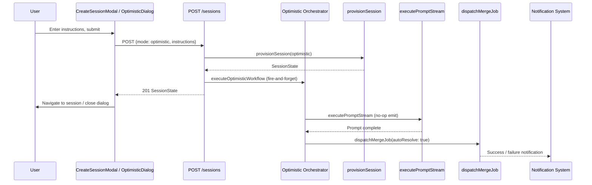
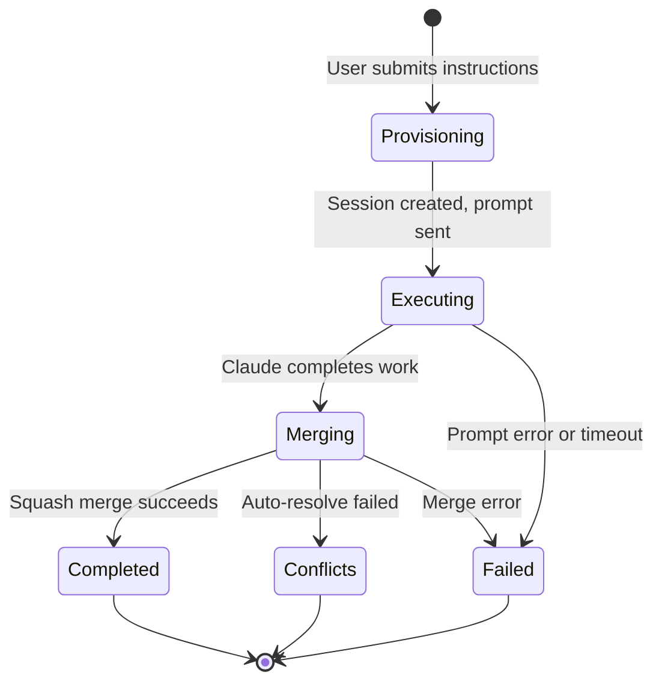

# Design Document: Optimistic Mode

## Overview

**Purpose**: Optimistic mode delivers a fire-and-forget autonomous development workflow where users submit instructions, and CC automatically creates a session, executes the work via Claude, and merges the result into main — all without further user interaction.

**Users**: Developers who notice small issues or desire simple changes and are confident Claude can implement them autonomously. They submit instructions from any project-related page and forget about it until a notification confirms the merge.

**Impact**: Extends the existing session creation infrastructure (fast/focus) with a third mode (`optimistic`). Adds a server-side orchestrator that chains session provisioning → prompt execution → smart merge into a single fire-and-forget pipeline.

### Goals
- Enable fire-and-forget development: submit instructions, walk away, changes land in main
- Provide dual UI entry points: optimistic tab in new session dialog + standalone quick-access dialog from project pages
- Reuse existing infrastructure: session provisioning, prompt execution, smart merge pipeline, notifications
- Maintain full observability: optimistic sessions appear in session list with status tracking

### Non-Goals
- No iterative conversation support — optimistic mode is single-prompt, single-merge
- No custom session naming — names are auto-generated from instructions
- No pre-merge user approval — the merge is automatic (that's the "optimistic" part)
- No Ralph Loop integration — optimistic mode is for simple tasks, not multi-iteration workflows

## Architecture

### Existing Architecture Analysis

The session creation system uses a discriminated union pattern:
- **Schema**: `sessionCreationModeSchema` enum (`"fast"` | `"focus"`) drives `createSessionRequestSchema` discriminated union
- **API**: `POST /api/projects/[name]/sessions` dispatches to `createSessionFast()` or `createSessionFocus()`
- **Provisioning**: Both modes share `provisionSession()` which creates worktree + branch + initial conversation + state
- **Prompt execution**: `executePromptStream()` handles the full SDK lifecycle with SSE streaming, transcript writing, and state management
- **Merge pipeline**: `dispatchMergeJob()` is a fire-and-forget function that commits, merges, resolves conflicts, and squash-merges into main

**Key extension points**:
- `sessionCreationModeSchema` — add `"optimistic"` variant
- `createSessionRequestSchema` — add optimistic discriminated union member
- `sessions.ts` — add `createSessionOptimistic()` function
- `prompt.ts` — reuse `executePromptStream()` with a no-op emitter for fire-and-forget execution

### Architecture Pattern & Boundary Map



**Architecture Integration**:
- Selected pattern: Server-side orchestrator — fire-and-forget async function coordinates the full lifecycle
- Domain boundaries: Session creation (synchronous, returns immediately) is separated from autonomous execution (async, runs in background)
- Existing patterns preserved: Same provisioning, prompt, merge, and notification pipelines
- New components: `executeOptimisticWorkflow()` orchestrator, `OptimisticDialog` UI component, optimistic tab in `CreateSessionModal`
- Steering compliance: Follows fire-and-forget pattern from background jobs; uses existing SDK integration patterns

### Technology Stack

| Layer | Choice / Version | Role in Feature | Notes |
|-------|------------------|-----------------|-------|
| Frontend | React 19 + Next.js 16 App Router | Optimistic dialog UI, modal tab, session badge | Reuses existing modal/voice patterns |
| Backend | Next.js API Routes | Session creation endpoint extension | Same POST route, extended schema |
| Data | JSON state file (atomic writes) | Session state with `creationMode: "optimistic"` | No schema migration needed — new enum value |
| Messaging | SSE broadcaster | Conversation status, job status, notifications | Existing infrastructure, no changes |
| SDK | `@anthropic-ai/claude-agent-sdk` | Prompt execution in optimistic sessions | Reuses `executePromptStream()` |

## System Flows

### Optimistic Workflow Lifecycle



Key decisions:
- The API returns `201` immediately after provisioning — the orchestrator runs in a detached async context
- If prompt execution fails (SDK error, timeout, abort), the orchestrator creates a failure notification and skips the merge phase
- The merge phase uses `autoResolve: true` — Claude attempts conflict resolution before falling back to `conflicts` status

### AskUserQuestion Suppression

When Claude invokes `AskUserQuestion` during optimistic mode execution:
1. The `canUseTool` callback detects the tool call
2. Instead of blocking on `registerQuestion()`, it returns `{ behavior: "deny", message: "..." }` with a message instructing Claude to use its best judgment and proceed autonomously — matching the proven Ralph Loop pattern in `orchestrator.ts`
3. Conversation status never enters `waiting_for_input`
4. The `deny` approach is preferred over `allow` with empty answers because it explicitly tells Claude the tool is unavailable rather than passing an empty structure where keyed answer strings are expected

## Requirements Traceability

| Requirement | Summary | Components | Interfaces | Flows |
|-------------|---------|------------|------------|-------|
| 1.1 | Open optimistic dialog from project pages | OptimisticDialog | — | — |
| 1.2 | Text input for instructions | OptimisticDialog | — | — |
| 1.3 | Voice recording support | OptimisticDialog (useVoiceRecorder) | — | — |
| 1.4 | Submit closes dialog, begins workflow | OptimisticDialog, createSessionOptimistic API | CreateSessionRequest | Optimistic Workflow |
| 1.5 | Empty submission prevention | OptimisticDialog | — | — |
| 2.1 | Three tabs in new session dialog | CreateSessionModal | — | — |
| 2.2 | Optimistic tab shows instructions input | CreateSessionModal | — | — |
| 2.3 | Submit from optimistic tab initiates workflow | CreateSessionModal, createSessionOptimistic API | CreateSessionRequest | Optimistic Workflow |
| 3.1 | Auto-generate session name from instructions | createSessionOptimistic | generateSessionName | — |
| 3.2 | Provision worktree and branch | provisionSession | — | Provisioning |
| 3.3 | Record session with mode: optimistic | sessionStateSchema | SessionState | — |
| 3.4 | Immediately send instructions as first prompt | executeOptimisticWorkflow | — | Executing |
| 4.1 | System instruction for autonomous work | executeOptimisticWorkflow | systemPrompt append | — |
| 4.2 | No permission/input requests to user | executeOptimisticWorkflow (canUseTool override) | — | AskUserQuestion Suppression |
| 4.3 | Auto-proceed to merge on completion | executeOptimisticWorkflow | dispatchMergeJob | Merging |
| 5.1 | Dispatch smart merge with auto-resolve | executeOptimisticWorkflow | dispatchMergeJob | Merging |
| 5.2 | Follow existing merge pipeline | dispatchMergeJob (unchanged) | — | Merging |
| 5.3 | Success notification on merge complete | dispatchMergeJob (unchanged) | createNotification | Completed |
| 5.4 | Failure notification on merge failure | dispatchMergeJob (unchanged) | createNotification | Failed/Conflicts |
| 6.1 | Optimistic sessions in session list | SessionsList | — | — |
| 6.2 | Show session status while running | StatusBadge, deriveSessionStatus | — | — |
| 6.3 | Display transcript and diff on selection | Session detail page (unchanged) | — | — |
| 6.4 | Visually distinguish optimistic sessions | SessionsList (badge) | — | — |

## Components and Interfaces

| Component | Domain/Layer | Intent | Req Coverage | Key Dependencies | Contracts |
|-----------|-------------|--------|--------------|------------------|-----------|
| sessionCreationModeSchema | Schema | Extend mode enum with "optimistic" | 3.3 | Zod (P0) | State |
| createSessionRequestSchema | Schema | Add optimistic variant to discriminated union | 2.3, 1.4 | Zod (P0) | API |
| createSessionOptimistic | Backend/Sessions | Provision session and launch orchestrator | 3.1, 3.2, 3.3, 3.4 | provisionSession (P0), generateSessionName (P0) | Service |
| executeOptimisticWorkflow | Backend/Orchestrator | Fire-and-forget prompt + merge pipeline | 4.1, 4.2, 4.3, 5.1 | executePromptStream (P0), dispatchMergeJob (P0) | Service |
| Sessions API route | Backend/API | Handle optimistic mode in POST handler | 1.4, 2.3 | createSessionOptimistic (P0) | API |
| CreateSessionModal (extended) | UI | Add optimistic tab to existing modal | 2.1, 2.2, 2.3 | useCreateSessionMutation (P0), useVoiceRecorder (P1) | — |
| OptimisticDialog | UI | Standalone dialog for quick access | 1.1, 1.2, 1.3, 1.4, 1.5 | useCreateSessionMutation (P0), useVoiceRecorder (P1) | — |
| SessionsList (extended) | UI | Show optimistic badge | 6.1, 6.4 | SessionState (P0) | — |

### Backend / Schema

#### sessionCreationModeSchema Extension

| Field | Detail |
|-------|--------|
| Intent | Add `"optimistic"` to the session creation mode enum |
| Requirements | 3.3 |

**Responsibilities & Constraints**
- Extend `z.enum(["fast", "focus"])` to `z.enum(["fast", "focus", "optimistic"])`
- Default remains `"fast"` for backward compatibility
- All code paths that switch on `creationMode` must handle the new value

**Contracts**: State [x]

##### State Management
- State model: `SessionState.creationMode` gains `"optimistic"` as a valid value
- Persistence: Serialized to `state.json` — backward compatible (existing sessions keep `"fast"` or `"focus"`)
- No migration required — new enum value is additive

#### createSessionRequestSchema Extension

| Field | Detail |
|-------|--------|
| Intent | Add optimistic variant to the discriminated union |
| Requirements | 1.4, 2.3 |

**Contracts**: API [x]

##### API Contract

New variant added to `createSessionRequestSchema`:

```typescript
z.object({
  mode: z.literal("optimistic"),
  instructions: z.string().trim().min(1),
})
```

The field is named `instructions` (not `objective`) to distinguish from focus mode's `objective` field — optimistic instructions are action-oriented ("fix the typo in X"), not exploratory.

### Backend / Orchestration

#### createSessionOptimistic

| Field | Detail |
|-------|--------|
| Intent | Create an optimistic session: provision, then launch fire-and-forget workflow |
| Requirements | 3.1, 3.2, 3.3, 3.4 |

**Responsibilities & Constraints**
- Generate session name from instructions via `generateSessionName()`
- Ensure name uniqueness within project
- Call `provisionSession()` with `mode: "optimistic"` and `objective: instructions`
- Launch `executeOptimisticWorkflow()` as a detached async operation (fire-and-forget)
- Return `SessionState` immediately (before prompt execution starts)

**Provisioning Behavior**: Optimistic mode receives fast-mode provisioning treatment — the initial conversation gets `role: null` (no initialization phase), and `memory-bank/focus.md` receives the fast-mode content. The `provisionSession()` mode branching at `sessions.ts:150,239` must be updated so that the focus-specific branch is gated on `opts.mode === "focus"` explicitly (not `opts.mode !== "fast"`), preventing optimistic sessions from accidentally inheriting focus-mode initialization behavior.

**Dependencies**
- Inbound: Sessions API route — creates optimistic session (P0)
- Outbound: `generateSessionName()` — derives session name (P0)
- Outbound: `provisionSession()` — creates worktree, branch, state (P0)
- Outbound: `executeOptimisticWorkflow()` — async pipeline (P0)

**Contracts**: Service [x]

##### Service Interface

```typescript
function createSessionOptimistic(
  projectPath: string,
  instructions: string,
): Promise<SessionState>
```

- Preconditions: `projectPath` is a valid project, `instructions` is non-empty
- Postconditions: Session exists in state with `creationMode: "optimistic"`, orchestrator launched
- Invariants: Session name is unique within project

#### executeOptimisticWorkflow

| Field | Detail |
|-------|--------|
| Intent | Fire-and-forget orchestrator: execute prompt, then dispatch merge |
| Requirements | 3.4, 4.1, 4.2, 4.3, 5.1 |

**Responsibilities & Constraints**
- Execute the user's instructions as a prompt via `executePromptStream()`
- Append an autonomous work directive to the system prompt via `session.objective`
- Suppress `AskUserQuestion` tool calls — auto-respond instead of blocking
- On successful prompt completion, dispatch `dispatchMergeJob()` with `autoResolve: true`
- On any failure, create a notification with error details
- Must not throw — all errors are caught and converted to notifications

**Dependencies**
- Inbound: `createSessionOptimistic()` — launches the workflow (P0)
- Outbound: `executePromptStream()` — runs the prompt (P0)
- Outbound: `dispatchMergeJob()` — merges result into main (P0)
- Outbound: `createNotification()` — reports errors (P1)
- External: `@anthropic-ai/claude-agent-sdk` — SDK query execution (P0)

**Contracts**: Service [x]

##### Service Interface

```typescript
function executeOptimisticWorkflow(params: {
  projectPath: string;
  projectName: string;
  session: SessionState;
  instructions: string;
}): void
```

- Preconditions: Session is provisioned, conversation exists in `new` status
- Postconditions: Prompt executed, merge dispatched (or failure notification created)
- Invariants: Function never throws; errors produce notifications
- The function is called with `void` — fire-and-forget pattern, no awaiting

**Implementation Notes**
- The `emit` callback passed to `executePromptStream()` is a no-op — there is no client SSE connection for this execution. Transcript writes and `broadcast()` calls inside `executePromptStream()` still function normally.
- The system prompt `append` for optimistic sessions includes both the instructions (as `<objective>`) and an autonomous work directive. The objective is already stored on `session.objective` and injected by `executePromptStream()`. An additional instruction is prepended: `"Complete the following task autonomously. Do not ask the user any questions. Begin work immediately."`
- For `AskUserQuestion` suppression: instead of calling `registerQuestion()` which blocks indefinitely, the `canUseTool` callback returns `{ behavior: "deny", message: "Autonomous optimistic mode — make your best judgment and proceed without asking questions." }`. This matches the proven Ralph Loop pattern in `orchestrator.ts:376-384` and explicitly tells Claude the tool is unavailable.
- After `executePromptStream()` returns, a brief delay (e.g., 500ms) precedes merge dispatch to allow state persistence to settle.

### Backend / API

#### Sessions API Route Extension

| Field | Detail |
|-------|--------|
| Intent | Handle `mode: "optimistic"` in the POST sessions endpoint |
| Requirements | 1.4, 2.3 |

**Contracts**: API [x]

##### API Contract

| Method | Endpoint | Request | Response | Errors |
|--------|----------|---------|----------|--------|
| POST | /api/projects/[name]/sessions | `{ mode: "optimistic", instructions: string }` | `SessionState` (201) | 400 (invalid), 409 (duplicate) |

The route handler adds a third branch:
```
body.mode === "optimistic" → createSessionOptimistic(projectPath, body.instructions)
```

Response is identical to fast/focus — returns the created `SessionState` with status 201. The orchestrator runs in the background.

### UI / Dialog

#### CreateSessionModal Extension

| Field | Detail |
|-------|--------|
| Intent | Add "Optimistic" tab to the new session dialog |
| Requirements | 2.1, 2.2, 2.3 |

**Responsibilities & Constraints**
- Add a third mode button: "Fast" | "Optimistic" | "Focus"
- When "Optimistic" is selected, display a textarea for instructions with voice recording button (same as focus mode)
- On submit, call `useCreateSessionMutation` with `{ mode: "optimistic", instructions }`
- After successful creation, close the dialog (do not navigate to session — fire-and-forget UX)
- Form hint: "Claude will complete this task and merge the result into main"

**Dependencies**
- Inbound: SessionsList — renders the modal (P0)
- Outbound: `useCreateSessionMutation` — POST to API (P0)
- Outbound: `useVoiceRecorder` — voice input (P1)

**Implementation Notes**
- Unlike focus mode, optimistic mode does not navigate to the session detail page on success. The dialog closes and a toast/notification confirms submission.
- The `canSubmit` logic extends to: `mode === "optimistic" ? instructions.trim().length > 0 : ...`
- Voice fire-and-forget (`Ctrl+Alt+V`) works the same as focus mode — auto-submits after transcription

#### OptimisticDialog

| Field | Detail |
|-------|--------|
| Intent | Standalone dialog accessible from any project page for quick optimistic mode access |
| Requirements | 1.1, 1.2, 1.3, 1.4, 1.5 |

**Responsibilities & Constraints**
- Lightweight modal: textarea for instructions + voice recording button + submit/cancel
- Receives `projectName` as prop (determined by which project page the user is on)
- On submit, calls the same `useCreateSessionMutation` with optimistic mode params
- On success, closes dialog (fire-and-forget)
- Empty instruction prevention — submit button disabled when instructions are empty

**Dependencies**
- Inbound: Project page layouts — trigger via hotkey or button (P0)
- Outbound: `useCreateSessionMutation` — POST to API (P0)
- Outbound: `useVoiceRecorder` — voice input (P1)

**Implementation Notes**
- Can be triggered via a global hotkey registered in the project layout
- Shares form logic with the optimistic tab in CreateSessionModal — consider extracting a shared `OptimisticForm` component to avoid duplication
- The dialog title: "Quick Task" or similar to distinguish from the full new session dialog

#### SessionsList Badge Extension

| Field | Detail |
|-------|--------|
| Intent | Display "optimistic" badge for optimistic mode sessions |
| Requirements | 6.1, 6.4 |

**Implementation Notes**
- Add a third badge case: `session.creationMode === "optimistic"` renders `<span className="session-badge optimistic">optimistic</span>`
- CSS class `session-badge.optimistic` follows existing badge styling pattern with a distinct color

## Data Models

### Domain Model

Optimistic mode extends the existing session domain with minimal changes:

- **SessionState aggregate**: `creationMode` gains `"optimistic"` value; `objective` stores the user's instructions; `finished` is set to `true` by the merge pipeline on success
- **ConversationState**: Standard conversation with `role: null` (same as fast mode); no initialization phase. The `provisionSession()` mode branching must use `opts.mode === "focus"` (not `!== "fast"`) to ensure optimistic sessions get fast-mode treatment
- **No new entities** — optimistic mode reuses sessions, conversations, background jobs, and notifications

### Logical Data Model

**SessionState changes**:
- `creationMode`: `"fast" | "focus" | "optimistic"` (was `"fast" | "focus"`)
- No new fields required — `objective` already exists and stores the instructions

**State file compatibility**: Additive change — existing `state.json` files parse correctly since `creationMode` defaults to `"fast"` and `"optimistic"` is only written for new sessions.

## Error Handling

### Error Strategy

Optimistic mode errors fall into two phases:

**Session creation phase** (synchronous, during API request):
- Name generation failure → 500 error returned to client
- Worktree creation failure → 500 error with rollback (existing `provisionSession` pattern)
- These are standard session creation errors — no new handling needed

**Orchestrator phase** (asynchronous, fire-and-forget):
- Prompt execution failure (SDK error, timeout, abort) → Create notification with error details, session remains in `awaiting` status
- Merge failure → Handled by existing `dispatchMergeJob()` error paths (creates notification)
- Unresolvable conflicts → `conflicts` notification created by merge pipeline

### Error Categories and Responses

**User Errors (4xx)**:
- Empty instructions → 400 validation error (Zod schema enforcement)
- Duplicate session name → 409 conflict (existing uniqueness check)

**System Errors (5xx)**:
- SDK query failure → Notification: "Optimistic task failed: {error message}"
- Merge infrastructure failure → Notification via existing merge error handling

### Monitoring

- Orchestrator logs events at each phase transition: `optimistic.workflow_start`, `optimistic.prompt_complete`, `optimistic.merge_dispatched`, `optimistic.failed`
- Existing prompt and merge logging provides full traceability via `traceId`

## Testing Strategy

### Unit Tests
- `createSessionOptimistic()` — verifies session provisioning with `mode: "optimistic"`, name generation, and orchestrator launch
- `executeOptimisticWorkflow()` — verifies prompt execution, merge dispatch on success, notification on failure
- `AskUserQuestion` suppression — verifies `canUseTool` denies with message for optimistic sessions (matching Ralph Loop pattern)
- `provisionSession` mode branching — verifies optimistic sessions get `role: null` and fast-mode `focus.md` content (not focus-mode initialization)
- Schema validation — verifies `createSessionRequestSchema` accepts optimistic variant

### Integration Tests
- Full optimistic workflow: submit instructions → session created → prompt runs → merge dispatched
- Error recovery: SDK error during prompt → notification created, no merge attempt
- Concurrent sessions: multiple optimistic sessions on the same project do not interfere

### E2E/UI Tests
- CreateSessionModal: selecting "Optimistic" tab, entering instructions, submitting
- OptimisticDialog: opening from project page, voice input, submit and close
- Session list: optimistic badge displayed, status progression visible
