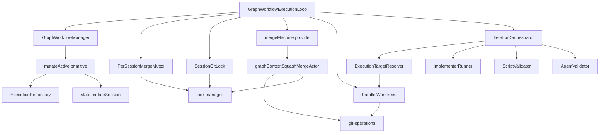
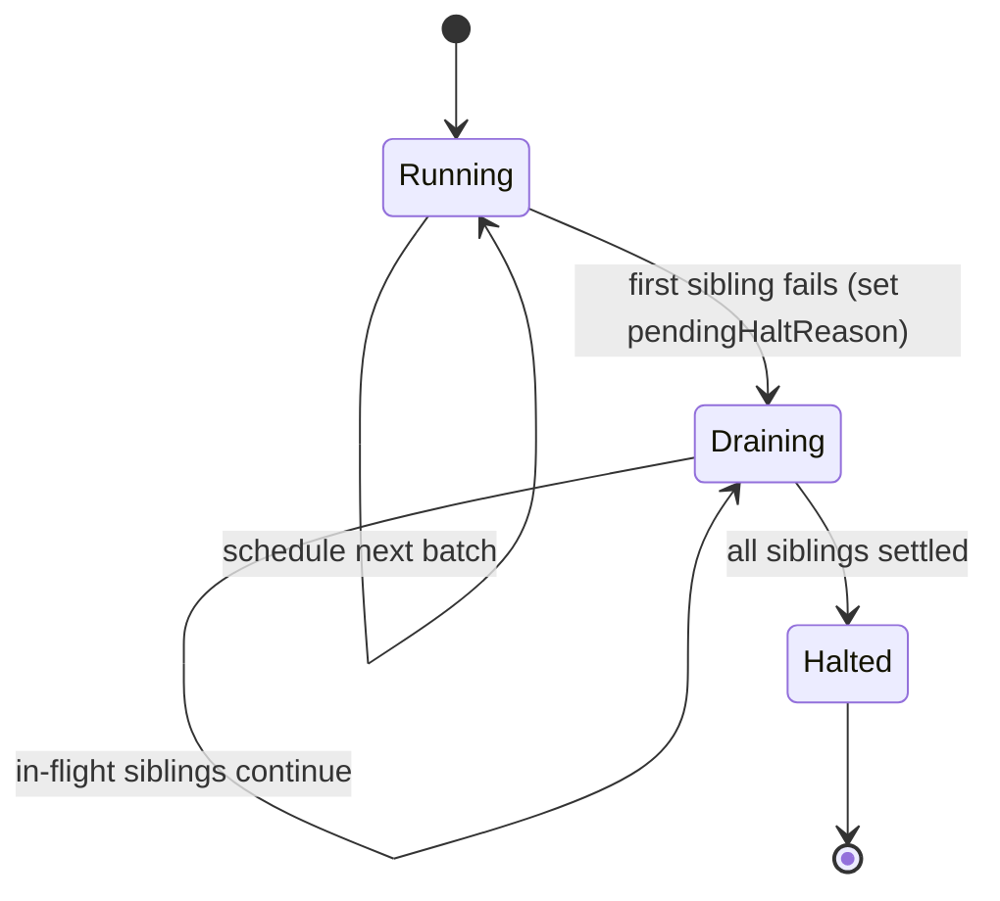
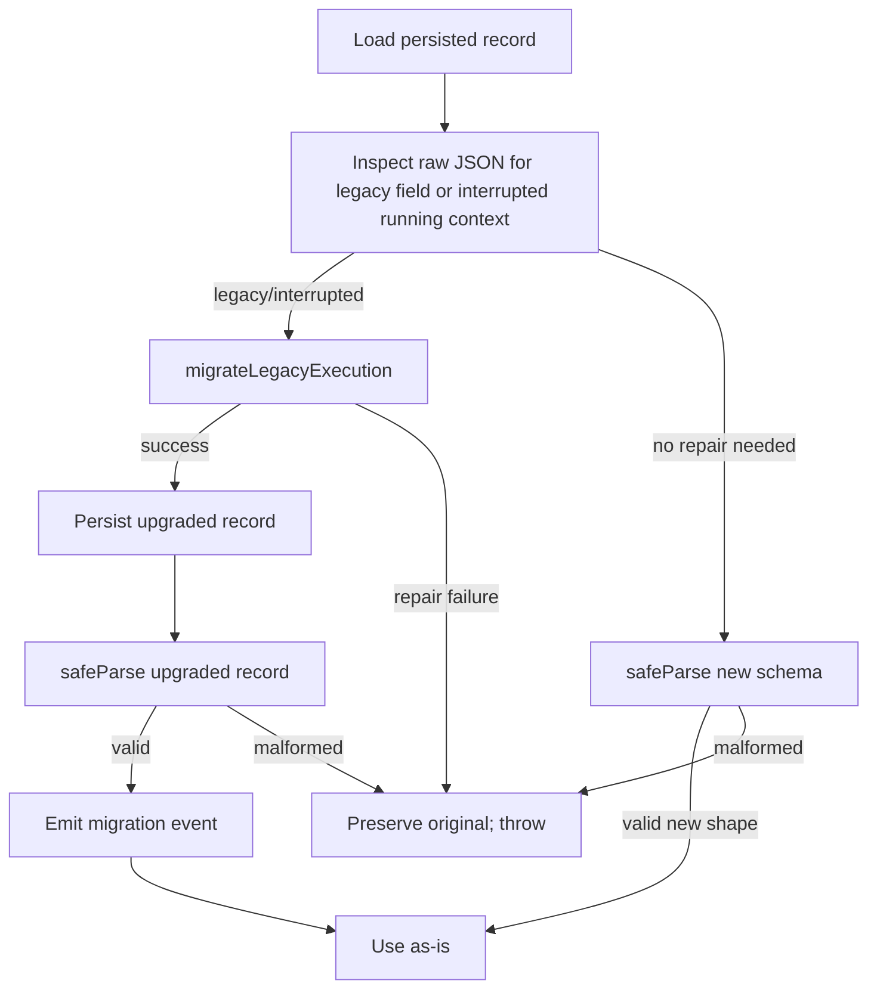

# Design Document — Parallel Execution Contexts in Graph Workflow

## Overview

**Purpose**: Make the Graph Workflow engine actually execute eligible-in-parallel contexts concurrently, while preventing the file-edit conflicts a naive parallel implementation would cause. Each parallel sibling runs in its own git worktree on its own branch (branched from the session branch); on completion, the sibling's branch is merged back into the **session branch** via the existing smart-merge state machine, with autonomous LLM-driven conflict resolution.

**Users**: Operators of unattended Graph Workflows. The change is transparent to workflow authors — parallelism is derived from the dependency graph, not a flag.

**Impact**: The persisted execution shape changes (`activeContextId` → `activeContextIds[]`, lane state becomes context-scoped, per-context worktree fields appear, halt-reason union grows a `merge_failure` variant). The execution loop gains a fan-out/fan-in batch model with a per-session FIFO merge mutex and drain-then-halt failure semantics. The merge machine is reused unchanged except for a `.provide()`'d non-finalizing squash actor.

### Goals

- Run all DAG-eligible contexts concurrently when more than one is eligible at a scheduling tick.
- Prevent concurrent edit conflicts via per-context worktrees and serialized session-branch fan-in.
- Resolve fan-in merge conflicts autonomously via the existing `resolveConflictsActor`.
- Preserve zero-overhead behavior for serial workflows (solo-eligible contexts continue to run inside the session worktree).
- Drain in-flight siblings before halting on first failure; persist the halt reason across restarts.

### Non-Goals

- Cross-process coordination or distributed locking. The engine remains single-process per `<projectPath>::<sessionName>`.
- Backwards-compatibility shims for the legacy `activeContextId` field; persisted records are actively migrated, not silently defaulted.
- A `parallel: true` workflow-level flag; parallelism is purely a function of DAG eligibility.
- New UI surfaces for retained failed worktrees (future feature).
- Adjusting per-backend concurrent-turn rate limits (existing per-conversation locking is sufficient).

## Architecture

### Existing Architecture Analysis

- **Single-active-context assumption** in `GraphWorkflowExecution.activeContextId` and the loop's "schedule next → run → schedule next" cycle. This must generalize to a set without forking the engine.
- **Smart-merge machine** (`src/lib/workflows/merge/machine.ts`) is already parameterized over `targetBranch` and `targetWorktreePath`; only its default squash actor is unsuitable for graph fan-in (it finalizes the session). XState v5 `.provide()` is the supported variation point.
- **Repository write semantics** (`update(execution)`) are last-write-wins. With one active context, this is safe. With N active contexts completing concurrently, every state-mutating call site must route through a load-mutate-write critical section.
- **Lane state** (`laneStates: Record<lane, LaneState>`) is keyed by lane only. Sibling implementer turns would overwrite each other's continuity. The schema must promote keying to `Record<contextId, Record<lane, LaneState>>`.
- **Worktree pattern** at `src/lib/sessions.ts:204-311` is the canonical reference for `git worktree add -b <branch> <path> <baseBranch>`, with `existsSync` precheck and atomic state-then-disk creation.
- **Lock layering** (session, project, conversation) is already supported by `src/lib/lock.ts`; the only new lock is a per-session merge FIFO mutex keyed identically to the loop registry (`<projectPath>::<sessionName>`).
- **Conversation actor worktree binding** currently comes from `ensureConversationActor`, which loads `session.worktreePath` from persisted session state. Passing a shadow `SessionState` to `executePromptStream` is not sufficient; graph workflow calls must explicitly pass the resolved `ExecutionTarget` into the prompt/conversation actor boundary so the backend runtime is created against the child worktree.

### Architecture Pattern & Boundary Map



**Architecture Integration**:

- **Selected pattern**: Fan-out / fan-in with per-context isolation. Single-process orchestrator; in-process FIFO merge mutex; existing graph engine, merge machine, conversation actor, and git-operations as composed primitives.
- **Domain/feature boundaries**:
  - Scheduling and batching live in `workflow-manager` (replacing `scheduleNextContext` with `scheduleEligibleContexts`).
  - Concurrent task orchestration and merge fan-in live in `execution-loop`.
  - Worktree provisioning/disposal lives in a new `parallel-worktrees` module.
  - Worktree routing for agent invocations lives in a new `ExecutionTargetResolver` consumed by the implementer runner, script validator, and agent validator.
  - The graph-workflow MCP tool surface (`workflow-execution-server`, `tool-server`, runtime edits, shared-document registration) becomes explicitly context-scoped: authorization, conversation lookup, and artifact-path validation are keyed by `contextId` plus the resolved execution target, never by a singleton active-context field.
  - Prompt/conversation actor creation accepts the resolved execution target explicitly; it must not infer graph context worktree paths from persisted `SessionState`.
  - State mutation atomicity lives in a new `mutateActive` primitive on the workflow manager.
  - Session-non-finalizing squash lives in a new `graphContextSquashMergeActor`.
  - Session-facing observability (`execution-events`, execution summaries, active-workflow listings) is generalized from one active context to batch-aware status payloads that expose `activeContextIds`, per-context titles, pending halt state, and merge progress.
- **Existing patterns preserved**: `createX(deps)` factory; XState `.provide()` for actor variation; `getEligibleContextIds` unchanged; `createLogger` namespacing; layered lock manager; per-execution structured logger.
- **New components rationale**: `parallel-worktrees` (testable git ops, no concern leakage); `ExecutionTargetResolver` (single source of truth for "where should this context's agent run?"); `GraphWorkflowExecutionToolContext` (removes single-active assumptions from graph tool calls and shared-document registration); `GraphWorkflowStatusSurface` (keeps SSE and summary APIs aligned with the multi-active execution model); `mutateActive` (deterministic atomicity primitive); `graphContextSquashMergeActor` (session-non-finalizing variant); `PerSessionMergeMutex` (FIFO ordering for graph-internal fan-in); `SessionGitLock` (shared session-worktree mutation lock against user commit/merge jobs).
- **Steering compliance**:
  - `engineering-principles.md` "composable primitives, not feature silos" — every change is additive on existing primitives.
  - `engineering-principles.md` "agent-offloading" — scheduling, worktree creation/teardown, mutex, halt accounting are deterministic; the agent is invoked only for code edits and the existing `resolveConflictsActor` for conflict resolution.
  - `tech.md` "schema-first" — every new persisted shape is a Zod schema in `src/lib/schemas.ts`; types via `z.infer`.
  - `structure.md` "colocated tests" — every new module gets a `*.test.ts` colocated alongside it.

### Technology Stack

| Layer | Choice / Version | Role in Feature | Notes |
|-------|------------------|-----------------|-------|
| Backend / Services | TypeScript (`strict`, `noUncheckedIndexedAccess`) | Workflow engine, runtime types | No `any`, no `as unknown as T` |
| Backend / Services | XState v5 | Smart-merge machine reuse via `.provide()` | New `graphContextSquashMergeActor` only |
| Backend / Services | Zod v4 | Schema generalization & migration | `safeParse` at persisted boundary; `parse` for in-process |
| Data / Storage | JSON state file via `mutateSession` | Atomic per-session execution mutation | New `mutateActive` primitive funnels every state-mutating call site |
| Infrastructure / Runtime | git via `git-operations` + `defaultGitClient` | Per-context worktree provisioning, sibling-branch merges, fan-in squash | `git worktree add/remove`, `mergeTargetIntoFeature`, `squashMerge` |
| Messaging / Events | SSE via execution event publisher | `pendingHaltReason`, `merge_failure` halt reason, batch/merge structured logs | Existing channel; new event types |

## System Flows

### Fan-out / fan-in lifecycle

```mermaid
sequenceDiagram
    participant Loop
    participant Manager
    participant Resolver
    participant PWT as ParallelWorktrees
    participant IterOrch
    participant Mutex as PerSessionMergeMutex
    participant Lock as SessionGitLock
    participant Merge as mergeMachine
    participant Mutator
    participant Repo

    Loop->>Manager: scheduleEligibleContexts
    Manager-->>Loop: batchId, contextIds
    alt batch size = 1
        Loop->>IterOrch: runIteration ctxA on session worktree
    else batch size >= 2
        Loop->>PWT: provision per context
        PWT-->>Loop: worktreePath, branchName
        par per context
            Loop->>IterOrch: runIteration ctxA on subA
            Loop->>IterOrch: runIteration ctxB on subB
        end
    end
    IterOrch-->>Loop: result A
    IterOrch-->>Loop: result B
    Loop->>Mutex: acquire graph merge mutex
    Mutex-->>Loop: granted ctxA
    Loop->>Lock: acquire session git lock
    Loop->>Merge: invoke for ctxA into session branch
    Merge-->>Loop: completed
    Loop->>Lock: release session git lock
    Loop->>Mutator: set ctxA mergeStatus=merged-success
    Loop->>PWT: dispose ctxA
    Mutex->>Loop: release ctxA
    Mutex-->>Loop: granted ctxB
    Loop->>Lock: acquire session git lock
    Loop->>Merge: invoke for ctxB into session branch
    Merge-->>Loop: completed or merge_failure
    Loop->>Lock: release session git lock
    Loop->>Mutator: persist outcome
```

**Key flow decisions**:

- The graph merge mutex is acquired **after** the agent turn completes; the shared session git lock is acquired inside that mutex and before the merge machine is constructed. Both locks release in `finally` so failures cannot strand either lock.
- A failed merge does not retry siblings — it sets `pendingHaltReason = { type: "merge_failure", ... }` and the loop drains.
- Cleanup (`PWT.dispose`) is gated on `mergeStatus === "merged-success"` and never on the failure path.

### Drain-then-halt



- A "first failure" is any of: recovery error, circuit-breaker trip, max iterations exhaustion, merge failure (post-auto-resolve).
- A second failure during drain is logged but does not overwrite the original `pendingHaltReason`.
- `pendingHaltReason` is persisted atomically with the failure-recording write so a process crash mid-drain restarts cleanly.

## Requirements Traceability

| Requirement | Summary | Components | Interfaces | Flows |
|-------------|---------|------------|------------|-------|
| 1.1, 1.2, 1.3, 1.4, 1.5 | Parallel scheduling derived from DAG | GraphWorkflowManager, GraphWorkflowExecutionLoop | `scheduleEligibleContexts` | Fan-out / fan-in lifecycle |
| 2.1, 2.2, 2.3, 2.4, 2.5 | Per-context worktree isolation | ParallelWorktrees, ExecutionTargetResolver, GraphWorkflowExecutionToolContext, GraphWorkflowSharedDocumentRegistryService | `ParallelWorktrees.provision/dispose`, `ExecutionTargetResolver.resolve`, `GraphWorkflowExecutionToolContext.create` | Fan-out / fan-in lifecycle |
| 3.1, 3.2 | Solo-eligible behavior preserved | GraphWorkflowManager, GraphWorkflowExecutionLoop | `scheduleEligibleContexts` (size-1 branch) | Fan-out / fan-in lifecycle |
| 4.1, 4.2, 4.3, 4.4, 4.5, 4.6, 4.7 | Smart-merge fan-in into session branch | GraphWorkflowExecutionLoop, mergeMachine, graphContextSquashMergeActor | `MergeInput`, `mergeMachine.provide` | Fan-out / fan-in lifecycle |
| 5.1, 5.2, 5.3 | Autonomous conflict resolution | mergeMachine (`resolveConflictsActor`) | reuse | Fan-out / fan-in lifecycle |
| 6.1, 6.2, 6.3, 6.4 | Merge serialization per session | PerSessionMergeMutex, SessionGitLock, lock manager | `withMergeMutex`, `withSessionGitLock`, `acquireProjectLock` | Fan-out / fan-in lifecycle |
| 7.1, 7.2, 7.3, 7.4 | Failure-drain semantics | GraphWorkflowExecutionLoop, GraphWorkflowManager | `recordPendingHaltReason`, `drainAndHalt` | Drain-then-halt |
| 8.1, 8.2, 8.3 | Halt-reason persistence | GraphWorkflowExecutionRepository, GraphWorkflowStatusSurface, normalizeAfterRestart | persisted `pendingHaltReason`, `GraphWorkflowStatusEvent` | Drain-then-halt |
| 9.1, 9.2, 9.3, 9.4, 9.5 | Schema generalization | schemas.ts, GraphWorkflowStatusSurface | `graphWorkflowExecutionSchema`, `graphWorkflowExecutionContextStateSchema`, `graphWorkflowHaltReasonSchema`, `graphWorkflowLaneStateSchema`, `graphWorkflowSseEventSchema` | — |
| 10.1, 10.2, 10.3, 10.4, 10.5 | Active schema cutover and restart recovery | GraphWorkflowExecutionRepository (load path), normalizeAfterRestart | `migrateLegacyExecution` | — |
| 11.1, 11.2, 11.3 | Atomic context-scoped state mutations | GraphWorkflowManager `mutateActive`, GraphWorkflowExecutionToolContext, IterationOrchestrator | `mutateActive(projectPath, sessionName, fn)` | — |
| 12.1, 12.2, 12.3 | Context-scoped lane state | schemas.ts, ImplementerRunner, ValidatorRunner, GraphWorkflowManager | promoted lane keying | — |
| 13.1, 13.2, 13.3, 13.4 | Worktree lifecycle on success and failure | ParallelWorktrees, GraphWorkflowExecutionLoop | `dispose`, gated cleanup | Fan-out / fan-in lifecycle |
| 14.1, 14.2 | Single-process loop scope | execution-loop `activeLoops`, PerSessionMergeMutex | `loopKey` reuse | — |
| 15.1, 15.2, 15.3, 15.4 | Composability | All listed components | reuse over fork | — |
| 16.1, 16.2, 16.3, 16.4 | Type safety | schemas.ts, all new modules | Zod end-to-end | — |
| 17.1, 17.2, 17.3, 17.4 | Observability | createLogger, executionLogger, GraphWorkflowStatusSurface, SSE publisher | `graph-workflow.parallel.*`, `graph-workflow.merge.*`, `GraphWorkflowExecutionSummary` | — |
| 18.1, 18.2, 18.3 | Test discipline | All tests | DI everywhere; integration scenarios | — |

## Components and Interfaces

### Summary

| Component | Domain/Layer | Intent | Req Coverage | Key Dependencies (P0/P1) | Contracts |
|-----------|--------------|--------|--------------|--------------------------|-----------|
| GraphWorkflowManager | Orchestration | Owns execution lifecycle and atomic state mutation | 1.1, 1.2, 1.3, 1.4, 1.5, 7.1, 7.2, 7.3, 7.4, 8.1, 8.2, 8.3, 11.1, 11.2, 11.3 | ExecutionRepository (P0), state.mutateSession (P0) | Service, State |
| GraphWorkflowExecutionLoop | Orchestration | Concurrent batch runner; merge fan-in driver | 1.2, 1.3, 1.5, 4.x, 6.1, 6.2, 7.1, 7.2, 7.4, 13.1, 13.3 | GraphWorkflowManager (P0), mergeMachine (P0), ParallelWorktrees (P0), PerSessionMergeMutex (P0), SessionGitLock (P0) | Service |
| ParallelWorktrees | Git ops | Provision/dispose per-context worktrees | 2.1, 2.2, 2.4, 2.5, 13.1, 13.2, 13.3, 13.4 | git-operations (P0), defaultGitClient (P0) | Service |
| ExecutionTargetResolver | Routing | Single source of truth for per-context worktreePath/branchName | 2.3, 3.2 | Execution state (P0) | Service |
| GraphWorkflowExecutionToolContext | Integration | Context-scoped binding for `complete_task`, `add_task`, and `upsert_shared_document` under `activeContextIds` | 1.2, 2.3, 11.2, 12.2 | GraphWorkflowManager (P0), ExecutionTargetResolver (P0), GraphWorkflowRuntimeEditService (P0), GraphWorkflowSharedDocumentRegistryService (P0) | Service |
| GraphWorkflowStatusSurface | Presentation | Batch-aware SSE/status/API projection for active contexts, halt state, and merge progress | 8.3, 9.1, 17.1, 17.2, 17.3, 17.4 | GraphWorkflowExecutionEventPublisher (P0), route handlers (P1), schemas.ts (P0) | Service |
| PerSessionMergeMutex | Concurrency | FIFO serialization of graph-internal fan-in merges per session | 6.1, 14.1 | none | Service |
| SessionGitLock | Concurrency | Shared lock around session worktree mutations, including graph fan-in and user commit/merge jobs | 6.2, 6.3 | lock manager (P0) | Service |
| graphContextSquashMergeActor | Merge actor | Non-finalizing squash for graph fan-in | 4.4, 6.4 | git-operations.squashMerge (P0), lock.acquireProjectLock (P0) | Service |
| mergeMachine.provide | XState binding | Bind graph squash actor without forking machine | 4.x, 5.x, 15.2 | mergeMachine (P0) | State |
| ImplementerRunner | Agent invocation | Implementer turn against the resolved worktree | 1.5, 2.3, 12.2 | executePromptStream (P0), ConversationManager (P0), ExecutionTargetResolver (P0) | Service |
| Validator runners | Agent invocation | Script + agent validator turn against resolved worktree | 2.3 | ExecutionTargetResolver (P0) | Service |
| GraphWorkflowSharedDocumentRegistryService | Artifact | Registers shared documents against the resolved execution target while preserving repo-relative discoverability after merge | 2.3, 11.2 | ArtifactRegistry (P0), ExecutionTargetResolver (P0), GraphWorkflowManager (P0) | Service |
| GraphWorkflowExecutionRepository (load path) | Persistence | Active migration on load; persist `pendingHaltReason` | 8.1, 8.2, 9.x, 10.x | safeParse (P0), state.mutateSession (P0) | State |
| schemas.ts | Schema | New shapes: active set, per-context worktree fields, halt-reason variant, pending halt reason, context-scoped lane state | 9.x, 16.x | Zod (P0) | State |

### Orchestration

#### GraphWorkflowManager

| Field | Detail |
|-------|--------|
| Intent | Owns execution lifecycle; replaces `scheduleNextContext` with `scheduleEligibleContexts`; introduces `mutateActive` primitive; records `pendingHaltReason`. |
| Requirements | 1.1, 1.2, 1.3, 1.4, 1.5, 7.1, 7.2, 7.3, 7.4, 8.1, 8.2, 8.3, 11.1, 11.2, 11.3 |

**Responsibilities & Constraints**

- Schedule eligible contexts atomically (compute `getEligibleContextIds`, branch on size, transition all selected contexts to `running`, set `activeContextIds`, assign a `batchId`, return scheduling decision).
- Provide `mutateActive(projectPath, sessionName, fn)` — the only state-mutation entry point — that loads, applies `fn`, and writes back inside a `state.mutateSession` critical section.
- Record `pendingHaltReason` atomically with the failure write that triggered it; surface via SSE.
- Drain-then-halt: when no in-flight siblings remain and `pendingHaltReason` is set, transition to `halted` with the original reason.
- Solo-eligible scheduling stays unchanged in observable behavior: no sub-worktree, no merge invocation; lane state remains scoped to the solo context.

**Dependencies**

- Inbound: `GraphWorkflowExecutionLoop` (P0), API route handlers (P1).
- Outbound: `GraphWorkflowExecutionRepository` (P0), `state.mutateSession` (P0), `getEligibleContextIds` (P0).
- External: none.

**Contracts**: Service [x] / State [x]

##### Service Interface

```typescript
interface GraphWorkflowManager {
  scheduleEligibleContexts(input: {
    projectPath: string;
    sessionName: string;
  }): Promise<{
    execution: GraphWorkflowExecution;
    scheduled:
      | { kind: "none" }
      | { kind: "solo"; contextId: string }
      | { kind: "parallel"; batchId: string; contextIds: string[] };
  }>;

  mutateActive(
    projectPath: string,
    sessionName: string,
    fn: (execution: GraphWorkflowExecution) => GraphWorkflowExecution,
  ): Promise<GraphWorkflowExecution>;

  recordPendingHaltReason(input: {
    projectPath: string;
    sessionName: string;
    reason: GraphWorkflowHaltReason;
  }): Promise<{
    execution: GraphWorkflowExecution;
    accepted: boolean;
  }>;

  drainAndHalt(input: {
    projectPath: string;
    sessionName: string;
  }): Promise<GraphWorkflowExecution>;

  start(input: GraphWorkflowStartInput): Promise<GraphWorkflowExecution>;
  send(
    projectPath: string,
    sessionName: string,
    event: GraphWorkflowManagerEvent,
  ): Promise<GraphWorkflowExecution>;
  resume(
    projectPath: string,
    sessionName: string,
  ): Promise<GraphWorkflowExecution>;
  normalizeAfterRestart(
    projectPath: string,
    sessionName: string,
  ): Promise<GraphWorkflowExecution | null>;
  recoverRetryableIterationError(
    projectPath: string,
    sessionName: string,
    input: GraphWorkflowRetryableIterationErrorInput,
  ): Promise<GraphWorkflowExecution>;
  resetContext(
    projectPath: string,
    sessionName: string,
    contextId: string,
  ): Promise<GraphWorkflowExecution>;
  hasActive(projectPath: string, sessionName: string): Promise<boolean>;
}
```

- Preconditions: `scheduleEligibleContexts` requires `execution.status === "running"`. `recordPendingHaltReason.accepted` is `true` only when the field is currently `null` (first-failure-wins).
- Postconditions: every state mutation persists exactly once; `mutateActive` never returns a stale execution.
- Invariants: `activeContextIds` and `contextStates[id].status === "running"` are kept in lockstep. `pendingHaltReason !== null` ⇒ no further batches scheduled.

##### State Management

- State model: `GraphWorkflowExecution` (Zod-validated). Persisted via the existing repository.
- Persistence & consistency: every mutation path goes through `mutateActive` → `state.mutateSession` → repository write → SSE publish. Callers never reach the repository directly.
- Concurrency strategy: per-session in-memory critical section (FIFO).

**Implementation Notes**

- Integration: replace every existing `await deps.executionRepository.update(...)` call (in `start`, `send`, `resume`, `normalizeAfterRestart`, `scheduleNextContext`, `recoverRetryableIterationError`, `resetContext`) with `mutateActive`. Ensure `start`'s create-then-update can be expressed as `create + mutateActive`. The same rule applies to graph-workflow tool handlers, runtime edits, shared-document registration, and iteration-orchestrator persistence helpers; no parallel-safe write path bypasses the manager.
- Validation: assert that no production module outside the workflow manager imports `executionRepository.update` (enforced via narrowed exported surface). Tests assert that two concurrent `mutateActive` calls are observed in serial order.
- Risks: a hidden caller bypassing `mutateActive` re-introduces the lost-update race. Mitigation: narrow the `update` visibility on the manager surface so only `mutateActive` reaches the repository.

#### GraphWorkflowExecutionLoop

| Field | Detail |
|-------|--------|
| Intent | Drives concurrent batches: schedule → run all → fan-in merge under per-session mutex → schedule next; drains on first failure. |
| Requirements | 1.2, 1.3, 1.5, 4.x, 6.1, 6.2, 7.1, 7.2, 7.4, 13.1, 13.3 |

**Responsibilities & Constraints**

- For each iteration of the outer loop:
  1. Call `manager.scheduleEligibleContexts`. If `pendingHaltReason` is set or no contexts are scheduled and none are running, exit.
  2. For each scheduled context, build a per-context `RunIterationInput` whose `worktreePath` is resolved by `ExecutionTargetResolver`. Solo-eligible: session worktree, no merge.
  3. Spawn one `Promise` per scheduled context calling `iterationOrchestrator.runIteration(...)`. Track in `inFlight: Map<contextId, Promise>`.
  4. As each promise settles: if the context is parallel, acquire the per-session graph merge mutex, then acquire the shared session git lock, invoke `mergeMachine.provide({ actors: { squashMerge: graphContextSquashMergeActor } })` with the appropriate `MergeInput`, await the actor's terminal state, release the session git lock in `finally`, persist `mergeStatus`, dispose the worktree on success, set `pendingHaltReason` on failure.
  5. After the batch settles (or earlier if `pendingHaltReason` was set), continue the outer loop. Solo-context completion remains identical to current behavior.
  6. On drain completion (no in-flight siblings + `pendingHaltReason` set), call `manager.drainAndHalt`.
- Drain-then-halt is the only halt path now; existing one-shot `manager.send({ type: "halt", reason })` calls funnel through `recordPendingHaltReason` + `drainAndHalt`.

**Dependencies**

- Inbound: `startGraphWorkflowExecutionLoop` callers (route handlers).
- Outbound: `GraphWorkflowManager` (P0), `IterationOrchestrator` (P0), `ParallelWorktrees` (P0), `mergeMachine` (P0), `PerSessionMergeMutex` (P0), `SessionGitLock` (P0), `ExecutionTargetResolver` (P0).

**Contracts**: Service [x]

##### Service Interface

```typescript
interface GraphWorkflowExecutionLoopDeps {
  workflowManager: GraphWorkflowManager;
  iterationOrchestrator: {
    runIteration(input: RunIterationContextInput): Promise<GraphWorkflowIterationResult>;
  };
  parallelWorktrees: ParallelWorktrees;
  mergeMutex: PerSessionMergeMutex;
  sessionGitLock: SessionGitLock;
  emitStreamFrame?(
    projectPath: string,
    sessionName: string,
    frame: GraphWorkflowStreamFrame,
  ): void;
  runCircuitBreakerGate?(input: RunCircuitBreakerGateInput): CircuitBreakerGateResult;
  buildGraphMergeMachine(input: GraphMergeMachineInput): MergeMachineType;
}

function createGraphWorkflowExecutionLoop(
  deps: GraphWorkflowExecutionLoopDeps,
): { run(input: GraphWorkflowExecutionLoopInput): Promise<GraphWorkflowExecution> };
```

- Preconditions: `activeLoops.has(loopKey)` is enforced single-flight per session.
- Postconditions: every scheduled context's `mergeStatus` is set on settle; either `merged-success` (worktree disposed) or `merged-failed` / `conflicts` (worktree retained).
- Invariants: outer loop never schedules a new batch while `pendingHaltReason` is set; in-flight siblings always run their merge step before the loop transitions to halted.

**Implementation Notes**

- Integration: `iterationOrchestrator.runIteration` widens to accept an `executionTarget` (resolved worktreePath/branchName) instead of inferring from `session.worktreePath`. This is the only schema change to the iteration orchestrator's input.
- Validation: a per-batch invariant test asserts that `Promise.allSettled` over the batch covers all scheduled contexts, graph fan-in is serialized via the mutex, and session worktree mutation is blocked while a simulated user commit/merge job holds the same session git lock.
- Risks: a runaway agent turn extending past sibling completion blocks the next batch. Mitigation: this is intentional under the current design — the next batch's eligibility is recomputed from the persisted state after fan-in, so blocking is correct.

### Git Ops

#### ParallelWorktrees

| Field | Detail |
|-------|--------|
| Intent | Provision and dispose per-context git worktrees branched from the session branch. |
| Requirements | 2.1, 2.2, 2.4, 2.5, 13.1, 13.2, 13.3, 13.4 |

**Responsibilities & Constraints**

- `provision({ projectPath, sessionDir, sessionBranch, contextId })` validates the contextId as a safe path/branch component, returns `{ worktreePath, branchName }`, runs `git worktree add -b <branchName> <worktreePath> <sessionBranch>` via `defaultGitClient`. Idempotent: if `existsSync(worktreePath)`, asserts the branch matches and returns it; otherwise fails.
- `dispose({ projectPath, worktreePath, branchName })` runs `git worktree remove --force <worktreePath>` then `git branch -D <branchName>`. Cleanup failures are surfaced as `cleanupStatus: "failed"` to the caller; not thrown.
- Branch derivation: `csm/<sessionDir>-<contextId>`. Worktree path: `<projectPath>/.worktrees/<sessionDir>.<contextId>`. ContextId validation: `/^[A-Za-z0-9_.-]+$/` and not starting with `.` or `-`.

**Dependencies**

- Outbound: `defaultGitClient` (P0), `node:fs.existsSync` (P0).
- External: git CLI (P0).

**Contracts**: Service [x]

##### Service Interface

```typescript
interface ParallelWorktrees {
  provision(input: {
    projectPath: string;
    sessionDir: string;
    sessionBranch: string;
    contextId: string;
  }): Promise<{ worktreePath: string; branchName: string }>;

  dispose(input: {
    projectPath: string;
    worktreePath: string;
    branchName: string;
  }): Promise<{ status: "removed" } | { status: "failed"; reason: string }>;
}

function createParallelWorktrees(deps?: { gitClient?: GitClient }): ParallelWorktrees;
```

- Preconditions: `provision` requires `<projectPath>/.worktrees/` to exist (it does — sessions provision into the same directory).
- Postconditions: on `provision` success, the branch and worktree exist and the branch tip equals the session branch tip at provision time.
- Invariants: `dispose` is non-throwing; failures are returned as `{ status: "failed", reason }`.

**Implementation Notes**

- Integration: mirror the `provisionSession` pattern (`src/lib/sessions.ts:204-311`).
- Validation: tests run against a real ephemeral git repo (no `vi.mock` of internal modules); contextId validation tested for path-traversal and branch-illegal characters.
- Risks: stale `.git/worktrees/<name>` metadata if `git worktree remove` fails after directory deletion. Mitigation: `dispose` runs `git worktree prune` after a `remove --force` failure as best-effort.

### Routing

#### ExecutionTargetResolver

| Field | Detail |
|-------|--------|
| Intent | Single source of truth for "where should this context's agent run?" — consumed by implementer runner, script validator, agent validator. |
| Requirements | 2.3, 3.2 |

**Responsibilities & Constraints**

- `resolve({ execution, contextId, session })` returns `{ worktreePath, branchName, isolation: "session" | "worktree" }`. If the context's persisted state has a `worktreePath` and `branchName`, return those with `isolation: "worktree"`. Otherwise fall back to `session.worktreePath` / `session.branchName` with `isolation: "session"`.

**Dependencies**

- Inbound: `ImplementerRunner`, script validator, agent validator.

**Contracts**: Service [x]

##### Service Interface

```typescript
interface ExecutionTarget {
  worktreePath: string;
  branchName: string;
  isolation: "session" | "worktree";
}

interface ExecutionTargetResolver {
  resolve(input: {
    execution: GraphWorkflowExecution;
    contextId: string;
    session: SessionState;
  }): ExecutionTarget;
}
```

- Preconditions: `contextId` exists in `execution.contextStates`.
- Postconditions: returned `worktreePath` is an absolute path that exists on disk.
- Invariants: solo-eligible contexts always resolve to `isolation: "session"` (no per-context worktree was provisioned).

**Implementation Notes**

- Integration: `ImplementerRunner.RunIterationInput` widens with `executionTarget` instead of relying on `session.worktreePath` directly. The runner passes `executionTarget` through `executePromptStream` options; `executePromptStream` passes the target into `ensureConversationActor` so the conversation actor input uses the resolved worktree path instead of reloading `session.worktreePath` from persisted session state. The same resolver is reused by the script validator, agent validator, and graph-workflow tool binding so every graph-context side effect uses the same worktree/branch decision. The prompt/conversation registry key remains `(projectPath, sessionName, conversationId)` so transcript routing and backend resume identity are preserved.
- Existing actor handling: if an actor already exists for the conversation, `ensureConversationActor` verifies that its `context.worktreePath` matches the requested `executionTarget.worktreePath`. If it is idle and mismatched, it is stopped and recreated against the requested target; if it is running and mismatched, the graph context fails with an infrastructure error because continuing would route edits to the wrong worktree.
- Service contract update:
  ```typescript
  interface PromptStreamOptions {
    executionTarget?: ExecutionTarget;
  }

  interface PromptDeps {
    ensureConversationActor(
      projectPath: string,
      sessionName: string,
      conversationId: string,
      options?: { executionTarget?: ExecutionTarget },
    ): Promise<ConversationActorRef>;
  }
  ```
- Validation: unit tests exercise both isolation branches and assert that a graph-context implementer turn creates the backend runtime with the child worktree path, not the persisted session worktree path.

#### GraphWorkflowExecutionToolContext

| Field | Detail |
|-------|--------|
| Intent | Bind `complete_task`, `add_task`, and `upsert_shared_document` to the correct parallel context without relying on `activeContextId`. |
| Requirements | 1.2, 2.3, 11.2, 12.2 |

**Responsibilities & Constraints**

- Build graph-workflow tool handlers with explicit `{ executionId, contextId, conversationId, executionTarget }`.
- Authorize mutable tool calls by checking `contextId` membership in `execution.activeContextIds` and `contextStates[contextId].status === "running"`, not by comparing against a singleton active-context field.
- Resolve task-conversation identity from the addressed task or the active context's conversation state; `complete_task` and `upsert_shared_document` must never fall back to another context's conversation.
- Route task completion, task insertion, and shared-document registration through `workflowManager.mutateActive` so sibling tool calls cannot clobber each other's execution-state writes.
- Treat shared documents as repo-relative artifacts for downstream contexts after merge, not as an inter-sibling coordination primitive inside the same parallel batch.

**Dependencies**

- Inbound: `workflow-execution-server`, `tool-server`, iteration prompt assembly.
- Outbound: `GraphWorkflowManager` (P0), `ExecutionTargetResolver` (P0), `GraphWorkflowRuntimeEditService` (P0), `GraphWorkflowSharedDocumentRegistryService` (P0).

**Contracts**: Service [x]

##### Service Interface

```typescript
interface GraphWorkflowExecutionToolContext {
  create(input: {
    executionId: string;
    contextId: string;
    conversationId: string;
    executionTarget: ExecutionTarget;
  }): {
    completeTask(taskId: string, summary: string): Promise<GraphWorkflowExecution>;
    addTask(task: AgentAddedTask): Promise<GraphWorkflowExecution>;
    upsertSharedDocument(input: SharedDocumentUpsertInput): Promise<GraphWorkflowExecution>;
  };
}
```

- Preconditions: `contextId` exists in the active execution and is currently included in `activeContextIds`.
- Postconditions: every successful tool mutation persists via `mutateActive`; no sibling context's task/conversation state is overwritten.
- Invariants: graph tool handlers remain bound to a single `contextId` for their full lifetime; handlers reject calls after that context leaves the active set.

**Implementation Notes**

- Integration: `workflow-execution-server` stops cloning and updating the execution record directly. Instead, it asks the manager for a context-bound mutation surface or uses `mutateActive` with context-specific helpers. `runtime-edits.applyAgentTaskAdd` changes its guard from `execution.activeContextId === contextId` to `execution.activeContextIds.includes(contextId)`.
- Conversation resolution: `resolveConversationId` is rewritten to prefer `taskStates[taskId].lastConversationId`, then the current context's running tasks, then a context-scoped lane/session reference. It never inspects another context's tasks.
- Validation: tests cover two siblings completing tasks concurrently, one sibling adding a task while another completes one, and `upsert_shared_document` rejecting paths outside the resolved target worktree.

#### GraphWorkflowSharedDocumentRegistryService

| Field | Detail |
|-------|--------|
| Intent | Validate and register shared-document artifacts against the same execution target the owning context used for its edits. |
| Requirements | 2.3, 11.2 |

**Responsibilities & Constraints**

- Validate the registered `relativePath` against the resolved `ExecutionTarget.worktreePath`, not the parent session worktree when the context is isolated in a sub-worktree.
- Persist only repo-relative paths in `execution.sharedDocuments`, so downstream contexts can read the same path after the owning branch merges into the session branch.
- Route the metadata mutation through `mutateActive`; the registry service itself does not own execution persistence.

**Implementation Notes**

- Integration: `upsertSharedDocument` receives the caller's `ExecutionTarget` from `GraphWorkflowExecutionToolContext`. The registry entry is created during the context's active iteration, and downstream contexts rely on the merged file contents plus the persisted repo-relative metadata after fan-in.
- Validation: tests cover a sub-worktree registration path, a session-worktree registration path, and rejection of paths outside `.cc/graph-workflow-docs/`.

### Concurrency

#### PerSessionMergeMutex

| Field | Detail |
|-------|--------|
| Intent | FIFO serialization of fan-in merges per session, keyed by `<projectPath>::<sessionName>`. |
| Requirements | 6.1, 14.1 |

**Responsibilities & Constraints**

- `withMergeMutex(key, async fn)` queues `fn` if another `fn` is in flight for the same `key`; releases the lock in `finally`. FIFO ordering required for predictable merge outcomes.

**Contracts**: Service [x]

##### Service Interface

```typescript
interface PerSessionMergeMutex {
  withMergeMutex<T>(input: { projectPath: string; sessionName: string }, fn: () => Promise<T>): Promise<T>;
}

function createPerSessionMergeMutex(): PerSessionMergeMutex;
```

- Postconditions: `withMergeMutex` resolves only after `fn` has fully completed (success or failure) and the lock has been released.
- Invariants: the underlying queue is FIFO; rejections still release the lock.

**Implementation Notes**

- Integration: implemented as a `Map<key, Promise<void>>` chain, matching the pattern in `src/lib/lock.ts`.
- Validation: a parameterized test asserts FIFO ordering across 2-3 contexts.

#### SessionGitLock

| Field | Detail |
|-------|--------|
| Intent | Shared wait/retry wrapper around the existing session lock for any graph fan-in mutation of `session.worktreePath`. |
| Requirements | 6.2, 6.3 |

**Responsibilities & Constraints**

- `withSessionGitLock({ projectPath, sessionName }, fn)` waits for the existing session lock to become available, acquires it, runs `fn`, and releases in `finally`.
- The lock is the same `acquireSessionLock(projectPath, sessionName)` guard used by user-triggered commit/merge/resolve jobs, so graph fan-in and background jobs cannot mutate the session worktree at the same time.
- Transient contention is expected; the wrapper polls with the same bounded retry behavior as merge project-lock acquisition.

**Contracts**: Service [x]

##### Service Interface

```typescript
interface SessionGitLock {
  withSessionGitLock<T>(
    input: { projectPath: string; sessionName: string },
    fn: () => Promise<T>,
  ): Promise<T>;
}
```

- Acquisition order: `PerSessionMergeMutex` → `SessionGitLock` → `mergeMachine` → `graphContextSquashMergeActor`'s project lock.
- Postconditions: no session worktree mutation runs concurrently with a user commit/merge job or another graph fan-in merge.

**Implementation Notes**

- Integration: implemented as a tiny adapter over `acquireSessionLock` from `src/lib/lock.ts`; the graph loop depends on this adapter rather than importing lock globals directly, preserving DI testability.
- Validation: tests simulate a user commit job holding the session lock and assert graph fan-in waits/retries instead of mutating `session.worktreePath`.

### Merge

#### graphContextSquashMergeActor

| Field | Detail |
|-------|--------|
| Intent | Non-finalizing squash actor variant; performs `squashMerge` git op + project lock acquisition; omits `setSessionFinished`, `stopAllForSession`, `retargetOrphanedChildren`. |
| Requirements | 4.4, 6.4 |

**Responsibilities & Constraints**

- Reuses the project lock acquisition loop from the default `squashMergeActor` (`actors.ts:236-294`).
- Calls `squashMerge(mergePath, branchName, message, targetBranch)` exactly once per invocation.
- Returns `{ mergeHash }`. Errors propagate to the merge machine's `failed` terminal.

**Contracts**: Service [x]

##### Service Interface

```typescript
const graphContextSquashMergeActor: ReturnType<
  typeof fromPromise<SquashMergeOutput, SquashMergeInput>
>;
```

- Postconditions: target branch in `targetWorktreePath` advances by exactly one squash commit on success.
- Invariants: no session-finalization side effects fire under any code path.

**Implementation Notes**

- Integration: the loop constructs the merge actor for graph fan-in via `mergeMachine.provide({ actors: { squashMerge: graphContextSquashMergeActor } })`.
- Validation: an integration test asserts that `setSessionFinished` is **not** called by the graph variant (test injects a spy).

### Persistence

#### GraphWorkflowExecutionRepository (load path)

| Field | Detail |
|-------|--------|
| Intent | Inspect raw persisted records for legacy/interrupted shapes, normalize before runtime consumption, then `safeParse` the upgraded shape; persist `pendingHaltReason`. |
| Requirements | 8.1, 8.2, 9.x, 10.x |

**Responsibilities & Constraints**

- On load: inspect the raw persisted JSON object before new-schema parsing. If the raw object contains legacy `activeContextId`, or any raw `contextStates[*].status === "running"` with no live loop, run `migrateLegacyExecution(rawRecord)` before any `safeParse` call can strip unknown legacy fields.
- After migration detection/normalization, `safeParse` the upgraded record against the new schema. `safeParse` failures on non-repairable malformed records raise a typed load error without rewriting the original record.
- `migrateLegacyExecution(rawRecord)`:
  - Sets execution `status = "paused"`.
  - Sets `activeContextIds = []`.
  - Resets every `running` context state to `ready`, preserving `worktreePath`/`branchName` if present.
  - Removes the legacy `activeContextId` field from the persisted record.
  - Writes the upgraded record before any runtime reader consumes it.
  - Emits `graph-workflow.parallel.legacy_migrated` structured event with `executionId` and repaired fields.
- On unrepairable record: preserve original record on disk; raise; do not allow the engine to consume a malformed execution.

**Contracts**: State [x]

**Implementation Notes**

- Integration: the persisted-execution boundary already exists; the migration is added as a raw-record pre-parse step followed by a new-schema `safeParse`. Runtime readers receive only parsed `GraphWorkflowExecution` values and never see `activeContextId`.
- Validation: parameterized test covers (legacy field + running, legacy field + no running, no legacy field + interrupted running, no legacy field + no running, malformed record) and specifically asserts that legacy-key detection happens before Zod unknown-key stripping.
- Risks: a record with a legacy field but valid running context could resume on a stale worktree. Mitigation: the `paused → resume` flow is observable to the user, who can re-`resume` with intent.

### Schema

#### schemas.ts (additions/changes)

| Field | Detail |
|-------|--------|
| Intent | Generalize the persisted execution shape; introduce `merge_failure` halt variant; promote lane keying. |
| Requirements | 9.x, 16.x |

**Responsibilities & Constraints**

- `graphWorkflowExecutionSchema`:
  - Replace `activeContextId: z.string().nullable()` with `activeContextIds: z.array(z.string()).default([])`.
  - Add `pendingHaltReason: graphWorkflowHaltReasonSchema.nullable().default(null)`.
  - Promote `laneStates` to `z.record(z.string(), z.record(z.string(), graphWorkflowLaneStateSchema)).default({})` (keyed first by contextId, then by lane).
- `graphWorkflowExecutionContextStateSchema`:
  - Add `worktreePath: z.string().nullable().default(null)`.
  - Add `branchName: z.string().nullable().default(null)`.
  - Add `isolation: z.enum(["session", "worktree"]).default("session")`.
  - Add `batchId: z.string().nullable().default(null)`.
  - Add `mergeStatus: z.enum(["not-applicable", "pending", "in-progress", "merged-success", "merged-failed", "conflicts"]).default("not-applicable")`.
  - Add `cleanupStatus: z.enum(["not-applicable", "pending", "removed", "failed"]).default("not-applicable")`.
  - Add `lastMergeError: z.string().nullable().default(null)`.
- `graphWorkflowHaltReasonSchema`: extend the discriminated union with:
  ```ts
  z.object({
    type: z.literal("merge_failure"),
    contextId: z.string().trim().min(1),
    message: z.string(),
    conflictFiles: z.array(z.string()).default([]),
  })
  ```

**Implementation Notes**

- Integration: every type via `z.infer`. No hand-written parallels.
- Validation: a parameterized cutover test exercises the migration for all four legacy shapes (legacy field, running context, both, neither).
- Risks: schema change risks broad type errors across the call graph. Mitigation: tsc surfaces every site; each is converted to context-scoped lookups (`activeContextIds` membership check; `laneStates[contextId]?.[lane]`).

#### GraphWorkflowStatusSurface

| Field | Detail |
|-------|--------|
| Intent | Project the multi-active execution model into SSE events, execution summaries, and active-workflow listings without collapsing it back to one context. |
| Requirements | 8.3, 9.1, 17.1, 17.2, 17.3, 17.4 |

**Responsibilities & Constraints**

- Publish status diffs using `activeContextIds`, not `activeContextId`, and include the active batch ids and `pendingHaltReason` when present.
- Expose per-context merge state (`mergeStatus`, `cleanupStatus`, `lastMergeError`) through detailed execution status routes and status events so the UI can show fan-in progress.
- Summarize active workflows and execution history with arrays of active context ids/titles rather than a single `activeContextTitle`.
- Preserve backward-compatible semantics only where the payload is already inherently per-context (for example, `graph-workflow-context-status` remains one event per context transition); no new singleton "primary active context" concept is introduced.

**Dependencies**

- Inbound: `execution-events`, `execution-route-handlers`, `active-conversations-route-handlers`.
- Outbound: `graphWorkflowSseEventSchema`, summary serializers consumed by the UI and session tools.

**Contracts**: Service [x]

##### Service Interface

```typescript
interface GraphWorkflowStatusEvent {
  activeContextIds: string[];
  activeBatchIds: string[];
  pendingHaltReason: GraphWorkflowHaltReason | null;
}

interface GraphWorkflowExecutionSummary {
  activeContextIds: string[];
  activeContextTitles: string[];
  activeBatchIds: string[];
}
```

- Preconditions: the underlying execution has already been normalized to the new schema.
- Postconditions: all status projections remain derivable from persisted execution state with no hidden singleton field.
- Invariants: when multiple contexts are running, every status surface shows all of them; ordering is stable and follows `activeContextIds`.

**Implementation Notes**

- Integration: `execution-events.ts` diffs `activeContextIds`, `pendingHaltReason`, and per-context merge fields instead of `activeContextId` alone. `execution-route-handlers.ts` updates `GraphWorkflowExecutionSummary` and related route payloads to return arrays of active contexts/titles plus batch ids. `active-conversations-route-handlers.ts` lists all active context titles for a running graph workflow instead of one nullable title.
- Validation: tests cover SSE emission for two active contexts, summary serialization for a mixed batch with merge progress, and the active-workflow listing for a session with multiple running contexts.

### SSE / Logging

- `graph-workflow-status` changes shape from a singleton `activeContextId` field to `activeContextIds`, `activeBatchIds`, and `pendingHaltReason`.
- Execution-summary and active-workflow list payloads likewise expose `activeContextIds` / `activeContextTitles` arrays rather than a single active-context field.
- New SSE event types (in `graphWorkflowSseEventSchema`): `graph-workflow-pending-halt-reason`, `graph-workflow-merge-status` (per-context `mergeStatus` transitions), `graph-workflow-batch-scheduled` (with `batchId` and contextIds).
- New `createLogger` namespaces:
  - `graph-workflow.parallel.batch_scheduled`, `.context_started`, `.context_finished`, `.drain_initiated`, `.drain_completed`, `.cleanup_attempted`, `.legacy_migrated`.
  - `graph-workflow.merge.queued`, `.started`, `.completed`, `.failed`, `.conflicts_resolved`.
- All events tagged with `executionId`; parallel events tagged with `batchId`; merge events tagged with `contextId` and `branchName`.

## Data Models

### Logical Data Model

**Per-execution context state (additions only)**:

| Attribute | Type | Default | Notes |
|-----------|------|---------|-------|
| `worktreePath` | `string \| null` | `null` | Set when `isolation === "worktree"` |
| `branchName` | `string \| null` | `null` | `csm/<sessionDir>-<contextId>` when set |
| `isolation` | `"session" \| "worktree"` | `"session"` | Determined at scheduling time |
| `batchId` | `string \| null` | `null` | UUID assigned by `scheduleEligibleContexts` |
| `mergeStatus` | enum | `"not-applicable"` | `"not-applicable"` for solo or unfinished |
| `cleanupStatus` | enum | `"not-applicable"` | `"removed"` only on success path |
| `lastMergeError` | `string \| null` | `null` | Populated on `merged-failed`/`conflicts` |

**Per-execution (additions only)**:

| Attribute | Type | Default | Notes |
|-----------|------|---------|-------|
| `activeContextIds` | `string[]` | `[]` | Replaces `activeContextId: string \| null` |
| `pendingHaltReason` | `GraphWorkflowHaltReason \| null` | `null` | First-failure-wins; persisted atomically |
| `laneStates` | `Record<contextId, Record<lane, LaneState>>` | `{}` | Promoted keying |

**Halt-reason union (extension only)**:

```ts
{
  type: "merge_failure",
  contextId: string,
  message: string,
  conflictFiles: string[],
}
```

### Data Contracts & Integration

- Persisted boundary: inspect raw JSON first for legacy `activeContextId` and interrupted `running` contexts, run `migrateLegacyExecution` when required, then `safeParse` against `graphWorkflowExecutionSchema`. On migration failure or unrecoverable parse failure, preserve original record and throw.
- In-process boundary: `parse` (trusted internal data) for runtime mutations.
- SSE boundary: every new event added to `graphWorkflowSseEventSchema` discriminated union.
- Status API boundary: serializers derive `activeContextIds`, `activeContextTitles`, `activeBatchIds`, and per-context merge progress directly from the normalized execution record; no route or UI helper reads a legacy singleton active-context field.

## Error Handling

### Error Strategy

- **Provisioning failure**: `ParallelWorktrees.provision` rolls back any worktree already created in the batch and surfaces a `validator_infra_error`-style halt reason scoped to the batch ('cannot provision parallel worktrees') — this is recorded as `pendingHaltReason` and the loop drains.
- **Iteration failure**: existing handling preserved (`recoverRetryableIterationError` for retryable errors; circuit breaker + max iterations for unrecoverable). All paths now record `pendingHaltReason` instead of immediately halting.
- **Merge failure** (post-auto-resolve): records `merge_failure` halt reason with `contextId`, `message`, `conflictFiles`; retains the per-context worktree; the loop drains.
- **Cleanup failure**: non-fatal. `cleanupStatus = "failed"`, log `graph-workflow.parallel.cleanup_attempted` warning, continue.
- **Migration failure**: preserve original on-disk record, throw a typed error at load, surface to UI as a load-time failure (the workflow is not consumable until repaired by hand).

### Monitoring

- Structured logger events under `graph-workflow.parallel.*` and `graph-workflow.merge.*` namespaces.
- SSE `graph-workflow-pending-halt-reason` event surfaces `pendingHaltReason` to UI as soon as it is set.
- SSE `graph-workflow-merge-status` carries per-context `mergeStatus` transitions for UI consumption.

## Testing Strategy

### Unit Tests

- `ParallelWorktrees`: provision creates branch + worktree at expected path; dispose removes both; contextId validation rejects path-traversal and illegal branch characters; rollback on partial-batch failure.
- `PerSessionMergeMutex`: 3 concurrent `withMergeMutex` calls observed in FIFO order; failure in one does not block subsequent.
- `SessionGitLock`: graph fan-in waits while the same session lock is held by a simulated user commit/merge job; the lock releases on success and failure.
- `mutateActive`: 2 concurrent mutations applied in serial order; second sees the first's result.
- `migrateLegacyExecution`: parameterized over (legacy field + running context, legacy field + no running, no legacy field + interrupted running, malformed record); asserts raw legacy-field detection happens before new-schema parsing.
- `scheduleEligibleContexts`: size-1 → solo path (no worktree, no merge); size ≥ 2 → all contexts moved to running and given worktrees and a batch id; size-0 → no-op.
- `ExecutionTargetResolver`: resolves to session worktree for solo; to per-context worktree for parallel.
- `GraphWorkflowExecutionToolContext`: concurrent `complete_task` / `add_task` calls from sibling contexts both persist; conversation lookup stays inside the addressed context; handlers reject once the context leaves `activeContextIds`.
- `GraphWorkflowSharedDocumentRegistryService`: validates a path against the resolved target worktree and persists a repo-relative registration that remains valid after merge.
- `GraphWorkflowStatusSurface`: publishes `activeContextIds` arrays, batch ids, and pending halt state to SSE and summary serializers; two active contexts remain visible in every status projection.
- Prompt/conversation actor target override: a graph-context implementer turn passes `executionTarget` through `executePromptStream` and creates/recreates the conversation actor with the child worktree path; an already-running mismatched actor fails fast.
- Lane state: rotation flag application targets only the requesting context; lane keying is `[contextId][lane]`.

### Integration Tests

- Two parallel siblings finish in order A→B: both merges succeed; both worktrees disposed; execution completes.
- Two parallel siblings finish in order B→A: same outcome; merge B succeeds first, merge A faces no conflict (or auto-resolves trivial conflicts).
- Two parallel siblings, B touches a file A also touched: merge A succeeds; merge B faces conflicts and `resolveConflictsActor` resolves them autonomously.
- Two parallel siblings, B's auto-resolution exhausts attempts: merge B fails with `merge_failure`; A's merge already succeeded; loop drains; `pendingHaltReason` is `merge_failure`; B's worktree retained; final status is `halted` with `merge_failure`.
- Three siblings, sibling A halts (circuit breaker) before completing: `pendingHaltReason` is `circuit_breaker`; B and C complete and merge; final status is `halted` with `circuit_breaker` (not overwritten by any drain event).
- Process crash mid-drain: persisted `pendingHaltReason` survives; on restart, `normalizeAfterRestart` surfaces the reason and resumption transitions to `halted` with the original reason.
- Solo-eligible context: no worktree provisioned; no merge invoked; behavior identical to pre-feature.
- User commit/merge job overlaps graph fan-in: graph fan-in waits on the shared session git lock and mutates `session.worktreePath` only after the user job releases it.
- Existing merge-machine tests: ensure no regression in non-`main` target-branch parameterization (already covered).

### Performance / Load

- 10 parallel siblings on a small workspace: no deadlock; total wall-clock ≈ max(sibling runtimes) + sum(merge times); merge mutex enforces FIFO under load.

## Migration Strategy



- **Phase breakdown**:
  1. Schema additions land first (Zod schemas + types), paired with raw-record pre-parse detection so legacy `activeContextId` cannot be stripped before migration.
  2. `migrateLegacyExecution` lands next, gated behind raw-record detection (legacy field or interrupted running) so green workflows are never rewritten.
  3. Workflow manager `mutateActive` primitive lands; existing `update(...)` callers refactor to `mutateActive`.
  4. Loop, `ParallelWorktrees`, `ExecutionTargetResolver`, prompt/conversation target override, `SessionGitLock`, merge mutex, graph squash actor land; integration tests exercise the full lifecycle.
- **Rollback triggers**: a runaway migration that incorrectly upgrades non-legacy records (caught by the parameterized cutover test).
- **Validation checkpoints**: typecheck after each phase; unit tests after each module; integration tests after the loop change.

## Security Considerations

- Per-context branch and worktree path components derived from the contextId. Validation enforces `/^[A-Za-z0-9_.-]+$/` and rejects `..`/`.`/`-` prefixes to prevent path traversal in `git worktree add`.
- The fan-in merge runs the `resolveConflictsActor` agent in the per-context worktree (not the session worktree). The agent is granted `bypassPermissions` consistent with the existing merge machine.
- No new secrets or auth surfaces.

## Performance & Scalability

- Wall-clock improvement: bounded by the longest sibling instead of the sum.
- Disk overhead: one git worktree per parallel sibling, retained only on failure.
- Memory overhead: lane state grows linearly with active context count.
- Lock contention: per-session merge mutex and session git lock serialize only the fan-in merge phase; agent turns run concurrently against per-context conversations and worktrees.
