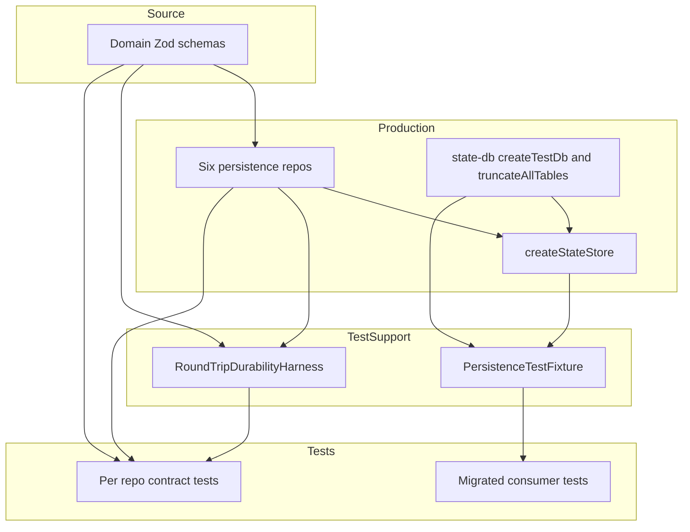
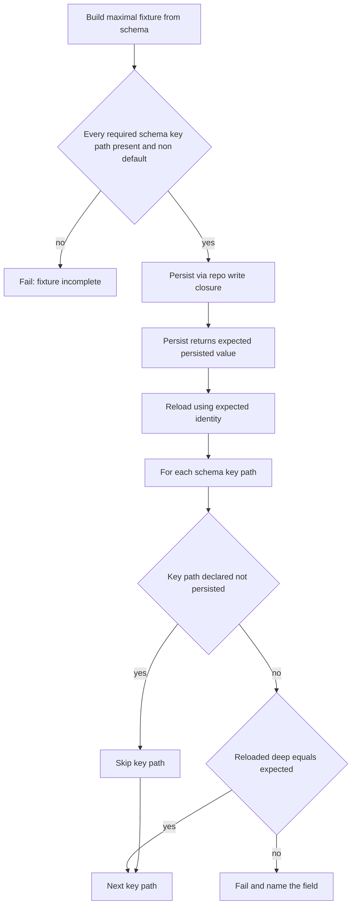

# Design Document — persistence-test-fidelity

## Overview

**Purpose**: This feature gives Command Center's test suite the ability to catch serialization-boundary defects — where a domain field is silently dropped on write or reset to its default on read — that previously escaped to live verification (the `pendingQueue` incident). It delivers value to maintainers by converting a class of silent data-loss bug into a deterministic, local test failure.

**Users**: Command Center maintainers and CI. They benefit on two paths: a schema-driven round-trip durability contract that fails the instant a persisted field stops round-tripping, and persistence-dependent consumer tests that now exercise real serialization instead of in-memory fakes that cannot reproduce serialization defects.

**Impact**: Adds test-only infrastructure (`src/lib/shared/testing/`) and a round-trip durability contract to all six persistence repositories. Migrates ~8–10 consumer tests off in-memory persistence fakes. Production persistence code changes only if the new tests reveal a genuine gap.

### Goals
- Every persisted domain field is verified through a real serialization round-trip derived from its schema (Req 1).
- A newly added schema field/key path that is neither persisted nor explicitly declared in a field policy fails the suite (Req 1, 2).
- Persistence-dependent consumer tests exercise the real repositories over a real store (Req 3).
- Per-test isolation with schema-derived reset; in-process, in-memory, deterministic (Req 4, 6).

### Non-Goals
- A mock persistence interface or mock-versus-production conformance suite (explicitly rejected — a non-serializing fake cannot reproduce a serialization defect).
- Changing production persistence behavior beyond fixing gaps the new tests reveal.
- Migrating stub-only consumer tests that do not depend on persistence behavior (Req 3.4).
- The message-queue feature itself (owned by its own spec/branch).

## Boundary Commitments

### This Spec Owns
- A generic round-trip durability harness and its semantics (recursive completeness guard, generated-value model, field policy model).
- A real-store-backed persistence test fixture for the conversation load/mutate seam, plus seeding/reset utilities.
- The round-trip durability contract test for each of the six persistence repositories, and the per-repo maximal fixture + field policy map colocated with each.
- Migration of the bounded set of persistence-dependent consumer tests to the real-store fixture.

### Out of Boundary
- Production repository, schema, and store implementations (touched only to fix a gap the contract surfaces).
- Stub-only consumer tests (Req 3.4).
- Any product/runtime behavior; this is test infrastructure.

### Allowed Dependencies
- `src/lib/state-store/state-db.ts` (`_createTestDb`, `openStateDb`, new `truncateAllTables`).
- `src/lib/state-store/store.ts` (`createStateStore`) and `write-queue.ts` (`createWriteQueue`).
- Domain Zod schemas (source of truth) and the six repositories' public read/write functions.
- Vitest. **No new runtime dependencies.**

### Revalidation Triggers
- A repository's read/write function signature changes (harness `persist`/`reload` closures must be revisited).
- A new persistence repository or a new persisted table is added (must gain a durability contract; `truncateAllTables` must cover it automatically).
- A domain schema gains a field or nested schema key (fixture + field policy map must be updated, enforced by the recursive completeness guard).
- The conversation seam (`mutateConversation`/`getConversation`) signature changes (fixture + migrated consumers).

## Architecture

### Existing Architecture Analysis
- **Dependency-injection store**: `createStateStore({ db, writeQueue, repos })` composes repositories over a `better-sqlite3` `Db`; `_createTestDb({ inMemory: true })` opens a `:memory:` DB using the **production DDL** (`openStateDb`). Reuse, do not re-declare schema (Req 5.1).
- **Existing contract tests**: `src/lib/state-store/*-repo.contract.test.ts` already create a real `:memory:` DB and seed FK parents in order (project → session → conversation). The new durability contract extends this convention (Req 5.3).
- **Three persistence shapes**: factory repos (`upsert`/`findById`), generated-value module functions (`createNotification` returns the persisted notification with generated id/timestamp/read state), and job-record module functions (`createJobRecord`/`updateJobRecord` over the durable `jobRecordSchema`). The harness is closure-parameterized to span all three.
- **Live job vs. durable job-record boundary**: `backgroundJobSchema` is the live runtime/API shape for in-memory jobs and SSE reconciliation. The SQLite `job_records` table persists a narrower durable record, represented by `jobRecordSchema`; live-only fields (`targetBranch`, `phase`, `parkedRef`, `preparedSha`, `expectedTargetSha`, `refreshWarning`) are not part of the job-record durability contract unless the production table is intentionally expanded.
- **No-internal-mock rule**: new/migrated tests obtain real repositories via DI; `vi.mock()` is reserved for module-load-time infrastructure only (Req 5.2).

### Architecture Pattern & Boundary Map



**Architecture Integration**
- **Pattern**: Shared test-support layer driven by schemas, exercising real production repositories. No new orchestrators.
- **Dependency direction**: `Schemas → Repos/Store/state-db → test-support (Harness, Fixture) → Tests`. Test-support and tests import production; **production never imports test-support** (enforced as a review error).
- **Existing patterns preserved**: `_createTestDb`, `createStateStore`, contract-test naming, DI, colocated fixtures.
- **New components rationale**: a single harness (avoids per-repo duplication) and a single fixture (avoids re-deriving a real store in every consumer test).
- **Steering compliance**: composable primitives, no `vi.mock()` of internal modules, schemas as source of truth, colocation.

### Technology Stack

| Layer | Choice / Version | Role in Feature | Notes |
|-------|------------------|-----------------|-------|
| Data / Storage | better-sqlite3 (`:memory:`, existing) | Real serialization target in tests | Via `_createTestDb`; production DDL |
| Backend / Services | TypeScript (strict) + Zod v4 (existing) | Schema introspection for recursive completeness guard | `ZodObject` shape traversal, `ZodDefault` defaults, explicit opaque boundaries |
| Test Runtime | Vitest (existing) | Test execution | Colocated `*.contract.test.ts` |

## File Structure Plan

### Directory Structure
```
src/lib/shared/testing/                      # NEW: test-only, cross-domain persistence helpers
├── round-trip-durability.ts                 # Generic harness: recursive completeness guard + field policy model + deep-equal
└── persistence-fixture.ts                   # Real-store-backed conversation seam + seedProject/seedSession/reset
```

### New Files
- `src/lib/shared/testing/round-trip-durability.ts` — `assertRoundTripDurability(spec)` and its types (`RoundTripSpec`, `FieldPolicy`, `FieldPath`). One responsibility: drive a schema-complete persist→expected→reload→compare cycle.
- `src/lib/shared/testing/persistence-fixture.ts` — `createPersistenceFixture()` returning a real store over a fresh `:memory:` DB, with `mutateConversation`/`getConversation` deps and seeding/reset. One responsibility: real-store seam for consumer tests.
- `src/lib/notifications/repo.contract.test.ts` — durability contract for notifications (create-then-list shape).
- `src/lib/jobs/repo.contract.test.ts` — durability contract for durable job records (`jobRecordSchema`).

### Modified Files
- `src/lib/state-store/state-db.ts` — add `truncateAllTables(db)` test helper deriving table names from `sqlite_master` (schema-derived reset, Req 4.3).
- `src/lib/jobs/schemas.ts` — add `jobRecordSchema`, a strict durable subset of `backgroundJobSchema` matching the `job_records` table. This prevents the contract from treating live-only runtime fields as silently non-persisted durable fields.
- `src/lib/jobs/repo.ts` — add a minimal read-back accessor (read a job record by id, returning a `JobRecord` via production deserialization) so the jobs durability contract can reload through **production** deserialization. This is a genuine testability gap the contract reveals — today the only read path returns a count for `status='running'` jobs. `completedAt` is generated by `updateJobRecord` and is declared `derived-on-write`; the contract's `persist()` closure returns the read-back `JobRecord`, and the harness fails if that expected value lacks `completedAt`. (Notifications already exposes `getNotifications` for read-back, so it needs no production change.)
- `src/lib/state-store/conversations-repo.contract.test.ts` — add durability test via harness; colocate `buildMaximalConversation()` + field policy map.
- `src/lib/state-store/sessions-repo.contract.test.ts` — same pattern (session schema).
- `src/lib/state-store/projects-repo.contract.test.ts` — same pattern (project row schema).
- `src/lib/state-store/reference-documents-repo.contract.test.ts` — same pattern (reference-document schema).
- `src/lib/conversations/mark-unread.test.ts` — migrate round-trip fake → `createPersistenceFixture()`.
- `src/lib/conversations/mark-read-route-handlers.test.ts` — migrate round-trip fake → fixture.
- `src/lib/workflows/conversation/persistence.test.ts` — migrate round-trip fake → fixture.
- `src/lib/conversations/ask-user-question-tool.test.ts` — migrate round-trip fake → fixture.
- _Additional consumer tests that apply a mutator and read it back are migrated on discovery; stub-only tests are left unchanged (Req 3.4)._

## System Flows

Round-trip durability evaluation (per repository):



Key decisions: the completeness gate runs **before** persistence for every schema key path that the harness can introspect. A missing/defaulted key path is a fixture bug, not a serialization result. Generated/write-derived fields are declared with a `derived-on-write` policy, but they are not skipped: `persist()` must return the expected persisted value and the reload must match that expected value. Only `not-persisted` key paths are excluded from equality, and each exclusion must be declared with a reason.

## Requirements Traceability

| Requirement | Summary | Components | Interfaces |
|-------------|---------|------------|------------|
| 1.1 | Persist → reload → deep-equal per repo | RoundTripDurabilityHarness; per-repo contract tests | `assertRoundTripDurability` |
| 1.2 | Populate every persisted field/key path non-default | RoundTripDurabilityHarness (recursive completeness guard) | `RoundTripSpec.buildMaximalFixture` |
| 1.3 | Dropped/reset field fails and is named | RoundTripDurabilityHarness | per-key compare |
| 1.4 | New unhandled schema field/key path fails | RoundTripDurabilityHarness (`ZodObject` key-path guard) | completeness guard |
| 1.5 | Covers all six repos | All six contract tests | — |
| 2.1 | Explicit reviewable non-persisted list | Per-repo field policy map | `FieldPolicy` |
| 2.2 | Field neither round-tripped nor declared → fail | RoundTripDurabilityHarness | completeness guard |
| 2.3 | Declared non-persisted field does not fail | RoundTripDurabilityHarness | exclusion check |
| 3.1 | Shared real-store fixture for conversation seam | PersistenceTestFixture | `createPersistenceFixture` |
| 3.2 | Persistence-dependent consumers use fixture | Migrated consumer tests | fixture deps |
| 3.3 | Dropped field fails a migrated consumer | Migrated consumer tests | real round-trip |
| 3.4 | Stub-only tests may stay on fakes | (scope decision) | — |
| 4.1 | Per-test isolation | PersistenceTestFixture | fresh `:memory:` |
| 4.2 | Reset utility empties state | `truncateAllTables`; fixture `reset` | reset utility |
| 4.3 | New table cleared without manual list | `truncateAllTables` | `sqlite_master` enumeration |
| 4.4 | No use of shared app store singleton | PersistenceTestFixture | injected DB |
| 4.5 | In-process, no external services | PersistenceTestFixture | `:memory:` |
| 5.1 | Test store from production schema | `_createTestDb`/`openStateDb` (reused) | — |
| 5.2 | No internal-module mocking; DI | All new/migrated tests | DI |
| 5.3 | Reuse contract-test location/naming | Per-repo contract tests | `*.contract.test.ts` |
| 6.1 | In-memory store | `_createTestDb({ inMemory: true })` | — |
| 6.2 | No material suite regression | Fixture (lightweight setup) | — |

## Components and Interfaces

| Component | Layer | Intent | Req Coverage | Key Dependencies | Contracts |
|-----------|-------|--------|--------------|------------------|-----------|
| RoundTripDurabilityHarness | test-support | Schema-complete persist→expected→reload→compare | 1.1–1.5, 2.1–2.3 | Zod schema (P0), repo closures (P0) | Service |
| PersistenceTestFixture | test-support | Real-store conversation seam + seed/reset | 3.1, 3.2, 4.1, 4.4, 4.5, 6.1 | createStateStore (P0), `_createTestDb` (P0) | Service, State |
| truncateAllTables | state-db | Schema-derived reset | 4.2, 4.3 | `sqlite_master` (P0) | Service |
| Per-repo contract tests | tests | Apply harness to each repo | 1.5, 5.3 | Harness (P0), repos (P0) | Batch |
| Migrated consumer tests | tests | Exercise real serialization | 3.2, 3.3 | Fixture (P0) | Batch |

### test-support

#### RoundTripDurabilityHarness

| Field | Detail |
|-------|--------|
| Intent | Drive a schema-complete persist→expected→reload→compare cycle for any repository |
| Requirements | 1.1, 1.2, 1.3, 1.4, 2.1, 2.2, 2.3 |

**Responsibilities & Constraints**
- Enforce recursive completeness against introspectable schema key paths before persisting; fail if a required persisted key path is missing from the fixture or left at its schema default.
- Persist and reload via injected closures (spans factory repos, generated-value module functions, and durable job-record module functions).
- Require `persist()` to return the expected persisted domain value. Symmetric repos return the fixture after writing; generated-value repos return the value produced by the write path (for example `createNotification()`).
- Compare every schema key path except those declared `not-persisted`; on mismatch, fail and name the field path.
- Treat `derived-on-write` as a completeness policy only: the field path may differ from the input fixture, but the reloaded value must equal the expected value returned by `persist()`.
- Test-only; must not be imported by production code.

**Dependencies**
- Inbound: per-repo contract tests — invoke the harness (P0).
- Outbound: domain Zod schema — introspection and defaults (P0); repo read/write closures (P0).

**Contracts**: Service [x]

##### Service Interface
```typescript
type FieldPath = string;
type FieldPolicy = "not-persisted" | "derived-on-write";

interface RoundTripSpec<TSchema extends z.ZodObject<z.ZodRawShape>> {
  readonly label: string;
  readonly schema: TSchema;
  buildMaximalFixture(): z.infer<TSchema>;
  persist(
    fixture: z.infer<TSchema>,
  ): Promise<z.infer<TSchema>> | z.infer<TSchema>;
  reload(
    expected: z.infer<TSchema>,
  ): Promise<z.infer<TSchema> | null> | (z.infer<TSchema> | null);
  readonly fieldPolicies?: Readonly<Partial<Record<FieldPath, FieldPolicy>>>;
}

declare function assertRoundTripDurability<TSchema extends z.ZodObject<z.ZodRawShape>>(
  spec: RoundTripSpec<TSchema>,
): Promise<void>;
```
- Preconditions: `schema` is a top-level `ZodObject`; `buildMaximalFixture()` returns a value that `schema.parse` accepts; `persist()` returns the expected persisted domain value after applying generated/write-derived fields.
- Postconditions: resolves only if every required schema key path is either declared `not-persisted` or round-trips deep-equal to the expected persisted value; otherwise throws a Vitest assertion naming the offending key path.
- Invariants: every introspectable schema key path is compared, declared `not-persisted`, or declared `derived-on-write` and then required to be present/non-default in the returned expected value before comparison; the harness never reads/writes the shared app store singleton.

**Implementation Notes**
- Integration: completeness guard walks `ZodObject` shapes recursively and reports dot/bracket key paths such as `pendingQuestions[0].options[0].description`. `ZodOptional`, `ZodNullable`, and `ZodDefault` wrappers are unwrapped for traversal; a persisted optional key must be populated in the maximal fixture unless it is declared with a field policy.
- Arrays and records are representative containers: persisted arrays must contain at least one element and persisted records must contain at least one entry unless excluded. The harness traverses representative object values so nested JSON fields cannot be silently omitted.
- Opaque leaves (`z.unknown()`, broad records of `unknown`, and intentionally opaque JSON payloads) are treated as leaf values: the fixture must provide a non-null/non-undefined value, and deep-equality catches drops inside the provided payload.
- Default detection unwraps `ZodDefault` and compares the fixture value for that key path against the schema default; `derived-on-write` key paths instead validate the expected value returned by `persist()`.
- Validation: `reload()` returning `null` is a failure (the fixture was not persisted at all).
- Risks: non-`ZodObject` schemas need a thin adapter; recursive traversal intentionally stops at opaque schema boundaries and relies on the maximal fixture's opaque payload plus deep-equality there.

#### PersistenceTestFixture

| Field | Detail |
|-------|--------|
| Intent | Provide a real-store-backed conversation seam for consumer tests, with seeding and reset |
| Requirements | 3.1, 3.2, 4.1, 4.4, 4.5, 6.1 |

**Responsibilities & Constraints**
- Build a real `createStateStore` over a fresh `:memory:` DB per fixture instance (isolation, Req 4.1).
- Expose `mutateConversation`/`getConversation` compatible with both setter-style (`setPersistenceDeps`) and `deps`-parameter consumers.
- Provide `seedProject`/`seedSession` (FK parents) and `reset`; never touch the shared app store singleton (Req 4.4).

**Dependencies**
- Inbound: migrated consumer tests (P0).
- Outbound: `createStateStore` (P0), `createWriteQueue` (P0), `_createTestDb` (P0), `truncateAllTables` (P1).

**Contracts**: Service [x] / State [x]

##### Service Interface
```typescript
// Structural shape matching the real store's seam; consumers inject these two
// methods today via setter (setPersistenceDeps) or a deps parameter object.
interface ConversationSeamDeps {
  mutateConversation<T>(
    projectPath: string,
    sessionName: string,
    conversationId: string,
    label: string,
    mutate: (conversation: ConversationState) => T,
  ): Promise<T>;
  getConversation(
    projectPath: string,
    sessionName: string,
    conversationId: string,
  ): Promise<ConversationState | null>;
}

interface PersistenceFixture {
  readonly db: Db;
  readonly store: StateStore;
  readonly deps: ConversationSeamDeps;
  seedProject(rootPath: string): void;
  seedSession(projectPath: string, sessionName: string): void;
  seedConversation(projectPath: string, sessionName: string, conversation: ConversationState): Promise<void>;
  reset(): void;
  close(): void;
}

declare function createPersistenceFixture(): PersistenceFixture;
```
> The exact method syntax mirrors the store's signatures (verify against `store.ts` at implementation time) and uses method syntax for bivariance, per engineering-principles.
- Preconditions: called inside a test (`beforeEach`); `seedSession` requires a prior `seedProject`.
- Postconditions: `deps.mutateConversation`/`getConversation` perform a real serialization round-trip through the conversations repo.
- Invariants: each fixture instance owns an isolated `:memory:` DB; `close()` releases it in `afterEach`.

**Implementation Notes**
- Integration: `deps` are the same shape consumers already inject, so migration is a setup-block swap, not a logic change.
- Validation: `reset()` delegates to `truncateAllTables(db)`; default isolation is a fresh fixture per test (`beforeEach`/`afterEach`).
- Risks: consumer tests that asserted on fake-call spies must switch to asserting on reloaded state.

### state-db

#### truncateAllTables

| Field | Detail |
|-------|--------|
| Intent | Empty all data tables, deriving names from the live schema |
| Requirements | 4.2, 4.3 |

**Contracts**: Service [x]

##### Service Interface
```typescript
declare function truncateAllTables(db: Db): void;
```
- Preconditions: `db` opened via `openStateDb`/`_createTestDb`.
- Postconditions: every application table is emptied; FK order handled (disable FK enforcement during truncate, or delete children-first).
- Invariants: table set derived from `sqlite_master` excluding `sqlite_%` internals and the schema-version table — a newly added table is cleared with no code change (Req 4.3).

**Implementation Notes**
- Integration: test-only helper exported from `state-db.ts` alongside `_createTestDb`.
- Risks: must exclude the schema-version/bookkeeping table so the forward-only version check still passes after reset.

### tests

#### Per-repo contract tests (Batch)
Each `*.contract.test.ts` adds one durability test calling `assertRoundTripDurability` with a colocated `buildMaximalX()` and `fieldPolicies` map. State-store repos persist via `repo.upsert(...)`, return the same fixture as expected, and reload via `findById`/`findByKey` (seed FK parents first). Notifications persist via `createNotification(...)`, return the created `Notification` as expected, and reload by the returned id through `getNotifications()`, with `id`, `read`, and `createdAt` declared `derived-on-write` rather than excluded. Jobs use the strict durable `jobRecordSchema`, not `backgroundJobSchema`; the contract writes through `createJobRecord`/`updateJobRecord` as needed, declares `completedAt` as `derived-on-write`, returns the accessor-read `JobRecord` as expected, and reloads by id through the same production accessor for the equality pass. Fixtures and field policies are **colocated** per repo (no central dump).

#### Migrated consumer tests (Batch)
Round-trip fakes are replaced by `createPersistenceFixture()` in the setup block; assertions shift from "mock was called" to "reloaded state contains the mutation." Stub-only tests are unchanged (Req 3.4).

## Error Handling

### Error Strategy
- Test assertions are the error surface. The harness throws a Vitest `AssertionError` that names the offending field path and the failure mode (missing fixture key path / defaulted key path / dropped on round-trip).
- `reload()` returning `null` → explicit failure ("fixture not persisted"), preventing a false pass when nothing was written.

### Error Categories and Responses
- **Fixture incompleteness** (developer error): schema key path missing or left at default → fail before persistence with the key path.
- **Generated value not persisted** (target bug on generated fields): a `derived-on-write` key path appears in the expected value returned by `persist()` but differs after reload → fail naming the field path.
- **Serialization drop** (the target bug): reloaded value differs from expected for a persisted key path → fail naming the field path.
- **Undeclared exclusion** (loophole attempt): a non-round-tripping field absent from the field policy map → fail (Req 2.2).

### Monitoring
- None beyond test output; failures surface in `bun run test` / CI.

## Testing Strategy

### Unit Tests (the harness itself)
- Harness fails when the maximal fixture omits a top-level schema key or an introspectable nested key path (Req 1.4).
- Harness fails when a persisted key path is left at its schema default (Req 1.2).
- Harness fails, naming the field path, when `reload()` drops a value (Req 1.3) — simulate with a `persist`/`reload` pair that loses one key.
- Harness passes when a dropped field is declared `not-persisted`, and fails when it is not (Req 2.2, 2.3).
- Harness compares `derived-on-write` fields against the expected value returned by `persist()` and fails if reload loses that generated value.
- Harness treats arrays/records as representative containers and fails if a persisted array/record fixture is empty when its element/value schema has introspectable fields.

### Integration Tests (per repo, the contract)
- Conversations/sessions/projects/reference-documents/notifications/job-records each round-trip a maximal fixture through the real repo and assert deep-equality against the expected persisted value (Req 1.1, 1.5). This is the regression guard for the `pendingQueue`-class bug.
- The jobs contract uses `jobRecordSchema` so live-only runtime fields are outside the durable contract rather than hidden by exclusions. If the product later requires ready-to-land recovery after restart, that is a separate production persistence expansion that adds columns and then moves those fields into `jobRecordSchema`.

### Integration Tests (consumer migration)
- A migrated consumer test (e.g. `mark-unread`) sets `unread`/status via the real fixture and reloads to confirm the mutation persisted (Req 3.2). A deliberately induced drop fails it (Req 3.3, validated once during implementation, then reverted).

### Reset/Isolation
- `truncateAllTables` empties a populated multi-table DB including a newly added table without code change (Req 4.3); two sequential tests on one fixture do not leak state (Req 4.1).

## Performance & Scalability
- All fixtures use `:memory:` (Req 6.1); no disk I/O on routine runs.
- Target: no material aggregate test-suite runtime regression (Req 6.2). Fresh `:memory:` DB setup is sub-millisecond-to-low-millisecond; concentrate migration on the ~8–10 persistence-dependent tests to bound added cost. Re-check suite wall-clock after migration.
