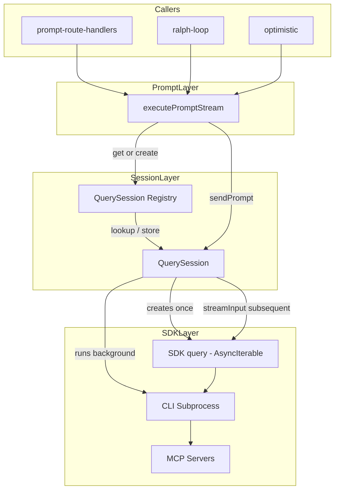
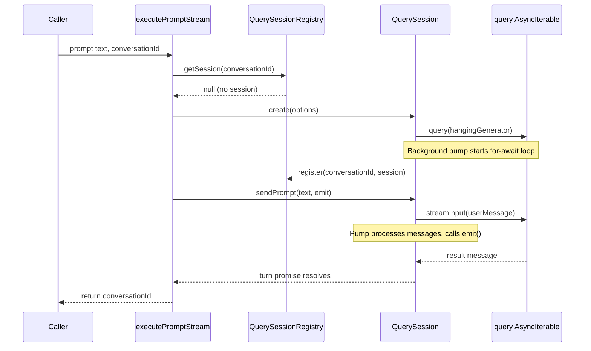
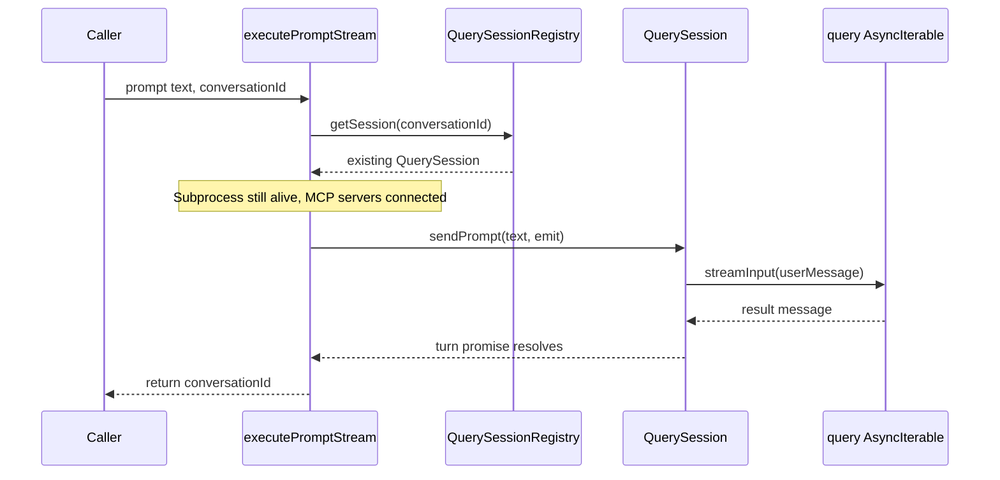
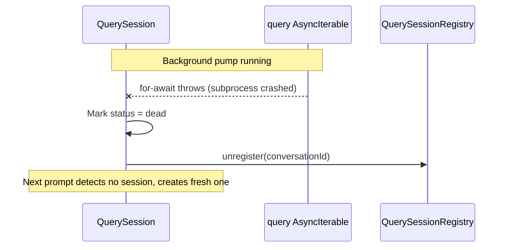

# Design Document: Persistent MCP Sessions

## Overview

**Purpose**: This feature refactors CC's prompt execution so that MCP server connections (Playwright browsers, dev tools, etc.) persist across agent turns within a conversation, enabling interactive workflows that require user intervention between prompts.

**Users**: CC operators running sessions that use stateful MCP tools — particularly browser automation via Playwright MCP where authentication or other manual steps must occur between agent turns.

**Impact**: Changes the core prompt execution path from a one-shot `query()` per prompt to a single long-lived streaming `query()` per conversation. The SDK subprocess and its MCP server child processes remain alive between prompts instead of being destroyed and recreated.

### Goals
- Keep MCP server connections alive across prompts within a conversation
- Maintain identical external API for all `executePromptStream()` callers
- Enable interactive workflows (e.g., user authenticates in browser between agent turns)
- Properly manage subprocess lifecycle (start, idle, crash recovery, cleanup)

### Non-Goals
- Turn-level abort without subprocess kill (SDK limitation; not achievable)
- Cross-conversation subprocess sharing (each conversation gets its own)
- MCP server hot-reload between turns (existing `setMcpServers()` available but not exposed)
- Changes to the UI or SSE event contract

## Architecture

### Existing Architecture Analysis

The current architecture in `src/lib/prompt.ts` follows a one-shot pattern:

1. `executePromptStream()` acquires session lock → creates `query()` → runs `for await` message loop → cleanup in `finally`
2. Each `query()` spawns a fresh CLI subprocess with all MCP servers
3. When the `for await` loop completes, the subprocess exits and all MCP servers are killed
4. The `Query` object is registered temporarily for `streamInput()` during the turn, then unregistered

Key constraints:
- Session lock (`lock.ts`) prevents concurrent prompts — preserved as-is
- Query semaphore (`query-semaphore.ts`) limits concurrent subprocesses — semantics preserved (counts active turns)
- Abort registry (`abort-registry.ts`) stores `AbortController` — must adapt for persistent sessions
- Three callers depend on `executePromptStream()` API: `prompt-route-handlers.ts`, `ralph-loop/workflow-route-handlers.ts`, `optimistic.ts`

### Architecture Pattern & Boundary Map



**Architecture Integration**:
- Selected pattern: Layered extraction — new `QuerySession` module owns subprocess lifecycle, `executePromptStream()` delegates to it
- Domain boundaries: `QuerySession` owns subprocess + MCP lifecycle; `prompt.ts` owns per-turn orchestration (lock, transcript, accounting, SSE)
- Existing patterns preserved: DI via deps interface, globalThis registries, single-flight locking
- New components: `QuerySession` (lifecycle), `QuerySessionRegistry` (lookup/storage)
- Steering compliance: Module-per-domain-concept pattern from `structure.md`; HMR-safe global singletons from `tech.md`

### Technology Stack

| Layer | Choice / Version | Role in Feature | Notes |
|-------|------------------|-----------------|-------|
| SDK | `@anthropic-ai/claude-agent-sdk` (current) | Streaming input mode via `AsyncIterable<SDKUserMessage>` prompt | No version change needed; uses existing API surface |
| Runtime | Node.js async generators | Background message pump, per-turn promise delivery | Standard language feature |
| State | In-memory Map (globalThis) | QuerySession registry | Same pattern as query-registry, abort-registry |

## System Flows

### First Prompt — QuerySession Creation



### Subsequent Prompt — Reuse Existing Session



### Subprocess Crash Recovery



## Requirements Traceability

| Requirement | Summary | Components | Interfaces | Flows |
|-------------|---------|------------|------------|-------|
| 1.1 | First prompt creates long-lived query | QuerySession | QuerySession.create() | First Prompt flow |
| 1.2 | Subsequent prompts use streamInput | QuerySession, executePromptStream | QuerySession.sendPrompt() | Subsequent Prompt flow |
| 1.3 | Subprocess stays alive between prompts | QuerySession (background pump) | — | — |
| 1.4 | Multimodal prompt support | QuerySession.sendPrompt() | SDKUserMessage content blocks | — |
| 2.1 | Register session on first prompt | QuerySessionRegistry | register() | First Prompt flow |
| 2.2 | Cleanup on conversation close/delete | QuerySession, deleteSession | QuerySession.close() | — |
| 2.3 | Crash detection and recovery | QuerySession (background pump) | — | Crash Recovery flow |
| 2.4 | Idle subprocess does not hold semaphore | executePromptStream | acquireQuerySlot / releaseQuerySlot | — |
| 3.1 | Per-turn cost/duration accounting | executePromptStream, TurnResult | TurnResult type | — |
| 3.2 | Status transitions per turn | executePromptStream | broadcast() | — |
| 3.3 | Session lock per turn | executePromptStream | acquireSessionLock | — |
| 3.4 | Transcript append unchanged | executePromptStream | safeAppendTranscriptEntry | — |
| 4.1 | Resume with no active session | executePromptStream, QuerySession | QuerySession.create(resume) | First Prompt flow |
| 4.2 | Fork creates independent session | executePromptStream, QuerySession | QuerySession.create(forkSession) | First Prompt flow |
| 4.3 | SessionId update on change | QuerySession (background pump) | — | — |
| 5.1 | Abort kills subprocess, next prompt recreates | abortConversation, QuerySession | close() | — |
| 5.2 | Timeout aborts turn | executePromptStream | abortController.abort() | — |
| 5.3 | Fallback to full termination | QuerySession | close() | — |
| 6.1 | AskUserQuestion unchanged | executePromptStream | canUseTool callback | — |
| 6.2 | Queued messages unchanged | queueMessage | streamInput() | — |
| 6.3 | In-process MCP tools | QuerySession.create() | mcpServers option | — |
| 6.4 | Autonomous mode unchanged | executePromptStream | canUseTool callback | — |
| 6.5 | SSE events unchanged | executePromptStream | emit() | — |

## Components and Interfaces

| Component | Domain/Layer | Intent | Req Coverage | Key Dependencies | Contracts |
|-----------|--------------|--------|--------------|------------------|-----------|
| QuerySession | SDK Lifecycle | Owns a single long-lived SDK subprocess and its message pump | 1.1–1.4, 2.1–2.4, 4.3, 5.1–5.3 | SDK query() (P0), QuerySessionRegistry (P0) | Service, State |
| QuerySessionRegistry | SDK Lifecycle | In-memory lookup of active QuerySession by conversationId | 2.1, 2.2, 2.3 | globalThis singleton (P0) | Service |
| executePromptStream (refactored) | Prompt Orchestration | Per-turn coordinator: lock, accounting, transcript, SSE | 3.1–3.4, 4.1–4.2, 6.1–6.5 | QuerySession (P0), lock (P0), semaphore (P1) | Service |
| deleteSession (extended) | Session Lifecycle | Closes QuerySession on session deletion | 2.2 | QuerySessionRegistry (P1) | — |

### SDK Lifecycle Layer

#### QuerySession

| Field | Detail |
|-------|--------|
| Intent | Manages a single long-lived SDK subprocess: creation, background message pump, per-turn prompt delivery, and teardown |
| Requirements | 1.1, 1.2, 1.3, 1.4, 2.1, 2.3, 2.4, 4.3, 5.1, 5.3 |

**Responsibilities & Constraints**
- Owns exactly one `Query` object (SDK subprocess)
- Runs a background `for await` message pump that processes all SDK messages across turns
- Provides `sendPrompt()` that returns a per-turn Promise resolved on `result` message
- Detects subprocess crash (pump throws) and marks session as dead
- Tracks session health status: `alive` | `dead`

**Dependencies**
- External: `@anthropic-ai/claude-agent-sdk` `query()` — subprocess management (P0)
- Outbound: QuerySessionRegistry — registration/unregistration (P0)

**Contracts**: Service [x] / State [x]

##### Service Interface

```typescript
interface QuerySessionOptions {
  conversationId: string;
  cwd: string;
  model: string | undefined;
  effort: "low" | "medium" | "high" | "max" | undefined;
  systemPrompt: {
    type: "preset";
    preset: "claude_code";
    append: string | undefined;
  };
  resume: string | undefined;
  forkSession: boolean | undefined;
  mcpServers: Record<string, McpServerConfig>;
  canUseTool: CanUseTool;
  env: Record<string, string | undefined>;
  maxTurns: number | undefined;
  plugins: SdkPluginConfig[];
  settingSources: SettingSource[];
  disallowedTools: string[];
}

interface TurnOptions {
  /** When true, AskUserQuestion tool is denied (used by optimistic/Ralph Loop callers) */
  autonomous?: boolean;
}

interface TurnResult {
  sessionId: string | null;
  costUsd: number | null;
  durationMs: number | null;
  numTurns: number | null;
  contextTokens: number | null;
  contextWindow: number | null;
  contentBlocks: MessageContentBlock[];
  aborted: boolean;
  error: string | null;
}

type TurnEmit = (event: string, data: unknown) => void;

interface QuerySession {
  /** Current health status */
  readonly status: "alive" | "dead";

  /** The SDK Query object (for streamInput from queueMessage) */
  readonly query: Query;

  /** Send a prompt and wait for the turn to complete */
  sendPrompt(
    prompt: string | AsyncIterable<SDKUserMessage>,
    emit: TurnEmit,
    options?: TurnOptions,
  ): Promise<TurnResult>;

  /** Terminate the subprocess and clean up all resources */
  close(): void;
}

/** Factory function */
function createQuerySession(
  options: QuerySessionOptions,
): QuerySession;
```

- Preconditions: `options.conversationId` is unique (no existing session for this ID)
- Postconditions: Background pump is running; session is registered in registry
- Invariants: Exactly one `Query` per `QuerySession`; status transitions are `alive → dead` (never back)

##### State Management
- State model: `status` field (`alive` | `dead`), pending turn promise (if a prompt is in progress)
- Persistence: In-memory only (no disk persistence — subprocess cannot survive server restart)
- Concurrency: Only one `sendPrompt()` at a time per session (enforced by caller's session lock)

**Implementation Notes**
- The initial prompt to `query()` is an async generator that yields the first `SDKUserMessage` and then never completes (hangs on an unresolved promise). All subsequent messages arrive via `streamInput()`.
- The background pump runs `for await (const message of q)` in a detached async function. It routes each message through a `processMessage` callback provided by the turn's `sendPrompt()` call. When a `result` message arrives, the turn promise resolves.
- Between turns (no active `sendPrompt()`), messages from the SDK (if any) are logged but no turn promise exists. This is the idle state.
- On pump error (subprocess crash), status transitions to `dead`, the session is unregistered from the registry, and any pending turn promise is rejected.
- **Per-turn autonomous flag**: The `canUseTool` callback passed to `QuerySessionOptions` is created once at QuerySession creation, but it reads a mutable `currentTurnOptions` field on the QuerySession instance. When `sendPrompt()` is called with `TurnOptions`, it sets `this.currentTurnOptions = options` before feeding the prompt to the SDK. The `canUseTool` callback checks `this.currentTurnOptions?.autonomous` to decide whether to deny `AskUserQuestion`. This avoids rebuilding the callback per turn while supporting per-turn configuration.

#### QuerySessionRegistry

| Field | Detail |
|-------|--------|
| Intent | In-memory lookup of active QuerySession instances by conversationId |
| Requirements | 2.1, 2.2, 2.3 |

**Responsibilities & Constraints**
- Stores and retrieves `QuerySession` by conversationId
- Uses `globalThis` via `getGlobalSingleton()` for HMR safety
- Replaces `query-registry.ts` (which currently stores raw `Query` objects)

**Contracts**: Service [x]

##### Service Interface

```typescript
function registerSession(conversationId: string, session: QuerySession): void;
function getSession(conversationId: string): QuerySession | undefined;
function unregisterSession(conversationId: string): void;
function closeAllSessions(): void;
```

- `closeAllSessions()` is called during server shutdown to clean up orphaned subprocesses

**Implementation Notes**
- This replaces the existing `query-registry.ts` module. The raw `Query` object is accessible via `session.query` for `queueMessage()` compatibility.
- Alternatively, `query-registry.ts` can be kept and its `getQuery()` function updated to return `getSession(id)?.query` for backward compatibility. This avoids changing `queue-message.ts`.

### Prompt Orchestration Layer

#### executePromptStream (refactored)

| Field | Detail |
|-------|--------|
| Intent | Per-turn coordinator: acquires lock/semaphore, gets-or-creates QuerySession, delegates prompt, handles accounting and transcript |
| Requirements | 3.1–3.4, 4.1–4.2, 6.1–6.5 |

**Responsibilities & Constraints**
- Same external API signature as today — no caller changes
- Acquires session lock and semaphore slot per turn (not per subprocess)
- Creates `QuerySession` on first prompt or when previous session is dead
- Passes `canUseTool` callback to QuerySession (for AskUserQuestion interception)
- Extracts per-turn accounting from `TurnResult` and updates conversation state
- Releases lock and semaphore in `finally` block (same as today)

**Dependencies**
- Inbound: prompt-route-handlers, ralph-loop, optimistic — prompt execution (P0)
- Outbound: QuerySession — subprocess lifecycle (P0)
- Outbound: lock, semaphore, state, transcript, SSE — per-turn orchestration (P0)

**Contracts**: Service [x]

##### Service Interface

```typescript
/** Signature unchanged from current implementation */
function executePromptStream(
  projectPath: string,
  session: SessionState,
  promptText: string,
  emit: (event: string, data: unknown) => void,
  conversationId?: string,
  modelId?: ClaudeModel,
  images?: ImagePayload[],
  options?: { autonomous?: boolean },
  deps?: PromptDeps,
): Promise<{ conversationId: string }>;
```

**Implementation Notes**
- The function body changes from "create query → run for-await loop → cleanup" to "get-or-create QuerySession → call sendPrompt() → handle TurnResult → cleanup turn state"
- `canUseTool` callback is built once per `QuerySession` creation (not per turn) since it captures the session context. The `autonomous` flag varies per prompt and is passed via `TurnOptions` to `sendPrompt()`, which sets it as mutable state on the QuerySession for the `canUseTool` callback to read (see QuerySession implementation notes).
- `executePromptStream` passes `{ autonomous: options?.autonomous }` as the third argument to `session.sendPrompt(prompt, emit, { autonomous: options?.autonomous })`.
- For the first prompt, `QuerySession` is created with all SDK options (model, system prompt, resume, mcpServers, etc.). For subsequent prompts, `streamInput()` carries only the user message — SDK options from creation are reused.
- `PromptDeps` interface gains `getSessionFromRegistry` and `registerSessionInRegistry` (or equivalent) for DI.

### Session Lifecycle Layer

#### deleteSession (extended)

| Field | Detail |
|-------|--------|
| Intent | Closes any active QuerySession before removing the session from state |
| Requirements | 2.2 |

**Implementation Notes**
- Before removing the session from state, iterate all conversation IDs and call `getSession(conversationId)?.close()` for each
- This ensures subprocesses are terminated and MCP servers are cleaned up before the worktree is removed
- The `close()` call is idempotent — safe to call on already-dead sessions

## Data Models

### Domain Model

No new persistent entities. The `QuerySession` is an in-memory runtime object:

```typescript
// In-memory state per conversation
interface QuerySessionState {
  status: "alive" | "dead";
  query: Query;
  conversationId: string;
  currentTurnOptions: TurnOptions | null; // set by sendPrompt(), read by canUseTool
  pendingTurn: {
    resolve: (result: TurnResult) => void;
    reject: (error: Error) => void;
    emit: TurnEmit;
  } | null;
  lastActivityAt: number; // for idle TTL
}
```

No schema changes to `ConversationState`, `SessionState`, or `ManagerState`. The `claudeSessionId` field continues to be updated from SDK `result` messages as it is today.

### Idle TTL Configuration

Added to the existing `config.json` schema:

```typescript
// Addition to ConfigSchema
idleQuerySessionTtlMs: z.number().optional() // default: 300_000 (5 minutes)
```

## Error Handling

### Error Strategy

| Error Type | Detection | Recovery |
|------------|-----------|----------|
| Subprocess crash | Background pump `for await` throws | Mark session dead, unregister, log error. Next prompt creates fresh session. |
| SDK error during turn | `result` message with `subtype: "error_*"` | Turn promise resolves with error in `TurnResult`. Session remains alive for next prompt. |
| Abort signal | `abortController.abort()` | Subprocess terminates. Session marked dead. Next prompt creates fresh session with `resume`. |
| Idle timeout | Timer fires after `idleQuerySessionTtlMs` of no `sendPrompt()` calls | Call `close()` on session. Next prompt creates fresh session with `resume`. |
| Session deletion during active turn | `deleteSession()` calls `close()` | Subprocess terminates. Pending turn promise rejects. `executePromptStream` catches and returns gracefully. |

### Monitoring

Existing debug log module (`createLogger`) covers all events:
- `query-session.created` — new subprocess started
- `query-session.pump_error` — subprocess crashed
- `query-session.closed` — explicit close (deletion, abort, idle TTL)
- `query-session.idle_timeout` — reaped due to inactivity
- `query-session.turn_start` / `query-session.turn_complete` — per-turn lifecycle

## Testing Strategy

### Unit Tests
- `QuerySession.sendPrompt()` resolves with correct `TurnResult` when `result` message arrives
- `QuerySession.close()` terminates subprocess and transitions to `dead` status
- `QuerySession` pump error marks session dead and rejects pending turn
- `QuerySessionRegistry` register/get/unregister/closeAll operations
- `executePromptStream()` creates new session on first prompt, reuses on subsequent
- `executePromptStream()` creates fresh session when previous is dead

### Integration Tests
- End-to-end: two prompts to same conversation reuse subprocess (verify via `init` message count — only one `init` for two prompts)
- Abort mid-turn kills subprocess; next prompt creates fresh session
- `deleteSession()` closes active query session
- `queueMessage()` still works via `session.query.streamInput()`

### Performance
- Verify second prompt in same conversation completes without ~12s subprocess startup overhead
- Idle TTL correctly reaps inactive sessions after configured timeout
- Concurrent prompts to different conversations respect semaphore limits
