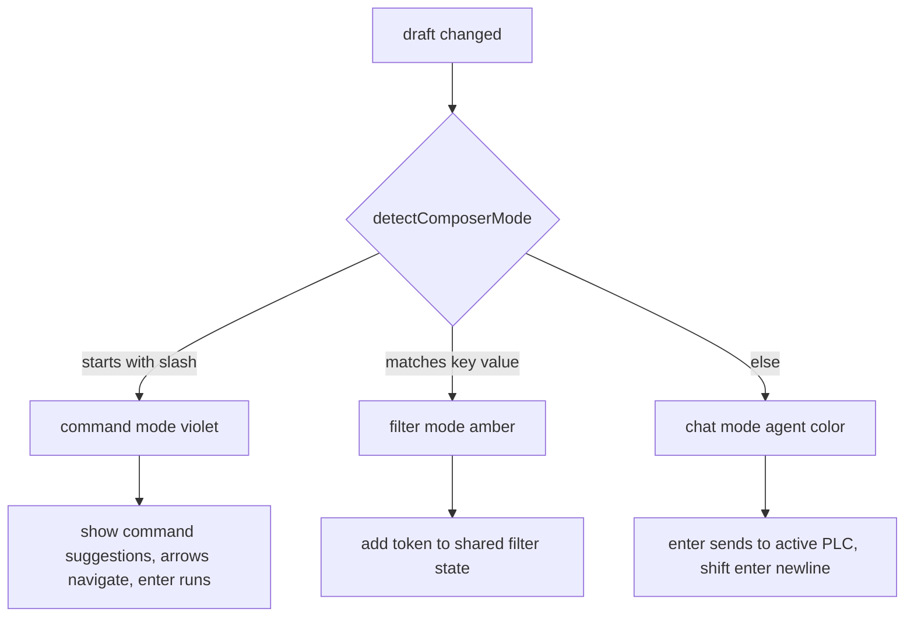

# Design Document — project-conversation-cockpit

## Overview

**Purpose**: This feature redesigns the Command Center project page (`projects/[name]`) into the **project-conversation cockpit**: a first-run single-column layout (unified composer above the full-width sessions table) that animates into a three-column cockpit (global Active Conversations rail · conversation pane with tabs/transcript/docked composer · sessions panel) once at least one project conversation (PLC) is open. It ships one **unified composer** that routes input three ways (prose → prompt the active PLC, `/` → command palette, `key:value` → sessions filter), a conversation-tab switcher, a virtualized transcript host that mounts inline session-spawn cards, a sessions panel with shared filter state plus dedicated search, and a read-only main-worktree diff/review surface.

**Users**: Developers using Command Center, on the project page, to converse with an agent on the repo's main worktree and to scope/spawn/manage sessions.

**Impact**: Replaces `ProjectDetailView`'s single column + legacy `CommandConsole` with a two-state cockpit. It is a **pure UI consumer** of the project-level-conversations foundation: it consumes session-less conversation data, the `scope`-discriminated active-conversation/SSE shapes, the open-conversation count (first-run↔cockpit driver), and the project prompt/lifecycle routes — without redefining any of them. It also consumes the main-worktree diff endpoint (a direct item) and hosts chat-session-spawning's cards without owning their schema/dispatch. Existing session pages are unchanged.

### Goals

- First-run ↔ cockpit state, driven by the foundation's open-count, with the locked entry animation (1.x, 2.x).
- Three-column cockpit with locked defaults and retained breadcrumb/`New session`/`⌘N`/sessions table (3.x).
- Conversation tabs with active/unread indicators, `+ New chat`, and close-with-fallback (4.x).
- Unified composer: three modes, the recoloring mode-chip, the `/new`·`/capabilities`·`/workflow-builder` palette, session-composer affordances, agent recolor, shared filter-token state (5.x, 6.x, 7.x, 8.x).
- Sessions panel: dedicated search + filter popover sharing one token state, chips/clear-all/empty-results (8.x, 9.x).
- Transcript host that mounts chat-session-spawning's inline cards via a documented seam, virtualized (10.x).
- Read-only main-worktree diff/review surface mounting the existing diff component (11.x).
- Real-time consistency, rail mount, DS/keyboard/perf compliance (12.x, 13.x, 14.x).

### Non-Goals

- The session-less conversation data model, persistence, lifecycle/open-count derivation, main-worktree execution, and the `scope`-discriminated active-conversation/SSE contracts (→ project-level-conversations foundation).
- The spawn-card schema, validation, multi-session card, and auto-dispatch (→ chat-session-spawning). This spec only provides the transcript mount point.
- The global rail's grouping (`<project> / main`), Needs-you logic, cross-page routing, indicator-consistency rules (→ unified-conversations-panel extension). This spec mounts the existing rail.
- The main-worktree diff **endpoint** itself (→ direct item). This spec consumes it.
- Per-PLC capabilities override semantics and PLC notification/push parity (→ capabilities + notifications extensions). Opening `/capabilities` is in scope; override behavior is not.

## Boundary Commitments

### This Spec Owns

- The **project-page cockpit shell** and the **first-run ↔ cockpit view-state machine** (which PLCs have open tabs, active tab, rail-collapsed, transition), reconciled against the foundation's server-side open truth.
- The **unified composer** UI: the pure **mode router** (`detectComposerMode`), the recoloring mode-chip, the command/filter suggestion surface (reusing `computeSuggestions`), and the chat affordances wired to the foundation's **project** prompt route. It owns wiring, not the parsers (`command-suggestions.ts` / `filter-tokens.ts` are reused as-is).
- The **conversation tabs** and the **conversation pane** (header with `main · worktree`, transcript host, docked composer slot).
- The **transcript host** and the **spawn-card row mount contract** (a `spawn-card` row variant + a `renderSpawnCardRow` slot). It renders cards chat-session-spawning supplies; it does not parse/validate them.
- The **sessions panel** (dedicated plain-text search + filter popover) bound to the **shared** `useSessionFilters` token state, with chips/clear-all/empty-results.
- The **main-worktree diff/review surface mount**: a typed client hook against the upstream main-diff endpoint + a `DiffPanel` mount (read-only, no git mutation).
- The **project-conversation client query layer** the page needs: `projectConversationKeys`, and React Query hooks/mutations that call the foundation's project routes (list open PLCs, messages, create/close/reopen/rename, send project prompt).
- The cockpit-scoped **CSS** that folds the prototype `.pc-*` classes into production naming, and the **project-page Storybook stories**.

### Out of Boundary

- The foundation's `project_conversations` table/repo/service, state-store dispatch, `resolveProjectExecutionTarget`, `executeProjectPromptStream`, the active-source generalization, the `scope`-discriminated `ActiveConversation`/SSE event **schemas**, and the open-count **derivation**. (Consumed, never modified.)
- The spawn-proposal schema/validator, multi-session card internals, `from chat` tagging, and the auto-dispatch primitive (chat-session-spawning).
- The global rail's internal grouping/Needs-you/routing/indicator rules (unified-conversations-panel extension). `ConversationSidebar` is mounted, not modified.
- The main-worktree diff **endpoint/route handler** and `computeDiff` (direct item + `@/lib/git`).
- Per-PLC capabilities override behavior and PLC notification/push parity (capabilities + notifications extensions).
- Session-page UI and session prompt execution (unchanged).

### Allowed Dependencies

- **Foundation (consume, do not modify)**: the project prompt + lifecycle routes under `/api/projects/[name]/...`; the `scope`-discriminated `@/lib/active-conversations/schemas` (`ActiveConversation` project variant) and conversation SSE event shapes; the open-conversation count signal; `@/lib/conversations/schemas` (`ConversationState`, `TranscriptMessage`) and `PROJECT_CONVERSATION_SESSION_SENTINEL` / `project-conversation-scope` helper.
- **Reused UI primitives**: `@/components/conversation/ConversationPanel` + `ConversationVirtuosoList` (virtualized transcript), `@/features/session/conversation/conversation-rows` (`ConversationRow`, `buildConversationRows`, `computeRowKey`), `@/features/project-detail/components/command-suggestions` + `filter-tokens`, `@/features/project-detail/hooks/use-session-filters`, `@/features/session/prompt/*` (composer affordance pieces: model/effort selectors, voice, image attach), `@/features/session/git/DiffPanel`, `@/features/session/sidebar/ConversationSidebar`, the sessions row sub-components (`SessionRows`, `StatusPill`, `BranchChip`, `ModeDot`, `KebabMenu`), `@/components/Topbar`, `@/components/icons`.
- **Shared plumbing**: `@/lib/api/fetcher` (`apiFetch`), `@tanstack/react-query`, `zustand` + `immer`, `@/lib/shared/schemas` (`AgentBackendId`), `@/lib/git/schemas` (`SessionDiff`), `@/lib/logging` (`createLogger`), `react-hotkeys-hook` via `@/hooks/useAppHotkey`.
- **Constraints that must not be violated**: do not modify foundation data/route/event files or `ConversationSidebar`/`DiffPanel` internals; no `any`/unchecked `as`; Zod `safeParse` at the fetch boundary; no `vi.mock` of internal modules (DI + pure functions); focused Zustand selectors (no whole-store reads on hot paths) per PERFORMANCE.md; reuse the virtualized list (never render all messages eagerly); DS tokens only.

### Revalidation Triggers

- Any change to the **project prompt or lifecycle route** request/response shape, or to the **`scope`-discriminated `ActiveConversation` / conversation SSE event** shape → re-check this spec's query layer and live-update wiring.
- Any change to the **open-conversation count** signal/source → re-check the first-run↔cockpit state machine.
- Any change to the **main-worktree diff endpoint** payload (away from `SessionDiff`) → re-check the diff surface mount.
- Any change to the **`ConversationRow` union** or `ConversationPanel` render-slot props → re-check the transcript host and spawn-card mount.
- Any change to chat-session-spawning's **spawn-card row payload** expectations → re-check `renderSpawnCardRow`.
- Any change to the **rail's PLC-focus-intent** mechanism (unified-conversations-panel) → re-check the tab-focus reconciliation (13.4).

## Architecture

### Existing Architecture Analysis

- **Current project page** (`src/features/project-detail/ProjectDetailView.tsx`): `Topbar` → header → legacy `CommandConsole` (filter/navigate only) → `SessionRows`, single column. Filter token state is the URL-backed `useSessionFilters`. This is the surface being redesigned.
- **Virtualized transcript already exists**: `ConversationPanel` (+ `ConversationVirtuosoList`, react-virtuoso) renders `rows: ConversationRow[]` (`message | collab`) via `renderMessageRow`/`renderCollabRow`, with follow-bottom + range handlers. `buildConversationRows` interleaves non-message rows at an anchor — the exact pattern needed to mount spawn cards.
- **Composer parsing already exists**: `computeSuggestions` returns the `/new`·`/capabilities`·`/workflow-builder` actions + filter suggestions; `filter-tokens` defines the token model; `useSessionFilters` is the shared, URL-backed token state. The legacy `CommandConsole` lacks a prompt path and a mode-chip.
- **Composer affordances already exist**: `PromptComposer` bundles Claude/Codex toggle, model/effort (rainbow at xhigh/max), image attach, voice, send, backend-lock — but is session-keyed.
- **Live updates are centralized**: one global `NotificationListener` holds the `/api/events` EventSource and invalidates `conversationKeys.*` on conversation events. UI surfaces are declarative consumers of React Query keys.
- **Diff is self-contained**: `DiffPanel(diff, targetBranch, …)` renders read-only uncommitted+commits; git mutation lives outside it.
- **Rail is self-contained**: `ConversationSidebar` mounts `useActiveConversationsQuery` and owns its own grouping/filters/menu.

### Architecture Pattern & Boundary Map

Selected pattern: **compose existing primitives behind a thin cockpit shell + a client view-state machine**, consuming the foundation's server contracts. The only genuinely new pieces are the cockpit shell, the first-run↔cockpit state machine, the composer mode router + mode-chip, the conversation tabs, the spawn-card row variant, and the main-diff mount hook. Everything heavy (virtualized transcript, composer affordances, diff renderer, rail, sessions rows, filter parsing) is reused.

```mermaid
graph TB
  subgraph Foundation_consumed
    ProjPromptRoute[project prompt route]
    ProjLifecycleRoute[project lifecycle routes]
    ActiveRoute[active conversations route]
    ScopeSchemas[scope discriminated schemas]
    MainDiffRoute[main worktree diff endpoint]
  end

  subgraph Cockpit_owned
    CockpitShell[ProjectCockpit shell]
    StateMachine[first run vs cockpit view state]
    Tabs[conversation tabs]
    Pane[conversation pane and header]
    Transcript[transcript host with spawn card row]
    Composer[unified composer and mode router]
    SessionsPanel[sessions panel search and filter]
    DiffMount[main diff surface mount]
    QueryLayer[project conversation query layer]
  end

  subgraph Reused_primitives
    ConvPanel[ConversationPanel virtualized]
    Suggest[computeSuggestions and filter tokens]
    SessFilters[useSessionFilters shared token state]
    PromptAffordances[PromptComposer affordance pieces]
    DiffPanel[DiffPanel read only]
    Rail[ConversationSidebar]
    SessionRows[SessionRows and sub components]
  end

  subgraph Spawning_consumed
    SpawnCard[inline spawn card node]
  end

  CockpitShell --> StateMachine
  CockpitShell --> Tabs
  CockpitShell --> Pane
  CockpitShell --> SessionsPanel
  CockpitShell --> Rail
  Pane --> Transcript
  Pane --> Composer
  Pane --> DiffMount
  Transcript --> ConvPanel
  Transcript --> SpawnCard
  Composer --> Suggest
  Composer --> SessFilters
  Composer --> PromptAffordances
  SessionsPanel --> SessFilters
  SessionsPanel --> SessionRows
  DiffMount --> DiffPanel
  DiffMount --> MainDiffRoute
  Composer --> QueryLayer
  Tabs --> QueryLayer
  StateMachine --> QueryLayer
  QueryLayer --> ProjPromptRoute
  QueryLayer --> ProjLifecycleRoute
  Rail --> ActiveRoute
  QueryLayer --> ScopeSchemas
```



**Architecture Integration**:
- Selected pattern: thin cockpit shell + client view-state machine over reused primitives; consumer of foundation contracts.
- Domain/feature boundaries: this spec owns project-page UI under `src/features/project-detail/` plus the shared composer bits; the foundation owns data/execution/SSE; chat-session-spawning owns spawn-card internals; the panel extension owns rail internals.
- Existing patterns preserved: virtualized transcript reuse, URL-backed shared filter state, per-domain React Query keys/hooks, global SSE→invalidation, Zustand+Immer client view-state, DS tokens + `.cc-*` classes.
- New components rationale: a cockpit needs a shell + first-run↔cockpit machine; a unified composer needs a mode router + chip the legacy console lacks; tabs are new; the spawn-card row variant is the documented mount seam; the main-diff hook adapts the upstream endpoint.
- Steering compliance: composable primitives (no forked transcript/composer/rail); pure `detectComposerMode` for TDD; no `vi.mock` of internal modules; focused selectors; schema-validated fetches.

### Dependency Direction

`Foundation schemas/routes (consumed) → project-conversation query layer (keys, hooks, mutations) → cockpit view-state store → presentational cockpit components (shell, tabs, pane, transcript host, composer, sessions panel, diff mount) → page entry`. Pure helpers (`detectComposerMode`, tab-reconciliation, row-building adapter) sit beside the components that use them and import nothing upward. Reused primitives (`ConversationPanel`, `DiffPanel`, `ConversationSidebar`, `computeSuggestions`, `useSessionFilters`, `PromptComposer` pieces) are leaf dependencies. Each layer imports only leftward.

### Technology Stack

| Layer | Choice / Version | Role in Feature | Notes |
|-------|------------------|-----------------|-------|
| Frontend / UI | React 19, Next.js 16 (App Router, client components) | Cockpit shell, tabs, pane, transcript host, composer, sessions panel, diff mount | Colocated under `src/features/project-detail/` |
| Client state | Zustand + Immer | Cockpit view-state (open tabs, active tab, rail-collapsed, transition) | Focused selectors per PERFORMANCE.md |
| Server state | @tanstack/react-query | Open-PLC list, PLC messages, sessions, active-conversations, main diff; project prompt/lifecycle mutations | Per-domain keys (`projectConversationKeys`) |
| Virtualization | @tanstack-adjacent react-virtuoso (via `ConversationVirtuosoList`) | Virtualized transcript | Reused, not re-implemented |
| Validation | Zod v4 | `safeParse` at fetch boundary against foundation/git schemas | Types via `z.infer`; no hand-written duplicates |
| Styling | CSS (DS tokens, BEM) | Fold `.pc-*` → production naming | DS tokens only; motion `.15s`/`.2s ease` |
| Prototyping | Storybook (`@storybook/nextjs-vite`) | `*.stories.tsx` for each new component before wiring | `/ui-design` rule |

## File Structure Plan

### Directory Structure

```
src/features/project-detail/
├── ProjectDetailView.tsx                 # MODIFY: branch first-run vs cockpit; mount ProjectCockpit when open-count > 0; keep topbar/header/New session/⌘N
├── cockpit/                              # NEW: cockpit shell + state + columns
│   ├── ProjectCockpit.tsx               # NEW: three-column cockpit shell (rail · pane · sessions), grid + locked defaults
│   ├── ProjectFirstRun.tsx              # NEW: first-run single column (composer above full-width sessions table)
│   ├── use-cockpit-view-state.ts        # NEW: Zustand+Immer store hook (openTabIds, activeTabId, railCollapsed, transition) + focused selectors
│   ├── reconcile-open-tabs.ts           # NEW: pure reconciliation of tab view-state against server open-PLC list (unit-tested)
│   ├── ConversationTabs.tsx             # NEW: tab strip (active cyan edge, amber unread dot, +New chat, close)
│   ├── ConversationPane.tsx             # NEW: pane header (main · worktree), transcript host slot, docked composer slot, diff toggle
│   ├── ProjectTranscriptHost.tsx        # NEW: builds rows + mounts ConversationPanel; renderMessageRow/renderSpawnCardRow
│   ├── project-transcript-rows.ts       # NEW: pure row builder extending ConversationRow with a spawn-card variant (unit-tested)
│   ├── spawn-card-slot.ts               # NEW: types for the spawn-card mount contract (opaque payload + render slot)
│   ├── SessionsPanel.tsx                # NEW: cockpit sessions column (search header + filter popover + chips + SessionRows)
│   ├── SessionsFilterPopover.tsx        # NEW: status/target/include-archived popover bound to shared token state
│   ├── MainDiffSurface.tsx              # NEW: mounts DiffPanel against main-diff hook (read-only)
│   └── styles/cockpit.css               # NEW: cockpit/tabs/pane/transcript/sessions/diff styles (folds .pc-*)
├── composer/                            # NEW: unified composer (shared composer bits live here)
│   ├── UnifiedComposer.tsx              # NEW: mode-chip + field + suggestion surface + chat affordances; routes prose/command/filter
│   ├── detect-composer-mode.ts          # NEW: pure mode router (chat|command|filter) (unit-tested, TDD)
│   ├── ComposerModeChip.tsx             # NEW: recoloring mode-chip (› agent cyan/violet, / violet, ⊟ amber)
│   ├── ComposerSuggestions.tsx          # NEW: command/filter suggestion dropdown (reuses computeSuggestions output)
│   └── styles/composer.css              # NEW: composer styles (folds prototype .pc-uin*)
└── hooks/use-session-filters.ts          # REUSE (unchanged): shared filter-token state for composer + sessions panel

src/lib/project-conversations-client/      # NEW: client query layer for project conversations (consumes foundation routes)
├── query-keys.ts                         # NEW: projectConversationKeys (open list, messages, openCount)
├── queries.ts                            # NEW: useProjectConversationsQuery, useProjectConversationMessagesQuery, useProjectOpenCountQuery
└── mutations.ts                          # NEW: useCreateProjectConversation, useClose/Reopen/RenameProjectConversation, useSendProjectPrompt

src/lib/git/                              # REUSE/CONSUME
└── queries.ts                            # CONSUME: main-worktree diff hook (useMainWorktreeDiffQuery) keyed by project — thin client over the upstream endpoint
```

> Each file has one responsibility. `cockpit/` owns shell+columns+transcript host; `composer/` owns the unified composer (the brief's "shared composer bits"); `src/lib/project-conversations-client/` owns the consumer query layer against foundation routes. The main-diff client hook is a thin consumer of `GET /api/projects/[name]/diff` (returns `SessionDiff`); if the direct item ships its own `git/queries.ts` hook against that route, this spec uses it instead of adding one (integration seam).

### Modified Files

- `src/features/project-detail/ProjectDetailView.tsx` — replace the single-column body + legacy `CommandConsole` with: read open-count → render `ProjectFirstRun` (zero open) or `ProjectCockpit` (≥1 open); retain `Topbar`, header summary, `New session`/`⌘N`, modals. The legacy `CommandConsole` is removed from the page (the unified composer supersedes it); `command-suggestions.ts`/`filter-tokens.ts`/`use-session-filters.ts` remain reused.
- `src/lib/git/queries.ts` — add (or consume, if the direct item adds it) `useMainWorktreeDiffQuery(projectName)` calling the main diff endpoint and validating `SessionDiff`. No mutation.

## System Flows

### First-run → cockpit on first prompt

```mermaid
sequenceDiagram
  participant U as User
  participant C as UnifiedComposer
  participant Q as project conversation query layer
  participant F as foundation project prompt route
  participant S as cockpit view state
  participant P as ProjectCockpit

  U->>C: type prose, press Enter
  C->>C: detectComposerMode = chat
  C->>Q: useSendProjectPrompt (no conversationId)
  Q->>F: POST project prompt (creates first PLC, streams)
  F-->>Q: SSE scope project events; open count now 1
  Q-->>S: open PLC list invalidated; reconcile open tabs
  S->>P: open count > 0 -> render cockpit, focus new PLC tab
  Note over P: entry animation 8px rise + fade .2s ease (unless reduced motion)
```

Key decisions: the composer issues create-and-send via the foundation route (it does not create the PLC itself). The page flips to cockpit when the foundation's open-count crosses to ≥1, not on a local guess. Returning to first-run on last-tab-close is the inverse (open-count → 0).

### Mode routing (composer)



Gating: `detectComposerMode` is pure and unit-tested. Command suggestions come from `computeSuggestions` (reused). Filter tokens write to `useSessionFilters` (shared with the sessions panel). Chat send targets the foundation project route.

## Requirements Traceability

| Requirement | Summary | Components | Interfaces | Flows |
|-------------|---------|------------|------------|-------|
| 1.1–1.5 | First-run single column + count-driven | ProjectFirstRun; ProjectDetailView; use-cockpit-view-state | open-count query; first-run render | First-run flow |
| 2.1–2.6 | First-run↔cockpit transition + animation | ProjectCockpit; use-cockpit-view-state; reconcile-open-tabs; cockpit.css | open-count query; reconcile | First-run flow |
| 3.1–3.7 | Three-column cockpit + locked defaults + retained chrome | ProjectCockpit; SessionsPanel; ConversationPane; cockpit.css | grid layout; rail mount | — |
| 4.1–4.8 | Conversation tabs + switching | ConversationTabs; use-cockpit-view-state; project-conversation mutations | create/close/reopen; activeTabId | First-run flow |
| 5.1–5.7 | Composer mode routing + chip | UnifiedComposer; detect-composer-mode; ComposerModeChip | `detectComposerMode`; send/command/filter callbacks | Mode routing |
| 6.1–6.6 | Command palette (3 commands → existing flows) | ComposerSuggestions; UnifiedComposer | `computeSuggestions`; run-command | Mode routing |
| 7.1–7.7 | Agent/model/effort/image/voice + backend lock | UnifiedComposer (reused PromptComposer pieces) | backend/model/effort/voice/attach props | — |
| 8.1–8.5 | Shared token state + sessions search | UnifiedComposer; SessionsPanel; SessionsFilterPopover; use-session-filters | shared token state; search | — |
| 9.1–9.5 | Chips, clear-all, popover, empty results, keyboard | SessionsPanel; SessionsFilterPopover | token chips; apply-filters | — |
| 10.1–10.5 | Transcript host + spawn-card mount + virtualization | ProjectTranscriptHost; project-transcript-rows; spawn-card-slot | `ConversationPanel`; `renderSpawnCardRow` | — |
| 11.1–11.5 | Main-worktree diff/review surface | MainDiffSurface; main diff hook | `DiffPanel`; `useMainWorktreeDiffQuery` | — |
| 12.1–12.4 | Real-time consistency (consume scope events) | project-conversation query layer; use-cockpit-view-state | query keys + global SSE invalidation | First-run flow |
| 13.1–13.4 | Global rail mount + PLC focus intent | ProjectCockpit (rail mount); use-cockpit-view-state | `ConversationSidebar`; focus reconcile | — |
| 14.1–14.6 | DS, keyboard, performance | all components; cockpit.css; composer.css | DS tokens; virtualization; focused selectors | — |

## Components and Interfaces

| Component | Domain/Layer | Intent | Req Coverage | Key Dependencies (P0/P1) | Contracts |
|-----------|--------------|--------|--------------|--------------------------|-----------|
| ProjectDetailView (modify) | Page | Branch first-run vs cockpit by open-count | 1.1, 1.5, 2.1 | open-count query (P0) | — |
| ProjectFirstRun | UI | First-run single column | 1.1–1.4, 2.5 | UnifiedComposer, SessionsPanel (P0) | — |
| ProjectCockpit | UI | Three-column shell + locked defaults + rail mount | 3.1–3.7, 13.1 | view-state, ConversationSidebar (P0) | — |
| use-cockpit-view-state | Client state | Tabs/active/rail-collapsed/transition store | 2.1, 4.x, 13.4 | zustand, immer (P0) | State |
| reconcile-open-tabs | Logic (pure) | Reconcile tab view-state with server open list | 2.4, 4.6, 4.7 | none | Service |
| ConversationTabs | UI | Tab strip + New chat + close + indicators | 4.1–4.8 | view-state, mutations (P0) | — |
| ConversationPane | UI | Pane header + transcript + composer slot + diff toggle | 3.2, 3.4, 11.1 | ProjectTranscriptHost, UnifiedComposer (P0) | — |
| ProjectTranscriptHost | UI | Virtualized transcript + spawn-card mount | 10.1–10.4 | ConversationPanel, query layer (P0) | State |
| project-transcript-rows | Logic (pure) | Row builder w/ spawn-card variant | 10.2, 10.3 | ConversationRow type (P0) | Service |
| spawn-card-slot | Types | Spawn-card mount contract | 10.2, 10.5 | none | State |
| UnifiedComposer | UI | Mode router + chip + suggestions + chat affordances | 5.x, 6.x, 7.x, 8.1 | detect-composer-mode, computeSuggestions, PromptComposer pieces, query layer (P0) | Service |
| detect-composer-mode | Logic (pure) | Mode routing | 5.1–5.6 | none | Service |
| ComposerModeChip / ComposerSuggestions | UI | Chip + suggestion dropdown | 5.2, 5.4, 6.1–6.6 | computeSuggestions (P0) | — |
| SessionsPanel | UI | Search + filter + chips + rows + empty states | 8.3–8.5, 9.x, 3.6 | use-session-filters, SessionRows (P0) | — |
| SessionsFilterPopover | UI | Status/target/archived popover | 9.3, 8.1, 8.2 | use-session-filters (P0) | — |
| MainDiffSurface | UI | Read-only main diff mount | 11.1–11.5 | DiffPanel, main diff hook (P0) | — |
| project-conversations-client | Data (query) | Keys/queries/mutations vs foundation routes | 4.x, 10.1, 12.x | apiFetch, foundation routes/schemas (P0) | Service, API-consumer |
| main diff hook | Data (query) | Consume main diff endpoint | 11.2, 11.4 | apiFetch, SessionDiff schema (P0) | API-consumer |

### UI / Layer

#### ProjectCockpit + ProjectFirstRun + ProjectDetailView (modify)

**Responsibilities & Constraints**: `ProjectDetailView` reads the foundation's open-conversation count and renders `ProjectFirstRun` (count 0) or `ProjectCockpit` (count ≥ 1), retaining topbar/header/`New session`/`⌘N`/modals. `ProjectCockpit` lays out the three-column grid with locked defaults (composer bottom, tabs switcher, comfy density, ~60% pane width) and mounts the rail (`ConversationSidebar`), pane (`ConversationPane`), and sessions column (`SessionsPanel`); it never exposes tweak controls. `ProjectFirstRun` stacks `UnifiedComposer` above the full-width sessions list with no hero/starters. Entry animation is CSS (`.2s ease`, 8px rise + fade), gated by `prefers-reduced-motion`.

**Dependencies**: Outbound — `use-cockpit-view-state` (P0), `ConversationSidebar` (P0), `SessionsPanel`/`ConversationPane`/`UnifiedComposer` (P0), open-count query (P0).

**Contracts**: none new (presentational). **Implementation Notes**:
- Integration: open-count comes from `useProjectOpenCountQuery` (derived from the foundation's open-PLC list). The cockpit↔first-run switch keys on `count > 0`.
- Validation: reduced-motion respected; locked defaults are constants, not props.
- Risks: avoid layout thrash on transition; the grid mirrors the prototype's column template.

#### ConversationTabs

**Responsibilities & Constraints**: Render one tab per open PLC (from reconciled view-state), active tab with cyan top-edge, non-active unread with amber dot, `+ New chat` affordance, and a per-tab close. Selecting a tab sets `activeTabId`. `+ New chat` calls `useCreateProjectConversation` then focuses the new tab. Close calls `useCloseProjectConversation`; on closing the active tab, `reconcile-open-tabs` picks the fallback or signals return-to-first-run when none remain.

**Contracts**: none new. **Implementation Notes**: Integration — tab order/active live in the store; open membership is server truth reconciled each render. Keyboard: tabs and New chat are buttons (focusable, Enter/Space). Risks — keep close idempotent against rapid SSE-driven list changes.

#### ProjectTranscriptHost + project-transcript-rows + spawn-card-slot (transcript mount contract)

| Field | Detail |
|-------|--------|
| Intent | Virtualized PLC transcript that mounts chat-session-spawning's inline cards |
| Requirements | 10.1, 10.2, 10.3, 10.4, 10.5 |

**Responsibilities & Constraints**: Fetch the active PLC's messages (`useProjectConversationMessagesQuery`), build display rows via `project-transcript-rows`, and render them through `ConversationPanel`/`ConversationVirtuosoList` (virtualized) with `renderMessageRow` (reused message renderer) and `renderSpawnCardRow` (slot). This spec owns the **row variant + slot**, not the card body. The `spawn-card` row carries an **opaque** payload identified by `proposalId`; the actual node is produced by chat-session-spawning and passed via the slot prop. If no spawn-card provider is mounted, the row is skipped (no hard dependency for this spec to ship).

**Contracts**: State [x] / Service [x] (pure row builder)

```typescript
// spawn-card-slot.ts — the mount contract (owned here, consumed by chat-session-spawning)
export interface SpawnCardRowData {
  kind: "spawn-card";
  proposalId: string;            // stable key; opaque to this spec
  anchorMessageIndex: number;    // where to interleave in the transcript
}
// chat-session-spawning supplies this renderer; this spec calls it.
export type RenderSpawnCardRow = (row: SpawnCardRowData) => React.ReactNode;

// project-transcript-rows.ts — pure
export type ProjectTranscriptRow =
  | { kind: "message"; messageIndex: number; msg: TranscriptMessage }
  | SpawnCardRowData;
export function buildProjectTranscriptRows(
  messages: readonly TranscriptMessage[],
  spawnCards: readonly SpawnCardRowData[],
): ProjectTranscriptRow[];          // interleaves cards at anchorMessageIndex, stable order
export function projectRowKey(row: ProjectTranscriptRow): string;
```

- Preconditions: `messages` is the foundation's `TranscriptMessage[]`; `spawnCards` is empty unless a provider supplies them.
- Postconditions: rows are message-ordered with cards interleaved at their anchor; keys are stable across re-render.
- Invariants: this spec never inspects card internals beyond `proposalId`/`anchorMessageIndex`; virtualization is always used (no eager full render).

**Implementation Notes**: Integration — mirrors `buildConversationRows`/`computeRowKey` but with a `spawn-card` variant in place of `collab`. The `renderSpawnCardRow` slot is wired by whatever parent provides chat-session-spawning's cards; default is a no-op renderer. Validation — unit tests pin interleave order + key stability (no mocks). Risks — keep the payload opaque so the spawning spec can evolve card internals without touching this host.

#### UnifiedComposer + detect-composer-mode + ComposerModeChip + ComposerSuggestions

| Field | Detail |
|-------|--------|
| Intent | One composer routing prose/command/filter with a recoloring chip, reusing existing parsers + affordances |
| Requirements | 5.1–5.7, 6.1–6.6, 7.1–7.7, 8.1–8.4 |

**Responsibilities & Constraints**: Own the composer UI and wiring. `detectComposerMode` (pure) classifies the draft. `ComposerModeChip` shows `› <agent>` (cyan Claude / violet Codex) in chat, `/` (violet) in command, `⊟` (amber) in filter, and recolors the field via a `data-mode`/`data-agent` attribute. `ComposerSuggestions` renders command/filter suggestions from `computeSuggestions` with ↑↓/⏎ keyboard handling (reusing the legacy console's suggestion-list semantics). Chat send targets the **active PLC** via `useSendProjectPrompt`; with no open PLC, send issues create-and-send (no conversationId). Filter selection writes to the shared `useSessionFilters` token state. Plain-text session search is **not** hosted here. Backend/model/effort/image/voice come from reused `PromptComposer` affordance pieces; backend is selectable pre-init and presented fixed post-init; rainbow border only at xhigh/max; Codex recolors composer + assistant accent violet.

**Contracts**: Service [x] (pure mode router)

```typescript
// detect-composer-mode.ts — pure, TDD
export type ComposerMode = "chat" | "command" | "filter";
export function detectComposerMode(draft: string): ComposerMode;
// "/..." => command; leading filter key (is|status|target|branch|archived) or trailing ":" => filter; else chat

export interface UnifiedComposerProps {
  projectName: string;
  activeConversationId: string | null;            // null => create-and-send on chat enter
  activeConversation: ConversationState | undefined;
  agentBackend: AgentBackendId;
  onAgentChange(next: AgentBackendId): void;       // disabled when conversation initialized
  tokens: FilterToken[];
  onTokensChange(next: FilterToken[]): void;        // shared with sessions panel
  sessions: SessionListItem[];                      // for filter suggestion counts
  archivedCount: number;
  onSendPrompt(input: { text: string; images: ImageAttachment[] }): void;
  onRunCommand(id: "new" | "capabilities" | "workflow-builder"): void;
  busy: boolean;
}
```

- Preconditions: `tokens` is the shared session-filter state; `activeConversationId` reflects the active tab (or null in first-run).
- Postconditions: chat Enter sends to the active PLC (or creates the first); Shift+Enter inserts newline; command Enter runs the highlighted command and clears the field; filter selection adds a chip to shared state.
- Invariants: only `/new`·`/capabilities`·`/workflow-builder` exist as commands; the composer never hosts free-text session search; backend fixed after init.

**Implementation Notes**: Integration — reuse `computeSuggestions` (already returns the 3 commands + filter suggestions) and `PromptComposer`'s model/effort/voice/attach sub-pieces; `onRunCommand` maps to existing flows (`/new`→New Session modal, `/capabilities`→capabilities config, `/workflow-builder`→workflows route) exactly as the legacy `ProjectDetailView` does today. Validation — `detect-composer-mode.test.ts` (red-green) pins prose/`/`/`key:value` boundaries incl. the `status:`→`is:` alias and `archived:true`. Risks — keep the chat send path single-flight aware (busy disables send), matching session behavior.

#### SessionsPanel + SessionsFilterPopover

**Responsibilities & Constraints**: Render the sessions column: a header with dedicated plain-text search (name/branch) + a filter popover, active-token chips with per-chip remove + clear-all, the `SessionRows` table (existing row semantics), and empty-results messaging distinguishing search vs filter. Search is local panel state; filters are the shared `useSessionFilters` token state, so popover toggles and composer filter-mode both mutate the same tokens. Apply order: token filter (reuse `applyFilters`) then search substring. In first-run the same panel renders full-width.

**Contracts**: none new. **Implementation Notes**: Integration — `applyFilters` + `SessionRows` reused; popover counts via existing helpers. Keyboard — search input, popover toggles, chip removes, clear-all are all focusable/operable. Risks — ensure shared-state edits from the composer reflect live in the popover (same hook instance / lifted state).

#### MainDiffSurface + main diff hook

**Responsibilities & Constraints**: Provide a read-only main-worktree diff/review surface. The hook (`useMainWorktreeDiffQuery(projectName)`) consumes the upstream main diff endpoint and `safeParse`s `SessionDiff`. `MainDiffSurface` mounts `DiffPanel` with the returned diff, a `main` target label, and `hotkeysEnabled` scoped to when the surface is active; it renders the no-changes empty state when empty. No commit/discard/reset controls are mounted.

**Contracts**: API-consumer [x]

```typescript
// consumes the upstream main-worktree diff endpoint (direct item, outside this spec)
export function useMainWorktreeDiffQuery(projectName: string): UseQueryResult<SessionDiff>;
// assumed contract: GET /api/projects/[name]/diff -> SessionDiff (produced by the roadmap's
// "main-worktree diff endpoint" Direct Implementation Candidate; deviation is a revalidation trigger)
```

- Preconditions: the upstream endpoint exists and returns `SessionDiff`.
- Postconditions: the surface shows uncommitted changes (read-only); empty state when no changes.
- Invariants: no git-mutation affordances; deviation from `SessionDiff` is a revalidation trigger.

**Implementation Notes**: Integration — if the direct item adds its own `git/queries.ts` hook, reuse it. Risks — the surface is read-only by contract (PLC-44); never surface commit/merge here.

### Data (query) Layer

#### project-conversations-client (keys / queries / mutations)

| Field | Detail |
|-------|--------|
| Intent | Client query layer the cockpit uses to read/list project conversations and send turns, against foundation routes |
| Requirements | 4.1, 4.4, 4.6, 4.7, 10.1, 12.1, 12.3, 12.4 |

**Responsibilities & Constraints**: Define `projectConversationKeys` and React Query hooks/mutations that call the foundation's project routes and validate responses against the foundation's schemas (`ConversationState`, the project active-conversation variant). It is a **pure consumer**: it does not implement persistence, lifecycle derivation, or execution. The open-count is derived from the open-PLC list. Live updates ride the existing global SSE→invalidation path; this layer's keys are invalidated on `scope: project` conversation events (registration owned by the **notifications** extension, which holds the global listener; this spec exposes the key factory). That `scope: project` event set includes the foundation's project-scoped `conversation-open` lifecycle event, which must invalidate `projectConversationKeys.list`/`openCount` so the first-run↔cockpit transition (Req 2.5 / 12.3) reacts promptly when a PLC is closed or reopened from anywhere.

**Contracts**: Service [x] / API-consumer [x]

```typescript
export const projectConversationKeys = {
  all: ["project-conversations"] as const,
  list: (projectName: string) => [...projectConversationKeys.all, "list", projectName] as const,
  openCount: (projectName: string) => [...projectConversationKeys.all, "open-count", projectName] as const,
  messages: (projectName: string, conversationId: string) =>
    [...projectConversationKeys.all, "messages", projectName, conversationId] as const,
};

export function useProjectConversationsQuery(projectName: string): UseQueryResult<ConversationState[]>;     // open PLCs
export function useProjectOpenCountQuery(projectName: string): UseQueryResult<number>;                       // derived
export function useProjectConversationMessagesQuery(projectName: string, conversationId: string): UseQueryResult<TranscriptMessage[]>;
export function useCreateProjectConversation(projectName: string): UseMutationResult<ConversationState, Error, { agentBackend?: AgentBackendId; name?: string } | void>;
export function useCloseProjectConversation(projectName: string): UseMutationResult<void, Error, string>;     // open:false
export function useReopenProjectConversation(projectName: string): UseMutationResult<void, Error, string>;    // open:true
export function useRenameProjectConversation(projectName: string): UseMutationResult<void, Error, { conversationId: string; name: string }>;
export function useSendProjectPrompt(projectName: string): { send(input: { conversationId: string | null; text: string; images: ImageAttachment[]; backend?: AgentBackendId; modelId?: string; effort?: string }): void; sending: boolean };
```

- Preconditions: routes per the foundation design (`POST /api/projects/[name]/conversations`, `POST /api/projects/[name]/prompt` and `/conversations/[id]/prompt`, `PATCH .../open|rename|archive`).
- Postconditions: queries reflect foundation state; mutations optimistic-invalidate the relevant keys; `send` with `conversationId: null` creates-and-sends the first PLC.
- Invariants: no contract redefinition; all responses `safeParse`d; errors surfaced (busy/backend-mismatch/validation) consistent with session prompt UX.

**Implementation Notes**: Integration — mirrors `@/lib/conversations/{queries,mutations,query-keys}` patterns. Validation — Zod `safeParse` at the boundary; SSE-driven invalidation for `scope: project` is registered by the notifications extension. Risks — keep `send` single-flight aware; the notifications extension wires the global listener key registration so live updates reach these keys (Open Questions).

## Data Models

This spec introduces **no persistent data**. It consumes the foundation's `ConversationState` (with `scope: "project"`), the project variant of `ActiveConversation`, `TranscriptMessage`, and `@/lib/git` `SessionDiff`. Client-only view-state (not persisted):

```typescript
// use-cockpit-view-state.ts (Zustand + Immer)
interface CockpitViewState {
  openTabIds: string[];          // order + membership view (reconciled against server open list)
  activeTabId: string | null;
  railCollapsed: boolean;
  entering: boolean;             // transient transition flag for the entry animation
}
```

- Reconciliation (`reconcile-open-tabs.ts`, pure): given server open-PLC ids and current `openTabIds`/`activeTabId`, drop tabs no longer open, append newly-open ids, and choose a fallback active tab when the active one closed; signal first-run when none remain.
- Consistency: server (foundation) is authoritative for which PLCs are open; the store layers ordering + active selection + transition only.

## Error Handling

### Error Strategy

- **Prompt errors** (busy / backend-mismatch / model-effort validation) are surfaced from the foundation's project prompt route and rendered consistently with the session composer (disabled send + inline error), via the `useSendProjectPrompt` error envelope. This spec does not invent error categories.
- **Query failures** (open list, messages, main diff, active-conversations) degrade gracefully: empty/loading/error states in the affected column; the rest of the cockpit stays usable.
- **Diff endpoint absent/invalid** → the diff surface shows an error/empty state; the cockpit remains functional (the endpoint is upstream).

### Error Categories and Responses

- **User-facing**: empty prompt (send disabled), no matching sessions (empty-results message), no transcript yet (empty transcript state), no diff (no-changes state).
- **System**: query error → per-column error state with retry (React Query refetch); never crash the page.
- **Business-logic (from foundation)**: backend fixed after init (backend control presented disabled), invalid model/effort (inline validation error) — surfaced, not redefined.

### Monitoring

- Structured logging via `createLogger` in the query layer and the composer send path (module names `project-cockpit.*`, `project-conversations-client.*`): log mode-route decisions at debug, send attempts/results, and query/mutation failures. No new SSE/event schema.

## Testing Strategy

### Unit Tests (pure functions, no mocks)

- `detect-composer-mode.test.ts`: prose→chat, `/x`→command, `is:`/`status:`/`target:`/`branch:`/`archived:true`→filter incl. trailing-`:` and the `status:`→`is:` alias; whitespace/edge cases (5.1–5.6). Red-green per the brief.
- `project-transcript-rows.test.ts`: spawn cards interleave at `anchorMessageIndex`; message order preserved; `projectRowKey` stable across re-renders; empty `spawnCards` ⇒ messages-only (10.2, 10.3).
- `reconcile-open-tabs.test.ts`: closed-active picks fallback; all-closed ⇒ first-run signal; newly-open appended; ordering preserved (2.4, 4.6, 4.7).

### Component / Integration Tests (DI, Storybook stories)

- `UnifiedComposer`: chat Enter calls `onSendPrompt`; Shift+Enter newline; command Enter calls `onRunCommand` with the highlighted id and clears; filter selection calls `onTokensChange`; mode-chip reflects mode + agent color; backend control disabled when `activeConversation` initialized (5.x, 6.x, 7.3–7.6, 8.1).
- `ConversationTabs`: active cyan edge, amber unread dot, `+ New chat` creates+focuses, close active ⇒ fallback or first-run signal (4.x).
- `SessionsPanel` + `SessionsFilterPopover`: shared token edits reflect both ways; search filters name/branch; chips/clear-all; empty-results distinguishes search vs filter; keyboard operability (8.x, 9.x).
- `ProjectTranscriptHost`: renders messages via `ConversationPanel`; calls `renderSpawnCardRow` for spawn rows; no eager full render (virtualized) (10.1–10.4).
- `MainDiffSurface`: mounts `DiffPanel` with main label; no-changes empty state; no mutation controls present (11.x).
- `ProjectCockpit`/`ProjectFirstRun`/`ProjectDetailView`: count 0 ⇒ first-run, count ≥1 ⇒ cockpit; locked defaults; retained `New session`/`⌘N`/breadcrumb; reduced-motion path (1.x, 2.x, 3.x).
- Query layer (`project-conversations-client`): hooks call the right routes and `safeParse`; `useSendProjectPrompt` with `conversationId: null` issues create-and-send; mutations invalidate the right keys — using injected fetch (no `vi.mock` of internal modules) (4.x, 12.x).

### E2E / UI Tests

- First-run → cockpit on first prompt (Playwright, against foundation + mock or live): type prose, send, page animates to cockpit with the new tab focused; close last tab ⇒ first-run (2.x, 4.7).
- Mode routing happy paths: `/` opens palette and runs a command; `is:running` adds a chip visible in both composer and popover (5.x, 6.x, 8.x).

### Performance / Regression

- Transcript stays virtualized at large message counts (no full-list render) (10.3, 14.6).
- Cockpit uses focused Zustand selectors and memoized derived lists; verify no whole-store reads on hot paths and no perceptible regression vs current pages per PERFORMANCE.md (14.6).

## Integration & Migration Notes

- **Foundation dependency**: this spec programs against the foundation's documented routes/shapes. Until the foundation ships, build + review against Storybook with mock data; treat any route/shape deviation as a revalidation trigger.
- **Live-update key registration**: the global `NotificationListener` invalidates `conversationKeys.*` today. For project conversations, its `scope: project` branch must also invalidate `projectConversationKeys.list/messages/openCount`. Decision: the **notifications** extension (a roadmap Existing Spec Update) owns registering these invalidations where the listener lives; this spec exposes the `projectConversationKeys` factory for it to use, and ships the refetch-on-focus fallback so the page is correct beforehand. Req 12.1's full near-real-time guarantee is co-delivered with the notifications extension.
- **Main diff endpoint**: the assumed contract is `GET /api/projects/[name]/diff` returning the existing `SessionDiff` payload, produced by the roadmap's "main-worktree diff endpoint" Direct Implementation Candidate; this cockpit treats it as a revalidation trigger and a diff-surface refetch trigger. Prefer consuming a hook shipped by the direct item against that route; otherwise add a thin `useMainWorktreeDiffQuery` in `git/queries.ts`. Either way, `safeParse` `SessionDiff`.
- **Rail PLC-focus intent (13.4)**: the unified-conversations-panel extension defines how a PLC row signals "focus this project's tab." This spec reconciles that intent into `activeTabId` (reopening if closed). The exact signal (route/query param vs callback) is confirmed with the panel extension; default reads a focus intent from the route and reconciles on mount/update.
- **Legacy `CommandConsole`**: removed from the project page (superseded by `UnifiedComposer`); its parser modules (`command-suggestions.ts`, `filter-tokens.ts`) and `use-session-filters` are retained and reused. No backward-compat layer.

## Open Questions / Risks

- **SSE key registration owner** — the global `NotificationListener` (holding the `/api/events` EventSource) lives outside `src/features/project-detail/`, so this cockpit spec cannot register the handler itself. Resolution: this spec exposes the `projectConversationKeys` factory; the **notifications** extension (a roadmap Existing Spec Update) owns registering the `scope: project` conversation-event invalidation for `projectConversationKeys.list/messages/openCount` alongside the existing conversation-event handlers. Until that lands, the cockpit's refetch-on-focus fallback keeps the page correct if slightly less live; Req 12.1's full near-real-time live-update guarantee is co-delivered with the notifications extension.
- **Spawn-card provider wiring** — chat-session-spawning supplies `renderSpawnCardRow` and the `SpawnCardRowData[]`. This spec ships with a no-op renderer so the cockpit is functional before spawning lands; the seam is stable.
- **Main diff endpoint shape** — assumed `SessionDiff`. If the direct item diverges, the diff mount needs a small adapter (revalidation trigger).
