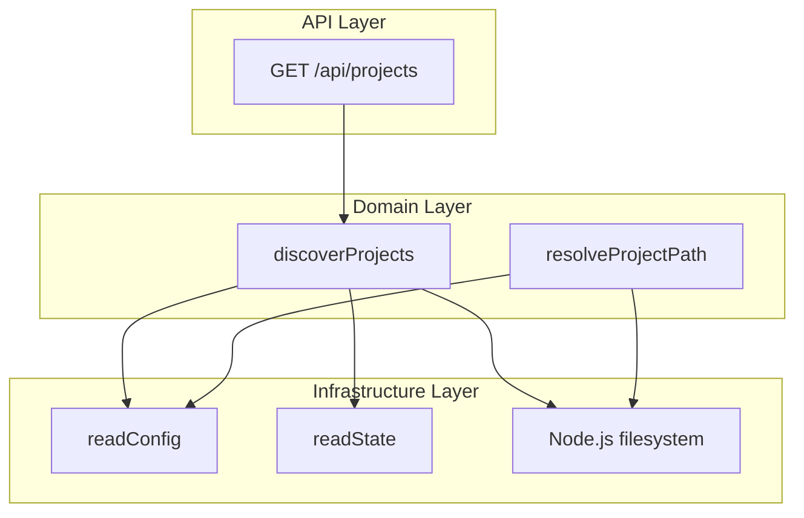
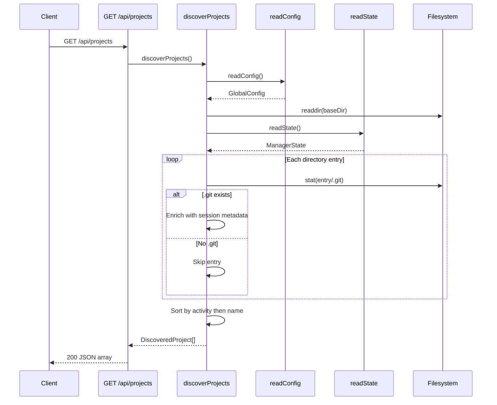
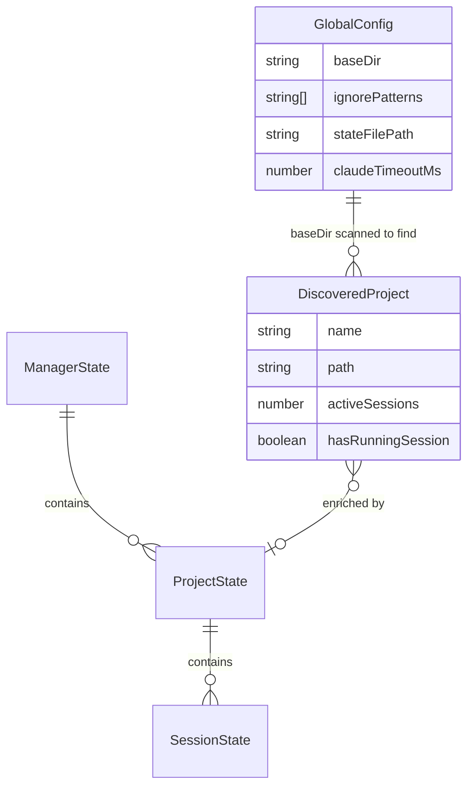

# Design Document: Project Discovery

## Overview

**Purpose**: This feature delivers automatic git repository detection and session-enriched project listing to developers using CC as their session management dashboard.

**Users**: Developers managing multiple Claude Code sessions across repositories will use this to browse available projects, see which have active work, and navigate to project-specific views.

**Impact**: Provides the entry point for all CC workflows — session creation, monitoring, and prompt execution all begin with project discovery.

### Goals

- Scan a configurable base directory for git repositories without manual registration
- Enrich discovered projects with live session metadata (active count, running status)
- Expose results via REST API sorted by activity relevance
- Resolve project names from URL paths to validated filesystem paths

### Non-Goals

- Recursive or multi-level directory scanning
- Project registration, creation, or deletion
- Git operations on discovered repositories (read-only scanning only)
- Real-time filesystem watching or push-based updates

## Architecture

### Existing Architecture Analysis

The project discovery feature operates within CC's existing flat-module architecture:

- **Domain logic** in `src/lib/` as standalone async functions (no classes)
- **Schemas** centralized in `src/lib/schemas.ts` with Zod v4
- **Types** re-exported from `src/types/index.ts`
- **API routes** in `src/app/api/` following Next.js App Router conventions
- **State** persisted as JSON on the filesystem, read via `state.ts`

Discovery is a **read-only consumer** of both config and state — it never mutates either.

### Architecture Pattern & Boundary Map



**Architecture Integration**:

- **Selected pattern**: Flat module functions — matches existing `src/lib/` conventions (see `research.md` for alternatives evaluation)
- **Domain boundaries**: Discovery and Resolution are separate modules with no cross-dependency; both depend on Config but not on each other
- **Existing patterns preserved**: Async function exports, `@/` path aliases, Zod-derived config types, `force-dynamic` API routes
- **Steering compliance**: Flat lib, schema-first types, colocated test files

### Technology Stack

| Layer      | Choice / Version                      | Role in Feature                                    | Notes                             |
| ---------- | ------------------------------------- | -------------------------------------------------- | --------------------------------- |
| Backend    | Next.js 15 App Router                 | API route handler                                  | `force-dynamic` for fresh results |
| Runtime    | Node.js (built-in `fs`, `path`, `os`) | Filesystem scanning, path resolution, OS detection | No external dependencies          |
| Validation | Zod v4                                | Config schema validation                           | `safeParse` for disk-read config  |
| Data       | JSON filesystem (via `state.ts`)      | Session metadata source                            | Read-only access                  |

No new dependencies introduced.

## System Flows

### Project Discovery Flow



Key decisions: The config and state reads happen once at the start (not per-entry). Filtering (ignore patterns, non-directories, no `.git`) happens inline during the scan loop.

## Requirements Traceability

| Requirement | Summary                                              | Components       | Interfaces             | Flows          |
| ----------- | ---------------------------------------------------- | ---------------- | ---------------------- | -------------- |
| 1.1         | One-level-deep scanning for .git dirs                | DiscoveryService | `discoverProjects()`   | Discovery Flow |
| 1.2         | Exclude dirs without .git                            | DiscoveryService | `discoverProjects()`   | Discovery Flow |
| 1.3         | Skip non-directory entries                           | DiscoveryService | `discoverProjects()`   | Discovery Flow |
| 1.4         | Apply ignore patterns                                | DiscoveryService | `discoverProjects()`   | Discovery Flow |
| 1.5         | Empty list for missing baseDir                       | DiscoveryService | `discoverProjects()`   | Discovery Flow |
| 2.1         | Return name, path, activeSessions, hasRunningSession | DiscoveryService | `DiscoveredProject`    | Discovery Flow |
| 2.2         | Count non-archived sessions                          | DiscoveryService | `discoverProjects()`   | Discovery Flow |
| 2.3         | Detect running sessions                              | DiscoveryService | `discoverProjects()`   | Discovery Flow |
| 2.4         | Default zero values when no state                    | DiscoveryService | `discoverProjects()`   | Discovery Flow |
| 3.1         | Active projects sorted first                         | DiscoveryService | `discoverProjects()`   | Discovery Flow |
| 3.2         | Alphabetical within same tier                        | DiscoveryService | `discoverProjects()`   | Discovery Flow |
| 4.1         | Join baseDir + project name                          | ProjectResolver  | `resolveProjectPath()` | —              |
| 4.2         | Return null for missing path                         | ProjectResolver  | `resolveProjectPath()` | —              |
| 4.3         | Return null for path without .git                    | ProjectResolver  | `resolveProjectPath()` | —              |
| 5.1         | OS-appropriate config directory                      | ConfigService    | `getConfigDir()`       | —              |
| 5.2         | Create defaults when no config                       | ConfigService    | `readConfig()`         | —              |
| 5.3         | Merge with defaults for partial config               | ConfigService    | `readConfig()`         | —              |
| 5.4         | Validate with globalConfigSchema                     | ConfigService    | `readConfig()`         | —              |
| 6.1         | GET /api/projects returns JSON array                 | ProjectsRoute    | API Contract           | Discovery Flow |
| 6.2         | force-dynamic caching                                | ProjectsRoute    | API Contract           | —              |
| 6.3         | Error returns 500 with error field                   | ProjectsRoute    | API Contract           | —              |

## Components and Interfaces

| Component        | Domain/Layer   | Intent                                                         | Req Coverage              | Key Dependencies                                       | Contracts      |
| ---------------- | -------------- | -------------------------------------------------------------- | ------------------------- | ------------------------------------------------------ | -------------- |
| DiscoveryService | Domain         | Scan baseDir for git repos, enrich with session metadata, sort | 1.1–1.5, 2.1–2.4, 3.1–3.2 | ConfigService (P0), StateService (P0), Filesystem (P0) | Service        |
| ProjectResolver  | Domain         | Map project name to validated filesystem path                  | 4.1–4.3                   | ConfigService (P0), Filesystem (P0)                    | Service        |
| ConfigService    | Infrastructure | Read/write OS-aware config with defaults and validation        | 5.1–5.4                   | Filesystem (P0), Zod (P0)                              | Service, State |
| ProjectsRoute    | API            | REST endpoint for project listing                              | 6.1–6.3                   | DiscoveryService (P0)                                  | API            |

### Domain Layer

#### DiscoveryService

| Field        | Detail                                                                                 |
| ------------ | -------------------------------------------------------------------------------------- |
| Intent       | Scan configurable base directory for git repositories and return enriched project list |
| Requirements | 1.1, 1.2, 1.3, 1.4, 1.5, 2.1, 2.2, 2.3, 2.4, 3.1, 3.2                                  |

**Responsibilities & Constraints**

- Enumerates immediate children of `baseDir`, identifies git repos by `.git` presence
- Filters out non-directories, ignored patterns, and entries without `.git`
- Enriches each project with session counts from `ManagerState` (read-only)
- Sorts results: active projects first, then alphabetical by name
- Returns empty array (never throws) when `baseDir` is missing

**Dependencies**

- Inbound: ProjectsRoute — calls `discoverProjects()` (P0)
- Outbound: ConfigService — reads `baseDir` and `ignorePatterns` (P0)
- Outbound: StateService — reads `ManagerState` for session metadata (P0)
- External: Node.js `fs` — `readdir`, `stat`, `existsSync` (P0)

**Contracts**: Service [x]

##### Service Interface

```typescript
interface DiscoveryService {
  discoverProjects(): Promise<DiscoveredProject[]>;
}

interface DiscoveredProject {
  /** Repository name (directory name) */
  name: string;
  /** Absolute path to the repository root */
  path: string;
  /** Number of active (non-archived) sessions */
  activeSessions: number;
  /** Whether any session is currently running */
  hasRunningSession: boolean;
}
```

- Preconditions: None (handles missing baseDir gracefully)
- Postconditions: Result is sorted by activity tier then alphabetically; all entries have valid `.git`
- Invariants: Read-only — never mutates config or state

**Implementation Notes**

- Filesystem race (dir removed between `readdir` and `stat`): handled by catching `stat` errors and skipping
- `ignorePatterns` matching uses exact string match against directory name (not glob)
- Session counting: `activeSessions` = sessions where `archived === false`; `hasRunningSession` = any session with `status === "running"`

---

#### ProjectResolver

| Field        | Detail                                                             |
| ------------ | ------------------------------------------------------------------ |
| Intent       | Resolve a URL project name to a validated absolute filesystem path |
| Requirements | 4.1, 4.2, 4.3                                                      |

**Responsibilities & Constraints**

- Joins `config.baseDir` with the provided project name
- Validates: directory exists AND contains `.git`
- Returns `null` for any validation failure (never throws)

**Dependencies**

- Inbound: Various API route handlers — resolve `[name]` URL params (P0)
- Outbound: ConfigService — reads `baseDir` (P0)
- External: Node.js `fs` — `existsSync` (P0)

**Contracts**: Service [x]

##### Service Interface

```typescript
interface ProjectResolver {
  resolveProjectPath(projectName: string): Promise<string | null>;
}
```

- Preconditions: `projectName` is a non-empty string (URL segment)
- Postconditions: Returns absolute path if valid git repo, `null` otherwise
- Invariants: Read-only, no side effects

---

### Infrastructure Layer

#### ConfigService

| Field        | Detail                                                                      |
| ------------ | --------------------------------------------------------------------------- |
| Intent       | Manage OS-aware configuration with automatic defaults and schema validation |
| Requirements | 5.1, 5.2, 5.3, 5.4                                                          |

**Responsibilities & Constraints**

- Determines config directory based on OS platform (macOS vs Linux/XDG)
- Creates default config file on first access
- Merges partial configs with defaults on read (backward compatible with older versions)
- Validates using `globalConfigSchema.partial().parse()` (Zod v4 safe parsing)

**Dependencies**

- Inbound: DiscoveryService, ProjectResolver, StateService — read config (P0)
- External: Node.js `fs`, `os` — filesystem operations, platform detection (P0)
- External: Zod v4 — schema validation (P0)

**Contracts**: Service [x] / State [x]

##### Service Interface

```typescript
interface ConfigService {
  readConfig(): Promise<GlobalConfig>;
  writeConfig(config: GlobalConfig): Promise<void>;
  getConfigDirPath(): string;
}
```

- Preconditions: None (auto-creates directory and file)
- Postconditions: Returned config always has all fields populated (merged with defaults)
- Invariants: Config directory path is immutable at module level (determined once at import)

##### State Management

- **State model**: `GlobalConfig` — `baseDir`, `ignorePatterns`, `stateFilePath`, `claudeTimeoutMs`
- **Persistence**: JSON file at OS-appropriate path (`config.json`)
- **Consistency**: File written atomically (full overwrite); no partial updates
- **Concurrency**: Single-process assumption; no locking needed

---

### API Layer

#### ProjectsRoute

| Field        | Detail                                                           |
| ------------ | ---------------------------------------------------------------- |
| Intent       | REST endpoint exposing discovered projects to frontend consumers |
| Requirements | 6.1, 6.2, 6.3                                                    |

**Responsibilities & Constraints**

- Handles `GET /api/projects` requests
- Delegates entirely to `discoverProjects()` — no business logic in route
- Returns 200 with JSON array on success, 500 with `{ error: string }` on failure

**Dependencies**

- Inbound: Frontend client — HTTP GET (P0)
- Outbound: DiscoveryService — `discoverProjects()` (P0)

**Contracts**: API [x]

##### API Contract

| Method | Endpoint        | Request | Response              | Errors                   |
| ------ | --------------- | ------- | --------------------- | ------------------------ |
| GET    | `/api/projects` | —       | `DiscoveredProject[]` | 500: `{ error: string }` |

**Implementation Notes**

- `export const dynamic = "force-dynamic"` disables Next.js response caching
- Error messages extracted from `Error.message` when available, generic fallback otherwise

## Data Models

### Domain Model



- **GlobalConfig**: Aggregate root for configuration — controls what gets scanned and where state lives
- **DiscoveredProject**: Value object constructed per-scan from filesystem + state data; not persisted
- **ManagerState / ProjectState / SessionState**: Owned by the state module; discovery reads but never writes

### Data Contracts & Integration

**API Data Transfer**:

- Response schema: `DiscoveredProject[]` as JSON array
- Serialization: Next.js `NextResponse.json()` handles JSON serialization
- No request body for GET endpoint

## Error Handling

### Error Strategy

Fail gracefully — discovery returns empty/partial results rather than throwing. Only the API layer converts exceptions to HTTP error responses.

### Error Categories and Responses

| Error                             | Category        | Component        | Response                            |
| --------------------------------- | --------------- | ---------------- | ----------------------------------- |
| `baseDir` does not exist          | Expected state  | DiscoveryService | Return empty array                  |
| `.git` stat fails for an entry    | Filesystem race | DiscoveryService | Skip entry, continue                |
| Config file malformed             | User error      | ConfigService    | Merge with defaults (partial parse) |
| Config file missing               | First run       | ConfigService    | Create default config               |
| State file missing                | First run       | StateService     | Return empty state                  |
| Unexpected exception in discovery | System error    | ProjectsRoute    | 500 `{ error: message }`            |

## Testing Strategy

### Unit Tests

- `discoverProjects()` with mock filesystem: repos found, non-git dirs skipped, files skipped, ignore patterns applied, missing baseDir returns empty
- `discoverProjects()` enrichment: active session counting, running detection, zero defaults for unknown projects
- `discoverProjects()` sorting: active-first ordering, alphabetical within tiers
- `resolveProjectPath()`: valid path, missing directory, directory without `.git`
- `readConfig()`: default creation, merge with partial, full round-trip

### Integration Tests

- `GET /api/projects` route: success response shape, error response on discovery failure, `force-dynamic` header behavior
- Config + Discovery chain: end-to-end from config read through filesystem scan to sorted results
