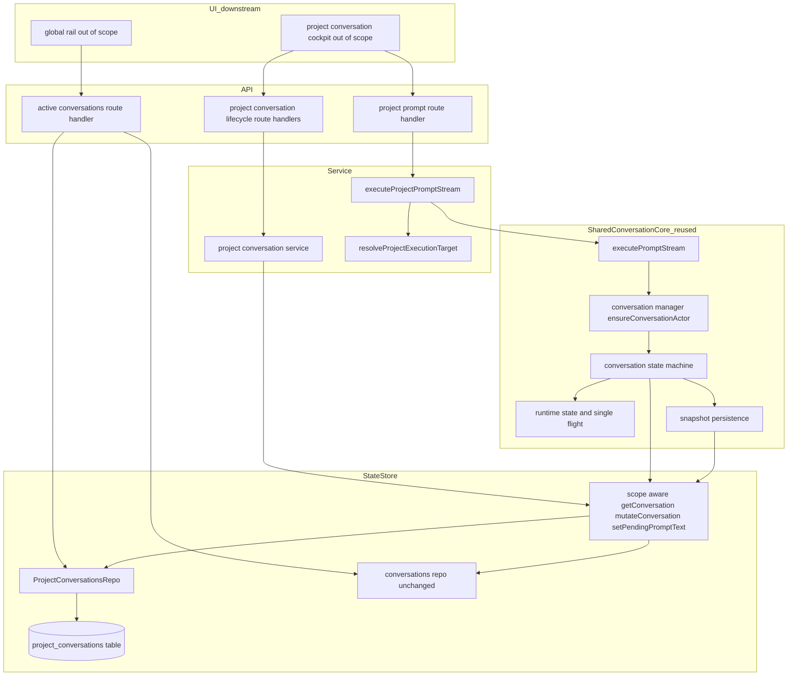

# Design Document — project-level-conversations (foundation)

## Overview

**Purpose**: This feature delivers durable, **session-less project conversations** whose agent turns execute in a project's **repo-root (main) worktree**, giving developers a way to converse with an agent about a repo — and later to scope/spawn sessions — without creating a throwaway session and worktree.

**Users**: Developers using Command Center, via the downstream project-page cockpit (out of scope here) and the global active-conversations rail. This spec is the **data + execution foundation** those surfaces consume.

**Impact**: Generalizes the shared conversation model with an explicit `scope` discriminator (`session | project`), adds a parallel **session-less persistence path** (a `project_conversations` table + repo), adds a **repo-root execution target** and a **session-less prompt entry** that reuse the existing prompt-stream and conversation state machine unchanged, generalizes the conversation **SSE events** with `scope`, and makes the **active-conversations source** return project conversations across all projects. Existing **session conversations are byte-for-byte unchanged** in behavior.

### Goals

- A project owns zero-or-more durable, reload/restart-surviving, session-less conversations (1.x, 2.x).
- Project-conversation turns run in the repo-root worktree with full read/write, reusing the existing conversation machine and prompt stream (4.x, 10.x).
- Open/closed/archived lifecycle + an open-count signal downstream UI reads to pick first-run vs cockpit (3.x).
- Claude/Codex parity: backend fixed after first turn; model/effort per-turn (5.x).
- Fully-parallel, no-guardrail turns across PLCs on the shared main worktree, respecting the actor-rebind guard (6.x).
- The active-conversations source returns PLCs (data only) with a `scope`-consistent shape and real-time events (8.x, 9.x).
- Main-worktree guards: no init script, no dev server, no pre-merge on project turns (11.x).

### Non-Goals

- The cockpit page UI, unified composer, conversation tabs, first-run↔cockpit visual transition (→ project-conversation-cockpit).
- Inline spawn cards, spawn-proposal schema, auto-dispatch primitive (→ chat-session-spawning).
- The global rail's visual grouping/labeling/click-routing and cross-page navigation (→ unified-conversations-panel extension). This spec ships only the data the rail consumes.
- The read-only main-worktree diff/review surface (→ main-worktree diff endpoint direct item + cockpit mount).
- Per-conversation capabilities override UI and notification/Needs-you parity for PLCs (→ capabilities + notifications extensions).
- In-app git mutation on main and any concurrency protection.

## Boundary Commitments

### This Spec Owns

- The `scope: "session" | "project"` discriminator on the shared `conversationStateSchema` (default `"session"`), and the `scope`-discriminated unions for `activeConversationSchema` and the conversation **SSE event** schemas.
- The **`project_conversations`** SQLite table and its `ProjectConversationsRepo` (CRUD + parsed-row cache), including its additive DDL.
- Session-less **state-store** read/write dispatch: `getConversation` / `mutateConversation` / `setConversationPendingPromptText` (and conversation snapshot persistence) routing to the project-conversations repo when addressed via the project sentinel, plus focused project-conversation accessors/setters.
- A **project-conversation service** (create/get/list/rename/archive/close-open lifecycle/open-count) analogous to the session conversation service.
- The repo-root **`ExecutionTarget`** resolver (`resolveProjectExecutionTarget`) and the **session-less prompt entry** (`executeProjectPromptStream` + its route handler) that reuse `executePromptStream` and the conversation machine.
- Generalizing the **active-conversations source** to return project conversations across all projects with open/closed/archived visibility.
- The negative **main-worktree guards** (init-script/dev-server/pre-merge not triggered on project turns) and the project-scoped system-prompt context.
- The reserved sentinel `PROJECT_CONVERSATION_SESSION_SENTINEL` and its rejection as a real session name.

### Out of Boundary

- All UI/presentation (cockpit, composer, tabs, rail grouping/routing, diff surface). This spec exposes data + events only.
- The spawn-proposal schema, auto-dispatch, and `from chat` session tagging.
- Per-PLC capabilities override behavior and PLC notification/push parity (extensions consume this spec's records/events).
- Any change to the existing `conversations` table, the `ManagerState` aggregate's session-nesting, or session-conversation execution.

### Allowed Dependencies

- **Upstream/shared** (may depend on): `@/lib/conversations/schemas` and service, `@/lib/active-conversations/schemas` + route handler, `@/lib/state-store/*` (repos, accessors, setters, store, state-db DDL), `@/lib/prompt/sdk-driver` (`executePromptStream`, error types), `@/lib/prompt/single-flight`, `@/lib/workflows/conversation/{manager,runtime-state,persistence,machine}`, `@/lib/workflow-graph/execution-target-resolver` (the `ExecutionTarget` type), `@/lib/projects/resolver`, `@/lib/git/*` (branch probe), `@/lib/events/broadcaster`, `@/lib/agent-backends/registry`, `@/lib/config/loader`, `@/lib/logging`.
- **Constraints that must not be violated**: do not modify the `conversations` table or the session aggregate path; do not introduce a backward-compat shim for persisted data without approval; do not call `readState()` on a hot path; single-column writes go through focused setters; new iterated repo uses the parsed-row cache + monotonic `cacheVersion`; deps interfaces use method syntax; no `vi.mock` of internal modules.

### Revalidation Triggers

- Any change to the **`scope`-discriminated `ActiveConversation` shape** or the conversation **SSE event** shape → re-check `unified-conversations-panel` and `notifications` consumers.
- Any change to **`resolveProjectExecutionTarget`** output or the **session-less prompt entry** request/stream contract → re-check `chat-session-spawning` (proposal source) and `project-conversation-cockpit` (composer).
- Adding/removing a **persisted field** on project conversations → re-check the capabilities + notifications extensions and the cockpit.
- Changing the **sentinel** value or the state-store dispatch rule → re-check every conversation read/write call site.

## Architecture

### Existing Architecture Analysis

- **Conversations are scope-agnostic structurally**: `ConversationState` carries no `sessionName`/`worktreePath` (they live on the parent `SessionState`). The only missing concept is an explicit `scope`.
- **Execution seam already exists**: `executePromptStream(projectPath, session, …, { executionTarget })` → `ensureConversationActor(…, { executionTarget })` binds `worktreePath = executionTarget.worktreePath ?? session.worktreePath` and enforces the **actor-rebind guard**.
- **`projectPath` is the repo-root checkout**: `resolveProjectPath` returns the repo root verified by `.git`; the "main worktree" is `projectPath`.
- **Keying is a `(projectPath, sessionName, conversationId)` triple** across runtime/lock/actor/persistence; distinct conversation ids already yield independent actors/locks → native per-conversation parallelism.
- **The `conversations` table FK-cascades to `sessions`** and the `ManagerState` aggregate nests conversations under sessions; a session-less row cannot live there.
- **Conversation SSE events broadcast to all clients**; the client routes off payload identity.

### Architecture Pattern & Boundary Map

Selected pattern: **shared-schema generalization (`scope` discriminator) + a parallel session-less persistence/execution arm that reuses the conversation machine via a sentinel-keyed dispatch.** Variation is pushed to the edges (a `scope` field, a discriminated union, one dispatch branch, an additive table) so the conversation core stays small.



**Architecture Integration**:
- Selected pattern: shared-schema generalization + sentinel-keyed reuse of the conversation machine; additive persistence arm.
- Domain/feature boundaries: this spec owns the `scope` field, the `project_conversations` repo/table, the project-conversation service, the repo-root target + session-less entry, the active-source generalization, and the guards. The conversation machine/manager/runtime/persistence are **reused unchanged** (only the state-store dispatch they call becomes scope-aware).
- Existing patterns preserved: per-conversation single-flight + actor-rebind guard (parallelism), parsed-row cache + monotonic version (repo), focused accessors/setters (PERFORMANCE.md), DI via factory/setter, schema-first Zod + `z.infer`.
- New components rationale: a session-less row has no host session (new table/repo); a session-less turn needs a repo-root target + an entry that synthesizes the session-shaped value (new resolver/entry); the rail needs PLC data (active-source generalization).
- Steering compliance: composable primitives (no machine fork); no `any`/unsafe `as`; method-syntax deps; no backward-compat shim (default `scope`); additive-only DDL on the shared DB.

### Dependency Direction

`Schemas (scope) → state-db DDL → ProjectConversationsRepo → state-store dispatch + accessors/setters → project-conversation service → ExecutionTarget resolver + session-less prompt entry → route handlers → (downstream UI)`. The active-conversations source depends on the repo + schemas. Each layer imports only leftward. The conversation machine/manager are a **shared dependency** the session-less entry calls into, never the reverse.

### Technology Stack

| Layer | Choice / Version | Role in Feature | Notes |
|-------|------------------|-----------------|-------|
| Backend / Services | TypeScript 5 (strict), Next.js 16 route handlers | Project prompt + lifecycle routes; service; resolver/entry | Reuses `executePromptStream` + conversation machine |
| Data / Storage | better-sqlite3 (WAL), Zod v4 | New `project_conversations` table; `scope`-extended schemas; parsed-row cache | Additive DDL only; `z.infer` types; `z.record(z.string(), v)` for v4 |
| Messaging / Events | Existing SSE broadcaster | `scope`-discriminated conversation events | All-clients broadcast; client routing downstream |
| Infrastructure / Runtime | Existing single-flight lock, XState conversation machine, runtime registry | Parallel turns, actor lifecycle, snapshot persistence | Sentinel-keyed reuse; actor-rebind guard |

## File Structure Plan

### Directory Structure

```
src/lib/
├── conversations/
│   ├── schemas.ts                         # MODIFY: add `scope` to conversationStateSchema; scope-discriminate SSE event schemas; export PROJECT_CONVERSATION_SESSION_SENTINEL
│   └── project-conversation-scope.ts      # NEW: sentinel constant + isProjectSentinel(sessionName) guard (client-safe, no deps)
├── active-conversations/
│   ├── schemas.ts                         # MODIFY: activeConversationSchema → scope-discriminated union (session | project)
│   └── route-handlers.ts                  # MODIFY: add project-conversation pass (listProjectConversations dep) emitting project variants
├── project-conversations/                 # NEW DOMAIN (the session-less conversation surface)
│   ├── service.ts                         # NEW: createProjectConversationService(deps) — create/get/list/rename/archive/close/open/openCount
│   ├── lifecycle.ts                       # NEW: pure open/closed/archived helpers + open-count derivation (unit-testable, no I/O)
│   ├── execution-target.ts               # NEW: resolveProjectExecutionTarget(projectPath) → ExecutionTarget (repo-root)
│   ├── prompt-entry.ts                    # NEW: executeProjectPromptStream(...) — synthesizes sentinel session + repo-root target, delegates to executePromptStream
│   ├── route-handlers.ts                  # NEW: project prompt POST + lifecycle (create/rename/archive/close/open) handlers; broadcast scope=project events
│   ├── system-prompt.ts                   # NEW: PROJECT_CC_CONTEXT (omits dev-server promise) — main-worktree guard (prompt side)
│   └── schemas.ts                         # NEW: project-conversation request/response schemas (createProjectConversation, openState payloads)
└── state-store/
    ├── state-db.ts                        # MODIFY: add project_conversations table DDL (additive) + additive columns helper entry
    ├── project-conversations-repo.ts      # NEW: ProjectConversationsRepo (mirrors conversations-repo: cache + cacheVersion, findAll/findByKey/findByProject/upsert/delete/setPendingPromptText/setArchived/setOpen)
    ├── accessors.ts                       # MODIFY: add getProjectConversation, getProjectConversations, listAllProjectConversations
    ├── setters.ts                         # MODIFY: add setProjectConversationArchived, setProjectConversationOpen, setProjectConversationPendingPromptText
    └── store.ts                           # MODIFY: wire project-conversations repo; scope-aware getConversation/mutateConversation/setConversationPendingPromptText/mutateProjectConversation
└── workflows/conversation/
    └── persistence.ts                     # MODIFY (minimal): snapshot writes already route via state-store mutateConversation/getConversation → become scope-aware through the dispatch (no logic change beyond accepting sentinel)
```

### Modified Files

- `src/lib/conversations/schemas.ts` — add `scope` field (default `"session"`); convert conversation SSE event schemas to `z.discriminatedUnion("scope", …)` with a session variant (unchanged wire incl. `sessionName`) and a project variant (`projectName` + `conversationId`, no `sessionName`).
- `src/lib/active-conversations/schemas.ts` — `activeConversationSchema` becomes a `scope`-discriminated union; project variant omits `sessionName`/`branchName`, sets `worktreePath` to the project main path.
- `src/lib/active-conversations/route-handlers.ts` — add a `listProjectConversations()` dep and a second pass that maps project-conversation rows to project-variant `ActiveConversation`s; preserve the existing session pass.
- `src/lib/state-store/state-db.ts` — additive `CREATE TABLE IF NOT EXISTS project_conversations (...)` + index; additive-columns entries for forward edits.
- `src/lib/state-store/store.ts` / `accessors.ts` / `setters.ts` — wire the new repo; make the three conversation read/write functions scope-aware (sentinel ⇒ project repo); add focused project accessors/setters and `mutateProjectConversation`.
- `src/lib/workflows/conversation/persistence.ts` — no behavioral change; its `mutateConversation`/`getConversation` calls become scope-aware because the underlying state-store dispatch handles the sentinel.

> Each file has one responsibility. The `project-conversations/` domain owns the session-less surface; `state-store/` owns persistence + dispatch; `conversations/` + `active-conversations/` own the shared schema generalization.

## System Flows

### Session-less turn (PLC create + run on main)

```mermaid
sequenceDiagram
  participant UI as Cockpit (downstream)
  participant Route as project prompt route
  participant Entry as executeProjectPromptStream
  participant Target as resolveProjectExecutionTarget
  participant Driver as executePromptStream (shared)
  participant Mgr as ensureConversationActor (shared)
  participant Repo as ProjectConversationsRepo

  UI->>Route: POST project prompt (text, backend, model, effort)
  Route->>Entry: projectPath, body
  Entry->>Target: resolveProjectExecutionTarget(projectPath)
  Target-->>Entry: { worktreePath: projectPath, branchName, isolation: worktree }
  Entry->>Driver: executePromptStream(projectPath, sentinelSession, text, emit, convId?, model, images, { executionTarget, backend, effort })
  Note over Driver,Repo: get-or-create conversation via scope-aware state store (sentinel ⇒ project repo)
  Driver->>Mgr: ensureConversationActor(projectPath, sentinel, convId, { executionTarget })
  Note over Mgr: binds worktreePath = projectPath; rebind guard active
  Mgr-->>Driver: actor (idle)
  Driver->>Driver: SUBMIT_PROMPT; stream; await turn completion
  Driver-->>Route: SSE (status/message events, scope=project); done
```

Key decisions: get-or-create + backend lock + model/effort validation are **reused** from `executePromptStream` (5.x). Parallelism: a second PLC with a different id gets a different actor/lock and runs concurrently; a second turn for the same PLC id is rejected by single-flight; a running-actor worktree mismatch throws via the rebind guard (6.x). No init-script/dev-server runs because no session-creation/dev-server flow is invoked (11.x).

## Requirements Traceability

| Requirement | Summary | Components | Interfaces | Flows |
|-------------|---------|------------|------------|-------|
| 1.1, 1.2, 1.7 | Project owns session-less convos; sessions unchanged; explicit scope | conversationStateSchema (`scope`); ProjectConversationsRepo; project-conversation service | `scope` field; `ProjectConversationsRepo`; `ProjectConversationService` | — |
| 1.3, 1.6 | Durable, reload/restart-surviving | ProjectConversationsRepo; project_conversations table | repo CRUD | — |
| 1.4, 1.5 | Persist required fields + title | conversationStateSchema; service.create | `createProjectConversation` | — |
| 2.1 | First plain prompt creates first PLC | session-less prompt entry; executePromptStream get-or-create | `executeProjectPromptStream` | turn flow |
| 2.2, 2.3 | Multiple open PLCs; unique stable id | service; repo | `ProjectConversationService` | — |
| 3.1–3.7 | open/closed/archived + open-count | lifecycle.ts; service; setters; schemas | `deriveOpenState`, `setProjectConversationOpen/Archived`, `getProjectOpenCount` | — |
| 4.1, 4.5, 4.6 | Run in repo-root; resolve target; reuse machine | execution-target.ts; prompt-entry.ts; manager (reused) | `resolveProjectExecutionTarget`; `executeProjectPromptStream` | turn flow |
| 4.2 | Full read/write on main | prompt-entry (no read-only restriction) | — | turn flow |
| 4.3 | Identify `main · worktree` | execution-target (branch/worktree); active schema project variant | `ExecutionTarget`; `ActiveConversation` project variant | — |
| 4.4 | No branch/worktree creation | prompt-entry (never creates worktree) | — | turn flow |
| 5.1–5.5 | Backend lock + per-turn model/effort | executePromptStream (reused: BackendMismatchError, validateModelAndEffort) | reused error types | turn flow |
| 6.1–6.5 | Parallel, no guardrail, rebind-safe | single-flight (reused); ensureConversationActor rebind guard (reused); sentinel keying | reused lock + guard | turn flow |
| 7.1, 7.2 | Dirty main does not block | prompt-entry (no clean check) | — | turn flow |
| 8.1–8.4 | Active source returns PLCs; visibility; consistent shape | active-conversations route-handlers; activeConversationSchema union; repo `listAll` | `listProjectConversations`; project variant | — |
| 9.1–9.3 | Real-time events via scope-discriminated SSE | conversation SSE event schemas (union); project lifecycle route broadcasts; machine status broadcast (reused) | `scope`-discriminated events | turn flow |
| 10.1–10.3 | Progress + failure + completion reporting | executePromptStream/machine (reused); active source | reused status/error path | turn flow |
| 11.1–11.4 | No init/dev-server/pre-merge; sessions unchanged | prompt-entry (invokes none); system-prompt.ts | `PROJECT_CC_CONTEXT` | — |
| 12.1–12.3 | Session behavior unchanged; no shim | scope default `"session"`; untouched session path | `scope.default("session")` | — |

## Components and Interfaces

| Component | Domain/Layer | Intent | Req Coverage | Key Dependencies (P0/P1) | Contracts |
|-----------|--------------|--------|--------------|--------------------------|-----------|
| Conversation scope schema | Types | Add `scope`; discriminate SSE events | 1.7, 9.2, 12.1 | conversations/schemas (P0) | State, Event |
| ProjectConversationsRepo | Data | Persist session-less conversations + cache | 1.3, 1.6, 8.x | state-db, conversationStateSchema (P0) | State |
| State-store scope dispatch | Data | Route conversation read/write by sentinel | 1.x, 6.x, 9.x | repo, store, accessors, setters (P0) | Service |
| ProjectConversationService | Service | Lifecycle CRUD + open-count | 1.x, 2.x, 3.x | state-store dispatch (P0); lifecycle.ts (P1) | Service |
| Lifecycle helpers | Service | Pure open/closed/archived + open-count | 3.x | none | Service |
| resolveProjectExecutionTarget | Service | Repo-root ExecutionTarget | 4.1, 4.3, 4.5 | projects/resolver, git branch probe (P0) | Service |
| executeProjectPromptStream | Service | Session-less prompt entry | 2.1, 4.x, 6.x, 7.x, 11.x | executePromptStream, resolver (P0) | Service |
| Project conversation routes | API | HTTP for prompt + lifecycle; broadcast events | 2.x, 3.x, 9.1 | service, entry, broadcaster (P0) | API, Event |
| Active-conversations source ext | API | Return PLCs across all projects | 8.x | repo listAll, activeConversation union (P0) | API |
| Main-worktree guards | Service | No init/dev-server/pre-merge; project prompt context | 11.x | prompt-entry, system-prompt (P1) | Service |

### Types / Schemas

#### Conversation scope schema (modify `src/lib/conversations/schemas.ts`)

**Responsibilities & Constraints**: Add an explicit scope to the shared conversation state; make the conversation SSE events scope-aware. Default keeps every existing session row/event valid (no shim). Owns the sentinel export.

**Contracts**: State [x] / Event [x]

##### State / Schema

```typescript
// Reserved session-name value that addresses the project-conversation repo
// through the otherwise session-keyed state-store/runtime/lock APIs.
export const PROJECT_CONVERSATION_SESSION_SENTINEL = "__project__";

export const conversationScopeSchema = z
  .enum(["session", "project"])
  .default("session");
export type ConversationScope = z.infer<typeof conversationScopeSchema>;

// conversationStateSchema gains:
//   scope: conversationScopeSchema,
// Everything else unchanged. Existing rows (no `scope`) decode as "session".
```

- Preconditions: a real session may never be named `PROJECT_CONVERSATION_SESSION_SENTINEL` (enforced at session creation).
- Postconditions: `conversationStateSchema.parse(legacyRow)` yields `scope: "session"`.
- Invariants: project-conversation records persist with `scope: "project"`; session-conversation records with `scope: "session"`.

##### Event Contract (scope-discriminated)

- Each conversation event (`conversation-status`, `message-appended`, `message-updated`, `conversation-created`, `conversation-renamed`, `conversation-archived`, `conversation-unread`, `ask-question`, `message-queued`) becomes `z.discriminatedUnion("scope", [sessionVariant, projectVariant])`.
- **Session variant**: adds `scope: z.literal("session")`; retains `projectName`, `sessionName`, `conversationId`, and event-specific payload — **wire-compatible** with today (the discriminator is additive; existing producers stamp `scope:"session"`).
- **Project variant**: `scope: z.literal("project")`, `projectName`, `conversationId`, event-specific payload, **no `sessionName`**.
- Ordering/delivery: unchanged — single all-clients broadcast channel; client routes off `scope` + identity (routing/presentation downstream).
- Idempotency: events are advisory cache-invalidation signals (as today).

> Implementation note: introduce a shared `conversationEventScopeBase` and compose each variant to avoid duplication; producers in the conversation machine (`broadcastConversationStatus`, `broadcastAskQuestion`) stamp `scope` derived from the conversation's scope (sentinel ⇒ `"project"`).

#### Project conversation request/response schemas (new `src/lib/project-conversations/schemas.ts`)

```typescript
export const createProjectConversationRequestSchema = z.object({
  agentBackend: agentBackendSchema.optional(), // defaults via config when omitted
  name: z.string().trim().min(1).max(200).optional(),
});

export const projectConversationOpenRequestSchema = z.object({
  open: z.boolean(),
});
// archive reuses sessionArchiveRequestSchema ({ archived: boolean }).
// project prompt reuses runPromptRequestSchema ({ prompt, modelId?, effort?, backend?, images? }).
```

### Data Layer

#### ProjectConversationsRepo (new `src/lib/state-store/project-conversations-repo.ts`)

| Field | Detail |
|-------|--------|
| Intent | Persist session-less conversations with a parsed-row cache mirroring conversations-repo |
| Requirements | 1.3, 1.6, 3.x, 8.x |

**Responsibilities & Constraints**
- Own the `project_conversations` table CRUD. Encode/decode via the shared `conversationStateSchema` (rows carry `scope: "project"`).
- Maintain a per-row `Map<id, { rawRow, parsed }>` + monotonic `cacheVersion`; every mutator bumps it (PERFORMANCE.md Pattern 3). `findAll`/`findByProject` short-circuit on an unchanged version and return cached results by reference.
- Keyed `(project_path, id)` — **no `session_name`**. FK → `projects(root_path) ON DELETE CASCADE`.

**Dependencies**
- Inbound: state-store dispatch, accessors, active-conversations source (P0).
- Outbound: better-sqlite3 `Db`; `conversationStateSchema` (P0).

**Contracts**: State [x]

##### Service Interface

```typescript
export interface ProjectConversationsRepo {
  findById(id: string): ConversationState | null;
  findByKey(projectPath: string, id: string): ConversationState | null;
  findByProject(projectPath: string): ConversationState[];
  findAll(): { projectPath: string; conversation: ConversationState }[];
  upsert(projectPath: string, conversation: ConversationState): void;
  delete(id: string): void;
  setPendingPromptText(projectPath: string, id: string, text: string | null): boolean;
  setArchived(projectPath: string, id: string, archived: boolean): boolean;
  setOpen(projectPath: string, id: string, open: boolean): boolean;
}
```

- Preconditions: `conversation.scope === "project"` on `upsert` (validated by the schema).
- Postconditions: every mutator that changes a row bumps `cacheVersion`; `findAll()` returns the same array reference when `cacheVersion` is unchanged.
- Invariants: rows never reference a session; `open`/`archived` are independent booleans (a row may be closed-and-not-archived).

##### State Management (open/closed/archived)

- **State model**: `archived: boolean` (existing column reused) + a new **`open: boolean`** column (default `true` on create). `closed = !open && !archived`. `archived` excludes from the active source by default.
- **Persistence & consistency**: `open`/`archived` are single-column focused setters (narrow SQL `UPDATE` inside the write queue), never `mutate*` (PERFORMANCE.md Pattern 2).
- **Concurrency strategy**: turns are gated per-conversation by single-flight (reused); lifecycle flag writes are independent column updates.

#### State-store scope dispatch (modify `store.ts` / `accessors.ts` / `setters.ts`)

**Responsibilities & Constraints**: Make conversation read/write **scope-aware** so the reused conversation machine/manager/persistence transparently address project conversations.

**Contracts**: Service [x]

```typescript
// store.ts — dispatch on the sentinel sessionName.
getConversation(projectPath, sessionName, id):
  sessionName === SENTINEL ? projectRepo.findByKey(projectPath, id)
                           : conversationsRepo.findByKey(projectPath, sessionName, id);

mutateConversation(projectPath, sessionName, id, label, mutate):
  sessionName === SENTINEL ? mutateProjectConversation(projectPath, id, label, mutate)
                           : /* existing session-nested path */;

setConversationPendingPromptText(projectPath, sessionName, id, text):
  sessionName === SENTINEL ? setters.setProjectConversationPendingPromptText(projectPath, id, text)
                           : /* existing */;

// new focused project mutator (no session involvement)
async function mutateProjectConversation<T>(projectPath, id, label, mutate):
  // load project conversation, run mutate(conversation), stamp lastActivityAt,
  // upsert via projectRepo inside the write queue; bump cacheVersion.
```

- New accessors: `getProjectConversation(projectPath, id)`, `getProjectConversations(projectPath)`, `listAllProjectConversations()` (whole-source walk for the active source).
- New setters: `setProjectConversationArchived`, `setProjectConversationOpen`, `setProjectConversationPendingPromptText`.
- Invariant: the sentinel arm never reads/writes any session row; `mutateProjectConversation` does not go through `mutateSession`.
- The focused-read regression test (`createStateStore-focused-read.test.ts`) is extended so project accessors don't touch the aggregate.

### Service Layer

#### ProjectConversationService (new `src/lib/project-conversations/service.ts`)

| Field | Detail |
|-------|--------|
| Intent | Lifecycle CRUD + open-count for session-less conversations |
| Requirements | 1.1, 1.4, 2.2, 2.3, 3.1–3.7 |

**Responsibilities & Constraints**: Create/get/list/rename/archive/close/open project conversations and derive the open-count. `create` builds a `ConversationState` with `scope:"project"`, `open:true`, a human-readable default title, and the chosen/config backend, then persists via the project repo. Mirrors `conversations/service.ts` but does **not** route through `mutateSession`.

**Dependencies**: Outbound — state-store project accessors/setters + `mutateProjectConversation` (P0); `lifecycle.ts` (P1); `config/loader` for default backend (P1).

**Contracts**: Service [x]

```typescript
export interface ProjectConversationService {
  createProjectConversation(projectPath: string, opts?: { agentBackend?: AgentBackendId; name?: string }): Promise<ConversationState>;
  getProjectConversation(projectPath: string, id: string): Promise<ConversationState | null>;
  listProjectConversations(projectPath: string): Promise<ConversationState[]>;
  renameProjectConversation(projectPath: string, id: string, name: string): Promise<void>;
  setProjectConversationArchived(projectPath: string, id: string, archived: boolean): Promise<void>;
  setProjectConversationOpen(projectPath: string, id: string, open: boolean): Promise<void>;
  getOpenProjectConversationCount(projectPath: string): Promise<number>;
}
```

- Preconditions: `projectPath` resolves to a project root.
- Postconditions: `createProjectConversation` returns a persisted record with a unique stable id and `scope:"project"`, `open:true`; closing sets `open:false` without archiving; archiving sets `archived:true`.
- Invariants: open-count counts rows with `open && !archived`.

**Implementation Notes**
- Integration: lifecycle route handlers call this service and then broadcast scope=project events (create/rename/archive/open) via the broadcaster (mirrors `lifecycle-route-handlers.ts`).
- Validation: name length via schema; backend default via config when omitted.
- Risks: keep the default title deterministic (e.g. `"<project> chat N"`) so the rail/tab have a label (1.4, 1.5).

#### Lifecycle helpers (new `src/lib/project-conversations/lifecycle.ts`)

```typescript
export type ProjectConversationLifecycle = "open" | "closed" | "archived";
export function deriveLifecycle(c: { open: boolean; archived: boolean }): ProjectConversationLifecycle;
export function isListedInActiveSource(c: { archived: boolean }): boolean; // !archived
export function countOpen(convs: ReadonlyArray<{ open: boolean; archived: boolean }>): number;
```

- Pure, no I/O — unit-tested directly (no mocks). Encodes 3.1 (state names), 3.3/3.5 (visibility), 3.6/3.7 (open-count).

#### resolveProjectExecutionTarget (new `src/lib/project-conversations/execution-target.ts`)

| Field | Detail |
|-------|--------|
| Intent | Produce the repo-root ExecutionTarget for a project |
| Requirements | 4.1, 4.3, 4.5 |

**Contracts**: Service [x]

```typescript
export interface ProjectExecutionTargetDeps {
  getCurrentBranch(repoRootPath: string): Promise<string | null>; // git rev-parse --abbrev-ref HEAD
}
export function createProjectExecutionTargetResolver(deps: ProjectExecutionTargetDeps): {
  resolve(projectPath: string): Promise<ExecutionTarget>;
};
// resolve(projectPath) =>
//   { worktreePath: projectPath, branchName: branch ?? `detached@<shortSha>`, isolation: "worktree", laneId: null }
```

- Preconditions: `projectPath` is the repo root (it is, by `resolveProjectPath`).
- Postconditions: returns a well-formed `ExecutionTarget` even on detached HEAD (never blocks the turn — 7.x spirit).
- Reuses the existing `ExecutionTarget` type from `workflow-graph/execution-target-resolver`; **does not** modify the lane resolver.

#### executeProjectPromptStream (new `src/lib/project-conversations/prompt-entry.ts`)

| Field | Detail |
|-------|--------|
| Intent | Session-less prompt entry reusing the shared prompt stream + machine |
| Requirements | 2.1, 4.2, 4.4, 4.6, 5.x, 6.x, 7.x, 10.x, 11.x |

**Responsibilities & Constraints**: Resolve the repo-root target, synthesize a sentinel `SessionState`-shaped value (`sessionName = SENTINEL`, `worktreePath = projectPath`, `tddEnabled` from config, empty `conversations`, `branchName` from the target), and delegate to `executePromptStream(projectPath, sentinelSession, …, { executionTarget, backend, effort, … })`. Get-or-create + backend lock + model/effort validation are handled inside `executePromptStream` (reused). Performs **no** worktree creation, **no** clean check, **no** init-script/dev-server invocation.

**Dependencies**: Outbound — `executePromptStream` + its error types (P0); `resolveProjectExecutionTarget` (P0); `readConfig` for `tddEnabled`/default backend (P1); `project-conversation-scope` sentinel (P0).

**Contracts**: Service [x]

```typescript
export interface ExecuteProjectPromptStreamDeps {
  resolveExecutionTarget(projectPath: string): Promise<ExecutionTarget>;
  executePromptStream: typeof executePromptStream;
  readConfig: typeof readConfig;
}
export function createProjectPromptExecutor(deps: ExecuteProjectPromptStreamDeps): {
  executeProjectPromptStream(input: {
    projectPath: string;
    conversationId?: string;             // omitted ⇒ create first PLC (2.1)
    promptText: string;
    emit: (event: string, data: unknown) => void;
    modelId?: string;
    images?: ImagePayload[];
    backend?: AgentBackendId;
    effort?: string;
  }): Promise<PromptStreamResult>;
};
```

- Preconditions: none beyond a resolvable project; a dirty main worktree is acceptable (7.x).
- Postconditions: a turn runs in `projectPath`; SSE events carry `scope:"project"`; backend is locked after the first turn (5.x).
- Invariants: distinct `conversationId`s run in parallel (6.1–6.3); same-id concurrent turn rejected by single-flight (6.4); running-actor worktree mismatch throws (6.5).

**Implementation Notes**
- Integration: the project prompt route handler wraps this in the SSE `ReadableStream` exactly like `prompt/route-handlers.ts`, mapping `BackendMismatchError`/`ModelEffortValidationError` to typed SSE error frames (5.3, 5.5, 10.2).
- Validation: model/effort validated by the backend factory inside `executePromptStream` (reused).
- Risks: the synthetic session must satisfy `SessionState` shape for the actor input loader; the manager's `defaultLoadActorInput` is **not** used for project conversations because the entry supplies the actor input via the scope-aware `getConversation` + `executionTarget` path — confirm the manager loads project-conversation actor input through the scope-aware `getConversation` (sentinel) rather than `getSession`. (See Integration & Migration Notes.)

#### Main-worktree guards (new `src/lib/project-conversations/system-prompt.ts` + behavior)

| Field | Detail |
|-------|--------|
| Intent | Ensure no init-script/dev-server/pre-merge on project turns; project-scoped prompt context |
| Requirements | 11.1–11.4 |

**Responsibilities & Constraints**: Provide `PROJECT_CC_CONTEXT` (a system-prompt orientation that omits the dev-server promise present in `CC_CONTEXT`). The init-script/dev-server/pre-merge **non-execution** is structural (the session-less entry invokes none of those flows); this is asserted by tests rather than a new guard subsystem. Sessions remain unchanged (11.4).

**Implementation Notes**
- Integration: the project turn uses `PROJECT_CC_CONTEXT` in place of the dev-server-promising `CC_CONTEXT`.
- Validation: tests assert a project turn performs no init-script exec and registers no dev server.
- Risks: ensure no downstream code offers `ensure_dev_server` for a project conversation.

### API Layer

#### Project conversation routes (new `src/lib/project-conversations/route-handlers.ts`)

**Contracts**: API [x] / Event [x]

##### API Contract

| Method | Endpoint | Request | Response | Errors |
|--------|----------|---------|----------|--------|
| POST | /api/projects/[name]/conversations (project-scoped create) | `createProjectConversationRequestSchema` | `ConversationState` (201) | 404 |
| POST | /api/projects/[name]/conversations/[conversationId]/prompt | `runPromptRequestSchema` | SSE stream (`text/event-stream`) | 400, 404, 409 (busy), 409 (backend mismatch) |
| POST | /api/projects/[name]/prompt (no conversation ⇒ create first PLC) | `runPromptRequestSchema` | SSE stream | 400, 404 |
| PATCH | /api/projects/[name]/conversations/[conversationId]/rename | `renameConversationRequestSchema` | `{ ok: true }` | 404, 500 |
| PATCH | /api/projects/[name]/conversations/[conversationId]/archive | `sessionArchiveRequestSchema` | `{ ok: true }` | 404, 500 |
| PATCH | /api/projects/[name]/conversations/[conversationId]/open | `projectConversationOpenRequestSchema` | `{ ok: true }` | 404, 500 |

- Route shells in `src/app/api/projects/[name]/...` are thin re-exports per the structure rules.
- These mirror the session prompt + lifecycle handlers, swapping the session lookup for `resolveProjectPath` + the project sentinel, and the executor for `executeProjectPromptStream`.

##### Event Contract

- Published: scope=project variants of `conversation-created`, `conversation-renamed`, `conversation-archived`, and a `conversation-status`/`message-appended` stream during turns (the latter emitted by the reused conversation machine with `scope:"project"`).
- An **open/close** lifecycle event is required by 9.1 (closed/reopened must emit a real-time change). Decision: add a `conversation-open` event scoped to `project` (carrying `projectName`, `conversationId`, `open: boolean`). It is project-only because closing/reopening as a first-class tab state exists only for project conversations in this initiative; if session conversations later gain the same concept, the event can be widened to a scope union then.
- Delivery: all-clients broadcast (unchanged); routing downstream.

#### Active-conversations source extension (modify `src/lib/active-conversations/route-handlers.ts`)

**Contracts**: API [x]

- Add a `listProjectConversations(): Promise<{ projectPath: string; conversation: ConversationState }[]>` dep (backed by `listAllProjectConversations()`).
- Second pass: for each non-archived project conversation in an active status, push a **project-variant** `ActiveConversation` (`scope:"project"`, `projectName`, `worktreePath = projectPath`, no `sessionName`/`branchName`, `lastActivitySummary` best-effort from transcript as today).
- Preserve the existing session pass entirely (12.x). Sort the merged list by `lastActivityAt` (existing behavior).
- Visibility: include open and closed (non-archived) PLCs; exclude archived (3.3/3.5/8.2).

## Data Models

### Logical Data Model

**`project_conversations`** (new) — same column set as `conversations` **minus `session_name`**, **plus `open INTEGER NOT NULL DEFAULT 1`**, scope implied by table (rows decode with `scope:"project"`):

- PK: `id`. Unique addressing: `(project_path, id)`.
- FK: `project_path → projects(root_path) ON DELETE CASCADE`.
- Indexes: `idx_project_conversations_project (project_path)`, `idx_project_conversations_last_activity (last_activity_at)`.
- JSON columns (pending_questions, forked_from, debug_mode, machine_snapshot, backend_ref, mcp_*, agent_capability_*) parsed/validated exactly as in `conversations-repo` (reuse the codec helpers).

**Consistency & Integrity**: project conversations are **not** part of `ManagerState`; they are read via focused accessors and the active source. Deleting a project deletes its project conversations (cascade). No cross-table transaction with sessions.

**Migration**: additive only — `CREATE TABLE IF NOT EXISTS project_conversations (...)` in `SCHEMA_DDL` + the `open` column added through the existing `ensureAdditiveColumns` mechanism if the table predates the column. Old `main` builds ignore the table (forward-compatible per the shared-DB landmine).

### Data Contracts & Integration

- **`ActiveConversation` (scope union)**: session variant unchanged; project variant `{ scope:"project", id, name, status, lastActivityAt, projectName, projectPath, agentBackend, summary, pendingQuestion*, forkedFrom, debugActive, role, worktreePath: <projectPath>, lastActivitySummary, unread }` with `sessionName`/`branchName` **absent**. Consumers narrow on `scope`.
- **Conversation SSE events (scope union)**: session variant wire-compatible with today; project variant omits `sessionName`. One channel, scope-discriminated (9.2).

## Error Handling

### Error Strategy

- Reuse the session prompt path's typed errors: `BackendMismatchError` (5.3 → SSE `BACKEND_MISMATCH`, HTTP 409), `ModelEffortValidationError` (5.5 → SSE `VALIDATION_ERROR`, HTTP 400). The actor-rebind guard throws a plain error surfaced as an SSE `error` frame (6.5).
- Lifecycle routes return 404 (project/conversation not found), 400 (bad body), 500 (persistence failure), mirroring the session lifecycle handlers.
- Persistence validation failures in the project repo throw `PersistenceError` at the boundary (same as `conversations-repo`); the active source is best-effort for `lastActivitySummary` (never breaks the response).

### Error Categories and Responses

- **User errors (4xx)**: empty prompt (400), unknown project/conversation (404), conversation busy (409), backend mismatch (409).
- **System errors (5xx)**: persistence failure on lifecycle mutation (500); active-source read failure (500, existing behavior).
- **Business-logic**: backend change after first turn rejected (5.3); model/effort invalid for backend rejected (5.5).

### Monitoring

- Structured logging via `createLogger` in each new module (`project-conversations.*`, `state-store.project-conversations`). Repo timing mirrors `conversations-repo` `*.timing` events. The active source keeps its existing timing. No new log schema.

## Testing Strategy

### Unit Tests
- `lifecycle.ts`: `deriveLifecycle` (open/closed/archived), `countOpen`, `isListedInActiveSource` across all flag combinations (3.1–3.7) — pure, no mocks.
- `project-conversations-repo`: parsed-row cache returns same reference when `cacheVersion` unchanged; new reference after `upsert`/`setOpen`/`setArchived`; per-project isolation; `findAll` shape (1.3, 1.6, 8.1) — via injected test `Db` (no `vi.mock`).
- `resolveProjectExecutionTarget`: returns `{ worktreePath: projectPath, isolation:"worktree" }`; detached-HEAD fallback branch label (4.1, 4.3, 4.5) — via injected `getCurrentBranch`.
- `conversationStateSchema`: legacy row (no `scope`) parses as `scope:"session"`; project row parses as `scope:"project"` (1.7, 12.1, 12.3).
- SSE event unions: session variant accepts today's payload; project variant rejects `sessionName` and requires `scope:"project"` (9.2).

### Integration Tests
- State-store scope dispatch: `getConversation`/`mutateConversation`/`setConversationPendingPromptText` with the sentinel hit the project repo and never touch sessions; non-sentinel keeps the session path (1.x, 6.x) — DI'd repos.
- `executeProjectPromptStream` (with injected `executePromptStream` + resolver): first call with no `conversationId` creates a PLC and submits (2.1); a running-actor worktree mismatch throws (6.5); a dirty main worktree does not block (7.x); no init-script/dev-server invoked (11.1, 11.2).
- Backend parity through the entry: second turn with a different backend on an initialized PLC → `BackendMismatchError` (5.2, 5.3); model/effort validation error path (5.5).
- Active-conversations source: returns both session and project conversations; archived PLC excluded; closed (non-archived) PLC included; project variant shape correct (8.1–8.4) — DI'd `readState` + `listProjectConversations`.
- Session-conversation regression: existing `active-conversations` and `conversations` tests stay green; session prompt path unchanged (12.1, 12.2).

### E2E / UI Tests (deferred to downstream)
- The cockpit/rail UI flows belong to project-conversation-cockpit / unified-conversations-panel. This spec verifies data + execution via the integration tests above.

### Performance / Regression
- Extend `createStateStore-focused-read.test.ts`: project accessors (`getProjectConversation`, `listAllProjectConversations`) and the active-source project pass do not trip the aggregate spy where a focused accessor suffices (PERFORMANCE.md Pattern 1).
- `project-conversations-repo` reference-equality test pins Pattern 3.
- Lifecycle flag writes use focused setters, asserted by repo tests (Pattern 2).

## Integration & Migration Notes

- **Manager actor-input for project conversations**: `defaultLoadActorInput` in the conversation manager loads from `getSession` + nested conversations. For project conversations it must load via the **scope-aware** path. Two acceptable approaches: (a) the session-less entry passes an explicit `actorInput` to `ensureConversationActor` (the manager already supports `options.actorInput`), built from the project conversation record + repo-root worktree; or (b) `defaultLoadActorInput` becomes scope-aware on the sentinel. **Chosen: (a)** — the entry supplies `actorInput` (no manager change beyond what already exists), keeping the manager untouched. This is the least-risk seam and uses the manager's existing escape hatch.
- **Snapshot persistence**: `persistConversationSnapshot(projectPath, SENTINEL, id, …)` and `restoreConversationSnapshot` route through the scope-aware state-store `mutateConversation`/`getConversation`, so no persistence-module logic changes (the dispatch handles the sentinel).
- **Rehydration on startup**: `rehydrateConversationActors` walks `readState()` sessions; project conversations are **not** in `ManagerState`. Project conversations only need rehydration for the same narrow "waiting for a permission answer" case (`shouldRehydrateSnapshot`). Decision: add a parallel rehydration pass over `listAllProjectConversations()` reusing `shouldRehydrateSnapshot` + the existing actor-creation block, supplying `actorInput` from the project record + repo-root worktree. (Covered by a task; bounded and additive.)
- **Sentinel guard**: session creation rejects `sessionName === "__project__"`.

## Open Questions / Risks

- **Rehydration scope**: project-conversation rehydration is included for parity (permission-answer resumption). If deferred, a restart would drop a pending question on a PLC — acceptable degradation but we include it to match session behavior (10.x). Resolved: include the parallel pass.
- **Detached HEAD on main**: resolver returns `detached@<shortSha>` as the branch label; the turn proceeds (never block — 7.x spirit).
- **Sentinel value**: `"__project__"` chosen for readability; must be policed at session creation. If a project ever legitimately needs that session name, revisit — unlikely.
