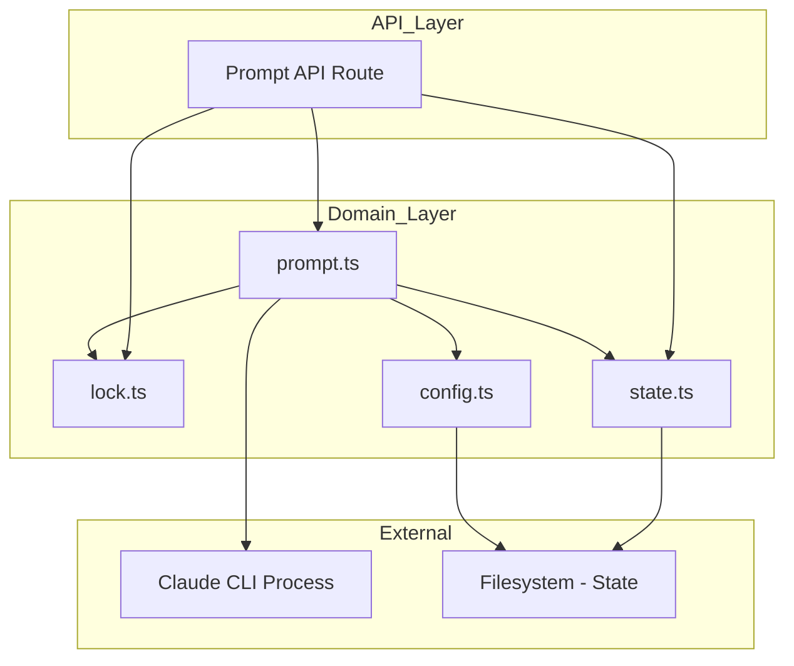
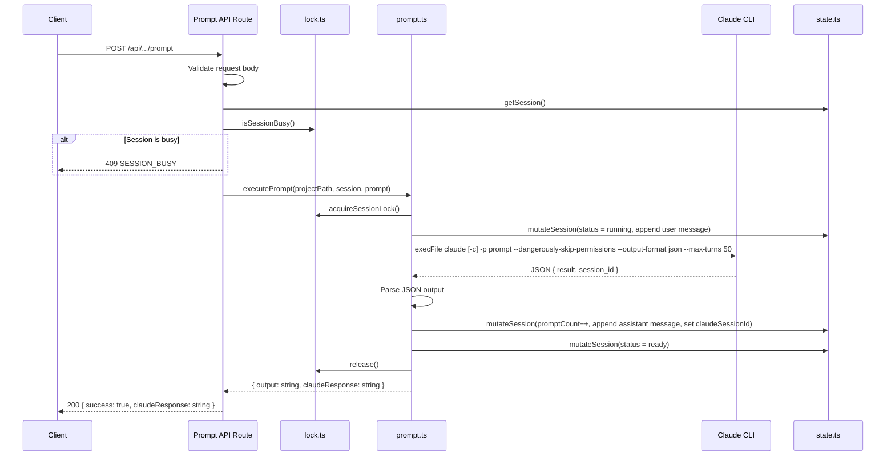
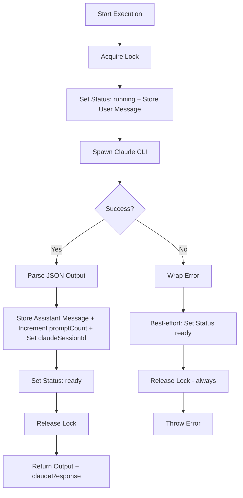

# Technical Design: Prompt Execution

## Overview

**Purpose**: The Prompt Execution feature delivers the core interaction mechanism between CSM and Claude Code. It enables developers to send prompts to Claude Code CLI processes running within session worktrees, with concurrency control and lifecycle management.

**Users**: Developers managing Claude Code sessions will use this to submit prompts via the API (triggered by the dashboard UI or external tools).

**Impact**: This is the primary execution engine of CSM. It depends on the session lifecycle feature for worktree context and is consumed by the dashboard UI for prompt submission.

### Goals

- Execute Claude CLI prompts within the correct session worktree context
- Maintain conversation continuity across sequential prompts via the `-c` flag
- Prevent concurrent prompt execution per session via single-flight locking
- Track session status (running/ready) and prompt counts in real time
- Handle errors and timeouts gracefully with guaranteed resource cleanup

### Non-Goals

- Streaming/real-time output from Claude CLI (output captured after completion)
- Prompt queuing (rejected immediately if busy)
- Claude CLI installation management

## Architecture

### Existing Architecture Analysis

The prompt execution is fully implemented across three modules:

- **`src/lib/prompt.ts`** — Contains `executePrompt()` orchestrating the full lifecycle and `mutateSession()` helper for state mutations
- **`src/lib/lock.ts`** — Provides `acquireSessionLock()` and `isSessionBusy()` for single-flight concurrency control
- **`src/app/api/projects/[name]/sessions/[session]/prompt/route.ts`** — REST API layer exposing the POST endpoint with request validation and error mapping

Key patterns preserved:

- Flat `src/lib/` module structure
- `execFile` for subprocess spawning (no shell injection risk)
- Atomic state mutations via read→mutate→persist pattern
- In-memory lock map for concurrency control

### Architecture Pattern & Boundary Map



**Architecture Integration**:

- Selected pattern: Layered architecture with flat domain modules
- Domain boundaries: API route handles HTTP; `prompt.ts` owns execution orchestration; `lock.ts` owns concurrency; `state.ts` owns persistence
- Existing patterns preserved: Schema-first validation, atomic state writes, `execFile` for subprocesses
- Steering compliance: Flat lib, Zod v4, TypeScript strict mode

### Technology Stack

| Layer       | Choice / Version        | Role in Feature                                    | Notes                              |
| ----------- | ----------------------- | -------------------------------------------------- | ---------------------------------- |
| Backend     | Next.js 15 App Router   | POST endpoint for prompt execution                 | `force-dynamic`                    |
| Language    | TypeScript 5.7 (strict) | All prompt and lock logic                          | `noUncheckedIndexedAccess`         |
| Validation  | Zod v4                  | Request body validation (`runPromptRequestSchema`) | `z.string().trim().min(1)`         |
| Process     | Node.js `child_process` | Claude CLI spawning via `execFile`                 | Promisified, with timeout          |
| Concurrency | In-memory `Map`         | Single-flight lock per session                     | Promise-based with release closure |
| Storage     | JSON filesystem         | Session state persistence                          | Atomic writes via `state.ts`       |

## System Flows

### Prompt Execution Flow



### Error Recovery Flow



## Requirements Traceability

| Requirement | Summary                       | Components                   | Interfaces | Flows          |
| ----------- | ----------------------------- | ---------------------------- | ---------- | -------------- |
| 1.1         | Spawn claude with -p flag     | executePrompt                | execFile   | Execution      |
| 1.2         | Set CWD to worktree path      | executePrompt                | execFile   | Execution      |
| 1.3         | Headless CLI flags            | executePrompt                | execFile   | Execution      |
| 1.4         | Filter CLAUDE-prefixed env    | executePrompt                | execFile   | Execution      |
| 1.5         | Capture and parse JSON output | executePrompt                | execFile   | Execution      |
| 2.1         | No -c flag on first prompt    | executePrompt                | —          | Execution      |
| 2.2         | Add -c flag on subsequent     | executePrompt                | —          | Execution      |
| 2.3         | Increment prompt count        | executePrompt, mutateSession | State      | Execution      |
| 3.1         | Acquire in-memory lock        | acquireSessionLock           | Lock Map   | Execution      |
| 3.2         | Reject if busy                | acquireSessionLock           | —          | Execution      |
| 3.3         | Release lock on completion    | executePrompt finally        | Lock Map   | Error Recovery |
| 3.4         | Query lock status             | isSessionBusy                | Lock Map   | Execution      |
| 4.1         | Status → running on start     | executePrompt, mutateSession | State      | Execution      |
| 4.2         | Status → ready on success     | executePrompt finally        | State      | Execution      |
| 4.3         | Status → ready on failure     | executePrompt finally        | State      | Error Recovery |
| 4.4         | Update lastActivityAt         | mutateSession                | State      | Execution      |
| 5.1         | Configurable timeout          | executePrompt                | Config     | Execution      |
| 5.2         | Terminate on timeout          | executePrompt                | execFile   | Execution      |
| 5.3         | 10 MB max buffer              | executePrompt                | execFile   | Execution      |
| 6.1         | Wrap error with prefix        | executePrompt catch          | —          | Error Recovery |
| 6.2         | Best-effort status reset      | executePrompt finally        | State      | Error Recovery |
| 6.3         | Guaranteed lock release       | executePrompt finally        | Lock       | Error Recovery |
| 6.4         | No count increment on failure | executePrompt                | —          | Error Recovery |
| 7.1         | POST endpoint                 | Prompt API Route             | HTTP       | Execution      |
| 7.2         | 400 for missing prompt        | Prompt API Route             | HTTP       | Execution      |
| 7.3         | 404 for missing project       | Prompt API Route             | HTTP       | Execution      |
| 7.4         | 404 for missing session       | Prompt API Route             | HTTP       | Execution      |
| 7.5         | 409 for busy session          | Prompt API Route             | HTTP       | Execution      |
| 7.6         | 200 with output length header | Prompt API Route             | HTTP       | Execution      |
| 7.7         | 500 for execution errors      | Prompt API Route             | HTTP       | Error Recovery |
| 8.1         | Store user message before CLI | executePrompt, mutateSession | State      | Execution      |
| 8.2         | Store assistant response      | executePrompt, mutateSession | State      | Execution      |
| 8.3         | Parse JSON result or fallback | executePrompt                | —          | Execution      |
| 8.4         | Set claudeSessionId from JSON | executePrompt, mutateSession | State      | Execution      |
| 8.5         | No assistant msg on failure   | executePrompt                | —          | Error Recovery |

## Components and Interfaces

| Component          | Domain/Layer       | Intent                                 | Req Coverage   | Key Dependencies                                    | Contracts |
| ------------------ | ------------------ | -------------------------------------- | -------------- | --------------------------------------------------- | --------- |
| executePrompt      | Domain / prompt.ts | Orchestrate prompt execution lifecycle | 1.1–6.4, 8.1–8.5 | Lock (P0), State (P0), Config (P0), Claude CLI (P0) | Service   |
| mutateSession      | Domain / prompt.ts | Atomic session state mutation helper   | 4.1–4.4, 2.3, 8.1, 8.2, 8.4 | State (P0)                                          | Service   |
| acquireSessionLock | Domain / lock.ts   | Acquire single-flight lock for session | 3.1, 3.2, 3.3 | None                                                | Service   |
| isSessionBusy      | Domain / lock.ts   | Check if session has active lock       | 3.4           | None                                                | Service   |
| Prompt API Route   | API / route.ts     | HTTP endpoint for prompt submission    | 7.1–7.7       | prompt.ts (P0), lock.ts (P0), state.ts (P0)         | API       |

### Domain Layer

#### executePrompt

| Field        | Detail                                                                                        |
| ------------ | --------------------------------------------------------------------------------------------- |
| Intent       | Orchestrate full prompt execution: lock → status → CLI → count → recovery                     |
| Requirements | 1.1, 1.2, 1.3, 1.4, 1.5, 2.1, 2.2, 2.3, 4.1, 4.2, 4.3, 4.4, 5.1, 5.2, 5.3, 6.1, 6.2, 6.3, 6.4, 8.1, 8.2, 8.3, 8.4, 8.5 |

**Responsibilities & Constraints**

- Acquires session lock, transitions status, stores user message, spawns CLI, parses JSON response, stores assistant message, increments count, releases lock
- Uses `finally` block for guaranteed cleanup (status reset + lock release)
- CLI args built dynamically based on `promptCount`; always includes `--dangerously-skip-permissions`, `--output-format json`, `--max-turns 50`
- Parses JSON output to extract `result` and `session_id`; falls back to raw stdout if parsing fails

**Dependencies**

- Outbound: `lock.ts` — `acquireSessionLock()` (P0)
- Outbound: `state.ts` — `getSession()`, `updateSession()` (P0)
- Outbound: `config.ts` — `readConfig()` for timeout (P0)
- External: Claude CLI — subprocess via `execFile` (P0)

##### Service Interface

```typescript
function executePrompt(
  projectPath: string,
  session: SessionState,
  promptText: string,
): Promise<{ output: string; claudeResponse: string }>;
```

- Preconditions: Session exists and is in "ready" state
- Postconditions: `promptCount` incremented, user and assistant messages stored in `session.messages`, status back to "ready", lock released, `claudeSessionId` set from JSON output if available
- Error envelope: Throws `Error` with "Prompt execution failed: ..." prefix

#### mutateSession

| Field        | Detail                                                           |
| ------------ | ---------------------------------------------------------------- |
| Intent       | Read session, apply mutation callback, update timestamp, persist |
| Requirements | 4.1, 4.2, 4.3, 4.4, 2.3, 8.1, 8.2, 8.4                          |

##### Service Interface

```typescript
function mutateSession(
  projectPath: string,
  sessionName: string,
  mutate: (session: SessionState) => void,
): Promise<void>;
```

- Preconditions: Session must exist in state
- Postconditions: Session mutated, `lastActivityAt` updated, state persisted
- Invariants: No-op if session not found

#### acquireSessionLock

| Field        | Detail                                              |
| ------------ | --------------------------------------------------- |
| Intent       | Acquire single-flight lock, return release function |
| Requirements | 3.1, 3.2, 3.3                                       |

##### Service Interface

```typescript
function acquireSessionLock(
  projectPath: string,
  sessionName: string,
): () => void;
```

- Preconditions: None
- Postconditions: Lock held; returned function releases it
- Error: Throws if lock already held ("Session is busy")

#### isSessionBusy

| Field        | Detail                                        |
| ------------ | --------------------------------------------- |
| Intent       | Non-blocking check if session has active lock |
| Requirements | 3.4                                           |

##### Service Interface

```typescript
function isSessionBusy(projectPath: string, sessionName: string): boolean;
```

- Preconditions: None
- Postconditions: Returns true if lock is held, false otherwise
- Invariants: Pure read, no side effects

### API Layer

#### Prompt API Route

| Field        | Detail                               |
| ------------ | ------------------------------------ |
| Intent       | HTTP interface for prompt submission |
| Requirements | 7.1, 7.2, 7.3, 7.4, 7.5, 7.6, 7.7    |

##### API Contract

| Method | Endpoint                                       | Request              | Response                                                    | Errors             |
| ------ | ---------------------------------------------- | -------------------- | ----------------------------------------------------------- | ------------------ |
| POST   | /api/projects/[name]/sessions/[session]/prompt | `{ prompt: string }` | `{ success: true, claudeResponse: string }` (200) + `X-Claude-Output-Length` header | 400, 404, 409, 500 |

## Data Models

### Domain Model

The prompt execution feature operates on existing data models from the session lifecycle feature and introduces a new `ConversationMessage` entity for message storage.

**New entity**:

- `ConversationMessage` — `{ role: "user" | "assistant", content: string, timestamp: string }` stored in `SessionState.messages[]`

**Key entities used**:

- `SessionState` — status, promptCount, lastActivityAt, messages, claudeSessionId fields mutated during execution
- `GlobalConfig` — `claudeTimeoutMs` for CLI timeout configuration

**Lock state** (in-memory only):

- `Map<string, Promise<void>>` keyed by `${projectPath}::${sessionName}`
- Not persisted — appropriate for a local tool where locks are transient

### Data Contracts

**API Request Schema** (Zod v4):

```typescript
const runPromptRequestSchema = z.object({
  prompt: z.string().trim().min(1),
});
```

**API Response**:

```typescript
interface RunPromptResponse {
  success: boolean;
  error?: string;
  claudeResponse?: string;
}
```

## Error Handling

### Error Categories and Responses

**User Errors (400)**:

- Missing/empty prompt → `"prompt is required and must be a non-empty string"`

**Not Found (404)**:

- Project not found → `"Project not found"`
- Session not found → `"Session not found"`

**Conflict (409)**:

- Session busy (pre-check) → `{ error: "Session is busy — a prompt is already running", code: "SESSION_BUSY" }`
- Session busy (lock-level) → same message, caught and mapped to 409

**Server Errors (500)**:

- CLI failure → `"Prompt execution failed: <original error>"`
- Timeout → process killed, timeout error propagated

### Recovery Guarantees

The `finally` block in `executePrompt()` ensures:

1. Session status is reset to "ready" (best-effort, errors suppressed)
2. Session lock is always released (guaranteed)

This ordering prevents deadlocks: even if status reset fails, the lock is released.

## Testing Strategy

### Unit Tests

- `acquireSessionLock`: Acquire, check busy, release, re-acquire
- `acquireSessionLock`: Reject when already held
- `isSessionBusy`: True when locked, false when not
- Lock key uniqueness: Different sessions have independent locks

### Integration Tests

- `executePrompt`: Full flow with mocked CLI — verify status transitions, prompt count, lock lifecycle
- `executePrompt`: First prompt vs continuation (no `-c` vs `-c` flag)
- `executePrompt`: Headless flags (`--dangerously-skip-permissions`, `--output-format json`, `--max-turns 50`)
- `executePrompt`: User message stored in session state before CLI execution
- `executePrompt`: Assistant message stored in session state after successful execution
- `executePrompt`: `claudeSessionId` set from JSON output
- `executePrompt`: Fallback to raw stdout when JSON parsing fails
- `executePrompt`: Error recovery — CLI failure triggers status reset and lock release
- `executePrompt`: Timeout handling
- `mutateSession`: Read → mutate → persist with timestamp update

### API Tests

- POST valid prompt: 200 with success response, claudeResponse, and output length header
- POST missing prompt: 400
- POST to missing project: 404
- POST to missing session: 404
- POST to busy session: 409 with SESSION_BUSY code
- POST with CLI failure: 500

## Security Considerations

- **No shell injection**: Uses `execFile` (not `exec`) — prompt text is passed as an argument, not interpolated into a shell command
- **Permission bypass**: `--dangerously-skip-permissions` is required for headless execution but means Claude Code operates without interactive safety checks. This is acceptable because CSM runs in a controlled, local environment where the developer has already authorized the session's work
- **Environment isolation**: `CLAUDE`-prefixed environment variables are filtered to prevent the child process from inheriting the parent Claude Code session context; parent env otherwise inherited for PATH access
- **Resource limits**: Configurable timeout, 10 MB output buffer cap, and `--max-turns 50` prevent resource exhaustion and runaway execution
