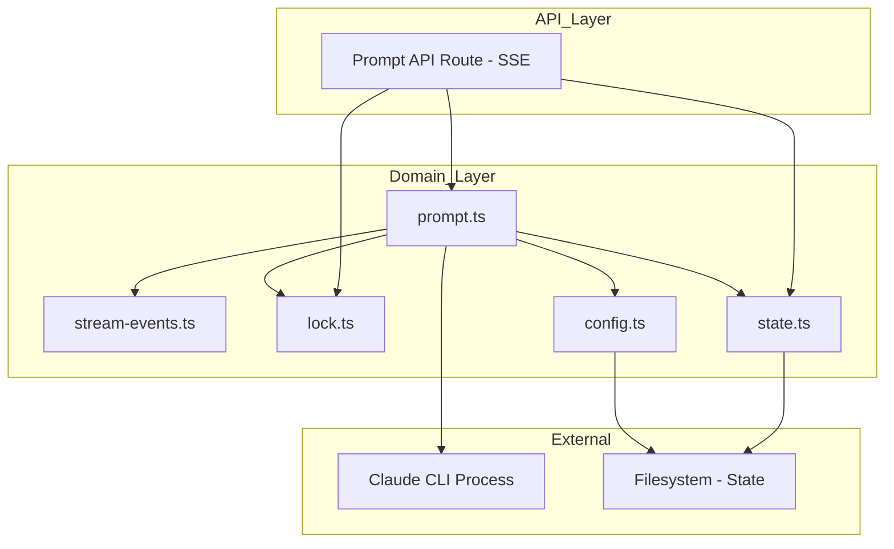
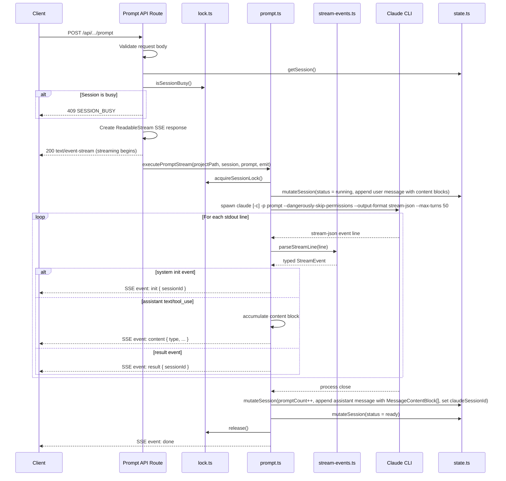

# Technical Design: Prompt Execution

## Overview

**Purpose**: The Prompt Execution feature delivers the core interaction mechanism between CSM and Claude Code. It enables developers to send prompts to Claude Code CLI processes running within session worktrees, with concurrency control and lifecycle management.

**Users**: Developers managing Claude Code sessions will use this to submit prompts via the API (triggered by the dashboard UI or external tools).

**Impact**: This is the primary execution engine of CSM. It depends on the session lifecycle feature for worktree context and is consumed by the dashboard UI for prompt submission.

### Goals

- Execute Claude CLI prompts within the correct session worktree context
- Stream real-time output from Claude CLI via `--output-format stream-json` and SSE
- Maintain conversation continuity across sequential prompts via the `-c` flag
- Prevent concurrent prompt execution per session via single-flight locking
- Track session status (running/ready) and prompt counts in real time
- Handle errors and timeouts gracefully with guaranteed resource cleanup

### Non-Goals

- Prompt queuing (rejected immediately if busy)
- Claude CLI installation management

## Architecture

### Existing Architecture Analysis

The prompt execution is fully implemented across four modules:

- **`src/lib/prompt.ts`** — Contains `executePromptStream()` orchestrating the full lifecycle with streaming output, and `mutateSession()` helper for state mutations
- **`src/lib/stream-events.ts`** — Types for stream-json events, `parseStreamLine()` parser, and `formatToolUse()` utility
- **`src/lib/lock.ts`** — Provides `acquireSessionLock()` and `isSessionBusy()` for single-flight concurrency control
- **`src/app/api/projects/[name]/sessions/[session]/prompt/route.ts`** — REST API layer exposing the POST endpoint with SSE streaming response and request validation

Key patterns preserved:

- Flat `src/lib/` module structure
- `spawn` for subprocess spawning with line-by-line stdout streaming (no shell injection risk)
- Atomic state mutations via read→mutate→persist pattern
- In-memory lock map for concurrency control

### Architecture Pattern & Boundary Map



**Architecture Integration**:

- Selected pattern: Layered architecture with flat domain modules
- Domain boundaries: API route handles HTTP/SSE; `prompt.ts` owns execution orchestration; `stream-events.ts` owns stream parsing and formatting; `lock.ts` owns concurrency; `state.ts` owns persistence
- Existing patterns preserved: Schema-first validation, atomic state writes, `spawn` for subprocesses
- Steering compliance: Flat lib, Zod v4, TypeScript strict mode

### Technology Stack

| Layer       | Choice / Version        | Role in Feature                                    | Notes                               |
| ----------- | ----------------------- | -------------------------------------------------- | ------------------------------------|
| Backend     | Next.js 15 App Router   | SSE streaming endpoint for prompt execution        | `force-dynamic`, `text/event-stream`|
| Language    | TypeScript 5.7 (strict) | All prompt, stream-events, and lock logic          | `noUncheckedIndexedAccess`          |
| Validation  | Zod v4                  | Request body validation (`runPromptRequestSchema`) | `z.string().trim().min(1)`          |
| Process     | Node.js `child_process` | Claude CLI spawning via `spawn`                    | readline for line-by-line streaming |
| Concurrency | In-memory `Map`         | Single-flight lock per session                     | Promise-based with release closure  |
| Storage     | JSON filesystem         | Session state persistence                          | Atomic writes via `state.ts`        |

## System Flows

### Prompt Execution Flow



### Error Recovery Flow

```mermaid
flowchart TD
    A[Start Execution] --> B[Acquire Lock]
    B --> C[Set Status: running + Store User Message]
    C --> D[Spawn Claude CLI with stream-json]
    D --> E[Stream stdout lines, accumulate content blocks]
    E --> F{Process exited OK?}
    F -->|Yes, with blocks| G[Store Assistant Message as MessageContentBlock[] + Increment promptCount + Set claudeSessionId]
    G --> H[Set Status: ready]
    H --> I[Release Lock]
    I --> J[Emit done event]
    F -->|No, with blocks| G
    F -->|No, no blocks| K[Emit error event]
    K --> L[Best-effort: Set Status ready]
    L --> M[Release Lock - always]
    M --> N[Emit done event]
```

## Requirements Traceability

| Requirement | Summary                            | Components                              | Interfaces   | Flows          |
| ----------- | ---------------------------------- | --------------------------------------- | ------------ | -------------- |
| 1.1         | Spawn claude with -p flag          | executePromptStream                     | spawn        | Execution      |
| 1.2         | Set CWD to worktree path           | executePromptStream                     | spawn        | Execution      |
| 1.3         | Headless CLI flags + stream-json   | executePromptStream                     | spawn        | Execution      |
| 1.4         | Filter CLAUDE-prefixed env         | executePromptStream                     | spawn        | Execution      |
| 1.5         | Stream stdout, accumulate blocks   | executePromptStream, parseStreamLine    | readline     | Execution      |
| 2.1         | No -c flag on first prompt         | executePromptStream                     | —            | Execution      |
| 2.2         | Add -c flag on subsequent          | executePromptStream                     | —            | Execution      |
| 2.3         | Increment prompt count             | executePromptStream, mutateSession      | State        | Execution      |
| 3.1         | Acquire in-memory lock             | acquireSessionLock                      | Lock Map     | Execution      |
| 3.2         | Reject if busy                     | acquireSessionLock                      | —            | Execution      |
| 3.3         | Release lock on completion         | executePromptStream finally             | Lock Map     | Error Recovery |
| 3.4         | Query lock status                  | isSessionBusy                           | Lock Map     | Execution      |
| 4.1         | Status → running on start          | executePromptStream, mutateSession      | State        | Execution      |
| 4.2         | Status → ready on success          | executePromptStream finally             | State        | Execution      |
| 4.3         | Status → ready on failure          | executePromptStream finally             | State        | Error Recovery |
| 4.4         | Update lastActivityAt              | mutateSession                           | State        | Execution      |
| 5.1         | Configurable timeout               | executePromptStream                     | Config       | Execution      |
| 5.2         | Terminate on timeout with SIGTERM  | executePromptStream                     | spawn        | Execution      |
| 6.1         | Wrap error with prefix             | executePromptStream catch               | —            | Error Recovery |
| 6.2         | Best-effort status reset           | executePromptStream finally             | State        | Error Recovery |
| 6.3         | Guaranteed lock release            | executePromptStream finally             | Lock         | Error Recovery |
| 6.4         | No count increment on failure      | executePromptStream                     | —            | Error Recovery |
| 7.1         | POST endpoint                      | Prompt API Route                        | HTTP         | Execution      |
| 7.2         | 400 for missing prompt             | Prompt API Route                        | HTTP         | Execution      |
| 7.3         | 404 for missing project            | Prompt API Route                        | HTTP         | Execution      |
| 7.4         | 404 for missing session            | Prompt API Route                        | HTTP         | Execution      |
| 7.5         | 409 for busy session               | Prompt API Route                        | HTTP         | Execution      |
| 7.6         | SSE streaming response             | Prompt API Route                        | SSE          | Execution      |
| 7.7         | Error event on execution failure   | Prompt API Route                        | SSE          | Error Recovery |
| 8.1         | Store user message as blocks       | executePromptStream, mutateSession      | State        | Execution      |
| 8.2         | Store assistant as content blocks  | executePromptStream, mutateSession      | State        | Execution      |
| 8.3         | Accumulate blocks from stream      | executePromptStream, parseStreamLine    | —            | Execution      |
| 8.4         | Set claudeSessionId from init      | executePromptStream, mutateSession      | State        | Execution      |
| 8.5         | No assistant msg if no blocks      | executePromptStream                     | —            | Error Recovery |

## Components and Interfaces

| Component            | Domain/Layer              | Intent                                    | Req Coverage            | Key Dependencies                                            | Contracts |
| -------------------- | ------------------------- | ----------------------------------------- | ----------------------- | ----------------------------------------------------------- | --------- |
| executePromptStream  | Domain / prompt.ts        | Orchestrate streaming prompt execution    | 1.1–6.4, 8.1–8.5       | Lock (P0), State (P0), Config (P0), stream-events (P0), Claude CLI (P0) | Service   |
| mutateSession        | Domain / prompt.ts        | Atomic session state mutation helper      | 4.1–4.4, 2.3, 8.1, 8.2, 8.4 | State (P0)                                            | Service   |
| parseStreamLine      | Domain / stream-events.ts | Parse stream-json stdout line into event  | 1.5, 8.3               | None                                                        | Service   |
| formatToolUse        | Domain / stream-events.ts | Format tool_use block for display         | —                       | None                                                        | Service   |
| acquireSessionLock   | Domain / lock.ts          | Acquire single-flight lock for session    | 3.1, 3.2, 3.3          | None                                                        | Service   |
| isSessionBusy        | Domain / lock.ts          | Check if session has active lock          | 3.4                     | None                                                        | Service   |
| Prompt API Route     | API / route.ts            | SSE streaming endpoint for prompts        | 7.1–7.7                 | prompt.ts (P0), lock.ts (P0), state.ts (P0)                 | API       |

### Domain Layer

#### executePromptStream

| Field        | Detail                                                                                        |
| ------------ | --------------------------------------------------------------------------------------------- |
| Intent       | Orchestrate streaming prompt execution: lock → status → CLI spawn → stream → accumulate → persist → cleanup |
| Requirements | 1.1, 1.2, 1.3, 1.4, 1.5, 2.1, 2.2, 2.3, 4.1, 4.2, 4.3, 4.4, 5.1, 5.2, 6.1, 6.2, 6.3, 6.4, 8.1, 8.2, 8.3, 8.4, 8.5 |

**Responsibilities & Constraints**

- Acquires session lock, transitions status, stores user message (as content blocks), spawns CLI with `stream-json`, reads stdout line-by-line via `readline`, accumulates `MessageContentBlock[]`, emits SSE events via callback, stores assistant message on close, increments count, releases lock
- Uses `finally` block for guaranteed cleanup (status reset + lock release)
- CLI args built dynamically based on `promptCount`; always includes `--dangerously-skip-permissions`, `--output-format stream-json`, `--max-turns 50`
- Manual timeout implementation via `setTimeout` + `child.kill("SIGTERM")` (spawn does not support `timeout` option)
- Parses each stdout line via `parseStreamLine()` from `stream-events.ts`

**Dependencies**

- Outbound: `lock.ts` — `acquireSessionLock()` (P0)
- Outbound: `state.ts` — `getSession()`, `updateSession()` (P0)
- Outbound: `config.ts` — `readConfig()` for timeout (P0)
- Outbound: `stream-events.ts` — `parseStreamLine()` (P0)
- External: Claude CLI — subprocess via `spawn` (P0)

##### Service Interface

```typescript
function executePromptStream(
  projectPath: string,
  session: SessionState,
  promptText: string,
  emit: (event: string, data: unknown) => void,
): Promise<void>;
```

- Preconditions: Session exists and is in "ready" state
- Postconditions: `promptCount` incremented, user message stored as `[{ type: "text", text }]`, assistant message stored as `MessageContentBlock[]` in `session.messages`, status back to "ready", lock released, `claudeSessionId` set from stream init event if available
- Error envelope: Emits `error` SSE event; throws `Error` with "Prompt execution failed: ..." prefix

#### mutateSession

| Field        | Detail                                                           |
| ------------ | ---------------------------------------------------------------- |
| Intent       | Read session, apply mutation callback, update timestamp, persist |
| Requirements | 4.1, 4.2, 4.3, 4.4, 2.3, 8.1, 8.2, 8.4                          |

##### Service Interface

```typescript
function mutateSession(
  projectPath: string,
  sessionName: string,
  mutate: (session: SessionState) => void,
): Promise<void>;
```

- Preconditions: Session must exist in state
- Postconditions: Session mutated, `lastActivityAt` updated, state persisted
- Invariants: No-op if session not found

#### acquireSessionLock

| Field        | Detail                                              |
| ------------ | --------------------------------------------------- |
| Intent       | Acquire single-flight lock, return release function |
| Requirements | 3.1, 3.2, 3.3                                       |

##### Service Interface

```typescript
function acquireSessionLock(
  projectPath: string,
  sessionName: string,
): () => void;
```

- Preconditions: None
- Postconditions: Lock held; returned function releases it
- Error: Throws if lock already held ("Session is busy")

#### isSessionBusy

| Field        | Detail                                        |
| ------------ | --------------------------------------------- |
| Intent       | Non-blocking check if session has active lock |
| Requirements | 3.4                                           |

##### Service Interface

```typescript
function isSessionBusy(projectPath: string, sessionName: string): boolean;
```

- Preconditions: None
- Postconditions: Returns true if lock is held, false otherwise
- Invariants: Pure read, no side effects

### API Layer

#### Prompt API Route

| Field        | Detail                               |
| ------------ | ------------------------------------ |
| Intent       | HTTP interface for prompt submission |
| Requirements | 7.1, 7.2, 7.3, 7.4, 7.5, 7.6, 7.7    |

##### API Contract

| Method | Endpoint                                       | Request              | Response                                                    | Errors         |
| ------ | ---------------------------------------------- | -------------------- | ----------------------------------------------------------- | -------------- |
| POST   | /api/projects/[name]/sessions/[session]/prompt | `{ prompt: string }` | `text/event-stream` SSE with events: init, content, result, error, done | 400, 404, 409  |

SSE event format:
- `event: init` / `data: { sessionId }` — CLI session initialized
- `event: content` / `data: { type: "text", text }` or `{ type: "tool_use", name, input }` — real-time content blocks
- `event: result` / `data: { sessionId }` — CLI execution complete
- `event: error` / `data: { message }` — execution error
- `event: done` / `data: {}` — stream terminated, client should stop reading

## Data Models

### Domain Model

The prompt execution feature operates on existing data models from the session lifecycle feature and introduces new entities for message storage and streaming.

**New entities**:

- `ConversationMessage` — `{ role: "user" | "assistant", content: MessageContentBlock[], timestamp: string }` stored in `SessionState.messages[]`
- `MessageContentBlock` — Discriminated union: `{ type: "text", text: string }` | `{ type: "tool_use", name: string, input?: any }` | `{ type: "tool_result", tool_use_id: string, content?: string }`
- `StreamEvent` — Union of `StreamInitEvent`, `StreamAssistantEvent`, `StreamUserEvent`, `StreamResultEvent` parsed from stream-json stdout lines

**Key entities used**:

- `SessionState` — status, promptCount, lastActivityAt, messages, claudeSessionId fields mutated during execution
- `GlobalConfig` — `claudeTimeoutMs` for CLI timeout configuration

**Lock state** (in-memory only):

- `Map<string, Promise<void>>` keyed by `${projectPath}::${sessionName}`
- Not persisted — appropriate for a local tool where locks are transient

### Data Contracts

**API Request Schema** (Zod v4):

```typescript
const runPromptRequestSchema = z.object({
  prompt: z.string().trim().min(1),
});
```

**API Response**: SSE `text/event-stream` — no JSON response body. Events are emitted as the CLI streams output. Error responses (400, 404, 409) are still returned as JSON before the stream starts.

**Message Content Schema** (Zod v4):

```typescript
const messageContentBlockSchema = z.discriminatedUnion("type", [
  z.object({ type: z.literal("text"), text: z.string() }),
  z.object({ type: z.literal("tool_use"), name: z.string(), input: z.any().optional() }),
  z.object({ type: z.literal("tool_result"), tool_use_id: z.string(), content: z.string().optional() }),
]);

// conversationMessageSchema.content uses z.preprocess for backward compatibility:
// string content is auto-migrated to [{ type: "text", text: content }]
```

## Error Handling

### Error Categories and Responses

**User Errors (400)**:

- Missing/empty prompt → `"prompt is required and must be a non-empty string"`

**Not Found (404)**:

- Project not found → `"Project not found"`
- Session not found → `"Session not found"`

**Conflict (409)**:

- Session busy (pre-check) → `{ error: "Session is busy — a prompt is already running", code: "SESSION_BUSY" }`
- Session busy (lock-level) → same message, caught and mapped to 409

**Stream Errors** (emitted as SSE events):

- CLI failure with no content → `error` event: `"Claude exited with code ${code}"`
- CLI failure with accumulated content → content stored, `done` event emitted (not error)
- Timeout → process killed with SIGTERM, `error` event emitted, partial content stored if any
- JSON parse failure on stdout line → line skipped, logged as warning, stream continues
- Client disconnect mid-stream → `controller.enqueue` wrapped in try/catch, process continues to completion, state still persisted

### Recovery Guarantees

The `finally` block in `executePromptStream()` ensures:

1. Session status is reset to "ready" (best-effort, errors suppressed)
2. Session lock is always released (guaranteed)

This ordering prevents deadlocks: even if status reset fails, the lock is released.

## Testing Strategy

### Unit Tests

- `acquireSessionLock`: Acquire, check busy, release, re-acquire
- `acquireSessionLock`: Reject when already held
- `isSessionBusy`: True when locked, false when not
- Lock key uniqueness: Different sessions have independent locks

### Stream Events Tests

- `parseStreamLine`: Returns correct typed events for init, assistant, user, result
- `parseStreamLine`: Returns null for malformed JSON
- `parseStreamLine`: Returns null for unrecognized event types (progress, file-history-snapshot)
- `formatToolUse`: Formats each tool type correctly (Read, Write, Edit, Bash, Grep, Glob, Task, default)

### Integration Tests

- `executePromptStream`: Full flow with mocked `spawn` — verify status transitions, prompt count, lock lifecycle
- `executePromptStream`: First prompt vs continuation (no `-c` vs `-c` flag)
- `executePromptStream`: Headless flags (`--dangerously-skip-permissions`, `--output-format stream-json`, `--max-turns 50`)
- `executePromptStream`: User message stored as `[{ type: "text", text }]` before CLI execution
- `executePromptStream`: Emits init, content, result events from stream
- `executePromptStream`: Accumulates and stores assistant message as `MessageContentBlock[]`
- `executePromptStream`: `claudeSessionId` set from stream init event
- `executePromptStream`: Error recovery — CLI failure triggers status reset and lock release
- `executePromptStream`: Non-zero exit with accumulated content still stores blocks
- `executePromptStream`: Timeout handling (SIGTERM)
- `mutateSession`: Read → mutate → persist with timestamp update

### API Tests

- POST valid prompt: 200 with `text/event-stream` response
- POST missing prompt: 400
- POST to missing project: 404
- POST to missing session: 404
- POST to busy session: 409 with SESSION_BUSY code

## Security Considerations

- **No shell injection**: Uses `spawn` (not `exec`) — prompt text is passed as an argument, not interpolated into a shell command
- **Permission bypass**: `--dangerously-skip-permissions` is required for headless execution but means Claude Code operates without interactive safety checks. This is acceptable because CSM runs in a controlled, local environment where the developer has already authorized the session's work
- **Environment isolation**: `CLAUDE`-prefixed environment variables are filtered to prevent the child process from inheriting the parent Claude Code session context; parent env otherwise inherited for PATH access
- **Resource limits**: Configurable timeout (manual `setTimeout` + `SIGTERM`) and `--max-turns 50` prevent resource exhaustion and runaway execution
