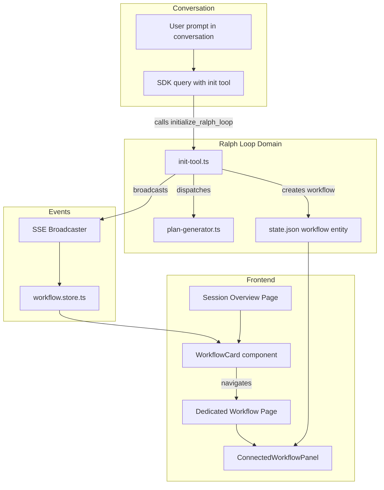
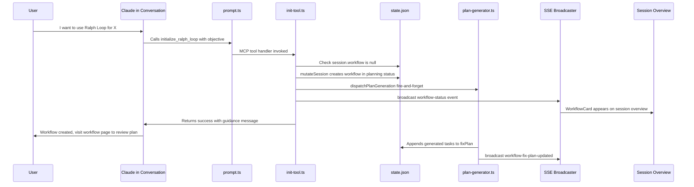

# Design Document — Ralph Loop Initialization Redesign

## Overview

**Purpose**: This feature redesigns how Ralph Loop workflows are initialized and where they are displayed. Initialization moves from a session-level button to a conversation-driven custom tool, and the workflow UI moves from a conversation right-panel tab to a dedicated page.

**Users**: Developers using CSM who want to seamlessly transition from exploratory conversations into autonomous Ralph Loop workflows without context-switching.

**Impact**: Modifies the prompt execution pipeline to register a conditional MCP tool, introduces a dedicated workflow page route, redesigns the session overview layout, and removes the workflow tab from the conversation right panel. Does not modify the core Ralph Loop execution engine.

### Goals
- Enable conversation-driven workflow initialization via a custom MCP tool (`initialize_ralph_loop`)
- Provide a dedicated full-page workflow UI at the session level
- Present workflows with equal visual prominence to conversations on the session overview
- Remove workflow UI from conversation-level right panel

### Non-Goals
- Modifying the core Ralph Loop execution engine (orchestrator, circuit breaker, exit detection, iteration tools)
- Adding new workflow REST API endpoints (the dedicated page reuses existing endpoints)
- Auto-starting workflows after plan generation (manual confirmation preserved)
- Supporting multiple workflows per session

## Architecture

### Existing Architecture Analysis

The redesign touches these existing CSM systems:

- **Prompt execution** (`src/lib/prompt.ts`): Builds SDK `query()` options for every conversation prompt. Currently has no `mcpServers` registration — extended to conditionally include the init tool.
- **Ralph Loop modules** (`src/lib/ralph-loop/`): `plan-generator.ts` provides `dispatchPlanGeneration()` for fire-and-forget plan generation. `mcp-tools.ts` provides the `createSdkMcpServer` + `tool()` pattern for in-process MCP tools.
- **Workflow API routes** (`src/app/api/.../workflow/`): Full REST API for workflow CRUD, confirm, pause, resume, abort, plan generation. Reused unchanged by the dedicated page.
- **Session overview** (`ConversationList.tsx`): Currently renders a "Ralph Loop" button to create workflows. Redesigned to show a workflow status card instead.
- **Conversation right panel** (`RightPane.tsx`): Currently includes a "Workflow" tab. Removed entirely.
- **State management**: `workflow.store.ts` (Zustand, SSE-driven) and `useWorkflowQuery` (React Query) provide workflow data. Both reused by the new components.

### Architecture Pattern & Boundary Map



**Architecture Integration**:
- Selected pattern: Hybrid extension — new `init-tool.ts` module in `ralph-loop/` domain, new page route, new UI component, minimal extension of `prompt.ts`
- Domain boundaries: MCP tool logic stays in `ralph-loop/`; UI components colocated with session pages; prompt pipeline touched minimally
- Existing patterns preserved: fire-and-forget dispatch, `mutateSession()` for state changes, SSE broadcast for real-time updates, in-process MCP tools via `createSdkMcpServer`
- New components rationale: `init-tool.ts` (distinct tool responsibility), `workflow/page.tsx` (new route), `WorkflowCard.tsx` (new UI element)

### Technology Stack

| Layer | Choice / Version | Role in Feature | Notes |
|-------|------------------|-----------------|-------|
| Backend | `@anthropic-ai/claude-agent-sdk` `createSdkMcpServer` + `tool()` | Custom MCP tool for `initialize_ralph_loop` | Same pattern as existing `mcp-tools.ts` |
| Backend | `mutateSession()` + `broadcast()` | Workflow creation and SSE notification | Existing infrastructure |
| Frontend | Next.js App Router | Dedicated workflow page route | New `page.tsx` at `/projects/[name]/[session]/workflow` |
| Frontend | React Query + Zustand | Data fetching and real-time state | Reuses existing `useWorkflowQuery`, `useSessionQuery`, `workflow.store.ts` |
| Data | JSON state file (`state.json`) | Workflow entity persistence | Existing `SessionState.workflow` field |
| Events | SSE via `sse-broadcaster.ts` | Real-time UI updates | Existing `workflow-status` event type |

## System Flows

### Workflow Initialization via Conversation



Key decisions:
- The tool handler performs workflow creation synchronously (via `mutateSession`), then dispatches plan generation asynchronously
- Claude receives an immediate success response — does not wait for plan generation to complete
- The SSE broadcast triggers the workflow card to appear on the session overview without page refresh

## Requirements Traceability

| Requirement | Summary | Components | Interfaces | Flows |
|-------------|---------|------------|------------|-------|
| 1.1 | Register init tool on conversation prompts | `init-tool.ts`, `prompt.ts` | `createInitToolServer()` | Initialization flow |
| 1.2 | Tool accepts objective parameter | `init-tool.ts` | Tool Zod schema | — |
| 1.3 | Tool creates workflow in planning status | `init-tool.ts` | `mutateSession()` | Initialization flow |
| 1.4 | Tool dispatches plan generation | `init-tool.ts` | `dispatchPlanGeneration()` | Initialization flow |
| 1.5 | Tool returns success with guidance | `init-tool.ts` | Tool response | Initialization flow |
| 1.6 | Tool not registered when workflow exists | `prompt.ts` | Conditional `mcpServers` | — |
| 1.7 | Race condition guard | `init-tool.ts` | `mutateSession()` serialization | — |
| 1.8 | SSE broadcast on creation | `init-tool.ts` | `broadcast()` | Initialization flow |
| 2.1 | Dedicated page at workflow route | `workflow/page.tsx` | Next.js route | — |
| 2.2 | Full workflow management UI | `workflow/page.tsx`, `ConnectedWorkflowPanel` | Existing panel props | — |
| 2.3–2.5 | Status-specific displays | `ConnectedWorkflowPanel` (unchanged) | Existing | — |
| 2.6 | Uses existing API endpoints | — | No new APIs | — |
| 2.7 | Empty state when no workflow | `workflow/page.tsx` | — | — |
| 3.1 | Workflow card with equal prominence | `WorkflowCard.tsx` | `WorkflowCardProps` | — |
| 3.2 | Status, objective, task progress | `WorkflowCard.tsx` | `WorkflowCardProps` | — |
| 3.3 | Click navigates to workflow page | `WorkflowCard.tsx` | Next.js `Link` | — |
| 3.4 | Hidden when no workflow | `ConversationList.tsx` | Conditional rendering | — |
| 3.5 | Real-time SSE updates | `WorkflowCard.tsx` | `useWorkflowBySession()` | — |
| 3.6 | Remove Ralph Loop button | `ConversationList.tsx` | — | — |
| 4.1–4.5 | Remove workflow tab from right panel | `RightPane.tsx`, `SessionDetailPage.tsx`, `session-detail.store.ts` | — | — |

## Components and Interfaces

| Component | Domain | Intent | Req Coverage | Key Dependencies | Contracts |
|-----------|--------|--------|--------------|------------------|-----------|
| `init-tool.ts` | Ralph Loop | MCP tool factory for `initialize_ralph_loop` | 1.1–1.8 | `mutateSession` (P0), `dispatchPlanGeneration` (P0), `broadcast` (P1) | Service |
| `prompt.ts` (extension) | Prompt Pipeline | Conditional MCP server registration | 1.1, 1.6 | `createInitToolServer` (P0) | — |
| `workflow/page.tsx` | UI - Page | Dedicated workflow page route | 2.1–2.7 | `ConnectedWorkflowPanel` (P0), `useWorkflowQuery` (P0) | — |
| `WorkflowCard.tsx` | UI - Session Overview | Workflow status card on session overview | 3.1–3.5 | `useSessionQuery` (P0), `useWorkflowBySession` (P1) | State |
| `ConversationList.tsx` (modification) | UI - Session Overview | Remove button, render WorkflowCard | 3.4, 3.6 | `WorkflowCard` (P0) | — |
| `RightPane.tsx` (modification) | UI - Conversation | Remove workflow tab and panel | 4.1–4.3, 4.5 | — | — |
| `session-detail.store.ts` (modification) | Store | Remove workflow from tab type | 4.4 | — | State |
| `SessionDetailPage.tsx` (modification) | UI - Conversation | Remove hasWorkflow prop threading | 4.3 | — | — |

### Ralph Loop Domain

#### init-tool.ts

| Field | Detail |
|-------|--------|
| Intent | Creates an in-process MCP tool server that registers `initialize_ralph_loop` for standard conversation prompts |
| Requirements | 1.1, 1.2, 1.3, 1.4, 1.5, 1.7, 1.8 |

**Responsibilities & Constraints**
- Creates and returns an MCP server instance with a single `initialize_ralph_loop` tool
- Tool handler creates workflow via `mutateSession()`, dispatches plan generation, broadcasts SSE
- Tool handler validates no existing workflow before creating (race condition guard)
- Does not acquire the session lock (workflow creation is a state mutation, not a prompt execution)

**Dependencies**
- Outbound: `mutateSession()` from `state.ts` — workflow creation (P0)
- Outbound: `dispatchPlanGeneration()` from `plan-generator.ts` — plan generation (P0)
- Outbound: `broadcast()` from `sse-broadcaster.ts` — SSE notification (P1)
- Outbound: `createInitialCircuitBreakerState()` from `circuit-breaker.ts` — initial CB state (P0)
- External: `createSdkMcpServer`, `tool` from `@anthropic-ai/claude-agent-sdk` — MCP server creation (P0)

**Contracts**: Service [x]

##### Service Interface

```typescript
interface InitToolContext {
  projectPath: string;
  sessionName: string;
  projectName: string;
}

/** Creates an MCP server with the initialize_ralph_loop tool. */
function createInitToolServer(
  context: InitToolContext,
): McpSdkServerConfigWithInstance;
```

- Preconditions: `projectPath` and `sessionName` must reference a valid session
- Postconditions: Returns an MCP server instance ready for registration in SDK `query()` options
- Invariants: Tool handler is idempotent — returns error if workflow already exists

##### Tool Input Schema

```typescript
// Zod schema for initialize_ralph_loop tool input
const initRalphLoopInputSchema = z.object({
  objective: z.string().min(1).describe(
    "A clear description of the development objective for the Ralph Loop workflow"
  ),
});
```

##### Tool Response Contract

Success response text:
```
Ralph Loop workflow created successfully with objective: "{objective}".
Plan generation is in progress. The user should visit the Ralph Loop page for this session to review the generated plan, make any adjustments, and confirm to start the workflow.
```

Error response (workflow already exists):
```
A Ralph Loop workflow already exists for this session. Only one workflow per session is supported.
```

**Implementation Notes**
- The tool handler reads fresh session state via `getSession()` before creating to guard against race conditions (another conversation may have created the workflow between prompt start and tool call)
- The `workflow-status` SSE event broadcast uses the same shape as existing events — `{ type: "workflow-status", projectName, sessionName, workflowStatus: "planning", iterationCount: 0, maxIterations: 20, taskProgress: { total: 0, completed: 0, skipped: 0, pending: 0 }, haltReason: null }`
- The tool handler sets `generatingPlan: true` before dispatching plan generation, matching the existing `POST /workflow/generate-plan` flow

### Prompt Pipeline

#### prompt.ts (Extension)

| Field | Detail |
|-------|--------|
| Intent | Conditionally registers the init tool MCP server when no workflow exists |
| Requirements | 1.1, 1.6 |

**Implementation Notes**
- Before building the SDK `query()`, check `session.workflow === null || session.workflow === undefined`
- If no workflow exists, call `createInitToolServer({ projectPath, sessionName, projectName })` and add to `mcpServers` option: `mcpServers: { "ralph-loop-init": initToolServer }`
- If workflow exists, omit `mcpServers` entirely (tool is not available)
- The `session` parameter is already available in `executePromptStream()` — no new parameters needed
- This is approximately 5–8 lines of added code

### UI — Pages

#### workflow/page.tsx

| Field | Detail |
|-------|--------|
| Intent | Dedicated full-page route for viewing and managing the Ralph Loop workflow |
| Requirements | 2.1, 2.2, 2.3, 2.4, 2.5, 2.6, 2.7 |

**Implementation Notes**
- Client component using `useParams()` for route parameters (follows `conflicts/page.tsx` pattern)
- Fetches workflow via `useWorkflowQuery(projectName, sessionName)`
- When `workflow === null`: renders empty state with message "No workflow configured. Start a Ralph Loop workflow from any conversation by asking Claude."
- When `workflow !== null`: renders `ConnectedWorkflowPanel` with full-page layout wrapper
- Includes `Topbar` with breadcrumbs: projects > project > session > Workflow
- Layout wrapper: `display: flex; flex-direction: column; flex: 1; min-height: 0; overflow: auto` to give the panel full page height

#### WorkflowCard.tsx

| Field | Detail |
|-------|--------|
| Intent | Inline status card displayed on the session overview page when a workflow exists |
| Requirements | 3.1, 3.2, 3.3, 3.5 |

**Contracts**: State [x]

##### State Management

```typescript
interface WorkflowCardProps {
  projectName: string;
  sessionName: string;
  /** Workflow data from useSessionQuery (authoritative initial state) */
  workflow: RalphLoopWorkflow;
}
```

- State model: Combines `workflow` prop (from session query) with `useWorkflowBySession()` (SSE-driven store) for real-time updates
- The SSE store provides `status` and `taskProgress` overrides when available; falls back to prop data
- Card is a Next.js `Link` component wrapping the card content, navigating to `/projects/[name]/[session]/workflow`

**Implementation Notes**
- Displays: status badge (color-coded), objective text (truncated to ~120 chars), task progress bar ("X/Y tasks completed"), iteration count (if running)
- Status badge colors follow existing convention: planning=diamond, running=cyan dot, paused=yellow, completed=green, halted=red, aborted=gray
- CSS class: `.workflow-card` — styled to match `.convo-card-grid` visual weight. Full-width card placed above the conversation grid
- The card renders only when `session.workflow != null` — conditional rendering in `ConversationList.tsx`

### UI — Modifications (Summary-Only)

#### ConversationList.tsx

- Remove: `useStartWorkflowMutation` import and mutation hook
- Remove: `handleStartWorkflow` callback and dependencies
- Remove: "Ralph Loop" button JSX block (lines 311-321)
- Add: Import and render `WorkflowCard` when `hasWorkflow` is true, positioned between the `convo-list-header` and `DevServerPanel`
- The `hasWorkflow` local variable is retained for conditional card rendering

#### RightPane.tsx

- Remove: `ConnectedWorkflowPanel` import (line 7)
- Remove: `hasWorkflow` from `RightPaneProps` interface (line 20)
- Remove: Workflow tab button JSX (lines 61-69)
- Remove: Workflow panel rendering JSX (lines 107-122)
- Result: Tabs are Diff, Focus (conditional), Specs

#### SessionDetailPage.tsx

- Remove: `hasWorkflow={session.workflow != null}` prop on `<RightPane>` (line 1417)

#### session-detail.store.ts

- Change: `type RightPaneTab = "diff" | "focus" | "workflow" | "specs"` → `type RightPaneTab = "diff" | "focus" | "specs"` (line 15)
- If `rightPaneTab` is currently `"workflow"` in any stored state, the store's default value (`"diff"`) handles this gracefully

## Data Models

No new data entities are introduced. The existing `RalphLoopWorkflow` entity within `SessionState` is reused unchanged. The workflow is created with the same shape as the existing `POST /workflow` endpoint:

```typescript
// Existing shape from workflow/route.ts — reused in init-tool.ts
{
  status: "planning",
  objective: string,          // from tool's objective parameter
  fixPlan: [],
  config: {
    maxIterations: 20,
    iterationTimeoutMs: 3_600_000,
    contextSoftLimitTokens: 160_000,
    contextHardLimitTokens: 180_000,
    circuitBreaker: { noProgressThreshold: 3, sameErrorThreshold: 5 },
  },
  circuitBreaker: createInitialCircuitBreakerState(),
  iterations: [],
  haltReason: null,
  generatingPlan: true,       // set to true since plan generation dispatches immediately
  createdAt: ISO timestamp,
  startedAt: null,
  completedAt: null,
  totalCostUsd: 0,
  totalDurationMs: 0,
}
```

## Error Handling

### Error Categories and Responses

**Tool Invocation Errors**:
- Workflow already exists (race condition) → tool returns error text to Claude, no state change
- Session not found (stale data) → tool returns error text to Claude
- `mutateSession` failure → tool returns error text, logs via `createLogger`

**Page Errors**:
- Workflow page with invalid session → standard Next.js error boundary
- Network errors on workflow queries → React Query error state with retry

**SSE Errors**:
- Broadcast failure → fire-and-forget (existing pattern), UI falls back to polling via React Query `refetchInterval`

### Monitoring

All tool invocations logged via `createLogger("ralph-loop")`:
- `init_tool.create` — workflow creation success (with objective length, sessionName)
- `init_tool.already_exists` — tool called but workflow exists
- `init_tool.error` — unexpected error during creation

## Testing Strategy

### Unit Tests
- `init-tool.ts`: Verify tool creates workflow with correct shape, dispatches plan generation, returns success/error responses, handles race conditions
- `session-detail.store.ts`: Verify `RightPaneTab` type no longer includes `"workflow"`

### Integration Tests
- `prompt.ts` + `init-tool.ts`: Verify MCP server is registered when no workflow exists, omitted when workflow exists
- `WorkflowCard`: Verify renders correct status, objective, progress; verify SSE store overrides; verify navigation link

### E2E / UI Tests
- Session overview: Verify workflow card appears after tool creates workflow; verify card navigates to dedicated page
- Conversation: Verify right panel has no Workflow tab
- Workflow page: Verify empty state when no workflow; verify full panel when workflow exists
