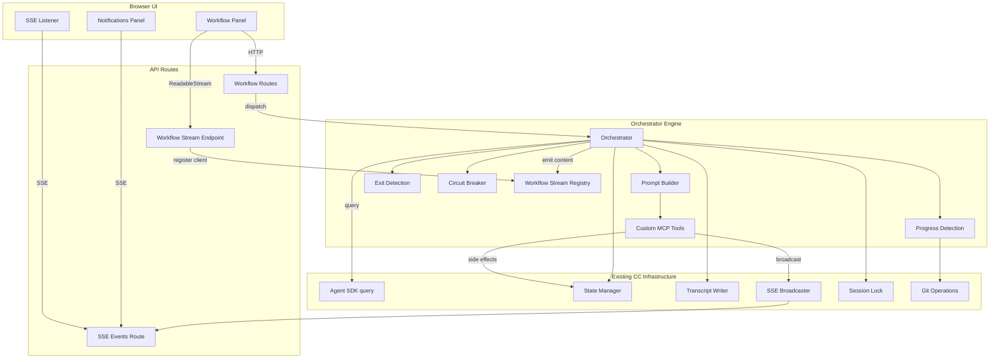
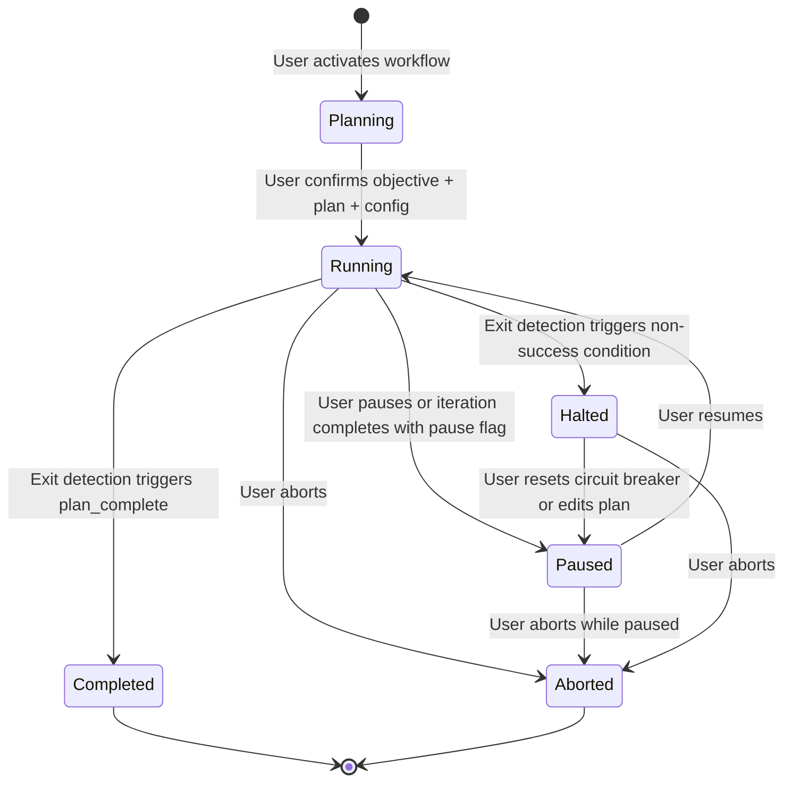
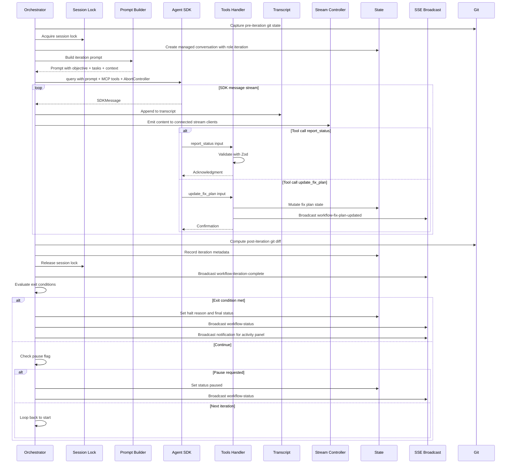
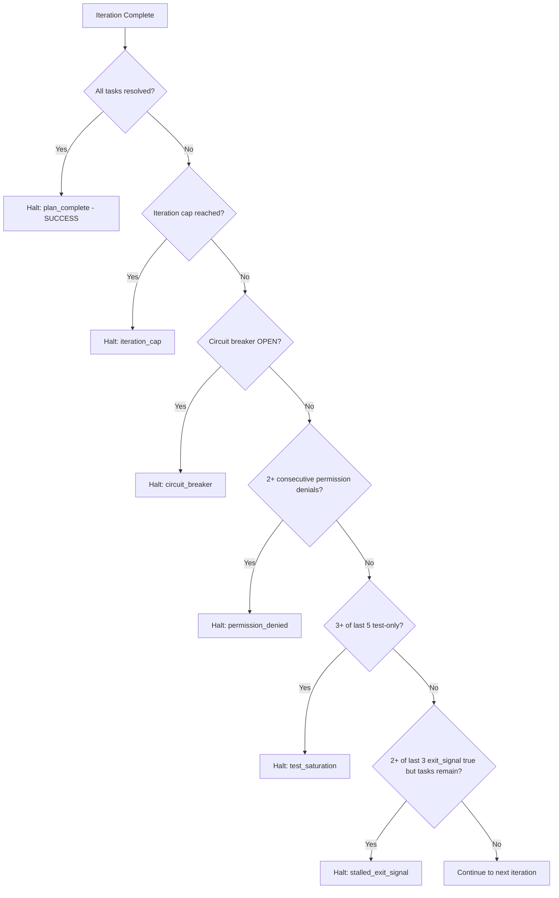
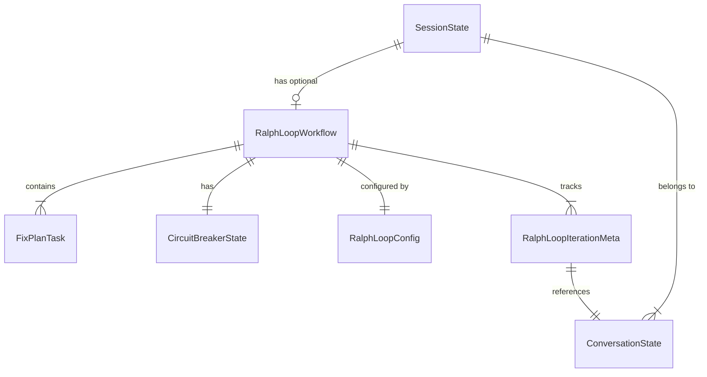

# Design Document — Ralph Loop Workflow

## Overview

**Purpose**: The Ralph Loop workflow delivers autonomous iterative Claude Code execution to CC users, enabling objective-driven development sessions where CC orchestrates repeated Claude Code invocations until a structured task plan is complete.

**Users**: Developers using CC who want to define an objective and task plan, then let Claude work autonomously — monitoring progress in real-time and intervening only when needed.

**Impact**: Extends the existing session model with an optional workflow entity. Introduces a new orchestrator engine module, custom SDK tools, new API routes, SSE event types, and workflow-specific UI components. Does not modify existing conversational prompt execution.

### Goals
- Enable autonomous loop execution within existing CC sessions (no new session type)
- Provide deterministic orchestration — loop control, exit detection, and progress tracking are all code-driven, not LLM-driven
- Expose structured custom tools (`report_status`, `update_fix_plan`) for reliable Claude-to-CC communication
- Deliver first-class UI for workflow configuration, real-time monitoring, and iteration history
- Integrate with existing CC infrastructure: sessions, conversations, transcripts, SSE, state management, notifications

### Non-Goals
- Generic orchestrator framework — build Ralph Loop directly, extract common patterns when adding a second workflow type
- Rate limiting — API provider handles rate limits; CC uses iteration caps instead
- SDK session resume between iterations — each iteration uses fresh context
- Modification of existing conversational prompt execution (`executePromptStream`)
- Multi-user workflow coordination (CC is single-user)

## Architecture

### Existing Architecture Analysis

The orchestrator builds on these existing CC systems:

- **Session model** (`schemas.ts`): `SessionState` with conversations array, objective, worktree path, branch name. Extended with optional `workflow` field.
- **Conversation lifecycle** (`conversations.ts`): `createConversation()` with role support (`"initialization" | null`). Extended to support `"iteration"` role for managed conversations.
- **Prompt execution** (`prompt.ts`): `executePromptStream()` handles SDK `query()`, transcript writing, SSE emission, `canUseTool` interception. The orchestrator does NOT call this function — it builds its own execution flow reusing the lower-level helpers.
- **Background jobs** (`background-jobs.ts`): Fire-and-forget async with globalThis registry, SSE broadcast, stale recovery. The orchestrator follows this same dispatch pattern.
- **Session locks** (`lock.ts`): In-memory per-session lock via globalThis Map. The orchestrator acquires per-iteration.
- **SSE broadcasting** (`sse-broadcaster.ts`): globalThis client Set, `broadcast(event: SSEEvent)` fires to all connected browsers.
- **State persistence** (`state.ts`): Atomic JSON writes (temp + rename). All workflow state lives in `state.json` within the session.
- **Notifications** (`notification.store.ts`, `NotificationsPanel.tsx`): Zustand store tracking background jobs, toast queue for terminal events. Extended to track workflow events.

### Architecture Pattern & Boundary Map



**Architecture Integration**:
- **Selected pattern**: Dedicated orchestrator module with callback-driven integration to existing infrastructure
- **Domain boundaries**: `src/lib/ralph-loop/` owns all orchestration logic. Existing modules (`state.ts`, `transcript.ts`, `sse-broadcaster.ts`, `lock.ts`) remain unchanged — the orchestrator calls into them.
- **Existing patterns preserved**: Atomic state writes, session locks, SSE broadcasting, transcript JSONL, conversation status flow, schema-first modeling
- **New components rationale**: Orchestrator engine is fundamentally different from interactive prompt execution — it runs autonomously across multiple iterations with loop control, exit detection, and circuit breaking. A dedicated module prevents bloating `prompt.ts`.

### Technology Stack

| Layer | Choice / Version | Role in Feature | Notes |
|-------|------------------|-----------------|-------|
| Backend | `@anthropic-ai/claude-agent-sdk` | `query()` API + `createSdkMcpServer` + `tool()` for custom tools | Requires async generator prompt format for MCP tools |
| Backend | Zod v4 | Schema definitions for workflow state, tool inputs, SSE events | Existing pattern; all new entities schema-first |
| Data | `state.json` (filesystem) | Workflow state persisted within `SessionState` | Existing atomic write pattern |
| Data | JSONL transcripts | Per-iteration conversation transcripts | Existing pattern, new `role: "iteration"` |
| Messaging | SSE via `sse-broadcaster.ts` | Real-time workflow status, fix plan updates, circuit breaker events | 4 new event types added to `SSEEvent` union |
| Streaming | Dedicated workflow stream endpoint | Real-time iteration content (SDK messages) via per-client ReadableStream | Same pattern as existing prompt route streaming |
| Frontend | React + TanStack Query + Zustand | Workflow UI components, data fetching, local state | Existing stack; new query hooks and store slices |

## System Flows

### Workflow Lifecycle State Machine



### Loop Iteration Sequence



### Exit Detection Flow



## Requirements Traceability

| Requirement | Summary | Components | Interfaces | Flows |
|-------------|---------|------------|------------|-------|
| 1.1-1.2 | Normal session creation + workflow activation | SessionState extension, WorkflowPanel | POST /workflow/start | Lifecycle |
| 1.3-1.4 | One workflow per session + read-only conversations | SessionState.workflow, UI lock logic | — | — |
| 1.5-1.6 | Restore access on completion + UI distinction | WorkflowPanel, ConversationSidebar | workflow-status SSE | Lifecycle |
| 2.1-2.2 | Planning phase with config | PlanningPanel, PlanGenerator | POST /workflow/start, POST /workflow/confirm | Planning |
| 2.3 | Start execution | Orchestrator | POST /workflow/confirm | Iteration |
| 2.4-2.5 | Pause and resume | OrchestratorRegistry | POST /workflow/pause, POST /workflow/resume | Lifecycle |
| 2.6 | Abort | OrchestratorRegistry, AbortController | POST /workflow/abort | Lifecycle |
| 2.7 | Persist and recover state | State recovery logic | — | Startup |
| 3.1-3.3 | SDK execution with fresh context | Orchestrator, PromptBuilder | Agent SDK query() | Iteration |
| 3.4-3.5 | Record iteration results + managed conversations | Orchestrator, TranscriptWriter | — | Iteration |
| 3.6-3.7 | Error handling + timeout | Orchestrator, AbortController | — | Iteration |
| 4.1-4.2 | Custom tools: report_status + update_fix_plan | RalphLoopMCPTools | createSdkMcpServer | Iteration |
| 4.3-4.6 | Tool handling + default behavior + prompt instructions | RalphLoopMCPTools, PromptBuilder | — | Iteration |
| 5.1-5.6 | Git-based progress detection | ProgressDetector | git diff commands | Iteration |
| 6.1-6.9 | Exit detection system | ExitDetector | — | Exit Detection |
| 7.1-7.7 | Circuit breaker | CircuitBreaker | — | Iteration |
| 8.1-8.6 | Task plan management + UI | FixPlanManager, TaskPlanEditor | PUT /workflow/fix-plan, update_fix_plan tool | Planning |
| 8.7 | AI-generated task plan suggestion | PlanGenerator | POST /workflow/generate-plan | Planning |
| 9.1-9.4 | Workflow configuration | RalphLoopConfig schema, ConfigPanel | PUT /workflow/config | Planning |
| 10.1-10.7 | Real-time monitoring UI | LoopProgressDashboard, IterationHistory, ControlBar, WorkflowStreamRegistry | workflow SSE events + GET /workflow/stream | Monitoring |
| 11.1-11.4 | Iteration review and history | IterationHistory, TranscriptViewer | GET /workflow/iterations | History |
| 12.1-12.5 | Workflow completion and results | CompletionSummary | GET /workflow/status | Completion |
| 13.1-13.5 | SSE events and notifications | SSE event schemas, NotificationsPanel | /api/events | All flows |

## Components and Interfaces

| Component | Domain | Intent | Req Coverage | Key Dependencies | Contracts |
|-----------|--------|--------|--------------|------------------|-----------|
| Orchestrator | Engine | Core loop control — iterate, dispatch, evaluate | 2.3-2.7, 3.1-3.7 | SDK (P0), State (P0), Lock (P0) | Service, State |
| PromptBuilder | Engine | Construct iteration prompts | 3.2, 4.6 | FixPlanManager (P0) | Service |
| RalphLoopMCPTools | Engine | Custom tool definitions and handlers | 4.1-4.5 | SDK MCP (P0), State (P1) | Service |
| ExitDetector | Engine | Evaluate exit conditions after each iteration | 6.1-6.9 | CircuitBreaker (P0) | Service |
| CircuitBreaker | Engine | Three-state stagnation detector | 7.1-7.7 | — | Service, State |
| ProgressDetector | Engine | Git diff-based progress classification | 5.1-5.6 | GitOps (P0) | Service |
| FixPlanManager | Engine | Task plan state mutations and queries | 8.1-8.6 | State (P0) | Service |
| OrchestratorRegistry | Engine | In-memory registry for running workflows | 2.4-2.6 | — | Service |
| WorkflowStreamRegistry | Engine | Per-workflow content streaming to connected UI clients | 10.2 | — | Service |
| PlanGenerator | Engine | Generate suggested task plan from conversation context | 8.7 | SDK (P0), Transcript (P1) | Service |
| WorkflowPanel | UI | Top-level workflow container (planning, monitoring, history) | 10.1-10.7 | All UI children (P1) | — |
| TaskPlanEditor | UI | Interactive task list with add/remove/reorder/edit | 8.2, 8.5 | — | — |
| ControlBar | UI | Start/pause/resume/abort buttons | 10.6 | — | — |
| IterationHistory | UI | Timeline of completed iterations | 11.1-11.4 | TranscriptViewer (P1) | — |

### Orchestrator Engine

#### Orchestrator

| Field | Detail |
|-------|--------|
| Intent | Core loop control — dispatches iterations, processes results, evaluates exit conditions, manages lifecycle transitions |
| Requirements | 2.3, 2.4, 2.5, 2.6, 2.7, 3.1, 3.3, 3.4, 3.5, 3.6, 3.7 |

**Responsibilities & Constraints**
- Runs as a fire-and-forget async function dispatched from the workflow confirm API route
- Owns the iteration loop: build prompt → acquire lock → execute query → release lock → record results → evaluate exit → continue/stop
- Does NOT call `executePromptStream()` — builds its own SDK `query()` call with MCP tools
- Reuses existing helpers: `createConversation()`, transcript append, `broadcast()`, `readState()`/`writeState()`
- Checks OrchestratorRegistry pause flag between iterations; checks AbortController signal during iteration

**Dependencies**
- Inbound: Workflow API routes — dispatch via `startOrchestrator()` (P0)
- Outbound: Agent SDK `query()` — prompt execution (P0)
- Outbound: `state.ts` — persist iteration results and workflow state (P0)
- Outbound: `lock.ts` — per-iteration session locking (P0)
- Outbound: `sse-broadcaster.ts` — lifecycle/metadata event broadcasting (P0)
- Outbound: `WorkflowStreamRegistry` — per-iteration content streaming to connected clients (P0)
- Outbound: `transcript.ts` — write iteration transcripts (P1)
- Outbound: PromptBuilder, ExitDetector, CircuitBreaker, ProgressDetector — orchestration components (P0)

**Contracts**: Service [x] / State [x]

##### Service Interface

```typescript
interface OrchestratorService {
  /** Dispatch the loop as a fire-and-forget async function. Returns immediately. */
  startOrchestrator(params: StartOrchestratorParams): void;

  /** Request pause — loop stops after current iteration completes. */
  requestPause(projectPath: string, sessionName: string): Result<void, WorkflowNotRunningError>;

  /** Abort — cancels current iteration via AbortController. */
  requestAbort(projectPath: string, sessionName: string): Result<void, WorkflowNotRunningError>;

  /** Resume — dispatches a new orchestrator run from current state. */
  resumeOrchestrator(projectPath: string, sessionName: string): Result<void, WorkflowNotPausedError>;
}

interface StartOrchestratorParams {
  projectPath: string;
  session: SessionState;
  workflow: RalphLoopWorkflow;
}
```

- Preconditions: Session exists, workflow status is "planning" (for start) or "paused" (for resume)
- Postconditions: Orchestrator registered in OrchestratorRegistry, workflow status set to "running"
- Invariants: At most one orchestrator per session in the registry

##### State Management

- Workflow state persisted in `SessionState.workflow` via atomic writes after each iteration
- In-memory registry (`OrchestratorRegistry`) tracks running loops for pause/abort signaling
- Stale recovery on startup: any workflow with status "running" reset to "paused"

**Implementation Notes**
- Each iteration creates a managed conversation with `role: "iteration"` via `createConversation()`
- SDK `query()` configured with `permissionMode: "bypassPermissions"`, `maxTurns: undefined` (rely on timeout), `persistSession: false` (each iteration uses fresh context; CC writes its own transcripts), `settingSources: ["user", "project", "local"]`, `env: { ...process.env, CLAUDECODE: "" }`
- `canUseTool` callback denies `AskUserQuestion` with instructive message: "Autonomous iteration — make your best judgment and proceed."
- AbortController per iteration with configurable timeout (default 60 min)
- Iteration-level error handling: catch SDK errors, log, update circuit breaker, continue to exit evaluation

---

#### PromptBuilder

| Field | Detail |
|-------|--------|
| Intent | Construct the prompt text for each iteration from objective, task plan state, iteration context, and tool instructions |
| Requirements | 3.2, 4.6 |

**Responsibilities & Constraints**
- Builds a comprehensive prompt that includes: objective, current task plan (pending/in-progress tasks sorted by priority), iteration number and max, tool usage instructions, and previous iteration context (errors, blocked tasks)
- Returns an async generator of `SDKUserMessage` (required for MCP tool support)
- Does not contain loop logic — pure function of inputs

##### Service Interface

```typescript
interface PromptBuilderService {
  buildIterationPrompt(params: BuildPromptParams): AsyncGenerator<SDKUserMessage>;
}

interface BuildPromptParams {
  objective: string;
  fixPlan: FixPlanTask[];
  iterationNumber: number;
  maxIterations: number;
  previousIterationContext?: PreviousIterationContext;
}

interface PreviousIterationContext {
  statusReport?: ReportStatusInput;
  errors?: string[];
  gitMetrics?: GitIterationMetrics;
}
```

**Implementation Notes**
- The prompt includes instructions for `mcp__ralph-loop__report_status` and `mcp__ralph-loop__update_fix_plan` tools, describing their schemas and when to use them
- Instruction to call `report_status` at the end of the iteration with an honest assessment
- Instruction to call `update_fix_plan` whenever tasks are completed, discovered, or determined unnecessary
- Previous iteration context is summarized concisely to avoid prompt bloat

---

#### RalphLoopMCPTools

| Field | Detail |
|-------|--------|
| Intent | Define custom MCP tools that Claude calls during iterations for structured communication |
| Requirements | 4.1, 4.2, 4.3, 4.4 |

**Responsibilities & Constraints**
- Creates an in-process MCP server via `createSdkMcpServer()` with two tools
- Tool handlers are closures over the current iteration context
- `report_status` handler: validates input, stores analysis, returns acknowledgment
- `update_fix_plan` handler: validates input, mutates workflow state, broadcasts SSE, returns confirmation
- MCP server recreated per iteration with fresh context references

##### Service Interface

```typescript
interface RalphLoopMCPToolsService {
  createToolServer(context: ToolContext): McpSdkServerConfigWithInstance;
}

interface ToolContext {
  projectPath: string;
  sessionName: string;
  workflow: RalphLoopWorkflow;
  iterationNumber: number;
  onStatusReport: (report: ReportStatusInput) => void;
  onFixPlanUpdate: (update: UpdateFixPlanInput) => Promise<void>;
}
```

Tool input schemas defined in Data Models section below.

**Implementation Notes**
- Tool names in Claude's view: `mcp__ralph-loop__report_status`, `mcp__ralph-loop__update_fix_plan`
- The `onFixPlanUpdate` callback persists state changes and broadcasts SSE events
- The `onStatusReport` callback stores the report in iteration metadata (not persisted until iteration completes)

---

#### ExitDetector

| Field | Detail |
|-------|--------|
| Intent | Evaluate exit conditions against iteration results and workflow state |
| Requirements | 6.1-6.9 |

**Responsibilities & Constraints**
- Pure function: takes iteration history and current state, returns exit decision
- Evaluates conditions in strict priority order (see Exit Detection Flow diagram)
- Classifies halt reasons as successful (`plan_complete`) or problematic (all others)

##### Service Interface

```typescript
interface ExitDetectorService {
  evaluate(params: ExitEvaluationParams): ExitDecision;
}

interface ExitEvaluationParams {
  fixPlan: FixPlanTask[];
  iterations: RalphLoopIterationMeta[];
  currentIteration: RalphLoopIterationMeta;
  circuitBreakerState: CircuitBreakerStateEnum;
  config: RalphLoopConfig;
}

type ExitDecision =
  | { action: "continue" }
  | { action: "halt"; reason: HaltReason };
```

---

#### CircuitBreaker

| Field | Detail |
|-------|--------|
| Intent | Three-state machine detecting loop stagnation |
| Requirements | 7.1-7.7 |

**Responsibilities & Constraints**
- Manages state transitions: CLOSED → HALF_OPEN → OPEN (and OPEN → CLOSED on reset)
- Tracks consecutive no-progress count and consecutive same-error count
- Pure state machine: takes current state + iteration result, returns new state

##### Service Interface

```typescript
interface CircuitBreakerService {
  /** Process an iteration result and return updated state. */
  processIteration(
    current: CircuitBreakerState,
    iterationResult: IterationProgressResult,
    config: CircuitBreakerConfig,
  ): CircuitBreakerState;

  /** Reset to closed state (user-initiated). */
  reset(): CircuitBreakerState;
}

interface IterationProgressResult {
  classification: "progress" | "no_progress";
  errorPattern?: string;
}
```

---

#### ProgressDetector

| Field | Detail |
|-------|--------|
| Intent | Detect file changes between iterations using git |
| Requirements | 5.1-5.6 |

##### Service Interface

```typescript
interface ProgressDetectorService {
  /** Capture pre-iteration snapshot (e.g., git stash of working tree hash). */
  captureSnapshot(worktreePath: string): Promise<GitSnapshot>;

  /** Compute diff between pre and post iteration state. */
  computeDiff(worktreePath: string, preSnapshot: GitSnapshot): Promise<GitIterationMetrics>;

  /** Classify iteration as progress or no-progress. */
  classifyProgress(
    gitMetrics: GitIterationMetrics,
    statusReport: ReportStatusInput | undefined,
    tasksCompleted: number,
  ): "progress" | "no_progress";
}

type GitSnapshot = string; // e.g., git tree hash or diff output hash
```

**Implementation Notes**
- Uses `git diff --stat` and `git diff --numstat` for metrics
- Snapshot approach: capture `git diff HEAD --stat` before iteration; after iteration, run same command and compare. Alternative: use `git stash create` to get a tree hash.
- Classification: "no progress" when filesChanged === 0 AND no tasks completed AND status report is missing or in_progress

---

#### OrchestratorRegistry

| Field | Detail |
|-------|--------|
| Intent | In-memory registry tracking running workflow loops for pause/abort signaling |
| Requirements | 2.4, 2.5, 2.6 |

##### Service Interface

```typescript
interface OrchestratorRegistryService {
  register(key: string, entry: RunningWorkflow): void;
  get(key: string): RunningWorkflow | undefined;
  remove(key: string): void;
}

interface RunningWorkflow {
  projectPath: string;
  sessionName: string;
  abortController: AbortController;
  pauseRequested: boolean;
}
```

**Implementation Notes**
- globalThis singleton: `globalThis.__cc_running_workflows: Map<string, RunningWorkflow>`
- Key format: `${projectPath}::${sessionName}` (same pattern as session locks)
- On pause: set `pauseRequested = true`; orchestrator checks between iterations
- On abort: call `abortController.abort()`; SDK query terminates

---

#### PlanGenerator

| Field | Detail |
|-------|--------|
| Intent | Generate a suggested task plan from session conversation context via a one-shot SDK query |
| Requirements | 8.7 |

**Responsibilities & Constraints**
- Dispatched as a fire-and-forget async function from the `generate-plan` API route (same pattern as orchestrator dispatch)
- Reads the most recent conversation transcript from the session to build context for plan generation
- Runs a single SDK `query()` call with a planning-focused system prompt and a custom `submit_plan` MCP tool for structured output
- The `submit_plan` tool captures the generated tasks as structured data (array of `{ description, priority }` objects), avoiding text parsing
- On completion, writes the suggested plan to the workflow's `fixPlan` field (status: all `pending`) and broadcasts a `workflow-fix-plan-updated` SSE event
- The user reviews and edits the suggested plan in the TaskPlanEditor before confirming — this is a suggestion, not a commitment

**Dependencies**
- Outbound: Agent SDK `query()` — plan generation (P0)
- Outbound: `transcript.ts` — read conversation messages for context (P1)
- Outbound: `state.ts` — persist generated plan (P0)
- Outbound: `sse-broadcaster.ts` — notify UI of generated plan (P0)

##### Service Interface

```typescript
interface PlanGeneratorService {
  /** Fire-and-forget: generate a suggested plan and persist it. */
  generatePlan(params: GeneratePlanParams): void;
}

interface GeneratePlanParams {
  projectPath: string;
  session: SessionState;
  workflow: RalphLoopWorkflow;
  /** Optional conversation to use as context. If omitted, uses the most recent non-archived conversation. */
  conversationId?: string;
}
```

- Preconditions: Workflow status is "planning"
- Postconditions: Workflow's `fixPlan` populated with suggested tasks (all `pending`), SSE event broadcast
- Error handling: On SDK error, log and broadcast a `workflow-status` event with error context; workflow remains in "planning" status for manual task entry

**Implementation Notes**
- System prompt instructs Claude to analyze the conversation context and objective, then call `submit_plan` with a structured list of actionable development tasks ordered by dependency/priority
- The `submit_plan` MCP tool schema: `{ tasks: Array<{ description: string, priority: "high" | "medium" | "low" }> }`
- SDK configured with `maxTurns: 3` (plan generation should be a single tool call), short timeout (2 min), `permissionMode: "bypassPermissions"`
- Does NOT acquire session lock — plan generation is a lightweight read-only-context operation that doesn't modify the worktree
- If the user already manually added tasks before triggering generate, the generated tasks are appended (not replacing existing ones)

---

#### WorkflowStreamRegistry

| Field | Detail |
|-------|--------|
| Intent | Per-workflow content streaming to connected UI clients via dedicated ReadableStream endpoints |
| Requirements | 10.2 |

**Responsibilities & Constraints**
- Manages a set of `ReadableStreamDefaultController` instances per workflow (keyed by `${projectPath}::${sessionName}`)
- The orchestrator calls `emit(key, data)` during SDK message processing to push content to connected stream clients
- Stream clients connect via a dedicated HTTP endpoint that returns a `ReadableStream` response (same pattern as the existing prompt route)
- When an iteration completes or the workflow stops, existing stream connections receive a terminal frame and close cleanly

##### Service Interface

```typescript
interface WorkflowStreamRegistryService {
  /** Register a stream controller for a workflow. Returns cleanup function. */
  addClient(key: string, controller: ReadableStreamDefaultController): () => void;

  /** Emit content to all connected stream clients for a workflow. */
  emit(key: string, data: WorkflowStreamFrame): void;

  /** Close all stream clients for a workflow (e.g., on completion/abort). */
  closeAll(key: string): void;

  /** Check if any clients are connected (for conditional processing). */
  hasClients(key: string): boolean;
}

type WorkflowStreamFrame =
  | { type: "content"; iterationNumber: number; content: MessageContentBlock }
  | { type: "iteration-boundary"; iterationNumber: number; status: "started" | "completed" }
  | { type: "done"; reason: string };
```

**Implementation Notes**
- globalThis singleton: `globalThis.__cc_workflow_streams: Map<string, Set<ReadableStreamDefaultController>>`
- Same resilient pattern as `sse-broadcaster.ts`: if `controller.enqueue()` throws, silently remove the client
- Frame format: NDJSON (one JSON object per line) — simpler than SSE for high-frequency content, no event type overhead
- The orchestrator conditionally emits content only when `hasClients()` is true, avoiding serialization overhead when no UI is watching

**Design Rationale — Hybrid Streaming Architecture**:
Live iteration content (SDK messages) uses a dedicated per-workflow streaming endpoint rather than the global SSE broadcaster. This mirrors how the existing prompt route streams content via a per-request `ReadableStream` response. The rationale:

1. **Volume**: A single iteration generates hundreds of SDK messages (tool calls, results, text blocks). Broadcasting each as a global SSE event would create significant overhead for all connected clients, even those viewing different sessions.
2. **Backpressure**: ReadableStream provides natural backpressure — if the client falls behind, the stream slows. SSE events are fire-and-forget with no delivery guarantee, which could lead to dropped content.
3. **Separation of concerns**: SSE remains the channel for low-frequency metadata events (status transitions, iteration completions, fix plan updates, circuit breaker changes) that all UI surfaces need. Content streaming is scoped to the workflow monitoring view that actively subscribes to it.
4. **Consistency**: The existing prompt execution uses per-request ReadableStream for content. The workflow follows the same pattern, just with a persistent connection rather than per-prompt.

---

### API Layer

#### Workflow API Routes

All routes nested under `/api/projects/[name]/sessions/[session]/workflow/`.

##### API Contracts

| Method | Endpoint | Request | Response | Errors |
|--------|----------|---------|----------|--------|
| POST | /workflow/start | `{}` or `{ objective?: string }` | `{ workflow: RalphLoopWorkflow }` (status: planning) | 404 session not found, 409 workflow already exists |
| POST | /workflow/generate-plan | `{ conversationId?: string }` | `{ status: "generating" }` | 404, 409 not in planning status |
| POST | /workflow/confirm | `{ objective: string, fixPlan: FixPlanTask[], config: RalphLoopConfig }` | `{ workflow: RalphLoopWorkflow }` (status: running) | 400 validation, 409 not in planning status |
| POST | /workflow/pause | `{}` | `{ workflow: RalphLoopWorkflow }` (status: paused after current iteration) | 409 not running |
| POST | /workflow/resume | `{}` | `{ workflow: RalphLoopWorkflow }` (status: running) | 409 not paused/halted |
| POST | /workflow/abort | `{}` | `{ workflow: RalphLoopWorkflow }` (status: aborted) | 409 not running/paused |
| GET | /workflow/status | — | `{ workflow: RalphLoopWorkflow \| null }` | 404 |
| PUT | /workflow/fix-plan | `{ fixPlan: FixPlanTask[] }` | `{ fixPlan: FixPlanTask[] }` | 409 not paused, 400 validation |
| PUT | /workflow/config | `{ config: Partial<RalphLoopConfig> }` | `{ config: RalphLoopConfig }` | 409 not paused, 400 validation |
| GET | /workflow/iterations | — | `{ iterations: RalphLoopIterationMeta[] }` | 404 |
| GET | /workflow/stream | — | `ReadableStream<WorkflowStreamFrame>` (NDJSON) | 404, 409 not running |

All routes wrapped with `withTracing()`. Error responses follow existing CC pattern: `{ error: string, code: string }`.

**Workflow Stream Endpoint** (`GET /workflow/stream`): Returns a `ReadableStream` response that emits NDJSON frames of iteration content in real-time. The client connects while the workflow is running and receives SDK message content as it happens. The stream closes when the iteration completes, the workflow pauses/halts/aborts, or the client disconnects. The UI reconnects automatically between iterations. This mirrors the existing prompt route's streaming pattern — content flows through a dedicated per-client channel rather than the global SSE broadcaster. For completed iterations, the UI reads content from the transcript via the existing conversation transcript viewer.

**Prompt Route Guard**: The existing prompt route (`/api/projects/[name]/sessions/[session]/prompt/route.ts`) must be updated to enforce workflow invariants before executing prompts:
- Reject with 409 if `session.workflow?.status === "running"` — no user prompts while workflow is active
- Reject with 403 if `conversation.role === "iteration"` — iteration conversations are never user-interactive

These guards enforce Requirement 1.4 at the API boundary, preventing lock conflicts and state corruption even if the UI is bypassed.

---

### UI Layer

UI components are colocated with the session page at `src/app/projects/[name]/[session]/workflow/`.

#### WorkflowPanel

| Field | Detail |
|-------|--------|
| Intent | Top-level container that switches between planning, monitoring, and completion views based on workflow status |
| Requirements | 1.2, 1.6, 10.1 |

Renders conditionally within the session detail page:
- No workflow → "Start Ralph Loop" button in session header
- Status `planning` → PlanningPanel (objective, task plan editor, config, confirm button)
- Status `running` / `paused` → MonitoringPanel (LoopProgressDashboard + IterationHistory + ControlBar)
- Status `completed` / `halted` / `aborted` → CompletionSummary

#### TaskPlanEditor

| Field | Detail |
|-------|--------|
| Intent | Interactive checklist UI for creating, editing, and reordering tasks |
| Requirements | 8.2, 8.5, 8.6 |

Features: add/remove tasks, drag-to-reorder, priority selector (high/medium/low), inline editing, completion percentage, real-time updates via SSE. Editable during planning and when paused; read-only during running.

#### ControlBar

| Field | Detail |
|-------|--------|
| Intent | Workflow lifecycle controls |
| Requirements | 10.6 |

Buttons: Confirm & Start (from planning, validates objective + plan are populated), Pause (during running), Resume (from paused/halted), Abort (from running/paused). Disabled states follow workflow status. Abort shows confirmation dialog.

#### LoopProgressDashboard — Summary-Only

Real-time status display: workflow status badge, iteration counter (N / max), task completion bar, circuit breaker indicator (CLOSED/HALF_OPEN/OPEN), elapsed time, accumulated cost. All driven by SSE events stored in Zustand workflow store.

#### IterationHistory — Summary-Only

Scrollable timeline of completed iterations. Each row: iteration number, duration, files changed, work type badge, exit signal indicator, work summary text. Expandable to show full transcript via existing conversation viewer. Error iterations highlighted with warning styling.

#### CompletionSummary — Summary-Only

Displayed when workflow ends. Shows: total iterations, total duration, total cost, exit reason with classification (success/problem), final task plan state. Provides recovery actions for problematic halts (reset circuit breaker, edit plan, resume). Links to cumulative git diff.

## Data Models

### Domain Model



**Aggregates**: `SessionState` is the aggregate root. `RalphLoopWorkflow` is a value object within the session — all workflow mutations go through the session's state read-modify-write cycle.

**Invariants**:
- At most one workflow per session (nullable field, not array)
- Managed conversations (role: "iteration") cannot have prompts sent to them by users
- Fix plan task IDs are unique within a workflow
- Workflow status transitions follow the state machine (no arbitrary jumps)

### Logical Data Model

#### Schema Definitions

All schemas added to `src/lib/schemas.ts`. Types derived via `z.infer` and re-exported from `src/types/index.ts`.

```typescript
// --- Fix Plan Task ---
export const fixPlanTaskStatusSchema = z.enum([
  "pending",
  "in_progress",
  "completed",
  "skipped",
]);

export const fixPlanTaskSchema = z.object({
  id: z.string(),
  description: z.string(),
  priority: z.enum(["high", "medium", "low"]),
  status: fixPlanTaskStatusSchema,
  createdAt: z.string(),
  completedAt: z.string().nullable().default(null),
  skipReason: z.string().nullable().default(null),
  addedByIteration: z.number().nullable().default(null),
});

// --- Circuit Breaker ---
export const circuitBreakerStateEnumSchema = z.enum([
  "closed",
  "half_open",
  "open",
]);

export const circuitBreakerStateSchema = z.object({
  state: circuitBreakerStateEnumSchema,
  consecutiveNoProgress: z.number().default(0),
  consecutiveSameError: z.number().default(0),
  lastErrorPattern: z.string().nullable().default(null),
  lastProgressIteration: z.number().default(0),
});

// --- Configuration ---
export const circuitBreakerConfigSchema = z.object({
  noProgressThreshold: z.number().int().min(1).default(3),
  sameErrorThreshold: z.number().int().min(1).default(5),
});

export const ralphLoopConfigSchema = z.object({
  maxIterations: z.number().int().min(1).max(100).default(20),
  iterationTimeoutMs: z.number().int().min(60_000).max(7_200_000).default(3_600_000),
  circuitBreaker: circuitBreakerConfigSchema.default({}),
});

// --- Halt Reason ---
export const haltReasonSchema = z.discriminatedUnion("type", [
  z.object({ type: z.literal("plan_complete") }),
  z.object({ type: z.literal("iteration_cap"), maxIterations: z.number() }),
  z.object({
    type: z.literal("circuit_breaker"),
    reason: z.enum(["no_progress", "repeated_error"]),
  }),
  z.object({ type: z.literal("permission_denied") }),
  z.object({ type: z.literal("test_saturation") }),
  z.object({
    type: z.literal("stalled_exit_signal"),
    remainingTasks: z.number(),
  }),
  z.object({ type: z.literal("aborted") }),
]);

// --- Git Iteration Metrics ---
export const gitIterationMetricsSchema = z.object({
  filesChanged: z.number(),
  linesAdded: z.number(),
  linesRemoved: z.number(),
  changedFiles: z.array(z.string()),
});

// --- Iteration Metadata ---
export const ralphLoopIterationMetaSchema = z.object({
  iterationNumber: z.number().int(),
  conversationId: z.string(),
  status: z.enum(["completed", "error", "timeout", "aborted"]),
  startedAt: z.string(),
  completedAt: z.string(),
  durationMs: z.number(),
  costUsd: z.number().default(0),
  turns: z.number().default(0),
  gitMetrics: gitIterationMetricsSchema,
  statusReport: reportStatusInputSchema.nullable().default(null),
  tasksCompleted: z.array(z.string()).default([]),
  tasksSkipped: z.array(z.string()).default([]),
  tasksAdded: z.array(z.string()).default([]),
  progressClassification: z.enum(["progress", "no_progress"]),
});

// --- Workflow Status ---
export const workflowStatusSchema = z.enum([
  "planning",
  "running",
  "paused",
  "completed",
  "halted",
  "aborted",
]);

// --- Workflow Entity ---
export const ralphLoopWorkflowSchema = z.object({
  status: workflowStatusSchema,
  objective: z.string(),
  fixPlan: z.array(fixPlanTaskSchema),
  config: ralphLoopConfigSchema,
  circuitBreaker: circuitBreakerStateSchema,
  iterations: z.array(ralphLoopIterationMetaSchema).default([]),
  haltReason: haltReasonSchema.nullable().default(null),
  createdAt: z.string(),
  startedAt: z.string().nullable().default(null),
  completedAt: z.string().nullable().default(null),
  totalCostUsd: z.number().default(0),
  totalDurationMs: z.number().default(0),
});

// --- Custom Tool Input Schemas ---
export const reportStatusInputSchema = z.object({
  status: z.enum(["in_progress", "complete", "blocked"]),
  exit_signal: z.boolean(),
  work_summary: z.string(),
  work_type: z.enum(["implementation", "testing", "documentation", "refactoring"]),
});

export const updateFixPlanInputSchema = z.object({
  completedTaskIds: z.array(z.string()).optional(),
  skippedTasks: z.array(z.object({
    taskId: z.string(),
    reason: z.string(),
  })).optional(),
  newTasks: z.array(z.object({
    description: z.string(),
    priority: z.enum(["high", "medium", "low"]),
  })).optional(),
});
```

#### Schema Extensions to Existing Entities

```typescript
// Extend ConversationRole
export const conversationRoleSchema = z
  .enum(["initialization", "iteration"])
  .nullable()
  .default(null);

// Extend SessionState
export const sessionStateSchema = z.object({
  // ... existing fields ...
  workflow: ralphLoopWorkflowSchema.nullable().default(null),
});
```

#### Derived Status Extension

The existing `deriveSessionStatus()` function in `session-derived.ts` derives session-level status purely from conversation statuses. This causes a gap during workflow execution: between iterations (during exit evaluation, git diff computation, state writes), no conversation is in `"running"` status, so the derived session status would briefly flicker to `"awaiting"`.

**Required change**: `deriveSessionStatus()` must check `session.workflow?.status` first. If the workflow is `"running"` or `"paused"`, the derived session status should reflect the workflow status regardless of individual conversation statuses. This ensures the session-level status shown in project listings and session cards remains stable throughout the workflow.

```typescript
// In session-derived.ts — deriveSessionStatus()
export function deriveSessionStatus(session: SessionState): DerivedSessionStatus {
  // Workflow status takes precedence when active
  if (session.workflow?.status === "running") return "running";
  if (session.workflow?.status === "paused") return "awaiting"; // paused shows as awaiting at session level

  // ... existing conversation-based derivation ...
}
```

### Data Contracts

#### SSE Event Schemas

```typescript
export const workflowStatusEventSchema = z.object({
  type: z.literal("workflow-status"),
  projectName: z.string(),
  sessionName: z.string(),
  workflowStatus: workflowStatusSchema,
  iterationCount: z.number(),
  maxIterations: z.number(),
  taskProgress: z.object({
    total: z.number(),
    completed: z.number(),
    skipped: z.number(),
    pending: z.number(),
  }),
  haltReason: haltReasonSchema.nullable(),
});

export const workflowIterationCompleteEventSchema = z.object({
  type: z.literal("workflow-iteration-complete"),
  projectName: z.string(),
  sessionName: z.string(),
  iteration: ralphLoopIterationMetaSchema,
});

export const workflowFixPlanUpdatedEventSchema = z.object({
  type: z.literal("workflow-fix-plan-updated"),
  projectName: z.string(),
  sessionName: z.string(),
  fixPlan: z.array(fixPlanTaskSchema),
  source: z.enum(["tool", "user"]),
});

export const workflowCircuitBreakerEventSchema = z.object({
  type: z.literal("workflow-circuit-breaker"),
  projectName: z.string(),
  sessionName: z.string(),
  circuitBreaker: circuitBreakerStateSchema,
});

// Extend SSEEvent union
// Note: Live iteration content is NOT broadcast via SSE — it uses a dedicated
// per-workflow streaming endpoint (GET /workflow/stream) for performance and
// backpressure reasons. SSE is reserved for low-frequency metadata events.
export type SSEEvent =
  | ConversationStatusEvent
  | AskQuestionEvent
  | JobStatusEvent
  | WorkflowStatusEvent
  | WorkflowIterationCompleteEvent
  | WorkflowFixPlanUpdatedEvent
  | WorkflowCircuitBreakerEvent;
```

#### Workflow Notification State (Client-Side)

The existing `notification.store.ts` Zustand store tracks background jobs (`BackgroundJob` / `JobStatusEvent`). Workflow events have a different shape and require a separate slice.

```typescript
// --- Workflow Notification (client-side Zustand) ---

interface WorkflowNotification {
  projectName: string;
  sessionName: string;
  status: WorkflowStatus;
  iterationCount: number;
  maxIterations: number;
  taskProgress: { total: number; completed: number; skipped: number; pending: number };
  haltReason: HaltReason | null;
  startedAt: string | null;
  completedAt: string | null;
}

interface WorkflowNotificationSlice {
  /** Active and recently-completed workflows, keyed by `${projectName}::${sessionName}`. */
  workflows: Map<string, WorkflowNotification>;

  /** Terminal workflow events queued for toast display. */
  workflowToastQueue: WorkflowStatusEvent[];

  /** Upsert from SSE `workflow-status` events. Pushes terminal events (completed, halted, aborted) to toast queue. */
  updateWorkflow(event: WorkflowStatusEvent): void;

  /** Shift one toast from the queue. */
  dismissWorkflowToast(): void;
}
```

**SSE event → store mapping**:
- `workflow-status` → `updateWorkflow()` upserts into `workflows` Map; terminal statuses (`completed`, `halted`, `aborted`) also pushed to `workflowToastQueue`
- `workflow-iteration-complete`, `workflow-fix-plan-updated`, `workflow-circuit-breaker` → consumed directly by the workflow monitoring UI (LoopProgressDashboard, TaskPlanEditor) via component-level state or TanStack Query invalidation; they do not need to flow through the notification store

**Live content streaming** (separate from SSE):
- The workflow monitoring UI connects to `GET /workflow/stream` when the workflow is `running` to receive real-time iteration content via NDJSON ReadableStream
- For completed iterations, the UI reads content from transcripts via the existing conversation transcript viewer
- The stream connection lifecycle is managed by the MonitoringPanel component — connects on mount (if running), reconnects between iterations via `workflow-iteration-complete` SSE trigger, disconnects on unmount or workflow stop

**Selector hooks**:
- `useActiveWorkflows()` → filters `workflows` for `status === "running" || status === "paused"` — used by activity panel (Req 13.5)
- `useWorkflowsBySession(projectName, sessionName)` → lookup single workflow — used by session page header badge

## Error Handling

### Error Strategy

The orchestrator treats errors as iteration-level events, not workflow-level failures. Individual iteration errors feed into the circuit breaker; only systematic patterns (repeated errors, no progress) halt the workflow.

### Error Categories and Responses

**Iteration Errors** (SDK errors, timeouts):
- Caught by the orchestrator's per-iteration try-catch
- Iteration recorded with `status: "error"` or `status: "timeout"`
- Circuit breaker updated (increments no-progress or same-error counters)
- Loop continues to exit evaluation — may continue or halt depending on conditions
- Error context included in next iteration's prompt (PromptBuilder.previousIterationContext)

**Workflow Control Errors** (API-level):
- Wrong status for operation → 409 Conflict with descriptive message (e.g., "Cannot pause: workflow is not running")
- Validation errors → 400 Bad Request with Zod error details
- Session/workflow not found → 404 Not Found

**Tool Validation Errors** (custom tool handlers):
- Invalid tool input → return `{ content: [{ type: "text", text: "Validation error: ..." }], isError: true }` — Claude sees the error and can retry
- State mutation failure → log error, return error to Claude, do not halt iteration

**Infrastructure Errors** (state write failure, lock acquisition failure):
- State write failure → log, retry once; if still failing, abort the workflow
- Lock acquisition failure → should not happen (orchestrator is the only actor during running); log and abort

### Monitoring

- All orchestrator actions logged via `createLogger("ralph-loop")` with trace context
- Key events: `ralph-loop.iteration.start`, `ralph-loop.iteration.complete`, `ralph-loop.iteration.error`, `ralph-loop.exit`, `ralph-loop.circuit_breaker.transition`
- Iteration errors include full error message and stack in structured log entries

## Testing Strategy

### Unit Tests
- **ExitDetector**: Test each exit condition in isolation and priority ordering. Test edge cases: empty iteration history, missing status reports, partial task completion. Verify `stalled_exit_signal` requires 2+ of last 3 iterations with exit_signal AND unresolved tasks.
- **CircuitBreaker**: Test state transitions (CLOSED→HALF_OPEN→OPEN, HALF_OPEN→CLOSED on recovery, OPEN→CLOSED on reset). Test threshold configurations. Test same-error pattern detection.
- **ProgressDetector**: Test classification logic with various combinations of git metrics and status reports. Test snapshot capture and diff computation (mock git commands).
- **PromptBuilder**: Test prompt output contains all required sections (objective, tasks, iteration context, tool instructions). Test task ordering by priority. Test previous iteration context inclusion.
- **FixPlanManager**: Test task mutations (complete, skip, add). Test validation (duplicate IDs, invalid task IDs). Test "all resolved" check counts both completed and skipped.

### Integration Tests
- **Orchestrator loop**: Test iteration dispatch with mocked SDK query. Verify state persistence after each iteration. Verify SSE events broadcast at correct lifecycle points.
- **Custom tools roundtrip**: Test `report_status` and `update_fix_plan` tool handlers with valid and invalid inputs. Verify state mutations and SSE broadcasts.
- **Pause/resume flow**: Dispatch orchestrator, request pause, verify it stops after iteration, resume and verify it continues.
- **Circuit breaker integration**: Run multiple no-progress iterations, verify HALF_OPEN transition, then OPEN and halt.

### E2E Tests
- **Full lifecycle**: Create session → activate workflow → configure plan → start → verify iterations run → plan completes → verify completion summary
- **Abort flow**: Start workflow → abort during iteration → verify cleanup and status
- **Stalled exit signal**: Configure workflow where Claude reports exit_signal: true but tasks remain → verify `stalled_exit_signal` halt and recovery UI
