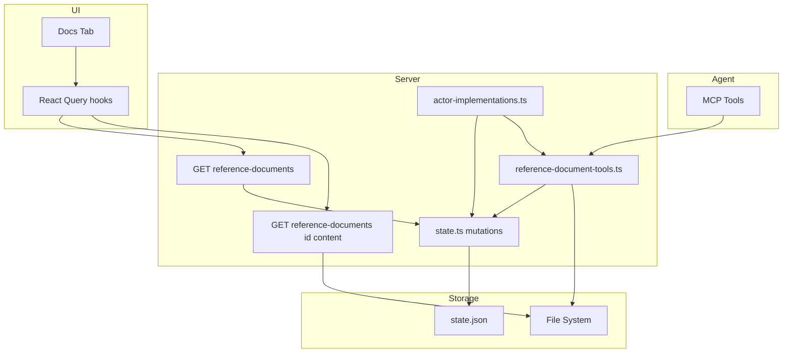
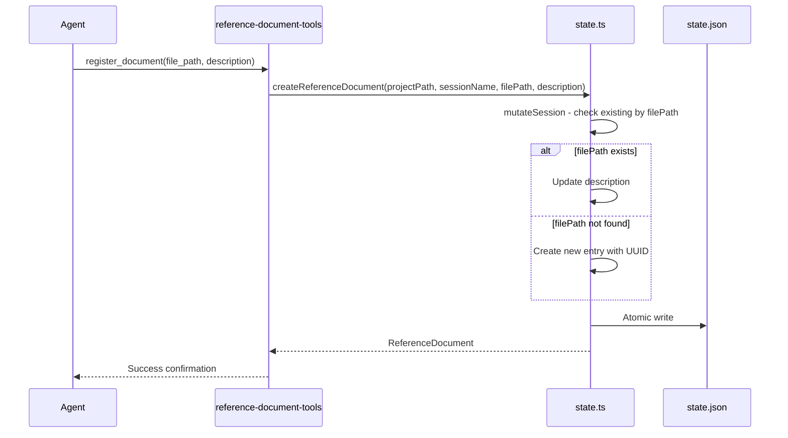

# Design Document: Reference Documents

## Overview

**Purpose**: This feature delivers a general file-based mechanism for inter-agent communication across conversations within Command Center, enabling agents to register, discover, and read reference documents per session.

**Users**: AI agents operating within CC sessions use MCP tools to register and list documents. Human users browse registered documents via the Docs tab in the session UI.

**Impact**: Replaces the single-purpose Focus tab with a generalized Docs tab. Adds `referenceDocuments` array to `SessionState`. Introduces three MCP tools and two API routes.

### Goals
- Enable agents to register files as reference documents discoverable by future conversations
- Auto-register `focus.md` before each conversation so it's always available
- Surface registered documents in the system prompt for agent awareness
- Provide a Docs tab in the UI for browsing and viewing registered documents
- Clean up all old focus-doc code (route, query, query keys, tab)

### Non-Goals
- Project-level document sharing across sessions
- Document versioning or history
- File upload through the UI
- Real-time sync of document content changes

## Architecture

### Existing Architecture Analysis

The feature extends several established patterns:
- **MCP Tool Server**: `roadmap-tools.ts` defines the DI pattern (Context/Deps/defaultDeps/createSdkMcpServer)
- **State Mutation**: `state.ts` provides `mutateSession()` for session-level atomic writes
- **Actor Implementations**: `actor-implementations.ts` wires MCP servers and system prompt parts into conversation sessions
- **API Routes**: REST routes under `/api/projects/[name]/sessions/[session]/` with `withTracing()`
- **UI Tabs**: `session-detail.store.ts` defines `RightPaneTab` union type; `RightPane.tsx` renders tab panels

### Architecture Pattern & Boundary Map



**Architecture Integration**:
- Selected pattern: Extend existing MCP tool server and state mutation patterns
- Domain boundaries: Reference documents are session-scoped; MCP tools operate within session context; UI reads via API routes
- Existing patterns preserved: DI for MCP tools, `mutateSession()` for state, `withTracing()` for API routes, Zustand store for UI state
- New components: `reference-document-tools.ts` (MCP server), two API routes, `DocsPanel` (UI component)

### Technology Stack

| Layer | Choice / Version | Role in Feature | Notes |
|-------|------------------|-----------------|-------|
| Frontend | React 19 + Zustand + TanStack Query | Docs tab UI, state management, data fetching | Existing stack |
| Backend | Next.js 16 API Routes | REST endpoints for document list and content | Existing stack |
| Data | JSON state file (state.json) | Document metadata persistence | Via `mutateSession()` |
| MCP | `@anthropic-ai/claude-agent-sdk` | In-process MCP tool server | Existing SDK |

## System Flows

### Document Registration Flow



### Conversation Start Flow (Auto-Registration + System Prompt)

```mermaid
sequenceDiagram
    participant Actor as actor-implementations
    participant State as state.ts
    participant FS as File System
    participant SDK as Claude SDK

    Actor->>FS: Check memory-bank/focus.md exists
    alt focus.md exists
        Actor->>State: createReferenceDocument(focus.md, standard description)
    end
    Actor->>State: getSessionState() for reference documents
    Actor->>Actor: Build systemPromptParts with reference documents section
    Actor->>SDK: createQuerySession with systemPrompt.append and mcpServers
```

## Requirements Traceability

| Requirement | Summary | Components | Interfaces | Flows |
|-------------|---------|------------|------------|-------|
| 1.1, 1.2, 1.3 | Reference document Zod schema and session state field | referenceDocumentSchema, sessionStateSchema | — | — |
| 2.1, 2.2 | Create/upsert reference document | createReferenceDocument | State mutation | Registration flow |
| 2.3 | Delete reference document from state | deleteReferenceDocument | State mutation | — |
| 2.4 | Get reference documents list | getReferenceDocuments | State read | — |
| 3.1, 3.2, 3.3, 3.4 | register_document MCP tool | ReferenceDocumentToolServer | MCP tool handler | Registration flow |
| 4.1, 4.2, 4.3 | list_documents MCP tool | ReferenceDocumentToolServer | MCP tool handler | — |
| 5.1, 5.2, 5.3, 5.4, 5.5 | delete_document MCP tool | ReferenceDocumentToolServer | MCP tool handler | — |
| 6.1–6.5 | MCP tool server architecture (DI pattern) | ReferenceDocumentToolServer | Context, Deps interfaces | — |
| 7.1, 7.2, 7.3 | System prompt integration | actor-implementations | systemPromptParts | Conversation start flow |
| 8.1, 8.2, 8.3, 8.4 | Auto-registration of focus.md | actor-implementations | State mutation + FS check | Conversation start flow |
| 9.1, 9.2, 9.3 | API route: list documents | GET reference-documents route | API contract | — |
| 10.1, 10.2, 10.3, 10.4 | API route: read content | GET reference-documents/[id]/content route | API contract | — |
| 11.1, 11.2, 11.3, 11.4, 11.5 | Docs tab replaces Focus tab | DocsPanel, session-detail.store | UI props, store types | — |
| 12.1, 12.2, 12.3 | Query and state integration | query-keys, queries hooks | React Query | — |
| 13.1, 13.2, 13.3, 13.4 | Cleanup old focus-doc code | Multiple files | — | — |
| 14.1, 14.2 | MCP server registration in actor-implementations | actor-implementations | Deps interface | Conversation start flow |

## Components and Interfaces

| Component | Domain/Layer | Intent | Req Coverage | Key Dependencies | Contracts |
|-----------|-------------|--------|--------------|-----------------|-----------|
| referenceDocumentSchema | Data | Zod schema for document metadata | 1.1–1.3 | Zod v4 (P0) | State |
| createReferenceDocument | State | Create or update a reference document | 2.1, 2.2 | mutateSession (P0) | Service |
| deleteReferenceDocument | State | Remove a reference document | 2.3 | mutateSession (P0) | Service |
| getReferenceDocuments | State | Read all reference documents for a session | 2.4 | readState (P0) | Service |
| ReferenceDocumentToolServer | MCP | In-process MCP server with 3 tools | 3–6 | State functions (P0), FS (P1) | Service |
| SystemPrompt integration | Actor | Append reference doc list to system prompt | 7.1–7.3 | getSessionState (P0) | — |
| focus.md auto-registration | Actor | Auto-register focus.md before conversations | 8.1–8.4 | createReferenceDocument (P0), FS (P1) | — |
| GET reference-documents | API | List registered documents | 9.1–9.3 | getSession (P0) | API |
| GET reference-documents/[id]/content | API | Read document file content | 10.1–10.4 | getSession (P0), FS (P1) | API |
| DocsPanel | UI | Display document list and content viewer | 11.1–11.5 | React Query hooks (P0) | State |
| referenceDocumentKeys | Query | Query key factory | 12.1 | — | — |
| useReferenceDocumentsQuery | Query | Hook for document list | 12.2 | apiClient (P0) | — |
| useReferenceDocumentContentQuery | Query | Hook for document content | 12.3 | apiClient (P0) | — |

### Data Layer

#### referenceDocumentSchema

| Field | Detail |
|-------|--------|
| Intent | Zod schema defining reference document metadata |
| Requirements | 1.1, 1.2, 1.3 |

**Contracts**: State [x]

##### State Management

```typescript
// In schemas.ts
const referenceDocumentSchema = z.object({
  id: z.string(),
  filePath: z.string(),
  description: z.string(),
  createdAt: z.string(),
});
type ReferenceDocument = z.infer<typeof referenceDocumentSchema>;

// Added to sessionStateSchema
// referenceDocuments: z.array(referenceDocumentSchema).default([])
```

- Persistence: JSON state file via atomic write (temp + rename)
- Concurrency: Protected by `withStateLock` mutex via `mutateSession()`

### State Layer

#### createReferenceDocument

| Field | Detail |
|-------|--------|
| Intent | Create a new reference document or update description if filePath already exists |
| Requirements | 2.1, 2.2 |

**Contracts**: Service [x]

##### Service Interface

```typescript
function createReferenceDocument(
  projectPath: string,
  sessionName: string,
  filePath: string,
  description: string,
): Promise<ReferenceDocument>;
```

- Preconditions: Session exists
- Postconditions: Document entry exists in `session.referenceDocuments` with given filePath and description
- Invariants: No duplicate filePath entries within a session

**Implementation Notes**
- Uses `mutateSession()` for atomic state mutation
- Checks existing entries by `filePath`; if found, updates `description` in place
- If not found, generates `id` via `randomUUID()` and `createdAt` via `new Date().toISOString()`
- Returns the created or updated `ReferenceDocument`

#### deleteReferenceDocument

| Field | Detail |
|-------|--------|
| Intent | Remove a reference document entry from session state |
| Requirements | 2.3 |

**Contracts**: Service [x]

##### Service Interface

```typescript
function deleteReferenceDocument(
  projectPath: string,
  sessionName: string,
  documentId: string,
): Promise<ReferenceDocument | null>;
```

- Preconditions: Session exists
- Postconditions: Document entry removed from `session.referenceDocuments`
- Returns the removed document (for file path access by caller), or null if not found

#### getReferenceDocuments

| Field | Detail |
|-------|--------|
| Intent | Read all reference documents for a session |
| Requirements | 2.4 |

**Contracts**: Service [x]

##### Service Interface

```typescript
function getReferenceDocuments(
  projectPath: string,
  sessionName: string,
): Promise<ReferenceDocument[]>;
```

- Returns empty array if session has no reference documents

### MCP Layer

#### ReferenceDocumentToolServer

| Field | Detail |
|-------|--------|
| Intent | In-process MCP server exposing register_document, list_documents, delete_document tools |
| Requirements | 3.1–3.4, 4.1–4.3, 5.1–5.5, 6.1–6.5 |

**Contracts**: Service [x]

##### Service Interface

```typescript
interface ReferenceDocumentToolContext {
  projectPath: string;
  sessionName: string;
  worktreePath: string;
}

interface ReferenceDocumentToolDeps {
  createReferenceDocument(
    projectPath: string,
    sessionName: string,
    filePath: string,
    description: string,
  ): Promise<ReferenceDocument>;
  deleteReferenceDocument(
    projectPath: string,
    sessionName: string,
    documentId: string,
  ): Promise<ReferenceDocument | null>;
  getReferenceDocuments(
    projectPath: string,
    sessionName: string,
  ): Promise<ReferenceDocument[]>;
  deleteFile(filePath: string): Promise<void>;
}

function createReferenceDocumentToolServer(
  context: ReferenceDocumentToolContext,
  deps?: ReferenceDocumentToolDeps,
): McpSdkServerConfigWithInstance;
```

**Tool Definitions**:

1. **register_document**: Inputs `file_path` (string), `description` (string). Calls `deps.createReferenceDocument()`. Returns confirmation text.

2. **list_documents**: No inputs. Calls `deps.getReferenceDocuments()`. Returns formatted list or "no documents" message.

3. **delete_document**: Input `document_id` (string). Calls `deps.deleteReferenceDocument()` to get file path, then `deps.deleteFile()` to remove the file. Returns confirmation or error if not found. Tolerates missing file gracefully.

**Implementation Notes**
- Follows `roadmap-tools.ts` DI pattern exactly
- `deleteFile` dep wraps `fs.unlink` with ENOENT tolerance
- Error handling via try/catch with `getErrorMessage()`, returning `isError: true`

### Actor Layer

#### System Prompt Integration

| Field | Detail |
|-------|--------|
| Intent | Append reference documents list to system prompt for agent awareness |
| Requirements | 7.1, 7.2, 7.3 |

**Implementation Notes**
- After getting `sessionState` (already available in the flow), read `sessionState.referenceDocuments`
- If non-empty, build a section like:
  ```
  ## Reference Documents
  The following reference documents provide additional context. Read them when relevant to your current task.

  - **{filePath}**: {description}
  - ...
  ```
- Add to `systemPromptParts` array (will be filtered and joined)
- If empty, contribute `null` (filtered out)

#### focus.md Auto-Registration

| Field | Detail |
|-------|--------|
| Intent | Auto-register memory-bank/focus.md before each conversation starts |
| Requirements | 8.1, 8.2, 8.3, 8.4 |

**Implementation Notes**
- Before building system prompt parts, check if `path.join(worktreePath, "memory-bank", "focus.md")` exists using `existsSync`
- If exists, call `createReferenceDocument(projectPath, sessionName, "memory-bank/focus.md", "Current work-in-progress and remaining tasks for this session")`
- Idempotent: if already registered, only updates description (no-op if same)
- Requires adding `createReferenceDocument` and `getReferenceDocuments` to `ActorImplementationDeps`
- Also add `existsSync` equivalent to deps for testability

#### MCP Server Registration

| Field | Detail |
|-------|--------|
| Intent | Register reference document MCP server in conversation query sessions |
| Requirements | 14.1, 14.2 |

**Implementation Notes**
- Add `createReferenceDocumentToolServer` to `ActorImplementationDeps` interface
- Lazy-load `reference-document-tools.ts` in `loadProductionDeps()`
- Register unconditionally in `mcpServers` object (like `roadmap-tools`):
  ```typescript
  "reference-document-tools": deps.createReferenceDocumentToolServer({
    projectPath: input.projectPath,
    sessionName: input.sessionName,
    worktreePath: input.worktreePath,
  })
  ```

### API Layer

#### GET /api/projects/[name]/sessions/[session]/reference-documents

| Field | Detail |
|-------|--------|
| Intent | List all registered reference documents for a session |
| Requirements | 9.1, 9.2, 9.3 |

**Contracts**: API [x]

##### API Contract

| Method | Endpoint | Request | Response | Errors |
|--------|----------|---------|----------|--------|
| GET | /api/projects/[name]/sessions/[session]/reference-documents | — | `ReferenceDocument[]` | 404 (project/session not found) |

**Implementation Notes**
- Use `withTracing()` wrapper
- Resolve project path via `resolveProjectPath()`
- Get session via `getSession()`
- Return `session.referenceDocuments ?? []`

#### GET /api/projects/[name]/sessions/[session]/reference-documents/[id]/content

| Field | Detail |
|-------|--------|
| Intent | Read file content for a specific reference document |
| Requirements | 10.1, 10.2, 10.3, 10.4 |

**Contracts**: API [x]

##### API Contract

| Method | Endpoint | Request | Response | Errors |
|--------|----------|---------|----------|--------|
| GET | /api/projects/[name]/sessions/[session]/reference-documents/[id]/content | — | `{ content: string }` | 404 (document/file not found) |

**Implementation Notes**
- Use `withTracing()` wrapper
- Find document by `id` in `session.referenceDocuments`
- Resolve file path: if relative, join with `session.worktreePath`; if absolute, use as-is
- Read file with `readFile(resolvedPath, "utf-8")`
- Return 404 if document ID not found or file doesn't exist (ENOENT)

### UI Layer

#### DocsPanel

| Field | Detail |
|-------|--------|
| Intent | Display registered documents list with inline Markdown content viewer |
| Requirements | 11.1–11.5 |

**Contracts**: State [x]

##### State Management

```typescript
// Updated types in session-detail.store.ts
type RightPaneTab = "diff" | "docs" | "specs";
type MobilePanel = "chat" | "diff" | "docs" | "specs" | "info";
```

**Implementation Notes**
- Replace Focus tab button with Docs tab button (unconditional, not gated by `creationMode`)
- Component receives `projectName` and `sessionName` props
- Uses `useReferenceDocumentsQuery()` to fetch document list
- Displays list of documents with file name and description
- Clicking a document fetches content via `useReferenceDocumentContentQuery()`
- Renders content using existing `MarkdownViewer` component
- Shows "No reference documents registered" empty state

### Query Layer

#### referenceDocumentKeys

```typescript
// In query-keys.ts
export const referenceDocumentKeys = {
  all: ["reference-documents"] as const,
  list: (projectName: string, sessionName: string) =>
    [...referenceDocumentKeys.all, "list", projectName, sessionName] as const,
  content: (projectName: string, sessionName: string, documentId: string) =>
    [...referenceDocumentKeys.all, "content", projectName, sessionName, documentId] as const,
};
```

#### useReferenceDocumentsQuery

```typescript
function useReferenceDocumentsQuery(
  projectName: string,
  sessionName: string,
): UseQueryResult<ReferenceDocument[]>;
```

#### useReferenceDocumentContentQuery

```typescript
function useReferenceDocumentContentQuery(
  projectName: string,
  sessionName: string,
  documentId: string | null,
): UseQueryResult<string | null>;
```

- Enabled only when `documentId` is non-null

## Data Models

### Domain Model

**ReferenceDocument** (Value Object within Session aggregate):
- `id`: UUID string — unique identifier
- `filePath`: string — relative or absolute path to the document file
- `description`: string — describes when/why agents should read it
- `createdAt`: ISO 8601 timestamp — when first registered

**Invariants**:
- No two documents within a session share the same `filePath`
- `id` is unique within a session

### Logical Data Model

**SessionState.referenceDocuments**: Array of `ReferenceDocument` objects, defaulting to `[]`.

- Transaction boundary: Session-level via `mutateSession()`
- No cascading: Deleting a session removes all reference documents with it
- No temporal versioning needed

## Error Handling

### Error Categories and Responses

**User Errors (4xx)**:
- Document not found (404): When `delete_document` or content API receives unknown ID
- File not found (404): When content API cannot read file from disk

**System Errors (5xx)**:
- File system errors during registration or deletion → return `isError: true` from MCP tools
- State mutation failures → propagate error to caller

**MCP Tool Errors**:
- All tools wrap operations in try/catch
- Return `{ content: [{ type: "text", text: errorMessage }], isError: true }` on failure
- `delete_document` tolerates ENOENT on file deletion (file may have been manually removed)

## Testing Strategy

### Unit Tests
- `state.ts`: Test `createReferenceDocument` (create new, idempotent update), `deleteReferenceDocument`, `getReferenceDocuments`
- `reference-document-tools.ts`: Test each MCP tool handler with injected deps (DI pattern)
- `reference-document-tools.ts`: Test error paths (document not found, file deletion failure)

### Integration Tests
- Actor implementations: Test focus.md auto-registration logic
- Actor implementations: Test system prompt includes reference documents section
- API routes: Test list and content endpoints with state fixtures

### Cleanup Verification
- Verify `focus-doc` route removed
- Verify `useFocusDocQuery` removed
- Verify `sessionKeys.focusDoc` removed
- Verify `RightPaneTab` and `MobilePanel` types updated
