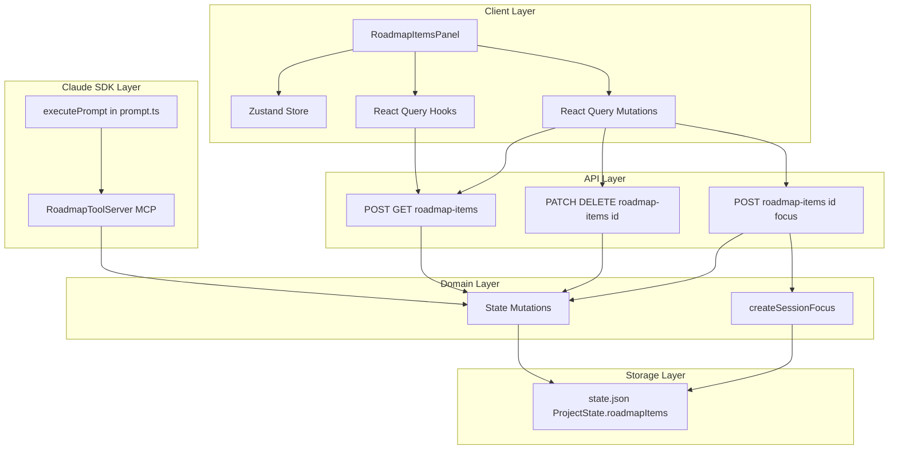
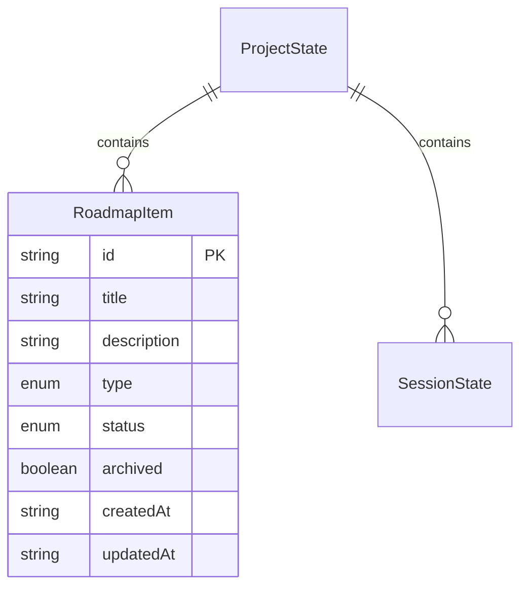

# Design Document — Roadmap Item Tracker

## Overview

**Purpose**: The Roadmap Item Tracker adds a lightweight per-project planning surface to Command Center, enabling developers to capture and track bugs, planned features, and ideas alongside their coding sessions. Additionally, it provides every Claude conversation with custom MCP tools for adding, removing, and listing roadmap items programmatically.

**Users**: Developers using CC to manage multi-session projects. They track work items, mark them complete, archive stale ones, and transition items directly into Focus mode sessions for Claude-assisted implementation. Claude itself uses roadmap tools during conversations to capture work items discovered during coding sessions.

**Impact**: Extends `ProjectState` in state.json with a `roadmapItems` array. Adds new API routes, React Query hooks, a UI panel on the project page, and an MCP tool server injected into all Claude SDK `query()` calls.

### Goals

- Store and manage roadmap items (bug/feature/idea) per project with CRUD operations
- Provide archiving following the existing `archived: boolean` pattern
- Enable one-click transition from a roadmap item into a Focus mode session
- Integrate visually on the project page as a collapsible panel
- Expose `add_roadmap_item`, `remove_roadmap_item`, and `list_roadmap_items` MCP tools to all Claude conversations

### Non-Goals

- Cross-project roadmap views or aggregation
- Item ordering, prioritization, or drag-and-drop
- Rich text or markdown in item descriptions
- Assignments, labels, or custom fields
- SSE broadcasting for roadmap item changes (polling via React Query is sufficient)

## Architecture

### Existing Architecture Analysis

The feature extends existing patterns without introducing new architectural concepts:

- **State management**: `mutateState()` mutex pattern in `state.ts` for atomic read-modify-write
- **Schema-first entities**: Zod schemas in `schemas.ts`, types derived via `z.infer`
- **API routes**: Next.js App Router route handlers with `withTracing()`, Zod request validation
- **Client data**: TanStack React Query for server state, Zustand for UI state
- **Archiving**: Inline `archived: boolean` field on entities, `showArchived` Zustand toggle, `useMemo` filtering
- **Custom MCP tools**: `createSdkMcpServer()` + `tool()` from `@anthropic-ai/claude-agent-sdk` — proven pattern with three existing tool servers in `src/lib/ralph-loop/` (`init-tool.ts`, `mcp-tools.ts`, `plan-generator.ts`)

### Architecture Pattern & Boundary Map



**Architecture Integration**:

- **Selected pattern**: Extension of existing layered architecture (no new patterns)
- **Domain boundaries**: Roadmap items are owned by `ProjectState`; Focus transition delegates to existing `createSessionFocus()` in sessions domain; MCP tools invoke the same state mutations as API routes
- **Existing patterns preserved**: `mutateState()` for persistence, `withTracing()` for API routes, Zod for validation, React Query + Zustand for client state, `createSdkMcpServer()` for custom tools
- **New components rationale**: API routes and UI panel are new because roadmap items are a new entity type; the MCP tool server is new to expose roadmap operations to Claude conversations; all supporting infrastructure extends existing files
- **Steering compliance**: Schema-first data modeling, TypeScript strict mode, kebab-case BEM naming, colocated components

### Technology Stack

| Layer | Choice / Version | Role in Feature | Notes |
|-------|------------------|-----------------|-------|
| Frontend | React 19 + Next.js 16 App Router | Page rendering, API routes | Existing |
| State (Client) | TanStack React Query + Zustand/Immer | Server state caching + UI toggle state | Existing |
| Validation | Zod v4 | Schema definition, request validation | Existing |
| State (Server) | JSON state file + `mutateState()` | Roadmap item persistence | Existing — extend `ProjectState` |
| MCP Tools | `@anthropic-ai/claude-agent-sdk` `createSdkMcpServer()` | Custom tools for Claude conversations | Existing — follows Ralph Loop pattern |

## Requirements Traceability

| Requirement | Summary | Components | Interfaces |
|-------------|---------|------------|------------|
| 1.1–1.6 | Data model — schema, types, defaults | RoadmapItemSchema | State |
| 2.1–2.4 | Create items | RoadmapStateMutations, RoadmapListRoute | Service, API |
| 3.1–3.3 | Delete items | RoadmapStateMutations, RoadmapItemRoute | Service, API |
| 4.1–4.3 | Status tracking | RoadmapStateMutations, RoadmapItemRoute | Service, API |
| 5.1–5.5 | Archiving | RoadmapStateMutations, RoadmapItemRoute, RoadmapItemsStore | Service, API, State |
| 6.1–6.6 | List UI | RoadmapItemsPanel, RoadmapItemsStore | State |
| 7.1–7.4 | Focus transition | RoadmapFocusRoute, RoadmapStateMutations | Service, API |
| 8.1–8.3 | MCP add tool | RoadmapToolServer | Service |
| 8.4–8.6 | MCP remove tool | RoadmapToolServer | Service |
| 8.7 | MCP list tool | RoadmapToolServer | Service |
| 8.8 | Tool registration | PromptExecutorIntegration | — |
| 8.9 | Project scoping | RoadmapToolServer | Service |

## Components and Interfaces

| Component | Domain | Intent | Req Coverage | Key Dependencies | Contracts |
|-----------|--------|--------|--------------|------------------|-----------|
| RoadmapItemSchema | Schema | Define item entity shape | 1.1–1.6 | Zod v4 (P0) | State |
| RoadmapStateMutations | Domain | CRUD operations on items in state.json | 2.1–2.4, 3.1–3.3, 4.1–4.3, 5.1–5.2 | `mutateState()` (P0) | Service |
| RoadmapListRoute | API | POST/GET for item collection | 2.3, 5.5 | RoadmapStateMutations (P0) | API |
| RoadmapItemRoute | API | PATCH/DELETE for single item | 3.2–3.3, 4.3, 5.5 | RoadmapStateMutations (P0) | API |
| RoadmapFocusRoute | API | POST to start Focus from item | 7.1–7.4 | RoadmapStateMutations (P0), `createSessionFocus()` (P0) | API |
| RoadmapQueryHooks | Client | React Query hooks for list/mutations | 2.1, 3.1, 4.1, 5.1, 7.1 | API routes (P0) | — |
| RoadmapItemsStore | Client | Zustand store for UI state | 5.3–5.4, 6.6 | — | State |
| RoadmapItemsPanel | UI | Collapsible panel for the project page | 6.1–6.6, 7.1 | RoadmapQueryHooks (P0), RoadmapItemsStore (P0) | — |
| RoadmapToolServer | SDK | MCP tool server for Claude conversations | 8.1–8.7, 8.9 | RoadmapStateMutations (P0) | Service |
| PromptExecutorIntegration | SDK | Register tool server in prompt pipeline | 8.8 | RoadmapToolServer (P0) | — |

### Schema Layer

#### RoadmapItemSchema

| Field | Detail |
|-------|--------|
| Intent | Define the roadmap item entity shape as a Zod schema |
| Requirements | 1.1, 1.2, 1.3, 1.4, 1.5, 1.6 |

**Responsibilities & Constraints**

- Single source of truth for roadmap item shape, defined in `src/lib/schemas.ts`
- Types derived via `z.infer<typeof roadmapItemSchema>` and re-exported from `src/types/index.ts`
- Follows existing schema conventions: string IDs, ISO timestamp strings, `z.enum` for constrained values

**Contracts**: State [x]

##### State Management

```typescript
const roadmapItemTypeSchema = z.enum(["bug", "feature", "idea"]);
const roadmapItemStatusSchema = z.enum(["incomplete", "done"]);

const roadmapItemSchema = z.object({
  id: z.string(),
  title: z.string(),
  description: z.string().nullable().default(null),
  type: roadmapItemTypeSchema,
  status: roadmapItemStatusSchema.default("incomplete"),
  archived: z.boolean().default(false),
  createdAt: z.string(),
  updatedAt: z.string(),
});

type RoadmapItem = z.infer<typeof roadmapItemSchema>;
type RoadmapItemType = z.infer<typeof roadmapItemTypeSchema>;
type RoadmapItemStatus = z.infer<typeof roadmapItemStatusSchema>;
```

Update `projectStateSchema` to include:

```typescript
const projectStateSchema = z.object({
  rootPath: z.string(),
  sessions: z.record(z.string(), sessionStateSchema),
  roadmapItems: z.array(roadmapItemSchema).default([]),
});
```

**Implementation Notes**

- Add after existing schemas in `schemas.ts` (before API request schemas)
- Export types from `src/types/index.ts`
- Request schemas for API validation:

```typescript
const createRoadmapItemRequestSchema = z.object({
  title: z.string().min(1),
  description: z.string().nullable().optional(),
  type: roadmapItemTypeSchema,
});

const updateRoadmapItemRequestSchema = z.object({
  status: roadmapItemStatusSchema.optional(),
  archived: z.boolean().optional(),
}).refine((d) => d.status !== undefined || d.archived !== undefined, {
  message: "At least one of status or archived is required",
});
```

### Domain Layer

#### RoadmapStateMutations

| Field | Detail |
|-------|--------|
| Intent | CRUD operations for roadmap items within state.json |
| Requirements | 2.1–2.4, 3.1–3.3, 4.1–4.3, 5.1–5.2, 7.4 |

**Responsibilities & Constraints**

- All mutations go through `mutateState()` for mutex-protected atomic writes
- Item lookup by ID within `project.roadmapItems` array
- ID generation via `crypto.randomUUID()`
- Timestamp management: `createdAt` on create, `updatedAt` on every mutation

**Dependencies**

- Inbound: API routes — invoke mutation functions (P0)
- Outbound: `mutateState()` in `state.ts` — atomic state persistence (P0)

**Contracts**: Service [x]

##### Service Interface

```typescript
// Add to src/lib/state.ts

function createRoadmapItem(
  projectPath: string,
  data: { title: string; description?: string | null; type: RoadmapItemType },
): Promise<RoadmapItem>;

function updateRoadmapItem(
  projectPath: string,
  itemId: string,
  data: { status?: RoadmapItemStatus; archived?: boolean },
): Promise<void>;

function deleteRoadmapItem(
  projectPath: string,
  itemId: string,
): Promise<void>;

function getRoadmapItems(
  projectPath: string,
): Promise<RoadmapItem[]>;
```

- Preconditions: `projectPath` resolves to a valid project in state
- Postconditions: State file atomically updated; returned item includes generated ID and timestamps
- Invariants: Item IDs are unique within a project; `updatedAt >= createdAt`

**Implementation Notes**

- `createRoadmapItem` generates UUID, sets `createdAt`/`updatedAt` to `new Date().toISOString()`, pushes to `project.roadmapItems`
- `updateRoadmapItem` and `deleteRoadmapItem` throw if item ID not found
- `getRoadmapItems` reads state without mutex (read-only)

### API Layer

#### RoadmapListRoute

| Field | Detail |
|-------|--------|
| Intent | Handle collection-level operations: create and list roadmap items |
| Requirements | 2.3, 2.4 |

**Dependencies**

- Inbound: Client React Query hooks — HTTP requests (P0)
- Outbound: RoadmapStateMutations — `createRoadmapItem()`, `getRoadmapItems()` (P0)

**Contracts**: API [x]

##### API Contract

| Method | Endpoint | Request | Response | Errors |
|--------|----------|---------|----------|--------|
| GET | `/api/projects/[name]/roadmap-items` | — | `{ items: RoadmapItem[] }` | 404 (project) |
| POST | `/api/projects/[name]/roadmap-items` | `CreateRoadmapItemRequest` | `{ item: RoadmapItem }` | 400 (validation), 404 (project) |

**Implementation Notes**

- File: `src/app/api/projects/[name]/roadmap-items/route.ts`
- Wrap with `withTracing()` for request logging
- Resolve project path via `resolveProjectPath(name)`
- POST validates body with `createRoadmapItemRequestSchema.parse()`

#### RoadmapItemRoute

| Field | Detail |
|-------|--------|
| Intent | Handle single-item operations: update and delete |
| Requirements | 3.2, 3.3, 4.3, 5.5 |

**Dependencies**

- Inbound: Client React Query mutations — HTTP requests (P0)
- Outbound: RoadmapStateMutations — `updateRoadmapItem()`, `deleteRoadmapItem()` (P0)

**Contracts**: API [x]

##### API Contract

| Method | Endpoint | Request | Response | Errors |
|--------|----------|---------|----------|--------|
| PATCH | `/api/projects/[name]/roadmap-items/[id]` | `UpdateRoadmapItemRequest` | `{ ok: true }` | 400 (validation), 404 (project/item) |
| DELETE | `/api/projects/[name]/roadmap-items/[id]` | — | `{ ok: true }` | 404 (project/item) |

**Implementation Notes**

- File: `src/app/api/projects/[name]/roadmap-items/[id]/route.ts`
- PATCH validates with `updateRoadmapItemRequestSchema.parse()`
- DELETE returns 404 if item not found (error from state mutation)

#### RoadmapFocusRoute

| Field | Detail |
|-------|--------|
| Intent | Create a Focus session from a roadmap item atomically |
| Requirements | 7.1, 7.2, 7.3, 7.4 |

**Dependencies**

- Inbound: Client mutation — HTTP POST (P0)
- Outbound: `createSessionFocus()` in `sessions.ts` (P0), RoadmapStateMutations (P0)

**Contracts**: API [x]

##### API Contract

| Method | Endpoint | Request | Response | Errors |
|--------|----------|---------|----------|--------|
| POST | `/api/projects/[name]/roadmap-items/[id]/focus` | — | `{ session: SessionState }` | 404 (project/item), 500 (session creation) |

**Implementation Notes**

- File: `src/app/api/projects/[name]/roadmap-items/[id]/focus/route.ts`
- Compose objective: `item.title + (item.description ? "\n\n" + item.description : "")`
- Call `createSessionFocus(projectPath, objective)` to create the session
- Mark item as `status: "done"` via `updateRoadmapItem()`
- Return the created `SessionState` so the client can navigate to it

### Client Layer

#### RoadmapQueryHooks

| Field | Detail |
|-------|--------|
| Intent | React Query hooks for fetching and mutating roadmap items |
| Requirements | 2.1, 3.1, 4.1, 5.1, 7.1 |

**Implementation Notes**

- **Query keys** in `src/lib/query-keys.ts`:

```typescript
const roadmapItemKeys = {
  all: ["roadmap-items"] as const,
  list: (projectName: string) =>
    [...roadmapItemKeys.all, "list", projectName] as const,
};
```

- **Query** in `src/lib/queries.ts`: `useRoadmapItemsQuery(projectName)` — fetches GET endpoint, `refetchInterval: 30_000`
- **Mutations** in `src/lib/mutations.ts`:
  - `useCreateRoadmapItemMutation(projectName)` — POST, invalidates list
  - `useUpdateRoadmapItemMutation(projectName)` — PATCH, invalidates list
  - `useDeleteRoadmapItemMutation(projectName)` — DELETE, invalidates list
  - `useStartRoadmapFocusMutation(projectName)` — POST focus, invalidates list + session list, returns session for navigation

#### RoadmapItemsStore

| Field | Detail |
|-------|--------|
| Intent | Zustand store for UI-only state (archive toggle) |
| Requirements | 5.3, 5.4, 6.6 |

**Contracts**: State [x]

##### State Management

```typescript
// src/stores/roadmap-items.store.ts

interface RoadmapItemsState {
  showArchived: boolean;
}

interface RoadmapItemsActions {
  toggleArchived: () => void;
}
```

- Follows `sessions.store.ts` pattern: Immer middleware, selector hooks, action hooks
- Export: `useShowArchivedRoadmapItems()`, `useToggleArchivedRoadmapItems()`

#### RoadmapItemsPanel

| Field | Detail |
|-------|--------|
| Intent | Collapsible panel displaying roadmap items on the project page |
| Requirements | 6.1, 6.2, 6.3, 6.4, 6.5, 6.6, 7.1 |

**Implementation Notes**

- File: `src/app/projects/[name]/RoadmapItemsPanel.tsx` (already prototyped with Storybook story)
- Colocated with project page per steering convention
- Integrated into `SessionsList.tsx` — rendered above the sessions table
- Uses `useRoadmapItemsQuery()` for data, mutation hooks for actions, Zustand store for archive toggle
- Design system compliance: mono font, semantic colors (red=bug, cyan=feature, amber=idea, green=done), `btn-icon-only` for actions
- Inline add form with type selector pills and optional description textarea
- `ConfirmDialog` for delete confirmation

### SDK Layer

#### RoadmapToolServer

| Field | Detail |
|-------|--------|
| Intent | Provide MCP tools for Claude conversations to manage roadmap items scoped to the session's project |
| Requirements | 8.1, 8.2, 8.3, 8.4, 8.5, 8.6, 8.7, 8.9 |

**Responsibilities & Constraints**

- Exposes three tools (`add_roadmap_item`, `remove_roadmap_item`, `list_roadmap_items`) as an in-process MCP server
- All operations scoped to the `projectPath` provided via context closure — no cross-project access
- Delegates to existing state mutation functions (`createRoadmapItem`, `deleteRoadmapItem`, `getRoadmapItems`) in `state.ts`
- Returns structured text responses to Claude including created item details or error messages
- Follows the established `createSdkMcpServer()` + `tool()` pattern from `src/lib/ralph-loop/init-tool.ts`

**Dependencies**

- Inbound: Claude SDK `query()` — tool invocations during conversation (P0)
- Outbound: `createRoadmapItem()`, `deleteRoadmapItem()`, `getRoadmapItems()` in `state.ts` (P0)

**Contracts**: Service [x]

##### Service Interface

```typescript
// src/lib/roadmap-tools.ts

import { createSdkMcpServer, tool } from "@anthropic-ai/claude-agent-sdk";
import type { McpSdkServerConfigWithInstance } from "@anthropic-ai/claude-agent-sdk";

interface RoadmapToolContext {
  projectPath: string;
}

function createRoadmapToolServer(
  context: RoadmapToolContext,
): McpSdkServerConfigWithInstance;
```

##### Tool Definitions

**`add_roadmap_item`** — Creates a new roadmap item for the session's project

| Parameter | Type | Required | Description |
|-----------|------|----------|-------------|
| `title` | `string` | Yes | Title of the roadmap item |
| `type` | `"bug" \| "feature" \| "idea"` | Yes | Type of item |
| `description` | `string` | No | Optional description |

- Returns: Text with created item summary (ID, title, type)
- Error: Returns `isError: true` with message if state mutation fails

**`remove_roadmap_item`** — Deletes a roadmap item by ID

| Parameter | Type | Required | Description |
|-----------|------|----------|-------------|
| `item_id` | `string` | Yes | ID of the item to delete |

- Returns: Text confirming deletion
- Error: Returns `isError: true` with message if item ID not found

**`list_roadmap_items`** — Lists all non-archived roadmap items for the project

| Parameter | Type | Required | Description |
|-----------|------|----------|-------------|
| (none) | — | — | — |

- Returns: Formatted text listing items grouped by type (title, ID, status)
- Returns "No roadmap items found" when empty

**Implementation Notes**

- File: `src/lib/roadmap-tools.ts`
- Follows `src/lib/ralph-loop/init-tool.ts` pattern exactly: `createSdkMcpServer()` with `tool()` array, context closure for `projectPath`
- Uses `createLogger("roadmap-tools")` for structured logging
- Wraps each tool handler in try/catch, returning `{ isError: true }` on failure with `getErrorMessage(error)`
- `list_roadmap_items` filters out archived items to keep Claude's view clean

#### PromptExecutorIntegration

| Field | Detail |
|-------|--------|
| Intent | Register the roadmap MCP tool server in the prompt pipeline |
| Requirements | 8.8 |

**Implementation Notes**

- File: `src/lib/prompt.ts` — modify the `executePrompt()` function
- Create roadmap tool server unconditionally for every conversation (tools are lightweight)
- Add to the `mcpServers` object alongside the existing conditional `ralph-loop-init` server:

```typescript
const roadmapToolServer = createRoadmapToolServer({ projectPath });

// In query() options:
mcpServers: {
  ...(initToolServer ? { "ralph-loop-init": initToolServer } : {}),
  "roadmap-tools": roadmapToolServer,
},
```

- The `projectPath` context is already available in `executePrompt()` — no additional data fetching needed

## Data Models

### Domain Model

Single aggregate: **RoadmapItem** — owned by `ProjectState`.

- **Entity**: `RoadmapItem` with identity (`id`), mutable state (`status`, `archived`), and audit fields (`createdAt`, `updatedAt`)
- **Value Objects**: `RoadmapItemType` (bug | feature | idea), `RoadmapItemStatus` (incomplete | done)
- **Invariants**: Item ID unique within project; `updatedAt >= createdAt`; type and ID are immutable after creation

### Logical Data Model



**Storage**: Array within `ProjectState` in `state.json`. Atomic writes via `mutateState()` (temp file + rename). No separate storage needed.

**Consistency**: Mutex-protected via `withStateLock()` — same guarantees as sessions and conversations.

## Error Handling

### Error Categories and Responses

**User Errors (4xx)**:
- 400: Invalid request body (Zod validation failure) — return field-level error message
- 404: Project not found (invalid name), item not found (invalid ID) — return `{ error: "..." }`

**System Errors (5xx)**:
- 500: State file write failure, session creation failure — return generic error message from caught exception

**MCP Tool Errors**:
- Item not found: `remove_roadmap_item` with invalid ID — returns `{ isError: true }` with descriptive message to Claude
- State mutation failure: Unexpected error during `mutateState()` — caught, logged, returned as `{ isError: true }` text
- Invalid input: Zod validation failure on tool parameters — SDK handles this automatically before the tool handler is invoked

No business logic errors (422) — the domain rules are simple enough to handle via validation.

## Testing Strategy

### Unit Tests
- `roadmapItemSchema` validation: valid items, defaults, invalid types/statuses
- `createRoadmapItem()`: generates UUID, sets timestamps, appends to array
- `updateRoadmapItem()`: updates status, updates archived, throws on missing ID
- `deleteRoadmapItem()`: removes item, throws on missing ID
- `updateRoadmapItemRequestSchema`: requires at least one field
- `createRoadmapToolServer()`: returns valid `McpSdkServerConfigWithInstance` with three tools
- `add_roadmap_item` tool: creates item via state mutation, returns success text with item details
- `remove_roadmap_item` tool: deletes item, returns success text; returns `isError` for missing ID
- `list_roadmap_items` tool: returns formatted list of non-archived items; returns empty message when no items

### Integration Tests (API Routes)
- POST creates item and returns it with generated ID
- GET returns all items for a project
- PATCH updates status and/or archived flag
- DELETE removes item; returns 404 for missing
- POST focus creates session, marks item done, returns session state
- All routes return 404 for invalid project name

### UI Tests
- RoadmapItemsPanel renders items grouped by type
- Archive toggle filters/shows archived items
- Status checkbox toggles between incomplete/done
- Add form creates item with correct type
- Delete triggers confirmation dialog
- Focus button calls mutation and navigates
