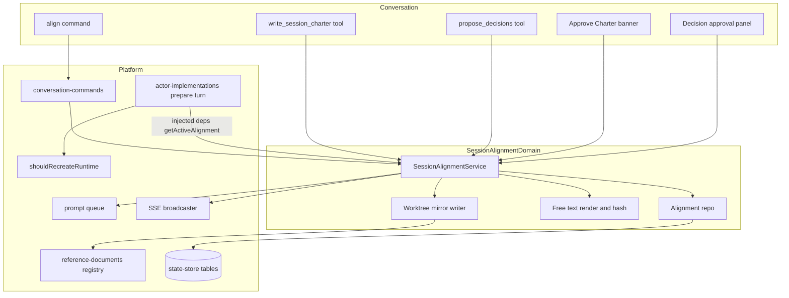
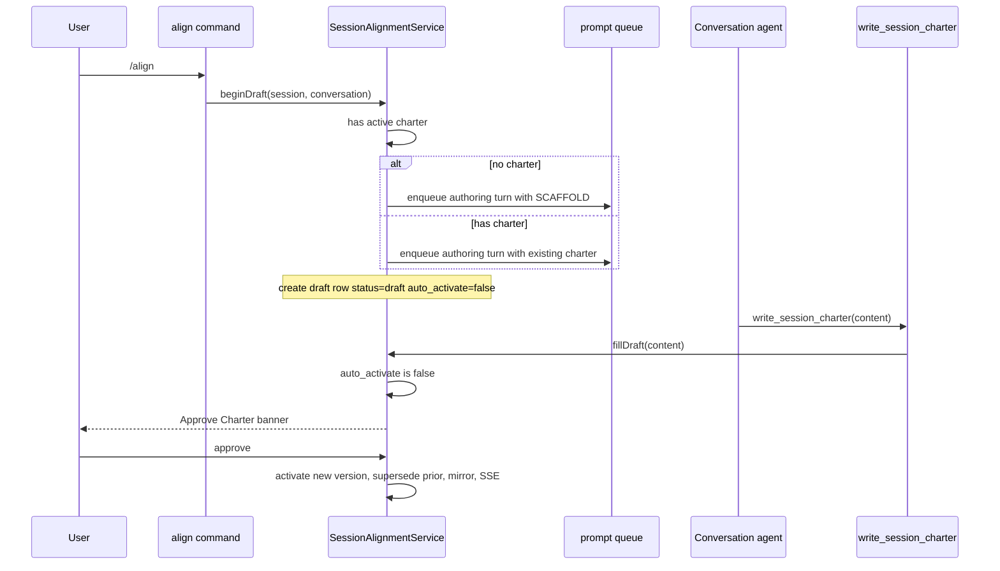
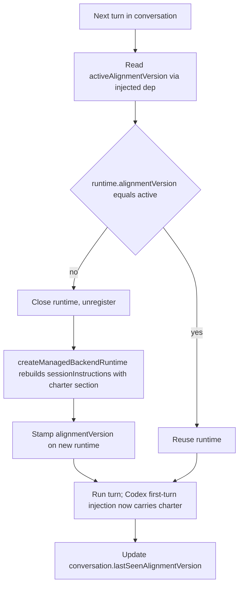
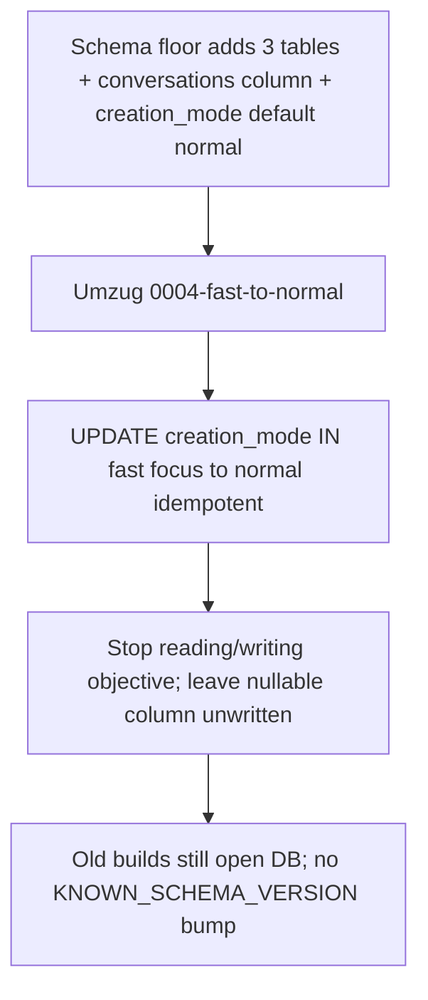

# Technical Design: Session Alignment

## Overview

This feature replaces Command Center's **focus mode** with a presence-based session-level **Alignment** capability. Today, sharing one objective across every conversation in a session requires choosing *focus mode at creation*; it cannot be enabled later, has no real authoring surface, and is bound to `creation_mode`. The new model decouples alignment from creation: a session may carry an agent-authored, free-text **Alignment charter** that can be created, approved, and evolved at any point, and that is delivered as **governing context** to every conversation turn — including turns in conversations whose runtime was already running.

**Users**: Command Center operators running multiple conversations in one session who need shared, evolving understanding (objective, decisions, constraints, non-goals) across those conversations.

**Impact**: Removes the `focus` creation mode and renames `fast` → `normal` (leaving `normal` + `optimistic`); deletes the `objective` field and its `<objective>` prompt injection; adds a dedicated `session-alignment` domain that owns charter versions, drafts, an approved-decision log, and decision proposals; rewires the per-turn prompt-composition seam and the runtime-recreation seam to guarantee mid-session propagation.

### Goals
- Presence-based alignment available on any `normal` session at any point in its life, independent of creation mode.
- Charter authoring/redrafting via an `/align` slash command behind an "Approve Charter" gate; evolution via bulk agent-proposed decisions that auto-fold into the charter on human approval.
- **Guaranteed** per-turn injection of the active charter as governing context, verified against the real runtime lifecycle (including already-running Claude **and** Codex runtimes).
- App state as the source of truth; versioned, auditable history with diff/rollback and a worktree mirror; reuse of existing UI/discovery surfaces (no parallel registry).

### Non-Goals
- Graph-workflow charters (the existing immutable mechanism is untouched and gains no competing alignment path).
- Alignment for `optimistic`/autonomous sessions; any auto-approval/auto-activation path that runs without a human approval.
- Manual charter editing (user markdown editor), manual "Log decision" capture, a required-schema charter template, an alignment workshop flow, a concurrency guard while a draft is open, a per-update charter diff/approval gate beyond decision approval, an agent-proposed-creation card/tool, child-session inheritance, project-level cascade, semantic-divergence health detection.
- Migration or draft-seeding of historical focus sessions.

## Boundary Commitments

### This Spec Owns
- The consolidated creation-mode contract (`normal`, `optimistic`) and the idempotent `creation_mode` data migration.
- The new `src/lib/session-alignment/` domain: charter version history, the single active version, the single pending draft, the append-only approved-decision log, transient decision proposals, and per-conversation seen-version tracking. **App state is authoritative.**
- The `SessionAlignmentService` governing semantics: draft creation, human/auto activation, decision approval → log → incorporation → auto-activate, free-text injection rendering (inline vs digest), per-version diff/rollback, and worktree-mirror materialization.
- The `/align` command behavior; the two agent-facing tools (`write_session_charter`, `propose_decisions`); the Alignment REST API; the Alignment UI surfaces (chip, panel, Approve-Charter banner, decision-approval panel, live preview).
- The injection contract change in the per-turn prompt-composition seam and the version-gated runtime-recreation change (replacing `<objective>` injection).
- Removal of the `objective` field from the domain schema, repo serialization, creation paths, chat-spawning, and prompt injection.

### Out of Boundary
- Graph-workflow charter schema/renderer/snapshot/materialization (`src/lib/workflow-graph/charter/*`, `src/lib/workflows/charter-schemas.ts`) — read for pattern reuse only; not modified.
- The AskUserQuestion blocking tool and its runtime resolver (`src/lib/conversations/ask-user-question-tool.ts`) — its **schema/UI shape** is reused; its runtime-blocking state authority is **not**.
- Reference-documents authority — alignment only **registers a mirror file** through it; it never becomes the source of truth.
- Backend turn-execution internals (`sendTurn`, Codex `buildPromptInput`) — unchanged; propagation rides the existing recreation path, not a new per-turn backend channel.

### Allowed Dependencies
- Per-turn prompt-composition seam (`actor-implementations.ts`) and the runtime-recreation seam — consumed via **dependency injection** only (new `deps` methods), never imported upward.
- Conversation-command machinery (`src/lib/conversation-commands/*`), the prompt queue (`src/lib/prompt/queue.ts`), AskUserQuestion UI primitives, `DocsPanel`/`RightPane`/`SessionInfoStrip`, the reference-documents registry (mirror registration), the state-store schema floor + Umzug migrations, and the SSE broadcaster.
- Internal dependency direction (strict, left-imports-only): **`schemas.ts` → `render.ts` → `repo.ts` → `service.ts` → {`route-handlers.ts`, `tools.ts`, `mutations.ts`/`queries.ts`} → UI**. `actor-implementations.ts` depends on the service **only via injected deps**.

### Revalidation Triggers
- Any change to the `sessionInstructions` assembly contract or its ordering.
- Any change to `shouldRecreateRuntime`'s signature or the runtime's tracked metadata shape (this design adds `alignmentVersion`).
- Any change to the conversation schema's `lastSeenAlignmentVersion` field.
- Any change to `sessionCreationModeSchema` or `createSessionRequestSchema`.
- Adding/altering the `SessionAlignmentUpdatedEvent` SSE type.
- Any change to the reference-document registration contract used for the mirror.

## Architecture

### Existing Architecture Analysis

- **Per-turn composition is not actually per-turn for session-wide context.** `sessionInstructions` (including `<objective>` and the reference-docs list) are assembled inside `createManagedBackendRuntime()` and **baked into the runtime once** (`actor-implementations.ts:1491-1505`). Claude bakes them into the query session's `systemPrompt.append`; Codex injects them only on its **first turn**; the per-turn dispatch path passes `sessionInstructions: []`. `shouldRecreateRuntime` (`:592-613`) only recreates on model/effort/outputFormat change. **A mid-session charter change cannot reach a live runtime today** — this is the load-bearing constraint for R7.
- **Reference documents are pointers, not content** (`reference_documents`: `id, project_path, session_name, file_path, description, created_at`, `UNIQUE(project,session,file_path)`, `ON DELETE CASCADE`). They cannot be the source of truth (R8.2).
- **Graph charter code is structured-schema-bound.** `renderCharterMarkdown`/`renderCharterPromptSection`/`computeCharterHash` operate on `WorkflowCharter` (required `mission`, `sourcesOfTruth`, etc.). Session alignment is free-text, so the *patterns* are reused via thin free-text functions; the structured code and the immutable `execution.charter` snapshot are not.
- **Reusable platform machinery exists**: conversation-command parse/dispatch/queue (one-command-at-a-time at the queue head), the prompt queue for auto-sent messages, the AskUserQuestion question/option/note schema + panel, `FocusConfirmationBar`/`ApprovalGatePanel` banner patterns, the state-store schema floor + additive columns + Umzug migrations, and the SSE broadcaster + `ScopedStatusEvent` union.

### Architecture Pattern & Boundary Map

Selected pattern: **dedicated authoritative domain + reused edges** (research Option C). A single deep `SessionAlignmentService` owns governing semantics over dedicated tables; everything else (command entry, agent tools, approval UI, discovery, injection) hooks existing seams.



**Key decisions** (full rationale in `research.md`):
- **Storage: dedicated tables, app state authoritative.** Version history, an append-only decision log, and transient proposals do not belong as JSON blobs on the session row, and reference docs cannot enforce source-of-truth. "No parallel registry" governs *discoverability* (we still reuse DocsPanel + reference-docs for the mirror), not the authority layer, which the requirements explicitly assign to `SessionAlignmentService`.
- **Propagation: version-gated runtime recreation**, not a per-turn preamble. Recreation reuses a proven seam, requires **no** backend-abstraction change, and is the **only** mechanism that propagates uniformly to Codex (whose first-turn-only injection ignores a post-turn-1 preamble). Charter changes are rare, so recreation cost is acceptable. (R7; verified by the regression test below.)
- **Free-text reuse, not structured reuse.** Adopt the digest+pointer framing and sha256 content hash as thin free-text helpers; do not force free-text through `WorkflowCharter`.
- **Unified draft row carries intent.** `/align` and decision-approval each create an empty `draft` version row; the agent's `write_session_charter` fills it. A draft's `auto_activate` flag (+ linked decision ids) decides whether filling it activates immediately (decision path) or waits for the human banner (`/align` path) — keeping gating in CC, not the agent (agent-offloading principle).

### Technology Stack

| Layer | Choice / Version | Role in Feature | Notes |
|-------|------------------|-----------------|-------|
| Frontend / UI | React 19, Tailwind v4, `@tanstack/react-query` | Alignment chip/panel, Approve-Charter banner, decision-approval panel, live preview | Reuse AskUserQuestion option/note primitives + `DocsPanel`/`RightPane`/`SessionInfoStrip` |
| Backend / Services | TypeScript (strict), Zod v4 | `SessionAlignmentService`, `/align` handler, agent tools, REST handlers | DI per project rules (no `vi.mock` of internal modules) |
| Data / Storage | better-sqlite3 (`command-center.db`, WAL) | 3 new tables + 1 additive conversations column | Schema floor for structural DDL; Umzug migration for `fast`→`normal` |
| Messaging / Events | SSE broadcaster | `SessionAlignmentUpdatedEvent`; React Query invalidation | New event type in the SSE union |
| Runtime | `@anthropic-ai/claude-agent-sdk`, Codex backend | Version-gated recreation carries the charter to live runtimes | Adds `alignmentVersion` to runtime tracked metadata |

## File Structure Plan

### Directory Structure
```
src/lib/session-alignment/                # NEW domain (authoritative)
├── schemas.ts            # Zod: version, status, decision, proposal, aggregate, request/response, SSE payload
├── render.ts             # Free-text injection renderer (inline vs digest), computeAlignmentHash, SCAFFOLD_TEMPLATE
├── repo.ts               # Repository over the 3 tables + seen-version accessor; round-trip serialization
├── service.ts            # SessionAlignmentService: draft/activate, decisions, injection, diff/rollback, mirror
├── mirror.ts             # Worktree mirror writer (.cc/session-alignment/charter.md) + reference-doc registration
├── tools.ts              # Agent-facing MCP tools: write_session_charter, propose_decisions
├── route-handlers.ts     # REST: GET state, charter approve/reject, decisions resolve, diff, rollback, preview
├── queries.ts            # React Query query factory
├── mutations.ts          # React Query mutation factory
├── query-keys.ts         # React Query key factory
├── service.test.ts       # Service unit tests (DI, pure helpers)
├── render.test.ts        # Inline-vs-digest + hash tests
├── repo.contract.test.ts # assertRoundTripDurability for the 3 tables
└── route-handlers.test.ts

src/features/session/conversation/        # UI surfaces (reuse existing feature)
├── AlignmentPanel.tsx    # Active / draft / history / decision-log / live preview (DocsPanel/RightPane tab)
├── AlignmentChip.tsx     # Header indicator: none / vN active / draft pending / stale
├── ApproveCharterBanner.tsx   # /align draft approval gate (FocusConfirmationBar pattern)
└── DecisionApprovalPanel.tsx  # Bulk approve/reject-with-feedback (AskUserQuestion UI shape)

src/app/api/projects/[name]/sessions/[session]/alignment/   # Router shells (thin re-exports)
├── route.ts                          # GET state
├── charter/approve/route.ts          # POST approve draft
├── charter/reject/route.ts           # POST reject draft
├── decisions/resolve/route.ts        # POST resolve proposal batch
├── diff/route.ts                     # GET per-version diff
└── rollback/route.ts                 # POST rollback to version
```

### Modified Files
- `src/lib/sessions/schemas.ts` — `sessionCreationModeSchema` → `z.enum(["normal","optimistic"])`, default `"normal"`; remove `objective` from `sessionStateSchema`; rewrite `createSessionRequestSchema` discriminated union (drop `focus`, `fast`→`normal`, keep `optimistic`); add `lastSeenAlignmentVersion: z.number().int().nullable().default(null)` to the conversation schema.
- `src/lib/sessions/service.ts` — rename `createSessionFast`→`createSessionNormal`; delete `createSessionFocus`, the `memory-bank/focus.md` write, the `initialization` conversation role, and all `objective` assignment; `createSessionOptimistic` no longer sets `objective` (instructions flow to the kickoff prompt path).
- `src/lib/sessions/route-handlers.ts` — dispatch `normal`/`optimistic`; reject any other mode with a 400.
- `src/lib/chat-spawning/spawn-service.ts` — remove the `objective` mapping; modes `normal`/`optimistic` only.
- `src/lib/state-store/state-db.ts` — add 3 `CREATE TABLE IF NOT EXISTS` floors; add `conversations.last_seen_alignment_version INTEGER` to `ADDITIVE_COLUMNS`; change `creation_mode` default to `'normal'`. (Leave the nullable `objective` column physically present but unwritten — see Migration Strategy.)
- `src/lib/state-store/sessions-repo.ts` / conversations serialization — drop `objective` from the column map and bind; (de)serialize `last_seen_alignment_version` ↔ `lastSeenAlignmentVersion`.
- `src/lib/state-store/migrations/0004-fast-to-normal.ts` (new) + `migrations/index.ts` — idempotent `UPDATE sessions SET creation_mode='normal' WHERE creation_mode IN ('fast','focus')`.
- `src/lib/workflows/conversation/actor-implementations.ts` — replace the `<objective>` entry (`:1499-1501`) with the alignment section from injected deps; add `ALIGN_SUGGESTION_INSTRUCTIONS` when no active charter; read `activeAlignmentVersion` before the recreate check and pass it to the extended `shouldRecreateRuntime`; stamp `alignmentVersion` on the created runtime; update `lastSeenAlignmentVersion` on turn completion.
- `src/lib/agent-backends/claude/conversation-runtime.ts` + Codex `conversation-runtime.ts` — accept and expose `alignmentVersion` on the runtime's tracked metadata (alongside `modelId`/`reasoningEffort`/`outputFormat`); no `sendTurn`/`buildPromptInput` change.
- `src/lib/conversation-commands/parse.ts` — add `"align"` to `COMMANDS`.
- `src/lib/conversation-commands/schemas.ts` — add `{ command: "align", hint }` union variant.
- `src/lib/conversation-commands/service.ts` — branch `align` to `SessionAlignmentService.beginDraft(...)` (compose scaffold/existing-charter instruction, create draft row, enqueue the authoring turn) instead of git-job dispatch.
- `src/features/project-detail/components/{CreateSessionModal,ModeDot,SessionRow}.tsx` — modes `normal`/`optimistic`; remove `focus` tab/badge/labels; default `normal`.
- `src/features/session/prompt/PromptEditorSlashCommandPopup.tsx` — add the `/align` suggestion to `BUILT_IN_CLAUDE_COMMANDS`.
- `src/components/conversation/ConversationPanel.tsx` — render `ApproveCharterBanner` + `DecisionApprovalPanel` (replacing the focus-confirmation wiring).
- `src/lib/api/sse-events.ts` — add `SessionAlignmentUpdatedEvent` to `SSEEvent`.
- Remove/retire `src/components/FocusConfirmationBar.tsx` focus wiring and focus-mode tests; update characterization tests asserting `focus`/`fast`.

## System Flows

### `/align` authoring and approval (R3, R4)


### Decision proposal → approval → auto-fold (R5, R6)
```mermaid
sequenceDiagram
  participant Agent
  participant PT as propose_decisions
  participant Svc as SessionAlignmentService
  participant U as User
  participant Q as prompt queue
  participant WT as write_session_charter
  Agent->>PT: propose_decisions(bulk)
  PT->>Svc: persist pending proposal batch (durable, NOT logged)
  PT-->>Agent: proposed, awaiting review
  U->>Svc: resolve batch (per-decision approve / reject+note)
  Svc->>Svc: append approved to decision log; discard rejected
  Svc->>Svc: create draft row auto_activate=true linked decisionIds
  Svc->>Q: auto-send incorporation message (approved) / feedback (rejected)
  Agent->>WT: write_session_charter(content)
  WT->>Svc: fillDraft(content)
  Svc->>Svc: auto_activate=true -> activate, set decisions.produced_version, mirror, SSE
```

### Guaranteed propagation to a running runtime (R7)


Recreation fires **before** a turn, never mid-generation, so "every subsequent turn — including in already-running conversations — is informed by the new version" (R7.3) without interrupting in-flight work.

## Requirements Traceability

| Requirement | Summary | Components | Interfaces / Flows |
|-------------|---------|------------|--------------------|
| 1.1–1.7 | Two creation modes; `fast`→`normal`; reject `focus` | `sessions/schemas`, `sessions/service`, `sessions/route-handlers`, `chat-spawning`, `CreateSessionModal`/`ModeDot`/`SessionRow`, migration `0004` | `createSessionRequestSchema`; Migration Strategy |
| 2.1–2.6 | Presence-based lifecycle; `/align` suggestion; "Alignment" label | `SessionAlignmentService`, `AlignmentChip`, `ALIGN_SUGGESTION_INSTRUCTIONS` | `getAlignmentState`; injection seam |
| 3.1–3.6 | `/align` drafts/redrafts; scaffold; no manual editor | `conversation-commands` (`align`), `service.beginDraft`, `tools.write_session_charter`, `render.SCAFFOLD_TEMPLATE` | `/align` flow |
| 4.1–4.5 | Approve-Charter gate; draft not injected; active unchanged | `ApproveCharterBanner`, `service.approveDraft`/`rejectDraft` | `POST charter/approve|reject`; `/align` flow |
| 5.1–5.7 | Bulk decision proposal/approval; auto-fold; no manual capture | `tools.propose_decisions`, `DecisionApprovalPanel`, `service.proposeDecisions`/`resolveProposals` | `POST decisions/resolve`; decision flow |
| 6.1–6.4 | Append-only approved decision log; not injected; reverse-chron UI | `session_alignment_decisions`, `AlignmentPanel` (log tab) | `getAlignmentState`; State Management |
| 7.1–7.5 | Inject every turn as governing context; guaranteed live propagation | `actor-implementations` (injection + recreate), runtime metadata, `render.renderAlignmentPromptSection` | Propagation flow; R7 regression test |
| 8.1–8.5 | Versioned history; app-state authority; mirror; seen-audit; diff/rollback | `session_alignment_versions`, `mirror.ts`, `service.diff`/`rollback`, conversation `lastSeenAlignmentVersion` | `GET diff`, `POST rollback` |
| 9.1–9.5 | Chip states; DocsPanel integration; panel; live preview; SSE | `AlignmentChip`, `AlignmentPanel`, `SessionAlignmentUpdatedEvent` | `GET state`/preview; SSE invalidation |
| 10.1–10.3 | Remove `objective` + injection; optimistic kickoff prompt | `sessions/schemas`/`service`, `actor-implementations` | Migration Strategy |
| 11.1–11.3 | Exactly two gate types; decision auto-activation still human-gated | `service` (only `approveDraft` + `resolveProposals` activate) | both flows |
| 12.1–12.3 | No graph-workflow/optimistic alignment; attended-only | tool/instruction gating in `actor-implementations`/`tools` | Boundary Commitments |

## Components and Interfaces

| Component | Domain/Layer | Intent | Req Coverage | Key Dependencies (P0/P1) | Contracts |
|-----------|--------------|--------|--------------|--------------------------|-----------|
| SessionAlignmentService | Service | Governing semantics: draft/activate, decisions, injection, diff/rollback, mirror | 2,3,4,5,6,7,8,10,11,12 | Repo (P0), render (P0), prompt queue (P0), SSE (P1), mirror (P1) | Service, State, Event |
| Alignment repo | Data | Durable CRUD over 3 tables + seen-version | 6,8 | state-store (P0) | State |
| Alignment render | Pure | Inline-vs-digest injection text; sha256 hash; scaffold | 3,7 | none | Service |
| Agent tools | Tooling | `write_session_charter`, `propose_decisions` | 3,5 | Service (P0), MCP composition (P0) | Service |
| Alignment route-handlers | API | REST for state/approve/reject/resolve/diff/rollback/preview | 4,5,6,8,9 | Service (P0) | API |
| `/align` command branch | Platform | Route `/align` to `beginDraft` | 3 | conversation-commands (P0), Service (P0) | Service |
| Injection + recreation hook | Platform | Replace `<objective>`; version-gated recreate; seen-update | 7,10 | Service via DI (P0), `shouldRecreateRuntime` (P0), backend runtime (P0) | Service, State |
| AlignmentChip / AlignmentPanel / ApproveCharterBanner / DecisionApprovalPanel | UI | State indicator, panel, gates | 4,5,6,9 | queries/mutations (P0), AskUserQuestion primitives (P1) | — |

### Service layer

#### SessionAlignmentService

| Field | Detail |
|-------|--------|
| Intent | Sole authority over a session's alignment state and governing semantics |
| Requirements | 2.x, 3.x, 4.x, 5.x, 6.x, 7.1–7.4, 8.x, 10.3, 11.x, 12.2–12.3 |

**Responsibilities & Constraints**
- Owns the invariant **≤1 `active` and ≤1 `draft` version per session**; activation is transactional (supersede prior active, assign next `version`, set decision `produced_version`, materialize mirror, broadcast SSE).
- Only two methods activate a charter: `approveDraft` (human banner) and `resolveProposals` with ≥1 approval (human decision) → both human-gated (R11). No other path mutates the active charter.
- Never stores unapproved decisions in the log; pending proposals live in the separate transient table and are deleted on resolution (R5.3, R6.1).
- Renders the injected section but does **not** inject the decision log (R6.3) and does **not** elevate reference docs (R7.5).
- Refuses all operations for `optimistic` sessions and project conversations (R12.2).

**Dependencies**
- Outbound: Alignment repo — persistence (P0); render — injection text + hash (P0); prompt queue — auto-sent incorporation/feedback messages (P0); mirror writer — `.cc` copy + ref-doc registration (P1); SSE broadcaster — `alignment-updated` (P1).
- Inbound: `/align` command branch, agent tools, route-handlers, injection deps (all P0/P1).

**Contracts**: Service [x] / API [ ] / Event [x] / Batch [ ] / State [x]

##### Service Interface
```typescript
type AlignmentVersionStatus = "draft" | "active" | "superseded";
type AlignmentVersionSource = "align_initial" | "align_rerun" | "decision" | "rollback";

interface AlignmentVersion {
  id: string;
  version: number | null;            // null while draft; assigned at activation
  content: string;                   // free-text markdown
  contentHash: string;
  status: AlignmentVersionStatus;
  source: AlignmentVersionSource;
  authorConversationId: string | null;
  autoActivate: boolean;             // draft created by decision approval
  linkedDecisionIds: string[];       // decisions this draft will resolve
  createdAt: string;
  activatedAt: string | null;
  approver: string | null;
}

interface AlignmentDecision {
  id: string;
  statement: string;
  rationale: string | null;
  originConversationId: string;
  originMessageId: string | null;
  producedVersion: number | null;
  approvedAt: string;
}

interface AlignmentState {
  active: AlignmentVersion | null;
  draft: AlignmentVersion | null;
  history: AlignmentVersion[];       // superseded + active, newest first
  decisions: AlignmentDecision[];    // reverse-chronological
  pendingProposals: DecisionProposalBatch[];
  preview: string | null;            // exact injected section for the active version
}

interface SessionAlignmentService {
  getState(projectPath: string, sessionName: string): Promise<AlignmentState>;
  // Cheap focused accessor for the per-turn recreate gate (returns active version number)
  getActiveVersion(projectPath: string, sessionName: string): Promise<number | null>;
  getActiveInjection(projectPath: string, sessionName: string): Promise<AlignmentInjection | null>;

  beginDraft(input: BeginDraftInput): Promise<{ authoringPrompt: string; draftId: string }>;
  fillDraft(input: FillDraftInput): Promise<{ status: "draft_ready" | "activated"; version: number | null }>;
  approveDraft(input: ApproveDraftInput): Promise<AlignmentVersion>;
  rejectDraft(input: RejectDraftInput): Promise<void>;

  proposeDecisions(input: ProposeDecisionsInput): Promise<{ batchId: string }>;
  resolveProposals(input: ResolveProposalsInput): Promise<{ approved: number; rejected: number }>;

  diff(projectPath: string, sessionName: string, from: number, to: number): Promise<AlignmentDiff>;
  rollback(input: RollbackInput): Promise<AlignmentVersion>;
}
```
- **Preconditions**: session exists, `creationMode === "normal"`, not a project conversation.
- **Postconditions**: after any activation, exactly one `active` row exists; the mirror equals its content; an `alignment-updated` event is broadcast.
- **Invariants**: the decision log is append-only and contains only approved decisions; drafts are never injected (R4.4).

##### Event Contract
- Published: `SessionAlignmentUpdatedEvent { type: "session-alignment-updated"; projectPath; sessionName; activeVersion: number | null; hasDraft: boolean; pendingProposalBatchIds: string[] }` on every activation, draft fill, proposal create, and proposal resolve.
- Delivery: broadcast best-effort via `broadcastEvent` (failures logged, never throw); clients invalidate the alignment query key on receipt.

##### State Management
- State model: see Data Models. Source of truth = the 3 tables + conversation `lastSeenAlignmentVersion`.
- Concurrency: v1 has **no draft concurrency guard** (explicitly out of scope). If `/align` runs while a decision draft is open (or vice-versa), the newer `beginDraft` replaces the open draft (documented last-writer-wins); the lost draft’s linked decisions remain in the log unresolved-by-version and re-incorporate on the next activation.

**Implementation Notes**
- Integration: `actor-implementations` consumes `getActiveVersion`/`getActiveInjection` via injected deps (method-syntax `Deps` interface, bivariant). The `/align` branch and tools call the service directly server-side.
- Validation: all tool inputs and REST bodies `safeParse` against `schemas.ts`; trusted internal reads `parse`.
- Risks: the auto-activate marker on the draft row can be lost on a mid-flight server restart → degrades to a manual Approve-Charter banner (safe). Documented, not guarded.

### Tooling layer

#### Agent-facing tools (`tools.ts`)
- `write_session_charter({ content: string })` — fills the session's open draft (`service.fillDraft`); if none open, creates a gated draft (defensive). Registered only for `normal` session conversations (not project, not autonomous). Maps to R3.6/R5.5.
- `propose_decisions({ decisions: Array<{ statement: string; rationale?: string; context?: string }> })` — **non-blocking** (returns immediately; does **not** reuse the AskUserQuestion blocking resolver), persists a durable pending batch, ends the turn. Maps to R5.1–R5.2. Gating identical to above (R12).

### Platform integration

#### Injection + version-gated recreation
- `shouldRecreateRuntime` gains an `alignmentVersion` comparison: recreate when `runtime.alignmentVersion !== activeAlignmentVersion` (in addition to model/effort/outputFormat). The runtime object carries `alignmentVersion: number | null` set at creation.
- `createManagedBackendRuntime` replaces the `<objective>` entry with `renderAlignmentPromptSection(...)` output when an active charter exists, and adds `ALIGN_SUGGESTION_INSTRUCTIONS` when it does not (R2.5, R7.1, R10.1).
- On turn completion the actor sets `conversation.lastSeenAlignmentVersion = activeAlignmentVersion` (R8.4, drives the stale chip state R9.1).

#### `/align` command branch
- `parse.ts`/`schemas.ts` recognize `/align`; the command service routes to `service.beginDraft`, which composes the authoring prompt (scaffold for first run; existing charter for rerun — R3.2/R3.4), creates the empty draft row, and enqueues the authoring turn. Follows the same one-command-at-a-time queue-head semantics as `/commit`/`/merge`. **Does not archive the conversation** (unlike focus initialization).

### UI layer (summary-only; reuse existing primitives)
- `AlignmentChip` — header indicator with four states (none `+ Alignment`, `Alignment vN active`, draft/update pending, stale). Slots into `SessionInfoStrip`.
- `AlignmentPanel` — active charter, current draft, version history, last-updated metadata, decision-log tab (reverse-chron), and the live preview of the exact injected section. Mounted as a `RightPane`/`DocsPanel` tab. *Implementation note:* preview calls `GET …/alignment` (`preview` field) so it renders byte-identical to what the runtime receives.
- `ApproveCharterBanner` — `FocusConfirmationBar`/`ApprovalGatePanel` pattern; approve/reject a draft.
- `DecisionApprovalPanel` — AskUserQuestion option/note UI shape (bulk; per-decision approve / reject-with-note) backed by durable proposal state, not a blocking resolver.

## Data Models

### Logical Data Model
- `session_alignment_versions` 1—N per session; **partial invariants** ≤1 `draft`, ≤1 `active` (enforced in service transactions). `version` is the monotonic activation index (NULL for drafts).
- `session_alignment_decisions` append-only; each links to its `origin_*` and to `produced_version`.
- `session_alignment_decision_proposals` transient; rows deleted on resolution; grouped by `batch_id`.
- `conversations.last_seen_alignment_version` — latest version a conversation’s turn ran with (stale detection); distinct from the decision log (R8.4).
- All session-scoped tables FK `(project_path, session_name)` → `sessions` `ON DELETE CASCADE`.

### Physical Data Model (SQLite, schema floor `CREATE TABLE IF NOT EXISTS`)
```sql
CREATE TABLE IF NOT EXISTS session_alignment_versions (
  id                     TEXT PRIMARY KEY,
  project_path           TEXT NOT NULL,
  session_name           TEXT NOT NULL,
  version                INTEGER,                 -- NULL while draft
  content                TEXT NOT NULL DEFAULT '',
  content_hash           TEXT NOT NULL DEFAULT '',
  status                 TEXT NOT NULL,           -- draft | active | superseded
  source                 TEXT NOT NULL,           -- align_initial | align_rerun | decision | rollback
  author_conversation_id TEXT,
  auto_activate          INTEGER NOT NULL DEFAULT 0,
  linked_decision_ids    TEXT NOT NULL DEFAULT '[]',  -- JSON array
  approver               TEXT,
  created_at             TEXT NOT NULL,
  activated_at           TEXT,
  FOREIGN KEY (project_path, session_name)
    REFERENCES sessions(project_path, session_name) ON DELETE CASCADE,
  UNIQUE (project_path, session_name, version)     -- NULLs are distinct in SQLite → many drafts ok historically
);

CREATE TABLE IF NOT EXISTS session_alignment_decisions (
  id                     TEXT PRIMARY KEY,
  project_path           TEXT NOT NULL,
  session_name           TEXT NOT NULL,
  statement              TEXT NOT NULL,
  rationale              TEXT,
  origin_conversation_id TEXT NOT NULL,
  origin_message_id      TEXT,
  produced_version       INTEGER,
  approved_at            TEXT NOT NULL,
  approver               TEXT,
  created_at             TEXT NOT NULL,
  FOREIGN KEY (project_path, session_name)
    REFERENCES sessions(project_path, session_name) ON DELETE CASCADE
);

CREATE TABLE IF NOT EXISTS session_alignment_decision_proposals (
  id                     TEXT PRIMARY KEY,
  project_path           TEXT NOT NULL,
  session_name           TEXT NOT NULL,
  conversation_id        TEXT NOT NULL,
  batch_id               TEXT NOT NULL,
  statement              TEXT NOT NULL,
  rationale              TEXT,
  context                TEXT,
  origin_message_id      TEXT,
  created_at             TEXT NOT NULL,
  FOREIGN KEY (project_path, session_name)
    REFERENCES sessions(project_path, session_name) ON DELETE CASCADE
);

-- additive column on the existing conversations table
ALTER TABLE conversations ADD COLUMN last_seen_alignment_version INTEGER;  -- via ADDITIVE_COLUMNS
```
Indexes: `(project_path, session_name, status)` on versions for active/draft lookup; `(project_path, session_name, approved_at)` on decisions for reverse-chron; `(project_path, session_name, batch_id)` on proposals.

### Data Contracts & Integration
- **API DTOs** mirror the `AlignmentState`/`AlignmentVersion`/`AlignmentDecision` interfaces (Zod-derived). `safeParse` on all inbound bodies.
- **Durability**: extend the schema-driven contract suite — a `repo.contract.test.ts` round-trips a maximal fixture for all three tables via `assertRoundTripDurability`, and the conversations contract gains `lastSeenAlignmentVersion`. Declare `version`/`producedVersion`/`activatedAt` nullability and `linkedDecisionIds` JSON in the policy map.

## Error Handling

### Error Strategy
- **User errors (4xx)**: unsupported creation mode → 400 (R1.7); `/align` or alignment ops on an `optimistic` session → 409 with guidance (R12.2); approve/reject a non-existent draft → 404; resolve a stale proposal batch → 409 (already resolved).
- **System errors (5xx)**: mirror write failure does **not** fail activation — app state stays authoritative; the failure is logged and the mirror is repaired on next read (R8.3). SSE broadcast failures are swallowed and logged.
- **Business-logic errors (422)**: tool `write_session_charter` with empty content → reject and re-prompt; `propose_decisions` with an empty array → reject.

### Monitoring
- Structured logging via `createLogger` for: `align.begin_draft`, `align.fill_draft`, `align.activate`, `align.decision_propose`, `align.decision_resolve`, `align.rollback`, `prompt.runtime_recreate{reason:"alignment_changed"}`. Each carries `projectPath`, `sessionName`, `version`, `conversationId`.

## Testing Strategy

### Unit Tests
- `render.test.ts`: inline below threshold vs digest+pointer above; governing-context preamble present; `computeAlignmentHash` stable across whitespace-normalization; scaffold contains the six soft-scaffold sections (3.2, 7.2).
- `service.test.ts` (DI, real-store persistence fixture): activation invariant (≤1 active/draft); decision approval appends to log + creates auto-activate draft + sets `produced_version`; reject-with-feedback discards + enqueues feedback, no charter change (5.3–5.6); rollback creates a new active version from old content (8.5).
- `shouldRecreateRuntime`: returns true on `alignmentVersion` mismatch, false when equal (7.3).

### Integration Tests
- **R7 propagation regression (load-bearing)**: with an alive runtime at `alignmentVersion=null`, activate version 1, send the next turn, assert the runtime was recreated and the rebuilt `sessionInstructions` contain the alignment section — run for **both** the Claude and Codex runtime types (Codex’s recreated first-turn injection must carry the charter). This is the test the requirements mandate before relying on the mechanism.
- `/align` first-run vs rerun: scaffold vs existing-charter authoring prompt; result is a draft; active charter unchanged until approval; conversation not archived (3.2–3.5, 4.3).
- Decision flow end-to-end through the real store + prompt queue: propose → resolve(approve) → incorporation message enqueued → fill → auto-activate → SSE emitted (5.x, 9.5).
- Migration `0004`: idempotent re-run maps `fast`/`focus`→`normal`, touches nothing else (1.4, 1.5).

### E2E / UI Tests
- Create-session modal shows exactly `normal`/`optimistic`, no `focus` (1.1, 1.2).
- Approve-Charter banner approve → chip shows `vN active`; reject leaves prior state (4.1–4.5, 9.1).
- Decision approval panel bulk approve/reject-with-note (5.2, 9.x).

## Migration Strategy



- **`fast`→`normal`**: idempotent Umzug migration (`0004`). Defensively also maps any lingering `focus` value (informational post-creation) so stale rows stay readable rather than tripping the read-validation quarantine. **This is enum-value hygiene, not the forbidden focus-session/`focus.md`-seeding migration** — no alignment state is derived from old focus sessions. *Flagged for sign-off.*
- **`objective` removal**: logical removal — drop from the domain schema, repo column map, and injection; leave the **nullable** physical `objective` column in place, unwritten (next write binds nothing → NULL). Forward/backward-compatible; **no** `KNOWN_SCHEMA_VERSION` bump, no brick risk. (Alternative — physical column drop via table rebuild — rejected as a breaking change with no benefit.)
- New tables/column are purely additive (schema floor + `ADDITIVE_COLUMNS`); fresh and `:memory:` DBs are current with no async step.

## Security Considerations
- Charter content is operator-authored, agent-mediated free text injected into system prompts; treat as trusted session-scoped content (same trust level as the former `objective`). No new external surface.
- Agent tools and the `/align` instruction are gated to attended `normal` session conversations (not project, not autonomous) so an autonomous run can never propose/activate alignment (R12.3).

## Performance & Scalability
- Per-turn cost is one cheap focused read (`getActiveVersion` → integer) before the recreate gate, per the PERFORMANCE.md focused-accessor pattern; full content/injection is fetched only when (re)creating a runtime. Recreation occurs only when the version actually advanced (rare), not every turn.
- Mirror materialization happens on activation/update + repair-if-missing, never per turn (R8 / steering).
